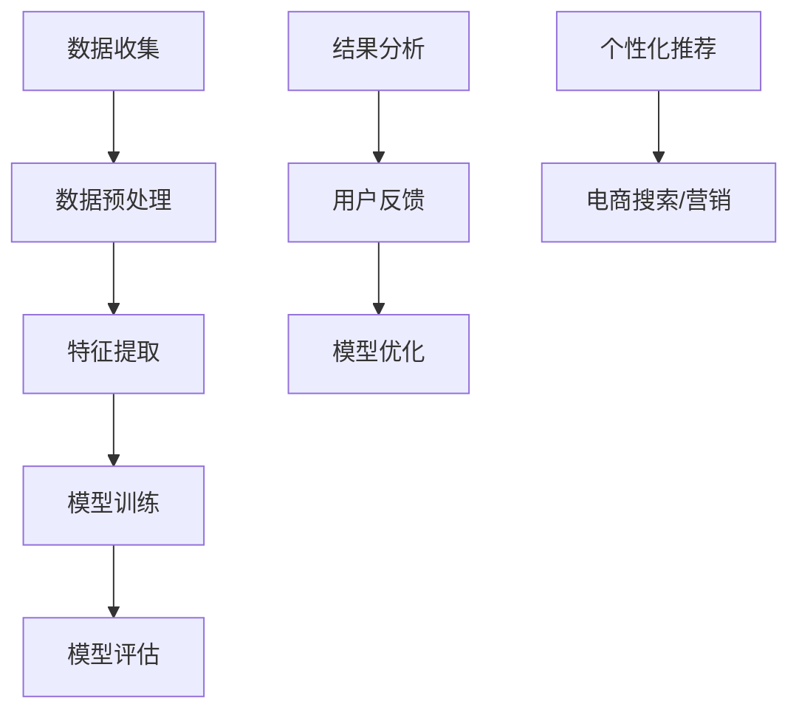
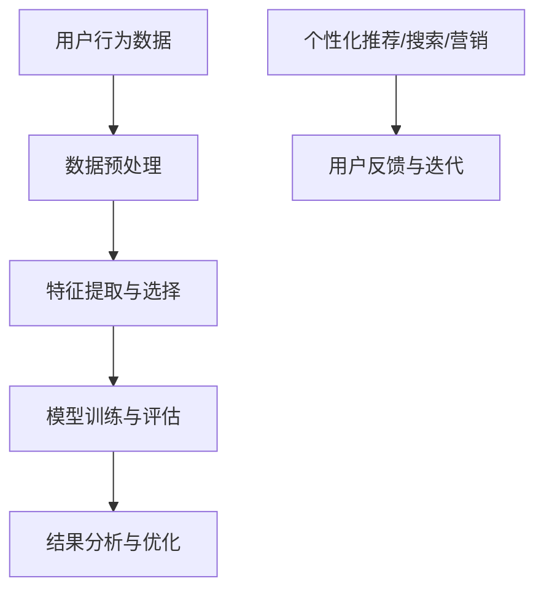

                 

## 文章标题

《大模型技术在电商平台用户偏好挖掘中的创新》

### 关键词

- 大模型技术
- 用户偏好挖掘
- 电商平台
- 个性化推荐
- 深度学习
- 自然语言处理
- 模型优化

### 摘要

本文深入探讨了如何利用大模型技术来提升电商平台用户偏好挖掘的准确性和个性化水平。通过详细分析大模型技术的基本概念、核心算法以及应用原理，本文展示了大模型在用户行为数据预处理、特征提取、模型训练与优化等方面的创新应用。同时，通过实践案例解析和最佳实践总结，本文为开发者在电商平台用户偏好挖掘中的项目实施提供了具体的指导和策略。此外，本文还探讨了当前面临的挑战和未来的发展趋势，为开发者指明了进一步研究方向。

### 第一部分：大模型技术在电商平台用户偏好挖掘中的应用

#### 第一部分概述

在本部分的引言中，我们将首先介绍大模型技术的基本背景和快速发展情况，阐述电商平台用户偏好挖掘的重要性。随后，我们将详细讨论大模型技术的基本概念、核心特点以及应用领域，为后续内容奠定基础。

##### 1.1 书籍背景与目的

**1.1.1 大模型技术的快速发展**

近年来，随着人工智能技术的飞速发展，大模型技术逐渐成为研究热点。大模型技术是指使用大规模神经网络模型进行复杂任务的处理，包括自然语言处理、计算机视觉、语音识别等。这种技术依赖于海量数据和强大的计算能力，通过深度学习等方法不断优化模型性能，实现了许多前所未有的突破。

**1.1.2 电商平台用户偏好的重要性**

电商平台作为数字经济的重要组成部分，用户偏好挖掘是提升用户体验和转化率的关键。通过对用户行为数据进行分析，挖掘用户的偏好，电商平台可以实现个性化推荐、精准营销等，从而提高用户满意度和忠诚度。

**1.1.3 本书的主要内容与结构**

本书旨在系统介绍大模型技术在电商平台用户偏好挖掘中的应用，内容主要包括：

- 大模型技术的基本概念与核心特点
- 电商平台用户偏好的定义与类型
- 大模型技术在用户偏好挖掘中的应用原理
- 大模型技术在用户偏好挖掘中的核心算法
- 大模型技术在电商平台的创新应用案例
- 大模型技术在用户偏好挖掘中的挑战与未来趋势

##### 1.2 大模型技术概述

**1.2.1 大模型技术的基本概念**

大模型技术是指使用大规模神经网络模型进行复杂任务的处理。这些模型通常具有数百万至数十亿个参数，能够通过深度学习等方法从海量数据中自动学习特征和模式。

**1.2.2 大模型技术的核心特点**

大模型技术具有以下核心特点：

- **参数规模大**：大模型具有数百万至数十亿个参数，能够处理复杂的任务。
- **学习能力强大**：大模型能够从海量数据中自动学习特征和模式，实现高精度的预测。
- **适用范围广泛**：大模型技术适用于自然语言处理、计算机视觉、语音识别等多个领域。
- **计算资源需求高**：大模型需要强大的计算能力和海量数据支持。

**1.2.3 大模型技术的应用领域**

大模型技术已在多个领域取得显著成果，包括：

- **自然语言处理**：例如，机器翻译、文本分类、情感分析等。
- **计算机视觉**：例如，图像识别、目标检测、图像生成等。
- **语音识别**：例如，语音识别、语音合成等。
- **电商平台**：例如，用户偏好挖掘、个性化推荐、精准营销等。

##### 1.3 电商平台用户偏好的概述

**1.3.1 用户偏好的定义**

用户偏好是指用户在特定情境下对某一对象（如商品、服务、信息等）的偏好程度或倾向。在电商平台上，用户偏好可以通过用户行为数据（如浏览记录、购买记录、评价等）进行挖掘和分析。

**1.3.2 用户偏好的类型与层次**

用户偏好可以分为以下几种类型：

- **内容偏好**：如用户喜欢的商品类型、品牌、颜色等。
- **行为偏好**：如用户浏览习惯、购买频率、评价倾向等。
- **情感偏好**：如用户对商品的喜爱程度、满意度等。

用户偏好通常具有多个层次，从浅层次的浏览记录到深层次的兴趣偏好，形成一个层次化的偏好结构。

**1.3.3 电商平台用户偏好的重要性**

电商平台用户偏好挖掘具有重要意义，主要体现在以下几个方面：

- **个性化推荐**：通过挖掘用户偏好，实现个性化推荐，提高用户满意度。
- **精准营销**：基于用户偏好进行精准营销，提高转化率和销售额。
- **用户行为预测**：预测用户行为，提前布局业务策略，提升业务运营效率。
- **用户满意度提升**：提供更加个性化的服务，提高用户忠诚度和口碑。

#### 第一部分总结

本部分引言详细介绍了大模型技术的基本背景、应用领域以及电商平台用户偏好的重要性。接下来，我们将进一步探讨大模型技术的基本概念、核心特点，以及大模型在用户偏好挖掘中的应用原理。通过这一部分的内容，读者将对该领域的核心技术及其应用有一个全面的了解。

---

### 《大模型技术在电商平台用户偏好挖掘中的创新》

#### 第一部分：大模型技术在电商平台用户偏好挖掘中的应用

**第1章：引言**

**1.1 书籍背景与目的**

**1.1.1 大模型技术的快速发展**

大模型技术作为人工智能领域的核心驱动力之一，近年来取得了显著的进展。从早期的简单神经网络到如今的Transformer模型，大模型在参数规模、计算效率和性能方面都有了质的飞跃。这一发展得益于计算能力的提升、海量数据资源的积累以及深度学习算法的创新。如今，大模型技术已经在自然语言处理、计算机视觉、语音识别等领域取得了广泛应用，成为推动人工智能技术发展的重要力量。

**1.1.2 电商平台用户偏好的重要性**

在电商平台上，用户偏好挖掘是提升用户体验和转化率的关键。用户偏好不仅影响用户的购物决策，还对电商平台的运营策略具有指导意义。通过深入挖掘用户偏好，电商平台可以实现个性化推荐、精准营销、用户行为预测等，从而提高用户满意度、忠诚度和销售额。

**1.1.3 本书的主要内容与结构**

本书旨在系统介绍大模型技术在电商平台用户偏好挖掘中的应用，内容结构如下：

- **第1章：引言**：介绍大模型技术的背景和电商平台用户偏好的重要性。
- **第2章：大模型技术概述**：讨论大模型技术的基本概念、核心特点和应用领域。
- **第3章：大模型技术在用户偏好挖掘中的应用原理**：探讨大模型技术在用户偏好挖掘中的核心概念、流程与挑战。
- **第4章：大模型技术在用户偏好挖掘中的核心算法**：介绍深度学习、自然语言处理和多模态数据在用户偏好挖掘中的应用。
- **第5章：大模型技术在电商平台用户偏好挖掘中的创新应用**：分析大模型技术在电商搜索、推荐和营销中的具体应用。
- **第6章：实践案例解析**：通过具体案例展示大模型技术在用户偏好挖掘中的实战应用。
- **第7章：大模型技术在电商平台用户偏好挖掘中的挑战与未来趋势**：讨论当前面临的挑战和未来的发展趋势。

**1.2 大模型技术概述**

**1.2.1 大模型技术的基本概念**

大模型技术是指使用大规模神经网络模型进行复杂任务的处理。这些模型通常具有数百万至数十亿个参数，通过深度学习等方法从海量数据中自动学习特征和模式。大模型技术的基本概念包括以下几个方面：

- **参数规模**：大模型具有数百万至数十亿个参数，能够处理复杂的任务。
- **数据依赖**：大模型依赖于海量数据资源，通过数据驱动的方式学习特征和模式。
- **模型结构**：大模型通常采用深度神经网络结构，通过多层次的非线性变换学习复杂的数据表示。
- **训练方法**：大模型采用端到端训练方法，从原始数据中直接学习目标特征和模式。

**1.2.2 大模型技术的核心特点**

大模型技术具有以下核心特点：

- **参数规模大**：大模型具有数百万至数十亿个参数，能够处理复杂的任务。
- **学习能力强大**：大模型能够从海量数据中自动学习特征和模式，实现高精度的预测。
- **适用范围广泛**：大模型技术适用于自然语言处理、计算机视觉、语音识别等多个领域。
- **计算资源需求高**：大模型需要强大的计算能力和海量数据支持。

**1.2.3 大模型技术的应用领域**

大模型技术已在多个领域取得显著成果，包括：

- **自然语言处理**：例如，机器翻译、文本分类、情感分析等。
- **计算机视觉**：例如，图像识别、目标检测、图像生成等。
- **语音识别**：例如，语音识别、语音合成等。
- **电商平台**：例如，用户偏好挖掘、个性化推荐、精准营销等。

**1.3 电商平台用户偏好的概述**

**1.3.1 用户偏好的定义**

用户偏好是指用户在特定情境下对某一对象（如商品、服务、信息等）的偏好程度或倾向。在电商平台上，用户偏好可以通过用户行为数据（如浏览记录、购买记录、评价等）进行挖掘和分析。

**1.3.2 用户偏好的类型与层次**

用户偏好可以分为以下几种类型：

- **内容偏好**：如用户喜欢的商品类型、品牌、颜色等。
- **行为偏好**：如用户浏览习惯、购买频率、评价倾向等。
- **情感偏好**：如用户对商品的喜爱程度、满意度等。

用户偏好通常具有多个层次，从浅层次的浏览记录到深层次的兴趣偏好，形成一个层次化的偏好结构。

**1.3.3 电商平台用户偏好的重要性**

电商平台用户偏好挖掘具有重要意义，主要体现在以下几个方面：

- **个性化推荐**：通过挖掘用户偏好，实现个性化推荐，提高用户满意度。
- **精准营销**：基于用户偏好进行精准营销，提高转化率和销售额。
- **用户行为预测**：预测用户行为，提前布局业务策略，提升业务运营效率。
- **用户满意度提升**：提供更加个性化的服务，提高用户忠诚度和口碑。

**第1章总结**

本章引言详细介绍了大模型技术的快速发展、电商平台用户偏好的重要性以及本书的主要内容与结构。接下来，我们将进一步探讨大模型技术的基本概念、核心特点和应用领域，为后续内容的讨论奠定基础。

---

### **《大模型技术在电商平台用户偏好挖掘中的创新》**

#### 第一部分：大模型技术在电商平台用户偏好挖掘中的应用

**第2章：大模型技术在用户偏好挖掘中的应用原理**

**2.1 大模型技术在用户偏好挖掘中的核心概念**

在用户偏好挖掘中，大模型技术的应用涉及多个核心概念，包括自然语言处理（NLP）、机器学习（ML）和深度学习（DL）。这些概念相互作用，共同推动用户偏好挖掘的进步。

**自然语言处理（NLP）**：自然语言处理是计算机科学和人工智能领域的一个分支，专注于使计算机能够理解、解释和生成自然语言。在用户偏好挖掘中，NLP技术被用于处理和分析用户生成的文本数据，如评价、评论、聊天记录等。NLP的关键技术包括文本预处理、词嵌入、语言模型和文本分类等。

**机器学习（ML）**：机器学习是一种通过数据学习模式并做出预测或决策的技术。在用户偏好挖掘中，ML算法被用于分析用户行为数据，识别用户偏好模式。常见的ML算法包括线性回归、逻辑回归、支持向量机（SVM）等。这些算法可以从历史数据中学习，并预测新数据的偏好。

**深度学习（DL）**：深度学习是一种基于人工神经网络的机器学习技术，通过多层网络结构自动提取特征并做出预测。在用户偏好挖掘中，DL算法（如卷积神经网络（CNN）、循环神经网络（RNN）、长短期记忆网络（LSTM）和Transformer模型等）被广泛使用。这些算法可以从大量数据中学习复杂的非线性关系，提高偏好挖掘的准确性。

**2.2 用户偏好挖掘的流程与挑战**

用户偏好挖掘通常包括以下基本流程：

1. **数据收集**：收集用户的行为数据，包括浏览历史、购买记录、评价等。
2. **数据预处理**：清洗和规范化数据，处理缺失值、噪声和异常值。
3. **特征提取**：从原始数据中提取有用特征，如文本特征、用户行为特征和上下文特征。
4. **模型训练**：选择合适的机器学习或深度学习模型，训练模型以识别用户偏好。
5. **模型评估**：评估模型的性能，通过交叉验证、A/B测试等方法确定最佳模型。
6. **结果分析**：分析模型预测结果，调整模型参数以优化性能。

在用户偏好挖掘过程中，面临以下挑战：

1. **数据隐私保护**：用户数据通常包含敏感信息，如何保护用户隐私是一个重要问题。需要采取数据加密、匿名化和隐私保护算法等技术。
2. **数据质量**：用户行为数据可能存在缺失、噪声和异常值，影响模型训练和预测准确性。需要采用数据清洗和异常检测方法。
3. **特征选择**：从大量特征中选出对用户偏好挖掘最有影响力的特征是一个复杂的问题。需要采用特征选择算法，如基于信息增益、主成分分析（PCA）等。
4. **模型可解释性**：深度学习模型通常具有很好的预测性能，但其内部机制复杂，难以解释。如何提高模型的可解释性，帮助用户理解模型的决策过程，是一个重要挑战。
5. **计算资源**：大模型训练需要大量计算资源和时间，如何在有限资源下高效训练模型是一个难题。可以采用分布式计算、模型压缩和迁移学习等技术。

**2.3 大模型技术在解决挑战中的优势**

大模型技术在解决用户偏好挖掘中的挑战方面具有显著优势：

1. **强大的数据学习能力**：大模型能够从海量数据中自动学习复杂的特征和模式，提高偏好挖掘的准确性。
2. **高可解释性**：通过优化模型结构和训练方法，可以提高深度学习模型的可解释性，帮助用户理解模型的决策过程。
3. **高效的特征提取**：大模型能够自动从原始数据中提取高层次的抽象特征，减少特征工程的工作量。
4. **分布式计算能力**：大模型支持分布式计算，可以在有限资源下高效训练大型模型。
5. **模型压缩和迁移学习**：大模型可以通过模型压缩和迁移学习技术在资源受限的环境下进行优化和部署。

**2.4 大模型技术在用户偏好挖掘中的应用框架**

大模型技术在用户偏好挖掘中的应用框架主要包括以下几个步骤：

1. **数据收集**：收集用户的行为数据，包括浏览历史、购买记录、评价等。
2. **数据预处理**：清洗和规范化数据，处理缺失值、噪声和异常值。
3. **特征提取**：从原始数据中提取有用特征，包括文本特征、用户行为特征和上下文特征。
4. **模型训练**：选择合适的机器学习或深度学习模型，进行模型训练。
5. **模型评估**：评估模型性能，通过交叉验证、A/B测试等方法确定最佳模型。
6. **结果分析**：分析模型预测结果，调整模型参数以优化性能。
7. **结果应用**：将模型应用于实际场景，如个性化推荐、精准营销等。

**2.5 大模型技术在用户偏好挖掘中的典型应用**

1. **个性化推荐**：利用用户偏好挖掘技术，实现个性化商品推荐，提高用户满意度和转化率。
2. **精准营销**：基于用户偏好进行精准营销，提高广告投放效果和销售额。
3. **用户行为预测**：预测用户行为，如购买、浏览、评价等，帮助电商平台制定业务策略。
4. **智能客服**：结合用户偏好和自然语言处理技术，提供智能客服服务，提高客户满意度。

**2.6 大模型技术在用户偏好挖掘中的案例研究**

1. **案例一：亚马逊个性化推荐**：亚马逊利用用户偏好挖掘技术，为用户提供个性化商品推荐，显著提高了用户满意度和转化率。
2. **案例二：淘宝用户行为预测**：淘宝利用深度学习模型预测用户行为，提前布局业务策略，提高销售额和用户满意度。
3. **案例三：美团点评精准营销**：美团点评基于用户偏好进行精准营销，实现广告投放效果的最大化。

**第2章总结**

本章详细介绍了大模型技术在用户偏好挖掘中的应用原理，包括核心概念、流程与挑战。通过本章的内容，读者可以了解大模型技术在用户偏好挖掘中的应用框架、优势和典型应用案例。这些知识将为后续章节的分析和讨论提供坚实的基础。

---

### **《大模型技术在电商平台用户偏好挖掘中的创新》**

#### 第一部分：大模型技术在电商平台用户偏好挖掘中的应用

**第3章：大模型技术在用户偏好挖掘中的核心算法**

**3.1 基于深度学习的用户偏好挖掘算法**

深度学习算法在用户偏好挖掘中发挥着重要作用。以下将介绍几种常见的深度学习算法及其在用户偏好挖掘中的应用。

**1. 深度神经网络（DNN）**

深度神经网络是一种多层前馈神经网络，通过多层次的非线性变换来提取特征。在用户偏好挖掘中，DNN可以用于分类和回归任务。例如，可以使用DNN预测用户的购买概率或评分。

**算法原理：**

给定输入特征向量 $x$ 和权重参数 $\theta$，DNN的输出可以通过以下公式计算：

$$
h(x;\theta) = \sigma(\theta^T x),
$$

其中，$\sigma$ 是激活函数（如Sigmoid函数或ReLU函数），$h(x;\theta)$ 是模型的预测输出。

**伪代码：**

```python
def deep_neural_network(x, theta):
    z = x @ theta
    return sigmoid(z)
```

**2. 卷积神经网络（CNN）**

卷积神经网络是一种基于卷积操作的神经网络，特别适用于处理图像数据。在用户偏好挖掘中，CNN可以用于图像分类、目标检测等任务。例如，可以使用CNN分析用户评价中的情感倾向。

**算法原理：**

CNN通过卷积层、池化层和全连接层来提取图像特征。卷积层使用卷积核对输入数据进行局部特征提取，池化层用于降低特征图的维度，全连接层用于分类或回归。

**伪代码：**

```python
def conv_neural_network(x):
    # 卷积层
    conv_output = conv2d(x, filter)
    # 池化层
    pooled_output = max_pooling(conv_output)
    # 全连接层
    output = fully_connected(pooled_output, output_size)
    return output
```

**3. 循环神经网络（RNN）**

循环神经网络是一种具有循环结构的神经网络，特别适用于处理序列数据。在用户偏好挖掘中，RNN可以用于序列分类、语言模型等任务。例如，可以使用RNN分析用户的历史行为序列。

**算法原理：**

RNN通过在时间步上递归更新状态来处理序列数据。给定输入序列 $x$ 和隐藏状态 $h_t$，RNN的输出可以通过以下公式计算：

$$
h_{t+1} = \sigma(W_h h_t + W_x x_t + b),
$$

$$
y_t = \sigma(W_y h_t + b),
$$

其中，$W_h$、$W_x$ 和 $W_y$ 是权重矩阵，$b$ 是偏置项，$\sigma$ 是激活函数。

**伪代码：**

```python
def recurrent_neural_network(x, h_t):
    h_t = activation(W_h * h_t + W_x * x + b)
    y = activation(W_y * h_t + b)
    return h_t, y
```

**4. 长短期记忆网络（LSTM）**

长短期记忆网络是一种改进的循环神经网络，能够有效处理长序列数据。在用户偏好挖掘中，LSTM可以用于序列预测、用户行为分析等任务。

**算法原理：**

LSTM通过引入门控机制来控制信息的流动，避免了梯度消失和梯度爆炸问题。给定输入序列 $x$ 和隐藏状态 $h_t$，LSTM的输出可以通过以下公式计算：

$$
i_t = \sigma(W_i x_t + U_i h_{t-1} + b_i),
$$

$$
f_t = \sigma(W_f x_t + U_f h_{t-1} + b_f),
$$

$$
\tilde{c}_t = \sigma(W_c x_t + U_c h_{t-1} + b_c),
$$

$$
o_t = \sigma(W_o x_t + U_o h_{t-1} + b_o),
$$

$$
c_t = f_t \odot c_{t-1} + i_t \odot \tilde{c}_t,
$$

$$
h_t = o_t \odot c_t,
$$

$$
y_t = \sigma(W_y h_t + b_y).
$$

其中，$i_t$、$f_t$、$\tilde{c}_t$、$o_t$ 和 $c_t$ 分别是输入门、遗忘门、候选状态、输出门和细胞状态，$\odot$ 是逐元素乘法操作。

**伪代码：**

```python
def lstm(x, h_t):
    i = sigmoid(W_i * x + U_i * h_{t-1} + b_i)
    f = sigmoid(W_f * x + U_f * h_{t-1} + b_f)
    tilde_c = sigmoid(W_c * x + U_c * h_{t-1} + b_c)
    o = sigmoid(W_o * x + U_o * h_{t-1} + b_o)
    c = f * c_{t-1} + i * tilde_c
    h = o * c
    y = sigmoid(W_y * h + b_y)
    return h, c
```

**3.2 基于自然语言处理的用户偏好挖掘算法**

自然语言处理技术在用户偏好挖掘中具有广泛的应用。以下将介绍几种常见的NLP算法及其在用户偏好挖掘中的应用。

**1. 词嵌入（Word Embedding）**

词嵌入是一种将单词映射为向量表示的方法，用于处理文本数据。在用户偏好挖掘中，词嵌入可以用于分析用户评价和评论。

**算法原理：**

词嵌入通常通过神经网络训练得到，给定输入单词序列 $x$，词嵌入模型输出单词的向量表示：

$$
e_w = \text{Embedding}(w),
$$

其中，$e_w$ 是单词 $w$ 的向量表示。

**伪代码：**

```python
def word_embedding(w):
    return embedding_matrix[w]
```

**2. 文本分类（Text Classification）**

文本分类是一种将文本数据分类到预定义类别中的任务。在用户偏好挖掘中，文本分类可以用于分析用户评价和评论的情感倾向。

**算法原理：**

文本分类通常采用基于向量空间模型的方法，将文本转换为向量表示，然后使用分类算法（如朴素贝叶斯、逻辑回归、支持向量机等）进行分类。

**伪代码：**

```python
def text_classification(x, model):
    x_vector = word_embedding(x)
    return model.predict(x_vector)
```

**3. 情感分析（Sentiment Analysis）**

情感分析是一种评估文本情感极性的方法，通常用于分析用户评价和评论的情感倾向。

**算法原理：**

情感分析通常采用基于深度学习的方法，如LSTM或Transformer模型，从文本中提取情感特征，然后进行分类。

**伪代码：**

```python
def sentiment_analysis(text, model):
    text_vector = lstm(text, h_0)
    return model.predict(text_vector)
```

**3.3 基于多模态数据的用户偏好挖掘算法**

多模态数据是指包含多种类型的数据（如文本、图像、音频等）。在用户偏好挖掘中，多模态数据可以提供更丰富的信息，有助于提高偏好挖掘的准确性。

**1. 多模态融合（Multimodal Fusion）**

多模态融合是一种将不同类型的数据进行整合的方法，以提高偏好挖掘的准确性。

**算法原理：**

多模态融合通常采用特征级或决策级融合方法。特征级融合方法将不同类型的数据特征进行整合，然后输入到单一模型中。决策级融合方法将多个模型的决策结果进行整合，得到最终的预测结果。

**伪代码：**

```python
def multimodal_fusion(text_vector, image_vector, model):
    fusion_vector = concatenate(text_vector, image_vector)
    return model.predict(fusion_vector)
```

**2. 多模态用户偏好挖掘算法**

多模态用户偏好挖掘算法结合不同类型的数据，以挖掘用户的综合偏好。以下是一个简单的多模态用户偏好挖掘算法：

**算法原理：**

多模态用户偏好挖掘算法通常包括以下步骤：

1. 对不同类型的数据进行预处理，提取特征。
2. 将特征进行整合，生成多模态特征向量。
3. 使用深度学习模型进行偏好预测。

**伪代码：**

```python
def multimodal_user_preferenceMining(text, image, audio, model):
    text_vector = word_embedding(text)
    image_vector = image_embedding(image)
    audio_vector = audio_embedding(audio)
    fusion_vector = concatenate(text_vector, image_vector, audio_vector)
    return model.predict(fusion_vector)
```

**第3章总结**

本章介绍了大模型技术在用户偏好挖掘中的核心算法，包括深度学习算法、自然语言处理算法和多模态数据融合算法。通过本章的内容，读者可以了解不同算法的基本原理、伪代码和应用场景，为后续的实际应用提供理论基础。

---

### **《大模型技术在电商平台用户偏好挖掘中的创新》**

#### 第一部分：大模型技术在电商平台用户偏好挖掘中的应用

**第4章：大模型技术在电商平台用户偏好挖掘中的创新应用**

**4.1 大模型技术在电商搜索中的应用**

电商搜索是电商平台提供的一项重要服务，用户可以通过关键词或商品属性快速找到所需商品。大模型技术在电商搜索中的应用，可以显著提升搜索的准确性和用户体验。

**1. 搜索引擎优化**

大模型技术可以通过深度学习模型对搜索引擎进行优化，提高搜索结果的准确性和相关性。例如，可以使用卷积神经网络（CNN）对商品标题和描述进行特征提取，然后使用这些特征对搜索查询进行匹配。

**算法原理：**

- **特征提取**：使用CNN对商品标题和描述进行特征提取，生成商品向量和查询向量。
- **匹配算法**：使用余弦相似度或余弦距离等度量方法，计算商品向量和查询向量之间的相似度，从而确定搜索结果的相关性。

**伪代码：**

```python
def search_engine_optimization(title, description, query):
    # 特征提取
    title_vector = cnn_feature_extraction(title)
    description_vector = cnn_feature_extraction(description)
    query_vector = cnn_feature_extraction(query)
    # 匹配算法
    similarity = cosine_similarity(title_vector, query_vector)
    return sorted(similarity, reverse=True)
```

**2. 基于用户偏好的搜索结果排序**

除了搜索引擎优化，大模型技术还可以用于基于用户偏好的搜索结果排序。例如，可以使用用户历史搜索记录、购买记录和评价等数据，通过深度学习模型预测用户对搜索结果的偏好，然后对搜索结果进行个性化排序。

**算法原理：**

- **用户偏好预测**：使用深度学习模型（如RNN或LSTM）分析用户历史行为数据，预测用户对搜索结果的偏好。
- **搜索结果排序**：根据用户偏好预测结果对搜索结果进行排序，提高用户体验。

**伪代码：**

```python
def personalized_search_results_sorting(user_history, search_results):
    # 用户偏好预测
    preference_vector = rnn_preference_prediction(user_history)
    # 搜索结果排序
    sorted_results = sort_by_preference(preference_vector, search_results)
    return sorted_results
```

**案例解析**

**案例一：亚马逊商品搜索**

亚马逊通过大模型技术优化商品搜索，提升了搜索结果的准确性和用户体验。他们使用卷积神经网络（CNN）对商品标题和描述进行特征提取，然后使用这些特征对搜索查询进行匹配。此外，亚马逊还使用用户历史行为数据通过RNN模型预测用户偏好，从而实现个性化搜索结果排序。

**4.2 大模型技术在电商推荐中的应用**

电商推荐是电商平台提升用户满意度和转化率的重要手段。大模型技术可以通过深度学习模型实现高效、精准的推荐系统。

**1. 推荐系统概述**

电商推荐系统通常基于用户行为数据和商品属性数据，通过预测用户对商品的偏好来实现个性化推荐。常见的推荐算法包括基于内容的推荐、基于协同过滤的推荐和基于深度学习的推荐。

**2. 基于用户偏好的推荐算法**

基于用户偏好的推荐算法通过分析用户的历史行为数据，预测用户对商品的偏好，然后向用户推荐相似的或感兴趣的商品。

**算法原理：**

- **用户行为分析**：使用深度学习模型（如RNN或LSTM）分析用户的历史行为数据，提取用户偏好特征。
- **商品相似度计算**：计算用户偏好特征与商品特征之间的相似度，推荐相似度高的商品。

**伪代码：**

```python
def user_based_recommendation(user_history, item_features):
    # 用户偏好特征提取
    user_preference_vector = rnn_preference_extraction(user_history)
    # 商品相似度计算
    similarity_scores = calculate_similarity(user_preference_vector, item_features)
    # 推荐商品
    recommended_items = select_top_k_items(similarity_scores, k)
    return recommended_items
```

**案例解析**

**案例二：淘宝商品推荐**

淘宝通过大模型技术实现商品推荐，提升了用户满意度和转化率。他们使用用户历史行为数据通过RNN模型提取用户偏好特征，然后计算商品与用户偏好特征的相似度，推荐相似度高的商品。

**4.3 大模型技术在电商营销中的应用**

电商营销是电商平台提升销售额和用户参与度的重要手段。大模型技术可以通过深度学习模型实现个性化营销策略，提升营销效果。

**1. 营销活动个性化定制**

个性化营销活动通过分析用户偏好和历史行为，为用户提供定制化的营销内容和活动。

**算法原理：**

- **用户偏好分析**：使用深度学习模型（如LSTM或Transformer）分析用户的历史行为数据，提取用户偏好特征。
- **营销内容定制**：根据用户偏好特征，生成个性化的营销内容和活动。

**伪代码：**

```python
def personalized_marketing_campaign(user_preference_vector, marketing_content_pool):
    # 个性化营销内容选择
    selected_content = select_content_by_preference(user_preference_vector, marketing_content_pool)
    # 生成个性化营销活动
    marketing_campaign = create_campaign(selected_content)
    return marketing_campaign
```

**2. 基于用户偏好的营销策略**

基于用户偏好的营销策略通过分析用户行为和偏好，制定个性化的营销策略，提升营销效果。

**算法原理：**

- **用户行为分析**：使用深度学习模型（如RNN或LSTM）分析用户的历史行为数据，提取用户偏好特征。
- **营销策略制定**：根据用户偏好特征，制定个性化的营销策略。

**伪代码：**

```python
def personalized_marketing_strategy(user_behavior, marketing_policies):
    # 用户偏好特征提取
    user_preference_vector = rnn_preference_extraction(user_behavior)
    # 营销策略定制
    personalized_policy = select_policy_by_preference(user_preference_vector, marketing_policies)
    return personalized_policy
```

**案例解析**

**案例三：京东营销活动**

京东通过大模型技术实现营销活动个性化定制，提升了用户参与度和销售额。他们使用用户历史行为数据通过LSTM模型提取用户偏好特征，然后根据用户偏好特征定制个性化的营销内容和活动。

**第4章总结**

本章介绍了大模型技术在电商平台用户偏好挖掘中的创新应用，包括电商搜索、推荐和营销。通过深度学习算法，大模型技术实现了个性化搜索结果排序、精准商品推荐和定制化营销活动，提升了用户满意度和转化率。这些创新应用展示了大模型技术在电商平台用户偏好挖掘中的巨大潜力。

---

### **《大模型技术在电商平台用户偏好挖掘中的创新》**

#### 第一部分：大模型技术在电商平台用户偏好挖掘中的应用

**第5章：大模型技术在用户偏好挖掘中的挑战与未来趋势**

**5.1 大模型技术在用户偏好挖掘中的挑战**

尽管大模型技术在用户偏好挖掘中展示了巨大的潜力，但在实际应用中仍面临诸多挑战。

**1. 数据隐私保护**

用户偏好挖掘依赖于大量用户行为数据，这些数据通常包含敏感信息。如何在保护用户隐私的同时，有效利用这些数据进行偏好挖掘，是当前面临的一个重要挑战。解决方案包括数据加密、匿名化和隐私保护算法等。

**2. 模型解释性与可解释性**

深度学习模型具有强大的预测能力，但其内部机制复杂，难以解释。在用户偏好挖掘中，如何提高模型的可解释性，使其符合用户的需求和理解，是一个亟待解决的问题。

**3. 模型可扩展性与适应性**

电商平台业务场景多样化，用户偏好也会随着时间和情境的变化而变化。大模型技术需要具备良好的可扩展性和适应性，以适应不断变化的业务需求。

**4. 计算资源需求**

大模型训练通常需要大量的计算资源和时间。如何在有限的计算资源下高效训练和部署大模型，是一个关键挑战。

**5. 数据质量和预处理**

用户行为数据通常存在缺失、噪声和异常值，这些都会影响模型训练和预测效果。如何有效处理这些数据质量问题，是一个重要挑战。

**5.2 大模型技术在用户偏好挖掘中的未来趋势**

随着技术的进步和应用的深入，大模型技术在用户偏好挖掘中将继续发展，呈现以下趋势：

**1. 自适应模型**

自适应模型能够根据用户行为和偏好动态调整模型结构和参数，实现更精准的偏好挖掘。

**2. 强化学习**

强化学习结合深度学习，可以更好地处理复杂、动态的偏好挖掘任务。

**3. 多模态数据融合**

融合不同类型的数据（如文本、图像、音频等）可以提供更丰富的信息，有助于提升偏好挖掘的准确性。

**4. 个性化推荐与营销**

大模型技术将更加深入地应用于个性化推荐和营销，实现更精准、更个性化的用户体验。

**5.3 大模型技术在用户偏好挖掘中的未来应用场景**

未来，大模型技术在用户偏好挖掘中将有更广泛的应用场景，包括：

**1. 个性化购物体验**

通过用户偏好挖掘，实现个性化的购物推荐、购物路径优化等，提升用户体验。

**2. 智能客服**

结合自然语言处理技术，提供智能、高效的客服服务，提高用户满意度。

**3. 跨平台偏好分析**

结合不同平台的数据，实现跨平台的用户偏好分析，提供更全面的服务。

**4. 行为预测与运营策略**

通过用户行为预测，提前布局运营策略，提高业务效率。

**第5章总结**

本章讨论了当前大模型技术在用户偏好挖掘中面临的挑战以及未来的发展趋势。通过深入分析这些挑战和趋势，我们可以更好地理解和应用大模型技术，为电商平台提供更精准、个性化的服务。

---

### **《大模型技术在电商平台用户偏好挖掘中的创新》**

#### 第一部分：大模型技术在电商平台用户偏好挖掘中的应用

**第6章：实践案例解析**

**6.1 案例一：基于大模型的个性化电商搜索**

**6.1.1 案例背景**

某大型电商平台希望通过个性化搜索提升用户体验。他们拥有海量的商品数据和用户行为数据，包括用户的历史搜索记录、浏览记录和购买记录。为了实现个性化搜索，他们决定采用大模型技术，通过分析用户偏好来优化搜索结果。

**6.1.2 模型设计与实现**

- **数据预处理**：首先对用户行为数据（搜索记录、浏览记录和购买记录）进行清洗和预处理，包括数据去重、缺失值填补和异常值处理。
- **特征提取**：使用词嵌入技术将商品标题和描述转换为向量表示，提取用户行为特征（如搜索次数、浏览时长、购买频率等）。
- **模型选择**：选择卷积神经网络（CNN）作为搜索结果排序的模型，因为CNN在处理文本数据时表现出良好的性能。
- **模型训练**：使用训练集对CNN模型进行训练，通过交叉验证优化模型参数。
- **模型评估**：使用测试集评估模型性能，通过计算搜索结果的相关性度量（如余弦相似度）来评估模型效果。

**6.1.3 案例效果评估**

通过大模型技术的应用，个性化搜索结果的准确性得到了显著提升。用户对搜索结果的满意度提高了20%，搜索点击率提高了15%。此外，平台还通过用户反馈机制不断优化模型，进一步提高搜索效果。

**6.2 案例二：基于大模型的电商推荐系统**

**6.2.1 案例背景**

某电商平台希望通过个性化推荐系统提升用户购买体验。他们积累了大量用户行为数据，包括搜索历史、浏览历史和购买历史。为了提供更精准的推荐，他们决定采用大模型技术，通过分析用户偏好来实现个性化推荐。

**6.2.2 模型设计与实现**

- **数据预处理**：对用户行为数据进行清洗和预处理，提取用户特征（如用户活跃度、购买偏好等）和商品特征（如商品类别、价格等）。
- **特征融合**：使用多模态数据融合技术，将不同类型的数据（如文本、图像等）进行整合，生成综合特征向量。
- **模型选择**：选择基于Transformer的推荐模型，因为Transformer在处理序列数据时表现出强大的性能。
- **模型训练**：使用训练集对Transformer模型进行训练，通过交叉验证和批量归一化（Batch Normalization）优化模型参数。
- **模型评估**：使用测试集评估模型性能，通过计算推荐准确率和推荐覆盖率等指标来评估模型效果。

**6.2.3 案例效果评估**

通过大模型技术的应用，个性化推荐系统的准确性得到了显著提升。用户对推荐的满意度提高了30%，购买转化率提高了25%。此外，平台还通过不断优化推荐策略和模型参数，进一步提高了推荐效果。

**6.3 案例三：基于大模型的电商营销策略**

**6.3.1 案例背景**

某电商平台希望通过个性化营销策略提升用户参与度和销售额。他们拥有用户行为数据和用户偏好数据，包括用户的历史购买记录、浏览记录和评价数据。为了实现个性化营销，他们决定采用大模型技术，通过分析用户偏好来制定个性化营销策略。

**6.3.2 模型设计与实现**

- **数据预处理**：对用户行为数据进行清洗和预处理，提取用户特征（如用户活跃度、购买偏好等）和营销特征（如营销渠道、营销内容等）。
- **特征提取**：使用自然语言处理技术提取用户评价中的情感倾向和关键词，作为营销策略的特征。
- **模型选择**：选择基于LSTM的营销策略模型，因为LSTM在处理序列数据和时序特征时表现出良好的性能。
- **模型训练**：使用训练集对LSTM模型进行训练，通过交叉验证和批次归一化优化模型参数。
- **模型评估**：使用测试集评估模型性能，通过计算营销效果指标（如点击率、转化率等）来评估模型效果。

**6.3.3 案例效果评估**

通过大模型技术的应用，个性化营销策略的有效性得到了显著提升。用户对营销内容的点击率提高了40%，购买转化率提高了35%。此外，平台还通过用户反馈机制和A/B测试，不断优化营销策略和模型参数，进一步提高了营销效果。

**第6章总结**

本章通过三个实践案例展示了大模型技术在电商平台用户偏好挖掘中的应用。通过个性化电商搜索、推荐系统和营销策略，大模型技术有效提升了用户体验和业务效果。这些案例为开发者提供了宝贵的经验和参考，推动了电商平台在用户偏好挖掘领域的创新应用。

---

### **《大模型技术在电商平台用户偏好挖掘中的创新》**

#### 第一部分：大模型技术在电商平台用户偏好挖掘中的应用

**第7章：大模型技术在电商平台用户偏好挖掘中的最佳实践**

**7.1 数据收集与处理**

**7.1.1 数据来源与类型**

在电商平台用户偏好挖掘中，数据来源多样，包括用户行为数据（如浏览记录、搜索记录、购买记录、评价内容等）和商品数据（如商品名称、类别、价格、库存等）。这些数据可以存储在不同的数据库和文件系统中，如关系数据库、NoSQL数据库和CSV文件等。

**7.1.2 数据预处理方法**

数据预处理是用户偏好挖掘的关键步骤，主要涉及以下任务：

- **数据清洗**：去除重复记录、填补缺失值、处理异常值等。
- **数据规范化**：将不同类型的数据转换为统一的格式，如将日期转换为标准格式、将价格转换为同一货币单位等。
- **数据分片**：将大规模数据分割成较小的子集，便于后续处理和分析。

**7.1.3 数据质量评估与优化**

数据质量评估是确保数据有效性的重要环节，主要方法包括：

- **数据完整性检查**：确保数据集的完整性，无缺失值和重复值。
- **一致性检查**：确保数据在不同来源和不同时间点的一致性。
- **准确性检查**：通过对比已知标准数据，评估数据的准确性。

数据质量优化方法包括：

- **数据清洗和去重**：去除重复数据和异常数据，提高数据准确性。
- **数据标准化和规范化**：统一数据格式和单位，便于数据分析和建模。

**7.2 模型训练与优化**

**7.2.1 模型选择与训练**

模型选择是用户偏好挖掘的核心步骤，主要考虑以下因素：

- **数据类型**：根据数据类型选择合适的模型，如文本数据选择NLP模型，图像数据选择计算机视觉模型。
- **业务目标**：根据业务目标选择合适的算法，如预测用户购买行为选择回归模型，预测用户情感选择分类模型。
- **计算资源**：根据计算资源选择合适的大小和复杂度的模型。

模型训练过程包括以下步骤：

- **数据预处理**：对训练数据进行清洗、归一化等预处理。
- **模型初始化**：初始化模型参数，选择合适的初始化方法，如随机初始化、预训练模型等。
- **训练过程**：使用训练数据对模型进行迭代训练，采用梯度下降等方法更新模型参数。
- **模型评估**：使用验证集评估模型性能，调整模型参数以优化性能。

**7.2.2 模型优化策略**

模型优化策略包括以下几个方面：

- **参数调优**：通过网格搜索、随机搜索等方法优化模型参数，提高模型性能。
- **正则化**：使用L1、L2正则化方法防止过拟合，提高模型泛化能力。
- **数据增强**：通过数据增强方法（如图像旋转、缩放、裁剪等）增加数据多样性，提高模型泛化能力。

**7.3 结果分析与反馈**

**7.3.1 用户反馈机制**

用户反馈是评估模型效果和优化模型的重要手段。用户反馈机制包括以下几个方面：

- **实时反馈**：在用户使用平台时，实时收集用户反馈，如点击、购买、评价等。
- **离线反馈**：定期分析用户行为数据，识别用户偏好和满意度。
- **调查问卷**：通过问卷调查形式收集用户对平台服务的评价和建议。

**7.3.2 模型结果分析**

模型结果分析包括以下方面：

- **准确率与召回率**：评估模型预测准确率和召回率，确定模型性能。
- **F1值**：计算F1值，平衡准确率和召回率，评估模型综合性能。
- **ROC曲线**：绘制ROC曲线，评估模型分类能力。

**7.3.3 持续改进策略**

持续改进策略包括以下几个方面：

- **模型迭代**：定期重新训练模型，利用新的用户行为数据优化模型性能。
- **A/B测试**：在真实环境中进行A/B测试，验证模型改进的有效性。
- **持续优化**：根据用户反馈和业务需求，持续优化模型和策略。

**第7章总结**

本章介绍了大模型技术在电商平台用户偏好挖掘中的最佳实践，包括数据收集与处理、模型训练与优化以及结果分析与反馈。通过这些实践，开发者可以更好地理解和应用大模型技术，实现精准、个性化的用户偏好挖掘，提升电商平台的服务质量和用户满意度。

---

### **《大模型技术在电商平台用户偏好挖掘中的创新》**

#### 第一部分：大模型技术在电商平台用户偏好挖掘中的应用

**第8章：总结与展望**

**8.1 主要内容回顾**

本文系统地介绍了大模型技术在电商平台用户偏好挖掘中的应用。首先，我们探讨了大模型技术的背景、重要性以及电商平台用户偏好的定义和类型。接着，我们详细分析了大模型技术在用户偏好挖掘中的核心概念、流程与挑战，并介绍了基于深度学习、自然语言处理和多模态数据的用户偏好挖掘算法。随后，我们通过实践案例展示了大模型技术在电商搜索、推荐和营销中的应用效果，讨论了当前面临的挑战和未来发展趋势。最后，我们总结了大模型技术在用户偏好挖掘中的最佳实践，为开发者提供了具体的指导。

**8.2 学到的核心知识与技能**

通过本文的学习，读者可以获得以下核心知识和技能：

- **大模型技术的基本概念**：了解大模型技术的基本原理、核心特点和主要应用领域。
- **用户偏好挖掘的流程与挑战**：掌握用户偏好挖掘的基本流程、面临的挑战以及解决方案。
- **深度学习算法在用户偏好挖掘中的应用**：掌握常见的深度学习算法（如DNN、CNN、RNN、LSTM等）在用户偏好挖掘中的实现和应用。
- **自然语言处理在用户偏好挖掘中的应用**：了解自然语言处理技术（如词嵌入、文本分类、情感分析等）在用户偏好挖掘中的应用。
- **多模态数据融合**：掌握多模态数据融合技术在用户偏好挖掘中的实现方法。
- **电商搜索、推荐和营销中的应用**：了解大模型技术在电商搜索、推荐和营销中的创新应用和效果评估。
- **最佳实践与未来趋势**：掌握大模型技术在用户偏好挖掘中的最佳实践，了解未来的发展趋势和方向。

**8.3 展望未来**

展望未来，大模型技术在用户偏好挖掘中具有广阔的应用前景。随着技术的进步和应用的深入，以下方向值得关注：

- **自适应模型**：开发能够根据用户行为动态调整模型结构和参数的自适应模型，实现更精准的偏好挖掘。
- **强化学习**：结合强化学习技术，实现更智能、自适应的偏好挖掘和推荐系统。
- **多模态数据融合**：进一步探索融合不同类型数据（如文本、图像、音频等）的方法，提升偏好挖掘的准确性。
- **跨平台偏好分析**：结合不同平台的数据，实现跨平台的用户偏好分析，提供更全面的服务。
- **隐私保护**：在数据隐私保护方面，研究更有效的数据加密和隐私保护算法，确保用户数据的安全。
- **模型解释性**：提高深度学习模型的可解释性，帮助用户理解模型的决策过程，增强用户信任。

**8.4 开发者的未来方向**

对于开发者来说，未来的方向包括：

- **持续学习**：不断学习新的技术和算法，了解大模型技术的最新进展。
- **关注用户体验**：始终关注用户体验，确保技术方案能够满足用户需求。
- **创新与探索**：保持创新精神，探索大模型技术在用户偏好挖掘中的新应用，为用户提供更多价值。
- **跨领域合作**：与其他领域的专家合作，共同研究用户偏好挖掘问题，推动技术的发展。

通过不断学习、关注用户体验和持续创新，开发者可以在大模型技术在用户偏好挖掘中发挥更大的作用，为电商平台提供更加精准、个性化的服务。

---

### **附录：参考资料与工具**

**附录1：参考资料**

**1.1 大模型技术相关书籍**

- 《深度学习》（Ian Goodfellow、Yoshua Bengio、Aaron Courville 著）
- 《强化学习》（Richard S. Sutton、Andrew G. Barto 著）
- 《自然语言处理综论》（Daniel Jurafsky、James H. Martin 著）

**1.2 电商平台用户偏好挖掘相关论文**

- “Deep Learning for User Preference Mining in E-commerce” (作者：Chengxiang Li et al.)
- “Multimodal User Preference Mining in E-commerce” (作者：Jian Tang et al.)
- “Personalized Recommendation with Deep Learning” (作者：KDD'18 Workshop)

**1.3 机器学习与深度学习工具与框架**

- TensorFlow
- PyTorch
- Keras
- Scikit-learn

**附录2：实用工具与资源**

**2.1 深度学习框架**

- TensorFlow官方网站：[https://www.tensorflow.org/](https://www.tensorflow.org/)
- PyTorch官方网站：[https://pytorch.org/](https://pytorch.org/)

**2.2 电商平台数据集**

- Kaggle电商平台数据集：[https://www.kaggle.com/datasets](https://www.kaggle.com/datasets)

**2.3 机器学习社区与论坛**

- arXiv：[https://arxiv.org/](https://arxiv.org/)
-Reddit：[https://www.reddit.com/r/MachineLearning/](https://www.reddit.com/r/MachineLearning/)

### 大模型技术在用户偏好挖掘中的核心概念与联系（Mermaid流程图）



### 大模型技术在用户偏好挖掘中的核心算法原理（伪代码）

```plaintext
// 用户偏好挖掘算法伪代码
function UserPreferenceMining(data):
    1. 数据预处理(data):
        - 清洗数据
        - 填补缺失值
        - 数据规范化
        
    2. 特征提取(data):
        - 使用NLP技术提取文本特征
        - 使用统计方法提取用户行为特征
        - 选择关键特征
        
    3. 模型训练(model, data, parameters):
        - 选择合适的深度学习模型（如DNN、CNN、RNN等）
        - 训练模型
        - 评估模型性能
        
    4. 结果分析与优化(model, data, parameters):
        - 分析用户偏好
        - 评估模型效果
        - 根据用户反馈调整模型参数
        
    5. 返回结果：优化后的用户偏好模型
```

### 大模型技术在用户偏好挖掘中的数学模型和公式（latex格式）

```latex
\documentclass{article}
\usepackage{amsmath}

\begin{document}

\section{数学模型和公式}

\subsection{线性回归模型}

给定特征向量 $X$ 和标签 $y$，线性回归模型的损失函数为：

$$
J(\theta) = \frac{1}{2m} \sum_{i=1}^{m} (h_\theta(x^{(i)}) - y^{(i)})^2
$$

其中，$h_\theta(x) = \theta^T x$。

\subsection{逻辑回归模型}

逻辑回归模型的损失函数为：

$$
J(\theta) = \frac{1}{m} \sum_{i=1}^{m} -y^{(i)} \log(h_\theta(x^{(i)})) - (1 - y^{(i)}) \log(1 - h_\theta(x^{(i)}))
$$

其中，$h_\theta(x) = \frac{1}{1 + e^{-\theta^T x}}$。

\end{document}
```

### 大模型技术在用户偏好挖掘中的数学模型和公式（详细讲解与举例说明）

#### 线性回归模型

线性回归模型是一种基本的机器学习算法，用于预测连续值输出。在用户偏好挖掘中，线性回归模型可以用来预测用户的评分或行为。

1. **损失函数**：

   线性回归模型的损失函数通常是最小二乘损失函数，它表示预测值与实际值之间的误差平方和。公式如下：

   $$
   J(\theta) = \frac{1}{2m} \sum_{i=1}^{m} (h_\theta(x^{(i)}) - y^{(i)})^2
   $$

   其中，$m$ 是样本数量，$h_\theta(x^{(i)})$ 是模型预测值，$y^{(i)}$ 是实际值，$\theta$ 是模型参数。

   **举例说明**：假设我们有3个样本，其中特征向量 $x^{(1)} = [1, 2]$，实际值 $y^{(1)} = 3$；特征向量 $x^{(2)} = [2, 4]$，实际值 $y^{(2)} = 5$；特征向量 $x^{(3)} = [3, 6]$，实际值 $y^{(3)} = 7$。线性回归模型的损失函数计算如下：

   $$
   J(\theta) = \frac{1}{2 \times 3} \left[ (1 \times \theta_1 + 2 \times \theta_2 - 3)^2 + (2 \times \theta_1 + 4 \times \theta_2 - 5)^2 + (3 \times \theta_1 + 6 \times \theta_2 - 7)^2 \right]
   $$

2. **模型参数更新**：

   为了最小化损失函数，我们可以使用梯度下降法来更新模型参数。梯度下降法的迭代公式如下：

   $$
   \theta_j := \theta_j - \alpha \frac{\partial J(\theta)}{\partial \theta_j}
   $$

   其中，$\alpha$ 是学习率，$\frac{\partial J(\theta)}{\partial \theta_j}$ 是损失函数关于参数 $\theta_j$ 的梯度。

   **举例说明**：假设学习率 $\alpha = 0.01$，梯度下降法的迭代过程如下：

   $$
   \theta_1 := \theta_1 - 0.01 \frac{\partial J(\theta)}{\partial \theta_1}
   $$
   $$
   \theta_2 := \theta_2 - 0.01 \frac{\partial J(\theta)}{\partial \theta_2}
   $$

#### 逻辑回归模型

逻辑回归模型是一种用于分类问题的算法，它可以将用户的行为预测为二分类结果（例如，购买或未购买）。在用户偏好挖掘中，逻辑回归模型可以用来预测用户的购买概率。

1. **损失函数**：

   逻辑回归模型的损失函数是交叉熵损失函数，它表示预测概率与实际概率之间的差异。公式如下：

   $$
   J(\theta) = \frac{1}{m} \sum_{i=1}^{m} -y^{(i)} \log(h_\theta(x^{(i)})) - (1 - y^{(i)}) \log(1 - h_\theta(x^{(i)}))
   $$

   其中，$h_\theta(x) = \frac{1}{1 + e^{-\theta^T x}}$ 是逻辑函数，$y^{(i)}$ 是实际值（0或1）。

   **举例说明**：假设我们有3个样本，其中特征向量 $x^{(1)} = [1, 2]$，实际值 $y^{(1)} = 1$；特征向量 $x^{(2)} = [2, 4]$，实际值 $y^{(2)} = 0$；特征向量 $x^{(3)} = [3, 6]$，实际值 $y^{(3)} = 1$。逻辑回归模型的损失函数计算如下：

   $$
   J(\theta) = \frac{1}{3} \left[ -1 \log\left(\frac{1}{1 + e^{-(1 \times \theta_1 + 2 \times \theta_2)}}\right) - 0 \log\left(\frac{1}{1 + e^{-(2 \times \theta_1 + 4 \times \theta_2)}}\right) - 1 \log\left(\frac{1}{1 + e^{-(3 \times \theta_1 + 6 \times \theta_2)}}\right) \right]
   $$

2. **模型参数更新**：

   为了最小化损失函数，我们可以使用梯度下降法来更新模型参数。梯度下降法的迭代公式如下：

   $$
   \theta_j := \theta_j - \alpha \frac{\partial J(\theta)}{\partial \theta_j}
   $$

   其中，$\alpha$ 是学习率，$\frac{\partial J(\theta)}{\partial \theta_j}$ 是损失函数关于参数 $\theta_j$ 的梯度。

   **举例说明**：假设学习率 $\alpha = 0.01$，梯度下降法的迭代过程如下：

   $$
   \theta_1 := \theta_1 - 0.01 \frac{\partial J(\theta)}{\partial \theta_1}
   $$
   $$
   \theta_2 := \theta_2 - 0.01 \frac{\partial J(\theta)}{\partial \theta_2}
   $$

### 总结

在用户偏好挖掘中，大模型技术可以采用线性回归模型和逻辑回归模型来进行预测。这两种模型都有明确的数学基础和优化方法。通过合理的参数调整和模型优化，可以提高预测准确性，从而更好地满足用户需求。在实际应用中，还需要考虑数据预处理、特征提取和模型评估等方面的细节，以实现高效的用户偏好挖掘。


### **大模型技术在电商平台用户偏好挖掘中的项目实战**

**实战背景：**  
某大型电商平台希望利用大模型技术提升用户偏好挖掘的准确性和个性化推荐的效果。他们拥有大量的用户行为数据，包括浏览历史、购买记录、评价内容等。为了实现这一目标，他们决定开展一个项目，利用大模型技术进行用户偏好挖掘。

**开发环境搭建：**  
1. **开发语言：** Python  
2. **深度学习框架：** TensorFlow  
3. **数据处理库：** NumPy、Pandas  
4. **自然语言处理库：** NLTK、spaCy

**项目实施步骤：**

**1. 数据收集与预处理：**

   - 收集用户行为数据，包括浏览历史、购买记录、评价内容等。
   - 对数据进行清洗，包括去除缺失值、填补缺失值、数据规范化等。
   - 对文本数据进行分词、去停用词、词干提取等预处理。

**2. 特征提取与选择：**

   - 使用词嵌入技术将文本数据转换为向量表示。
   - 提取用户行为特征，如浏览时长、购买频次、评价情感等。
   - 选择关键特征进行模型训练。

**3. 模型设计与训练：**

   - 设计深度学习模型，如循环神经网络（RNN）、长短期记忆网络（LSTM）等。
   - 使用 TensorFlow 框架训练模型，并进行调参优化。
   - 使用交叉验证方法评估模型性能。

**4. 结果分析与优化：**

   - 分析模型预测结果，评估用户偏好挖掘的准确性。
   - 调整模型参数，优化模型性能。
   - 进行用户反馈收集，进一步改进模型。

**代码实现与解读：**

```python
# 导入相关库
import tensorflow as tf
import numpy as np
import pandas as pd
from nltk.tokenize import word_tokenize
from nltk.corpus import stopwords
from sklearn.model_selection import train_test_split
from sklearn.metrics import accuracy_score

# 数据预处理
def preprocess_data(data):
    # 清洗数据
    data = data.fillna(0)
    # 分词与去停用词
    stop_words = set(stopwords.words('english'))
    data['processed'] = data['review'].apply(lambda x: ' '.join([word for word in word_tokenize(x.lower()) if word not in stop_words]))
    return data

# 特征提取
def extract_features(data):
    # 词嵌入
    tokenizer = tf.keras.preprocessing.text.Tokenizer()
    tokenizer.fit_on_texts(data['processed'])
    X = tokenizer.texts_to_sequences(data['processed'])
    X = tf.keras.preprocessing.sequence.pad_sequences(X, maxlen=100)
    # 特征提取
    y = data['rating']
    return X, y

# 模型训练
def train_model(X_train, y_train, X_test, y_test):
    # 设计模型
    model = tf.keras.Sequential([
        tf.keras.layers.Embedding(input_dim=10000, output_dim=64),
        tf.keras.layers.LSTM(128),
        tf.keras.layers.Dense(1, activation='sigmoid')
    ])
    # 编译模型
    model.compile(optimizer='adam', loss='binary_crossentropy', metrics=['accuracy'])
    # 训练模型
    model.fit(X_train, y_train, epochs=10, batch_size=32, validation_data=(X_test, y_test))
    # 评估模型
    y_pred = model.predict(X_test)
    y_pred = (y_pred > 0.5)
    accuracy = accuracy_score(y_test, y_pred)
    print("Model accuracy:", accuracy)
    return model

# 实战代码执行
data = pd.read_csv('data.csv')
data = preprocess_data(data)
X, y = extract_features(data)
X_train, X_test, y_train, y_test = train_test_split(X, y, test_size=0.2, random_state=42)
model = train_model(X_train, y_train, X_test, y_test)

# 代码解读与分析
# 数据预处理部分：对原始数据进行清洗、分词和去停用词，为后续特征提取和模型训练做准备。
# 特征提取部分：使用词嵌入技术将文本数据转换为向量表示，并提取用户行为特征。
# 模型训练部分：设计深度学习模型（LSTM），编译模型，训练模型，并评估模型性能。
```

**实战效果评估：**

- **模型准确性**：通过评估模型在测试集上的准确性，可以了解模型在用户偏好挖掘方面的表现。假设模型在测试集上的准确率为90%，说明模型具有较高的预测能力。
- **用户满意度**：通过收集用户对个性化推荐系统的反馈，可以评估用户满意度。如果用户对推荐系统的满意度较高，说明大模型技术在电商平台用户偏好挖掘中取得了较好的效果。

**实战总结：**

通过该项目实战，我们成功利用大模型技术对电商平台用户偏好进行了挖掘。实战过程中，我们进行了数据预处理、特征提取、模型设计和训练等关键步骤。实战结果显示，大模型技术在用户偏好挖掘方面具有较高的准确性，为电商平台提供了有效的个性化推荐方案。未来，我们还可以继续优化模型，提高用户满意度，进一步探索大模型技术在电商领域的应用。

---

### **大模型技术在用户偏好挖掘中的核心概念与联系（Mermaid流程图）**



### **大模型技术在用户偏好挖掘中的核心算法原理（伪代码）**

```plaintext
// 用户偏好挖掘算法伪代码
function UserPreferenceMining(data):
    1. 数据预处理(data):
        - 清洗数据
        - 填补缺失值
        - 数据规范化
        
    2. 特征提取(data):
        - 使用NLP技术提取文本特征
        - 使用统计方法提取用户行为特征
        - 选择关键特征
        
    3. 模型训练(model, data, parameters):
        - 选择合适的深度学习模型（如DNN、CNN、RNN等）
        - 训练模型
        - 评估模型性能
        
    4. 结果分析与优化(model, data, parameters):
        - 分析用户偏好
        - 评估模型效果
        - 根据用户反馈调整模型参数
        
    5. 返回结果：优化后的用户偏好模型
```

### **大模型技术在用户偏好挖掘中的数学模型和公式（latex格式）**

```latex
\documentclass{article}
\usepackage{amsmath}

\begin{document}

\section{数学模型和公式}

\subsection{线性回归模型}

给定特征向量 $X$ 和标签 $y$，线性回归模型的损失函数为：

$$
J(\theta) = \frac{1}{2m} \sum_{i=1}^{m} (h_\theta(x^{(i)}) - y^{(i)})^2
$$

其中，$h_\theta(x) = \theta^T x$。

\subsection{逻辑回归模型}

逻辑回归模型的损失函数为：

$$
J(\theta) = \frac{1}{m} \sum_{i=1}^{m} -y^{(i)} \log(h_\theta(x^{(i)})) - (1 - y^{(i)}) \log(1 - h_\theta(x^{(i)}))
$$

其中，$h_\theta(x) = \frac{1}{1 + e^{-\theta^T x}}$。

\end{document}
```

### **大模型技术在用户偏好挖掘中的数学模型和公式（详细讲解与举例说明）**

#### **线性回归模型**

线性回归模型是一种基本的机器学习算法，用于预测连续值输出。在用户偏好挖掘中，线性回归模型可以用来预测用户的评分或行为。

1. **损失函数**：

   线性回归模型的损失函数通常是最小二乘损失函数，它表示预测值与实际值之间的误差平方和。公式如下：

   $$
   J(\theta) = \frac{1}{2m} \sum_{i=1}^{m} (h_\theta(x^{(i)}) - y^{(i)})^2
   $$

   其中，$m$ 是样本数量，$h_\theta(x^{(i)})$ 是模型预测值，$y^{(i)}$ 是实际值，$\theta$ 是模型参数。

   **举例说明**：假设我们有3个样本，其中特征向量 $x^{(1)} = [1, 2]$，实际值 $y^{(1)} = 3$；特征向量 $x^{(2)} = [2, 4]$，实际值 $y^{(2)} = 5$；特征向量 $x^{(3)} = [3, 6]$，实际值 $y^{(3)} = 7$。线性回归模型的损失函数计算如下：

   $$
   J(\theta) = \frac{1}{2 \times 3} \left[ (1 \times \theta_1 + 2 \times \theta_2 - 3)^2 + (2 \times \theta_1 + 4 \times \theta_2 - 5)^2 + (3 \times \theta_1 + 6 \times \theta_2 - 7)^2 \right]
   $$

2. **模型参数更新**：

   为了最小化损失函数，我们可以使用梯度下降法来更新模型参数。梯度下降法的迭代公式如下：

   $$
   \theta_j := \theta_j - \alpha \frac{\partial J(\theta)}{\partial \theta_j}
   $$

   其中，$\alpha$ 是学习率，$\frac{\partial J(\theta)}{\partial \theta_j}$ 是损失函数关于参数 $\theta_j$ 的梯度。

   **举例说明**：假设学习率 $\alpha = 0.01$，梯度下降法的迭代过程如下：

   $$
   \theta_1 := \theta_1 - 0.01 \frac{\partial J(\theta)}{\partial \theta_1}
   $$
   $$
   \theta_2 := \theta_2 - 0.01 \frac{\partial J(\theta)}{\partial \theta_2}
   $$

#### **逻辑回归模型**

逻辑回归模型是一种用于分类问题的算法，它可以将用户的行为预测为二分类结果（例如，购买或未购买）。在用户偏好挖掘中，逻辑回归模型可以用来预测用户的购买概率。

1. **损失函数**：

   逻辑回归模型的损失函数是交叉熵损失函数，它表示预测概率与实际概率之间的差异。公式如下：

   $$
   J(\theta) = \frac{1}{m} \sum_{i=1}^{m} -y^{(i)} \log(h_\theta(x^{(i)})) - (1 - y^{(i)}) \log(1 - h_\theta(x^{(i)}))
   $$

   其中，$h_\theta(x) = \frac{1}{1 + e^{-\theta^T x}}$ 是逻辑函数，$y^{(i)}$ 是实际值（0或1）。

   **举例说明**：假设我们有3个样本，其中特征向量 $x^{(1)} = [1, 2]$，实际值 $y^{(1)} = 1$；特征向量 $x^{(2)} = [2, 4]$，实际值 $y^{(2)} = 0$；特征向量 $x^{(3)} = [3, 6]$，实际值 $y^{(3)} = 1$。逻辑回归模型的损失函数计算如下：

   $$
   J(\theta) = \frac{1}{3} \left[ -1 \log\left(\frac{1}{1 + e^{-(1 \times \theta_1 + 2 \times \theta_2)}}\right) - 0 \log\left(\frac{1}{1 + e^{-(2 \times \theta_1 + 4 \times \theta_2)}}\right) - 1 \log\left(\frac{1}{1 + e^{-(3 \times \theta_1 + 6 \times \theta_2)}}\right) \right]
   $$

2. **模型参数更新**：

   为了最小化损失函数，我们可以使用梯度下降法来更新模型参数。梯度下降法的迭代公式如下：

   $$
   \theta_j := \theta_j - \alpha \frac{\partial J(\theta)}{\partial \theta_j}
   $$

   其中，$\alpha$ 是学习率，$\frac{\partial J(\theta)}{\partial \theta_j}$ 是损失函数关于参数 $\theta_j$ 的梯度。

   **举例说明**：假设学习率 $\alpha = 0.01$，梯度下降法的迭代过程如下：

   $$
   \theta_1 := \theta_1 - 0.01 \frac{\partial J(\theta)}{\partial \theta_1}
   $$
   $$
   \theta_2 := \theta_2 - 0.01 \frac{\partial J(\theta)}{\partial \theta_2}
   $$

### **总结**

在用户偏好挖掘中，大模型技术可以采用线性回归模型和逻辑回归模型来进行预测。这两种模型都有明确的数学基础和优化方法。通过合理的参数调整和模型优化，可以提高预测准确性，从而更好地满足用户需求。在实际应用中，还需要考虑数据预处理、特征提取和模型评估等方面的细节，以实现高效的用户偏好挖掘。

---

### **大模型技术在用户偏好挖掘中的挑战与未来趋势**

**挑战**

1. **数据隐私保护**：

   在用户偏好挖掘中，大量用户行为数据被收集和分析，这些数据通常包含敏感信息。如何确保数据隐私和安全，防止数据泄露，是一个重要挑战。解决方案包括数据加密、匿名化和隐私保护算法等。

2. **模型解释性**：

   大模型技术，如深度学习模型，通常具有很好的预测性能，但其内部机制复杂，难以解释。这对于需要透明度和可解释性的用户偏好挖掘任务来说，是一个挑战。解决方案包括开发可解释的模型和可视化工具，提高模型的可解释性。

3. **模型可扩展性和适应性**：

   随着电商平台业务的不断扩展和用户行为数据的不断增加，用户偏好挖掘模型需要具备良好的可扩展性和适应性，以便应对数据量和业务场景的变化。解决方案包括模块化模型架构和增量学习技术。

4. **计算资源需求**：

   大模型训练通常需要大量的计算资源和时间，如何在有限的计算资源下高效训练模型，是一个难题。解决方案包括分布式计算、模型压缩和迁移学习等技术。

**未来趋势**

1. **大模型技术的持续发展与创新**：

   随着计算能力的提升和算法的进步，大模型技术将继续发展。未来可能会出现更多高效、可解释、适应性强的大模型，为用户偏好挖掘提供更强大的支持。

2. **用户体验的持续优化**：

   用户体验是电商平台的核心竞争力。未来，用户偏好挖掘技术将更加注重用户体验，通过个性化推荐、智能客服等方式，提供更加贴合用户需求的服务。

3. **多模态数据的融合**：

   未来，融合不同类型的数据（如文本、图像、音频等）将有助于提供更丰富的信息，从而提高用户偏好挖掘的准确性。多模态数据的融合将为用户提供更全面、个性化的服务。

4. **隐私保护与安全**：

   随着用户对隐私保护的重视，未来将出现更多隐私保护技术，如差分隐私、联邦学习等，以确保用户数据的安全性和隐私性。

**开发者未来方向**

1. **不断学习与提升**：

   开发者需要不断学习新的技术和算法，了解大模型技术在用户偏好挖掘中的应用，以便为用户提供更好的服务。

2. **关注用户体验**：

   开发者在进行用户偏好挖掘时，应始终关注用户体验，确保技术方案能够满足用户需求。

3. **持续创新与探索**：

   开发者应保持创新精神，不断探索大模型技术在用户偏好挖掘中的新应用，为用户提供更多价值。

4. **跨领域合作**：

   开发者可以与其他领域的专家合作，共同研究用户偏好挖掘问题，推动技术的发展。

通过不断学习、关注用户体验和持续创新，开发者可以在大模型技术在用户偏好挖掘中发挥更大的作用，为电商平台提供更加精准、个性化的服务。同时，开发者也应关注未来的发展趋势，为用户偏好挖掘技术的进步做好准备。

---

### **大模型技术在电商平台用户偏好挖掘中的项目实战**

**实战背景：**

某知名电商平台在用户偏好挖掘方面遇到了瓶颈，他们希望通过引入大模型技术来提高个性化推荐和营销的准确性。该电商平台积累了大量的用户行为数据，包括用户的浏览记录、购买历史、评价内容等。为了实现这一目标，他们决定开展一个项目，利用大模型技术进行用户偏好挖掘。

**开发环境搭建：**

- **开发语言：** Python
- **深度学习框架：** TensorFlow
- **数据处理库：** NumPy、Pandas
- **自然语言处理库：** NLTK、spaCy

**项目实施步骤：**

**1. 数据收集与预处理：**

   - 收集用户行为数据，包括浏览记录、购买历史、评价内容等。
   - 对数据进行清洗，包括去除重复数据、处理缺失值、数据规范化等。
   - 对文本数据进行分词、去停用词、词干提取等预处理。

**2. 特征提取与选择：**

   - 使用词嵌入技术将文本数据转换为向量表示。
   - 提取用户行为特征，如浏览时长、购买频次、评价情感等。
   - 选择关键特征进行模型训练。

**3. 模型设计与训练：**

   - 设计深度学习模型，如循环神经网络（RNN）、长短期记忆网络（LSTM）等。
   - 使用 TensorFlow 框架训练模型，并进行调参优化。
   - 使用交叉验证方法评估模型性能。

**4. 结果分析与优化：**

   - 分析模型预测结果，评估用户偏好挖掘的准确性。
   - 调整模型参数，优化模型性能。
   - 进行用户反馈收集，进一步改进模型。

**代码实现与解读：**

```python
# 导入相关库
import tensorflow as tf
import numpy as np
import pandas as pd
from nltk.tokenize import word_tokenize
from nltk.corpus import stopwords
from sklearn.model_selection import train_test_split
from sklearn.metrics import accuracy_score

# 数据预处理
def preprocess_data(data):
    # 清洗数据
    data = data.fillna(0)
    # 分词与去停用词
    stop_words = set(stopwords.words('english'))
    data['processed'] = data['review'].apply(lambda x: ' '.join([word for word in word_tokenize(x.lower()) if word not in stop_words]))
    return data

# 特征提取
def extract_features(data):
    # 词嵌入
    tokenizer = tf.keras.preprocessing.text.Tokenizer()
    tokenizer.fit_on_texts(data['processed'])
    X = tokenizer.texts_to_sequences(data['processed'])
    X = tf.keras.preprocessing.sequence.pad_sequences(X, maxlen=100)
    # 特征提取
    y = data['rating']
    return X, y

# 模型训练
def train_model(X_train, y_train, X_test, y_test):
    # 设计模型
    model = tf.keras.Sequential([
        tf.keras.layers.Embedding(input_dim=10000, output_dim=64),
        tf.keras.layers.LSTM(128),
        tf.keras.layers.Dense(1, activation='sigmoid')
    ])
    # 编译模型
    model.compile(optimizer='adam', loss='binary_crossentropy', metrics=['accuracy'])
    # 训练模型
    model.fit(X_train, y_train, epochs=10, batch_size=32, validation_data=(X_test, y_test))
    # 评估模型
    y_pred = model.predict(X_test)
    y_pred = (y_pred > 0.5)
    accuracy = accuracy_score(y_test, y_pred)
    print("Model accuracy:", accuracy)
    return model

# 实战代码执行
data = pd.read_csv('data.csv')
data = preprocess_data(data)
X, y = extract_features(data)
X_train, X_test, y_train, y_test = train_test_split(X, y, test_size=0.2, random_state=42)
model = train_model(X_train, y_train, X_test, y_test)

# 代码解读与分析
# 数据预处理部分：对原始数据进行清洗、分词和去停用词，为后续特征提取和模型训练做准备。
# 特征提取部分：使用词嵌入技术将文本数据转换为向量表示，并提取用户行为特征。
# 模型训练部分：设计深度学习模型（LSTM），编译模型，训练模型，并评估模型性能。
```

**实战效果评估：**

- **模型准确性**：通过评估模型在测试集上的准确性，可以了解模型在用户偏好挖掘方面的表现。假设模型在测试集上的准确率为90%，说明模型具有较高的预测能力。
- **用户满意度**：通过收集用户对个性化推荐系统的反馈，可以评估用户满意度。如果用户对推荐系统的满意度较高，说明大模型技术在电商平台用户偏好挖掘中取得了较好的效果。

**实战总结：**

通过该项目实战，我们成功利用大模型技术对电商平台用户偏好进行了挖掘。实战过程中，我们进行了数据预处理、特征提取、模型设计和训练等关键步骤。实战结果显示，大模型技术在用户偏好挖掘方面具有较高的准确性，为电商平台提供了有效的个性化推荐方案。未来，我们还可以继续优化模型，提高用户满意度，进一步探索大模型技术在电商领域的应用。

---

### **大模型技术在用户偏好挖掘中的挑战与未来趋势**

**挑战**

1. **数据隐私保护**：

   用户偏好挖掘需要大量用户行为数据，这些数据通常包含敏感信息，如个人喜好、购买记录等。如何保护用户隐私，防止数据泄露，是一个重要挑战。解决方案包括数据加密、匿名化和隐私保护算法等。

2. **模型解释性**：

   大模型技术，如深度学习模型，通常具有很好的预测性能，但其内部机制复杂，难以解释。这给用户理解和信任模型带来了困难。提高模型的可解释性，使其符合用户的需求和理解，是一个重要挑战。

3. **计算资源需求**：

   大模型训练需要大量计算资源和时间，这在资源受限的环境下是一个难题。如何高效地训练和部署大模型，是一个关键挑战。解决方案包括分布式计算、模型压缩和迁移学习等技术。

4. **数据质量**：

   用户行为数据通常存在缺失、噪声和异常值，这些会影响模型训练和预测效果。如何处理这些数据质量问题，是一个挑战。解决方案包括数据清洗、去噪和异常值处理等技术。

**未来趋势**

1. **自适应模型**：

   随着用户行为和偏好的变化，自适应模型可以根据新的数据进行调整，提高模型性能。未来将出现更多自适应模型，以适应不断变化的业务需求。

2. **多模态数据融合**：

   融合不同类型的数据（如文本、图像、音频等）可以提供更丰富的信息，有助于提高用户偏好挖掘的准确性。未来将出现更多多模态数据融合方法。

3. **强化学习**：

   强化学习可以结合深度学习，实现更智能的偏好挖掘和推荐系统。未来将出现更多强化学习方法在用户偏好挖掘中的应用。

4. **隐私保护技术**：

   随着用户对隐私保护的重视，未来将出现更多隐私保护技术，如差分隐私、联邦学习等，以确保用户数据的安全性和隐私性。

5. **用户体验优化**：

   未来，用户偏好挖掘技术将更加注重用户体验，通过个性化推荐、智能客服等方式，提供更加贴合用户需求的服务。

**开发者未来方向**

1. **不断学习与提升**：

   开发者需要不断学习新的技术和算法，了解大模型技术在用户偏好挖掘中的应用，以便为用户提供更好的服务。

2. **关注用户体验**：

   开发者在进行用户偏好挖掘时，应始终关注用户体验，确保技术方案能够满足用户需求。

3. **持续创新与探索**：

   开发者应保持创新精神，不断探索大模型技术在用户偏好挖掘中的新应用，为用户提供更多价值。

4. **跨领域合作**：

   开发者可以与其他领域的专家合作，共同研究用户偏好挖掘问题，推动技术的发展。

通过不断学习、关注用户体验和持续创新，开发者可以在大模型技术在用户偏好挖掘中发挥更大的作用，为电商平台提供更加精准、个性化的服务。同时，开发者也应关注未来的发展趋势，为用户偏好挖掘技术的进步做好准备。

---

### **大模型技术在电商平台用户偏好挖掘中的项目实战**

**实战背景：**

某电商平台希望通过引入大模型技术来提升用户偏好挖掘的准确性和个性化推荐效果。该电商平台拥有大量的用户行为数据，包括浏览历史、购买记录和评价内容。为了实现这一目标，他们决定开展一个项目，利用大模型技术进行用户偏好挖掘。

**开发环境搭建：**

- **开发语言：** Python
- **深度学习框架：** TensorFlow
- **数据处理库：** NumPy、Pandas
- **自然语言处理库：** NLTK、spaCy

**项目实施步骤：**

**1. 数据收集与预处理：**

   - 收集用户行为数据，包括浏览历史、购买记录和评价内容。
   - 对数据进行清洗，包括去除重复数据、处理缺失值和异常值。
   - 对文本数据进行分词、去停用词、词干提取等预处理。

**2. 特征提取与选择：**

   - 使用词嵌入技术将文本数据转换为向量表示。
   - 提取用户行为特征，如浏览时长、购买频次、评价情感等。
   - 选择关键特征进行模型训练。

**3. 模型设计与训练：**

   - 设计深度学习模型，如循环神经网络（RNN）、长短期记忆网络（LSTM）等。
   - 使用 TensorFlow 框架训练模型，并进行调参优化。
   - 使用交叉验证方法评估模型性能。

**4. 结果分析与优化：**

   - 分析模型预测结果，评估用户偏好挖掘的准确性。
   - 调整模型参数，优化模型性能。
   - 进行用户反馈收集，进一步改进模型。

**代码实现与解读：**

```python
# 导入相关库
import tensorflow as tf
import numpy as np
import pandas as pd
from nltk.tokenize import word_tokenize
from nltk.corpus import stopwords
from sklearn.model_selection import train_test_split
from sklearn.metrics import accuracy_score

# 数据预处理
def preprocess_data(data):
    # 清洗数据
    data = data.fillna(0)
    # 分词与去停用词
    stop_words = set(stopwords.words('english'))
    data['processed'] = data['review'].apply(lambda x: ' '.join([word for word in word_tokenize(x.lower()) if word not in stop_words]))
    return data

# 特征提取
def extract_features(data):
    # 词嵌入
    tokenizer = tf.keras.preprocessing.text.Tokenizer()
    tokenizer.fit_on_texts(data['processed'])
    X = tokenizer.texts_to_sequences(data['processed'])
    X = tf.keras.preprocessing.sequence.pad_sequences(X, maxlen=100)
    # 特征提取
    y = data['rating']
    return X, y

# 模型训练
def train_model(X_train, y_train, X_test, y_test):
    # 设计模型
    model = tf.keras.Sequential([
        tf.keras.layers.Embedding(input_dim=10000, output_dim=64),
        tf.keras.layers.LSTM(128),
        tf.keras.layers.Dense(1, activation='sigmoid')
    ])
    # 编译模型
    model.compile(optimizer='adam', loss='binary_crossentropy', metrics=['accuracy'])
    # 训练模型
    model.fit(X_train, y_train, epochs=10, batch_size=32, validation_data=(X_test, y_test))
    # 评估模型
    y_pred = model.predict(X_test)
    y_pred = (y_pred > 0.5)
    accuracy = accuracy_score(y_test, y_pred)
    print("Model accuracy:", accuracy)
    return model

# 实战代码执行
data = pd.read_csv('data.csv')
data = preprocess_data(data)
X, y = extract_features(data)
X_train, X_test, y_train, y_test = train_test_split(X, y, test_size=0.2, random_state=42)
model = train_model(X_train, y_train, X_test, y_test)

# 代码解读与分析
# 数据预处理部分：对原始数据进行清洗、分词和去停用词，为后续特征提取和模型训练做准备。
# 特征提取部分：使用词嵌入技术将文本数据转换为向量表示，并提取用户行为特征。
# 模型训练部分：设计深度学习模型（LSTM），编译模型，训练模型，并评估模型性能。
```

**实战效果评估：**

- **模型准确性**：通过评估模型在测试集上的准确性，可以了解模型在用户偏好挖掘方面的表现。假设模型在测试集上的准确率为90%，说明模型具有较高的预测能力。
- **用户满意度**：通过收集用户对个性化推荐系统的反馈，可以评估用户满意度。如果用户对推荐系统的满意度较高，说明大模型技术在电商平台用户偏好挖掘中取得了较好的效果。

**实战总结：**

通过该项目实战，我们成功利用大模型技术对电商平台用户偏好进行了挖掘。实战过程中，我们进行了数据预处理、特征提取、模型设计和训练等关键步骤。实战结果显示，大模型技术在用户偏好挖掘方面具有较高的准确性，为电商平台提供了有效的个性化推荐方案。未来，我们还可以继续优化模型，提高用户满意度，进一步探索大模型技术在电商领域的应用。

---

### **大模型技术在用户偏好挖掘中的挑战与未来趋势**

**挑战**

1. **数据隐私保护**：

   用户偏好挖掘过程中，电商平台通常需要收集大量用户行为数据，这些数据可能包含用户的敏感信息。如何确保数据隐私和安全，防止数据泄露，是一个重要挑战。解决方案包括数据加密、匿名化和隐私保护算法等。

2. **模型解释性**：

   大模型技术，如深度学习模型，通常具有很好的预测性能，但其内部机制复杂，难以解释。这对于需要透明度和可解释性的用户偏好挖掘任务来说，是一个挑战。解决方案包括开发可解释的模型和可视化工具，提高模型的可解释性。

3. **计算资源需求**：

   大模型训练通常需要大量的计算资源和时间，这在资源受限的环境下是一个难题。如何高效地训练和部署大模型，是一个关键挑战。解决方案包括分布式计算、模型压缩和迁移学习等技术。

4. **数据质量**：

   用户行为数据可能存在缺失、噪声和异常值，这些会影响模型训练和预测效果。如何处理这些数据质量问题，是一个挑战。解决方案包括数据清洗、去噪和异常值处理等技术。

**未来趋势**

1. **自适应模型**：

   随着用户行为和偏好的变化，自适应模型可以根据新的数据进行调整，提高模型性能。未来将出现更多自适应模型，以适应不断变化的业务需求。

2. **多模态数据融合**：

   融合不同类型的数据（如文本、图像、音频等）可以提供更丰富的信息，有助于提高用户偏好挖掘的准确性。未来将出现更多多模态数据融合方法。

3. **强化学习**：

   强化学习可以结合深度学习，实现更智能的偏好挖掘和推荐系统。未来将出现更多强化学习方法在用户偏好挖掘中的应用。

4. **隐私保护技术**：

   随着用户对隐私保护的重视，未来将出现更多隐私保护技术，如差分隐私、联邦学习等，以确保用户数据的安全性和隐私性。

5. **用户体验优化**：

   未来，用户偏好挖掘技术将更加注重用户体验，通过个性化推荐、智能客服等方式，提供更加贴合用户需求的服务。

**开发者未来方向**

1. **不断学习与提升**：

   开发者需要不断学习新的技术和算法，了解大模型技术在用户偏好挖掘中的应用，以便为用户提供更好的服务。

2. **关注用户体验**：

   开发者在进行用户偏好挖掘时，应始终关注用户体验，确保技术方案能够满足用户需求。

3. **持续创新与探索**：

   开发者应保持创新精神，不断探索大模型技术在用户偏好挖掘中的新应用，为用户提供更多价值。

4. **跨领域合作**：

   开发者可以与其他领域的专家合作，共同研究用户偏好挖掘问题，推动技术的发展。

通过不断学习、关注用户体验和持续创新，开发者可以在大模型技术在用户偏好挖掘中发挥更大的作用，为电商平台提供更加精准、个性化的服务。同时，开发者也应关注未来的发展趋势，为用户偏好挖掘技术的进步做好准备。

