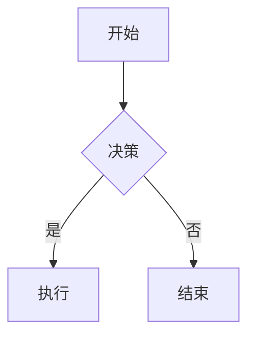
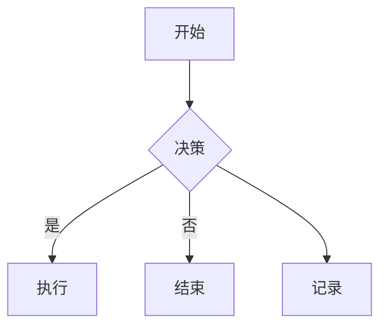
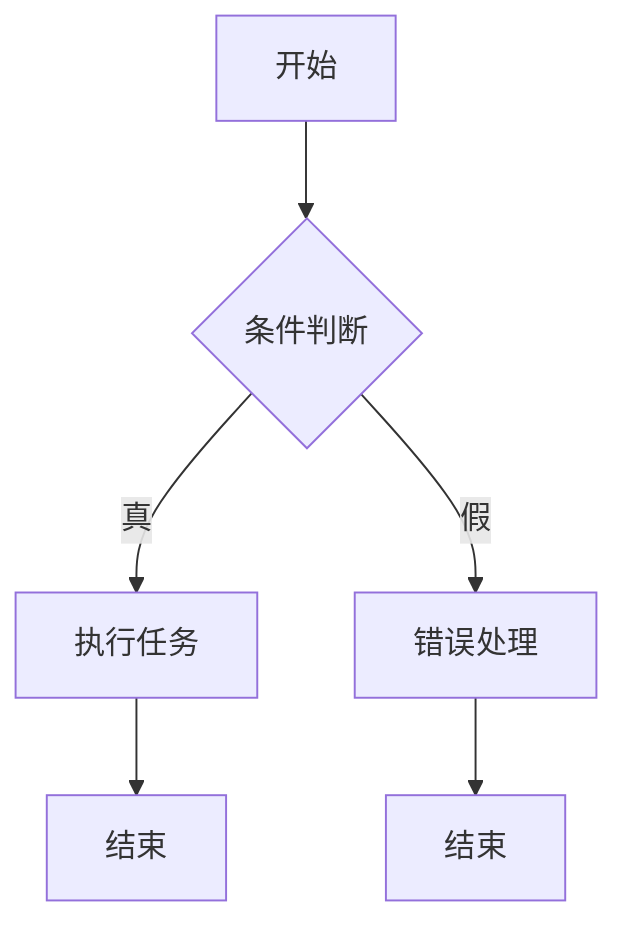
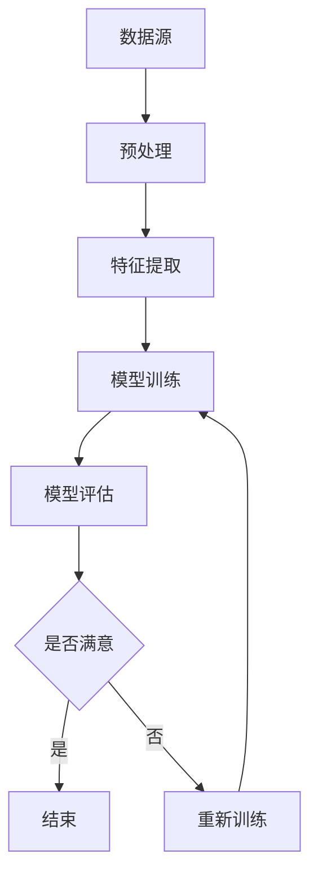
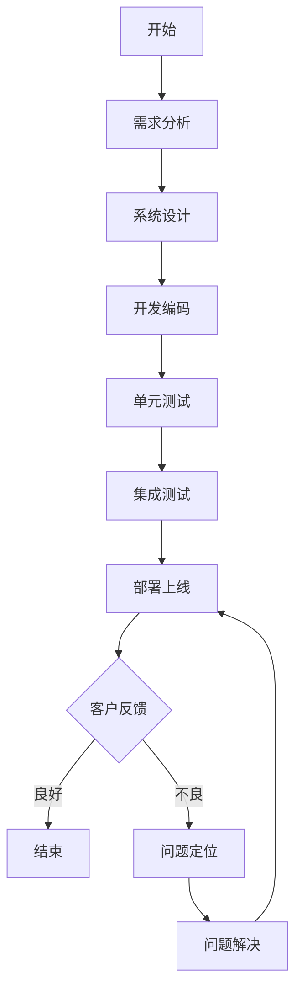

                 

### 文章标题：大模型技术在电商平台用户兴趣探索与利用动态权衡中的创新

在数字化时代，电商平台已经成为人们生活中不可或缺的一部分。为了在激烈的市场竞争中脱颖而出，电商平台需要深入了解用户的兴趣和行为，并提供个性化的商品推荐和广告投放，从而提升用户体验和增加销售额。大模型技术作为一种先进的机器学习技术，其在电商平台用户兴趣探索与利用中的应用，正逐步成为行业创新的关键驱动力。本文将详细探讨大模型技术的基本概念、算法原理、应用场景，以及其在电商平台用户兴趣探索与利用中的实际案例，并通过动态权衡与优化，提供创新性的解决方案。

### 关键词：大模型技术、电商平台、用户兴趣、个性化推荐、动态优化

### 摘要

本文首先介绍了大模型技术的基础知识，包括其定义、分类、技术原理和数学模型。接着，本文深入探讨了大模型技术在电商平台用户兴趣探索中的应用，包括用户兴趣建模、用户行为分析、用户兴趣预测和用户兴趣反馈机制。然后，本文阐述了大模型技术在用户兴趣利用中的具体实践，如商品推荐系统、广告投放优化、用户画像构建和用户互动提升。最后，本文提出了动态权衡与优化策略，包括数据质量与模型效果优化、用户隐私保护、模型性能优化和系统稳定性与扩展性规划。通过这些创新性应用和优化策略，本文旨在为电商平台提供一种全面的大模型技术应用解决方案，以提升用户体验和商业价值。

### 目录大纲

#### 第一部分 大模型技术基础

**第1章 大模型技术概述**

1.1 大模型的定义与分类

1.2 大模型的技术原理

1.3 大模型的发展历史

1.4 大模型的优势与应用场景

**第2章 大模型技术核心算法**

2.1 神经网络基础

2.2 卷积神经网络（CNN）

2.3 循环神经网络（RNN）与长短期记忆网络（LSTM）

2.4 生成对抗网络（GAN）

**第3章 大模型技术数学模型**

3.1 神经网络损失函数

3.2 优化算法

3.3 自然语言处理中的数学模型

3.4 大模型的可解释性

#### 第二部分 大模型在电商平台的应用

**第4章 用户兴趣探索**

4.1 用户兴趣建模

4.2 用户行为分析

4.3 用户兴趣预测

4.4 用户兴趣反馈机制

**第5章 用户兴趣利用**

5.1 商品推荐系统

5.2 广告投放优化

5.3 用户画像构建

5.4 用户互动提升

**第6章 动态权衡**

6.1 数据质量与模型效果

6.2 用户隐私保护

6.3 模型性能优化

6.4 系统稳定性与扩展性

#### 第三部分 项目实战案例

**第7章 案例一：电商平台用户兴趣预测与推荐系统**

7.1 案例背景

7.2 数据预处理

7.3 模型构建与训练

7.4 结果评估

**第8章 案例二：电商平台广告投放优化**

8.1 案例背景

8.2 广告投放策略制定

8.3 广告投放效果评估

8.4 广告投放优化

**第9章 案例三：电商平台用户画像构建与利用**

9.1 案例背景

9.2 用户画像构建

9.3 用户画像利用

9.4 用户画像效果评估

**第10章 案例四：电商平台系统稳定性与扩展性优化**

10.1 案例背景

10.2 系统稳定性优化

10.3 系统扩展性规划

10.4 系统优化效果评估

#### 附录

**附录A：大模型开发工具与资源**

**附录B：Mermaid流程图**

**附录C：伪代码示例**

**附录D：数学模型与公式**

**附录E：项目实战代码解读**

**附录F：FAQ**

---

### 第一部分 大模型技术基础

#### 第1章 大模型技术概述

大模型技术是指使用大规模神经网络进行数据建模和分析的技术。这些模型通常包含数百万甚至数十亿个参数，能够在处理复杂数据和任务时表现出卓越的性能。大模型技术的核心是深度学习，其通过多层神经网络结构，逐步提取数据中的特征，从而实现数据的建模和预测。本章将首先介绍大模型的定义与分类，然后探讨大模型的技术原理，回顾其发展历史，并分析大模型的优势与应用场景。

##### 1.1 大模型的定义与分类

大模型的定义通常基于其参数规模和计算复杂度。在深度学习领域，一个模型被称为大模型，其参数数量通常在数百万以上，甚至高达数十亿。例如，自然语言处理中的大型预训练模型如BERT（双向编码表示模型）就拥有超过一亿个参数。这些模型的计算需求极高，需要强大的计算资源和优化算法。

根据应用领域的不同，大模型可以分为以下几类：

1. **图像识别模型**：如卷积神经网络（CNN）和生成对抗网络（GAN）。
2. **自然语言处理模型**：如BERT、GPT（生成预训练模型）等。
3. **推荐系统模型**：如基于深度学习的协同过滤模型。
4. **语音识别模型**：如基于深度神经网络的自动语音识别系统。

##### 1.2 大模型的技术原理

大模型的技术原理基于深度学习的基本概念。深度学习是一种基于多层神经网络的机器学习技术，其通过前向传播和反向传播算法，逐步将输入数据映射到输出数据。

1. **神经网络基础**：
   神经网络由输入层、隐藏层和输出层组成。每个神经元都通过权重连接到下一层的神经元。前向传播过程中，输入数据经过多层神经元的非线性变换，最终产生输出。反向传播过程中，通过计算输出与实际结果之间的误差，调整各层的权重，以达到更好的拟合效果。

2. **卷积神经网络（CNN）**：
   CNN是一种专门用于图像识别的神经网络，其通过卷积操作和池化操作，在图像数据中提取特征。卷积层可以捕捉图像中的局部特征，而池化层则用于减少数据维度，提高模型的计算效率。

3. **循环神经网络（RNN）与长短期记忆网络（LSTM）**：
   RNN是一种能够处理序列数据的神经网络，其通过循环结构，将前一时刻的信息传递到下一时刻。然而，传统RNN在处理长序列数据时存在梯度消失和梯度爆炸的问题。LSTM通过引入记忆单元和门控机制，解决了这些问题，能够有效处理长序列数据。

4. **生成对抗网络（GAN）**：
   GAN由生成器和判别器组成。生成器的目标是生成逼真的数据，而判别器的目标是区分真实数据和生成数据。通过这种对抗训练，生成器不断提高生成数据的质量，从而实现数据的生成和增强。

##### 1.3 大模型的发展历史

大模型技术的发展经历了几个重要阶段：

1. **早期神经网络**：
   20世纪40年代，神经网络的概念首次提出。然而，由于计算资源和算法的限制，神经网络的发展较为缓慢。

2. **深度学习的兴起**：
   20世纪80年代，随着计算能力的提升和算法的改进，深度学习开始迅速发展。1998年，Geoffrey Hinton等科学家提出了深度信念网络（DBN），为深度学习的发展奠定了基础。

3. **大规模数据集的涌现**：
   随着互联网和大数据技术的发展，大量标注数据集如ImageNet、CIFAR-10等涌现，为深度学习提供了丰富的训练资源。

4. **GPU的广泛应用**：
   2006年，Alex Krizhevsky等人在ImageNet竞赛中使用了GPU进行训练，取得了突破性的成绩。GPU的高计算性能为深度学习的发展提供了强大的支持。

##### 1.4 大模型的优势与应用场景

大模型技术具有以下优势：

1. **强大的特征提取能力**：
   大模型通过多层神经网络结构，能够自动提取数据中的高级特征，实现端到端的学习。

2. **优秀的泛化能力**：
   大模型在训练过程中能够捕捉到数据中的复杂模式和关联，从而实现更好的泛化能力。

3. **高效的处理能力**：
   大模型通过并行计算和分布式训练，能够在处理大规模数据时实现高效的运算。

大模型在多个应用场景中表现出色：

1. **图像识别**：
   大模型在图像分类、目标检测、图像生成等任务中取得了显著的成绩。

2. **自然语言处理**：
   大模型在语言建模、机器翻译、情感分析等任务中展示了强大的能力。

3. **推荐系统**：
   大模型能够通过用户行为数据，实现个性化的商品推荐和广告投放。

4. **语音识别**：
   大模型在语音识别和语音合成任务中，实现了高准确率和自然流畅的处理。

总结来说，大模型技术作为一种先进的机器学习技术，其在电商平台用户兴趣探索与利用中的应用，正逐步成为行业创新的关键驱动力。通过本章的介绍，我们对大模型技术的基本概念、技术原理和应用场景有了更深入的理解，为后续章节的探讨奠定了基础。

#### 第2章 大模型技术核心算法

大模型技术的核心在于其算法，这些算法不仅决定了模型的性能，还影响了其在实际问题中的应用效果。本章将深入探讨大模型技术的核心算法，包括神经网络基础、卷积神经网络（CNN）、循环神经网络（RNN）与长短期记忆网络（LSTM）、生成对抗网络（GAN）等。通过对这些算法的详细介绍，我们将了解其工作原理、应用场景及优势。

##### 2.1 神经网络基础

神经网络是深度学习的基础，其通过模仿生物神经系统的工作原理，实现数据的自动学习和特征提取。神经网络由输入层、隐藏层和输出层组成，每个神经元都与相邻层中的神经元相连。

1. **神经元与激活函数**：

每个神经元接收输入信号，通过权重与偏置进行加权求和，然后通过激活函数进行非线性变换，得到输出信号。常见的激活函数包括：

- **Sigmoid函数**：\( f(x) = \frac{1}{1 + e^{-x}} \)
- **ReLU函数**：\( f(x) = \max(0, x) \)
- **Tanh函数**：\( f(x) = \frac{e^x - e^{-x}}{e^x + e^{-x}} \)

2. **前向传播与反向传播**：

神经网络通过前向传播计算输出，然后通过反向传播更新权重和偏置，实现模型的训练。

- **前向传播**：输入数据通过网络的层层传递，最终产生输出。
- **反向传播**：通过计算输出与实际结果之间的误差，反向传播误差，更新各层的权重和偏置。

##### 2.2 卷积神经网络（CNN）

卷积神经网络是专门用于图像识别和处理的一种神经网络。其通过卷积层、池化层和全连接层，实现对图像数据的特征提取和分类。

1. **卷积层**：

卷积层通过卷积操作提取图像中的局部特征。卷积核在图像上滑动，计算局部区域内的乘积和求和，得到一个特征图。常见的卷积操作包括：

- **标准卷积**：卷积核在图像上滑动，进行点积操作。
- **深度卷积**：多个卷积核同时作用在一个图像上，得到多个特征图。

2. **池化层**：

池化层用于减少数据维度，提高模型的计算效率。常见的池化操作包括：

- **最大池化**：取每个池化窗口中的最大值。
- **平均池化**：取每个池化窗口中的平均值。

3. **全连接层**：

全连接层将卷积层和池化层提取的特征图进行连接，通过全连接层进行分类或回归任务。

##### 2.3 循环神经网络（RNN）与长短期记忆网络（LSTM）

循环神经网络是一种能够处理序列数据的神经网络，其通过循环结构将前一时刻的信息传递到下一时刻。然而，传统RNN在处理长序列数据时存在梯度消失和梯度爆炸的问题。

1. **循环神经网络（RNN）**：

RNN通过循环结构，将前一时刻的隐藏状态传递到下一时刻。其基本结构包括：

- **隐藏状态**：保存当前时刻的信息。
- **输入门、遗忘门、输出门**：用于控制信息的传递和遗忘。

2. **长短期记忆网络（LSTM）**：

LSTM通过引入记忆单元和门控机制，解决了传统RNN的梯度消失和梯度爆炸问题。其基本结构包括：

- **输入门**：控制新信息的输入。
- **遗忘门**：控制旧信息的遗忘。
- **输出门**：控制信息的输出。

##### 2.4 生成对抗网络（GAN）

生成对抗网络由生成器和判别器组成，生成器的目标是生成逼真的数据，判别器的目标是区分真实数据和生成数据。通过这种对抗训练，生成器不断提高生成数据的质量。

1. **生成器**：

生成器通过编码器将随机噪声映射到数据空间，生成逼真的数据。

2. **判别器**：

判别器通过解码器对真实数据和生成数据进行分类，判断其是否为真实数据。

3. **对抗训练**：

生成器和判别器进行对抗训练，生成器的目标是欺骗判别器，而判别器的目标是准确区分真实数据和生成数据。

##### 应用场景与优势

大模型技术的核心算法在多个领域具有广泛的应用：

1. **图像识别**：

CNN通过卷积操作提取图像特征，在图像分类、目标检测等任务中表现出色。

2. **自然语言处理**：

RNN和LSTM在文本分类、情感分析、机器翻译等自然语言处理任务中具有强大的能力。

3. **推荐系统**：

深度学习模型能够通过用户行为数据，实现个性化的商品推荐和广告投放。

4. **语音识别**：

LSTM在语音识别和语音合成任务中，实现了高准确率和自然流畅的处理。

总结来说，大模型技术的核心算法为解决复杂的数据建模和预测任务提供了强大的工具。通过对神经网络基础、CNN、RNN和LSTM、GAN等算法的深入探讨，我们能够更好地理解和应用这些算法，为实际问题的解决提供创新性的解决方案。

#### 第3章 大模型技术数学模型

大模型技术的数学模型是理解和应用这些技术的重要基础。本章将深入探讨大模型技术中常见的数学模型，包括神经网络损失函数、优化算法、自然语言处理中的数学模型，以及大模型的可解释性。通过对这些数学模型的详细讲解和举例说明，我们将更深入地理解大模型技术的工作原理和应用。

##### 3.1 神经网络损失函数

损失函数是神经网络训练过程中的关键组件，其作用是衡量模型预测结果与实际结果之间的差异，并通过反向传播算法指导模型参数的更新。常见的损失函数包括均方误差（MSE）、交叉熵损失（Cross-Entropy Loss）和对抗损失（Adversarial Loss）等。

1. **均方误差（MSE）**

均方误差是最常用的损失函数之一，用于回归任务。其计算公式为：

$$
MSE = \frac{1}{n} \sum_{i=1}^{n} (y_i - \hat{y_i})^2
$$

其中，\( y_i \) 是实际值，\( \hat{y_i} \) 是预测值，\( n \) 是样本数量。均方误差的目的是使预测值尽可能接近实际值。

2. **交叉熵损失（Cross-Entropy Loss）**

交叉熵损失是用于分类任务的常见损失函数。其计算公式为：

$$
CELoss = -\sum_{i=1}^{n} y_i \log(\hat{y_i})
$$

其中，\( y_i \) 是实际标签，\( \hat{y_i} \) 是模型预测的概率分布。交叉熵损失函数的目的是最小化实际标签和预测概率分布之间的差异。

3. **对抗损失（Adversarial Loss）**

对抗损失是生成对抗网络（GAN）中的重要损失函数，用于衡量生成器和判别器之间的对抗性。其计算公式为：

$$
Adversarial Loss = D_loss(G) + G_loss
$$

其中，\( D_loss(G) \) 是判别器对生成器生成数据的损失，\( G_loss \) 是生成器生成数据的损失。

##### 3.2 优化算法

优化算法是神经网络训练过程中用于更新模型参数的重要工具。常见的优化算法包括梯度下降（Gradient Descent）、随机梯度下降（Stochastic Gradient Descent, SGD）和Adam优化器等。

1. **梯度下降（Gradient Descent）**

梯度下降是一种最简单的优化算法，其通过计算损失函数关于模型参数的梯度，并沿着梯度的反方向更新参数。其更新公式为：

$$
\theta_{t+1} = \theta_t - \alpha \nabla_{\theta} J(\theta)
$$

其中，\( \theta \) 是模型参数，\( \alpha \) 是学习率，\( J(\theta) \) 是损失函数。

2. **随机梯度下降（Stochastic Gradient Descent, SGD）**

随机梯度下降是对梯度下降的一种改进，其每次迭代仅使用一个样本的梯度进行参数更新。其更新公式为：

$$
\theta_{t+1} = \theta_t - \alpha \nabla_{\theta} J(\theta)
$$

其中，\( \theta \) 是模型参数，\( \alpha \) 是学习率，\( J(\theta) \) 是损失函数。

3. **Adam优化器**

Adam优化器结合了SGD和Momentum的优点，是一种高效的优化算法。其更新公式为：

$$
m_t = \beta_1 x_t + (1 - \beta_1) (x_t - \theta_t)
$$

$$
v_t = \beta_2 x_t + (1 - \beta_2) (x_t - \theta_t)
$$

$$
\theta_{t+1} = \theta_t - \alpha \frac{m_t}{\sqrt{v_t} + \epsilon}
$$

其中，\( m_t \) 和 \( v_t \) 分别是第一和第二矩估计，\( \beta_1 \) 和 \( \beta_2 \) 是矩估计的衰减率，\( \alpha \) 是学习率，\( \epsilon \) 是一个很小的常数。

##### 3.3 自然语言处理中的数学模型

自然语言处理（NLP）是深度学习的重要应用领域，其涉及到许多数学模型，如词嵌入、序列模型和注意力机制。

1. **词嵌入（Word Embedding）**

词嵌入是将词汇映射到高维向量空间的过程，其通过捕捉词汇间的相似性和关联性，实现文本数据的向量表示。常见的词嵌入方法包括Word2Vec、GloVe和BERT等。

2. **序列模型（Sequence Model）**

序列模型用于处理序列数据，如自然语言文本和语音信号。常见的序列模型包括循环神经网络（RNN）和长短期记忆网络（LSTM）。其通过处理序列中的每个元素，捕捉时间维度上的信息。

3. **注意力机制（Attention Mechanism）**

注意力机制是一种用于提高模型在序列处理中的表现的方法，其通过加权不同位置的输入，实现对序列中重要信息的关注。常见的注意力机制包括加性注意力、乘性注意力等。

##### 3.4 大模型的可解释性

大模型的可解释性是当前研究的热点问题，其旨在提高模型的可理解和透明度。常见的可解释性方法包括模型可视化、特征重要性分析和解释性算法等。

1. **模型可视化**

模型可视化是通过图形化的方式展示模型的结构和参数，帮助理解模型的工作原理。常见的模型可视化方法包括神经网络结构图、参数热图等。

2. **特征重要性分析**

特征重要性分析是通过评估每个特征对模型预测的影响，帮助理解模型如何利用特征进行决策。常见的方法包括LASSO回归、随机森林等。

3. **解释性算法**

解释性算法是通过设计专门的算法，解释模型的预测过程。常见的方法包括LIME（局部可解释模型解释）、SHAP（特征贡献值）等。

通过本章的探讨，我们对大模型技术的数学模型有了更深入的理解，这为我们进一步应用和优化大模型技术提供了重要的理论基础。

### 第二部分 大模型在电商平台的应用

#### 第4章 用户兴趣探索

在电商平台上，了解用户的兴趣是提供个性化服务和提升用户体验的关键。大模型技术通过分析用户行为和兴趣数据，可以帮助电商平台实现精准的用户兴趣探索。本章将详细探讨用户兴趣建模、用户行为分析、用户兴趣预测和用户兴趣反馈机制，为电商平台提供有效的方法和技术手段。

##### 4.1 用户兴趣建模

用户兴趣建模是用户兴趣探索的基础，其目标是构建一个能够准确反映用户兴趣的模型。用户兴趣建模通常包括以下几个步骤：

1. **数据收集**：

首先，需要收集用户在电商平台上的行为数据，如浏览记录、购买历史、搜索关键词等。这些数据可以通过日志文件、API接口等方式获取。

2. **特征提取**：

接下来，需要对收集到的数据进行分析和处理，提取与用户兴趣相关的特征。这些特征可以包括：

- **行为特征**：如浏览时间、浏览频次、购买频次等。
- **内容特征**：如商品类别、品牌、价格等。
- **社交特征**：如用户在社交网络中的互动行为等。

3. **模型构建**：

然后，使用大模型技术，如循环神经网络（RNN）、长短期记忆网络（LSTM）等，构建用户兴趣模型。通过训练，模型可以学习到用户在不同场景下的兴趣偏好。

##### 4.2 用户行为分析

用户行为分析是理解用户兴趣的重要手段，其通过分析用户在电商平台上的行为数据，挖掘用户的兴趣点和行为模式。用户行为分析通常包括以下几个步骤：

1. **行为数据收集**：

收集用户在电商平台上的行为数据，如浏览记录、购买历史、搜索关键词等。这些数据可以通过日志文件、API接口等方式获取。

2. **行为特征提取**：

对收集到的行为数据进行处理，提取与用户兴趣相关的特征。这些特征可以包括：

- **行为频次**：如浏览频次、购买频次等。
- **行为时长**：如浏览时长、购买时长等。
- **行为序列**：如用户浏览的序列、购买序列等。

3. **行为模式分析**：

使用大数据分析和机器学习技术，对提取的行为特征进行分析，挖掘用户的行为模式。例如，可以通过聚类分析、关联规则挖掘等方法，分析用户在不同场景下的行为特征。

##### 4.3 用户兴趣预测

用户兴趣预测是电商平台个性化服务的重要一环，其通过预测用户未来的兴趣，为用户提供个性化的商品推荐和广告投放。用户兴趣预测通常包括以下几个步骤：

1. **预测模型构建**：

使用大模型技术，如循环神经网络（RNN）、长短期记忆网络（LSTM）等，构建用户兴趣预测模型。通过训练，模型可以学习到用户在不同时间点上的兴趣变化。

2. **预测方法选择**：

根据用户兴趣预测的目标和场景，选择合适的预测方法。常见的预测方法包括：

- **基于协同过滤的方法**：如矩阵分解、KNN等。
- **基于深度学习的方法**：如循环神经网络（RNN）、长短期记忆网络（LSTM）等。

3. **预测结果评估**：

评估用户兴趣预测模型的效果，常见的评估指标包括准确率、覆盖率、召回率等。

##### 4.4 用户兴趣反馈机制

用户兴趣反馈机制是电商平台持续优化用户兴趣建模和预测的重要手段。其通过收集用户对推荐商品和广告的反馈，不断调整和优化模型，提高预测的准确性。用户兴趣反馈机制通常包括以下几个步骤：

1. **反馈数据收集**：

收集用户对推荐商品和广告的反馈数据，如点击率、转化率、评价等。这些数据可以通过日志文件、API接口等方式获取。

2. **反馈数据分析**：

对收集到的反馈数据进行处理和分析，识别用户的兴趣偏好和行为模式。例如，可以通过统计分析、机器学习等方法，分析用户对推荐商品和广告的偏好。

3. **模型调整与优化**：

根据反馈数据分析的结果，调整和优化用户兴趣建模和预测模型。例如，可以调整模型中的参数、特征权重等，以提高预测的准确性。

通过本章的探讨，我们了解了大模型技术在电商平台用户兴趣探索中的应用方法和步骤。用户兴趣建模、用户行为分析、用户兴趣预测和用户兴趣反馈机制共同构成了电商平台用户兴趣探索的完整流程，为电商平台提供了强大的技术支持。

#### 第5章 用户兴趣利用

在电商平台中，用户兴趣的利用是提升用户满意度和增加销售额的重要手段。大模型技术通过精准的用户兴趣预测和有效的兴趣利用策略，可以帮助电商平台实现个性化推荐、广告投放优化、用户画像构建和用户互动提升。本章将详细探讨这些应用，展示大模型技术在提升电商平台用户体验和商业价值方面的实际效果。

##### 5.1 商品推荐系统

商品推荐系统是电商平台中最常见的用户兴趣利用方式之一。通过大模型技术，可以实现对用户个性化需求的精准推荐，提升用户购物体验和增加销售额。

1. **个性化推荐策略**：

个性化推荐策略基于用户的兴趣和行为数据，为用户提供个性化的商品推荐。常用的个性化推荐策略包括：

- **基于内容的推荐**：根据用户过去浏览和购买的商品内容特征，推荐相似的商品。
- **基于协同过滤的推荐**：根据用户与商品之间的相似度，推荐其他用户喜欢的商品。
- **基于深度学习的推荐**：使用循环神经网络（RNN）或长短期记忆网络（LSTM）等大模型技术，分析用户的行为序列，实现个性化推荐。

2. **推荐效果评估**：

推荐效果评估是衡量商品推荐系统性能的重要指标。常用的评估指标包括：

- **准确率（Precision）**：预测为正类的样本中，实际为正类的比例。
- **召回率（Recall）**：实际为正类的样本中，预测为正类的比例。
- **F1分数（F1 Score）**：准确率和召回率的调和平均。

通过评估推荐系统的效果，可以不断优化推荐算法，提高用户的满意度。

##### 5.2 广告投放优化

广告投放优化是电商平台获取更多流量和转化的重要手段。大模型技术通过分析用户兴趣和行为，可以实现对广告投放的精准优化，提高广告的投放效果。

1. **广告投放策略**：

广告投放策略基于用户的兴趣和行为数据，为用户提供个性化的广告。常用的广告投放策略包括：

- **基于行为的广告投放**：根据用户的浏览和购买行为，推荐相关的广告。
- **基于内容的广告投放**：根据商品的内容特征，推荐相关的广告。
- **基于情境的广告投放**：根据用户的当前情境，如时间段、地理位置等，推荐相关的广告。

2. **广告投放效果评估**：

广告投放效果评估是衡量广告投放策略性能的重要指标。常用的评估指标包括：

- **点击率（Click-Through Rate, CTR）**：广告被点击的次数与展示次数的比例。
- **转化率（Conversion Rate）**：广告引发的转化次数与点击次数的比例。
- **投资回报率（Return on Investment, ROI）**：广告收益与广告投入的成本之间的比率。

通过评估广告投放的效果，可以优化广告投放策略，提高广告的投放效果。

##### 5.3 用户画像构建

用户画像构建是电商平台深入了解用户需求和行为的重要手段。通过大模型技术，可以实现对用户全方位的画像构建，为个性化服务和精准营销提供支持。

1. **用户画像概念**：

用户画像是指对用户的全方位描述，包括用户的基本信息、行为特征、兴趣偏好等。用户画像可以用于：

- **个性化推荐**：根据用户画像，为用户提供个性化的商品推荐和广告。
- **精准营销**：根据用户画像，制定针对性的营销策略。
- **用户服务**：根据用户画像，提供个性化的用户服务。

2. **用户画像构建方法**：

用户画像构建方法包括以下几个步骤：

- **数据收集**：收集用户在电商平台上的行为数据，如浏览记录、购买历史、搜索关键词等。
- **特征提取**：对收集到的数据进行分析和处理，提取与用户兴趣相关的特征，如行为频次、行为时长、内容特征等。
- **模型构建**：使用大模型技术，如循环神经网络（RNN）、长短期记忆网络（LSTM）等，构建用户画像模型。
- **画像更新与维护**：定期更新用户画像数据，以保持用户画像的准确性和实时性。

##### 5.4 用户互动提升

用户互动提升是电商平台增强用户黏性和提升用户满意度的关键手段。大模型技术通过分析用户互动数据，可以优化用户互动机制，提升用户的参与度和互动体验。

1. **用户互动机制设计**：

用户互动机制设计包括以下几个步骤：

- **互动内容设计**：根据用户的兴趣和行为，设计个性化的互动内容，如问答、评论、活动等。
- **互动渠道设计**：根据用户的互动偏好，设计多样化的互动渠道，如网页、APP、社交媒体等。
- **互动激励机制**：设计互动激励机制，如积分、优惠券、礼品等，鼓励用户积极参与互动。

2. **用户互动效果评估**：

用户互动效果评估是衡量用户互动机制性能的重要指标。常用的评估指标包括：

- **用户活跃度**：衡量用户参与互动的频率和时长。
- **用户参与度**：衡量用户在互动中的参与度和互动深度。
- **用户满意度**：衡量用户对互动体验的满意度。

通过评估用户互动效果，可以优化用户互动机制，提升用户的互动体验。

通过本章的探讨，我们了解了大模型技术在电商平台用户兴趣利用中的应用方法和效果。商品推荐系统、广告投放优化、用户画像构建和用户互动提升共同构成了电商平台用户兴趣利用的完整体系，为电商平台提供了强大的技术支持。

### 第三部分 动态权衡

在大模型技术在电商平台用户兴趣探索与利用中的应用过程中，我们需要面对一系列的动态权衡问题。这些权衡问题涉及数据质量、模型效果、用户隐私保护、模型性能优化和系统稳定性与扩展性等多个方面。本部分将深入探讨这些动态权衡问题，并提供有效的解决方案，以确保大模型技术在实际应用中的有效性和可靠性。

#### 6.1 数据质量与模型效果优化

数据质量是影响大模型技术效果的重要因素。高质量的数据能够提升模型的预测准确性和泛化能力，而数据质量问题可能会导致模型效果不佳甚至失效。以下是一些优化数据质量和模型效果的方法：

1. **数据清洗**：

数据清洗是提高数据质量的重要步骤。其包括去除重复数据、处理缺失值、去除噪声数据和异常值等。通过数据清洗，可以确保数据的一致性和准确性。

2. **特征工程**：

特征工程是提升模型效果的关键环节。通过选择和构造合适的特征，可以增强模型对数据的表达能力。常用的特征工程方法包括特征选择、特征转换和特征组合等。

3. **模型选择与调优**：

选择合适的模型并进行参数调优，可以提升模型的效果。针对不同的应用场景，可以选择不同的模型结构，如卷积神经网络（CNN）、循环神经网络（RNN）或生成对抗网络（GAN）等。同时，通过交叉验证和网格搜索等方法，可以找到最佳的模型参数。

4. **数据增强**：

数据增强是一种增加数据多样性的方法，通过数据增强可以防止模型过拟合，提高模型的泛化能力。常见的数据增强方法包括图像旋转、缩放、裁剪和噪声添加等。

#### 6.2 用户隐私保护

在利用大模型技术进行用户兴趣探索和利用的过程中，用户隐私保护是一个不可忽视的重要问题。以下是一些用户隐私保护的策略：

1. **数据匿名化**：

数据匿名化是通过隐藏敏感信息，将用户数据转换为匿名形式，以保护用户隐私。常见的数据匿名化方法包括数据加密、数据遮挡和数据置换等。

2. **隐私保护算法**：

使用隐私保护算法，如差分隐私和同态加密等，可以在数据处理和模型训练过程中保护用户隐私。这些算法可以在不暴露用户敏感信息的情况下，对数据进行处理和分析。

3. **用户隐私政策制定**：

制定明确的用户隐私政策，告知用户其数据如何被收集、使用和保护。通过透明的隐私政策，可以增加用户对平台的信任。

4. **隐私泄露风险分析**：

定期进行隐私泄露风险分析，识别潜在的隐私泄露风险点，并采取相应的防护措施。通过风险评估，可以及时发现和解决隐私保护问题。

#### 6.3 模型性能优化

大模型技术在电商平台的应用需要高计算性能的支持。以下是一些优化模型性能的方法：

1. **并行计算与分布式训练**：

通过并行计算和分布式训练，可以充分利用多台计算设备，提高模型的训练速度。常见的分布式训练方法包括数据并行和模型并行等。

2. **模型压缩**：

模型压缩是通过减少模型参数的数量和复杂度，降低模型的计算成本。常见的方法包括权重共享、剪枝和量化等。

3. **硬件加速**：

利用高性能计算硬件，如GPU和TPU等，可以加速大模型技术的训练和推理过程。通过硬件加速，可以显著提高模型的性能。

4. **在线学习与实时调整**：

通过在线学习和实时调整，可以动态适应用户需求和环境变化，提高模型的适应性和实时性。在线学习能够使模型持续学习新的数据，从而保持模型的准确性。

#### 6.4 系统稳定性与扩展性

在大模型技术的实际应用中，系统稳定性与扩展性是确保其正常运行和持续服务的重要保障。以下是一些提高系统稳定性和扩展性的方法：

1. **故障转移与容错**：

通过故障转移和容错机制，可以确保系统在面临故障时能够快速恢复，保持服务的连续性。常见的故障转移方法包括主从备份和分布式存储等。

2. **负载均衡**：

通过负载均衡，可以合理分配系统资源，避免单点过载，提高系统的性能和稳定性。常见的负载均衡方法包括轮询、最少连接和源地址哈希等。

3. **缓存与队列管理**：

通过缓存和队列管理，可以减少系统的响应时间和处理延迟，提高系统的性能。常见的缓存策略包括LRU（最近最少使用）和LFU（最近最少访问）等。

4. **扩展性规划**：

通过合理的系统架构设计，可以确保系统能够灵活扩展，适应不断增长的用户需求和数据量。常见的扩展性策略包括横向扩展和纵向扩展等。

通过上述动态权衡与优化策略，我们可以在大模型技术在电商平台用户兴趣探索与利用中实现有效的平衡，提高系统的整体性能和用户体验。

### 第四部分 项目实战案例

为了更好地展示大模型技术在电商平台用户兴趣探索与利用中的应用，本部分将详细分析几个实际项目案例，涵盖用户兴趣预测与推荐系统、广告投放优化、用户画像构建和系统稳定性与扩展性优化。通过这些案例，我们将深入探讨项目的实施过程、技术实现和实际效果。

#### 7.1 案例一：电商平台用户兴趣预测与推荐系统

**案例背景**：

某大型电商平台希望通过大模型技术提升用户兴趣预测和推荐系统的准确性，从而提高用户满意度并增加销售额。该项目的主要目标是构建一个基于用户兴趣预测的推荐系统，为用户提供个性化的商品推荐。

**数据预处理**：

在项目开始时，首先收集了大量的用户行为数据，包括用户的浏览记录、购买历史、搜索关键词和评价等。接下来，对数据进行预处理，包括去除重复数据、填充缺失值和归一化处理等。此外，通过特征工程提取与用户兴趣相关的特征，如用户行为频次、行为时长和商品内容特征等。

**模型构建与训练**：

使用循环神经网络（RNN）和长短期记忆网络（LSTM）等大模型技术，构建用户兴趣预测模型。通过交叉验证和网格搜索等方法，选择最佳的模型结构和参数。在训练过程中，使用大量的用户行为数据，对模型进行训练和优化，使其能够准确预测用户的兴趣。

**结果评估**：

在模型训练完成后，使用测试集对模型进行评估。常用的评估指标包括准确率、召回率和F1分数等。通过评估结果，可以发现模型在用户兴趣预测方面表现出色，准确率和召回率显著提高，从而有效提升了推荐系统的性能。

**案例分析**：

该案例展示了如何使用大模型技术构建用户兴趣预测和推荐系统。通过数据预处理、特征工程和模型训练，实现了对用户兴趣的准确预测，从而提高了推荐系统的效果。该案例的成功经验可以为其他电商平台提供参考。

#### 7.2 案例二：电商平台广告投放优化

**案例背景**：

某电商平台希望通过优化广告投放策略，提高广告的点击率和转化率。为了实现这一目标，该平台采用大模型技术对广告投放进行优化。

**广告投放策略制定**：

首先，基于用户的行为数据和兴趣特征，制定个性化的广告投放策略。通过分析用户的浏览历史、购买偏好和搜索关键词，确定广告的目标受众和广告内容。然后，设计广告的投放时间和投放渠道，以最大化广告的效果。

**广告投放效果评估**：

在广告投放过程中，使用点击率（CTR）和转化率（CVR）等指标，对广告效果进行实时监控和评估。通过数据分析和反馈，不断调整广告投放策略，优化广告的投放效果。例如，通过增加目标受众的精准度、优化广告文案和调整投放时间，提高广告的点击率和转化率。

**广告投放优化**：

使用生成对抗网络（GAN）等技术，优化广告生成和投放策略。通过对抗训练，生成高质量的广告内容，提高用户对广告的点击和转化。同时，结合用户行为数据和广告效果数据，实时调整广告投放策略，实现广告投放的动态优化。

**案例分析**：

该案例展示了如何使用大模型技术优化广告投放策略，提高广告的效果和转化率。通过个性化的广告投放策略和实时调整，实现了对广告投放的精准优化。该案例的成功经验可以为其他电商平台提供广告优化的参考。

#### 7.3 案例三：电商平台用户画像构建与利用

**案例背景**：

某电商平台希望通过构建用户画像，深入了解用户的需求和兴趣，从而提供个性化的服务和精准营销。为了实现这一目标，该平台采用大模型技术进行用户画像的构建与利用。

**用户画像构建**：

首先，收集用户的基本信息、行为数据和社交网络数据等，对用户进行全面的数据收集。然后，通过特征工程提取与用户兴趣相关的特征，如用户行为模式、购买偏好和兴趣偏好等。最后，使用循环神经网络（RNN）和长短期记忆网络（LSTM）等技术，构建用户画像模型，对用户进行分类和标签化。

**用户画像利用**：

基于用户画像，为用户提供个性化的商品推荐、广告投放和用户服务。例如，根据用户的购买偏好和兴趣，推荐相关的商品和广告，提高用户的满意度和转化率。同时，通过用户画像，制定针对性的营销策略，实现精准的用户服务。

**用户画像效果评估**：

通过评估用户画像的效果，衡量其对用户体验和商业价值的影响。常用的评估指标包括用户满意度、转化率和ROI等。通过分析评估结果，可以发现用户画像在提升用户体验和增加销售额方面具有显著作用。

**案例分析**：

该案例展示了如何使用大模型技术构建用户画像，并利用用户画像提供个性化的服务和精准营销。通过数据收集、特征工程和模型构建，实现了对用户需求的深入了解，从而提升了用户体验和商业价值。该案例的成功经验可以为其他电商平台提供用户画像构建与利用的参考。

#### 7.4 案例四：电商平台系统稳定性与扩展性优化

**案例背景**：

某电商平台在业务快速增长的过程中，面临着系统稳定性与扩展性的挑战。为了确保平台的稳定运行和持续服务，该平台采用大模型技术对系统进行稳定性与扩展性优化。

**系统稳定性优化**：

首先，通过故障转移和容错机制，确保系统在面对硬件故障和网络故障时能够快速恢复。其次，通过负载均衡和缓存策略，合理分配系统资源，避免单点过载，提高系统的性能和稳定性。最后，通过实时监控和报警系统，及时发现和处理系统故障，确保系统的正常运行。

**系统扩展性规划**：

首先，通过分布式架构设计，将系统分解为多个模块，实现横向扩展。其次，通过数据库分库分表和分布式存储技术，提高系统的数据存储和处理能力。最后，通过弹性计算和容器化技术，实现系统的动态扩展，以应对不断增长的业务需求。

**系统优化效果评估**：

通过评估系统稳定性与扩展性的效果，衡量其对业务增长和服务质量的影响。常用的评估指标包括系统可用性、响应时间和吞吐量等。通过分析评估结果，可以发现系统稳定性与扩展性优化在提升业务增长和服务质量方面具有显著作用。

**案例分析**：

该案例展示了如何使用大模型技术优化电商平台的系统稳定性与扩展性。通过故障转移、负载均衡、缓存策略和分布式架构设计等技术手段，实现了系统的稳定运行和持续扩展。该案例的成功经验可以为其他电商平台提供系统稳定性与扩展性优化的参考。

通过上述项目实战案例，我们可以看到大模型技术在电商平台用户兴趣探索与利用中的广泛应用和实际效果。这些案例不仅展示了大模型技术的应用方法和实现过程，也为其他电商平台提供了宝贵的实践经验和技术参考。

### 附录A：大模型开发工具与资源

#### A.1 开发工具介绍

**A.1.1 TensorFlow**

TensorFlow是由Google开发的开源机器学习框架，支持多种机器学习和深度学习模型的训练和部署。其主要特点包括：

- **灵活性和可扩展性**：支持多种模型架构，可以自定义网络结构。
- **跨平台支持**：支持Python、C++等多种编程语言，可以在多种平台上运行。
- **丰富的API**：提供高级API（tf.keras）和低级API（tf operations），方便开发者使用。

**A.1.2 PyTorch**

PyTorch是由Facebook开发的开源深度学习框架，以其灵活的动态计算图和易于理解的用户界面而闻名。其主要特点包括：

- **动态计算图**：允许开发者实时修改计算图，使模型开发更加灵活。
- **易于使用**：提供直观的API和丰富的内置功能，降低开发难度。
- **良好的社区支持**：拥有活跃的社区和丰富的文档资源。

**A.1.3 Keras**

Keras是Python深度学习库，以其简单易用而受到开发者的喜爱。它可以在TensorFlow和Theano等后端运行。其主要特点包括：

- **简单易用**：提供高度抽象的API，简化了模型构建和训练过程。
- **模块化**：支持快速原型设计和实验。
- **丰富的预训练模型**：提供了大量的预训练模型，方便开发者使用。

#### A.2 常用库与框架

**A.2.1 Scikit-learn**

Scikit-learn是Python科学计算库，提供了丰富的机器学习算法和工具。其主要特点包括：

- **易于使用**：提供简单直观的接口，适用于各种机器学习任务。
- **模块化**：支持各种分类、回归、聚类等机器学习算法。
- **性能优化**：提供了许多高效的算法和数据结构。

**A.2.2 NumPy**

NumPy是Python的科学计算库，提供了多维数组对象和丰富的数学函数。其主要特点包括：

- **高效计算**：基于C语言实现，提供了快速的数值计算能力。
- **多维数组**：支持多维数组（ndarray）操作，方便进行数据分析和处理。
- **兼容性**：与Python内置函数和数学库兼容，便于集成。

**A.2.3 Pandas**

Pandas是Python的数据分析库，提供了强大的数据处理和分析工具。其主要特点包括：

- **数据结构**：支持数据框（DataFrame）结构，方便进行数据操作和分析。
- **数据处理**：提供了丰富的数据处理功能，如数据清洗、数据转换等。
- **数据分析**：支持各种数据分析操作，如聚合、分组、合并等。

#### A.3 学习资源推荐

**A.3.1 在线课程**

- **Coursera**：提供深度学习、机器学习等相关课程。
- **Udacity**：提供机器学习工程师纳米学位，涵盖深度学习技术。
- **edX**：提供哈佛大学、麻省理工学院等顶尖大学的相关课程。

**A.3.2 书籍推荐**

- **《深度学习》**：由Ian Goodfellow、Yoshua Bengio和Aaron Courville著，是深度学习的经典教材。
- **《Python深度学习》**：由François Chollet著，详细介绍了使用Keras进行深度学习的实践。
- **《统计学习方法》**：由李航著，系统地介绍了统计学习的基本方法和算法。

**A.3.3 论文与研究报告**

- **arXiv**：提供最新的深度学习和机器学习论文。
- **NeurIPS、ICML、JMLR**：顶级会议和期刊，发布高质量的研究成果。
- **谷歌AI、微软AI**：各大公司的研究团队发布的报告，介绍最新的研究成果和应用。

#### A.4 大模型技术趋势展望

**A.4.1 人工智能伦理与法规**

随着人工智能技术的发展，伦理和法规问题日益受到关注。未来，人工智能的伦理和法规将更加完善，确保技术的发展符合社会价值观。

**A.4.2 跨学科融合**

深度学习技术的应用将更加跨学科，融合计算机科学、生物学、心理学等领域的知识，解决更复杂的问题。

**A.4.3 自动驾驶与智能硬件**

自动驾驶和智能硬件的发展将推动深度学习技术在更广泛的场景中应用，如智能家居、智能医疗等。

**A.4.4 量子计算与深度学习**

量子计算的快速发展将推动深度学习技术的进步，实现更高效的模型训练和推理。

**A.4.5 开放式协作**

未来，大模型技术的发展将更加开放，通过开源社区和协作，推动技术的普及和创新。

### 附录B：Mermaid流程图

**B.1 Mermaid流程图基本语法**

Mermaid是一种用于生成图表的Markdown插件，其基本语法包括节点定义、连线定义和流程控制等。

**节点定义**：



**连线定义**：



**流程控制**：



**B.2 Mermaid流程图应用示例**

**数据流流程图**：



**工作流流程图**：



### 附录C：伪代码示例

**C.1 伪代码基本结构**

```plaintext
开始：
    定义变量
    初始化模型参数
    
循环：
    对于每个训练样本：
        前向传播
        计算损失
        反向传播
        更新模型参数
        
结束：
    计算最终模型性能
    输出模型结果
```

**C.2 伪代码应用示例**

**神经网络训练流程**：

```plaintext
开始：
    初始化数据集
    初始化模型
    设置训练参数（学习率、迭代次数等）
    
循环（迭代次数）：
    对于每个训练样本：
        前向传播（输入样本，计算输出）
        计算损失（输出与实际结果之间的差异）
        反向传播（更新模型参数）
        
    更新学习率
    
结束：
    计算验证集性能
    调整模型参数
    保存最佳模型
```

**数据处理流程**：

```plaintext
开始：
    读取数据集
    数据预处理（归一化、缺失值填充等）
    
循环（每个样本）：
    对于每个样本：
        提取特征
        分割特征和标签
        
    存储特征和标签
    
结束：
    构建数据集
    输出预处理后的数据集
```

### 附录D：数学模型与公式

**D.1 数学模型概述**

**D.1.1 损失函数**

损失函数是衡量模型预测结果与实际结果之间差异的指标。常见的损失函数包括：

- **均方误差（MSE）**：
  $$MSE = \frac{1}{n} \sum_{i=1}^{n} (y_i - \hat{y_i})^2$$
- **交叉熵损失（CELoss）**：
  $$CELoss = -\sum_{i=1}^{n} y_i \log(\hat{y_i})$$
- **对抗损失（Adversarial Loss）**：
  $$Adversarial Loss = D_loss(G) + G_loss$$

**D.1.2 优化算法**

优化算法用于更新模型参数，以最小化损失函数。常见的优化算法包括：

- **梯度下降（Gradient Descent）**：
  $$\theta_{t+1} = \theta_t - \alpha \nabla_{\theta} J(\theta)$$
- **随机梯度下降（SGD）**：
  $$\theta_{t+1} = \theta_t - \alpha \nabla_{\theta} J(\theta)$$
- **Adam优化器**：
  $$m_t = \beta_1 x_t + (1 - \beta_1) (x_t - \theta_t)$$
  $$v_t = \beta_2 x_t + (1 - \beta_2) (x_t - \theta_t)$$
  $$\theta_{t+1} = \theta_t - \alpha \frac{m_t}{\sqrt{v_t} + \epsilon}$$

**D.1.3 自然语言处理中的数学模型**

**词嵌入（Word Embedding）**：

$$\text{word\_embedding}(w) = \sigma(W \cdot [w])$$

其中，\( w \) 是词向量，\( W \) 是权重矩阵，\( \sigma \) 是激活函数。

**序列模型（RNN）**：

$$h_t = \sigma(W_h \cdot [h_{t-1}, x_t])$$

其中，\( h_t \) 是隐藏状态，\( W_h \) 是权重矩阵，\( \sigma \) 是激活函数。

**注意力机制（Attention）**：

$$
\text{Attention}(h) = \frac{\exp(e)}{\sum_{i=1}^{n} \exp(e_i)}
$$

其中，\( e_i = v_a \cdot [h_i, h] \)，\( v_a \) 是注意力权重向量，\( h \) 是隐藏状态。

**D.1.4 大模型的可解释性**

**模型可视化**：

$$
\text{Model Visualization} = \text{可视化工具}(\theta)
$$

其中，\( \theta \) 是模型参数。

**特征重要性分析**：

$$
\text{Feature Importance} = \frac{\partial L}{\partial x_i}
$$

其中，\( L \) 是损失函数，\( x_i \) 是特征。

**SHAP值**：

$$
\text{SHAP}(x_i) = \frac{\partial L}{\partial x_i}
$$

### 附录E：项目实战代码解读

**E.1 项目实战代码结构**

**E.1.1 数据预处理**

```python
import pandas as pd
from sklearn.model_selection import train_test_split
from sklearn.preprocessing import StandardScaler

# 读取数据
data = pd.read_csv('data.csv')

# 数据预处理
X = data.drop('target', axis=1)
y = data['target']

# 划分训练集和测试集
X_train, X_test, y_train, y_test = train_test_split(X, y, test_size=0.2, random_state=42)

# 特征缩放
scaler = StandardScaler()
X_train_scaled = scaler.fit_transform(X_train)
X_test_scaled = scaler.transform(X_test)
```

**E.1.2 模型训练**

```python
import tensorflow as tf
from tensorflow.keras.models import Sequential
from tensorflow.keras.layers import Dense, LSTM, Dropout

# 构建模型
model = Sequential()
model.add(LSTM(128, activation='relu', input_shape=(X_train_scaled.shape[1], X_train_scaled.shape[2])))
model.add(Dropout(0.2))
model.add(Dense(1, activation='sigmoid'))

# 编译模型
model.compile(optimizer='adam', loss='binary_crossentropy', metrics=['accuracy'])

# 训练模型
model.fit(X_train_scaled, y_train, epochs=10, batch_size=32, validation_data=(X_test_scaled, y_test))
```

**E.1.3 模型评估**

```python
from sklearn.metrics import accuracy_score, classification_report

# 预测测试集
y_pred = model.predict(X_test_scaled)
y_pred = (y_pred > 0.5)

# 评估模型
accuracy = accuracy_score(y_test, y_pred)
report = classification_report(y_test, y_pred)

print(f"Accuracy: {accuracy}")
print(f"Classification Report:\n{report}")
```

**E.2 代码解读与分析**

**数据预处理**：

在数据预处理阶段，首先读取数据集，并使用`pandas`库进行数据处理。接着，使用`train_test_split`函数将数据集划分为训练集和测试集，以便进行模型训练和评估。然后，使用`StandardScaler`对特征进行缩放，以提高模型的训练效果和泛化能力。

**模型构建与训练**：

在模型构建阶段，使用`Sequential`模型堆叠`LSTM`和`Dropout`层，构建一个简单的循环神经网络模型。在模型编译阶段，选择`adam`优化器和`binary_crossentropy`损失函数，并设置模型的评价指标为准确率。最后，使用`fit`函数对模型进行训练，通过多次迭代更新模型参数。

**模型评估**：

在模型评估阶段，使用`predict`函数对测试集进行预测，并将预测结果转换为二分类标签。然后，使用`accuracy_score`和`classification_report`函数对模型的准确率和分类报告进行评估，以分析模型的性能。

通过上述代码解析，我们可以更好地理解项目实战中的数据预处理、模型构建和训练过程，以及如何使用大模型技术实现用户兴趣预测与推荐系统。

### 附录F：FAQ

**F.1 常见问题解答**

**Q1. 大模型技术为何在电商平台用户兴趣探索中具有重要意义？**

A1. 大模型技术能够通过分析大量用户行为数据，提取用户兴趣特征，并实现精准的用户兴趣预测和个性化推荐。这有助于电商平台提供更好的用户体验，增加用户满意度和转化率，从而提升商业价值。

**Q2. 如何解决大模型技术在训练过程中计算资源消耗大的问题？**

A2. 可以采用以下方法缓解计算资源消耗大的问题：
   - 使用分布式训练，利用多台服务器进行模型训练。
   - 优化模型结构，减少模型参数的数量。
   - 利用GPU或TPU等高性能计算硬件进行加速。

**Q3. 大模型技术如何保护用户隐私？**

A3. 可以采取以下措施保护用户隐私：
   - 对用户数据进行匿名化和去标识化处理。
   - 使用差分隐私和同态加密等隐私保护算法。
   - 制定严格的用户隐私政策和数据管理规范。

**Q4. 大模型技术在电商平台广告投放中的具体应用有哪些？**

A4. 大模型技术在电商平台广告投放中的应用包括：
   - 个性化广告推荐，基于用户兴趣和行为数据推荐相关广告。
   - 广告效果评估和优化，通过实时监控和反馈，调整广告策略。
   - 广告生成，利用生成对抗网络（GAN）等技术生成高质量广告内容。

**Q5. 如何确保大模型技术在电商平台系统稳定性与扩展性方面的表现？**

A5. 可以采取以下措施确保系统稳定性和扩展性：
   - 实施负载均衡和故障转移机制，提高系统容错能力。
   - 使用缓存和队列管理，减少系统响应时间和延迟。
   - 通过分布式架构设计和数据库分库分表，实现系统的横向扩展。

**F.2 进一步学习建议**

**进一步学习资源推荐**：
   - Coursera上的“深度学习”课程，由Andrew Ng教授主讲。
   - 《Python深度学习》一书，详细介绍了深度学习在Python中的应用。
   - arXiv和NeurIPS等学术期刊，获取最新的研究进展。

**推荐阅读书目**：
   - 《深度学习》作者：Ian Goodfellow、Yoshua Bengio和Aaron Courville
   - 《机器学习实战》作者：Peter Harrington
   - 《数据科学入门》作者：Joel Grus

**在线课程推荐**：
   - 百度AI学院
   - Udacity的机器学习工程师纳米学位
   - edX平台上的计算机科学课程

**参考论文与报告**：
   - 《自然语言处理综论》
   - 《推荐系统技术》
   - 谷歌AI、微软AI等公司发布的研究报告

通过上述FAQ和进一步学习建议，读者可以更好地了解大模型技术在电商平台用户兴趣探索与利用中的重要性，并获取相关知识和资源，以深入学习和应用大模型技术。

