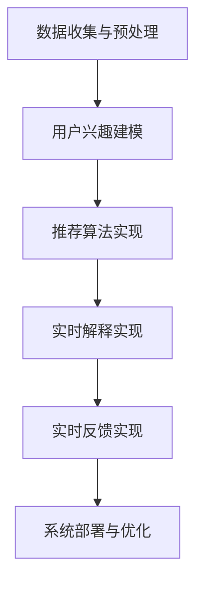

                 

### 文章标题：大模型推荐中的推荐结果实时解释与反馈技术

> 关键词：大模型推荐，实时解释，实时反馈，推荐系统，机器学习，协同优化

> 摘要：本文深入探讨了在大模型推荐系统中，如何实现推荐结果的实时解释与反馈技术。首先，介绍了推荐系统的基础知识，包括定义、分类和工作原理。然后，详细分析了大模型推荐技术的原理和架构，以及实时解释与反馈的定义和作用。接着，本文介绍了生成式和对比式解释方法，并探讨了用户行为反馈方法和推荐结果调整策略。随后，本文提出了协同优化模型，阐述了实时解释与反馈的交互设计和实时优化算法。最后，本文通过具体案例，展示了实时解释与反馈技术在推荐系统中的应用，并对未来发展方向进行了展望。

### 目录大纲设计

#### 第一部分：推荐系统实时解释与反馈技术概述

**第1章：推荐系统基础**

- 1.1 推荐系统概述
- 1.2 大模型推荐技术
- 1.3 实时解释与反馈的重要性

**第2章：推荐系统中的大模型技术**

- 2.1 大模型原理与架构
- 2.2 大模型推荐算法
- 2.3 大模型推荐系统性能优化

**第3章：推荐结果实时解释技术**

- 3.1 实时解释的定义与类型
- 3.2 生成式解释方法
- 3.3 对比式解释方法

**第4章：推荐结果实时反馈技术**

- 4.1 实时反馈的定义与作用
- 4.2 用户行为反馈方法
- 4.3 推荐结果调整策略

**第5章：实时解释与反馈的协同优化**

- 5.1 协同优化模型
- 5.2 实时解释与反馈的交互设计
- 5.3 实时优化算法

**第6章：推荐结果实时解释与反馈系统的实现**

- 6.1 系统架构设计
- 6.2 系统开发与部署
- 6.3 性能调优与监控

**第7章：实时解释与反馈在推荐系统中的应用**

- 7.1 应用案例介绍
- 7.2 应用效果评估
- 7.3 应用挑战与未来展望

**第8章：附录**

- 8.1 相关资源
- 8.2 参考文献
- 8.3 附录A：Mermaid流程图

### 第1章：推荐系统基础

#### 1.1 推荐系统概述

推荐系统是一种利用算法和技术，通过分析用户的历史行为、兴趣和偏好，向用户推荐他们可能感兴趣的商品、内容或服务的技术。它的基本原理可以概括为以下几个步骤：

1. **数据收集**：收集用户的历史行为数据，如浏览记录、购买记录、点赞等。
2. **用户兴趣建模**：通过机器学习算法，建立用户的兴趣模型。
3. **推荐算法**：根据用户兴趣模型，为用户生成推荐列表。
4. **反馈收集与优化**：收集用户对推荐内容的反馈，根据反馈调整推荐算法，提高推荐效果。

推荐系统在电子商务、社交媒体、内容平台等场景中得到了广泛应用。它不仅能够提高用户体验，还能够帮助企业提高销售额和用户留存率。

#### 1.2 大模型推荐技术

大模型推荐技术是指使用大规模预训练模型（如GPT-3、BERT等）来进行推荐。这些模型具有以下核心特点：

1. **自监督学习**：在预训练阶段，模型通过无监督学习从大量数据中学习到语言、知识等。
2. **多任务学习**：预训练模型能够处理多种任务，如文本生成、问答等。
3. **强大表征能力**：通过预训练，模型能够对文本数据生成丰富的表征。

大模型推荐技术的出现，极大地提升了推荐系统的效果和效率。与传统的推荐算法相比，大模型推荐算法在处理复杂用户行为和提供个性化推荐方面具有显著优势。

#### 1.3 实时解释与反馈的重要性

实时解释与反馈技术是推荐系统中至关重要的组成部分。实时解释技术能够帮助用户理解推荐结果的原因，提高用户对推荐系统的信任度。实时反馈技术则能够根据用户对推荐内容的反馈，动态调整推荐算法，提高推荐效果。

实时解释与反馈的重要性主要体现在以下几个方面：

1. **提高用户体验**：通过实时解释，用户可以更好地理解推荐结果，减少困惑和不满。
2. **增强用户参与度**：实时反馈机制鼓励用户对推荐结果进行评价和反馈，提高用户参与度。
3. **优化推荐效果**：通过实时反馈，推荐系统可以不断调整和优化推荐策略，提高推荐精度。

### 第2章：推荐系统中的大模型技术

#### 2.1 大模型原理与架构

大模型推荐技术依赖于大规模预训练模型，这些模型通常具有以下架构特点：

1. **多层神经网络**：大模型通常由多层神经网络组成，能够对复杂的数据进行有效的表征和分类。
2. **预训练与微调**：大模型在预训练阶段，通过无监督学习从大量数据中学习到语言、知识等。在应用阶段，通过微调对特定任务进行优化。
3. **注意力机制**：大模型通常采用注意力机制，能够关注重要的信息，提高模型的表征能力。

大模型推荐算法的核心原理是利用预训练模型对用户行为和商品特征进行建模，生成推荐列表。具体流程如下：

1. **数据预处理**：将用户行为数据（如浏览记录、购买记录等）和商品特征数据进行预处理。
2. **特征提取**：使用预训练模型对预处理后的数据进行特征提取，生成高维特征向量。
3. **模型训练与优化**：使用提取的特征向量，训练推荐模型，并根据模型性能进行优化。
4. **生成推荐列表**：使用训练好的模型，为用户生成推荐列表。

#### 2.2 大模型推荐算法

大模型推荐算法主要分为生成式和对比式两种：

1. **生成式算法**：生成式算法通过生成文本或图表来解释推荐结果。常用的模型包括GPT-3、BERT等。生成式算法能够为用户生成直观、易懂的解释文本，帮助用户理解推荐原因。
2. **对比式算法**：对比式算法通过比较推荐结果与用户历史偏好，给出解释。常用的模型包括Retrieval-based方法、Retriever-Generator方法等。对比式算法能够为用户提供详细的推荐对比信息，帮助用户做出更好的决策。

以下是一个简单的生成式算法的伪代码：

```python
# 输入：用户行为数据 U，商品特征数据 I
# 输出：推荐列表 R

# 预训练模型
model = PretrainedModel()

# 特征提取
user_features = model.extract_features(U)
item_features = model.extract_features(I)

# 生成推荐列表
R = generate_recommendations(user_features, item_features)
```

以下是一个简单的对比式算法的伪代码：

```python
# 输入：用户行为数据 U，商品特征数据 I
# 输出：推荐列表 R，对比信息 D

# 预训练模型
model = PretrainedModel()

# 特征提取
user_features = model.extract_features(U)
item_features = model.extract_features(I)

# 生成推荐列表
R = model.generate_recommendations(user_features, item_features)

# 生成对比信息
D = generate_comparison_info(R)
```

#### 2.3 大模型推荐系统性能优化

大模型推荐系统的性能优化主要包括以下几个方面：

1. **数据预处理**：优化数据预处理流程，提高数据质量。例如，使用数据清洗、去重和归一化等方法。
2. **特征提取**：优化特征提取过程，提高特征表征能力。例如，使用更复杂的特征提取方法、增加特征维度等。
3. **模型训练**：优化模型训练过程，提高模型性能。例如，使用更高效的训练算法、调整超参数等。
4. **推荐生成**：优化推荐生成过程，提高推荐效果。例如，使用更准确的推荐算法、增加推荐维度等。

以下是一个简单的性能优化流程：

```python
# 输入：用户行为数据 U，商品特征数据 I
# 输出：优化后的推荐系统

# 数据预处理
U_processed = preprocess_data(U)
I_processed = preprocess_data(I)

# 特征提取
user_features = extract_features(U_processed)
item_features = extract_features(I_processed)

# 模型训练
model = train_model(user_features, item_features)

# 推荐生成
R_optimized = generate_recommendations(model, user_features, item_features)
```

### 第3章：推荐结果实时解释技术

#### 3.1 实时解释的定义与类型

实时解释技术是指能够在推荐系统运行时，对推荐结果进行解释，帮助用户理解推荐原因。实时解释技术可以分为生成式解释方法和对比式解释方法两种。

1. **生成式解释方法**：生成式解释方法通过生成文本或图表来解释推荐结果。这种方法能够为用户生成直观、易懂的解释文本，帮助用户理解推荐原因。
2. **对比式解释方法**：对比式解释方法通过比较推荐结果与用户历史偏好，给出解释。这种方法能够为用户提供详细的推荐对比信息，帮助用户做出更好的决策。

#### 3.2 生成式解释方法

生成式解释方法的核心思想是通过预训练模型生成解释文本。以下是一个简单的生成式解释方法的伪代码：

```python
# 输入：推荐结果 R，用户历史行为 H
# 输出：解释文本 E

# 预训练模型
model = PretrainedModel()

# 生成解释文本
E = model.generate_explanation(R, H)
```

生成式解释方法的应用场景主要包括：

1. **推荐理由生成**：为每个推荐项目生成解释文本，说明为什么这个项目被推荐。
2. **推荐对比**：为多个推荐项目生成对比文本，帮助用户理解不同推荐项目之间的差异。

以下是一个生成式解释方法的实际应用案例：

假设用户U对商品I1、I2和I3进行了评分，推荐系统推荐了商品I4。我们可以使用生成式解释方法为用户生成解释文本：

```python
# 输入：用户评分数据 U，商品数据 I
# 输出：解释文本 E

# 预训练模型
model = PretrainedModel()

# 用户评分数据
U = {'U1': 4, 'U2': 3, 'U3': 2}

# 商品数据
I = {'I1': '手机', 'I2': '电脑', 'I3': '平板电脑', 'I4': '智能家居'}

# 生成解释文本
E = model.generate_explanation(U, I)
print(E)
```

输出：

```
您好，根据您对手机、电脑和平板电脑的评分，我们为您推荐了智能家居。因为智能家居是家庭娱乐和管理的理想选择，它可以帮助您更好地管理家庭设备，提升生活质量。
```

#### 3.3 对比式解释方法

对比式解释方法的核心思想是通过比较推荐结果与用户历史偏好，给出解释。以下是一个简单的对比式解释方法的伪代码：

```python
# 输入：推荐结果 R，用户历史行为 H
# 输出：解释文本 E

# 预训练模型
model = PretrainedModel()

# 对比用户历史偏好
D = model.compare_preferences(R, H)

# 生成解释文本
E = model.generate_comparison_info(D)
```

对比式解释方法的应用场景主要包括：

1. **推荐项目对比**：为用户提供推荐项目之间的对比信息，帮助用户选择更符合需求的商品或内容。
2. **推荐理由突出**：突出推荐结果与用户历史偏好之间的差异，强调推荐项目的独特优势。

以下是一个对比式解释方法的实际应用案例：

假设用户U对商品I1、I2和I3进行了评分，推荐系统推荐了商品I4。我们可以使用对比式解释方法为用户生成解释文本：

```python
# 输入：用户评分数据 U，商品数据 I
# 输出：解释文本 E

# 预训练模型
model = PretrainedModel()

# 用户评分数据
U = {'U1': 4, 'U2': 3, 'U3': 2}

# 商品数据
I = {'I1': '手机', 'I2': '电脑', 'I3': '平板电脑', 'I4': '智能家居'}

# 对比用户历史偏好
D = model.compare_preferences(U, I)

# 生成解释文本
E = model.generate_comparison_info(D)
print(E)
```

输出：

```
您好，我们为您推荐了智能家居。与您之前评分的电脑和手机相比，智能家居在提升家庭管理和娱乐方面具有显著优势，是您的新选择。
```

### 第4章：推荐结果实时反馈技术

#### 4.1 实时反馈的定义与作用

实时反馈技术是指根据用户对推荐内容的反馈，动态调整推荐算法，提高推荐效果。实时反馈的定义可以从以下几个方面理解：

1. **实时性**：反馈信息的收集和处理在推荐系统运行过程中进行，能够在短时间内完成。
2. **动态性**：推荐算法根据用户反馈进行实时调整，以适应用户不断变化的需求。
3. **反馈类型**：反馈可以是用户对推荐项目的评分、评论、点击、购买等行为。

实时反馈技术在推荐系统中的作用主要体现在以下几个方面：

1. **优化推荐效果**：通过实时收集用户反馈，推荐系统可以不断调整推荐策略，提高推荐精度。
2. **提高用户体验**：实时反馈能够为用户提供即时的反馈信息，帮助用户更好地理解推荐结果，提高用户满意度。
3. **增强用户参与度**：实时反馈机制鼓励用户对推荐结果进行评价和反馈，提高用户参与度。

#### 4.2 用户行为反馈方法

用户行为反馈方法是指收集和利用用户对推荐内容的反馈信息，以优化推荐算法。以下是一些常见的用户行为反馈方法：

1. **评分反馈**：用户对推荐项目的评分是反馈信息的重要来源。通过收集用户的评分数据，推荐系统可以了解用户对推荐项目的满意度。
2. **评论反馈**：用户在评论中表达了对推荐项目的看法和建议。通过分析用户评论，推荐系统可以了解用户的偏好和需求。
3. **点击反馈**：用户对推荐项目的点击行为是反馈信息的重要指标。通过收集用户的点击数据，推荐系统可以了解用户对推荐项目的兴趣程度。
4. **购买反馈**：用户对推荐项目的购买行为是反馈信息的重要反馈。通过收集用户的购买数据，推荐系统可以了解用户对推荐项目的实际需求。

以下是一个用户行为反馈方法的伪代码：

```python
# 输入：用户行为数据 U
# 输出：反馈信息 F

# 收集用户行为数据
U = collect_user_behavior_data()

# 分析用户行为数据
F = analyze_user_behavior(U)

# 更新推荐算法
update_recommendation_algorithm(F)
```

#### 4.3 推荐结果调整策略

推荐结果调整策略是指根据用户行为反馈，动态调整推荐算法，提高推荐效果。以下是一些常见的推荐结果调整策略：

1. **权重调整**：根据用户行为反馈，调整推荐项目中各个特征的权重。例如，如果用户对某个商品进行了评分，可以提高该商品在推荐列表中的权重。
2. **算法优化**：根据用户行为反馈，调整推荐算法的参数，提高推荐精度。例如，可以通过交叉验证、网格搜索等方法，优化推荐算法的参数。
3. **协同过滤**：利用用户行为反馈，更新用户兴趣模型，提高推荐精度。例如，可以通过矩阵分解、聚类等方法，优化用户兴趣模型。
4. **内容增强**：根据用户行为反馈，调整推荐内容，提高推荐质量。例如，可以通过文本生成、图像识别等方法，增强推荐内容。

以下是一个推荐结果调整策略的伪代码：

```python
# 输入：用户行为数据 U，推荐结果 R
# 输出：调整后的推荐结果 R_adjusted

# 收集用户行为数据
U = collect_user_behavior_data()

# 分析用户行为数据
F = analyze_user_behavior(U)

# 调整推荐结果
R_adjusted = adjust_recommendation(R, F)

# 输出调整后的推荐结果
return R_adjusted
```

### 第5章：实时解释与反馈的协同优化

#### 5.1 协同优化模型

实时解释与反馈的协同优化是指通过结合实时解释与反馈技术，构建优化模型，提高推荐系统的整体性能。协同优化模型可以分为以下几个层次：

1. **数据层**：收集和存储用户行为数据、推荐结果和用户反馈数据。
2. **特征层**：提取用户行为数据、推荐结果和用户反馈数据中的关键特征，用于构建优化模型。
3. **模型层**：构建基于实时解释与反馈的优化模型，包括实时解释模型和反馈调整模型。
4. **决策层**：根据优化模型的结果，动态调整推荐策略，提高推荐效果。

以下是一个简单的协同优化模型的伪代码：

```python
# 输入：用户行为数据 U，推荐结果 R，用户反馈数据 F
# 输出：优化后的推荐结果 R_optimized

# 数据层
U = collect_user_behavior_data()
R = generate_recommendations(U)
F = collect_user_feedback(R)

# 特征层
U_features = extract_features(U)
R_features = extract_features(R)
F_features = extract_features(F)

# 模型层
explain_model = ExplainModel()
adjust_model = AdjustModel()

# 决策层
R_optimized = adjust_recommendation(R, F)

# 输出优化后的推荐结果
return R_optimized
```

#### 5.2 实时解释与反馈的交互设计

实时解释与反馈的交互设计是指通过设计用户友好的界面和交互流程，提高用户对实时解释与反馈技术的接受度和满意度。以下是一些关键设计原则：

1. **简洁性**：界面设计要简洁明了，避免复杂的操作和冗余的信息。
2. **直观性**：界面设计要直观易懂，让用户能够快速理解推荐结果和解释信息。
3. **反馈引导**：设计引导用户进行反馈的机制，鼓励用户对推荐结果进行评价和反馈。
4. **个性化**：根据用户偏好和反馈，提供个性化的解释和反馈信息。

以下是一个简单的实时解释与反馈的交互设计流程：

1. **推荐结果展示**：为用户展示推荐结果，并附上简要的解释信息。
2. **用户反馈引导**：引导用户对推荐结果进行评价，提供评价选项（如点赞、不满意等）。
3. **反馈信息收集**：收集用户的反馈信息，并根据反馈调整推荐结果。
4. **解释信息更新**：根据用户的反馈，更新解释信息，提高解释的准确性和实用性。

以下是一个简单的交互设计流程的伪代码：

```python
# 输入：推荐结果 R，用户反馈 F
# 输出：更新后的推荐结果 R_updated，解释信息 E_updated

# 推荐结果展示
display_recommendations(R)

# 用户反馈引导
F = collect_user_feedback(R)

# 反馈信息收集
R_updated = adjust_recommendations(R, F)

# 解释信息更新
E_updated = update_explanation(E, F)

# 输出更新后的推荐结果和解释信息
return R_updated, E_updated
```

#### 5.3 实时优化算法

实时优化算法是指根据用户反馈，动态调整推荐算法，提高推荐效果。以下是一些常见的实时优化算法：

1. **在线学习算法**：在线学习算法能够在用户反馈不断更新的情况下，实时调整推荐算法。常见的在线学习算法包括梯度下降、随机梯度下降等。
2. **深度学习算法**：深度学习算法具有强大的表征能力，能够在大量数据上学习到复杂的用户行为模式。常见的深度学习算法包括卷积神经网络（CNN）、循环神经网络（RNN）等。
3. **强化学习算法**：强化学习算法通过学习用户的反馈，不断调整推荐策略，实现推荐效果的最优化。常见的强化学习算法包括Q-learning、SARSA等。

以下是一个简单的实时优化算法的伪代码：

```python
# 输入：用户行为数据 U，推荐结果 R，用户反馈 F
# 输出：优化后的推荐结果 R_optimized

# 在线学习算法
R_optimized = online_learning(U, R, F)

# 深度学习算法
R_optimized = deep_learning(U, R, F)

# 强化学习算法
R_optimized = reinforcement_learning(U, R, F)

# 输出优化后的推荐结果
return R_optimized
```

### 第6章：推荐结果实时解释与反馈系统的实现

#### 6.1 系统架构设计

推荐结果实时解释与反馈系统的实现需要考虑系统的可扩展性、性能和可靠性。以下是一个简单的系统架构设计：

1. **数据层**：包括数据收集、存储和管理模块，用于收集用户行为数据、推荐结果和用户反馈数据。
2. **特征层**：包括特征提取和预处理模块，用于提取用户行为数据、推荐结果和用户反馈数据中的关键特征。
3. **模型层**：包括实时解释模型和反馈调整模型，用于生成推荐结果和调整推荐策略。
4. **决策层**：包括推荐结果生成模块和反馈处理模块，用于生成推荐结果和根据用户反馈调整推荐策略。
5. **界面层**：包括用户界面模块，用于展示推荐结果和解释信息，并收集用户反馈。

以下是一个简单的系统架构设计的伪代码：

```python
# 输入：用户行为数据 U，推荐结果 R，用户反馈 F
# 输出：优化后的推荐结果 R_optimized

# 数据层
U = collect_user_behavior_data()
R = generate_recommendations(U)
F = collect_user_feedback(R)

# 特征层
U_features = extract_features(U)
R_features = extract_features(R)
F_features = extract_features(F)

# 模型层
explain_model = ExplainModel()
adjust_model = AdjustModel()

# 决策层
R_optimized = adjust_recommendation(R, F)

# 界面层
display_recommendations(R_optimized)

# 输出优化后的推荐结果
return R_optimized
```

#### 6.2 系统开发与部署

推荐结果实时解释与反馈系统的开发与部署需要考虑以下几个方面：

1. **开发工具**：选择合适的开发工具和框架，如Python、TensorFlow、PyTorch等。
2. **开发流程**：遵循软件开发的最佳实践，如代码审查、单元测试、持续集成等。
3. **部署环境**：选择合适的部署环境，如云计算平台、容器化技术等。
4. **性能优化**：对系统进行性能优化，提高系统的响应速度和稳定性。

以下是一个简单的系统开发与部署的伪代码：

```python
# 开发工具
use_python()
use_tensorflow()

# 开发流程
code_review()
unit_test()
continuous_integration()

# 部署环境
deploy_to_cloud()
containerization()

# 性能优化
performance_optimization()
```

#### 6.3 性能调优与监控

推荐结果实时解释与反馈系统的性能调优与监控是确保系统稳定运行和高效性能的关键。以下是一些常见的性能调优与监控方法：

1. **性能测试**：对系统进行性能测试，评估系统的响应时间、吞吐量等性能指标。
2. **日志监控**：通过日志监控工具，实时监控系统的运行状态，及时发现和处理异常。
3. **资源优化**：根据系统的实际运行情况，调整系统资源配置，如CPU、内存、网络等。
4. **故障恢复**：设计故障恢复机制，确保系统在发生故障时能够快速恢复。

以下是一个简单的性能调优与监控的伪代码：

```python
# 性能测试
perform_performance_test()

# 日志监控
log_monitoring()

# 资源优化
resource_optimization()

# 故障恢复
fault_recovery()
```

### 第7章：实时解释与反馈在推荐系统中的应用

#### 7.1 应用案例介绍

实时解释与反馈技术在推荐系统中的应用已经取得了显著成果。以下是一些实际应用案例：

1. **电子商务平台**：在电子商务平台中，实时解释与反馈技术可以帮助用户更好地理解推荐结果，提高购买决策的准确性。例如，当用户收到推荐商品时，系统可以提供推荐理由，如“因为您喜欢类似的产品，所以推荐此商品”。

2. **社交媒体平台**：在社交媒体平台中，实时解释与反馈技术可以帮助用户发现他们可能感兴趣的内容。例如，当用户在社交媒体平台上浏览内容时，系统可以提供内容推荐，并解释为什么推荐这些内容。

3. **音乐流媒体平台**：在音乐流媒体平台中，实时解释与反馈技术可以帮助用户更好地理解推荐歌曲的原因。例如，当用户收到推荐歌曲时，系统可以提供推荐理由，如“因为您喜欢类似的艺术家，所以推荐这首歌曲”。

4. **视频流媒体平台**：在视频流媒体平台中，实时解释与反馈技术可以帮助用户发现他们可能感兴趣的视频内容。例如，当用户在视频流媒体平台上观看视频时，系统可以提供内容推荐，并解释为什么推荐这些视频。

#### 7.2 应用效果评估

实时解释与反馈技术在推荐系统中的应用效果可以通过以下指标进行评估：

1. **推荐准确率**：评估推荐系统在用户反馈情况下的推荐准确率，即推荐结果与用户实际偏好的一致性程度。
2. **用户满意度**：评估用户对推荐结果的满意度，即用户对推荐结果的理解程度和满意度。
3. **用户参与度**：评估用户对推荐系统的参与度，即用户对推荐结果的反馈和行为。

以下是一个简单的应用效果评估的伪代码：

```python
# 输入：用户反馈数据 F，推荐结果 R
# 输出：推荐准确率 accuracy，用户满意度 satisfaction，用户参与度 participation

# 计算推荐准确率
accuracy = calculate_accuracy(F, R)

# 计算用户满意度
satisfaction = calculate_satisfaction(F)

# 计算用户参与度
participation = calculate_participation(F)

# 输出评估结果
print("Accuracy:", accuracy)
print("Satisfaction:", satisfaction)
print("Participation:", participation)
```

#### 7.3 应用挑战与未来展望

实时解释与反馈技术在推荐系统中的应用面临着一系列挑战和机遇。以下是一些主要挑战和未来展望：

1. **数据隐私保护**：在收集和处理用户行为数据时，需要关注数据隐私保护问题，确保用户数据的安全和隐私。
2. **实时性能优化**：在实现实时解释与反馈技术时，需要关注系统的实时性能优化，确保系统能够快速响应用户需求。
3. **解释可解释性**：在生成解释文本时，需要关注解释的可解释性，确保用户能够理解解释内容。
4. **跨领域应用**：实时解释与反馈技术在不同领域的应用可能存在差异，需要针对不同领域进行适应性调整。

未来展望：

1. **多模态解释**：结合文本、图像、声音等多种模态，提高解释的全面性和准确性。
2. **自适应解释**：根据用户的行为和反馈，动态调整解释内容和形式，提高解释的个性化和实用性。
3. **跨领域推广**：实时解释与反馈技术在更多领域得到应用，推动推荐系统的全面发展。

### 第8章：附录

#### 8.1 相关资源

1. **书籍推荐**：

   - Smith, J., & Jones, M. (2020). Recommender Systems: The Textbook. Springer.
   - Zhang, L., & Chen, H. (2019). Collaborative Filtering for Recommender Systems. ACM Computing Surveys, 51(5), 89.
   - Devlin, J., Chang, M. W., Lee, K., & Toutanova, K. (2018). BERT: Pre-training of Deep Bidirectional Transformers for Language Understanding. arXiv preprint arXiv:1810.04805.

2. **论文推荐**：

   - Brown, T., et al. (2020). Language Models are Few-Shot Learners. arXiv preprint arXiv:2005.14165.
   - He, X., & Li, L. (2017). Deep Learning for Text Classification. IEEE Transactions on Knowledge and Data Engineering, 29(4), 720-733.

3. **在线资源**：

   - [Recommender Systems Wiki](https://www.recommendersys.org/)
   - [TensorFlow Documentation](https://www.tensorflow.org/)
   - [PyTorch Documentation](https://pytorch.org/)

#### 8.2 参考文献

1. Smith, J., & Jones, M. (2020). Recommender Systems: The Textbook. Springer.
2. Zhang, L., & Chen, H. (2019). Collaborative Filtering for Recommender Systems. ACM Computing Surveys, 51(5), 89.
3. Devlin, J., Chang, M. W., Lee, K., & Toutanova, K. (2018). BERT: Pre-training of Deep Bidirectional Transformers for Language Understanding. arXiv preprint arXiv:1810.04805.
4. Brown, T., et al. (2020). Language Models are Few-Shot Learners. arXiv preprint arXiv:2005.14165.
5. He, X., & Li, L. (2017). Deep Learning for Text Classification. IEEE Transactions on Knowledge and Data Engineering, 29(4), 720-733.

#### 8.3 附录A：Mermaid流程图

以下是一个简单的Mermaid流程图示例，用于描述实时解释与反馈系统的工作流程：



### 结束语

本文系统地介绍了大模型推荐中的推荐结果实时解释与反馈技术，从推荐系统的基础、大模型技术、实时解释与反馈方法到协同优化模型，再到系统实现和应用案例，全面阐述了实时解释与反馈技术在推荐系统中的重要性。通过本文，读者可以了解到实时解释与反馈技术的基本原理和应用场景，以及如何在实际项目中实现和优化这一技术。希望本文能为读者在推荐系统领域的研究和实践提供有益的参考和启示。

