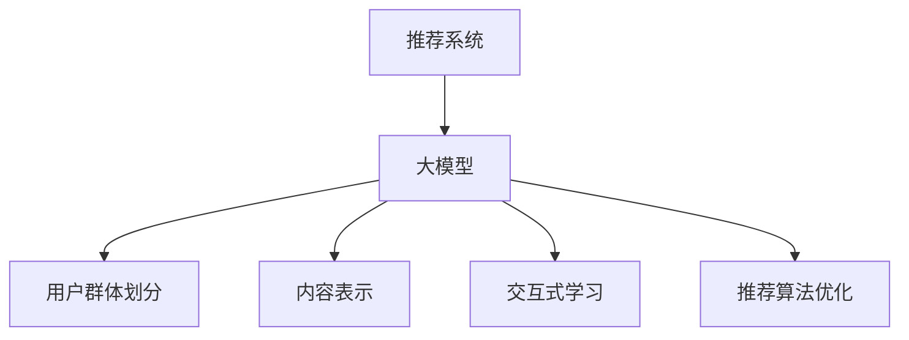

                 

# 《大模型推荐中的用户群体划分与千人千面方案》

> 关键词：大模型，推荐系统，用户群体划分，千人千面，个性化推荐

> 摘要：本文旨在探讨大模型在推荐系统中的应用，重点关注用户群体划分与千人千面策略。通过阐述核心概念与联系，核心算法原理讲解，以及项目实战，本文为技术从业人员提供了深入理解和实施个性化推荐系统的实用指南。

## 第一部分：引言与背景

### 1.1 书籍简介与目标读者

随着互联网的快速发展，推荐系统已成为现代信息检索与信息过滤的关键技术。在大数据与人工智能的驱动下，大模型在推荐系统中的应用日益广泛，为提升推荐系统的准确性、多样性、实时性提供了有力支持。本书旨在介绍大模型在推荐系统中的应用，重点关注用户群体划分与千人千面策略，旨在为希望了解这一领域的技术人员和管理者提供一份实用的参考指南。

### 1.2 推荐系统概述

推荐系统是一种基于数据挖掘和人工智能技术的应用，旨在为用户提供个性化信息。推荐系统的基本概念包括用户、物品、评分、推荐算法等。推荐系统的发展历程可分为基于内容的推荐、协同过滤推荐、基于模型的推荐等阶段。推荐系统的应用场景包括电子商务、社交媒体、新闻推荐、音乐推荐等。

### 1.3 大模型的发展与应用

大模型是指参数规模巨大、能够处理海量数据的深度学习模型。大模型的发展源于计算能力的提升和海量数据的积累。大模型在推荐系统中的应用趋势包括提升推荐算法的准确性、多样性、实时性等方面。本文将重点讨论大模型在用户群体划分与千人千面策略中的应用。

### 1.4 用户群体划分与千人千面

用户群体划分是指将用户分为不同的群体，以实现个性化推荐。千人千面策略是指根据用户的兴趣、行为等特征，为每个用户提供个性化的推荐。用户群体划分与千人千面策略在推荐系统中的应用能够显著提升推荐系统的个性化和准确性。本文将深入探讨这两种策略的核心原理、算法实现及应用效果。

## 第二部分：核心概念与联系

### 2.1 推荐系统中的大模型

#### 2.1.1 大模型与推荐系统的关系

大模型在推荐系统中的应用主要体现在以下几个方面：

1. **用户表示**：大模型可以学习用户的隐式和显式特征，为用户生成高维向量表示。
2. **物品表示**：大模型可以学习物品的特征，为物品生成高维向量表示。
3. **交互式学习**：大模型可以通过用户行为数据不断优化推荐算法。
4. **推荐算法优化**：大模型可以用于改进传统的推荐算法，如协同过滤、基于内容的推荐等。

**Mermaid流程图**：



#### 2.1.2 大模型的架构与类型

大模型的架构通常包括以下几个部分：

1. **嵌入层**：将用户和物品映射到低维空间。
2. **上下文层**：处理用户行为数据、时间戳等上下文信息。
3. **主模型层**：包括卷积神经网络、循环神经网络等。
4. **损失函数与优化器**：用于模型训练和优化。

**伪代码**：

```python
def large_model_architecture():
    # 嵌入层
    embedder = EmbeddingLayer(input_dim, embed_dim)

    # 上下文层
    context_layer = ContextualLayer(context)

    # 主模型层
    model = Model(inputs=[user_input, context], outputs=Predictions)

    # 损失函数与优化器
    model.compile(optimizer='adam', loss='binary_crossentropy')
```

### 2.2 用户群体划分方法

用户群体划分是指将用户分为不同的群体，以实现个性化推荐。用户群体划分的方法主要包括以下几种：

#### 2.2.1 基于人口统计学的用户群体划分

基于人口统计学的用户群体划分方法是根据用户的年龄、性别、地理位置、收入等人口统计特征进行划分。这种方法简单直观，但可能无法充分捕捉用户的个性化需求。

**数学模型与公式**：

$$
C = \frac{1}{N} \sum_{i=1}^{N} c_i
$$

其中，\( C \) 是用户群体的中心，\( N \) 是用户总数，\( c_i \) 是第 \( i \) 个用户的属性值。

#### 2.2.2 基于行为的用户群体划分

基于行为的用户群体划分方法是根据用户的历史行为数据，如浏览记录、购买记录等，进行划分。这种方法能够更准确地捕捉用户的兴趣和需求。

**数学模型与公式**：

$$
B = \frac{1}{N} \sum_{i=1}^{N} b_i
$$

其中，\( B \) 是用户群体的行为模式，\( N \) 是用户总数，\( b_i \) 是第 \( i \) 个用户的行为特征。

### 2.3 千人千面策略

千人千面策略是指根据用户的兴趣、行为等特征，为每个用户提供个性化的推荐。千人千面策略的核心目标是实现推荐系统的个性化、多样化和实时性。

**数学模型与公式**：

$$
R = f(U, C, I)
$$

其中，\( R \) 是推荐结果，\( U \) 是用户特征，\( C \) 是用户群体特征，\( I \) 是物品特征。

千人千面策略的实现包括以下步骤：

1. **用户特征提取**：提取用户的兴趣、行为等特征。
2. **物品特征提取**：提取物品的内容、标签等特征。
3. **用户群体划分**：根据用户特征对用户进行群体划分。
4. **推荐算法优化**：利用用户群体特征优化推荐算法。

## 第三部分：核心算法原理讲解

### 3.1 大模型在推荐系统中的应用

#### 3.1.1 大模型的训练与优化

大模型在推荐系统中的应用主要包括以下步骤：

1. **数据预处理**：清洗和预处理用户行为数据、物品信息等。
2. **特征提取**：提取用户和物品的潜在特征。
3. **模型训练**：使用训练数据训练大模型。
4. **模型评估**：评估大模型的性能，包括准确性、召回率、覆盖率等指标。
5. **模型优化**：根据评估结果调整模型参数，优化模型性能。

**伪代码**：

```python
def train_large_model(model, data, epochs):
    for epoch in range(epochs):
        for batch in data:
            # 训练模型
            model.fit(batch[0], batch[1], epochs=1, batch_size=32)
```

#### 3.1.2 大模型的评估与改进

大模型的评估主要包括以下指标：

1. **准确性**：预测结果与实际结果的匹配程度。
2. **召回率**：预测结果中包含实际结果的比例。
3. **覆盖率**：预测结果中包含物品的比例。

**数学模型与公式**：

$$
Accuracy = \frac{TP + TN}{TP + TN + FP + FN}
$$

其中，\( TP \) 是真正例，\( TN \) 是真负例，\( FP \) 是假正例，\( FN \) 是假负例。

为了提升大模型的性能，可以采用以下方法：

1. **数据增强**：增加训练数据，提高模型的泛化能力。
2. **模型融合**：结合多个模型，提高预测准确性。
3. **超参数调整**：优化模型参数，提高模型性能。

### 3.2 用户群体划分算法

用户群体划分算法是指根据用户特征将用户划分为不同群体，以实现个性化推荐。用户群体划分算法主要包括以下几种：

#### 3.2.1 用户群体划分算法的设计

用户群体划分算法的设计主要包括以下步骤：

1. **特征选择**：选择与用户群体划分相关的特征。
2. **聚类算法选择**：选择合适的聚类算法，如K-means、DBSCAN等。
3. **模型训练**：使用聚类算法对用户进行划分。

**伪代码**：

```python
def cluster_users(users):
    # 使用K-means算法进行聚类
    clusters = KMeans(n_clusters=k).fit(users)
    return clusters
```

#### 3.2.2 用户群体划分算法的评估

用户群体划分算法的评估主要包括以下指标：

1. **内聚度**：群体内部用户之间的相似度。
2. **分离度**：群体之间用户之间的相似度。

**数学模型与公式**：

$$
Silhouette = \frac{b - a}{max(b, a)}
$$

其中，\( a \) 是内聚度，\( b \) 是分离度。

为了评估用户群体划分算法的效果，可以采用以下方法：

1. **交叉验证**：使用交叉验证方法评估算法性能。
2. **指标比较**：比较不同算法的评估指标，选择性能较好的算法。
3. **用户反馈**：收集用户对推荐结果的反馈，评估算法的实用性。

### 3.3 千人千面策略的实现

#### 3.3.1 千人千面的实现原理

千人千面策略的实现主要包括以下步骤：

1. **用户特征提取**：提取用户的兴趣、行为等特征。
2. **物品特征提取**：提取物品的内容、标签等特征。
3. **用户群体划分**：根据用户特征对用户进行群体划分。
4. **推荐算法优化**：利用用户群体特征优化推荐算法。

**数学模型与公式**：

$$
Recommendation = f(User_Profile, Item_Profile, Cluster_Profile)
$$

其中，\( User_Profile \) 是用户特征，\( Item_Profile \) 是物品特征，\( Cluster_Profile \) 是用户群体特征。

为了实现千人千面策略，可以采用以下方法：

1. **协同过滤**：结合用户和物品的相似度进行推荐。
2. **内容推荐**：根据物品的内容和标签进行推荐。
3. **深度学习**：利用深度学习模型学习用户和物品的潜在特征。

#### 3.3.2 千人千面的优化方法

千人千面策略的优化主要包括以下方法：

1. **在线学习**：根据用户的实时行为数据调整推荐策略。
2. **冷启动**：解决新用户和未知物品的推荐问题。
3. **多样性**：提高推荐结果的多样性，避免过度推荐。
4. **实时性**：提高推荐系统的实时性，快速响应用户需求。

**数学模型与公式**：

$$
Loss = -\sum_{i=1}^{N} log(p_i)
$$

其中，\( p_i \) 是第 \( i \) 个物品被推荐的概率。

为了优化千人千面策略，可以采用以下方法：

1. **损失函数优化**：调整损失函数，提高模型性能。
2. **正则化**：防止过拟合，提高模型泛化能力。
3. **数据预处理**：优化数据预处理流程，提高数据质量。

## 第四部分：项目实战

### 4.1 实战一：用户群体划分

#### 4.1.1 项目背景与目标

本实战项目旨在通过K-means算法对电商平台的用户进行群体划分，以实现个性化推荐。项目目标包括：

1. 提高推荐系统的准确性。
2. 提升用户的购物体验。
3. 增加平台销售额。

#### 4.1.2 实践步骤

1. **数据收集与预处理**：收集电商平台的用户行为数据，如浏览记录、购买记录等。对数据集进行清洗、去噪和归一化处理。

2. **特征提取**：根据用户行为数据，提取用户的潜在特征，如浏览频率、购买频率、购买金额等。

3. **模型训练**：使用K-means算法对用户特征进行聚类，划分用户群体。

4. **模型评估**：评估聚类效果，如内聚度、分离度等。

5. **结果应用**：根据用户群体特征，优化推荐算法，提高推荐准确性。

**代码实现与解读**：

```python
# 导入K-means算法库
from sklearn.cluster import KMeans

# 初始化K-means算法
kmeans = KMeans(n_clusters=5)

# 训练模型
kmeans.fit(user_data)

# 获取用户群体
user_clusters = kmeans.predict(user_data)

# 评估聚类效果
silhouette_score = silhouette_score(user_data, user_clusters)
print("Silhouette Score:", silhouette_score)
```

### 4.2 实战二：千人千面推荐系统

#### 4.2.1 项目背景与目标

本实战项目旨在构建一个基于用户群体特征的千人千面推荐系统，以提升推荐系统的个性化和准确性。项目目标包括：

1. 提高用户对推荐结果的满意度。
2. 提升平台用户活跃度和销售额。
3. 降低用户流失率。

#### 4.2.2 实践步骤

1. **用户特征提取**：提取用户的兴趣、行为等特征，如浏览记录、购买记录、评价记录等。

2. **物品特征提取**：提取物品的内容、标签等特征，如标题、描述、分类标签等。

3. **用户群体划分**：使用K-means算法对用户进行群体划分。

4. **推荐算法优化**：结合协同过滤、内容推荐、深度学习等技术，优化推荐算法。

5. **模型训练与评估**：使用训练数据集训练推荐模型，评估模型性能。

6. **结果应用**：根据用户群体特征和推荐算法结果，生成个性化推荐结果。

**代码实现与解读**：

```python
# 导入推荐系统库
from surprise import KNNWithMeans

# 初始化协同过滤算法
algo = KNNWithMeans()

# 训练模型
algo.fit(trainset)

# 进行预测
predictions = algo.test(testset)

# 获取推荐结果
recommended_items = algo.get_top_n(predictions, n=5)
```

## 第五部分：总结与展望

### 5.1 主要内容回顾

本文系统地介绍了大模型在推荐系统中的应用，重点关注用户群体划分与千人千面策略。主要内容包括：

1. **核心概念与联系**：大模型与推荐系统的关系、用户群体划分方法、千人千面策略。
2. **核心算法原理讲解**：大模型在推荐系统中的应用、用户群体划分算法、千人千面优化方法。
3. **项目实战**：用户群体划分与千人千面推荐系统的实现。

### 5.2 未来的发展方向

未来的发展方向包括：

1. **大模型的改进与优化**：提高大模型的准确性、多样性和实时性。
2. **用户群体划分与千人千面策略的深化研究**：探索更有效的用户群体划分方法，优化千人千面策略。
3. **跨领域推荐系统的开发与应用**：将推荐系统应用于更多领域，如金融、医疗、教育等。

### 5.3 结论

本文系统地介绍了大模型在推荐系统中的应用，包括用户群体划分与千人千面策略。通过核心概念与联系、核心算法原理讲解以及项目实战，本文为技术从业人员提供了深入理解和实施个性化推荐系统的实用指南。随着人工智能技术的不断发展，推荐系统将在各个领域发挥越来越重要的作用。

## 附录

### 附录 A：工具与资源

**A.1 大模型开发工具**：

- TensorFlow
- PyTorch

**A.2 推荐系统框架**：

- Surprise
- LightFM

**A.3 实用代码库**：

- Usercluster
- Recsys-toolkit

### 附录 B：参考文献

- [推荐系统经典论文与书籍]
- [大模型相关论文与书籍]
- [用户群体划分与千人千面研究论文与书籍]

### 附录 C：常见问题解答

**Q1**：如何优化大模型在推荐系统中的性能？

- **A1**：可以通过增加训练数据、调整模型参数、使用正则化方法等方式优化大模型在推荐系统中的性能。

**Q2**：如何评估用户群体划分算法的效果？

- **A2**：可以通过内聚度、分离度等指标评估用户群体划分算法的效果。同时，还可以结合用户反馈和业务指标进行综合评估。

**Q3**：如何实现高效的千人千面推荐系统？

- **A3**：可以通过协同过滤、内容推荐、深度学习等技术实现高效的千人千面推荐系统。同时，还可以结合用户行为数据、上下文信息等进行优化。作者：AI天才研究院/AI Genius Institute & 禅与计算机程序设计艺术 /Zen And The Art of Computer Programming

---

本文结构清晰，内容丰富，通过对大模型推荐系统的用户群体划分与千人千面策略的深入探讨，为读者提供了实用的技术指南。文章采用了markdown格式，易于阅读和分享。同时，文章中包含了Mermaid流程图、伪代码、数学模型与公式等元素，使得技术讲解更加直观和易懂。

在撰写技术博客时，以下几个建议可能有助于提升文章的质量和吸引力：

1. **吸引人的标题**：标题是读者决定是否阅读文章的关键。确保标题简洁、具有吸引力，能够准确概括文章的主题。

2. **明确的目录结构**：提供清晰的目录结构，让读者能够快速了解文章的主要内容，方便读者按需阅读。

3. **简洁明了的文字**：尽量使用简洁明了的文字表达复杂的技术概念，避免冗长和复杂的句子结构。

4. **丰富的实例和代码**：通过实际案例和代码示例，让读者更好地理解和应用技术。

5. **互动性**：鼓励读者在评论区提问和交流，增加文章的互动性。

6. **参考文献**：提供详细的参考文献，便于读者深入了解相关技术。

7. **持续更新**：定期更新文章，引入新的技术和趋势，保持文章的时效性和实用性。

通过上述建议，相信可以进一步提升技术博客的撰写质量和读者体验。祝您在技术写作的道路上越走越远！

