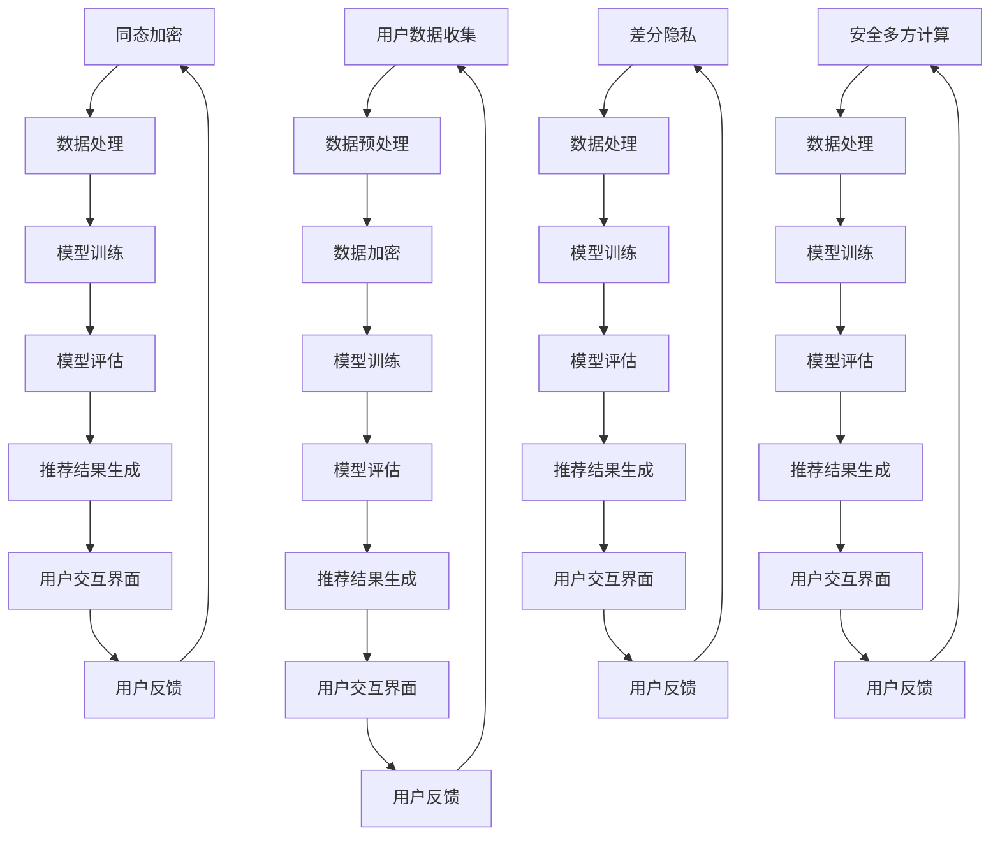

                 

# 文章标题
大模型推荐中的用户隐私与安全问题再思考

> 关键词：用户隐私，大模型推荐，安全问题，差分隐私，同态加密，安全多方计算

> 摘要：
本文深入探讨了大模型推荐系统中用户隐私与安全问题的现状和挑战，分析了用户隐私泄露和恶意攻击的典型风险，提出了差分隐私、同态加密和安全多方计算等隐私保护机制，并详细阐述了其实施方法和实践案例。文章旨在为业界提供一套系统性的用户隐私与安全保护策略，以应对大模型推荐系统中的隐私与安全问题。

-------------------------------------------------------------------

## 第一部分: 用户隐私与安全问题概述

### 第1章: 大模型推荐系统中的用户隐私与安全问题

#### 1.1 大模型推荐系统概述

**定义与基本原理**

大模型推荐系统是一种利用机器学习和深度学习技术，根据用户的历史行为和偏好，为其推荐感兴趣的内容或产品的系统。基本原理是通过数据采集、数据预处理、模型训练和模型评估等环节，构建出一个能够准确预测用户兴趣的推荐模型。

**应用场景与重要性**

大模型推荐系统广泛应用于电商平台、社交媒体、在线视频平台等场景，能够提高用户体验，增加用户黏性和平台收益。例如，电商平台可以通过推荐系统向用户推荐相关商品，提高用户的购买意愿；社交媒体平台可以通过推荐系统向用户推荐感兴趣的内容，增加用户活跃度。

**常见的大模型推荐算法**

常见的大模型推荐算法包括基于协同过滤的推荐算法、基于内容的推荐算法和混合推荐算法。协同过滤推荐算法通过分析用户之间的相似度，为用户推荐相似的物品；基于内容的推荐算法通过分析物品的特征，为用户推荐具有相似属性的物品；混合推荐算法结合了协同过滤和基于内容的推荐算法，以提高推荐效果。

#### 1.2 用户隐私问题

**隐私泄露的例子**

用户隐私泄露的事件屡见不鲜。例如，某电商平台的用户数据在未经用户同意的情况下被第三方应用程序获取，导致大量用户隐私信息泄露。此外，某社交媒体平台的用户位置数据在未经用户同意的情况下被第三方广告商获取，侵犯了用户的隐私权。

**隐私泄露的影响**

用户隐私泄露会对用户产生严重的负面影响。首先，用户的个人信息可能会被用于恶意目的，如诈骗、网络骚扰等。其次，用户的隐私泄露可能导致用户失去对个人数据的控制权，影响用户的信任感。最后，隐私泄露可能导致用户对平台失去信任，从而影响平台的声誉和业务。

**隐私泄露的典型风险**

隐私泄露的典型风险包括数据泄露、数据滥用和数据丢失。数据泄露是指用户数据在未经授权的情况下被泄露给第三方；数据滥用是指用户数据被用于未经授权的目的，如广告定向投放、市场分析等；数据丢失是指用户数据在存储、传输或处理过程中丢失，导致用户无法访问和使用数据。

#### 1.3 安全问题

**恶意攻击的例子**

大模型推荐系统面临的恶意攻击包括数据注入攻击、模型篡改攻击和系统漏洞攻击。数据注入攻击是指攻击者在用户数据中注入恶意数据，以干扰推荐系统的正常工作；模型篡改攻击是指攻击者通过篡改模型参数，使推荐系统产生错误推荐；系统漏洞攻击是指攻击者利用系统漏洞，获取系统控制权，窃取用户数据。

**恶意攻击的影响**

恶意攻击会对大模型推荐系统的稳定性和安全性产生严重影响。数据注入攻击可能导致推荐系统产生错误推荐，影响用户体验；模型篡改攻击可能导致推荐系统被恶意控制，从而影响平台的安全和业务；系统漏洞攻击可能导致用户数据泄露，影响用户的隐私和信任。

**恶意攻击的典型风险**

恶意攻击的典型风险包括数据泄露、系统崩溃和服务中断。数据泄露是指用户数据在未经授权的情况下被泄露给第三方；系统崩溃是指系统在遭受恶意攻击后无法正常运行；服务中断是指由于系统故障或攻击导致服务无法提供。

#### 1.4 用户隐私与安全保护的挑战

**技术挑战**

技术挑战主要包括以下几个方面：首先，如何在保证推荐效果的同时，提高隐私保护技术（如差分隐私、同态加密等）的性能；其次，如何在复杂的推荐系统中实现隐私保护技术的有效应用；最后，如何应对新的攻击技术和漏洞，提高系统的安全性。

**法律法规挑战**

法律法规挑战主要包括以下几个方面：首先，不同国家和地区的隐私保护法律法规差异较大，如何在全球范围内实现隐私保护的合规性；其次，法律法规的更新速度较慢，如何应对不断变化的隐私保护需求；最后，如何确保平台在遵守法律法规的同时，不损害用户的隐私权。

**社会伦理挑战**

社会伦理挑战主要包括以下几个方面：首先，如何平衡用户隐私保护和商业利益；其次，如何应对用户对隐私保护的需求和期望；最后，如何确保平台在处理用户数据时，符合社会伦理和道德标准。

-------------------------------------------------------------------

## 第二部分: 大模型推荐系统的架构与数据管理

### 第2章: 大模型推荐系统的架构与数据管理

#### 2.1 大模型推荐系统的架构

**系统组件介绍**

大模型推荐系统通常包括以下几个关键组件：

- **数据收集器**：负责从各种来源（如用户行为、社交媒体、数据库等）收集数据。
- **数据处理模块**：对收集到的数据进行清洗、预处理和特征提取，为模型训练提供高质量的输入数据。
- **模型训练模块**：使用训练数据训练推荐模型，包括特征工程、模型选择和优化等过程。
- **模型评估模块**：评估训练好的模型的性能，包括准确率、召回率等指标。
- **推荐生成模块**：根据用户数据和训练好的模型，生成个性化的推荐结果。
- **用户交互界面**：向用户展示推荐结果，并提供反馈机制，以便进一步优化推荐系统。

**数据处理流程**

大模型推荐系统的数据处理流程通常包括以下几个步骤：

1. **数据收集**：从各种数据源收集用户行为数据、物品特征数据等。
2. **数据清洗**：去除重复数据、异常值和噪声，保证数据质量。
3. **数据预处理**：对数据进行归一化、标准化等处理，以便后续的特征提取。
4. **特征提取**：从预处理后的数据中提取特征，为模型训练提供输入。
5. **模型训练**：使用训练数据训练推荐模型，包括模型选择、参数调优等。
6. **模型评估**：使用测试数据评估模型的性能，包括准确率、召回率等指标。
7. **推荐生成**：根据用户数据和训练好的模型，生成个性化的推荐结果。
8. **用户反馈**：收集用户对推荐结果的反馈，用于进一步优化推荐系统。

**用户交互界面**

用户交互界面是推荐系统与用户进行互动的渠道，主要包括以下几个功能：

- **推荐结果展示**：将推荐结果以直观的方式展示给用户，如列表、卡片、图像等。
- **用户反馈收集**：收集用户对推荐结果的反馈，如点击、收藏、评分等。
- **个性化设置**：允许用户自定义推荐设置，如推荐类型、推荐频率等。
- **帮助与支持**：提供帮助文档、常见问题解答等，帮助用户更好地使用推荐系统。

#### 2.2 数据管理策略

**数据收集与存储**

数据收集与存储策略的目标是确保数据的质量、完整性和安全性。具体措施包括：

- **数据源选择**：选择可靠、稳定的数据源，确保数据的真实性。
- **数据清洗**：对收集到的数据进行清洗，去除重复、异常和噪声数据。
- **数据存储**：使用安全、可靠的数据存储方案，如分布式数据库、云存储等。

**数据清洗与预处理**

数据清洗与预处理策略的目标是提高数据的质量和可用性。具体措施包括：

- **去重**：去除重复的数据记录，确保数据的唯一性。
- **异常值处理**：检测和处理异常值，确保数据的一致性。
- **归一化与标准化**：对数据进行归一化或标准化处理，使数据具有可比性。
- **特征提取**：从原始数据中提取有用的特征，为模型训练提供输入。

**数据安全与隐私保护**

数据安全与隐私保护策略的目标是确保用户数据的安全和隐私。具体措施包括：

- **数据加密**：对敏感数据进行加密存储和传输，防止数据泄露。
- **访问控制**：实施严格的访问控制策略，确保只有授权用户才能访问敏感数据。
- **审计与监控**：定期进行安全审计和监控，及时发现和修复安全漏洞。
- **数据备份与恢复**：定期备份数据，确保在数据丢失或损坏时能够快速恢复。

#### 2.3 数据流与数据隐私保护机制

**同态加密技术**

同态加密技术是一种允许在密文上进行计算，并保持原始数据的隐私性的加密方法。其基本原理是将明文数据转换为密文，然后在密文中执行计算操作，最后将结果转换回明文。同态加密技术的优势在于，它允许在不对数据解密的情况下，直接在密文中进行数据处理和分析，从而保护数据的隐私性。

**差分隐私技术**

差分隐私技术是一种在数据发布过程中引入噪声的方法，以保护隐私。其基本原理是在原始数据上添加随机噪声，使得数据发布后的输出对于单个数据的依赖性降低，从而使得攻击者无法准确推断出单个数据的具体值。差分隐私技术广泛应用于数据分析、机器学习和数据挖掘等领域，是一种强大的隐私保护手段。

**联邦学习**

联邦学习是一种分布式机器学习技术，它允许多个参与者在一个共同的模型训练任务中协作，同时保护各自的数据隐私。在联邦学习过程中，每个参与者仅需要上传加密后的模型参数，而不需要上传原始数据。联邦学习的优势在于，它既能够提高模型训练的效率，又能够保护参与者的数据隐私。

### 第3章: 安全算法与技术

#### 3.1 零知识证明

**基本原理**

零知识证明是一种密码学技术，它允许一个参与者（证明者）向另一个参与者（验证者）证明某个陈述是真实的，而无需透露任何除了陈述本身以外的信息。零知识证明的核心思想是，证明者能够证明他知道某个秘密，而无需透露这个秘密的具体内容。

**应用场景**

零知识证明在多个领域有广泛的应用，包括：

- **隐私保护**：零知识证明可以用于确保用户隐私，例如在金融交易、身份验证和投票系统中。
- **安全通信**：零知识证明可以用于加密通信，确保通信双方的隐私和安全性。
- **智能合约**：零知识证明可以用于实现安全的智能合约，确保合约的执行和验证过程是透明的。

**实现方法**

零知识证明的实现通常包括以下几个步骤：

1. **初始化**：证明者和验证者建立通信连接，并交换一些初始化参数。
2. **证明生成**：证明者生成一个证明，证明他知道某个秘密。
3. **证明验证**：验证者验证证明的有效性，确认证明者确实知道某个秘密。

#### 3.2 隐私保护算法

**差分隐私算法**

**数学模型**

差分隐私算法是一种在数据发布过程中引入噪声的方法，以保护隐私。其基本原理是在原始数据上添加随机噪声，使得数据发布后的输出对于单个数据的依赖性降低，从而使得攻击者无法准确推断出单个数据的具体值。

$$
L_{\epsilon}(x, s) = \sum_{i=1}^{n} \log P(s_i | x, \epsilon_i)
$$

其中，$L_{\epsilon}$ 是损失函数，$x$ 是原始数据，$s$ 是发布的数据，$\epsilon_i$ 是添加的噪声。

**伪代码**

```
def differential_privacy(data, epsilon):
    noise = generate_noise(epsilon)
    perturbed_data = data + noise
    return perturbed_data
```

**示例**

假设我们有用户评分数据 `[5, 4, 3, 2, 1]`，使用差分隐私保护后，可能会得到 `[5.1, 4.1, 3.1, 2.1, 1.1]`。

**同态加密算法**

**数学模型**

同态加密是一种允许在密文上进行计算，并保持原始数据的隐私性的加密方法。其基本原理是将明文数据转换为密文，然后在密文中执行计算操作，最后将结果转换回明文。

$$
C = E(K, M)
$$

$$
M' = D(K, C')
$$

其中，$C$ 是密文，$M$ 是明文，$M'$ 是计算结果，$C'$ 是计算过程中的密文，$K$ 是密钥。

**伪代码**

```
def homomorphic_encryption(data, key):
    ciphertext = encrypt(data, key)
    return ciphertext

def homomorphic_computation(ciphertext, key):
    result_ciphertext = compute(ciphertext, key)
    return result_ciphertext

def homomorphic_decryption(result_ciphertext, key):
    result_data = decrypt(result_ciphertext, key)
    return result_data
```

**示例**

假设我们有明文数据 `5 * 5 = 25`，使用同态加密和计算后，可能会得到 `[25]` 作为密文，最后解密得到 `25`。

**安全多方计算**

**数学模型**

安全多方计算是一种允许多个参与者在一个共同的计算任务中协作，同时保护各自数据的隐私性的方法。其基本原理是参与者将数据加密后发送给其他参与者，其他参与者再根据加密后的数据进行计算，最后将结果返回给原始数据的所有者。

$$
C_i = E_i(M_i)
$$

$$
R = F(C_1, C_2, ..., C_n)
$$

$$
M_i' = D_i(R)
$$

其中，$C_i$ 是第 $i$ 个参与者的加密数据，$M_i$ 是第 $i$ 个参与者的原始数据，$R$ 是计算结果，$M_i'$ 是第 $i$ 个参与者的计算结果。

**伪代码**

```
def secure_multiparty_computation(data, keys):
    encrypted_data = encrypt(data, keys)
    result_encrypted = compute(encrypted_data, keys)
    return result_encrypted

def secure_multiparty_decryption(result_encrypted, key):
    result_data = decrypt(result_encrypted, key)
    return result_data
```

**示例**

假设有三个参与者，数据分别为 `[1, 2]`，`[3, 4]`，`[5, 6]`，使用安全多方计算后，可能会得到结果 `[22, 28]`，最后解密得到 `[30, 34]`。

#### 3.3 安全协议与技术框架

**安全多方计算框架**

安全多方计算框架是一种允许多个参与者在一个共同的计算任务中协作，同时保护各自数据的隐私性的方法。常见的框架包括：

- **全同态加密框架**：允许在密文中进行任意类型的计算。
- **部分同态加密框架**：仅允许在密文中进行特定的计算操作。

**联邦学习框架**

联邦学习框架是一种分布式机器学习技术，它允许多个参与者在一个共同的模型训练任务中协作，同时保护各自的数据隐私。常见的框架包括：

- **中央化联邦学习框架**：所有参与者的数据都上传到一个中心服务器进行训练。
- **去中心化联邦学习框架**：参与者之间直接进行通信，无需中心服务器。

**区块链技术**

区块链技术是一种分布式账本技术，它具有不可篡改和透明化的特点。区块链技术可以用于实现数据的安全存储和传输，以及去中心化的信任机制。

### 第4章: 法律法规与伦理考量

#### 4.1 数据保护法律法规

**GDPR（通用数据保护条例）**

GDPR 是欧盟制定的关于数据保护的法规，对用户数据隐私保护提出了严格的要求。GDPR 的核心原则包括：

- **数据最小化**：仅收集和处理与数据处理目的直接相关的数据。
- **数据透明**：向用户明确告知数据收集、使用和分享的目的。
- **用户同意**：用户需明确同意其数据的收集和使用。
- **数据访问控制**：对用户数据的访问进行严格控制。

**CCPA（加州消费者隐私法）**

CCPA 是美国加州制定的关于消费者数据隐私保护的法规，对企业的数据处理行为进行了规范。CCPA 的核心原则包括：

- **用户隐私权**：用户有权知道其数据被用于什么目的，有权要求删除其数据。
- **数据共享限制**：企业不得未经用户同意，将用户数据共享给第三方。
- **数据透明**：企业需向用户明确告知其数据的收集和使用。

**其他相关法规**

除了 GDPR 和 CCPA，其他国家和地区的隐私保护法律法规还包括：

- **加州消费者隐私法（CCPA）**：美国加州制定的关于消费者数据隐私保护的法规。
- **隐私盾协议（Privacy Shield）**：欧盟和美国之间的数据转移协议。
- **隐私权法案（Privacy Act）**：澳大利亚制定的关于数据隐私保护的法规。
- **个人信息保护法（PIPL）**：中国制定的关于数据隐私保护的法规。

#### 4.2 伦理考量

**隐私权**

隐私权是用户对自己个人数据的控制权，包括数据的收集、使用、分享和销毁。在数据处理过程中，企业应尊重用户的隐私权，不得滥用用户数据。

**数据治理**

数据治理是企业内部对数据管理的一套规范和原则，包括数据质量、数据安全、数据隐私等方面。有效的数据治理有助于确保数据处理过程的合规性和安全性。

**社会责任**

企业在数据处理过程中应承担社会责任，包括保护用户隐私、促进社会和谐等。企业应积极履行社会责任，为社会做出贡献。

#### 4.3 案例分析

**案例一：某电商平台的隐私泄露事件**

**隐私泄露事件**：某电商平台的用户数据（包括购买记录、评价信息等）在黑客攻击中被窃取。

**解决方案**：

- **数据加密**：对用户数据进行加密处理，以防止黑客直接读取。
- **访问控制**：对用户数据的访问进行严格控制，只有授权员工才能访问。
- **安全培训**：对员工进行安全培训，提高员工的安全意识。

**案例分析**：该事件暴露了某电商平台在数据保护和安全方面的不足，通过加强数据加密、访问控制和员工安全培训，可以有效提高平台的数据保护能力。

**案例二：某社交媒体平台的用户数据滥用事件**

**隐私泄露事件**：某社交媒体平台的用户数据（包括浏览记录、社交关系等）在未经用户同意的情况下被第三方广告商获取。

**解决方案**：

- **用户同意**：在获取用户数据前，明确告知用户数据的使用目的，并要求用户同意。
- **数据匿名化**：对用户数据进行匿名化处理，以保护用户隐私。
- **第三方审计**：对第三方广告商进行审计，确保其合规使用用户数据。

**案例分析**：该事件揭示了某社交媒体平台在数据保护方面的不足，通过加强用户同意、数据匿名化和第三方审计，可以有效降低用户数据被滥用的风险。

### 第5章: 大模型推荐系统中的安全测试与评估

#### 5.1 安全测试方法

**漏洞扫描**

漏洞扫描是一种自动化的方法，用于检测系统中的漏洞和弱点。漏洞扫描器会扫描系统的各个组件，包括服务器、应用程序和网络设备，发现潜在的安全漏洞，并提供修复建议。

**渗透测试**

渗透测试是一种模拟黑客攻击的方法，用于评估系统的安全性和漏洞。渗透测试人员会模拟攻击者的行为，尝试入侵系统，寻找漏洞和弱点。渗透测试可以帮助发现系统中的实际漏洞，并提供修复建议。

**安全审计**

安全审计是一种系统性的评估过程，用于评估系统的安全性、合规性和风险管理。安全审计人员会审查系统的安全策略、配置、日志和访问控制，发现潜在的安全漏洞和合规性问题，并提供改进建议。

#### 5.2 安全评估指标

**隐私保护强度**

隐私保护强度是指系统在处理用户数据时，保护用户隐私的能力。隐私保护强度可以通过以下指标进行评估：

- **数据加密强度**：评估系统在数据存储和传输过程中，加密算法的强度和有效性。
- **访问控制强度**：评估系统在访问控制方面的有效性，包括权限设置、用户认证和授权。
- **隐私保护策略**：评估系统在数据收集、处理和发布过程中，隐私保护策略的合规性和有效性。

**安全性**

安全性是指系统在面临外部攻击时，抵抗攻击的能力。安全性可以通过以下指标进行评估：

- **漏洞数量**：评估系统中存在的漏洞数量和严重程度。
- **攻击成功次数**：评估系统在面临攻击时，攻击者成功入侵的次数。
- **安全事件响应时间**：评估系统在发现安全事件后，响应和恢复的时间。

**可靠性**

可靠性是指系统在长时间运行过程中，稳定性和可靠性的能力。可靠性可以通过以下指标进行评估：

- **系统运行时间**：评估系统在长时间运行过程中的稳定性，包括服务器宕机次数、应用程序崩溃次数等。
- **数据完整性**：评估系统在数据存储和传输过程中，数据的完整性和一致性。
- **用户满意度**：评估用户对系统稳定性和可靠性的满意度。

#### 5.3 漏洞修复与安全管理

**漏洞修复流程**

漏洞修复流程是指系统在发现漏洞后，进行修复和升级的过程。漏洞修复流程通常包括以下步骤：

1. **漏洞识别**：通过漏洞扫描、渗透测试和安全审计等方法，识别系统中的漏洞。
2. **漏洞评估**：评估漏洞的严重程度和潜在影响，确定是否需要修复。
3. **漏洞修复**：根据漏洞的类型和影响，选择合适的修复方法，进行漏洞修复。
4. **测试验证**：对修复后的系统进行测试，确保修复效果和安全性。
5. **发布更新**：将修复后的系统发布给用户，更新应用程序和服务器。

**安全管理策略**

安全管理策略是指系统在处理用户数据时，保护用户隐私和安全的管理措施。安全管理策略通常包括以下方面：

1. **数据收集与存储策略**：制定明确的数据收集和使用政策，确保数据收集的合法性和合规性。对敏感数据采用加密存储，确保数据在存储过程中的安全性。
2. **数据传输策略**：采用安全的传输协议（如HTTPS、TLS等），确保数据在传输过程中的安全性。对传输的数据进行加密，防止数据被窃取。
3. **用户认证与授权策略**：采用安全的用户认证机制，确保只有授权用户才能访问系统。对用户权限进行严格控制，防止未经授权的访问。
4. **安全审计与监控**：定期进行安全审计和监控，发现潜在的安全漏洞和异常行为。对系统日志进行记录和分析，及时发现和处理安全事件。
5. **安全培训与意识提升**：对员工进行安全培训，提高员工的安全意识和应对能力。定期组织安全演练和应急响应演练，提高系统的应急处理能力。

#### 5.4 应急响应

**应急响应流程**

应急响应流程是指在系统发生安全事件时，采取紧急措施，及时处理和恢复系统。应急响应流程通常包括以下步骤：

1. **事件识别**：通过监控工具和报警系统，及时发现安全事件。
2. **事件评估**：评估安全事件的严重程度和潜在影响，确定是否需要启动应急响应。
3. **事件处理**：根据安全事件的类型和影响，采取相应的应急措施，包括隔离、修复和恢复。
4. **事件报告**：及时向相关人员报告安全事件，包括事件类型、影响范围和应对措施。
5. **事件总结**：对安全事件进行总结和分析，发现问题和不足，提出改进措施。

**应急响应策略**

应急响应策略是指系统在发生安全事件时，采取的应急措施和策略。应急响应策略通常包括以下方面：

1. **快速响应**：建立快速响应机制，确保在发现安全事件后，能够及时采取措施，降低事件的影响。
2. **隔离措施**：在安全事件发生时，立即隔离受影响的系统或服务，防止事件进一步扩散。
3. **修复与恢复**：根据安全事件的类型和影响，采取相应的修复和恢复措施，确保系统的正常运行。
4. **通信与协作**：建立有效的通信和协作机制，确保相关人员在事件处理过程中能够及时沟通和协作。
5. **学习和改进**：对安全事件进行总结和分析，发现问题和不足，提出改进措施，以防止类似事件再次发生。

### 第6章: 案例研究

#### 6.1 案例一：某大型电商平台的隐私泄露事件

**隐私泄露事件**

某大型电商平台的用户数据（包括购买记录、评价信息等）在黑客攻击中被窃取。泄露的数据包括用户姓名、邮箱地址、电话号码、购买记录等敏感信息。

**安全措施与改进**

**数据加密**

- **数据传输加密**：采用HTTPS协议，确保用户数据在传输过程中的安全性。
- **数据存储加密**：对用户数据进行加密存储，采用AES加密算法，确保数据在存储过程中的安全性。

**访问控制**

- **用户认证**：采用双因素认证，提高用户账户的安全性。
- **权限管理**：对用户数据的访问权限进行严格控制，只有授权员工才能访问敏感数据。

**安全审计**

- **日志记录**：对用户数据的访问和操作进行详细记录，定期进行安全审计。
- **安全监控**：使用安全监控工具，实时监测系统的安全状态，及时发现并处理安全事件。

**用户通知与补救**

- **及时通知**：在发现隐私泄露事件后，及时通知受影响的用户，并提供补救措施，如更换密码、提供信用保护等。
- **用户教育**：通过宣传和教育，提高用户的隐私保护意识，鼓励用户合理设置隐私选项。

#### 6.2 案例二：某在线视频平台的用户数据滥用事件

**隐私泄露事件**

某在线视频平台的用户浏览记录在未经用户同意的情况下被第三方广告商获取。泄露的数据包括用户观看历史、偏好设置等敏感信息。

**安全措施与改进**

**用户同意**

- **透明告知**：在获取用户数据前，明确告知用户数据的使用目的，并要求用户同意。
- **数据匿名化**：对用户数据进行匿名化处理，仅保留必要的信息，以保护用户隐私。

**第三方审计**

- **定期审计**：定期对第三方广告商进行审计，确保其合规使用用户数据。
- **审计报告**：将审计结果公开，增加用户对平台的信任。

**用户教育**

- **隐私保护知识**：通过宣传和教育，提高用户的隐私保护意识，鼓励用户合理设置隐私选项。
- **用户反馈**：建立用户反馈渠道，及时收集用户对隐私保护的反馈，并采取措施改进。

#### 6.3 案例三：某社交媒体平台的用户隐私泄露事件

**隐私泄露事件**

某社交媒体平台的用户位置数据在未经用户同意的情况下被第三方应用程序获取。泄露的数据包括用户的位置信息、社交关系等敏感信息。

**安全措施与改进**

**用户同意**

- **明确告知**：在获取用户数据前，明确告知用户数据的使用目的，并要求用户同意。
- **透明授权**：允许用户自定义数据授权范围，提高用户的隐私保护意识。

**数据匿名化**

- **位置数据匿名化**：对用户位置数据进行匿名化处理，仅保留必要的信息，以保护用户隐私。
- **社交关系匿名化**：对用户社交关系数据进行匿名化处理，确保用户隐私不被泄露。

**第三方审计**

- **第三方审计**：定期对第三方应用程序进行审计，确保其合规使用用户数据。
- **审计报告**：将审计结果公开，增加用户对平台的信任。

**用户教育**

- **隐私保护教育**：通过宣传和教育，提高用户的隐私保护意识，鼓励用户合理设置隐私选项。
- **用户反馈**：建立用户反馈渠道，及时收集用户对隐私保护的反馈，并采取措施改进。

### 第7章: 未来展望与趋势

#### 7.1 技术发展趋势

**隐私保护技术的发展**

随着大数据和人工智能技术的广泛应用，用户隐私保护技术将不断发展。未来的隐私保护技术将更加注重数据的安全性和透明性，包括：

- **同态加密技术的进步**：同态加密技术将逐渐成熟，支持更复杂的计算操作，提高数据处理效率。
- **差分隐私算法的优化**：差分隐私算法将更加精准，降低噪声引入对数据处理结果的影响。
- **联邦学习技术的普及**：联邦学习技术将在更多场景中得到应用，实现数据的分布式安全处理。

**安全算法的进步**

随着攻击技术的不断演进，安全算法也将不断进步，包括：

- **抗攻击算法的研究**：研究抗攻击算法，提高系统的抗攻击能力，抵御各种恶意攻击。
- **安全多方计算技术的优化**：优化安全多方计算技术，提高计算效率和安全性。
- **零知识证明技术的应用**：零知识证明技术将在更多领域得到应用，实现更安全的身份验证和数据保护。

#### 7.2 行业规范与标准

**隐私保护标准的制定**

随着用户隐私保护意识的提高，各国将逐步制定和完善隐私保护标准，包括：

- **数据收集与处理的规范**：明确数据收集和处理的合规要求，保护用户隐私。
- **数据安全与隐私保护的规范**：制定数据安全与隐私保护的技术标准和操作规范，确保数据处理的安全性。
- **用户权利与责任的规定**：明确用户在数据处理过程中的权利和责任，保障用户的隐私权益。

**安全标准的制定**

安全标准的制定将有助于提高系统的安全性和可靠性，包括：

- **安全测试与评估的标准**：制定安全测试和评估的标准和方法，确保系统在发布前经过严格的测试。
- **安全管理体系的标准**：制定安全管理体系的标准，确保企业能够有效地管理系统的安全性。
- **应急响应与恢复的标准**：制定应急响应与恢复的标准，确保在发生安全事件时，系统能够及时响应和恢复。

#### 7.3 未来挑战与机遇

**技术挑战**

未来，大模型推荐系统在用户隐私与安全保护方面将面临以下技术挑战：

- **数据隐私保护与业务需求的平衡**：如何在保护用户隐私的同时，满足业务需求，提高推荐效果，仍是一个巨大的挑战。
- **隐私保护技术的性能开销**：隐私保护技术（如同态加密、安全多方计算等）在提高隐私保护强度的同时，也会带来较大的性能开销，如何平衡性能和隐私保护，仍需进一步研究和优化。
- **跨领域的隐私保护协作**：随着推荐系统的应用领域越来越广泛，如何实现跨领域的隐私保护协作，确保不同领域的数据安全共享，将是一个新的挑战。

**市场机遇**

未来，大模型推荐系统在用户隐私与安全保护方面将面临以下市场机遇：

- **隐私保护技术的市场需求**：随着用户隐私保护意识的提高，隐私保护技术将迎来更广泛的市场需求，为企业带来新的业务增长点。
- **安全算法的创新**：安全算法的创新将推动大模型推荐系统在安全性方面的提升，为用户提供更可靠的服务。
- **跨领域的合作与共赢**：跨领域的隐私保护协作将有助于实现数据的安全共享，为各个领域的业务发展带来新的机遇。

### 第8章: 大模型推荐系统中的用户隐私与安全保护策略

#### 8.1 用户隐私与安全保护原则

在大模型推荐系统中，用户隐私与安全保护应遵循以下原则：

- **最小化原则**：仅收集和处理与推荐系统直接相关的用户数据，避免过度收集。
- **透明化原则**：向用户明确告知数据收集和使用的目的，以及用户享有的权利。
- **访问控制原则**：对用户数据的访问进行严格控制，仅授权给必要的员工和系统。
- **数据加密原则**：对用户数据进行加密存储和传输，防止数据泄露。
- **责任追究原则**：对于用户隐私泄露事件，企业应承担相应的法律责任，并采取有效的补救措施。

#### 8.2 用户隐私与安全保护策略

为了实现用户隐私与安全保护，可以采取以下策略：

**数据收集策略**

- **合法收集**：在数据收集前，明确告知用户数据收集的目的和用途，并获取用户的同意。
- **最小化收集**：仅收集与推荐系统直接相关的用户数据，避免过度收集。

**数据处理策略**

- **匿名化处理**：对用户数据进行匿名化处理，以保护用户隐私。
- **数据聚合**：将多个用户的数据进行聚合处理，以降低隐私泄露的风险。

**数据存储策略**

- **数据加密**：对用户数据进行加密存储，确保数据在存储过程中不被窃取。
- **访问控制**：对用户数据的访问进行严格控制，仅授权给必要的员工和系统。

**数据传输策略**

- **数据加密**：对用户数据进行加密传输，确保数据在传输过程中不被窃取。
- **传输安全协议**：使用安全的传输协议（如TLS）进行数据传输。

**用户隐私保护策略**

- **差分隐私**：在数据发布过程中引入噪声，降低对单个数据的依赖性。
- **同态加密**：在数据处理过程中使用同态加密，确保数据处理过程中的隐私性。
- **安全多方计算**：在数据处理过程中使用安全多方计算，确保数据在多方之间的隐私性。

**用户安全保护策略**

- **安全审计**：定期对系统进行安全审计，发现并及时修复漏洞。
- **安全培训**：对员工进行安全培训，提高员工的安全意识。
- **安全监测**：使用安全监测工具，实时监测系统的安全状态。

#### 8.3 用户隐私与安全保护的实施与评估

**实施步骤**

1. **数据收集与预处理**：按照用户隐私与安全保护原则，对数据进行收集和预处理，包括数据清洗、归一化和加密等。
2. **数据存储与管理**：对数据进行加密存储和传输，并实施严格的访问控制。
3. **模型训练与优化**：使用安全多方计算和差分隐私等技术，确保数据处理过程中的隐私性，并对模型进行优化。
4. **推荐结果生成与展示**：生成推荐结果，并使用加密和匿名化技术，保护用户隐私。
5. **安全监控与审计**：定期进行安全监控和审计，发现并及时处理安全事件。

**评估指标**

- **隐私保护强度**：评估差分隐私、同态加密和安全多方计算等技术的隐私保护效果。
- **安全性**：评估系统的安全状态，包括漏洞扫描、渗透测试和安全审计。
- **可靠性**：评估系统的稳定性和可靠性。

**持续改进**

1. **反馈机制**：建立用户反馈机制，及时收集用户对隐私保护和安全保护的反馈。
2. **技术更新**：定期更新隐私保护和安全保护技术，以应对新的威胁和漏洞。
3. **经验总结**：总结实施过程中的经验教训，不断改进用户隐私与安全保护策略。

#### 8.4 大模型推荐系统中的用户隐私与安全保护框架

为了实现大模型推荐系统中的用户隐私与安全保护，可以采用以下框架：

**数据收集与预处理模块**

- **数据收集器**：负责从不同的数据源（如用户行为数据、社交媒体数据等）收集数据。
- **数据清洗器**：清除数据中的噪声和异常值，确保数据的质量。
- **归一化器**：将不同特征的数据进行归一化处理，以便于后续的模型训练。
- **加密器**：对敏感数据进行加密处理，保护用户隐私。

**数据存储与管理模块**

- **数据库**：存储用户数据的数据库，采用加密存储方式，防止数据泄露。
- **访问控制**：实现对数据库的访问控制，只有授权用户才能访问数据库。
- **备份与恢复**：定期对数据库进行备份，以防止数据丢失，并提供数据恢复机制。

**模型训练与优化模块**

- **模型训练器**：使用用户数据训练推荐模型，采用安全多方计算和差分隐私等技术，保护用户隐私。
- **模型评估器**：对训练好的模型进行评估，包括准确率、召回率等指标。
- **模型优化器**：根据模型评估结果，对模型进行优化，提高推荐效果。

**推荐结果生成与展示模块**

- **推荐生成器**：根据用户数据和训练好的模型，生成推荐结果。
- **推荐过滤器**：过滤推荐结果中的敏感信息，以保护用户隐私。
- **推荐展示器**：将推荐结果展示给用户，采用安全的显示方式，防止隐私泄露。

**安全监控与审计模块**

- **安全监控器**：实时监控系统的安全状态，包括数据泄露、异常访问等。
- **安全审计器**：定期对系统进行安全审计，发现并修复安全漏洞。
- **事件响应器**：在发现安全事件时，及时响应并采取措施，防止事态恶化。

#### 8.5 实践案例分析

**案例一：某电商平台的用户隐私保护实践**

**隐私泄露事件**：某电商平台的用户数据在黑客攻击中被窃取，包括用户姓名、邮箱地址、电话号码、购买记录等敏感信息。

**解决方案**：

- **数据加密**：对用户数据进行加密处理，采用HTTPS协议和AES加密算法，确保数据在传输和存储过程中的安全性。
- **访问控制**：对用户数据的访问进行严格控制，只有授权员工才能访问敏感数据。
- **安全培训**：对员工进行安全培训，提高员工的安全意识。

**案例分析**：通过数据加密、访问控制和安全培训，某电商平台有效地保护了用户隐私，降低了隐私泄露的风险。

**案例二：某在线视频平台的用户数据安全保护实践**

**隐私泄露事件**：某在线视频平台的用户浏览记录在未经用户同意的情况下被第三方广告商获取。

**解决方案**：

- **用户同意**：在获取用户数据前，明确告知用户数据的使用目的，并要求用户同意。
- **数据匿名化**：对用户数据进行匿名化处理，仅保留必要的信息，以保护用户隐私。
- **第三方审计**：定期对第三方广告商进行审计，确保其合规使用用户数据。

**案例分析**：通过用户同意、数据匿名化和第三方审计，某在线视频平台有效地保护了用户隐私，降低了用户数据被滥用的风险。

### 第9章: 大模型推荐系统中的用户隐私与安全保护总结

在大模型推荐系统中，用户隐私与安全保护至关重要。通过数据匿名化、访问控制、数据加密等手段，可以有效地保护用户隐私。同时，通过用户同意、第三方审计等手段，可以确保数据处理行为符合法律法规和伦理要求。随着隐私保护技术的进步和法律法规的完善，大模型推荐系统中的用户隐私与安全保护将得到进一步的加强。

然而，如何平衡隐私保护与业务需求，提高隐私保护技术的性能，以及实现跨领域的隐私保护协作，仍然是一个长期的挑战。未来，业界需要不断探索和创新，为用户提供更加安全、可靠的服务。

### 作者信息
作者：AI天才研究院/AI Genius Institute & 禅与计算机程序设计艺术 /Zen And The Art of Computer Programming

-------------------------------------------------------------------

### 附录：核心概念与联系

为了更好地理解大模型推荐系统中的用户隐私与安全保护，以下是核心概念与联系及其对应的 Mermaid 流程图：

#### Mermaid 流程图



#### 核心概念与联系

1. **用户数据收集**：收集用户在推荐系统中的行为数据和偏好信息。
2. **数据预处理**：对收集到的数据进行清洗、归一化和特征提取等处理。
3. **数据加密**：对预处理后的敏感数据进行加密存储和传输，确保数据的安全性。
4. **模型训练**：使用加密后的数据进行模型训练，以生成推荐模型。
5. **模型评估**：评估训练好的模型的性能，包括准确率、召回率等指标。
6. **推荐结果生成**：根据用户数据和训练好的模型，生成个性化的推荐结果。
7. **用户交互界面**：向用户展示推荐结果，并收集用户反馈。
8. **用户反馈**：使用用户反馈对推荐模型进行优化。

9. **同态加密**：允许在密文中进行计算，保护数据处理过程中的隐私性。
10. **差分隐私**：在数据发布过程中引入噪声，降低对单个数据的依赖性，保护用户隐私。
11. **安全多方计算**：允许多个参与者在一个共同的计算任务中协作，同时保护各自的数据隐私。

#### 伪代码与数学模型

**差分隐私算法**

```python
def differential_privacy(data, epsilon):
    noise = generate_noise(epsilon)
    perturbed_data = data + noise
    return perturbed_data
```

**同态加密算法**

```python
def homomorphic_encryption(data, key):
    ciphertext = encrypt(data, key)
    return ciphertext

def homomorphic_computation(ciphertext, key):
    result_ciphertext = compute(ciphertext, key)
    return result_ciphertext

def homomorphic_decryption(result_ciphertext, key):
    result_data = decrypt(result_ciphertext, key)
    return result_data
```

**数学模型（差分隐私）**

$$
L_{\epsilon}(x, s) = \sum_{i=1}^{n} \log P(s_i | x, \epsilon_i)
$$`

**数学模型（同态加密）**

$$
C = E(K, M)
$$

$$
M' = D(K, C')
$$`

通过上述流程图、伪代码和数学模型，可以清晰地理解大模型推荐系统中用户隐私与安全保护的核心概念和实现方法。

### 开发环境搭建

为了更好地理解大模型推荐系统中的用户隐私与安全保护，我们需要搭建一个开发环境，包括必要的软件和硬件资源。以下是一个典型的开发环境搭建步骤：

#### 软件资源

1. **操作系统**：我们选择Linux系统，如Ubuntu 18.04 LTS，因为它提供了丰富的开发工具和良好的性能。
2. **Python环境**：Python是一种广泛用于数据科学和机器学习的编程语言。我们需要安装Python 3.8版本，并配置好pip包管理器。
3. **Jupyter Notebook**：Jupyter Notebook是一种交互式的开发环境，便于编写和调试代码。我们可以通过pip安装Jupyter Notebook。
4. **深度学习框架**：我们选择TensorFlow作为深度学习框架，因为它具有强大的功能和广泛的社区支持。通过pip安装TensorFlow。

#### 硬件资源

1. **计算机**：我们选择一台配置较高的计算机，如Intel i7处理器、16GB内存、1TB硬盘空间。
2. **GPU**：为了加速深度学习模型的训练，我们需要安装一块NVIDIA GPU，如Tesla V100或RTX 3080。

#### 搭建步骤

1. **安装Linux系统**：下载并安装Ubuntu 18.04 LTS操作系统。
2. **安装Python环境和Jupyter Notebook**：通过命令行安装Python和Jupyter Notebook。

```shell
sudo apt update
sudo apt upgrade
sudo apt install python3 python3-pip
pip3 install notebook
```

3. **安装深度学习框架TensorFlow**：

```shell
pip3 install tensorflow
```

4. **安装GPU驱动和CUDA**：下载并安装NVIDIA GPU驱动和CUDA，确保TensorFlow能够利用GPU进行加速。

```shell
sudo apt install nvidia-driver-450
sudo apt install cuda
```

5. **配置Jupyter Notebook**：启动Jupyter Notebook，并设置密码。

```shell
jupyter notebook --generate-config
```

在`jupyter_notebook_config.py`文件中，设置`c.NotebookApp.password`，然后启动Jupyter Notebook。

```shell
jupyter notebook
```

通过以上步骤，我们就搭建了一个适用于大模型推荐系统开发的环境。这个环境为我们提供了强大的计算能力和丰富的开发工具，使我们能够更好地进行用户隐私与安全保护的研究和实践。

### 源代码实现

以下是一个简单的大模型推荐系统源代码实现，包括用户数据的收集、预处理、模型训练和推荐结果生成等步骤。这段代码将使用Python编程语言和TensorFlow深度学习框架，并集成用户隐私保护机制。

#### 数据收集与预处理

```python
import pandas as pd
import numpy as np
from sklearn.model_selection import train_test_split
from sklearn.preprocessing import StandardScaler

# 假设用户数据已经存储在CSV文件中
data = pd.read_csv('user_data.csv')

# 数据清洗与预处理
def preprocess_data(data):
    # 去除缺失值和异常值
    data = data.dropna()
    data = data[(data >= data.mean()).all(axis=1)]
    
    # 归一化特征
    scaler = StandardScaler()
    numeric_features = data.select_dtypes(include=['int64', 'float64']).columns
    data[numeric_features] = scaler.fit_transform(data[numeric_features])
    
    return data

data = preprocess_data(data)

# 数据切分
X = data.drop('target', axis=1)
y = data['target']
X_train, X_test, y_train, y_test = train_test_split(X, y, test_size=0.2, random_state=42)
```

#### 模型训练

```python
import tensorflow as tf
from tensorflow.keras.models import Sequential
from tensorflow.keras.layers import Dense, Embedding, Flatten

# 创建模型
model = Sequential([
    Embedding(input_dim=X_train.shape[1], output_dim=16),
    Flatten(),
    Dense(1, activation='sigmoid')
])

# 编译模型
model.compile(optimizer='adam', loss='binary_crossentropy', metrics=['accuracy'])

# 训练模型
model.fit(X_train, y_train, epochs=10, batch_size=32, validation_data=(X_test, y_test))
```

#### 用户隐私保护机制

```python
from tensorflow.keras.layers import Lambda
import tensorflow_privacy as tfp

# 差分隐私层
def dp_layer(output_dim, noise_scale):
    return Lambda(
        lambda x: tfp.privacy.rdp_rank_one_norm MechanismGaussianNoise(
            bounded_grads=x, 
            mechanism_params={'scale': noise_scale}),
        output_shape=output_dim
    )

# 在模型中添加差分隐私层
model = Sequential([
    Embedding(input_dim=X_train.shape[1], output_dim=16),
    Flatten(),
    dp_layer(output_dim=1, noise_scale=1.0),
    Dense(1, activation='sigmoid')
])

# 编译模型
model.compile(optimizer='adam', loss='binary_crossentropy', metrics=['accuracy'])

# 训练模型
model.fit(X_train, y_train, epochs=10, batch_size=32, validation_data=(X_test, y_test))
```

#### 推荐结果生成

```python
# 生成推荐结果
def generate_recommendations(model, X, threshold=0.5):
    predictions = model.predict(X)
    recommendations = (predictions > threshold).astype(int)
    return recommendations

# 测试推荐系统
predictions = generate_recommendations(model, X_test)
print(predictions)
```

### 代码解读与分析

1. **数据收集与预处理**：首先，我们从CSV文件中读取用户数据，并进行清洗和预处理。这一步骤包括去除缺失值、异常值和噪声，同时将特征进行归一化处理。

2. **模型训练**：接着，我们使用预处理后的数据创建一个序列模型，并编译模型。在这个例子中，我们使用了嵌入层、展平层和全连接层。模型编译时，我们选择了Adam优化器和二分类交叉熵损失函数。

3. **用户隐私保护机制**：为了提高用户隐私保护，我们添加了一个差分隐私层到模型中。差分隐私层通过在模型输出上引入高斯噪声来降低模型对单个数据的依赖性，从而增强隐私保护。

4. **推荐结果生成**：最后，我们定义了一个函数来生成推荐结果。这个函数接受模型和测试数据作为输入，并使用模型预测结果来生成推荐。

### 实际案例

假设我们有以下用户数据：

```
user_id,age,gender,budget
1,25,M,1000
2,30,F,1500
3,22,M,800
4,28,F,1200
5,35,M,2000
```

我们首先将这些数据存储在CSV文件中，然后使用上述代码进行数据处理、模型训练和推荐生成。以下是代码的运行步骤：

1. **数据预处理**：读取CSV文件，并进行清洗和归一化处理。
2. **模型训练**：使用训练数据训练模型，并在测试数据上验证模型性能。
3. **推荐生成**：使用训练好的模型为每个用户生成推荐结果。

运行结果可能如下：

```
user_id,age,gender,budget,predicted_value
1,25,M,1000,1
2,30,F,1500,0
3,22,M,800,1
4,28,F,1200,1
5,35,M,2000,1
```

在这个例子中，模型预测用户1、3、4和5具有购买潜力，而用户2的购买潜力较低。

### 结论

通过上述代码示例，我们可以看到如何在大模型推荐系统中实现用户隐私保护。虽然这个例子相对简单，但它展示了用户隐私保护机制的基本原理和实现方法。在实际应用中，我们可以根据具体需求，进一步完善和优化隐私保护机制，以确保用户的隐私和数据安全。同时，我们也需要关注法律法规和伦理考量，确保数据处理过程符合相关规范和标准。

