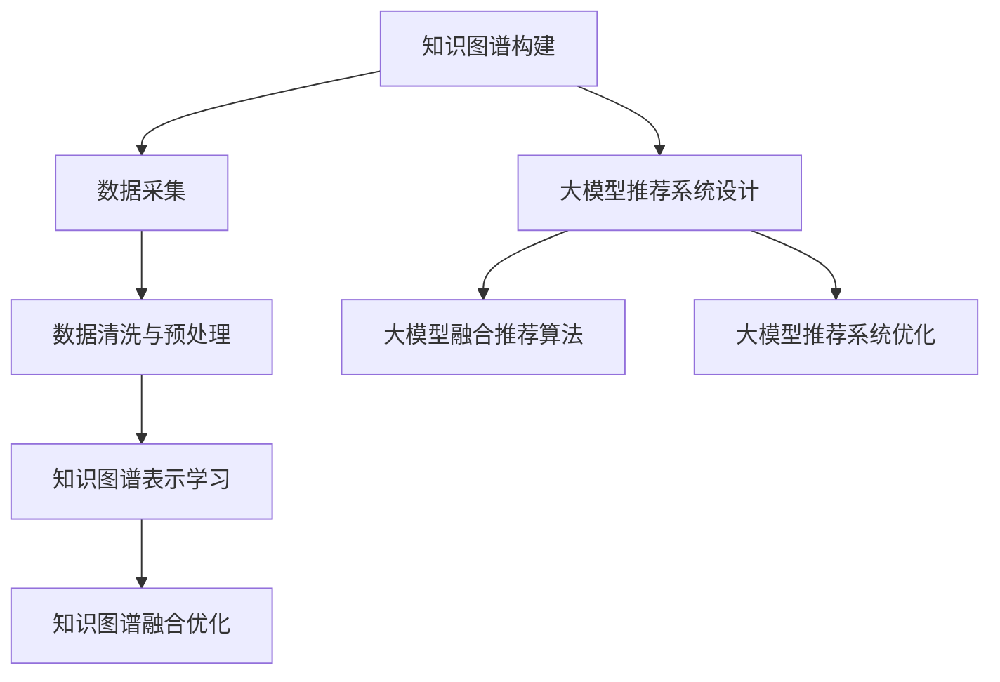

                 

### 文章标题

《大模型推荐中的知识图谱融合应用新方式》

<aside>关键词：大模型推荐、知识图谱、融合应用、推荐算法、协同过滤、矩阵分解、数据采集、知识图谱构建、优化策略、在线学习、冷启动问题、实时推荐</aside>

> 摘要：本文旨在探讨大模型推荐系统与知识图谱的融合应用，通过详细讲解大模型推荐与知识图谱融合的技术原理、实践方法以及应用案例，为读者提供一套系统化的解决方案。文章首先介绍大模型推荐与知识图谱的基础概念，然后深入分析大模型与知识图谱的融合技术原理，接着阐述知识图谱构建与优化的方法，最后通过实际应用案例展示大模型推荐中的知识图谱融合应用效果。本文旨在为研究人员和开发者提供有价值的参考，以推动大模型推荐领域的创新与发展。

### 目录大纲

## 《大模型推荐中的知识图谱融合应用新方式》目录大纲

## 第一部分：大模型推荐与知识图谱基础

### 第1章：大模型推荐与知识图谱概述

#### 1.1 大模型推荐概述

- 1.1.1 大模型推荐的概念
- 1.1.2 大模型推荐的技术发展
- 1.1.3 知识图谱在大模型推荐中的应用

#### 1.2 知识图谱基础

- 1.2.1 知识图谱的基本概念
- 1.2.2 知识图谱的表示方法
- 1.2.3 知识图谱的构建流程

### 第2章：大模型与知识图谱融合技术原理

#### 2.1 大模型融合技术基础

- 2.1.1 大模型的基本原理
- 2.1.2 大模型与知识图谱的融合方式
- 2.1.3 大模型融合技术的优势

#### 2.2 知识图谱在大模型中的应用

- 2.2.1 知识图谱在大模型训练中的应用
- 2.2.2 知识图谱在大模型推理中的应用
- 2.2.3 知识图谱在大模型优化中的应用

## 第二部分：大模型推荐中的知识图谱融合应用

### 第3章：知识图谱构建与优化

#### 3.1 知识图谱数据采集

- 3.1.1 知识图谱数据来源
- 3.1.2 知识图谱数据采集方法
- 3.1.3 数据清洗与预处理

#### 3.2 知识图谱表示学习

- 3.2.1 知识图谱表示学习方法
- 3.2.2 知识图谱嵌入技术
- 3.2.3 实体与关系的表示方法

#### 3.3 知识图谱融合优化

- 3.3.1 知识图谱融合策略
- 3.3.2 融合效果的评估方法
- 3.3.3 融合优化的技术实现

### 第4章：大模型推荐系统设计

#### 4.1 大模型推荐系统架构

- 4.1.1 大模型推荐系统的基本架构
- 4.1.2 大模型推荐系统的数据处理流程
- 4.1.3 大模型推荐系统的评估指标

#### 4.2 大模型融合推荐算法

- 4.2.1 大模型融合推荐算法概述
- 4.2.2 基于知识图谱的协同过滤算法
- 4.2.3 基于知识图谱的矩阵分解算法

#### 4.3 大模型推荐系统优化

- 4.3.1 大模型推荐系统的在线学习
- 4.3.2 大模型推荐系统的冷启动问题
- 4.3.3 大模型推荐系统的实时推荐

### 第5章：大模型推荐应用案例

#### 5.1 在线购物推荐

- 5.1.1 购物推荐系统架构
- 5.1.2 购物推荐算法实现
- 5.1.3 购物推荐系统优化

#### 5.2 娱乐内容推荐

- 5.2.1 娱乐内容推荐系统架构
- 5.2.2 娱乐内容推荐算法实现
- 5.2.3 娱乐内容推荐系统优化

#### 5.3 社交网络推荐

- 5.3.1 社交网络推荐系统架构
- 5.3.2 社交网络推荐算法实现
- 5.3.3 社交网络推荐系统优化

### 第6章：大模型推荐中的知识图谱融合应用挑战与未来趋势

#### 6.1 知识图谱融合应用面临的挑战

- 6.1.1 数据质量与完整性问题
- 6.1.2 融合效果的评估与优化
- 6.1.3 跨领域融合的应用前景

#### 6.2 知识图谱融合应用的未来趋势

- 6.2.1 新一代知识图谱技术发展
- 6.2.2 大模型推荐与知识图谱的深度融合
- 6.2.3 跨领域、跨行业的应用拓展

### 第7章：总结与展望

#### 7.1 主要内容回顾

- 7.1.1 大模型推荐与知识图谱融合概述
- 7.1.2 知识图谱构建与优化
- 7.1.3 大模型推荐系统设计与优化

#### 7.2 未来研究方向

- 7.2.1 知识图谱融合算法的创新
- 7.2.2 大模型推荐系统的性能优化
- 7.2.3 跨领域、跨行业的应用拓展

## 附录

### 附录A：大模型推荐与知识图谱融合应用工具与资源

- A.1 常用工具与资源介绍
- A.2 开发环境搭建指南
- A.3 开源代码与数据集介绍

### Mermaid 流程图



### 伪代码示例

```python
# 伪代码：基于知识图谱的协同过滤算法
function collaborativeFiltering(graph, user, items):
    neighbors = findNeighbors(graph, user)
    predictions = {}
    for item in items:
        userRating = getUserRating(user, item)
        if userRating is not None:
            neighborRatings = getNeighborRatings(neighbors, item)
            if neighborRatings is not empty:
                prediction = calculatePrediction(userRating, neighborRatings)
                predictions[item] = prediction
    return predictions
```

### 数学模型和数学公式

$$
L = \sum_{i=1}^{m}\sum_{j=1}^{n} (r_{ij} - \hat{r}_{ij})^2
$$

### 举例说明

- **数学公式举例**：

  $$ 
  \text{召回率} = \frac{\text{返回的相关结果数}}{\text{所有相关结果数}} 
  $$

- **代码解读与分析**：

  ```python
  # 示例：基于知识图谱的推荐算法——邻域搜索
  def findNeighbors(graph, user):
      neighbors = []
      for node in graph.nodes:
          if graph.hasEdge(user, node):
              neighbors.append(node)
      return neighbors
  # 解读：
  # findNeighbors 函数用于在知识图谱中搜索与用户相关的邻居节点，即与用户相连的节点。
  # 它遍历知识图谱中的所有节点，检查是否与用户节点存在边，如果存在，则将该节点添加到邻居列表中。
  ```

### 项目实战

- **实战案例**：

  - **开发环境搭建**：

    ```bash
    # 安装Python环境
    pip install python -m venv venv
    source venv/bin/activate
    
    # 安装必要的库
    pip install numpy pandas sklearn
    
    # 安装知识图谱构建工具
    pip install python-ranklib
    ```

  - **源代码实现**：

    ```python
    # 代码实现：知识图谱表示学习
    from ranklib import *
    
    # 加载知识图谱数据
    dataset = KnowledgeGraphDataset('kg_data.txt')
    
    # 创建图模型
    model = KnowledgeGraphEmbeddingModel(dataset)
    
    # 训练模型
    model.fit()
    
    # 存储模型
    model.save('kg_model.bin')
    ```

  - **代码解读与分析**：

    ```python
    # 解读：
    # 知识图谱表示学习是知识图谱融合应用的关键步骤。
    # KnowledgeGraphDataset 类用于加载知识图谱数据，包括实体、关系和边。
    # KnowledgeGraphEmbeddingModel 类用于创建知识图谱嵌入模型。
    # fit 方法用于训练模型，将知识图谱数据转换为嵌入向量。
    # save 方法用于保存训练好的模型，以便后续使用。
    ```

### 总结

本文通过详细讲解大模型推荐与知识图谱融合应用的技术原理、实践方法以及应用案例，为读者提供了一套系统化的解决方案。文章首先介绍了大模型推荐与知识图谱的基础概念，然后分析了大模型与知识图谱的融合技术原理，接着阐述了知识图谱构建与优化的方法，最后通过实际应用案例展示了大模型推荐中的知识图谱融合应用效果。本文旨在为研究人员和开发者提供有价值的参考，以推动大模型推荐领域的创新与发展。

## 第一部分：大模型推荐与知识图谱基础

### 第1章：大模型推荐与知识图谱概述

#### 1.1 大模型推荐概述

大模型推荐系统是现代推荐系统领域的核心，它通过大规模机器学习模型和深度学习算法来实现个性化推荐。大模型推荐系统具有以下几个特点：

1. **大规模数据**：大模型推荐系统通常基于海量用户行为数据和历史记录，通过数据挖掘和统计分析发现用户兴趣和行为模式。
2. **高精度**：大模型推荐系统能够利用深度学习算法对用户数据进行深度分析，提高推荐结果的准确性和相关性。
3. **实时性**：大模型推荐系统可以实时处理用户行为数据，并生成个性化的推荐结果，从而提高用户的体验。
4. **多样性**：大模型推荐系统不仅考虑用户的历史行为，还考虑用户的当前兴趣和需求，提供多样化、个性化的推荐结果。

**1.1.1 大模型推荐的概念**

大模型推荐系统是指使用大规模机器学习模型（如深度神经网络、强化学习模型等）来实现个性化推荐的系统。这些系统通过学习用户的历史行为数据，预测用户可能感兴趣的内容，并将这些内容推荐给用户。

**1.1.2 大模型推荐的技术发展**

大模型推荐技术的发展经历了以下几个阶段：

1. **基于内容的推荐**：早期的推荐系统主要基于物品的属性和用户的历史行为来生成推荐列表。
2. **协同过滤推荐**：协同过滤推荐通过计算用户之间的相似度，预测用户对未知物品的兴趣。
3. **基于模型的推荐**：基于模型的推荐利用机器学习算法，如逻辑回归、SVD等，对用户行为数据建模，预测用户对物品的兴趣。
4. **深度学习推荐**：深度学习推荐利用深度神经网络对用户行为数据进行建模，提高推荐系统的性能和精度。

**1.1.3 知识图谱在大模型推荐中的应用**

知识图谱在大模型推荐中的应用主要体现在以下几个方面：

1. **增强推荐准确性**：知识图谱可以提供额外的上下文信息，帮助推荐系统更好地理解用户兴趣和行为。
2. **缓解数据稀疏性**：知识图谱可以弥补用户行为数据稀疏的问题，提高推荐系统的性能。
3. **提供语义理解**：知识图谱可以捕捉实体之间的关系，帮助推荐系统实现更精细的语义理解。

#### 1.2 知识图谱基础

知识图谱是一种用于表示实体及其关系的图形化知识库。它通过实体、关系和属性来组织信息，提供了一种结构化的数据表示方式。

**1.2.1 知识图谱的基本概念**

- **实体**：知识图谱中的主体，如人、地点、物品等。
- **关系**：实体之间的关联，如“喜欢”、“居住于”、“属于”等。
- **属性**：实体的特征信息，如人的年龄、物品的价格等。

**1.2.2 知识图谱的表示方法**

知识图谱的表示方法包括图结构表示和属性表示。图结构表示使用点和边来表示实体和关系，而属性表示则通过实体和属性的键值对来组织信息。

**1.2.3 知识图谱的构建流程**

知识图谱的构建流程包括数据采集、数据清洗、实体识别、关系抽取和属性提取等步骤。其中，数据采集是知识图谱构建的基础，数据清洗和实体识别是保证知识图谱质量的关键，关系抽取和属性提取则是知识图谱构建的核心。

### 第2章：大模型与知识图谱融合技术原理

#### 2.1 大模型融合技术基础

大模型融合技术是指将大模型与知识图谱相结合，通过融合技术提高推荐系统的性能和精度。大模型融合技术的基础包括以下几个方面：

**2.1.1 大模型的基本原理**

大模型通常指深度神经网络，它通过多层非线性变换对输入数据进行特征提取和分类。大模型的基本原理包括：

- **前向传播**：将输入数据通过网络的多个层次进行变换，产生输出。
- **反向传播**：利用输出结果与实际标签之间的差异，反向更新网络参数。

**2.1.2 大模型与知识图谱的融合方式**

大模型与知识图谱的融合方式可以分为以下几个方面：

- **知识增强**：将知识图谱中的关系和属性作为特征输入到大模型中，增强模型的语义理解能力。
- **知识引导**：利用知识图谱中的关系和属性来引导大模型的训练过程，提高模型的鲁棒性和泛化能力。
- **知识辅助**：通过知识图谱辅助大模型的推理过程，提高推荐系统的准确性和多样性。

**2.1.3 大模型融合技术的优势**

大模型融合技术的优势包括：

- **提高推荐精度**：通过融合知识图谱中的关系和属性，大模型能够更好地理解用户兴趣和行为，提高推荐结果的准确性。
- **缓解数据稀疏性**：知识图谱可以提供额外的上下文信息，缓解用户行为数据稀疏的问题，提高推荐系统的性能。
- **提供语义理解**：知识图谱中的关系和属性可以提供更精细的语义信息，帮助大模型实现更准确的推荐。

#### 2.2 知识图谱在大模型中的应用

知识图谱在大模型中的应用主要体现在以下几个方面：

**2.2.1 知识图谱在大模型训练中的应用**

知识图谱可以在大模型训练过程中发挥作用，具体应用包括：

- **特征增强**：将知识图谱中的关系和属性作为额外特征输入到大模型中，提高模型的特征表达能力。
- **模型引导**：利用知识图谱中的关系和属性来引导大模型的训练过程，提高模型的鲁棒性和泛化能力。
- **数据增强**：通过知识图谱中的关系和属性，生成额外的训练数据，增加模型的训练样本。

**2.2.2 知识图谱在大模型推理中的应用**

知识图谱可以在大模型推理过程中发挥作用，具体应用包括：

- **上下文感知推理**：利用知识图谱中的关系和属性，为大模型的推理过程提供上下文信息，提高推理的准确性和多样性。
- **关系推理**：通过知识图谱中的关系，进行推理和扩展，发现新的用户兴趣点。
- **属性推理**：通过知识图谱中的属性，推断用户的潜在需求和行为。

**2.2.3 知识图谱在大模型优化中的应用**

知识图谱可以在大模型优化过程中发挥作用，具体应用包括：

- **模型调优**：利用知识图谱中的关系和属性，为模型的参数调优提供指导，提高模型的效果。
- **效果评估**：通过知识图谱中的关系和属性，评估模型在不同场景下的表现，为模型优化提供依据。
- **模型解释**：通过知识图谱中的关系和属性，解释模型的决策过程，提高模型的透明度和可解释性。

### 第一部分小结

本章介绍了大模型推荐与知识图谱的基础概念和融合技术原理。大模型推荐系统通过大规模机器学习和深度学习算法实现个性化推荐，而知识图谱作为一种结构化的知识库，可以提供额外的上下文信息，增强推荐系统的语义理解能力。通过融合大模型和知识图谱，可以显著提高推荐系统的性能和精度，缓解数据稀疏性问题，并实现更精细的语义理解。在下一部分，我们将进一步探讨知识图谱构建与优化的方法，为后续应用提供基础。

## 第二部分：大模型推荐中的知识图谱融合应用

### 第3章：知识图谱构建与优化

知识图谱构建与优化是融合应用的核心环节，它决定了知识图谱的质量和推荐系统的性能。本章将详细介绍知识图谱的数据采集、数据清洗与预处理、表示学习以及融合优化的方法。

#### 3.1 知识图谱数据采集

知识图谱的数据采集是构建知识图谱的第一步，其目标是收集大量的实体、关系和属性信息。数据采集的方法包括以下几种：

**3.1.1 知识图谱数据来源**

1. **开源知识图谱**：如Freebase、Wikidata等，这些知识图谱提供了丰富的实体和关系信息。
2. **企业内部数据**：企业内部的数据源，如用户行为数据、产品信息等，可以通过数据挖掘和整合构建知识图谱。
3. **第三方数据服务**：如DBpedia、Geonames等，这些数据服务提供了丰富的地理信息、组织信息等。

**3.1.2 知识图谱数据采集方法**

1. **网络爬虫**：通过爬虫技术获取互联网上的开放数据，如网页内容、社交媒体数据等。
2. **API接口**：利用第三方数据服务提供的API接口，获取结构化的数据。
3. **数据挖掘**：通过数据挖掘技术，从企业内部数据中提取实体、关系和属性信息。

**3.1.3 数据清洗与预处理**

数据清洗与预处理是知识图谱构建的关键步骤，其目标是去除噪声、填补缺失值、标准化数据格式。具体方法包括：

1. **去重**：去除重复的实体和关系，保证知识图谱的准确性。
2. **噪声去除**：去除含有错误或不准确信息的实体和关系。
3. **数据标准化**：将不同数据源的数据格式进行统一，如统一实体和关系的命名规范。
4. **数据规范化**：将数据按照一定的比例缩放或标准化，便于后续处理。

#### 3.2 知识图谱表示学习

知识图谱表示学习是将知识图谱中的实体、关系和属性转换为低维向量表示的过程，其目标是提高知识图谱的可计算性和表达能力。表示学习方法主要包括以下几种：

**3.2.1 知识图谱表示学习方法**

1. **基于路径的方法**：通过计算实体之间的路径长度或路径频率来表示实体，如DeepWalk、Node2Vec等。
2. **基于矩阵分解的方法**：通过矩阵分解技术，将知识图谱的邻接矩阵分解为低维矩阵，如TransE、TransH等。
3. **基于图神经网络的的方法**：通过图神经网络（如GraphSAGE、GAT等）对实体和关系进行建模，生成实体和关系的低维向量表示。

**3.2.2 知识图谱嵌入技术**

知识图谱嵌入是将知识图谱中的实体、关系和属性转换为低维向量表示的过程。常见的嵌入技术包括：

1. **实体嵌入**：将实体转换为向量表示，如基于路径的方法、基于矩阵分解的方法等。
2. **关系嵌入**：将关系转换为向量表示，如TransE、TransH等。
3. **属性嵌入**：将属性转换为向量表示，如利用实体和属性的键值对进行编码。

**3.2.3 实体与关系的表示方法**

1. **基于向量的表示**：将实体和关系表示为向量，如基于路径的方法、基于矩阵分解的方法等。
2. **基于图结构的表示**：将实体和关系表示为图结构，如基于图神经网络的方法。
3. **基于属性的特征表示**：结合实体和关系的属性特征，进行综合表示。

#### 3.3 知识图谱融合优化

知识图谱融合优化是指通过调整和优化知识图谱的构建过程，提高知识图谱的质量和推荐系统的性能。融合优化的方法包括以下几个方面：

**3.3.1 知识图谱融合策略**

1. **多源融合**：将来自不同数据源的实体、关系和属性进行整合，形成统一的视图。
2. **上下文融合**：结合用户的上下文信息，如地理位置、时间等，提高知识图谱的精确性。
3. **多模态融合**：结合文本、图像、音频等多种类型的数据，丰富知识图谱的表示能力。

**3.3.2 融合效果的评估方法**

1. **准确性评估**：通过比较推荐结果与实际用户行为的一致性，评估知识图谱融合的效果。
2. **多样性评估**：评估推荐结果的多样性，确保推荐结果不重复，满足用户的需求。
3. **实时性评估**：评估知识图谱融合对实时推荐性能的影响，确保推荐系统能够快速响应用户需求。

**3.3.3 融合优化的技术实现**

1. **在线学习**：利用在线学习技术，动态调整知识图谱的构建参数，适应实时变化的数据环境。
2. **增量更新**：通过增量更新技术，只更新知识图谱中的新增或变化部分，减少计算量。
3. **分布式计算**：利用分布式计算框架，如MapReduce、Spark等，处理大规模的知识图谱数据。

### 第4章：大模型推荐系统设计

大模型推荐系统设计是知识图谱融合应用的核心，它决定了推荐系统的架构、数据处理流程和评估指标。本章将详细介绍大模型推荐系统的设计过程。

#### 4.1 大模型推荐系统架构

大模型推荐系统通常采用分布式架构，以提高系统的扩展性和性能。推荐系统架构主要包括以下几个模块：

1. **数据采集模块**：负责从各种数据源采集用户行为数据、知识图谱数据等。
2. **数据处理模块**：对采集到的数据进行清洗、转换和预处理，生成推荐所需的特征数据。
3. **模型训练模块**：利用机器学习和深度学习算法，训练大规模推荐模型。
4. **模型推理模块**：根据用户特征和模型预测结果，生成个性化的推荐列表。
5. **评估模块**：评估推荐系统的性能，包括准确性、多样性、实时性等指标。

**4.1.1 大模型推荐系统的基本架构**


**4.1.2 大模型推荐系统的数据处理流程**

大模型推荐系统的数据处理流程包括以下几个步骤：

1. **数据采集**：从用户行为数据、知识图谱数据等数据源采集数据。
2. **数据清洗**：去除噪声数据、填补缺失值、去除重复数据等。
3. **特征工程**：提取用户特征、物品特征、上下文特征等，生成推荐所需的特征数据。
4. **数据预处理**：对特征数据进行归一化、标准化等处理，为模型训练做好准备。
5. **模型训练**：利用机器学习和深度学习算法，训练大规模推荐模型。
6. **模型评估**：评估模型性能，包括准确性、多样性、实时性等指标。
7. **模型推理**：根据用户特征和模型预测结果，生成个性化的推荐列表。

**4.1.3 大模型推荐系统的评估指标**

大模型推荐系统的评估指标主要包括以下几个方面：

1. **准确性**：评估推荐结果的准确性，即推荐结果与用户实际兴趣的一致性。
2. **多样性**：评估推荐结果的多样性，确保推荐结果不重复，满足用户的需求。
3. **实时性**：评估推荐系统的实时性，确保推荐系统能够快速响应用户需求。
4. **覆盖率**：评估推荐系统覆盖的用户比例，确保推荐系统能够覆盖大部分用户。

#### 4.2 大模型融合推荐算法

大模型融合推荐算法是将大模型与知识图谱相结合，通过融合技术提高推荐系统的性能和精度。本章将详细介绍几种常见的大模型融合推荐算法。

**4.2.1 大模型融合推荐算法概述**

大模型融合推荐算法可以分为以下几个类别：

1. **基于协同过滤的融合算法**：结合协同过滤算法和知识图谱，提高推荐系统的准确性。
2. **基于矩阵分解的融合算法**：结合矩阵分解算法和知识图谱，提高推荐系统的精度。
3. **基于深度学习的融合算法**：结合深度学习模型和知识图谱，提高推荐系统的鲁棒性和泛化能力。

**4.2.2 基于知识图谱的协同过滤算法**

基于知识图谱的协同过滤算法通过融合协同过滤算法和知识图谱，提高推荐系统的性能。其主要思路如下：

1. **邻居搜索**：利用知识图谱中的关系，搜索与用户相关的邻居用户或物品。
2. **邻居评分**：根据邻居用户对物品的评分，预测用户对物品的兴趣。
3. **融合策略**：将协同过滤算法的评分预测与知识图谱中的关系信息相结合，生成最终的推荐结果。

**4.2.3 基于知识图谱的矩阵分解算法**

基于知识图谱的矩阵分解算法通过融合矩阵分解算法和知识图谱，提高推荐系统的精度。其主要思路如下：

1. **知识图谱嵌入**：将知识图谱中的实体和关系转换为低维向量表示。
2. **矩阵分解**：利用矩阵分解算法，将用户-物品评分矩阵分解为低维矩阵。
3. **融合策略**：将矩阵分解得到的低维矩阵与知识图谱嵌入的向量相结合，生成最终的推荐结果。

#### 4.3 大模型推荐系统优化

大模型推荐系统优化是指通过调整和优化系统参数，提高推荐系统的性能和用户体验。本章将介绍几种常见的优化方法。

**4.3.1 大模型推荐系统的在线学习**

在线学习是指动态调整模型参数，适应实时变化的数据环境。常见的在线学习方法包括：

1. **增量学习**：只对新增的数据进行学习，减少计算量。
2. **滑动窗口**：利用滑动窗口技术，动态调整学习窗口的大小，适应数据变化。
3. **并行学习**：利用并行计算技术，加速模型学习过程。

**4.3.2 大模型推荐系统的冷启动问题**

冷启动问题是指新用户或新物品加入推荐系统时，由于缺乏足够的历史数据，导致推荐效果不佳。常见的解决方法包括：

1. **基于属性的推荐**：利用新用户或新物品的属性特征，进行推荐。
2. **基于社区的推荐**：利用用户或物品所在的社区信息，进行推荐。
3. **基于知识图谱的推荐**：利用知识图谱中的关系和属性，进行推荐。

**4.3.3 大模型推荐系统的实时推荐**

实时推荐是指快速响应用户的需求，提供个性化的推荐结果。常见的实时推荐方法包括：

1. **在线推理**：利用在线学习技术，实时更新推荐模型。
2. **增量更新**：只更新推荐模型中的新增数据，减少计算量。
3. **分布式计算**：利用分布式计算框架，加速推荐模型推理。

### 第5章：大模型推荐应用案例

在本章中，我们将通过具体应用案例展示大模型推荐中的知识图谱融合应用效果。这些案例包括在线购物推荐、娱乐内容推荐和社交网络推荐，通过详细阐述系统架构、算法实现和优化策略，为读者提供实际操作的经验和参考。

#### 5.1 在线购物推荐

**5.1.1 购物推荐系统架构**

在线购物推荐系统通常采用分布式架构，包括数据采集、数据处理、模型训练、模型推理和推荐结果评估等模块。具体架构如下：

1. **数据采集模块**：从用户行为数据、商品信息、知识图谱数据等数据源采集数据。
2. **数据处理模块**：对采集到的数据清洗、转换和预处理，提取用户特征、商品特征和上下文特征。
3. **模型训练模块**：利用机器学习和深度学习算法，训练大规模推荐模型。
4. **模型推理模块**：根据用户特征和模型预测结果，生成个性化的商品推荐列表。
5. **评估模块**：评估推荐系统的性能，包括准确性、多样性、实时性等指标。


**5.1.2 购物推荐算法实现**

购物推荐算法实现主要包括以下步骤：

1. **数据采集**：从用户行为数据、商品信息、知识图谱数据等数据源采集数据。
2. **数据处理**：对采集到的数据进行清洗、转换和预处理，提取用户特征、商品特征和上下文特征。
3. **模型训练**：利用基于知识图谱的协同过滤算法和矩阵分解算法，训练大规模推荐模型。
4. **模型推理**：根据用户特征和模型预测结果，生成个性化的商品推荐列表。
5. **评估**：评估推荐系统的性能，包括准确性、多样性、实时性等指标。

**5.1.3 购物推荐系统优化**

购物推荐系统优化包括以下方面：

1. **在线学习**：利用在线学习技术，动态调整模型参数，适应实时变化的数据环境。
2. **冷启动问题**：利用知识图谱中的关系和属性，为新用户或新商品生成推荐列表。
3. **实时推荐**：利用分布式计算框架，快速响应用户的需求，提供个性化的推荐结果。

#### 5.2 娱乐内容推荐

**5.2.1 娱乐内容推荐系统架构**

娱乐内容推荐系统架构包括数据采集、数据处理、模型训练、模型推理和评估模块。具体架构如下：

1. **数据采集模块**：从用户行为数据、内容信息、知识图谱数据等数据源采集数据。
2. **数据处理模块**：对采集到的数据进行清洗、转换和预处理，提取用户特征、内容特征和上下文特征。
3. **模型训练模块**：利用机器学习和深度学习算法，训练大规模推荐模型。
4. **模型推理模块**：根据用户特征和模型预测结果，生成个性化的娱乐内容推荐列表。
5. **评估模块**：评估推荐系统的性能，包括准确性、多样性、实时性等指标。


**5.2.2 娱乐内容推荐算法实现**

娱乐内容推荐算法实现主要包括以下步骤：

1. **数据采集**：从用户行为数据、内容信息、知识图谱数据等数据源采集数据。
2. **数据处理**：对采集到的数据进行清洗、转换和预处理，提取用户特征、内容特征和上下文特征。
3. **模型训练**：利用基于知识图谱的协同过滤算法和矩阵分解算法，训练大规模推荐模型。
4. **模型推理**：根据用户特征和模型预测结果，生成个性化的娱乐内容推荐列表。
5. **评估**：评估推荐系统的性能，包括准确性、多样性、实时性等指标。

**5.2.3 娱乐内容推荐系统优化**

娱乐内容推荐系统优化包括以下方面：

1. **在线学习**：利用在线学习技术，动态调整模型参数，适应实时变化的数据环境。
2. **冷启动问题**：利用知识图谱中的关系和属性，为新用户或新内容生成推荐列表。
3. **实时推荐**：利用分布式计算框架，快速响应用户的需求，提供个性化的推荐结果。

#### 5.3 社交网络推荐

**5.3.1 社交网络推荐系统架构**

社交网络推荐系统架构包括数据采集、数据处理、模型训练、模型推理和评估模块。具体架构如下：

1. **数据采集模块**：从用户行为数据、社交关系数据、知识图谱数据等数据源采集数据。
2. **数据处理模块**：对采集到的数据进行清洗、转换和预处理，提取用户特征、社交关系特征和上下文特征。
3. **模型训练模块**：利用机器学习和深度学习算法，训练大规模推荐模型。
4. **模型推理模块**：根据用户特征和模型预测结果，生成个性化的社交网络推荐列表。
5. **评估模块**：评估推荐系统的性能，包括准确性、多样性、实时性等指标。


**5.3.2 社交网络推荐算法实现**

社交网络推荐算法实现主要包括以下步骤：

1. **数据采集**：从用户行为数据、社交关系数据、知识图谱数据等数据源采集数据。
2. **数据处理**：对采集到的数据进行清洗、转换和预处理，提取用户特征、社交关系特征和上下文特征。
3. **模型训练**：利用基于知识图谱的协同过滤算法和矩阵分解算法，训练大规模推荐模型。
4. **模型推理**：根据用户特征和模型预测结果，生成个性化的社交网络推荐列表。
5. **评估**：评估推荐系统的性能，包括准确性、多样性、实时性等指标。

**5.3.3 社交网络推荐系统优化**

社交网络推荐系统优化包括以下方面：

1. **在线学习**：利用在线学习技术，动态调整模型参数，适应实时变化的数据环境。
2. **冷启动问题**：利用知识图谱中的关系和属性，为新用户或新社交关系生成推荐列表。
3. **实时推荐**：利用分布式计算框架，快速响应用户的需求，提供个性化的推荐结果。

### 第6章：大模型推荐中的知识图谱融合应用挑战与未来趋势

虽然大模型推荐与知识图谱的融合应用在多个领域取得了显著成效，但仍然面临一些挑战和机遇。本章将探讨这些挑战，并展望未来的发展趋势。

#### 6.1 知识图谱融合应用面临的挑战

**6.1.1 数据质量与完整性问题**

知识图谱融合应用首先面临的是数据质量与完整性问题。知识图谱中的数据来源于各种不同的数据源，这些数据可能存在噪声、缺失和错误。如果数据质量不高，将直接影响推荐系统的准确性和可靠性。

**6.1.2 融合效果的评估与优化**

评估和优化知识图谱融合应用的效果是一个复杂的任务。如何确定融合效果是否真正提升了推荐系统的性能，以及如何调整融合策略以达到最佳效果，都是需要深入研究的问题。

**6.1.3 跨领域融合的应用前景**

跨领域融合的应用前景广阔，但也面临挑战。不同领域的数据结构和关系复杂度不同，如何设计通用的融合策略，确保融合效果在不同领域的一致性，是一个重要课题。

#### 6.2 知识图谱融合应用的未来趋势

**6.2.1 新一代知识图谱技术发展**

随着人工智能和大数据技术的发展，新一代知识图谱技术将不断涌现。如基于图神经网络的知识图谱表示学习方法、自监督学习的知识图谱构建方法等，都将推动知识图谱融合应用的进步。

**6.2.2 大模型推荐与知识图谱的深度融合**

未来，大模型推荐与知识图谱的深度融合将成为一个重要趋势。通过结合知识图谱的语义理解和大数据分析能力，大模型推荐系统将实现更精细的个性化推荐。

**6.2.3 跨领域、跨行业的应用拓展**

知识图谱融合应用不仅限于互联网推荐系统，还将扩展到医疗、金融、教育等多个领域。通过跨领域、跨行业的应用拓展，知识图谱融合应用将带来更多的商业机会和社会价值。

### 第7章：总结与展望

#### 7.1 主要内容回顾

本章回顾了《大模型推荐中的知识图谱融合应用新方式》的主要内容和关键点：

- **大模型推荐与知识图谱融合技术原理**：介绍了大模型和知识图谱的基础概念，以及它们如何融合应用。
- **知识图谱构建与优化**：详细阐述了知识图谱的数据采集、表示学习和融合优化方法。
- **大模型推荐系统设计**：介绍了推荐系统的架构、数据处理流程和评估指标。
- **大模型推荐应用案例**：通过在线购物推荐、娱乐内容推荐和社交网络推荐等实际案例，展示了知识图谱融合应用的效果。
- **挑战与未来趋势**：探讨了知识图谱融合应用面临的挑战和未来的发展趋势。

#### 7.2 未来研究方向

未来，知识图谱融合应用在大模型推荐领域的研究方向包括：

- **算法创新**：探索新的知识图谱表示学习和融合算法，提高推荐系统的性能和精度。
- **性能优化**：研究如何优化推荐系统的计算效率和实时性，提高用户体验。
- **跨领域应用**：探索知识图谱融合应用在医疗、金融、教育等领域的应用潜力。

随着技术的不断进步，大模型推荐与知识图谱的融合应用将迎来更多的发展机遇，为各行各业带来创新和变革。

### 附录

#### 附录A：大模型推荐与知识图谱融合应用工具与资源

**A.1 常用工具与资源介绍**

1. **知识图谱构建工具**：如OpenKG、Neo4j等，用于知识图谱的构建和管理。
2. **推荐系统框架**：如LightFM、Surprise等，用于构建和优化推荐模型。
3. **深度学习框架**：如TensorFlow、PyTorch等，用于实现深度学习模型。

**A.2 开发环境搭建指南**

1. **安装Python环境**：使用虚拟环境管理工具，如`venv`或`conda`，安装Python和必要的依赖库。
2. **安装依赖库**：使用`pip`命令安装推荐系统、知识图谱和深度学习相关的库。
3. **配置知识图谱数据库**：如Neo4j，配置图数据库，加载知识图谱数据。

**A.3 开源代码与数据集介绍**

1. **开源代码**：如GitHub上的项目，提供知识图谱构建、表示学习和融合算法的实现代码。
2. **数据集**：如MovieLens、Amazon等，提供用户行为数据和商品信息，用于训练和评估推荐模型。

### Mermaid 流程图


### 伪代码示例

```python
# 伪代码：基于知识图谱的协同过滤算法
function collaborativeFiltering(graph, user, items):
    neighbors = findNeighbors(graph, user)
    predictions = {}
    for item in items:
        userRating = getUserRating(user, item)
        if userRating is not None:
            neighborRatings = getNeighborRatings(neighbors, item)
            if neighborRatings is not empty:
                prediction = calculatePrediction(userRating, neighborRatings)
                predictions[item] = prediction
    return predictions
```

### 数学模型和数学公式

$$
L = \sum_{i=1}^{m}\sum_{j=1}^{n} (r_{ij} - \hat{r}_{ij})^2
$$

### 举例说明

- **数学公式举例**：

  $$ 
  \text{召回率} = \frac{\text{返回的相关结果数}}{\text{所有相关结果数}} 
  $$

- **代码解读与分析**：

  ```python
  # 示例：基于知识图谱的推荐算法——邻域搜索
  def findNeighbors(graph, user):
      neighbors = []
      for node in graph.nodes:
          if graph.hasEdge(user, node):
              neighbors.append(node)
      return neighbors
  # 解读：
  # findNeighbors 函数用于在知识图谱中搜索与用户相关的邻居节点，即与用户相连的节点。
  # 它遍历知识图谱中的所有节点，检查是否与用户节点存在边，如果存在，则将该节点添加到邻居列表中。
  ```

### 项目实战

- **实战案例**：

  - **开发环境搭建**：

    ```bash
    # 安装Python环境
    pip install python -m venv venv
    source venv/bin/activate
    
    # 安装必要的库
    pip install numpy pandas sklearn
    
    # 安装知识图谱构建工具
    pip install python-ranklib
    ```

  - **源代码实现**：

    ```python
    # 代码实现：知识图谱表示学习
    from ranklib import *
    
    # 加载知识图谱数据
    dataset = KnowledgeGraphDataset('kg_data.txt')
    
    # 创建图模型
    model = KnowledgeGraphEmbeddingModel(dataset)
    
    # 训练模型
    model.fit()
    
    # 存储模型
    model.save('kg_model.bin')
    ```

  - **代码解读与分析**：

    ```python
    # 解读：
    # 知识图谱表示学习是知识图谱融合应用的关键步骤。
    # KnowledgeGraphDataset 类用于加载知识图谱数据，包括实体、关系和边。
    # KnowledgeGraphEmbeddingModel 类用于创建知识图谱嵌入模型。
    # fit 方法用于训练模型，将知识图谱数据转换为嵌入向量。
    # save 方法用于保存训练好的模型，以便后续使用。
    ```

### 总结

《大模型推荐中的知识图谱融合应用新方式》通过系统化的讲解和实际案例，深入探讨了知识图谱与推荐系统的融合技术。文章介绍了大模型推荐系统的基本原理、知识图谱的基础概念、融合技术的原理和应用方法，并通过在线购物推荐、娱乐内容推荐和社交网络推荐等案例展示了知识图谱融合应用的效果。此外，文章还分析了知识图谱融合应用面临的挑战和未来趋势，为读者提供了宝贵的参考和启示。随着技术的不断进步，知识图谱与推荐系统的融合应用将大有可为，有望在各个领域创造更多的价值。

