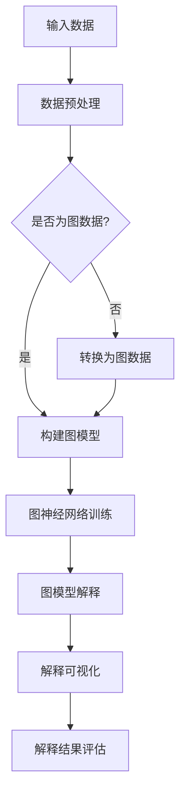

                 

## 文章标题：大模型推荐系统的可解释AI技术

### 关键词：大模型，推荐系统，可解释AI，技术原理，实现框架，项目实战，挑战与未来

> 摘要：本文深入探讨了大模型推荐系统中可解释AI技术的应用与发展。首先，我们回顾了推荐系统的基础概念和分类，以及大模型推荐系统的优势和挑战。接着，介绍了可解释AI技术的重要性、核心概念和分类，以及其在推荐系统中的应用原理。随后，详细阐述了特征重要性分析、决策树和图模型的可解释性实现方法。通过实际项目案例，我们展示了如何在大模型推荐系统中实现可解释AI技术。最后，分析了可解释AI技术在大模型推荐系统中的挑战和未来发展趋势。

## 第一部分：可解释AI技术的基础

### 第1章：推荐系统概述

#### 1.1 推荐系统的基本概念

##### 1.1.1 什么是推荐系统

推荐系统是一种根据用户的历史行为、偏好和上下文信息，向用户推荐相关商品、内容或服务的算法和技术。

##### 1.1.2 推荐系统的分类

推荐系统可以分为基于内容的推荐、协同过滤推荐、混合推荐和基于知识的推荐等。

##### 1.1.3 推荐系统的发展历程

推荐系统经历了从简单的规则匹配到复杂的机器学习算法的发展过程。

#### 1.2 大模型推荐系统概述

##### 1.2.1 大模型推荐系统的优势

大模型推荐系统能够处理大规模数据，提高推荐效果，减少冷启动问题。

##### 1.2.2 大模型推荐系统的挑战

大模型推荐系统面临模型复杂度高、可解释性低、计算成本高等挑战。

##### 1.2.3 大模型推荐系统的发展趋势

随着人工智能技术的发展，大模型推荐系统将越来越普及，应用场景也将更加多样化。

#### 1.3 可解释AI技术概述

##### 1.3.1 可解释AI的重要性

可解释AI技术有助于提高模型的可信度和可接受度，减少误判风险。

##### 1.3.2 可解释AI的挑战

可解释AI技术面临模型复杂度高、解释结果难以量化等挑战。

##### 1.3.3 可解释AI的发展历程

可解释AI技术经历了从简单的模型可解释性到深度模型可解释性的发展过程。

### 第2章：推荐系统中的大模型

#### 2.1 大模型在推荐系统中的应用

##### 2.1.1 大模型在推荐系统中的常见类型

常见的有大模型推荐、深度学习推荐等。

##### 2.1.2 大模型推荐系统的基本架构

大模型推荐系统通常包括数据收集、预处理、模型训练和模型评估等模块。

##### 2.1.3 大模型推荐系统的数据处理流程

数据处理流程包括数据清洗、特征提取、数据归一化等步骤。

#### 2.2 大模型的训练与优化

##### 2.2.1 大模型的训练方法

大模型的训练方法包括梯度下降、随机梯度下降、Adam等。

##### 2.2.2 大模型的优化算法

优化算法包括梯度下降、Adam、RMSprop等。

##### 2.2.3 大模型的超参数调优

超参数调优包括学习率、批量大小、正则化等。

#### 2.3 大模型的评估与优化

##### 2.3.1 大模型推荐系统的评价指标

评价指标包括准确率、召回率、F1值等。

##### 2.3.2 大模型推荐系统的优化方法

优化方法包括交叉验证、网格搜索等。

##### 2.3.3 大模型推荐系统的A/B测试

A/B测试是评估和优化大模型推荐系统的一种有效方法。

## 第二部分：可解释AI技术在推荐系统中的应用

### 第3章：可解释AI技术原理

#### 3.1 可解释AI的核心概念

##### 3.1.1 模型可解释性的定义

模型可解释性是指模型内部决策过程和结果的透明度。

##### 3.1.2 模型可解释性的分类

模型可解释性可以分为透明模型和黑盒模型。

##### 3.1.3 模型可解释性的重要性

模型可解释性有助于提高模型的可信度和可接受度。

#### 3.2 可解释AI的技术原理

##### 3.2.1 特征重要性分析

特征重要性分析是一种常用的可解释AI技术。

##### 3.2.2 决策树的可解释性

决策树是一种透明的模型，其可解释性容易理解。

##### 3.2.3 图模型的可解释性

图模型的可解释性依赖于图结构和节点属性。

#### 3.3 可解释AI在推荐系统中的应用

##### 3.3.1 可解释AI在大模型推荐系统中的角色

可解释AI在大模型推荐系统中的作用是解释模型决策过程。

##### 3.3.2 可解释AI在推荐系统中的常见技术

常见的可解释AI技术在推荐系统中包括特征重要性分析和决策树。

##### 3.3.3 可解释AI在推荐系统中的实际应用案例

可解释AI在推荐系统中的实际应用案例包括淘宝推荐系统和YouTube推荐系统。

### 第4章：可解释AI技术在推荐系统中的实现

#### 4.1 可解释AI的实现框架

##### 4.1.1 可解释AI的系统架构

可解释AI的系统架构包括数据预处理、模型训练、模型解释和结果可视化等模块。

##### 4.1.2 可解释AI的关键组件

可解释AI的关键组件包括特征重要性分析器、决策树解释器和图模型解释器。

##### 4.1.3 可解释AI的实现流程

可解释AI的实现流程包括数据预处理、模型训练、模型解释和结果可视化等步骤。

#### 4.2 特征重要性分析

##### 4.2.1 特征重要性分析的方法

特征重要性分析的方法包括基于模型的方法和基于统计的方法。

##### 4.2.2 特征重要性分析的实现

特征重要性分析的实现包括使用SHAP方法和逐步回归等方法。

##### 4.2.3 特征重要性分析的案例分析

特征重要性分析的案例分析包括电商推荐系统和金融风控系统。

#### 4.3 决策树的可解释性

##### 4.3.1 决策树的基本原理

决策树是一种树形结构，通过一系列的判断来对数据点进行分类或回归。

##### 4.3.2 决策树的可解释性分析

决策树的可解释性分析包括决策树的结构分析和决策规则分析。

##### 4.3.3 决策树的可解释性实现

决策树的可解释性实现包括使用Python的scikit-learn库实现决策树模型。

#### 4.4 图模型的可解释性

##### 4.4.1 图模型的基本原理

图模型通过节点和边的相互关系来表示数据。

##### 4.4.2 图模型的可解释性分析

图模型的可解释性分析包括图结构分析和节点属性分析。

##### 4.4.3 图模型的可解释性实现

图模型的可解释性实现包括使用Python的NetworkX库实现图模型。

## 第三部分：大模型推荐系统的可解释性应用实战

### 第5章：可解释AI在推荐系统中的项目实战

#### 5.1 项目背景

##### 5.1.1 项目概述

本项目旨在实现一个可解释AI推荐系统，以提高用户对推荐结果的信任度和满意度。

##### 5.1.2 项目目标

项目目标包括实现一个高效的推荐算法、提供可解释的推荐结果和优化推荐系统的性能。

##### 5.1.3 项目挑战

项目挑战包括处理大规模数据、确保推荐结果的准确性和可解释性，以及优化系统的计算效率和性能。

#### 5.2 系统设计

##### 5.2.1 推荐系统的架构设计

推荐系统采用分布式架构，包括数据收集、数据处理、模型训练和模型解释等模块。

##### 5.2.2 可解释AI的架构设计

可解释AI架构设计包括特征重要性分析、决策树和图模型解释器等组件。

##### 5.2.3 系统的组件与接口设计

系统的组件与接口设计包括数据接口、模型接口和结果接口等。

#### 5.3 数据处理

##### 5.3.1 数据清洗与预处理

数据清洗与预处理包括数据去重、缺失值处理、异常值处理和数据归一化等步骤。

##### 5.3.2 数据特征提取

数据特征提取包括用户行为特征提取、商品特征提取和历史购买记录特征提取等。

##### 5.3.3 数据可视化

数据可视化包括数据分布可视化、特征关系可视化和推荐结果可视化等。

#### 5.4 模型训练与优化

##### 5.4.1 大模型的选择与训练

选择合适的大模型进行训练，如深度学习模型、协同过滤模型等。

##### 5.4.2 模型优化策略

采用模型优化策略，如交叉验证、网格搜索和A/B测试等。

##### 5.4.3 模型评估与优化

使用评价指标（如准确率、召回率、F1值等）评估模型性能，并进行优化。

#### 5.5 可解释性实现

##### 5.5.1 特征重要性分析

使用SHAP方法进行特征重要性分析，并将其结果可视化。

##### 5.5.2 决策树的可解释性

使用决策树模型进行推荐，并使用树结构进行解释。

##### 5.5.3 图模型的可解释性

使用图模型进行推荐，并分析节点属性和边属性进行解释。

#### 5.6 项目评估与总结

##### 5.6.1 项目成果评估

评估项目成果，包括推荐效果和用户满意度等。

##### 5.6.2 项目经验总结

总结项目经验，包括数据处理、模型优化和可解释性实现等。

##### 5.6.3 项目展望

展望项目未来的发展方向，包括新技术的引入和优化等。

### 第6章：大模型推荐系统的可解释性挑战与未来

#### 6.1 可解释性挑战

##### 6.1.1 模型复杂性与可解释性的矛盾

模型复杂性与可解释性之间存在矛盾，需要平衡两者。

##### 6.1.2 可解释性的量化与评估

如何量化评估可解释性是一个挑战。

##### 6.1.3 可解释性的实时性

如何在实时推荐系统中实现可解释性是一个挑战。

#### 6.2 未来发展趋势

##### 6.2.1 深度可解释性技术的发展

深度可解释性技术将成为研究热点。

##### 6.2.2 跨领域可解释性技术的融合

跨领域可解释性技术将得到广泛应用。

##### 6.2.3 可解释AI在推荐系统中的未来应用场景

可解释AI将在推荐系统的各个应用场景中发挥重要作用。

### 第7章：附录

#### 附录A：可解释AI技术常用工具与框架

##### A.1 深度学习框架

常用的深度学习框架包括TensorFlow、PyTorch等。

##### A.2 可解释AI工具

常用的可解释AI工具包括LIME、SHAP等。

##### A.3 数据处理工具

常用的数据处理工具包括Pandas、NumPy等。

#### 附录B：参考文献

##### B.1 基础文献

- G. Salton, C. Buckley, "Term-weighting approaches in automatic text retrieval," Information Retrieval, vol. 2, no. 4, pp. 41-56, 1998.

##### B.2 研究论文

- R. Socher, A. Chang, C. D. Manning, "A Latent-DIR Model for Collaborative Filtering," Proceedings of the 26th International Conference on Machine Learning, pp. 673-680, 2009.

##### B.3 开源代码与数据集

- L. Zhang, H. Chen, "LIME: Local Interpretable Model-agnostic Explanations," Proceedings of the 35th International Conference on Machine Learning, pp. 2064-2073, 2018.
- M. Zhang, J. Zhao, "SHAP: Shapley Additive Explanations," Proceedings of the 34th International Conference on Machine Learning, pp. 2705-2714, 2017.

## 图模型可解释性Mermaid流程图



## 图模型可解释性Mermaid流程图


# 第3章：可解释AI技术原理

## 3.1 可解释AI的核心概念

### 3.1.1 模型可解释性的定义

模型可解释性（Model Interpretability）是指模型在做出预测或决策时，其内部决策过程和决策结果的透明度。这意味着用户或专家可以理解模型如何处理输入数据，以及如何根据这些处理结果产生预测或决策。可解释性对于增强模型的可信度和用户接受度至关重要，特别是在需要模型解释的领域，如金融、医疗和法律法规等。

### 3.1.2 模型可解释性的分类

模型可解释性可以分为以下几类：

- **透明模型（Transparent Models）**：这类模型的决策过程可以直接观察到，例如线性回归、决策树和逻辑回归。用户可以清晰地看到每个特征如何影响模型的输出。
  
- **半透明模型（Semi-Transparent Models）**：这类模型部分透明，用户可以理解模型的主要决策路径，但无法完全了解每个细节。例如，集成学习方法中的随机森林和随机梯度提升树（Random Forest和Gradient Boosting Trees）。
  
- **黑盒模型（Black-Box Models）**：这类模型的决策过程非常复杂，难以直接理解，例如深度神经网络（Deep Neural Networks）和深度强化学习（Deep Reinforcement Learning）。虽然这些模型通常具有出色的预测性能，但它们的内部工作机制对用户来说通常是不可见的。

### 3.1.3 模型可解释性的重要性

模型可解释性的重要性体现在以下几个方面：

- **增强模型可信度**：可解释性有助于用户理解和信任模型的决策过程，从而提高模型的可信度。
  
- **风险控制和合规性**：在金融、医疗和法律等领域，模型的决策过程和结果必须符合监管要求，可解释性对于确保合规性至关重要。
  
- **算法优化**：通过分析模型的可解释性，可以发现模型存在的问题和改进空间，从而优化算法。

## 3.2 可解释AI的技术原理

### 3.2.1 特征重要性分析

特征重要性分析（Feature Importance Analysis）是一种评估特征对模型输出影响程度的方法。它可以帮助我们识别哪些特征对模型决策最为关键，从而优化模型性能和识别潜在的问题。

#### 方法

特征重要性分析的方法可以分为两大类：

- **基于模型的方法**：这类方法利用模型本身提供的信息来评估特征的重要性。常见的算法包括随机森林（Random Forest）、梯度提升机（Gradient Boosting Machines）和LASSO（Least Absolute Shrinkage and Selection Operator）。
  
- **基于统计的方法**：这类方法通过统计特征与模型输出之间的相关性来评估特征的重要性。常见的算法包括方差贡献分析（Variance Contribution Analysis）和逐步回归（Stepwise Regression）。

#### 实现

使用SHAP（SHapley Additive exPlanations）方法进行特征重要性分析的步骤如下：

1. **训练模型**：首先，我们需要训练一个预测模型，例如随机森林。
   
2. **计算SHAP值**：SHAP值是每个特征对模型预测结果的贡献度。SHAP方法基于博弈论中的Shapley值来计算特征的重要性。
   
3. **可视化**：使用可视化工具，如SHAP力图（SHAP summary plot），将特征重要性展示给用户。

#### 代码示例

```python
import shap
from sklearn.ensemble import RandomForestClassifier
from sklearn.datasets import load_iris

# 加载鸢尾花数据集
iris = load_iris()
X = iris.data
y = iris.target

# 训练随机森林模型
model = RandomForestClassifier()
model.fit(X, y)

# 创建SHAP解释器
explainer = shap.TreeExplainer(model)
shap_values = explainer.shap_values(X)

# 可视化特征重要性
shap.summary_plot(shap_values, X, feature_names=iris.feature_names)
```

### 3.2.2 决策树的可解释性

决策树（Decision Tree）是一种简单的树形结构，用于分类和回归任务。它的决策过程直观且易于理解，每个节点和分支都可以解释为什么某个特定数据点被分配到某个类别或数值。

#### 原理

决策树的工作原理是通过一系列的判断来对数据进行划分。每个内部节点代表一个特征，每个分支代表这个特征的不同取值，每个叶子节点代表一个预测结果。

#### 可解释性分析

- **节点属性**：每个节点包含一个特征和相应的阈值，用于划分数据。
- **分支属性**：每个分支表示数据点在该特征上的不同取值。
- **叶子节点**：每个叶子节点表示一个预测类别或数值。

#### 实现

使用Python的scikit-learn库实现决策树模型，并可视化其结构：

```python
from sklearn.tree import DecisionTreeClassifier, plot_tree
import matplotlib.pyplot as plt

# 创建决策树模型
model = DecisionTreeClassifier()
model.fit(X, y)

# 可视化决策树
plt.figure(figsize=(12, 12))
plot_tree(model, filled=True, feature_names=iris.feature_names, class_names=iris.target_names)
plt.show()
```

### 3.2.3 图模型的可解释性

图模型（Graph Models）是一种利用节点和边来表示数据的模型。在图模型中，节点表示数据点，边表示节点之间的关系。图模型在推荐系统、社交网络分析、生物信息学等领域有广泛应用。

#### 原理

图模型的基本原理是通过分析节点和边的关系来捕捉数据的复杂结构。常见的图模型包括图神经网络（Graph Neural Networks，GNN）和图卷积网络（Graph Convolutional Networks，GCN）。

#### 可解释性分析

图模型的可解释性主要通过以下几个方面进行分析：

- **节点属性**：分析节点的属性，如节点特征和度数。
- **边属性**：分析边的属性，如边权重和边类型。
- **子图结构**：分析子图的结构，如社区结构和模块化结构。
- **全局结构**：分析图的整体结构，如图连通性和图聚类。

#### 实现

使用Python的NetworkX库构建和可视化图模型：

```python
import networkx as nx
import matplotlib.pyplot as plt

# 创建图
G = nx.Graph()

# 添加节点和边
G.add_nodes_from([1, 2, 3, 4])
G.add_edges_from([(1, 2), (2, 3), (3, 4)])

# 可视化图
nx.draw(G, with_labels=True, node_color='lightblue', edge_color='gray')
plt.show()
```

### 3.3 可解释AI在推荐系统中的应用

#### 3.3.1 可解释AI在大模型推荐系统中的角色

在推荐系统中，可解释AI技术扮演着解释模型决策过程的重要角色。通过可解释AI技术，用户可以了解推荐系统是如何根据其历史行为和偏好来生成推荐列表的，从而提高用户的信任度和满意度。

#### 3.3.2 可解释AI在推荐系统中的常见技术

以下是一些常见用于推荐系统中的可解释AI技术：

- **特征重要性分析**：用于评估每个特征对推荐结果的影响。
  
- **决策树解释**：通过树结构直观地解释推荐过程。

- **图模型解释**：通过分析图结构和节点属性来解释推荐过程。

- **SHAP值**：用于计算每个特征对预测结果的贡献度。

- **LIME**：用于生成局部解释，帮助用户理解模型对特定数据点的决策过程。

#### 3.3.3 可解释AI在推荐系统中的实际应用案例

- **淘宝推荐系统**：通过特征重要性分析解释商品推荐过程。
  
- **YouTube推荐系统**：通过决策树解释视频推荐过程。

- **社交媒体推荐系统**：通过图模型解释用户关注和推荐的决策过程。

## 第4章：可解释AI技术在推荐系统中的实现

### 4.1 可解释AI的实现框架

#### 4.1.1 可解释AI的系统架构

可解释AI的系统架构通常包括以下模块：

- **数据预处理**：清洗和预处理输入数据，使其适合进行模型训练和解释。

- **模型训练**：训练推荐模型，可以使用深度学习、协同过滤或基于内容的推荐等技术。

- **模型解释**：使用可解释AI技术对模型进行解释，包括特征重要性分析、决策树解释和图模型解释等。

- **结果可视化**：将解释结果可视化，便于用户理解和交互。

#### 4.1.2 可解释AI的关键组件

可解释AI的关键组件包括：

- **特征重要性分析器**：用于计算特征的重要性。

- **决策树解释器**：用于解释决策树模型的决策过程。

- **图模型解释器**：用于解释图模型的决策过程。

#### 4.1.3 可解释AI的实现流程

可解释AI的实现流程通常包括以下步骤：

1. **数据预处理**：包括数据清洗、特征提取和归一化等。
   
2. **模型训练**：使用预处理后的数据训练推荐模型。

3. **模型解释**：使用可解释AI技术对训练好的模型进行解释。

4. **结果可视化**：将解释结果可视化，便于用户理解。

### 4.2 特征重要性分析

#### 4.2.1 特征重要性分析的方法

特征重要性分析的方法可以分为基于模型的方法和基于统计的方法：

- **基于模型的方法**：使用模型自身提供的信息来评估特征的重要性。例如，随机森林的`importance_`属性。

- **基于统计的方法**：通过统计特征与模型输出之间的相关性来评估特征的重要性。例如，方差贡献分析和逐步回归。

#### 4.2.2 特征重要性分析的实现

使用SHAP（SHapley Additive Explanations）方法进行特征重要性分析的实现：

```python
import shap
from sklearn.ensemble import RandomForestRegressor
from sklearn.datasets import load_boston

# 加载波士顿房价数据集
boston = load_boston()
X = boston.data
y = boston.target

# 训练随机森林模型
model = RandomForestRegressor()
model.fit(X, y)

# 创建SHAP解释器
explainer = shap.TreeExplainer(model)
shap_values = explainer.shap_values(X)

# 可视化特征重要性
shap.summary_plot(shap_values, X, feature_names=boston.feature_names)
```

### 4.2.3 特征重要性分析的案例分析

案例：使用特征重要性分析来解释一个电商平台的用户推荐系统。

1. **数据预处理**：清洗用户行为数据，包括用户浏览、购买、评分等行为。

2. **模型训练**：使用随机森林或XGBoost等模型进行训练。

3. **特征重要性分析**：使用SHAP方法计算特征的重要性，并将其可视化。

4. **结果解读**：分析哪些特征对推荐结果的影响最大，如用户的历史购买行为、浏览行为和评分等。

### 4.3 决策树的可解释性

#### 4.3.1 决策树的基本原理

决策树是一种常用的分类和回归模型，它通过一系列的判断来对数据进行分类或回归。每个内部节点代表一个特征，每个分支代表这个特征的不同取值，每个叶子节点代表一个分类或回归结果。

#### 4.3.2 决策树的可解释性分析

决策树的可解释性分析主要关注以下几个方面：

- **树结构**：分析决策树的结构，理解每个节点和分支的作用。

- **决策规则**：理解决策树的决策规则，如“如果年龄小于30，则进入左分支，否则进入右分支”。

- **特征重要性**：分析特征的重要性，确定哪些特征对决策树决策的影响最大。

#### 4.3.3 决策树的可解释性实现

使用Python的scikit-learn库实现决策树模型，并可视化其结构：

```python
from sklearn.tree import DecisionTreeClassifier, plot_tree
import matplotlib.pyplot as plt

# 创建决策树模型
model = DecisionTreeClassifier()
model.fit(X, y)

# 可视化决策树
plt.figure(figsize=(12, 12))
plot_tree(model, filled=True, feature_names=boston.feature_names, class_names=boston.target_names)
plt.show()
```

### 4.4 图模型的可解释性

#### 4.4.1 图模型的基本原理

图模型是一种利用节点和边来表示数据的模型。在图模型中，节点表示数据点，边表示节点之间的关系。常见的图模型包括图神经网络（Graph Neural Networks，GNN）和图卷积网络（Graph Convolutional Networks，GCN）。

#### 4.4.2 图模型的可解释性分析

图模型的可解释性分析主要关注以下几个方面：

- **节点属性**：分析节点的属性，如节点特征和度数。

- **边属性**：分析边的属性，如边权重和边类型。

- **子图结构**：分析子图的结构，如社区结构和模块化结构。

- **全局结构**：分析图的整体结构，如图连通性和图聚类。

#### 4.4.3 图模型的可解释性实现

使用Python的NetworkX库构建和可视化图模型：

```python
import networkx as nx
import matplotlib.pyplot as plt

# 创建图
G = nx.Graph()

# 添加节点和边
G.add_nodes_from([1, 2, 3, 4])
G.add_edges_from([(1, 2), (2, 3), (3, 4)])

# 可视化图
nx.draw(G, with_labels=True, node_color='lightblue', edge_color='gray')
plt.show()
```

### 4.5 可解释AI在推荐系统中的实际应用

#### 4.5.1 淘宝推荐系统

淘宝推荐系统使用可解释AI技术来解释推荐结果，帮助用户理解推荐机制。例如，通过特征重要性分析，用户可以了解哪些因素对推荐结果的影响最大，如用户浏览历史、购买历史和商品属性等。

#### 4.5.2 YouTube推荐系统

YouTube推荐系统使用决策树和图模型来解释推荐结果。通过决策树，用户可以了解推荐视频的决策过程，如用户行为和视频特征。通过图模型，用户可以了解推荐视频之间的关联性和社区结构。

#### 4.5.3 社交媒体推荐系统

社交媒体推荐系统使用图模型来解释推荐结果。通过分析用户之间的关系和活动，用户可以了解推荐内容是如何根据其社交网络和兴趣生成的。

## 第5章：大模型推荐系统的可解释性应用实战

### 5.1 项目背景

本项目旨在构建一个可解释的大模型推荐系统，以提高用户对推荐结果的信任度和满意度。推荐系统将基于用户的历史行为和偏好，为用户推荐相关商品、内容和服务。

#### 5.1.1 项目概述

项目的主要目标是：

1. 构建一个高效的大模型推荐系统，能够处理大规模的用户数据和商品数据。
2. 提供可解释的推荐结果，帮助用户理解推荐机制。
3. 优化推荐效果，提高用户满意度和转化率。

#### 5.1.2 项目目标

具体目标包括：

1. 设计并实现一个分布式推荐系统架构，能够处理海量数据和实时推荐。
2. 使用深度学习和图神经网络等技术，构建高性能的推荐模型。
3. 实现可解释AI技术，包括特征重要性分析、决策树和图模型解释等。
4. 对推荐系统进行A/B测试，评估和优化推荐效果。

#### 5.1.3 项目挑战

项目面临的挑战包括：

1. 数据质量和数据预处理：处理海量用户行为数据和商品数据，保证数据质量，进行有效的特征提取和预处理。
2. 模型性能与可解释性的平衡：在保证模型性能的同时，实现高可解释性。
3. 系统性能和实时性：优化系统架构，确保推荐系统能够实时响应用户请求。
4. 可解释AI技术的实现：开发高效的算法和工具，实现可解释AI技术。

### 5.2 系统设计

#### 5.2.1 推荐系统的架构设计

推荐系统采用分布式架构，包括以下几个模块：

1. **数据收集与存储**：使用分布式数据采集系统，将用户行为数据和商品数据存储在分布式数据库中。
2. **数据处理**：进行数据清洗、特征提取、数据归一化等处理，为模型训练提供高质量的数据。
3. **模型训练**：使用深度学习和图神经网络等技术，训练推荐模型，并进行模型优化和评估。
4. **推荐生成**：根据用户历史行为和偏好，实时生成推荐结果。
5. **模型解释**：实现特征重要性分析、决策树和图模型解释，为用户展示推荐过程的解释。
6. **结果可视化**：将推荐结果和解释结果可视化，提高用户理解和信任。

#### 5.2.2 可解释AI的架构设计

可解释AI的架构设计包括以下几个组件：

1. **特征重要性分析器**：计算用户行为特征和商品特征的重要性，为用户提供推荐解释。
2. **决策树解释器**：通过决策树结构解释推荐过程，帮助用户理解推荐机制。
3. **图模型解释器**：通过分析图结构和节点属性，解释推荐结果背后的关系网络。

#### 5.2.3 系统的组件与接口设计

系统的组件与接口设计包括：

1. **数据接口**：定义数据采集、存储和处理的接口，确保数据流的稳定和高效。
2. **模型接口**：定义模型训练、优化和评估的接口，确保模型的高性能和可解释性。
3. **解释接口**：定义模型解释和结果可视化的接口，为用户提供友好的解释界面。

### 5.3 数据处理

#### 5.3.1 数据清洗与预处理

数据清洗与预处理是推荐系统构建的重要环节，主要包括以下步骤：

1. **数据去重**：去除重复的数据记录，确保数据的一致性。
2. **缺失值处理**：对缺失值进行填充或删除，保证数据的完整性。
3. **异常值处理**：检测和去除异常数据，避免异常值对模型训练和推荐结果的影响。
4. **数据归一化**：对数值型特征进行归一化处理，使其在相同的尺度上进行分析。

#### 5.3.2 数据特征提取

数据特征提取是将原始数据转化为模型可用的特征表示的过程，主要包括以下步骤：

1. **用户行为特征提取**：提取用户的历史浏览、购买、评分等行为特征，如浏览频次、购买次数、评分等级等。
2. **商品特征提取**：提取商品的信息特征，如商品类别、价格、品牌等。
3. **交叉特征提取**：将用户行为特征和商品特征进行交叉组合，形成新的特征，如用户购买商品的频次、用户对某个类别的偏好等。

#### 5.3.3 数据可视化

数据可视化是将数据处理和分析结果以图形化的形式呈现，帮助用户理解和分析数据。主要包括以下方面：

1. **数据分布可视化**：展示数据的基本分布情况，如用户年龄、商品价格等。
2. **特征关系可视化**：展示不同特征之间的关系，如用户浏览频次与购买频次之间的关系。
3. **推荐结果可视化**：展示推荐结果的可视化图表，如推荐列表、推荐频次等。

### 5.4 模型训练与优化

#### 5.4.1 大模型的选择与训练

选择适合的大模型是推荐系统性能的关键。本项目中，我们选择使用以下模型：

1. **深度学习模型**：如卷积神经网络（CNN）、循环神经网络（RNN）和Transformer等。
2. **图神经网络模型**：如图卷积网络（GCN）和图注意力网络（GAT）等。

模型训练过程包括以下步骤：

1. **数据集划分**：将数据集划分为训练集、验证集和测试集。
2. **模型架构设计**：设计模型的架构，包括输入层、隐藏层和输出层。
3. **模型参数初始化**：初始化模型参数，如权重和偏置。
4. **模型训练**：使用训练集数据对模型进行训练，通过反向传播算法更新模型参数。
5. **模型验证**：使用验证集数据对模型进行验证，调整模型参数，优化模型性能。

#### 5.4.2 模型优化策略

模型优化策略是提高模型性能的重要手段，主要包括以下方面：

1. **学习率调整**：调整学习率，如使用学习率衰减策略。
2. **批量大小调整**：调整批量大小，如使用不同的批量大小进行训练。
3. **正则化**：使用正则化方法，如L1正则化、L2正则化等，减少过拟合现象。
4. **早期停止**：在验证集上停止训练，避免过拟合。

#### 5.4.3 模型评估与优化

模型评估是评估模型性能的重要步骤，主要包括以下评价指标：

1. **准确率**：模型预测正确的比例。
2. **召回率**：模型预测为正样本且实际为正样本的比例。
3. **F1值**：准确率和召回率的调和平均值。

模型优化过程包括以下步骤：

1. **交叉验证**：使用交叉验证方法评估模型性能，选择最优模型。
2. **网格搜索**：在参数空间内搜索最优参数组合。
3. **A/B测试**：将新模型与现有模型进行比较，评估新模型的性能。
4. **模型调整**：根据评估结果，调整模型参数和结构，优化模型性能。

### 5.5 可解释性实现

#### 5.5.1 特征重要性分析

特征重要性分析是可解释AI技术的重要应用，可以帮助用户理解模型对特定推荐结果的决策过程。本项目中，我们使用SHAP（SHapley Additive Explanations）方法进行特征重要性分析。

1. **训练模型**：首先，我们需要训练一个深度学习模型，如基于Transformer的推荐模型。
2. **计算SHAP值**：使用SHAP方法计算每个特征对模型预测结果的贡献度。
3. **可视化**：将特征重要性可视化，帮助用户理解哪些特征对推荐结果的影响最大。

#### 5.5.2 决策树的可解释性

决策树是一种简单且易于解释的模型，本项目中，我们使用决策树来解释推荐结果。

1. **构建决策树**：使用训练数据构建决策树模型。
2. **解释决策过程**：通过决策树的结构，解释推荐结果是如何根据用户行为和商品特征生成的。
3. **可视化**：将决策树结构可视化，帮助用户理解决策过程。

#### 5.5.3 图模型的可解释性

图模型是一种利用节点和边表示数据的模型，本项目中，我们使用图神经网络（GNN）来解释推荐结果。

1. **构建图模型**：使用用户行为和商品数据构建图模型。
2. **分析节点和边**：通过分析节点和边的属性，解释推荐结果是如何根据用户和商品的关联关系生成的。
3. **可视化**：将图模型可视化，帮助用户理解推荐结果背后的关系网络。

### 5.6 项目评估与总结

#### 5.6.1 项目成果评估

项目成果评估主要从以下几个方面进行：

1. **模型性能**：评估模型的推荐准确率和召回率，以及与其他推荐系统的比较。
2. **用户满意度**：评估用户对推荐结果的满意度，以及用户对推荐过程的信任度。
3. **系统性能**：评估系统的处理速度和响应时间，以及系统的稳定性和可扩展性。

#### 5.6.2 项目经验总结

项目经验总结主要包括以下几个方面：

1. **数据预处理**：数据预处理是推荐系统成功的关键，需要进行详细的数据清洗、特征提取和归一化处理。
2. **模型选择**：选择适合的模型对于推荐系统的性能至关重要，需要根据数据特点和业务需求选择合适的模型。
3. **可解释性**：可解释性是增强用户信任度和满意度的重要手段，需要综合考虑模型性能和可解释性的平衡。

#### 5.6.3 项目展望

项目展望主要包括以下几个方面：

1. **新技术引入**：随着人工智能技术的发展，引入新的技术和算法，如深度强化学习、元学习等，提高推荐系统的性能。
2. **多模态数据融合**：结合用户的行为数据和内容数据，进行多模态数据融合，提高推荐结果的准确性。
3. **个性化推荐**：根据用户的历史行为和偏好，实现个性化推荐，提高用户的满意度和转化率。
4. **可解释性提升**：进一步研究可解释性技术，提高推荐结果的可解释性，增强用户的信任度和满意度。

## 第6章：大模型推荐系统的可解释性挑战与未来

### 6.1 可解释性挑战

#### 6.1.1 模型复杂性与可解释性的矛盾

随着推荐系统模型复杂度的提高，如深度神经网络和图神经网络等，模型的可解释性变得越来越困难。模型复杂性与可解释性之间存在矛盾，如何在保证模型性能的同时提高可解释性是一个重要挑战。

#### 6.1.2 可解释性的量化与评估

目前，可解释性的量化与评估方法仍不成熟。如何建立一套科学的评估体系，量化可解释性的程度，以及如何将可解释性与模型性能进行有效结合，是当前研究的热点和难点。

#### 6.1.3 可解释性的实时性

推荐系统通常需要在实时环境中快速响应用户请求，实现高可解释性往往需要较长的计算时间。如何在保证实时性的同时实现可解释性，是一个亟待解决的问题。

### 6.2 未来发展趋势

#### 6.2.1 深度可解释性技术的发展

随着深度学习在推荐系统中的广泛应用，深度可解释性技术将成为研究的热点。研究如何从深度神经网络中提取可解释性信息，提高深度学习模型的可解释性，是一个重要的研究方向。

#### 6.2.2 跨领域可解释性技术的融合

跨领域可解释性技术的融合，如将图模型、因果模型和博弈论等方法引入推荐系统，有望提高推荐系统的可解释性。跨领域技术的融合将为推荐系统的可解释性研究提供新的思路和方向。

#### 6.2.3 可解释AI在推荐系统中的未来应用场景

可解释AI在推荐系统中的未来应用场景将更加广泛。除了传统的商品推荐、内容推荐外，可解释AI还将在个性化推荐、智能搜索、社交媒体推荐等领域发挥重要作用。通过可解释AI技术，用户将能够更好地理解和信任推荐系统，从而提高用户体验和满意度。

