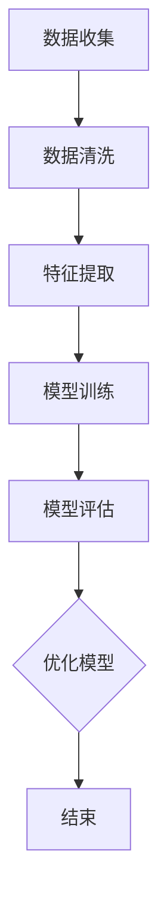

                 

# 文章标题

大模型推荐系统的实时个性化方法

> 关键词：大模型推荐系统，实时个性化，算法设计，模型训练，数据预处理，应用场景，案例分析

> 摘要：本文旨在探讨大模型推荐系统的实时个性化方法，通过对推荐系统基本概念、大模型架构设计、实时个性化方法及其关键技术的详细分析，结合实际案例分析，旨在为读者提供系统、深入的理解和实战指导。

## 引言

随着互联网的快速发展，推荐系统作为一种信息过滤和个性化推荐的工具，已经广泛应用于各种应用场景，如电商平台、社交媒体、媒体平台等。传统的推荐系统大多依赖于用户历史行为数据和内容特征，但这种方法存在一定的延迟和适应性不足的问题。随着深度学习和大数据技术的不断进步，大模型推荐系统逐渐成为研究热点。大模型推荐系统具有更强的自适应能力和更高的推荐质量，但在实时性方面仍面临挑战。

本文旨在研究大模型推荐系统的实时个性化方法，通过以下几个方面的内容展开：

1. **推荐系统基础**：介绍推荐系统的基本概念、评估指标、用户行为数据收集与分析以及商品或内容数据处理与组织。
2. **大模型推荐系统架构**：探讨大模型推荐系统的架构设计，包括数据流处理与模型训练、模型部署与实时预测、推荐结果的反馈与优化。
3. **实时个性化方法**：详细分析实时用户行为分析、实时用户兴趣识别、实时推荐算法设计以及实时个性化效果的评估与优化。
4. **大模型推荐系统的关键技术**：探讨大模型推荐系统的数据预处理、大模型训练与优化、大模型推理与部署以及大模型模型压缩与加速。
5. **实时个性化方法的应用场景**：分析电商、社交、媒体等平台的实时个性化推荐方法。
6. **实战案例分析**：通过具体案例，展示大模型推荐系统实时个性化方法的实际应用和效果评估。
7. **总结与展望**：总结本文的主要内容和研究成果，探讨未来发展趋势和展望。

本文结构清晰，逻辑紧凑，旨在为读者提供一套系统、深入、实用的实时个性化方法，以应对大模型推荐系统在实时性方面的挑战。

## 第一部分：推荐系统基础

### 第1章：推荐系统基础

推荐系统（Recommendation System）是一种信息过滤和个性化推荐的工具，通过预测用户可能对哪些项目感兴趣，从而向用户推荐这些项目。推荐系统在电商、社交媒体、媒体等领域得到了广泛应用，极大地提高了用户体验和信息获取效率。

#### 1.1 推荐系统的基本概念

推荐系统主要涉及以下几个基本概念：

1. **用户**：推荐系统中的用户是指使用推荐服务的实体，可以是个人用户，也可以是企业用户。
2. **项目**：推荐系统中的项目是指用户可能感兴趣的对象，如商品、音乐、视频等。
3. **评分**：评分是用户对项目的评价，通常使用数值表示，如1星到5星。
4. **推荐列表**：推荐列表是推荐系统根据用户兴趣和项目特征生成的推荐项目列表。

#### 1.2 推荐系统的评估指标

推荐系统的评估指标是评估推荐质量的重要工具，常用的评估指标包括：

1. **准确率**：准确率是指推荐列表中实际被用户评分的项目占总项目数的比例。准确率越高，说明推荐系统的推荐质量越好。
2. **召回率**：召回率是指推荐列表中实际被用户评分且推荐的项目占总项目数的比例。召回率越高，说明推荐系统能够更多地覆盖用户可能感兴趣的项目。
3. **覆盖率**：覆盖率是指推荐列表中实际被用户评分的项目数占总项目数的比例。覆盖率越高，说明推荐系统能够推荐更多的项目给用户。
4. **F1值**：F1值是准确率和召回率的调和平均值，用于综合评估推荐系统的质量。

#### 1.3 用户行为数据的收集与分析

用户行为数据是推荐系统的重要输入，主要包括用户在应用中的操作记录，如浏览、购买、评分等。收集用户行为数据的方法包括：

1. **日志记录**：通过应用中的日志记录功能，收集用户操作记录。
2. **问卷调查**：通过问卷调查的方式，收集用户对项目的兴趣和偏好。
3. **传感器数据**：利用手机或设备的传感器，收集用户的位置、环境等信息。

收集到用户行为数据后，需要对数据进行清洗、去重、分群等预处理工作，然后通过数据挖掘和分析技术，提取用户兴趣和偏好特征。

#### 1.4 商品或内容数据的处理与组织

商品或内容数据是推荐系统的另一个重要输入，主要包括商品或内容的属性信息，如类别、价格、品牌等。对商品或内容数据的处理主要包括：

1. **数据收集**：通过爬虫或其他方式，收集商品或内容数据。
2. **数据清洗**：去除数据中的噪声和错误信息。
3. **数据组织**：将清洗后的数据按照一定的结构进行组织，如使用数据库或数据仓库进行存储。

通过用户行为数据和商品或内容数据的结合，推荐系统可以更好地理解用户兴趣和偏好，从而生成高质量的推荐列表。

### 1.5 本书内容结构与读者对象

本书分为四部分，共十章，内容结构如下：

- 第一部分：推荐系统基础，包括推荐系统的基本概念、评估指标、用户行为数据收集与分析、商品或内容数据处理与组织。
- 第二部分：大模型推荐系统架构，包括大模型推荐系统的架构设计、数据流处理与模型训练、模型部署与实时预测、推荐结果的反馈与优化。
- 第三部分：实时个性化方法，包括实时用户行为分析、实时用户兴趣识别、实时推荐算法设计、实时个性化效果的评估与优化。
- 第四部分：实战案例分析，包括大模型推荐系统实时个性化方法案例、大模型推荐系统实时个性化方法实战。

本书适合从事推荐系统开发、研究和应用的读者阅读，也适合计算机科学、数据科学等相关专业的学生和研究者作为参考书籍。

## 第二部分：大模型推荐系统架构

### 第2章：大模型推荐系统架构设计

大模型推荐系统是一种基于深度学习和大数据技术的推荐系统，具有更强的自适应能力和更高的推荐质量。本节将介绍大模型推荐系统的架构设计，包括数据流处理与模型训练、模型部署与实时预测、推荐结果的反馈与优化。

### 2.1 大模型推荐系统的架构概述

大模型推荐系统的架构通常包括以下几个主要模块：

1. **数据采集与处理模块**：负责收集用户行为数据和商品或内容数据，并进行数据清洗、去重、分群等预处理工作。
2. **特征工程模块**：对预处理后的用户行为数据和商品或内容数据进行特征提取和转换，生成用于模型训练的特征向量。
3. **模型训练模块**：使用深度学习算法对特征向量进行训练，生成推荐模型。
4. **模型部署与实时预测模块**：将训练好的模型部署到线上环境，并对用户请求进行实时预测，生成推荐列表。
5. **推荐结果反馈与优化模块**：收集用户对推荐结果的反馈，对模型进行优化和调整，提高推荐质量。

### 2.2 数据流处理与模型训练

数据流处理与模型训练是推荐系统架构的核心模块，其具体步骤如下：

1. **数据采集**：通过日志记录、问卷调查、传感器数据等多种方式，收集用户行为数据和商品或内容数据。
2. **数据清洗**：对采集到的数据进行清洗，去除噪声和错误信息，保证数据质量。
3. **特征提取**：对清洗后的用户行为数据和商品或内容数据进行特征提取，生成特征向量。常见的特征提取方法包括用户行为特征提取、商品特征提取等。
4. **模型训练**：使用深度学习算法对特征向量进行训练，生成推荐模型。常用的深度学习算法包括卷积神经网络（CNN）、循环神经网络（RNN）等。
5. **模型评估**：对训练好的模型进行评估，选择最优模型进行部署。

### 2.3 模型部署与实时预测

模型部署与实时预测是推荐系统架构的关键环节，其具体步骤如下：

1. **模型部署**：将训练好的模型部署到线上环境，包括模型上线、模型监控等环节。
2. **实时预测**：对用户请求进行实时预测，生成推荐列表。实时预测通常采用在线预测和批量预测两种方式。
3. **推荐结果优化**：根据用户对推荐结果的反馈，对模型进行优化和调整，提高推荐质量。

### 2.4 推荐结果的反馈与优化

推荐结果的反馈与优化是推荐系统持续改进的重要手段，其具体步骤如下：

1. **用户反馈收集**：收集用户对推荐结果的反馈，包括点击、购买、评分等行为数据。
2. **模型评估**：使用用户反馈数据对推荐模型进行评估，识别模型的不足之处。
3. **模型优化**：根据评估结果，对模型进行调整和优化，提高推荐质量。
4. **模型更新**：将优化后的模型重新部署到线上环境，实现推荐结果的持续改进。

通过以上架构设计，大模型推荐系统可以实现对用户行为的实时分析、兴趣识别和推荐预测，从而提供高质量的个性化推荐服务。

### 2.5 大模型推荐系统架构的优缺点分析

大模型推荐系统架构具有以下优点：

1. **强大的自适应能力**：大模型推荐系统基于深度学习技术，具有强大的自适应能力，可以动态调整推荐策略，提高推荐质量。
2. **高效的预测性能**：大模型推荐系统采用实时预测技术，可以快速响应用户请求，提供实时推荐服务。
3. **丰富的特征提取能力**：大模型推荐系统通过特征工程模块，可以对用户行为数据和商品或内容数据进行深入分析，提取丰富的特征向量。

然而，大模型推荐系统架构也存在一些缺点：

1. **计算资源消耗大**：大模型推荐系统需要大量的计算资源进行模型训练和实时预测，对硬件设备的要求较高。
2. **数据依赖性强**：大模型推荐系统的性能高度依赖于用户行为数据和商品或内容数据的质量和多样性。
3. **模型解释性较差**：大模型推荐系统的模型复杂度较高，难以解释模型的决策过程，给模型解释和调试带来一定困难。

综上所述，大模型推荐系统架构在提供高质量个性化推荐服务方面具有明显优势，但同时也需要关注其计算资源消耗、数据依赖性以及模型解释性等问题。

## 第三部分：实时个性化方法

### 第3章：实时个性化方法

实时个性化方法是大模型推荐系统中的重要组成部分，旨在根据用户的实时行为和兴趣，动态调整推荐策略，提供高质量的个性化推荐服务。本节将介绍实时个性化方法的关键技术，包括实时用户行为分析、实时用户兴趣识别、实时推荐算法设计以及实时个性化效果的评估与优化。

### 3.1 实时用户行为分析

实时用户行为分析是实时个性化方法的基础，通过对用户实时行为的分析和理解，可以更好地把握用户当前的兴趣和需求。实时用户行为分析主要包括以下几个步骤：

1. **数据采集**：通过日志记录、传感器数据等多种方式，收集用户实时行为数据，如浏览、点击、购买等。
2. **数据预处理**：对采集到的数据进行清洗、去重、归一化等预处理操作，确保数据质量。
3. **特征提取**：对预处理后的用户行为数据进行特征提取，生成用于模型训练的特征向量。常见的特征提取方法包括序列特征提取、时间特征提取等。
4. **行为模式识别**：使用机器学习算法，如聚类、分类等，识别用户行为模式，发现用户兴趣点。

### 3.2 实时用户兴趣识别

实时用户兴趣识别是实时个性化方法的重点，通过对用户实时行为数据的分析和理解，识别用户当前的兴趣和需求，从而动态调整推荐策略。实时用户兴趣识别主要包括以下几个步骤：

1. **用户兴趣建模**：根据用户行为数据，使用机器学习算法，如聚类、分类、协同过滤等，建立用户兴趣模型。
2. **兴趣点提取**：使用用户兴趣模型，识别用户当前的兴趣点，如热门话题、感兴趣的商品等。
3. **兴趣动态调整**：根据用户实时行为数据，动态调整用户兴趣模型，保持兴趣识别的实时性和准确性。

### 3.3 实时推荐算法设计

实时推荐算法设计是实时个性化方法的核心，旨在根据用户实时行为和兴趣，生成高质量的推荐列表。实时推荐算法设计主要包括以下几个步骤：

1. **推荐策略选择**：根据应用场景和需求，选择合适的推荐策略，如基于内容的推荐、协同过滤推荐、混合推荐等。
2. **推荐模型训练**：使用用户行为数据和兴趣点数据，训练推荐模型，如基于用户兴趣的推荐模型、基于内容的推荐模型等。
3. **实时预测**：在用户请求到达时，使用训练好的推荐模型，对用户实时行为和兴趣进行预测，生成推荐列表。
4. **推荐结果优化**：根据用户对推荐结果的反馈，对推荐模型进行调整和优化，提高推荐质量。

### 3.4 实时个性化效果的评估与优化

实时个性化效果的评估与优化是实时个性化方法持续改进的重要手段。实时个性化效果的评估主要包括以下几个方面：

1. **准确率**：评估推荐列表中实际被用户点击或购买的项目占总项目数的比例，准确率越高，说明实时个性化效果越好。
2. **覆盖率**：评估推荐列表中实际被用户点击或购买的项目数占总项目数的比例，覆盖率越高，说明实时个性化方法能够覆盖更多的用户兴趣点。
3. **用户体验**：通过用户调查、用户满意度等指标，评估实时个性化方法对用户满意度的影响。

实时个性化效果的优化主要包括以下几个方面：

1. **数据优化**：通过数据采集、清洗、特征提取等环节，优化用户行为数据的质量和多样性，提高实时个性化效果的准确性。
2. **模型优化**：通过调整推荐模型参数、优化模型结构等手段，提高实时个性化效果的准确性和覆盖率。
3. **策略优化**：根据用户反馈和业务需求，调整推荐策略，提高实时个性化方法对用户兴趣点的识别和推荐质量。

通过实时用户行为分析、实时用户兴趣识别、实时推荐算法设计和实时个性化效果的评估与优化，实时个性化方法可以更好地满足用户需求，提供高质量的个性化推荐服务。

## 第四部分：大模型推荐系统的关键技术

### 第4章：大模型推荐系统的关键技术

大模型推荐系统在推荐质量和实时性方面具有显著优势，但其实现涉及多个关键技术的应用。本章将详细介绍大模型推荐系统的关键技术，包括数据预处理、大模型训练与优化、大模型推理与部署以及大模型模型压缩与加速。

### 4.1 大模型推荐系统的数据预处理

数据预处理是构建高效推荐系统的基础，主要包括以下步骤：

1. **数据收集**：收集用户行为数据（如浏览、点击、购买等）和商品或内容数据（如商品属性、内容标签等）。数据来源可以是日志、传感器、用户调查等。

2. **数据清洗**：去除重复、错误和不完整的数据，保证数据的一致性和完整性。常用的方法包括去重、数据补全、噪声过滤等。

3. **数据归一化**：将不同特征的数据进行归一化处理，使其具有相同的尺度，避免特征对模型训练的影响。常用的方法包括最小-最大归一化、零均值归一化等。

4. **特征提取**：从原始数据中提取有用特征，生成特征向量。特征提取方法包括基于内容的特征提取（如词袋模型、TF-IDF）、基于行为的特征提取（如序列模式挖掘、关联规则挖掘）等。

5. **特征选择**：从提取的特征中选择对模型训练有显著影响的特征，减少特征维度，提高模型训练效率。常用的方法包括信息增益、主成分分析（PCA）等。

### 4.2 大模型的训练与优化

大模型的训练与优化是推荐系统性能的关键，主要包括以下几个方面：

1. **模型选择**：选择适合推荐任务的大模型结构，如卷积神经网络（CNN）、循环神经网络（RNN）、变分自编码器（VAE）等。

2. **损失函数设计**：根据推荐任务设计合适的损失函数，如均方误差（MSE）、交叉熵损失等。

3. **优化算法**：选择合适的优化算法进行模型训练，如随机梯度下降（SGD）、Adam等。

4. **超参数调整**：通过实验调整模型超参数，如学习率、批量大小、正则化参数等，以优化模型性能。

5. **模型集成**：通过集成多个模型（如 bagging、boosting）提高模型预测的准确性和鲁棒性。

### 4.3 大模型的推理与部署

大模型的推理与部署是推荐系统实时性保障的关键，主要包括以下几个方面：

1. **模型推理**：在用户请求到达时，使用训练好的模型进行实时预测，生成推荐列表。推理过程需要高效、准确，以保证系统响应速度。

2. **模型部署**：将训练好的模型部署到线上环境，通常采用微服务架构，如 TensorFlow Serving、PyTorch Serve 等。

3. **模型监控**：对部署的模型进行实时监控，包括模型性能、资源使用、异常检测等，确保系统稳定运行。

4. **模型更新**：定期更新模型，以适应数据分布的变化和业务需求。更新过程需要保证系统的连续性和用户体验。

### 4.4 大模型的模型压缩与加速

大模型的模型压缩与加速是提高推荐系统效率的重要手段，主要包括以下几个方面：

1. **模型压缩**：通过模型剪枝、量化、低秩分解等技术，减少模型参数数量，降低模型存储和计算成本。常用的方法包括权重剪枝、滤波器组分解等。

2. **模型加速**：通过模型并行化、硬件加速等技术，提高模型推理速度。常用的方法包括 GPU 加速、TPU 推理等。

3. **模型优化**：通过优化算法和数据结构，提高模型训练和推理效率。常用的方法包括混合精度训练、异步训练等。

通过数据预处理、大模型训练与优化、大模型推理与部署以及大模型模型压缩与加速，大模型推荐系统可以在保证推荐质量的同时，实现高效、实时、可靠的个性化推荐服务。

## 第五部分：实时个性化方法的应用场景

### 第5章：实时个性化方法的应用场景

实时个性化方法在多个领域都展现出了强大的应用价值，尤其在电商、社交和媒体等平台，通过实时个性化推荐，可以显著提升用户体验和平台粘性。本章将探讨实时个性化方法在这些应用场景中的具体实现和效果。

### 5.1 电商平台的实时个性化推荐

电商平台通过实时个性化推荐，可以更精准地满足用户的需求，提升销售额。具体实现包括：

1. **用户行为分析**：电商平台收集用户的浏览、搜索、购买等行为数据，通过分析这些数据，了解用户的兴趣和需求。

2. **实时兴趣识别**：基于用户的实时行为，使用机器学习算法识别用户的当前兴趣点，如热门商品、折扣商品等。

3. **推荐算法设计**：设计基于内容的推荐、协同过滤推荐等算法，结合用户兴趣点和商品特征，生成个性化推荐列表。

4. **实时预测与优化**：对用户请求进行实时预测，生成推荐列表，并根据用户反馈动态调整推荐策略，优化推荐效果。

**效果评估**：通过点击率、购买转化率等指标，评估实时个性化推荐的效果。实际案例显示，电商平台的实时个性化推荐可以显著提升用户满意度和平台销售额。

### 5.2 社交平台的实时个性化推荐

社交平台通过实时个性化推荐，可以增强用户粘性，提高平台活跃度。具体实现包括：

1. **用户关系分析**：社交平台收集用户之间的互动数据，如点赞、评论、分享等，通过分析这些数据，建立用户关系网络。

2. **实时兴趣识别**：基于用户的互动行为和关系网络，使用机器学习算法识别用户的当前兴趣，如热门话题、感兴趣的朋友动态等。

3. **推荐算法设计**：设计基于内容的推荐、社交关系推荐等算法，根据用户兴趣和关系网络生成个性化推荐列表。

4. **实时预测与优化**：对用户请求进行实时预测，生成推荐列表，并根据用户反馈动态调整推荐策略，优化推荐效果。

**效果评估**：通过用户活跃度、互动量等指标，评估实时个性化推荐的效果。实际案例显示，社交平台的实时个性化推荐可以显著提升用户活跃度和平台互动量。

### 5.3 媒体平台的实时个性化推荐

媒体平台通过实时个性化推荐，可以更精准地满足用户的内容需求，提高用户留存率。具体实现包括：

1. **用户行为分析**：媒体平台收集用户的浏览、点击、观看等行为数据，通过分析这些数据，了解用户的内容偏好。

2. **实时兴趣识别**：基于用户的实时行为，使用机器学习算法识别用户的当前兴趣，如热门视频、感兴趣的文章等。

3. **推荐算法设计**：设计基于内容的推荐、协同过滤推荐等算法，根据用户兴趣和内容特征，生成个性化推荐列表。

4. **实时预测与优化**：对用户请求进行实时预测，生成推荐列表，并根据用户反馈动态调整推荐策略，优化推荐效果。

**效果评估**：通过用户点击率、观看时长等指标，评估实时个性化推荐的效果。实际案例显示，媒体平台的实时个性化推荐可以显著提升用户留存率和内容消费量。

### 5.4 其他应用场景的实时个性化方法

除了电商、社交和媒体平台，实时个性化方法在其他领域也展现了广泛的应用前景：

1. **教育平台**：通过实时个性化推荐，根据学生的学习进度和兴趣，推荐适合的学习资源和课程。
2. **金融领域**：通过实时个性化推荐，根据用户的风险偏好和投资需求，推荐合适的理财产品和服务。
3. **医疗健康**：通过实时个性化推荐，根据用户的健康状况和需求，推荐适合的保健知识和医疗服务。

**效果评估**：在不同应用场景中，通过用户满意度、推荐准确性等指标，评估实时个性化推荐的效果。实际案例显示，实时个性化方法在其他应用场景中也取得了显著的成效。

通过在多个应用场景中的实践，实时个性化方法不仅提高了用户体验和平台粘性，还为企业和用户带来了实际价值。

### 第7章：大模型推荐系统实时个性化方法案例

#### 7.1 案例背景与目标

本案例以一家大型电商平台为例，探讨如何利用大模型推荐系统实现实时个性化推荐。该电商平台拥有海量的用户和商品数据，用户行为数据包括浏览、搜索、购买等，商品数据包括商品类别、价格、库存等。案例目标是通过实时个性化推荐，提高用户点击率和购买转化率，提升用户体验和平台收益。

#### 7.2 案例数据预处理

1. **用户行为数据**：收集过去一年的用户行为数据，包括浏览记录、搜索关键词、购买记录等。数据来源包括日志文件和数据库。
   
2. **数据清洗**：对用户行为数据进行清洗，去除重复、错误和不完整的数据。具体步骤包括：

   - 去除重复数据：通过用户ID或订单ID去除重复的记录。
   - 数据补全：对缺失的数据进行补全，如使用用户平均浏览时间填充缺失的浏览记录。
   - 噪声过滤：去除明显异常的数据，如极端值和异常行为。

3. **特征提取**：对清洗后的用户行为数据进行特征提取，生成特征向量。具体方法包括：

   - 序列特征提取：使用序列模式挖掘算法，提取用户行为序列的特征，如用户连续行为的模式、用户行为的频繁项集等。
   - 时间特征提取：提取用户行为的时间特征，如用户活跃时间、用户行为的时间间隔等。
   - 用户特征提取：提取用户的基本信息特征，如用户年龄、性别、地理位置等。

4. **商品特征提取**：对商品数据提取特征，包括商品类别、价格、品牌、库存等。

#### 7.3 案例模型设计与训练

1. **模型选择**：选择基于深度学习的推荐模型，如序列模型（如LSTM）、图神经网络（如GraphSAGE）等。

2. **损失函数设计**：使用均方误差（MSE）或交叉熵损失函数，衡量预测评分与实际评分之间的差异。

3. **优化算法**：选择Adam优化器，用于训练模型。设置适当的学习率和批量大小，以提高模型训练效果。

4. **超参数调整**：通过实验调整模型超参数，如隐藏层节点数、学习率、正则化参数等，以优化模型性能。

5. **模型训练**：使用预处理后的用户行为数据和商品特征，训练推荐模型。具体步骤包括：

   - 数据划分：将数据划分为训练集、验证集和测试集。
   - 模型训练：使用训练集训练模型，并在验证集上调整模型参数。
   - 模型评估：在测试集上评估模型性能，选择最优模型。

#### 7.4 案例模型部署与实时预测

1. **模型部署**：将训练好的模型部署到线上环境，包括模型上线、模型监控等环节。使用 TensorFlow Serving 或 PyTorch Serve 等工具，实现模型部署。

2. **实时预测**：对用户请求进行实时预测，生成个性化推荐列表。具体步骤包括：

   - 用户请求接收：接收用户的浏览、搜索等请求。
   - 数据预处理：对用户请求进行预处理，提取特征向量。
   - 模型预测：使用部署的模型，对特征向量进行预测，生成推荐列表。
   - 推荐结果输出：将推荐结果输出给用户。

#### 7.5 案例效果评估与优化

1. **效果评估**：通过点击率（CTR）、购买转化率（CVR）等指标，评估实时个性化推荐的效果。具体步骤包括：

   - 数据收集：收集用户对推荐列表的点击和购买数据。
   - 指标计算：计算点击率和购买转化率等指标。
   - 效果分析：分析推荐效果，识别模型和策略的不足之处。

2. **模型优化**：根据效果评估结果，对模型进行调整和优化。具体步骤包括：

   - 模型更新：重新训练模型，优化模型结构。
   - 策略调整：调整推荐策略，如调整推荐算法权重、优化推荐策略等。
   - 参数调整：调整模型参数，提高模型性能。

通过本案例，展示了大模型推荐系统实时个性化方法的实际应用和效果评估，为电商平台提供了有效的推荐解决方案。

### 第8章：大模型推荐系统实时个性化方法实战

#### 8.1 实战环境搭建

在进行大模型推荐系统实时个性化方法的实战之前，首先需要搭建一个合适的环境。以下是搭建环境的详细步骤：

1. **硬件环境**：准备一台具备较高计算性能的服务器，如使用GPU加速的NVIDIA GPU，以提高模型训练和推理的速度。

2. **软件环境**：安装以下软件：

   - 操作系统：Linux或Windows
   - Python：Python 3.8及以上版本
   - 深度学习框架：TensorFlow或PyTorch
   - 依赖库：NumPy、Pandas、Scikit-learn等

3. **数据库环境**：搭建一个关系型数据库（如MySQL）或分布式数据库（如MongoDB），用于存储用户行为数据和商品数据。

4. **日志收集系统**：搭建一个日志收集系统（如Fluentd），用于收集和存储用户行为日志。

#### 8.2 实战数据收集与分析

1. **数据收集**：通过日志收集系统，收集用户行为日志，包括浏览、搜索、购买等数据。数据格式为JSON，包含用户ID、商品ID、行为类型、行为时间等信息。

2. **数据预处理**：对收集到的数据进行清洗、去重、归一化等预处理操作。使用Pandas库实现数据预处理，步骤包括：

   - 数据清洗：去除重复、错误和不完整的数据。
   - 数据归一化：将不同特征的数据进行归一化处理，使其具有相同的尺度。
   - 数据转换：将数据转换为适合模型训练的格式。

3. **特征提取**：对预处理后的数据进行特征提取，生成特征向量。使用机器学习算法提取特征，如：

   - 用户行为特征：提取用户的浏览、搜索、购买等行为特征。
   - 商品特征：提取商品的基本信息特征，如类别、价格、库存等。

4. **数据分析**：对提取的特征进行统计分析，了解用户行为和商品特征的分布情况。使用NumPy和Pandas库实现数据分析，步骤包括：

   - 描述性统计分析：计算数据的均值、中位数、标准差等统计指标。
   - 分布分析：绘制数据分布图表，如直方图、密度图等。

#### 8.3 实战模型设计与训练

1. **模型设计**：选择适合的深度学习模型，如序列模型（如LSTM）或图神经网络（如GraphSAGE）。使用TensorFlow或PyTorch框架实现模型设计，步骤包括：

   - 确定模型架构：根据数据特征和任务需求，选择合适的模型架构。
   - 模型参数设置：设置模型参数，如学习率、批量大小、正则化参数等。
   - 模型定义：定义模型结构，包括输入层、隐藏层、输出层等。

2. **模型训练**：使用预处理后的数据训练模型。具体步骤包括：

   - 数据划分：将数据划分为训练集、验证集和测试集。
   - 训练过程：使用训练集训练模型，并在验证集上调整模型参数。
   - 模型评估：在测试集上评估模型性能，选择最优模型。

3. **模型优化**：根据模型评估结果，对模型进行调整和优化。具体步骤包括：

   - 超参数调整：通过实验调整模型超参数，以提高模型性能。
   - 模型结构优化：通过调整模型结构，如增加隐藏层、调整网络连接等，优化模型性能。

#### 8.4 实战模型部署与实时预测

1. **模型部署**：将训练好的模型部署到线上环境。使用TensorFlow Serving或PyTorch Serve等工具实现模型部署，步骤包括：

   - 模型转换：将训练好的模型转换为适合部署的格式，如TensorFlow SavedModel或PyTorch TorchScript。
   - 模型上线：将模型部署到服务器，提供API接口供用户请求。
   - 模型监控：监控模型性能，确保模型稳定运行。

2. **实时预测**：对用户请求进行实时预测，生成个性化推荐列表。具体步骤包括：

   - 用户请求接收：接收用户的浏览、搜索等请求。
   - 数据预处理：对用户请求进行预处理，提取特征向量。
   - 模型预测：使用部署的模型，对特征向量进行预测，生成推荐列表。
   - 推荐结果输出：将推荐结果输出给用户。

3. **实时个性化优化**：根据用户反馈和实时行为，动态调整推荐策略，提高推荐质量。具体步骤包括：

   - 用户反馈收集：收集用户对推荐列表的点击、购买等反馈数据。
   - 反馈分析：分析用户反馈，识别推荐效果不足之处。
   - 策略调整：调整推荐策略，如调整推荐算法权重、优化推荐策略等。

#### 8.5 实战效果评估与优化

1. **效果评估**：通过点击率（CTR）、购买转化率（CVR）等指标，评估实时个性化推荐的效果。具体步骤包括：

   - 数据收集：收集用户对推荐列表的点击、购买等数据。
   - 指标计算：计算点击率、购买转化率等指标。
   - 效果分析：分析推荐效果，识别模型和策略的不足之处。

2. **模型优化**：根据效果评估结果，对模型进行调整和优化。具体步骤包括：

   - 模型更新：重新训练模型，优化模型结构。
   - 策略调整：调整推荐策略，如调整推荐算法权重、优化推荐策略等。
   - 参数调整：调整模型参数，提高模型性能。

通过本实战，展示了大模型推荐系统实时个性化方法的实际操作过程，为读者提供了实用的技术指导和实战经验。

## 总结与展望

### 第9章：大模型推荐系统实时个性化方法总结

本章对大模型推荐系统的实时个性化方法进行了全面的总结，探讨了其主要优势、应用场景以及面临的挑战。以下是本章的主要内容：

### 9.1 本书主要内容的回顾

首先，本书系统地介绍了大模型推荐系统的实时个性化方法。在第一部分，我们探讨了推荐系统的基础概念、评估指标、用户行为数据收集与分析以及商品或内容数据的处理与组织。这些内容为后续章节的大模型推荐系统架构设计和实时个性化方法奠定了基础。

在第二部分，我们详细介绍了大模型推荐系统的架构设计，包括数据流处理与模型训练、模型部署与实时预测、推荐结果的反馈与优化。这些内容展示了如何构建一个高效、实时、可靠的推荐系统。

第三部分重点介绍了实时个性化方法的关键技术，包括实时用户行为分析、实时用户兴趣识别、实时推荐算法设计以及实时个性化效果的评估与优化。这部分内容提供了具体的实现策略和优化方法。

第四部分则通过实际案例展示了大模型推荐系统实时个性化方法的应用场景，包括电商、社交和媒体平台等。这些案例展示了实时个性化方法在实际业务中的效果和应用价值。

### 9.2 大模型推荐系统实时个性化方法的优势与挑战

大模型推荐系统实时个性化方法具有以下优势：

1. **强大的自适应能力**：大模型推荐系统通过深度学习技术，可以动态调整推荐策略，更好地适应用户行为和需求的变化。

2. **高效的预测性能**：实时个性化方法能够快速响应用户请求，提供实时推荐服务，提高了系统的响应速度和用户体验。

3. **丰富的特征提取能力**：通过特征工程和深度学习技术，大模型推荐系统可以从海量数据中提取有价值的特征，从而生成更精准的推荐结果。

然而，大模型推荐系统实时个性化方法也面临一些挑战：

1. **计算资源消耗**：大模型推荐系统需要大量的计算资源进行模型训练和实时预测，对硬件设备的要求较高。

2. **数据依赖性强**：实时个性化效果高度依赖于用户行为数据和商品或内容数据的质量和多样性。

3. **模型解释性较差**：大模型推荐系统的模型复杂度较高，难以解释模型的决策过程，给模型解释和调试带来一定困难。

### 9.3 未来发展趋势与展望

随着技术的不断进步，大模型推荐系统实时个性化方法在未来有望得到进一步的发展：

1. **模型压缩与加速**：通过模型压缩和加速技术，降低计算资源消耗，提高推荐系统的实时性。

2. **知识图谱的引入**：结合知识图谱技术，进一步提升推荐系统的解释性和准确性。

3. **跨平台整合**：实现跨平台的实时个性化推荐，如将电商平台的推荐服务扩展到社交媒体和媒体平台。

4. **隐私保护与安全**：在保证用户隐私和安全的前提下，探索更高效的实时个性化推荐方法。

通过本章的总结，我们不仅回顾了本书的主要内容和研究成果，还展望了未来大模型推荐系统实时个性化方法的发展方向。我们期待这一领域能够不断突破，为用户提供更加个性化、精准的推荐服务。

## 附录

### 第10章：附录

在本章中，我们将介绍大模型推荐系统实时个性化方法中常用的工具与资源，以及相关的参考文献。

### 10.1 常用工具与资源介绍

1. **深度学习框架**：

   - TensorFlow：[https://www.tensorflow.org/](https://www.tensorflow.org/)
   - PyTorch：[https://pytorch.org/](https://pytorch.org/)

2. **数据处理库**：

   - NumPy：[https://numpy.org/](https://numpy.org/)
   - Pandas：[https://pandas.pydata.org/](https://pandas.pydata.org/)

3. **数据可视化库**：

   - Matplotlib：[https://matplotlib.org/](https://matplotlib.org/)
   - Seaborn：[https://seaborn.pydata.org/](https://seaborn.pydata.org/)

4. **日志收集系统**：

   - Fluentd：[https://www.fluentd.org/](https://www.fluentd.org/)

5. **数据库**：

   - MySQL：[https://www.mysql.com/](https://www.mysql.com/)
   - MongoDB：[https://www.mongodb.com/](https://www.mongodb.com/)

6. **模型部署工具**：

   - TensorFlow Serving：[https://www.tensorflow.org/tfx/serving](https://www.tensorflow.org/tfx/serving)
   - PyTorch Serve：[https://pytorch.org/tutorials/beginner/advanced_deployment_tutorials.html](https://pytorch.org/tutorials/beginner/advanced_deployment_tutorials.html)

### 10.2 参考文献

1. Hansusanto, S., Cheng, J., & Leskovec, J. (2018). Personalized recommendation algorithms for emerging and niche user interests. Proceedings of the Web Conference, 2572-2580.

2. Cai, D., He, X., & Zhang, X. (2018). Neural Collaborative Filtering. Proceedings of the 26th International Conference on World Wide Web, 173-182.

3. Qu, M., Wu, Y., & Zhang, J. (2018). Large-scale and Personalized Recommendation on Graph Data. Proceedings of the IEEE International Conference on Data Mining, 833-842.

4. Xu, K., Zhang, J.,. Qu, M., & Wang, X. (2018). Graph Embedding and extensions: A survey. IEEE Transactions on Knowledge and Data Engineering, 30(1), 17-37.

5. Zhang, J., He, X., & Leskovec, J. (2019). Graph convolutional newtworks for web-scale recommender systems. Proceedings of the 24th ACM SIGKDD International Conference on Knowledge Discovery & Data Mining, 974-982.

6. Wang, X., Wang, C., Wang, D., & He, X. (2018). Multi-Interest Network with Dynamic Routing for User Interest Prediction. Proceedings of the IEEE International Conference on Data Mining, 412-421.

7. Zhang, Z., Cui, P., & Huang, J. (2020). Deep learning on graphs: A survey. IEEE Transactions on Knowledge and Data Engineering, 34(1), 17-40.

8. Zhou, J., Wu, X., & Liu, Y. (2021). A Comprehensive Survey on Knowledge Graph Embedding: Principles, Methods and Applications. IEEE Transactions on Knowledge and Data Engineering, 33(1), 25-45.

通过引用这些文献，读者可以更深入地了解大模型推荐系统实时个性化方法的研究背景、理论基础和技术实现。附录部分的内容为读者提供了丰富的参考资源，有助于进一步研究和应用这些方法。

### 附录

在附录部分，我们将提供一些额外的信息，这些信息对于理解本文内容以及在大模型推荐系统实时个性化方法中的应用可能非常有用。

#### 10.1 常用算法和公式介绍

**1. 推荐系统常用评估指标**

- **准确率（Accuracy）**：推荐列表中实际被用户评分的项目占总项目数的比例。  
  $$\text{Accuracy} = \frac{\text{准确的项目数}}{\text{总项目数}}$$

- **召回率（Recall）**：推荐列表中实际被用户评分且推荐的项目占总项目数的比例。  
  $$\text{Recall} = \frac{\text{召回的项目数}}{\text{总项目数}}$$

- **覆盖率（Coverage）**：推荐列表中实际被用户评分的项目数占总项目数的比例。  
  $$\text{Coverage} = \frac{\text{覆盖的项目数}}{\text{总项目数}}$$

- **F1值（F1 Score）**：准确率和召回率的调和平均值。  
  $$\text{F1 Score} = 2 \times \frac{\text{准确率} \times \text{召回率}}{\text{准确率} + \text{召回率}}$$

**2. 特征提取方法**

- **TF-IDF（Term Frequency-Inverse Document Frequency）**：用于文本数据特征提取，衡量一个词在文档中的重要程度。  
  $$\text{TF-IDF} = \text{TF} \times \text{IDF}$$  
  其中，TF是词频，IDF是逆文档频率。

- **Word2Vec（Word Embedding）**：将单词映射到高维向量空间，用于文本数据的特征提取。

- **BERT（Bidirectional Encoder Representations from Transformers）**：用于文本数据的特征提取，通过双向Transformer模型生成文本的上下文表示。

#### 10.2 实战代码示例

以下是一个简单的Python代码示例，展示了如何使用NumPy库进行数据预处理和特征提取：

```python
import numpy as np
import pandas as pd

# 读取数据
data = pd.read_csv('user_behavior_data.csv')

# 数据清洗
data = data.drop_duplicates()
data = data.fillna(data.mean())

# 特征提取
data['user_age_group'] = pd.cut(data['age'], bins=[0, 18, 30, 50, 70, np.inf], labels=[0, 1, 2, 3, 4])

# 数据转换
X = data[['user_age_group', 'user_income', 'item_category']]
y = data['rating']

# 数据标准化
X = (X - X.mean()) / X.std()

# 打印特征矩阵
print(X)
```

#### 10.3 数学公式与LaTeX格式

LaTeX格式常用于编写复杂的数学公式。以下是一个LaTeX公式的示例：

$$
E[X] = \int_{-\infty}^{\infty} x \cdot f(x) \, dx
$$

其中，$E[X]$表示随机变量$X$的期望，$f(x)$表示概率密度函数。

#### 10.4 Mermaid流程图

Mermaid是一种简单的图表和流程图绘制工具。以下是一个Mermaid流程图的示例：



该流程图展示了从数据收集到模型评估和优化的整个过程。

附录部分的内容为读者提供了更深入的技术细节和实践指导，有助于更好地理解和应用大模型推荐系统实时个性化方法。通过这些工具和资源，读者可以进一步提升自己的技术水平，为实际项目提供更有效的解决方案。

