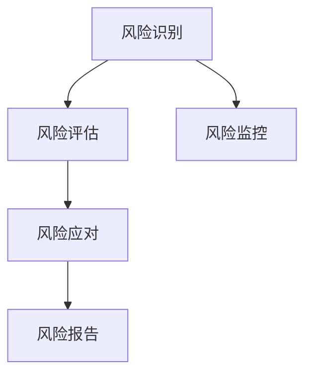

                 

# 文章标题

大模型时代下的新型风险管理模式

> 关键词：大模型，风险管理，人工智能，风险识别，风险评估，风险应对

> 摘要：本文深入探讨了在大模型时代背景下，如何构建和实施一种新型风险管理模式。通过对大模型时代概述、新型风险管理模式原理、新型风险管理实践、案例分析以及未来展望的详细分析，本文旨在为企业和组织提供有效的风险管理策略，以应对日益复杂的业务环境和技术挑战。

---

## 第一部分：大模型时代概述

### 第1章：大模型时代概述

#### 1.1 大模型时代的起源与发展

##### 1.1.1 大模型的定义与核心特征

大模型（Large Models）通常指的是那些拥有数亿甚至数十亿参数的机器学习模型。这些模型通过深度神经网络结构，能够在各种任务中表现出卓越的性能。大模型的典型特征包括：

- **高参数数量**：大模型拥有大量可训练参数，使其能够捕捉复杂的数据特征。
- **深度神经网络结构**：大模型通常采用深度神经网络结构，能够通过多层神经元的非线性变换来提高模型的性能。
- **强大拟合能力**：大模型能够对大量数据进行拟合，从而提高预测和分类的准确性。

##### 1.1.2 大模型发展的历史背景

大模型的发展历史可以追溯到深度学习技术的兴起。深度学习作为一种先进的机器学习技术，通过多层神经网络的构建，使得计算机能够从大量数据中自动学习复杂的特征。以下是几个关键的历史事件：

- **2006年：深度信念网络（DBN）**：Hinton等人提出了深度信念网络，这是一种能够通过逐层训练学习复杂特征的深度网络结构。
- **2012年：AlexNet**：AlexNet是第一个在ImageNet竞赛中取得显著胜利的深度卷积神经网络，其成功标志着深度学习时代的到来。
- **2014年：谷歌的深度神经机器翻译系统**：谷歌发布了深度神经机器翻译系统，该系统能够通过大规模神经网络实现高质量的机器翻译，推动了深度学习在自然语言处理领域的应用。
- **2018年：BERT模型**：谷歌推出了BERT（Bidirectional Encoder Representations from Transformers），这是第一个大规模的预训练语言模型，其在多项自然语言处理任务中取得了显著成绩。

##### 1.1.3 大模型时代的关键技术进步

大模型时代的到来离不开一系列关键技术的进步，包括：

- **计算能力的提升**：随着计算硬件的不断发展，特别是GPU和TPU的广泛应用，使得大模型的训练和部署成为可能。
- **数据量的增加**：互联网的普及和大数据技术的发展，使得大量高质量的数据变得可用，为大模型的训练提供了丰富的数据资源。
- **优化算法的改进**：深度学习优化算法的改进，如Adam优化器和不同层级的正则化方法，使得大模型的训练效率得到了显著提升。
- **预训练与微调技术**：预训练技术的引入，使得模型能够在大规模数据上进行预训练，然后在特定任务上进行微调，从而提高了模型的泛化能力。

#### 1.2 大模型的应用领域与前景

##### 1.2.1 大模型在工业领域的应用

大模型在工业领域的应用日益广泛，包括智能制造、预测维护、供应链优化等方面。例如，通过大模型可以实现对生产设备的实时监控和预测性维护，从而提高生产效率和减少停机时间。此外，大模型还可以用于优化供应链管理，通过预测市场需求和库存水平，帮助企业实现精准生产和库存控制。

##### 1.2.2 大模型在医疗健康领域的应用

大模型在医疗健康领域的应用具有巨大的潜力。通过深度学习技术，大模型可以用于医学图像分析、疾病预测和个性化治疗等方面。例如，大模型可以用于识别医疗图像中的病变区域，从而帮助医生进行早期诊断。此外，大模型还可以根据患者的基因信息和临床数据，为其提供个性化的治疗方案。

##### 1.2.3 大模型在社会治理与公共安全领域的应用

大模型在社会治理与公共安全领域同样具有重要应用价值。通过大数据分析和深度学习技术，大模型可以用于犯罪预测、交通流量管理、公共安全事件预警等方面。例如，通过分析历史犯罪数据和实时监控数据，大模型可以预测犯罪热点区域，从而帮助警方进行预防性布防。此外，大模型还可以用于分析交通数据，优化交通流量，减少交通拥堵和事故发生率。

#### 1.3 大模型带来的挑战与应对策略

##### 1.3.1 大模型的数据隐私与安全挑战

大模型在训练和部署过程中需要大量数据，这引发了数据隐私和安全方面的挑战。为了保护用户隐私，需要采取以下措施：

- **数据加密**：对敏感数据进行加密处理，确保数据在传输和存储过程中的安全性。
- **数据去识别化**：对数据进行去识别化处理，消除个人身份信息，以降低隐私泄露风险。
- **隐私保护算法**：采用隐私保护算法，如差分隐私和同态加密，确保在数据处理过程中不会泄露用户隐私。

##### 1.3.2 大模型的可解释性与可靠性挑战

大模型通常被认为是“黑箱”模型，其决策过程缺乏可解释性。为了提高大模型的可解释性和可靠性，可以采取以下措施：

- **模型可视化**：通过可视化技术，将模型的决策过程和内部结构展示出来，帮助用户理解模型的工作原理。
- **模型验证**：通过交叉验证和独立测试，确保模型的预测结果具有可靠性和稳定性。
- **模型压缩**：通过模型压缩技术，如剪枝和量化，降低模型的复杂度，从而提高模型的可解释性。

##### 1.3.3 大模型时代的伦理与社会问题

大模型的应用也引发了一系列伦理和社会问题，包括算法偏见、隐私侵犯和失业风险等。为了解决这些问题，需要采取以下措施：

- **伦理审查**：在开发和使用大模型时，进行严格的伦理审查，确保模型的应用不会对个人和社会造成负面影响。
- **公平性评估**：对模型进行公平性评估，确保模型不会产生偏见，从而保障不同群体的权益。
- **政策法规**：制定相关政策和法规，规范大模型的应用范围和方式，以保护用户权益和公共安全。

## 第二部分：新型风险管理模式原理

### 第2章：新型风险管理模式基础理论

#### 2.1 风险管理的定义与目标

##### 2.1.1 风险管理的概念

风险管理（Risk Management）是指通过识别、评估、控制和监测潜在风险，以减少组织或个人损失的过程。风险管理包括以下关键要素：

- **风险识别**：识别可能对组织或个人造成负面影响的风险因素。
- **风险评估**：对识别出的风险进行评估，确定其严重性和发生概率。
- **风险应对**：制定和实施应对策略，以减轻或消除风险的影响。
- **风险监控**：持续监控风险状况，确保风险应对措施的有效性。

##### 2.1.2 风险管理的目标与原则

风险管理的目标包括：

- **减少损失**：通过识别和评估风险，采取有效的风险应对措施，减少可能的损失。
- **提高安全性**：确保组织或个人在面临风险时具有足够的应对能力，降低风险发生时的负面影响。
- **促进发展**：通过风险管理，为组织或个人创造一个安全稳定的环境，促进其持续发展。

风险管理的基本原则包括：

- **全面性**：风险管理应该覆盖所有可能的风险因素，确保全面的覆盖。
- **前瞻性**：风险管理应该具备前瞻性，能够在风险发生之前采取措施。
- **系统性**：风险管理应该是一个系统性的过程，包括识别、评估、应对和监控等环节。
- **适应性**：风险管理应该具备适应性，能够根据风险的变化和环境的变化进行调整。

#### 2.2 风险评估与风险识别

##### 2.2.1 风险评估的方法与工具

风险评估是风险管理的关键环节，主要包括以下方法和工具：

- **定性评估**：通过专家判断、情景分析等方法对风险进行定性评估。
- **定量评估**：通过数学模型、统计方法等对风险进行定量评估，确定风险的严重性和发生概率。
- **风险评估矩阵**：使用风险评估矩阵对风险进行排序和优先级划分，帮助制定风险应对策略。
- **蒙特卡罗模拟**：通过模拟随机事件的发生概率和影响，评估风险的可能性和影响。

##### 2.2.2 风险识别的关键要素

风险识别是风险评估的基础，主要包括以下关键要素：

- **风险源**：识别可能导致风险的各种因素，如自然因素、人为因素、技术因素等。
- **风险事件**：识别可能发生的具体风险事件，如火灾、系统故障、数据泄露等。
- **风险影响**：评估风险事件对组织或个人的可能影响，包括财务影响、运营影响、声誉影响等。
- **风险概率**：评估风险事件发生的概率，以确定其优先级。

#### 2.3 风险应对策略与措施

##### 2.3.1 风险规避策略

风险规避是指通过改变决策和行为，避免风险的发生。风险规避策略包括：

- **避免高风险活动**：避免从事可能导致高风险的活动，如冒险投资或高风险业务。
- **转移责任**：将风险责任转移到第三方，如购买保险或签订免责协议。

##### 2.3.2 风险转移策略

风险转移是指将风险责任转移到第三方，以减轻自身风险。风险转移策略包括：

- **保险**：通过购买保险，将风险转移给保险公司。
- **合同条款**：在合同中约定风险责任的分配，将部分风险转移给对方。

##### 2.3.3 风险缓解策略

风险缓解是指通过采取预防措施和应对措施，减轻风险的影响。风险缓解策略包括：

- **预防措施**：采取预防措施，减少风险的发生概率，如安全培训、安全设施建设等。
- **应急响应**：制定应急预案，确保在风险事件发生时能够迅速响应和应对。
- **损失控制**：通过采取措施，降低风险事件发生时的损失，如灾难恢复计划、备份和冗余系统等。

## 第三部分：大模型在风险管理中的应用

### 第3章：大模型在风险管理中的应用

#### 3.1 大模型与风险管理的关系

大模型在风险管理中发挥着重要作用。一方面，大模型可以通过对大量数据的分析和挖掘，帮助识别潜在风险因素；另一方面，大模型可以用于风险评估和风险应对，提供更加精准和有效的决策支持。具体来说，大模型在风险管理中的应用体现在以下几个方面：

- **风险识别**：大模型可以用于分析历史数据和实时数据，识别可能存在的风险因素，提高风险识别的准确性。
- **风险评估**：大模型可以通过对风险的量化分析和预测，提供风险评估的结果，帮助决策者制定应对策略。
- **风险应对**：大模型可以用于制定和优化风险应对策略，提高风险应对的效率和效果。

#### 3.2 大模型在风险评估中的应用

大模型在风险评估中的应用主要体现在以下几个方面：

- **风险预测**：大模型可以通过对历史数据和实时数据的分析，预测未来可能发生的风险事件，提供预警信息，帮助决策者提前采取应对措施。
- **风险排序**：大模型可以根据风险的严重性和发生概率，对风险进行排序，帮助决策者确定风险应对的优先级。
- **风险分析**：大模型可以用于分析风险的成因和影响因素，提供更加深入和全面的风险分析结果，帮助决策者制定更加科学和有效的风险应对策略。

#### 3.3 大模型在风险应对中的应用

大模型在风险应对中的应用主要体现在以下几个方面：

- **风险规避**：大模型可以用于分析风险规避策略的可行性，提供规避风险的决策支持。
- **风险转移**：大模型可以用于评估风险转移的效果，帮助决策者选择最佳的风险转移策略。
- **风险缓解**：大模型可以用于制定风险缓解措施，提供风险缓解效果的预测和评估，帮助决策者优化风险缓解策略。

### 第4章：新型风险管理实践

#### 4.1 新型风险管理模式的构建

新型风险管理模式的构建需要综合考虑风险管理的各个环节，包括风险识别、风险评估、风险应对和风险监控。以下是一个新型风险管理模式的构建步骤：

- **风险识别**：通过数据分析、专家判断等方法，识别可能存在的风险因素，建立风险库。
- **风险评估**：利用大模型对风险因素进行量化分析，评估风险的严重性和发生概率，建立风险评估模型。
- **风险应对**：根据风险评估结果，制定相应的风险应对策略，包括风险规避、风险转移和风险缓解等。
- **风险监控**：建立风险监控机制，实时监控风险状况，及时发现和处理潜在风险。

#### 4.2 新型风险管理模式在金融领域的应用

在金融领域，新型风险管理模式的构建和应用具有重要意义。以下是一个金融领域新型风险管理模式的应用案例：

- **风险识别**：通过分析金融市场的历史数据和实时数据，识别可能存在的金融风险因素，如市场风险、信用风险和操作风险等。
- **风险评估**：利用大模型对金融风险因素进行量化分析，评估风险的严重性和发生概率，建立风险评估模型。
- **风险应对**：根据风险评估结果，制定相应的风险应对策略，如风险规避、风险转移和风险缓解等。
- **风险监控**：建立实时监控机制，对金融风险状况进行实时监控，及时发现和处理潜在风险。

#### 4.3 新型风险管理模式在制造业的应用

在制造业，新型风险管理模式的构建和应用同样具有重要意义。以下是一个制造业新型风险管理模式的应用案例：

- **风险识别**：通过分析制造过程的历史数据和实时数据，识别可能存在的制造风险因素，如设备故障、原材料缺陷和质量风险等。
- **风险评估**：利用大模型对制造风险因素进行量化分析，评估风险的严重性和发生概率，建立风险评估模型。
- **风险应对**：根据风险评估结果，制定相应的风险应对策略，如风险规避、风险转移和风险缓解等。
- **风险监控**：建立实时监控机制，对制造风险状况进行实时监控，及时发现和处理潜在风险。

## 第四部分：案例分析

### 第5章：大模型在风险管理中的成功案例

#### 5.1 案例分析概述

在本章中，我们将介绍几个大模型在风险管理中取得成功的案例。这些案例包括金融、医疗和制造业等领域，通过具体案例的分析，我们将探讨大模型如何有效地提高风险管理的效率和准确性。

#### 5.2 金融行业的风险管理案例

案例一：某大型银行的风险管理实践

某大型银行在风险管理中采用了大模型技术，通过构建风险预测模型，提高了对信用风险和市场风险的识别和应对能力。以下是该银行的风险管理实践：

1. **数据收集与预处理**：该银行收集了大量的历史交易数据、客户信息、市场数据等，并对这些数据进行预处理，包括数据清洗、数据标准化和数据归一化等步骤。

2. **风险预测模型构建**：利用大模型技术，该银行构建了信用风险评估模型和市场风险评估模型。信用风险评估模型通过对客户的信用记录、还款能力、财务状况等因素进行分析，预测客户违约的可能性；市场风险评估模型通过对市场波动、宏观经济指标等因素进行分析，预测市场风险。

3. **模型训练与验证**：使用历史数据进行模型训练，并通过交叉验证方法对模型进行验证，确保模型的预测准确性。

4. **风险决策支持**：基于大模型预测结果，该银行可以实时监控风险状况，为风险决策提供支持。例如，在信用风险评估中，银行可以根据预测的违约概率，调整信贷审批标准，减少违约风险。

案例二：某互联网金融公司的风控策略

某互联网金融公司采用大模型技术，建立了完善的风险管理体系，有效防范了信贷风险和操作风险。以下是其风控策略：

1. **风险识别**：通过大数据分析，该公司能够实时识别信贷风险和操作风险。例如，通过分析客户的历史交易行为、信用记录、社交网络等信息，识别潜在的高风险客户。

2. **风险评估**：利用大模型技术，该公司对识别出的风险进行量化评估，包括信用风险评估和操作风险评估。信用风险评估模型通过分析客户的还款能力、信用历史等，预测客户违约的可能性；操作风险评估模型通过分析系统漏洞、操作流程等，预测操作风险。

3. **风险应对**：基于风险评估结果，该公司制定了相应的风险应对策略。对于信用风险，公司采取了贷款利率调整、贷款额度限制等措施；对于操作风险，公司加强了系统监控、操作规范培训等。

4. **风险监控**：建立实时监控机制，对风险状况进行持续监控，及时发现和处理潜在风险。

#### 5.3 制造业的风险管理案例

案例一：某汽车制造企业的风险管理模式

某汽车制造企业采用大模型技术，建立了全面的风险管理模式，有效防范了生产风险和供应链风险。以下是其风险管理模式的实施：

1. **数据收集与预处理**：该企业收集了生产过程中的大量数据，包括设备状态数据、生产线数据、原材料数据等，并对这些数据进行预处理，以保证数据的准确性和一致性。

2. **生产风险预测模型**：利用大模型技术，该企业构建了生产风险预测模型，通过对设备状态、生产线负荷、原材料质量等因素进行分析，预测生产过程中可能出现的风险。

3. **供应链风险预测模型**：利用大模型技术，该企业构建了供应链风险预测模型，通过对供应链上下游企业的历史数据、市场供需关系等因素进行分析，预测供应链风险。

4. **风险决策支持**：基于大模型预测结果，该企业可以实时监控生产风险和供应链风险，为风险决策提供支持。例如，在生产风险预测中，企业可以根据预测的设备故障风险，提前进行设备维护；在供应链风险预测中，企业可以根据预测的供应链中断风险，提前采取应对措施。

案例二：某电子产品制造企业的风险控制策略

某电子产品制造企业采用大模型技术，建立了高效的风险控制策略，有效防范了产品质量风险和市场风险。以下是其风险控制策略：

1. **质量风险识别**：通过大数据分析，该企业能够实时识别产品质量风险。例如，通过分析生产过程中的数据、客户反馈信息等，识别产品质量问题。

2. **市场风险预测**：利用大模型技术，该企业对市场风险进行预测，包括市场需求预测、竞争对手分析等。市场风险预测模型通过分析历史市场数据、行业趋势等，预测市场需求的变化。

3. **风险应对**：基于大模型预测结果，该企业制定了相应的风险应对策略。对于质量风险，企业采取了质量监控、缺陷修复等措施；对于市场风险，企业采取了市场推广、产品调整等措施。

4. **风险监控**：建立实时监控机制，对风险状况进行持续监控，及时发现和处理潜在风险。

## 第五部分：展望与未来

### 第6章：大模型时代风险管理的未来发展趋势

#### 6.1 大模型技术的未来发展趋势

随着计算能力的提升、数据量的增加和算法的改进，大模型技术将继续快速发展，预计未来将在以下几个方面取得重要突破：

- **模型规模扩大**：随着计算资源和存储能力的提升，大模型将能够训练更加庞大的模型，从而提高模型的表达能力。
- **训练效率提升**：通过优化算法和分布式训练技术，大模型将能够实现更快的训练速度和更高的训练效率。
- **模型可解释性增强**：随着对大模型内部机理的深入研究，模型的可解释性将得到显著提升，从而提高模型的可靠性和信任度。
- **跨模态融合**：大模型将能够处理多种类型的数据，实现跨模态的融合和交互，从而提供更加综合和全面的风险分析。

#### 6.2 新型风险管理模式的挑战与机遇

在大模型时代，新型风险管理模式面临着一系列挑战和机遇：

- **挑战**：随着模型规模的扩大和数据量的增加，风险管理面临的数据复杂度和计算资源需求将大幅提升。此外，大模型的可解释性和可靠性问题仍需解决，以保障风险管理的有效性。
- **机遇**：大模型技术为风险管理提供了更加精准和高效的分析工具，有助于提高风险识别、评估和应对的效率。同时，新型风险管理模式的实施将有助于企业更好地应对复杂多变的业务环境，提升竞争力。

#### 6.3 新型风险管理模式的未来改进方向

为了更好地应对大模型时代带来的挑战和机遇，新型风险管理模式需要在以下方面进行改进：

- **数据管理**：建立高效的数据管理系统，确保数据的质量、安全和隐私。
- **模型优化**：持续优化大模型的训练和推理算法，提高模型的训练效率和预测准确性。
- **可解释性**：加强大模型的可解释性研究，提高模型的透明度和信任度。
- **跨领域合作**：推动跨学科、跨领域的合作，促进风险管理理论的创新和实践的落地。

### 第7章：大模型时代的风险管理教育

#### 7.1 风险管理教育的现状与挑战

当前，风险管理教育在学术界和实务界都得到了广泛关注，但仍面临一些挑战：

- **课程体系不完善**：现有的风险管理课程体系尚未完全满足大模型时代的需求，缺乏针对大模型和人工智能技术的基础理论和方法。
- **实践能力不足**：风险管理教育往往偏重理论，学生缺乏实际操作经验，难以将理论知识应用于实际问题。
- **师资力量不足**：具备大模型和风险管理双重背景的师资力量相对稀缺，影响了风险管理教育的质量和深度。

#### 7.2 大模型时代风险管理教育的创新

为了应对大模型时代风险管理教育的挑战，需要在以下几个方面进行创新：

- **课程内容更新**：结合大模型和人工智能技术的发展，更新风险管理课程内容，引入最新的理论和技术。
- **实践教学**：加强风险管理实践课程的设计和实施，通过模拟实验、案例分析等形式，提升学生的实践能力。
- **跨学科融合**：推动风险管理教育与其他学科的融合，如计算机科学、统计学、经济学等，培养学生跨领域的综合能力。
- **师资培训**：加强师资培训，提高教师在大模型和风险管理领域的专业素养和实践能力。

### 附录

#### 附录A：大模型风险管理的工具与技术

##### A.1 大模型风险管理工具介绍

在大模型风险管理中，常用的工具和技术包括：

- **大数据分析平台**：如Hadoop、Spark等，用于处理和分析海量数据。
- **机器学习框架**：如TensorFlow、PyTorch等，用于构建和训练大模型。
- **风险管理软件**：如Riskonnect、Open Risk等，提供全面的风险管理解决方案。

##### A.2 大模型风险管理技术概览

在大模型风险管理中，关键的技术包括：

- **风险识别技术**：通过大数据分析和机器学习技术，识别潜在的风险因素。
- **风险评估技术**：通过构建风险评估模型，对风险进行定量和定性评估。
- **风险应对技术**：通过制定和实施风险应对策略，降低风险的影响。

---

**Mermaid 流程图：**



**核心算法原理讲解伪代码：**

```python
# 伪代码：大模型风险评估算法

def risk_evaluation(model, data):
    # 输入：模型（model），数据（data）
    # 输出：风险评分（risk_score）

    # 步骤1：预处理数据
    preprocessed_data = preprocess_data(data)

    # 步骤2：使用大模型进行风险预测
    predictions = model.predict(preprocessed_data)

    # 步骤3：计算风险评分
    risk_score = compute_risk_score(predictions)

    return risk_score
```

**数学模型与公式讲解：**

**风险评分计算公式：**

$$
risk\_score = \frac{1}{n}\sum_{i=1}^{n} w_i \cdot r_i
$$

其中，$w_i$ 表示权重，$r_i$ 表示风险得分。

**举例说明：**

假设我们有一个包含三个风险因素的数据集，每个因素的风险得分为 $r_1, r_2, r_3$，权重分别为 $w_1, w_2, w_3$。则总风险评分计算如下：

$$
risk\_score = \frac{1}{3} (0.4 \cdot r_1 + 0.3 \cdot r_2 + 0.3 \cdot r_3)
$$

**项目实战：**

**开发环境搭建：**

- 安装 Python 3.8 或更高版本
- 安装 TensorFlow 2.5 或更高版本
- 安装 NumPy、Pandas 等常用库

**源代码实现：**

```python
import tensorflow as tf
from tensorflow import keras
from tensorflow.keras import layers

# 数据预处理
def preprocess_data(data):
    # 实现数据预处理逻辑
    return preprocessed_data

# 风险评估模型构建
def build_risk_evaluation_model():
    model = keras.Sequential([
        layers.Dense(64, activation='relu', input_shape=(input_shape,)),
        layers.Dense(64, activation='relu'),
        layers.Dense(1, activation='sigmoid')
    ])
    model.compile(optimizer='adam', loss='binary_crossentropy', metrics=['accuracy'])
    return model

# 风险评估
def risk_evaluation(model, data):
    preprocessed_data = preprocess_data(data)
    predictions = model.predict(preprocessed_data)
    risk_score = compute_risk_score(predictions)
    return risk_score

# 主函数
def main():
    # 加载数据
    data = load_data()

    # 构建模型
    model = build_risk_evaluation_model()

    # 训练模型
    model.fit(data['X'], data['y'], epochs=10, batch_size=32)

    # 进行风险评估
    risk_score = risk_evaluation(model, new_data)

    print(f"Risk Score: {risk_score}")

if __name__ == "__main__":
    main()
```

**代码解读与分析：**

- **数据预处理**：在评估风险之前，需要将原始数据进行预处理，以便模型可以理解和处理。
- **模型构建**：使用 Keras 库构建一个简单的神经网络模型，用于进行风险评估。
- **训练模型**：使用训练数据对模型进行训练，以使其能够预测风险得分。
- **风险评估**：使用训练好的模型对新的数据进行风险评估，并输出风险评分。

这个示例代码展示了如何使用 TensorFlow 和 Keras 库构建一个简单的大模型风险评估系统。在实际应用中，可能需要更复杂的模型和更详细的数据处理流程，但基本思路是类似的。

---

**作者：**

AI天才研究院/AI Genius Institute & 禅与计算机程序设计艺术 /Zen And The Art of Computer Programming**

