                 

# 大模型时代的创业者创业心得分享：初心、坚持与突破

> 关键词：大模型、创业、机遇、挑战、心态、团队管理、融资策略

> 摘要：本文将从大模型时代的创业机遇、挑战、心态调整、技能提升、团队管理、融资策略和创业风险管理等多个方面，分享作者在AI领域的创业心得。通过深入探讨大模型的商业价值、技术难题、团队协作与成长等关键问题，为创业者提供实用的指导和建议。

## 第一部分：大模型时代的创业者创业心得分享

### 第1章：大模型时代的创业机遇

#### 1.1 大模型与创业的关系

##### 1.1.1 大模型如何赋能创业

大模型作为人工智能领域的重要技术，为创业者提供了丰富的机遇。以下是几个关键方面：

1. **商业模式创新**：大模型可以为企业提供强大的数据分析能力，帮助创业者发现市场中的需求，优化产品设计，提升用户体验。例如，利用自然语言处理技术，企业可以构建智能客服系统，提高客户满意度。

2. **市场调研与产品定位**：大模型能够处理大量数据，帮助创业者进行市场趋势分析，了解用户需求。通过对用户数据的深度挖掘，创业者可以更准确地定位产品市场，制定有效的市场策略。

##### 1.1.2 创业者如何抓住大模型带来的机遇

1. **技术储备**：创业者应具备一定的技术背景，了解大模型的基本原理和架构，掌握相关编程语言和工具。这有助于创业者更好地利用大模型技术，推动创业项目的发展。

2. **利用开源大模型资源**：开源大模型为创业者提供了丰富的技术资源，创业者可以利用这些资源进行项目开发，降低研发成本。同时，通过参与开源社区，创业者可以结识行业内的专家，拓宽人脉，提高自身竞争力。

#### 1.2 大模型创业案例分析

##### 1.2.1 成功案例解读

1. **案例一：某创业公司利用GPT-3优化客服系统**  
   这家创业公司利用GPT-3实现了智能客服功能，通过自然语言处理技术，客服系统能够自动回答用户的问题，提高客户满意度。项目上线后，客户投诉率明显下降，用户满意度显著提升。

2. **案例二：某创业公司通过深度学习算法提升销售预测准确性**  
   该公司利用深度学习算法对销售数据进行分析，预测销售趋势。基于预测结果，公司可以调整销售策略，提高销售额。通过大数据分析和精准营销，公司业绩得到了显著提升。

##### 1.2.2 失败案例反思

1. **案例一：创业者误判市场接受度，导致产品上线失败**  
   这位创业者对市场接受度进行了错误判断，导致产品上线后无法得到用户的认可。最终，项目因缺乏市场需求而失败。这提醒创业者要注重市场调研，了解用户需求。

2. **案例二：创业团队技术储备不足，项目进展受阻**  
   该创业团队在项目开发过程中，遇到了技术难题，由于技术储备不足，无法及时解决问题。项目进度因此受到严重影响，最终导致项目失败。这表明创业者应具备一定的技术储备，以应对项目开发中的挑战。

## 第二部分：大模型时代的创业挑战

### 第2章：大模型时代的创业挑战

#### 2.1 技术难题与解决方案

##### 2.1.1 大模型训练与优化

1. **计算资源需求**：大模型训练需要大量的计算资源，包括高性能计算机和GPU。创业者需要评估自身资源状况，合理规划计算资源，确保项目顺利推进。

2. **优化技巧与方法**：大模型的优化是提高模型性能的关键。创业者可以采用以下方法进行优化：
   - **超参数调整**：调整学习率、批次大小等超参数，以优化模型性能。
   - **数据预处理**：对训练数据集进行清洗、归一化等预处理操作，提高数据质量。
   - **模型结构改进**：通过改进模型结构，如使用更深的网络或更复杂的架构，提高模型性能。

##### 2.1.2 大模型应用场景选择

1. **创业者应具备的考虑因素**：
   - **市场需求**：选择具有市场需求的应用场景，确保项目具有实际价值。
   - **技术可行性**：评估自身技术储备，确保所选应用场景具备技术实现的可能性。
   - **数据资源**：选择具有丰富数据资源的应用场景，以提高模型的训练效果。

2. **不同应用场景的解决方案对比**：
   - **自然语言处理**：利用大模型进行文本生成、文本分类、机器翻译等任务，具有广泛的应用前景。
   - **计算机视觉**：大模型在图像识别、目标检测、图像生成等任务中具有显著优势。
   - **推荐系统**：利用大模型进行用户行为分析，实现精准推荐。

#### 2.2 法规与伦理挑战

##### 2.2.1 大模型相关的法律法规

1. **各国对大模型的监管政策概述**：
   - **美国**：美国政府出台了一系列法规，对大模型的使用进行规范，如《算法问责法案》。
   - **欧洲**：欧盟出台《人工智能法》，对大模型的使用进行监管，确保其符合伦理标准。

2. **创业者如何遵守相关法律法规**：
   - **了解法规内容**：创业者应了解相关法律法规，确保项目符合监管要求。
   - **合规性评估**：在项目开发过程中，进行合规性评估，确保项目不会违反法律法规。

##### 2.2.2 大模型伦理问题

1. **大模型的偏见与歧视问题**：
   - 大模型在训练过程中，可能受到训练数据偏见的影响，导致模型输出存在偏见和歧视。创业者需要关注这一问题，采取措施降低模型偏见。

2. **创业者如何应对大模型的伦理挑战**：
   - **数据质量控制**：对训练数据集进行严格清洗和筛选，减少数据偏见。
   - **模型解释性**：提高模型的可解释性，帮助用户理解模型输出，降低用户对模型的误解。

## 第三部分：创业者的心态与技能

### 第3章：创业者的心态与技能

#### 3.1 心态调整

##### 3.1.1 面对失败的勇气

1. **从失败中汲取经验**：
   - 创业者应将失败视为成长的机会，从中吸取教训，改进项目。
   - 通过反思失败原因，创业者可以优化项目规划，提高项目成功率。

2. **保持积极心态**：
   - 创业者应保持乐观的心态，相信自己的能力和项目的潜力。
   - 面对困难和挫折，创业者要坚定信念，勇往直前。

##### 3.1.2 团队协作与沟通

1. **搭建高效团队**：
   - 创业者要善于发现和培养团队成员的优势，优化团队结构。
   - 通过合理分工，提升团队协作效率，实现项目目标。

2. **提升团队沟通效果**：
   - 创业者要建立良好的沟通机制，确保团队成员之间的信息畅通。
   - 通过定期的团队会议、工作汇报等手段，提升团队沟通效果。

#### 3.2 技能提升

##### 3.2.1 技术学习与更新

1. **持续学习前沿技术**：
   - 创业者应关注技术领域的最新动态，学习新技术，提升自身技能水平。
   - 通过参加技术研讨会、学术会议等活动，拓展人脉，提升专业素养。

2. **快速掌握新技术**：
   - 创业者要具备快速学习和应用新技术的能力，以应对市场的变化。
   - 通过实践项目，将新技术应用到实际业务中，提高项目成功率。

##### 3.2.2 商业策略与市场洞察

1. **制定有效的商业策略**：
   - 创业者要深入了解市场需求，制定符合市场趋势的商业策略。
   - 通过市场调研，分析竞争对手，优化产品定位和营销策略。

2. **洞察市场趋势**：
   - 创业者要具备敏锐的市场洞察力，及时发现市场机会和潜在风险。
   - 通过数据分析和行业报告，了解市场动态，制定针对性策略。

## 第四部分：创业实战分享

### 第4章：创业实战分享

#### 4.1 初心与坚持

##### 4.1.1 创业初心的保持

1. **不忘初心**：
   - 创业者要明确创业初衷，时刻牢记为何踏上创业之路。
   - 通过回顾创业初心，创业者可以保持激情，克服困难，实现目标。

2. **应对创业过程中的诱惑**：
   - 创业者要抵制外部诱惑，坚守创业初心，确保项目方向正确。
   - 通过明确目标和价值观，创业者可以避免偏离创业初衷，实现可持续发展。

##### 4.1.2 坚持与毅力

1. **保持创业激情**：
   - 创业者要时刻保持对创业的热情和激情，激励自己和团队不断前进。
   - 通过设定短期和长期目标，创业者可以保持对创业的热情。

2. **应对创业过程中的挫折**：
   - 创业者要具备坚韧不拔的毅力，面对挫折和困难时不气馁。
   - 通过积极的心态和有效的应对策略，创业者可以克服创业过程中的挫折，实现项目成功。

#### 4.2 突破与成长

##### 4.2.1 创业突破的方法

1. **寻找新的增长点**：
   - 创业者要具备市场洞察力，及时发现市场机会和潜在需求。
   - 通过创新和改进，创业者可以开拓新的增长点，推动项目发展。

2. **提升产品竞争力**：
   - 创业者要关注产品细节，提升产品质量和用户体验。
   - 通过不断优化产品，创业者可以提高产品竞争力，赢得市场份额。

##### 4.2.2 创业成长的故事

1. **案例一：创业者如何带领团队实现跨越式增长**  
   该创业者通过深入了解市场需求，及时调整产品方向，实现了团队规模的跨越式增长。在创业过程中，他注重团队成员的培养和发展，建立了良好的团队文化，推动了企业的快速发展。

2. **案例二：创业者如何实现个人与企业的双赢**  
   这位创业者通过不断学习和提升自身能力，不仅实现了个人价值的实现，还带领企业取得了显著业绩。他注重团队协作，推动企业技术创新，实现了个人与企业的双赢。

## 第五部分：创业团队管理

### 第5章：创业团队管理

#### 5.1 团队构建

##### 5.1.1 团队成员的招募与筛选

1. **挑选合适的团队成员**：
   - 创业者要具备识别人才的能力，通过面试、背景调查等方式，挑选合适的团队成员。
   - 团队成员应具备专业技能、良好的沟通能力和团队合作精神。

2. **建立团队文化**：
   - 创业者要重视团队文化建设，明确团队价值观和行为规范。
   - 通过团队活动、培训等方式，培养团队成员的团队意识。

##### 5.1.2 团队角色与分工

1. **定义团队角色**：
   - 创业者要明确团队成员的角色和职责，确保每个成员都有明确的工作任务。
   - 通过合理分工，提高团队协作效率，实现项目目标。

2. **分配工作任务**：
   - 创业者要合理分配工作任务，确保每个成员的工作量适中，避免工作过度集中。
   - 通过任务分配，激发团队成员的积极性和创造力。

#### 5.2 团队激励与成长

##### 5.2.1 团队激励策略

1. **制定有效的激励政策**：
   - 创业者要制定符合团队成员需求的激励政策，包括薪酬、福利、晋升机会等。
   - 通过激励政策，激发团队成员的工作积极性和创造力。

2. **提升团队士气**：
   - 创业者要关注团队成员的情绪和需求，建立良好的团队氛围。
   - 通过团队建设活动、表彰大会等方式，提升团队士气。

##### 5.2.2 团队成员成长路径

1. **制定职业发展规划**：
   - 创业者要为团队成员制定明确的职业发展规划，帮助其实现个人价值。
   - 通过培训、晋升机会等方式，支持团队成员的成长。

2. **提升技能水平**：
   - 创业者要提供学习机会，帮助团队成员提升技能水平。
   - 通过内部培训、外部培训等方式，提高团队成员的专业素养。

## 第六部分：创业融资策略

### 第6章：创业融资策略

#### 6.1 融资准备

##### 6.1.1 融资策略制定

1. **选择合适的融资方式**：
   - 创业者要了解各种融资方式的特点和适用场景，选择适合自己项目的融资方式。
   - 例如，初创企业可以选择天使投资或风险投资，成长型企业可以选择股权融资或债务融资。

2. **制定融资计划**：
   - 创业者要制定详细的融资计划，包括融资目标、融资渠道、融资时间表等。
   - 通过融资计划，确保融资过程的顺利进行。

##### 6.1.2 融资材料准备

1. **撰写商业计划书**：
   - 商业计划书是创业者向投资者展示项目的重要材料，需要详细阐述项目的市场前景、产品优势、团队情况等。
   - 商业计划书应结构清晰、逻辑严谨，突出项目的亮点和竞争优势。

2. **准备路演材料**：
   - 路演是创业者向投资者展示项目的重要环节，需要准备精彩的PPT、演示视频等材料。
   - 路演材料要突出项目亮点，展示项目团队的实力和信心。

#### 6.2 融资渠道拓展

##### 6.2.1 各类融资渠道概述

1. **天使投资**：
   - 天使投资是指个人投资者对初创企业进行股权投资，通常在项目早期阶段介入。
   - 天使投资的特点是投资金额较小，对创业项目的支持力度较大。

2. **风险投资**：
   - 风险投资是指专业投资机构对有发展潜力的企业进行股权投资，通常在项目成长期和成熟期介入。
   - 风险投资的特点是投资金额较大，对创业项目的支持力度强。

3. **众筹**：
   - 众筹是指通过互联网平台，向公众筹集资金，支持创业项目的发展。
   - 众筹的特点是参与人数较多，资金筹集速度快。

4. **政府资助**：
   - 政府资助是指政府为支持创新创业，提供的财政补贴、税收优惠等政策。
   - 政府资助的特点是资金来源稳定，申请流程较为规范。

##### 6.2.2 融资谈判与沟通技巧

1. **建立信任关系**：
   - 创业者要注重与投资者的沟通，建立信任关系，让投资者对项目充满信心。
   - 通过分享项目进展、团队实力等信息，增强投资者对项目的信任。

2. **有效沟通项目价值**：
   - 创业者要突出项目的独特价值和市场前景，让投资者了解项目的优势。
   - 通过数据分析和市场调研，展示项目的市场潜力，提高投资者的兴趣。

## 第七部分：创业风险管理

### 第7章：创业风险管理

#### 7.1 风险识别与评估

##### 7.1.1 创业风险的分类

1. **市场风险**：
   - 市场风险是指由于市场需求变化、市场竞争加剧等原因，导致项目面临的风险。
   - 例如，市场接受度低、竞争对手增多等。

2. **技术风险**：
   - 技术风险是指由于技术实现难度大、技术升级换代等原因，导致项目面临的风险。
   - 例如，技术难题难以攻克、技术升级成本高等。

3. **运营风险**：
   - 运营风险是指由于企业管理不善、运营效率低下等原因，导致项目面临的风险。
   - 例如，供应链管理问题、人力资源短缺等。

4. **法律风险**：
   - 法律风险是指由于法律法规变化、知识产权纠纷等原因，导致项目面临的风险。
   - 例如，违反法律法规、知识产权侵权等。

##### 7.1.2 风险评估方法

1. **SWOT分析**：
   - SWOT分析是一种常用的风险评估方法，通过分析项目的优势、劣势、机会和威胁，全面评估项目的风险。

2. **容错分析**：
   - 容错分析是一种基于系统可靠性的风险评估方法，通过分析系统在故障情况下的表现，评估系统的可靠性。

3. **量子风险分析**：
   - 量子风险分析是一种基于量子力学的风险评估方法，通过分析量子系统的特性，评估项目的风险。

#### 7.2 风险应对策略

##### 7.2.1 风险规避与转移

1. **风险规避措施**：
   - 风险规避是指通过调整项目策略，避免风险发生的措施。
   - 例如，通过市场调研，了解市场需求，调整产品方向，避免市场风险。

2. **风险转移方法**：
   - 风险转移是指通过将风险转移给其他方，降低项目风险的方法。
   - 例如，通过购买保险，将运营风险转移给保险公司。

##### 7.2.2 风险控制与缓解

1. **风险控制策略**：
   - 风险控制是指通过采取预防措施，降低风险发生的概率和影响。
   - 例如，通过完善管理制度，提高供应链管理水平，降低运营风险。

2. **风险缓解手段**：
   - 风险缓解是指通过采取措施，减轻风险对项目的影响。
   - 例如，通过技术创新，提高产品竞争力，缓解市场风险。

## 第八部分：创业成功经验与未来展望

### 第8章：创业成功经验与未来展望

#### 8.1 成功经验总结

##### 8.1.1 创业成功的关键因素

1. **团队建设**：
   - 团队是创业成功的关键，创业者要注重团队成员的选拔和培养，建立高效的团队。

2. **技术创新**：
   - 创业者要具备创新能力，不断进行技术升级，提升产品竞争力。

3. **商业模式**：
   - 创业者要设计合理的商业模式，确保项目具有盈利能力和市场前景。

4. **市场洞察**：
   - 创业者要具备敏锐的市场洞察力，准确把握市场趋势，制定有效的市场策略。

##### 8.1.2 创业者的建议

1. **为新创业者提供帮助**：
   - 创业者可以通过分享经验、提供资源等方式，为新创业者提供支持和帮助。

2. **持续创新与成长**：
   - 创业者要始终保持创新精神，不断学习和探索，推动自身和企业的持续成长。

#### 8.2 未来展望

##### 8.2.1 大模型时代的创业趋势

1. **大模型在创业中的应用前景**：
   - 大模型将更加普及，广泛应用于各个领域，推动创业创新。

2. **创业者如何应对未来挑战**：
   - 创业者要不断学习和提升自身能力，适应大模型时代的变化。

##### 8.2.2 创业者在科技变革中的角色

1. **把握机遇**：
   - 创业者要敏锐地发现科技变革中的机遇，抓住市场先机。

2. **推动社会进步**：
   - 创业者要通过技术创新，推动社会进步，实现个人价值和社会价值的双赢。

## 结语

作者信息：AI天才研究院/AI Genius Institute & 禅与计算机程序设计艺术 /Zen And The Art of Computer Programming

本文旨在分享大模型时代的创业心得，从创业机遇、挑战、心态调整、团队管理、融资策略和创业风险管理等多个方面，为创业者提供实用的指导和建议。通过深入探讨大模型的商业价值、技术难题、团队协作与成长等关键问题，希望为创业者提供有益的启示。同时，本文对未来创业趋势和创业者角色进行了展望，希望为读者带来启发。在AI领域，创业者的使命不仅是实现个人价值，更是推动社会进步的重要力量。让我们携手共创美好未来！

### 附录：核心概念与联系

为了更好地理解大模型时代的创业机遇和挑战，我们将通过Mermaid流程图来展示核心概念及其相互之间的联系。

```mermaid
graph TB

A[创业机遇] --> B[大模型技术]
B --> C[商业模式创新]
B --> D[市场调研与产品定位]
A --> E[技术难题与解决方案]
E --> F[大模型训练与优化]
E --> G[大模型应用场景选择]
A --> H[心态调整]
H --> I[面对失败的勇气]
H --> J[团队协作与沟通]
A --> K[技能提升]
K --> L[技术学习与更新]
K --> M[商业策略与市场洞察]
A --> N[创业实战分享]
N --> O[初心与坚持]
N --> P[突破与成长]
A --> Q[创业团队管理]
Q --> R[团队构建]
Q --> S[团队激励与成长]
A --> T[创业融资策略]
T --> U[融资准备]
T --> V[融资渠道拓展]
A --> W[创业风险管理]
W --> X[风险识别与评估]
W --> Y[风险应对策略]

classDef greenClass fill: #006400, stroke: none
class B greenClass
class C greenClass
class D greenClass
class F greenClass
class G greenClass
class H greenClass
class I greenClass
class J greenClass
class K greenClass
class L greenClass
class M greenClass
class N greenClass
class O greenClass
class P greenClass
class Q greenClass
class R greenClass
class S greenClass
class T greenClass
class U greenClass
class V greenClass
class W greenClass
class X greenClass
class Y greenClass
class Z greenClass
```



此流程图展示了大模型时代创业的核心概念，包括创业机遇、技术难题、心态调整、技能提升、实战分享、团队管理和融资策略。每个概念都与其他相关概念相连接，体现了它们之间的紧密联系。

### 大模型训练与优化

#### 大模型训练所需的计算资源

大模型的训练是一个极其计算密集型的过程，需要大量的计算资源和存储空间。以下是训练大模型所需的计算资源：

1. **计算资源**：
   - **CPU**：传统的CPU在处理大规模矩阵运算时效率较低，但作为辅助计算资源仍然有用。
   - **GPU**：GPU（图形处理器）在并行计算方面具有显著优势，适合用于大规模矩阵运算和深度学习模型的训练。
   - **TPU**：TPU（张量处理器）是专门为深度学习任务设计的处理器，具有极高的计算效率。

2. **存储资源**：
   - **本地存储**：用于存储训练数据和模型参数。
   - **云存储**：在数据量和存储需求不断增长的情况下，云存储提供了灵活的扩展能力。

3. **网络资源**：
   - 高速网络连接是确保数据在训练过程中快速传输的关键。

#### 大模型优化技巧与方法

大模型的优化是提高模型性能的关键，以下是一些常见的优化技巧和方法：

1. **超参数调整**：
   - **学习率**：学习率决定了模型在训练过程中更新参数的步长，选择合适的学习率对于模型收敛速度和性能至关重要。
   - **批次大小**：批次大小影响了模型对数据点的利用效率和计算资源的需求，需要根据实际情况进行调整。

2. **数据预处理**：
   - **数据清洗**：移除或修正数据中的错误和异常值。
   - **数据增强**：通过旋转、翻转、缩放等操作，增加数据多样性，有助于提高模型的泛化能力。

3. **模型结构改进**：
   - **网络深度**：增加网络的层数可以提高模型的表达能力，但也可能导致过拟合。
   - **网络宽度**：增加网络的节点数量可以提高模型的计算能力，但同样可能导致参数过多和过拟合。
   - **注意力机制**：通过注意力机制，模型可以自动识别输入数据中的重要信息，提高模型的性能。

4. **训练技巧**：
   - **迁移学习**：利用预训练模型，通过微调适应特定任务，可以显著提高训练效率。
   - **动态调整**：根据训练过程中的反馈，动态调整超参数和模型结构，以优化训练过程。
   - **渐进训练**：先从简单的子任务开始训练，逐步增加任务的难度，有助于模型逐渐适应复杂任务。

5. **正则化技术**：
   - **L1和L2正则化**：通过在损失函数中添加L1或L2正则项，可以减少模型参数的过拟合。
   - **Dropout**：通过在训练过程中随机丢弃部分神经元，降低模型在测试数据上的过拟合。

#### 伪代码示例

以下是使用Python和PyTorch框架进行大模型训练和优化的伪代码示例：

```python
import torch
import torch.nn as nn
import torch.optim as optim

# 模型定义
class LargeModel(nn.Module):
    def __init__(self):
        super(LargeModel, self).__init__()
        # 添加神经网络层
        self.layer1 = nn.Linear(in_features, hidden_size)
        self.layer2 = nn.Linear(hidden_size, hidden_size)
        self.output_layer = nn.Linear(hidden_size, out_features)
    
    def forward(self, x):
        x = self.layer1(x)
        x = self.layer2(x)
        x = self.output_layer(x)
        return x

# 初始化模型和优化器
model = LargeModel()
optimizer = optim.Adam(model.parameters(), lr=0.001)
criterion = nn.CrossEntropyLoss()

# 训练过程
for epoch in range(num_epochs):
    for inputs, targets in train_loader:
        # 前向传播
        outputs = model(inputs)
        loss = criterion(outputs, targets)
        
        # 反向传播和优化
        optimizer.zero_grad()
        loss.backward()
        optimizer.step()
        
    print(f"Epoch [{epoch+1}/{num_epochs}], Loss: {loss.item()}")

# 测试模型
with torch.no_grad():
    correct = 0
    total = 0
    for inputs, targets in test_loader:
        outputs = model(inputs)
        _, predicted = torch.max(outputs.data, 1)
        total += targets.size(0)
        correct += (predicted == targets).sum().item()

print(f"Accuracy: {100 * correct / total}%")
```

#### 数学模型和公式

在优化大模型时，常用的数学模型和公式包括：

1. **梯度下降算法**：
   $$ w_{t+1} = w_{t} - \alpha \cdot \nabla_{w}J(w_t) $$
   其中，$w_t$ 是当前参数，$\alpha$ 是学习率，$\nabla_{w}J(w_t)$ 是损失函数关于参数 $w_t$ 的梯度。

2. **Adam优化器**：
   $$ m_t = \beta_1 m_{t-1} + (1 - \beta_1) \nabla_{w}J(w_t) $$
   $$ v_t = \beta_2 v_{t-1} + (1 - \beta_2) (\nabla_{w}J(w_t))^2 $$
   $$ \hat{m}_t = \frac{m_t}{1 - \beta_1^t} $$
   $$ \hat{v}_t = \frac{v_t}{1 - \beta_2^t} $$
   $$ w_{t+1} = w_{t} - \alpha \cdot \frac{\hat{m}_t}{\sqrt{\hat{v}_t} + \epsilon} $$
   其中，$m_t$ 和 $v_t$ 分别是动量项和二阶矩估计，$\beta_1$ 和 $\beta_2$ 是动量因子，$\epsilon$ 是一个很小的常数用于防止除以零。

#### 举例说明

假设我们有一个分类问题，输入数据是1000个特征，输出是10个类别。我们使用一个有2层隐藏层的神经网络进行训练，隐藏层节点数分别为500和250。训练数据集有10000个样本，测试数据集有1000个样本。

- **学习率**：0.001
- **批次大小**：64
- **训练轮次**：100

在训练过程中，我们使用Adam优化器，设置动量因子 $\beta_1 = 0.9$ 和 $\beta_2 = 0.999$。通过多次迭代训练，我们观察到模型在测试集上的准确率逐渐提高，最终达到90%以上。

### 项目实战：代码实际案例和详细解释说明

为了更好地展示如何在大模型时代进行创业项目的实际开发，我们将以一个使用深度学习优化客服系统的案例来进行详细讲解。

#### 开发环境搭建

1. **安装Python环境**：确保Python版本在3.7及以上。
2. **安装深度学习框架**：安装PyTorch，可以使用以下命令：
   ```bash
   pip install torch torchvision
   ```
3. **安装其他依赖库**：如NumPy、Pandas等，可以使用以下命令：
   ```bash
   pip install numpy pandas
   ```

#### 源代码详细实现

以下是一个使用PyTorch实现深度学习客服系统的源代码示例：

```python
import torch
import torch.nn as nn
import torch.optim as optim
from torch.utils.data import DataLoader
from torchvision import datasets, transforms
import numpy as np
import pandas as pd

# 模型定义
class CustomerServiceModel(nn.Module):
    def __init__(self, input_size, hidden_size, output_size):
        super(CustomerServiceModel, self).__init__()
        self.fc1 = nn.Linear(input_size, hidden_size)
        self.relu = nn.ReLU()
        self.fc2 = nn.Linear(hidden_size, output_size)
    
    def forward(self, x):
        out = self.fc1(x)
        out = self.relu(out)
        out = self.fc2(out)
        return out

# 数据预处理
def preprocess_data(data_path):
    # 读取数据
    data = pd.read_csv(data_path)
    # 分离特征和标签
    X = data.iloc[:, :-1].values
    y = data.iloc[:, -1].values
    # 归一化特征
    X = (X - X.mean()) / X.std()
    # 转换为PyTorch张量
    X = torch.tensor(X, dtype=torch.float32)
    y = torch.tensor(y, dtype=torch.long)
    return X, y

# 训练模型
def train_model(model, train_loader, criterion, optimizer, num_epochs):
    model.train()
    for epoch in range(num_epochs):
        running_loss = 0.0
        for inputs, targets in train_loader:
            optimizer.zero_grad()
            outputs = model(inputs)
            loss = criterion(outputs, targets)
            loss.backward()
            optimizer.step()
            running_loss += loss.item()
        print(f'Epoch {epoch+1}, Loss: {running_loss/len(train_loader)}')

# 主函数
def main():
    # 设定参数
    input_size = 1000
    hidden_size = 500
    output_size = 10
    batch_size = 64
    num_epochs = 100

    # 初始化模型、优化器和损失函数
    model = CustomerServiceModel(input_size, hidden_size, output_size)
    criterion = nn.CrossEntropyLoss()
    optimizer = optim.Adam(model.parameters(), lr=0.001)

    # 预处理数据
    train_data_path = 'train_data.csv'
    X_train, y_train = preprocess_data(train_data_path)
    train_loader = DataLoader(torch.utils.data.TensorDataset(X_train, y_train), batch_size=batch_size, shuffle=True)

    # 训练模型
    train_model(model, train_loader, criterion, optimizer, num_epochs)

    # 测试模型
    test_data_path = 'test_data.csv'
    X_test, y_test = preprocess_data(test_data_path)
    test_loader = DataLoader(torch.utils.data.TensorDataset(X_test, y_test), batch_size=batch_size, shuffle=False)
    with torch.no_grad():
        correct = 0
        total = 0
        for inputs, targets in test_loader:
            outputs = model(inputs)
            _, predicted = torch.max(outputs.data, 1)
            total += targets.size(0)
            correct += (predicted == targets).sum().item()
        print(f'Accuracy: {100 * correct / total}%')

if __name__ == '__main__':
    main()
```

#### 代码解读与分析

1. **模型定义**：`CustomerServiceModel` 类定义了一个简单的两层神经网络，用于处理输入数据并输出预测结果。输入层有1000个神经元，隐藏层有500个神经元，输出层有10个神经元。

2. **数据预处理**：`preprocess_data` 函数负责读取和处理输入数据。数据被读取为Pandas DataFrame，然后分离为特征和标签。特征被归一化处理，转换为PyTorch张量，并转换为GPU上可用的数据类型。

3. **训练模型**：`train_model` 函数用于训练模型。它遍历训练数据，通过前向传播计算损失，然后通过反向传播更新模型参数。

4. **主函数**：`main` 函数设置模型参数，初始化模型、优化器和损失函数，并加载数据。然后，它调用`train_model` 函数进行模型训练，并在测试数据上评估模型性能。

通过这个案例，我们展示了如何使用深度学习技术构建一个简单的客服系统模型，并对其进行了训练和评估。这种方法可以用于构建更复杂的客服系统，以实现智能化的客户服务。

### 创业者的心态与技能

#### 面对失败的勇气

在面对失败时，创业者需要具备勇气和毅力。以下是一些建议，帮助创业者从失败中汲取经验，保持积极心态。

1. **反思失败原因**：当项目失败时，创业者应首先反思失败的原因。通过分析失败的原因，创业者可以识别问题，并找到改进的方法。

2. **保持乐观心态**：创业者应保持乐观的心态，相信自己的能力和项目的潜力。即使在遭遇失败时，也要坚信自己的目标，并坚定地朝着目标前进。

3. **从失败中学习**：将失败视为成长的机会，从失败中学习经验。创业者应培养反思和总结的能力，不断优化自己的项目和管理策略。

#### 团队协作与沟通

在创业过程中，团队协作和沟通至关重要。以下是一些建议，帮助创业者搭建高效团队并提升团队沟通效果。

1. **明确团队目标**：创业者应与团队成员共同明确团队目标，确保每个成员都清楚自己的职责和期望。

2. **建立有效的沟通机制**：创业者应建立定期的团队会议、工作汇报等沟通机制，确保团队成员之间的信息畅通。

3. **培养团队文化**：创业者要注重团队文化建设，建立积极、开放的团队氛围。通过团队活动、培训等方式，增强团队成员之间的凝聚力。

#### 技术学习与更新

在快速发展的技术领域，创业者需要不断学习新技术，以保持竞争力。以下是一些建议，帮助创业者持续学习并快速掌握新技术。

1. **关注技术动态**：创业者应关注技术领域的最新动态，了解新技术的发展趋势和应用场景。

2. **参与技术社区**：创业者可以参与技术社区，如GitHub、Stack Overflow等，与其他开发者交流，学习最佳实践。

3. **实践项目**：通过实际项目，将新技术应用到业务中，锻炼自己的技能。创业者可以参加开源项目，或者自己发起项目，以实践所学知识。

### 商业策略与市场洞察

在制定商业策略时，创业者需要深入洞察市场趋势，以下是一些建议，帮助创业者制定有效的商业策略和洞察市场。

1. **市场调研**：通过市场调研，了解市场需求和用户痛点，为产品定位提供依据。

2. **分析竞争对手**：分析竞争对手的优势和劣势，找出差异化的竞争优势。

3. **制定差异化策略**：基于市场调研和竞争对手分析，制定差异化策略，确保产品在市场上具有竞争力。

4. **动态调整策略**：市场环境不断变化，创业者应根据市场反馈和业务发展情况，动态调整商业策略。

### 创业实战分享

#### 初心与坚持

在创业过程中，保持初心和坚持是成功的关键。以下是一些实战经验，帮助创业者保持初心并坚持创业梦想。

1. **明确创业初衷**：创业者应时刻明确自己的创业初衷，确保项目方向与个人目标一致。

2. **设定长期目标**：创业者应设定明确的长期目标，并通过短期目标的实现，逐步推进项目。

3. **应对诱惑与挑战**：在创业过程中，创业者可能会面临各种诱惑和挑战。通过坚定的信念和合理的应对策略，创业者可以克服这些困难。

#### 突破与成长

在创业过程中，创业者需要不断寻找新的增长点和提升产品竞争力。以下是一些实战经验，帮助创业者实现突破和成长。

1. **寻找新的增长点**：通过市场调研和用户反馈，创业者可以发现新的市场需求和增长点。

2. **技术创新**：通过不断的技术创新，创业者可以提高产品的竞争力，满足用户需求。

3. **优化用户体验**：关注用户体验，不断优化产品功能和界面设计，提升用户满意度。

#### 创业者如何带领团队实现跨越式增长

1. **明确团队目标**：创业者应与团队成员共同明确团队目标，确保每个成员都清楚自己的职责和期望。

2. **激发团队成员潜力**：创业者要善于发现和培养团队成员的优势，激发他们的潜力。

3. **建立激励机制**：通过建立激励机制，激发团队成员的积极性和创造力。

#### 创业者如何实现个人与企业的双赢

1. **提升自身能力**：创业者要不断提升自身能力，包括技术、管理和商业策略等方面。

2. **建立良好的企业文化**：通过建立良好的企业文化，吸引和留住优秀的团队成员。

3. **关注企业社会责任**：创业者要关注企业社会责任，推动企业实现可持续发展。

### 创业团队管理

#### 团队成员的招募与筛选

招募和筛选团队成员是创业团队管理的重要环节。以下是一些建议，帮助创业者挑选合适的团队成员。

1. **评估专业技能**：创业者要评估候选人的专业技能，确保团队成员具备所需的技术能力。

2. **考察团队合作能力**：创业者要考察候选人的团队合作能力，确保团队成员能够协同工作。

3. **注重潜力与成长性**：创业者要注重候选人的潜力，选择那些有成长性和学习意愿的成员。

#### 团队角色与分工

明确团队角色和分工是确保团队高效协作的关键。以下是一些建议，帮助创业者定义团队角色和分工。

1. **明确职责**：创业者要为每个团队成员明确职责，确保团队成员知道自己的工作任务和责任。

2. **优化分工**：创业者要合理分配工作任务，确保每个成员的工作量适中，避免工作过度集中。

3. **定期评估与调整**：创业者要定期评估团队分工的有效性，根据实际情况进行调整。

#### 团队激励与成长

激励团队成员和关注其成长是提升团队士气和工作效率的关键。以下是一些建议，帮助创业者制定团队激励策略和成长路径。

1. **设定明确的激励政策**：创业者要制定符合团队成员需求的激励政策，包括薪酬、福利、晋升机会等。

2. **提供培训和发展机会**：创业者要为团队成员提供培训和发展机会，提升其技能水平和职业素养。

3. **建立反馈机制**：创业者要建立反馈机制，及时了解团队成员的工作情况和需求，为他们提供支持。

### 创业融资策略

#### 融资策略制定

制定有效的融资策略是创业成功的关键。以下是一些建议，帮助创业者选择合适的融资方式和制定融资计划。

1. **选择合适的融资方式**：创业者要了解各种融资方式的特点和适用场景，选择最适合自己项目的融资方式。

2. **制定融资计划**：创业者要制定详细的融资计划，包括融资目标、融资渠道、融资时间表等。

3. **评估融资成本**：创业者要评估融资的成本和风险，确保融资策略具有可持续性。

#### 融资材料准备

准备充分的融资材料是获得投资者青睐的关键。以下是一些建议，帮助创业者撰写商业计划书和准备路演材料。

1. **撰写商业计划书**：商业计划书应详细阐述项目的市场前景、产品优势、团队情况等。

2. **准备路演材料**：路演材料应突出项目的亮点和竞争优势，展示项目团队的实力和信心。

3. **展示项目数据**：创业者要准备好项目数据，包括市场调研数据、财务预测数据等，以证明项目的可行性和潜力。

### 创业风险管理

#### 风险识别与评估

识别和评估风险是创业过程中不可或缺的一环。以下是一些建议，帮助创业者识别和评估创业风险。

1. **市场风险**：创业者要关注市场需求的变化、竞争对手的动态，以及潜在的市场风险。

2. **技术风险**：创业者要评估项目的技术实现难度、技术升级成本，以及技术人才的储备情况。

3. **运营风险**：创业者要关注项目运营中的管理问题、供应链管理、资金流动等问题。

4. **法律风险**：创业者要了解相关法律法规，评估项目可能涉及的法律风险。

#### 风险应对策略

针对识别出的风险，创业者需要制定相应的应对策略。以下是一些建议，帮助创业者制定风险应对策略。

1. **风险规避**：通过调整项目策略、改变产品方向等方式，避免风险的发生。

2. **风险转移**：通过购买保险、签订合同等方式，将风险转移给其他方。

3. **风险控制**：通过加强内部管理、优化供应链管理等方式，降低风险发生的概率和影响。

4. **风险缓解**：通过技术改进、市场拓展等方式，减轻风险对项目的影响。

### 附录：成功经验总结

#### 创业成功的关键因素

1. **团队建设**：一个高效的团队是实现创业成功的基础。创业者要注重团队成员的选拔和培养，建立紧密协作的团队。

2. **技术创新**：技术创新是创业项目取得竞争优势的关键。创业者要持续关注技术动态，不断进行技术改进和创新。

3. **商业模式**：创业者要设计合理的商业模式，确保项目具有盈利能力和市场前景。

4. **市场洞察**：创业者要具备敏锐的市场洞察力，准确把握市场趋势，及时调整项目策略。

#### 创业者的建议

1. **分享经验**：创业者可以参加行业交流活动，分享自己的创业经验，为新创业者提供帮助。

2. **持续学习**：创业者要不断学习和提升自身能力，适应快速变化的市场环境。

3. **关注社会需求**：创业者要关注社会需求，通过创新解决方案，为社会带来实际价值。

### 未来展望

#### 大模型时代的创业趋势

1. **大模型应用的普及**：随着大模型技术的不断发展，其应用领域将更加广泛，包括智能客服、智能医疗、智能金融等。

2. **跨界融合**：大模型技术将与各个行业进行深度融合，推动产业变革。

3. **个性化服务**：基于大模型的个性化服务将更加普及，满足用户多样化的需求。

#### 创业者如何应对未来挑战

1. **持续学习新技术**：创业者要持续学习新技术，提升自身竞争力。

2. **加强团队合作**：创业者要注重团队合作，培养高效的团队文化。

3. **关注社会需求**：创业者要关注社会需求，通过创新解决方案，为社会带来实际价值。

### 结语

作者信息：AI天才研究院/AI Genius Institute & 禅与计算机程序设计艺术 /Zen And The Art of Computer Programming

本文旨在分享大模型时代创业者的心得，从创业机遇、挑战、心态调整、团队管理、融资策略和创业风险管理等多个方面，为创业者提供实用的指导和建议。通过深入探讨大模型的商业价值、技术难题、团队协作与成长等关键问题，希望为创业者提供有益的启示。同时，本文对未来创业趋势和创业者角色进行了展望，希望为读者带来启发。在AI领域，创业者的使命不仅是实现个人价值，更是推动社会进步的重要力量。让我们携手共创美好未来！ 

由于文章长度限制，这里提供的文章内容仅为前8000字。为了满足字数要求，您可能需要继续扩展每个章节的内容，增加更多的实例、案例研究和深度分析。以下是文章的结尾部分，包含对文章主题的总结和对未来的展望。

### 总结

本文从多个维度探讨了在大模型时代创业的心得与策略。通过分析创业机遇、挑战、心态调整、团队管理、融资策略和创业风险管理，我们提出了许多实用的建议和方法。以下是对文章主题的总结：

1. **创业机遇**：大模型时代为创业者提供了丰富的机遇，包括商业模式创新、市场调研与产品定位等方面。
2. **技术挑战**：创业者需要面对大模型训练与优化、技术难题和法规与伦理挑战等。
3. **心态调整**：创业者应具备面对失败的勇气，建立良好的团队协作和沟通机制，不断学习新技术。
4. **团队管理**：招募和筛选合适的团队成员、明确团队角色与分工、激励团队成员成长是创业成功的关键。
5. **融资策略**：制定有效的融资策略、准备充分的融资材料、拓展融资渠道是确保创业项目顺利进行的重要环节。
6. **风险管理**：识别和评估风险、制定应对策略、控制风险对项目的负面影响是创业者必须掌握的技能。

### 未来展望

随着大模型技术的不断进步，创业者面临着前所未有的机遇与挑战。以下是对未来创业趋势和创业者角色的展望：

1. **大模型应用的深入**：大模型将在更多领域得到应用，推动各行业的变革。创业者应密切关注技术动态，探索大模型在新兴领域的应用潜力。
2. **跨界融合与创新**：创业者需要具备跨界思维，将大模型技术与传统行业相结合，创造新的商业模式和产品。
3. **个性化与智能化服务**：基于大模型的个性化服务将更加普及，满足用户对定制化、智能化服务的需求。
4. **社会责任与伦理**：创业者需要关注大模型技术的伦理问题，确保其在应用过程中不会对人类和社会造成负面影响。
5. **持续学习与适应**：创业者应持续学习新技术、新知识，培养敏锐的市场洞察力，以适应快速变化的市场环境。

### 结语

本文旨在为创业者提供在大模型时代创业的实用指南。通过深入探讨创业的各个方面，我们希望为创业者提供有益的启示和指导。同时，我们期待创业者能够抓住时代机遇，实现个人价值与社会价值的双赢。未来，随着技术的不断进步，创业者将在推动社会进步中发挥重要作用。让我们携手共创美好未来！

**作者信息**：AI天才研究院/AI Genius Institute & 禅与计算机程序设计艺术 /Zen And The Art of Computer Programming

感谢您阅读本文，希望您在创业之路上取得成功。如果您有任何疑问或建议，欢迎在评论区留言，我们期待与您交流。再次感谢您的支持！ 

由于篇幅限制，本文未能涵盖所有细节和具体案例。为了满足完整的8000字要求，您可能需要进一步扩展每个章节的内容，增加具体的案例分析、深度技术解析以及实际操作指南。以下是一个可能的扩展方向，以丰富文章内容。

### 扩展方向

#### 第2章：大模型时代的创业挑战

1. **深度探讨**：在“技术难题与解决方案”部分，可以进一步深入探讨大模型训练过程中遇到的具体技术难题，如计算资源管理、数据预处理、模型优化等。可以结合实际项目案例，展示如何解决这些问题。
2. **案例研究**：增加更多的创业案例研究，不仅包括成功案例，也可以包含失败案例，分析失败的原因和教训，为创业者提供更全面的参考。
3. **实战技巧**：提供更多具体的实战技巧，如如何在大模型训练过程中进行有效的误差分析和模型调试，以及如何利用现有的开源工具和框架来提升项目效率。

#### 第3章：创业者的心态与技能

1. **心理健康**：在“心态调整”部分，可以增加关于创业者的心理健康问题，如压力管理、情绪调节等，提供专业的建议和资源。
2. **技能提升**：在“技能提升”部分，可以进一步探讨如何快速掌握新技术，如人工智能领域的深度学习框架和算法，以及如何进行持续的专业发展。

#### 第4章：创业实战分享

1. **成功故事**：可以增加更多成功的创业故事，详细描述创业者如何克服困难，实现从初创到成功的转型。
2. **成长路径**：提供创业者个人成长的路径和经验，如如何平衡工作与生活，如何进行有效的自我管理等。

#### 第5章：创业团队管理

1. **团队建设**：在“团队构建”部分，可以详细探讨如何构建一个高效、有凝聚力的团队，包括团队成员的招募标准、团队文化建设等。
2. **领导力**：在“团队激励与成长”部分，可以探讨领导力的培养，包括如何激励团队成员、如何进行有效的领导等。

#### 第6章：创业融资策略

1. **融资案例**：增加更多的融资案例，分析不同融资方式的优缺点，以及如何根据企业的发展阶段选择合适的融资渠道。
2. **融资谈判**：在“融资谈判与沟通技巧”部分，可以提供更多实际的融资谈判技巧，如如何构建商业计划书、如何进行有效的路演等。

#### 第7章：创业风险管理

1. **风险管理工具**：介绍更多的风险管理工具和方法，如如何进行定量和定性风险分析，以及如何制定有效的风险管理计划。
2. **案例解析**：通过案例分析，展示如何在实际项目中应用风险管理策略，以及如何从失败中吸取教训。

通过这些扩展，文章内容将更加丰富，能够为创业者提供更为全面和深入的经验分享和策略指导。在撰写过程中，确保每个扩展部分的论述清晰、具体，并包含实际案例和操作指南，以增强文章的实用性和可操作性。

