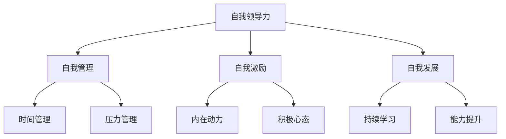
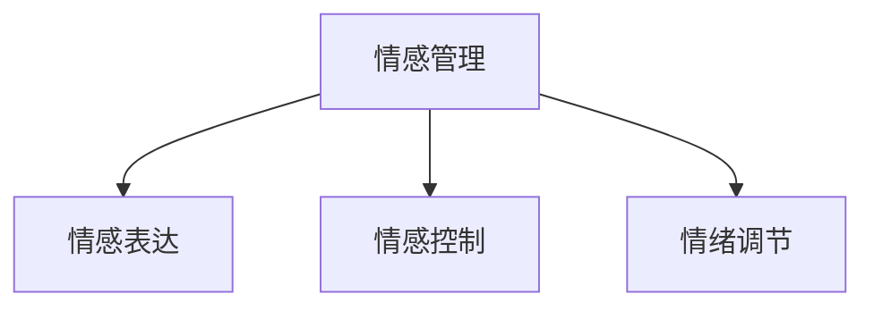
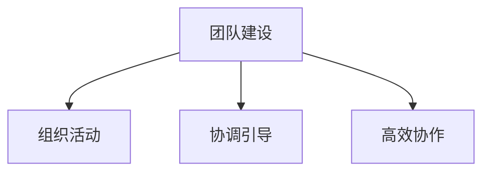
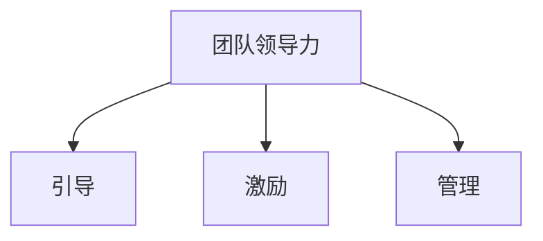
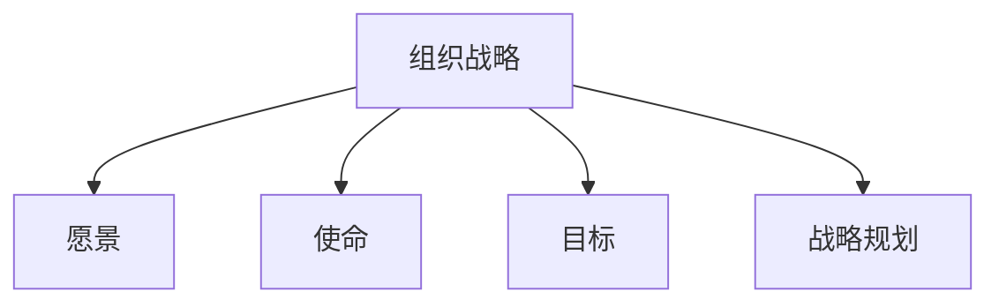

                 

### 文章标题：大模型时代的创业者领导力修炼：自我领导、团队领导与组织领导

> 关键词：大模型时代、创业者、领导力、自我领导、团队领导、组织领导

> 摘要：本文从大模型时代的创业背景与机遇出发，探讨了创业者在大模型时代面临的挑战，以及如何提升自我领导力、团队领导力和组织领导力。文章通过深入分析大模型核心技术、自我领导力的重要性、情感管理与情绪调节、团队建设与管理、团队领导力的提升、组织战略与决策以及领导力的发展与持续改进，为创业者提供了全面、实用的领导力提升指南。

### 第一部分：大模型时代的创业背景与机遇

## 第1章：大模型时代的创业背景与机遇

### 1.1 大模型时代的到来

#### 1.1.1 大模型的基本概念

大模型是一种通过深度学习技术训练得到的大型神经网络模型，具有强大的表示和学习能力。其基本概念包括：

- **深度学习**：一种机器学习技术，通过模拟人脑神经网络结构，对大量数据进行自动学习和特征提取。
- **神经网络**：一种模拟生物神经元的计算模型，通过层层传递信息，实现对复杂问题的建模和求解。
- **大数据**：指规模巨大、结构复杂、类型多样的数据集合，是深度学习训练的重要资源。

#### 1.1.2 大模型的技术演进

大模型的发展经历了以下几个阶段：

1. **单层感知机**：最早期的神经网络模型，能够进行简单的线性分类。
2. **多层感知机**：引入了隐藏层，能够处理更复杂的非线性问题。
3. **深度学习**：通过增加网络层数和训练数据规模，实现了对复杂任务的自动建模和解决。
4. **大模型**：在深度学习的基础上，通过更大的网络规模和更长时间的训练，达到了前所未有的性能。

#### 1.1.3 大模型在创业中的机遇

大模型的出现为创业带来了新的机遇，主要体现在以下几个方面：

1. **人工智能领域**：大模型在图像识别、语音识别、自然语言处理等领域取得了重大突破，为创业者提供了新的技术解决方案。
2. **商业模式创新**：大模型的应用推动了商业模式的创新，如基于大模型的智能客服、智能推荐系统等。
3. **产业升级**：大模型技术助力传统产业实现智能化升级，为创业者提供了新的市场空间。

### 1.2 创业者在大模型时代面临的挑战

#### 1.2.1 技术变革带来的挑战

大模型的快速发展对创业者提出了更高的技术要求，主要体现在以下几个方面：

1. **技术积累**：创业者需要具备深厚的深度学习技术积累，才能在竞争激烈的市场中脱颖而出。
2. **数据处理**：大模型训练需要大量高质量的数据，创业者需要掌握数据采集、清洗和处理的技能。
3. **算法优化**：大模型的性能优化是创业过程中的关键技术挑战，创业者需要不断探索和创新。

#### 1.2.2 市场竞争加剧

随着大模型技术的普及，市场竞争力将进一步加剧，创业者面临以下挑战：

1. **创新速度**：大模型技术的快速发展要求创业者必须保持创新速度，才能跟上市场变化。
2. **产品差异化**：在竞争激烈的市场中，创业者需要通过产品差异化来吸引和留住用户。
3. **市场拓展**：大模型技术的应用场景广泛，创业者需要积极探索新的市场机会。

#### 1.2.3 团队建设与管理

大模型项目的成功离不开高效的团队建设和管理，创业者需要面对以下挑战：

1. **人才招聘**：招聘到具备深度学习技术背景的优秀人才是团队建设的关键。
2. **团队协作**：大模型项目通常涉及多个领域和技能，需要团队成员之间紧密协作。
3. **项目管理**：大模型项目的周期较长、难度较高，需要创业者具备良好的项目管理能力。

## 第2章：大模型核心技术解析

### 2.1 大模型的基本架构

#### 2.1.1 大模型的层次结构

大模型的层次结构通常包括输入层、隐藏层和输出层。每个层次由多个神经元组成，神经元之间通过连接进行信息传递。层次结构决定了大模型的计算能力和表达能力。

#### 2.1.2 大模型的网络结构

大模型的网络结构通常非常复杂，包含大量的神经元和连接。常见的网络结构包括卷积神经网络（CNN）、循环神经网络（RNN）、Transformer等。不同的网络结构适用于不同的任务和应用场景。

#### 2.1.3 大模型的训练与优化

大模型的训练与优化是创业过程中的关键技术环节。训练过程中，通过大量的数据和计算资源，对大模型进行反复迭代，使其性能逐步提升。优化过程包括网络结构调整、参数调整、算法改进等。

### 2.2 大模型的核心算法

#### 2.2.1 神经网络算法

神经网络算法是大模型的基础，包括感知机、多层感知机、反向传播算法等。神经网络通过层层传递信息，实现对复杂问题的建模和求解。

#### 2.2.2 深度学习算法

深度学习算法是大模型的核心，包括卷积神经网络（CNN）、循环神经网络（RNN）、Transformer等。深度学习算法通过大规模数据训练，能够自动提取特征，实现复杂的任务。

#### 2.2.3 大模型训练算法

大模型训练算法决定了大模型的性能，包括梯度下降算法、随机梯度下降算法、Adam优化器等。训练算法通过不断迭代，调整网络参数，使模型达到最优性能。

### 2.3 大模型的数学基础

#### 2.3.1 线性代数

线性代数在大模型中扮演着重要角色，包括矩阵运算、向量空间、线性变换等。线性代数为大模型的计算提供了基础。

#### 2.3.2 微积分

微积分在大模型中用于描述大模型的动态行为，包括导数、微分方程等。微积分用于优化算法，调整网络参数。

#### 2.3.3 概率论与统计

概率论与统计在大模型中用于模型评估和优化，包括概率分布、统计学习理论等。概率论与统计用于评估模型性能，指导训练过程。

### 第二部分：自我领导力提升

#### 第3章：自我领导力的重要性

##### 3.1 自我领导力的概念

自我领导力是指个体在自我管理、自我激励和自我发展方面的能力。它不仅仅是一个人的领导能力，更是一种内在的自我驱动和自我调节的能力。以下是自我领导力的几个关键要素：

- **自我认知**：了解自己的优势和弱点，明确自己的价值观和目标。
- **自我激励**：激发内在动力，保持积极心态，面对挑战时不轻易放弃。
- **自我管理**：合理安排时间，有效处理压力，保持身心健康。
- **自我发展**：持续学习新知识，不断提升自己的能力和技能。

##### 3.1.1 自我领导力的定义

自我领导力是指个体在自我管理、自我激励和自我发展方面的能力。它不仅仅是一个人的领导能力，更是一种内在的自我驱动和自我调节的能力。以下是一个简化的自我领导力定义的Mermaid流程图：



##### 3.1.2 自我领导力的重要性

自我领导力对于创业者的成功至关重要。以下是其重要性的几个方面：

- **应对挑战**：在创业过程中，创业者常常需要面对各种挑战和不确定性，自我领导力可以帮助创业者保持冷静，迅速做出正确的决策。
- **团队建设**：创业者需要通过自我领导力来吸引和留住优秀人才，构建一个高效、协作的团队。
- **持续成长**：自我领导力使创业者能够不断学习、成长，适应快速变化的市场环境。

##### 3.1.3 自我领导力的核心要素

自我领导力的核心要素包括以下几个方面：

- **自我认知**：了解自己的优势和弱点，明确自己的价值观和目标。以下是一个简化的自我认知流程图：

  ```mermaid
  graph TD
  A[自我认知] --> B[自我分析]
  B --> C[优势识别]
  B --> D[弱点识别]
  A --> E[价值观明确]
  A --> F[目标设定]
  ```

- **自我激励**：激发内在动力，保持积极心态，面对挑战时不轻易放弃。以下是一个简化的自我激励流程图：

  ```mermaid
  graph TD
  A[自我激励] --> B[目标明确]
  B --> C[动力激发]
  B --> D[积极心态]
  A --> E[挑战应对]
  ```

- **自我管理**：合理安排时间，有效处理压力，保持身心健康。以下是一个简化的自我管理流程图：

  ```mermaid
  graph TD
  A[自我管理] --> B[时间管理]
  B --> C[任务优先级]
  B --> D[时间分配]
  A --> E[压力管理]
  A --> F[身心健康]
  ```

- **自我发展**：持续学习新知识，不断提升自己的能力和技能。以下是一个简化的自我发展流程图：

  ```mermaid
  graph TD
  A[自我发展] --> B[知识学习]
  B --> C[技能提升]
  B --> D[经验积累]
  A --> E[能力拓展]
  ```

#### 3.2 自我领导力的提升方法

##### 3.2.1 自我认知

自我认知是提升自我领导力的第一步。以下是一些提升自我认知的方法：

- **反思日志**：定期记录自己的思考和行为，分析自己的优点和不足。
- **他人反馈**：倾听他人的意见和建议，从不同的角度了解自己。
- **心理测试**：通过专业心理测试，了解自己的性格、能力和价值观。

##### 3.2.2 自我激励

自我激励是保持自我领导力的关键。以下是一些提升自我激励的方法：

- **目标设定**：明确自己的目标和计划，为自己设定清晰的方向。
- **积极心态**：保持乐观的心态，相信自己能够克服困难。
- **奖励机制**：为自己设定奖励，鼓励自己在面对挑战时保持动力。

##### 3.2.3 自我管理

自我管理是提升自我领导力的有效方法。以下是一些提升自我管理的方法：

- **时间管理**：合理安排时间，确保高效完成任务。
- **压力管理**：学会应对压力，保持心理平衡。
- **健康管理**：保持良好的生活习惯，确保身心健康。

### 第4章：情感管理与情绪调节

#### 4.1 情感管理与情绪调节的概念

情感管理与情绪调节是指个体在情感表达、情感控制和情感调节方面的能力。情感管理与情绪调节的核心目标是：

- **情感表达**：适当、准确地表达自己的情感，避免情感的压抑或过度表达。
- **情感控制**：在适当的时间和情境中，控制和调节自己的情感，避免负面情绪对决策和行为的影响。
- **情绪调节**：通过自我调节技巧，有效处理和调节负面情绪，保持心理平衡和情绪稳定。

#### 4.1.1 情感管理的定义

情感管理是指个体在情感表达、情感控制和情感调节方面的能力。以下是一个简化的情感管理定义的Mermaid流程图：



#### 4.1.2 情绪调节的重要性

情绪调节对于维护心理健康和提升工作效率至关重要。以下是其重要性的几个方面：

- **心理健康**：情绪调节有助于降低压力和焦虑，提高心理健康水平。
- **工作效率**：情绪调节有助于提高注意力和集中力，提高工作效率和绩效。
- **人际关系**：情绪调节有助于改善人际关系，减少冲突和误解。

#### 4.1.3 情感管理与情绪调节的核心要素

情感管理与情绪调节的核心要素包括以下几个方面：

- **自我意识**：了解自己的情绪状态，认识到情绪对自己的影响。
- **情感表达**：学会适当、准确地表达自己的情感。
- **情感控制**：在适当的时间和情境中，控制和调节自己的情感。
- **情绪调节技巧**：通过一系列技巧和策略，有效处理和调节负面情绪。

#### 4.2 情感管理与情绪调节的方法

##### 4.2.1 自我意识

自我意识是情感管理和情绪调节的基础。以下是一些提升自我意识的方法：

- **情绪日记**：记录自己的情绪变化，分析情绪产生的原因和影响。
- **正念练习**：通过正念练习，提高对当前情绪和感受的觉察和接受能力。
- **心理咨询**：通过专业心理咨询，深入了解自己的情绪和心理状态。

##### 4.2.2 情绪表达

情绪表达是情感管理和情绪调节的重要环节。以下是一些提升情绪表达的方法：

- **非暴力沟通**：学会用非暴力沟通的方式表达自己的情绪，避免冲突和误解。
- **情感表达练习**：通过角色扮演、情景模拟等方式，提高自己的情绪表达能力。
- **情感释放**：通过运动、艺术创作等方式，释放自己的情绪。

##### 4.2.3 情绪调节技巧

情绪调节技巧是提升情感管理和情绪调节能力的关键。以下是一些常用的情绪调节技巧：

- **认知重构**：通过改变对事件的认知，调整自己的情绪反应。
- **放松训练**：通过深呼吸、冥想等方式，放松身心，减轻压力。
- **正向思维**：培养积极、乐观的思维习惯，提高情绪调节能力。
- **情绪转移**：将注意力从负面情绪转移到其他事物上，减少负面情绪的影响。

### 第三部分：团队领导力提升

#### 第5章：团队建设与管理

##### 5.1 团队建设的重要性

团队建设是指通过组织、协调和引导，建立高效协作的团队。团队建设的重要性体现在以下几个方面：

- **提升团队效能**：通过团队建设，可以提升团队成员的合作效率，实现团队整体目标的优化。
- **促进沟通协作**：团队建设有助于增强团队成员之间的沟通和协作，减少冲突和误解。
- **激发团队活力**：团队建设可以激发团队成员的积极性和创造力，提高团队的整体活力。
- **实现组织目标**：团队建设是组织实现战略目标和长期发展的重要保障。

#### 5.1.1 团队建设的定义

团队建设是指通过一系列的组织、协调和引导活动，建立高效协作的团队。以下是一个简化的团队建设定义的Mermaid流程图：



#### 5.1.2 团队建设的目标

团队建设的目标主要包括以下几个方面：

- **提升团队效能**：通过优化团队结构、流程和沟通，提升团队的协作效率和工作质量。
- **增强团队凝聚力**：通过共同目标和价值观的建立，增强团队成员之间的信任和依赖，提高团队的凝聚力。
- **促进个人成长**：通过团队建设活动，帮助团队成员提高个人能力和技能，实现个人与团队的共同成长。

#### 5.1.3 团队建设的关键要素

团队建设的关键要素包括以下几个方面：

- **明确团队目标**：团队目标应具体、明确，与组织目标一致，为团队成员提供清晰的方向和指引。
- **建立信任关系**：通过团队成员之间的互动和合作，建立信任关系，提高团队的协作效率和稳定性。
- **有效沟通**：建立有效的沟通机制，确保信息在团队内部流畅传递，减少误解和冲突。
- **激励机制**：设立合理的激励机制，激发团队成员的积极性和创造力，提高团队的整体表现。

##### 5.2 团队管理的方法

团队管理是指通过一系列的管理活动，确保团队高效协作，实现团队目标。以下是一些团队管理的方法：

#### 5.2.1 团队沟通技巧

团队沟通技巧是团队管理的基础。以下是一些提升团队沟通技巧的方法：

- **倾听**：倾听是沟通的重要环节，通过倾听，可以更好地理解团队成员的需求和意见。
- **明确表达**：明确表达自己的观点和意见，避免误解和冲突。
- **积极反馈**：及时给予团队成员积极的反馈，鼓励和支持他们的工作。
- **共同决策**：在决策过程中，充分考虑团队成员的意见，实现共同决策。

#### 5.2.2 团队激励策略

团队激励策略是提升团队士气和工作效率的重要手段。以下是一些团队激励策略：

- **目标激励**：设定明确的团队目标，激发团队成员的积极性和动力。
- **奖励激励**：设立合理的奖励机制，奖励表现优秀的团队成员，提高团队的整体士气。
- **参与激励**：鼓励团队成员参与决策和项目规划，增加他们的责任感和归属感。
- **培训激励**：提供培训和成长机会，帮助团队成员提升个人能力和技能，实现自我价值。

#### 5.2.3 团队冲突管理

团队冲突管理是团队管理的重要内容。以下是一些团队冲突管理的方法：

- **预防冲突**：在团队建设过程中，通过明确目标和规范，预防潜在冲突的发生。
- **倾听理解**：在冲突发生时，倾听双方的意见，理解他们的立场和需求。
- **调解协商**：通过调解和协商，寻求双方都能接受的解决方案，避免冲突升级。
- **积极解决**：面对冲突，积极寻求解决方案，确保团队目标的实现。

### 第6章：团队领导力的提升

##### 6.1 团队领导力的概念

团队领导力是指团队领导者通过引导、激励和管理，推动团队达成目标的能力。团队领导力不仅包括技术和管理能力，还包括情感智慧、沟通能力和决策能力。以下是一个简化的团队领导力定义的Mermaid流程图：



##### 6.1.1 团队领导力的重要性

团队领导力对于团队的成功至关重要。以下是其重要性的几个方面：

- **团队凝聚力**：团队领导力有助于增强团队的凝聚力，促进团队成员之间的合作和信任。
- **工作效率**：团队领导力可以提升团队的工作效率，确保团队目标的实现。
- **创新能力**：团队领导力可以激发团队成员的创新能力，推动团队的持续发展和进步。
- **团队士气**：团队领导力有助于提升团队的士气，增强团队成员的积极性和满意度。

##### 6.1.2 团队领导力的核心要素

团队领导力的核心要素包括以下几个方面：

- **技术能力**：团队领导者需要具备相应的技术能力和专业知识，以指导和帮助团队成员解决技术难题。
- **沟通能力**：团队领导者需要具备良好的沟通能力，确保团队成员之间的信息畅通，减少误解和冲突。
- **决策能力**：团队领导者需要具备良好的决策能力，能够根据团队目标和实际情况，做出明智的决策。
- **情感智慧**：团队领导者需要具备情感智慧，能够理解和管理团队成员的情感，提升团队的凝聚力和士气。

#### 6.2 团队领导力的提升方法

##### 6.2.1 自我提升

自我提升是团队领导力提升的重要途径。以下是一些自我提升的方法：

- **学习与反思**：通过不断学习和反思，提升自己的专业能力和领导能力。
- **参加培训**：参加专业的领导力培训，学习最新的领导力理论和实践方法。
- **阅读书籍**：阅读领导力相关的书籍，了解各种领导力风格和技巧。

##### 6.2.2 情感领导

情感领导是团队领导力提升的关键。以下是一些情感领导的方法：

- **建立信任**：通过建立信任，增强团队成员之间的信任和依赖。
- **关注团队成员**：关注团队成员的需求和感受，提供情感支持。
- **激励与认可**：通过激励和认可，激发团队成员的积极性和创造力。

##### 6.2.3 沟通协调

沟通协调是团队领导力提升的有效方法。以下是一些沟通协调的方法：

- **主动沟通**：主动与团队成员沟通，了解他们的想法和意见。
- **明确沟通目标**：在沟通前明确沟通目标，确保沟通的效率和质量。
- **倾听与理解**：倾听团队成员的意见，理解他们的需求和期望。

### 第四部分：组织领导力提升

#### 第7章：组织战略与决策

##### 7.1 组织战略的概念

组织战略是指组织为实现长期目标而制定的总体规划和行动方案。组织战略包括以下几个方面：

- **愿景**：组织长期的愿景和目标，为组织提供方向和动力。
- **使命**：组织的使命和价值观，明确组织的核心价值和存在意义。
- **目标**：具体的短期和长期目标，为组织的发展提供明确的方向。
- **战略规划**：为实现组织目标而制定的具体战略和行动方案。

#### 7.1.1 组织战略的定义

组织战略是指组织为实现长期目标而制定的总体规划和行动方案。以下是一个简化的组织战略定义的Mermaid流程图：



#### 7.1.2 组织战略的目标

组织战略的目标主要包括以下几个方面：

- **提升竞争力**：通过制定和实施组织战略，提升组织的市场竞争力，确保组织的长期生存和发展。
- **实现可持续发展**：通过战略规划，确保组织在资源、环境和社会责任等方面的可持续发展。
- **提高运营效率**：通过优化组织结构和流程，提高组织的运营效率和效益。
- **增强创新能力**：通过战略规划，推动组织的创新和变革，保持组织的竞争力和活力。

#### 7.1.3 组织战略的核心要素

组织战略的核心要素包括以下几个方面：

- **愿景**：组织长期的愿景和目标，为组织提供方向和动力。
- **使命**：组织的使命和价值观，明确组织的核心价值和存在意义。
- **目标**：具体的短期和长期目标，为组织的发展提供明确的方向。
- **战略规划**：为实现组织目标而制定的具体战略和行动方案。

##### 7.2 组织决策的方法

组织决策是指组织在面临各种问题和挑战时，做出合理和有效的决策过程。以下是一些组织决策的方法：

#### 7.2.1 决策过程

决策过程主要包括以下几个阶段：

1. **问题识别**：明确组织面临的问题和挑战，确定决策的目标和范围。
2. **信息收集**：收集与决策相关的信息和数据，为决策提供依据。
3. **方案评估**：分析各种备选方案，评估其优缺点和可行性。
4. **决策制定**：根据评估结果，选择最优方案，制定具体的决策方案。
5. **决策执行**：执行决策方案，监督决策的实施过程。

#### 7.2.2 决策分析

决策分析是决策过程中的重要环节，主要包括以下几个方面：

1. **成本效益分析**：分析各种备选方案的成本和效益，选择经济效益最高的方案。
2. **风险评估**：评估各种备选方案的风险和潜在影响，选择风险最小的方案。
3. **可行性分析**：评估各种备选方案的可行性和实施难度，选择最可行的方案。
4. **偏好分析**：考虑决策者的个人偏好和价值观，选择最符合决策者偏好的方案。

#### 7.2.3 决策模型

决策模型是决策过程中的工具，主要包括以下几个方面：

1. **理性决策模型**：基于理性思考和最大化效益的原则，选择最优方案。
2. **有限理性决策模型**：考虑到决策者的认知局限和决策环境的不确定性，选择相对最优的方案。
3. **博弈论决策模型**：考虑多方利益和决策互动，选择在博弈环境中最优的方案。
4. **决策树模型**：通过树状结构表示各种决策和可能的结果，选择最优路径。

### 第8章：领导力的发展与持续改进

#### 8.1 领导力的发展

领导力的发展是指领导者在个人素质、能力和行为方面的持续成长和提升。以下是一些领导力发展的方面：

##### 8.1.1 领导力的发展历程

领导力的发展历程可以分为以下几个阶段：

1. **传统领导力**：基于权威和控制的领导模式，强调领导者的权力和地位。
2. **变革型领导力**：强调领导者的愿景和激励作用，推动团队成员的变革和成长。
3. **情感智慧领导力**：强调领导者的情感智慧和人际关系管理能力，提升团队凝聚力和士气。
4. **分布式领导力**：强调领导者的角色和责任，推动团队成员参与决策和领导。
5. **未来领导力**：关注领导者在快速变化的环境中的适应能力和创新能力。

##### 8.1.2 领导力的发展方向

领导力的发展方向主要包括以下几个方面：

1. **技术赋能**：利用新技术和工具，提升领导者的决策能力和管理效率。
2. **全球视野**：拓展领导者的国际视野，提升跨文化沟通和合作能力。
3. **持续学习**：鼓励领导者的终身学习，不断提升个人素质和能力。
4. **社会责任**：关注领导者在社会和环境责任方面的担当和贡献。
5. **创新思维**：培养领导者的创新思维，推动组织的创新和变革。

##### 8.1.3 领导力的发展策略

领导力的发展策略主要包括以下几个方面：

1. **领导力培训**：通过领导力培训，提升领导者的理论知识和实践能力。
2. **导师指导**：通过导师指导，帮助领导者积累经验，提升领导能力。
3. **实践反思**：通过实践和反思，不断总结经验教训，提升领导力。
4. **团队建设**：通过团队建设，提升团队凝聚力和合作效率，促进领导力的发挥。
5. **组织文化**：营造积极向上的组织文化，激发领导者的积极性和创造力。

#### 8.2 领导力的持续改进

##### 8.2.1 持续改进的意义

持续改进是指领导者通过不断学习、实践和反思，不断提升个人素质和能力的过程。持续改进的意义主要包括以下几个方面：

1. **提升个人能力**：通过持续改进，领导者可以不断提升自己的专业能力和管理能力，应对各种挑战和变化。
2. **提升组织效能**：通过持续改进，领导者可以推动组织的创新和变革，提升组织的竞争力和执行力。
3. **促进个人成长**：通过持续改进，领导者可以实现个人的成长和进步，实现自我价值。
4. **建立学习型组织**：通过持续改进，领导者可以推动组织建立学习型文化，提升组织的整体素质和竞争力。

##### 8.2.2 持续改进的方法

持续改进的方法主要包括以下几个方面：

1. **目标设定**：明确个人和组织的目标，确保持续改进的方向和目标。
2. **计划执行**：制定详细的计划，确保持续改进的执行和落实。
3. **反馈与评估**：及时收集反馈和评估改进效果，调整改进策略。
4. **持续学习**：鼓励持续学习和知识更新，提升领导者的素质和能力。
5. **实践反思**：通过实践和反思，不断总结经验教训，推动持续改进。

##### 8.2.3 持续改进的实践

持续改进的实践主要包括以下几个方面：

1. **领导力培训**：通过领导力培训，提升领导者的理论知识和实践能力。
2. **团队建设**：通过团队建设，提升团队凝聚力和合作效率，促进领导力的发挥。
3. **组织文化**：营造积极向上的组织文化，激发领导者的积极性和创造力。
4. **创新机制**：建立创新机制，鼓励领导者推动组织的创新和变革。
5. **反馈机制**：建立有效的反馈机制，确保领导者的持续改进得到有效反馈和支持。

### 附录

#### 附录A：大模型时代领导力工具与资源

##### A.1 大模型时代领导力工具

###### A.1.1 领导力评估工具

领导力评估工具可以帮助领导者了解自身的领导力水平，包括以下几种：

1. **360度评估**：通过收集团队成员、上级和下属的反馈，全面评估领导者的领导力。
2. **领导力问卷**：通过填写问卷，评估领导者的领导风格、沟通能力、决策能力等方面。
3. **行为观察**：通过观察领导者的行为和表现，评估其领导力水平。

###### A.1.2 团队建设工具

团队建设工具可以帮助团队领导者提升团队效能，包括以下几种：

1. **团队协作工具**：如Trello、Slack等，用于团队沟通和任务管理。
2. **团队反馈工具**：如Feedbackify、SurveyMonkey等，用于收集团队成员的反馈和建议。
3. **团队活动工具**：如Miro、Mural等，用于团队讨论和创意碰撞。

###### A.1.3 决策支持工具

决策支持工具可以帮助领导者做出更明智的决策，包括以下几种：

1. **数据分析工具**：如Tableau、Power BI等，用于分析和可视化数据。
2. **模拟工具**：如AnyLogic、Simul8等，用于模拟和预测决策结果。
3. **决策分析工具**：如Excel、Python等，用于进行定量分析和优化决策。

##### A.2 大模型时代领导力资源

###### A.2.1 领导力书籍推荐

以下是一些领导力方面的优秀书籍，供领导者参考：

1. **《领导力的五个层次》**：作者：斯蒂芬·罗宾斯
2. **《领导力心理学》**：作者：理查德·H·哈克曼
3. **《变革之舞》**：作者：约翰·P·科特
4. **《团队协作力》**：作者：彼得·圣吉
5. **《创新者的窘境》**：作者：克里斯坦森

###### A.2.2 领导力在线课程

以下是一些优秀的领导力在线课程，供领导者学习：

1. **哈佛大学领导力课程**：由哈佛大学开设的领导力课程，涵盖领导力的各个方面。
2. **TED领导力演讲**：汇集了来自世界各地的领导力专家的精彩演讲，涵盖领导力的实践和理论。
3. **LinkedIn Learning**：提供多种领导力相关的在线课程，适合不同层次的领导者学习。
4. **Coursera数据驱动领导力课程**：由斯坦福大学开设，关注数据分析和决策在领导力中的应用。

###### A.2.3 领导力社群与论坛

以下是一些领导力社群与论坛，供领导者交流和学习：

1. **领英（LinkedIn）**：全球最大的职业社交平台，拥有众多领导力专家和行业领导者。
2. **哈佛商业评论（Harvard Business Review）**：专业的商业管理杂志，涵盖领导力、管理、创新等方面的文章和案例。
3. **领英领导力论坛**：领英上的领导力专题论坛，供领导者和专业人士交流和学习。
4. **创业邦**：关注中国创业者和创业公司的专业媒体平台，涵盖创业、领导力、管理等方面的内容。

### 作者

**作者：AI天才研究院/AI Genius Institute & 禅与计算机程序设计艺术 /Zen And The Art of Computer Programming**

