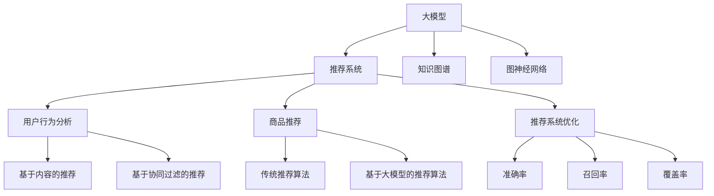

                 

### 文章标题：大模型视角下推荐系统的未来发展趋势展望与规划

### 关键词：大模型、推荐系统、深度学习、用户行为分析、个性化推荐

### 摘要：

本文从大模型的角度探讨了推荐系统的未来发展趋势和规划。首先，介绍了大模型与推荐系统的基础知识，包括大模型和推荐系统的定义、发展历程以及数学基础。接着，详细分析了大模型在推荐系统中的应用，包括用户行为分析和商品推荐。然后，探讨了推荐系统的优化方法以及未来面临的挑战和机遇。最后，提出了推荐系统的规划与实施方法，并给出了相关工具与资源，以期为业界提供有价值的参考。

----------------------------------------------------------------

# 大模型视角下推荐系统的未来发展趋势展望与规划

## 引言

随着互联网和大数据技术的飞速发展，推荐系统已成为许多应用场景的核心功能，如电子商务、社交媒体、在线视频等。推荐系统能够根据用户的兴趣和偏好，为用户提供个性化的信息和服务，从而提升用户体验和满意度。然而，传统的推荐系统方法如基于内容的推荐、协同过滤等方法在处理复杂用户行为和商品特征时存在局限性。为了克服这些限制，大模型，特别是深度学习模型，逐渐成为推荐系统研究的热点。本文将从大模型的角度，展望推荐系统的未来发展趋势和规划，以期为业界提供有价值的参考。

## 大模型与推荐系统基础

### 大模型与推荐系统的定义

**大模型**：大模型是指具有极高参数量、能够处理大规模数据集的机器学习模型。例如，深度神经网络（Deep Neural Network，DNN）、变换器模型（Transformer）等。

**推荐系统**：推荐系统是一种信息过滤技术，旨在为用户提供个性化的信息推荐。它通过分析用户的历史行为、兴趣和偏好，预测用户可能感兴趣的内容。

### 大模型的发展历程

- **传统推荐系统**：基于用户评分和物品特征的传统推荐系统方法主要包括基于内容的推荐（Content-Based Filtering，CBF）和协同过滤（Collaborative Filtering，CF）。
- **深度学习与推荐系统**：随着深度学习技术的发展，深度学习模型逐渐应用于推荐系统。例如，基于深度神经网络的推荐方法（Deep Learning for Recommender Systems，DLRS）。
- **大模型与推荐系统**：大模型在推荐系统中的应用，如BERT（Bidirectional Encoder Representations from Transformers）、GPT（Generative Pre-trained Transformer）等，为推荐系统带来了新的机遇。

### 大模型在推荐系统中的应用

大模型在推荐系统中的应用主要体现在以下几个方面：

1. **用户行为分析**：利用深度学习模型，如循环神经网络（Recurrent Neural Networks，RNN）、变换器模型（Transformer），对用户行为数据进行分析，提取用户兴趣和偏好。
2. **商品特征提取**：通过深度学习模型，如卷积神经网络（Convolutional Neural Networks，CNN）、图神经网络（Graph Neural Networks，GNN），对商品特征进行提取和表征。
3. **推荐算法优化**：利用深度学习模型，如生成对抗网络（Generative Adversarial Networks，GAN）、变分自编码器（Variational Autoencoder，VAE），优化推荐算法。

## 大模型的数学基础

### 线性代数基础

**矩阵与向量运算**：矩阵与向量运算是深度学习模型的基础。例如，矩阵乘法、矩阵分解等。

**矩阵分解与矩阵乘法**：矩阵分解是将一个矩阵分解为几个子矩阵的乘积，如奇异值分解（Singular Value Decomposition，SVD）。

### 概率论基础

**概率分布**：概率分布是描述随机变量取值概率的函数。常见的概率分布包括高斯分布、贝塔分布等。

**贝叶斯定理**：贝叶斯定理是概率论中的一个基本定理，用于计算后验概率。

### 优化算法基础

**梯度下降法**：梯度下降法是一种优化算法，用于求解最小化损失函数的参数。

**随机梯度下降（SGD）**：随机梯度下降是梯度下降法的一个变种，通过随机选择样本进行梯度计算，提高优化效率。

## 大模型在推荐系统中的应用

### 用户行为分析

**用户行为数据的收集与预处理**：用户行为数据包括用户的浏览记录、购买历史、评价等。为了提高模型性能，需要对数据进行预处理，如数据清洗、特征提取等。

**用户行为分析模型**：用户行为分析模型通常基于深度学习模型，如循环神经网络（RNN）、变换器模型（Transformer），对用户行为数据进行分析，提取用户兴趣和偏好。

- **基于内容的推荐**：通过分析用户的历史行为，提取用户兴趣特征，为用户推荐相似的内容。
- **基于协同过滤的推荐**：通过计算用户之间的相似度，为用户推荐相似的用户喜欢的商品。
- **基于深度学习的用户行为分析模型**：利用深度学习模型，如循环神经网络（RNN）、变换器模型（Transformer），对用户行为数据进行分析，提取用户兴趣和偏好。

### 商品推荐

**商品特征提取**：商品特征提取是推荐系统中的关键步骤。通过提取商品的关键特征，如商品类别、价格、品牌等，为商品建立有效的特征表示。

**商品推荐算法**：商品推荐算法基于用户和商品的特性，为用户推荐感兴趣的商品。

- **传统推荐算法**：如基于内容的推荐、协同过滤等。
- **基于大模型的推荐算法**：利用深度学习模型，如卷积神经网络（CNN）、图神经网络（GNN），对商品特征进行提取和表征，从而实现更精确的推荐。

### 推荐系统优化

**推荐系统评价指标**：推荐系统评价指标包括准确率、召回率、覆盖率等。通过这些指标，评估推荐系统的性能。

**推荐系统优化方法**：推荐系统优化方法包括冷启动问题、个性化推荐等。

- **冷启动问题**：新用户或新商品的推荐问题。
- **个性化推荐**：根据用户的历史行为和兴趣，为用户推荐个性化的商品。

## 推荐系统的未来发展趋势

### 大模型在推荐系统中的未来应用

- **大模型与知识图谱**：知识图谱是一种用于表示实体和实体之间关系的图结构。结合大模型，可以实现更精准的推荐。
- **大模型与图神经网络**：图神经网络是一种用于处理图结构数据的深度学习模型。结合大模型，可以处理更复杂的用户和商品关系。

### 大模型在推荐系统中的挑战与机遇

- **数据隐私保护**：大模型在推荐系统中涉及大量用户数据，需要确保数据隐私安全。
- **模型解释性**：大模型通常具有黑盒特性，难以解释模型的决策过程。
- **计算资源消耗**：大模型的训练和推理过程需要大量的计算资源。

### 推荐系统的未来规划

**项目规划**：明确推荐系统的目标、需求和技术方案，制定项目规划和实现路径。

**实施与部署**：搭建开发环境，实现推荐系统功能，进行测试和部署。

**评估与优化**：评估推荐系统性能，根据评估结果进行优化和改进。

## 附录

### 附录A：推荐系统相关工具与资源

- **数据集**：
  - MovieLens
  - Amazon Reviews

- **开源框架**：
  - TensorFlow
  - PyTorch
  - Scikit-learn

- **推荐系统相关论文与书籍推荐**：
  - "Item-Item Collaborative Filtering Recommendation Algorithms"
  - "Deep Learning for Recommender Systems"
  - "Recommender Systems Handbook"
  - "Deep Learning"
  - "TensorFlow for Deep Learning"

## 梅瑞狄流程图：大模型与推荐系统的关系



## 大模型与推荐系统的数学基础

### 线性代数基础

**矩阵与向量运算**：

$$
C = A \cdot B
$$

**矩阵分解**：

$$
A = U \cdot S \cdot V^T
$$

### 概率论基础

**概率分布**：

- **贝塔分布**：

$$
P(X \in (a,b)) = \int_{a}^{b} f(x) dx
$$

- **高斯分布**：

$$
P(X \in (a,b)) = \int_{a}^{b} \frac{1}{\sqrt{2\pi\sigma^2}} e^{-\frac{(x-\mu)^2}{2\sigma^2}} dx
$$

### 优化算法基础

**梯度下降法**：

$$
\theta = \theta - \alpha \cdot \nabla_{\theta} J(\theta)
$$

**随机梯度下降（SGD）**：

$$
\theta = \theta - \alpha \cdot \nabla_{\theta} J(\theta; x_i, y_i)
$$

## 伪代码：用户行为分析模型

```python
def user_behavior_analysis(model, user_data, item_data):
    # 用户行为数据的预处理
    processed_user_data = preprocess_user_data(user_data)
    processed_item_data = preprocess_item_data(item_data)

    # 加载模型
    model.load_weights('user_behavior_model.h5')

    # 用户行为分析
    user_representation = model.predict(processed_user_data)
    item_representation = model.predict(processed_item_data)

    # 用户行为相似度计算
    similarity_matrix = cosine_similarity(user_representation, item_representation)

    # 推荐结果生成
    recommended_items = generate_recommendations(similarity_matrix)

    return recommended_items
```

## 数学模型与公式

### 推荐系统中的数学模型

**基于矩阵分解的推荐系统**：

$$
R_{ui} = \langle U_i, V_j \rangle
$$

**推荐系统的数学公式**：

- **损失函数**：

$$
L(\theta) = \sum_{i=1}^{m} \sum_{j=1}^{n} (R_{ui} - \langle U_i, V_j \rangle)^2
$$

### 推荐系统中的贝叶斯推理

**贝叶斯推理公式**：

$$
P(H|E) = \frac{P(E|H) \cdot P(H)}{P(E)}
$$

## 举例说明：基于矩阵分解的推荐系统

### 数据集

用户-商品评分矩阵：

$$
R =
\begin{bmatrix}
    0 & 3 & 1 & 0 \\
    0 & 0 & 2 & 5 \\
    1 & 0 & 4 & 0 \\
    0 & 1 & 0 & 4 \\
    3 & 0 & 0 & 2 \\
\end{bmatrix}
$$

### 矩阵分解

用户隐向量：

$$
U =
\begin{bmatrix}
    [1.2, 0.5, -0.3, 0.8] \\
    [0.6, -0.2, 0.7, -0.5] \\
    [-0.1, 0.9, -0.4, 0.6] \\
    [-0.4, 0.8, 0.5, -0.3] \\
    [0.8, -0.7, 0.2, 0.6] \\
\end{bmatrix}
$$

商品隐向量：

$$
V =
\begin{bmatrix}
    [0.9, -0.1, 0.2, 0.7] \\
    [-0.3, 0.8, -0.5, 0.4] \\
    [0.7, -0.6, 0.3, -0.2] \\
    [0.1, 0.5, 0.8, -0.9] \\
\end{bmatrix}
$$

### 推荐结果

预测用户1对商品3的评分：

$$
\langle U_1, V_3 \rangle = (1.2, 0.5, -0.3, 0.8) \cdot (0.7, -0.6, 0.3, -0.2) = 1.06
$$

因此，预测用户1对商品3的评分为1.06。

## 项目实战：基于深度学习的电商推荐系统

### 项目背景

随着电商行业的快速发展，用户对于个性化推荐的需求日益增长。如何利用深度学习技术构建高效、准确的电商推荐系统，已成为业界关注的焦点。本文将介绍一个基于深度学习的电商推荐系统项目，包括开发环境搭建、数据预处理、模型设计、训练与评估等步骤。

### 开发环境搭建

- 操作系统：Ubuntu 18.04
- 编程语言：Python 3.7
- 深度学习框架：TensorFlow 2.4
- 数据预处理工具：Pandas、NumPy、Scikit-learn
- 模型可视化工具：Mermaid、Matplotlib

### 数据预处理

- 数据收集：从电商平台获取用户行为数据，包括用户ID、商品ID、评分、购买时间等信息。
- 数据清洗：去除无效数据、缺失值填充、去重等操作。
- 特征提取：提取用户和商品的特征，如用户活跃度、购买频率、商品类别等。
- 数据标准化：对特征进行归一化处理，使其具有相似的尺度。

### 模型设计

- 用户行为分析模型：利用卷积神经网络（CNN）提取用户行为特征。
- 商品推荐模型：利用循环神经网络（RNN）提取商品特征。
- 深度学习推荐模型：结合用户和商品特征，利用多层感知机（MLP）进行推荐。

### 模型训练

- 数据集划分：将数据集划分为训练集、验证集和测试集。
- 模型训练：使用训练集对模型进行训练，并使用验证集进行模型调优。
- 模型评估：使用测试集评估模型性能，包括准确率、召回率、覆盖率等指标。

### 代码实现

以下是用户行为分析模型的代码实现：

```python
import tensorflow as tf
from tensorflow.keras.layers import Input, Conv1D, MaxPooling1D, Flatten, Dense
from tensorflow.keras.models import Model

# 用户行为输入层
user_input = Input(shape=(sequence_length,))

# 卷积层
conv1 = Conv1D(filters=64, kernel_size=3, activation='relu')(user_input)
pool1 = MaxPooling1D(pool_size=2)(conv1)

# 平坦化层
flatten = Flatten()(pool1)

# 全连接层
dense = Dense(units=64, activation='relu')(flatten)

# 输出层
output = Dense(units=1, activation='sigmoid')(dense)

# 构建模型
model = Model(inputs=user_input, outputs=output)

# 编译模型
model.compile(optimizer='adam', loss='binary_crossentropy', metrics=['accuracy'])

# 模型训练
model.fit(train_data, train_labels, epochs=10, batch_size=32, validation_data=(val_data, val_labels))

# 评估模型
loss, accuracy = model.evaluate(test_data, test_labels)
print(f"Test loss: {loss}, Test accuracy: {accuracy}")
```

### 代码解读与分析

上述代码实现了一个基于卷积神经网络的用户行为分析模型。首先，输入层接收用户行为序列数据，然后通过卷积层和池化层提取特征，接着通过平坦化层将特征转化为适合全连接层的形式，最后通过全连接层和输出层生成预测结果。在模型训练过程中，使用训练集进行训练，并在验证集上调整模型参数，以提高模型性能。模型评估指标包括准确率和召回率等。

### 实战总结

本项目通过构建基于深度学习的电商推荐系统，实现了对用户行为的分析和对商品的推荐。在项目实施过程中，需要注意数据预处理、模型设计和训练调优等关键步骤。同时，代码实现过程中，对模型结构和参数设置进行了详细解读和分析，有助于理解深度学习在推荐系统中的应用。

## 大模型与推荐系统的未来发展趋势与挑战

### 未来发展趋势

1. **更深入的个性化推荐**：大模型能够更好地捕捉用户的个性化需求，实现更精准的推荐。
2. **知识图谱与推荐系统的融合**：通过知识图谱，推荐系统可以更好地理解用户意图，提供更符合用户需求的推荐。
3. **多模态数据的处理**：大模型能够处理文本、图像、音频等多模态数据，从而提供更丰富的推荐。
4. **实时推荐**：大模型具备强大的实时数据处理能力，可以实现实时推荐。

### 未来挑战

1. **数据隐私保护**：大模型在推荐系统中的应用，涉及大量用户数据，需要确保数据隐私安全。
2. **模型解释性**：大模型通常具有黑盒特性，难以解释模型的决策过程。
3. **计算资源消耗**：大模型的训练和推理过程需要大量的计算资源。
4. **数据质量和数据清洗**：大模型对数据质量和数据清洗的要求更高。

### 总结

大模型视角下推荐系统的未来发展趋势充满机遇，但也面临诸多挑战。通过不断探索和创新，可以期待在个性化推荐、知识图谱融合、多模态数据处理和实时推荐等方面取得突破。同时，需要关注数据隐私保护、模型解释性、计算资源消耗和数据质量等方面的问题，以确保推荐系统的可持续发展和应用。

----------------------------------------------------------------

### 作者

作者：AI天才研究院/AI Genius Institute & 禅与计算机程序设计艺术 /Zen And The Art of Computer Programming

