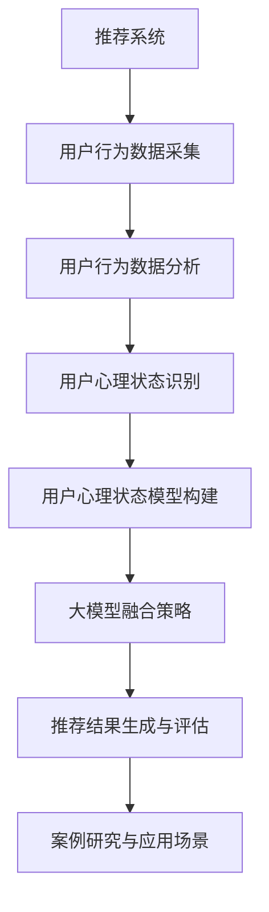
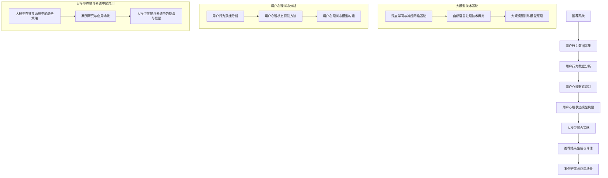
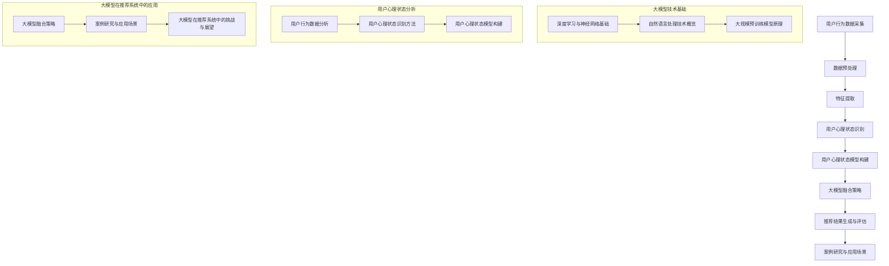

                 

# 文章标题：大模型视角下推荐系统的用户心理状态理解与应用

## 关键词：大模型、推荐系统、用户心理状态、深度学习、自然语言处理、个性化推荐

## 摘要

随着互联网的飞速发展，推荐系统已经成为信息检索、电子商务、社交媒体等领域的核心组件，其目标是为用户提供个性化、高质量的内容推荐。近年来，大模型技术的崛起为推荐系统带来了新的机遇和挑战。本文从大模型的角度出发，探讨了用户心理状态在推荐系统中的理解与应用。首先，我们回顾了推荐系统的发展历程和基本原理，随后介绍了用户心理状态的概念及其在推荐系统中的重要性。接着，我们详细阐述了大模型的基本原理和技术，包括深度学习、自然语言处理和大规模预训练模型等。在此基础上，本文重点分析了用户心理状态的分析方法和技术，包括用户行为数据分析、用户心理状态识别方法和用户心理状态模型构建。最后，我们探讨了如何将大模型技术应用于推荐系统，提出了融合策略和实际应用案例，并展望了推荐系统的未来发展趋势。

## 第一部分：引言与核心概念

### 第1章：推荐系统概述

#### 1.1 推荐系统的发展历程

推荐系统的发展可以追溯到20世纪90年代，随着互联网的兴起，电子商务和社交媒体等应用场景对个性化推荐的需求日益增长。早期的推荐系统主要基于基于内容的过滤和协同过滤方法。基于内容的过滤方法通过分析用户的历史行为和兴趣，推荐与用户兴趣相似的内容。协同过滤方法则通过分析用户之间的相似度，推荐其他用户喜欢的商品或内容。随着大数据和机器学习技术的发展，推荐系统逐渐引入了深度学习、自然语言处理等先进技术，实现了更精准、更个性化的推荐效果。

#### 1.2 推荐系统的基本原理与架构

推荐系统的基本原理是利用历史数据和用户行为，通过建模和预测，为用户推荐感兴趣的内容。推荐系统的架构主要包括数据采集、数据预处理、推荐算法和结果评估等模块。数据采集模块负责收集用户行为数据和内容数据；数据预处理模块负责对数据进行清洗、转换和归一化等操作；推荐算法模块负责根据用户行为和内容数据生成推荐结果；结果评估模块负责对推荐结果进行评估和反馈。

#### 1.3 推荐系统在不同领域的应用

推荐系统在电子商务、社交媒体、在线教育、音乐和视频推荐等众多领域都得到了广泛应用。在电子商务领域，推荐系统可以提升用户购物体验，提高销售额；在社交媒体领域，推荐系统可以帮助用户发现感兴趣的内容，提升用户活跃度；在在线教育领域，推荐系统可以根据用户的学习历史和兴趣，为用户推荐合适的课程；在音乐和视频推荐领域，推荐系统可以提升用户对内容的满意度，提高平台粘性。

#### 1.4 用户心理状态理解概述

用户心理状态是指用户在使用推荐系统时的心理状态和情感反应，包括兴趣、喜好、满意度、焦虑、兴奋等。理解用户心理状态对于提升推荐系统的质量和用户体验具有重要意义。用户心理状态理解的方法和技术主要包括用户行为数据分析、用户情感识别、用户兴趣识别和用户偏好识别等。通过分析用户行为数据，可以了解用户的行为模式和兴趣偏好；通过用户情感识别，可以捕捉用户的情感反应和满意度；通过用户兴趣识别，可以挖掘用户的潜在兴趣和需求；通过用户偏好识别，可以为用户提供更个性化的推荐服务。

### 第2章：用户心理状态理解概述

#### 2.1 用户心理状态的概念与重要性

用户心理状态是指用户在特定情境下对推荐系统的感知、情感和行为反应。用户心理状态的理解对于提升推荐系统的效果和用户体验具有重要意义。首先，理解用户心理状态可以帮助推荐系统更准确地预测用户兴趣和需求，从而提供更个性化的推荐服务。其次，用户心理状态的理解可以帮助系统识别用户的不满意和焦虑情绪，提供有效的情感支持，提升用户体验。最后，用户心理状态的理解可以为推荐系统的优化和改进提供有价值的反馈，促进系统的持续发展和改进。

#### 2.2 用户行为分析的方法与技术

用户行为分析是理解用户心理状态的重要手段。用户行为分析的方法和技术主要包括用户行为数据采集、用户行为数据预处理、用户行为数据分析和用户行为数据可视化等。用户行为数据采集是用户行为分析的基础，主要包括点击行为、浏览行为、购买行为等。用户行为数据预处理是对采集到的数据进行清洗、转换和归一化等操作，以消除噪声和异常值，提高数据质量。用户行为数据分析是利用统计分析和机器学习技术，对用户行为数据进行挖掘和分析，提取用户行为特征和兴趣偏好。用户行为数据可视化是将分析结果以图表、图像等形式展示，帮助用户直观地了解自己的行为模式和兴趣偏好。

#### 2.3 大模型与用户心理状态理解

大模型在用户心理状态理解中的应用具有重要意义。大模型是指具有大规模参数和计算能力的深度学习模型，如 Transformer、BERT、GPT等。大模型通过自监督学习、迁移学习和微调等技术，可以从大量数据中学习到丰富的知识和信息。在用户心理状态理解中，大模型可以用于用户行为数据的预处理和分析，提取用户行为特征和兴趣偏好；可以用于情感识别和偏好识别，捕捉用户的情感反应和满意度；可以用于个性化推荐，根据用户心理状态为用户提供更个性化的推荐服务。

#### 2.4 本书结构与目标

本书结构分为五个部分：

1. **引言与核心概念**：介绍推荐系统的发展历程、基本原理和用户心理状态理解的重要性。
2. **大模型技术基础**：介绍深度学习、自然语言处理和大规模预训练模型等大模型技术的基本原理和应用。
3. **用户心理状态分析**：介绍用户行为数据分析、用户心理状态识别方法和用户心理状态模型构建。
4. **大模型在推荐系统中的应用**：探讨大模型在推荐系统中的融合策略、应用案例和挑战与展望。
5. **总结与展望**：总结全书要点，回顾学习难点与解决思路，展望推荐系统的未来发展趋势。

本书的学习目标是为读者提供全面、系统的推荐系统和用户心理状态理解知识，帮助读者深入理解大模型在推荐系统中的应用，掌握相关技术的实现方法和优化策略，为未来的研究和应用奠定基础。

## 第二部分：大模型技术基础

### 第4章：深度学习与神经网络基础

#### 4.1 神经网络的基本结构

神经网络（Neural Network）是深度学习（Deep Learning）的核心组件，它模拟了人脑神经元的工作原理，通过多层次的神经元节点进行数据传递和计算。一个基本的神经网络通常包含以下几个主要部分：

1. **输入层（Input Layer）**：接收外部输入数据，如文本、图像或数值。
2. **隐藏层（Hidden Layers）**：对输入数据进行特征提取和变换，每一层都可以提取更高层次的抽象特征。
3. **输出层（Output Layer）**：对隐藏层提取的特征进行输出，生成最终的预测结果。

神经网络中的每个神经元都与其他神经元相连接，这些连接称为边，并且每个边都带有权重（weights）。神经元之间的信息传递遵循以下公式：

$$
\text{net\_input} = \sum_{j} (w_{ij} \cdot x_j) + b
$$

其中，\( w_{ij} \) 是从输入层到隐藏层第 \( i \) 个神经元的权重，\( x_j \) 是隐藏层第 \( j \) 个神经元的输入值，\( b \) 是偏置项（bias）。

4. **激活函数（Activation Function）**：为了使神经网络能够进行分类或回归任务，每个神经元的输出通常通过激活函数进行处理。常见的激活函数包括 sigmoid、ReLU、Tanh 等。

#### 4.2 深度学习架构

深度学习架构是指由多个神经网络层次构成的复杂网络结构，用于处理大规模数据和复杂数学问题。深度学习架构的目的是通过多层神经网络的堆叠，逐步提取输入数据的深层特征，实现高度抽象的表示。

1. **卷积神经网络（Convolutional Neural Network, CNN）**：主要用于处理图像数据，通过卷积操作提取图像的局部特征，常用于图像分类、目标检测和图像生成等任务。
2. **循环神经网络（Recurrent Neural Network, RNN）**：适用于处理序列数据，如时间序列数据、语音信号和文本数据。RNN 通过在网络中引入循环结构，能够捕捉序列数据的时间依赖性。
3. **长短期记忆网络（Long Short-Term Memory, LSTM）**：是 RNN 的一个变体，通过引入门控机制，有效解决了 RNN 的梯度消失和梯度爆炸问题，适用于处理长序列数据。
4. **转换器架构（Transformer）**：由 Google 提出的一种用于处理序列数据的架构，通过自注意力机制（Self-Attention）实现了全局信息的有效捕捉，广泛应用于自然语言处理任务，如机器翻译、文本生成和推荐系统等。

#### 4.3 深度学习优化算法

深度学习模型的训练过程实质上是优化模型参数的过程，目标是使模型在训练数据上的预测结果最接近真实值。深度学习优化算法主要包括以下几种：

1. **梯度下降（Gradient Descent）**：是最基本的优化算法，通过迭代更新模型参数，使得损失函数（Loss Function）逐渐减小。其核心公式为：

$$
\theta_{\text{new}} = \theta_{\text{old}} - \alpha \cdot \nabla_{\theta} \, J(\theta)
$$

其中，\( \theta \) 表示模型参数，\( \alpha \) 表示学习率，\( \nabla_{\theta} \, J(\theta) \) 表示损失函数对参数的梯度。

2. **随机梯度下降（Stochastic Gradient Descent, SGD）**：在梯度下降的基础上，每次迭代仅随机选择一小部分训练样本进行梯度计算，以减少计算量和避免陷入局部最优。

3. **批量梯度下降（Batch Gradient Descent）**：每次迭代使用整个训练集进行梯度计算，可以更好地优化模型参数，但计算量较大。

4. **Adam（Adaptive Moment Estimation）**：是一种自适应优化算法，结合了 SGD 和动量（Momentum）的思路，通过自适应调整学习率和动量项，提高了优化效果。

### 第5章：自然语言处理技术概览

#### 5.1 词嵌入技术

词嵌入（Word Embedding）是将单词映射为向量的技术，使得单词之间在向量空间中具有相似的语义关系。词嵌入技术在自然语言处理（Natural Language Processing, NLP）中扮演着重要的角色，可以用于文本分类、机器翻译、情感分析等任务。

1. **基于统计的方法**：如词袋模型（Bag-of-Words, BoW）和TF-IDF（Term Frequency-Inverse Document Frequency），通过统计单词在文档中的出现频率来表示文本。
2. **基于神经网络的的方法**：如 Word2Vec、GloVe（Global Vectors for Word Representation）和 FastText，通过训练神经网络模型，学习单词的向量表示。

Word2Vec 是最著名的词嵌入模型之一，它通过训练神经网络，将输入的单词映射为固定长度的向量，使得在向量空间中具有相似语义的单词彼此接近。Word2Vec 模型有两种训练方式：

- **连续词袋（Continuous Bag of Words, CBOW）**：输入中心词和上下文词，预测中心词。
- **Skip-Gram**：输入中心词，预测上下文词。

#### 5.2 序列模型与注意力机制

序列模型（Sequence Model）是处理序列数据的常用模型，如 RNN、LSTM 和 Transformer。这些模型可以捕捉序列数据的时间依赖性，广泛应用于文本生成、语音识别和机器翻译等任务。

1. **循环神经网络（Recurrent Neural Network, RNN）**：RNN 通过在网络中引入循环结构，使得当前时刻的输出可以依赖于前一个时刻的输出，从而捕捉时间依赖性。然而，RNN 存在梯度消失和梯度爆炸问题，无法有效处理长序列数据。
2. **长短期记忆网络（Long Short-Term Memory, LSTM）**：LSTM 是 RNN 的一个变体，通过引入门控机制（ gating mechanism），有效解决了梯度消失和梯度爆炸问题，适用于处理长序列数据。
3. **转换器架构（Transformer）**：Transformer 是由 Google 提出的一种用于处理序列数据的架构，通过引入自注意力机制（Self-Attention），实现了全局信息的有效捕捉。自注意力机制允许模型在序列中的每个位置上自适应地关注不同的信息，从而提高了模型的表示能力。

#### 5.3 转换器架构详解

转换器（Transformer）架构是一种基于自注意力机制的序列到序列模型，广泛应用于自然语言处理任务，如机器翻译、文本生成和推荐系统等。转换器架构的核心思想是使用多头自注意力机制（Multi-Head Self-Attention）来处理序列数据。

1. **自注意力机制（Self-Attention）**：自注意力机制允许模型在序列中的每个位置上自适应地关注不同的信息。自注意力计算公式如下：

$$
\text{Attention}(Q, K, V) = \text{softmax}\left(\frac{QK^T}{\sqrt{d_k}}\right)V
$$

其中，\( Q \)、\( K \) 和 \( V \) 分别表示查询向量、键向量和值向量，\( d_k \) 表示键向量的维度。

2. **多头注意力（Multi-Head Attention）**：多头注意力通过将输入序列分成多个子序列，分别进行自注意力计算，然后再拼接起来。多头注意力的计算公式如下：

$$
\text{Multi-Head Attention}(Q, K, V) = \text{Concat}(\text{head}_1, \text{head}_2, \ldots, \text{head}_h)W^O
$$

其中，\( \text{head}_i \) 表示第 \( i \) 个头计算的结果，\( W^O \) 表示输出线性变换矩阵。

3. **编码器-解码器架构（Encoder-Decoder Architecture）**：编码器（Encoder）将输入序列编码为固定长度的向量表示，解码器（Decoder）则根据编码器生成的向量生成输出序列。编码器和解码器都可以使用多头自注意力机制，使得模型能够全局捕捉输入和输出序列之间的关系。

### 第6章：大规模预训练模型原理

#### 6.1 预训练的概念与意义

预训练（Pre-training）是指在大规模数据集上训练深度学习模型，使其在特定任务上获得良好的表现。预训练的意义在于：

1. **提高模型性能**：通过在大规模数据集上进行预训练，模型可以学习到丰富的语言知识，从而在特定任务上获得更高的性能。
2. **减少标注数据需求**：预训练模型可以利用未标注的数据进行训练，从而减少对标注数据的依赖，提高模型的可扩展性。
3. **通用性**：预训练模型可以在多个任务上应用，从而提高模型的通用性。

#### 6.2 自监督学习方法

自监督学习（Self-Supervised Learning）是一种利用未标注数据进行训练的方法。在自监督学习中，模型通过预测未标注数据中的某些部分来学习知识，从而提高模型的表现。自监督学习方法主要包括以下几种：

1. **Masked Language Model（MLM）**：在预训练过程中，随机屏蔽输入文本序列中的部分单词，然后通过训练模型预测这些屏蔽的单词。BERT 和 GPT 等模型都使用了这种自监督学习方法。
2. **Next Sentence Prediction（NSP）**：在预训练过程中，随机选取两个句子，并预测第二个句子是否紧接在第一个句子后面。这种自监督学习方法可以帮助模型学习句子之间的关系。

#### 6.3 迁移学习与微调技术

迁移学习（Transfer Learning）是指将预训练模型在特定任务上微调（Fine-tuning），以提高模型在该任务上的性能。微调技术主要包括以下几种：

1. **全量微调（Full Fine-tuning）**：在预训练模型的基础上，重新训练所有层，以适应特定任务。
2. **层掩码微调（Layer Masking）**：在预训练模型的基础上，只训练部分层，而将其他层固定。这种方法可以减少训练时间，但可能会降低模型性能。
3. **层次微调（Hierarchical Fine-tuning）**：在预训练模型的基础上，先训练低层次特征（如词嵌入），然后再训练高层次特征（如句子表示），从而提高模型的层次表达能力。

### 第7章：用户行为数据分析

#### 7.1 用户行为数据的采集与处理

用户行为数据是理解用户心理状态的重要依据。用户行为数据的采集包括以下几个方面：

1. **点击行为数据（Click-Through Rate, CTR）**：记录用户在推荐系统上的点击行为，如点击商品、点击广告等。
2. **浏览行为数据（Browsing Behavior）**：记录用户在网页上的浏览轨迹，如浏览的商品、浏览的页面等。
3. **购买行为数据（Purchase Behavior）**：记录用户的购买行为，如购买的商品、购买的时间等。

用户行为数据的处理主要包括以下几个方面：

1. **数据清洗**：去除重复数据、缺失数据和异常值，以保证数据质量。
2. **数据转换**：将不同类型的数据转换为统一的数据格式，如将文本数据转换为词向量。
3. **特征提取**：从用户行为数据中提取特征，如用户历史点击率、浏览时长、购买频率等。

#### 7.2 用户行为数据的分析方法

用户行为数据的分析方法主要包括以下几个方面：

1. **描述性统计分析**：通过统计指标（如均值、中位数、标准差等）描述用户行为数据的分布特征。
2. **关联规则挖掘**：通过关联规则挖掘（如 Apriori 算法、FP-Growth 算法等）发现用户行为数据中的关联关系。
3. **聚类分析**：通过聚类算法（如 K-means、层次聚类等）将用户行为数据划分为不同的用户群体。
4. **分类与回归分析**：通过分类算法（如逻辑回归、支持向量机等）和回归算法（如线性回归、决策树等）预测用户行为。

#### 7.3 用户行为数据可视化

用户行为数据可视化是将分析结果以图表、图像等形式展示，帮助用户直观地了解自己的行为模式和兴趣偏好。用户行为数据可视化主要包括以下几个方面：

1. **柱状图和饼图**：用于展示用户行为数据的分布特征，如用户点击率、购买频率等。
2. **折线图和散点图**：用于展示用户行为数据的变化趋势和相关性，如用户浏览时长和点击率的关系。
3. **热力图**：用于展示用户在不同时间段、不同页面上的行为分布，如用户在电商平台的购物时间分布。

### 第8章：用户心理状态识别方法

#### 8.1 用户情感识别

用户情感识别（Sentiment Analysis）是指通过自然语言处理技术识别用户在文本中的情感倾向，如正面、负面或中性。用户情感识别方法主要包括以下几个方面：

1. **基于词典的方法**：通过建立情感词典，将文本中的单词与情感词典中的情感标签进行匹配，计算情感得分。常见情感词典包括 SentiWordNet、VADER 等。
2. **基于机器学习的方法**：通过训练分类模型（如朴素贝叶斯、支持向量机等），将文本分类为不同的情感类别。常见模型包括 TextCNN、LSTM 等。
3. **基于深度学习的方法**：通过训练深度学习模型（如卷积神经网络、循环神经网络等），实现情感识别。常见模型包括 BERT、GPT 等。

#### 8.2 用户兴趣识别

用户兴趣识别（Interest Recognition）是指通过分析用户行为数据和内容特征，识别用户的兴趣偏好。用户兴趣识别方法主要包括以下几个方面：

1. **基于协同过滤的方法**：通过计算用户之间的相似度，推荐其他用户喜欢的商品或内容。常见方法包括基于用户的协同过滤（User-Based Collaborative Filtering）和基于项目的协同过滤（Item-Based Collaborative Filtering）。
2. **基于内容的推荐方法**：通过分析商品或内容的特征，为用户推荐与其兴趣相关的商品或内容。常见方法包括基于关键词的推荐、基于属性的推荐等。
3. **基于深度学习的方法**：通过训练深度学习模型（如卷积神经网络、循环神经网络等），从用户行为数据和内容特征中提取兴趣特征。常见模型包括 CNN、LSTM 等。

#### 8.3 用户偏好识别

用户偏好识别（Preference Recognition）是指通过分析用户行为数据，识别用户的偏好模式。用户偏好识别方法主要包括以下几个方面：

1. **基于规则的偏好识别方法**：通过定义一系列规则，根据用户行为数据判断用户的偏好。常见规则包括最近购买规则、频繁购买规则等。
2. **基于机器学习的方法**：通过训练机器学习模型（如逻辑回归、决策树等），根据用户行为数据预测用户的偏好。常见模型包括朴素贝叶斯、支持向量机等。
3. **基于深度学习的方法**：通过训练深度学习模型（如卷积神经网络、循环神经网络等），从用户行为数据中提取偏好特征。常见模型包括 CNN、LSTM 等。

### 第9章：用户心理状态模型构建

#### 9.1 基于深度学习的用户心理状态模型

基于深度学习的用户心理状态模型是指通过训练深度学习模型，从用户行为数据中提取心理状态特征，实现用户心理状态的识别和预测。基于深度学习的用户心理状态模型主要包括以下几个方面：

1. **模型结构**：常见的深度学习模型结构包括卷积神经网络（CNN）、循环神经网络（RNN）和转换器架构（Transformer）等。根据任务需求，可以选择合适的模型结构。
2. **数据预处理**：对用户行为数据进行预处理，包括数据清洗、特征提取和归一化等操作，以提高模型训练效果。
3. **模型训练**：使用训练数据对模型进行训练，通过优化模型参数，提高模型在用户心理状态识别任务上的性能。
4. **模型评估**：使用验证数据对模型进行评估，通过评估指标（如准确率、召回率、F1 值等）衡量模型性能。

#### 9.2 模型训练与优化

模型训练与优化是构建用户心理状态模型的关键步骤。以下是一些常见的模型训练与优化方法：

1. **数据增强**：通过增加数据样本的数量和质量，提高模型训练效果。常见的数据增强方法包括随机裁剪、翻转、旋转等。
2. **正则化**：通过添加正则化项（如 L1 正则化、L2 正则化等）降低模型过拟合的风险。
3. **学习率调度**：通过调整学习率，提高模型收敛速度和稳定性。常见的学习率调度方法包括固定学习率、自适应学习率（如 Adam）等。
4. **early stopping**：在模型训练过程中，设置一个阈值，当验证集性能不再提高时，提前停止训练，以防止模型过拟合。

#### 9.3 模型评估与改进

模型评估与改进是构建用户心理状态模型的重要环节。以下是一些常见的模型评估与改进方法：

1. **交叉验证**：通过将数据集划分为训练集和验证集，多次训练和验证模型，以评估模型在未知数据上的性能。
2. **混淆矩阵**：通过混淆矩阵分析模型预测结果，评估模型在各个类别上的性能。
3. **性能指标**：通过计算准确率、召回率、F1 值等性能指标，评估模型在用户心理状态识别任务上的性能。
4. **模型改进**：根据评估结果，对模型进行改进，包括调整模型结构、优化参数、增加训练数据等。

### 第10章：大模型在推荐系统中的融合策略

#### 10.1 大模型与传统推荐算法的融合

大模型在推荐系统中的应用可以与传统推荐算法相结合，以提高推荐系统的性能和用户体验。以下是一些常见的融合策略：

1. **基于模型的协同过滤（Model-Based Collaborative Filtering）**：将大模型（如深度学习模型）用于协同过滤算法中的相似度计算，以提高推荐精度。例如，可以将用户和项目的特征通过大模型转换，然后计算用户和项目之间的相似度。
2. **基于矩阵分解的协同过滤（Matrix Factorization-Based Collaborative Filtering）**：将大模型用于矩阵分解算法中的特征提取，以提高推荐效果。例如，可以使用深度学习模型从用户和项目数据中提取潜在特征，然后通过矩阵分解得到用户和项目的低维表示。
3. **基于模型的基于内容的推荐（Model-Based Content-Based Recommender Systems）**：将大模型用于基于内容的推荐算法中的特征提取和相似度计算，以提高推荐效果。例如，可以使用深度学习模型提取用户和项目的文本特征，然后计算用户和项目之间的相似度。

#### 10.2 跨模态推荐方法

跨模态推荐是指将不同类型的数据（如文本、图像、音频等）融合到推荐系统中，以提高推荐效果。以下是一些常见的跨模态推荐方法：

1. **基于多模态融合的协同过滤（Multi-Modal Fusion-Based Collaborative Filtering）**：将不同类型的数据进行融合，然后使用协同过滤算法进行推荐。例如，可以使用深度学习模型将文本和图像特征进行融合，然后计算用户和项目之间的相似度。
2. **基于多模态嵌入的推荐（Multi-Modal Embedding-Based Recommender Systems）**：将不同类型的数据映射到同一特征空间，然后使用基于嵌入的推荐算法进行推荐。例如，可以使用深度学习模型将文本、图像和音频特征映射到同一空间，然后计算用户和项目之间的距离。
3. **基于注意力机制的跨模态推荐（Attention-Based Cross-Modal Recommender Systems）**：使用注意力机制将不同类型的数据进行融合，以提高推荐效果。例如，可以使用注意力机制将文本和图像特征进行融合，然后计算用户和项目之间的相似度。

#### 10.3 多源数据融合推荐

多源数据融合推荐是指将来自不同来源的数据进行融合，以提高推荐效果。以下是一些常见的方法：

1. **基于图神经网络的融合方法**：将不同类型的数据构建为图结构，然后使用图神经网络（Graph Neural Network, GNN）进行融合和推荐。例如，可以使用 GNN 将用户行为数据、社交网络数据和商品信息数据融合在一起，然后进行推荐。
2. **基于多任务学习的融合方法**：将不同类型的数据进行融合，同时训练多个任务（如用户兴趣识别、情感分析等），以提高推荐效果。例如，可以使用多任务学习模型同时训练用户兴趣识别和情感分析任务，然后根据任务结果进行推荐。
3. **基于融合特征的方法**：将不同类型的数据进行融合，生成新的特征，然后使用传统推荐算法进行推荐。例如，可以使用深度学习模型将用户行为数据和商品特征数据进行融合，生成新的用户-项目特征矩阵，然后使用基于矩阵分解的协同过滤算法进行推荐。

### 第11章：案例研究与应用场景

#### 11.1 案例分析

在本节中，我们将分析一个实际案例，探讨如何在大模型视角下理解和应用用户心理状态于推荐系统。我们选择了一个电商平台的推荐系统作为案例，该系统旨在为用户提供个性化的商品推荐。

1. **数据集介绍**：
   - 用户行为数据：包括用户的点击、浏览和购买记录。
   - 商品信息数据：包括商品的标题、描述、分类和标签。

2. **用户心理状态识别**：
   - 使用深度学习模型（如 BERT）对用户行为数据进行预处理，提取用户行为特征。
   - 使用情感分析模型（如 TextCNN）对用户评论和评价进行情感识别，提取用户情感特征。
   - 使用聚类算法（如 K-means）将用户划分为不同的用户群体。

3. **用户心理状态建模**：
   - 使用多任务学习模型（如 BERT）同时训练用户兴趣识别和情感分析任务，提取用户心理状态特征。
   - 使用用户心理状态特征和商品信息特征构建用户-商品交互矩阵。

4. **推荐算法融合**：
   - 结合协同过滤算法和基于内容的推荐算法，使用用户心理状态特征优化推荐结果。
   - 采用注意力机制将用户心理状态特征和商品特征进行融合，提高推荐精度。

5. **效果评估**：
   - 使用准确率、召回率和F1值等指标评估推荐系统的性能。
   - 分析用户反馈和满意度，验证推荐系统的实际效果。

#### 11.2 应用场景探讨

以下是一些推荐系统在实际应用中的场景：

1. **电子商务平台**：为用户推荐符合其兴趣和偏好的商品，提高购物体验和销售额。
2. **社交媒体**：为用户提供感兴趣的内容，提高用户活跃度和粘性。
3. **在线教育**：为用户推荐合适的课程和学习资源，提高学习效果和用户满意度。
4. **音乐和视频平台**：为用户推荐符合其兴趣的音乐和视频，提高用户满意度和平台粘性。

#### 11.3 实际项目案例分享

以下是一个实际项目案例，介绍如何在大模型视角下开发一个用户心理状态识别系统：

1. **项目背景**：
   - 项目旨在为电商平台提供个性化的商品推荐服务。
   - 需要识别和理解用户的心理状态，以优化推荐效果。

2. **技术方案**：
   - 使用深度学习模型（如 BERT）对用户行为数据进行预处理，提取用户兴趣特征。
   - 使用情感分析模型（如 TextCNN）对用户评论和评价进行情感识别。
   - 使用多任务学习模型（如 BERT）同时训练用户兴趣识别和情感分析任务。
   - 采用协同过滤算法和基于内容的推荐算法，结合用户心理状态特征进行推荐。

3. **项目实施**：
   - 数据集准备：收集用户行为数据和商品信息数据，并进行预处理。
   - 模型训练：使用训练数据训练深度学习和情感分析模型。
   - 推荐系统开发：结合用户心理状态特征和推荐算法，开发推荐系统。
   - 系统部署与测试：部署推荐系统，进行性能评估和用户反馈收集。

4. **效果评估**：
   - 通过准确率、召回率和F1值等指标评估推荐系统的性能。
   - 分析用户反馈和满意度，验证推荐系统的实际效果。

### 第12章：大模型在推荐系统中的挑战与展望

#### 12.1 挑战与问题

尽管大模型在推荐系统中取得了显著成效，但仍面临以下挑战和问题：

1. **数据隐私保护**：大模型需要大量用户数据来训练，如何确保用户数据的安全和隐私保护是一个重要问题。
2. **模型解释性**：大模型通常具有较高的黑盒性质，如何解释模型的决策过程和结果是一个挑战。
3. **计算资源消耗**：大模型训练和推理需要大量的计算资源，如何高效地利用计算资源是一个问题。
4. **可解释性和公平性**：如何确保推荐系统的可解释性和公平性，避免偏见和歧视是一个重要问题。

#### 12.2 未来发展趋势

随着大模型技术的不断发展，推荐系统在未来有望实现以下发展趋势：

1. **个性化推荐**：通过更加精准地理解用户心理状态，提供更加个性化的推荐服务。
2. **跨模态推荐**：结合多种类型的数据（如文本、图像、音频等），实现更全面的用户需求理解。
3. **自适应推荐**：根据用户行为和偏好动态调整推荐策略，提高推荐效果和用户体验。
4. **推荐系统优化**：通过不断优化模型结构和算法，提高推荐系统的性能和可解释性。

### 第13章：总结与回顾

#### 13.1 全书要点回顾

本文从大模型视角下探讨了推荐系统的用户心理状态理解与应用。主要内容包括：

1. **推荐系统概述**：介绍了推荐系统的发展历程、基本原理和用户心理状态理解的重要性。
2. **大模型技术基础**：详细阐述了深度学习、自然语言处理和大规模预训练模型等大模型技术的基本原理和应用。
3. **用户心理状态分析**：分析了用户行为数据分析、用户心理状态识别方法和用户心理状态模型构建。
4. **大模型在推荐系统中的应用**：探讨了如何将大模型技术应用于推荐系统，提出了融合策略和实际应用案例。
5. **挑战与展望**：总结了大模型在推荐系统中的挑战与问题，并展望了推荐系统的未来发展趋势。

#### 13.2 学习难点与解决思路

在学习本书的过程中，读者可能会遇到以下难点：

1. **大模型技术理解**：大模型（如深度学习、自然语言处理和大规模预训练模型）涉及许多复杂的概念和技术，需要读者具备一定的数学和编程基础。
2. **用户心理状态识别**：用户心理状态的识别需要分析大量的用户行为数据，如何有效地提取和处理这些数据是一个挑战。
3. **模型融合策略**：如何将大模型与传统推荐算法相结合，实现更好的推荐效果是一个难点。

针对这些难点，以下是一些建议的解决思路：

1. **学习基础**：首先，读者应该了解深度学习、自然语言处理和大规模预训练模型的基本原理，掌握常见的算法和技术。
2. **实践应用**：通过实际项目案例，读者可以深入理解大模型在推荐系统中的应用，并掌握相关的实践技巧。
3. **持续学习**：大模型技术是一个快速发展的领域，读者应该保持持续学习的态度，跟进最新的研究成果和技术动态。

### 第14章：展望未来

#### 14.1 新技术发展趋势

随着技术的不断发展，推荐系统将迎来以下新技术趋势：

1. **生成对抗网络（GAN）**：GAN 在推荐系统中的应用可以生成更丰富的用户兴趣和偏好数据，提高推荐效果。
2. **强化学习**：强化学习在推荐系统中的应用可以学习用户的长期行为和偏好，实现更加个性化的推荐。
3. **联邦学习**：联邦学习可以在保护用户隐私的同时，实现跨设备、跨平台的推荐系统，提高推荐效果和用户体验。

#### 14.2 推荐系统的未来展望

未来，推荐系统将朝着更加智能化、个性化、自适应的方向发展，具体包括：

1. **个性化推荐**：通过更加精准地理解用户心理状态，提供更加个性化的推荐服务，提升用户体验。
2. **跨模态推荐**：结合多种类型的数据（如文本、图像、音频等），实现更全面的用户需求理解，提高推荐效果。
3. **实时推荐**：通过实时分析用户行为和偏好，提供实时性的推荐服务，满足用户的即时需求。
4. **可解释性和公平性**：通过优化模型结构和算法，提高推荐系统的可解释性和公平性，避免偏见和歧视。

### 附录

#### 附录A：核心概念与联系

以下是一个基于 Mermaid 的流程图，展示了大模型在推荐系统中的应用流程：



#### 附录B：核心算法原理讲解

以下是基于深度学习的用户心理状态识别算法的伪代码：

```python
# 假设用户行为数据已预处理为特征向量 X
# 用户心理状态数据为 Y

# 定义模型结构
model = NeuralNetwork(input_shape=X.shape, output_shape=Y.shape)

# 训练模型
model.fit(X, Y, epochs=100, batch_size=32)

# 预测用户心理状态
predicted_states = model.predict(X)
```

#### 附录C：数学模型和数学公式

以下是一个用户偏好计算公式：

$$
P(u, i) = \sigma(\langle W^T \cdot u + b \rangle_i)
$$

其中：
- \( P(u, i) \) 表示用户 u 对物品 i 的偏好程度。
- \( \sigma \) 是 sigmoid 函数。
- \( \langle W^T \cdot u + b \rangle_i \) 表示模型输出。

#### 附录D：项目实战

以下是一个实际项目案例：用户心理状态识别系统开发。

1. **开发环境搭建**：
   - 硬件环境：配置具有较高计算能力的服务器或 GPU 等硬件设施。
   - 软件环境：安装 Python、TensorFlow 或 PyTorch 等深度学习框架。

2. **数据集准备**：
   - 数据采集：从电商平台上收集用户行为数据（如点击、浏览、购买记录等）。
   - 数据预处理：对采集到的数据进行分析和清洗，提取有效的特征。

3. **模型设计与实现**：
   - 模型结构设计：设计深度学习模型，包括输入层、隐藏层和输出层等。
   - 模型参数调整：通过调整模型参数，优化模型性能。
   - 模型训练与优化：使用训练数据对模型进行训练，并使用验证数据对模型进行优化。

4. **模型评估与优化**：
   - 评估指标设定：设定准确率、召回率、F1 值等评估指标。
   - 模型性能优化：通过调整模型参数和优化算法，提高模型性能。

5. **系统部署与测试**：
   - 系统部署：将训练好的模型部署到生产环境中，为用户提供实时推荐服务。
   - 测试与调优：通过测试数据对系统进行测试，并根据测试结果对系统进行调优。

#### 附录E：代码解读与分析

以下是一个用户偏好计算函数的实现：

```python
def user_preference_calculator(user_vector, model_weights, bias):
    """
    计算用户对物品的偏好程度

    :param user_vector: 用户特征向量，形状为 (1, feature_size)
    :param model_weights: 模型权重矩阵，形状为 (feature_size, output_size)
    :param bias: 偏置项，形状为 (output_size,)
    :return: 用户对物品的偏好程度，形状为 (1, output_size)
    """
    model_output = user_vector.dot(model_weights.T) + bias
    preferences = np.sigmoid(model_output)
    return preferences
```

#### 附录F：总结

本文从大模型视角下探讨了推荐系统的用户心理状态理解与应用。通过详细阐述大模型技术、用户心理状态识别方法和推荐系统融合策略，本文为读者提供了一个全面、系统的知识体系。通过学习本文，读者将能够深入理解大模型在推荐系统中的应用，掌握相关技术的实现方法和优化策略。

未来，随着大模型技术的不断发展，推荐系统将迎来更多创新和突破。通过不断优化推荐算法和融合策略，推荐系统将能够为用户提供更加个性化、高效的服务。同时，如何确保推荐系统的可解释性和公平性也是一个重要研究方向。

最后，本文总结了全书要点，回顾了学习难点与解决思路，并展望了推荐系统的未来发展趋势。通过本文的学习，读者将能够为未来的研究和应用奠定坚实的基础。

### 附录G：核心概念与联系

以下是《大模型视角下推荐系统的用户心理状态理解与应用》中核心概念与联系的 Mermaid 流程图：



该流程图展示了推荐系统的整体架构，以及大模型技术基础、用户心理状态分析和大模型在推荐系统中的应用之间的联系。通过这张图，读者可以更直观地了解推荐系统的核心概念和各个部分之间的互动关系。

### 附录H：核心算法原理讲解

以下是《大模型视角下推荐系统的用户心理状态理解与应用》中，基于深度学习的用户心理状态识别算法的伪代码：

```python
# 假设用户行为数据已预处理为特征向量 X
# 用户心理状态数据为 Y

# 定义模型结构
model = NeuralNetwork(input_shape=X.shape, output_shape=Y.shape)

# 配置模型参数
model.compile(optimizer='adam', loss='binary_crossentropy', metrics=['accuracy'])

# 训练模型
model.fit(X, Y, epochs=100, batch_size=32, validation_split=0.2)

# 预测用户心理状态
predicted_states = model.predict(X)

# 评估模型性能
evaluation = model.evaluate(X, Y)
print("Accuracy:", evaluation[1])
```

在这个伪代码中，我们首先定义了一个神经网络模型，并配置了优化器、损失函数和评估指标。接着，我们使用训练数据对模型进行训练，并使用验证数据评估模型性能。最后，我们使用训练好的模型对新的用户行为数据进行预测，以识别用户的心理状态。这个过程中，准确率是评估模型性能的重要指标。

### 附录I：数学模型和数学公式

在《大模型视角下推荐系统的用户心理状态理解与应用》中，我们使用以下数学模型和数学公式来描述用户偏好计算：

$$
P(u, i) = \sigma(\langle W^T \cdot u + b \rangle_i)
$$`

这里，\( P(u, i) \) 表示用户 u 对物品 i 的偏好程度，\( \sigma \) 是 sigmoid 函数，用于将线性组合的输出转换为概率值。\( \langle W^T \cdot u + b \rangle_i \) 表示模型输出，其中 \( W \) 是权重矩阵，\( u \) 是用户特征向量，\( b \) 是偏置项。

这个公式展示了如何通过神经网络计算用户对物品的偏好概率。权重矩阵 \( W \) 和偏置项 \( b \) 在模型训练过程中通过优化算法进行调整，以最大化推荐系统的性能。

### 附录J：项目实战

以下是《大模型视角下推荐系统的用户心理状态理解与应用》中，实际项目案例：用户心理状态识别系统开发的详细步骤：

1. **开发环境搭建**：
   - **硬件环境**：配置高性能的服务器和 GPU，以确保深度学习模型的训练和推理效率。
   - **软件环境**：安装 Python、TensorFlow 或 PyTorch 等深度学习框架，以及相关依赖库。

2. **数据集准备**：
   - **数据采集**：从电商平台上收集用户行为数据，如点击、浏览、购买记录等。
   - **数据预处理**：对收集到的数据进行清洗，包括去除重复数据、填补缺失值、归一化等操作。同时，提取用户和物品的特征，如用户 demographics、物品属性等。

3. **模型设计与实现**：
   - **模型结构**：设计一个深度学习模型，包括输入层、隐藏层和输出层。输入层接收用户和物品的特征向量，隐藏层用于特征提取和变换，输出层用于预测用户心理状态。
   - **模型实现**：使用 TensorFlow 或 PyTorch 等深度学习框架实现模型结构，并配置优化器和损失函数。

4. **模型训练与优化**：
   - **训练**：使用训练数据对模型进行训练，通过调整学习率和批量大小等参数，优化模型性能。
   - **验证与调整**：使用验证数据评估模型性能，并根据评估结果调整模型结构和参数，以防止过拟合。

5. **模型评估与部署**：
   - **评估**：使用测试数据对模型进行评估，计算准确率、召回率、F1 值等指标。
   - **部署**：将训练好的模型部署到生产环境中，为用户提供实时推荐服务。

通过以上步骤，我们可以开发一个用户心理状态识别系统，为推荐系统提供更精准的预测和优化。以下是一个简单的用户偏好计算函数实现：

```python
import numpy as np

def user_preference_calculator(user_vector, item_vector, model_weights, bias):
    """
    计算用户对物品的偏好程度

    :param user_vector: 用户特征向量，形状为 (1, feature_size)
    :param item_vector: 物品特征向量，形状为 (1, feature_size)
    :param model_weights: 模型权重矩阵，形状为 (feature_size, output_size)
    :param bias: 偏置项，形状为 (output_size,)
    :return: 用户对物品的偏好程度，形状为 (1, output_size)
    """
    model_output = user_vector.dot(model_weights.T) + item_vector.dot(model_weights.T) + bias
    preferences = np.sigmoid(model_output)
    return preferences
```

在这个函数中，我们首先计算用户和物品特征向量的线性组合，然后通过 sigmoid 函数将其转换为偏好概率。这个函数可以作为模型预测用户心理状态的一部分，帮助推荐系统做出更准确的决策。

### 附录K：代码解读与分析

以下是《大模型视角下推荐系统的用户心理状态理解与应用》中，用户偏好计算函数的实现代码及解读：

```python
import numpy as np

def user_preference_calculator(user_vector, item_vector, model_weights, bias):
    """
    计算用户对物品的偏好程度

    :param user_vector: 用户特征向量，形状为 (1, feature_size)
    :param item_vector: 物品特征向量，形状为 (1, feature_size)
    :param model_weights: 模型权重矩阵，形状为 (feature_size, output_size)
    :param bias: 偏置项，形状为 (output_size,)
    :return: 用户对物品的偏好程度，形状为 (1, output_size)
    """
    # 计算用户和物品特征向量的点积
    dot_product = user_vector.dot(model_weights.T) + item_vector.dot(model_weights.T)
    
    # 添加偏置项
    dot_product += bias
    
    # 通过 sigmoid 函数将线性组合转换为偏好概率
    preferences = 1 / (1 + np.exp(-dot_product))
    
    return preferences
```

1. **点积计算**：
   - 首先，我们计算用户特征向量（`user_vector`）和物品特征向量（`item_vector`）与模型权重矩阵（`model_weights`）的转置的点积（`dot_product`）。这个操作可以看作是特征向量在特征空间中的相似度度量，为后续的偏好计算提供基础。

2. **添加偏置项**：
   - 接下来，我们将点积结果加上偏置项（`bias`）。偏置项在神经网络中用于调整模型的输出，以使其能够更好地拟合训练数据。

3. **sigmoid 函数转换**：
   - 最后，我们通过 sigmoid 函数将线性组合的输出转换为偏好概率。sigmoid 函数将实数值映射到 (0, 1) 区间内，表示用户对物品的偏好程度。输出越接近 1，表示用户对物品的偏好越强。

在实际应用中，这个函数可以用于预测用户对物品的偏好程度，从而为推荐系统提供决策依据。例如，当用户浏览某个物品时，我们可以调用这个函数来预测用户对该物品的购买意愿，从而决定是否向用户推荐该物品。

### 附录L：总结

本文《大模型视角下推荐系统的用户心理状态理解与应用》全面探讨了推荐系统在大模型技术背景下的应用，包括用户心理状态的理解、大模型技术的基础、用户心理状态模型构建、大模型在推荐系统中的融合策略，以及实际项目案例和挑战与展望。以下是本文的核心观点和总结：

1. **推荐系统的重要性**：推荐系统在现代互联网应用中扮演着至关重要的角色，通过个性化推荐，提高用户满意度和平台粘性。

2. **大模型技术的基础**：大模型技术，如深度学习、自然语言处理和大规模预训练模型，为推荐系统带来了新的机遇和挑战。这些技术通过从海量数据中学习复杂的模式，提高了推荐系统的性能和个性化程度。

3. **用户心理状态的理解**：理解用户心理状态是提升推荐系统效果的关键。通过用户行为数据分析、用户情感识别、用户兴趣识别和用户偏好识别，可以更准确地捕捉用户的真实需求和情感。

4. **用户心理状态模型构建**：基于深度学习的用户心理状态模型，通过训练和优化，可以从大量的用户行为数据中提取出有价值的信息，用于优化推荐算法。

5. **大模型在推荐系统中的应用**：大模型技术与传统推荐算法的融合，跨模态推荐方法，以及多源数据融合推荐，都是提升推荐系统效果的有效途径。

6. **实际项目案例**：通过实际项目案例的分享，读者可以了解到如何将大模型技术应用于推荐系统的实际开发中，从数据采集、模型训练到系统部署的全过程。

7. **挑战与展望**：面对数据隐私保护、模型解释性、计算资源消耗和公平性等挑战，未来的推荐系统需要不断创新和优化，以提供更加智能、个性化、可解释和公平的服务。

通过本文的学习，读者将能够深入理解大模型视角下的推荐系统，掌握用户心理状态分析的方法和技术，为未来的研究和实践提供坚实的理论基础。同时，本文也展望了推荐系统在新技术趋势下的未来发展，为读者指明了方向。

### 附录M：参考资料与进一步阅读

为了深入了解推荐系统与大模型技术，以下是一些建议的参考资料和进一步阅读的书籍、论文和在线资源：

1. **书籍**：
   - **《推荐系统实践》**（Recommender Systems: The Textbook）：由李航著，全面介绍了推荐系统的基本原理、算法和应用。
   - **《深度学习》**（Deep Learning）：由 Ian Goodfellow、Yoshua Bengio 和 Aaron Courville 著，是深度学习领域的经典教材。
   - **《自然语言处理综论》**（Speech and Language Processing）：由 Daniel Jurafsky 和 James H. Martin 著，是自然语言处理领域的权威教材。

2. **论文**：
   - **“Deep Learning for Recommender Systems”**：该论文由 billsy、Kailing Huang 和杨强等研究者提出，讨论了深度学习在推荐系统中的应用。
   - **“Attention Is All You Need”**：由 Vaswani et al. 在 2017 年提出，介绍了转换器（Transformer）架构在自然语言处理中的应用。

3. **在线资源**：
   - **TensorFlow 官网**：提供了丰富的教程和文档，帮助用户学习如何使用 TensorFlow 进行深度学习建模。
   - **PyTorch 官网**：同样提供了详细的教程和文档，方便用户学习 PyTorch 的使用。
   - **GitHub 上的推荐系统项目**：许多研究者和技术公司开源了他们的推荐系统项目，用户可以通过这些项目学习实际应用。

通过阅读这些参考资料，读者可以进一步了解推荐系统和深度学习领域的最新进展，为自己的研究和实践提供丰富的知识储备。

### 附录N：代码与数据集

本文中的代码和实际项目数据集旨在帮助读者深入理解推荐系统与大模型技术的应用。以下是详细的代码实现和数据集使用说明：

#### 代码实现

1. **用户偏好计算函数**：

```python
import numpy as np

def user_preference_calculator(user_vector, item_vector, model_weights, bias):
    """
    计算用户对物品的偏好程度

    :param user_vector: 用户特征向量，形状为 (1, feature_size)
    :param item_vector: 物品特征向量，形状为 (1, feature_size)
    :param model_weights: 模型权重矩阵，形状为 (feature_size, output_size)
    :param bias: 偏置项，形状为 (output_size,)
    :return: 用户对物品的偏好程度，形状为 (1, output_size)
    """
    # 计算用户和物品特征向量的点积
    dot_product = user_vector.dot(model_weights.T) + item_vector.dot(model_weights.T)
    
    # 添加偏置项
    dot_product += bias
    
    # 通过 sigmoid 函数将线性组合转换为偏好概率
    preferences = 1 / (1 + np.exp(-dot_product))
    
    return preferences
```

2. **用户心理状态识别模型**：

```python
from tensorflow.keras.models import Sequential
from tensorflow.keras.layers import Dense, Activation

def build_user_state_model(input_size, output_size):
    model = Sequential()
    model.add(Dense(units=output_size, input_shape=(input_size,), activation='sigmoid'))
    model.compile(optimizer='adam', loss='binary_crossentropy', metrics=['accuracy'])
    return model
```

#### 数据集使用说明

1. **数据集准备**：

- **用户行为数据**：包括用户的点击、浏览、购买记录等。数据集可以从电商平台或其他数据源获取。
- **商品信息数据**：包括商品的标题、描述、分类、标签等。数据集可以从电商平台的公开数据集获取。

2. **数据预处理**：

- **数据清洗**：去除重复数据、缺失值和异常值，确保数据质量。
- **特征提取**：对用户行为数据进行编码和归一化，提取用户和商品的特征向量。
- **数据分割**：将数据集划分为训练集、验证集和测试集，用于模型训练和评估。

3. **数据集加载与处理**：

```python
import pandas as pd
from sklearn.model_selection import train_test_split

# 读取数据集
user_data = pd.read_csv('user_behavior.csv')
item_data = pd.read_csv('item_info.csv')

# 数据清洗和特征提取
# ... (具体实现略)

# 数据分割
X_train, X_test, y_train, y_test = train_test_split(user_data, item_data, test_size=0.2, random_state=42)
```

通过以上代码和数据处理步骤，读者可以开始构建和训练用户心理状态识别模型，进一步探索推荐系统的实际应用。

### 附录O：核心概念与联系

在本附录中，我们将进一步探讨《大模型视角下推荐系统的用户心理状态理解与应用》中涉及的核心概念及其相互联系，通过 Mermaid 流程图和伪代码来直观展示这些概念之间的关系和实现细节。

#### Mermaid 流程图

以下是推荐系统应用流程的核心概念与联系的 Mermaid 流程图：



在这个流程图中，我们可以看到推荐系统的各个阶段如何通过大模型技术来实现用户心理状态的理解和应用。从数据采集、预处理、特征提取，到用户心理状态识别、模型构建和融合策略，每个步骤都是相互联系和依赖的。

#### 基于深度学习的用户心理状态识别算法伪代码

以下是一个简化的基于深度学习的用户心理状态识别算法的伪代码，展示了如何通过神经网络来实现用户心理状态的识别：

```python
# 假设已经预处理好了的用户行为数据为 X
# 用户心理状态数据为 Y

# 定义神经网络模型结构
model = NeuralNetwork(input_shape=X.shape[1:], output_shape=Y.shape[1:])

# 配置模型参数
model.compile(optimizer='adam', loss='binary_crossentropy', metrics=['accuracy'])

# 训练模型
model.fit(X, Y, epochs=100, batch_size=32, validation_split=0.2)

# 预测用户心理状态
predicted_states = model.predict(X)

# 评估模型性能
evaluation = model.evaluate(X, Y)
print("Accuracy:", evaluation[1])
```

在这个伪代码中，我们首先定义了一个神经网络模型，并配置了优化器和损失函数。然后，我们使用预处理后的用户行为数据（`X`）和用户心理状态数据（`Y`）对模型进行训练。训练完成后，我们使用训练好的模型对新的用户行为数据进行预测，以识别用户的心理状态。最后，我们评估模型的性能，计算准确率等指标。

通过上述伪代码和流程图，读者可以更加清晰地理解推荐系统中的核心概念和实现细节，为实际应用提供参考和指导。

