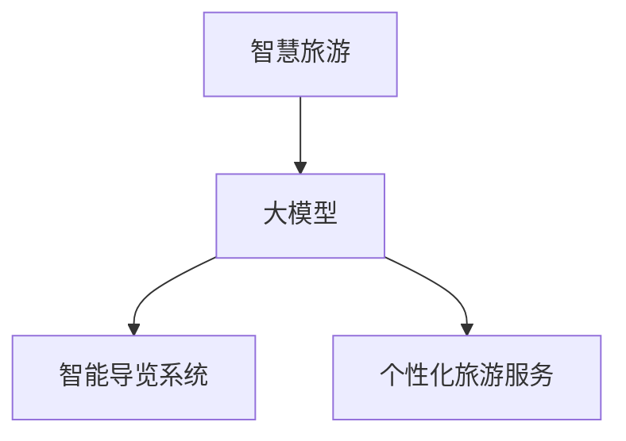

                 

# 大模型赋能智慧旅游，创业者如何提供智能导览与个性化旅游服务？

> 关键词：大模型，智慧旅游，智能导览，个性化服务，创业者

> 摘要：本文将探讨大模型在智慧旅游领域的应用，分析创业者如何利用大模型提供智能导览和个性化旅游服务。通过详细的理论阐述、算法讲解和案例分析，帮助创业者掌握相关技术，实现创新。

### 第一部分：大模型与智慧旅游概述

#### 第1章：大模型与智慧旅游概念解析

**1.1 大模型的定义与分类**

**1.1.1 大模型的基本概念**

大模型（Large-scale Model）是指具有大规模参数量的机器学习模型。这些模型能够通过学习海量数据来捕捉复杂的模式和规律，从而在各种任务中取得优异的性能。大模型的代表包括深度神经网络、Transformer、BERT等。

**1.1.2 大模型的主要类型**

1. **基于深度学习的大模型**：如卷积神经网络（CNN）、循环神经网络（RNN）、生成对抗网络（GAN）等。
2. **基于Transformer的大模型**：如BERT、GPT、T5等。
3. **混合模型**：将不同类型的大模型进行结合，以发挥各自的优势。

**1.2 智慧旅游的概念与发展趋势**

**1.2.1 智慧旅游的定义**

智慧旅游是指利用信息技术和智能设备，为游客提供智能化、个性化、全方位的旅游服务。智慧旅游涵盖旅游规划、旅游管理、旅游服务等多个环节。

**1.2.2 智慧旅游的发展现状与未来趋势**

1. **发展现状**：全球范围内，智慧旅游应用逐渐普及，如智能导览、智慧景区、智慧酒店等。
2. **未来趋势**：随着5G、物联网、人工智能等技术的发展，智慧旅游将进一步深化，实现更智能、更便捷的旅游体验。

#### 第2章：大模型在智慧旅游中的应用

**2.1 智能导览系统**

**2.1.1 智能导览系统的架构设计**

智能导览系统包括前端应用、后台服务器、数据库和数据接口等组成部分。前端应用负责展示导览内容，后台服务器处理数据，数据库存储信息，数据接口实现数据交互。

**2.1.2 智能导览系统的实现与优化**

智能导览系统的实现涉及地图渲染、语音合成、语音识别、推荐算法等技术。优化方面主要包括提升地图渲染速度、提高语音识别准确率、优化推荐算法等。

**2.2 个性化旅游服务**

**2.2.1 个性化旅游服务的关键技术**

个性化旅游服务的关键技术包括用户画像构建、推荐算法、数据挖掘等。用户画像构建用于了解用户需求，推荐算法根据用户需求提供个性化推荐，数据挖掘则用于发现潜在的用户行为和需求。

**2.2.2 个性化旅游服务的实现策略**

个性化旅游服务的实现策略主要包括以下几个方面：

1. **用户需求分析**：通过用户调研、数据分析等方式，了解用户需求和偏好。
2. **用户画像构建**：根据用户需求，构建用户画像，为个性化服务提供依据。
3. **推荐算法设计**：设计推荐算法，为用户提供个性化推荐。
4. **数据挖掘与优化**：通过对用户行为数据进行分析，不断优化推荐结果。

### 第二部分：创业者的准备与实践

#### 第3章：创业者的角色与使命

**3.1 创业者所需的核心能力**

**3.1.1 技术能力**

创业者需要具备扎实的计算机科学、数据科学、人工智能等领域的知识，以便在产品开发过程中解决技术难题。

**3.1.2 商业洞察力**

创业者需要具备敏锐的商业嗅觉，能够捕捉市场机遇，制定有效的商业策略。

**3.1.3 团队管理能力**

创业者需要具备团队管理能力，能够组建一支高效、协同的团队，实现创业目标。

**3.2 创业者面临的挑战与机遇**

**3.2.1 挑战**

1. **技术难题**：大模型开发和应用过程中，可能会遇到数据质量、算法优化等问题。
2. **市场竞争**：智慧旅游市场竞争激烈，创业者需要不断提升产品竞争力。
3. **资金压力**：创业初期，资金压力是创业者面临的一大挑战。

**3.2.2 机遇**

1. **技术进步**：随着人工智能、大数据等技术的快速发展，智慧旅游市场前景广阔。
2. **政策支持**：各国政府纷纷推出政策，鼓励智慧旅游发展，为创业者提供了良好的发展环境。
3. **用户需求**：游客对智能化、个性化旅游服务的需求日益增长，为创业者提供了丰富的市场空间。

#### 第4章：智能导览与个性化旅游服务项目策划

**4.1 项目策划的步骤与方法**

**4.1.1 市场调研**

1. **调研目标**：了解市场趋势、竞争对手、用户需求等。
2. **调研方法**：问卷调查、访谈、网络调查等。

**4.1.2 产品定位**

1. **目标用户**：确定目标用户群体，如青年游客、家庭游客等。
2. **产品特点**：明确产品优势，如智能导览、个性化推荐等。

**4.1.3 技术路线规划**

1. **技术选型**：选择合适的大模型和算法。
2. **开发计划**：制定详细的开发计划，包括时间、人员、资源等。

**4.2 项目预算与资金筹措**

**4.2.1 项目预算**

1. **人力成本**：包括员工工资、福利等。
2. **技术成本**：包括硬件设备、软件工具等。
3. **运营成本**：包括市场推广、客户服务、运维等。

**4.2.2 资金筹措**

1. **自筹资金**：创业者自筹部分资金，降低融资压力。
2. **政府资助**：申请政府资助项目，获取资金支持。
3. **风险投资**：寻求风险投资，获得资金和资源支持。

#### 第5章：技术实现与开发环境搭建

**5.1 开发环境搭建**

**5.1.1 软件与硬件要求**

1. **软件要求**：Python、TensorFlow、PyTorch等。
2. **硬件要求**：高性能计算服务器、GPU等。

**5.1.2 开发工具选择**

1. **代码编辑器**：如VS Code、PyCharm等。
2. **版本控制工具**：如Git等。

**5.2 源代码实现与分析**

**5.2.1 源代码结构解析**

1. **模块划分**：包括用户管理、导览服务、推荐系统等模块。
2. **功能实现**：详细实现各个模块的功能。

**5.2.2 关键模块代码解读**

1. **用户管理模块**：实现用户注册、登录、信息管理等功能。
2. **导览服务模块**：实现地图渲染、语音合成、语音识别等功能。
3. **推荐系统模块**：实现用户画像构建、推荐算法等功能。

### 第三部分：运营与推广策略

#### 第6章：市场推广策略

**6.1 品牌建设与市场定位**

**6.1.1 品牌定位**

1. **目标用户**：明确目标用户群体，如青年游客、家庭游客等。
2. **品牌形象**：塑造年轻、创新、智能的品牌形象。

**6.1.2 品牌传播渠道**

1. **线上渠道**：如社交媒体、官方网站、APP等。
2. **线下渠道**：如展会、活动、合作等。

**6.2 营销策略制定与执行**

**6.2.1 营销策略制定**

1. **产品策略**：打造具有差异化竞争优势的产品。
2. **价格策略**：制定合理的价格策略，提高产品性价比。
3. **推广策略**：选择合适的推广渠道和方式。

**6.2.2 营销策略执行**

1. **执行计划**：制定详细的执行计划，明确时间、人员、任务等。
2. **执行监控**：对营销策略执行过程进行监控，确保执行效果。

#### 第7章：运营管理与客户服务

**7.1 运营管理架构**

**7.1.1 运营团队组织结构**

1. **产品部**：负责产品开发、优化等工作。
2. **技术部**：负责技术支持、运维等工作。
3. **市场部**：负责市场推广、品牌建设等工作。
4. **客服部**：负责客户服务、售后等工作。

**7.1.2 运营流程与规范**

1. **产品开发流程**：包括需求分析、设计、开发、测试等环节。
2. **市场推广流程**：包括市场调研、推广计划制定、执行等环节。
3. **客户服务流程**：包括客户咨询、投诉处理、满意度调查等环节。

**7.2 客户服务策略**

**7.2.1 客户服务流程**

1. **客户咨询**：及时回复客户咨询，提供专业解答。
2. **投诉处理**：迅速处理客户投诉，确保客户满意度。
3. **满意度调查**：定期开展满意度调查，收集客户反馈，优化产品和服务。

**7.2.2 客户满意度提升策略**

1. **产品优化**：根据客户反馈，不断优化产品功能和服务质量。
2. **服务质量提升**：提高客服团队的专业素质和服务水平。
3. **个性化服务**：针对不同客户群体，提供个性化的服务和解决方案。

#### 第8章：持续改进与优化

**8.1 产品迭代策略**

**8.1.1 用户反馈机制**

1. **反馈渠道**：设置多种反馈渠道，如在线问卷、客服反馈等。
2. **反馈处理**：及时处理用户反馈，分析用户需求，优化产品。

**8.1.2 数据分析与优化**

1. **数据分析**：通过数据分析，了解用户行为和需求，为产品优化提供依据。
2. **优化策略**：根据数据分析结果，制定优化策略，提升产品竞争力。

**8.2 创新能力培养与团队成长**

**8.2.1 创新能力培养**

1. **技术创新**：关注新技术、新趋势，不断提升技术实力。
2. **产品创新**：持续探索新产品、新功能，满足用户需求。

**8.2.2 团队成长**

1. **人才培养**：加强员工培训，提升团队专业素养。
2. **团队建设**：通过团队活动、团队建设课程等，增强团队凝聚力。

### 附录

**附录A：大模型与智慧旅游常用工具与资源**

**A.1 大模型开发工具**

1. **TensorFlow**：适用于构建和训练大规模神经网络。
2. **PyTorch**：具有灵活的动态计算图，便于模型开发。

**A.2 智慧旅游相关数据库与API**

1. **地理信息系统数据库**：提供地图数据、位置信息等。
2. **旅游大数据API**：提供旅游相关数据，如景区人流量、旅游消费等。

### 核心概念与联系

#### 大模型与智慧旅游架构图



### 核心算法原理讲解

#### 个性化旅游服务算法伪代码

```plaintext
function personalized_travel_service(user_profile, location_data):
    // 步骤1：提取用户偏好
    user_preferences = extract_preferences(user_profile)

    // 步骤2：利用用户偏好和位置数据，计算推荐概率
    recommendation_scores = calculate_recommendation_scores(user_preferences, location_data)

    // 步骤3：根据推荐概率排序，选出Top N个推荐项
    top_n_recommendations = select_top_n_recommendations(recommendation_scores, N)

    // 步骤4：返回推荐结果
    return top_n_recommendations
```

### 数学模型和数学公式

#### 相关性计算公式

$$
similarity = \frac{cosine_similarity(embedding_user, embedding_location)}{||embedding_user|| \times ||embedding_location||}
$$

### 项目实战

#### 智能导览系统实现案例

- **开发环境搭建：** 使用Python和TensorFlow构建智能导览系统。
- **源代码实现：** 主要包括用户偏好提取、位置数据预处理、推荐算法实现等模块。

**源代码解读：**

```python
# 用户偏好提取模块
def extract_preferences(user_profile):
    # 根据用户兴趣标签，提取偏好
    preferences = user_profile['interest_tags']
    return preferences

# 位置数据预处理模块
def preprocess_location_data(location_data):
    # 对位置数据进行清洗和处理，包括坐标转换、去重等操作
    processed_data = process_location_data(location_data)
    return processed_data

# 推荐算法实现模块
def calculate_recommendation_scores(preferences, location_data):
    # 根据用户偏好和位置数据，计算推荐概率
    recommendation_scores = calculate_scores(preferences, location_data)
    return recommendation_scores

# 代码解读与分析
# 上述代码分别实现了用户偏好提取、位置数据预处理和推荐算法计算，通过输入用户偏好和位置数据，输出推荐结果。


```

**附录：**

- **A.1 大模型开发工具：** TensorFlow、PyTorch。
- **A.2 智慧旅游相关数据库与API：** 地理信息系统数据库、旅游大数据API。

### 作者

作者：AI天才研究院/AI Genius Institute & 禅与计算机程序设计艺术 /Zen And The Art of Computer Programming

