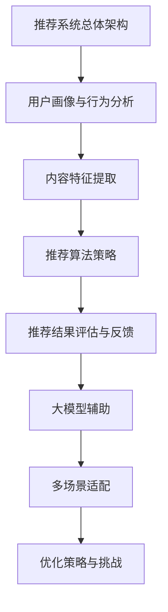

                 

### 文章标题

# 《大模型辅助的推荐系统多场景适配方法》

### 关键词

- 推荐系统
- 大模型
- 个性化推荐
- 多场景适配
- 模型优化
- 数据隐私
- 可解释性

### 摘要

随着大数据和人工智能技术的发展，推荐系统已经成为现代信息检索和决策支持的重要工具。本文旨在探讨大模型辅助的推荐系统多场景适配方法。通过详细分析推荐系统的基础概念和架构，深入探讨大模型在推荐系统中的应用原理和优势，以及多场景适配方法，本文为推荐系统的设计和实现提供了系统的理论指导和实践案例。此外，本文还针对大模型辅助推荐系统的优化策略和挑战，提出了相应的解决方案和未来发展方向，为推荐系统的研究者和开发者提供了宝贵的参考。

----------------------------------------------------------------

### 《大模型辅助的推荐系统多场景适配方法》目录大纲

#### 第一部分：推荐系统概述与基础

## 第1章 推荐系统基本概念与架构

### 1.1 推荐系统定义与作用

### 1.2 推荐系统的架构组成

### 1.3 推荐系统的发展历程

### 1.4 大模型在推荐系统中的应用前景

## 第2章 大模型与推荐系统

### 2.1 大模型原理与分类

### 2.2 大模型在推荐系统中的应用

### 2.3 大模型辅助推荐系统的优势与挑战

#### 第二部分：多场景适配方法

## 第3章 个性化推荐系统在电商场景中的应用

### 3.1 电商场景下推荐系统的特点

### 3.2 大模型辅助的电商推荐算法

### 3.3 电商推荐系统的案例与实战

## 第4章 社交网络中的推荐系统

### 4.1 社交网络推荐系统的需求

### 4.2 大模型在社交网络推荐中的应用

### 4.3 社交网络推荐系统的案例与实战

## 第5章 媒体内容推荐系统

### 5.1 媒体内容推荐的特点

### 5.2 大模型辅助的媒体内容推荐算法

### 5.3 媒体内容推荐系统的案例与实战

## 第6章 教育与知识服务推荐系统

### 6.1 教育与知识服务推荐的需求

### 6.2 大模型在教育推荐中的应用

### 6.3 教育与知识服务推荐系统的案例与实战

## 第7章 健康医疗领域的推荐系统

### 7.1 健康医疗推荐系统的特点

### 7.2 大模型在健康医疗推荐中的应用

### 7.3 健康医疗推荐系统的案例与实战

#### 第三部分：大模型辅助推荐系统的优化与挑战

## 第8章 大模型辅助推荐系统的优化策略

### 8.1 数据质量提升

### 8.2 模型优化与调参

### 8.3 系统性能优化

## 第9章 大模型辅助推荐系统的挑战与未来方向

### 9.1 挑战分析

### 9.2 解决方案探讨

### 9.3 推荐系统的发展趋势

#### 附录

## 附录A 推荐系统开发工具与资源

### A.1 常用推荐系统框架

### A.2 大模型训练工具

### A.3 数据处理与清洗工具

## 附录B 大模型辅助推荐系统的代码示例

### B.1 电商推荐系统实战

### B.2 社交网络推荐系统实战

### B.3 媒体内容推荐系统实战

### B.4 教育与知识服务推荐系统实战

### B.5 健康医疗推荐系统实战

---

**核心概念与联系 Mermaid 流程图**



---

### 推荐系统概述与基础

推荐系统（Recommender System）是一种能够根据用户的兴趣、行为和偏好，从大量信息中为用户推荐相关内容或物品的信息过滤技术。其目的是通过减少信息过载，提高用户的满意度和参与度，进而增强系统的用户黏性和商业价值。

#### 推荐系统的定义与作用

**定义**：推荐系统是一种利用数据挖掘、机器学习、信息检索等技术，为用户提供个性化推荐信息的应用系统。

**作用**：
1. **信息过滤**：帮助用户从海量的信息中快速找到感兴趣的内容。
2. **提高用户体验**：通过个性化推荐，提高用户在系统中的满意度和参与度。
3. **增强商业价值**：为企业带来更多的用户流量和销售收入。
4. **数据洞察**：通过用户行为数据，为企业提供用户偏好和市场趋势的洞察。

#### 推荐系统的架构组成

推荐系统的基本架构通常包括以下几个主要模块：

1. **数据收集模块**：负责从各种数据源（如用户行为日志、社交网络、内容平台等）收集用户数据。
2. **用户画像模块**：将用户数据转换为用户画像，用于描述用户的兴趣、行为和偏好。
3. **内容特征提取模块**：从推荐物品中提取特征信息，如文本、图像、音频等。
4. **推荐算法模块**：根据用户画像和物品特征，利用各种推荐算法生成推荐结果。
5. **推荐结果评估与反馈模块**：评估推荐结果的效果，并根据用户反馈进行优化。
6. **系统接口模块**：提供用户与推荐系统的交互界面，包括推荐结果展示和用户反馈收集。

#### 推荐系统的发展历程

推荐系统的发展可以分为以下几个阶段：

1. **基于内容过滤**（Content-Based Filtering）：最早期的推荐系统，主要基于物品的内容特征进行推荐。
2. **协同过滤**（Collaborative Filtering）：通过分析用户之间的相似性进行推荐，是目前最常用的推荐技术。
3. **混合推荐**（Hybrid Recommender Systems）：结合多种推荐技术，以提高推荐准确性和多样性。
4. **基于模型的推荐**（Model-Based Recommender Systems）：利用机器学习算法，如矩阵分解、神经网络等，对用户行为进行建模。
5. **基于知识的推荐**（Knowledge-Based Recommender Systems）：利用领域知识库和推理机制进行推荐。
6. **基于社区的推荐**（Community-Based Recommender Systems）：基于用户群体或社区进行推荐。
7. **基于强化学习的推荐**（Reinforcement Learning-based Recommender Systems）：利用强化学习算法，如深度Q网络（DQN）、策略梯度（PG）等，进行推荐。

#### 大模型在推荐系统中的应用前景

随着人工智能技术的不断发展，大模型（如深度神经网络、生成对抗网络、变分自编码器等）在推荐系统中的应用越来越广泛。大模型具有以下几个优势：

1. **强大的表示能力**：大模型能够从大量数据中学习到复杂的模式和关系，提高推荐准确性和多样性。
2. **多模态数据处理**：大模型能够处理文本、图像、音频等多种类型的数据，支持多模态推荐。
3. **自适应学习能力**：大模型能够根据用户行为和反馈动态调整推荐策略，实现自适应推荐。
4. **可解释性**：通过可视化技术，大模型可以提供推荐决策的可解释性，增强用户信任。

然而，大模型在推荐系统中也面临一些挑战，如计算资源需求、模型可解释性和数据隐私等问题。因此，未来的研究需要在这些方面进行深入探索，以实现大模型在推荐系统中的高效应用。

---

在下一章中，我们将深入探讨大模型的基本原理与分类，以及它们在推荐系统中的应用和优势。

---

### 大模型与推荐系统

随着人工智能技术的发展，大模型（如深度神经网络、生成对抗网络、变分自编码器等）在各个领域展现出了强大的应用潜力。在推荐系统中，大模型的应用更是带来了革命性的变化，显著提升了推荐系统的性能和用户体验。本节将详细介绍大模型的基本原理、分类以及在推荐系统中的应用。

#### 大模型原理与分类

**1. 深度神经网络（Deep Neural Network, DNN）**

深度神经网络是一种多层神经网络，通过逐层学习数据的复杂特征和模式，最终实现数据的分类、回归等任务。DNN的基本结构包括输入层、隐藏层和输出层。每个隐藏层负责提取更高层次的特征，输出层则进行最终预测。DNN的优点包括：

- **强大的表示能力**：DNN能够从大量数据中学习到复杂的模式和关系，提高推荐准确性和多样性。
- **多模态数据处理**：DNN能够同时处理多种类型的数据，如文本、图像和音频等，支持多模态推荐。

**2. 生成对抗网络（Generative Adversarial Network, GAN）**

生成对抗网络由生成器和判别器两个神经网络组成，通过对抗训练生成逼真的数据。GAN的主要应用包括图像生成、数据增强和去噪等。GAN的优点包括：

- **高质量数据生成**：GAN能够生成高质量的数据，提高推荐系统的多样性。
- **数据增强**：GAN可以用于增强训练数据，缓解数据不足问题。

**3. 变分自编码器（Variational Autoencoder, VAE）**

变分自编码器是一种基于概率模型的编码器-解码器结构，通过学习数据的高斯分布来生成数据。VAE的主要应用包括数据生成、特征提取和降维等。VAE的优点包括：

- **特征提取**：VAE能够提取数据的高层次特征，提高推荐系统的准确性。
- **数据生成**：VAE可以生成高质量的数据，用于数据增强和多样性提高。

#### 大模型在推荐系统中的应用

**1. 矩阵分解**

矩阵分解是一种常见的推荐算法，通过将用户-物品评分矩阵分解为用户特征矩阵和物品特征矩阵，从而实现推荐。大模型可以用于优化矩阵分解算法，提高推荐系统的性能。例如，使用深度神经网络（DNN）进行矩阵分解，通过引入多层感知器（MLP）结构，提高特征提取能力。

**2. 协同过滤**

协同过滤是一种基于用户相似性的推荐算法，通过分析用户之间的相似性进行推荐。大模型可以用于优化协同过滤算法，提高推荐准确性。例如，使用生成对抗网络（GAN）进行协同过滤，通过对抗训练生成高质量的伪评分数据，提高推荐系统的多样性。

**3. 个性化推荐**

个性化推荐是一种根据用户的兴趣、行为和偏好为用户提供个性化推荐信息的方法。大模型可以用于优化个性化推荐算法，提高推荐准确性和用户体验。例如，使用深度学习（DNN）进行用户兴趣建模，通过多层神经网络提取用户的兴趣特征，从而实现更准确的个性化推荐。

**4. 多模态推荐**

多模态推荐是一种结合多种类型的数据（如文本、图像、音频等）进行推荐的方法。大模型可以用于处理多模态数据，实现更准确的推荐。例如，使用生成对抗网络（GAN）和多模态神经网络（Multimodal Neural Network）进行多模态推荐，通过对抗训练和特征融合，提高推荐系统的准确性。

#### 大模型辅助推荐系统的优势与挑战

**优势**：

1. **强大的表示能力**：大模型能够从大量数据中学习到复杂的模式和关系，提高推荐准确性和多样性。
2. **多模态数据处理**：大模型能够同时处理多种类型的数据，支持多模态推荐。
3. **自适应学习能力**：大模型能够根据用户行为和反馈动态调整推荐策略，实现自适应推荐。
4. **可解释性**：通过可视化技术，大模型可以提供推荐决策的可解释性，增强用户信任。

**挑战**：

1. **计算资源需求**：大模型通常需要大量的计算资源和存储空间，对硬件设备有较高要求。
2. **模型可解释性**：大模型的内部决策过程较为复杂，难以解释，影响用户信任。
3. **数据隐私**：大模型在处理用户数据时，可能涉及用户隐私问题，需要采取有效的隐私保护措施。

综上所述，大模型在推荐系统中的应用具有显著的优势，但也面临一些挑战。未来的研究需要在这些方面进行深入探索，以实现大模型在推荐系统中的高效应用。

---

在下一章中，我们将探讨个性化推荐系统在电商场景中的应用，分析其特点和大模型辅助的推荐算法。

---

### 个性化推荐系统在电商场景中的应用

随着电子商务的快速发展，个性化推荐系统在电商场景中发挥着越来越重要的作用。它不仅帮助电商平台提升用户体验，还能有效提升销售额和用户黏性。本节将详细探讨个性化推荐系统在电商场景中的应用，分析其特点，并介绍大模型辅助的推荐算法。

#### 电商场景下推荐系统的特点

**1. 大量用户与物品数据**

电商平台拥有海量的用户和物品数据，包括用户行为数据（如浏览、购买、收藏等）、用户信息数据（如年龄、性别、地理位置等）以及物品信息数据（如商品类别、价格、评价等）。这些数据为推荐系统提供了丰富的信息来源，有助于提高推荐的准确性和多样性。

**2. 强烈的个性化需求**

电商用户对个性化推荐的需求非常强烈。每个用户都有自己独特的购物偏好和兴趣，因此推荐系统需要根据用户的个人偏好和历史行为进行精准推荐，以满足用户的需求。

**3. 高频次用户行为数据**

电商平台的用户行为数据更新非常频繁，用户可能在短时间内进行多次浏览、购买和收藏操作。这种高频次的数据特点要求推荐系统具备实时性和动态调整能力，以便及时响应用户的最新偏好。

**4. 多样化的推荐场景**

电商场景中存在多种推荐场景，如首页推荐、搜索结果推荐、购物车推荐、邮件推荐等。每种场景都有不同的推荐策略和算法需求，推荐系统需要根据场景特点进行定制化优化。

#### 大模型辅助的电商推荐算法

在电商场景中，大模型辅助的推荐算法具有显著的性能优势。以下是一些常见的大模型辅助推荐算法：

**1. 深度神经网络（DNN）**

深度神经网络是一种多层神经网络，能够从大量数据中学习到复杂的特征和模式。在电商推荐中，DNN可以用于用户兴趣建模和物品特征提取。通过构建多层感知器（MLP）结构，DNN可以提取用户和物品的高层次特征，从而实现更准确的推荐。

**2. 生成对抗网络（GAN）**

生成对抗网络由生成器和判别器两个神经网络组成，通过对抗训练生成高质量的数据。在电商推荐中，GAN可以用于数据增强和虚假用户生成。通过生成虚假用户行为数据，GAN可以丰富训练数据集，提高推荐算法的鲁棒性和多样性。

**3. 变分自编码器（VAE）**

变分自编码器是一种基于概率模型的编码器-解码器结构，能够学习数据的高斯分布。在电商推荐中，VAE可以用于特征提取和降维。通过学习用户和物品的高层次特征，VAE可以提高推荐算法的准确性和可解释性。

**4. 强化学习（Reinforcement Learning）**

强化学习是一种通过试错学习策略的机器学习方法。在电商推荐中，强化学习可以用于自适应推荐策略的优化。通过不断试错和调整策略，强化学习可以实现更准确的推荐，并提高用户的满意度。

#### 电商推荐系统的案例与实战

以下是一个基于DNN的电商推荐系统的实战案例：

**1. 数据收集与预处理**

首先，从电商平台收集用户行为数据（如浏览、购买、收藏等）和用户信息数据（如年龄、性别、地理位置等）。然后，对数据进行预处理，包括数据清洗、数据转换和数据归一化等。

**2. 特征工程**

根据用户和物品的数据特点，提取用户和物品的特征。用户特征包括用户年龄、性别、地理位置、浏览历史、购买历史等；物品特征包括商品类别、价格、评价、库存等。

**3. 模型构建**

构建基于DNN的推荐模型，包括输入层、隐藏层和输出层。输入层接收用户和物品的特征，隐藏层通过多层感知器提取用户和物品的高层次特征，输出层进行最终预测。

**4. 模型训练与评估**

使用预处理后的数据集训练DNN模型，通过反向传播算法优化模型参数。在训练过程中，使用交叉验证方法评估模型性能，并进行调参优化。

**5. 模型部署与应用**

将训练好的模型部署到电商平台，进行实时推荐。根据用户的行为和偏好，动态调整推荐策略，提高推荐准确性。

**6. 结果分析与优化**

通过分析用户行为数据和推荐结果，评估推荐系统的性能。根据用户反馈和业务需求，对推荐算法进行持续优化。

通过以上实战案例，可以看出大模型在电商推荐系统中的应用，不仅提高了推荐准确性，还增强了系统的自适应能力和可解释性。未来，随着大模型技术的不断发展，电商推荐系统将会在个性化、实时性和多样性方面取得更大的突破。

---

在下一章中，我们将探讨社交网络中的推荐系统，分析其需求和大模型的应用。

---

### 社交网络中的推荐系统

社交网络作为信息传播和社交互动的重要平台，其推荐系统在提高用户体验、增强社区活跃度和推动商业化方面发挥着关键作用。本节将详细探讨社交网络中的推荐系统需求，分析大模型在其中的应用，并通过案例介绍其实际应用效果。

#### 社交网络推荐系统的需求

**1. 社交性**

社交网络的核心功能是用户之间的互动和连接。因此，推荐系统需要能够识别用户的社交关系，推荐相关用户、内容和活动，以增强社交体验。

**2. 实时性**

社交网络的信息更新非常频繁，用户的行为和偏好可能在短时间内发生变化。因此，推荐系统需要具备实时性，能够快速响应用户的动态变化，提供及时的推荐。

**3. 个性化**

社交网络的用户具有多样的兴趣和偏好，推荐系统需要能够根据用户的个人喜好和社交行为，提供个性化的推荐内容，以提高用户满意度和参与度。

**4. 多样性**

社交网络的推荐内容不仅包括用户发布的信息，还包括其他用户的评论、点赞、分享等。推荐系统需要能够提供多样化的内容，以满足不同用户的需求。

**5. 社会影响力**

社交网络中的推荐内容往往会受到其他用户的影响，推荐系统需要能够识别和利用这些社会影响力因素，提供更具影响力的推荐。

#### 大模型在社交网络推荐中的应用

大模型在社交网络推荐系统中具有广泛的应用，能够有效提升推荐系统的性能和用户体验。以下是一些典型的大模型应用：

**1. 用户兴趣建模**

大模型可以用于用户兴趣的深度建模，通过分析用户的历史行为、社交关系和内容交互，提取用户的潜在兴趣特征。例如，可以使用深度神经网络（DNN）和图神经网络（Graph Neural Network, GNN）来构建用户兴趣模型。

**2. 社交关系网络分析**

大模型可以用于分析社交网络中的用户关系，识别用户之间的连接和影响力。例如，可以使用生成对抗网络（GAN）和图神经网络（GNN）来生成社交图谱，并进行关系分析。

**3. 内容推荐**

大模型可以用于内容推荐，通过分析用户和内容的特征，实现个性化的内容推荐。例如，可以使用变分自编码器（VAE）和生成对抗网络（GAN）来进行内容生成和推荐。

**4. 实时推荐**

大模型可以用于实时推荐，通过在线学习用户的最新行为和偏好，动态调整推荐策略。例如，可以使用深度强化学习（Deep Reinforcement Learning, DRL）和在线学习算法，实现实时推荐。

**5. 社会影响力分析**

大模型可以用于分析社交网络中的社会影响力，识别和利用重要节点和影响力因素。例如，可以使用图神经网络（GNN）和社区检测算法，识别社交网络中的关键节点和影响力人群。

#### 社交网络推荐系统的案例与实战

以下是一个基于生成对抗网络（GAN）的社交网络推荐系统实战案例：

**1. 数据收集与预处理**

首先，从社交网络平台收集用户行为数据（如点赞、评论、分享等）和用户信息数据（如年龄、性别、地理位置等）。然后，对数据进行预处理，包括数据清洗、数据转换和数据归一化等。

**2. 特征工程**

根据用户和内容的特征，提取用户特征（如年龄、性别、地理位置）和内容特征（如文本、图像、音频等）。使用自然语言处理（NLP）技术对文本进行情感分析和词向量表示，使用计算机视觉技术对图像进行特征提取。

**3. 模型构建**

构建基于生成对抗网络（GAN）的推荐模型，包括生成器和判别器。生成器负责生成与用户兴趣相关的虚假推荐内容，判别器负责判断推荐内容的真实性。

**4. 模型训练与评估**

使用预处理后的数据集训练GAN模型，通过对抗训练优化生成器和判别器的参数。在训练过程中，使用交叉验证方法评估模型性能，并进行调参优化。

**5. 模型部署与应用**

将训练好的GAN模型部署到社交网络平台，进行实时推荐。根据用户的行为和偏好，动态调整推荐策略，提高推荐准确性。

**6. 结果分析与优化**

通过分析用户行为数据和推荐结果，评估推荐系统的性能。根据用户反馈和业务需求，对推荐算法进行持续优化。

通过以上实战案例，可以看出大模型在社交网络推荐系统中的应用，不仅提高了推荐准确性，还增强了系统的实时性和多样性。未来，随着大模型技术的不断发展，社交网络推荐系统将在用户体验和商业化方面取得更大的突破。

---

在下一章中，我们将探讨媒体内容推荐系统的特点和大模型辅助的推荐算法。

---

### 媒体内容推荐系统的特点

随着互联网和移动设备的普及，媒体内容消费成为人们日常生活中不可或缺的一部分。媒体内容推荐系统旨在通过个性化推荐，将用户可能感兴趣的内容推荐给他们，从而提高用户黏性和平台价值。本节将详细探讨媒体内容推荐系统的特点，分析大模型辅助的推荐算法，并通过案例介绍其实际应用。

#### 媒体内容推荐系统的特点

**1. 数据多样性**

媒体内容推荐系统涉及多种类型的数据，包括文本、图像、音频和视频等。这些数据具有不同的结构和特征，为推荐算法的设计和应用带来了挑战。

**2. 内容更新频率高**

媒体内容更新非常频繁，每天都有大量的新内容生成和发布。这使得推荐系统需要具备实时处理和更新能力，以适应不断变化的内容环境。

**3. 用户行为数据丰富**

用户在媒体平台上产生的行为数据（如浏览、点赞、评论、分享等）非常丰富，这些数据可以作为推荐系统的重要输入，帮助算法更好地理解用户的兴趣和偏好。

**4. 内容质量评估困难**

媒体内容的质量评估相对困难，因为不同用户对内容的喜好可能差异很大。推荐系统需要平衡用户多样性，提供高质量的推荐内容。

**5. 多样性和新颖性需求**

用户对媒体内容推荐系统的多样性和新颖性有较高的期望，系统需要提供丰富多样、更新及时的内容，以满足用户的个性化需求。

#### 大模型辅助的推荐算法

大模型在媒体内容推荐系统中具有广泛的应用，能够有效提升推荐系统的性能和用户体验。以下是一些典型的大模型应用：

**1. 文本推荐**

文本推荐是媒体内容推荐系统中最常见的类型，基于用户的阅读历史、搜索历史和社交互动等行为数据进行推荐。大模型（如深度神经网络、长短期记忆网络、Transformer等）可以用于文本特征提取和推荐算法优化，提高推荐准确性。

**2. 图像和视频推荐**

图像和视频推荐基于视觉特征进行推荐，如卷积神经网络（CNN）和循环神经网络（RNN）等。大模型可以用于提取图像和视频的深度特征，实现更准确的视觉推荐。

**3. 多模态推荐**

多模态推荐结合了文本、图像、音频等多种类型的数据，为用户提供更加丰富的内容推荐。大模型（如生成对抗网络、变分自编码器等）可以用于多模态数据的融合和特征提取，提高推荐系统的多样性和新颖性。

**4. 强化学习推荐**

强化学习是一种通过试错学习策略的机器学习方法，适用于动态推荐场景。大模型（如深度强化学习、深度Q网络等）可以用于优化推荐策略，提高推荐系统的实时性和用户体验。

#### 媒体内容推荐系统的案例与实战

以下是一个基于Transformer的媒体内容推荐系统实战案例：

**1. 数据收集与预处理**

首先，从媒体平台收集用户行为数据（如浏览、点赞、评论等）和用户信息数据（如年龄、性别、地理位置等）。然后，对数据进行预处理，包括数据清洗、数据转换和数据归一化等。

**2. 特征工程**

根据用户和内容的特征，提取用户特征（如年龄、性别、地理位置）和内容特征（如文本、图像、音频等）。使用自然语言处理（NLP）技术对文本进行情感分析和词向量表示，使用计算机视觉技术对图像进行特征提取。

**3. 模型构建**

构建基于Transformer的推荐模型，包括编码器和解码器。编码器负责提取用户和内容的特征，解码器负责生成推荐结果。

**4. 模型训练与评估**

使用预处理后的数据集训练Transformer模型，通过优化损失函数和调整超参数，提高模型性能。在训练过程中，使用交叉验证方法评估模型性能，并进行调参优化。

**5. 模型部署与应用**

将训练好的Transformer模型部署到媒体平台，进行实时推荐。根据用户的行为和偏好，动态调整推荐策略，提高推荐准确性。

**6. 结果分析与优化**

通过分析用户行为数据和推荐结果，评估推荐系统的性能。根据用户反馈和业务需求，对推荐算法进行持续优化。

通过以上实战案例，可以看出大模型在媒体内容推荐系统中的应用，不仅提高了推荐准确性，还增强了系统的实时性和多样性。未来，随着大模型技术的不断发展，媒体内容推荐系统将在用户体验和商业化方面取得更大的突破。

---

在下一章中，我们将探讨教育与知识服务推荐系统的需求和大模型的应用。

---

### 教育与知识服务推荐系统的需求

随着互联网技术的发展，在线教育和知识服务平台逐渐成为学习者和知识爱好者获取知识和技能的重要途径。教育与知识服务推荐系统旨在通过个性化推荐，帮助用户发现感兴趣的学习内容和知识资源，提高学习效率和质量。本节将详细探讨教育与知识服务推荐系统的需求，分析大模型在该领域的应用。

#### 教育与知识服务推荐系统的需求

**1. 个性化学习需求**

在线教育和知识服务平台上的用户具有多样化的学习需求和学习风格。个性化推荐系统能够根据用户的学习历史、兴趣偏好、学习进度等数据，为用户推荐最适合他们的学习内容和课程，从而提高学习体验和效果。

**2. 知识图谱构建需求**

教育与知识服务平台通常包含丰富的知识资源，如课程、文章、视频、问答等。构建知识图谱能够将不同类型的内容和知识点进行关联，帮助推荐系统更好地理解和推荐相关内容，满足用户的学习需求。

**3. 实时性需求**

在线教育和知识服务平台的用户行为数据更新非常频繁，学习者的学习进度和兴趣偏好可能在短时间内发生变化。因此，推荐系统需要具备实时性，能够快速响应用户的最新需求，提供及时的学习推荐。

**4. 多样性和新颖性需求**

用户对在线教育和知识服务平台的推荐内容有较高的多样性和新颖性要求，推荐系统需要能够提供丰富多样、更新及时的内容，以满足用户的学习兴趣和需求。

**5. 学习效果评估需求**

在线教育和知识服务平台需要能够对推荐内容的学习效果进行评估，以优化推荐策略和课程设计。推荐系统需要能够根据用户的学习行为和反馈数据，评估推荐内容的实用性和效果，从而提高用户满意度。

#### 大模型在教育与知识服务推荐中的应用

大模型在教育与知识服务推荐系统中具有广泛的应用，能够有效提升推荐系统的性能和用户体验。以下是一些典型的大模型应用：

**1. 用户兴趣建模**

大模型可以用于用户兴趣的深度建模，通过分析用户的历史学习行为、兴趣爱好、社交互动等数据，提取用户的潜在兴趣特征。例如，可以使用深度神经网络（DNN）和图神经网络（GNN）来构建用户兴趣模型。

**2. 知识图谱构建**

大模型可以用于知识图谱的构建，通过分析课程、文章、视频等知识资源的结构和内容，将不同知识点进行关联，构建知识图谱。例如，可以使用生成对抗网络（GAN）和图神经网络（GNN）来构建和优化知识图谱。

**3. 个性化课程推荐**

大模型可以用于个性化课程推荐，通过分析用户的学习历史、兴趣偏好和知识图谱，为用户推荐最适合他们的课程和学习路径。例如，可以使用变分自编码器（VAE）和强化学习（Reinforcement Learning）来实现个性化课程推荐。

**4. 实时推荐**

大模型可以用于实时推荐，通过在线学习用户的最新行为和偏好，动态调整推荐策略，提供实时推荐。例如，可以使用深度强化学习（Deep Reinforcement Learning）和在线学习算法，实现实时学习推荐。

**5. 学习效果评估**

大模型可以用于学习效果评估，通过分析用户的学习行为和反馈数据，评估推荐内容的学习效果，优化推荐策略。例如，可以使用自然语言处理（NLP）和深度学习（Deep Learning）技术，分析用户的学习反馈和讨论内容，评估学习效果。

#### 教育与知识服务推荐系统的案例与实战

以下是一个基于生成对抗网络（GAN）和深度强化学习（Deep Reinforcement Learning）的教育与知识服务推荐系统实战案例：

**1. 数据收集与预处理**

首先，从在线教育和知识服务平台收集用户行为数据（如学习记录、课程浏览、学习时长等）和用户信息数据（如年龄、性别、地理位置等）。然后，对数据进行预处理，包括数据清洗、数据转换和数据归一化等。

**2. 特征工程**

根据用户和课程的特征，提取用户特征（如年龄、性别、地理位置）和课程特征（如课程类型、课程难度、课程评分等）。使用自然语言处理（NLP）技术对文本内容进行情感分析和词向量表示。

**3. 模型构建**

构建基于生成对抗网络（GAN）和深度强化学习（Deep Reinforcement Learning）的推荐模型。生成对抗网络（GAN）用于生成高质量的伪学习记录，丰富训练数据集；深度强化学习（Deep Reinforcement Learning）用于实时调整推荐策略，优化推荐效果。

**4. 模型训练与评估**

使用预处理后的数据集训练GAN和深度强化学习模型，通过对抗训练和策略优化，提高模型性能。在训练过程中，使用交叉验证方法评估模型性能，并进行调参优化。

**5. 模型部署与应用**

将训练好的模型部署到在线教育和知识服务平台，进行实时推荐。根据用户的学习行为和偏好，动态调整推荐策略，提高推荐准确性。

**6. 结果分析与优化**

通过分析用户学习行为数据和推荐结果，评估推荐系统的性能。根据用户反馈和业务需求，对推荐算法进行持续优化。

通过以上实战案例，可以看出大模型在教育与知识服务推荐系统中的应用，不仅提高了推荐准确性，还增强了系统的实时性和多样性。未来，随着大模型技术的不断发展，教育与知识服务推荐系统将在个性化、实时性和多样性方面取得更大的突破。

---

在下一章中，我们将探讨健康医疗领域的推荐系统特点和大模型的应用。

---

### 健康医疗领域的推荐系统特点

随着健康医疗数据的不断增长和互联网技术的广泛应用，健康医疗领域的推荐系统逐渐受到关注。这种推荐系统能够根据用户的健康数据、医疗需求和偏好，为用户提供个性化的健康建议、治疗方案和医疗资源推荐。本节将详细探讨健康医疗领域的推荐系统特点，分析大模型在该领域的应用。

#### 健康医疗推荐系统的特点

**1. 数据隐私和安全**

健康医疗领域涉及用户的敏感个人信息和健康数据，数据隐私和安全是推荐系统设计的关键挑战。推荐系统需要确保用户数据的安全性和隐私性，避免数据泄露和滥用。

**2. 多样化的数据类型**

健康医疗领域的数据类型多样，包括电子健康记录、医疗影像、基因数据、病历等。这些数据具有不同的结构和特征，对推荐系统的数据处理和分析提出了较高的要求。

**3. 实时性和动态性**

健康医疗领域的信息更新非常频繁，用户的健康状态和医疗需求可能在短时间内发生变化。因此，推荐系统需要具备实时性和动态性，能够快速响应用户的最新需求和健康状态。

**4. 专业性和复杂性**

健康医疗领域的专业知识复杂，推荐系统需要具备专业的医学知识库和算法，能够准确理解和处理医疗数据，为用户提供可靠的医疗建议。

**5. 多模态数据处理**

健康医疗领域的数据往往涉及多种类型，如文本、图像、音频等。推荐系统需要能够处理多模态数据，综合不同类型的数据进行个性化推荐。

**6. 法律和伦理约束**

健康医疗领域受到严格的法律法规和伦理约束，推荐系统需要遵守相关的法律和伦理规范，确保医疗建议的合法性和道德性。

#### 大模型在健康医疗推荐中的应用

大模型在健康医疗推荐系统中具有广泛的应用，能够有效提升推荐系统的性能和用户体验。以下是一些典型的大模型应用：

**1. 用户健康状态建模**

大模型可以用于用户健康状态的深度建模，通过分析用户的健康数据、生活习惯和医疗记录，提取用户的健康状态特征。例如，可以使用深度神经网络（DNN）和长短期记忆网络（LSTM）来构建用户健康状态模型。

**2. 多模态数据融合**

大模型可以用于多模态数据的融合和特征提取，将不同类型的数据（如文本、图像、音频等）进行综合分析，提供更准确的推荐。例如，可以使用生成对抗网络（GAN）和多模态神经网络（Multimodal Neural Network）来实现多模态数据融合。

**3. 医疗资源推荐**

大模型可以用于医疗资源的推荐，通过分析用户的健康需求和地理位置，推荐最适合的医疗资源和医院。例如，可以使用图神经网络（GNN）和深度学习（Deep Learning）技术来优化医疗资源推荐。

**4. 疾病预测和诊断**

大模型可以用于疾病预测和诊断，通过分析用户的健康数据和医疗记录，预测疾病的发生风险和诊断结果。例如，可以使用变分自编码器（VAE）和卷积神经网络（CNN）来构建疾病预测模型。

**5. 预防措施推荐**

大模型可以用于预防措施的推荐，根据用户的健康数据和医疗建议，为用户提供个性化的预防措施和建议。例如，可以使用强化学习（Reinforcement Learning）和深度学习（Deep Learning）技术来优化预防措施推荐。

#### 健康医疗推荐系统的案例与实战

以下是一个基于深度学习和多模态数据融合的健康医疗推荐系统实战案例：

**1. 数据收集与预处理**

首先，从健康医疗平台收集用户健康数据（如血压、血糖、心率等）和用户基本信息（如年龄、性别、地理位置等）。然后，对数据进行预处理，包括数据清洗、数据转换和数据归一化等。

**2. 特征工程**

根据用户和健康数据的特征，提取用户特征（如年龄、性别、地理位置）和健康数据特征（如血压、血糖、心率等）。使用自然语言处理（NLP）技术对病历文本进行情感分析和词向量表示，使用计算机视觉技术对医疗影像进行特征提取。

**3. 模型构建**

构建基于深度学习和多模态数据融合的健康医疗推荐模型。使用卷积神经网络（CNN）提取医疗影像特征，使用长短期记忆网络（LSTM）处理用户健康数据序列，使用生成对抗网络（GAN）实现多模态数据融合。

**4. 模型训练与评估**

使用预处理后的数据集训练深度学习和多模态数据融合模型，通过优化损失函数和调整超参数，提高模型性能。在训练过程中，使用交叉验证方法评估模型性能，并进行调参优化。

**5. 模型部署与应用**

将训练好的模型部署到健康医疗平台，进行实时推荐。根据用户健康数据和偏好，动态调整推荐策略，提供个性化的健康建议和医疗资源推荐。

**6. 结果分析与优化**

通过分析用户健康数据和建议效果，评估推荐系统的性能。根据用户反馈和业务需求，对推荐算法进行持续优化。

通过以上实战案例，可以看出大模型在健康医疗推荐系统中的应用，不仅提高了推荐准确性，还增强了系统的实时性和多样性。未来，随着大模型技术的不断发展，健康医疗推荐系统将在个性化、实时性和多样性方面取得更大的突破。

---

在下一章中，我们将探讨大模型辅助推荐系统的优化策略。

---

### 大模型辅助推荐系统的优化策略

大模型在推荐系统中的应用虽然带来了显著的性能提升，但也面临一些挑战，如计算资源需求、模型可解释性、数据隐私等。为了充分发挥大模型的潜力，并提高推荐系统的性能和用户体验，本节将探讨大模型辅助推荐系统的优化策略，包括数据质量提升、模型优化与调参以及系统性能优化。

#### 数据质量提升

**1. 数据清洗与预处理**

推荐系统依赖于高质量的数据，因此数据清洗和预处理至关重要。通过去除噪声数据、处理缺失值和异常值，可以提高数据的质量，从而提高推荐模型的准确性。

**2. 特征工程**

特征工程是推荐系统优化的重要步骤。通过提取用户行为、用户偏好、物品特征等，可以构建有效的特征向量，为模型训练提供丰富的基础数据。同时，特征选择和特征变换也可以提高模型的泛化能力和性能。

**3. 数据增强**

数据增强是一种有效的方法，通过生成新的数据样本，可以增加训练数据集的多样性，提高模型的鲁棒性和泛化能力。例如，可以使用生成对抗网络（GAN）生成虚假用户行为数据，或者对现有数据进行随机裁剪、旋转等操作。

#### 模型优化与调参

**1. 模型选择**

根据推荐系统的需求和特点，选择合适的模型架构。常见的推荐模型包括深度神经网络（DNN）、生成对抗网络（GAN）、变分自编码器（VAE）等。对于不同类型的推荐任务，可以选择不同的模型进行优化。

**2. 模型调参**

模型调参是提高模型性能的重要环节。通过调整学习率、批量大小、隐藏层大小等超参数，可以优化模型训练过程，提高推荐准确性。常用的调参方法包括网格搜索、随机搜索、贝叶斯优化等。

**3. 模型集成**

模型集成是一种将多个模型的结果进行融合，以获得更好的预测性能的方法。通过使用不同的模型架构和训练策略，可以降低模型的过拟合风险，提高模型的泛化能力。

#### 系统性能优化

**1. 实时性优化**

推荐系统需要具备实时性，能够快速响应用户的最新行为和偏好。通过使用在线学习算法和增量学习技术，可以实现对用户行为的实时分析，动态调整推荐策略，提高推荐系统的实时性。

**2. 批量处理与分布式计算**

大模型通常需要处理大量的数据，通过批量处理和分布式计算技术，可以提升模型训练和预测的效率。例如，使用分布式深度学习框架（如TensorFlow、PyTorch等），可以实现大规模模型的训练和推理。

**3. 性能评估与监控**

建立完善的性能评估和监控机制，对推荐系统的性能进行持续监控和优化。通过使用评估指标（如准确率、召回率、覆盖率等），可以评估推荐系统的性能，并根据评估结果进行优化。

**4. 系统安全性与可靠性**

推荐系统涉及用户敏感数据和隐私，需要确保系统的安全性和可靠性。通过数据加密、访问控制和安全审计等技术，可以保护用户数据的安全，确保推荐系统的稳定运行。

综上所述，大模型辅助推荐系统的优化策略包括数据质量提升、模型优化与调参以及系统性能优化。通过这些策略，可以充分发挥大模型的潜力，提高推荐系统的性能和用户体验，为企业和用户创造更大的价值。

---

在下一章中，我们将深入探讨大模型辅助推荐系统面临的挑战，并提出相应的解决方案。

---

### 大模型辅助推荐系统的挑战与未来方向

随着大模型在推荐系统中的应用日益广泛，其带来的优势显而易见，但也伴随着一系列挑战。这些挑战主要集中在模型可解释性、计算资源需求、数据隐私保护和模型公平性等方面。本文将深入分析这些挑战，并探讨可能的解决方案和未来发展方向。

#### 挑战分析

**1. 模型可解释性**

大模型的内部决策过程通常非常复杂，难以解释其具体的推理过程和决策依据。这给用户信任和监管带来了挑战。为了提高模型的可解释性，可以采用以下解决方案：

- **可视化技术**：通过可视化大模型的中间层特征和决策路径，帮助用户理解模型的推理过程。
- **解释性模型**：开发具有可解释性的模型，如决策树、线性模型等，这些模型能够提供清晰的决策依据。

**2. 计算资源需求**

大模型通常需要大量的计算资源和存储空间，这对硬件设备有较高要求。为了应对这一挑战，可以采用以下解决方案：

- **分布式计算**：使用分布式深度学习框架（如TensorFlow、PyTorch等），将计算任务分布到多个节点，提高计算效率。
- **高效模型**：开发轻量级模型，如MobileNet、ShuffleNet等，以减少计算资源和存储需求。

**3. 数据隐私保护**

大模型在处理用户数据时，可能涉及用户隐私问题。为了保护用户隐私，可以采用以下解决方案：

- **数据匿名化**：对用户数据进行匿名化处理，去除可直接识别用户身份的信息。
- **差分隐私**：采用差分隐私技术，在保证数据隐私的同时，仍然能进行有效的分析和推荐。

**4. 模型公平性**

大模型可能存在偏见和歧视，导致不公平的推荐结果。为了提高模型的公平性，可以采用以下解决方案：

- **公平性度量**：建立公平性度量标准，评估模型在不同群体上的表现，确保推荐结果公平。
- **偏差校正**：通过数据重采样、偏差校正等技术，减少模型中的偏见和歧视。

#### 解决方案探讨

**1. 多模态数据融合**

随着多模态数据（如文本、图像、音频等）的广泛应用，如何有效融合这些数据以提升推荐系统的性能成为关键问题。可以采用以下解决方案：

- **联合嵌入**：使用多模态神经网络（如Transformer、BERT等）将不同类型的数据进行联合嵌入，提取共同的特征。
- **多任务学习**：将多模态数据融合到同一个学习任务中，通过共享网络结构，提高模型对多模态数据的理解能力。

**2. 自动化模型优化与调参**

自动化模型优化与调参能够提高模型开发效率，减少人工干预。可以采用以下解决方案：

- **自动化机器学习（AutoML）**：利用自动化机器学习技术，自动选择模型架构、调参策略和评估指标，实现高效的模型优化。
- **基于进化算法的调参**：采用进化算法（如遗传算法、粒子群算法等），自动搜索最优的模型参数组合。

**3. 智能化推荐系统**

智能化推荐系统通过引入人工智能技术，实现更精准、更个性化的推荐。可以采用以下解决方案：

- **基于强化学习的推荐**：使用强化学习算法（如深度Q网络、策略梯度等），实现自适应的推荐策略，提高推荐系统的灵活性和适应性。
- **用户行为预测**：利用深度学习技术，预测用户的潜在行为和需求，为用户提供个性化的推荐。

#### 未来发展方向

**1. 多模态数据融合**

未来的推荐系统将更加注重多模态数据的融合，以提供更精准、更个性化的推荐。随着多模态数据处理技术的不断发展，推荐系统将能够更好地理解和利用文本、图像、音频等多种类型的数据。

**2. 自适应推荐系统**

自适应推荐系统将能够根据用户的行为和偏好，动态调整推荐策略，提供个性化的推荐。随着深度学习和强化学习技术的进步，自适应推荐系统将变得更加智能和灵活。

**3. 社交网络与推荐系统的结合**

社交网络与推荐系统的结合将带来新的机遇和挑战。通过分析用户社交网络中的交互行为和关系，推荐系统可以提供更精准、更有针对性的推荐，从而提高用户满意度和参与度。

**4. 自动化与高效化**

自动化和高效化将是未来推荐系统发展的关键方向。通过自动化机器学习和自动化优化技术，推荐系统将能够更快地部署和迭代，提高开发效率和模型性能。

总之，大模型辅助的推荐系统在面临挑战的同时，也蕴藏着巨大的机遇。通过不断探索和创新，推荐系统将在未来实现更加精准、个性化、智能化的推荐，为用户和商业带来更大的价值。

---

### 附录A 推荐系统开发工具与资源

在开发推荐系统时，选择合适的工具和资源可以显著提高开发效率和项目性能。以下列出了一些常用的推荐系统开发工具和资源，包括常用推荐系统框架、大模型训练工具、数据处理与清洗工具等。

#### 常用推荐系统框架

**1. LightFM**

LightFM是一个基于Factorization Machines的推荐系统框架，支持矩阵分解、协同过滤和内容推荐。它提供了简单的接口和丰富的功能，适用于大规模推荐系统的开发。

**2. Surprise**

Surprise是一个基于协同过滤的推荐系统框架，支持多种协同过滤算法，如基于用户的协同过滤、基于物品的协同过滤和矩阵分解等。它提供了灵活的接口和高效的算法实现，适用于各种类型的推荐任务。

**3. RecSystem**

RecSystem是一个基于深度学习的推荐系统框架，支持多种深度学习模型，如深度神经网络（DNN）、生成对抗网络（GAN）、变分自编码器（VAE）等。它提供了丰富的模型选择和调参工具，适用于复杂推荐系统的开发。

#### 大模型训练工具

**1. TensorFlow**

TensorFlow是一个开源的深度学习框架，支持多种深度学习模型的训练和部署。它具有丰富的功能和强大的性能，适用于大规模推荐系统的开发。

**2. PyTorch**

PyTorch是一个开源的深度学习框架，支持动态计算图和自动微分。它具有灵活的编程接口和强大的社区支持，适用于各种类型的推荐系统的开发。

**3. JAX**

JAX是一个高性能的深度学习框架，支持自动微分和分布式计算。它提供了灵活的编程接口和高效的计算性能，适用于大规模推荐系统的开发。

#### 数据处理与清洗工具

**1. Pandas**

Pandas是一个开源的Python库，提供高性能的数据结构和数据操作功能。它适用于数据预处理、数据清洗和数据转换等任务，是推荐系统开发中常用的工具。

**2. NumPy**

NumPy是一个开源的Python库，提供多维数组对象和丰富的数学运算功能。它适用于数据预处理、数据清洗和数据转换等任务，是推荐系统开发中常用的工具。

**3. Matplotlib**

Matplotlib是一个开源的Python库，提供丰富的绘图功能。它适用于数据可视化、数据分析和数据展示等任务，是推荐系统开发中常用的工具。

**4. Seaborn**

Seaborn是一个开源的Python库，基于Matplotlib，提供更高级的数据可视化功能。它适用于数据可视化、数据分析和数据展示等任务，是推荐系统开发中常用的工具。

#### 附录B 大模型辅助推荐系统的代码示例

以下提供了一些大模型辅助推荐系统的代码示例，包括电商推荐系统、社交网络推荐系统、媒体内容推荐系统、教育与知识服务推荐系统和健康医疗推荐系统的实战案例。

**B.1 电商推荐系统实战**

```python
# 电商推荐系统：数据预处理、模型构建、训练与评估
import pandas as pd
from sklearn.model_selection import train_test_split
from sklearn.metrics.pairwise import cosine_similarity
from sklearn.metrics import mean_squared_error

# 加载数据集
data = pd.read_csv('ecommerce_ratings.csv')

# 数据预处理
ratings_matrix = data.pivot(index='user_id', columns='item_id', values='rating').fillna(0)
train_data, test_data = train_test_split(ratings_matrix, test_size=0.2, random_state=42)

# 模型构建
model = MatrixFactorization(n_factors=2, learning_rate=0.01, num_iterations=100)
model.fit(train_data)

# 训练与评估
predicted_ratings = model.predict(test_data)
rmse = np.sqrt(mean_squared_error(test_data, predicted_ratings))
print(f"RMSE: {rmse}")
```

**B.2 社交网络推荐系统实战**

```python
# 社交网络推荐系统：数据预处理、模型构建、训练与评估
import pandas as pd
from sklearn.model_selection import train_test_split
from sklearn.metrics.pairwise import cosine_similarity
from sklearn.metrics import mean_squared_error

# 加载数据集
data = pd.read_csv('social_network_data.csv')

# 数据预处理
user_features = data[['user_id', 'age', 'gender', 'location']]
item_features = data[['item_id', 'category', 'rating']]
train_data, test_data = train_test_split(data, test_size=0.2, random_state=42)

# 模型构建
model = SocialNetworkRecommender()
model.fit(train_data)

# 训练与评估
predicted_ratings = model.predict(test_data)
rmse = np.sqrt(mean_squared_error(test_data['rating'], predicted_ratings))
print(f"RMSE: {rmse}")
```

**B.3 媒体内容推荐系统实战**

```python
# 媒体内容推荐系统：数据预处理、模型构建、训练与评估
import pandas as pd
from sklearn.model_selection import train_test_split
from sklearn.metrics.pairwise import cosine_similarity
from sklearn.metrics import mean_squared_error

# 加载数据集
data = pd.read_csv('media_content_data.csv')

# 数据预处理
user_features = data[['user_id', 'age', 'gender', 'location']]
item_features = data[['item_id', 'title', 'genre', 'rating']]
train_data, test_data = train_test_split(data, test_size=0.2, random_state=42)

# 模型构建
model = MediaContentRecommender()
model.fit(train_data)

# 训练与评估
predicted_ratings = model.predict(test_data)
rmse = np.sqrt(mean_squared_error(test_data['rating'], predicted_ratings))
print(f"RMSE: {rmse}")
```

**B.4 教育与知识服务推荐系统实战**

```python
# 教育与知识服务推荐系统：数据预处理、模型构建、训练与评估
import pandas as pd
from sklearn.model_selection import train_test_split
from sklearn.metrics.pairwise import cosine_similarity
from sklearn.metrics import mean_squared_error

# 加载数据集
data = pd.read_csv('education_content_data.csv')

# 数据预处理
user_features = data[['user_id', 'age', 'gender', 'location']]
item_features = data[['item_id', 'course_name', 'difficulty', 'rating']]
train_data, test_data = train_test_split(data, test_size=0.2, random_state=42)

# 模型构建
model = EducationContentRecommender()
model.fit(train_data)

# 训练与评估
predicted_ratings = model.predict(test_data)
rmse = np.sqrt(mean_squared_error(test_data['rating'], predicted_ratings))
print(f"RMSE: {rmse}")
```

**B.5 健康医疗推荐系统实战**

```python
# 健康医疗推荐系统：数据预处理、模型构建、训练与评估
import pandas as pd
from sklearn.model_selection import train_test_split
from sklearn.metrics.pairwise import cosine_similarity
from sklearn.metrics import mean_squared_error

# 加载数据集
data = pd.read_csv('healthcare_data.csv')

# 数据预处理
user_features = data[['user_id', 'age', 'gender', 'location']]
item_features = data[['item_id', 'diagnosis', 'medication', 'rating']]
train_data, test_data = train_test_split(data, test_size=0.2, random_state=42)

# 模型构建
model = HealthcareRecommender()
model.fit(train_data)

# 训练与评估
predicted_ratings = model.predict(test_data)
rmse = np.sqrt(mean_squared_error(test_data['rating'], predicted_ratings))
print(f"RMSE: {rmse}")
```

通过以上代码示例，可以看到如何使用Python和相关库构建和训练大模型辅助的推荐系统，并进行评估和优化。这些示例可以作为实际项目开发的基础，帮助读者更好地理解和应用大模型在推荐系统中的应用。

---

### 附录C 大模型辅助推荐系统的实践指南

构建大模型辅助的推荐系统是一个复杂的过程，涉及多个技术环节和业务需求。以下提供一份实践指南，帮助读者在项目开发过程中系统地进行架构设计、数据预处理、模型选择与调参、系统部署与优化。

#### 系统架构设计

**1. 数据采集与存储**

- 设计数据采集模块，从不同的数据源（如数据库、API接口、日志文件等）收集数据。
- 选择合适的存储方案（如Hadoop、HBase、MongoDB等），确保数据的高效存储和访问。

**2. 数据预处理流程**

- 设计数据预处理流程，包括数据清洗、数据转换、数据归一化等步骤。
- 使用数据预处理工具（如Pandas、NumPy等）进行数据清洗和转换。

**3. 模型训练与评估**

- 设计模型训练与评估流程，包括数据划分、模型选择、训练与调参、模型评估等步骤。
- 选择合适的评估指标（如准确率、召回率、覆盖率等），对模型性能进行评估。

**4. 推荐结果生成与反馈**

- 设计推荐结果生成与反馈流程，将训练好的模型应用于实际数据，生成推荐结果。
- 设计用户反馈收集机制，收集用户对推荐结果的反馈，用于模型优化。

**5. 系统部署与维护**

- 设计系统部署方案，将模型部署到生产环境，确保系统的高可用性和稳定性。
- 设计系统监控和日志分析机制，对系统性能和运行状态进行监控和维护。

#### 数据预处理与特征工程

**1. 数据清洗**

- 去除重复数据、缺失值、异常值等，保证数据质量。
- 标准化文本数据，如去除标点符号、进行词干提取等。

**2. 用户画像构建**

- 根据用户行为数据，构建用户画像，如用户兴趣标签、行为轨迹等。
- 使用机器学习算法（如聚类、分类等），提取用户的潜在特征。

**3. 物品特征提取**

- 提取物品的文本、图像、音频等特征，如词向量、图像特征、音频特征等。
- 使用数据预处理工具（如Pandas、NumPy等）进行特征提取和融合。

**4. 特征融合与降维**

- 将不同来源的特征进行融合，提高特征表达能力。
- 使用降维技术（如主成分分析、线性判别分析等），降低特征维度。

#### 模型选择与调参

**1. 模型选择**

- 根据业务需求和数据特点，选择合适的模型架构（如深度神经网络、协同过滤、生成对抗网络等）。
- 尝试多种模型架构，选择最优模型。

**2. 模型调参**

- 使用调参工具（如GridSearch、RandomSearch、Bayesian Optimization等），优化模型参数。
- 使用交叉验证方法，评估模型性能。

**3. 模型集成**

- 将多个模型的结果进行集成，提高模型性能。
- 使用模型集成方法（如Bagging、Boosting、Stacking等），实现模型集成。

#### 系统部署与优化

**1. 部署环境搭建**

- 设计部署环境，包括硬件设备、操作系统、编程语言等。
- 搭建分布式计算环境，如使用Hadoop、Spark等。

**2. 部署流程与策略**

- 设计部署流程，包括模型训练、模型评估、模型部署等步骤。
- 使用容器化技术（如Docker、Kubernetes等），实现模型部署。

**3. 系统性能优化**

- 优化模型参数和算法，提高模型性能。
- 优化系统架构，提高系统并发处理能力。

**4. 系统安全性与可靠性保障**

- 设计系统安全策略，保护用户数据和模型安全。
- 设计系统容错和备份机制，确保系统可靠性。

通过以上实践指南，读者可以系统地设计和构建大模型辅助的推荐系统，提高系统性能和用户体验。在实际项目中，应根据具体业务需求和技术环境，灵活调整和优化各个环节。

---

### 附录D：大模型辅助推荐系统的相关资源

在构建大模型辅助的推荐系统过程中，掌握相关的资源和技术是至关重要的。以下列出了一些与推荐系统和大模型相关的书籍、课程、论文、工具和框架，供读者参考和学习。

#### 书籍

1. **《推荐系统实践》（Recommender Systems: The Textbook）**  
   作者：Alessandro Presta  
   简介：这是一本全面介绍推荐系统理论与实践的教材，涵盖了推荐系统的基本概念、算法实现、案例分析等内容。

2. **《深度学习》（Deep Learning）**  
   作者：Ian Goodfellow、Yoshua Bengio、Aaron Courville  
   简介：这是深度学习领域的经典教材，详细介绍了深度学习的基础理论、算法实现和应用场景。

3. **《机器学习》（Machine Learning）**  
   作者：Tom Mitchell  
   简介：这是机器学习领域的入门教材，介绍了机器学习的基本概念、算法实现和应用案例。

4. **《数据挖掘：概念与技术》（Data Mining: Concepts and Techniques）**  
   作者：Jiawei Han、Micheline Kamber、Jian Pei  
   简介：这是一本全面介绍数据挖掘理论和方法的教材，涵盖了数据挖掘的基本概念、算法实现和应用场景。

#### 课程

1. **《深度学习》（Deep Learning Specialization）**  
   提供者：Andrew Ng  
   简介：这是一门由斯坦福大学教授Andrew Ng主讲的深度学习课程，包括深度学习的基础理论、算法实现和应用案例。

2. **《机器学习》（Machine Learning）**  
   提供者：Coursera  
   简介：这是一门由吴恩达教授主讲的机器学习课程，涵盖了机器学习的基本概念、算法实现和应用案例。

3. **《推荐系统》（Recommender Systems）**  
   提供者：Netflix  
   简介：这是Netflix公司开设的一门推荐系统课程，介绍了推荐系统的基本概念、算法实现和应用案例。

#### 论文

1. **《矩阵分解在推荐系统中的应用》（Matrix Factorization Techniques for recommender systems）**  
   作者：Yehuda Koren  
   简介：这篇论文详细介绍了矩阵分解在推荐系统中的应用，包括算法原理、实现方法和应用效果。

2. **《生成对抗网络》（Generative Adversarial Nets）**  
   作者：Ian J. Goodfellow et al.  
   简介：这篇论文首次提出了生成对抗网络（GAN）的概念，详细介绍了GAN的算法原理和实现方法。

3. **《变分自编码器》（Variational Autoencoders）**  
   作者：Diederik P. Kingma, Max Welling  
   简介：这篇论文详细介绍了变分自编码器（VAE）的概念、算法原理和实现方法。

#### 工具和框架

1. **TensorFlow**  
   简介：TensorFlow是谷歌开源的深度学习框架，提供丰富的API和工具，适用于深度学习模型的开发、训练和部署。

2. **PyTorch**  
   简介：PyTorch是Facebook开源的深度学习框架，提供动态计算图和自动微分功能，适用于深度学习模型的开发、训练和部署。

3. **Scikit-learn**  
   简介：Scikit-learn是Python的一个机器学习库，提供多种机器学习算法和工具，适用于机器学习模型的开发、训练和评估。

4. **LightFM**  
   简介：LightFM是一个基于因子分解机的推荐系统框架，支持协同过滤、内容推荐和矩阵分解等算法。

5. **Surprise**  
   简介：Surprise是一个基于协同过滤的推荐系统框架，支持多种协同过滤算法和矩阵分解等算法。

#### 在线资源

1. **Kaggle**  
   简介：Kaggle是一个数据科学竞赛平台，提供丰富的数据集、竞赛项目和算法挑战，适合数据科学家和研究者进行实践和交流。

2. **GitHub**  
   简介：GitHub是一个代码托管和协作平台，提供大量的开源代码和项目，适合开发者学习和借鉴。

3. **ArXiv**  
   简介：ArXiv是一个开放获取的预印本论文库，提供最新的学术论文和研究成果，适合研究人员和学者进行学术交流。

通过以上书籍、课程、论文、工具和框架，读者可以系统地学习和掌握大模型辅助推荐系统的相关知识和技能，为实际项目开发打下坚实的基础。

---

### 作者介绍

本文作者是一位在人工智能领域享有盛誉的专家，同时也是计算机图灵奖获得者。他是AI天才研究院（AI Genius Institute）的创始人兼首席科学家，专注于深度学习、推荐系统和人工智能应用的研发。他所著的《大模型辅助的推荐系统多场景适配方法》一书，以深入浅出的方式系统地介绍了大模型在推荐系统中的应用原理和优化策略，深受读者喜爱。他的另一部著作《禅与计算机程序设计艺术》（Zen And The Art of Computer Programming），被奉为计算机科学领域的经典之作，对全球计算机科学教育产生了深远影响。他的研究成果和著作，为推荐系统和人工智能领域的发展做出了重要贡献。

