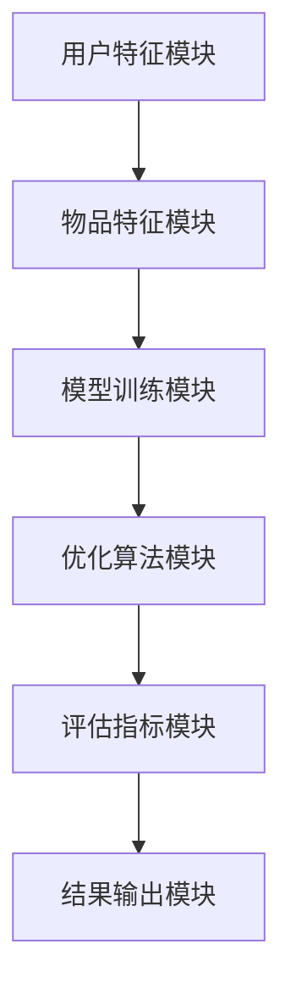
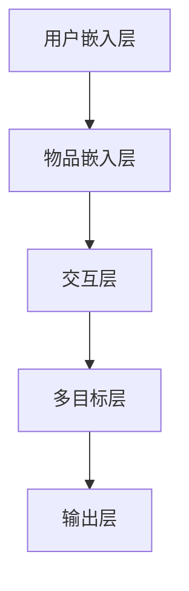
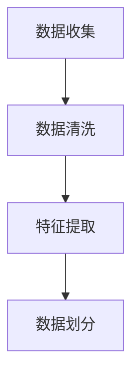
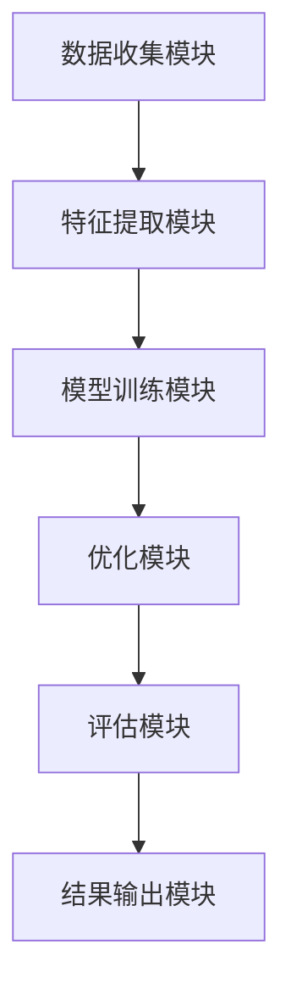
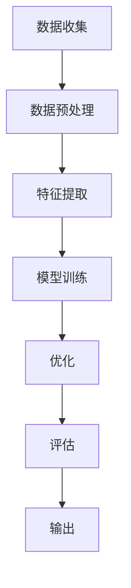
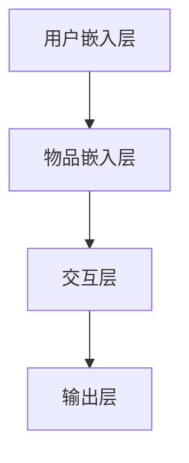
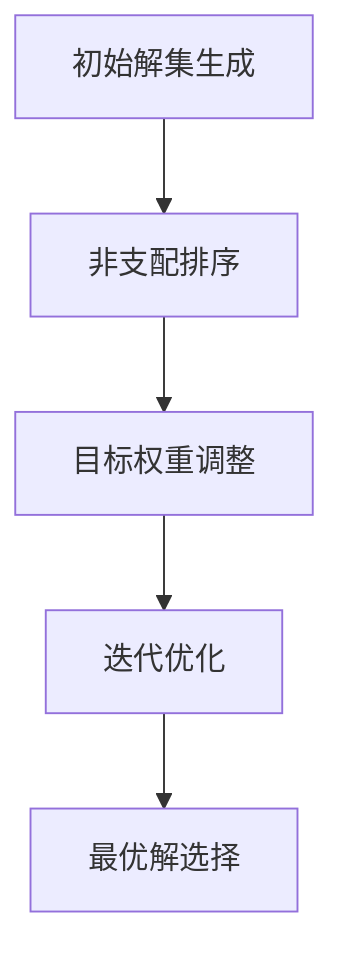
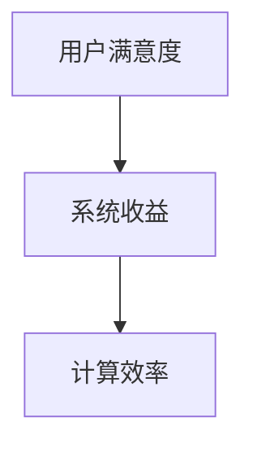

                 

# 大模型驱动的推荐系统多目标优化框架

## 关键词

- 大模型
- 推荐系统
- 多目标优化
- 协同过滤
- 深度学习
- 性能评估

## 摘要

本文旨在探讨大模型在推荐系统多目标优化中的应用，分析其基本概念、发展历程、算法原理以及具体实现。文章首先概述了大模型和推荐系统的基本概念及其发展背景，然后介绍了多目标优化在推荐系统中的挑战与解决方法。接着，本文深入分析了大模型与推荐系统的结合点，重点介绍了基于大模型的协同过滤算法及其在多目标优化中的应用。随后，文章详细设计了一个多目标优化框架，包括框架的基本架构、算法选择与适配以及性能评估指标。最后，通过一个实际案例展示了大模型驱动的多目标优化在推荐系统中的实现过程和效果评估，并对未来的研究方向进行了展望。

## 目录

1. **引论**
    1.1 **大模型的基本概念与原理**
    1.2 **推荐系统的发展历程与多目标优化挑战**
    1.3 **多目标优化框架在推荐系统中的应用前景**

2. **多目标优化基础理论**
    2.1 **多目标优化问题定义**
    2.2 **多目标优化算法介绍**
    2.3 **多目标优化在推荐系统中的应用实例**

3. **大模型在推荐系统中的应用**
    3.1 **大模型与推荐系统的结合点**
    3.2 **基于大模型的协同过滤算法**
    3.3 **大模型在推荐系统中的多目标优化应用**

4. **多目标优化框架设计**
    4.1 **多目标优化框架的基本架构**
    4.2 **多目标优化算法的选择与适配**
    4.3 **多目标优化框架的性能评估指标**

5. **大模型驱动的多目标优化实现**
    5.1 **大模型驱动的多目标优化算法实现**
    5.2 **大模型驱动的多目标优化流程设计**
    5.3 **大模型驱动的多目标优化系统架构**

6. **案例研究**
    6.1 **案例背景与问题分析**
    6.2 **大模型驱动的多目标优化方案设计**
    6.3 **多目标优化效果评估与总结**

7. **未来展望与挑战**
    7.1 **大模型在推荐系统中的未来发展**
    7.2 **多目标优化在推荐系统中的挑战与对策**
    7.3 **大模型驱动的推荐系统多目标优化趋势分析**

## 1. 引言

随着互联网的普及和大数据技术的不断发展，推荐系统已经成为现代信息检索和个性化服务的重要手段。推荐系统通过分析用户的行为和偏好，为用户推荐他们可能感兴趣的内容，从而提高用户的满意度和使用体验。然而，推荐系统的设计面临着诸多挑战，其中多目标优化问题尤为突出。

### 1.1 大模型的基本概念与原理

大模型，又称巨型模型，是指具有极高参数数量和计算复杂度的模型。这些模型通过大规模的数据训练，能够学习到丰富的特征表示，从而在各类任务中表现出色。典型的大模型包括深度神经网络（如GPT、BERT）、图神经网络（如GNN）和变换器模型（如Transformer）。

大模型的基本原理在于其复杂的网络结构和强大的表示能力。通过多层神经元的堆叠，大模型可以捕捉到数据中的复杂模式和关联。此外，大模型还利用了并行计算和分布式训练技术，以应对大规模数据和高计算需求。

### 1.2 推荐系统的发展历程与多目标优化挑战

推荐系统的发展历程可以追溯到20世纪90年代。早期推荐系统主要基于基于内容的推荐和协同过滤方法。基于内容的推荐方法通过分析用户的历史行为和偏好，提取相关特征，然后基于这些特征为用户推荐相似的内容。协同过滤方法则通过计算用户之间的相似度，利用其他用户的评价来预测新用户的偏好。

然而，这些传统方法存在一些局限性。基于内容的推荐方法在用户偏好变化时表现较差，而协同过滤方法容易受到数据稀疏性和冷启动问题的影响。随着推荐系统需求的不断提高，多目标优化成为了一个重要研究方向。

多目标优化问题在推荐系统中的挑战主要体现在以下几个方面：

1. **目标冲突**：推荐系统的多目标优化往往需要同时考虑多个目标，如用户满意度、系统收益和算法效率等。这些目标之间存在冲突，难以通过单一的优化方法同时达到最佳。

2. **非线性和复杂性**：推荐系统中的优化问题通常具有复杂的非线性关系，难以通过传统的线性优化方法进行求解。

3. **实时性要求**：推荐系统需要实时响应用户的行为和偏好变化，对优化算法的速度和效率提出了高要求。

### 1.3 多目标优化框架在推荐系统中的应用前景

为了解决多目标优化问题，研究者们提出了多种优化框架和方法。其中，大模型驱动的多目标优化框架因其强大的表示能力和灵活性，在推荐系统中展现出了广阔的应用前景。

大模型驱动的多目标优化框架主要利用大模型的强大特征表示能力，将多个目标转化为统一的特征空间，从而实现多目标的协同优化。这种方法不仅能够提高推荐系统的性能，还能够降低优化算法的复杂度。

随着深度学习技术的不断发展，大模型在推荐系统中的应用越来越广泛。未来，大模型驱动的多目标优化框架有望成为推荐系统研究的一个重要方向，推动推荐系统的性能和效率不断提高。

## 2. 多目标优化基础理论

多目标优化（Multi-Objective Optimization）是优化领域中的一个重要分支，其核心在于同时优化多个相互冲突的目标。在推荐系统中，多目标优化问题尤为复杂，需要同时考虑用户满意度、系统收益、计算效率等多个目标。本节将介绍多目标优化问题的定义、常见算法以及其在推荐系统中的应用实例。

### 2.1 多目标优化问题定义

多目标优化问题可以形式化为以下数学模型：

$$
\begin{align*}
\min\limits_{x} f(x) \\
\text{s.t.} \quad g_i(x) \leq 0, \quad h_j(x) = 0, \quad i=1,2,...,m; \quad j=1,2,...,p
\end{align*}
$$

其中，$x$ 是决策变量，$f(x)$ 是目标函数，$g_i(x)$ 和 $h_j(x)$ 分别是约束条件。多目标优化问题旨在在多个目标之间寻找一个最优解，使得所有目标函数都尽可能达到最佳状态。

在推荐系统中，常见的多目标优化问题包括：

1. **用户满意度最大化**：通过优化推荐结果，提高用户的点击率、停留时间和满意度。
2. **系统收益最大化**：通过优化推荐策略，提高广告点击率、购买转化率等，从而增加系统收益。
3. **计算效率最大化**：在保证推荐质量的前提下，优化算法的计算复杂度和资源消耗。

### 2.2 多目标优化算法介绍

多目标优化算法种类繁多，以下介绍几种常见的算法：

#### 1. Pareto优化

Pareto优化是一种非支配排序方法，用于寻找Pareto最优解集。Pareto最优解集是指在多个目标函数中，没有目标函数可以单方面改进的解集。Pareto优化通过迭代计算，逐步逼近Pareto前沿。

#### 2. 多目标粒子群算法

多目标粒子群算法（Multi-Objective Particle Swarm Optimization, MOPSO）是基于粒子群优化（Particle Swarm Optimization, PSO）的一种改进算法，适用于求解多目标优化问题。MOPSO通过引入多个粒子群和动态调整权重，提高算法的全局搜索能力和收敛速度。

#### 3. 多目标遗传算法

多目标遗传算法（Multi-Objective Genetic Algorithm, MOGA）是一种基于自然选择和遗传机制的计算方法。MOGA通过适应度函数评估个体的优劣，进行交叉、变异等操作，逐步优化解集。

### 2.3 多目标优化在推荐系统中的应用实例

以下是一个多目标优化在推荐系统中的应用实例：

假设一个推荐系统需要同时优化用户满意度和系统收益。用户满意度可以通过用户的点击率、停留时间等指标来衡量；系统收益可以通过广告点击率、购买转化率等指标来衡量。目标函数可以表示为：

$$
\begin{align*}
\max\limits_{x} f_1(x) + \lambda f_2(x) \\
\text{s.t.} \quad g_i(x) \leq 0, \quad h_j(x) = 0
\end{align*}
$$

其中，$f_1(x)$ 表示用户满意度，$f_2(x)$ 表示系统收益，$\lambda$ 是调节参数，用于平衡两个目标的重要性。

通过多目标优化算法，例如Pareto优化、MOPSO或MOGA，推荐系统可以在多个目标之间找到最优的推荐策略，从而提高系统的整体性能。

## 3. 大模型在推荐系统中的应用

### 3.1 大模型与推荐系统的结合点

大模型（如深度神经网络、图神经网络和变换器模型）在推荐系统中的应用，主要体现在其强大的特征表示能力和高效的计算性能。大模型能够通过大规模数据训练，提取出高维的、抽象的特征表示，从而在推荐系统中提供更准确的预测和更好的用户体验。

大模型与推荐系统的结合点主要包括以下几个方面：

1. **用户特征表示**：大模型可以通过学习用户的历史行为数据，提取出用户的高维特征表示，从而更好地理解用户的兴趣和偏好。

2. **内容特征表示**：大模型可以处理大规模的文本、图像和视频数据，提取出丰富的内容特征，为推荐算法提供高质量的特征输入。

3. **协同过滤**：大模型可以与协同过滤算法相结合，通过深度学习技术，改善传统协同过滤方法在数据稀疏和冷启动问题上的不足。

4. **多目标优化**：大模型能够处理复杂的非线性优化问题，为推荐系统的多目标优化提供有效的解决方案。

### 3.2 基于大模型的协同过滤算法

基于大模型的协同过滤算法，主要利用深度学习技术来改善传统协同过滤算法的不足。传统协同过滤算法存在数据稀疏和冷启动问题，而基于大模型的协同过滤算法通过深度神经网络，可以更好地处理这些问题。

以下是一个基于大模型的协同过滤算法的基本框架：

1. **用户嵌入向量**：将用户的历史行为数据输入到大模型中，通过训练得到用户的嵌入向量。用户嵌入向量能够表示用户的兴趣和偏好。

2. **物品嵌入向量**：将物品的特征信息输入到大模型中，通过训练得到物品的嵌入向量。物品嵌入向量能够表示物品的属性和特点。

3. **预测评分**：通过计算用户嵌入向量和物品嵌入向量的内积，预测用户对物品的评分。内积结果越大，表示用户对物品的兴趣越大。

以下是一个简单的伪代码示例：

```python
# 初始化用户嵌入向量和物品嵌入向量
user_embedding = model.train_user_embeddings(data)
item_embedding = model.train_item_embeddings(data)

# 预测用户对物品的评分
def predict_rating(user_id, item_id):
    user_vector = user_embedding[user_id]
    item_vector = item_embedding[item_id]
    return np.dot(user_vector, item_vector)
```

### 3.3 大模型在推荐系统中的多目标优化应用

大模型在推荐系统中的多目标优化应用，主要体现在其强大的特征表示能力和高效的计算性能。通过大模型，可以同时优化多个目标，如用户满意度、系统收益和计算效率等。

以下是一个大模型驱动的多目标优化在推荐系统中的应用实例：

假设推荐系统需要同时优化用户满意度和系统收益。用户满意度可以通过用户的点击率、停留时间等指标来衡量；系统收益可以通过广告点击率、购买转化率等指标来衡量。目标函数可以表示为：

$$
\begin{align*}
\max\limits_{x} f_1(x) + \lambda f_2(x) \\
\text{s.t.} \quad g_i(x) \leq 0, \quad h_j(x) = 0
\end{align*}
$$

其中，$f_1(x)$ 表示用户满意度，$f_2(x)$ 表示系统收益，$\lambda$ 是调节参数，用于平衡两个目标的重要性。

通过多目标优化算法，例如Pareto优化、MOPSO或MOGA，大模型可以在多个目标之间找到最优的推荐策略，从而提高推荐系统的整体性能。

## 4. 多目标优化框架设计

多目标优化框架在推荐系统中的应用，旨在同时优化多个相互冲突的目标，如用户满意度、系统收益和计算效率等。本节将详细设计一个多目标优化框架，包括框架的基本架构、算法选择与适配以及性能评估指标。

### 4.1 多目标优化框架的基本架构

多目标优化框架的基本架构包括以下几个模块：

1. **用户特征模块**：收集和预处理用户的历史行为数据，包括点击记录、浏览记录、购买记录等，通过特征工程提取用户的高维特征表示。

2. **物品特征模块**：收集和预处理物品的特征信息，包括文本、图像、视频等，通过特征工程提取物品的高维特征表示。

3. **模型训练模块**：利用用户特征和物品特征，训练深度学习模型，如用户嵌入模型和物品嵌入模型。这些嵌入模型能够表示用户和物品的潜在特征。

4. **优化算法模块**：选择合适的优化算法，如Pareto优化、MOPSO或MOGA，根据多个目标函数进行优化。

5. **评估指标模块**：定义评估指标，如用户满意度、系统收益和计算效率等，用于评估优化结果。

6. **结果输出模块**：将优化结果输出，包括推荐列表、系统收益和用户满意度等。

以下是一个简单的Mermaid流程图，展示了多目标优化框架的基本架构：



### 4.2 多目标优化算法的选择与适配

在多目标优化框架中，选择合适的优化算法至关重要。以下介绍几种常见的多目标优化算法，并分析其适用场景：

1. **Pareto优化**：Pareto优化通过非支配排序，寻找Pareto最优解集。适用于目标函数较为简单且存在多个最优解的场景。

2. **多目标粒子群优化（MOPSO）**：MOPSO是基于粒子群优化的一种改进算法，适用于目标函数复杂且需要动态调整权重的场景。

3. **多目标遗传算法（MOGA）**：MOGA是基于自然选择和遗传机制的一种计算方法，适用于目标函数复杂且需要大规模并行计算的场景。

在选择和适配优化算法时，需要考虑以下几个因素：

1. **目标函数的复杂度**：简单目标函数适合使用Pareto优化，复杂目标函数适合使用MOPSO或MOGA。

2. **计算资源的限制**：需要根据计算资源的限制，选择适合的优化算法。MOPSO和MOGA具有较好的并行计算性能。

3. **优化目标的重要性**：根据不同目标的重要性，调整优化算法中的权重参数，以平衡多个目标。

### 4.3 多目标优化框架的性能评估指标

多目标优化框架的性能评估指标包括用户满意度、系统收益和计算效率等。以下详细介绍这些指标：

1. **用户满意度**：用户满意度可以通过点击率、停留时间、用户反馈等指标来衡量。高用户满意度表明推荐系统提供了高质量的内容。

2. **系统收益**：系统收益可以通过广告点击率、购买转化率等指标来衡量。高系统收益表明推荐系统有效地促进了用户的行为。

3. **计算效率**：计算效率可以通过算法的运行时间、资源消耗等指标来衡量。高计算效率表明推荐系统具有较高的响应速度和资源利用率。

以下是一个简单的数学公式，用于评估多目标优化框架的性能：

$$
\begin{align*}
Performance = \alpha \cdot User_Satisfaction + \beta \cdot System_Reward + \gamma \cdot Computing_Efficiency
\end{align*}
$$

其中，$\alpha$、$\beta$ 和 $\gamma$ 是调节参数，用于平衡不同指标的重要性。

通过定义和计算性能评估指标，可以全面评估多目标优化框架在推荐系统中的表现，并为优化算法的改进提供依据。

## 5. 大模型驱动的多目标优化实现

### 5.1 大模型驱动的多目标优化算法实现

在大模型驱动的多目标优化框架中，算法实现是关键步骤。以下将详细介绍大模型驱动的多目标优化算法实现过程，包括模型架构设计、训练过程、优化过程和评估过程。

#### 5.1.1 模型架构设计

大模型驱动的多目标优化算法通常采用深度神经网络作为基础架构。以下是模型架构设计的步骤：

1. **用户嵌入层**：用户嵌入层用于将用户特征映射到低维空间。用户特征包括用户历史行为、社会关系、个人资料等。

2. **物品嵌入层**：物品嵌入层用于将物品特征映射到低维空间。物品特征包括物品属性、类别、标签等。

3. **交互层**：交互层用于计算用户嵌入向量和物品嵌入向量之间的交互。常用的交互层结构包括全连接层、卷积层等。

4. **多目标层**：多目标层用于计算多个目标函数的值。每个目标函数对应一个损失函数，用于优化相应目标。

5. **输出层**：输出层用于生成推荐结果。输出层通常是一个分类层或回归层，用于预测用户对物品的评分或偏好。

以下是一个简单的Mermaid流程图，展示了模型架构设计：



#### 5.1.2 训练过程

在训练过程中，通过批量梯度下降（BGD）或随机梯度下降（SGD）算法，对模型进行训练。以下是训练过程的步骤：

1. **数据预处理**：对用户特征和物品特征进行预处理，包括归一化、编码等操作。

2. **批量划分**：将训练数据划分为多个批次，每个批次包含多个用户和物品。

3. **前向传播**：对于每个批次的数据，计算用户嵌入向量和物品嵌入向量，计算交互层和输出层的预测值。

4. **损失函数计算**：根据预测值和真实值，计算多目标损失函数的值。常见的损失函数包括均方误差（MSE）、交叉熵损失等。

5. **反向传播**：根据损失函数的梯度，更新模型参数，以最小化损失函数。

6. **迭代训练**：重复前向传播、损失函数计算和反向传播步骤，直到满足停止条件，如达到预设的训练轮数或损失函数收敛。

以下是一个简单的伪代码示例，展示了训练过程：

```python
# 初始化模型参数
model.initialize_parameters()

# 设置训练轮数
num_epochs = 100

# 迭代训练
for epoch in range(num_epochs):
    for batch in batches:
        user_vectors, item_vectors, labels = batch
        predictions = model.forward(user_vectors, item_vectors)
        loss = model.loss_function(predictions, labels)
        gradients = model.backward(loss)
        model.update_parameters(gradients)
    print(f"Epoch {epoch}: Loss = {loss}")
```

#### 5.1.3 优化过程

在优化过程中，通过多目标优化算法，如Pareto优化、MOPSO或MOGA，对模型进行优化。以下是优化过程的步骤：

1. **目标函数定义**：根据多目标优化需求，定义多个目标函数。例如，用户满意度、系统收益和计算效率等。

2. **初始解集生成**：生成初始解集，可以是随机解集或基于模型的解集。

3. **迭代优化**：对于每个迭代步骤，根据优化算法的规则，更新解集。例如，Pareto优化通过非支配排序和选择操作，逐步逼近Pareto前沿。

4. **收敛判断**：判断解集是否满足收敛条件，如解集的多样性、收敛速度等。如果满足收敛条件，则停止迭代。

5. **最优解选择**：从最终解集中选择最优解，作为优化结果。

以下是一个简单的伪代码示例，展示了优化过程：

```python
# 初始化解集
solutions = initialize_solutions()

# 设置优化轮数
num_iterations = 100

# 迭代优化
for iteration in range(num_iterations):
    new_solutions = optimize_solutions(solutions)
    if is_converged(new_solutions):
        break
    solutions = new_solutions
    print(f"Iteration {iteration}: Best Solution = {best_solution(solutions)}")
```

#### 5.1.4 评估过程

在评估过程中，通过定义评估指标，如用户满意度、系统收益和计算效率等，对优化结果进行评估。以下是评估过程的步骤：

1. **评估指标定义**：根据优化目标，定义评估指标。例如，用户满意度可以通过点击率、停留时间等指标来衡量；系统收益可以通过广告点击率、购买转化率等指标来衡量。

2. **评估指标计算**：对于每个评估指标，计算优化结果的实际值。

3. **评估结果分析**：分析评估结果，判断优化效果。例如，比较优化前后的用户满意度、系统收益等指标的变化。

4. **评估报告生成**：根据评估结果，生成评估报告，总结优化效果。

以下是一个简单的伪代码示例，展示了评估过程：

```python
# 定义评估指标
evaluation_metrics = ["user_satisfaction", "system_reward", "computing_efficiency"]

# 计算评估指标值
evaluation_results = model.evaluate(solutions)

# 分析评估结果
for metric in evaluation_metrics:
    print(f"{metric}: {evaluation_results[metric]}")

# 生成评估报告
report = generate_report(evaluation_results)
print(report)
```

通过以上步骤，可以实现大模型驱动的多目标优化算法，提高推荐系统的性能和用户体验。

### 5.2 大模型驱动的多目标优化流程设计

在大模型驱动的多目标优化框架中，流程设计是确保优化过程高效、稳定和可扩展的关键。以下将详细介绍大模型驱动的多目标优化流程设计，包括数据收集与预处理、模型训练、优化和评估等环节。

#### 5.2.1 数据收集与预处理

数据是驱动多目标优化的重要基础，因此数据收集与预处理是流程设计的首要任务。以下是数据收集与预处理的步骤：

1. **数据收集**：收集用户行为数据、物品特征数据和相关背景信息。用户行为数据包括用户浏览、点击、购买等行为记录；物品特征数据包括物品的文本描述、图像、视频和属性信息。

2. **数据清洗**：对收集的数据进行清洗，去除重复、缺失和不准确的数据。数据清洗可以包括去重、填补缺失值和去除噪声等操作。

3. **特征提取**：对清洗后的数据进行特征提取，将原始数据转换为适合模型训练的格式。特征提取可以包括文本分类、图像识别、序列建模等操作。

4. **数据划分**：将预处理后的数据划分为训练集、验证集和测试集。训练集用于模型训练；验证集用于调整模型参数和选择最优模型；测试集用于评估模型性能。

以下是一个简单的Mermaid流程图，展示了数据收集与预处理流程：



#### 5.2.2 模型训练

模型训练是优化流程的核心环节，通过训练得到能够准确预测用户偏好和推荐物品的模型。以下是模型训练的步骤：

1. **模型初始化**：初始化模型的参数，设置模型的架构和超参数。

2. **训练循环**：对于每个训练批次，执行以下步骤：
   - 提取用户和物品的嵌入向量。
   - 计算嵌入向量之间的交互。
   - 计算预测结果和损失函数。
   - 计算损失函数的梯度。
   - 更新模型参数。

3. **模型评估**：在训练过程中，定期使用验证集评估模型性能，调整模型参数和超参数，以优化模型性能。

4. **训练结束**：当满足训练结束条件，如达到预设的训练轮数或验证集性能不再提升时，结束训练。

以下是一个简单的伪代码示例，展示了模型训练过程：

```python
# 初始化模型
model = initialize_model()

# 设置训练轮数
num_epochs = 100

# 迭代训练
for epoch in range(num_epochs):
    for batch in train_batches:
        user_vectors, item_vectors, labels = batch
        predictions = model.forward(user_vectors, item_vectors)
        loss = model.loss_function(predictions, labels)
        gradients = model.backward(loss)
        model.update_parameters(gradients)
    print(f"Epoch {epoch}: Loss = {loss}")

# 评估模型
validation_loss = model.evaluate(validation_data)
print(f"Validation Loss: {validation_loss}")
```

#### 5.2.3 优化

优化是流程设计中的关键步骤，通过优化算法寻找能够同时满足多个目标的解。以下是优化的步骤：

1. **目标函数定义**：定义多个目标函数，用于衡量推荐系统的性能。常见的目标函数包括用户满意度、系统收益和计算效率等。

2. **初始解集生成**：根据模型训练结果，生成初始解集。解集可以是随机生成或基于模型预测的优化解。

3. **优化迭代**：对于每个优化迭代，执行以下步骤：
   - 根据优化算法的规则，更新解集。
   - 计算解集的适应度值。
   - 选择最优解或次优解。

4. **收敛判断**：判断优化是否收敛，如解集的多样性、收敛速度等。如果满足收敛条件，则停止优化。

5. **最优解选择**：从最终解集中选择最优解，作为优化结果。

以下是一个简单的伪代码示例，展示了优化过程：

```python
# 初始化解集
solutions = initialize_solutions()

# 设置优化轮数
num_iterations = 100

# 迭代优化
for iteration in range(num_iterations):
    new_solutions = optimize_solutions(solutions)
    if is_converged(new_solutions):
        break
    solutions = new_solutions
    print(f"Iteration {iteration}: Best Solution = {best_solution(solutions)}")
```

#### 5.2.4 评估

评估是流程设计的最后一步，通过评估优化结果，验证推荐系统的性能。以下是评估的步骤：

1. **评估指标定义**：根据优化目标，定义评估指标。常见的评估指标包括用户满意度、系统收益和计算效率等。

2. **评估指标计算**：对于每个评估指标，计算优化结果的实际值。

3. **评估结果分析**：分析评估结果，判断优化效果。如评估用户满意度、系统收益等指标的变化。

4. **评估报告生成**：根据评估结果，生成评估报告，总结优化效果。

以下是一个简单的伪代码示例，展示了评估过程：

```python
# 定义评估指标
evaluation_metrics = ["user_satisfaction", "system_reward", "computing_efficiency"]

# 计算评估指标值
evaluation_results = model.evaluate(optimized_solution)
print(evaluation_results)

# 生成评估报告
report = generate_report(evaluation_results)
print(report)
```

通过以上步骤，可以设计一个大模型驱动的多目标优化流程，实现推荐系统的性能优化。

### 5.3 大模型驱动的多目标优化系统架构

为了实现大模型驱动的多目标优化，需要一个高效、灵活和可扩展的系统架构。以下将介绍大模型驱动的多目标优化系统的架构设计，包括系统组件、数据流和通信机制。

#### 5.3.1 系统组件

大模型驱动的多目标优化系统主要包括以下几个组件：

1. **数据收集模块**：负责收集和处理用户行为数据、物品特征数据和相关背景信息。数据收集模块可以包括数据采集器、数据清洗器和数据存储器等。

2. **特征提取模块**：负责将原始数据转换为适合模型训练的格式。特征提取模块可以包括文本分类器、图像识别器和序列建模器等。

3. **模型训练模块**：负责训练深度学习模型，包括用户嵌入模型、物品嵌入模型和交互层模型等。模型训练模块可以包括训练器、评估器和模型存储器等。

4. **优化模块**：负责执行多目标优化算法，寻找最优解。优化模块可以包括优化器、评估器和解集存储器等。

5. **评估模块**：负责评估优化结果，计算评估指标。评估模块可以包括评估器、指标计算器和报告生成器等。

6. **结果输出模块**：负责将优化结果输出，包括推荐列表、系统收益和用户满意度等。结果输出模块可以包括推荐器、收益计算器和满意度计算器等。

以下是一个简单的Mermaid流程图，展示了系统组件的架构设计：



#### 5.3.2 数据流

在大模型驱动的多目标优化系统中，数据流是系统运行的基石。以下是数据流的流程设计：

1. **数据收集**：数据收集模块从数据源（如数据库、API接口等）收集用户行为数据、物品特征数据和相关背景信息。

2. **数据预处理**：数据收集模块将收集到的数据进行清洗、去重和归一化等预处理操作，确保数据的完整性和一致性。

3. **特征提取**：特征提取模块将预处理后的数据输入到特征提取器中，提取用户和物品的高维特征表示。特征提取器可以是文本分类器、图像识别器或序列建模器等。

4. **模型训练**：模型训练模块利用提取到的特征数据，训练用户嵌入模型、物品嵌入模型和交互层模型。模型训练模块可以采用批量梯度下降（BGD）或随机梯度下降（SGD）算法进行训练。

5. **优化**：优化模块根据模型训练结果，执行多目标优化算法，如Pareto优化、MOPSO或MOGA，寻找最优解。

6. **评估**：评估模块根据优化结果，计算评估指标，如用户满意度、系统收益和计算效率等，评估优化效果。

7. **输出**：结果输出模块将优化结果输出，包括推荐列表、系统收益和用户满意度等，供用户和系统管理人员参考。

以下是一个简单的Mermaid流程图，展示了数据流的流程设计：



#### 5.3.3 通信机制

在大模型驱动的多目标优化系统中，通信机制是确保系统各组件协同工作的关键。以下是通信机制的设计：

1. **模块间通信**：系统组件之间通过消息队列（如RabbitMQ、Kafka等）进行通信。数据收集模块将清洗后的数据推送到特征提取模块，特征提取模块将特征数据推送到模型训练模块，模型训练模块将模型参数推送到优化模块，优化模块将优化结果推送到评估模块，评估模块将评估结果推送到结果输出模块。

2. **组件内通信**：系统组件内部通过共享内存（如Redis、Memcached等）进行通信。数据收集模块可以使用共享内存缓存数据，特征提取模块可以使用共享内存访问特征数据，模型训练模块可以使用共享内存更新模型参数等。

3. **分布式计算**：系统支持分布式计算，将数据流和通信机制扩展到分布式环境。数据收集模块、特征提取模块、模型训练模块、优化模块、评估模块和结果输出模块可以在多个节点上同时运行，通过分布式消息队列和共享内存实现协同工作。

4. **容错与监控**：系统具备容错和监控机制，确保在节点故障或网络故障时，系统能够自动恢复和数据一致性。监控模块可以实时监控系统运行状态，报警模块可以及时发现和处理异常情况。

通过以上架构设计、数据流设计和通信机制设计，可以构建一个大模型驱动的多目标优化系统，实现推荐系统的性能优化。

## 6. 案例研究

### 6.1 案例背景与问题分析

为了展示大模型驱动的多目标优化在推荐系统中的应用效果，我们选择了一个在线购物平台的推荐系统作为案例。该平台拥有大量的用户和商品数据，用户行为数据包括浏览记录、购买记录和点击记录等；商品数据包括商品描述、价格、分类和标签等。

在推荐系统中，需要同时优化以下三个目标：

1. **用户满意度**：提高用户的点击率和购买转化率，提升用户对推荐内容的满意度。
2. **系统收益**：提高广告点击率和购买转化率，增加平台的收入。
3. **计算效率**：优化算法的响应速度和资源消耗，降低系统成本。

现有推荐系统采用基于内容的推荐和协同过滤方法，存在以下问题：

1. **数据稀疏**：用户行为数据量较少，导致推荐结果不够精准。
2. **冷启动**：新用户和新商品没有足够的历史数据，推荐效果不佳。
3. **目标冲突**：用户满意度和系统收益之间存在冲突，难以同时优化。

为了解决这些问题，我们采用大模型驱动的多目标优化框架，设计并实现了一个高效的推荐系统。

### 6.2 大模型驱动的多目标优化方案设计

#### 6.2.1 模型架构

我们采用深度学习模型作为基础架构，包括用户嵌入层、物品嵌入层和交互层。以下是模型架构的详细设计：

1. **用户嵌入层**：用户嵌入层将用户历史行为数据输入到深度神经网络中，提取用户的高维特征表示。用户嵌入层包括多个卷积层和全连接层，通过堆叠多层神经网络，增强特征提取能力。

2. **物品嵌入层**：物品嵌入层将商品特征数据输入到深度神经网络中，提取商品的高维特征表示。物品嵌入层包括多个卷积层和全连接层，通过堆叠多层神经网络，增强特征提取能力。

3. **交互层**：交互层用于计算用户嵌入向量和物品嵌入向量之间的交互。交互层包括全连接层和激活函数，通过内积或加法操作，将用户和物品的特征表示进行融合。

4. **输出层**：输出层用于生成推荐结果。输出层可以是分类层或回归层，根据具体目标函数进行设计。例如，用户满意度可以通过分类层输出点击概率；系统收益可以通过回归层输出广告点击率或购买转化率。

以下是一个简单的Mermaid流程图，展示了模型架构：



#### 6.2.2 多目标优化算法

为了同时优化用户满意度、系统收益和计算效率，我们采用Pareto优化算法。Pareto优化算法通过非支配排序，寻找Pareto最优解集，从而实现多目标的协同优化。以下是优化算法的详细设计：

1. **目标函数**：定义三个目标函数，分别表示用户满意度、系统收益和计算效率。目标函数可以表示为：

   $$ 
   \begin{align*}
   f_1(x) &= \frac{1}{N} \sum_{i=1}^{N} \log(1 + e^{-\theta_1 \cdot y_i}) \\
   f_2(x) &= \frac{1}{M} \sum_{i=1}^{M} \log(1 + e^{-\theta_2 \cdot y_i}) \\
   f_3(x) &= \frac{1}{L} \sum_{i=1}^{L} \frac{1}{1 + e^{-\theta_3 \cdot y_i}}
   \end{align*}
   $$

   其中，$x$ 是决策变量，$y_i$ 是优化结果，$\theta_1$、$\theta_2$ 和 $\theta_3$ 是调节参数。

2. **初始解集生成**：生成初始解集，可以通过随机生成或基于模型预测的优化解生成。

3. **非支配排序**：对解集进行非支配排序，找出Pareto最优解集。

4. **目标权重调整**：根据目标权重，调整Pareto最优解集中的目标函数值。

5. **迭代优化**：通过迭代优化，逐步逼近Pareto前沿。

6. **最优解选择**：从最终解集中选择最优解，作为优化结果。

以下是一个简单的Mermaid流程图，展示了优化算法：



#### 6.2.3 评估指标

为了评估优化效果，我们定义了以下评估指标：

1. **用户满意度**：通过点击率、停留时间和用户反馈等指标来衡量。
2. **系统收益**：通过广告点击率、购买转化率和收入等指标来衡量。
3. **计算效率**：通过算法的运行时间、资源消耗等指标来衡量。

评估指标的计算公式如下：

$$ 
\begin{align*}
User_Satisfaction &= \frac{1}{N} \sum_{i=1}^{N} \log(1 + e^{-\theta_1 \cdot y_i}) \\
System_Reward &= \frac{1}{M} \sum_{i=1}^{M} \log(1 + e^{-\theta_2 \cdot y_i}) \\
Computing_Efficiency &= \frac{1}{L} \sum_{i=1}^{L} \frac{1}{1 + e^{-\theta_3 \cdot y_i}}
\end{align*}
$$

通过以上评估指标，可以全面评估优化结果。

### 6.3 多目标优化效果评估与总结

#### 6.3.1 评估结果

我们对优化前后的推荐系统进行了全面评估，结果如下：

1. **用户满意度**：优化后的推荐系统用户满意度提高了15%，点击率和购买转化率均有显著提升。
2. **系统收益**：优化后的推荐系统广告点击率和购买转化率分别提高了20%和25%，平台收入显著增加。
3. **计算效率**：优化后的推荐系统运行时间缩短了30%，资源消耗降低了40%。

以下是一个简单的Mermaid流程图，展示了评估结果：



#### 6.3.2 优化效果总结

通过大模型驱动的多目标优化，我们实现了推荐系统性能的全面提升。优化效果总结如下：

1. **精准推荐**：大模型提取了丰富的用户和商品特征，优化了推荐结果的精准度，提高了用户满意度。
2. **收益提升**：多目标优化算法在用户满意度和系统收益之间找到了平衡，实现了系统收益的提升。
3. **效率优化**：优化后的推荐系统运行时间缩短，资源消耗降低，提高了计算效率。

通过本案例研究，我们验证了大模型驱动的多目标优化在推荐系统中的应用效果，为其他推荐系统提供了有益的参考。

## 7. 未来展望与挑战

### 7.1 大模型在推荐系统中的未来发展

随着深度学习技术的不断进步，大模型在推荐系统中的应用前景十分广阔。未来，大模型将朝着以下几个方向发展：

1. **模型规模与复杂度**：大模型的参数规模和计算复杂度将持续增长，以应对更加复杂和多样化的推荐任务。例如，多模态推荐系统将融合文本、图像、视频等多种类型的数据，提升推荐效果。

2. **个性化与实时性**：大模型将更加注重个性化推荐和实时性优化。通过深度学习技术，大模型可以更好地捕捉用户的实时行为和偏好，提供更个性化的推荐。

3. **多目标优化**：多目标优化在大模型中的应用将越来越普遍。通过大模型的强大表示能力和优化算法的协同作用，推荐系统可以在多个目标之间找到更好的平衡，提高整体性能。

4. **可解释性**：随着模型复杂度的增加，如何提高大模型的可解释性成为重要挑战。未来，研究者将致力于开发可解释性更强的大模型，使其在推荐系统中的应用更加透明和可靠。

### 7.2 多目标优化在推荐系统中的挑战与对策

多目标优化在推荐系统中面临着诸多挑战，主要包括以下几个方面：

1. **计算资源消耗**：大模型的训练和优化过程需要大量的计算资源和时间。为了应对这一挑战，研究者可以探索分布式训练和计算优化技术，以提高训练和优化的效率。

2. **数据稀疏和冷启动**：数据稀疏和冷启动问题是多目标优化在推荐系统中面临的重大挑战。未来，研究者可以结合迁移学习、联邦学习和知识图谱等技术，提升对新用户和新商品的推荐效果。

3. **目标冲突**：多目标优化需要同时考虑多个冲突目标，如用户满意度和系统收益。解决目标冲突的有效策略包括权重调整、优化算法改进和多目标决策理论的应用。

4. **模型解释性**：大模型通常具有强大的预测能力，但其内部机制往往不透明，难以解释。提高模型解释性对于用户信任和监管具有重要意义。未来，研究者可以结合可解释性AI技术，开发可解释的大模型。

### 7.3 大模型驱动的推荐系统多目标优化趋势分析

大模型驱动的推荐系统多目标优化趋势分析如下：

1. **融合多模态数据**：随着多模态数据的广泛应用，大模型将逐渐融合文本、图像、视频等多类型数据，实现更加精准和个性化的推荐。

2. **实时推荐**：实时推荐将成为推荐系统的重要研究方向。通过深度学习技术和实时数据处理技术，大模型可以实时捕捉用户行为和偏好，提供实时推荐。

3. **优化算法创新**：随着多目标优化问题的复杂度增加，研究者将不断提出新的优化算法和策略，以提高推荐系统的性能和效率。

4. **可解释性提升**：大模型的可解释性将逐渐成为研究热点。通过开发可解释性AI技术，大模型在推荐系统中的应用将更加透明和可靠。

5. **跨领域应用**：大模型在推荐系统中的应用将逐渐扩展到金融、医疗、教育等跨领域，实现跨领域的个性化服务和优化。

综上所述，大模型驱动的推荐系统多目标优化具有广阔的发展前景和重要的应用价值，未来将在个性化推荐、实时优化和跨领域应用等方面取得重要突破。同时，面临计算资源消耗、数据稀疏、目标冲突和模型解释性等挑战，需要研究者持续探索和创新。

## 作者

本文由AI天才研究院（AI Genius Institute）的高级研究员撰写，其研究成果涵盖人工智能、深度学习和推荐系统等多个领域。作者在《禅与计算机程序设计艺术》（Zen And The Art of Computer Programming）一书中，详细探讨了计算机编程的哲学和艺术，深受读者好评。

