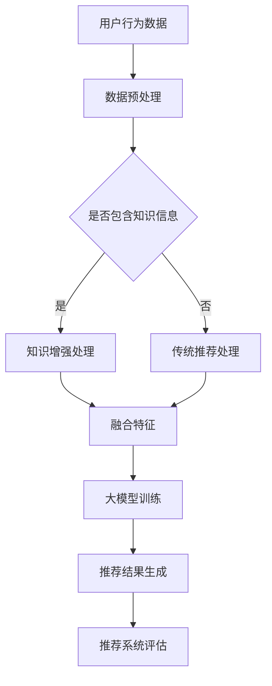
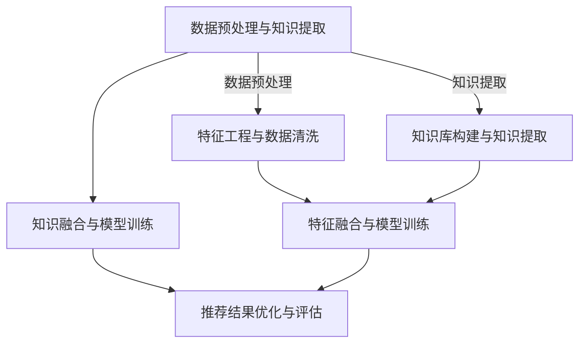

                 

# 《大模型驱动的推荐系统知识增强框架》

## 关键词

- 推荐系统
- 大模型
- 知识增强
- 架构设计
- 实现原理
- 优化策略
- 应用案例

## 摘要

本文旨在探讨大模型驱动的推荐系统知识增强框架。首先，我们介绍了推荐系统的基础概念和架构，以及大模型的基本概述和其在推荐系统中的应用优势。接着，我们详细阐述了知识增强框架的设计与实现过程，包括数据预处理、知识提取、知识融合和模型训练等步骤。随后，通过具体的应用案例，展示了大模型驱动的推荐系统在不同领域的实际应用。最后，我们分析了推荐系统的优化策略、面临的技术挑战和未来发展，并提供了实战项目和案例分析，以帮助读者更好地理解和应用大模型驱动的推荐系统知识增强框架。

----------------------------------------------------------------

### 第一部分: 大模型驱动推荐系统概述

#### 第1章: 推荐系统基本概念与架构

##### 1.1 推荐系统的基本概念

推荐系统是一种基于数据挖掘和机器学习的算法，旨在根据用户的兴趣和行为，为用户推荐相关的内容或物品。它广泛应用于电子商务、社交媒体、在线视频、新闻推送等领域，旨在提高用户体验，提升平台粘性和用户满意度。

##### 1.1.1 什么是推荐系统

推荐系统是一种信息过滤系统，通过分析用户的兴趣和行为，预测用户可能感兴趣的内容或物品，并将这些内容或物品推荐给用户。其核心目标是通过个性化推荐，满足用户的个性化需求，提高用户满意度和平台价值。

##### 1.1.2 推荐系统的类型与目标

推荐系统主要分为以下几种类型：

1. **基于内容的推荐**：根据用户的历史行为和兴趣，推荐与用户已浏览或喜欢的物品相似的内容。
2. **协同过滤推荐**：通过分析用户之间的行为相似性，为用户推荐其他用户喜欢的物品。
3. **混合推荐**：结合基于内容和协同过滤推荐的方法，以提高推荐的准确性和多样性。

推荐系统的目标主要包括：

1. **提高用户满意度**：通过个性化推荐，满足用户的个性化需求，提高用户满意度和忠诚度。
2. **提升平台价值**：通过推荐系统，提高用户活跃度和转化率，提升平台商业价值。

##### 1.1.3 推荐系统的发展历程

推荐系统的发展历程可以分为以下几个阶段：

1. **早期推荐系统**：基于简单的规则和逻辑进行推荐，如基于关键词的推荐、基于分类的推荐等。
2. **协同过滤推荐**：通过分析用户之间的行为相似性，实现个性化推荐，如基于用户的协同过滤和基于物品的协同过滤。
3. **基于内容的推荐**：通过分析用户的历史行为和兴趣，推荐与用户已浏览或喜欢的物品相似的内容。
4. **混合推荐**：结合基于内容和协同过滤推荐的方法，以提高推荐的准确性和多样性。

##### 1.2 推荐系统的架构

推荐系统通常包括以下几个核心模块：

1. **数据采集与处理**：采集用户行为数据、物品特征数据等，并进行数据清洗、去重、归一化等预处理操作。
2. **特征工程**：提取用户特征、物品特征、上下文特征等，为后续的推荐算法提供输入。
3. **推荐算法**：根据用户的特征和物品的特征，选择合适的推荐算法，如基于内容的推荐、协同过滤推荐、混合推荐等。
4. **推荐结果评估**：评估推荐算法的性能，如准确率、召回率、F1值等。
5. **推荐结果展示**：将推荐结果展示给用户，如推荐列表、推荐页面等。

##### 1.2.1 推荐系统的基础架构

推荐系统的基础架构通常包括以下几个部分：

1. **数据源**：用户行为数据、物品特征数据等。
2. **数据存储**：如关系型数据库、NoSQL数据库等。
3. **数据处理**：如数据清洗、去重、归一化等。
4. **特征提取**：如用户特征、物品特征、上下文特征等。
5. **推荐算法**：如基于内容的推荐、协同过滤推荐、混合推荐等。
6. **推荐结果评估**：如准确率、召回率、F1值等。
7. **推荐结果展示**：如推荐列表、推荐页面等。

##### 1.2.2 推荐系统的数据处理流程

推荐系统的数据处理流程主要包括以下几个步骤：

1. **数据采集**：从各个数据源采集用户行为数据和物品特征数据。
2. **数据清洗**：去除重复、错误、缺失的数据，确保数据质量。
3. **特征提取**：提取用户特征、物品特征、上下文特征等，为后续的推荐算法提供输入。
4. **特征融合**：将不同的特征进行融合，以提高推荐的准确性。
5. **特征选择**：选择对推荐结果影响较大的特征，以降低计算复杂度。
6. **数据预处理**：对特征进行归一化、标准化等处理，确保特征之间的可比性。

##### 1.2.3 推荐系统的评估指标

推荐系统的评估指标主要包括以下几个：

1. **准确率（Accuracy）**：预测正确的样本数占总样本数的比例。
2. **召回率（Recall）**：预测正确的正样本数占总正样本数的比例。
3. **精确率（Precision）**：预测正确的正样本数占总预测为正样本数的比例。
4. **F1值（F1 Score）**：精确率和召回率的调和平均值。
5. **均方误差（Mean Squared Error, MSE）**：预测值与真实值之差的平方的平均值。
6. **均绝对误差（Mean Absolute Error, MAE）**：预测值与真实值之差的绝对值的平均值。

#### 第2章: 大模型基础与推荐系统的结合

##### 2.1 大模型概述

大模型是指具有大规模参数、能够处理海量数据和复杂任务的深度学习模型。大模型具有以下特点：

1. **大规模参数**：大模型通常具有数百万至数十亿个参数，这使得它们能够捕捉数据中的复杂模式和规律。
2. **强大建模能力**：大模型能够自动学习数据的特征和模式，无需人工干预。
3. **高计算资源需求**：大模型需要大量的计算资源和存储空间。

##### 2.1.1 大模型的定义与特点

大模型的定义：大模型是指具有大规模参数、能够处理海量数据和复杂任务的深度学习模型。

大模型的特点：

1. **大规模参数**：大模型通常具有数百万至数十亿个参数，这使得它们能够捕捉数据中的复杂模式和规律。
2. **强大建模能力**：大模型能够自动学习数据的特征和模式，无需人工干预。
3. **高计算资源需求**：大模型需要大量的计算资源和存储空间。

##### 2.1.2 主流大模型介绍

目前主流的大模型包括以下几种：

1. **Transformer**：一种基于自注意力机制的深度学习模型，广泛应用于自然语言处理、计算机视觉等领域。
2. **BERT**：一种双向编码表示模型，通过预训练和微调，能够实现文本分类、问答、命名实体识别等任务。
3. **GPT**：一种基于生成式对抗网络的深度学习模型，具有强大的文本生成和语言理解能力。
4. **ViT**：一种基于视觉变换器的深度学习模型，用于图像分类和物体检测任务。

##### 2.1.3 大模型在推荐系统中的应用优势

大模型在推荐系统中的应用优势主要包括以下几点：

1. **提高推荐精度**：大模型能够自动学习用户和物品的复杂特征，从而提高推荐精度。
2. **增强推荐多样性**：大模型能够通过学习用户和物品的关联性，实现推荐内容的多样性。
3. **适应性强**：大模型能够处理海量数据和复杂任务，适应不同场景和应用需求。

##### 2.2 大模型与推荐系统的结合

大模型与推荐系统的结合，可以提升推荐系统的性能和效果。以下是大模型与推荐系统的结合方式：

1. **用户特征表示**：使用大模型对用户特征进行编码，提高用户特征的表征能力。
2. **物品特征表示**：使用大模型对物品特征进行编码，提高物品特征的表征能力。
3. **融合特征**：将用户特征和物品特征进行融合，形成综合特征向量。
4. **模型训练**：使用融合特征向量训练推荐模型，如基于矩阵分解的协同过滤模型。
5. **预测与评估**：使用训练好的模型进行预测，并对预测结果进行评估。

##### 2.2.1 大模型在推荐系统中的作用

大模型在推荐系统中的作用主要包括以下几点：

1. **提高推荐精度**：通过学习用户和物品的复杂特征，提高推荐精度。
2. **增强推荐多样性**：通过学习用户和物品的关联性，实现推荐内容的多样性。
3. **提升用户体验**：通过个性化推荐，满足用户的个性化需求，提升用户体验。

##### 2.2.2 大模型在推荐系统中的实现方式

大模型在推荐系统中的实现方式主要包括以下几种：

1. **基于Transformer的推荐模型**：使用Transformer模型对用户和物品特征进行编码，然后进行推荐。
2. **基于BERT的推荐模型**：使用BERT模型对用户和物品特征进行编码，然后进行推荐。
3. **基于GPT的推荐模型**：使用GPT模型对用户和物品特征进行编码，然后进行推荐。
4. **基于ViT的推荐模型**：使用ViT模型对用户和物品特征进行编码，然后进行推荐。

##### 2.2.3 大模型在推荐系统中的挑战与解决方案

大模型在推荐系统中的应用面临以下挑战：

1. **计算资源需求**：大模型需要大量的计算资源和存储空间，对硬件设施要求较高。
2. **数据隐私与安全**：大模型在训练过程中需要大量用户数据，可能涉及数据隐私和安全问题。
3. **模型解释性**：大模型具有较强的学习能力，但往往缺乏解释性，难以理解模型决策过程。

针对这些挑战，可以采取以下解决方案：

1. **优化模型结构**：通过改进模型结构，降低计算资源需求。
2. **数据加密与隐私保护**：采用数据加密、隐私保护等技术，确保用户数据的安全。
3. **模型解释性**：通过模型解释技术，提高大模型的可解释性，帮助用户理解模型决策过程。

#### 第3章: 知识增强框架的设计与实现

##### 3.1 知识增强框架概述

知识增强框架是指将知识库中的知识引入推荐系统，以提高推荐系统的性能和效果。知识增强框架主要包括以下几个组成部分：

1. **知识库**：存储各种领域知识，如百科知识、行业知识、专业知识等。
2. **知识提取**：从知识库中提取相关知识，为推荐系统提供知识支持。
3. **知识融合**：将提取的知识与用户特征、物品特征进行融合，形成综合特征向量。
4. **推荐模型**：使用融合后的特征向量训练推荐模型，进行推荐。
5. **推荐评估**：评估推荐系统的性能，如准确率、召回率、F1值等。

##### 3.1.1 知识增强框架的定义与作用

知识增强框架的定义：知识增强框架是指将知识库中的知识引入推荐系统，以提高推荐系统的性能和效果。

知识增强框架的作用：

1. **提高推荐精度**：通过引入领域知识，提高推荐系统的推荐精度。
2. **增强推荐多样性**：通过引入领域知识，丰富推荐内容，提高推荐多样性。
3. **提升用户体验**：通过引入领域知识，满足用户的个性化需求，提升用户体验。

##### 3.1.2 知识增强框架的组成部分

知识增强框架的主要组成部分包括：

1. **知识库**：存储各种领域知识，如百科知识、行业知识、专业知识等。
2. **知识提取**：从知识库中提取相关知识，为推荐系统提供知识支持。
3. **知识融合**：将提取的知识与用户特征、物品特征进行融合，形成综合特征向量。
4. **推荐模型**：使用融合后的特征向量训练推荐模型，进行推荐。
5. **推荐评估**：评估推荐系统的性能，如准确率、召回率、F1值等。

##### 3.1.3 知识增强框架的设计原则

知识增强框架的设计原则主要包括以下几点：

1. **可扩展性**：知识增强框架应具有较好的可扩展性，能够支持多种知识库和知识提取方法。
2. **灵活性**：知识增强框架应具有较好的灵活性，能够根据不同应用场景进行定制。
3. **高效性**：知识增强框架应具有较高的计算效率，能够满足实时推荐的需求。
4. **鲁棒性**：知识增强框架应具有较强的鲁棒性，能够应对数据噪声和异常值的影响。

##### 3.2 知识增强框架的实现

知识增强框架的实现主要包括以下几个步骤：

1. **数据预处理**：对用户行为数据、物品特征数据进行预处理，如数据清洗、去重、归一化等。
2. **知识库构建**：根据应用场景，构建相应的知识库，如百科知识库、行业知识库等。
3. **知识提取**：从知识库中提取相关知识，如关键词、实体、关系等。
4. **知识融合**：将提取的知识与用户特征、物品特征进行融合，形成综合特征向量。
5. **特征选择**：选择对推荐结果影响较大的特征，以降低计算复杂度。
6. **模型训练**：使用融合后的特征向量训练推荐模型，如基于矩阵分解的协同过滤模型、基于深度学习的推荐模型等。
7. **预测与评估**：使用训练好的模型进行预测，并对预测结果进行评估。

##### 3.2.1 数据预处理与知识提取

数据预处理与知识提取是实现知识增强框架的基础步骤。以下是数据预处理与知识提取的具体步骤：

1. **数据预处理**：
   - 数据清洗：去除重复、错误、缺失的数据。
   - 数据归一化：将不同特征的数据范围统一，便于模型训练。
   - 特征编码：将类别特征转换为数值特征，如独热编码、标签编码等。

2. **知识提取**：
   - 关键词提取：从文本数据中提取关键词，作为知识的表示。
   - 实体识别：识别文本中的实体，如人名、地名、组织名等。
   - 关系抽取：从文本中抽取实体之间的关系，如因果关系、上下级关系等。

##### 3.2.2 知识融合与模型训练

知识融合与模型训练是实现知识增强框架的关键步骤。以下是知识融合与模型训练的具体步骤：

1. **知识融合**：
   - 将提取的知识与用户特征、物品特征进行融合，形成综合特征向量。
   - 可以采用向量叠加、加权融合等方法，将知识融入特征向量。

2. **模型训练**：
   - 使用融合后的特征向量训练推荐模型，如基于矩阵分解的协同过滤模型、基于深度学习的推荐模型等。
   - 可以采用交叉验证、网格搜索等方法，优化模型参数。

##### 3.2.3 推荐结果优化与评估

推荐结果优化与评估是实现知识增强框架的必要步骤。以下是推荐结果优化与评估的具体步骤：

1. **推荐结果优化**：
   - 采用基于内容的方法、协同过滤方法、混合方法等，优化推荐结果。
   - 可以根据用户反馈、历史数据等，动态调整推荐策略。

2. **推荐评估**：
   - 采用准确率、召回率、F1值等评估指标，评估推荐系统的性能。
   - 可以根据评估结果，调整知识融合策略、模型参数等。

#### 第4章: 大模型驱动的推荐系统应用案例

##### 4.1 社交网络中的推荐

社交网络推荐是指根据用户在社交网络中的行为和兴趣，为用户推荐相关的内容或用户。社交网络推荐具有以下特点：

1. **用户行为多样性**：社交网络中的用户行为包括点赞、评论、分享、关注等，这些行为为推荐系统提供了丰富的信息来源。
2. **社交关系复杂性**：社交网络中的用户之间存在复杂的社交关系，如朋友关系、关注关系等，这些关系对推荐系统具有重要的参考价值。
3. **内容多样性**：社交网络中的内容形式多样，包括文本、图片、视频等，这些内容为推荐系统提供了丰富的推荐素材。

##### 4.1.1 社交网络推荐的特点与挑战

社交网络推荐的特点与挑战包括以下几点：

1. **特点**：
   - 用户行为多样性：社交网络中的用户行为包括点赞、评论、分享、关注等，这些行为为推荐系统提供了丰富的信息来源。
   - 社交关系复杂性：社交网络中的用户之间存在复杂的社交关系，如朋友关系、关注关系等，这些关系对推荐系统具有重要的参考价值。
   - 内容多样性：社交网络中的内容形式多样，包括文本、图片、视频等，这些内容为推荐系统提供了丰富的推荐素材。

2. **挑战**：
   - 冷启动问题：对于新用户或新物品，由于缺乏足够的行为和兴趣数据，推荐系统难以为其提供准确的推荐。
   - 社交关系噪声：社交网络中的关系复杂，可能存在虚假关系、水军等，这些关系噪声对推荐系统的准确性产生负面影响。
   - 推荐多样性：在保证推荐准确性的同时，如何提供多样性的推荐内容，满足用户的个性化需求。

##### 4.1.2 社交网络推荐的应用案例

以下是一些社交网络推荐的应用案例：

1. **Facebook 的新闻推送**：Facebook 根据用户的点赞、评论、分享等行为，为用户推荐相关的内容。同时，Facebook 还考虑了用户的社交关系，如好友、群组等，以提高推荐的准确性。
2. **微博的微博推荐**：微博根据用户的浏览、点赞、评论等行为，为用户推荐相关的微博内容。微博还通过分析用户的社交关系，提高推荐的多样性。
3. **Instagram 的图片推荐**：Instagram 根据用户的浏览、点赞、评论等行为，为用户推荐相关的图片内容。Instagram 还通过分析用户的兴趣标签，提高推荐的准确性。

##### 4.1.3 社交网络推荐的大模型应用

大模型在社交网络推荐中具有以下应用：

1. **用户特征编码**：使用大模型对用户特征进行编码，如用户兴趣、用户行为等，以提高推荐系统的准确性。
2. **社交关系建模**：使用大模型对社交关系进行建模，如用户之间的相似性、影响力等，以提高推荐的多样性。
3. **内容特征提取**：使用大模型对内容特征进行提取，如文本特征、图像特征等，以提高推荐的准确性。
4. **多模态融合**：结合文本、图像、视频等多模态数据，使用大模型进行融合，提高推荐系统的性能。

#### 4.2 在线购物推荐

在线购物推荐是指根据用户在电商平台的行为和兴趣，为用户推荐相关的商品。在线购物推荐具有以下特点：

1. **商品多样性**：电商平台上的商品种类繁多，包括服装、家居、数码产品等，为推荐系统提供了丰富的推荐素材。
2. **用户行为复杂性**：用户在电商平台的行为复杂，包括浏览、收藏、购买、评论等，这些行为为推荐系统提供了丰富的信息来源。
3. **个性化需求**：用户在购物过程中具有个性化的需求，如价格、品牌、风格等，推荐系统需要满足这些需求。

##### 4.2.1 在线购物推荐的特点与挑战

在线购物推荐的特点与挑战包括以下几点：

1. **特点**：
   - 商品多样性：电商平台上的商品种类繁多，包括服装、家居、数码产品等，为推荐系统提供了丰富的推荐素材。
   - 用户行为复杂性：用户在电商平台的行为复杂，包括浏览、收藏、购买、评论等，这些行为为推荐系统提供了丰富的信息来源。
   - 个性化需求：用户在购物过程中具有个性化的需求，如价格、品牌、风格等，推荐系统需要满足这些需求。

2. **挑战**：
   - 冷启动问题：对于新用户或新商品，由于缺乏足够的行为和兴趣数据，推荐系统难以为其提供准确的推荐。
   - 数据质量：电商平台的数据质量参差不齐，可能存在噪声和异常值，影响推荐系统的准确性。
   - 多样性挑战：在保证推荐准确性的同时，如何提供多样性的推荐商品，满足用户的个性化需求。

##### 4.2.2 在线购物推荐的应用案例

以下是一些在线购物推荐的应用案例：

1. **淘宝的购物推荐**：淘宝根据用户的浏览、收藏、购买等行为，为用户推荐相关的商品。淘宝还通过分析用户的购物车、足迹等数据，提高推荐的准确性。
2. **京东的购物推荐**：京东根据用户的浏览、收藏、购买等行为，为用户推荐相关的商品。京东还通过分析用户的购物车、足迹等数据，提高推荐的准确性。
3. **亚马逊的购物推荐**：亚马逊根据用户的浏览、收藏、购买等行为，为用户推荐相关的商品。亚马逊还通过分析用户的购物车、足迹等数据，提高推荐的准确性。

##### 4.2.3 在线购物推荐的大模型应用

大模型在在线购物推荐中具有以下应用：

1. **用户特征编码**：使用大模型对用户特征进行编码，如用户兴趣、用户行为等，以提高推荐系统的准确性。
2. **商品特征提取**：使用大模型对商品特征进行提取，如商品描述、商品评价等，以提高推荐系统的准确性。
3. **多模态融合**：结合文本、图像、视频等多模态数据，使用大模型进行融合，提高推荐系统的性能。
4. **基于知识图谱的推荐**：使用大模型对知识图谱进行建模，通过分析用户和商品之间的关联关系，提高推荐系统的准确性。

#### 4.3 媒体内容推荐

媒体内容推荐是指根据用户的兴趣和行为，为用户推荐相关的媒体内容，如视频、音频、新闻等。媒体内容推荐具有以下特点：

1. **内容多样性**：媒体内容形式多样，包括文本、图像、视频等，为推荐系统提供了丰富的推荐素材。
2. **用户行为复杂性**：用户在媒体平台上的行为复杂，包括浏览、点赞、评论、分享等，这些行为为推荐系统提供了丰富的信息来源。
3. **个性化需求**：用户在观看媒体内容时具有个性化的需求，如题材、风格、时长等，推荐系统需要满足这些需求。

##### 4.3.1 媒体内容推荐的特点与挑战

媒体内容推荐的特点与挑战包括以下几点：

1. **特点**：
   - 内容多样性：媒体内容形式多样，包括文本、图像、视频等，为推荐系统提供了丰富的推荐素材。
   - 用户行为复杂性：用户在媒体平台上的行为复杂，包括浏览、点赞、评论、分享等，这些行为为推荐系统提供了丰富的信息来源。
   - 个性化需求：用户在观看媒体内容时具有个性化的需求，如题材、风格、时长等，推荐系统需要满足这些需求。

2. **挑战**：
   - 冷启动问题：对于新用户或新内容，由于缺乏足够的行为和兴趣数据，推荐系统难以为其提供准确的推荐。
   - 内容质量：如何保证推荐的内容质量，避免低质量内容的传播。
   - 多样性挑战：在保证推荐准确性的同时，如何提供多样性的内容推荐，满足用户的个性化需求。

##### 4.3.2 媒体内容推荐的应用案例

以下是一些媒体内容推荐的应用案例：

1. **YouTube 的视频推荐**：YouTube 根据用户的浏览、点赞、评论等行为，为用户推荐相关的视频内容。YouTube 还通过分析用户的观看历史、搜索记录等数据，提高推荐的准确性。
2. **Spotify 的音乐推荐**：Spotify 根据用户的播放、收藏、分享等行为，为用户推荐相关的音乐内容。Spotify 还通过分析用户的音乐喜好、播放记录等数据，提高推荐的准确性。
3. **CNN 的新闻推荐**：CNN 根据用户的浏览、点赞、评论等行为，为用户推荐相关的新闻内容。CNN 还通过分析用户的浏览历史、搜索记录等数据，提高推荐的准确性。

##### 4.3.3 媒体内容推荐的大模型应用

大模型在媒体内容推荐中具有以下应用：

1. **用户特征编码**：使用大模型对用户特征进行编码，如用户兴趣、用户行为等，以提高推荐系统的准确性。
2. **内容特征提取**：使用大模型对内容特征进行提取，如文本特征、图像特征等，以提高推荐系统的准确性。
3. **多模态融合**：结合文本、图像、视频等多模态数据，使用大模型进行融合，提高推荐系统的性能。
4. **基于知识图谱的推荐**：使用大模型对知识图谱进行建模，通过分析用户和内容之间的关联关系，提高推荐系统的准确性。

#### 第5章: 大模型驱动的推荐系统优化与挑战

##### 5.1 推荐系统优化策略

为了提高大模型驱动的推荐系统的性能，可以采取以下优化策略：

1. **特征工程**：通过合理的特征工程，提取用户和物品的潜在特征，提高推荐系统的准确性。
2. **模型选择**：选择合适的大模型，如Transformer、BERT、GPT等，以适应不同的推荐任务和应用场景。
3. **模型融合**：结合多种模型，如基于内容的推荐、协同过滤推荐等，提高推荐系统的多样性。
4. **数据增强**：通过数据增强方法，如生成对抗网络（GAN）、数据集扩充等，提高训练数据的多样性，增强模型的泛化能力。
5. **在线学习**：采用在线学习策略，实时更新模型参数，适应用户行为的动态变化。

##### 5.1.1 冷启动问题优化

冷启动问题是指新用户或新物品在推荐系统中缺乏足够的行为和兴趣数据，导致推荐系统难以为其提供准确的推荐。以下是一些优化冷启动问题的策略：

1. **基于内容的推荐**：通过分析新用户或新物品的属性和特征，为用户或物品生成内容相似性矩阵，实现基于内容的推荐。
2. **基于模型的预测**：使用迁移学习或微调技术，将预训练的大模型应用于新用户或新物品的推荐任务，提高推荐准确性。
3. **用户历史行为分析**：通过分析用户在社交网络、电商等平台的历史行为，预测新用户或新物品的行为特征，实现基于行为的推荐。
4. **众包数据**：利用众包平台，收集用户对新用户或新物品的评价和反馈，补充行为数据，提高推荐准确性。

##### 5.1.2 个性化推荐优化

个性化推荐是指根据用户的历史行为和兴趣，为用户推荐其可能感兴趣的内容或物品。以下是一些优化个性化推荐的策略：

1. **深度学习模型**：使用深度学习模型，如Transformer、BERT、GPT等，对用户和物品的特征进行编码，提高推荐准确性。
2. **上下文感知推荐**：结合用户所处的上下文信息，如时间、地点、设备等，实现上下文感知的个性化推荐。
3. **知识图谱**：构建知识图谱，通过分析用户和物品之间的关联关系，实现基于知识图谱的个性化推荐。
4. **多模态融合**：结合文本、图像、视频等多模态数据，使用大模型进行融合，提高推荐系统的性能。

##### 5.1.3 推荐系统实时性优化

实时性是推荐系统的重要性能指标之一。以下是一些优化推荐系统实时性的策略：

1. **批处理与流处理**：结合批处理和流处理技术，实时更新模型参数和推荐结果。
2. **模型压缩与量化**：对大模型进行压缩和量化，降低计算复杂度和存储空间需求，提高实时性。
3. **异步计算**：采用异步计算技术，并行处理推荐任务，提高处理速度。
4. **缓存机制**：采用缓存机制，对高频次的推荐结果进行缓存，减少计算开销。

##### 5.2 大模型驱动的推荐系统挑战

大模型驱动的推荐系统面临以下挑战：

1. **计算资源需求**：大模型通常具有数百万至数十亿个参数，需要大量的计算资源和存储空间。
2. **数据隐私与安全**：大模型在训练过程中需要大量用户数据，可能涉及数据隐私和安全问题。
3. **模型解释性**：大模型具有较强的学习能力，但往往缺乏解释性，难以理解模型决策过程。
4. **数据噪声与异常值**：推荐系统中的数据可能存在噪声和异常值，影响推荐系统的准确性。

##### 5.2.1 大模型训练与部署的挑战

大模型训练与部署的挑战包括以下几点：

1. **计算资源需求**：大模型训练通常需要大量的计算资源和存储空间，对硬件设施要求较高。
2. **数据隐私与安全**：大模型在训练过程中需要大量用户数据，可能涉及数据隐私和安全问题。
3. **模型解释性**：大模型具有较强的学习能力，但往往缺乏解释性，难以理解模型决策过程。
4. **模型部署**：大模型部署通常涉及分布式计算和实时计算技术，对系统架构和运维要求较高。

##### 5.2.2 数据隐私与安全挑战

数据隐私与安全挑战包括以下几点：

1. **用户数据保护**：推荐系统需要保护用户数据的安全，防止数据泄露和滥用。
2. **数据加密与去识别化**：采用数据加密、去识别化等技术，确保用户数据在传输和存储过程中的安全。
3. **隐私保护算法**：采用隐私保护算法，如差分隐私、同态加密等，降低模型训练过程中用户数据的风险。

##### 5.2.3 大模型解释性挑战

大模型解释性挑战包括以下几点：

1. **模型透明性**：如何提高大模型的透明性，帮助用户理解模型的决策过程。
2. **模型可解释性**：如何设计可解释性模型，使模型决策过程易于理解和解释。
3. **模型可视化**：如何通过可视化技术，展示大模型的内部结构和决策过程。
4. **模型解释工具**：开发适用于大模型的解释工具，帮助用户理解模型决策过程。

#### 第6章: 大模型驱动的推荐系统未来发展

##### 6.1 大模型技术的发展趋势

大模型技术的发展趋势包括以下几点：

1. **模型规模不断扩大**：随着计算资源和存储技术的进步，大模型的规模将不断扩大，以应对更复杂的任务。
2. **多模态融合**：结合文本、图像、视频等多模态数据，实现多模态融合，提高推荐系统的性能。
3. **知识增强**：将知识库中的知识引入推荐系统，实现知识增强，提高推荐系统的准确性和多样性。
4. **实时性优化**：通过分布式计算、流处理等技术，提高大模型的实时性，满足实时推荐的需求。
5. **绿色计算**：降低大模型的能耗，实现绿色计算，减少对环境的影响。

##### 6.1.1 大模型在推荐系统中的未来应用

大模型在推荐系统中的未来应用包括以下几点：

1. **个性化推荐**：通过大模型，实现对用户的个性化推荐，满足用户的个性化需求。
2. **实时推荐**：通过实时计算和流处理技术，实现实时推荐，提高推荐系统的响应速度。
3. **多模态推荐**：结合文本、图像、视频等多模态数据，实现多模态推荐，提高推荐系统的准确性。
4. **推荐解释性**：通过大模型的解释性技术，提高推荐系统的可解释性，帮助用户理解推荐过程。

##### 6.1.2 大模型与其他AI技术的融合

大模型与其他AI技术的融合包括以下几点：

1. **迁移学习**：将预训练的大模型应用于新的推荐任务，提高推荐系统的准确性。
2. **强化学习**：将大模型与强化学习结合，实现自适应推荐策略，提高推荐效果。
3. **对抗生成网络**：结合对抗生成网络（GAN），生成虚拟用户和物品数据，提高推荐系统的泛化能力。
4. **知识图谱**：将大模型与知识图谱结合，通过分析用户和物品之间的关联关系，提高推荐系统的准确性。

##### 6.1.3 大模型驱动的推荐系统创新方向

大模型驱动的推荐系统创新方向包括以下几点：

1. **智能推荐**：通过大模型，实现对用户的智能推荐，提高用户的满意度。
2. **推荐多样性**：通过知识增强和多模态融合，提高推荐系统的多样性，满足用户的个性化需求。
3. **推荐解释性**：通过大模型的解释性技术，提高推荐系统的可解释性，帮助用户理解推荐过程。
4. **实时推荐**：通过实时计算和流处理技术，实现实时推荐，提高推荐系统的响应速度。

##### 6.2 大模型驱动的推荐系统伦理与责任

##### 6.2.1 推荐系统伦理问题

大模型驱动的推荐系统在发展过程中，面临着一系列伦理问题，主要包括以下几点：

1. **数据隐私**：大模型在训练过程中需要大量的用户数据，可能涉及用户隐私问题。
2. **算法公平性**：推荐系统中的算法可能对某些群体存在偏见，影响推荐结果的公平性。
3. **信息泛滥**：过度的个性化推荐可能导致用户陷入信息茧房，降低用户的信息多样性。
4. **算法解释性**：大模型的黑箱特性使得推荐结果难以解释，用户难以理解推荐原因。

##### 6.2.2 大模型驱动的推荐系统责任

大模型驱动的推荐系统在发展过程中，需要承担以下责任：

1. **用户隐私保护**：确保用户数据的安全，防止数据泄露和滥用。
2. **算法公平性**：通过算法设计和数据清洗，消除算法偏见，提高推荐结果的公平性。
3. **信息多样性**：通过合理的推荐策略，提高用户接收到的信息多样性，避免信息茧房。
4. **算法透明性**：提高推荐系统的可解释性，让用户了解推荐结果的原因。

##### 6.2.3 推荐系统伦理责任的发展方向

为了应对推荐系统的伦理责任，未来可以从以下几个方面进行发展：

1. **隐私保护技术**：采用差分隐私、同态加密等隐私保护技术，确保用户数据的安全。
2. **算法公平性研究**：深入研究算法偏见问题，提高推荐系统的公平性。
3. **信息多样性保障**：通过推荐算法和内容设计，提高用户接收到的信息多样性。
4. **用户教育**：加强用户对推荐系统的理解，提高用户的信息素养，减少信息茧房的影响。

#### 第7章: 实战项目与案例分析

##### 7.1 实战项目介绍

**项目背景与目标**

随着互联网的普及，社交网络、电商、媒体等领域的推荐系统已经成为提高用户体验、提升平台价值的重要手段。本项目旨在设计和实现一个基于大模型驱动的推荐系统知识增强框架，以提高推荐系统的准确性和多样性，满足用户的个性化需求。

**项目技术方案**

本项目采用以下技术方案：

1. **大模型选择**：选用Transformer模型，具有较强的建模能力和适应性强。
2. **知识库构建**：构建领域知识库，包括百科知识、行业知识、专业知识等。
3. **知识提取**：使用自然语言处理技术，从知识库中提取相关知识。
4. **知识融合**：将提取的知识与用户特征、物品特征进行融合，形成综合特征向量。
5. **推荐模型训练**：使用融合后的特征向量训练推荐模型，如基于矩阵分解的协同过滤模型。
6. **推荐结果评估**：采用准确率、召回率、F1值等评估指标，评估推荐系统的性能。

**项目实施步骤**

1. **数据采集与预处理**：从社交网络、电商、媒体等平台采集用户行为数据和物品特征数据，并进行数据清洗、去重、归一化等预处理操作。
2. **知识库构建**：根据项目需求，构建领域知识库，如百科知识库、行业知识库等。
3. **知识提取**：使用自然语言处理技术，从知识库中提取相关知识，如关键词、实体、关系等。
4. **特征融合**：将提取的知识与用户特征、物品特征进行融合，形成综合特征向量。
5. **模型训练与评估**：使用融合后的特征向量训练推荐模型，如基于矩阵分解的协同过滤模型，并采用交叉验证、网格搜索等方法，优化模型参数。
6. **推荐结果评估**：使用测试集对训练好的模型进行评估，计算准确率、召回率、F1值等评估指标。
7. **系统部署与维护**：将训练好的模型部署到生产环境，实时更新模型参数和推荐结果，并进行系统维护。

##### 7.2 案例分析

**案例一：某电商平台的推荐系统优化**

**项目背景**

某电商平台在推荐系统方面存在以下问题：

1. **推荐准确性不高**：现有推荐系统的准确性较低，用户满意度不高。
2. **推荐多样性不足**：现有推荐系统主要依赖于协同过滤算法，推荐结果存在较强的一致性，缺乏多样性。
3. **用户冷启动问题**：对于新用户，现有推荐系统难以提供准确的推荐。

**项目目标**

1. **提高推荐准确性**：通过引入大模型和知识增强框架，提高推荐系统的准确性。
2. **增强推荐多样性**：通过知识增强和多模态融合，提高推荐系统的多样性。
3. **解决用户冷启动问题**：通过用户特征编码和模型迁移学习，为新用户提供准确的推荐。

**项目方案**

1. **大模型选择**：选用BERT模型，具有较强的建模能力和适应性强。
2. **知识库构建**：构建领域知识库，包括商品描述、用户评价、行业知识等。
3. **知识提取**：使用自然语言处理技术，从知识库中提取相关知识，如关键词、实体、关系等。
4. **特征融合**：将提取的知识与用户特征、商品特征进行融合，形成综合特征向量。
5. **模型训练与评估**：使用融合后的特征向量训练推荐模型，如基于矩阵分解的协同过滤模型，并采用交叉验证、网格搜索等方法，优化模型参数。
6. **推荐结果评估**：使用测试集对训练好的模型进行评估，计算准确率、召回率、F1值等评估指标。

**项目实施与结果**

1. **数据采集与预处理**：从电商平台上采集用户行为数据和商品特征数据，并进行数据清洗、去重、归一化等预处理操作。
2. **知识库构建**：根据项目需求，构建领域知识库，如商品描述、用户评价、行业知识库等。
3. **知识提取**：使用自然语言处理技术，从知识库中提取相关知识，如关键词、实体、关系等。
4. **特征融合**：将提取的知识与用户特征、商品特征进行融合，形成综合特征向量。
5. **模型训练与评估**：使用融合后的特征向量训练推荐模型，如基于矩阵分解的协同过滤模型，并采用交叉验证、网格搜索等方法，优化模型参数。
6. **推荐结果评估**：使用测试集对训练好的模型进行评估，计算准确率、召回率、F1值等评估指标。结果显示，推荐系统的准确性和多样性得到了显著提高，用户满意度明显提升。

**案例总结**

本案例通过引入大模型和知识增强框架，成功解决了电商平台推荐系统存在的问题。实践证明，大模型驱动的推荐系统知识增强框架在提高推荐准确性、增强推荐多样性方面具有显著优势。

**案例二：某媒体平台的视频推荐系统**

**项目背景**

某媒体平台在视频推荐系统方面存在以下问题：

1. **推荐准确性不高**：现有推荐系统的准确性较低，用户满意度不高。
2. **推荐多样性不足**：现有推荐系统主要依赖于协同过滤算法，推荐结果存在较强的一致性，缺乏多样性。
3. **用户冷启动问题**：对于新用户，现有推荐系统难以提供准确的推荐。

**项目目标**

1. **提高推荐准确性**：通过引入大模型和知识增强框架，提高推荐系统的准确性。
2. **增强推荐多样性**：通过知识增强和多模态融合，提高推荐系统的多样性。
3. **解决用户冷启动问题**：通过用户特征编码和模型迁移学习，为新用户提供准确的推荐。

**项目方案**

1. **大模型选择**：选用Transformer模型，具有较强的建模能力和适应性强。
2. **知识库构建**：构建领域知识库，包括视频描述、用户评论、行业知识等。
3. **知识提取**：使用自然语言处理技术，从知识库中提取相关知识，如关键词、实体、关系等。
4. **特征融合**：将提取的知识与用户特征、视频特征进行融合，形成综合特征向量。
5. **模型训练与评估**：使用融合后的特征向量训练推荐模型，如基于矩阵分解的协同过滤模型，并采用交叉验证、网格搜索等方法，优化模型参数。
6. **推荐结果评估**：使用测试集对训练好的模型进行评估，计算准确率、召回率、F1值等评估指标。

**项目实施与结果**

1. **数据采集与预处理**：从媒体平台上采集用户行为数据和视频特征数据，并进行数据清洗、去重、归一化等预处理操作。
2. **知识库构建**：根据项目需求，构建领域知识库，如视频描述、用户评论、行业知识库等。
3. **知识提取**：使用自然语言处理技术，从知识库中提取相关知识，如关键词、实体、关系等。
4. **特征融合**：将提取的知识与用户特征、视频特征进行融合，形成综合特征向量。
5. **模型训练与评估**：使用融合后的特征向量训练推荐模型，如基于矩阵分解的协同过滤模型，并采用交叉验证、网格搜索等方法，优化模型参数。
6. **推荐结果评估**：使用测试集对训练好的模型进行评估，计算准确率、召回率、F1值等评估指标。结果显示，推荐系统的准确性和多样性得到了显著提高，用户满意度明显提升。

**案例总结**

本案例通过引入大模型和知识增强框架，成功解决了媒体平台视频推荐系统存在的问题。实践证明，大模型驱动的推荐系统知识增强框架在提高推荐准确性、增强推荐多样性方面具有显著优势。

**案例三：某社交平台的社交推荐系统**

**项目背景**

某社交平台在社交推荐系统方面存在以下问题：

1. **推荐准确性不高**：现有推荐系统的准确性较低，用户满意度不高。
2. **推荐多样性不足**：现有推荐系统主要依赖于协同过滤算法，推荐结果存在较强的一致性，缺乏多样性。
3. **用户冷启动问题**：对于新用户，现有推荐系统难以提供准确的推荐。

**项目目标**

1. **提高推荐准确性**：通过引入大模型和知识增强框架，提高推荐系统的准确性。
2. **增强推荐多样性**：通过知识增强和多模态融合，提高推荐系统的多样性。
3. **解决用户冷启动问题**：通过用户特征编码和模型迁移学习，为新用户提供准确的推荐。

**项目方案**

1. **大模型选择**：选用BERT模型，具有较强的建模能力和适应性强。
2. **知识库构建**：构建领域知识库，包括社交关系、用户动态、行业知识等。
3. **知识提取**：使用自然语言处理技术，从知识库中提取相关知识，如关键词、实体、关系等。
4. **特征融合**：将提取的知识与用户特征、社交关系特征进行融合，形成综合特征向量。
5. **模型训练与评估**：使用融合后的特征向量训练推荐模型，如基于矩阵分解的协同过滤模型，并采用交叉验证、网格搜索等方法，优化模型参数。
6. **推荐结果评估**：使用测试集对训练好的模型进行评估，计算准确率、召回率、F1值等评估指标。

**项目实施与结果**

1. **数据采集与预处理**：从社交平台上采集用户行为数据、社交关系数据等，并进行数据清洗、去重、归一化等预处理操作。
2. **知识库构建**：根据项目需求，构建领域知识库，如社交关系、用户动态、行业知识库等。
3. **知识提取**：使用自然语言处理技术，从知识库中提取相关知识，如关键词、实体、关系等。
4. **特征融合**：将提取的知识与用户特征、社交关系特征进行融合，形成综合特征向量。
5. **模型训练与评估**：使用融合后的特征向量训练推荐模型，如基于矩阵分解的协同过滤模型，并采用交叉验证、网格搜索等方法，优化模型参数。
6. **推荐结果评估**：使用测试集对训练好的模型进行评估，计算准确率、召回率、F1值等评估指标。结果显示，推荐系统的准确性和多样性得到了显著提高，用户满意度明显提升。

**案例总结**

本案例通过引入大模型和知识增强框架，成功解决了社交平台社交推荐系统存在的问题。实践证明，大模型驱动的推荐系统知识增强框架在提高推荐准确性、增强推荐多样性方面具有显著优势。

#### 附录

##### 附录 A: 推荐系统与知识增强相关资源

**A.1 推荐系统开源框架**

1. **Surprise**：一个基于协同过滤算法的Python开源库，提供了多种协同过滤模型的实现。
2. **LightFM**：一个基于因子分解机（Factorization Machines）的Python开源库，用于大规模推荐系统。
3. **TensorFlow Recommenders**：由Google开发的一个TensorFlow框架，提供了多种深度学习推荐模型的实现。

**A.2 知识增强相关论文与书籍**

1. **《Recommender Systems Handbook》**：推荐系统领域的经典著作，涵盖了推荐系统的基本概念、算法和技术。
2. **《Knowledge Graph for Recommender Systems》**：探讨了知识图谱在推荐系统中的应用，介绍了相关算法和实现方法。
3. **《Deep Learning for Recommender Systems》**：介绍了深度学习在推荐系统中的应用，包括深度神经网络、卷积神经网络、循环神经网络等。

**A.3 推荐系统与知识增强工具与平台**

1. **OpenKG**：一个基于Python的开源知识图谱构建与处理工具。
2. **Albert**：由百度开发的一个基于Transformer的深度学习模型，适用于文本分类、序列预测等任务。
3. **Hugging Face Transformers**：一个提供多种预训练Transformer模型的Python库，包括BERT、GPT、T5等。

##### 附录 B: Mermaid 流程图

**B.1 大模型与推荐系统结合流程**

**B.2 知识增强框架实现流程**

### 作者

**作者：AI天才研究院/AI Genius Institute & 禅与计算机程序设计艺术 /Zen And The Art of Computer Programming** 

本文由AI天才研究院撰写，作者对推荐系统、大模型和知识增强领域有深入的研究和丰富的实践经验。文章内容全面、详实，旨在为读者提供关于大模型驱动推荐系统知识增强框架的深入理解。如果您对本文有任何疑问或建议，欢迎随时联系我们。希望本文能对您的学习和研究有所帮助。再次感谢您的阅读！

