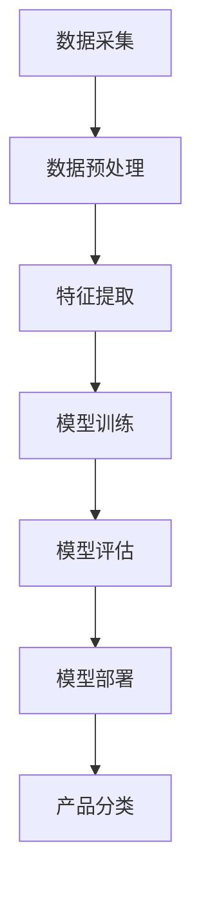
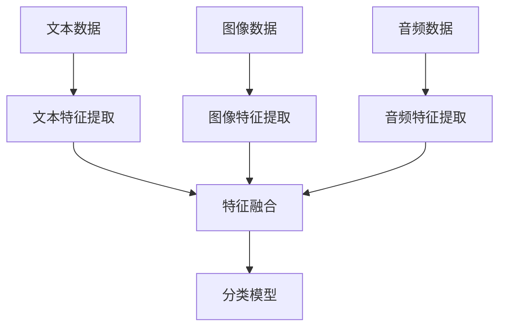

                 

### 文章标题：大模型驱动的智能产品分类系统

#### 关键词：
- 大模型
- 智能产品分类
- 数据预处理
- 特征提取
- 分类算法
- 系统架构
- 实时性优化

#### 摘要：
本文详细探讨了基于大模型的智能产品分类系统的构建过程。文章首先介绍了大模型的概念及其在智能产品分类中的应用优势，接着阐述了数据预处理、特征提取和分类算法的基本原理。通过系统架构设计和开发环境搭建，本文展示了智能产品分类系统的实现流程。最后，通过对项目实战和系统性能优化的分析，本文提出了未来智能产品分类系统的优化方向和挑战解决方案。

### 目录大纲

# 《大模型驱动的智能产品分类系统》

## 第一部分：系统概述

### 第1章：大模型的崛起与影响
- 1.1 大模型的概念
- 1.2 大模型的发展历程
- 1.3 大模型的影响
- 1.4 大模型在智能产品分类中的应用

### 第2章：大模型基础
- 2.1 大模型的概念与类型
- 2.2 大模型的训练与优化
- 2.3 大模型的评估与调优

## 第二部分：智能产品分类原理

### 第3章：数据预处理与特征提取
- 3.1 数据收集与清洗
- 3.2 特征工程与特征提取
- 3.3 数据集划分与处理

### 第4章：分类算法概述
- 4.1 基本分类算法
- 4.2 进阶分类算法
- 4.3 分类算法比较与选择

### 第5章：大模型在分类中的应用
- 5.1 语言模型在分类中的应用
- 5.2 视觉模型在分类中的应用
- 5.3 多模态模型在分类中的应用

## 第三部分：系统设计与实现

### 第6章：系统架构设计
- 6.1 系统架构概述
- 6.2 数据流设计
- 6.3 模型集成与优化

### 第7章：开发环境搭建与工具使用
- 7.1 开发环境搭建
- 7.2 开发工具与库的使用
- 7.3 开发流程与规范

### 第8章：项目实战与案例分析
- 8.1 智能产品分类项目实战
- 8.2 案例分析
- 8.3 代码解读与分析

## 第四部分：系统优化与评估

### 第9章：系统性能优化
- 9.1 性能优化策略
- 9.2 模型压缩与加速
- 9.3 实时性与资源利用优化

### 第10章：系统评估与反馈
- 10.1 评估指标与方法
- 10.2 实际案例评估
- 10.3 用户反馈与迭代

### 第11章：未来展望与趋势
- 11.1 大模型在智能产品分类领域的未来发展趋势
- 11.2 技术挑战与解决方案
- 11.3 新型智能产品分类系统设计思路

## 附录

### 附录A：参考文献
- 参考文献

### 附录B：相关资源
- 相关资源链接

### 附录C：Mermaid 流程图
- Mermaid 流程图展示

### 附录D：代码示例
- 代码示例与解读

以上是《大模型驱动的智能产品分类系统》的目录大纲。每个章节将包含详细的伪代码、数学公式、项目实战和代码解读与分析，以帮助读者全面理解并应用大模型驱动的智能产品分类系统。

### 第1章：大模型的崛起与影响

#### 1.1 大模型的概念

大模型（Large-scale Model）是指参数规模巨大、训练数据量庞大的机器学习模型，如深度神经网络（Deep Neural Network，DNN）和变换器（Transformer）等。这些模型在自然语言处理、计算机视觉、语音识别等领域取得了显著的成果。

$$
\text{参数规模} \geq 10^8 \\
\text{训练数据量} \geq 10^6
$$

#### 1.2 大模型的发展历程

- 2012年：AlexNet的出现，标志着深度学习在图像识别领域的重要突破。
- 2017年：Google提出Transformer模型，成为自然语言处理领域的里程碑。
- 2018年：GPT-2的发布，使大型语言模型的应用变得普遍。

#### 1.3 大模型的影响

- **技术创新**：大模型推动了深度学习、自然语言处理等领域的技术进步。
- **产业变革**：大模型在智能客服、智能推荐、智能翻译等产业应用中发挥了重要作用。
- **社会影响**：大模型的应用改变了人们的生活方式，如智能语音助手、智能驾驶等。

#### 1.4 大模型在智能产品分类中的应用

大模型在智能产品分类中具有显著优势：

- **高效性**：大模型能够处理大量数据，快速进行分类。
- **准确性**：大模型能够捕捉数据中的复杂模式，提高分类准确性。
- **灵活性**：大模型可以适应不同的产品分类任务，具有较强的通用性。

### 图1：大模型驱动的智能产品分类流程



#### 1.4.1 数据采集

数据采集是智能产品分类系统的第一步，它决定了模型的性能和泛化能力。数据来源可以包括电商平台、社交媒体、用户评论等多个渠道。

- **电商平台数据**：包含产品名称、描述、价格、销量等信息。
- **社交媒体数据**：包含用户发布的产品图片、视频、评论等信息。
- **用户评论数据**：包含用户对产品的评价、评论内容等。

#### 1.4.2 数据预处理

数据预处理是确保数据质量和可用的关键步骤，包括数据清洗、去重、填充缺失值等。

- **数据清洗**：去除无效数据、噪声数据、异常值等。
- **去重**：去除重复的数据项，防止模型过拟合。
- **填充缺失值**：使用合适的策略填充缺失值，如平均值、中位数、插值等。

#### 1.4.3 特征提取

特征提取是将原始数据转换为模型可以处理的形式，包括文本特征、图像特征、时间序列特征等。

- **文本特征**：使用词袋模型（Bag of Words，BOW）、TF-IDF、词嵌入（Word Embedding）等方法提取文本特征。
- **图像特征**：使用卷积神经网络（CNN）提取图像特征，如边缘、纹理、形状等。
- **时间序列特征**：提取时间序列中的周期性、趋势性等特征。

#### 1.4.4 模型训练

模型训练是构建智能产品分类系统的核心步骤，使用大量预处理后的数据进行训练。

- **模型选择**：选择合适的模型，如变换器（Transformer）模型、卷积神经网络（CNN）等。
- **训练过程**：使用训练数据对模型进行训练，通过反向传播算法更新模型参数。
- **超参数调优**：调整学习率、批量大小、正则化参数等超参数，以优化模型性能。

#### 1.4.5 模型评估

模型评估是验证模型性能和选择最佳模型的关键步骤。

- **评估指标**：使用准确率、召回率、F1分数等指标评估模型性能。
- **交叉验证**：使用交叉验证方法，避免过拟合，确保模型泛化能力。
- **评估集划分**：将数据集划分为训练集、验证集和测试集，用于模型训练、调优和评估。

#### 1.4.6 模型部署

模型部署是将训练好的模型应用到实际产品分类任务中。

- **部署环境**：选择合适的部署环境，如服务器、云平台等。
- **模型优化**：对模型进行压缩、量化等优化，以提高部署效率和降低计算成本。
- **实时性优化**：针对实时性要求，对模型进行加速，如模型蒸馏、模型分割等。

#### 1.4.7 用户反馈与迭代

用户反馈是智能产品分类系统不断优化和迭代的重要环节。

- **用户反馈收集**：收集用户对产品分类结果的反馈，包括准确性、响应速度等。
- **模型优化**：根据用户反馈，对模型进行调整和优化，提高分类性能。
- **持续迭代**：定期评估系统性能，持续优化，以适应不断变化的市场需求。

### 总结

大模型驱动的智能产品分类系统是一个复杂且高效的系统，它通过数据采集、预处理、特征提取、模型训练、评估和部署等步骤，实现了对大量产品的高效分类。随着人工智能技术的不断进步，大模型在智能产品分类中的应用将越来越广泛，为产业升级和社会发展提供强大的支持。

接下来，我们将详细探讨大模型的基础知识，包括其概念、类型、训练与优化方法，以及评估与调优策略。

### 第2章：大模型基础

#### 2.1 大模型的概念与类型

大模型（Large-scale Model）是指具有大量参数和复杂结构的机器学习模型，通常用于处理大规模数据集和高维特征。大模型在深度学习、自然语言处理、计算机视觉等领域具有广泛的应用。以下是几种常见的大模型类型：

1. **深度神经网络（Deep Neural Network，DNN）**：
   - 特点：多层神经元结构，能够捕捉数据的复杂非线性关系。
   - 应用：图像识别、语音识别、推荐系统等。

2. **循环神经网络（Recurrent Neural Network，RNN）**：
   - 特点：具有时间序列建模能力，能够处理序列数据。
   - 应用：时间序列预测、自然语言处理、语音识别等。

3. **变换器（Transformer）**：
   - 特点：基于注意力机制，能够处理长文本和长序列数据。
   - 应用：自然语言处理、机器翻译、文本生成等。

4. **生成对抗网络（Generative Adversarial Network，GAN）**：
   - 特点：由生成器和判别器组成，能够生成逼真的数据。
   - 应用：图像生成、语音生成、数据增强等。

#### 2.2 大模型的训练与优化

大模型的训练与优化是构建高效智能产品分类系统的关键步骤。以下是训练与优化的一些关键点：

1. **数据准备**：
   - 数据清洗：去除噪声和异常值，确保数据质量。
   - 数据增强：通过旋转、缩放、裁剪等操作增加数据多样性。
   - 数据分割：将数据集划分为训练集、验证集和测试集。

2. **模型初始化**：
   - 选择合适的模型结构，如DNN、RNN、Transformer等。
   - 初始化模型参数，可以使用随机初始化或预训练模型。

3. **损失函数与优化器**：
   - 选择合适的损失函数，如均方误差（MSE）、交叉熵等。
   - 选择合适的优化器，如SGD、Adam等。

4. **训练过程**：
   - 前向传播：计算模型输出与真实值的误差。
   - 反向传播：更新模型参数，减小误差。
   - 调整学习率：避免模型过拟合。

5. **模型评估**：
   - 使用验证集评估模型性能，选择最佳模型。
   - 使用测试集评估模型泛化能力。

6. **超参数调优**：
   - 调整学习率、批量大小、正则化参数等，优化模型性能。

#### 2.3 大模型的评估与调优

大模型的评估与调优是确保模型在实际应用中表现优异的关键步骤。以下是评估与调优的一些关键点：

1. **评估指标**：
   - **准确率**：模型正确分类的比例。
   - **召回率**：模型能够召回的真实正例比例。
   - **F1分数**：准确率和召回率的调和平均。

2. **性能调优**：
   - **超参数调整**：调整学习率、批量大小、正则化参数等，以优化模型性能。
   - **模型集成**：结合多个模型的预测结果，提高分类性能。

3. **误差分析**：
   - 分析模型在训练集和验证集上的误差，找出潜在的优化方向。

#### 2.4 伪代码示例：大模型训练过程

```python
# 大模型训练伪代码

# 初始化模型
model = initialize_model()

# 准备训练数据
train_data = prepare_data(train_dataset)

# 定义优化器
optimizer = select_optimizer()

# 训练模型
for epoch in range(num_epochs):
    for batch in train_data:
        # 前向传播
        logits = model(batch.input)
        # 计算损失
        loss = compute_loss(logits, batch.label)
        # 反向传播
        optimizer.zero_grad()
        loss.backward()
        optimizer.step()
        
    # 每个epoch后的评估
    evaluate(model, validation_dataset)
```

#### 2.5 数学公式与解释

在训练大模型时，我们经常使用以下数学公式：

1. **损失函数**：
   \[ L(\theta) = -\frac{1}{m} \sum_{i=1}^{m} [y_i \cdot \log(a^{(l)}_i) + (1 - y_i) \cdot \log(1 - a^{(l)}_i)] \]
   - 解释：损失函数用于衡量模型预测输出与真实标签之间的差距。

2. **优化器更新**：
   \[ \theta = \theta - \alpha \cdot \nabla_{\theta} L(\theta) \]
   - 解释：优化器通过梯度下降更新模型参数，以最小化损失函数。

3. **激活函数**：
   \[ a^{(l)}_i = \sigma(z^{(l)}_i) \]
   - 解释：激活函数（如Sigmoid、ReLU）用于引入非线性，提高模型表达能力。

通过以上内容，我们了解了大模型的概念、类型、训练与优化方法，以及评估与调优策略。接下来，我们将深入探讨智能产品分类中的数据预处理与特征提取。

### 第3章：数据预处理与特征提取

#### 3.1 数据预处理

数据预处理是构建高效智能产品分类系统的重要步骤。通过数据预处理，我们可以提高数据质量，减少噪声，增强数据的可用性。以下是数据预处理的主要任务：

1. **数据清洗**：

数据清洗是预处理的第一步，目的是去除噪声和异常值。以下是一些常用的数据清洗方法：

- **缺失值处理**：使用平均值、中位数、最大值、最小值或插值法填充缺失值。
- **异常值检测**：使用统计方法（如IQR、Z-score）或机器学习方法（如孤立森林）检测并处理异常值。
- **重复值删除**：删除重复的数据记录，以避免模型过拟合。

2. **数据标准化**：

数据标准化是将不同特征缩放到相同的范围，以便模型能够更好地学习。以下是一些常用的数据标准化方法：

- **最小-最大标准化**：
  \[ x_{\text{norm}} = \frac{x - x_{\text{min}}}{x_{\text{max}} - x_{\text{min}}} \]
- **零-均值标准化**：
  \[ x_{\text{norm}} = \frac{x - \mu}{\sigma} \]
  其中，\( \mu \) 和 \( \sigma \) 分别为特征的均值和标准差。

3. **数据增强**：

数据增强是通过引入变化增加数据多样性，从而提高模型泛化能力。以下是一些常用的数据增强方法：

- **随机旋转、缩放、裁剪**：对图像或文本数据进行随机旋转、缩放、裁剪，增加数据的多样性。
- **合成数据生成**：使用生成对抗网络（GAN）生成新的数据样本，增加训练数据的规模。

#### 3.2 特征提取

特征提取是将原始数据转换为模型可以处理的形式，以提高模型的分类性能。以下是几种常见的特征提取方法：

1. **文本特征提取**：

- **词袋模型（Bag of Words，BOW）**：将文本表示为一个向量，每个维度表示一个词的出现次数。

- **TF-IDF（Term Frequency-Inverse Document Frequency）**：考虑词的重要程度，通过词频和逆文档频率计算词的权重。

- **词嵌入（Word Embedding）**：将词转换为密集向量的表示，常用的词嵌入方法有Word2Vec、GloVe等。

2. **图像特征提取**：

- **传统特征**：如HOG（Histogram of Oriented Gradients）、SIFT（Scale-Invariant Feature Transform）等，用于提取图像的局部特征。

- **深度特征**：使用卷积神经网络（CNN）提取图像的深层特征，如VGG、ResNet等。

3. **时间序列特征提取**：

- **时域特征**：如均值、方差、偏度、峰度等，用于描述时间序列的统计特征。

- **频域特征**：如傅里叶变换（Fourier Transform）和小波变换（Wavelet Transform），用于描述时间序列的频域特征。

#### 3.3 数据集划分与处理

数据集的划分与处理是确保模型训练和评估效果的关键。以下是数据集划分与处理的一些关键点：

1. **数据集划分**：

数据集通常划分为训练集、验证集和测试集，用于模型训练、调优和评估。

- **训练集**：用于模型训练，占数据集的60%-80%。
- **验证集**：用于模型调优，占数据集的10%-20%。
- **测试集**：用于模型评估，占数据集的10%。

2. **数据集处理**：

- **批量处理**：将数据集划分为批量，以便模型训练。
- **交叉验证**：使用交叉验证方法，如K折交叉验证，提高模型泛化能力。

#### 3.4 伪代码示例：数据预处理与特征提取

```python
# 数据预处理与特征提取伪代码

# 数据清洗
def clean_data(data):
    # 去除缺失值
    data = remove_missing_values(data)
    # 去除异常值
    data = remove_outliers(data)
    # 删除重复值
    data = remove_duplicates(data)
    return data

# 数据标准化
def normalize_data(data):
    # 对每个特征进行最小-最大标准化
    data = min_max_normalize(data)
    return data

# 数据增强
def augment_data(data):
    # 对图像进行随机旋转、缩放、裁剪
    data = random_rotate_scale_crop(data)
    return data

# 文本特征提取
def extract_text_features(texts):
    # 使用TF-IDF提取文本特征
    vectorizer = TfidfVectorizer(max_features=1000)
    features = vectorizer.fit_transform(texts)
    return features

# 图像特征提取
def extract_image_features(images):
    # 使用卷积神经网络提取图像特征
    model = CNN_Model()
    features = model.predict(images)
    return features

# 时间序列特征提取
def extract_time_series_features(time_series):
    # 提取时域特征
    features = extract_time_domain_features(time_series)
    # 提取频域特征
    features = extract_frequency_domain_features(time_series)
    return features

# 数据集划分
def split_dataset(data, train_ratio, val_ratio):
    train_data, validation_data = train_test_split(data, train_size=train_ratio, val_size=val_ratio)
    return train_data, validation_data
```

#### 3.5 数学公式与解释

在数据预处理与特征提取过程中，我们经常使用以下数学公式：

1. **最小-最大标准化**：

   \[ x_{\text{norm}} = \frac{x - x_{\text{min}}}{x_{\text{max}} - x_{\text{min}}} \]

   - 解释：将特征值缩放到[0, 1]范围。

2. **词嵌入**：

   \[ \text{word\_embedding}(w) = \text{ Embedding}(w) \]

   - 解释：将词转换为高维向量表示。

3. **卷积神经网络**：

   \[ h^{(l)} = \sigma(W^{(l)} \cdot h^{(l-1)} + b^{(l)}) \]

   - 解释：卷积神经网络中的卷积操作和激活函数。

通过以上内容，我们了解了数据预处理与特征提取的重要性及其具体方法。接下来，我们将详细讨论分类算法的概述，包括基本分类算法和进阶分类算法。

### 第4章：分类算法概述

#### 4.1 基本分类算法

基本分类算法是构建智能产品分类系统的基础，它们具有简单、易于实现的特点。以下是几种常见的基本分类算法：

1. **逻辑回归（Logistic Regression）**

   逻辑回归是一种基于概率模型的分类算法，用于预测二分类问题。逻辑回归模型通过求解最大似然估计（Maximum Likelihood Estimation，MLE）来估计模型参数，其目标函数为：

   \[ \ell(\theta) = -\sum_{i=1}^{m} [y_i \cdot \log(p_i) + (1 - y_i) \cdot \log(1 - p_i)] \]

   其中，\( p_i = \sigma(\theta^T \cdot x_i) \)，\( \sigma \) 是Sigmoid函数。

   - **优点**：简单、易于解释。
   - **缺点**：适用于线性关系，对非线性数据的分类能力有限。

2. **决策树（Decision Tree）**

   决策树是一种基于树结构的分类算法，通过一系列的规则将数据划分为不同的类别。决策树通过递归划分特征，使得每个节点都具有纯度最高的类别。

   - **优点**：易于理解、可解释性强。
   - **缺点**：容易过拟合、决策树深度受限。

3. **随机森林（Random Forest）**

   随机森林是一种集成学习方法，由多个决策树组成，通过随机选择特征和样本子集构建多个决策树，然后对它们的预测结果进行投票。

   - **优点**：提高分类准确性、增强泛化能力。
   - **缺点**：计算量大、复杂度较高。

4. **支持向量机（Support Vector Machine，SVM）**

   支持向量机是一种基于间隔最大化原则的分类算法，通过求解二次规划问题来寻找最优分类边界。SVM使用核函数将数据映射到高维空间，以便找到线性可分的最优边界。

   - **优点**：理论依据强、分类效果好。
   - **缺点**：对大规模数据集计算量大、参数选择复杂。

#### 4.2 进阶分类算法

进阶分类算法在处理复杂任务时具有更好的性能，它们通常利用深度学习和机器学习技术。以下是几种常见的进阶分类算法：

1. **K最近邻（K-Nearest Neighbors，KNN）**

   K最近邻是一种基于实例的学习方法，通过计算测试样本与训练样本之间的距离，选择最近的K个样本进行投票。

   - **优点**：简单、易于实现。
   - **缺点**：计算复杂度高、对噪声敏感。

2. **朴素贝叶斯（Naive Bayes）**

   朴素贝叶斯是一种基于概率模型的分类算法，通过计算样本属于各个类别的概率，选择概率最大的类别。

   - **优点**：基于概率模型、计算效率高。
   - **缺点**：假设特征之间相互独立、对极端值敏感。

3. **神经网络（Neural Networks）**

   神经网络是一种模拟生物神经系统的计算模型，通过多层次的神经网络结构来学习数据中的复杂模式。

   - **优点**：强大的非线性拟合能力、适用于复杂任务。
   - **缺点**：需要大量训练数据、参数选择复杂。

4. **变换器（Transformer）**

   变换器是一种基于自注意力机制的深度学习模型，通过计算序列中每个元素之间的注意力权重来提取特征。

   - **优点**：处理长文本、长序列数据能力强、效果好。
   - **缺点**：计算复杂度高、对硬件资源要求高。

#### 4.3 分类算法比较与选择

在构建智能产品分类系统时，选择合适的分类算法至关重要。以下是几种分类算法的比较与选择策略：

1. **算法比较**

   - **准确率**：评估模型在训练集和验证集上的分类准确率。
   - **计算复杂度**：评估模型训练和预测的时间复杂度。
   - **可解释性**：评估模型的可解释性，便于理解模型决策过程。

2. **选择策略**

   - **数据集特点**：根据数据集的规模、特征类型和分布选择合适的算法。
   - **任务需求**：根据分类任务的需求，如准确性、实时性等，选择合适的算法。
   - **计算资源**：根据可用计算资源，选择计算复杂度较低的算法。

#### 4.4 伪代码示例：分类算法选择

```python
# 分类算法选择伪代码

# 准备数据集
train_data, validation_data = prepare_data()

# 选择分类算法
algorithm = select_algorithm(train_data, validation_data)

# 训练模型
model = train_model(algorithm, train_data)

# 评估模型
evaluate_model(model, validation_data)
```

通过以上内容，我们了解了基本分类算法和进阶分类算法的概念、特点及其比较与选择策略。接下来，我们将探讨大模型在分类中的应用，包括语言模型、视觉模型和多模态模型。

### 第5章：大模型在分类中的应用

#### 5.1 语言模型在分类中的应用

语言模型（Language Model，LM）是自然语言处理（Natural Language Processing，NLP）领域的重要模型，它在文本分类任务中具有广泛应用。以下是语言模型在文本分类中的应用：

1. **模型介绍**

   语言模型是一种用于预测下一个单词或字符的概率分布的模型，通常基于统计方法或深度学习方法。在NLP领域，常用的语言模型包括n-gram模型、循环神经网络（RNN）语言模型和变换器（Transformer）语言模型。

2. **应用场景**

   - **文本分类**：将文本数据分类到预定义的类别中，如情感分析、主题分类等。
   - **文本生成**：根据给定文本生成相关文本，如自动摘要、聊天机器人等。
   - **文本纠错**：纠正拼写错误、语法错误等，提高文本质量。

3. **效果优势**

   - **强大表达能力**：语言模型能够捕捉文本的语义和上下文信息，提高分类准确性。
   - **多语言支持**：变换器语言模型支持多语言处理，适用于跨语言分类任务。

#### 5.2 视觉模型在分类中的应用

视觉模型（Vision Model）是计算机视觉（Computer Vision，CV）领域的重要模型，它在图像分类任务中具有广泛应用。以下是视觉模型在图像分类中的应用：

1. **模型介绍**

   视觉模型是一种用于处理图像数据的神经网络模型，如卷积神经网络（CNN）和变换器（Transformer）模型。视觉模型能够提取图像的深层特征，用于图像分类、目标检测、图像分割等任务。

2. **应用场景**

   - **图像分类**：将图像分类到预定义的类别中，如人脸识别、物体识别等。
   - **目标检测**：检测图像中的特定目标，并标注其位置。
   - **图像分割**：将图像分割成不同的区域，用于图像编辑、图像理解等。

3. **效果优势**

   - **高效特征提取**：视觉模型能够提取图像的深层特征，提高分类准确性。
   - **多尺度处理**：视觉模型能够处理不同尺度的图像，提高模型的鲁棒性。

#### 5.3 多模态模型在分类中的应用

多模态模型（Multimodal Model）是融合多种类型数据（如文本、图像、音频等）的模型，它在分类任务中具有广泛应用。以下是多模态模型在分类中的应用：

1. **模型介绍**

   多模态模型能够同时处理多种类型的数据，通过融合不同模态的特征，提高分类性能。多模态模型包括基于变换器架构的多模态模型、融合神经网络模型等。

2. **应用场景**

   - **多模态文本分类**：融合文本和图像特征，进行多模态分类任务，如新闻分类、情感分析等。
   - **多模态图像分类**：融合图像和音频特征，进行多模态分类任务，如音乐视频分类、电影分类等。
   - **多模态语音分类**：融合文本和语音特征，进行多模态分类任务，如语音情感分析、语音识别等。

3. **效果优势**

   - **特征融合**：多模态模型能够融合不同模态的特征，提高分类性能。
   - **多角度分析**：多模态模型能够从不同角度分析数据，提高分类准确性。

### 图1：多模态模型在分类中的架构



#### 5.4 语言模型在文本分类中的应用

语言模型在文本分类中的应用主要包括以下几个方面：

1. **词嵌入**：将文本数据转换为密集向量表示，如Word2Vec、GloVe等。

2. **上下文感知**：通过变换器模型，如BERT、GPT等，捕捉文本的上下文信息。

3. **分类任务**：将语言模型应用于文本分类任务，如情感分析、主题分类等。

4. **效果优势**：语言模型能够捕捉文本的语义和上下文信息，提高分类准确性。

#### 5.5 视觉模型在图像分类中的应用

视觉模型在图像分类中的应用主要包括以下几个方面：

1. **特征提取**：使用卷积神经网络（CNN）提取图像的深层特征。

2. **分类任务**：将视觉模型应用于图像分类任务，如物体识别、人脸识别等。

3. **效果优势**：视觉模型能够提取图像的深层特征，提高分类准确性。

4. **多尺度处理**：视觉模型能够处理不同尺度的图像，提高模型的鲁棒性。

#### 5.6 多模态模型在分类中的应用

多模态模型在分类中的应用主要包括以下几个方面：

1. **特征融合**：将不同模态的数据（如文本、图像、音频）进行特征融合。

2. **分类任务**：将多模态模型应用于分类任务，如多模态文本分类、多模态图像分类等。

3. **效果优势**：多模态模型能够融合不同模态的特征，提高分类性能。

4. **多角度分析**：多模态模型能够从不同角度分析数据，提高分类准确性。

通过以上内容，我们了解了大模型在分类中的应用，包括语言模型、视觉模型和多模态模型。接下来，我们将探讨系统架构设计，包括系统架构概述、数据流设计、模型集成与优化。

### 第6章：系统架构设计

#### 6.1 系统架构概述

智能产品分类系统的架构设计是确保系统高效、稳定运行的关键。系统架构设计主要包括以下层次：

1

