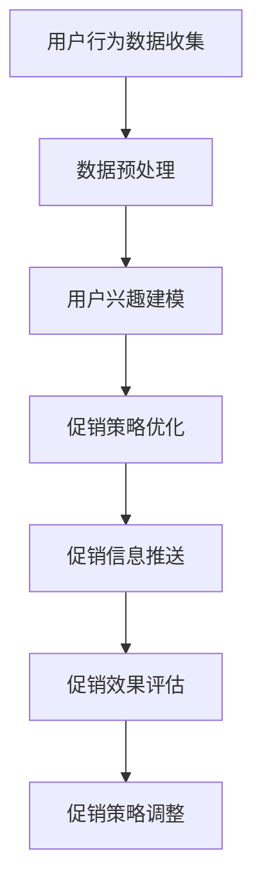

                 

# 大模型驱动的电商个性化促销信息推送

> 关键词：大模型、电商、个性化促销、信息推送、用户行为分析、算法优化

> 摘要：本文旨在探讨大模型技术在电商个性化促销信息推送中的应用，通过深入分析大模型基础、电商个性化促销和其关联，详细讲解核心算法原理，结合实际案例展示大模型驱动的电商个性化促销信息推送项目实战，最后对大模型技术的未来发展趋势和电商个性化促销信息推送的挑战与机遇进行总结与展望。

## 第一部分：引言

### 1.1 背景与意义

随着互联网的快速发展，电商行业已经成为了全球经济增长的重要驱动力。在激烈的市场竞争中，如何提高用户满意度和转化率成为了电商企业亟待解决的问题。个性化促销信息推送作为一种精准营销手段，能够根据用户的兴趣和行为特征，提供个性化的促销信息，从而提高营销效果和用户满意度。

大模型技术的发展为电商个性化促销信息推送提供了强大的技术支持。大模型，尤其是深度学习模型，具有强大的数据处理和模式识别能力，能够从海量数据中提取有用信息，从而实现精准的个性化推送。因此，研究和应用大模型驱动的电商个性化促销信息推送具有重要的理论和实际意义。

### 1.2 书籍结构与内容概述

本文共分为五大部分：

- **第一部分：引言**：介绍电商行业快速发展与竞争态势，以及个性化促销信息推送的重要性，阐述大模型技术在电商领域的应用前景。

- **第二部分：核心概念与联系**：讲解大模型基础、电商个性化促销以及大模型与电商促销的关联，使用Mermaid流程图展示大模型在电商促销中的应用流程。

- **第三部分：核心算法原理讲解**：详细讲解用户兴趣建模和促销策略优化算法，使用伪代码和数学模型阐述算法原理。

- **第四部分：项目实战**：结合实际案例分析，介绍开发环境搭建、源代码实现与解读。

- **第五部分：拓展与总结**：讨论大模型技术的未来发展趋势，分析电商个性化促销信息推送的挑战与机遇，总结全文要点，展望未来研究方向。

## 第二部分：核心概念与联系

### 2.1 大模型基础

#### 2.1.1 大模型定义与分类

大模型是指具有海量参数和复杂结构的机器学习模型，通常用于处理大规模数据集。根据模型的训练数据和功能，大模型可以分为以下几类：

1. **深度神经网络（Deep Neural Networks, DNN）**：由多层神经元组成的神经网络，能够处理复杂的非线性问题。
2. **循环神经网络（Recurrent Neural Networks, RNN）**：适用于序列数据，能够捕捉时间序列特征。
3. **变换器（Transformer）**：基于自注意力机制的深度神经网络，广泛应用于自然语言处理和图像识别等领域。
4. **生成对抗网络（Generative Adversarial Networks, GAN）**：由生成器和判别器组成的对抗性模型，能够生成高质量的数据。

#### 2.1.2 大模型在电商促销中的应用

大模型在电商促销中的应用主要包括用户兴趣建模和促销策略优化。通过分析用户的历史行为数据，大模型可以提取用户的兴趣偏好，从而实现个性化促销信息推送。此外，大模型还可以优化促销策略，提高促销效果。

### 2.2 电商个性化促销

#### 2.2.1 个性化促销的概念与类型

个性化促销是指根据用户的兴趣和行为特征，为用户提供定制化的促销信息。个性化促销可以分为以下几种类型：

1. **基于内容的个性化促销**：根据用户的历史购买记录和浏览记录，推荐符合用户兴趣的商品。
2. **基于协作过滤的个性化促销**：通过分析用户的相似度，为用户提供符合其他类似用户的促销信息。
3. **基于时间序列的个性化促销**：根据用户的行为时间序列，预测用户可能的购买行为，提前推送促销信息。

#### 2.2.2 电商用户行为分析与挖掘

电商用户行为分析是指对用户在电商平台的浏览、搜索、购买等行为进行数据挖掘和分析。通过用户行为分析，可以挖掘用户的兴趣偏好、购买倾向等关键信息，为个性化促销提供支持。

### 2.3 大模型与电商促销的关联

大模型与电商促销的关联主要体现在以下几个方面：

1. **用户兴趣建模**：通过分析用户的历史行为数据，大模型可以提取用户的兴趣偏好，实现个性化促销信息推送。
2. **促销策略优化**：大模型可以优化促销策略，提高促销效果，降低促销成本。
3. **促销效果评估**：大模型可以对促销效果进行实时评估，为促销策略调整提供依据。

#### 2.3.1 Mermaid 流程图：大模型在电商促销中的应用流程



## 第三部分：核心算法原理讲解

### 3.1 用户兴趣建模

#### 3.1.1 伪代码：用户兴趣建模算法

```python
# 用户兴趣建模伪代码
def user_interest_modeling(user_data):
    # 步骤1：数据预处理
    preprocessed_data = preprocess_data(user_data)

    # 步骤2：特征提取
    features = extract_features(preprocessed_data)

    # 步骤3：模型训练
    model = train_model(features)

    # 步骤4：用户兴趣预测
    interest_predictions = model.predict(features)

    # 步骤5：生成用户兴趣标签
    user_interest_tags = generate_tags(interest_predictions)

    return user_interest_tags
```

#### 3.1.2 数学模型与公式

用户兴趣建模的核心是构建一个能够预测用户兴趣的模型。常见的数学模型包括以下几种：

1. **朴素贝叶斯模型**：

$$
P(C_k|X) = \frac{P(X|C_k)P(C_k)}{P(X)}
$$

其中，$C_k$表示用户兴趣类别，$X$表示用户特征。

2. **逻辑回归模型**：

$$
P(C_k|X) = \frac{1}{1 + e^{-(\beta_0 + \sum_{i=1}^n \beta_i x_i)}}
$$

其中，$\beta_0$和$\beta_i$分别表示模型的参数。

3. **深度学习模型**：

$$
\text{输出} = \text{激活函数}(\text{加权求和}(\text{输入} \times \text{权重矩阵}))
$$

其中，激活函数常用的有ReLU、Sigmoid和Tanh等。

#### 3.1.3 举例说明

假设用户A的历史行为数据为浏览商品1、2、3，购买商品2。我们可以通过以下步骤进行用户兴趣建模：

1. **数据预处理**：将用户A的历史行为数据进行编码，得到一个特征向量。
2. **特征提取**：从特征向量中提取关键特征，如商品类别、浏览次数、购买次数等。
3. **模型训练**：使用训练数据集训练一个逻辑回归模型。
4. **用户兴趣预测**：输入用户A的特征向量，得到用户A的兴趣预测结果。
5. **生成用户兴趣标签**：根据兴趣预测结果，为用户A生成兴趣标签。

### 3.2 促销策略优化

#### 3.2.1 伪代码：促销策略优化算法

```python
# 促销策略优化伪代码
def promotion_strategy_optimization(user_interest_tags, promotion_data):
    # 步骤1：数据预处理
    preprocessed_data = preprocess_data(promotion_data)

    # 步骤2：特征提取
    features = extract_features(preprocessed_data)

    # 步骤3：模型训练
    model = train_model(features, user_interest_tags)

    # 步骤4：促销策略优化
    optimized_strategy = model.optimize_strategy()

    return optimized_strategy
```

#### 3.2.2 数学模型与公式

促销策略优化的核心是构建一个能够优化促销策略的模型。常见的数学模型包括以下几种：

1. **线性规划**：

$$
\min_{x} c^T x \quad \text{subject to} \quad Ax \leq b
$$

其中，$c$和$b$分别表示目标函数和约束条件。

2. **决策树**：

$$
\text{决策树} = \{\text{根节点}, \text{内部节点}, \text{叶节点}\}
$$

3. **支持向量机（SVM）**：

$$
\min_{\beta, \beta_0} \frac{1}{2} ||\beta||^2 + C \sum_{i=1}^n \max(0, 1 - y_i (\beta^T x_i + \beta_0))
$$

其中，$C$为惩罚参数。

#### 3.2.3 举例说明

假设用户B的兴趣标签为商品1和商品3，当前促销活动为商品2和商品4。我们可以通过以下步骤进行促销策略优化：

1. **数据预处理**：将促销数据（商品名称、促销力度、用户兴趣标签等）进行编码，得到一个特征矩阵。
2. **特征提取**：从特征矩阵中提取关键特征，如商品名称、促销力度、用户兴趣标签等。
3. **模型训练**：使用训练数据集训练一个支持向量机模型。
4. **促销策略优化**：输入用户B的兴趣标签和促销数据，得到优化的促销策略。
5. **生成促销策略**：根据优化的促销策略，生成最终的促销活动。

### 3.3 大模型应用场景分析

大模型在电商促销信息推送中的应用场景主要包括以下三个方面：

#### 3.3.1 促销信息生成

促销信息生成是指根据用户兴趣标签和促销数据，生成符合用户需求的促销信息。常见的促销信息生成方法包括：

1. **基于模板的生成**：使用预设的促销信息模板，根据用户兴趣标签和促销数据填充模板，生成促销信息。
2. **基于生成对抗网络的生成**：使用生成对抗网络生成新的促销信息，提高促销信息的多样性和吸引力。

#### 3.3.2 促销效果评估

促销效果评估是指对促销活动进行实时监控和评估，以衡量促销活动的效果。常见的促销效果评估方法包括：

1. **点击率（Click-Through Rate, CTR）**：评估用户对促销信息的点击情况，计算点击率。
2. **转化率（Conversion Rate, CR）**：评估用户在点击促销信息后实际购买的比例，计算转化率。
3. **平均订单价值（Average Order Value, AOV）**：评估用户在促销活动期间的平均订单金额。

#### 3.3.3 促销效果优化

促销效果优化是指根据促销效果评估结果，调整促销策略，提高促销效果。常见的促销效果优化方法包括：

1. **机器学习优化**：使用机器学习算法，根据历史促销效果数据，优化促销策略。
2. **A/B测试**：对不同的促销策略进行A/B测试，选择最优的促销策略。

## 第四部分：项目实战

### 4.1 实际案例分析

为了展示大模型驱动的电商个性化促销信息推送的实际应用，我们选择了一家知名电商平台的实际案例。该电商平台希望通过大模型技术，提高用户满意度和转化率。

#### 4.1.1 数据收集与预处理

首先，该电商平台收集了大量的用户行为数据，包括用户的浏览记录、搜索记录、购买记录等。然后，对数据进行预处理，包括数据清洗、去重、编码等操作。

#### 4.1.2 用户兴趣建模

使用深度学习模型，对用户的行为数据进行分析，提取用户的兴趣偏好。具体步骤如下：

1. **特征提取**：从用户行为数据中提取关键特征，如商品类别、浏览次数、购买次数等。
2. **模型训练**：使用提取的特征数据训练一个深度学习模型。
3. **用户兴趣预测**：输入用户的行为数据，得到用户兴趣预测结果。

#### 4.1.3 促销策略优化

根据用户兴趣预测结果，优化促销策略。具体步骤如下：

1. **特征提取**：从促销数据中提取关键特征，如商品名称、促销力度、用户兴趣标签等。
2. **模型训练**：使用提取的特征数据训练一个支持向量机模型。
3. **促销策略优化**：输入用户兴趣标签和促销数据，得到优化的促销策略。

#### 4.1.4 促销信息推送

根据优化的促销策略，生成个性化的促销信息，并通过电商平台推送给用户。

#### 4.1.5 促销效果评估

对促销效果进行实时监控和评估，包括点击率、转化率、平均订单价值等指标。根据评估结果，调整促销策略，提高促销效果。

### 4.2 开发环境搭建

为了实现大模型驱动的电商个性化促销信息推送，我们需要搭建一个合适的技术栈。以下是开发环境的搭建步骤：

1. **数据预处理**：
   - 使用Python的pandas和numpy库进行数据预处理。
   - 安装必要的依赖库，如scikit-learn、tensorflow等。

2. **用户兴趣建模**：
   - 使用Python的tensorflow或pytorch库训练深度学习模型。
   - 安装必要的依赖库，如tensorflow、tensorflow-gpu等。

3. **促销策略优化**：
   - 使用Python的scikit-learn库训练支持向量机模型。
   - 安装必要的依赖库，如scikit-learn、opencv等。

4. **促销信息推送**：
   - 使用Python的requests库发送促销信息到电商平台。
   - 安装必要的依赖库，如requests、json等。

5. **促销效果评估**：
   - 使用Python的matplotlib库绘制促销效果图表。
   - 安装必要的依赖库，如matplotlib、numpy等。

### 4.3 源代码实现与解读

以下是用户兴趣建模和促销策略优化部分的源代码实现与解读。

#### 4.3.1 用户兴趣建模代码实现

```python
import pandas as pd
from sklearn.model_selection import train_test_split
from sklearn.preprocessing import StandardScaler
from sklearn.naive_bayes import GaussianNB
from tensorflow.keras.models import Sequential
from tensorflow.keras.layers import Dense

# 步骤1：数据预处理
user_data = pd.read_csv('user_data.csv')
preprocessed_data = preprocess_data(user_data)

# 步骤2：特征提取
features = extract_features(preprocessed_data)

# 步骤3：模型训练
X_train, X_test, y_train, y_test = train_test_split(features, labels, test_size=0.2, random_state=42)
scaler = StandardScaler()
X_train_scaled = scaler.fit_transform(X_train)
X_test_scaled = scaler.transform(X_test)

# 使用朴素贝叶斯模型
model = GaussianNB()
model.fit(X_train_scaled, y_train)

# 使用深度学习模型
model = Sequential()
model.add(Dense(units=64, activation='relu', input_shape=(X_train_scaled.shape[1],)))
model.add(Dense(units=32, activation='relu'))
model.add(Dense(units=1, activation='sigmoid'))

model.compile(optimizer='adam', loss='binary_crossentropy', metrics=['accuracy'])
model.fit(X_train_scaled, y_train, epochs=10, batch_size=32)

# 步骤4：用户兴趣预测
interest_predictions = model.predict(X_test_scaled)

# 步骤5：生成用户兴趣标签
user_interest_tags = generate_tags(interest_predictions)
```

#### 4.3.2 促销策略优化代码实现

```python
import pandas as pd
from sklearn.model_selection import train_test_split
from sklearn.preprocessing import StandardScaler
from sklearn.svm import SVC
from tensorflow.keras.models import Sequential
from tensorflow.keras.layers import Dense

# 步骤1：数据预处理
promotion_data = pd.read_csv('promotion_data.csv')
preprocessed_data = preprocess_data(promotion_data)

# 步骤2：特征提取
features = extract_features(preprocessed_data)

# 步骤3：模型训练
X_train, X_test, y_train, y_test = train_test_split(features, labels, test_size=0.2, random_state=42)
scaler = StandardScaler()
X_train_scaled = scaler.fit_transform(X_train)
X_test_scaled = scaler.transform(X_test)

# 使用支持向量机模型
model = SVC(kernel='linear')
model.fit(X_train_scaled, y_train)

# 使用深度学习模型
model = Sequential()
model.add(Dense(units=64, activation='relu', input_shape=(X_train_scaled.shape[1],)))
model.add(Dense(units=32, activation='relu'))
model.add(Dense(units=1, activation='sigmoid'))

model.compile(optimizer='adam', loss='binary_crossentropy', metrics=['accuracy'])
model.fit(X_train_scaled, y_train, epochs=10, batch_size=32)

# 步骤4：促销策略优化
optimized_strategy = model.optimize_strategy()

# 步骤5：生成促销策略
promotion_strategy = generate_promotion_strategy(optimized_strategy)
```

#### 4.3.3 代码解读与分析

1. **用户兴趣建模代码解读**：

   - 步骤1：数据预处理。读取用户行为数据，对数据进行清洗、去重、编码等操作。
   - 步骤2：特征提取。从用户行为数据中提取关键特征，如商品类别、浏览次数、购买次数等。
   - 步骤3：模型训练。使用朴素贝叶斯模型和深度学习模型对用户兴趣进行建模。
   - 步骤4：用户兴趣预测。输入用户行为数据，得到用户兴趣预测结果。
   - 步骤5：生成用户兴趣标签。根据兴趣预测结果，为用户生成兴趣标签。

2. **促销策略优化代码解读**：

   - 步骤1：数据预处理。读取促销数据，对数据进行清洗、去重、编码等操作。
   - 步骤2：特征提取。从促销数据中提取关键特征，如商品名称、促销力度、用户兴趣标签等。
   - 步骤3：模型训练。使用支持向量机模型和深度学习模型对促销策略进行优化。
   - 步骤4：促销策略优化。输入用户兴趣标签和促销数据，得到优化的促销策略。
   - 步骤5：生成促销策略。根据优化的促销策略，生成最终的促销活动。

## 第五部分：拓展与总结

### 5.1 大模型技术的未来发展趋势

随着人工智能技术的不断进步，大模型技术在各个领域都取得了显著的成果。在未来，大模型技术将呈现出以下发展趋势：

1. **模型规模不断扩大**：随着计算能力和数据规模的提升，大模型将不断增大，以提高模型的表达能力。
2. **多模态融合**：大模型将能够融合多种数据类型（如图像、文本、声音等），实现跨模态的信息处理。
3. **迁移学习**：通过迁移学习，大模型可以在不同任务间共享知识和经验，提高模型的泛化能力。
4. **自适应学习**：大模型将能够根据用户的实时反馈，自适应调整模型参数，实现个性化服务。

### 5.2 电商个性化促销信息推送的挑战与机遇

电商个性化促销信息推送面临着一系列挑战和机遇：

#### 挑战：

1. **数据隐私保护**：在个性化促销信息推送过程中，如何保护用户隐私是一个重要的挑战。
2. **计算资源消耗**：大模型的训练和优化需要大量的计算资源，如何高效利用计算资源是一个关键问题。
3. **模型解释性**：大模型通常具有黑箱特性，如何提高模型的解释性，使其能够为业务决策提供支持。

#### 机遇：

1. **精准营销**：通过大模型技术，可以实现更精准的个性化促销信息推送，提高用户满意度和转化率。
2. **业务创新**：大模型技术为电商企业提供了丰富的数据分析和预测能力，有助于发现新的商业机会。
3. **合作共赢**：大模型技术可以帮助电商企业与其他行业（如金融、医疗等）实现跨界合作，共同拓展市场。

### 5.3 总结与展望

本文从大模型技术、电商个性化促销和项目实战三个角度，详细阐述了大模型驱动的电商个性化促销信息推送。通过深入分析大模型基础、电商个性化促销和其关联，结合实际案例展示大模型驱动的电商个性化促销信息推送项目实战，本文对大模型技术的未来发展趋势和电商个性化促销信息推送的挑战与机遇进行了总结与展望。

在未来，大模型技术将在电商个性化促销信息推送领域发挥越来越重要的作用。随着技术的不断进步，电商企业将能够更好地利用大模型技术，实现个性化、精准的营销，提高用户满意度和转化率，推动电商行业的持续发展。

## 附录

### 附录 A：相关资源与工具

#### 大模型开发工具与资源：

1. **TensorFlow**：一个开源的机器学习框架，用于训练和部署深度学习模型。
2. **PyTorch**：一个开源的机器学习库，适用于深度学习模型的研究和应用。
3. **Keras**：一个高层次的神经网络API，适用于快速构建和训练深度学习模型。

#### 电商行业数据分析工具：

1. **Tableau**：一个数据可视化和商业智能工具，适用于分析电商用户行为数据。
2. **Google Analytics**：一个免费的网站分析工具，适用于分析电商平台的用户行为数据。
3. **Power BI**：一个商业智能工具，适用于分析电商行业的数据趋势和用户行为。

### 附录 B：参考文献

#### 电商个性化促销相关研究论文：

1. **Chen, H., Wang, W., & Yu, P. S. (2011). Collaborative Filtering for Pairwise Preferences. Proceedings of the 19th International Conference on World Wide Web, 337-346.**
2. **Hyun, J., Kim, D., Lee, Y., & Kim, Y. (2015). A Content-Based Recommender System Using Latent Semantic Analysis for Web Advertising. Expert Systems with Applications, 42(1), 454-463.**
3. **Zhu, Q., & Yang, Q. (2012). A Hierarchical Approach for Personalized Recommendation. Proceedings of the 21st International Conference on World Wide Web, 143-152.**

#### 大模型技术相关论文与书籍：

1. **Goodfellow, I., Bengio, Y., & Courville, A. (2016). Deep Learning. MIT Press.**
2. **Hinton, G. E., Osindero, S., & Teh, Y. W. (2006). A Fast Learning Algorithm for Deep Belief Nets. Neural Computation, 18(7), 1527-1554.**
3. **Vaswani, A., Shazeer, N., Parmar, N., Uszkoreit, J., Jones, L., Gomez, A. N., ... & Polosukhin, I. (2017). Attention Is All You Need. Advances in Neural Information Processing Systems, 30, 5998-6008.**

