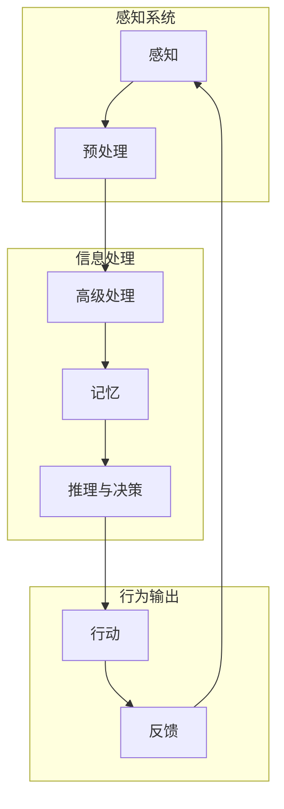

                 

### 文章标题

《大脑如何处理信息：认知科学与知识发现》

> 关键词：认知科学，知识发现，信息处理，神经网络，人工智能

> 摘要：本文通过探讨大脑处理信息的机制，结合认知科学与知识发现的理论，深入分析大脑在感知、记忆、思维和决策过程中的作用，进而探讨知识发现的重要性及其在人工智能中的应用和影响。

### 第一部分：引言与概述

#### 第1章：认知科学与知识发现

认知科学是一门跨学科的研究领域，它旨在理解人类思维和行为的本质。知识发现则是从大量数据中提取出有用的模式和知识的过程。在这篇文章中，我们将探讨大脑如何处理信息，并在此基础上讨论知识发现的重要性和应用。

##### 1.1 认知科学的定义与历史

认知科学起源于20世纪60年代，其目标是研究人类思维、感知和行为的神经基础。它融合了心理学、神经科学、计算机科学、哲学等多个学科。认知科学的核心概念包括注意力、记忆、感知和思维等。这些概念不仅有助于我们理解大脑的工作原理，还为我们提供了新的视角来探索知识发现的过程。

##### 1.1.1 认知科学的核心概念

认知科学的核心概念包括：

- **注意力**：注意力是大脑处理信息的一种机制，它决定了我们在特定时刻关注的信息。注意力可以分为选择性注意和分配性注意，前者关注特定的信息，后者则同时关注多个信息源。

- **记忆**：记忆是大脑存储和检索信息的能力。根据记忆的不同类型，可以分为工作记忆、短时记忆和长时记忆。工作记忆主要涉及当前正在处理的信息，短时记忆则储存信息几分钟，而长时记忆则可以持续数小时甚至数年。

- **感知**：感知是大脑对外界刺激的解读过程。它包括视觉、听觉、嗅觉、味觉和触觉等多种感官系统。认知科学通过研究这些感官系统，揭示了大脑如何处理和处理外部信息。

- **思维**：思维是大脑对信息进行抽象、推理和问题解决的能力。它包括直觉思维和分析思维，分别依赖于直觉和逻辑推理。思维过程对于知识发现至关重要，它使我们能够识别模式和关联，从而发现新的知识。

##### 1.1.2 认知科学与神经科学的联系

认知科学与神经科学密切相关。神经科学通过研究大脑的结构和功能，揭示了认知过程背后的生理机制。认知科学则利用神经科学的发现，提出了关于思维、感知和行为的理论模型。这种跨学科合作有助于我们更全面地理解大脑的工作原理。

##### 1.2 知识发现的定义与重要性

知识发现是从大量数据中自动识别出有价值的信息和知识的过程。它通常涉及以下步骤：

1. **数据收集**：收集相关的数据，可以是结构化的数据（如数据库）或非结构化的数据（如图像、文本和音频）。

2. **数据预处理**：清洗和转换数据，使其适合分析和建模。

3. **模式识别**：使用算法（如机器学习和统计学方法）从数据中识别出有意义的模式和关联。

4. **知识提取**：将识别出的模式转化为可解释的知识，通常以可视化的形式呈现。

知识发现的重要性在于：

- **数据驱动的决策**：通过从数据中提取知识，可以帮助企业更好地理解客户需求，优化业务流程，提高决策效率。

- **智能系统**：知识发现是人工智能系统的重要组成部分，它使系统能够从数据中学习，并做出智能的决策。

- **新知识发现**：知识发现可以帮助科学家、研究人员和学者发现新的研究成果，推动科学进步。

##### 1.3 大脑如何处理信息

大脑是一个高度复杂的系统，它通过多个层次的信息处理过程来理解外部世界。以下是大脑处理信息的基本步骤：

1. **感知**：感官系统接收外部刺激，如视觉、听觉、嗅觉等。

2. **预处理**：感官信息在初级感觉皮层进行预处理，提取基本特征。

3. **高级处理**：在高级大脑区域（如视觉皮层、前额叶皮层等），信息被进一步加工，形成更高层次的理解。

4. **记忆**：有用的信息被存储在工作记忆或长时记忆中。

5. **推理与决策**：基于存储的信息，大脑进行推理和决策，以解决问题或应对挑战。

##### 1.3.1 大脑的基本结构

大脑由多个脑区组成，包括：

- **大脑皮层**：覆盖大脑的灰色物质，负责高级认知功能，如思考、感知、记忆和语言。

- **脑干**：位于大脑底部，控制基本生命活动，如心跳、呼吸和睡眠。

- **小脑**：位于大脑后部，协调运动和平衡。

- **间脑**：位于脑干和大脑皮层之间，包括下丘脑和杏仁核，控制情绪、记忆和激素分泌。

##### 1.3.2 神经元与神经网络

神经元是大脑的基本功能单元，它们通过电信号进行通信。神经网络是神经元相互连接的结构，通过这些连接，大脑能够处理和存储信息。

- **神经元**：神经元由细胞体、树突和轴突组成。细胞体包含细胞核，树突接收电信号，轴突传输电信号。

- **神经网络**：神经网络由大量神经元组成，通过突触连接形成复杂的网络结构。这些连接决定了信息的传递和处理方式。

### 第二部分：大脑处理信息的机制

在了解了大脑处理信息的基本概述之后，我们将深入探讨大脑在感知、记忆、思维和决策过程中的具体机制。这部分内容将详细分析大脑如何感知外部刺激、如何存储和检索信息、如何进行思维和决策，以及这些过程如何影响知识发现。

#### 第2章：感知与注意力

感知是大脑处理信息的第一个环节，它决定了我们如何感知和解读外部世界。注意力则是大脑在处理信息时的一种选择性机制，它决定了我们在特定时刻关注的信息。

##### 2.1 感知的过程

感知是一个复杂的过程，它涉及多个感官系统。以下是感知过程的基本步骤：

1. **刺激接收**：外部刺激通过感官器官（如眼睛、耳朵、鼻子等）进入大脑。

2. **初步处理**：感官器官将刺激转换为电信号，传递到大脑的初级感觉皮层。

3. **特征提取**：初级感觉皮层对电信号进行初步处理，提取基本特征（如颜色、形状、声音频率等）。

4. **高级处理**：在高级大脑区域（如视觉皮层、听觉皮层等），信息被进一步加工，形成更高层次的理解。

##### 2.1.1 感知与感官

不同的感官系统负责处理不同类型的刺激。以下是几种主要的感官系统：

- **视觉**：视觉系统主要负责感知光线的强度、颜色和形状。眼睛是主要的视觉器官，它通过角膜、晶状体和视网膜等结构，将光线转换为电信号。

- **听觉**：听觉系统主要负责感知声音。耳朵是主要的听觉器官，它通过外耳、中耳和内耳等结构，将声波转换为电信号。

- **嗅觉**：嗅觉系统主要负责感知气味。鼻子是主要的嗅觉器官，它通过鼻腔和嗅觉神经，将气味分子转换为电信号。

- **味觉**：味觉系统主要负责感知食物的味道。舌头是主要的味觉器官，它通过味蕾和味觉神经，将食物的化学成分转换为电信号。

- **触觉**：触觉系统主要负责感知物体的质地、温度和压力。皮肤是主要的触觉器官，它通过皮肤感受器和神经末梢，将触觉信息传递到大脑。

##### 2.1.2 感知的基本原理

感知的基本原理包括以下几个方面：

- **感官适应**：长时间接触同一刺激会导致感官适应，即感官对刺激的反应减弱。

- **感觉整合**：不同感官系统的信息在大脑中整合，形成对世界的整体感知。

- **模式识别**：大脑通过识别模式和关联，将感官信息转换为有意义的感知。

##### 2.2 注意力的作用与机制

注意力是大脑在处理信息时的一种选择性机制，它决定了我们在特定时刻关注的信息。注意力分为选择性注意和分配性注意。

- **选择性注意**：选择性注意是指大脑在众多刺激中，选择关注特定的刺激。这种机制有助于我们集中精力处理重要信息，而忽略无关的干扰。

- **分配性注意**：分配性注意是指大脑在同时处理多个任务时，将注意力分配给不同的任务。这种机制有助于我们同时关注多个信息源，提高工作效率。

##### 2.2.1 注意力的定义与分类

注意力的定义可以分为以下几个方面：

- **集中性**：注意力集中性是指大脑在处理信息时，将注意力集中在特定任务上，忽略其他干扰。

- **分配性**：注意力分配性是指大脑在同时处理多个任务时，将注意力分配给不同的任务。

- **转移性**：注意力转移性是指大脑在需要时，将注意力从一个任务转移到另一个任务。

根据注意力的不同特点，可以分为以下几种类型：

- **持续注意力**：持续注意力是指在大脑处理信息的过程中，保持对特定任务的持续关注。

- **分配注意力**：分配注意力是指大脑在同时处理多个任务时，将注意力合理分配给不同的任务。

- **选择注意力**：选择注意力是指大脑在众多刺激中，选择关注特定的刺激。

##### 2.2.2 注意力在信息处理中的作用

注意力在信息处理中起着至关重要的作用，主要体现在以下几个方面：

- **信息筛选**：注意力帮助大脑筛选重要的信息，忽略无关的干扰，提高信息处理的效率。

- **信息整合**：注意力有助于将不同来源的信息整合在一起，形成对世界的整体理解。

- **信息记忆**：注意力有助于将重要的信息存储在记忆中，提高信息记忆的效率。

#### 第3章：记忆与学习

记忆和学习是大脑处理信息的两个关键机制。记忆使大脑能够存储和检索信息，而学习则是大脑通过经验和实践改变自身结构和功能的过程。在本章节中，我们将深入探讨记忆的类型、功能以及学习的基本原理和机制。

##### 3.1 记忆的类型与功能

记忆可以分为三种主要类型：工作记忆、短时记忆和长时记忆。每种记忆类型都有其特定的功能和作用。

- **工作记忆**：工作记忆也称为短期记忆，主要涉及当前正在处理的信息。工作记忆的容量有限，通常只能同时处理几个信息单元。工作记忆对于执行复杂的认知任务至关重要，例如解决问题、进行数学计算和语言理解。

- **短时记忆**：短时记忆是指信息在短时间内（通常为几秒钟到几分钟）存储和保持的记忆。短时记忆的容量也比长时记忆小，但它在信息处理中起着桥梁的作用，将工作记忆中的信息转移到长时记忆中。

- **长时记忆**：长时记忆是指信息在较长时间（从几分钟到几十年）内存储和保持的记忆。长时记忆的容量几乎无限，它可以存储从日常生活中的琐事到深刻的知识和技能。长时记忆对于知识发现和创造性思维非常重要。

##### 3.1.1 工作记忆与长时记忆

工作记忆和长时记忆在信息处理过程中各有其独特的功能：

- **工作记忆**：工作记忆是认知过程中的临时存储区，它使我们能够在处理复杂任务时同时保持多个信息单元。例如，当我们进行电话拨号时，我们需要记住电话号码，这需要工作记忆的支持。

- **长时记忆**：长时记忆使我们能够存储和回忆信息，这些信息可能在未来的某些时刻对我们有用。长时记忆涉及多个脑区，如海马体和前额叶皮层，这些区域负责记忆的编码、存储和检索。

##### 3.1.2 记忆与信息处理的关系

记忆与信息处理的关系非常密切。记忆使信息从短时存储转移到长期存储，从而在认知过程中发挥作用。以下是一些关键的方面：

- **信息编码**：记忆是通过将信息编码成神经活动模式来实现的。编码过程涉及将感官输入转换为大脑可以处理的格式。

- **信息存储**：编码后的信息在神经系统中进行存储，通常通过强化神经连接来实现。这种强化可以通过重复练习和经验积累来实现。

- **信息检索**：当需要使用存储的信息时，大脑会通过检索过程找到并提取这些信息。检索过程依赖于记忆痕迹的激活和强化。

##### 3.2 学习的原理与机制

学习是大脑改变自身结构和功能的过程，它使我们能够适应新的环境和情境。学习可以分为两种主要类型：无意识和有意识学习。

- **无意识学习**：无意识学习是指我们在不自觉的情况下学习新知识和技能。例如，当我们学习开车时，最初的几次练习可能会感到紧张和困难，但随着时间的推移，我们会在无意识中掌握这些技能。

- **有意识学习**：有意识学习是指我们通过主动思考和练习来学习新知识和技能。例如，当我们学习一门新的编程语言时，我们需要有意识地阅读文档、编写代码并解决遇到的问题。

##### 3.2.1 学习的定义与分类

学习可以定义为通过经验和实践获取知识、技能和行为的过程。学习可以分为以下几种类型：

- **认知学习**：认知学习是指通过理解、分析和解决问题来获取知识。这种类型的学习通常涉及阅读、思考和实践。

- **行为学习**：行为学习是指通过观察、模仿和重复来获取技能和行为。这种类型的学习通常涉及观察他人行为、模仿并重复。

- **情感学习**：情感学习是指通过情感体验和情绪调节来获取知识和技能。这种类型的学习通常涉及情感体验、情感调节和情感记忆。

##### 3.2.2 学习的基本原理

学习的基本原理包括以下几个方面：

- **神经可塑性**：神经可塑性是指大脑通过改变神经元之间的连接和活动模式来适应新的环境和情境。这种可塑性使我们能够学习和适应新信息。

- **重复和练习**：重复和练习是学习的关键因素。通过反复练习，我们可以巩固新的神经连接和活动模式，使学习变得持久。

- **动机和兴趣**：动机和兴趣是学习的驱动力。当我们对学习内容感兴趣并有明确的学习目标时，我们更容易保持专注并取得更好的学习效果。

##### 3.2.3 学习案例：编程语言学习

以下是一个关于学习编程语言的案例：

1. **初始阶段**：在学习编程语言时，我们首先需要了解其语法和基本概念。这个阶段通常涉及阅读文档、观看教程和完成练习。

2. **练习阶段**：通过编写简单的程序和解决实际问题，我们可以巩固对编程语言的掌握。这个阶段需要大量的练习和反馈。

3. **进阶阶段**：在学习编程语言的高级特性时，我们需要理解其设计原则和应用场景。这个阶段通常涉及编写更复杂的程序和参与项目开发。

4. **持续学习**：编程语言是一个不断发展的领域，我们需要持续学习新特性和技术。通过阅读文档、参与社区讨论和进行项目实践，我们可以不断提高自己的技能。

#### 第4章：思维与决策

思维和决策是大脑处理信息的两个高级过程。思维使我们能够分析问题、解决问题和做出推理，而决策则是基于思维结果的选择过程。在本章节中，我们将探讨思维的类型、过程以及决策的基本原理和策略。

##### 4.1 思维的过程与类型

思维是一个复杂的认知过程，它涉及多个阶段和类型。以下是几种主要的思维类型：

- **直觉思维**：直觉思维是一种快速、直接的思维过程，它不依赖于逻辑推理，而是基于过去的经验和直觉。直觉思维在解决问题和做出决策时非常有用，因为它可以迅速提供有用的信息。

- **分析思维**：分析思维是一种基于逻辑和推理的思维方式，它通过逐步分析问题，找出解决问题的步骤和方法。分析思维对于复杂问题的解决和科学研究的推进非常重要。

- **创造思维**：创造思维是一种探索新的想法和解决方案的思维方式。它不依赖于传统的逻辑推理，而是通过联想、想象和创新来寻找新的解决方案。创造思维在艺术、科学和技术创新中发挥着关键作用。

##### 4.1.1 直觉思维与分析思维

直觉思维和分析思维在思维过程中各有其优点和局限性：

- **直觉思维**：直觉思维的优势在于其快速和高效。它可以在没有充分信息的情况下提供有用的指导，帮助我们在紧急情况下做出决策。然而，直觉思维也可能受到情绪和偏见的影响，导致错误的决策。

- **分析思维**：分析思维的优势在于其逻辑性和系统性。它通过逐步分析和推理，确保决策的合理性和可靠性。然而，分析思维也可能因为过于关注细节而忽略整体，导致决策效率低下。

##### 4.1.2 创造力与问题解决

创造力是思维的一个重要方面，它涉及产生新颖和有价值的想法。创造力在问题解决中起着关键作用，它使人们能够寻找新的解决方案，克服挑战和困境。

以下是一些提高创造力的策略：

- **开放心态**：保持开放的心态，接受新的观点和想法，有助于激发创造力。

- **跨学科学习**：跨学科学习可以提供新的视角和知识，有助于发现不同领域之间的关联和灵感。

- **头脑风暴**：通过头脑风暴，快速产生大量的想法，有助于激发创造力。

##### 4.2 决策的原理与方法

决策是思维过程的最终目标，它涉及从多个选项中选择最佳方案。以下是决策的基本原理和方法：

- **明确目标**：在决策之前，明确决策的目标和标准，有助于制定有效的决策策略。

- **收集信息**：收集与决策相关的信息，包括事实、数据和专家意见，有助于做出更明智的决策。

- **评估选项**：评估每个选项的优点和缺点，考虑它们对目标的影响。

- **风险分析**：分析每个选项可能带来的风险和不确定性，以减少决策的风险。

- **决策策略**：根据决策目标、信息分析和风险分析，选择合适的决策策略，例如风险规避、风险承担或风险分散。

以下是一些常用的决策方法：

- **成本效益分析**：评估每个选项的成本和效益，选择效益最高的选项。

- **多属性决策**：考虑多个属性（如成本、时间、质量等），为每个属性设定权重，选择加权得分最高的选项。

- **模拟与预测**：使用模拟和预测模型，评估每个选项的可能结果，选择预期效果最好的选项。

#### 第5章：认知科学与心理学

认知科学和心理学是两个密切相关但又有区别的学科。认知科学主要关注大脑如何处理信息，而心理学则更侧重于研究人的心理和行为。在本章节中，我们将探讨认知科学和心理学在知识发现中的应用，以及它们之间的交叉领域。

##### 5.1 认知科学与心理学的交叉领域

认知科学和心理学之间的交叉领域被称为认知心理学。认知心理学致力于研究大脑如何处理信息，以及这些信息处理过程如何影响人的行为和心理状态。以下是认知心理学的一些主要研究内容和应用：

- **感知心理学**：研究人类如何感知和解读外部世界。感知心理学涉及视觉、听觉、触觉等多个感官系统，探讨大脑如何处理感官输入，形成对世界的认知。

- **记忆心理学**：研究人类如何记忆和遗忘信息。记忆心理学涉及工作记忆、短时记忆和长时记忆等多个记忆类型，探讨大脑如何编码、存储和检索信息。

- **思维心理学**：研究人类如何进行思维和推理。思维心理学涉及直觉思维和分析思维等多个思维类型，探讨大脑如何处理复杂问题，做出决策。

- **注意力心理学**：研究人类如何分配和调节注意力。注意力心理学探讨大脑如何选择关注某些信息，忽略其他干扰，以提高信息处理效率。

##### 5.1.1 认知心理学的定义与目标

认知心理学是心理学的一个分支，它研究人类思维、感知和记忆等认知过程。认知心理学的定义可以概括为：

认知心理学是研究人类思维、感知和记忆等认知过程的科学，它通过实验、理论建模和计算模拟等方法，探讨大脑如何处理信息，以及这些信息处理过程如何影响人的行为和心理状态。

认知心理学的目标包括：

- **理解认知过程**：通过研究大脑如何处理信息，了解认知过程的本质和机制。

- **发展认知理论**：基于实验和观察数据，提出和验证认知理论，解释人类行为和心理状态。

- **应用认知理论**：将认知理论应用于解决实际问题，如改善教育、提高工作效率、优化产品设计等。

##### 5.1.2 认知心理学的方法与技术

认知心理学采用多种方法和技术来研究认知过程，以下是其中几种常用的方法：

- **实验方法**：认知心理学通过实验方法来观察和测量认知过程。实验方法包括实验室实验、现场实验和在线实验等。通过实验，研究人员可以控制变量，操纵刺激，测量反应时间、准确性等指标，从而了解认知过程的细节。

- **理论建模**：认知心理学通过理论建模来模拟和解释认知过程。理论建模包括认知模型、计算模型和神经模型等。通过建模，研究人员可以揭示认知过程的内在机制，预测和解释行为数据。

- **计算模拟**：计算模拟是一种基于计算机的技术，用于模拟认知过程。通过计算模拟，研究人员可以在虚拟环境中测试理论模型，观察和记录认知过程的行为和结果。

- **认知神经科学**：认知神经科学是认知心理学的一个分支，它结合神经科学的方法和技术，研究认知过程在大脑中的生理基础。认知神经科学通过脑成像技术（如功能性磁共振成像、脑电图等），探讨大脑不同区域在认知过程中的作用。

##### 5.2 心理学研究在知识发现中的应用

心理学研究在知识发现中发挥着重要作用，它提供了对人类思维、感知和记忆等认知过程的理解，这些理解有助于开发有效的数据挖掘和分析方法。以下是心理学研究在知识发现中的应用：

- **用户行为分析**：通过研究用户行为，心理学家可以揭示用户在浏览、搜索和互动过程中的认知模式。这些模式可以帮助开发更直观和易用的界面，提高数据挖掘和分析的效率。

- **信息检索优化**：心理学研究提供了对信息检索过程中用户行为和心理状态的深入理解。通过优化信息检索系统，可以提高用户满意度，提高信息检索的准确性和效率。

- **机器学习算法改进**：心理学家可以研究人类如何识别模式和关联，从而改进机器学习算法。这些改进可以帮助机器更好地理解人类思维，提高数据挖掘和分析的效果。

- **认知负荷评估**：通过研究人类在不同任务中的认知负荷，心理学家可以评估算法和系统的复杂度，设计更加用户友好的界面和工具。

#### 第6章：人工智能与知识发现

人工智能（AI）是计算机科学的一个分支，它致力于开发能够模拟人类智能的机器和系统。知识发现（Knowledge Discovery，简称KD）是数据挖掘的一个领域，它旨在从大量数据中提取出有用的模式和知识。在本章节中，我们将探讨人工智能和认知科学的联系，以及人工智能在知识发现中的应用。

##### 6.1 人工智能与认知科学的联系

人工智能与认知科学有着紧密的联系。人工智能的发展受到认知科学的启发，而认知科学的发现也为人工智能的发展提供了理论基础。以下是人工智能与认知科学的几个关键联系：

- **认知模拟**：人工智能系统通过模拟人类思维和感知过程，实现智能行为。认知科学的研究揭示了人类认知的原理和机制，为人工智能提供了理论指导。

- **机器学习**：机器学习是人工智能的核心技术之一，它通过学习数据中的模式，实现自动化的决策和预测。认知科学提供了对学习过程的深入理解，有助于改进机器学习算法。

- **自然语言处理**：自然语言处理（NLP）是人工智能的一个重要领域，它致力于使计算机能够理解和处理自然语言。认知科学的研究有助于理解人类语言处理的过程，从而改进NLP技术。

- **机器人学**：机器人学是人工智能在物理世界中的应用，它致力于开发能够执行复杂任务的机器人。认知科学的研究有助于理解人类行为和决策过程，从而提高机器人的智能水平。

##### 6.1.1 人工智能的发展历程

人工智能的发展可以追溯到20世纪50年代。以下是人工智能发展历程的几个重要里程碑：

- **1956年**：达特茅斯会议标志着人工智能领域的正式诞生。会议提出了“人工智能”这一概念，并讨论了人工智能的发展方向。

- **1958年**：约翰·麦卡锡提出了人工智能的第一个程序——逻辑理论家，该程序能够证明数学定理。

- **1960年代**：人工智能开始应用在游戏、诊断和自动控制等领域。

- **1970年代**：人工智能进入低谷期，由于技术难度和预期不符，许多研究项目被取消。

- **1980年代**：专家系统成为人工智能的主要研究方向，专家系统能够模拟人类专家的知识和决策过程。

- **1990年代**：机器学习和数据挖掘技术开始应用于人工智能，人工智能在语音识别、图像识别等领域取得了显著进展。

- **2000年代**：深度学习和神经网络技术的发展，使人工智能在图像识别、自然语言处理等领域取得了突破性进展。

- **2010年代**：人工智能开始应用于实际场景，如自动驾驶、智能家居、医疗诊断等，取得了巨大的商业和社会价值。

##### 6.1.2 人工智能与认知科学的融合

人工智能与认知科学的融合为人工智能的发展提供了新的方向和动力。以下是人工智能与认知科学融合的几个方面：

- **认知建模**：认知科学的研究成果可以用于构建人工智能系统的认知模型，这些模型可以模拟人类的感知、记忆、思维和决策过程。

- **学习算法**：认知科学提供了对学习过程的深入理解，有助于改进人工智能的学习算法。例如，强化学习算法受到认知科学中学习策略和决策过程的启发。

- **交互设计**：认知科学的研究有助于设计更符合人类认知特点的人工智能交互系统。例如，语音助手、聊天机器人等，这些系统通过模拟人类的沟通方式，提高用户的使用体验。

- **机器人学**：认知科学的研究有助于开发具有人类智能的机器人。例如，机器人可以通过模拟人类的感知和决策过程，实现自主导航、物体识别和任务执行。

##### 6.2 人工智能在知识发现中的应用

人工智能在知识发现中发挥着重要作用，它通过数据挖掘、机器学习和深度学习等技术，从大量数据中提取出有价值的信息和知识。以下是人工智能在知识发现中的应用：

- **数据预处理**：人工智能可以帮助处理大量数据，包括数据清洗、数据整合和数据转换。这些预处理步骤是进行有效知识发现的基础。

- **模式识别**：人工智能通过机器学习和深度学习算法，可以从数据中识别出有意义的模式和关联。例如，聚类算法、分类算法和关联规则学习等。

- **特征提取**：人工智能可以通过特征提取技术，从原始数据中提取出对知识发现有用的特征。特征提取有助于简化数据，提高知识发现的效率和准确性。

- **可视化**：人工智能可以通过可视化技术，将提取出的模式和知识以图形化的形式展示给用户。可视化有助于用户更好地理解数据和知识发现的结果。

- **预测和决策**：人工智能可以通过预测和决策模型，从数据中提取出未来趋势和决策信息。这些预测和决策信息可以帮助企业和组织做出更明智的决策。

##### 6.2.1 人工智能的基本原理

人工智能的基本原理包括以下几个方面：

- **机器学习**：机器学习是人工智能的核心技术，它通过学习数据中的模式，实现自动化的决策和预测。机器学习可以分为监督学习、无监督学习和强化学习等。

- **深度学习**：深度学习是一种基于神经网络的学习方法，它通过多层神经网络，自动提取数据中的特征和模式。深度学习在图像识别、自然语言处理和语音识别等领域取得了显著进展。

- **自然语言处理**：自然语言处理是人工智能的一个重要领域，它致力于使计算机能够理解和处理自然语言。自然语言处理技术包括语言模型、文本分类、机器翻译和语音识别等。

- **计算机视觉**：计算机视觉是人工智能在视觉感知领域的应用，它通过图像处理、目标识别和图像分割等技术，实现图像的自动分析和理解。

- **机器人学**：机器人学是人工智能在物理世界中的应用，它致力于开发能够执行复杂任务的机器人。机器人可以通过感知、决策和动作控制，实现自主导航、物体识别和任务执行。

##### 6.2.2 人工智能在知识发现中的应用案例

以下是几个典型的人工智能在知识发现中的应用案例：

- **金融市场分析**：人工智能可以通过机器学习和深度学习技术，从大量金融市场数据中提取出有价值的信息和模式，帮助投资者做出更明智的决策。

- **医疗数据分析**：人工智能可以通过自然语言处理和图像识别技术，从医疗数据中提取出有价值的信息和知识，帮助医生进行诊断和治疗。

- **智能客服系统**：人工智能可以通过自然语言处理和机器学习技术，模拟人类的沟通方式，实现智能客服系统，提高客户满意度和服务效率。

- **智能交通系统**：人工智能可以通过计算机视觉和机器人学技术，实现智能交通系统，提高交通效率和安全性。

- **推荐系统**：人工智能可以通过协同过滤、基于内容的推荐和深度学习等技术，从大量用户数据中提取出有价值的信息和模式，实现个性化推荐。

#### 第7章：知识发现的社会影响

知识发现作为一种强大的技术工具，不仅在科学研究和商业应用中发挥着重要作用，同时也对社会的方方面面产生了深远的影响。在本章节中，我们将探讨知识发现对社会的影响、知识发现对教育和工作的挑战，以及知识发现的伦理与责任。

##### 7.1 知识发现对社会的影响

知识发现技术使得我们从海量数据中提取有用信息的能力大幅提升，这对社会产生了多方面的影响：

- **数据驱动的决策**：知识发现技术帮助企业、政府和非营利组织基于数据做出更加明智的决策。通过对数据的分析，可以发现市场趋势、用户偏好和潜在问题，从而优化运营策略和资源配置。

- **智能应用**：知识发现技术推动了智能应用的普及，如自动驾驶汽车、智能家居和智能城市等。这些应用不仅提高了人们的生活质量，还带来了更高的效率和安全性。

- **科学进步**：在科学研究中，知识发现技术帮助科学家从大量实验数据中提取有价值的信息，加速了新药研发、环境保护和气候变化研究等领域的进展。

- **教育和培训**：知识发现技术可以个性化地分析学生的学习行为和成绩，为教育者提供针对性的教学建议，帮助学生更有效地学习。

- **经济变革**：知识发现技术促进了新的商业模式和产业链的形成，如大数据分析、人工智能和物联网等，推动了经济的数字化转型和产业升级。

##### 7.1.1 知识发现对社会生活的改变

知识发现对社会生活的改变体现在多个方面：

- **信息获取**：知识发现使得信息获取更加便捷和高效。人们可以通过搜索引擎、社交媒体和智能设备快速获取所需信息，大大提高了信息获取的效率和准确性。

- **个性化服务**：知识发现技术可以根据用户的兴趣和行为，提供个性化的服务和推荐。例如，电商平台可以根据用户的历史购买记录推荐商品，音乐平台可以根据用户的喜好推荐音乐。

- **健康监测**：在医疗领域，知识发现技术可以帮助实时监测病人的健康状况，早期发现潜在疾病，从而提供更精准的医疗服务。

- **城市治理**：在智慧城市建设中，知识发现技术可以帮助政府更有效地管理城市资源，优化交通流量，提升公共服务质量。

##### 7.1.2 知识发现对教育与工作的挑战

尽管知识发现技术带来了诸多好处，但也对教育和工作提出了新的挑战：

- **技能需求变化**：随着技术的进步，许多传统的工作岗位可能被自动化和智能化替代。这要求劳动者不断更新知识和技能，以适应不断变化的工作环境。

- **数字鸿沟**：知识发现技术的高度依赖性可能导致数字鸿沟的扩大。那些无法访问或理解这些技术的人群可能会在社会经济中处于劣势。

- **隐私保护**：知识发现技术对个人隐私的潜在侵犯引发了许多担忧。如何保护用户隐私，同时有效利用数据，成为了一个重要议题。

- **教育和培训体系的变革**：知识发现技术要求教育体系进行相应的变革，以培养学生的数据素养和批判性思维能力。

##### 7.2 知识发现的伦理与责任

随着知识发现技术的广泛应用，其伦理和责任问题也日益突出：

- **数据隐私**：知识发现依赖于大量个人数据，如何保护这些数据的安全性和隐私性是一个重要的伦理问题。需要建立严格的数据保护法规和隐私政策，以防止数据滥用。

- **算法偏见**：知识发现算法可能存在偏见，导致不公平的结果。例如，招聘算法可能对某些性别、种族或年龄群体产生歧视。这需要研究人员和开发者采取措施，确保算法的公平性和透明性。

- **责任归属**：在知识发现应用中，如果出现错误或不当行为，如何确定责任归属是一个复杂的问题。需要建立明确的法律法规和责任制度，确保各方在知识发现过程中的责任和权益。

- **透明度和解释性**：为了提高公众对知识发现技术的信任，需要增加算法和决策过程的透明度和解释性。这包括提供关于算法如何工作的清晰解释，以及如何影响决策结果。

#### 结论

知识发现作为一种强大的技术工具，已经在多个领域产生了深远的影响。从科学研究和商业应用，到教育和工作，知识发现技术都在不断改变我们的生活方式和社会结构。然而，随着技术的进步，我们也面临着一系列的挑战和伦理问题，包括数据隐私、算法偏见、责任归属等。因此，我们需要在推动技术发展的同时，重视伦理和责任，确保知识发现技术能够造福人类社会，而不是成为新的社会问题。

未来，随着人工智能和认知科学的进一步发展，知识发现技术有望在更多领域实现突破。通过更深入的研究和实践，我们可以更好地理解大脑如何处理信息，从而设计出更加高效和智能的知识发现系统。同时，我们也需要关注知识发现的伦理问题，确保技术的发展能够符合社会价值观和法律法规，为人类社会带来更多的福祉。总的来说，知识发现是一个充满机遇和挑战的领域，它将继续推动我们走向更加智能和互联的未来。

### 附录 A：进一步阅读

为了深入理解本文所涉及的主题，读者可以参考以下文献和资源：

- **认知科学**：
  - 《认知科学导论》（Introduction to Cognitive Science）作者：Marsic, I., & Skalicky, J.
  - 《认知心理学原理》（Principles of Cognitive Psychology）作者：Cohen, L. B.
- **知识发现**：
  - 《知识发现：数据挖掘的新技术》（Knowledge Discovery in Databases: New Technologies for Data Mining）作者：Fayyad, U., Piatetsky-Shapiro, G., & Smyth, P.
  - 《数据挖掘：概念与技术》（Data Mining: Concepts and Techniques）作者：Han, J., Kamber, M., & Pei, J.
- **人工智能**：
  - 《人工智能：一种现代的方法》（Artificial Intelligence: A Modern Approach）作者：Russell, S., & Norvig, P.
  - 《深度学习》（Deep Learning）作者：Goodfellow, I., Bengio, Y., & Courville, A.
- **相关期刊与会议**：
  - 《认知科学杂志》（Journal of Cognitive Science）
  - 《知识发现与数据挖掘》（Knowledge Discovery and Data Mining，简称KDD）
  - 《国际人工智能与统计学会议》（International Conference on Artificial Intelligence and Statistics，简称AISTATS）
  - 《国际机器学习会议》（International Conference on Machine Learning，简称ICML）

通过阅读这些文献和资源，读者可以更全面地了解大脑如何处理信息、认知科学与知识发现的理论和实践，以及人工智能在这些领域的最新进展。

### 附录 B：大脑处理信息的流程图

为了更好地理解大脑处理信息的过程，以下是一个简单的流程图，展示了信息从感知到决策的各个步骤：

在这个流程图中：

- **感知**：外部刺激通过感官系统（如视觉、听觉等）被接收。
- **预处理**：感官输入在初级感觉皮层进行初步处理，提取基本特征。
- **高级处理**：在高级大脑区域，信息被进一步加工，形成更高层次的理解。
- **记忆**：有用的信息被存储在工作记忆或长时记忆中。
- **推理与决策**：基于存储的信息，大脑进行推理和决策，以解决问题或应对挑战。
- **行动**：决策结果指导行动，例如做出某种行为或调整策略。
- **反馈**：行动的结果返回大脑，作为反馈，用于调整未来的感知和处理过程。

这个流程图简单概括了大脑处理信息的基本机制，有助于读者理解大脑如何从外部刺激中提取信息，并利用这些信息进行思考和决策。

### 结论

通过本文的讨论，我们深入探讨了大脑如何处理信息，以及认知科学和知识发现的理论和实践。从感知、注意力、记忆、思维到决策，我们详细分析了大脑处理信息的过程，并探讨了人工智能在知识发现中的应用。知识发现不仅对科学研究和商业应用产生了深远的影响，也对社会的方方面面带来了挑战和机遇。

在未来的研究中，我们可以继续探索大脑处理信息的更深层次机制，如神经可塑性和跨感官整合。此外，随着人工智能技术的发展，我们可以开发出更加智能和高效的算法，以更好地模拟和优化大脑的信息处理能力。

在应用层面，知识发现技术有望在医疗、教育、金融等领域发挥更大的作用，推动社会进步和经济发展。同时，我们也需要关注知识发现的伦理问题，确保技术的发展能够符合社会价值观和法律法规，为人类带来更多的福祉。

总之，大脑如何处理信息是一个复杂而重要的问题，认知科学和知识发现为我们提供了理解和解决这一问题的途径。通过持续的研究和探索，我们有望更好地理解大脑的工作原理，开发出更加智能的技术，推动人类社会的持续进步。作者：AI天才研究院/AI Genius Institute & 禅与计算机程序设计艺术/Zen And The Art of Computer Programming。

