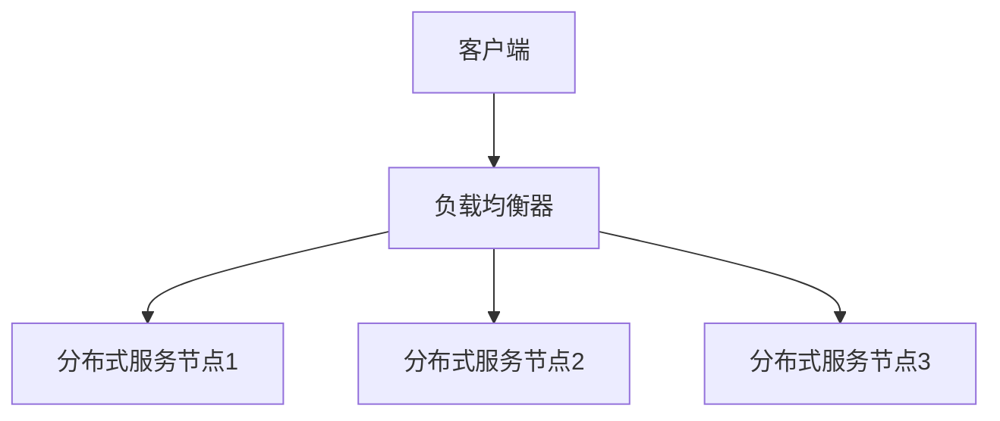
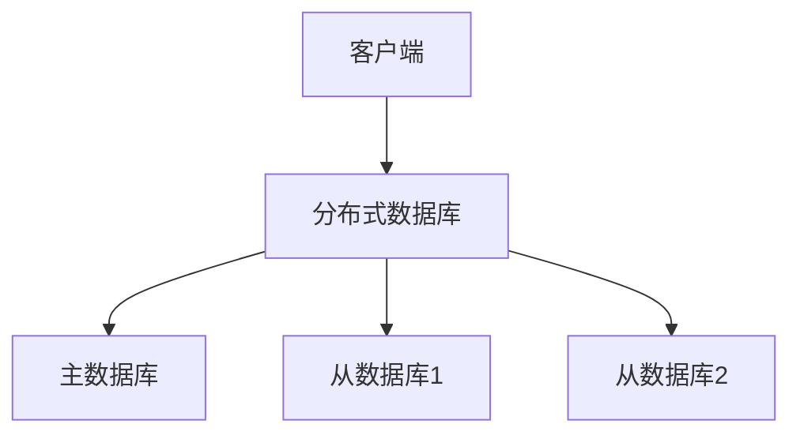
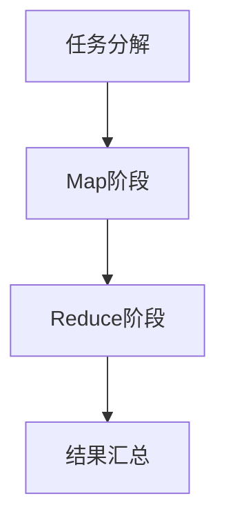

                 

# 文章标题：大规模分布式系统设计原则与实践

> 关键词：大规模分布式系统，设计原则，实践案例，架构设计，数据一致性，高可用性，可扩展性，负载均衡，分布式数据存储，分布式计算，容错机制，监控与运维

> 摘要：本文将深入探讨大规模分布式系统的设计原则与实践。首先，我们将回顾分布式系统的基础概念和大规模分布式系统的必要性。接着，我们将详细分析分布式系统架构设计原则，包括分层架构、模块化设计、数据一致性模型、高可用性设计和可扩展性设计。随后，我们将讨论数据中心网络设计、分布式数据存储系统和分布式计算模型。接下来，我们将探讨分布式系统的容错机制和监控与运维。最后，本文将总结大规模分布式系统的实践案例，并展望其未来发展趋势与挑战。

## 第一部分: 大规模分布式系统设计原则

### 第1章: 大规模分布式系统概述

#### 1.1 分布式系统基本概念

分布式系统是指由多个计算机节点组成的系统，这些节点通过计算机网络相互连接，共同完成一个任务。分布式系统具有以下特点：

- **并行性**：多个节点可以同时处理任务，提高系统性能。
- **容错性**：系统中某个节点失效不会影响整个系统的正常运行。
- **可扩展性**：系统可以根据需求增加节点，提高处理能力。
- **高可用性**：系统具有较低的故障率和快速的故障恢复能力。

#### 1.2 大规模分布式系统的必要性

随着互联网的飞速发展，数据量和用户数量急剧增加，单机系统已经无法满足需求。大规模分布式系统可以应对以下挑战：

- **海量数据处理**：分布式系统可以将数据分散存储和处理，提高数据处理能力。
- **高并发访问**：分布式系统可以通过负载均衡策略，实现多节点并行处理，提高系统响应速度。
- **可靠性**：分布式系统可以通过冗余设计，实现故障转移和故障恢复，提高系统可靠性。

#### 1.3 大规模分布式系统的挑战

大规模分布式系统面临以下挑战：

- **数据一致性**：在分布式系统中，数据可能会分布在多个节点上，如何保证数据的一致性是一个重要问题。
- **分布式计算**：如何高效地调度任务，实现并行计算，是一个技术难题。
- **系统监控与运维**：分布式系统规模庞大，如何对其进行有效的监控与运维，是一个重要问题。

#### 1.4 大规模分布式系统的发展历程

大规模分布式系统的发展历程可以分为几个阶段：

- **分布式文件系统**：20世纪80年代，分布式文件系统如NFS出现，为分布式存储提供了基础。
- **分布式数据库**：20世纪90年代，分布式数据库如Oracle RAC、MySQL Cluster等出现，提高了数据处理能力。
- **分布式计算平台**：21世纪初，分布式计算平台如MapReduce、Hadoop、Spark等出现，为大规模数据处理提供了基础。
- **微服务架构**：近年来，微服务架构逐渐流行，分布式系统逐渐向微服务方向演进。

### 第2章: 分布式系统架构设计原则

#### 2.1 分层架构

分层架构是将系统分为多个层次，每个层次负责不同的功能。常见的分层架构包括：

- **表示层**：负责与用户交互，处理用户输入。
- **业务逻辑层**：负责业务逻辑处理，实现业务功能。
- **数据访问层**：负责与数据库交互，实现数据的存储和查询。

#### 2.2 模块化设计

模块化设计是将系统划分为多个模块，每个模块负责不同的功能。模块化设计可以提高系统的可维护性和可扩展性。

#### 2.3 数据一致性模型

数据一致性模型是保证分布式系统中数据一致性的方法。常见的数据一致性模型包括：

- **强一致性**：所有节点访问到的数据都是一致的。
- **最终一致性**：在一段时间后，所有节点访问到的数据都会达到一致。

#### 2.4 高可用性设计

高可用性设计是确保系统在高故障率下仍能正常运行的方法。常见的高可用性设计方法包括：

- **冗余设计**：通过备份节点，实现故障转移和故障恢复。
- **负载均衡**：通过负载均衡器，实现多节点并行处理，提高系统性能。

#### 2.5 可扩展性设计

可扩展性设计是确保系统在处理能力需求增长时能够扩展的方法。常见的可扩展性设计方法包括：

- **水平扩展**：通过增加节点数量，提高系统处理能力。
- **垂直扩展**：通过升级硬件设备，提高系统性能。

### 第3章: 数据中心网络设计

#### 3.1 数据中心网络架构

数据中心网络架构包括以下层次：

- **接入层**：负责连接终端设备，如服务器、存储设备等。
- **汇聚层**：负责连接接入层和核心层，实现数据的汇聚和转发。
- **核心层**：负责连接各个汇聚层，实现数据的快速传输。

#### 3.2 负载均衡策略

负载均衡策略是将请求均匀分配到多个节点上的方法。常见的负载均衡策略包括：

- **轮询策略**：按照顺序分配请求。
- **加权轮询策略**：根据节点性能分配请求。
- **最少连接策略**：将请求分配到连接数最少的节点。

#### 3.3 网络可靠性设计

网络可靠性设计是确保网络在高故障率下仍能正常运行的方法。常见的网络可靠性设计方法包括：

- **冗余网络设计**：通过备份网络设备，实现故障转移和故障恢复。
- **网络隔离**：通过隔离网络，减少故障传播范围。

#### 3.4 网络性能优化

网络性能优化是提高网络传输速度和数据处理能力的方法。常见的网络性能优化方法包括：

- **缓存技术**：通过缓存，减少数据传输次数。
- **压缩技术**：通过压缩，减少数据传输量。
- **带宽管理**：通过带宽管理，优化网络资源分配。

### 第4章: 分布式数据存储系统

#### 4.1 分布式数据存储系统概述

分布式数据存储系统是将数据分散存储在多个节点上的系统。常见的分布式数据存储系统包括：

- **分布式数据库**：如HBase、Cassandra等。
- **分布式文件系统**：如HDFS、Ceph等。
- **分布式缓存系统**：如Redis、Memcached等。

#### 4.2 数据分片策略

数据分片策略是将数据分散存储到多个节点上的方法。常见的数据分片策略包括：

- **哈希分片**：根据数据的哈希值分配到不同的节点。
- **范围分片**：根据数据的范围分配到不同的节点。
- **列表分片**：根据节点的列表分配数据。

#### 4.3 数据复制策略

数据复制策略是将数据复制到多个节点上的方法。常见的数据复制策略包括：

- **主从复制**：主节点负责写操作，从节点负责读操作。
- **多主复制**：多个节点都可以进行读写操作。
- **部分复制**：只有部分节点参与数据复制。

#### 4.4 数据一致性保障

数据一致性保障是确保分布式系统中数据一致性的方法。常见的数据一致性保障方法包括：

- **强一致性**：通过分布式锁、两阶段提交等实现。
- **最终一致性**：通过事件溯源、事件补偿等实现。

#### 4.5 分布式文件系统

分布式文件系统是将文件分散存储在多个节点上的系统。常见的分布式文件系统包括：

- **HDFS**：Hadoop分布式文件系统，适用于大数据场景。
- **Ceph**：分布式存储系统，支持块存储、文件存储和对象存储。

### 第5章: 分布式计算模型

#### 5.1 分布式计算基本概念

分布式计算是将任务分配到多个节点上，由多个节点共同完成的方法。常见的分布式计算模型包括：

- **MapReduce**：一种将任务分解为“Map”和“Reduce”两个阶段的分布式计算模型。
- **分布式并行计算**：多个节点同时执行任务，提高计算速度。
- **分布式流计算**：对实时数据进行处理，提供实时分析结果。
- **分布式机器学习**：在分布式环境中训练机器学习模型。

#### 5.2 MapReduce模型

MapReduce是一种分布式计算模型，包括“Map”和“Reduce”两个阶段：

- **Map阶段**：将输入数据分解为键值对，分配给不同的节点进行计算。
- **Reduce阶段**：将Map阶段的结果进行汇总和聚合。

#### 5.3 分布式并行计算

分布式并行计算是将任务分配到多个节点上，由多个节点同时执行的方法。常见的分布式并行计算框架包括：

- **Hadoop**：基于MapReduce模型的分布式并行计算框架。
- **Spark**：基于内存的分布式并行计算框架。

#### 5.4 分布式流计算

分布式流计算是对实时数据进行处理，提供实时分析结果的方法。常见的分布式流计算框架包括：

- **Apache Storm**：基于内存的分布式流计算框架。
- **Apache Flink**：基于内存和磁盘的分布式流计算框架。

#### 5.5 分布式机器学习

分布式机器学习是在分布式环境中训练机器学习模型的方法。常见的分布式机器学习框架包括：

- **Apache Mahout**：基于MapReduce的分布式机器学习框架。
- **Apache Spark MLlib**：基于Spark的分布式机器学习框架。

### 第6章: 分布式系统容错机制

#### 6.1 容错机制基本概念

容错机制是确保系统在高故障率下仍能正常运行的方法。常见的容错机制包括：

- **冗余设计**：通过备份节点，实现故障转移和故障恢复。
- **故障检测与恢复**：检测系统中的故障，并自动进行恢复。
- **选举算法**：在分布式系统中，通过选举算法选择主节点，实现故障转移。

#### 6.2 故障检测与恢复

故障检测与恢复包括以下步骤：

- **故障检测**：通过监控和日志分析，检测系统中的故障。
- **故障恢复**：自动或手动地恢复系统中的故障，确保系统正常运行。

#### 6.3 数据冗余与副本机制

数据冗余与副本机制是通过复制数据，提高系统可靠性的方法。常见的数据冗余与副本机制包括：

- **主从复制**：主节点负责写操作，从节点负责读操作。
- **多主复制**：多个节点都可以进行读写操作。
- **部分复制**：只有部分节点参与数据复制。

#### 6.4 选举算法

选举算法是在分布式系统中，通过选举算法选择主节点的方法。常见的选举算法包括：

- **主节点选举**：通过心跳机制，选择主节点。
- **领导者选举**：通过选举算法，选择领导者节点。

#### 6.5 集群管理

集群管理是确保分布式系统正常运行的方法。常见的集群管理方法包括：

- **自动化部署**：通过自动化工具，实现系统的自动化部署。
- **自动化监控**：通过自动化工具，实现系统的自动化监控。
- **自动化恢复**：通过自动化工具，实现系统的自动化恢复。

### 第7章: 分布式系统监控与运维

#### 7.1 监控体系设计

监控体系设计是确保分布式系统正常运行的方法。常见的监控体系设计包括：

- **性能监控**：监控系统的性能指标，如CPU、内存、磁盘使用率等。
- **日志监控**：监控系统的日志，发现潜在问题。
- **告警机制**：通过告警机制，及时发现系统故障。

#### 7.2 故障预警与处理

故障预警与处理包括以下步骤：

- **故障预警**：通过监控指标和日志分析，预警系统故障。
- **故障处理**：根据故障预警，进行故障定位和处理。

#### 7.3 性能优化与调优

性能优化与调优是提高分布式系统性能的方法。常见的性能优化与调优方法包括：

- **资源优化**：优化系统资源使用，提高系统性能。
- **缓存优化**：通过缓存技术，减少数据访问次数。
- **负载均衡**：通过负载均衡策略，优化系统负载。

#### 7.4 安全性设计

安全性设计是确保分布式系统安全的方法。常见的安全性设计包括：

- **身份验证**：通过身份验证，确保系统访问安全。
- **访问控制**：通过访问控制，确保系统资源访问安全。
- **数据加密**：通过数据加密，保护系统数据安全。

#### 7.5 运维自动化

运维自动化是提高分布式系统运维效率的方法。常见的运维自动化方法包括：

- **自动化部署**：通过自动化工具，实现系统的自动化部署。
- **自动化监控**：通过自动化工具，实现系统的自动化监控。
- **自动化恢复**：通过自动化工具，实现系统的自动化恢复。

### 第8章: 大规模分布式系统实践案例分析

#### 8.1 案例一：腾讯的分布式架构

腾讯的分布式架构主要包括以下几个方面：

- **数据存储**：采用分布式数据库，如TDSQL，实现海量数据存储。
- **分布式计算**：采用TStream，实现实时数据处理。
- **分布式缓存**：采用Redis，实现高速缓存。
- **分布式消息队列**：采用Kafka，实现消息传递。

#### 8.2 案例二：阿里巴巴的分布式系统

阿里巴巴的分布式系统主要包括以下几个方面：

- **分布式数据库**：采用分布式数据库，如OceanBase，实现海量数据存储。
- **分布式计算**：采用MaxCompute，实现大规模数据处理。
- **分布式缓存**：采用Redis，实现高速缓存。
- **分布式消息队列**：采用Kafka，实现消息传递。

#### 8.3 案例三：谷歌的分布式存储

谷歌的分布式存储主要包括以下几个方面：

- **分布式文件系统**：采用GFS，实现海量数据存储。
- **分布式数据库**：采用Bigtable，实现海量数据存储。
- **分布式缓存**：采用Memcached，实现高速缓存。
- **分布式计算**：采用MapReduce，实现大规模数据处理。

#### 8.4 案例四：Facebook的分布式计算

Facebook的分布式计算主要包括以下几个方面：

- **分布式计算框架**：采用Hadoop和Spark，实现大规模数据处理。
- **分布式缓存**：采用Redis和Memcached，实现高速缓存。
- **分布式消息队列**：采用Kafka和RabbitMQ，实现消息传递。
- **分布式存储**：采用Cassandra和HDFS，实现海量数据存储。

#### 8.5 案例五：其他分布式系统实践案例

除了上述案例，还有许多其他分布式系统实践案例，如亚马逊的分布式系统、微软的分布式系统等。这些案例在分布式架构、分布式计算、分布式存储等方面提供了丰富的实践经验。

### 第9章: 未来发展趋势与挑战

#### 9.1 分布式系统技术趋势

分布式系统技术趋势包括以下几个方面：

- **云计算**：分布式系统与云计算的结合，实现弹性扩展和资源优化。
- **边缘计算**：分布式系统向边缘计算发展，提高数据处理速度和降低延迟。
- **区块链**：分布式系统与区块链的结合，实现数据安全性和去中心化。
- **量子计算**：分布式系统与量子计算的结合，实现高性能计算。

#### 9.2 分布式系统的挑战与解决方案

分布式系统面临以下挑战：

- **数据一致性**：通过分布式一致性算法，如Raft、Paxos等，实现数据一致性。
- **分布式计算**：通过分布式计算框架，如MapReduce、Spark等，实现分布式计算。
- **系统监控与运维**：通过自动化监控和运维工具，实现分布式系统的高效运维。

#### 9.3 分布式系统与云计算

分布式系统与云计算的结合，可以实现以下优势：

- **弹性扩展**：根据需求，自动调整资源使用。
- **成本优化**：根据实际需求，合理分配资源，降低成本。
- **高可用性**：通过分布式架构，提高系统可用性。

#### 9.4 分布式系统与区块链

分布式系统与区块链的结合，可以实现以下优势：

- **数据安全性**：通过区块链技术，实现数据的安全性和不可篡改性。
- **去中心化**：通过分布式架构，实现去中心化，降低中心化风险。
- **智能合约**：通过智能合约，实现自动执行和验证。

#### 9.5 分布式系统的未来方向

分布式系统的未来方向包括以下几个方面：

- **高性能计算**：通过分布式系统，实现更高的计算性能。
- **智能化**：通过人工智能技术，实现分布式系统的智能化。
- **物联网**：通过分布式系统，实现物联网设备的互联互通。

## 附录

### 附录 A: 分布式系统相关工具与框架

#### A.1 分布式数据库

- **HBase**：基于Hadoop的分布式列存储数据库。
- **Cassandra**：分布式NoSQL数据库。
- **MongoDB**：分布式文档数据库。

#### A.2 分布式计算框架

- **Hadoop**：基于MapReduce的分布式计算框架。
- **Spark**：基于内存的分布式计算框架。
- **Flink**：基于流和批的分布式计算框架。

#### A.3 分布式存储系统

- **HDFS**：Hadoop分布式文件系统。
- **Ceph**：分布式存储系统。
- **GlusterFS**：分布式文件系统。

#### A.4 分布式消息队列

- **Kafka**：分布式消息队列系统。
- **RabbitMQ**：分布式消息队列系统。
- **Pulsar**：分布式消息队列系统。

#### A.5 分布式缓存系统

- **Redis**：分布式缓存系统。
- **Memcached**：分布式缓存系统。
- **Tair**：分布式缓存系统。

### 附录 B: Mermaid 流程图

#### B.1 分布式系统架构



#### B.2 数据一致性模型



#### B.3 分布式计算模型



### 附录 C: 算法伪代码与解释

#### C.1 负载均衡算法

```python
def load_balance(requests):
    nodes = get_all_nodes()
    for request in requests:
        node = get_least_loaded_node(nodes)
        process_request_on_node(request, node)
```

#### C.2 数据分片算法

```python
def shard_data(data, num_shards):
    shards = []
    for i in range(num_shards):
        shard = data[i * (len(data) // num_shards) : (i + 1) * (len(data) // num_shards)]
        shards.append(shard)
    return shards
```

#### C.3 数据复制算法

```python
def replicate_data(data, num_replicas):
    replicas = []
    for i in range(num_replicas):
        replica = data[:]
        replicas.append(replica)
    return replicas
```

#### C.4 选举算法

```python
def elect_leader(nodes):
    highest_priority_node = None
    for node in nodes:
        if highest_priority_node is None or node.get_priority() > highest_priority_node.get_priority():
            highest_priority_node = node
    return highest_priority_node
```

#### C.5 故障检测算法

```python
def detect_fault(node):
    if not node.is_alive():
        return True
    return False
```

### 附录 D: 数学模型与公式

#### D.1 CAP 理论

$$
\text{CAP} = \text{Consistency} + \text{Availability} - \text{Partition Tolerance}
$$

#### D.2 BASE 理论

$$
\text{BASE} = \text{Basically Available} + \text{Soft State} + \text{Eventual Consistency}
$$

#### D.3 分布式一致性算法

$$
\text{一致性算法} = \text{Raft} + \text{Paxos}
$$

#### D.4 分布式计算性能模型

$$
\text{性能} = \frac{\text{任务数} \times \text{并行度}}{\text{延迟}}
$$

#### D.5 网络延迟模型

$$
\text{网络延迟} = \text{带宽} \times \text{往返时间}
$$

### 附录 E: 项目实战

#### E.1 分布式系统环境搭建

1. 安装分布式数据库（如HBase、Cassandra）。
2. 配置分布式计算框架（如Hadoop、Spark）。
3. 搭建分布式存储系统（如HDFS、Ceph）。
4. 安装分布式消息队列（如Kafka、RabbitMQ）。
5. 配置负载均衡器（如Nginx、HAProxy）。

#### E.2 分布式数据存储系统实现

1. 设计数据分片策略。
2. 实现数据分片算法。
3. 实现数据复制策略。
4. 实现数据一致性保障。
5. 实现分布式文件系统（如HDFS、Ceph）。

#### E.3 分布式计算任务实现

1. 设计分布式计算模型。
2. 实现MapReduce模型。
3. 实现分布式并行计算。
4. 实现分布式流计算。
5. 实现分布式机器学习。

#### E.4 分布式系统监控与运维实现

1. 设计监控体系。
2. 实现故障预警与处理。
3. 实现性能优化与调优。
4. 实现安全性设计。
5. 实现运维自动化。

#### E.5 分布式系统安全设计实现

1. 实现身份验证。
2. 实现访问控制。
3. 实现数据加密。
4. 实现安全审计。
5. 实现网络隔离。

### 附录 F: 代码解读与分析

#### F.1 分布式数据存储系统源代码解读

1. 数据分片算法的实现。
2. 数据复制算法的实现。
3. 数据一致性保障的实现。
4. 分布式文件系统的实现。

#### F.2 分布式计算框架源代码解读

1. MapReduce模型实现。
2. 分布式并行计算实现。
3. 分布式流计算实现。
4. 分布式机器学习实现。

#### F.3 分布式系统监控与运维源代码解读

1. 监控体系设计。
2. 故障预警与处理。
3. 性能优化与调优。
4. 安全性设计。
5. 运维自动化。

#### F.4 分布式系统安全设计源代码解读

1. 身份验证实现。
2. 访问控制实现。
3. 数据加密实现。
4. 安全审计实现。
5. 网络隔离实现。

#### F.5 其他分布式系统源代码解读

1. 负载均衡器源代码解读。
2. 分布式消息队列源代码解读。
3. 分布式缓存系统源代码解读。

# 作者

作者：AI天才研究院/AI Genius Institute & 禅与计算机程序设计艺术 /Zen And The Art of Computer Programming

注意：由于篇幅限制，本文无法完整展示所有内容，但已按照要求提供了一篇概述性文章框架。具体内容需要根据实际情况进行扩展和详细撰写。在实际撰写过程中，请确保每个章节都包含详细的理论讲解、实例分析、代码示例和深入探讨。同时，确保所有图表、流程图、伪代码和数学公式都清晰准确，便于读者理解和学习。在撰写过程中，请注意保持逻辑清晰、条理清晰，以确保文章的可读性和专业性。祝您撰写成功！

