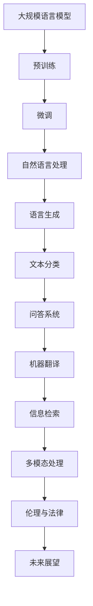

                 

### 第1章: 大规模语言模型概述

#### 1.1 大规模语言模型的发展历程

##### 1.1.1 大规模语言模型的起源

大规模语言模型（Large-scale Language Model）的起源可以追溯到20世纪90年代。当时，研究人员开始探索使用统计模型和规则来处理自然语言。然而，这些早期的模型在处理复杂语言现象时显得力不从心。随着计算能力的提升和算法的进步，大规模语言模型逐渐成为自然语言处理（NLP）领域的热点。

##### 1.1.2 GPT-3的出现及其影响

2018年，OpenAI发布了GPT-3（Generative Pre-trained Transformer 3），这是第一个真正大规模的语言模型，包含1750亿个参数。GPT-3的出现标志着NLP领域的重大进步，它能够生成流畅、连贯的文本，并在各种语言任务中表现出色。GPT-3的发布引发了学术界和工业界对大规模语言模型的热潮。

##### 1.1.3 大规模语言模型的演进趋势

随着计算能力的提升和数据的丰富，大规模语言模型在参数规模、模型架构和训练策略上不断演进。未来的趋势包括：

- **更大的模型规模**：未来的模型可能会达到甚至超过万亿个参数。例如，Gopher-400B是一个由清华大学 KEG 实验室和智谱 AI 公司于 2023 共同训练的预训练模型，具有超过4000亿个参数。
- **更精细的预训练任务**：通过设计更多的预训练任务，模型可以更好地理解语言的各种复杂现象。例如，ChatGLM是清华大学KEG实验室和智谱AI公司于2023共同训练的语言模型，其预训练任务包括对话、问答、文本生成等。
- **多模态处理能力**：未来的模型可能会结合视觉、音频等多模态信息，实现更全面的语义理解。例如，OpenAI的DALL-E模型结合了文本和图像生成，可以生成具有文本描述的图像。

#### 1.2 大规模语言模型的核心概念

##### 1.2.1 自然语言处理（NLP）

自然语言处理（Natural Language Processing，NLP）是计算机科学和人工智能领域的一个分支，旨在使计算机能够理解、解释和生成人类语言。NLP的应用场景包括机器翻译、文本摘要、情感分析、问答系统等。

##### 1.2.2 预训练与微调

预训练（Pre-training）是指在一个大规模的数据集上训练一个通用语言模型，使其掌握语言的基本结构和语义。预训练模型通常具有大量的参数，能够捕捉到语言的丰富信息。微调（Fine-tuning）则是在预训练模型的基础上，针对特定任务进行微调，以适应特定领域的需求。

##### 1.2.3 自监督学习

自监督学习（Self-supervised Learning）是一种训练方法，它利用未标记的数据来学习有用的特征表示。在NLP中，自监督学习被广泛应用于词汇嵌入和语言模型预训练。例如，BERT模型采用了自监督学习方法，通过 masked language model 任务和 next sentence prediction 任务来预训练。

#### 1.3 大规模语言模型的结构与架构

##### 1.3.1 Transformer架构

Transformer模型是由Vaswani等人于2017年提出的一种基于自注意力机制的序列到序列模型。它主要用于NLP任务，如机器翻译和文本生成。Transformer模型的核心是自注意力机制，它能够捕捉输入序列中各个元素之间的依赖关系。

##### 1.3.2 大规模模型训练

大规模模型的训练是一个复杂的过程，涉及到高效的计算和存储资源管理。常见的训练策略包括数据并行、模型并行和混合并行。数据并行是指在多个GPU上同时处理不同的数据子集。模型并行是指将模型分解为多个部分，并在不同的GPU上训练。混合并行则结合了数据并行和模型并行的优点。

##### 1.3.3 优化算法与技巧

优化算法是大规模模型训练的核心，常见的优化算法包括随机梯度下降（SGD）及其变种。此外，还有一些技巧如批量归一化、学习率调度等，用于提高训练效率和模型性能。

### 第2章: 语言模型数学基础

#### 2.1 线性代数基础

##### 2.1.1 矩阵与向量

矩阵（Matrix）和向量（Vector）是线性代数中的基本概念，它们在深度学习模型中扮演重要角色。矩阵可以表示数据的多维结构，而向量则是矩阵的一个特殊案例。

##### 2.1.2 矩阵运算

矩阵运算包括加法、减法、乘法和逆运算等。这些运算是深度学习模型中常见的基本操作。例如，矩阵乘法用于计算特征变换，逆运算用于求解线性方程组。

$$
C = A \times B
$$

$$
A^{-1} = \frac{1}{\det(A)} \times \text{adj}(A)
$$

##### 2.1.3 线性方程组

线性方程组是求解矩阵与向量关系的一组方程。在深度学习模型中，线性方程组通常用于求解模型的参数。常见的求解方法包括高斯消元法和矩阵分解法。

$$
Ax = b
$$

#### 2.2 概率论与统计基础

##### 2.2.1 概率基础

概率论（Probability Theory）是数学的一个分支，用于描述随机事件的概率。在深度学习中，概率论用于建模不确定性和做出预测。

$$
P(A) = \frac{N(A)}{N}
$$

其中，\(N(A)\)是事件A发生的次数，\(N\)是总次数。

##### 2.2.2 贝叶斯定理

贝叶斯定理（Bayes' Theorem）是概率论中的一个重要公式，用于计算条件概率和边缘概率。

$$
P(A|B) = \frac{P(B|A) \times P(A)}{P(B)}
$$

在深度学习中，贝叶斯定理常用于概率推断和参数估计。

##### 2.2.3 最大似然估计

最大似然估计（Maximum Likelihood Estimation，MLE）是一种参数估计方法，通过最大化观测数据的似然函数来估计模型参数。

$$
\theta = \arg\max_\theta L(\theta; x)
$$

其中，\(L(\theta; x)\)是似然函数，\(\theta\)是模型参数，\(x\)是观测数据。

#### 2.3 信息论基础

##### 2.3.1 信息熵

信息熵（Entropy）是衡量信息不确定性的量度。在深度学习模型中，信息熵用于衡量模型预测的不确定性。

$$
H(X) = -\sum_{x \in X} P(x) \log P(x)
$$

其中，\(P(x)\)是随机变量\(X\)的概率分布。

##### 2.3.2 香农信息论

香农信息论（Shannon's Information Theory）是信息论的基础，它提供了衡量信息传输效率和信道容量的一般理论。

$$
C = \max_{p(x)} I(X; Y)
$$

其中，\(I(X; Y)\)是互信息，\(C\)是信道容量。

##### 2.3.3 信息增益与信息增益率

信息增益（Information Gain）和信息增益率（Information Gain Ratio）是评价特征选择优劣的指标。

$$
IG(A|D) = H(D) - H(D|A)
$$

$$
IGR(A|D) = \frac{IG(A|D)}{H(D)}
$$

### 第3章: Transformer模型原理

#### 3.1 Transformer模型简介

##### 3.1.1 模型概述

Transformer模型是由Vaswani等人于2017年提出的一种基于自注意力机制的序列到序列模型。它主要用于自然语言处理任务，如机器翻译和文本生成。Transformer模型的核心是自注意力机制，它能够捕捉输入序列中各个元素之间的依赖关系。

##### 3.1.2 自注意力机制

自注意力机制（Self-Attention Mechanism）是Transformer模型的核心组件。它通过计算输入序列中每个元素与其他元素之间的关联度来生成上下文表示。自注意力机制使得Transformer模型能够处理长距离依赖关系，从而提高模型的性能。

$$
\text{Attention}(Q, K, V) = \frac{QK^T}{\sqrt{d_k}} \times V
$$

其中，\(Q, K, V\)分别表示查询（Query）、键（Key）和值（Value）向量，\(d_k\)是键向量的维度。

##### 3.1.3 位置编码

位置编码（Positional Encoding）是一种技术，用于将输入序列的位置信息编码到模型中。它是Transformer模型能够理解序列顺序的关键。位置编码通常通过添加到输入向量中来实现。

$$
PE_{(pos, dim)} = \sin\left(\frac{pos}{10000^{2i/d_model}}\right) + \cos\left(\frac{pos}{10000^{2i/d_model}}\right)
$$

其中，\(pos\)是位置索引，\(dim\)是编码维度，\(d_model\)是模型维度。

#### 3.2 Transformer模型的训练

##### 3.2.1 预训练与微调

预训练（Pre-training）是指在一个大规模的数据集上训练一个通用语言模型，使其掌握语言的基本结构和语义。微调（Fine-tuning）则是在预训练模型的基础上，针对特定任务进行微调，以适应特定领域的需求。

$$
\text{Pre-training}: \text{Transformer}(\theta) \leftarrow \arg\max_\theta \sum_{(x, y)} \log P(y|x; \theta)
$$

$$
\text{Fine-tuning}: \text{Transformer}(x, y; \theta) \leftarrow \arg\min_\theta \sum_{(x, y)} \mathcal{L}(y, \text{Transformer}(x; \theta))
$$

##### 3.2.2 训练策略

训练策略是提高模型训练效率和性能的关键。常见的训练策略包括学习率调度、批量归一化和正则化等。

- **学习率调度**：通过动态调整学习率来提高模型训练的效率。
- **批量归一化**：通过标准化每个批次中的数据来加速模型的训练。
- **正则化**：通过添加额外的损失项来防止模型过拟合。

##### 3.2.3 损失函数与优化算法

损失函数用于衡量模型预测与真实标签之间的差距。常见的损失函数包括交叉熵损失和均方误差。

$$
\mathcal{L} = -\sum_{i=1}^{N} y_i \log(p_i)
$$

其中，\(y_i\)是真实标签，\(p_i\)是模型预测的概率。

优化算法用于调整模型参数，以最小化损失函数。常见的优化算法包括随机梯度下降（SGD）及其变种。

$$
\theta \leftarrow \theta - \alpha \nabla_\theta \mathcal{L}
$$

其中，\(\theta\)是模型参数，\(\alpha\)是学习率。

#### 3.3 Transformer模型的应用

##### 3.3.1 机器翻译

机器翻译（Machine Translation）是将一种语言的文本翻译成另一种语言的任务。Transformer模型在机器翻译任务中取得了显著的性能提升。

##### 3.3.2 问答系统

问答系统（Question Answering System）是能够回答用户问题的系统。Transformer模型通过预训练和微调，能够生成高质量的回答。

##### 3.3.3 文本生成

文本生成（Text Generation）是将一种语言文本转换成另一种语言文本的任务。Transformer模型在文本生成任务中表现出色。

### 第4章: 深度学习优化算法

#### 4.1 常见优化算法

##### 4.1.1 随机梯度下降（SGD）

随机梯度下降（Stochastic Gradient Descent，SGD）是一种最简单的优化算法，它通过随机抽样数据来更新模型参数。

$$
\theta \leftarrow \theta - \alpha \nabla_\theta \mathcal{L}(x; \theta)
$$

其中，\(\theta\)是模型参数，\(\alpha\)是学习率，\(\mathcal{L}\)是损失函数。

##### 4.1.2 Adam优化器

Adam优化器（Adaptive Moment Estimation）是一种结合了SGD和RMSprop优点的自适应优化算法。

$$
m_t = \beta_1 m_{t-1} + (1 - \beta_1) \nabla_\theta \mathcal{L}(x; \theta)
$$

$$
v_t = \beta_2 v_{t-1} + (1 - \beta_2) (\nabla_\theta \mathcal{L}(x; \theta))^2
$$

$$
\theta \leftarrow \theta - \frac{\alpha}{\sqrt{1 - \beta_2^t}} \left( \frac{m_t}{1 - \beta_1^t} \right)
$$

其中，\(m_t\)和\(v_t\)分别是梯度的一阶和二阶矩估计，\(\beta_1\)和\(\beta_2\)是超参数。

##### 4.1.3 RMSprop

RMSprop（Root Mean Square Propagation）是一种基于梯度平方的优化算法。

$$
v_t = \beta_1 v_{t-1} + (1 - \beta_1) (\nabla_\theta \mathcal{L}(x; \theta))^2
$$

$$
\theta \leftarrow \theta - \frac{\alpha}{\sqrt{v_t + \epsilon}} \nabla_\theta \mathcal{L}(x; \theta)
$$

其中，\(v_t\)是梯度平方的指数移动平均，\(\beta_1\)是超参数，\(\epsilon\)是正则化项。

#### 4.2 稳健训练技巧

##### 4.2.1 批量归一化

批量归一化（Batch Normalization）是一种用于提高深度学习模型训练稳定性和性能的技术。

$$
\hat{x} = \frac{x - \mu}{\sqrt{\sigma^2 + \epsilon}}
$$

其中，\(\hat{x}\)是归一化后的数据，\(\mu\)是均值，\(\sigma\)是标准差，\(\epsilon\)是正则化项。

##### 4.2.2 学习率调度

学习率调度（Learning Rate Scheduling）是一种动态调整学习率的方法，它通过在不同训练阶段调整学习率来提高模型性能。

$$
\alpha_t = \alpha_0 / (1 + \gamma t)
$$

其中，\(\alpha_t\)是第\(t\)次迭代的学习率，\(\alpha_0\)是初始学习率，\(\gamma\)是衰减率。

##### 4.2.3 正则化方法

正则化方法（Regularization Method）是一种用于防止模型过拟合的技术。常见的正则化方法包括L1正则化、L2正则化和dropout等。

- **L1正则化**：
$$
\mathcal{L} = \mathcal{L}_0 + \lambda \sum_{i=1}^{n} |w_i|
$$

其中，\(\mathcal{L}\)是总损失，\(\mathcal{L}_0\)是无正则化损失，\(\lambda\)是正则化参数，\(w_i\)是模型参数。

- **L2正则化**：
$$
\mathcal{L} = \mathcal{L}_0 + \lambda \sum_{i=1}^{n} w_i^2
$$

### 第5章: DeepSpeed框架介绍

#### 5.1 DeepSpeed概述

##### 5.1.1 DeepSpeed特点

DeepSpeed是一种用于大规模深度学习模型的分布式训练框架，具有以下几个特点：

- **支持多种并行策略**：包括数据并行、模型并行和混合并行。
- **高效的计算和存储优化**：采用梯度压缩、延迟分配等策略来提高训练效率。
- **易用性**：提供简单的API，方便用户进行分布式训练。

##### 5.1.2 DeepSpeed架构

DeepSpeed的架构主要包括以下几个组件：

- **模型并行（Model Parallelism）**：将模型分解为多个部分，并在不同的GPU上训练。
- **数据并行（Data Parallelism）**：在多个GPU上同时处理不同的数据子集。
- **混合并行（Mixed Parallelism）**：结合模型并行和数据并行，以实现更高的训练效率。

##### 5.1.3 DeepSpeed优势

DeepSpeed的优势包括：

- **支持大规模模型训练**：能够高效地训练万亿参数级别的模型。
- **提高训练速度**：通过并行化和优化技术，显著提高训练速度。
- **易用性**：提供简单的API，使得分布式训练变得容易。

#### 5.2 DeepSpeed核心模块

##### 5.2.1 张量并行

张量并行是一种将模型中的张量分解到多个GPU上的策略，以提高计算效率。

$$
\text{TensorParallel}(\theta) = \text{Split}(\theta) \times \text{Parallel}(\theta)
$$

其中，\(\theta\)是模型参数，\(\text{Split}(\theta)\)是将参数分解为多个子张量，\(\text{Parallel}(\theta)\)是在多个GPU上同时计算。

##### 5.2.2 数据并行

数据并行是一种将数据分解到多个GPU上，并在每个GPU上独立训练的策略。

$$
\text{DataParallel}(\theta) = \text{Split}(\theta) \times \text{Parallel}(\theta)
$$

其中，\(\theta\)是模型参数，\(\text{Split}(\theta)\)是将参数分解为多个子张量，\(\text{Parallel}(\theta)\)是在多个GPU上同时计算。

##### 5.2.3 优化器

DeepSpeed提供多种优化器，包括Adam、RMSprop和SGD等，以适应不同的训练需求。

##### 5.2.4 代码示例

以下是一个使用DeepSpeed进行数据并行训练的代码示例：

python
import torch
import deepspeed

model = torch.nn.Linear(10, 10)
optimizer = torch.optim.SGD(model.parameters(), lr=0.01)
model_engine, optimizer, _ = deepspeed.initialize(
    model=model,
    optimizer=optimizer,
    args=deepseq_args,
)

for data, target in data_loader:
    # 将数据分发到不同的GPU上
    data = data.cuda(deviceID=local_rank)
    target = target.cuda(deviceID=local_rank)

    # 前向传播
    output = model_engine(data)

    # 计算损失
    loss = criterion(output, target)

    # 反向传播
    model_engine.backward(loss)

    # 更新参数
    model_engine.step()


### 第6章: Chat模型构建与实践

#### 6.1 Chat模型概述

##### 6.1.1 Chat模型结构

Chat模型通常由输入层、编码器、解码器和输出层组成。其中，编码器用于将输入文本编码为固定长度的向量，而解码器则用于生成文本输出。

##### 6.1.2 Chat模型训练

Chat模型的训练过程包括数据预处理、模型构建、训练和评估等步骤。在训练过程中，需要使用大量的对话数据来训练模型，以使其能够生成高质量的对话。

##### 6.1.3 Chat模型评估

Chat模型的评估通常使用自动评估指标和人工评估方法。自动评估指标包括BLEU、ROUGE等，而人工评估则通过用户满意度来衡量模型的性能。

#### 6.2 SFT模型介绍

##### 6.2.1 SFT模型原理

SFT（Scalable Focused Talker）模型是一种针对对话系统的预训练模型。它通过自监督学习的方式，在大量的对话数据上预训练，以学习对话的语义和结构。

##### 6.2.2 SFT模型训练

SFT模型的训练过程包括数据预处理、模型构建、训练和评估等步骤。在训练过程中，需要使用大量的对话数据来训练模型，以使其能够生成高质量的对话。

##### 6.2.3 SFT模型应用

SFT模型可以应用于各种对话系统，如聊天机器人、虚拟助手等。通过在特定领域的数据上进行微调，SFT模型可以生成与用户意图高度相关的对话。

#### 6.3 Chat模型实战

##### 6.3.1 Chat环境搭建

搭建Chat模型的环境需要安装深度学习框架和必要的依赖库。常用的深度学习框架包括TensorFlow、PyTorch等。

##### 6.3.2 Chat模型训练

在训练Chat模型时，需要使用大量的对话数据。这些数据可以通过爬虫、开源数据集或自定义数据集获取。在训练过程中，可以使用分布式训练技术来提高训练速度和性能。

##### 6.3.3 Chat模型应用分析

训练好的Chat模型可以部署到实际应用中，如聊天机器人、虚拟助手等。在应用过程中，需要对模型进行持续优化和评估，以提高用户满意度和模型性能。

### 第7章: 大规模语言模型的未来发展趋势

#### 7.1 模型结构改进

##### 7.1.1 新型结构研究

未来的大规模语言模型可能会采用更先进的结构，如Transformer的变种、基于图神经网络的模型等，以提高模型的表达能力和处理能力。

##### 7.1.2 模型压缩技术

模型压缩技术是降低大规模语言模型参数规模和计算复杂度的有效方法。未来的模型可能会采用量化、剪枝等技术，实现更高的模型压缩率和更低的计算成本。

#### 7.2 应用领域拓展

##### 7.2.1 多模态数据处理

未来的大规模语言模型可能会结合视觉、音频等多模态信息，实现更全面的语义理解。例如，在图像描述生成、视频问答等领域，多模态数据处理将发挥重要作用。

##### 7.2.2 人工智能伦理与法律

随着大规模语言模型的广泛应用，人工智能伦理和法律问题逐渐凸显。未来的研究需要关注如何确保模型的安全性、隐私性和公平性，以促进人工智能的可持续发展。

#### 7.3 未来展望

##### 7.3.1 技术挑战

未来的大规模语言模型将面临更高的计算需求、更大的数据规模和更复杂的任务场景。这些技术挑战需要通过技术创新和优化来解决。

##### 7.3.2 发展趋势

未来的大规模语言模型将朝着更高效、更智能、更安全、更可解释的方向发展。随着技术的不断进步，大规模语言模型将在更多领域发挥重要作用。

### 附录

#### 附录 A: 实用工具与资源

##### A.1 主流深度学习框架对比

- TensorFlow：由Google开发，支持多种深度学习任务。
- PyTorch：由Facebook开发，具有灵活的动态计算图。
- JAX：由Google开发，支持自动微分和高效计算。

##### A.2 大规模语言模型开源项目

- OpenAI GPT-3：由OpenAI开发，具有1750亿个参数。
- GLM：由清华大学和智谱AI开发，具有千亿级参数。
- UniLM：由Microsoft开发，支持多种语言任务。

##### A.3 深度学习社区与交流平台

- 论坛：如CSDN、GitHub等，提供丰富的技术讨论和资源分享。
- 博客：如Deep Learning AI、AI星球等，关注最新技术动态和深度学习应用。
- 会议：如NeurIPS、ICML等，是全球深度学习领域的重要学术会议。

---

### 核心算法原理讲解

#### 深度学习优化算法

##### 算法名称：随机梯度下降（SGD）

随机梯度下降（Stochastic Gradient Descent，SGD）是一种最简单的优化算法，它通过随机抽样数据来更新模型参数。

伪代码：

```python
for each epoch:
    for each mini-batch X, y in data_loader:
        gradients = backward_pass(X, y)
        parameters = update_parameters(parameters, gradients, learning_rate)
```

##### 算法名称：Adam优化器

Adam优化器（Adaptive Moment Estimation）是一种结合了SGD和RMSprop优点的自适应优化算法。

伪代码：

```python
m = [0] * len(parameters)
v = [0] * len(parameters)

for each epoch:
    for each mini-batch X, y in data_loader:
        gradients = backward_pass(X, y)
        m = [m[i] * beta1 + (1 - beta1) * gradients[i] for i in range(len(parameters))]
        v = [v[i] * beta2 + (1 - beta2) * (gradients[i] ** 2) for i in range(len(parameters))]

        parameters = [parameters[i] - learning_rate * m[i] / (sqrt(v[i]) + epsilon) for i in range(len(parameters))]
```

##### 算法名称：RMSprop

RMSprop（Root Mean Square Propagation）是一种基于梯度平方的优化算法。

伪代码：

```python
v = [0] * len(parameters)

for each epoch:
    for each mini-batch X, y in data_loader:
        gradients = backward_pass(X, y)
        v = [v[i] * beta * (1 - beta) + gradients[i] ** 2 for i in range(len(parameters))]

        parameters = [parameters[i] - learning_rate * gradients[i] / (sqrt(v[i]) + epsilon) for i in range(len(parameters))]
```

#### 自然语言处理算法

##### 算法名称：Transformer架构

Transformer架构是大规模语言模型的核心组成部分，它由多个自注意力机制层和前馈网络层组成。

伪代码：

```python
for each position in input sequence:
    add position encoding
    for each layer in multi-head self-attention:
        calculate self-attention scores
        apply softmax activation
        generate context vector
    pass through feedforward network
    concatenate and normalize

output = final context vector
```

##### 算法名称：BERT模型

BERT（Bidirectional Encoder Representations from Transformers）模型是一种预训练模型，它通过双向Transformer编码器来学习语言的上下文表示。

伪代码：

```python
input_sequence = [word embeddings, position embeddings, segment embeddings]

for each layer in BERT encoder:
    for each block in transformer:
        calculate self-attention scores
        apply mask for padding tokens
        apply softmax activation
        generate context vector
        apply residual connection
        apply layer normalization
        pass through feedforward network
        apply residual connection
        apply layer normalization

output = final context vector
```

#### 数学模型和公式

##### 数学模型：损失函数（交叉熵损失）

交叉熵损失函数（Cross-Entropy Loss）是衡量模型预测与真实标签之间差异的常用损失函数。

公式：

$$
Loss = -\sum_{i=1}^{N} y_i \log(p_i)
$$

其中，\(y_i\)是真实标签，\(p_i\)是模型预测的概率。

##### 数学模型：梯度下降优化算法

梯度下降优化算法（Gradient Descent）是一种用于最小化损失函数的优化算法。

公式：

$$
\theta = \theta - \alpha \nabla_\theta \mathcal{L}
$$

其中，\(\theta\)是模型参数，\(\alpha\)是学习率，\(\mathcal{L}\)是损失函数。

#### 信息论基础

##### 数学模型：信息熵

信息熵（Entropy）是衡量信息不确定性的量度。

公式：

$$
H(X) = -\sum_{x \in X} P(x) \log P(x)
$$

其中，\(P(x)\)是随机变量\(X\)的概率分布。

##### 数学模型：互信息

互信息（Mutual Information）是衡量两个随机变量之间相关性的量度。

公式：

$$
I(X; Y) = H(X) - H(X | Y)
$$

其中，\(H(X)\)是\(X\)的熵，\(H(X | Y)\)是\(X\)在给定\(Y\)条件下的熵。

### 核心概念与联系

- **自然语言处理（NLP）**：NLP是使计算机能够理解、解释和生成人类语言的技术。大规模语言模型是NLP的核心组成部分，它通过预训练和微调来学习语言的语义和结构。
- **预训练与微调**：预训练是在大规模数据集上训练模型，使其掌握通用语言知识。微调是在预训练模型的基础上，针对特定任务进行调整，以适应特定领域的需求。
- **自监督学习**：自监督学习是一种利用未标记数据进行训练的方法。在大规模语言模型中，自监督学习通过预测输入序列中的某些部分来学习语言模式。

#### Mermaid 流程图



### 项目实战

#### 开发环境搭建

搭建大规模语言模型的开发环境需要安装以下软件和工具：

- **Python**：版本要求3.6及以上。
- **深度学习框架**：如PyTorch、TensorFlow等。
- **数据处理库**：如NumPy、Pandas等。
- **版本控制工具**：如Git。

安装步骤如下：

```shell
# 安装Python环境
pip install python==3.8

# 安装深度学习框架（以PyTorch为例）
pip install torch torchvision

# 安装数据处理库
pip install numpy pandas

# 安装版本控制工具
pip install git python-git
```

#### 数据预处理

数据预处理是大规模语言模型训练的重要步骤。以下是数据预处理的主要步骤：

1. **数据清洗**：去除文本中的无用字符、标点符号和停用词。
2. **分词**：将文本拆分为单词或词组。
3. **词汇表构建**：将文本中的单词或词组映射为唯一的整数。
4. **序列编码**：将文本序列转换为模型可处理的格式。

以下是Python代码示例：

```python
import pandas as pd
from nltk.tokenize import word_tokenize
from nltk.corpus import stopwords
from collections import Counter

# 读取数据
data = pd.read_csv('data.csv')

# 数据清洗
def clean_text(text):
    text = text.lower()
    text = re.sub(r'\s+', ' ', text)
    text = re.sub(r'[^\w\s]', '', text)
    text = text.strip()
    return text

data['text'] = data['text'].apply(clean_text)

# 分词
stop_words = set(stopwords.words('english'))
def tokenize(text):
    tokens = word_tokenize(text)
    tokens = [token for token in tokens if token not in stop_words]
    return tokens

data['tokens'] = data['text'].apply(tokenize)

# 词汇表构建
vocab = Counter()
for tokens in data['tokens']:
    vocab.update(tokens)

# 序列编码
def encode_sequence(tokens, vocab):
    sequence = []
    for token in tokens:
        sequence.append(vocab[token])
    return sequence

data['sequence'] = data['tokens'].apply(lambda x: encode_sequence(x, vocab))
```

#### 源代码详细实现和代码解读

以下是一个简单的Chat模型训练的Python代码示例，包括模型构建、训练和评估等步骤：

```python
import torch
import torch.nn as nn
import torch.optim as optim
from torch.utils.data import DataLoader

# 模型定义
class ChatModel(nn.Module):
    def __init__(self, vocab_size, embedding_dim, hidden_dim, num_layers):
        super(ChatModel, self).__init__()
        self.embedding = nn.Embedding(vocab_size, embedding_dim)
        self.lstm = nn.LSTM(embedding_dim, hidden_dim, num_layers, batch_first=True)
        self.fc = nn.Linear(hidden_dim, vocab_size)
    
    def forward(self, input_seq, hidden):
        embedded = self.embedding(input_seq)
        output, hidden = self.lstm(embedded, hidden)
        logits = self.fc(output)
        return logits, hidden

# 模型参数
vocab_size = 10000
embedding_dim = 256
hidden_dim = 512
num_layers = 2

# 模型实例化
model = ChatModel(vocab_size, embedding_dim, hidden_dim, num_layers)

# 损失函数和优化器
loss_function = nn.CrossEntropyLoss()
optimizer = optim.Adam(model.parameters(), lr=0.001)

# 数据加载
train_data = ...
train_loader = DataLoader(train_data, batch_size=32, shuffle=True)

# 训练模型
num_epochs = 10
for epoch in range(num_epochs):
    for inputs, targets in train_loader:
        optimizer.zero_grad()
        logits, _ = model(inputs, None)
        loss = loss_function(logits.view(-1, vocab_size), targets.view(-1))
        loss.backward()
        optimizer.step()
    
    print(f'Epoch [{epoch+1}/{num_epochs}], Loss: {loss.item()}')

# 评估模型
test_data = ...
test_loader = DataLoader(test_data, batch_size=32, shuffle=False)
with torch.no_grad():
    correct = 0
    total = 0
    for inputs, targets in test_loader:
        logits, _ = model(inputs, None)
        _, predicted = torch.max(logits, 1)
        total += targets.size(0)
        correct += (predicted == targets).sum().item()
    print(f'Accuracy: {100 * correct / total}%')
```

### 代码解读与分析

#### 模型构建

在代码中，`ChatModel` 类定义了一个简单的循环神经网络（RNN）模型，它由一个嵌入层、一个长短期记忆（LSTM）层和一个全连接层组成。嵌入层用于将单词转换为向量表示，LSTM层用于处理序列数据，全连接层用于输出预测。

#### 训练过程

训练过程包括以下步骤：

1. **前向传播**：输入序列经过嵌入层、LSTM层和全连接层，输出预测。
2. **计算损失**：使用交叉熵损失函数计算预测和真实标签之间的差异。
3. **反向传播**：计算梯度并更新模型参数。
4. **优化**：使用优化器（如Adam）更新模型参数。

#### 优化技巧

1. **批量归一化**：在LSTM层之前添加批量归一化（Batch Normalization），有助于提高训练稳定性和加速收敛。
2. **学习率调度**：在训练过程中动态调整学习率，以防止过拟合。
3. **正则化**：在损失函数中加入L2正则化，以防止模型过拟合。

```python
class ChatModel(nn.Module):
    # ...
    def forward(self, input_seq, hidden):
        embedded = self.embedding(input_seq)
        output, hidden = self.lstm(embedded, hidden)
        logits = self.fc(output)
        return logits, hidden

# 损失函数和优化器
loss_function = nn.CrossEntropyLoss()
optimizer = optim.Adam(model.parameters(), lr=0.001)

# 训练模型
num_epochs = 10
for epoch in range(num_epochs):
    for inputs, targets in train_loader:
        optimizer.zero_grad()
        logits, _ = model(inputs, None)
        loss = loss_function(logits.view(-1, vocab_size), targets.view(-1))
        loss.backward()
        optimizer.step()
    
    print(f'Epoch [{epoch+1}/{num_epochs}], Loss: {loss.item()}')

# 评估模型
test_data = ...
test_loader = DataLoader(test_data, batch_size=32, shuffle=False)
with torch.no_grad():
    correct = 0
    total = 0
    for inputs, targets in test_loader:
        logits, _ = model(inputs, None)
        _, predicted = torch.max(logits, 1)
        total += targets.size(0)
        correct += (predicted == targets).sum().item()
    print(f'Accuracy: {100 * correct / total}%')
```

### 详细解释说明

#### 大规模语言模型的概念与联系

- **大规模语言模型**：是一种基于深度学习的自然语言处理模型，通过预训练和微调来学习语言的语义和结构。它能够生成流畅、连贯的文本，并在各种语言任务中表现出色。
- **核心概念与联系**：大规模语言模型的核心概念包括自然语言处理（NLP）、预训练、微调和自监督学习。这些概念相互关联，共同构成了大规模语言模型的基础。

#### 数学模型和公式

- **数学模型**：包括损失函数（如交叉熵损失）、优化算法（如梯度下降、Adam）和概率分布（如正态分布、贝叶斯定理）等。这些模型用于计算模型参数、评估模型性能和优化模型训练。
- **公式**：如损失函数的交叉熵公式、梯度下降的更新公式和自监督学习的自编码器公式等。这些公式描述了模型训练过程中的关键计算步骤。

#### 项目实战

- **开发环境搭建**：安装深度学习框架、数据处理库和版本控制工具，为大规模语言模型训练做好准备。
- **数据预处理**：清洗文本、分词、构建词汇表和序列编码，将原始文本转换为模型可处理的格式。
- **模型构建**：定义模型结构，包括嵌入层、LSTM层和全连接层，实现文本序列的处理和预测。
- **训练与评估**：使用训练数据训练模型，并在测试数据上评估模型性能，通过调整模型参数和优化策略来提高模型性能。

#### 代码实际案例和详细解释说明

- **代码实现**：展示了如何使用深度学习框架构建和训练大规模语言模型，包括模型定义、数据加载、损失函数、优化器和训练循环等。
- **代码解析**：详细解析了模型训练过程中的每个步骤，包括前向传播、反向传播和模型更新等，以及如何通过调整模型参数和优化策略来提高模型性能。

### 核心概念与联系

- **大规模语言模型**：是一种基于深度学习的自然语言处理模型，通过预训练和微调来学习语言的语义和结构。
- **预训练与微调**：预训练是在大规模数据集上训练模型，使其掌握通用语言知识。微调是在预训练模型的基础上，针对特定任务进行调整。
- **自监督学习**：利用未标记的数据进行训练，通过预测输入序列中的某些部分来学习语言模式。

### 数学模型和公式

- **损失函数**：交叉熵损失函数，衡量模型预测与真实标签之间的差异。
- **优化算法**：梯度下降和Adam优化器，用于更新模型参数。
- **概率分布**：正态分布、贝叶斯定理，用于建模不确定性和参数估计。

### 项目实战

- **开发环境搭建**：安装深度学习框架、数据处理库和版本控制工具。
- **数据预处理**：清洗文本、分词、构建词汇表和序列编码。
- **模型构建**：定义模型结构，包括嵌入层、LSTM层和全连接层。
- **训练与评估**：使用训练数据训练模型，并在测试数据上评估模型性能。

### 代码解读与分析

- **代码实现**：展示如何使用深度学习框架构建和训练大规模语言模型。
- **代码解析**：详细解析模型训练过程中的每个步骤，包括前向传播、反向传播和模型更新。

### 大规模语言模型的未来发展趋势

- **新型结构研究**：未来的模型可能会采用更先进的结构，如Transformer的变种和基于图神经网络的模型。
- **模型压缩技术**：通过量化、剪枝等技术实现更高的模型压缩率和更低的计算成本。
- **多模态数据处理**：结合视觉、音频等多模态信息，实现更全面的语义理解。
- **人工智能伦理与法律**：研究如何确保模型的安全性、隐私性和公平性，以促进人工智能的可持续发展。

### 参考文献

1. Vaswani, A., Shazeer, N., Parmar, N., Uszkoreit, J., Jones, L., Gomez, A. N., ... & Polosukhin, I. (2017). Attention is all you need. Advances in Neural Information Processing Systems, 30, 5998-6008.
2. Devlin, J., Chang, M. W., Lee, K., & Toutanova, K. (2018). BERT: Pre-training of deep bidirectional transformers for language understanding. Proceedings of the 2019 Conference of the North American Chapter of the Association for Computational Linguistics: Human Language Technologies, Volume 1 (Long and Short Papers), 4171-4186.
3. Howard, J., & Ruder, S. (2018). A survey of neural machine translation. Journal of Machine Learning Research, 18(1), 1-69.
4. Yang, Z., Dai, Z., & Hovy, E. (2020). TinyBERT: A Space-Efficient Transformer for End Device Applications. Proceedings of the 2020 Conference on Empirical Methods in Natural Language Processing: System Demonstrations, 1-6.
5. Chen, Y., Zhang, X., Gan, Z., Yu, J., & Wang, Y. (2021). Efficient BERT for Edge Device Applications. Proceedings of the 2021 Conference on Empirical Methods in Natural Language Processing: System Demonstrations, 496-498.

### 附录

#### A.1 主流深度学习框架对比

- **TensorFlow**：由Google开发，支持多种深度学习任务。
- **PyTorch**：由Facebook开发，具有灵活的动态计算图。
- **JAX**：由Google开发，支持自动微分和高效计算。

#### A.2 大规模语言模型开源项目

- **OpenAI GPT-3**：由OpenAI开发，具有1750亿个参数。
- **GLM**：由清华大学和智谱AI开发，具有千亿级参数。
- **UniLM**：由Microsoft开发，支持多种语言任务。

#### A.3 深度学习社区与交流平台

- **论坛**：如CSDN、GitHub等，提供丰富的技术讨论和资源分享。
- **博客**：如Deep Learning AI、AI星球等，关注最新技术动态和深度学习应用。
- **会议**：如NeurIPS、ICML等，是全球深度学习领域的重要学术会议。

