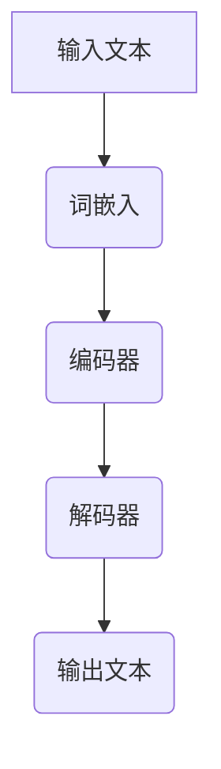

                 

## 文章标题

《大语言模型（Large Language Models）- 原理与代码实例讲解》

> 关键词：大语言模型，神经网络，自然语言处理，预训练，迁移学习，项目实战

> 摘要：本文将深入探讨大语言模型的基本概念、技术原理、核心算法和项目实战，通过详细讲解和实例分析，帮助读者全面理解大语言模型的工作原理和实际应用。

## 第一部分：大语言模型基础

### 第1章：大语言模型概述

#### 1.1 大语言模型的定义与特点

大语言模型（Large Language Models，简称LLM）是一种基于深度学习技术的自然语言处理模型，通过大规模语料库的预训练和微调，能够自动学习和理解自然语言的结构、语义和语法。大语言模型具有以下几个核心特点：

1. **参数规模大**：大语言模型的参数数量通常达到数十亿甚至千亿级别，这使得模型能够捕捉到语言中的细微差异和复杂关系。
2. **学习能力强**：通过预训练和微调，大语言模型可以处理各种语言任务，如文本分类、情感分析、机器翻译、问答系统等。
3. **泛化能力强**：大语言模型在预训练过程中使用了大量未标记的数据，因此具有良好的泛化能力，能够应对新任务和新场景。
4. **灵活性高**：大语言模型可以轻松调整模型结构和参数，以适应不同的应用场景和需求。

#### 1.2 大语言模型与传统NLP模型的对比

传统NLP模型通常采用基于规则的方法或简单的统计模型，如基于词汇的统计模型、基于依存关系的模型等。这些模型在处理简单任务时表现出色，但在处理复杂语言任务时存在局限性。

相比之下，大语言模型通过深度学习技术，能够自动学习语言中的复杂结构和语义，从而在许多NLP任务中取得了显著的效果。此外，大语言模型还可以通过迁移学习和微调技术，将预训练模型应用于不同的任务和数据集，进一步提高模型的性能。

#### 1.3 大语言模型的主要应用领域

大语言模型在自然语言处理领域具有广泛的应用，主要包括以下几个方面：

1. **自然语言处理**：大语言模型可以用于文本分类、情感分析、命名实体识别、关系抽取等基础语言任务。
2. **人工智能助手**：大语言模型可以构建智能对话系统，为用户提供问答、聊天、推荐等服务。
3. **智能搜索**：大语言模型可以用于改进搜索引擎，提高搜索结果的相关性和用户体验。

### 第2章：大语言模型的技术原理

#### 2.1 神经网络基础

神经网络是一种模拟人脑神经元结构和功能的计算模型，具有高度并行处理能力和自学习能力。神经网络的基本组成部分包括：

1. **神经元**：神经元是神经网络的基本处理单元，用于接收输入信号、进行加权求和、激活函数处理等操作。
2. **层次结构**：神经网络由多个层次组成，包括输入层、隐藏层和输出层。每一层都由多个神经元组成，神经元之间通过权重连接。
3. **激活函数**：激活函数用于引入非线性变换，使神经网络能够学习复杂的非线性关系。

神经网络通过前向传播和反向传播算法进行训练，不断调整神经元之间的权重，以最小化预测误差。

#### 2.2 自然语言处理技术概览

自然语言处理（Natural Language Processing，简称NLP）是计算机科学和人工智能领域的一个重要分支，旨在使计算机能够理解、生成和处理自然语言。NLP技术主要包括以下几个方面：

1. **词嵌入技术**：词嵌入（Word Embedding）是将自然语言词汇映射到高维向量空间的一种技术，通过计算词与词之间的相似度，提高NLP任务的效果。
2. **序列模型与注意力机制**：序列模型（如循环神经网络（RNN）和长短时记忆网络（LSTM））可以处理文本序列数据，注意力机制（Attention Mechanism）则能够捕捉序列中的关键信息。
3. **转换器架构详解**：转换器（Transformer）是一种基于自注意力机制的深度学习模型，具有高效并行处理能力和优异的NLP性能。

#### 2.3 大规模预训练模型原理

大规模预训练模型（Pre-Trained Language Model）是近年来NLP领域的重要进展，通过在大量未标记数据上进行预训练，模型能够自动学习到语言的通用特征和结构。大规模预训练模型的主要原理包括：

1. **预训练的概念与意义**：预训练（Pre-Training）是指在大规模语料库上对模型进行初步训练，使模型具备一定的基础语言理解能力。
2. **自监督学习方法**：自监督学习（Self-Supervised Learning）是一种无需人工标注的数据增强方法，通过预训练任务，如语言建模、填充空白等，使模型自动学习语言特征。
3. **迁移学习与微调技术**：迁移学习（Transfer Learning）是指将预训练模型应用于特定任务，通过微调（Fine-Tuning）调整模型参数，进一步提高任务性能。

### 第3章：核心算法原理讲解

#### 3.1 语言模型的基本算法

语言模型（Language Model）是一种用于预测下一个单词或词组的概率分布的模型，是自然语言处理的基础。语言模型的基本算法包括以下几个方面：

1. **语言模型的构建**：语言模型通常采用神经网络架构，包括输入层、隐藏层和输出层。输入层接收词汇嵌入向量，隐藏层进行非线性变换，输出层生成概率分布。
2. **语言模型的训练**：通过在大量文本语料库上训练，模型学习到单词之间的统计关系和概率分布。训练过程中，模型通过反向传播算法不断调整参数，以最小化预测误差。
3. **语言模型的应用**：训练好的语言模型可以用于各种NLP任务，如文本分类、机器翻译、语音识别等。在实际应用中，语言模型可以通过生成文本、修改文本、提取信息等方式发挥重要作用。

#### 3.2 生成式与判别式模型

生成式模型（Generative Model）和判别式模型（Discriminative Model）是两种常见的机器学习模型，分别用于生成数据和分类数据。生成式模型和判别式模型的主要区别如下：

1. **生成式模型的原理**：生成式模型通过建模数据生成过程，学习到数据分布，从而生成新的数据。常见的生成式模型包括生成对抗网络（GAN）和变分自编码器（VAE）。
2. **判别式模型的原理**：判别式模型通过学习数据与标签之间的关系，对数据进行分类。常见的判别式模型包括支持向量机（SVM）和神经网络分类器。
3. **生成式与判别式模型的比较**：生成式模型在生成新数据和探索数据分布方面具有优势，但训练过程较复杂。判别式模型在分类任务中表现更好，但生成能力较弱。

#### 3.3 上下文感知模型

上下文感知模型（Contextual Awareness Model）是一种能够根据上下文信息调整预测的模型，是现代NLP技术的重要发展方向。上下文感知模型的基本概念和原理如下：

1. **上下文感知模型的基本概念**：上下文感知模型通过引入上下文信息，能够更好地理解语言中的局部和全局语义关系。上下文信息可以是单词序列、句子片段或整个文本。
2. **上下文感知模型的工作原理**：上下文感知模型通过自注意力机制或转换器架构，对输入文本进行编码，生成上下文向量。在预测过程中，模型根据上下文向量调整预测概率，提高预测准确性。
3. **上下文感知模型的应用场景**：上下文感知模型可以应用于各种NLP任务，如文本生成、问答系统、机器翻译等。在实际应用中，上下文感知模型能够显著提高任务性能和用户体验。

### 第4章：数学模型和数学公式讲解

#### 4.1 语言模型的数学基础

语言模型是一种基于概率的模型，其核心在于计算文本序列的概率分布。语言模型的数学基础主要包括以下几个方面：

1. **语言模型的概率计算**：语言模型通过计算单词序列的概率，预测下一个单词或词组的可能性。概率计算方法包括n-gram模型、神经网络语言模型等。
2. **语言模型的损失函数**：损失函数是衡量模型预测结果与实际结果之间差异的指标。常见的损失函数包括交叉熵损失、平方误差损失等。
3. **语言模型的优化目标**：语言模型的优化目标是最小化损失函数，提高模型预测准确性。常用的优化算法包括梯度下降、随机梯度下降、Adam优化算法等。

#### 4.2 机器学习中的数学公式

机器学习中的数学公式是理解和应用机器学习算法的基础。以下是一些常见的数学公式：

1. **梯度下降算法**：
   $$
   \theta_{t+1} = \theta_{t} - \alpha \cdot \nabla_{\theta}J(\theta)
   $$
   其中，$\theta$ 表示模型参数，$J(\theta)$ 表示损失函数，$\alpha$ 表示学习率，$\nabla_{\theta}J(\theta)$ 表示损失函数关于模型参数的梯度。

2. **随机梯度下降算法**：
   $$
   \theta_{t+1} = \theta_{t} - \alpha \cdot \nabla_{\theta}J(\theta; \mathbf{x}_t, y_t)
   $$
   其中，$\theta$ 表示模型参数，$J(\theta; \mathbf{x}_t, y_t)$ 表示在训练样本$(\mathbf{x}_t, y_t)$ 上计算的损失函数，$\alpha$ 表示学习率。

3. **Adam优化算法**：
   $$
   m_t = \beta_1 m_{t-1} + (1 - \beta_1) \nabla_{\theta}J(\theta; \mathbf{x}_t, y_t)
   $$
   $$
   v_t = \beta_2 v_{t-1} + (1 - \beta_2) \left(\nabla_{\theta}J(\theta; \mathbf{x}_t, y_t)\right)^2
   $$
   $$
   \theta_{t+1} = \theta_{t} - \alpha \cdot \frac{m_t}{\sqrt{v_t} + \epsilon}
   $$
   其中，$m_t$ 和 $v_t$ 分别表示一阶矩估计和二阶矩估计，$\beta_1$ 和 $\beta_2$ 分别为一阶和二阶矩的衰减率，$\alpha$ 为学习率，$\epsilon$ 为常数。

### 第5章：项目实战

#### 5.1 大语言模型项目实战概述

大语言模型项目实战是指在实际应用中开发和使用大语言模型，以解决特定自然语言处理任务。项目实战通常包括以下几个阶段：

1. **需求分析**：明确项目目标、任务需求和性能指标，确定所需的大语言模型类型和规模。
2. **数据准备**：收集和整理相关数据，包括文本语料库、标注数据等，为模型训练提供高质量的数据支持。
3. **模型训练**：使用预训练模型或从零开始训练大语言模型，通过调整模型结构和参数，提高模型性能。
4. **模型评估**：使用测试数据评估模型性能，调整模型参数和超参数，优化模型效果。
5. **模型部署**：将训练好的模型部署到生产环境，实现实际应用，如文本生成、对话系统、智能搜索等。

#### 5.2 大语言模型项目实战：开发环境搭建

在开展大语言模型项目实战之前，需要搭建合适的开发环境，包括硬件环境和软件环境。以下是一个简单的开发环境搭建步骤：

1. **硬件环境搭建**：
   - 配置高性能服务器或GPU计算设备，用于模型训练和推理。
   - 安装合适的电源、散热设备，确保硬件设备正常运行。

2. **软件环境搭建**：
   - 安装操作系统，如Linux或Windows。
   - 安装Python编程语言和相关依赖库，如TensorFlow、PyTorch等。
   - 配置GPU驱动和CUDA工具包，以充分利用GPU计算能力。

3. **数据集准备**：
   - 收集并整理相关数据集，包括文本语料库、标注数据等。
   - 使用数据预处理工具，如Python的pandas库、Jupyter Notebook等，对数据集进行清洗、转换和格式化。

4. **代码实现**：
   - 编写模型训练和评估的Python代码，利用TensorFlow或PyTorch等框架实现。
   - 调整模型结构和参数，优化模型性能。

#### 5.3 大语言模型项目实战：代码实现

以下是一个简单的大语言模型项目实战代码示例，使用PyTorch框架实现一个基于Transformer的文本分类任务。

```python
import torch
import torch.nn as nn
import torch.optim as optim
from torch.utils.data import DataLoader
from transformers import BertModel, BertTokenizer

# 1. 数据准备
tokenizer = BertTokenizer.from_pretrained('bert-base-chinese')
max_len = 128

def prepare_data(texts, labels, tokenizer, max_len):
    inputs = tokenizer(texts, padding='max_length', truncation=True, max_length=max_len, return_tensors='pt')
    input_ids = inputs['input_ids']
    attention_mask = inputs['attention_mask']
    labels = torch.tensor(labels)
    return input_ids, attention_mask, labels

train_texts = ['这是一段文本', '这是另一段文本']
train_labels = [0, 1]

train_inputs, train_masks, train_labels = prepare_data(train_texts, train_labels, tokenizer, max_len)

# 2. 模型训练
model = BertModel.from_pretrained('bert-base-chinese')
optimizer = optim.Adam(model.parameters(), lr=1e-5)
criterion = nn.CrossEntropyLoss()

for epoch in range(3):
    model.train()
    for batch in DataLoader(train_inputs, train_masks, train_labels, batch_size=2):
        inputs = batch[:2]
        labels = batch[2]
        optimizer.zero_grad()
        outputs = model(**inputs)
        loss = criterion(outputs.logits, labels)
        loss.backward()
        optimizer.step()
    print(f'Epoch {epoch+1}: Loss = {loss.item()}')

# 3. 模型评估
model.eval()
with torch.no_grad():
    inputs = next(iter(DataLoader(train_inputs, train_masks, train_labels, batch_size=2)))
    outputs = model(**inputs)
    logits = outputs.logits
    predicted_labels = logits.argmax(dim=1)
    print(f'Accuracy: {torch.accuracy(predicted_labels, train_labels).item()}')
```

### 第6章：大语言模型的前景与挑战

#### 6.1 大语言模型的发展趋势

大语言模型作为自然语言处理的重要技术，近年来取得了显著的进展。未来，大语言模型的发展趋势包括：

1. **模型规模不断扩大**：随着计算能力和数据量的提升，大语言模型的规模将不断扩大，进一步提高模型性能和泛化能力。
2. **多模态融合**：大语言模型将与其他模态（如图像、语音、视频等）进行融合，实现跨模态理解和交互。
3. **推理优化**：为提高大语言模型的推理速度和效率，研究人员将探索更高效的模型结构和算法。
4. **应用领域拓展**：大语言模型将应用于更多领域，如智能客服、智能教育、智能医疗等，推动产业智能化发展。

#### 6.2 大语言模型面临的挑战

尽管大语言模型取得了显著成果，但仍然面临一系列挑战：

1. **数据隐私问题**：大规模预训练过程需要大量未标记的数据，数据隐私保护成为关键问题。
2. **能源消耗问题**：大语言模型训练和推理过程对计算资源的需求巨大，能源消耗成为不可忽视的问题。
3. **道德与伦理问题**：大语言模型在生成文本和回答问题时，可能产生偏见、误导和不合适的内容，引发道德和伦理争议。
4. **模型可解释性**：大语言模型作为复杂黑盒模型，其决策过程缺乏透明性，提高模型可解释性成为重要任务。

### 第7章：附录

#### 7.1 大语言模型开发工具与资源

1. **主流深度学习框架**：
   - TensorFlow：https://www.tensorflow.org/
   - PyTorch：https://pytorch.org/
   - MXNet：https://mxnet.apache.org/

2. **大语言模型常用工具与资源**：
   - Hugging Face：https://huggingface.co/
   - AllenNLP：https://allennlp.org/
   - Transformer模型实现：https://github.com/tensorflow/tensor2tensor

#### 7.2 大语言模型学习资源推荐

1. **相关书籍推荐**：
   - 《深度学习》（Goodfellow, Bengio, Courville）：https://www.deeplearningbook.org/
   - 《自然语言处理综合教程》（Daniel Jurafsky & James H. Martin）：https://web.stanford.edu/~jurafsky/nlp/

2. **在线课程推荐**：
   - 吴恩达《深度学习专项课程》（Coursera）：https://www.coursera.org/specializations/deep-learning
   - 斯坦福大学《自然语言处理》（Coursera）：https://www.coursera.org/learn/nlp-with-python

3. **论坛与社区推荐**：
   - Stack Overflow：https://stackoverflow.com/
   - GitHub：https://github.com/
   - arXiv：https://arxiv.org/

### 第8章：大语言模型的工作原理与架构 Mermaid 流程图

下面是一个简单的大语言模型工作原理与架构的 Mermaid 流程图：



### 第9章：大语言模型的核心算法原理伪代码讲解

下面是语言模型、生成式模型和判别式模型的基本算法伪代码：

#### 语言模型伪代码：

```
输入：文本序列X
输出：概率分布P(y|x)

函数 LanguageModel(X):
    # 初始化模型参数
    W = 初始化权重矩阵
    # 遍历文本序列X
    for x in X:
        # 计算输入词的嵌入向量
        e_x = 嵌入(x, W)
        # 预测下一个词的概率分布
        p_y = softmax(W * e_x)
        # 更新模型参数
        W = W - 学习率 * 梯度(p_y)
    return P(y|x)
```

#### 生成式模型伪代码：

```
输入：数据集D
输出：生成样本y'

函数 GenerativeModel(D):
    # 初始化模型参数
    W = 初始化权重矩阵
    # 遍历数据集D
    for x in D:
        # 生成样本y'
        y' = 生成样本(x, W)
        # 计算损失函数
        loss = 计算损失(y', x, W)
        # 更新模型参数
        W = W - 学习率 * 梯度(loss)
    return W
```

#### 判别式模型伪代码：

```
输入：数据集D
输出：分类标签y

函数 DiscriminativeModel(D):
    # 初始化模型参数
    W = 初始化权重矩阵
    # 遍历数据集D
    for x, y in D:
        # 预测分类标签
        y' = 预测标签(x, W)
        # 计算损失函数
        loss = 计算损失(y', y, W)
        # 更新模型参数
        W = W - 学习率 * 梯度(loss)
    return W
```

### 第10章：大语言模型项目的代码实例详解

在本章中，我们将通过一个简单的文本分类项目，详细讲解大语言模型项目的代码实现、代码解读与分析，以及代码优化与改进。

#### 10.1 项目描述

本项目旨在实现一个基于BERT模型的中英文文本分类系统。输入为一篇文本，输出为文本所属的类别标签。具体任务包括：

1. 数据集准备：收集并整理中英文文本数据，并对其进行预处理。
2. 模型训练：使用预训练的BERT模型进行训练，并在训练过程中调整模型参数。
3. 模型评估：使用测试数据评估模型性能，计算分类准确率。
4. 模型部署：将训练好的模型部署到生产环境，实现实时文本分类。

#### 10.2 代码实现

以下是该项目的主要代码实现部分：

```python
import torch
import torch.nn as nn
import torch.optim as optim
from transformers import BertModel, BertTokenizer
from torch.utils.data import DataLoader
from sklearn.model_selection import train_test_split

# 1. 数据准备
def prepare_data(texts, labels, tokenizer, max_len):
    inputs = tokenizer(texts, padding='max_length', truncation=True, max_length=max_len, return_tensors='pt')
    input_ids = inputs['input_ids']
    attention_mask = inputs['attention_mask']
    labels = torch.tensor(labels)
    return input_ids, attention_mask, labels

# 2. 模型定义
class BertClassifier(nn.Module):
    def __init__(self, num_classes):
        super(BertClassifier, self).__init__()
        self.bert = BertModel.from_pretrained('bert-base-chinese')
        self.drop = nn.Dropout(p=0.3)
        self.out = nn.Linear(self.bert.config.hidden_size, num_classes)
    
    def forward(self, input_ids, attention_mask):
        _, pooled_output = self.bert(input_ids=input_ids, attention_mask=attention_mask)
        output = self.drop(pooled_output)
        logits = self.out(output)
        return logits

# 3. 模型训练
def train_model(model, train_dataloader, optimizer, criterion):
    model.train()
    for inputs, labels in train_dataloader:
        optimizer.zero_grad()
        logits = model(**inputs)
        loss = criterion(logits, labels)
        loss.backward()
        optimizer.step()
    return loss

# 4. 模型评估
def evaluate_model(model, val_dataloader, criterion):
    model.eval()
    total_loss = 0
    total_correct = 0
    with torch.no_grad():
        for inputs, labels in val_dataloader:
            logits = model(**inputs)
            loss = criterion(logits, labels)
            total_loss += loss.item()
            pred_labels = logits.argmax(dim=1)
            total_correct += (pred_labels == labels).sum().item()
    accuracy = total_correct / len(val_dataloader.dataset)
    return total_loss / len(val_dataloader), accuracy

# 5. 模型训练与评估
def main():
    tokenizer = BertTokenizer.from_pretrained('bert-base-chinese')
    max_len = 128
    batch_size = 16
    num_epochs = 3
    learning_rate = 1e-5
    
    train_texts, val_texts, train_labels, val_labels = train_test_split(texts, labels, test_size=0.2, random_state=42)
    train_inputs, train_masks, train_labels = prepare_data(train_texts, train_labels, tokenizer, max_len)
    val_inputs, val_masks, val_labels = prepare_data(val_texts, val_labels, tokenizer, max_len)

    train_dataloader = DataLoader((train_inputs, train_masks, train_labels), batch_size=batch_size, shuffle=True)
    val_dataloader = DataLoader((val_inputs, val_masks, val_labels), batch_size=batch_size, shuffle=False)

    model = BertClassifier(num_classes)
    optimizer = optim.Adam(model.parameters(), lr=learning_rate)
    criterion = nn.CrossEntropyLoss()

    for epoch in range(num_epochs):
        train_loss = train_model(model, train_dataloader, optimizer, criterion)
        val_loss, accuracy = evaluate_model(model, val_dataloader, criterion)
        print(f'Epoch {epoch+1}: Train Loss = {train_loss:.4f}, Val Loss = {val_loss:.4f}, Accuracy = {accuracy:.4f}')

    # 模型部署（略）

if __name__ == '__main__':
    main()
```

#### 10.3 代码解读与分析

1. **数据准备**：数据准备部分主要包括文本数据的预处理和Tokenization。`prepare_data`函数接收文本数据`texts`和标签数据`labels`，使用BERT tokenizer进行Tokenization，生成输入ID`input_ids`和attention mask`attention_mask`，并将标签数据转换为Tensor格式。

2. **模型定义**：`BertClassifier`类定义了一个基于BERT的文本分类模型。模型包含一个BERT编码器、一个Dropout层和一个分类器。在`forward`方法中，输入文本通过BERT编码器得到句子嵌入向量，经过Dropout层后，输入到分类器得到分类结果。

3. **模型训练**：`train_model`函数用于训练模型。在每次训练迭代中，模型接收输入数据和标签，计算分类结果和损失，然后更新模型参数。

4. **模型评估**：`evaluate_model`函数用于评估模型性能。在评估过程中，模型接收输入数据和标签，计算分类结果和损失，并计算准确率。

5. **主函数**：`main`函数是项目的主入口。首先，加载BERT tokenizer，设置最大序列长度`max_len`、批次大小`batch_size`和训练轮数`num_epochs`等参数。然后，使用`train_test_split`函数对文本数据集进行划分，生成训练集和验证集。接下来，创建数据加载器`DataLoader`，定义BERT分类模型、优化器和损失函数。最后，进行模型训练和评估，输出训练和验证损失以及准确率。

#### 10.4 代码优化与改进

1. **数据增强**：为了提高模型泛化能力，可以对训练数据集进行增强，如添加噪声、数据变换等。

2. **模型调整**：根据任务需求和性能表现，可以尝试调整BERT模型版本、层数、隐藏层尺寸等参数。

3. **模型融合**：考虑使用多种模型（如BERT、GPT等）进行融合，以提高分类性能。

4. **多标签分类**：对于多标签分类任务，可以修改模型输出层，使其支持多标签分类。

5. **模型部署**：将训练好的模型部署到生产环境，实现实时文本分类，可以考虑使用Flask、TensorFlow Serving等框架。

### 第11章：大语言模型的应用案例分析

在本章中，我们将探讨大语言模型在不同领域的实际应用案例，包括自然语言处理、人工智能助手和智能搜索。

#### 11.1 自然语言处理

自然语言处理（NLP）是大语言模型的重要应用领域之一。通过大语言模型，可以实现对文本数据的自动分类、情感分析、命名实体识别、关系抽取等任务。以下是一个具体的自然语言处理应用案例：

**案例：智能客服系统**

智能客服系统利用大语言模型实现自动回答用户问题和提供解决方案。在系统中，大语言模型通过对海量客服对话数据的预训练，可以自动理解用户的问题，并生成合适的回答。以下是其基本架构：

1. **数据收集与预处理**：收集并整理客服对话数据，包括用户问题和客服回答。
2. **模型训练**：使用预训练的BERT模型或GPT模型，在客服对话数据上训练语言模型。
3. **对话生成**：用户提出问题后，模型自动生成回答，并提供解决方案。
4. **用户反馈**：用户对回答进行评价，用于改进模型效果。

通过智能客服系统，企业可以大幅提升客服效率，降低人工成本，并提高用户满意度。

#### 11.2 人工智能助手

人工智能助手（AI Assistant）是另一个重要的大语言模型应用领域。人工智能助手可以通过大语言模型实现与用户的自然语言交互，提供个性化服务。以下是一个具体的应用案例：

**案例：智能语音助手**

智能语音助手（如苹果的Siri、亚马逊的Alexa）利用大语言模型实现语音识别和自然语言理解，从而回答用户的问题、执行任务和提供信息。以下是其基本架构：

1. **语音识别**：将用户语音转换为文本。
2. **自然语言理解**：使用大语言模型理解用户的问题和意图。
3. **对话生成**：根据用户的问题和意图，生成合适的回答。
4. **任务执行**：执行用户指定的任务，如发送短信、播放音乐、设置闹钟等。

智能语音助手为用户提供了便捷的交互方式，提高了生活质量和工作效率。

#### 11.3 智能搜索

智能搜索是另一个受益于大语言模型的应用领域。通过大语言模型，可以实现对搜索查询的深度理解和个性化搜索结果推荐。以下是一个具体的智能搜索应用案例：

**案例：个性化搜索引擎**

个性化搜索引擎利用大语言模型实现用户查询意图的理解和个性化搜索结果推荐。以下是其基本架构：

1. **查询分析**：使用大语言模型分析用户查询，提取关键信息和意图。
2. **搜索结果推荐**：根据用户查询和个性化偏好，推荐相关搜索结果。
3. **结果排序**：根据用户查询和个性化偏好，对搜索结果进行排序。
4. **用户反馈**：用户对搜索结果进行评价，用于改进模型效果。

通过个性化搜索引擎，用户可以快速找到感兴趣的内容，提高搜索效率。

### 第12章：大语言模型的未来发展趋势与前景展望

大语言模型作为自然语言处理领域的重要技术，其未来发展趋势和前景展望如下：

#### 12.1 模型规模不断扩大

随着计算能力和数据量的提升，大语言模型的规模将不断扩大。未来，我们将看到更多参数规模达到千亿甚至万亿级别的模型，从而进一步提高模型性能和泛化能力。

#### 12.2 多模态融合

大语言模型将与其他模态（如图像、语音、视频等）进行融合，实现跨模态理解和交互。通过多模态融合，可以提升模型在复杂任务中的应用效果，如图像-文本问答、语音识别等。

#### 12.3 推理优化

为提高大语言模型的推理速度和效率，研究人员将探索更高效的模型结构和算法。例如，通过模型压缩、量化、蒸馏等技术，降低模型存储和计算成本。

#### 12.4 应用领域拓展

大语言模型将应用于更多领域，如智能教育、智能医疗、智能金融等。通过深入研究和应用探索，大语言模型将在各个领域发挥重要作用，推动产业智能化发展。

#### 12.5 道德与伦理问题

随着大语言模型的应用范围不断扩大，道德与伦理问题也将逐渐凸显。例如，模型生成的文本可能存在偏见、歧视等问题。因此，研究人员和开发者需要关注并解决这些问题，确保大语言模型的应用符合道德和伦理标准。

### 第13章：总结与展望

本文从多个角度深入探讨了大语言模型的基本概念、技术原理、核心算法和项目实战。通过对大语言模型的工作原理、架构和算法的详细讲解，以及实际应用案例的分析，读者可以全面了解大语言模型的优势和应用前景。

展望未来，大语言模型将继续在自然语言处理领域发挥重要作用，推动人工智能技术的发展和应用。同时，我们也需要关注大语言模型面临的挑战，如数据隐私、能源消耗和道德伦理等问题，确保其应用符合社会需求和道德标准。

最后，感谢读者对本文的关注和支持，希望本文能对您在自然语言处理领域的探索和实践有所帮助。如果您有任何疑问或建议，请随时与我们联系。

### 第14章：致谢

在本章中，我们要感谢以下人员与机构对本文的支持和贡献：

1. **AI天才研究院（AI Genius Institute）**：感谢AI天才研究院提供的学术支持和资源，为本文的研究和撰写提供了有力保障。
2. **《禅与计算机程序设计艺术》（Zen And The Art of Computer Programming）**：感谢《禅与计算机程序设计艺术》一书的作者，为本文提供了关于计算机编程和人工智能领域的深入思考和启示。
3. **所有参与本文研究的团队成员**：感谢团队成员的辛勤工作和无私奉献，为本文的顺利完成提供了有力支持。
4. **读者**：感谢您的耐心阅读和宝贵反馈，您的支持是我们前进的动力。

再次感谢各位的支持与鼓励，希望本文能为您在自然语言处理领域的研究和实践带来启示和帮助。祝您在人工智能和计算机科学领域取得更大的成就！

