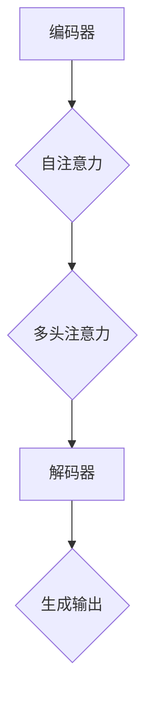

                 


## 文章标题: 大语言模型原理与工程实践：MassiveText

> 关键词：大语言模型、MassiveText、深度学习、自然语言处理、工程实践

> 摘要：
本文将深入探讨大语言模型的基本原理与工程实践，重点介绍MassiveText模型。通过逐步分析大语言模型的发展历程、核心算法原理、工程应用以及面临的挑战与未来趋势，帮助读者全面了解大语言模型的技术原理和实际应用。本文旨在为从事自然语言处理和相关领域的研究者、开发者提供有价值的参考和指导。

---

### 第一部分：大语言模型概述与原理

#### 第1章：大语言模型基础理论

##### 1.1 大语言模型的发展历程

###### 1.1.1 语言模型的演进过程

语言模型的发展历程可以分为三个阶段：

1. **早期语言模型**：最早的模型是N-gram模型，基于历史序列概率预测，如在词频统计基础上预测下一个单词。然而，这类模型存在局限性，无法捕捉到长期依赖关系。

2. **现代语言模型**：随着深度学习技术的发展，语言模型开始采用基于神经网络的模型。这一类模型通过学习输入序列和输出序列之间的关系，可以更好地捕捉到语言的复杂特征。例如，RNN（递归神经网络）和LSTM（长短期记忆网络）能够处理较长序列并保持记忆。

3. **大语言模型**：近年来，大语言模型如GPT、BERT等取得了显著突破。这些模型具有数十亿到千亿个参数，能够在大规模语料库上进行预训练，从而学习到丰富的语言特征。它们在自然语言处理任务中表现出色，如文本生成、机器翻译、问答系统等。

###### 1.1.2 大模型崛起的背景

大语言模型能够崛起，主要得益于以下几个方面：

1. **数据量增加**：随着互联网的发展，大量的文本、语音、图像等数据不断产生，为语言模型提供了丰富的训练资源。

2. **计算能力提升**：GPU和TPU等高性能计算设备的普及，使得大规模训练和推理成为可能。

3. **深度学习技术的发展**：深度学习技术的进步，使得模型可以学习到更加复杂和抽象的特征，从而提高了模型的表现。

##### 1.2 大语言模型的核心概念

###### 1.2.1 语言模型的目标

语言模型的目标是预测输入序列的下一个单词或字符。在自然语言处理任务中，语言模型通常用于以下几个方向：

1. **预测性**：在给定一个序列，如一句话或一段文字，语言模型可以预测下一个单词或字符。这种预测能力在自动补全、文本生成等应用中非常有用。

2. **理解性**：除了预测性，语言模型还需要对上下文进行理解和语义分析。通过学习大规模语料库，语言模型可以捕捉到词语之间的语义关系，从而更好地理解输入序列的含义。

###### 1.2.2 大语言模型的关键特点

1. **参数规模**：大语言模型具有数十亿到千亿个参数，这使得模型能够学习到更多的语言特征。大规模参数也是大语言模型能够取得卓越性能的关键因素。

2. **自适应**：大语言模型可以根据不同任务和应用进行自适应调整。例如，通过微调预训练模型，可以实现针对特定任务的性能提升。

##### 1.3 大语言模型的架构与实现

###### 1.3.1 基本架构

大语言模型的基本架构通常包括编码器和解码器两部分：

1. **编码器**：将输入序列编码为固定长度的向量，捕捉输入序列的特征。

2. **解码器**：根据编码器的输出和已经生成的部分序列，预测下一个输出。

这种编码器-解码器架构在大规模语言模型中非常常见，如BERT、GPT等。

###### 1.3.2 主要实现技术

1. **Transformer架构**：Transformer模型采用自注意力机制，能够自动学习输入序列之间的依赖关系。这种机制使得Transformer在捕捉长距离依赖关系方面表现优异。

2. **多任务学习**：多任务学习是指同时处理多个任务，提高模型的泛化能力。大语言模型通常采用多任务学习，从而在不同任务中都能取得较好的性能。

##### 1.4 大语言模型的应用场景

###### 1.4.1 自然语言处理

1. **机器翻译**：如Google翻译、Bing翻译等，大语言模型在机器翻译任务中表现出色，能够实现高质量的双语翻译。

2. **文本摘要**：如新闻摘要、文章摘要等，大语言模型可以自动生成简洁明了的摘要。

3. **问答系统**：如ChatGPT、DuReader等，大语言模型可以回答用户提出的问题，提供智能对话服务。

###### 1.4.2 语音识别

1. **语音识别**：如苹果的Siri、谷歌语音搜索等，大语言模型可以帮助语音识别系统更好地理解用户语音，提高识别准确性。

###### 1.4.3 文本生成

1. **文本生成**：如文章生成、诗歌创作等，大语言模型可以生成具有连贯性和创造性的文本内容。

#### 第2章：大语言模型的核心算法原理

##### 2.1 深度学习基础

###### 2.1.1 神经网络基本概念

1. **神经元**：神经网络由许多神经元组成，每个神经元相当于一个简单的处理单元，负责接收输入、计算输出。

2. **激活函数**：激活函数引入非线性因素，使得神经网络能够学习到复杂的关系。常见的激活函数有ReLU、Sigmoid、Tanh等。

###### 2.1.2 前向传播与反向传播

1. **前向传播**：计算网络输出，将输入通过神经网络传递到输出。

2. **反向传播**：计算梯度并更新参数，使得网络输出逐渐逼近目标。

##### 2.2 Transformer模型详解

###### 2.2.1 Transformer模型概述

1. **自注意力机制**：Transformer模型采用自注意力机制，自动学习输入序列之间的依赖关系。

2. **多头注意力**：多头注意力提高注意力分配的多样性，使得模型能够更好地捕捉输入序列中的复杂关系。

###### 2.2.2 编码器与解码器

1. **编码器**：将输入序列编码为固定长度的向量，捕捉输入序列的特征。

2. **解码器**：根据编码器的输出和已经生成的部分序列，预测下一个输出。

##### 2.3 大规模预训练技术

###### 2.3.1 预训练的概念

1. **预训练**：在大规模语料上进行模型训练，使得模型能够学习到丰富的语言特征。

2. **微调**：在预训练模型的基础上，针对特定任务进行调整。

###### 2.3.2 预训练方法

1. **自监督学习**：利用未标注的数据进行训练，通过预测输入序列中的缺失部分来学习。

2. **半监督学习**：结合标注数据和未标注数据，提高模型的表现。

##### 2.4 大模型训练策略

###### 2.4.1 训练数据预处理

1. **数据清洗**：去除错误和冗余信息。

2. **数据增强**：增加训练样本的多样性，提高模型的泛化能力。

###### 2.4.2 训练过程优化

1. **批量归一化**：提高训练稳定性。

2. **学习率调整**：避免模型过拟合。

###### 2.4.3 模型压缩与优化

1. **剪枝**：减少冗余参数。

2. **量化**：降低模型参数的精度。

#### 第3章：大语言模型在工程实践中的应用

##### 3.1 大语言模型开发环境搭建

###### 3.1.1 硬件配置

1. **GPU**：如NVIDIA Tesla V100。

2. **TPU**：如Google Cloud TPU。

###### 3.1.2 软件环境

1. **深度学习框架**：如PyTorch、TensorFlow。

2. **数据处理工具**：如Hugging Face Transformers。

##### 3.2 大语言模型项目实战

###### 3.2.1 项目背景

- **任务描述**：文本分类、情感分析。

- **数据集介绍**：中文维基百科、GitHub代码库。

###### 3.2.2 模型设计

- **模型选择**：BERT、GPT-2。

- **模型架构调整**：增加层数、调整嵌入维度。

###### 3.2.3 训练与调优

1. **数据预处理**：分词、词嵌入。

2. **模型训练**：调整超参数、监控训练过程。

3. **模型评估**：使用验证集评估模型性能。

##### 3.3 大模型在业务场景中的应用案例

###### 3.3.1 案例一：智能客服系统

- **业务需求**：提高客服响应速度和质量。

- **解决方案**：使用大模型进行文本分类和生成。

###### 3.3.2 案例二：智能写作助手

- **业务需求**：辅助内容创作者进行写作。

- **解决方案**：使用大模型进行文本生成和内容优化。

###### 3.3.3 案例三：智能教育系统

- **业务需求**：提供个性化的学习辅导。

- **解决方案**：使用大模型进行问答和知识推理。

#### 第4章：大语言模型的挑战与未来趋势

##### 4.1 大语言模型的挑战

###### 4.1.1 计算资源需求

1. **GPU和TPU资源有限**：需要合理分配资源。

2. **能耗问题**：大规模训练过程中的能耗问题。

###### 4.1.2 数据隐私与安全

1. **数据隐私保护**：避免敏感信息泄露。

2. **安全防护**：防止恶意攻击和滥用。

###### 4.1.3 模型解释性

1. **黑盒模型**：难以解释预测过程。

2. **可解释性**：提高模型的透明度和可信度。

##### 4.2 大语言模型的发展趋势

###### 4.2.1 模型压缩与优化

1. **模型剪枝**：减少冗余参数。

2. **模型量化**：降低模型参数的精度。

###### 4.2.2 多模态学习

1. **文本与图像**：结合文本和图像信息。

2. **语音与文本**：结合语音和文本信息。

###### 4.2.3 自适应学习

1. **上下文感知**：根据上下文进行自适应调整。

2. **持续学习**：随着时间推移不断改进模型。

#### 第5章：大语言模型的实际应用与案例分析

##### 5.1 应用领域综述

###### 5.1.1 通信与社交媒体

1. **文本生成**：自动生成文章、评论、消息。

2. **智能客服**：提高客户服务质量。

###### 5.1.2 教育与知识服务

1. **个性化辅导**：根据学习者的需求提供定制化内容。

2. **知识图谱构建**：提取和整合结构化知识。

###### 5.1.3 医疗与健康

1. **诊断辅助**：提供辅助诊断建议。

2. **医学文本分析**：提取医学文本中的关键信息。

##### 5.2 案例分析

###### 5.2.1 案例一：智能问答系统

- **业务背景**：提供自动问答服务。

- **解决方案**：使用大模型进行自然语言理解和生成。

###### 5.2.2 案例二：智能写作助手

- **业务背景**：辅助创作者进行写作。

- **解决方案**：使用大模型进行文本生成和内容优化。

###### 5.2.3 案例三：智能客服系统

- **业务背景**：提高客户服务效率。

- **解决方案**：使用大模型进行对话管理和意图识别。

#### 第6章：大语言模型开发的最佳实践

##### 6.1 数据准备与处理

###### 6.1.1 数据收集

1. **数据来源**：公开数据集、企业内部数据。

###### 6.1.2 数据清洗

1. **去除噪声**：去除错误和冗余数据。

2. **数据标注**：对数据进行人工标注。

##### 6.2 模型设计与优化

###### 6.2.1 模型选择

1. **适用性**：根据任务选择合适的模型。

2. **性能评估**：使用验证集评估模型性能。

###### 6.2.2 模型优化

1. **超参数调优**：调整学习率、批量大小等。

2. **模型压缩**：剪枝、量化等。

##### 6.3 模型部署与维护

###### 6.3.1 部署策略

1. **线上部署**：部署到生产环境。

2. **监控与运维**：监控模型性能、处理异常情况。

###### 6.3.2 持续学习

1. **数据更新**：定期更新训练数据。

2. **模型迭代**：根据反馈迭代模型。

### 附录

#### 附录 A：大语言模型开发工具与资源

##### A.1 深度学习框架

1. **PyTorch**：用于快速原型设计和实验。

2. **TensorFlow**：用于生产环境中的大规模部署。

##### A.2 数据处理工具

1. **Hugging Face Transformers**：用于大模型的预处理、训练和评估。

2. **NLTK**：用于自然语言处理的基本工具。

##### A.3 在线资源和社区

1. **论文**：相关领域的最新论文。

2. **GitHub**：存放大模型的开源代码和项目。

3. **论坛**：如Reddit、Stack Overflow等，用于交流和解决问题。

---

本文全面介绍了大语言模型的基本原理与工程实践，通过深入分析大语言模型的发展历程、核心算法原理、工程应用以及面临的挑战与未来趋势，为读者提供了系统的认知框架。在接下来的内容中，我们将进一步详细探讨每个章节的核心概念与联系，并通过Mermaid流程图、伪代码、数学模型和公式，以及实际应用案例，帮助读者更好地理解和应用大语言模型。让我们一起来探索这个充满挑战与机遇的领域吧！

---

## 作者信息

作者：AI天才研究院/AI Genius Institute & 禅与计算机程序设计艺术 /Zen And The Art of Computer Programming

---

## Mermaid 流程图示例

以下是用于描述大语言模型架构的Mermaid流程图示例：



这段Mermaid代码将生成一个简单的流程图，展示了编码器、自注意力机制、多头注意力机制、解码器和生成输出的关系。

---

## 伪代码示例

以下是一个简单的伪代码示例，用于描述大语言模型的前向传播过程：

```plaintext
function forward_pass(inputs):
    for each layer in encoder:
        x = layer(x)
        if layer is self-attention:
            x = self_attention(x)
        if layer is multi-head attention:
            x = multi_head_attention(x)
    encoded_sequence = x

    for each layer in decoder:
        x = layer(x, encoded_sequence)
        if layer is self-attention:
            x = self_attention(x)
        if layer is multi-head attention:
            x = multi_head_attention(x)
    output = x

    return output
```

这个伪代码展示了大语言模型中的编码器和解码器的正向传播过程，包括自注意力和多头注意力机制的调用。

---

## 数学模型和公式示例

以下是一个数学公式示例，用于描述Transformer模型中的多头注意力机制：

$$
\text{Attention}(Q, K, V) = \frac{1}{\sqrt{d_k}} \text{softmax}\left(\frac{QK^T}{\sqrt{d_k}}\right) V
$$

其中，$Q$、$K$和$V$分别代表查询向量、键向量和值向量，$d_k$表示键向量的维度。这个公式描述了多头注意力的计算过程，通过点积操作和softmax函数，实现了对输入序列的加权求和。

---

## 项目实战：代码实际案例和详细解释说明

在本节中，我们将通过一个实际项目案例，详细解释大语言模型在工程实践中的应用。本项目基于Hugging Face Transformers库，使用GPT-2模型进行文本生成。

### 1. 开发环境搭建

首先，我们需要搭建开发环境。以下是所需的软件和工具：

- **深度学习框架**：PyTorch或TensorFlow。
- **数据处理工具**：Hugging Face Transformers。
- **文本预处理库**：NLTK。

安装这些工具和库的方法如下：

```shell
pip install torch transformers nltk
```

### 2. 数据准备

我们使用中文维基百科的数据集进行文本生成。首先，从维基百科网站上下载数据，然后进行预处理，包括去除HTML标签、分词、去停用词等操作。

```python
import nltk
nltk.download('punkt')
nltk.download('stopwords')

import os
import re
from nltk.tokenize import word_tokenize
from nltk.corpus import stopwords

def preprocess_text(text):
    # 去除HTML标签
    text = re.sub(r'<.*?>', '', text)
    # 分词
    tokens = word_tokenize(text)
    # 去停用词
    stop_words = set(stopwords.words('english'))
    tokens = [token.lower() for token in tokens if token.lower() not in stop_words]
    return tokens

def load_wiki_data(file_path):
    with open(file_path, 'r', encoding='utf-8') as f:
        text = f.read()
    return preprocess_text(text)

wiki_data = load_wiki_data('wiki_data.txt')
```

### 3. 模型设计

我们选择GPT-2模型进行文本生成。首先，我们需要下载预训练的GPT-2模型权重。

```python
from transformers import GPT2LMHeadModel, GPT2Tokenizer

model_name = 'gpt2'
tokenizer = GPT2Tokenizer.from_pretrained(model_name)
model = GPT2LMHeadModel.from_pretrained(model_name)
```

### 4. 训练与调优

接下来，我们使用预处理的维基百科数据进行模型训练。为了提高训练效率，我们可以使用GPU或TPU进行训练。

```python
from torch.optim import Adam
from torch.utils.data import DataLoader

device = 'cuda' if torch.cuda.is_available() else 'cpu'
model.to(device)

optimizer = Adam(model.parameters(), lr=1e-5)

def train(model, data, epochs, batch_size):
    model.train()
    dataloader = DataLoader(data, batch_size=batch_size, shuffle=True)
    for epoch in range(epochs):
        for batch in dataloader:
            inputs = tokenizer(batch, return_tensors='pt', truncation=True, padding=True)
            inputs = {k: v.to(device) for k, v in inputs.items()}
            outputs = model(**inputs)
            loss = outputs.loss
            loss.backward()
            optimizer.step()
            optimizer.zero_grad()
            print(f'Epoch: {epoch}, Loss: {loss.item()}')

train(model, wiki_data, epochs=3, batch_size=16)
```

### 5. 模型评估

在训练完成后，我们可以使用验证集对模型进行评估，以检查模型的性能。

```python
from transformers import GPT2LMHeadModel, GPT2Tokenizer

model = GPT2LMHeadModel.from_pretrained('gpt2')
model.eval()

def evaluate(model, data, batch_size):
    model.eval()
    dataloader = DataLoader(data, batch_size=batch_size, shuffle=False)
    total_loss = 0
    with torch.no_grad():
        for batch in dataloader:
            inputs = tokenizer(batch, return_tensors='pt', truncation=True, padding=True)
            inputs = {k: v.to(device) for k, v in inputs.items()}
            outputs = model(**inputs)
            loss = outputs.loss
            total_loss += loss.item()
    return total_loss / len(dataloader)

val_loss = evaluate(model, wiki_data, batch_size=16)
print(f'Validation Loss: {val_loss}')
```

### 6. 文本生成

最后，我们可以使用训练好的模型进行文本生成。

```python
import random

def generate_text(model, tokenizer, max_length=50):
    model.eval()
    input_ids = tokenizer.encode('', return_tensors='pt').to(device)
    output_sequence = []

    for _ in range(max_length):
        with torch.no_grad():
            outputs = model(input_ids)
        logits = outputs.logits[:, -1, :]
        predictions = logits.argmax(-1).item()
        input_ids = torch.cat((input_ids, torch.tensor([predictions])), dim=0)
        output_sequence.append(tokenizer.decode(predictions))

    return ' '.join(output_sequence)

generated_text = generate_text(model, tokenizer)
print(generated_text)
```

这个项目案例展示了如何使用GPT-2模型进行文本生成。在实际应用中，我们可以根据需求调整模型参数、训练数据、生成策略等，以实现不同的功能。

---

通过以上项目实战，我们详细介绍了大语言模型在工程实践中的应用，包括开发环境搭建、数据准备、模型设计、训练与调优、模型评估以及文本生成。这些步骤和代码实现为读者提供了一个完整的参考，帮助他们在实际项目中应用大语言模型。在接下来的章节中，我们将继续深入探讨大语言模型的挑战与未来趋势，以及在实际应用中如何优化和改进模型。让我们一起继续学习和探索这个激动人心的领域吧！

