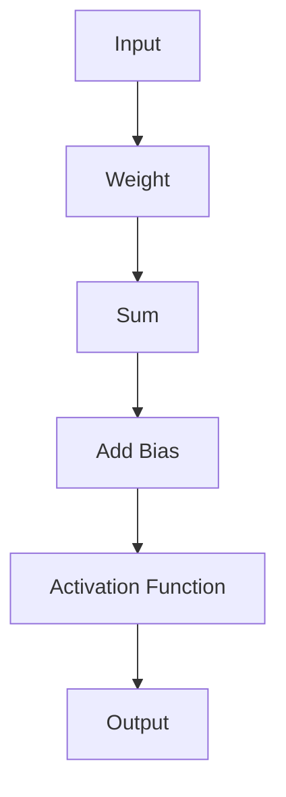
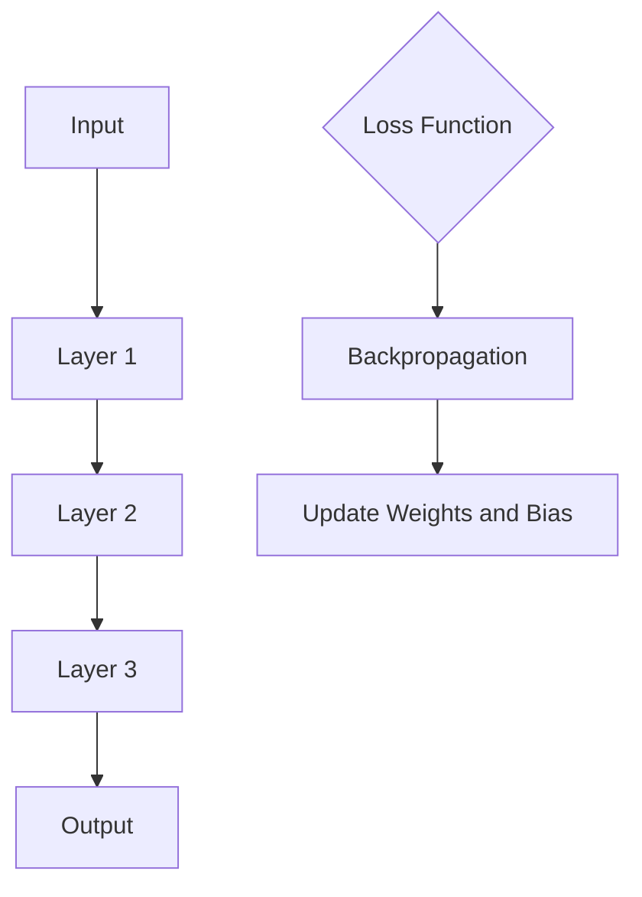

                 

### 文章标题：大语言模型原理与工程实践：大语言模型微调的挑战和探索

> 关键词：大语言模型、微调、挑战、探索、工程实践、神经网络、自然语言处理、Transformer

> 摘要：本文系统地探讨了大规模语言模型的原理及其工程实践中的微调挑战和探索。首先，介绍了大语言模型的基础知识，包括定义、发展历史、应用领域和关键技术。随后，深入解析了神经网络、RNN、LSTM和Transformer等基本原理，并详细阐述了大规模语言模型的训练与优化流程。重点分析了微调的概念、方法、实践及其面临的挑战，结合实际案例，探讨了微调策略、数据增强、模型压缩与量化、模型安全和鲁棒性等方面的应用。最后，展望了大规模语言模型的未来发展趋势，并对我国在该领域的发展进行了讨论。本文旨在为读者提供全面、深入的指导，以应对大规模语言模型微调的挑战和机遇。

## 第一部分：大语言模型基础

### 第1章：大语言模型概述

#### 1.1 大语言模型的定义

大语言模型（Large Language Model）是一种基于深度学习技术的自然语言处理（Natural Language Processing, NLP）模型，它通过大规模的文本数据进行训练，可以理解和生成自然语言。大语言模型通常具有数十亿至数万亿个参数，能够捕捉到自然语言的复杂结构和语义信息。

#### 1.2 大语言模型的发展历史

大语言模型的发展经历了多个阶段，从早期的基于规则的方法到基于统计的方法，再到现代深度学习驱动的模型。关键里程碑包括：1990年代的统计语言模型（如N元语法），2000年代初的循环神经网络（RNN）和长短时记忆网络（LSTM），以及近年来Transformer模型的崛起。

#### 1.3 大语言模型的应用领域

大语言模型在多个领域展现出强大的应用潜力，包括但不限于：

1. 自动问答系统
2. 机器翻译
3. 文本生成
4. 文本摘要
5. 命名实体识别
6. 情感分析
7. 聊天机器人

#### 1.4 大语言模型的关键技术

大语言模型的关键技术包括：

1. **神经网络**：神经网络是深度学习的基础，包括前向传播、反向传播等算法。
2. **词嵌入**：词嵌入将词汇映射到向量空间，以实现语义相似性的计算。
3. **注意力机制**：注意力机制在Transformer模型中发挥关键作用，使得模型能够关注到文本序列中的不同部分。
4. **预训练与微调**：预训练是指在大量无标注数据上训练模型，微调则是在特定任务上进行模型调整，以提高任务性能。

### 第2章：大语言模型的基本原理

#### 2.1 神经网络基础

##### 2.1.1 神经网络的基本结构

神经网络由多个层次组成，包括输入层、隐藏层和输出层。每个层次包含多个神经元，神经元之间通过权重连接。

###### 2.1.1.1 神经元模型

神经元模型包括输入、权重、偏置和激活函数。输入和权重相乘后，加上偏置，通过激活函数得到输出。

###### 2.1.1.2 前向传播与反向传播算法

前向传播是指将输入通过网络层传递到输出层，反向传播则是根据误差信号调整网络的权重和偏置。

#### 2.2 自然语言处理技术概览

##### 2.2.1 词嵌入技术

词嵌入将词汇映射到低维向量空间，常见的词嵌入方法包括Word2Vec、GloVe和BERT等。

###### 2.2.1.1 常见的词嵌入方法

Word2Vec通过预测词的上下文来训练词向量，GloVe通过共现矩阵来学习词的语义关系。

###### 2.2.1.2 词嵌入在NLP中的应用

词嵌入在NLP中的应用广泛，包括文本分类、情感分析、文本生成等任务。

##### 2.2.2 序列模型与注意力机制

###### 2.2.2.1 递归神经网络(RNN)

RNN通过循环结构处理序列数据，能够捕获序列中的长期依赖关系。

###### 2.2.2.2 长短时记忆(LSTM)

LSTM是RNN的一种改进，通过门控机制解决了长短期依赖问题。

###### 2.2.2.3 自注意力机制(Attention)

自注意力机制允许模型在处理序列数据时，根据上下文信息动态调整注意力权重。

##### 2.2.3 转换器架构详解

###### 2.2.3.1 转换器(Transformer)模型的基本结构

转换器模型由编码器和解码器组成，通过多头自注意力机制和位置编码实现序列到序列的映射。

###### 2.2.3.2 转换器模型的核心创新

转换器模型的核心创新在于其自注意力机制和位置编码，使得模型能够高效地处理长文本。

###### 2.2.3.3 转换器模型在NLP中的应用

转换器模型在机器翻译、文本生成、问答系统等领域取得了显著的成果。

### 第3章：大语言模型的训练与优化

#### 3.1 数据预处理

##### 3.1.1 数据清洗与预处理

数据预处理是训练大规模语言模型的重要步骤，包括去除噪声、纠正错误、填充缺失值等。

###### 3.1.1.1 常见的数据清洗方法

常见的数据清洗方法包括去除HTML标签、纠正拼写错误、填充缺失值等。

###### 3.1.1.2 数据预处理的流程

数据预处理的流程通常包括数据收集、数据清洗、数据转换和数据存储等步骤。

##### 3.1.2 数据增强

数据增强是一种提高模型泛化能力的方法，通过生成新的数据样本来扩充训练集。

###### 3.1.2.1 数据增强的概念

数据增强是指在保持数据真实性的前提下，通过变换操作生成新的数据样本来提高模型的泛化能力。

###### 3.1.2.2 常见的数据增强方法

常见的数据增强方法包括随机裁剪、旋转、翻转、缩放等。

#### 3.2 训练流程

##### 3.2.1 模型初始化

模型初始化是训练大规模语言模型的第一步，决定了模型的初始权重。

###### 3.2.1.1 参数初始化的方法

参数初始化的方法包括随机初始化、高斯初始化和Xavier初始化等。

###### 3.2.1.2 参数初始化的技巧

参数初始化的技巧包括避免梯度消失和梯度爆炸等问题。

##### 3.2.2 模型训练

模型训练是指通过迭代优化模型参数，使得模型在训练数据上达到较好的性能。

###### 3.2.2.1 模型训练的过程

模型训练的过程包括前向传播、计算损失函数、反向传播和参数更新等步骤。

###### 3.2.2.2 模型训练的技巧

模型训练的技巧包括学习率调整、正则化、批量归一化等。

##### 3.2.3 模型评估

模型评估是衡量模型性能的重要环节，通过在验证集和测试集上的表现来评估模型的泛化能力。

###### 3.2.3.1 模型评估指标

常见的模型评估指标包括准确率、召回率、F1分数、损失函数值等。

###### 3.2.3.2 模型评估的方法

模型评估的方法包括交叉验证、K折验证和留一验证等。

#### 3.3 模型优化

##### 3.3.1 损失函数

损失函数是模型训练的核心，用于衡量模型预测值和真实值之间的差异。

###### 3.3.1.1 常见的损失函数

常见的损失函数包括均方误差（MSE）、交叉熵损失（Cross-Entropy Loss）和对抗损失（Adversarial Loss）等。

###### 3.3.1.2 损失函数的选择与优化

损失函数的选择与优化对于模型性能至关重要，需要根据任务特点和模型结构进行选择。

##### 3.3.2 优化算法

优化算法用于调整模型参数，以最小化损失函数。

###### 3.3.2.1 常见的优化算法

常见的优化算法包括随机梯度下降（SGD）、Adam和RMSprop等。

###### 3.3.2.2 优化算法的对比与选择

不同优化算法在收敛速度、稳定性等方面有所不同，需要根据实际情况进行选择。

##### 3.3.3 学习率调整

学习率是优化算法中的重要参数，用于控制模型参数更新的步长。

###### 3.3.3.1 学习率的概念

学习率是指每次迭代中模型参数更新的步长。

###### 3.3.3.2 学习率的调整策略

学习率的调整策略包括固定学习率、学习率衰减和自适应学习率等。

#### 3.4 模型评估与调优

##### 3.4.1 模型评估

模型评估是模型训练后的重要步骤，用于评估模型在未知数据上的性能。

###### 3.4.1.1 评估指标的选择

选择合适的评估指标对于评估模型性能至关重要，需要根据任务特点和数据特点进行选择。

###### 3.4.1.2 评估方法的对比

不同的评估方法在评估结果的一致性和可靠性方面有所不同，需要根据实际情况进行对比。

##### 3.4.2 模型调优

模型调优是通过调整模型参数和结构，提高模型在特定任务上的性能。

###### 3.4.2.1 调优的目标

调优的目标是提高模型在特定任务上的性能，包括提高准确率、降低损失函数值等。

###### 3.4.2.2 调优的方法

常见的调优方法包括网格搜索、随机搜索和贝叶斯优化等。

### 第4章：大语言模型的微调

#### 4.1 微调的概念

微调（Fine-tuning）是指在大规模语言模型的基础上，针对特定任务进行模型调整，以提高模型在特定任务上的性能。

##### 4.1.1 微调的定义

微调是指在大规模语言模型的基础上，通过调整模型权重和结构，使其适应特定任务的需求。

##### 4.1.2 微调的优势

微调具有以下优势：

- **提高适应性**：微调使得模型能够更好地适应特定任务的需求，提高模型在特定任务上的性能。
- **降低训练成本**：通过在大规模预训练模型的基础上进行微调，可以减少训练时间和计算资源的需求。

##### 4.1.3 微调的挑战

微调面临的挑战包括：

- **数据集的选择与预处理**：微调需要选择合适的数据集，并进行有效的预处理，以确保模型能够适应特定的任务环境。
- **微调策略的制定与优化**：微调策略的制定与优化对于微调效果至关重要，需要根据任务特点和模型结构进行合理设计。

#### 4.2 微调的方法

##### 4.2.1 零样本学习

零样本学习（Zero-Shot Learning）是一种无需特定任务数据，即可实现新任务预测的方法。

###### 4.2.1.1 零样本学习的概念

零样本学习是指模型在面对未知类别或任务时，能够通过预训练知识进行有效预测。

###### 4.2.1.2 零样本学习的算法与应用

常见的零样本学习算法包括原型网络、度量学习等，应用于分类、回归等任务。

##### 4.2.2 迁移学习

迁移学习（Transfer Learning）是指将预训练模型的知识迁移到新任务中，以提高新任务的性能。

###### 4.2.2.1 迁移学习的概念

迁移学习是指通过将预训练模型的知识迁移到新任务中，利用已有模型的知识提高新任务的性能。

###### 4.2.2.2 迁移学习的方法与应用

常见的迁移学习方法包括模型复用、权重共享、特征提取等，应用于图像分类、文本分类等任务。

##### 4.2.3 自适应微调

自适应微调（Adaptive Fine-tuning）是一种动态调整微调策略的方法，以提高微调效果。

###### 4.2.3.1 自适应微调的概念

自适应微调是指根据训练过程中的反馈信息，动态调整微调策略，以提高模型在新任务上的性能。

###### 4.2.3.2 自适应微调的算法与应用

常见的自适应微调算法包括基于梯度的自适应调整、基于规则的调整等，应用于序列模型、图像分类等任务。

##### 4.2.4 强化学习

强化学习（Reinforcement Learning）是一种通过奖励机制引导模型进行学习的方法。

###### 4.2.4.1 强化学习的概念

强化学习是指通过奖励机制引导模型进行学习，使模型在探索未知环境时，能够不断优化策略。

###### 4.2.4.2 强化学习在大语言模型微调中的应用

强化学习可以应用于模型微调的探索阶段，通过奖励机制优化微调策略，提高微调效果。

#### 4.3 微调的实践

##### 4.3.1 微调实验的设计

微调实验的设计包括数据集的选择、模型选择、微调策略的制定等。

###### 4.3.1.1 实验的目标

实验的目标是验证微调方法在新任务上的效果，提高模型在新任务上的性能。

###### 4.3.1.2 实验的流程

实验的流程包括数据预处理、模型微调、模型评估等步骤。

##### 4.3.2 微调参数的选择

微调参数的选择包括学习率、批量大小、迭代次数等。

###### 4.3.2.1 学习率的选择

学习率的选择对于微调效果至关重要，需要根据任务特点和模型结构进行合理选择。

###### 4.3.2.2 批量大小的选择

批量大小的选择影响模型的训练效果，需要根据硬件资源和任务需求进行合理选择。

##### 4.3.3 微调效果评估

微调效果评估是衡量微调方法效果的重要步骤，包括评估指标的选择和评估方法的对比。

###### 4.3.3.1 评估指标的选择

常见的评估指标包括准确率、召回率、F1分数等，需要根据任务特点和数据特点进行选择。

###### 4.3.3.2 评估方法的对比

不同的评估方法在评估结果的一致性和可靠性方面有所不同，需要根据实际情况进行对比。

#### 4.4 微调案例研究

##### 4.4.1 案例背景

案例背景是指微调方法应用的具体场景和任务需求。

###### 4.4.1.1 案例简介

案例简介是微调方法应用的具体场景和任务需求，如文本分类、机器翻译等。

##### 4.4.2 模型选择与微调

模型选择与微调是指根据任务特点和数据特点，选择合适的模型并进行微调。

###### 4.4.2.1 模型选择

模型选择是指根据任务特点和数据特点，选择合适的预训练模型。

###### 4.4.2.2 微调策略的选择

微调策略的选择是指根据任务特点和数据特点，制定合适的微调策略。

##### 4.4.3 实际应用与评估

实际应用与评估是指将微调后的模型应用于实际任务，并评估模型性能。

###### 4.4.3.1 模型部署

模型部署是指将微调后的模型部署到实际应用场景中。

###### 4.4.3.2 模型性能评估

模型性能评估是指评估微调后模型在实际任务上的性能。

##### 4.4.4 经验与教训

经验与教训是指微调方法在实际应用中获得的经验和教训。

###### 4.4.4.1 经验总结

经验总结是微调方法在实际应用中总结的经验和教训。

###### 4.4.4.2 教训与改进措施

教训与改进措施是微调方法在实际应用中需要改进的地方。

### 第5章：大语言模型的工程实践

#### 5.1 模型部署

##### 5.1.1 模型部署的概念

模型部署是指将训练好的模型应用于实际任务中，以便进行预测和决策。

###### 5.1.1.1 模型部署的目标

模型部署的目标是将训练好的模型集成到应用程序中，以实现实时预测和决策。

###### 5.1.1.2 模型部署的挑战

模型部署的挑战包括兼容性、性能和安全性等方面。

##### 5.1.2 模型部署的方法

模型部署的方法包括服务器部署、容器部署和云计算部署等。

###### 5.1.2.1 服务器部署

服务器部署是指将模型部署在物理服务器上，以便进行预测和决策。

###### 5.1.2.2 容器部署

容器部署是指使用容器技术（如Docker）将模型部署到容器中，以提高部署的灵活性和可移植性。

###### 5.1.2.3 云计算部署

云计算部署是指利用云计算平台（如AWS、Azure、Google Cloud）将模型部署到云端，以实现弹性的资源分配和高效的计算能力。

##### 5.1.3 模型部署的最佳实践

模型部署的最佳实践包括以下方面：

- **性能优化**：通过优化模型结构和算法，提高模型的计算效率和预测速度。
- **安全性**：确保模型部署过程中的数据安全和模型隐私保护。
- **可扩展性**：确保模型部署能够适应不同的任务规模和负载。

#### 5.2 模型服务化

##### 5.2.1 模型服务化的概念

模型服务化是指将模型作为服务提供给用户，以便用户可以方便地使用模型进行预测和决策。

###### 5.2.1.1 模型服务化的目标

模型服务化的目标是提供便捷、高效和可靠的模型使用体验。

###### 5.2.1.2 模型服务化的挑战

模型服务化的挑战包括接口设计、性能优化和安全性等方面。

##### 5.2.2 模型服务化的方法

模型服务化的方法包括API服务化、微服务架构和容器化服务化等。

###### 5.2.2.1 API服务化

API服务化是指通过定义RESTful API，将模型作为服务提供给用户。

###### 5.2.2.2 微服务架构

微服务架构是指将模型作为微服务的一部分，与其他微服务共同构成分布式系统。

###### 5.2.2.3 容器化服务化

容器化服务化是指使用容器技术（如Docker）将模型服务打包到容器中，以提高服务的可移植性和灵活性。

##### 5.2.3 模型服务化的最佳实践

模型服务化的最佳实践包括以下方面：

- **API设计**：设计简洁、易用的API接口，提高用户体验。
- **性能优化**：通过优化模型和服务器的性能，提高服务的响应速度和吞吐量。
- **安全性**：确保模型服务的安全性和数据隐私保护。

#### 5.3 模型优化与性能提升

##### 5.3.1 模型优化的概念

模型优化是指通过调整模型结构和参数，提高模型的性能和预测能力。

###### 5.3.1.1 模型优化的目标

模型优化的目标是在保持模型性能的前提下，提高模型的计算效率和资源利用率。

###### 5.3.1.2 模型优化的挑战

模型优化的挑战包括模型复杂性、计算资源和数据多样性等方面。

##### 5.3.2 模型优化的方法

模型优化的方法包括模型压缩、量化、剪枝和迁移学习等。

###### 5.3.2.1 模型压缩

模型压缩是指通过降低模型参数数量，减小模型的存储和计算开销。

###### 5.3.2.2 模型量化

模型量化是指将模型中的浮点数参数转换为固定点数表示，以降低计算复杂度和功耗。

###### 5.3.2.3 模型剪枝

模型剪枝是指通过删除模型中冗余的神经元和连接，减小模型的规模和计算复杂度。

###### 5.3.2.4 迁移学习

迁移学习是指将预训练模型的知识迁移到新任务中，利用已有模型的知识提高新任务的性能。

##### 5.3.3 模型优化的最佳实践

模型优化的最佳实践包括以下方面：

- **模型选择**：选择合适的模型结构和参数，以适应不同的任务和数据。
- **算法优化**：优化模型的训练算法和优化策略，提高模型的收敛速度和预测性能。
- **资源管理**：合理分配计算资源和存储资源，确保模型的性能和效率。

#### 5.4 模型安全与隐私保护

##### 5.4.1 模型安全的概念

模型安全是指确保模型在部署和使用过程中不受恶意攻击和数据泄露的威胁。

###### 5.4.1.1 模型安全的目标

模型安全的目标是确保模型的安全性和数据的隐私保护。

###### 5.4.1.2 模型安全的挑战

模型安全的挑战包括数据安全、模型解释性和隐私保护等方面。

##### 5.4.2 模型安全的方法

模型安全的方法包括加密、隔离、监控和攻击检测等。

###### 5.4.2.1 加密

加密是指通过加密算法对模型和数据进行加密，以防止未经授权的访问。

###### 5.4.2.2 隔离

隔离是指通过隔离机制，将模型和数据与其他系统隔离开来，以防止恶意攻击的传播。

###### 5.4.2.3 监控

监控是指通过实时监控模型的状态和行为，及时发现异常情况并采取措施。

###### 5.4.2.4 攻击检测

攻击检测是指通过检测技术，识别和阻止针对模型的恶意攻击。

##### 5.4.3 模型安全的最佳实践

模型安全的最佳实践包括以下方面：

- **数据安全**：确保数据的完整性和保密性，防止数据泄露和篡改。
- **模型解释性**：提高模型的可解释性，帮助用户理解和信任模型。
- **隐私保护**：通过隐私保护技术，确保用户的隐私不被泄露。

### 第6章：大语言模型微调的挑战

#### 6.1 数据质量与多样性

##### 6.1.1 数据质量问题

数据质量是影响大语言模型微调效果的重要因素。以下是一些常见的数据质量问题：

- **数据缺失**：数据中存在缺失值，需要通过填充或删除等方法进行处理。
- **数据噪声**：数据中存在噪声，需要通过清洗或滤波等方法进行处理。
- **数据偏差**：数据中存在偏差，可能导致模型产生偏见，需要通过数据增强或平衡技术进行处理。

###### 6.1.1.1 常见的数据清洗方法

常见的数据清洗方法包括以下几种：

- **删除**：删除不符合要求的数据。
- **填充**：使用平均值、中值或最近邻等方法填充缺失值。
- **插值**：使用插值方法填补缺失值。

###### 6.1.1.2 数据预处理的流程

数据预处理的流程通常包括以下步骤：

1. **数据收集**：收集所需的数据。
2. **数据清洗**：清洗数据中的噪声和缺失值。
3. **数据转换**：将数据转换为模型可接受的格式。
4. **数据增强**：通过数据增强技术扩充数据集。

##### 6.1.2 多样性需求

多样性是提高模型泛化能力的重要手段。以下是一些提高数据多样性的方法：

- **数据增强**：通过旋转、翻转、缩放、剪切等方法增加数据的多样性。
- **数据合成**：通过生成对抗网络（GAN）等方法生成新的数据样本。
- **数据融合**：将不同来源的数据进行融合，增加数据的多样性。

###### 6.1.2.1 语言多样性

在自然语言处理任务中，语言多样性尤为重要。以下是一些提高语言多样性的方法：

- **词汇丰富**：增加词汇量，使用不同的词汇表达相同的概念。
- **语法多样性**：使用不同的句式和语法结构，增加句子的多样性。
- **主题多样性**：涵盖不同的主题和领域，增加文本内容的多样性。

##### 6.1.3 数据质量与模型性能的关系

数据质量直接影响模型性能。以下是一些数据质量与模型性能的关系：

- **高质量数据**：高质量的数据可以提高模型的性能，减少过拟合现象。
- **低质量数据**：低质量的数据可能导致模型性能下降，增加过拟合和欠拟合的风险。

#### 6.2 模型适应性与泛化能力

##### 6.2.1 模型适应性

模型适应性是指模型在新任务上的性能表现。以下是一些影响模型适应性的因素：

- **数据集大小**：较大的数据集可以提高模型的适应性，使其更好地适应新任务。
- **数据集分布**：数据集的分布应与实际应用场景相似，以提高模型的适应性。
- **模型结构**：适当的模型结构可以提高模型的适应性，使其在不同任务上表现良好。

##### 6.2.2 泛化能力

泛化能力是指模型对新数据的适应能力。以下是一些提高模型泛化能力的策略：

- **数据增强**：通过数据增强技术增加数据的多样性，提高模型的泛化能力。
- **正则化**：使用正则化方法防止模型过拟合，提高模型的泛化能力。
- **集成学习**：使用集成学习方法结合多个模型，提高模型的泛化能力。

###### 6.2.2.1 泛化能力的重要性

泛化能力是评价模型性能的重要指标。以下是一些泛化能力的重要性：

- **实际应用**：具有良好泛化能力的模型可以应用于实际任务，提高模型的实用价值。
- **迁移学习**：具有良好泛化能力的模型可以应用于新的任务，减少重新训练的成本。

##### 6.2.3 提高泛化能力的策略

以下是一些提高模型泛化能力的策略：

- **数据增强**：通过数据增强技术增加数据的多样性，提高模型的泛化能力。
- **正则化**：使用正则化方法防止模型过拟合，提高模型的泛化能力。
- **集成学习**：使用集成学习方法结合多个模型，提高模型的泛化能力。
- **元学习**：使用元学习算法优化模型在未知任务上的性能。

#### 6.3 训练时间与资源消耗

##### 6.3.1 训练时间

训练时间是指模型训练所需的时间。以下是一些影响训练时间的因素：

- **模型复杂度**：模型复杂度越高，训练时间越长。
- **数据集大小**：数据集越大，训练时间越长。
- **硬件性能**：硬件性能越好，训练时间越短。

##### 6.3.2 资源消耗

资源消耗是指模型训练所需的计算资源和存储资源。以下是一些影响资源消耗的因素：

- **模型大小**：模型越大，资源消耗越高。
- **数据集大小**：数据集越大，资源消耗越高。
- **硬件性能**：硬件性能越好，资源消耗越低。

##### 6.3.3 减少训练时间和资源消耗的方法

以下是一些减少训练时间和资源消耗的方法：

- **模型压缩**：通过模型压缩技术减少模型大小，降低资源消耗。
- **数据预处理**：通过数据预处理技术减少数据集大小，降低资源消耗。
- **分布式训练**：通过分布式训练技术提高硬件性能，减少训练时间。

#### 6.4 模型解释性与可解释性

##### 6.4.1 模型解释性

模型解释性是指模型决策过程的可理解性。以下是一些影响模型解释性的因素：

- **模型结构**：模型结构越简单，解释性越好。
- **数据特征**：数据特征越直观，解释性越好。
- **模型参数**：模型参数越少，解释性越好。

##### 6.4.2 可解释性技术

以下是一些提高模型解释性的技术：

- **特征提取**：通过提取数据特征，提高模型的可解释性。
- **模型可视化**：通过可视化模型结构，提高模型的可解释性。
- **决策树**：使用决策树模型，提高模型的可解释性。

##### 6.4.3 模型解释性的重要性

模型解释性的重要性包括以下几个方面：

- **用户信任**：可解释性模型可以提高用户对模型的信任，降低用户的担忧。
- **决策支持**：可解释性模型可以帮助用户理解模型的决策过程，提供更好的决策支持。
- **监管合规**：在某些应用场景中，如金融、医疗等，模型解释性是监管合规的必要条件。

### 第7章：大语言模型微调的探索

#### 7.1 微调策略研究

##### 7.1.1 优化策略的重要性

优化策略是指用于调整模型参数和超参数的方法，它直接影响微调的效果和效率。以下是一些研究优化策略的重要性：

- **提高微调效果**：合适的优化策略可以提高模型在新任务上的性能，减少过拟合现象。
- **加快训练过程**：优化策略可以加快模型训练的速度，减少训练时间和资源消耗。
- **增强模型泛化能力**：优化策略有助于提高模型的泛化能力，使其在不同任务和数据集上表现良好。

##### 7.1.2 常见的优化策略

常见的优化策略包括以下几种：

- **随机搜索**：通过随机选择参数和超参数，找到最优配置。
- **网格搜索**：在预设的参数和超参数范围内，逐个组合进行尝试。
- **贝叶斯优化**：利用贝叶斯统计方法，寻找最优参数和超参数。
- **强化学习**：通过奖励机制，自适应调整参数和超参数。

##### 7.1.3 优化策略的改进

优化策略的改进是提高微调效果的重要方向。以下是一些改进策略：

- **自适应优化**：根据训练过程中模型性能的变化，动态调整优化策略。
- **多任务学习**：在多个任务上同时进行微调，提高模型的泛化能力。
- **迁移学习**：将预训练模型的知识迁移到新任务中，减少重新训练的成本。

#### 7.2 数据增强技术

##### 7.2.1 数据增强的概念

数据增强是指通过变换和生成新的数据样本来扩充原始数据集，以提高模型的泛化能力。以下是一些数据增强的概念：

- **数据变换**：通过对原始数据进行变换，生成新的数据样本，如旋转、翻转、缩放等。
- **数据合成**：通过生成模型，如生成对抗网络（GAN），合成新的数据样本。
- **数据扩充**：通过复制、裁剪、添加噪声等方法，增加原始数据集的大小。

##### 7.2.2 数据增强的应用

数据增强在自然语言处理任务中具有广泛的应用。以下是一些数据增强的应用：

- **文本分类**：通过随机替换词汇、添加噪声等方法，生成新的文本样本。
- **机器翻译**：通过同义词替换、错位翻译等方法，生成新的翻译样本。
- **图像识别**：通过旋转、翻转、缩放等方法，生成新的图像样本。

##### 7.2.3 数据增强的挑战

数据增强在应用过程中也面临一些挑战：

- **数据质量**：增强后的数据可能存在质量问题，如噪声过多、信息损失等。
- **计算成本**：数据增强过程可能需要大量的计算资源，影响训练效率。
- **模型适应性**：增强后的数据可能与真实数据存在差异，影响模型的适应性。

#### 7.3 模型压缩与量化

##### 7.3.1 模型压缩的概念

模型压缩是指通过减少模型参数数量和计算复杂度，减小模型的存储和计算开销。以下是一些模型压缩的概念：

- **模型剪枝**：通过删除模型中冗余的神经元和连接，减小模型大小。
- **模型量化**：将模型中的浮点数参数转换为固定点数表示，降低计算复杂度和功耗。
- **参数共享**：通过共享模型参数，减少模型参数数量。

##### 7.3.2 模型压缩的应用

模型压缩在资源受限的环境中具有重要作用。以下是一些模型压缩的应用：

- **移动设备**：通过模型压缩技术，使大模型适用于移动设备，提高移动应用的性能。
- **嵌入式系统**：通过模型压缩技术，使模型适用于嵌入式系统，降低功耗和成本。
- **实时系统**：通过模型压缩技术，提高实时系统的响应速度和吞吐量。

##### 7.3.3 模型压缩的挑战

模型压缩在应用过程中也面临一些挑战：

- **性能损失**：模型压缩可能导致模型性能下降，影响任务效果。
- **计算成本**：模型压缩过程可能需要大量的计算资源，影响训练效率。
- **模型稳定性**：模型压缩可能导致模型在不同数据集上的稳定性下降。

#### 7.4 模型安全与鲁棒性

##### 7.4.1 模型安全的概念

模型安全是指确保模型在部署和使用过程中不受恶意攻击和数据泄露的威胁。以下是一些模型安全的概念：

- **数据隐私**：确保用户数据在模型训练和使用过程中不被泄露。
- **模型隐私**：确保模型参数和内部决策过程不被恶意攻击者获取。
- **模型解释性**：提高模型的可解释性，帮助用户理解模型的决策过程。

##### 7.4.2 模型鲁棒性的概念

模型鲁棒性是指模型在面临不同数据分布和噪声时的适应能力。以下是一些模型鲁棒性的概念：

- **抗攻击性**：模型能够抵御恶意攻击，如对抗性攻击和伪造攻击。
- **稳定性**：模型在不同数据集上的性能稳定，不受数据分布变化的影响。
- **泛化能力**：模型能够在不同的任务和数据集上表现良好。

##### 7.4.3 模型鲁棒性的重要性

模型鲁棒性的重要性包括以下几个方面：

- **实际应用**：具有良好鲁棒性的模型能够更好地适应实际应用场景，提高模型的实用价值。
- **安全防护**：模型鲁棒性是防范恶意攻击的重要手段，有助于提高系统的安全性。
- **数据质量**：模型鲁棒性有助于处理低质量数据，提高模型对数据噪声的容忍度。

##### 7.4.4 提高模型鲁棒性的策略

以下是一些提高模型鲁棒性的策略：

- **数据增强**：通过数据增强技术增加数据的多样性，提高模型的鲁棒性。
- **对抗训练**：通过对抗训练方法，增强模型对对抗性攻击的抵抗力。
- **正则化**：使用正则化方法防止模型过拟合，提高模型的鲁棒性。

### 第8章：案例研究：大语言模型微调的实战

#### 8.1 案例背景

##### 8.1.1 案例简介

案例背景是指大语言模型微调的具体应用场景和任务需求。例如，一个在线问答系统需要通过微调一个预训练的大语言模型，以更好地理解用户的问题并提供准确的答案。

###### 8.1.1.1 案例所属领域

案例所属领域为在线问答系统，涉及自然语言处理、机器学习等领域。

###### 8.1.1.2 案例的背景信息

背景信息包括在线问答系统的应用场景、目标用户群体、任务需求等。

##### 8.1.2 问题定义

问题定义是指明确微调大语言模型的目标和关键问题。例如，如何通过微调提高模型在特定领域的问答准确率，以及如何处理数据集的多样性和质量问题。

###### 8.1.2.1 模型微调的目标

模型微调的目标是提高模型在特定领域的问答准确率。

###### 8.1.2.2 模型微调的关键问题

关键问题包括数据集的选择与预处理、微调策略的设计与执行、模型性能评估等。

#### 8.2 模型选择与微调

##### 8.2.1 模型选择

模型选择是指根据任务需求和数据特点，选择合适的预训练大语言模型。例如，可以选择BERT或GPT-3等预训练模型。

###### 8.2.1.1 模型选择的依据

模型选择的依据包括模型性能、训练时间、资源消耗等。

###### 8.2.1.2 模型选择的结果

选择的结果是一个预训练的大语言模型，如BERT或GPT-3。

##### 8.2.2 微调策略

微调策略是指根据任务需求和模型特点，设计合适的微调方法。例如，可以使用基于迁移学习的微调方法，或结合数据增强和模型压缩的微调策略。

###### 8.2.2.1 微调策略的设计

设计微调策略的步骤包括：

1. **数据预处理**：对原始数据集进行清洗、去噪和扩充，以提高数据质量。
2. **模型调整**：调整模型的超参数，如学习率、批量大小等，以适应特定任务。
3. **训练过程**：在预训练模型的基础上进行微调，使用特定的训练策略，如渐

