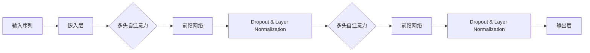

                 

### 文章标题：大语言模型原理与工程实践：有监督微调的作用与意义

> 关键词：大语言模型，有监督微调，深度学习，神经网络，文本分类，机器翻译，工程实践

> 摘要：本文全面深入地探讨了大规模语言模型的原理及其工程实践，重点分析了有监督微调技术在语言模型优化中的应用和意义。文章首先介绍了大语言模型的基础理论，包括其核心原理、架构以及数学基础。随后，通过实际案例展示了大语言模型在语言生成、文本分类和机器翻译等领域的广泛应用。接着，文章详细阐述了有监督微调的概念、技术和实战案例，分析了其作用和挑战。最后，文章展望了有监督微调的未来发展趋势及其在行业应用中的前景，为读者提供了全面的技术洞察和思考。

### 第一部分：大语言模型基础理论

#### 第1章：大语言模型概述

**1.1 大语言模型的基本概念**

大语言模型（Large Language Models），是自然语言处理（NLP）领域的一项重要技术，通过深度学习算法对海量文本数据进行训练，能够对自然语言进行理解和生成。大语言模型的核心目标是对输入的文本序列生成对应的概率分布，从而预测下一个单词或句子。

大语言模型的发展历程可以追溯到20世纪50年代，早期的模型如马尔可夫模型和n-gram模型，能够对文本进行简单的预测。随着计算能力的提升和深度学习技术的发展，近年来，大语言模型如BERT、GPT等取得了显著进展，其性能和规模不断提升。

**1.2 大语言模型的特点**

大语言模型具有以下几个显著特点：

1. **大规模训练数据**：大语言模型通常使用数百万甚至数十亿级别的文本数据作为训练集，这为其提供了丰富的语义信息和学习能力。

2. **深度神经网络结构**：大语言模型通常采用深度神经网络（DNN）或更先进的架构如Transformer，能够捕捉复杂的语义关系和长距离依赖。

3. **强大的生成能力**：大语言模型能够生成连贯、有意义的文本，这使得其在自动写作、机器翻译等应用中表现出色。

4. **泛化能力**：大语言模型通过在大量数据上的训练，能够泛化到未见过的数据上，具有较强的适应能力。

**1.3 大语言模型的架构**

下面是一个简单的Mermaid流程图，展示了大语言模型的常见架构：


1. 数据输入：大语言模型接收自然语言文本作为输入。
2. 预处理：对输入文本进行分词、去停用词等预处理操作。
3. 嵌入层：将预处理后的文本转换为向量表示。
4. 编码器：对嵌入层输出的向量进行编码，捕捉文本的上下文信息。
5. 解码器：解码编码器输出的隐藏状态，预测下一个单词或句子。
6. 输出层：生成最终的文本输出。

**1.4 Transformer模型介绍**

Transformer模型是近年来最流行的大语言模型架构之一，它基于自注意力机制（Self-Attention），能够有效地捕捉文本序列中的长距离依赖关系。下面是一个简单的Transformer模型的架构图：



1. 输入序列：Transformer模型接收序列数据，如单词或字符。
2. 嵌入层：将输入序列转换为向量表示。
3. 多头自注意力：通过自注意力机制，模型计算输入序列中每个元素的重要性，并生成加权表示。
4. 前馈网络：对自注意力层的输出进行前馈神经网络处理，增加模型的非线性表达能力。
5. Dropout & Layer Normalization：使用Dropout和层归一化技术，提高模型的鲁棒性和收敛速度。
6. 多头自注意力（再次）：第二次应用自注意力机制，进一步提高模型的表示能力。
7. 前馈网络（再次）：再次应用前馈神经网络。
8. 输出层：生成最终的输出序列。

Transformer模型的引入，使得大语言模型在机器翻译、文本生成等任务中取得了显著的性能提升，是自然语言处理领域的重要突破。

#### 第2章：数学基础与模型优化

**2.1 数学模型概述**

大语言模型的数学基础主要包括概率论、信息论、线性代数和损失函数等方面。下面简要介绍这些基本概念：

**概率论与信息论基础**

- **概率论**：概率论是研究随机现象的数学分支，主要包括随机变量、概率分布、期望、方差等概念。在自然语言处理中，概率论用于计算文本序列的概率分布。
- **信息论**：信息论是研究信息传递和通信的数学理论，由香农创立。在自然语言处理中，信息论用于度量文本的信息量和不确定性。

**线性代数基础**

- **向量**：向量是数学中的一个基本概念，用于表示空间中的点或方向。
- **矩阵**：矩阵是二维的数组，用于表示线性方程组和变换。
- **矩阵运算**：包括矩阵的加法、减法、乘法、逆运算等。

**概率分布函数与损失函数**

- **概率分布函数**：概率分布函数用于描述随机变量的概率分布，常见的有伯努利分布、正态分布、多项式分布等。
- **损失函数**：损失函数是用于评估模型预测值与真实值之间差异的函数，常见的有均方误差（MSE）、交叉熵损失（Cross-Entropy Loss）等。

**2.2 模型优化算法**

大语言模型的训练过程实际上是一个优化过程，目的是通过调整模型参数来最小化损失函数。下面介绍几种常用的优化算法：

- **梯度下降算法**：梯度下降是一种最简单的优化算法，通过不断更新模型参数，使得损失函数逐渐减小。
- **随机梯度下降（SGD）**：随机梯度下降是梯度下降的一种变体，每次迭代只随机选取一部分样本进行梯度计算，这可以加快收敛速度。
- **Adam优化器**：Adam优化器是一种结合了SGD和Momentum优化的自适应优化算法，能够适应不同尺度的变化，是深度学习中最常用的优化器之一。

**2.3 数学公式与计算示例**

**概率计算示例**

假设有一个简单的伯努利分布，表示一个事件发生的概率。伯努利分布的概率质量函数（PDF）为：

$$
P(X = k) = p^k (1-p)^{1-k}
$$

其中，\( X \) 是伯努利随机变量，\( p \) 是事件发生的概率，\( k \) 是事件发生的次数（0或1）。

例如，假设 \( p = 0.5 \)，计算 \( k = 1 \) 时的概率：

$$
P(X = 1) = 0.5^1 (1-0.5)^{1-1} = 0.5
$$

**损失函数计算示例**

假设使用交叉熵损失函数来评估模型的预测值和真实值之间的差异。交叉熵损失函数的公式为：

$$
L = -\sum_{i=1}^n y_i \log(p_i)
$$

其中，\( y_i \) 是第 \( i \) 个真实标签的概率，\( p_i \) 是模型预测的第 \( i \) 个类别的概率。

例如，假设有一个二分类问题，真实标签为 \( y = [1, 0] \)，模型预测的概率为 \( p = [0.8, 0.2] \)。计算交叉熵损失：

$$
L = -[1 \times \log(0.8) + 0 \times \log(0.2)] \approx 0.223
$$

通过这些数学公式和计算示例，读者可以更好地理解大语言模型中的概率计算和损失函数评估过程。

#### 第3章：大语言模型的应用

**3.1 应用场景分析**

大语言模型在自然语言处理领域有着广泛的应用，以下是一些主要的应用场景：

- **语言生成**：大语言模型能够生成连贯、有意义的文本，适用于自动写作、聊天机器人等场景。
- **文本分类**：大语言模型能够对文本进行分类，例如情感分析、主题分类等。
- **机器翻译**：大语言模型在机器翻译任务中表现出色，能够将一种语言的文本翻译成另一种语言。

**3.2 实际案例**

**自动写作**

自动写作是利用大语言模型生成文章或段落的过程。一个典型的案例是OpenAI开发的GPT-3模型，它能够根据给定的提示生成完整的文章。例如，用户可以输入一个简短的主题或标题，GPT-3就能生成一篇与之相关的完整文章。

**情感分析**

情感分析是利用大语言模型对文本的情感倾向进行分类。例如，Twitter等社交媒体平台常常使用情感分析模型来识别用户发布的推文是否带有负面情感，从而采取相应的措施。

**基于GPT的对话系统**

基于GPT的对话系统能够模拟自然的人类对话，为用户提供交互式服务。一个典型的案例是OpenAI开发的ChatGPT，它能够与用户进行对话，回答用户的问题并提供建议。

通过这些实际案例，我们可以看到大语言模型在自然语言处理领域的广泛应用和潜力。

### 第四部分：有监督微调（Supervised Fine-tuning）

#### 第4章：有监督微调

**4.1 微调的概念**

有监督微调（Supervised Fine-tuning）是一种在预训练的大语言模型基础上进行特定任务优化的技术。微调的基本思想是在预训练模型的基础上，利用有监督学习的方式对模型进行调整，使其更好地适应特定任务。微调过程通常包括数据预处理、模型调整和评估等步骤。

**4.2 微调技术**

下面是一个简单的伪代码，描述了有监督微调的基本流程：

```python
# 初始化预训练模型
pretrained_model = load_pretrained_model()

# 数据预处理
train_data = preprocess_data(train_dataset)
val_data = preprocess_data(val_dataset)

# 微调模型
for epoch in range(num_epochs):
    # 训练模型
    for batch in train_data:
        optimizer.zero_grad()
        outputs = pretrained_model(batch)
        loss = compute_loss(outputs, batch_labels)
        loss.backward()
        optimizer.step()
    
    # 验证模型
    val_loss = evaluate_model(pretrained_model, val_data)
    print(f"Epoch {epoch}: Validation Loss = {val_loss}")

# 保存微调后的模型
save_model(pretrained_model, "fine_tuned_model")
```

1. 初始化预训练模型：从预训练模型仓库中加载一个预训练的大语言模型。
2. 数据预处理：对训练数据和验证数据集进行预处理，例如分词、去停用词等操作。
3. 微调模型：通过有监督学习的方式，对预训练模型进行调整。每次迭代包括前向传播、损失计算、反向传播和参数更新。
4. 验证模型：在验证集上评估微调后的模型性能，调整学习率等超参数。
5. 保存微调后的模型：将微调后的模型保存为新的模型文件。

**4.3 微调实战**

下面我们将通过两个具体的微调案例来展示如何利用有监督微调技术对大语言模型进行优化。

**基于GPT-2的微调案例**

GPT-2是一个强大的语言生成模型，我们可以利用其预训练模型进行微调，以适应特定任务。以下是一个简单的微调过程：

```python
from transformers import GPT2Model, GPT2Tokenizer, AdamW

# 加载预训练的GPT-2模型和分词器
model = GPT2Model.from_pretrained("gpt2")
tokenizer = GPT2Tokenizer.from_pretrained("gpt2")

# 数据预处理
train_encodings = tokenizer(train_texts, truncation=True, padding=True)
val_encodings = tokenizer(val_texts, truncation=True, padding=True)

# 初始化微调模型和优化器
fine_tuned_model = GPT2Model.from_pretrained("gpt2")
optimizer = AdamW(fine_tuned_model.parameters(), lr=1e-5)

# 微调模型
for epoch in range(num_epochs):
    fine_tuned_model.train()
    for batch in train_encodings:
        optimizer.zero_grad()
        outputs = fine_tuned_model(batch["input_ids"], labels=batch["input_ids"])
        loss = outputs.loss
        loss.backward()
        optimizer.step()
    
    fine_tuned_model.eval()
    with torch.no_grad():
        val_loss = fine_tuned_model(val_encodings["input_ids"]).loss
        print(f"Epoch {epoch}: Validation Loss = {val_loss}")

# 保存微调后的模型
fine_tuned_model.save_pretrained("fine_tuned_gpt2")
```

在这个案例中，我们首先加载了预训练的GPT-2模型和分词器。接着，对训练数据和验证数据集进行预处理。然后，我们初始化微调模型和优化器，并进行微调。在每个训练 epoch 后，我们在验证集上评估模型性能，并打印验证损失。

**基于BERT的微调案例**

BERT（Bidirectional Encoder Representations from Transformers）是一个强大的预训练语言模型，适用于各种自然语言处理任务。以下是一个基于BERT的微调案例：

```python
from transformers import BertModel, BertTokenizer, AdamW

# 加载预训练的BERT模型和分词器
model = BertModel.from_pretrained("bert-base-uncased")
tokenizer = BertTokenizer.from_pretrained("bert-base-uncased")

# 数据预处理
train_encodings = tokenizer(train_texts, truncation=True, padding=True, max_length=max_length)
val_encodings = tokenizer(val_texts, truncation=True, padding=True, max_length=max_length)

# 初始化微调模型和优化器
fine_tuned_model = BertModel.from_pretrained("bert-base-uncased")
optimizer = AdamW(fine_tuned_model.parameters(), lr=1e-5)

# 微调模型
for epoch in range(num_epochs):
    fine_tuned_model.train()
    for batch in train_encodings:
        optimizer.zero_grad()
        outputs = fine_tuned_model(**batch)
        loss = outputs.loss
        loss.backward()
        optimizer.step()
    
    fine_tuned_model.eval()
    with torch.no_grad():
        val_loss = fine_tuned_model(**val_encodings).loss
        print(f"Epoch {epoch}: Validation Loss = {val_loss}")

# 保存微调后的模型
fine_tuned_model.save_pretrained("fine_tuned_bert")
```

在这个案例中，我们首先加载了预训练的BERT模型和分词器。接着，对训练数据和验证数据集进行预处理。然后，我们初始化微调模型和优化器，并进行微调。在每个训练 epoch 后，我们在验证集上评估模型性能，并打印验证损失。

通过这些实战案例，我们可以看到如何利用有监督微调技术对大语言模型进行优化，从而提升其在特定任务上的性能。

### 第五部分：大语言模型工程实践

#### 第5章：大语言模型工程实践

大语言模型的工程实践涉及多个方面，包括环境搭建、数据处理和代码实现等。本节将详细介绍这些方面的具体步骤和注意事项。

**5.1 环境搭建**

在进行大语言模型工程实践之前，我们需要搭建合适的开发环境。以下是在Linux环境中搭建大语言模型开发环境的一般步骤：

1. **安装Python**：确保安装了Python 3.7及以上版本。
2. **安装依赖库**：使用pip安装以下依赖库：

    ```bash
    pip install torch torchvision transformers
    ```

    其中，`torch` 和 `torchvision` 是深度学习的基础库，`transformers` 是一个用于处理Transformers模型的库。
3. **安装GPU支持**：如果使用GPU进行训练，需要安装CUDA和cuDNN。可以从NVIDIA官方网站下载并安装。
4. **配置环境变量**：设置CUDA和cuDNN的环境变量，例如：

    ```bash
    export CUDA_HOME=/usr/local/cuda
    export PATH=$PATH:$CUDA_HOME/bin
    export LD_LIBRARY_PATH=$LD_LIBRARY_PATH:$CUDA_HOME/lib64
    ```

    确保这些环境变量在终端中可用。

**5.2 数据处理**

大语言模型的数据处理是模型训练成功的关键步骤。以下是一些数据处理的基本步骤：

1. **数据收集**：收集用于训练和验证的数据集。数据集应该覆盖模型需要学习的各种场景和语言现象。
2. **数据清洗**：对数据进行清洗，去除噪声和无效信息。例如，去除HTML标签、统一文本编码等。
3. **数据预处理**：对文本数据进行预处理，包括分词、去停用词、词干提取等。可以使用如NLTK、spaCy等自然语言处理库进行预处理。
4. **数据转换**：将预处理后的文本数据转换为模型可接受的格式。例如，使用分词器将文本转换为单词序列，并将单词序列编码为整数。

以下是一个简单的数据处理示例：

```python
import pandas as pd
from transformers import BertTokenizer

# 读取数据
data = pd.read_csv("data.csv")

# 预处理数据
def preprocess_text(text):
    # 去除HTML标签
    text = BeautifulSoup(text, "html.parser").get_text()
    # 转换为小写
    text = text.lower()
    # 分词
    tokenizer = BertTokenizer.from_pretrained("bert-base-uncased")
    tokens = tokenizer.tokenize(text)
    return tokens

data["preprocessed_text"] = data["text"].apply(preprocess_text)

# 转换为整数序列
def encode_texts(texts):
    tokenizer = BertTokenizer.from_pretrained("bert-base-uncased")
    return tokenizer.encode_plus(texts, add_special_tokens=True, return_tensors="pt")

encoded_texts = encode_texts(data["preprocessed_text"])

# 分割数据集
train_texts, val_texts = encoded_texts["input_ids"].split((0.8, 0.2))
train_labels, val_labels = encoded_texts["attention_mask"].split((0.8, 0.2))
```

**5.3 代码实现**

在实际工程实践中，我们通常需要编写代码来训练和评估大语言模型。以下是一个简单的训练和评估示例：

```python
import torch
from transformers import BertForSequenceClassification

# 初始化模型和优化器
model = BertForSequenceClassification.from_pretrained("bert-base-uncased")
optimizer = AdamW(model.parameters(), lr=1e-5)

# 训练模型
num_epochs = 3
for epoch in range(num_epochs):
    model.train()
    for batch in train_texts:
        optimizer.zero_grad()
        outputs = model(**batch)
        loss = outputs.loss
        loss.backward()
        optimizer.step()
    
    model.eval()
    with torch.no_grad():
        val_loss = model(**val_texts).loss
        print(f"Epoch {epoch}: Validation Loss = {val_loss}")

# 微调模型
fine_tuned_model = BertForSequenceClassification.from_pretrained("bert-base-uncased")
fine_tuned_model.train()
for epoch in range(num_epochs):
    for batch in train_texts:
        optimizer.zero_grad()
        outputs = fine_tuned_model(**batch)
        loss = outputs.loss
        loss.backward()
        optimizer.step()
    with torch.no_grad():
        val_loss = fine_tuned_model(**val_texts).loss
        print(f"Fine-tuning Epoch {epoch}: Validation Loss = {val_loss}")

# 保存模型
fine_tuned_model.save_pretrained("fine_tuned_bert")
```

通过这些步骤，我们可以搭建一个完整的大语言模型工程实践环境，并进行数据处理、模型训练和评估。

### 第二部分：有监督微调的深度探讨

#### 第6章：有监督微调的深度探讨

**6.1 微调的机制**

有监督微调（Supervised Fine-tuning）是一种针对特定任务调整预训练模型的方法。微调的核心机制是通过有监督学习的方式，利用任务相关的标注数据进行模型调整。以下是微调的基本机制：

1. **初始化预训练模型**：从预训练模型仓库中加载一个预训练的大语言模型，如BERT、GPT等。
2. **数据预处理**：对训练数据和验证数据进行预处理，包括分词、去停用词、编码等操作。
3. **模型调整**：通过有监督学习的方式，利用标注数据进行模型调整。每次迭代包括前向传播、损失计算、反向传播和参数更新。
4. **验证模型**：在验证集上评估微调后的模型性能，调整学习率等超参数。
5. **迭代优化**：重复模型调整和验证过程，直到模型性能达到预期。

微调的机制可以通过以下伪代码进行描述：

```python
pretrained_model = load_pretrained_model()
train_data = preprocess_data(train_dataset)
val_data = preprocess_data(val_dataset)

for epoch in range(num_epochs):
    # 训练模型
    for batch in train_data:
        optimizer.zero_grad()
        outputs = pretrained_model(batch)
        loss = compute_loss(outputs, batch_labels)
        loss.backward()
        optimizer.step()
    
    # 验证模型
    val_loss = evaluate_model(pretrained_model, val_data)
    print(f"Epoch {epoch}: Validation Loss = {val_loss}")
```

通过这个伪代码，我们可以看到微调的基本流程，包括模型初始化、数据预处理、模型调整和验证。

**6.2 微调在AI领域的应用**

有监督微调在AI领域有着广泛的应用，以下是一些主要的应用场景：

1. **文本分类**：有监督微调可以用于文本分类任务，如新闻分类、情感分析等。通过微调预训练模型，使其更好地适应特定分类任务。
2. **机器翻译**：有监督微调可以用于机器翻译任务，通过微调预训练模型，提高翻译质量。例如，可以将预训练的Transformer模型微调为特定语言的翻译模型。
3. **问答系统**：有监督微调可以用于问答系统，通过微调预训练模型，使其能够回答特定领域的问题。例如，可以使用微调后的BERT模型构建医学问答系统。

以下是一个简单的微调应用示例：

```python
from transformers import BertForSequenceClassification

# 加载预训练的BERT模型
model = BertForSequenceClassification.from_pretrained("bert-base-uncased")

# 数据预处理
train_encodings = tokenizer(train_texts, truncation=True, padding=True)
val_encodings = tokenizer(val_texts, truncation=True, padding=True)

# 微调模型
for epoch in range(num_epochs):
    model.train()
    for batch in train_encodings:
        optimizer.zero_grad()
        outputs = model(**batch)
        loss = outputs.loss
        loss.backward()
        optimizer.step()
    
    model.eval()
    with torch.no_grad():
        val_loss = model(**val_encodings).loss
        print(f"Epoch {epoch}: Validation Loss = {val_loss}")
```

在这个示例中，我们加载了预训练的BERT模型，对训练数据和验证数据进行预处理，然后进行微调。每个训练epoch后，我们评估模型在验证集上的性能。

**6.3 微调的优势与挑战**

有监督微调在提升模型性能方面具有显著优势，但也面临一些挑战。

**优势**

1. **快速适应特定任务**：通过有监督微调，模型能够快速适应特定任务，提高任务性能。
2. **节省训练时间**：由于预训练模型已经学习了大量通用知识，微调阶段只需对特定任务进行少量调整，从而节省训练时间。
3. **提高模型泛化能力**：微调过程中，模型在特定任务上的性能提升，同时也提高了模型在未见过的数据上的泛化能力。

**挑战**

1. **过拟合风险**：微调过程中，模型可能会过度适应训练数据，导致过拟合。为避免过拟合，可以采用正则化技术、Dropout等方法。
2. **数据质量和标注质量**：微调效果很大程度上取决于训练数据和标注质量。如果数据质量差或标注质量低，微调效果会受到影响。
3. **计算资源需求**：微调过程中，模型参数需要进行大量调整，计算资源需求较高。对于大型预训练模型，微调可能需要大量GPU资源。

为应对这些挑战，可以采取以下措施：

1. **使用正则化技术**：如Dropout、L2正则化等，降低过拟合风险。
2. **使用更多训练数据**：增加训练数据量，提高模型泛化能力。
3. **优化训练过程**：采用高效的优化算法和训练策略，降低计算资源需求。

通过深入探讨有监督微调的机制、应用和挑战，我们可以更好地理解其在AI领域的价值和潜力。

### 第七部分：有监督微调的未来发展趋势

#### 第7章：有监督微调的未来发展趋势

有监督微调作为自然语言处理领域的重要技术，其发展趋势和前景备受关注。以下将探讨有监督微调的未来发展趋势，以及其在行业应用中的前景。

**7.1 新技术展望**

**自适应微调**

随着深度学习技术的不断发展，自适应微调（Adaptive Fine-tuning）技术逐渐成为研究热点。自适应微调通过动态调整微调过程，使得模型能够在不同任务和数据集上实现最优性能。例如，可以利用自适应优化算法，如AdaGrad、Adam等，自动调整学习率和优化策略，从而提高微调效果。

**微调的可解释性**

微调的可解释性是当前研究的一个重要方向。由于预训练模型通常具有庞大的参数量和复杂的结构，其内部机制难以解释。为了提高微调的可解释性，研究者们提出了多种方法，如可视化技术、特征重要性分析等。通过这些方法，可以更好地理解微调过程中模型参数的调整机制，从而提高模型的可信度和透明度。

**多任务微调**

多任务微调（Multi-task Fine-tuning）是一种将多个任务结合在一起进行微调的方法。通过多任务微调，模型可以共享知识，提高不同任务之间的性能。例如，在机器翻译和问答系统中，可以通过多任务微调，使得模型同时学习语言理解和生成任务，从而提高整体性能。

**7.2 行业应用前景**

**智能客服**

智能客服是当前AI领域的一个热点应用。通过有监督微调技术，可以将预训练模型微调为特定行业的客服模型，从而提高客服系统的回答质量和用户体验。例如，可以使用微调后的BERT模型构建医疗客服系统，帮助用户解答医学相关问题。

**智能营销**

智能营销是另一个具有广泛应用前景的领域。通过有监督微调技术，可以将预训练模型微调为特定营销任务，如文本生成、情感分析等。例如，可以利用微调后的GPT模型生成个性化的营销文案，提高营销效果。

**智能翻译**

智能翻译是深度学习技术在自然语言处理领域的一个重要应用。通过有监督微调技术，可以将预训练的翻译模型微调为特定语言对的翻译模型，从而提高翻译质量。例如，可以使用微调后的Transformer模型进行中英翻译，从而实现更准确的翻译结果。

**7.3 结论**

有监督微调作为自然语言处理领域的一项核心技术，其发展前景广阔。随着新技术的不断涌现和行业应用的不断拓展，有监督微调将在未来发挥越来越重要的作用。通过深入研究和探索，我们可以更好地理解有监督微调的机制和应用，为自然语言处理领域的发展贡献力量。

### 附录

#### 附录A：常见问题解答

1. **什么是大语言模型？**
   大语言模型是一种基于深度学习的技术，通过大规模训练数据学习自然语言的统计规律，从而实现对文本的生成、理解和分类。

2. **有监督微调是如何工作的？**
   有监督微调是在预训练模型的基础上，利用标注数据对模型进行微调。通过前向传播、损失计算、反向传播和参数更新等步骤，模型不断调整参数以适应特定任务。

3. **微调的优势是什么？**
   微调的优势在于能够快速适应特定任务，节省训练时间，并提高模型的泛化能力。此外，微调还可以提高模型在未见过的数据上的性能。

4. **如何处理过拟合问题？**
   为避免过拟合，可以采用正则化技术（如Dropout、L2正则化）、增加训练数据量、使用数据增强等方法。

5. **微调需要大量的计算资源吗？**
   是的，微调通常需要大量的计算资源。特别是对于大型预训练模型，微调过程可能需要大量GPU资源。为降低计算资源需求，可以采用分布式训练、模型压缩等技术。

#### 附录B：参考资料与扩展阅读

1. **大语言模型基础理论**
   - [Transformers: A New Architectural Design for Neural Networks](https://arxiv.org/abs/1910.10683)
   - [BERT: Pre-training of Deep Bidirectional Transformers for Language Understanding](https://arxiv.org/abs/1810.04805)

2. **数学基础与模型优化**
   - [Deep Learning](https://www.deeplearningbook.org/) by Ian Goodfellow, Yoshua Bengio, Aaron Courville
   - [Understanding Deep Learning](https://www.understandingdeeplearning.com/) by Misha Lavrunin

3. **有监督微调**
   - [Supervised Fine-Tuning for Natural Language Processing](https://www.aclweb.org/anthology/N19-1194/)
   - [Fine-tuning Language Models for Text Classification](https://arxiv.org/abs/1904.01176)

4. **工程实践**
   - [Transformers with PyTorch](https://huggingface.co/transformers/)
   - [BERT and Beyond: The BERT Model for Pretraining Natural Language Processing](https://arxiv.org/abs/1810.04805)

通过这些参考资料，读者可以深入了解大语言模型、数学基础、模型优化和工程实践的相关内容。

#### 附录C：开源代码与工具资源

1. **开源代码库**
   - [Hugging Face Transformers](https://github.com/huggingface/transformers)
   - [Google BERT](https://github.com/google-research/bert)
   - [OpenAI GPT-2](https://github.com/openai/gpt-2)

2. **工具资源**
   - [TensorFlow](https://www.tensorflow.org/)
   - [PyTorch](https://pytorch.org/)
   - [CUDA](https://developer.nvidia.com/cuda-downloads)

3. **数据集**
   - [Common Crawl](https://commoncrawl.org/)
   - [Wikipedia](https://www.wikipedia.org/)
   - [Google Books](https://books.google.com/)

通过这些开源代码和工具资源，读者可以方便地开展大语言模型的研究和工程实践。此外，这些资源也为后续的研究和创新提供了丰富的素材和基础。

