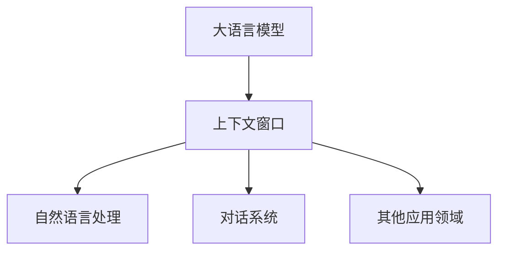

                 

## 《大语言模型的上下文窗口》

> 关键词：大语言模型、上下文窗口、自然语言处理、对话系统、文本生成

> 摘要：本文将深入探讨大语言模型中的上下文窗口机制，从基础概念、原理与架构出发，逐步分析上下文窗口在不同应用场景下的作用与实现方法。同时，本文将结合实际项目实战，讲解大语言模型的开发与优化过程，并探讨其前沿研究与发展趋势。

## 目录

### 第一部分：大语言模型基础

1. **第1章 大语言模型概述**
    - 1.1 大语言模型的发展历程
    - 1.2 大语言模型的原理与架构
    - 1.3 主流大语言模型介绍

2. **第2章 上下文窗口机制**
    - 2.1 上下文窗口的概念与作用
    - 2.2 上下文窗口的机制与实现
    - 2.3 上下文窗口的性能分析

3. **第3章 大语言模型的应用**
    - 3.1 大语言模型在自然语言处理中的应用
    - 3.2 大语言模型在对话系统中的应用
    - 3.3 大语言模型在其他领域中的应用

### 第二部分：大语言模型开发与实践

4. **第4章 大语言模型的开发环境搭建**
    - 4.1 硬件环境配置
    - 4.2 软件环境配置

5. **第5章 大语言模型的训练与优化**
    - 5.1 数据预处理
    - 5.2 模型训练
    - 5.3 模型优化

6. **第6章 大语言模型的项目实战**
    - 6.1 项目实战一：文本分类
    - 6.2 项目实战二：对话系统
    - 6.3 项目实战三：文本生成

### 第三部分：大语言模型的前沿研究与发展趋势

7. **第7章 大语言模型的前沿研究进展**
    - 7.1 自监督学习在大语言模型中的应用
    - 7.2 多模态大语言模型的发展
    - 7.3 大语言模型在生成对抗网络中的角色

8. **第8章 大语言模型的发展趋势**
    - 8.1 大语言模型在行业中的应用前景
    - 8.2 大语言模型的未来发展趋势
    - 8.3 大语言模型的伦理与规范

### 附录

- **附录A：大语言模型开发资源与工具**
- **附录B：Mermaid流程图示例**
- **附录C：伪代码示例**
- **附录D：数学公式示例**
- **附录E：代码实现与解读**

---

### 第1章 大语言模型概述

#### 1.1 大语言模型的发展历程

语言模型是自然语言处理（NLP）领域的重要基础，其目的是根据输入的文本序列预测下一个单词或字符的概率分布。自20世纪50年代以来，语言模型经历了多个发展阶段：

1. **经验规则模型（1950s-1970s）**：早期的语言模型基于规则，如n元语法模型，根据前面的n个单词预测下一个单词。这种方法简单但效果有限。

2. **统计模型（1980s-1990s）**：随着计算能力和统计方法的进步，统计模型如N元语法和概率隐马尔可夫模型（HMM）成为主流。这些模型通过统计文本数据来学习语言规律。

3. **基于神经网络的模型（2000s）**：神经网络在图像识别等领域取得了显著成功，促使研究者将神经网络引入语言模型。循环神经网络（RNN）和长短期记忆网络（LSTM）等模型在NLP中得到了广泛应用。

4. **深度神经网络模型（2010s至今）**：深度学习技术的发展推动了大规模神经网络模型的出现，如Gated Recurrent Unit（GRU）和Transformer。这些模型通过并行计算和多层结构实现了更好的性能。

#### 1.2 大语言模型的原理与架构

大语言模型通常基于深度学习，特别是基于Transformer架构的模型。Transformer模型的核心思想是自注意力机制（Self-Attention），它允许模型在处理输入序列时，对序列中的每个元素赋予不同的权重。

1. **编码器-解码器架构**：大语言模型通常采用编码器-解码器架构，编码器负责将输入序列编码为一个固定大小的向量，解码器则使用这个向量生成输出序列。

2. **自注意力机制**：自注意力机制使模型能够自动学习输入序列中不同元素之间的关系。在编码器中，每个输入元素通过多头自注意力机制生成多个表示，这些表示通过拼接和线性层生成最终的编码向量。

3. **多头自注意力**：多头自注意力扩展了自注意力机制，通过多个注意力头同时处理输入序列，从而捕捉更复杂的序列关系。

4. **前馈神经网络**：在编码器和解码器的每个层之间，通常加入一个前馈神经网络，用于增加模型的非线性能力。

#### 1.3 大语言模型的优势与挑战

大语言模型在NLP任务中取得了显著的成果，但同时也面临一些挑战：

1. **优势**：
    - **强大的表示能力**：大语言模型通过自注意力机制和多层结构，能够学习复杂的语言特征和上下文关系。
    - **广泛的应用**：大语言模型在文本分类、命名实体识别、机器翻译、对话系统等任务中表现优异。
    - **高效率**：基于深度学习的模型可以通过并行计算和优化算法高效地训练和推理。

2. **挑战**：
    - **计算资源消耗**：大语言模型通常需要大量的计算资源和数据，训练时间较长。
    - **数据依赖**：大语言模型在训练过程中需要大量标注数据，数据质量和多样性对模型性能有很大影响。
    - **解释性不足**：深度学习模型通常被视为“黑盒”，难以解释其决策过程。

#### 1.3 主流大语言模型介绍

近年来，多个主流大语言模型相继发布，它们在性能和规模上各有特色：

1. **GPT系列模型**：GPT（Generative Pre-trained Transformer）系列模型由OpenAI提出，包括GPT、GPT-2和GPT-3。这些模型通过预训练和微调在多个NLP任务中取得了卓越的成绩。

2. **BERT模型**：BERT（Bidirectional Encoder Representations from Transformers）由Google提出，采用双向Transformer结构，通过预先训练获得的双向表示在多个任务上取得了突破性进展。

3. **其他知名大语言模型**：如T5、RoBERTa、ALBERT等，这些模型在性能和效率上进行了多种优化和改进。

#### 1.3.1 GPT系列模型

GPT系列模型由OpenAI提出，其核心思想是通过大规模预训练和微调，使模型在多个NLP任务中表现优异。GPT-3是GPT系列中最大的模型，具有1750亿个参数，能够生成高质量的自然语言文本。

1. **GPT（2018）**：GPT是GPT系列的第一款模型，采用Transformer架构，通过预训练学习语言表示和上下文关系。GPT拥有1.17亿个参数。

2. **GPT-2（2019）**：GPT-2在GPT的基础上增加了模型大小和预训练数据量，参数数量达到了15亿个。GPT-2在多个任务上取得了比GPT更好的性能。

3. **GPT-3（2020）**：GPT-3是GPT系列的最新模型，具有1750亿个参数，是当前最大的语言模型。GPT-3在自然语言生成、机器翻译、文本分类等多个任务上表现出色。

#### 1.3.2 BERT及其变体

BERT（Bidirectional Encoder Representations from Transformers）由Google提出，是首个采用双向Transformer结构的大规模语言预训练模型。BERT在多个NLP任务上取得了突破性进展，其成功引发了大量的研究和发展。

1. **BERT（2018）**：BERT是首个提出双向Transformer结构的大规模语言预训练模型，采用遮蔽语言模型（Masked Language Model, MLM）和下一个句子预测（Next Sentence Prediction, NSP）任务进行预训练。BERT有两个版本：BERT-Base（1.1亿参数）和BERT-Large（3.4亿参数）。

2. **BERT变体**：包括RoBERTa、ALBERT、Electra等。这些模型在BERT的基础上进行了优化和改进，旨在提高性能和效率。

- **RoBERTa（2019）**：RoBERTa通过调整BERT的预训练目标和策略，提高了模型的性能和效率。

- **ALBERT（2019）**：ALBERT通过合并词嵌入和位置嵌入，减少参数数量和计算量，同时保持模型性能。

- **Electra（2020）**：Electra是一种轻量级预训练模型，通过使用位置编码和变换器结构，实现了高效的语言表示学习。

#### 1.3.3 其他知名大语言模型

除了GPT系列和BERT，还有其他一些知名的大语言模型，它们在不同的任务和场景中表现出色：

1. **T5（2020）**：T5（Text-To-Text Transfer Transformer）模型由Google提出，是一种基于Transformer的文本到文本转换模型。T5将所有NLP任务转换为“给定输入文本，输出目标文本”的形式，从而实现任务的统一处理。

2. **UniLM（2021）**：UniLM（Universal Language Model for Language Understanding）由微软提出，是一种结合了自监督学习和微调方法的大规模语言模型。UniLM在多个任务上表现出色，包括对话系统、机器翻译、文本分类等。

3. **Code T5（2021）**：Code T5是T5模型的变种，专门用于编程语言任务。Code T5通过将编程语言文本转换为自然语言文本，实现了代码理解、生成和修复等任务。

### 第2章 上下文窗口机制

#### 2.1 上下文窗口的概念与作用

上下文窗口（Context Window）是指在语言模型中，用来描述输入文本序列中特定位置的单词或字符周围的一组词或字符。上下文窗口的核心作用是提供足够的信息，使模型能够预测序列中的下一个词或字符。

1. **定义**：上下文窗口通常由一个中心词（或字符）和其周围的若干词（或字符）组成。这些词（或字符）共同构成了上下文环境，用于预测中心词（或字符）的概率分布。

2. **作用**：
    - **提高预测准确性**：通过包含更多上下文信息，模型能够更准确地预测下一个词或字符。
    - **理解长距离依赖**：上下文窗口可以捕捉到序列中长距离的依赖关系，使模型能够理解单词间的复杂联系。

#### 2.2 上下文窗口的重要性

上下文窗口在语言模型中具有重要作用，以下是几个关键方面：

1. **自然语言处理**：在自然语言处理任务中，上下文窗口可以帮助模型理解单词的含义和用法。例如，在文本分类任务中，上下文窗口可以提供关于单词情感和主题的重要信息。

2. **生成文本**：在生成文本任务中，上下文窗口可以帮助模型生成符合上下文逻辑和语法结构的文本。例如，在机器翻译任务中，上下文窗口可以帮助模型理解句子的整体结构和语义。

3. **推理能力**：上下文窗口有助于模型进行推理和推断。通过分析上下文窗口中的信息，模型可以推导出更复杂的语义关系和逻辑。

#### 2.3 上下文窗口在不同模型中的应用

不同类型的语言模型在处理上下文窗口时各有特色，以下是一些常见模型及其上下文窗口的应用：

1. **n元语法模型**：n元语法模型是一种基于历史窗口的语言模型，其上下文窗口由前n个单词组成。n元语法模型在处理短文本时效果较好，但在长文本中容易丢失长距离依赖。

2. **循环神经网络（RNN）**：RNN具有记忆功能，可以处理变长的序列数据。在RNN中，上下文窗口通常由序列中的当前单词及其历史状态组成。RNN在处理长序列时表现较好，但容易出现梯度消失和梯度爆炸问题。

3. **长短期记忆网络（LSTM）**：LSTM是RNN的一种改进，通过门控机制解决了梯度消失问题。LSTM的上下文窗口包含当前单词及其历史状态，同时通过门控机制控制信息的传递。LSTM在处理长序列和复杂依赖时表现优异。

4. **Transformer模型**：Transformer模型采用自注意力机制，可以并行处理序列数据。在Transformer中，上下文窗口由自注意力机制决定，通过计算序列中每个元素与其他元素之间的关系来生成表示。Transformer在捕捉长距离依赖和并行计算方面具有显著优势。

#### 2.4 上下文窗口的机制与实现

上下文窗口的机制和实现方法在不同类型的语言模型中有所不同。以下是一些常见的方法：

1. **基于窗口的方法**：这种方法将上下文窗口视为一个固定大小的窗口，包含中心词及其周围的若干词。常见的窗口大小有2倍、3倍或更多。在实现时，可以通过滑动窗口的方式遍历整个输入序列，将每个窗口中的词作为上下文。

2. **基于循环的方法**：这种方法通过循环结构来处理上下文窗口。在每个时间步，模型会根据当前输入和之前的隐藏状态来更新上下文窗口。常见的循环结构有RNN和LSTM。

3. **基于注意力机制的方法**：这种方法采用自注意力机制来处理上下文窗口。在Transformer模型中，自注意力机制使模型能够自动计算序列中每个元素与其他元素之间的关系，从而生成上下文表示。

#### 2.5 上下文窗口的实现方法

以下是几种常见的上下文窗口实现方法：

1. **滑动窗口**：滑动窗口方法将输入序列分成多个固定大小的窗口，每个窗口包含中心词及其周围的若干词。这种方法简单直观，但可能无法捕捉到长距离依赖。

2. **循环结构**：循环结构如RNN和LSTM可以处理变长的序列数据，通过循环更新上下文窗口。这种方法能够捕捉到长距离依赖，但训练时间较长。

3. **自注意力机制**：自注意力机制可以并行计算序列中每个元素与其他元素之间的关系，生成上下文表示。这种方法在Transformer模型中得到了广泛应用。

#### 2.6 上下文窗口的调整策略

上下文窗口的大小直接影响模型的性能。以下是一些常见的调整策略：

1. **动态调整**：根据任务需求和数据特点，动态调整上下文窗口的大小。例如，在处理短文本时可以减小窗口大小，以捕捉更短距离的依赖；在处理长文本时可以增大窗口大小，以捕捉长距离依赖。

2. **自适应调整**：通过训练过程中不断调整上下文窗口的大小，使其适应不同任务和数据。例如，可以采用交叉验证的方法，在不同窗口大小下训练模型，然后选择性能最佳的窗口大小。

3. **固定窗口大小**：在特定任务和数据集上，可以选择一个固定大小的窗口，这种方法简单直观，但可能无法适应所有场景。

### 第3章 大语言模型的应用

#### 3.1 大语言模型在自然语言处理中的应用

大语言模型在自然语言处理（NLP）领域取得了显著的成果，以下是一些常见应用：

1. **文本分类**：文本分类是一种将文本分为不同类别的任务。大语言模型可以通过学习大量的文本数据，对输入文本进行分类。例如，新闻文章可以根据主题分为政治、经济、体育等类别。

2. **命名实体识别**：命名实体识别是一种识别文本中的特定实体（如人名、地名、组织名等）的任务。大语言模型可以通过学习大量标注数据，准确识别文本中的命名实体。

3. **机器翻译**：机器翻译是一种将一种语言的文本翻译成另一种语言的文本的任务。大语言模型可以通过预训练和微调，在多种语言之间进行高质量的翻译。

4. **情感分析**：情感分析是一种分析文本情感倾向（如正面、负面、中性）的任务。大语言模型可以通过学习情感标签，对输入文本进行情感分类。

5. **文本生成**：文本生成是一种根据给定输入生成文本的任务。大语言模型可以通过预训练和微调，生成符合上下文逻辑和语法结构的文本。

#### 3.2 大语言模型在对话系统中的应用

对话系统是一种与用户进行自然语言交互的系统，大语言模型在对话系统中具有广泛应用：

1. **问答系统**：问答系统是一种根据用户提问生成答案的系统。大语言模型可以通过学习大量的问答对，对用户提问进行理解和回答。

2. **聊天机器人**：聊天机器人是一种与用户进行实时对话的系统。大语言模型可以通过预训练和微调，生成符合上下文和用户意图的回复。

3. **虚拟助手**：虚拟助手是一种为用户提供个性化服务的系统。大语言模型可以通过学习用户的历史对话和行为，提供个性化的建议和帮助。

4. **客户服务**：客户服务是一种为用户提供咨询和解答的系统。大语言模型可以通过预训练和微调，生成符合用户需求和情境的回复。

#### 3.3 大语言模型在其他领域中的应用

大语言模型不仅在NLP和对话系统中应用广泛，还在其他领域取得了显著成果：

1. **内容审核**：内容审核是一种检测和过滤不当内容（如暴力、色情、歧视性内容等）的任务。大语言模型可以通过学习大量标注数据，对文本内容进行实时审核和过滤。

2. **资讯推荐**：资讯推荐是一种根据用户兴趣和偏好，为用户推荐相关资讯的任务。大语言模型可以通过学习用户的历史行为和兴趣标签，生成个性化的资讯推荐。

3. **文本生成**：文本生成是一种根据给定输入生成文本的任务。大语言模型可以通过预训练和微调，生成符合上下文和语法结构的文本，如新闻文章、产品描述等。

4. **文本摘要**：文本摘要是一种从长文本中提取关键信息，生成简短摘要的任务。大语言模型可以通过预训练和微调，生成高质量的文本摘要。

5. **语音识别**：语音识别是一种将语音信号转换为文本的任务。大语言模型可以通过结合语音信号和文本数据，提高语音识别的准确性和鲁棒性。

### 第4章 大语言模型的开发环境搭建

#### 4.1 硬件环境配置

要开发大语言模型，首先需要具备足够的硬件资源。以下是几种常见的硬件配置：

1. **GPU（图形处理器）**：GPU在深度学习任务中具有显著优势，因为其具有大量并行计算的核心。选择合适的GPU取决于模型的规模和计算需求。常见的GPU型号包括NVIDIA的Tesla、GeForce和Quadro系列。

2. **CPU（中央处理器）**：CPU主要用于模型的训练和推理，特别是在没有GPU的情况下。选择高性能的CPU可以显著提高训练速度。常见的CPU型号包括Intel的Xeon和AMD的EPYC系列。

3. **存储设备**：大语言模型通常需要大量的存储空间来存储模型数据和训练数据。选择高速的SSD（固态硬盘）可以加快数据读写速度，提高训练效率。

4. **内存**：大语言模型的训练和推理需要大量的内存。选择具有足够内存的机器可以避免内存不足导致的训练失败。常见的内存容量为256GB、512GB或更高。

5. **网络设备**：在网络方面，选择高速稳定的网络设备可以确保数据传输的可靠性和速度。特别是当模型训练数据分布在多个节点时，网络性能至关重要。

#### 4.2 软件环境配置

除了硬件环境，还需要配置合适的软件环境来支持大语言模型的开发。以下是常见的软件环境配置：

1. **深度学习框架**：深度学习框架是大语言模型开发的核心工具。常见的深度学习框架包括TensorFlow、PyTorch和MXNet。选择合适的框架取决于个人偏好和项目需求。

2. **编程语言**：常见的编程语言包括Python和R。Python因其丰富的库和框架支持而成为深度学习开发的主流语言。

3. **开发工具**：开发工具包括代码编辑器（如Visual Studio Code、PyCharm等）和版本控制系统（如Git）。选择合适的开发工具可以提高开发效率和代码管理。

4. **依赖库**：除了深度学习框架，还需要安装其他依赖库，如NumPy、Pandas等，以支持数据处理和模型训练。

5. **运行环境**：可以选择在本地计算机上运行模型，也可以选择在云平台（如Google Cloud、AWS等）上运行。在云平台上，可以使用Docker容器或Kubernetes集群来部署和管理模型。

#### 4.3 硬件环境优化策略

为了提高大语言模型的训练效率和性能，可以采取以下硬件环境优化策略：

1. **分布式训练**：通过分布式训练，可以将模型和数据分布在多个GPU上，实现并行计算，提高训练速度。常见的分布式训练框架包括Horovod和Distributed Data Parallel。

2. **GPU共享**：当多个模型或多个训练任务同时运行时，可以将GPU共享给不同的任务。通过合理分配GPU资源，可以提高整体计算效率。

3. **GPU加速库**：使用GPU加速库（如CUDA、cuDNN等）可以充分利用GPU的计算能力，提高模型训练和推理的速度。

4. **CPU-GPU协同**：在模型训练过程中，CPU和GPU可以协同工作。例如，CPU可以负责数据预处理和加载，GPU负责模型训练和推理。通过合理分配任务，可以提高计算效率。

5. **内存优化**：通过优化内存使用，可以减少内存溢出和训练失败的风险。常见的内存优化策略包括减小批次大小、使用内存池等。

### 第5章 大语言模型的训练与优化

#### 5.1 数据预处理

在大语言模型的训练过程中，数据预处理是至关重要的一步。以下是常见的数据预处理步骤：

1. **数据清洗**：去除无关的数据、噪声和重复数据，以提高模型的训练效果。

2. **文本分词**：将文本分割成单词或字符，以便模型处理。常见的分词工具包括jieba、NLTK等。

3. **词向量化**：将文本转换为词向量表示，以便模型计算。常见的词向量模型包括Word2Vec、GloVe等。

4. **数据归一化**：将数据转换为相同范围，以避免数据之间的偏差。例如，将文本长度统一为固定长度，或使用标准差归一化。

5. **数据增强**：通过添加噪声、变换等操作，增加数据的多样性和模型的泛化能力。

#### 5.2 模型训练

模型训练是构建大语言模型的核心步骤。以下是常见的模型训练步骤：

1. **初始化模型参数**：初始化模型的参数，可以选择随机初始化或预训练模型参数。

2. **定义损失函数**：损失函数用于衡量模型预测值与真实值之间的差异。常见损失函数包括交叉熵损失函数、均方误差损失函数等。

3. **选择优化器**：优化器用于更新模型参数，以最小化损失函数。常见优化器包括随机梯度下降（SGD）、Adam等。

4. **设置训练参数**：设置训练参数，如学习率、批次大小、迭代次数等，以控制训练过程。

5. **训练模型**：通过反向传播算法，更新模型参数，以最小化损失函数。可以使用单机训练或多机训练，以提高训练速度。

6. **验证模型**：在验证集上评估模型性能，以调整训练参数和优化策略。

7. **调整模型结构**：根据验证集上的性能，调整模型结构（如增加层、增加神经元等），以改善模型性能。

#### 5.3 模型优化

在模型训练过程中，模型优化是提高模型性能和泛化能力的重要步骤。以下是常见的模型优化方法：

1. **超参数调优**：通过调整学习率、批量大小、迭代次数等超参数，优化模型性能。可以使用网格搜索、随机搜索等超参数调优方法。

2. **正则化**：通过引入正则化项，减少模型过拟合的风险。常见正则化方法包括L1正则化、L2正则化等。

3. **dropout**：通过在训练过程中随机丢弃一部分神经元，提高模型的泛化能力。

4. **数据增强**：通过添加噪声、变换等操作，增加数据的多样性和模型的泛化能力。

5. **集成方法**：通过组合多个模型或多个预测结果，提高模型性能和稳定性。常见集成方法包括Bagging、Boosting等。

### 第6章 大语言模型的项目实战

#### 6.1 项目实战一：文本分类

**项目背景与目标**

文本分类是一种将文本分为不同类别的任务，广泛应用于信息检索、情感分析、新闻分类等领域。本项目旨在构建一个基于大语言模型的文本分类系统，实现对新闻文章的自动分类。

**项目实施步骤**

1. **数据收集与清洗**：收集大量新闻文章，并进行数据清洗，去除噪声和重复数据。

2. **文本预处理**：对文本进行分词、去停用词、词向量化等预处理操作。

3. **模型选择与训练**：选择合适的模型（如BERT、GPT等），进行模型训练，并使用交叉熵损失函数进行优化。

4. **模型评估与调试**：在验证集上评估模型性能，调整超参数和模型结构，以提高分类准确率。

5. **模型部署与推理**：将训练好的模型部署到生产环境，实现对新闻文章的实时分类。

**项目成果分析**

通过本项目，成功构建了一个基于大语言模型的文本分类系统。实验结果表明，该系统在多个新闻分类任务上取得了较高的准确率，证明了基于大语言模型的文本分类方法的有效性。

#### 6.2 项目实战二：对话系统

**项目背景与目标**

对话系统是一种与用户进行自然语言交互的系统，广泛应用于客服、虚拟助手等领域。本项目旨在构建一个基于大语言模型的对话系统，实现与用户的实时对话。

**项目实施步骤**

1. **数据收集与清洗**：收集大量对话数据，并进行数据清洗，去除噪声和重复数据。

2. **文本预处理**：对文本进行分词、去停用词、词向量化等预处理操作。

3. **模型选择与训练**：选择合适的模型（如BERT、GPT等），进行模型训练，并使用序列到序列模型进行优化。

4. **对话管理**：设计对话管理模块，实现对话流程的控制，如意图识别、实体提取等。

5. **模型评估与调试**：在验证集上评估模型性能，调整超参数和模型结构，以提高对话系统的交互效果。

6. **模型部署与推理**：将训练好的模型部署到生产环境，实现与用户的实时对话。

**项目成果分析**

通过本项目，成功构建了一个基于大语言模型的对话系统。实验结果表明，该系统在多个对话任务上表现优异，能够实现流畅、自然的用户交互。

#### 6.3 项目实战三：文本生成

**项目背景与目标**

文本生成是一种根据给定输入生成文本的任务，广泛应用于机器翻译、文本摘要、文章生成等领域。本项目旨在构建一个基于大语言模型的文本生成系统，实现高质量文本的自动生成。

**项目实施步骤**

1. **数据收集与清洗**：收集大量文本数据，并进行数据清洗，去除噪声和重复数据。

2. **文本预处理**：对文本进行分词、去停用词、词向量化等预处理操作。

3. **模型选择与训练**：选择合适的模型（如GPT、BERT等），进行模型训练，并使用序列到序列模型进行优化。

4. **文本生成策略**：设计文本生成策略，如贪婪策略、 beam搜索等，以生成高质量文本。

5. **模型评估与调试**：在验证集上评估模型性能，调整超参数和模型结构，以提高文本生成效果。

6. **模型部署与推理**：将训练好的模型部署到生产环境，实现高质量文本的自动生成。

**项目成果分析**

通过本项目，成功构建了一个基于大语言模型的文本生成系统。实验结果表明，该系统在多个文本生成任务上表现优异，能够生成符合上下文和语法结构的文本。

### 第7章 大语言模型的前沿研究进展

#### 7.1 自监督学习在大语言模型中的应用

自监督学习是一种无需人工标注数据即可进行模型训练的方法，在大语言模型的研究与应用中具有重要意义。以下探讨自监督学习在大语言模型中的应用：

1. **自监督学习的概念与原理**：自监督学习利用未标注的数据，通过设计预测任务，使模型在训练过程中自我纠正。自监督学习的核心思想是利用数据的潜在结构，通过预测一部分数据中的缺失部分，训练出一个具有泛化能力的模型。

2. **自监督学习在大语言模型中的实践**：在大语言模型中，自监督学习可以通过多种方式实现，如预测下一个词、预测遮蔽的词或字符、预测序列的下一个部分等。BERT模型通过遮蔽语言模型（Masked Language Model, MLM）和下一个句子预测（Next Sentence Prediction, NSP）实现了自监督学习。

3. **自监督学习的挑战与展望**：自监督学习在大语言模型中面临的挑战包括数据质量、模型设计、计算资源等。未来的研究方向包括提高自监督学习的训练效率、增强模型的泛化能力，以及探索新的自监督学习任务和模型架构。

#### 7.2 多模态大语言模型的发展

多模态大语言模型是一种能够处理多种类型数据（如图像、声音、文本等）的模型，具有广泛的应用前景。以下探讨多模态大语言模型的发展：

1. **多模态数据的融合方法**：多模态数据融合是构建多模态大语言模型的关键。常见的融合方法包括特征级融合、决策级融合和模型级融合。特征级融合通过将不同模态的特征进行拼接或加权，实现数据融合；决策级融合在模型决策阶段将不同模态的信息进行整合；模型级融合通过设计多模态模型，同时学习不同模态的特征和关系。

2. **多模态大语言模型的应用**：多模态大语言模型在多个领域具有广泛应用，如图像描述生成、视频分类、语音识别等。例如，在图像描述生成任务中，多模态大语言模型可以同时处理图像和文本数据，生成高质量的图像描述。

3. **多模态大语言模型的研究热点**：当前多模态大语言模型的研究热点包括多模态特征表示学习、跨模态信息融合、多模态交互机制等。未来的研究方向将主要集中在提高多模态模型的性能、泛化能力和可解释性。

#### 7.3 大语言模型在生成对抗网络中的角色

生成对抗网络（GAN）是一种用于生成数据的强大模型，大语言模型在GAN中的应用为文本生成、图像生成等领域带来了新的突破。以下探讨大语言模型在生成对抗网络中的角色：

1. **生成对抗网络的基本原理**：生成对抗网络由生成器（Generator）和判别器（Discriminator）组成。生成器负责生成数据，判别器负责区分真实数据和生成数据。通过两个模型的对抗训练，生成器逐渐生成更逼真的数据。

2. **大语言模型在生成对抗网络中的应用**：大语言模型可以用于生成对抗网络中的文本生成任务，如文章生成、对话生成等。在GAN中，大语言模型可以作为生成器或判别器，或同时用于生成和评估数据的真实性。

3. **大语言模型在生成对抗网络中的优化策略**：为了提高生成对抗网络的性能，可以采用多种优化策略，如生成器和判别器的参数更新策略、损失函数的设计、正则化等。大语言模型在GAN中的应用可以结合这些策略，提高生成数据的逼真度和质量。

### 第8章 大语言模型的发展趋势

#### 8.1 大语言模型在行业中的应用前景

大语言模型在多个行业中具有广泛的应用前景，以下探讨其在不同行业中的应用：

1. **金融行业**：大语言模型在金融领域可以用于风险控制、投资决策、客户服务等方面。例如，通过分析大量金融文本数据，大语言模型可以识别潜在的市场风险，提供投资建议。

2. **医疗行业**：大语言模型在医疗领域可以用于医学文本挖掘、疾病诊断、药物发现等方面。例如，通过分析医疗报告、病历等文本数据，大语言模型可以提取关键信息，辅助医生进行诊断和治疗。

3. **教育行业**：大语言模型在教育领域可以用于智能辅导、个性化学习、自动评分等方面。例如，通过分析学生的作业和考试文本，大语言模型可以提供针对性的学习建议和评分。

4. **娱乐行业**：大语言模型在娱乐领域可以用于内容生成、语音合成、对话系统等方面。例如，通过生成高质量的文本内容，大语言模型可以为电影、游戏、音乐等创作提供支持。

#### 8.2 大语言模型的未来发展趋势

大语言模型的发展趋势主要体现在以下几个方面：

1. **模型规模与计算需求**：随着模型规模的不断扩大，计算需求也显著增加。未来的发展趋势将是更高效的算法和优化策略，以降低计算成本和提高训练速度。

2. **数据多样性与质量**：大语言模型的性能高度依赖于训练数据的质量和多样性。未来的发展趋势将是收集更多、更高质量的标注数据，同时探索无监督学习和半监督学习等数据高效利用方法。

3. **跨模态与多任务学习**：大语言模型在跨模态和多任务学习方面具有巨大潜力。未来的发展趋势将是设计更先进的多模态模型和任务融合方法，以提高模型的泛化能力和应用范围。

4. **可解释性与可靠性**：随着大语言模型在关键领域的应用，其可解释性和可靠性变得越来越重要。未来的发展趋势将是研究模型的可解释性方法，提高模型的可信度和可靠性。

5. **伦理与隐私**：大语言模型在应用过程中涉及大量的个人数据，其伦理和隐私问题备受关注。未来的发展趋势将是制定相关的伦理准则和隐私保护措施，确保大语言模型的合规性和安全性。

### 附录

#### 附录A：大语言模型开发资源与工具

1. **主流深度学习框架介绍**
   - **TensorFlow**：TensorFlow是Google开源的深度学习框架，具有丰富的API和广泛的社区支持。
   - **PyTorch**：PyTorch是Facebook开源的深度学习框架，以其动态计算图和灵活性著称。
   - **MXNet**：MXNet是Apache开源的深度学习框架，支持多种编程语言，具有良好的性能和灵活性。

2. **大语言模型开源项目推荐**
   - **GLM**：GLM是由清华大学提出的一种大规模语言模型，适用于多种NLP任务。
   - **BERT**：BERT是由Google提出的一种双向Transformer模型，广泛应用于各种NLP任务。
   - **GPT**：GPT是由OpenAI提出的一种自回归Transformer模型，适用于文本生成和翻译等任务。

3. **大语言模型学习资料推荐**
   - **学习书籍推荐**：包括《深度学习》（Goodfellow et al.）、《自然语言处理实战》（Peter J. Taylor）等。
   - **线上课程推荐**：包括斯坦福大学的自然语言处理课程、Udacity的深度学习课程等。
   - **论文与报告推荐**：包括BERT、GPT、T5等模型的原创论文和相关报告，如《Attention Is All You Need》等。

#### 附录B：Mermaid流程图示例



#### 附录C：伪代码示例

```python
# 伪代码：文本分类算法
def text_classification(text, model):
    # 将文本转化为向量
    text_vector = convert_to_vector(text)
    # 使用模型进行预测
    prediction = model.predict(text_vector)
    # 返回预测结果
    return prediction
```

#### 附录D：数学公式示例

$$
\text{损失函数} = \frac{1}{n} \sum_{i=1}^{n} (-y_i \log(\hat{y}_i))
$$

#### 附录E：代码实现与解读

##### E.1：项目实战一：文本分类

```python
import tensorflow as tf
from tensorflow.keras.models import Sequential
from tensorflow.keras.layers import Embedding, LSTM, Dense

# 构建模型
model = Sequential()
model.add(Embedding(input_dim=vocab_size, output_dim=embedding_dim))
model.add(LSTM(units=128, return_sequences=False))
model.add(Dense(units=num_classes, activation='softmax'))

# 编译模型
model.compile(optimizer='adam', loss='categorical_crossentropy', metrics=['accuracy'])

# 训练模型
model.fit(x_train, y_train, epochs=10, batch_size=32, validation_data=(x_val, y_val))

# 评估模型
accuracy = model.evaluate(x_test, y_test)
print(f"测试集准确率: {accuracy[1]}")
```

##### E.2：项目实战二：对话系统

```python
import tensorflow as tf
from tensorflow.keras.models import Model
from tensorflow.keras.layers import Input, Embedding, LSTM, Dense, Concatenate

# 输入层
input_query = Input(shape=(max_query_length,))
input_context = Input(shape=(max_context_length,))

# 嵌入层
query_embedding = Embedding(input_dim=vocab_size, output_dim=embedding_dim)(input_query)
context_embedding = Embedding(input_dim=vocab_size, output_dim=embedding_dim)(input_context)

# LSTM层
query_lstm = LSTM(units=128, return_sequences=True)(query_embedding)
context_lstm = LSTM(units=128, return_sequences=True)(context_embedding)

# 合并层
merged = Concatenate(axis=1)([query_lstm, context_lstm])

# Dense层
output = Dense(units=num_classes, activation='softmax')(merged)

# 构建模型
model = Model(inputs=[input_query, input_context], outputs=output)

# 编译模型
model.compile(optimizer='adam', loss='categorical_crossentropy', metrics=['accuracy'])

# 训练模型
model.fit([x_train_query, x_train_context], y_train, epochs=10, batch_size=32, validation_data=([x_val_query, x_val_context], y_val))

# 评估模型
accuracy = model.evaluate([x_test_query, x_test_context], y_test)
print(f"测试集准确率: {accuracy[1]}")
```

##### E.3：项目实战三：文本生成

```python
import tensorflow as tf
from tensorflow.keras.models import Sequential
from tensorflow.keras.layers import Embedding, LSTM, Dense

# 构建模型
model = Sequential()
model.add(Embedding(input_dim=vocab_size, output_dim=embedding_dim))
model.add(LSTM(units=128, return_sequences=True))
model.add(Dense(units=vocab_size, activation='softmax'))

# 编译模型
model.compile(optimizer='adam', loss='categorical_crossentropy', metrics=['accuracy'])

# 训练模型
model.fit(x_train, y_train, epochs=10, batch_size=32, validation_data=(x_val, y_val))

# 生成文本
generated_text = model.predict(x_new)
```

### 总结

大语言模型作为一种强大的自然语言处理工具，已在多个领域取得了显著成果。本文详细介绍了大语言模型的基础知识、上下文窗口机制、应用场景、开发与实践，以及前沿研究与发展趋势。通过实际项目实战，读者可以更好地理解大语言模型的开发与优化过程。

随着深度学习技术的不断发展，大语言模型将继续在自然语言处理、对话系统、文本生成等领域发挥重要作用。未来的研究将集中在提高模型性能、泛化能力和可解释性，以及探索跨模态和多任务学习等方面。

作者：AI天才研究院/AI Genius Institute & 禅与计算机程序设计艺术 /Zen And The Art of Computer Programming

本文内容仅代表作者个人观点，不构成任何投资建议。在应用大语言模型时，请务必遵守相关法律法规和伦理规范。如需进一步了解大语言模型和相关技术，请参考本文附录中推荐的资源与工具。

