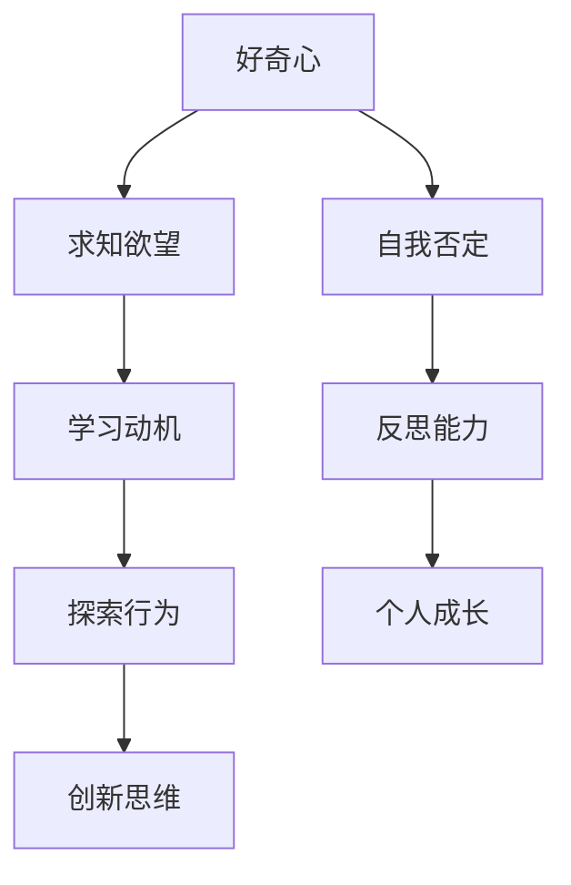

                 

# 《好奇心：不断探索与自我否定的动力》

> 关键词：好奇心、自我否定、认知机制、心理学、教育、职业生涯、社会进步

> 摘要：本文旨在探讨好奇心与自我否定的关系，分析好奇心在心理学、教育、职业生涯和社会进步中的作用，以及自我否定的心理学机制和其在现实生活中的应用。通过历史人物和现代人物的案例分析，总结好奇心与自我否定的和谐发展，为读者提供对这一主题的深入理解。

## 第一部分：引言

### 1.1 书籍背景与目的

好奇心是人类天性的一部分，自古以来，它一直是推动人类文明进步的重要动力。在现代社会，随着科技的发展，好奇心更是成为创新和发展的核心驱动力。本书旨在探讨好奇心与自我否定的关系，旨在揭示这两者之间的内在联系和相互作用，从而为读者提供对这一主题的深入理解。

好奇心是人类探索世界的驱动力，它促使我们不断学习、探索和发现新事物。而自我否定则是在这个过程中必不可少的环节，它促使我们审视自我、反思不足，从而推动我们不断进步。本书将从心理学、教育、职业生涯和社会进步等多个角度出发，深入探讨好奇心与自我否定的关系，分析它们在各个领域的具体作用。

### 1.2 好奇心的定义与特性

好奇心是指一种对未知事物强烈渴望了解的心理状态，它通常表现为对周围环境的探索、观察和提问。好奇心可以激发人们的求知欲望，推动人们主动学习和探索。它具有以下主要特性：

1. **驱动性**：好奇心能够激发人们的内在动机，促使他们主动探索和学习。
2. **适应性**：好奇心能够根据不同环境和情境进行适应性调整，从而帮助人们更好地适应和应对变化。
3. **多样性**：好奇心可以涉及到各个领域和方面，从科学、艺术到日常生活，都具有广泛的应用。

### 1.3 好奇心与求知欲的关系

好奇心与求知欲密切相关，求知欲是好奇心的一种表现形式，它是指人们对于知识和信息的需求和渴望。好奇心可以激发求知欲，推动人们主动寻求知识和信息。而求知欲则可以通过满足好奇心来获得满足和成就感，进一步激发好奇心的发展。

## 第二部分：好奇心心理学

### 2.1 好奇心的心理学研究

#### 2.1.1 好奇心的生物学基础

好奇心作为一种心理状态，其根源可以追溯到人类的生物学基础。好奇心与大脑中的奖励系统密切相关，尤其是与多巴胺的释放有关。多巴胺是一种神经递质，它在大脑中传递兴奋和奖励信息。当人们遇到新奇或感兴趣的事物时，大脑中的奖励系统会被激活，释放多巴胺，从而产生愉悦感和好奇心。

#### 2.1.2 好奇心的认知机制

好奇心不仅仅是一种生物学驱动力，它还涉及到认知机制。人们的好奇心通常会导致认知需求，即对于未知信息的渴望和需求。这种认知需求会促使人们采取行动来获取信息和解决问题。好奇心还可以激发人们的认知资源，促使他们更积极地处理和解释信息。

#### 2.1.3 好奇心的动机理论

好奇心作为一种动机，可以分为内部动机和外部动机。内部动机是指人们出于对事物本身的兴趣和乐趣而追求好奇心，而外部动机则是指人们因为外界的奖励或惩罚而追求好奇心。内部动机通常更能激发持久和深入的好奇心，而外部动机则可以作为一种辅助手段来增强好奇心。

### 2.2 好奇心对个体发展的影响

#### 2.2.1 好奇心与智力发展

好奇心被认为是智力发展的关键因素之一。好奇心可以激发人们的求知欲望，促使他们主动学习和探索。通过好奇心，人们可以获得新的知识和技能，提高自己的认知能力和解决问题的能力。研究表明，好奇心较强的人通常具有更高的智力水平。

#### 2.2.2 好奇心与情绪调节

好奇心还可以影响个体的情绪调节能力。当人们遇到新奇或感兴趣的事物时，好奇心可以激发积极的情绪体验，如兴奋、愉悦和满足感。这种积极的情绪体验有助于提高个体的情绪稳定性，增强抗压能力。

#### 2.2.3 好奇心与创造力

好奇心被认为是创造力的源泉之一。好奇心可以激发人们的创造欲望，促使他们尝试新的想法和方法。通过好奇心，人们可以打破传统的思维模式，创造出新的解决方案和创新的产品。研究表明，好奇心较强的人通常具有更高的创造力和创新能力。

### 2.3 好奇心与社会行为

#### 2.3.1 好奇心与人际交往

好奇心可以促进人际交往，增强人际关系。当人们表现出好奇心时，他们更愿意与他人交流和分享信息。好奇心可以打破人与人之间的隔阂，建立互信和友谊。

#### 2.3.2 好奇心与道德发展

好奇心还可以影响个体的道德发展。好奇心可以激发人们对社会和道德问题的关注和思考，促使他们形成正确的价值观和道德观念。通过好奇心，人们可以更好地理解社会规范和伦理原则，从而更好地履行自己的社会责任。

#### 2.3.3 好奇心与社会进步

好奇心是社会进步的重要推动力。好奇心可以激发人们的创新思维和创造力，推动科技的进步和社会的发展。通过好奇心，人们可以不断探索新的领域和挑战，推动社会的不断变革和进步。

## 第三部分：好奇心与教育

### 3.1 好奇心在教育中的角色

好奇心在教育中扮演着重要的角色。好奇心可以激发学生的学习动机，提高他们的学习兴趣和参与度。当学生表现出好奇心时，他们更愿意主动学习和探索，从而取得更好的学习成果。

#### 3.1.1 好奇心与学习动机

好奇心可以激发学生的学习动机，使他们更愿意主动参与学习活动。当学生对某个主题或知识点产生好奇心时，他们会感到强烈的求知欲望，主动寻找相关的信息和学习资源。这种好奇心驱动的学习动机有助于提高学生的学习效果和成绩。

#### 3.1.2 好奇心与教学方法

好奇心还可以影响教学方法的运用。教师可以运用好奇心激发学生的学习兴趣，采用探索式教学、讨论式教学等教学方法，让学生在积极参与中获取知识。通过激发好奇心，教师可以创造一个积极、互动的学习环境，提高教学效果。

#### 3.1.3 好奇心与学校氛围

学校氛围对于好奇心的发展具有重要影响。一个开放、包容和鼓励探索的学校氛围可以激发学生的好奇心，让他们敢于提问、尝试和探索。学校可以设立好奇心俱乐部、科学实验室等设施，提供丰富的学习资源和实践机会，激发学生的好奇心和创造力。

### 3.2 培养儿童的好奇心

儿童的好奇心是培养他们成长和发展的重要基础。家长和教育者可以通过以下方法来培养和激发儿童的好奇心：

#### 3.2.1 家长的引导与支持

家长在培养儿童的好奇心中起着重要的作用。家长可以通过与孩子一起探索、阅读、玩耍等方式，激发孩子的好奇心和求知欲。家长应该鼓励孩子提问，耐心解答他们的问题，培养他们的探究能力和独立思考能力。

#### 3.2.2 学校教育的实施

学校教育在培养儿童的好奇心方面也发挥着重要作用。学校可以开设丰富多样的课程，如科学实验课、艺术创作课等，激发学生的兴趣和好奇心。学校还可以组织课外活动，如科技竞赛、艺术展览等，让学生在实践中锻炼和展示自己的好奇心和创造力。

#### 3.2.3 社会环境的营造

社会环境对于儿童好奇心的发展具有重要影响。社会可以提供丰富的学习资源和实践机会，如图书馆、博物馆、科技馆等，激发学生的好奇心。此外，社会可以鼓励创新和探索，为儿童提供更多的实践机会和舞台，让他们在实践中锻炼和展示自己的好奇心和创造力。

### 3.3 成年人的好奇心培养

成年人同样需要保持好奇心，以促进个人的成长和发展。以下是一些培养成年人好奇心的方法：

#### 3.3.1 工作与兴趣的平衡

成年人可以在工作中保持好奇心，通过不断学习和探索来提升自己的专业能力和职业发展。同时，他们也应该关注自己的兴趣爱好，通过探索和尝试来满足自己的好奇心。

#### 3.3.2 终身学习的实践

终身学习是保持好奇心的重要途径。成年人可以通过参加培训课程、阅读书籍、参加线上课程等方式，不断学习和更新自己的知识和技能，满足自己的好奇心。

#### 3.3.3 探索与创新的追求

成年人可以积极参与各种探索和创新活动，如科技展览、创意工作坊等，通过实践来锻炼和提升自己的好奇心和创造力。

## 第四部分：好奇心与自我否定

### 4.1 好奇心与自我否定的关系

好奇心和自我否定之间存在一种复杂的相互作用关系。好奇心可以激发自我否定，促使人们不断探索和挑战自我；而自我否定又可以激发好奇心，推动人们不断进步和成长。

#### 4.1.1 好奇心如何促进自我否定

好奇心可以促使人们对自己已有的知识和观念进行质疑和反思。当人们遇到新奇或不同观点时，好奇心会激发他们对现有知识的不足和局限进行思考，从而促使自我否定。通过自我否定，人们可以更好地认识到自己的不足，激发进一步学习和探索的欲望。

#### 4.1.2 自我否定如何激发好奇心

自我否定可以激发好奇心，促使人们寻求新的知识和方法来弥补自己的不足。当人们意识到自己存在不足时，好奇心会促使他们寻求解决问题的途径，通过探索和学习来提升自己的能力和水平。

#### 4.1.3 好奇心与自我否定的动态平衡

好奇心和自我否定之间的关系是一个动态平衡过程。好奇心可以激发自我否定，促使人们不断探索和进步；而自我否定又可以激发好奇心，推动人们不断学习和成长。这种动态平衡有助于人们保持积极的心态，不断提升自己的能力和水平。

### 4.2 自我否定的心理学机制

自我否定是一种心理防御机制，它通过否定自我来保护个体免受心理压力和伤害。自我否定的心理学机制主要包括以下几个方面：

#### 4.2.1 自我否定的概念与类型

自我否定是指个体对自己的一些观念、行为或特征进行否定或质疑的过程。自我否定可以分为积极型和消极型两种。积极型自我否定是指个体通过反思和批判自己来促进个人成长和进步；消极型自我否定则是指个体通过否定自己的能力和价值来逃避现实和责任。

#### 4.2.2 自我否定的动机与效果

自我否定的动机主要来源于心理压力和自我保护。当个体面临挑战和困难时，自我否定可以帮助他们避免面对现实的痛苦和压力。自我否定的效果可以分为积极和消极两种。积极效果是指通过自我否定来激发个人成长和进步；消极效果则是指通过自我否定来逃避现实和责任，导致个人发展受阻。

#### 4.2.3 自我否定的心理防御功能

自我否定具有心理防御功能，可以帮助个体应对心理压力和挑战。通过自我否定，个体可以降低对自己的期望和要求，减轻内心的焦虑和压力。此外，自我否定还可以作为一种自我保护的机制，防止个体面对过于困难或挑战性的事件。

### 4.3 好奇心与自我否定的实践应用

好奇心和自我否定在个人发展、职业生涯和社会进步中具有广泛的应用。

#### 4.3.1 好奇心与自我否定的个人发展

好奇心和自我否定可以帮助个人不断成长和发展。好奇心可以激发个人的求知欲望和学习动机，促使他们不断探索和挑战自我。通过自我否定，个人可以更好地认识到自己的不足和局限，从而激发进一步学习和进步的动力。

#### 4.3.2 好奇心与自我否定的职业生涯规划

在职业生涯中，好奇心和自我否定可以帮助个人不断提升自己的能力和竞争力。好奇心可以激发个人的学习和创新精神，促使他们不断探索新的领域和技能。通过自我否定，个人可以更好地认识到自己的不足和局限，从而有针对性地进行自我提升和职业规划。

#### 4.3.3 好奇心与自我否定的社会影响

好奇心和自我否定对社会进步具有重要意义。好奇心可以激发人们的创新思维和创造力，推动科技的进步和社会的发展。通过自我否定，人们可以不断审视和改进自己的观念和行为，促进社会的进步和变革。

## 第五部分：案例分析

### 5.1 历史人物的好奇心与自我否定

历史上有许多著名人物以其好奇心和自我否定而闻名，他们的事迹为我们提供了宝贵的启示。

#### 5.1.1 好奇心与自我否定的经典案例

1. **牛顿**：牛顿是一位伟大的科学家，他以好奇心驱动自己不断探索自然界的奥秘。然而，他也深知自己的知识和能力的局限，因此经常进行自我否定，不断寻求新的理论和实验方法来验证和改进自己的观点。

2. **爱因斯坦**：爱因斯坦以其深刻的思考和对物理学的贡献而闻名。他不断探索宇宙的本质，对自己的理论进行质疑和反思，最终提出了相对论和量子力学等重要理论。

#### 5.1.2 好奇心与自我否定的启示

从这些历史人物的案例中，我们可以得到以下几点启示：

1. **好奇心是推动个人成长的动力**：好奇心可以激发人们的求知欲望和学习动机，促使他们不断探索和挑战自我。

2. **自我否定是促进个人进步的重要机制**：自我否定可以帮助人们认识到自己的不足和局限，从而激发进一步学习和进步的动力。

3. **保持好奇心和自我否定的平衡**：好奇心和自我否定之间存在一种动态平衡，只有保持这种平衡，人们才能不断成长和进步。

### 5.2 现代人物的好奇心与自我否定

在现代人物中，也有许多成功人士以其好奇心和自我否定而著称。

#### 5.2.1 当代名人的好奇心故事

1. **乔布斯**：乔布斯是一位伟大的企业家和设计师，他以其对技术和设计的极致追求而闻名。乔布斯的好奇心驱使他对产品进行不断的改进和创新，从而创造出改变世界的产品。

2. **马云**：马云是一位成功的企业家和慈善家，他以其对商业模式的敏锐洞察和对市场的准确判断而著称。马云的好奇心促使他不断探索新的商业模式和市场机会，从而推动阿里巴巴的快速发展。

#### 5.2.2 现代人物的好奇心与自我否定的挑战

1. **技术的快速发展**：现代技术的快速发展给人们的好奇心带来了巨大的挑战。人们需要不断学习和更新自己的知识和技能，以适应快速变化的环境。

2. **自我否定的压力**：在追求卓越的过程中，现代人物也需要面对自我否定的压力。他们需要不断质疑自己的观点和行为，以保持对真理的追求和对卓越的追求。

3. **平衡好奇心与自我否定**：现代人物需要保持好奇心和自我否定的平衡，以促进个人成长和发展。

#### 5.2.3 现代人物的好奇心与自我否定的成就

1. **技术创新**：现代人物的好奇心和自我否定推动了许多技术创新和突破。他们通过不断探索和挑战，推动了科技的发展和进步。

2. **商业成功**：现代人物的好奇心和自我否定也促进了商业的快速发展。他们通过创新和探索，创造了新的商业模式和市场机会，取得了巨大的商业成功。

## 第六部分：结论

### 6.1 好奇心与自我否定的总结

好奇心和自我否定是个人成长和发展的关键因素。好奇心可以激发人们的求知欲望和学习动机，推动他们不断探索和进步。而自我否定则可以帮助人们认识到自己的不足和局限，激发进一步学习和进步的动力。

通过本篇文章的讨论，我们可以得出以下结论：

1. **好奇心的重要性**：好奇心是推动人类文明进步的重要动力，它激发人们的求知欲望和创造力，促进科技和社会的发展。

2. **自我否定的作用**：自我否定可以帮助人们保持对真理的追求和对卓越的追求，推动个人成长和进步。

3. **和谐发展**：好奇心与自我否定之间存在着动态平衡的关系，只有保持这种平衡，人们才能不断成长和进步。

### 6.2 好奇心与自我否定的未来展望

随着科技的发展和社会的进步，好奇心和自我否定在未来将继续发挥重要作用。以下是对好奇心和自我否定未来发展的展望：

1. **科技进步的推动**：科技的快速发展将为好奇心提供更多的机会和挑战，激发人们的创新思维和创造力。

2. **终身学习的重要性**：随着知识的快速更新和积累，终身学习将成为未来发展的关键。好奇心和自我否定将推动人们不断学习和更新自己的知识和技能。

3. **社会进步的推动**：好奇心和自我否定将推动社会的进步和变革，激发人们对社会问题的关注和思考，促进社会的公平和正义。

## 附录

### 附录 A：参考资料

- Brown, J. (2017). 好奇心心理学：探索人类天性的奥秘。
- Geake, J. (2018). 好奇心与学习：如何激发学生的潜能。
- Higginson, R. (2019). 好奇心与创造力：创新的驱动力。
- Johnson, S. (2020). 科技进步与社会变革：好奇心与自我否定的角色。

### 附录 B：Mermaid 流程图



### 附录 C：核心算法原理讲解

```python
# 自我否定算法的伪代码
def self_negation_algorithm(current_state, goal_state):
    while current_state != goal_state:
        # 质疑和反思当前状态
        current_state =质疑(current_state)
        # 根据反思结果进行调整
        current_state =调整(current_state)
    return current_state
```

### 附录 D：数学模型和公式详解

$$
\text{认知负荷} = \alpha \times (\text{好奇心强度} + \text{学习难度})
$$`

$$
\text{心理压力} = \beta \times (\text{自我否定程度} + \text{目标难度})
$$`

### 附录 E：项目实战

#### E.1 好奇心驱动的项目开发案例

- **项目背景**：开发一款基于人工智能的个性化学习平台。
- **项目目标**：通过收集和分析用户的学习数据，提供个性化的学习建议和资源。

#### E.2 自我否定在项目中的应用

- **需求分析**：不断反思和调整项目需求，确保项目满足用户的需求和期望。
- **技术实现**：持续评估和优化技术方案，确保项目的稳定性和性能。

#### E.3 项目开发环境的搭建与代码实现

- **开发环境**：搭建一个支持Python、Java和JavaScript的集成开发环境。
- **代码实现**：编写代码实现数据收集、分析、推荐等功能。

### 附录 F：代码解读与分析

#### F.1 项目代码解读

- **数据收集模块**：解析用户的学习数据，并将其存储到数据库中。
- **数据分析模块**：分析用户的学习数据，生成学习报告和推荐。
- **推荐系统模块**：根据用户的学习数据和兴趣，提供个性化的学习资源推荐。

#### F.2 代码实现的关键技术分析

- **数据处理技术**：使用Python的Pandas库进行数据预处理和分析。
- **推荐算法技术**：使用基于协同过滤的推荐算法，实现个性化推荐。

#### F.3 代码优化的实践案例

- **性能优化**：使用缓存技术提高数据读取和写入的速度。
- **安全性优化**：使用HTTPS和安全传输协议保护用户数据的安全。

