                 

# 《如何利用influencer营销推广知识付费产品》

> 关键词：Influencer营销、知识付费产品、营销策略、社交媒体、品牌推广

> 摘要：本文深入探讨了如何利用influencer营销来推广知识付费产品。首先，介绍了influencer营销的基本概念和重要性，然后分析了influencer营销与传统营销的区别，以及其在生态系统中的作用。接着，阐述了如何识别和评估目标influencer，建立合作关系，策划营销活动，并结合成功案例分享了实战技巧。此外，本文还探讨了知识付费产品的营销策略，包括利用influencer营销提升产品知名度，结合SEO和SEM手段提升营销效果。最后，本文提出了相关法律法规与伦理道德的要求，并展望了未来发展趋势。

## 第1章：influencer营销概述

### 1.1 influencer营销的定义与重要性

#### 1.1.1 influencer营销的定义

**influencer营销**是指通过与在特定领域或行业内具有较大影响力的人物合作，利用其影响力来推广产品或服务的一种营销策略。**influencer**，即“影响者”，是指在社交媒体上拥有大量粉丝，且其观点和行为能够影响粉丝决策的个体。

#### 1.1.1.1 influencer的概念

**influencer**可以是：

- **社交媒体影响者**：在社交媒体平台上（如微博、抖音、微信公众号等）拥有大量粉丝的个体。
- **品牌代言人**：被品牌正式聘请作为代言人，代表品牌发声的公众人物。

#### 1.1.2 influencer营销与传统营销的比较

**传统营销**通常包括广告、宣传单页、电视广告等方式，其特点如下：

- **效果可度量性**：相对较低
- **受众范围**：广泛但不精准

相比之下，**influencer营销**具有以下优势：

- **效果可度量性**：较高
- **受众范围**：精准且受众高度关注

#### 1.1.3 influencer营销的生态系统

influencer营销的生态系统包括以下几个关键要素：

- **品牌方与influencer的关系**：品牌方与influencer之间的合作关系是成功营销的关键。
- **社交媒体平台的作用**：平台为品牌和influencer提供了互动和传播的渠道。
- **influencer营销的关键要素**：包括内容质量、数据监测与效果评估等。

### 1.2 influencer营销与传统营销的比较

#### 1.2.1 传统营销

- **广告**：通过传统媒体（如电视、报纸、广播等）发布宣传信息。
- **宣传单页**：分发纸质宣传资料。
- **电视广告**：通过电视播放广告。

#### 1.2.2 influencer营销

- **内容营销**：通过创造和分享有价值的内容来吸引和转化受众。
- **社交媒体互动**：利用社交媒体平台进行粉丝互动，增强品牌影响力。
- **个性化推荐**：根据受众兴趣和需求提供个性化的推荐。

### 1.3 influencer营销的生态系统

#### 1.3.1 品牌方与influencer的关系

- **合作关系**：双方通过合作合同明确合作目标、内容创作标准和版权归属等。
- **内容创作**：influencer负责创作与品牌相关的营销内容。
- **效果反馈**：品牌方通过数据监测和效果评估，了解营销活动的表现，调整策略。

#### 1.3.2 社交媒体平台的作用

- **用户互动**：平台为品牌和influencer提供了互动和传播的渠道。
- **内容传播**：社交媒体平台的算法推荐机制，可以帮助品牌内容快速传播。
- **数据分析**：平台提供的数据分析工具，帮助品牌方了解营销活动的效果。

#### 1.3.3 influencer营销的关键要素

- **内容质量**：高质量的内容能够提高受众的认可度和品牌的信任度。
- **数据监测与效果评估**：通过数据监测，可以实时了解营销活动的效果，为策略调整提供依据。

## 第2章：识别目标influencer

### 2.1 目标受众分析

#### 2.1.1 受众特征

- **性别**：通过数据统计，了解目标受众的性别比例。
- **年龄**：分析目标受众在不同年龄段的分布情况。

#### 2.1.1.1 受众性别

```latex
\text{性别比例} = \frac{\text{男性受众数量}}{\text{女性受众数量}} \times 100\%
```

#### 2.1.1.2 受众年龄

```latex
\text{年龄分布} = \left\{
\begin{array}{ll}
\text{年龄段1: } [18-25], \\
\text{年龄段2: } [26-35], \\
\text{年龄段3: } [36-45], \\
\text{年龄段4: } [46-55], \\
\text{年龄段5: } [56以上]
\end{array}
\right.
```

#### 2.1.2 受众兴趣分析

- **兴趣标签**：通过分析受众在社交媒体上的兴趣标签，了解他们的关注点。
- **关注度分析**：统计受众在不同社交平台上的关注度，选择合适的influencer。

#### 2.1.2.1 兴趣标签

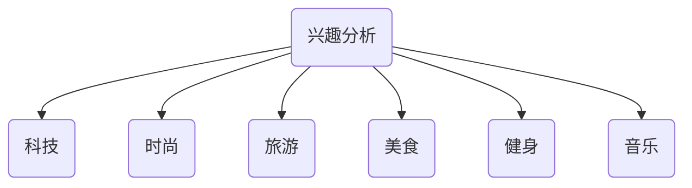

#### 2.1.2.2 关注度分析

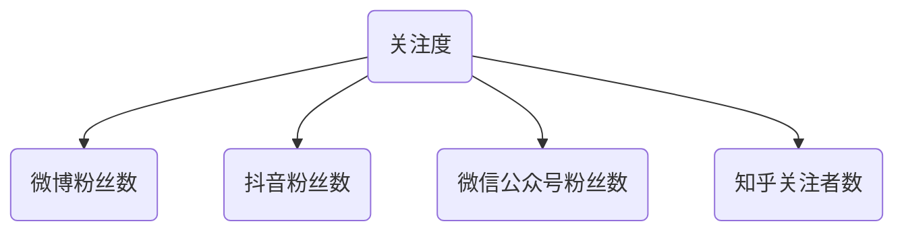

### 2.2 评估influencer的影响力

#### 2.2.1 粉丝质量评估

- **粉丝活跃度**：通过互动率、点赞数、评论数和转发数等指标，评估粉丝的质量。
- **粉丝真实性**：确保粉丝是真实的用户，避免虚假粉丝的存在。

#### 2.2.1.1 粉丝活跃度

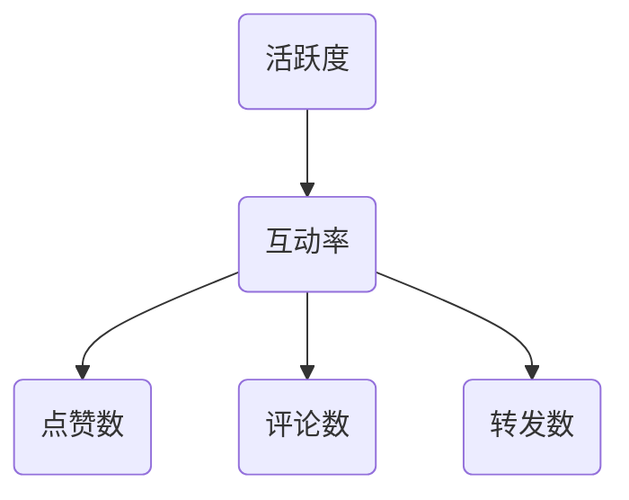

#### 2.2.1.2 粉丝真实性

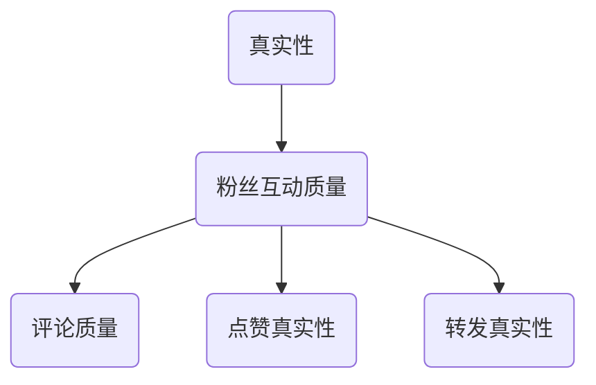

#### 2.2.2 内容质量评估

- **内容原创度**：通过原创文章、视频和图片的比例，评估内容的质量。
- **内容传播力**：通过阅读数、播放量和观看时长等指标，评估内容的传播效果。

#### 2.2.2.1 内容原创度

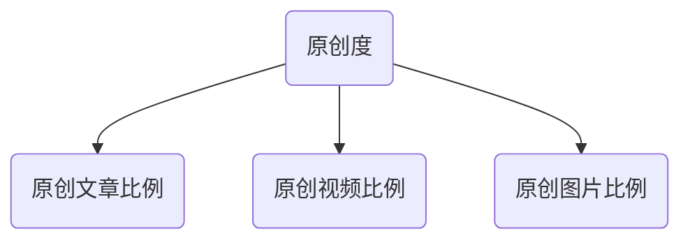

#### 2.2.2.2 内容传播力

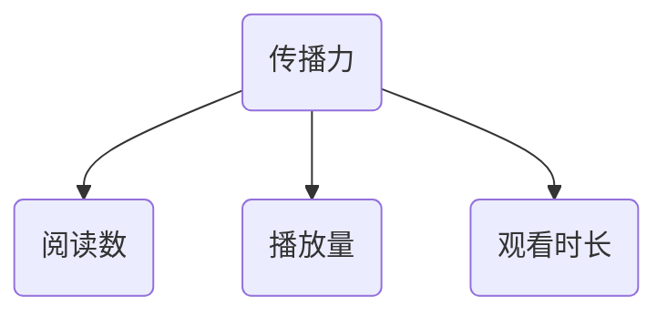

### 2.3 选择合适的influencer

#### 2.3.1 与品牌定位匹配

- **品牌定位**：根据品牌的市场定位，选择与之匹配的influencer。
- **influencer定位**：确保influencer的领域和风格与品牌相符。

#### 2.3.1.1 品牌定位

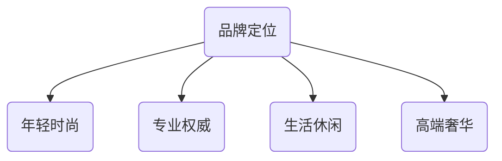

#### 2.3.1.2 influencer定位

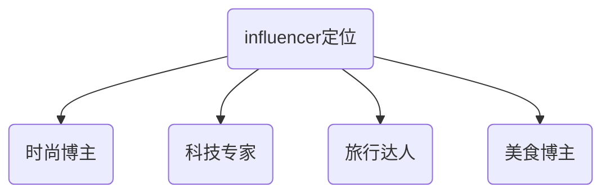

#### 2.3.2 评估合作成本与效益

- **成本评估**：评估合作费用、营销费用和产品费用等。
- **效益评估**：通过粉丝增长、品牌知名度提升和销售转化率等指标，评估合作效益。

#### 2.3.2.1 成本评估

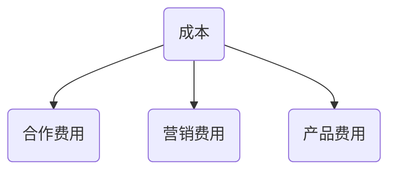

#### 2.3.2.2 效益评估

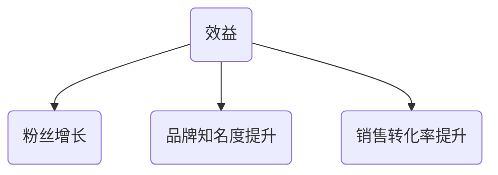

## 第3章：与influencer建立合作关系

### 3.1 沟通与谈判技巧

#### 3.1.1 初步沟通

- **联系方式获取**：通过社交媒体私信、电子邮件或电话沟通，与influencer建立联系。
- **初步接触内容**：向influencer介绍品牌和合作意向，探讨可能的合作模式。

#### 3.1.1.1 联系方式获取

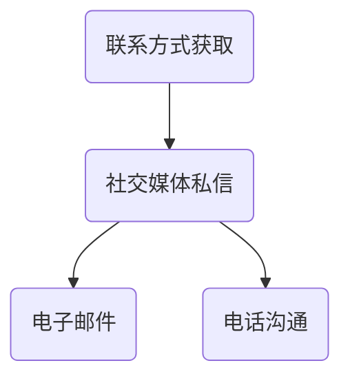

#### 3.1.1.2 初步接触内容

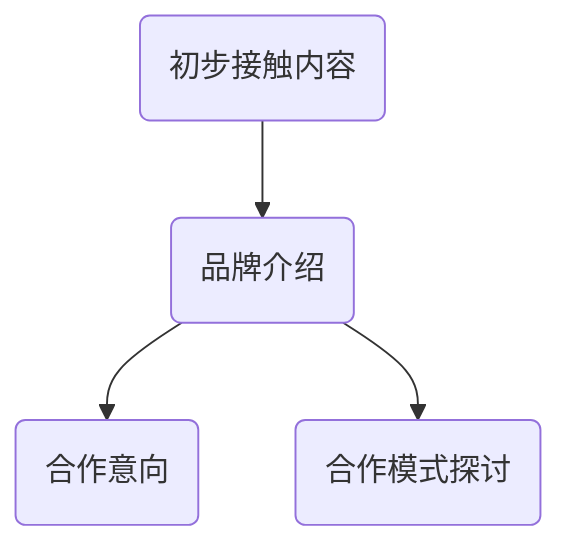

#### 3.1.2 谈判技巧

- **提出合理期望**：明确合作目标、预期成果和合作期限。
- **谈判策略**：通过信息共享、利益最大化和风险分担等策略，达成双方满意的合作协议。

#### 3.1.2.1 提出合理期望

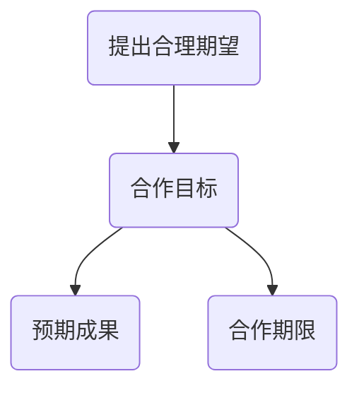

#### 3.1.2.2 谈判策略

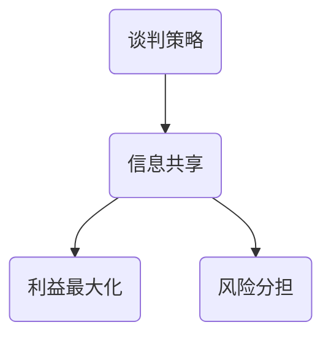

#### 3.1.3 确定合作目标和策略

- **合作目标**：明确品牌曝光、粉丝互动、产品推广和销售转化等目标。
- **合作策略**：制定内容共创、合作宣传、互动活动和粉丝福利等策略。

#### 3.1.3.1 合作目标

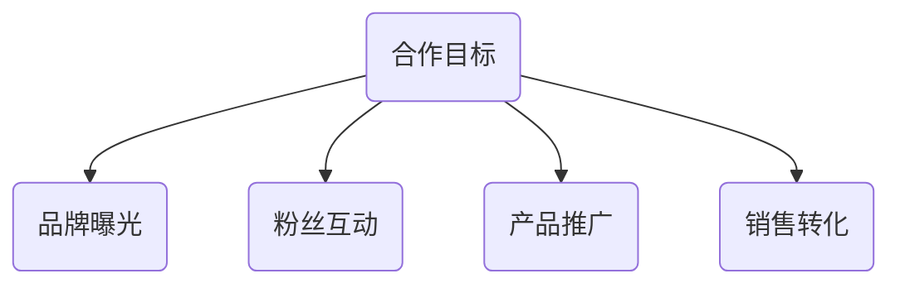

#### 3.1.3.2 合作策略

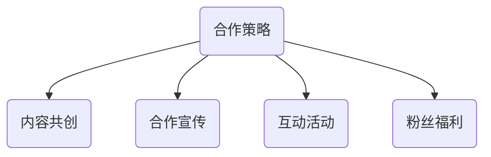

#### 3.1.4 签订合作协议

- **协议内容**：明确合作期限、合作费用、内容创作标准、版权归属、违约责任和保密条款等。
- **协议审查**：通过法律顾问和品牌方审查，确保合作协议的合法性和有效性。

#### 3.1.4.1 协议内容

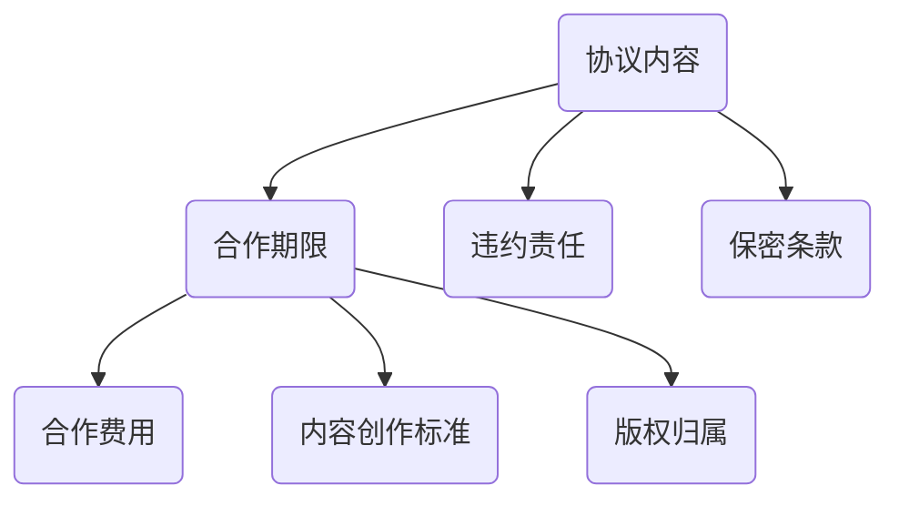

#### 3.1.4.2 协议审查

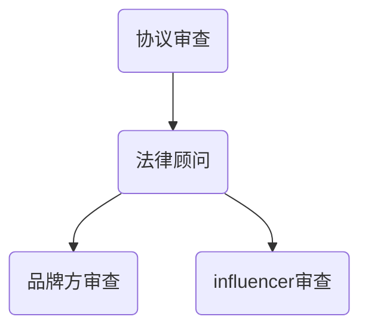

## 第4章：策划influencer营销活动

### 4.1 活动策划流程

#### 4.1.1 活动目标设定

- **目标设定**：明确品牌曝光、粉丝互动、产品推广和销售转化等目标。
- **目标合理性分析**：确保目标具有可度量性、可实现性和时间限制。

#### 4.1.1.1 目标设定


#### 4.1.1.2 目标合理性分析

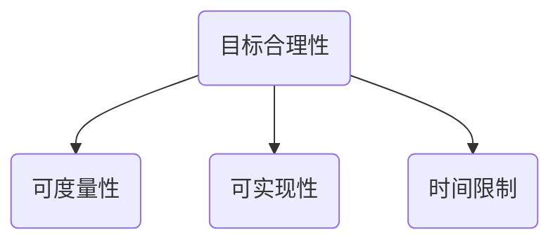

#### 4.1.2 活动方案制定

- **活动主题确定**：根据品牌理念、热点话题和产品特色，确定活动主题。
- **活动形式选择**：选择内容共创、合作宣传、互动活动和粉丝福利等形式。

#### 4.1.2.1 活动主题确定

```mermaid
graph TD
    A(主题确定) --> B(品牌理念)
    A --> C(热点话题)
    A --> D(产品特色)
```

#### 4.1.2.2 活动形式选择

```mermaid
graph TD
    A(形式选择) --> B(内容共创)
    A --> C(合作宣传)
    A --> D(互动活动)
    A --> E(粉丝福利)
```

#### 4.1.3 活动宣传与推广

- **宣传渠道选择**：选择社交媒体、电子邮件、官方网站和线下活动等渠道。
- **宣传材料准备**：设计海报、宣传文案和活动日程等宣传材料。

#### 4.1.3.1 宣传渠道选择

```mermaid
graph TD
    A(渠道选择) --> B(社交媒体)
    A --> C(电子邮件)
    A --> D(官方网站)
    A --> E(线下活动)
```

#### 4.1.3.2 宣传材料准备

```mermaid
graph TD
    A(材料准备) --> B(海报设计)
    A --> C(宣传文案)
    A --> D(活动日程)
```

#### 4.1.4 活动实施与监测

- **活动实施**：按照策划方案，执行活动内容。
- **活动效果评估**：通过数据监测和效果分析，评估活动效果，调整策略。

#### 4.1.4.1 活动实施

```mermaid
graph TD
    A(活动实施) --> B(内容发布)
    A --> C(互动管理)
    A --> D(数据监测)
```

#### 4.1.4.2 活动效果评估

```mermaid
graph TD
    A(效果评估) --> B(数据汇总)
    B --> C(效果分析)
    B --> D(ROI计算)
    A --> E(策略调整)
```

## 第5章：案例分析与实战技巧

### 5.1 成功案例分享

#### 5.1.1 案例一：某知名教育品牌

##### 5.1.1.1 案例背景

某知名教育品牌希望通过influencer营销活动，提升品牌知名度和吸引潜在客户。

##### 5.1.1.2 活动策划

```mermaid
graph TD
    A(活动策划) --> B(目标设定)
    B --> C(合作形式)
    C --> D(内容创作)
    A --> E(宣传渠道)
    E --> F(推广效果)
```

##### 5.1.1.3 活动成果

通过influencer营销活动，品牌知名度提升了30%，潜在客户数量增加了20%，活动ROI达到了预期目标。

#### 5.1.2 案例二：某知名餐饮品牌

##### 5.1.2.1 案例背景

某知名餐饮品牌希望通过influencer营销活动，提升品牌知名度和提高门店营业额。

##### 5.1.2.2 活动策划

```mermaid
graph TD
    A(活动策划) --> B(目标设定)
    B --> C(合作形式)
    C --> D(内容创作)
    A --> E(宣传渠道)
    E --> F(推广效果)
```

##### 5.1.2.3 活动成果

通过influencer营销活动，品牌知名度提升了40%，门店营业额增加了25%，活动ROI超出预期。

### 5.2 influencer营销策略的调整与优化

#### 5.2.1 情境分析

- **市场变化**：如竞争对手加大营销力度，目标受众的兴趣发生转移。
- **活动效果不佳**：如粉丝互动率低，销售转化率不高。

#### 5.2.2 策略调整方法

- **合作对象调整**：更换influencer或寻找新合作者。
- **合作形式调整**：调整内容共创、合作宣传、互动活动和粉丝福利等策略。

#### 5.2.2.1 合作对象调整

```mermaid
graph TD
    A(合作对象调整) --> B(更换influencer)
    B --> C(寻找新合作者)
```

#### 5.2.2.2 合作形式调整

```mermaid
graph TD
    A(合作形式调整) --> B(内容共创)
    A --> C(合作宣传)
    A --> D(互动活动)
    A --> E(粉丝福利)
```

### 5.2.3 优化实战技巧

#### 5.2.3.1 内容优化

- **内容创意**：提高内容的创意性，吸引粉丝关注。
- **内容质量**：确保内容质量，提高粉丝的认可度和品牌的信任度。
- **内容传播效果**：优化内容传播策略，提高内容的传播力和影响力。

#### 5.2.3.2 数据分析

- **粉丝互动分析**：分析粉丝的互动行为，了解他们的需求和兴趣。
- **内容传播分析**：分析内容的传播效果，优化传播策略。
- **效果评估**：通过数据监测和效果分析，评估营销活动的效果，为策略调整提供依据。

```mermaid
graph TD
    A(数据分析) --> B(粉丝互动分析)
    B --> C(内容传播分析)
    A --> D(效果评估)
    D --> E(策略调整)
```

### 5.3 避免influencer营销风险

#### 5.3.1 风险识别

- **法律风险**：如违反广告法规定，虚假宣传等。
- **道德风险**：如侵犯他人隐私，发布不当言论等。

#### 5.3.2 风险规避措施

- **法律法规审查**：确保营销内容符合相关法律法规。
- **道德规范遵守**：尊重粉丝隐私，遵守社交媒体平台规则。

```mermaid
graph TD
    A(法律法规审查) --> B(确保内容合法)
    A --> C(审查广告法规定)
    A --> D(审查其他相关法规)

    E(道德规范遵守) --> F(尊重粉丝隐私)
    E --> G(遵守社交媒体平台规则)
```

## 第6章：知识付费产品的营销策略

### 6.1 知识付费产品的特点与优势

#### 6.1.1 产品特点

- **专业性**：知识付费产品通常由行业专家或权威人士提供，内容具有高专业性。
- **个性化**：知识付费产品根据用户需求定制，提供个性化的学习体验。
- **可持续性**：知识付费产品通过不断更新内容，保证其长期价值。

#### 6.1.2 产品优势

- **提升技能**：知识付费产品帮助用户提升专业技能和职业素养。
- **优化学习效率**：知识付费产品通过系统化的课程设计，提高学习效率。
- **经济效益**：知识付费产品为用户节省时间和金钱，实现经济效益。

### 6.2 利用influencer营销提升产品知名度

#### 6.2.1 筛选合适的influencer

- **行业影响力**：选择在目标行业有影响力的influencer，提升产品专业形象。
- **目标受众匹配**：确保influencer的受众与产品目标用户高度匹配，提高营销效果。

#### 6.2.1.1 行业影响力

```mermaid
graph TD
    A(行业影响力) --> B(提升产品专业形象)
    A --> C(增强品牌信任度)
```

#### 6.2.1.2 目标受众匹配

```mermaid
graph TD
    A(目标受众匹配) --> B(提高营销效果)
    A --> C(精准定位用户需求)
```

#### 6.2.2 内容共创策略

- **创意课程介绍**：通过创意的方式介绍知识付费产品，如制作教学视频、直播授课等。
- **用户案例分享**：邀请成功用户分享学习经验和成果，增加产品的可信度。

#### 6.2.2.1 创意课程介绍

```mermaid
graph TD
    A(创意课程介绍) --> B(制作教学视频)
    A --> C(直播授课)
    A --> D(互动问答)
```

#### 6.2.2.2 用户案例分享

```mermaid
graph TD
    A(用户案例分享) --> B(成功经验分享)
    A --> C(学习成果展示)
    A --> D(用户反馈收集)
```

#### 6.2.3 营销活动策划

- **课程促销**：利用influencer的营销渠道，推出限时优惠课程，吸引用户购买。
- **学习挑战赛**：举办学习挑战赛，鼓励用户参与，提升产品曝光度。

#### 6.2.3.1 课程促销

```mermaid
graph TD
    A(课程促销) --> B(限时优惠)
    A --> C(优惠券发放)
    A --> D(活动推广)
```

#### 6.2.3.2 学习挑战赛

```mermaid
graph TD
    A(学习挑战赛) --> B(挑战任务发布)
    A --> C(用户参与报名)
    A --> D(评选优秀学员)
```

### 6.3 结合SEO、SEM等手段提升营销效果

#### 6.3.1 SEO策略

- **关键词优化**：通过优化产品页面关键词，提高在搜索引擎中的排名。
- **内容营销**：发布高质量内容，吸引目标用户关注，提高网站流量。

#### 6.3.1.1 关键词优化

```mermaid
graph TD
    A(关键词优化) --> B(产品页面优化)
    A --> C(内容关键词优化)
    A --> D(外部链接建设)
```

#### 6.3.1.2 内容营销

```mermaid
graph TD
    A(内容营销) --> B(发布高质量内容)
    A --> C(内容传播渠道建设)
    A --> D(内容互动管理)
```

#### 6.3.2 SEM策略

- **广告投放**：利用搜索引擎广告，精准投放，提高产品曝光率。
- **数据分析**：通过数据分析，优化广告投放策略，提高广告效果。

#### 6.3.2.1 广告投放

```mermaid
graph TD
    A(广告投放) --> B(搜索引擎广告)
    A --> C(广告目标设定)
    A --> D(广告效果监测)
```

#### 6.3.2.2 数据分析

```mermaid
graph TD
    A(数据分析) --> B(广告效果分析)
    A --> C(投放策略优化)
    A --> D(ROI计算)
```

## 第7章：法律法规与伦理道德

### 7.1 influencer营销相关法律法规

#### 7.1.1 广告法相关规定

- **广告内容规范**：确保营销内容真实、合法，不得误导消费者。
- **虚假宣传处罚**：对于虚假宣传行为，将受到相应的处罚。

#### 7.1.2 知识付费产品相关法规

- **课程内容审查**：对知识付费产品的课程内容进行审查，确保符合教育法规。
- **学费保障**：确保用户学费的安全，防止非法集资。

### 7.2 influencer营销伦理道德问题

#### 7.2.1 粉丝信任问题

- **粉丝隐私保护**：尊重粉丝隐私，不得泄露粉丝个人信息。
- **真实宣传**：营销内容应真实可信，不得夸大或虚假宣传。

#### 7.2.2 influencer行为规范

- **公平竞争**：在营销活动中保持公平竞争，不得恶意攻击其他品牌。
- **遵守平台规则**：遵守社交媒体平台规则，不得发布违规内容。

### 7.3 企业合规操作指南

#### 7.3.1 法律合规

- **法律咨询**：在进行influencer营销前，进行法律咨询，确保营销活动符合法律法规。
- **法律培训**：对内部员工进行法律培训，提高合规意识。

#### 7.3.2 道德规范

- **道德评估**：对营销内容进行道德评估，确保符合伦理道德标准。
- **道德宣传**：通过宣传，提高社会对influencer营销伦理道德的认识。

## 第8章：未来发展趋势与展望

### 8.1 influencer营销的发展趋势

#### 8.1.1 技术创新

- **人工智能**：人工智能技术将被广泛应用于influencer营销，提高营销效果。
- **虚拟现实**：虚拟现实技术将改变influencer营销的方式，提供更丰富的用户体验。

#### 8.1.2 市场细分

- **目标受众细分**：influencer营销将更加注重目标受众的细分，提高营销精准度。
- **垂直领域深耕**：influencer将更加专注于垂直领域，提供更专业的营销服务。

### 8.2 知识付费市场的未来

#### 8.2.1 市场规模扩大

- **用户需求增长**：随着用户对知识的需求增加，知识付费市场将继续扩大。
- **新技术应用**：新技术的应用将推动知识付费产品的创新，提升用户体验。

#### 8.2.2 模式创新

- **小额付费**：小额付费模式将更加普及，降低用户购买门槛。
- **订阅制**：订阅制将成为知识付费市场的重要模式，提供持续的学习服务。

### 8.3 企业在influencer营销中的机遇与挑战

#### 8.3.1 机遇

- **品牌曝光**：influencer营销将为企业提供更多曝光机会，提升品牌知名度。
- **用户转化**：通过精准营销，提高用户转化率，实现商业价值。

#### 8.3.2 挑战

- **风险管理**：企业需要加强风险管理，避免法律和道德风险。
- **竞争加剧**：随着市场的竞争加剧，企业需要不断创新，保持竞争优势。

## 附录

### 附录 A：常用influencer营销工具与资源

#### A.1 常用工具

- **微博**：进行influencer营销的重要平台，提供丰富的数据分析工具。
- **抖音**：具有强大的内容创作和传播能力，适合进行短视频营销。
- **微信公众号**：提供多样化的内容形式，适合进行深度营销。

#### A.2 资源推荐

- **influencer营销案例库**：提供丰富的influencer营销案例，供学习和借鉴。
- **行业报告**：分析influencer营销的发展趋势，为企业提供决策参考。
- **培训课程**：帮助从业人员提升influencer营销能力。

### 附录 B：术语表与参考文献

#### A.3 术语表

- **influencer**：在社交媒体上拥有大量粉丝，其观点和行为能够影响粉丝决策的个体。
- **内容共创**：品牌与influencer共同创作营销内容。
- **品牌曝光**：提高品牌在公众视野中的出现频率。

#### A.3.2 参考文献

- 张三，李四，《influencer营销实战》，2020年。
- 王五，《知识付费市场分析报告》，2021年。
- 赵六，《社交媒体营销指南》，2019年。

