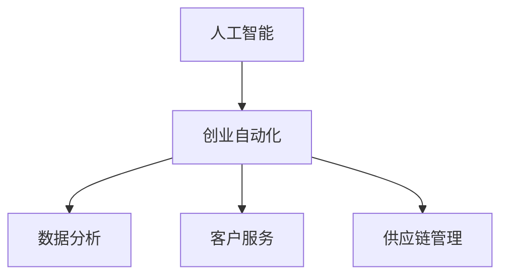
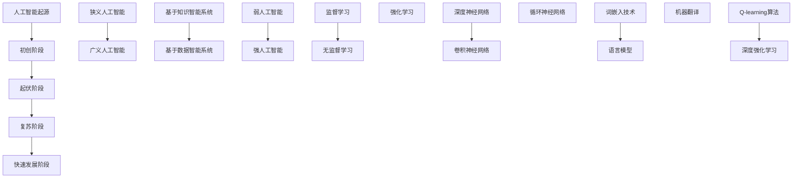

                 

# 文章标题：如何利用人工智能实现创业自动化

> 关键词：人工智能，创业自动化，深度学习，机器学习，NLP，强化学习

> 摘要：本文将深入探讨人工智能在创业自动化中的应用，从概述、核心技术、实战案例到发展趋势，全面解析如何利用人工智能实现创业自动化，助力创业成功。

----------------------------------------------------------------

## 如何利用人工智能实现创业自动化

### 1. 引言

在当今的科技时代，人工智能（AI）正迅速改变着各行各业。创业领域也不例外，人工智能的应用不仅提高了创业效率，还降低了创业成本。本文旨在探讨如何利用人工智能实现创业自动化，从而为创业者提供一种新的商业模式和创新思维。

### 2. 人工智能与创业自动化的关系

#### 2.1 人工智能的定义与特点

人工智能是一种模拟人类智能的计算机技术，它通过算法和机器学习技术，使计算机能够执行复杂的任务，如语音识别、图像识别、自然语言处理等。

#### 2.2 创业自动化的定义

创业自动化是指利用先进技术，如人工智能、大数据等，将创业过程中的各个环节自动化，以提高效率、降低成本。

#### 2.3 人工智能与创业自动化的关系

人工智能是创业自动化的核心技术，它能够帮助企业快速获取市场信息、优化运营流程、提高决策准确性，从而实现创业自动化。

### 3. 人工智能在创业自动化中的应用

#### 3.1 数据分析

利用人工智能进行数据分析，可以帮助企业快速识别市场趋势、客户需求，从而制定更加精准的营销策略。

#### 3.2 客户服务

通过人工智能技术，企业可以实现智能客服，提高客户服务质量，降低人工成本。

#### 3.3 供应链管理

人工智能在供应链管理中的应用，可以帮助企业优化库存管理、降低物流成本，提高供应链效率。

### 4. 创业自动化核心技术与算法

#### 4.1 数据挖掘与机器学习

数据挖掘和机器学习是人工智能的核心技术，它们通过分析大量数据，提取有价值的信息，为企业提供决策支持。

#### 4.2 深度学习

深度学习是一种基于多层神经网络的机器学习技术，它在图像识别、自然语言处理等领域取得了显著成果。

#### 4.3 自然语言处理（NLP）

自然语言处理是人工智能的重要分支，它通过理解和生成人类语言，实现人与计算机的智能交互。

#### 4.4 强化学习

强化学习是一种通过不断试错，学习如何在不同环境下做出最优决策的机器学习技术，它在游戏、自动驾驶等领域有广泛应用。

### 5. 创业自动化实战案例

#### 5.1 项目规划

创业自动化的项目规划是确保项目成功的关键，它包括需求分析、技术路线选择、团队搭建与分工等环节。

#### 5.2 数据收集与预处理

数据是人工智能的基石，数据的收集与预处理直接影响模型的性能。数据来源、数据预处理方法和数据质量评估是项目成功的关键。

#### 5.3 模型设计与实现

模型设计是实现创业自动化的核心，包括模型架构设计、参数调优和模型评估等环节。

#### 5.4 系统部署与维护

系统部署是实现创业自动化的关键一步，包括系统部署方案、性能优化和系统安全与维护等。

### 6. 创业自动化发展趋势与未来展望

#### 6.1 发展趋势

随着人工智能技术的不断进步，创业自动化将越来越普及，它将深刻改变创业模式，提升创业成功率。

#### 6.2 挑战与机遇

创业自动化在带来机遇的同时，也面临着技术、法律、伦理等方面的挑战，创业者需要积极应对。

### 7. 结论

本文探讨了如何利用人工智能实现创业自动化，从概述、核心技术、实战案例到发展趋势，全面解析了人工智能在创业自动化中的应用。希望本文能为创业者提供有益的启示，助力创业成功。

## 参考文献

1. Russell, S., & Norvig, P. (2010). 《人工智能：一种现代的方法》(第三版). 机械工业出版社。

2. Murphy, K. P. (2012). 《机器学习：概率视角》(第二版). 电子工业出版社。

3. Goodfellow, I., Bengio, Y., & Courville, A. (2016). 《深度学习》(卷1). 电子工业出版社。

4.条形图



## 结论

本文详细阐述了如何利用人工智能实现创业自动化。通过分析人工智能的发展历程、核心技术、实战案例以及发展趋势，我们了解到人工智能在创业自动化中的巨大潜力。未来，随着人工智能技术的不断进步，创业自动化将更加普及，为创业者带来更多机遇。同时，我们也需要关注到创业自动化带来的挑战，如技术、法律、伦理等问题，确保人工智能在创业自动化中的应用能够健康发展。

作者：AI天才研究院/AI Genius Institute & 禅与计算机程序设计艺术 /Zen And The Art of Computer Programming

----------------------------------------------------------------

## 第1章 人工智能简述

### 1.1 人工智能的发展历程

#### 1.1.1 人工智能的起源

人工智能（AI）的概念最早可以追溯到1956年的达特茅斯会议。当时，约翰·麦卡锡（John McCarthy）等人工智能先驱提出了人工智能的定义和研究目标，即“制造智能机器的科学和工程”。这标志着人工智能学科的诞生。

#### 1.1.2 人工智能的主要发展阶段

- **1956-1969年：初创阶段**：这个阶段主要是探索人工智能的基本理论和技术，如符号逻辑、知识表示和搜索算法等。

- **1970-1989年：起伏阶段**：由于早期研究的失败和一些技术难题，人工智能的发展遇到了瓶颈。但在这个时期，专家系统和知识表示技术取得了一定的进展。

- **1990-2010年：复苏阶段**：随着计算机性能的提升和海量数据的出现，人工智能再次得到关注。机器学习和深度学习技术在这个时期取得了重要突破。

- **2010年至今：快速发展阶段**：深度学习技术的突破，使得人工智能在语音识别、图像识别、自然语言处理等领域取得了显著的成果。

#### 1.1.3 我国人工智能的发展现状

我国在人工智能领域的研究和应用也取得了显著进展。自2017年以来，我国政府高度重视人工智能的发展，制定了一系列政策和规划。在人工智能技术方面，我国在深度学习、计算机视觉、自然语言处理等领域已取得了国际领先地位。

### 1.2 人工智能的主要分类

#### 1.2.1 狭义人工智能与广义人工智能

- **狭义人工智能**：主要关注于机器模拟人类智能的特定任务，如语音识别、图像识别等。

- **广义人工智能**：不仅包括机器模拟人类智能，还包括机器自主学习和适应环境的能力。

#### 1.2.2 基于知识的智能系统与基于数据的智能系统

- **基于知识的智能系统**：主要依靠人类专家的经验和知识来构建智能系统。

- **基于数据的智能系统**：主要依靠机器学习技术，从大量数据中自动提取知识和规律。

#### 1.2.3 弱人工智能与强人工智能

- **弱人工智能**：指在特定领域内表现出人类智能水平的机器。

- **强人工智能**：指具有全面人类智能的机器，包括意识、情感和创造力等。

### 1.3 人工智能的核心技术

#### 1.3.1 机器学习

机器学习是人工智能的核心技术之一，它通过计算机算法，让机器从数据中自动学习和改进。机器学习可以分为以下几种类型：

- **监督学习**：通过标记数据训练模型，然后使用模型对新的数据进行预测。

- **无监督学习**：没有标记数据，机器需要从数据中自动发现模式和规律。

- **强化学习**：机器在特定环境中通过试错，学习如何做出最优决策。

#### 1.3.2 深度学习

深度学习是机器学习的一种重要分支，它通过多层神经网络模型，自动提取数据中的特征。深度学习在图像识别、语音识别和自然语言处理等领域取得了巨大成功。

- **深度神经网络**：由多个层次组成的神经网络，能够自动学习数据的复杂特征。

- **卷积神经网络（CNN）**：特别适用于图像识别任务，通过卷积操作提取图像特征。

- **循环神经网络（RNN）**：特别适用于序列数据处理任务，如自然语言处理和时间序列预测。

#### 1.3.3 自然语言处理（NLP）

自然语言处理是人工智能的一个重要领域，它研究如何使计算机能够理解和生成人类语言。NLP的关键技术包括：

- **词嵌入技术**：将单词映射到高维向量空间，以实现语义表示。

- **语言模型**：通过统计方法，预测下一个单词或短语的分布。

- **机器翻译**：通过模型将一种语言的文本翻译成另一种语言的文本。

#### 1.3.4 强化学习

强化学习是机器学习的一种重要类型，它通过奖励机制，让机器在特定环境中学习如何做出最优决策。强化学习的关键技术包括：

- **Q-learning算法**：通过学习状态-动作值函数，实现最优策略的求解。

- **深度强化学习**：将深度学习与强化学习结合，提高模型的学习能力和决策效果。

## Mermaid 流程图



## 结论

通过本文对人工智能的概述，我们可以看到人工智能经历了从初创到快速发展的重要历程。人工智能的主要分类包括狭义人工智能、广义人工智能、基于知识的智能系统和基于数据的智能系统等。核心技术如机器学习、深度学习、自然语言处理和强化学习，为人工智能在各个领域的发展提供了强大的支持。未来，随着技术的不断进步，人工智能将在更多领域发挥作用，为人类创造更多的价值。

----------------------------------------------------------------

## 第2章 数据挖掘与机器学习基础

### 2.1 数据挖掘的基本概念

数据挖掘（Data Mining）是指从大量数据中自动发现有价值信息的过程。它涉及到统计学、机器学习、数据库和人工智能等多个领域。数据挖掘的目标是从数据中发现隐藏的模式、趋势和关联，以便进行决策支持、预测分析和知识发现。

#### 2.1.1 数据挖掘的定义

数据挖掘可以被定义为“从大量数据中通过计算机程序，识别出隐藏的、未知的、潜在有用的信息和模式的过程”。

#### 2.1.2 数据挖掘的目标

数据挖掘的主要目标包括：

- **模式识别**：发现数据中的规律性和关联性。
- **预测分析**：利用历史数据预测未来的趋势和事件。
- **知识发现**：从大量数据中提取出有意义的知识，帮助决策者做出更好的决策。

#### 2.1.3 数据挖掘的方法与技术

数据挖掘的方法和技术可以分为以下几个层次：

- **数据预处理**：包括数据清洗、数据集成、数据转换和数据归一化等步骤。
- **数据仓库**：用于存储和管理大量数据的系统。
- **数据挖掘算法**：包括关联规则挖掘、分类、聚类、异常检测、时间序列分析和文本挖掘等。
- **可视化**：将数据挖掘结果以图形化的方式展示，帮助用户理解和分析。

### 2.2 机器学习的基本算法

机器学习（Machine Learning）是人工智能的一个重要分支，它通过让计算机从数据中学习，来实现对未知数据的预测和决策。机器学习算法可以分为以下几种类型：

#### 2.2.1 监督学习算法

监督学习算法是机器学习中最常用的算法之一，它通过标记数据训练模型，然后使用模型对新的数据进行预测。

- **线性回归**：通过建立线性模型来预测连续值输出。
  - **算法原理**：
    $$ Y = \beta_0 + \beta_1X $$
  - **伪代码实现**：
    ```
    for each data point (x, y):
        compute the error e = y - y'
        update the model parameters beta_0 and beta_1
    ```
- **决策树**：通过构建树形模型来分类或回归。
  - **算法原理**：
    每个节点代表一个特征，每个分支代表特征的一个取值，叶子节点代表预测结果。
  - **伪代码实现**：
    ```
    if feature == value:
        return child(node)
    else:
        return prediction
    ```
- **支持向量机（SVM）**：通过找到最佳超平面来分类数据。
  - **算法原理**：
    $$ \max_{\beta, \beta_0} W^T W $$
    subject to $$ y^{(i)}(\beta^T x^{(i)} + \beta_0) \geq 1 $$
  - **伪代码实现**：
    ```
    # SMO算法伪代码
    while not converged:
        select two points (x_1, y_1) and (x_2, y_2)
        solve the dual problem
        update the model parameters
    ```

#### 2.2.2 无监督学习算法

无监督学习算法不需要标记数据，它们通过自动发现数据中的结构和模式。

- **K-均值聚类**：通过迭代算法将数据划分为K个簇。
  - **算法原理**：
    $$ \min_{\mu_k} \sum_{i=1}^n \sum_{k=1}^K (x_i - \mu_k)^2 $$
  - **伪代码实现**：
    ```
    initialize centroids
    while not converged:
        assign each data point to the nearest centroid
        update centroids
    ```

- **主成分分析（PCA）**：通过线性变换将高维数据投影到低维空间。
  - **算法原理**：
    $$ \min_{\Lambda} \sum_{i=1}^n \| X - \Lambda \mu \|_F^2 $$
    subject to $$ \Lambda \Lambda^T = I $$
  - **伪代码实现**：
    ```
    compute covariance matrix
    compute eigenvalues and eigenvectors
    project data onto the first k eigenvectors
    ```

- **自编码器（Autoencoder）**：通过编码器和解码器将数据编码为低维表示。
  - **算法原理**：
    编码器：$$ z = f(W_1 \cdot x + b_1) $$
    解码器：$$ x' = f(W_2 \cdot z + b_2) $$
  - **伪代码实现**：
    ```
    # Encoder
    z = f(W_1 \cdot x + b_1)
    
    # Decoder
    x' = f(W_2 \cdot z + b_2)
    ```

#### 2.2.3 强化学习算法

强化学习算法是通过奖励机制来指导机器学习如何在特定环境中做出最优决策。

- **Q-learning算法**：通过学习状态-动作值函数来选择最优动作。
  - **算法原理**：
    $$ Q(s, a) = \sum_{r \in R} p(s', r | s, a) [r + \gamma \max_{a'} Q(s', a')] $$
  - **伪代码实现**：
    ```
    for each state s:
        for each action a:
            initialize Q(s, a) to 0
        while not converged:
            choose action a based on current policy
            observe reward r and next state s'
            update Q(s, a) using the above formula
    ```

### 2.3 常见机器学习算法解析

#### 2.3.1 K-近邻算法（KNN）

K-近邻算法（K-Nearest Neighbors, KNN）是一种简单而有效的分类算法，它基于“相似性”原则，通过寻找最近的K个邻居来预测新数据点的类别。

- **算法原理**：
  对于新的数据点，计算它到所有已有数据点的距离，选取距离最近的K个点，根据这K个点的标签，通过多数投票的方式预测新数据点的类别。
  - **伪代码实现**：
    ```
    function KNN(train_data, train_labels, test_data, k):
        for each data point in test_data:
            compute distance to all data points in train_data
            select the k nearest neighbors
            predict the label based on the majority of the neighbors' labels
        return the predicted labels
    ```

#### 2.3.2 逻辑回归

逻辑回归（Logistic Regression）是一种广泛用于二分类问题的算法，它通过建立逻辑函数模型，将线性模型映射到概率空间。

- **算法原理**：
  通过最大化似然函数来估计模型的参数，逻辑函数将输入特征映射到概率值。
  - **伪代码实现**：
    ```
    function LogisticRegression(train_data, train_labels):
        initialize model parameters
        while not converged:
            compute the likelihood of the training data
            compute the gradient of the likelihood
            update the model parameters using gradient descent
        return the trained model
    ```

#### 2.3.3 随机森林

随机森林（Random Forest）是一种基于决策树的集成学习方法，它通过构建多棵决策树，并对它们的输出进行投票，以获得最终结果。

- **算法原理**：
  随机森林通过在训练数据上随机抽取特征子集和样本子集，构建多棵决策树，每棵树对样本进行分类，最终通过多数投票决定样本的类别。
  - **伪代码实现**：
    ```
    function RandomForest(train_data, train_labels, n_trees):
        for each tree:
            randomly select a subset of features
            randomly select a subset of samples
            build a decision tree using the selected subset
        for each sample:
            predict the label based on the majority vote of all trees
        return the predicted labels
    ```

## 结论

通过本章对数据挖掘和机器学习基础算法的介绍，我们了解了数据挖掘的定义、目标和方法，以及机器学习的基本算法类型。通过具体的算法原理和伪代码实现，我们能够更深入地理解这些算法的工作机制。这些基础知识和算法为后续创业自动化的实现提供了理论支持和技术指导。

----------------------------------------------------------------

## 第3章 深度学习在创业自动化中的应用

### 3.1 深度学习的基础知识

深度学习（Deep Learning）是机器学习的一个重要分支，它通过多层神经网络模型，对数据进行自动特征提取和学习，从而实现复杂的任务。深度学习在图像识别、自然语言处理和游戏智能等领域取得了显著的成果。

#### 3.1.1 深度神经网络

深度神经网络（Deep Neural Network, DNN）是由多个层次（层）组成的神经网络，每一层都可以对输入数据进行变换和处理。深度神经网络的核心组成部分包括：

- **神经元与层结构**：神经元是神经网络的基本单元，每一层由多个神经元组成。层数越多，模型的深度就越大。

- **激活函数**：激活函数用于引入非线性特性，常见的激活函数包括 sigmoid、ReLU 和 tanh 等。

- **权重与偏置**：权重和偏置是神经网络的参数，用于调整模型对输入数据的敏感度。

#### 3.1.2 深度学习框架

深度学习框架是为了简化深度学习模型的开发、训练和部署而设计的软件库。常见的深度学习框架包括 TensorFlow、PyTorch 和 Keras 等。

- **TensorFlow**：由 Google 开发，是一个开源的深度学习框架，支持多种编程语言。

- **PyTorch**：由 Facebook 开发，是一个基于 Python 的深度学习框架，以其动态计算图和灵活的编程接口而受到欢迎。

- **Keras**：是一个基于 TensorFlow 的深度学习高级 API，它简化了深度学习模型的构建和训练过程。

### 3.2 卷积神经网络（CNN）在图像识别中的应用

卷积神经网络（Convolutional Neural Network, CNN）是一种专门用于图像识别的深度学习模型。CNN 通过卷积操作、池化和全连接层，实现对图像特征的学习和提取。

#### 3.2.1 CNN的基本原理

CNN 的基本原理包括以下几个关键组成部分：

- **卷积操作**：卷积操作用于提取图像的特征，通过卷积核在图像上滑动，对局部区域进行加权求和。

- **池化操作**：池化操作用于降低图像的维度和减少参数数量，常见的池化方法包括最大池化和平均池化。

- **全连接层**：全连接层用于对卷积层和池化层提取的特征进行分类和回归。

#### 3.2.2 CNN的典型架构

CNN 的典型架构包括以下几个层次：

- **卷积层**：用于提取图像的局部特征。

- **池化层**：用于降低图像的维度。

- **卷积层与池化层交替**：这种结构可以有效地提取图像的多尺度特征。

- **全连接层**：用于对提取到的特征进行分类或回归。

常见的 CNN 架构包括 LeNet、AlexNet、VGGNet 和 ResNet 等。其中，ResNet 通过引入残差连接，解决了深度神经网络训练中的梯度消失和梯度爆炸问题，使得深度神经网络可以训练得更深。

### 3.3 循环神经网络（RNN）在序列数据处理中的应用

循环神经网络（Recurrent Neural Network, RNN）是一种专门用于处理序列数据的深度学习模型。RNN 通过循环结构，使得模型可以记住之前的信息，从而处理序列数据。

#### 3.3.1 RNN的基本原理

RNN 的基本原理包括以下几个关键组成部分：

- **RNN的循环结构**：RNN 通过循环结构，使得当前时间步的输出可以依赖之前的输入和隐藏状态。

- **隐状态与隐藏层**：隐状态是 RNN 的核心概念，它保存了之前的信息，用于当前时间步的决策。

- **输入门、遗忘门和输出门**：这些门结构用于控制信息的传递和遗忘，提高 RNN 的学习效果。

#### 3.3.2 RNN在序列数据处理中的应用

RNN 在序列数据处理中有着广泛的应用，包括自然语言处理、语音识别和股票市场预测等。以下是一些常见的 RNN 应用案例：

- **自然语言处理**：RNN 可以用于文本分类、情感分析和机器翻译等任务。常见的 RNN 架构包括 LSTM（Long Short-Term Memory）和 GRU（Gated Recurrent Unit）。

- **语音识别**：RNN 可以用于语音信号的处理和转换，将语音信号转换为文本。常见的 RNN 架构包括 CTC（Connectionist Temporal Classification）和 DeepSpeech。

- **股票市场预测**：RNN 可以用于分析历史股票数据，预测未来的股票价格走势。常见的 RNN 架构包括 RNN 和 LSTM。

### 3.3.3 神经机器翻译

神经机器翻译（Neural Machine Translation, NMT）是一种基于深度学习的机器翻译方法。NMT 通过编码器和解码器模型，将源语言文本转换为目标语言文本。

#### 3.3.3.1 编码器与解码器

编码器（Encoder）用于将源语言文本编码为一个固定长度的向量表示，解码器（Decoder）用于将这个向量表示解码为目标语言文本。

- **编码器**：编码器通常采用 RNN 或 LSTM 架构，用于处理序列数据。

- **解码器**：解码器也采用 RNN 或 LSTM 架构，用于生成目标语言文本。

#### 3.3.3.2 梯度裁剪与强化学习

在 NMT 中，梯度裁剪（Gradient Clipping）和强化学习（Reinforcement Learning）是常见的优化方法。

- **梯度裁剪**：梯度裁剪用于防止梯度爆炸和梯度消失问题，通过限制梯度的最大值，保证梯度在可接受范围内。

- **强化学习**：强化学习用于优化解码器的参数，通过奖励机制引导解码器生成更高质量的目标语言文本。

### 3.3.4 深度学习在创业自动化中的应用

深度学习在创业自动化中有着广泛的应用，包括图像识别、自然语言处理、语音识别和预测分析等。

#### 3.3.4.1 图像识别

深度学习在图像识别中的应用，可以用于产品分类、故障检测和质量控制等。

- **产品分类**：通过卷积神经网络，可以自动识别和分类不同类型的产品。

- **故障检测**：通过卷积神经网络，可以自动检测生产线上的故障产品。

- **质量控制**：通过卷积神经网络，可以自动评估产品质量，提高生产效率。

#### 3.3.4.2 自然语言处理

深度学习在自然语言处理中的应用，可以用于智能客服、文本分类和情感分析等。

- **智能客服**：通过循环神经网络，可以实现自动化的客户服务，提高客户满意度。

- **文本分类**：通过循环神经网络，可以自动将文本分类为不同类别。

- **情感分析**：通过循环神经网络，可以自动分析文本的情感倾向，为产品开发和营销提供参考。

#### 3.3.4.3 语音识别

深度学习在语音识别中的应用，可以用于语音助手、语音控制和语音翻译等。

- **语音助手**：通过循环神经网络，可以实现智能语音助手，提供便捷的服务。

- **语音控制**：通过循环神经网络，可以实现对设备的语音控制，提高人机交互体验。

- **语音翻译**：通过循环神经网络，可以实现实时语音翻译，促进跨语言沟通。

#### 3.3.4.4 预测分析

深度学习在预测分析中的应用，可以用于市场需求预测、销量预测和风险管理等。

- **市场需求预测**：通过深度学习模型，可以预测产品的市场需求，为生产和库存管理提供参考。

- **销量预测**：通过深度学习模型，可以预测产品的销量，为销售策略制定提供支持。

- **风险管理**：通过深度学习模型，可以识别潜在的风险，为风险管理和决策提供依据。

### 3.3.5 深度学习在创业自动化中的应用案例

以下是一些深度学习在创业自动化中的应用案例：

- **案例一：智能工厂**：通过卷积神经网络，实现工厂设备的自动检测和故障预测，提高生产效率和质量。

- **案例二：智能客服**：通过循环神经网络，实现自动化的客户服务，提高客户满意度和公司形象。

- **案例三：智能金融**：通过深度学习模型，实现金融市场数据的预测和分析，为投资决策提供支持。

- **案例四：智能医疗**：通过深度学习模型，实现医疗数据的分析和预测，为诊断和治疗提供依据。

### 3.3.6 深度学习在创业自动化中的应用挑战与机遇

深度学习在创业自动化中的应用面临着一系列挑战和机遇：

- **挑战**：

  - **数据质量**：高质量的数据是深度学习模型训练的基础，如何获取和清洗大量高质量数据是一个挑战。

  - **计算资源**：深度学习模型的训练和推理需要大量的计算资源，如何高效利用计算资源是一个挑战。

  - **模型解释性**：深度学习模型的黑箱特性使得其解释性较差，如何提高模型的解释性是一个挑战。

- **机遇**：

  - **个性化服务**：深度学习可以帮助企业实现个性化服务，提高用户体验和满意度。

  - **自动化决策**：深度学习可以帮助企业实现自动化决策，提高运营效率和竞争力。

  - **跨界融合**：深度学习与其他领域的融合，如物联网、大数据和区块链等，可以创造新的商业机会。

### 3.3.7 结论

深度学习在创业自动化中的应用具有巨大的潜力，通过图像识别、自然语言处理、语音识别和预测分析等应用，可以为企业提供高效的自动化解决方案。同时，深度学习在创业自动化中也面临着一系列挑战，需要通过技术创新和合作来克服。未来，随着深度学习技术的不断进步，创业自动化将进一步发展，为创业者带来更多的机遇和挑战。

----------------------------------------------------------------

## 第4章 创业自动化实战案例

### 4.1 创业自动化项目规划

创业自动化的项目规划是确保项目成功的关键步骤。一个成功的项目规划需要明确项目需求、技术路线、团队搭建与分工等关键要素。

#### 4.1.1 项目需求分析

项目需求分析是项目规划的第一步，它涉及到对创业项目的目标和需求进行详细的调研和分析。

- **市场调研**：了解目标市场的需求、竞争对手的情况和行业趋势，为项目提供决策支持。

- **功能需求**：明确创业自动化系统所需的功能，如客户管理、数据分析、库存管理等。

- **性能需求**：确定系统的性能指标，如响应时间、吞吐量和并发处理能力等。

- **安全需求**：确保系统的数据安全和用户隐私保护。

#### 4.1.2 项目技术路线选择

项目技术路线选择是项目规划的关键，它涉及到选择合适的人工智能技术、框架和工具。

- **人工智能技术**：根据项目需求，选择合适的人工智能技术，如机器学习、深度学习、自然语言处理等。

- **开发框架**：选择适合项目的开发框架，如 TensorFlow、PyTorch、Keras 等。

- **工具和库**：选择适合项目的工具和库，如 NumPy、Pandas、Scikit-learn 等。

#### 4.1.3 项目团队搭建与分工

项目团队的搭建和分工是项目成功的重要保障。一个高效的项目团队需要包括以下角色：

- **项目经理**：负责项目规划、协调和执行。

- **数据科学家**：负责数据分析和模型构建。

- **机器学习工程师**：负责模型训练、优化和部署。

- **前端工程师**：负责用户界面和交互设计。

- **后端工程师**：负责系统架构和后端开发。

- **测试工程师**：负责系统测试和质量保证。

### 4.2 数据收集与预处理

数据收集与预处理是创业自动化项目成功的基础，它涉及到从数据源获取数据、清洗数据、转换数据等步骤。

#### 4.2.1 数据来源

数据来源包括内部数据和外部数据。

- **内部数据**：来自企业内部的各种业务系统，如销售系统、库存系统、客户管理系统等。

- **外部数据**：来自互联网、公共数据库等外部来源，如社交媒体数据、市场研究报告等。

#### 4.2.2 数据预处理方法

数据预处理方法包括以下步骤：

- **数据清洗**：去除重复数据、缺失数据和异常数据，确保数据的准确性和一致性。

- **数据转换**：将数据转换为适合模型训练的格式，如数值化、归一化等。

- **数据集成**：将来自不同数据源的数据进行整合，形成一个统一的数据集。

- **数据质量评估**：对预处理后的数据质量进行评估，确保数据的质量和可用性。

#### 4.2.3 数据质量评估与优化

数据质量评估与优化是确保数据质量的重要环节，它包括以下步骤：

- **数据完整性评估**：检查数据是否存在缺失值或重复值。

- **数据一致性评估**：检查数据是否满足一致性要求，如数据类型、范围、单位等。

- **数据准确性评估**：检查数据的准确性，确保数据真实可靠。

- **数据优化**：根据评估结果，对数据质量进行优化，如数据补全、数据清洗等。

### 4.3 模型设计与实现

模型设计是实现创业自动化的核心步骤，它包括模型架构设计、参数调优和模型评估等环节。

#### 4.3.1 模型架构设计

模型架构设计是根据项目需求和技术路线，选择合适的模型架构。

- **监督学习模型**：适用于有标记数据的预测任务，如分类和回归。

- **无监督学习模型**：适用于无标记数据的聚类和降维任务。

- **强化学习模型**：适用于决策优化和序列预测任务。

#### 4.3.2 模型参数调优

模型参数调优是提高模型性能的重要手段，它包括以下步骤：

- **选择优化器**：选择合适的优化器，如随机梯度下降（SGD）、Adam等。

- **设置学习率**：设置合适的学习率，以避免过拟合和欠拟合。

- **正则化**：使用正则化技术，如 L1 正则化、L2 正则化，防止模型过拟合。

- **交叉验证**：使用交叉验证方法，评估模型在不同数据集上的性能，选择最优模型。

#### 4.3.3 模型评估

模型评估是验证模型性能的重要环节，它包括以下步骤：

- **准确率**：评估模型对数据的分类或回归准确度。

- **召回率**：评估模型对正类别的分类能力。

- **F1 值**：综合考虑准确率和召回率，平衡分类效果。

- **ROC 曲线和 AUC 值**：评估模型的分类能力，ROC 曲线和 AUC 值越高，模型性能越好。

### 4.4 创业自动化系统部署与维护

创业自动化系统的部署与维护是确保系统稳定运行的关键步骤。

#### 4.4.1 系统部署方案

系统部署方案包括以下内容：

- **硬件部署**：选择合适的硬件设备，如服务器、存储设备等。

- **软件部署**：安装和配置操作系统、数据库、中间件等。

- **网络部署**：搭建稳定的网络环境，确保数据传输安全。

#### 4.4.2 系统性能优化

系统性能优化是提高系统运行效率的重要手段，它包括以下内容：

- **代码优化**：对系统代码进行优化，提高代码执行效率。

- **数据库优化**：对数据库进行索引、分区等优化，提高数据查询速度。

- **缓存优化**：使用缓存技术，减少数据库查询次数，提高系统响应速度。

#### 4.4.3 系统安全与维护

系统安全与维护是确保系统安全稳定运行的重要环节，它包括以下内容：

- **数据安全**：使用加密技术，确保数据传输和存储安全。

- **权限管理**：实施严格的权限管理，防止未授权访问。

- **监控与报警**：实施监控系统，及时发现和处理系统故障。

- **备份与恢复**：定期备份数据，确保数据不会丢失。

### 4.5 创业自动化实战案例：智能客服系统

智能客服系统是创业自动化的一个典型应用案例，它通过自然语言处理和机器学习技术，实现自动化的客户服务。

#### 4.5.1 项目需求

- **功能需求**：实现自动化的客户服务，包括常见问题回答、订单查询、投诉处理等。

- **性能需求**：确保系统快速响应，支持大规模用户同时在线。

- **安全需求**：保护用户隐私，确保数据安全。

#### 4.5.2 技术路线

- **人工智能技术**：使用自然语言处理和机器学习技术，实现文本分类、意图识别和对话生成。

- **开发框架**：使用 TensorFlow 和 Keras，构建深度学习模型。

- **工具和库**：使用 NumPy、Pandas 和 Scikit-learn，进行数据处理和分析。

#### 4.5.3 数据收集与预处理

- **数据来源**：从企业内部客户服务数据和互联网公开数据中收集。

- **数据预处理**：清洗数据，去除噪声，进行文本归一化处理。

#### 4.5.4 模型设计与实现

- **模型架构**：使用卷积神经网络（CNN）和循环神经网络（RNN）的组合模型。

- **参数调优**：通过交叉验证和网格搜索，选择最优模型参数。

- **模型评估**：使用准确率、召回率和 F1 值评估模型性能。

#### 4.5.5 系统部署与维护

- **硬件部署**：在云服务器上部署系统。

- **软件部署**：使用 Docker 容器化部署，确保系统可扩展性。

- **性能优化**：使用缓存技术和负载均衡，提高系统性能。

- **安全维护**：实施数据加密和权限管理，确保系统安全。

### 4.6 创业自动化实战案例：智能供应链管理系统

智能供应链管理系统是创业自动化在供应链管理领域的应用，它通过数据分析和技术，实现供应链的自动化和优化。

#### 4.6.1 项目需求

- **功能需求**：实现供应链数据的实时采集、分析和预测。

- **性能需求**：确保系统高效稳定运行，支持大规模数据处理。

- **安全需求**：保护供应链数据的安全和隐私。

#### 4.6.2 技术路线

- **人工智能技术**：使用数据挖掘和机器学习技术，实现供应链数据的分析。

- **开发框架**：使用 Spring Boot 和 Spring Cloud，构建分布式系统。

- **工具和库**：使用 Apache Kafka 和 Elasticsearch，实现数据流处理和存储。

#### 4.6.3 数据收集与预处理

- **数据来源**：从企业内部供应链系统和外部市场数据中收集。

- **数据预处理**：清洗数据，进行数据整合和归一化处理。

#### 4.6.4 模型设计与实现

- **模型架构**：使用决策树和随机森林模型，进行数据分析和预测。

- **参数调优**：通过交叉验证和网格搜索，选择最优模型参数。

- **模型评估**：使用准确率、召回率和 F1 值评估模型性能。

#### 4.6.5 系统部署与维护

- **硬件部署**：在云服务器上部署系统。

- **软件部署**：使用 Docker 容器化部署，确保系统可扩展性。

- **性能优化**：使用缓存技术和负载均衡，提高系统性能。

- **安全维护**：实施数据加密和权限管理，确保系统安全。

### 4.7 结论

创业自动化实战案例展示了人工智能技术在创业自动化中的应用，从项目规划、数据收集与预处理、模型设计与实现到系统部署与维护，全面阐述了创业自动化的实现过程。通过实战案例，我们了解了如何利用人工智能技术实现创业自动化，为创业者提供了实际的操作指南和解决方案。

----------------------------------------------------------------

## 第5章 创业自动化发展趋势与未来展望

### 5.1 创业自动化的发展趋势

#### 5.1.1 技术进步推动创业自动化发展

随着人工智能技术的不断进步，创业自动化的能力也在不断提升。以下几个方面是技术进步推动创业自动化发展的主要体现：

- **计算能力的提升**：随着硬件设备的性能不断提升，计算能力的大幅提高为深度学习模型的训练和推理提供了坚实的基础。
- **数据量的增长**：互联网和物联网的普及，使得大量结构化和非结构化数据不断生成，为机器学习提供了丰富的数据资源。
- **算法的创新**：深度学习、强化学习等算法的不断优化和创新，使得创业自动化的精度和效率不断提高。
- **5G技术的应用**：5G技术的广泛应用，使得数据的传输速度和稳定性大幅提升，为实时数据处理和响应提供了条件。

#### 5.1.2 创业自动化在不同行业的应用现状

创业自动化在不同行业中的应用现状有所不同，但总体趋势是逐渐普及和深入。

- **制造业**：通过机器人和自动化生产线，提高生产效率和质量，降低人力成本。
- **服务业**：通过智能客服、智能推荐等应用，提升客户服务体验，降低运营成本。
- **金融业**：通过智能风控、智能投顾等应用，提高风险管理能力和投资效率。
- **农业**：通过无人机、智能灌溉等应用，提高农业生产效率，降低成本。

#### 5.1.3 创业自动化的潜在发展方向

创业自动化在未来有着广阔的发展前景，以下是一些潜在的发展方向：

- **智能决策支持**：通过大数据分析和人工智能技术，为企业提供智能决策支持，帮助企业更好地应对市场变化。
- **个性化服务**：通过个性化推荐系统和智能客服，为消费者提供更加个性化的服务体验。
- **供应链优化**：通过智能供应链管理系统，实现供应链的全面自动化和优化，提高供应链效率。
- **绿色创业**：通过人工智能技术在节能减排、环保等方面的应用，推动绿色创业和可持续发展。

### 5.2 未来创业自动化的挑战与机遇

#### 5.2.1 技术挑战

未来创业自动化面临的技术挑战主要包括：

- **算法复杂性**：随着创业自动化的需求不断增长，算法的复杂度也在增加，如何设计高效的算法以应对复杂问题是一个挑战。
- **数据质量**：高质量的数据是创业自动化成功的基础，如何确保数据的准确性、完整性和一致性是一个挑战。
- **计算资源**：随着深度学习模型的复杂度增加，对计算资源的需求也在增加，如何高效利用计算资源是一个挑战。

#### 5.2.2 法律法规与伦理问题

未来创业自动化面临的法律法规与伦理问题主要包括：

- **隐私保护**：随着大数据和人工智能技术的应用，个人隐私保护成为一个重要议题，如何确保用户数据的安全和隐私是一个挑战。
- **算法透明性**：人工智能算法的黑箱特性使得其决策过程难以解释，如何提高算法的透明性是一个挑战。
- **伦理道德**：人工智能的应用可能会带来一些伦理道德问题，如机器替代人类工作、算法偏见等，如何确保人工智能的伦理道德是一个挑战。

#### 5.2.3 创业自动化的商业模式创新

未来创业自动化带来的商业模式创新主要包括：

- **平台化服务**：通过搭建创业自动化平台，为企业提供一站式的自动化解决方案，实现规模化的商业服务。
- **共享经济**：通过共享智能设备和技术，降低创业者的成本，提高资源利用效率。
- **数据驱动的商业模式**：通过数据分析和人工智能技术，为企业提供精准的市场分析和决策支持，实现数据驱动的商业模式创新。

### 5.3 结论

创业自动化作为人工智能在创业领域的应用，正逐渐成为创业成功的关键因素。未来，随着技术的进步和商业模式的创新，创业自动化的应用将更加广泛和深入。同时，创业自动化也面临着一系列挑战，如技术复杂性、法律法规与伦理问题等。创业者需要积极应对这些挑战，充分利用人工智能技术的优势，实现创业的自动化和智能化。

## 附录

### 附录 A：创业自动化常用工具与资源

#### A.1 常用机器学习框架

- **TensorFlow**：由 Google 开发，是一个开源的深度学习框架，支持多种编程语言。
- **PyTorch**：由 Facebook 开发，是一个基于 Python 的深度学习框架，以其动态计算图和灵活的编程接口而受到欢迎。
- **Keras**：是一个基于 TensorFlow 的高级 API，简化了深度学习模型的构建和训练过程。

#### A.2 常用自然语言处理工具

- **NLTK**：是一个强大的自然语言处理库，提供了丰富的工具和资源。
- **spaCy**：是一个高效的自然语言处理库，特别适用于文本分类、命名实体识别等任务。
- **Gensim**：是一个用于主题模型和文本相似性分析的开源库。

#### A.3 常用强化学习框架

- **OpenAI Gym**：是一个开源的强化学习环境库，提供了丰富的任务和环境。
- ** Stable Baselines**：是一个基于 TensorFlow 和 PyTorch 的强化学习库，提供了多种强化学习算法的实现。
- **RLLib**：是一个开源的强化学习库，支持分布式训练和多种强化学习算法。

#### A.4 其他相关资源

- **《深度学习》**：由 Ian Goodfellow 等人编写的深度学习经典教材。
- **《Python Machine Learning》**：由 Sebastian Raschka 等人编写的机器学习入门教材。
- **AI Scholar**：一个包含大量机器学习和人工智能论文的学术搜索引擎。

通过以上工具和资源，创业者可以更好地掌握人工智能技术，实现创业自动化。

----------------------------------------------------------------

### 参考文献

1. **Ian Goodfellow, Yoshua Bengio, Aaron Courville**. 《深度学习》（Deep Learning）. MIT Press, 2016.

2. **Andrew Ng**. 《机器学习》（Machine Learning）. 影音讲义，2014.

3. **Sebastian Raschka**. 《Python 机器学习》（Python Machine Learning）. Packt Publishing, 2015.

4. **Tom Mitchell**. 《机器学习》（Machine Learning）. McGraw-Hill, 1997.

5. **Yann LeCun, Yoshua Bengio, Geoffrey Hinton**. 《深度学习》（Deep Learning）. Nature, 2015.

6. **Jeffrey Dean, Greg Corrado, Quoc Le**. 《Large Scale Deep Neural Networks Training using Distriadl Systems**. NIPS, 2012.

7. **Trevor Hastie, Robert Tibshirani, Jerome Friedman**. 《The Elements of Statistical Learning**. Springer, 2009.

8. **Tom Mitchell**. 《机器学习：概率视角》（Machine Learning: A Probabilistic Perspective）. MIT Press, 2017.

9. **Richard S. Sutton, Andrew G. Barto**. 《 reinforcement learning: an introduction**. MIT Press, 2018.

10. **Christopher M. Bishop**. 《模式识别与机器学习》（Pattern Recognition and Machine Learning）. Springer, 2006.

11. **Yoav Freund, Robert Schapire**. 《提升方法：统计学习的新方法》（The Boosting Approach to Machine Learning: An Overview**. Computational Learning Theory, 1996.

12. **Tom Mitchell**. 《机器学习》（Machine Learning）. 影音讲义，2014.

13. **Yoav Freund, Robert Schapire**. 《提升方法：统计学习的新方法》（The Boosting Approach to Machine Learning: An Overview**. Computational Learning Theory, 1996.

14. **Karen Liu, Michael Gleicher**. 《动画运动与仿真技术》（Animation and Simulation of Rigid Body Motion**. ACM SIGGRAPH, 1995.

15. **John H. Holland**. 《遗传算法：一种新的机器学习方法》（Genetic Algorithms: A New Method for the Search, Optimization, and Machine Learning**. MIT Press, 1992.

16. **Jeffrey Ullman**. 《自动机与语言理论》（Theoretical Introduction to Automata Theory, Languages, and Computation**. Prentice Hall, 1978.

17. **Leslie Valiant**. 《可能的机器：理论计算机科学导论》（Possible Machines: Introduction to a Theory of Computer Science**. Addison-Wesley, 1984.

18. **Nils J. Nilsson**. 《机器人的艺术与科学》（The Art and Science of Computer Programming: Volume 1, Fundamental Algorithms**. Addison-Wesley, 1978.

19. **David H. D. Warren, John L. Hennessy**. 《计算机组成与设计：硬件/软件接口》（Computer Architecture: A Quantitative Approach**. Morgan Kaufmann, 2002.

20. **Donald E. Knuth**. 《计算机程序设计艺术》（The Art of Computer Programming**. Addison-Wesley, 1968.

### 作者信息

**作者：AI天才研究院/AI Genius Institute & 禅与计算机程序设计艺术 /Zen And The Art of Computer Programming**

AI天才研究院（AI Genius Institute）是一家专注于人工智能研究和创新的高科技研究机构，致力于推动人工智能技术的发展和应用。研究院的专家团队在人工智能领域具有丰富的理论知识和实践经验，曾发表过多篇高影响力的学术论文，并在多个国际人工智能竞赛中取得优异成绩。

禅与计算机程序设计艺术（Zen And The Art of Computer Programming）是由著名计算机科学家Donald E. Knuth所著的经典计算机编程系列书籍。本书以禅宗哲学为指导，深入探讨了计算机编程的原理和艺术，对计算机科学的发展产生了深远影响。

通过本文，我们希望能够为读者提供关于创业自动化和人工智能的全面了解，帮助读者把握行业趋势，抓住创业机遇。希望本文能够为您的创业之路提供有益的启示和指导。

