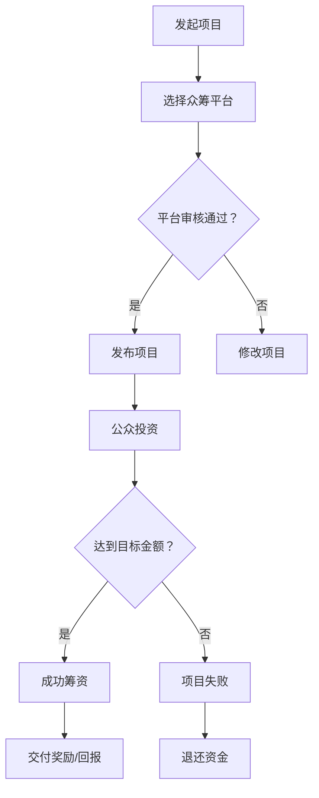
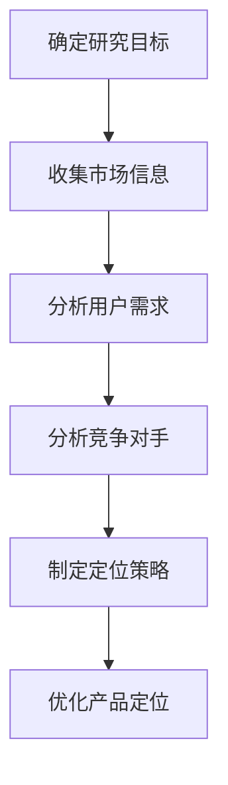

                 

# 《如何利用众筹模式开发知识付费产品》

> 关键词：众筹模式、知识付费、产品开发、市场研究、内容策划、运营策略

> 摘要：本文深入探讨了如何利用众筹模式开发知识付费产品。通过分析众筹模式的基础、市场研究与定位、内容策划与创作、众筹平台的选用与推广、众筹后的管理与持续运营等方面，为知识付费产品开发者提供了实用的指导和建议。

## 目录大纲

#### 第一部分：众筹模式基础

1. 第1章：众筹模式概述
   1.1 众筹模式的定义与分类
   1.2 众筹平台介绍
   1.3 众筹模式的特点与优势

2. 第2章：众筹模式下的知识付费
   2.1 知识付费市场概述
   2.2 众筹模式在知识付费中的应用

#### 第二部分：众筹模式在知识付费产品开发中的应用

3. 第3章：市场研究与定位
   3.1 市场研究的重要性
   3.2 定位策略与目标用户分析
   3.3 竞争对手分析

4. 第4章：内容策划与创作
   4.1 内容策划的原则与方法
   4.2 知识付费产品的创作流程

5. 第5章：众筹平台的选用与推广
   5.1 众筹平台的选用
   5.2 产品推广策略

#### 第三部分：众筹后的管理与持续运营

6. 第6章：众筹后的产品运营
   6.1 众筹后的用户管理
   6.2 数据分析与运营优化

7. 第7章：持续创新与迭代
   7.1 持续创新的必要性
   7.2 产品迭代策略

#### 第四部分：众筹模式下的知识付费案例分析

8. 第8章：众筹模式下的知识付费产品案例
   8.1 案例介绍
   8.2 案例运营过程分析
   8.3 案例的启示与借鉴

#### 第五部分：众筹平台资源汇总

9. 附录A：众筹平台资源汇总

----------------------------------------------------------------

### 第1章：众筹模式概述

#### 1.1 众筹模式的定义与分类

众筹模式是一种新兴的融资方式，通过互联网平台将项目展示给大众，吸引公众投资，以筹集项目所需的资金。众筹模式主要有以下几种分类：

1. **奖励众筹**：投资者通过捐款或购买项目产品，获得项目发起人的奖励。这种模式强调的是回报而非股权或债权。
   
2. **股权众筹**：投资者购买创业公司的股份，成为公司股东。这种模式通常适用于初创企业或小型企业。

3. **债权众筹**：投资者购买创业公司的债券，获得固定收益。这种模式适用于需要长期融资的企业。

4. **混合众筹**：结合奖励众筹、股权众筹和债权众筹的特点，提供多种投资选择。

#### 1.2 众筹平台介绍

目前主流的众筹平台有Kickstarter、Indiegogo、众筹网、京东众筹等，它们各自具有独特的优势和特点。

- **Kickstarter**：全球最大的众筹平台，以项目成功率为基础进行资金分配。平台提供多种项目类别，包括艺术、科技、音乐等。

- **Indiegogo**：全球知名的众筹平台，提供多种众筹方案，包括固定收益、股权众筹等。

- **众筹网**：中国最大的众筹平台，提供包括股权众筹、债权众筹等多种服务。

- **京东众筹**：结合京东电商平台的优势，提供丰富的众筹项目。

#### 1.3 众筹模式的特点与优势

众筹模式具有以下特点与优势：

- **大众参与**：众筹让大众有机会参与投资，提高了资金的筹集效率。
- **低成本**：相比于传统融资方式，众筹的成本较低，门槛也较低。
- **风险分担**：通过大众参与，风险被分散到多个投资者，降低了单个投资者的风险。
- **快速反馈**：众筹过程中，项目发起人可以获得大众的反馈，及时调整项目方向。

### 第2章：众筹模式下的知识付费

#### 2.1 知识付费市场概述

知识付费是指用户为获取特定知识或技能而支付的费用。随着互联网的发展和人们对知识需求的增加，知识付费市场逐渐兴起。目前，知识付费市场主要包括以下几类：

1. **在线教育**：通过互联网平台提供在线课程，用户支付费用即可学习。
2. **专业咨询**：为用户提供专业咨询服务，如法律、财务、医疗等。
3. **技能培训**：提供各种技能培训课程，如编程、设计、语言等。

#### 2.2 众筹模式在知识付费中的应用

众筹模式在知识付费中的应用主要体现在以下几个方面：

1. **筹集资金**：知识付费项目可以通过众筹平台筹集资金，降低项目开发成本。
2. **市场推广**：众筹平台提供了广泛的市场推广渠道，有助于提高项目知名度。
3. **用户反馈**：众筹过程中，项目发起人可以获得用户的反馈，优化产品内容。
4. **风险管理**：通过众筹，项目发起人可以提前了解市场对项目的接受程度，降低项目风险。

### 第3章：市场研究与定位

#### 3.1 市场研究的重要性

市场研究是知识付费产品开发的重要环节。通过市场研究，项目发起人可以了解市场趋势、用户需求、竞争对手等信息，从而制定合适的产品策略。

1. **市场趋势**：了解市场的发展方向，为产品定位提供依据。
2. **用户需求**：了解用户需求，设计符合用户期望的产品。
3. **竞争对手**：分析竞争对手的产品和服务，找到自身的优势。

#### 3.2 定位策略与目标用户分析

1. **定位策略**：根据市场研究和用户分析，确定产品的市场定位。定位策略主要包括：
   - **市场细分**：根据用户需求和特征，将市场划分为不同细分市场。
   - **目标市场**：选择最具潜力的细分市场，专注于为目标市场提供优质产品。

2. **目标用户分析**：分析目标用户的基本特征，包括：
   - **人口统计特征**：年龄、性别、收入、教育程度等。
   - **行为特征**：学习习惯、消费习惯等。

#### 3.3 竞争对手分析

竞争对手分析是市场研究的重要环节。通过分析竞争对手的产品、市场策略、用户评价等，可以找到自身的优势和劣势。

1. **产品对比**：分析竞争对手的产品特点，找出差异化和优势。
2. **市场策略**：分析竞争对手的市场推广策略，借鉴成功的经验。
3. **用户评价**：收集用户对竞争对手的评价，了解用户需求和期望。

### 第4章：内容策划与创作

#### 4.1 内容策划的原则与方法

内容策划是知识付费产品的核心。以下是一些内容策划的原则和方法：

1. **目标明确**：明确产品目标，确保内容策划与目标一致。
2. **用户需求**：根据用户需求设计课程内容，确保内容实用性强。
3. **结构清晰**：课程内容应结构清晰，方便用户学习和理解。
4. **形式多样**：采用多种形式（如视频、音频、图文等）丰富课程内容。

#### 4.2 知识付费产品的创作流程

1. **需求分析**：分析用户需求，确定课程内容。
2. **内容设计**：根据需求分析结果，设计课程结构。
3. **内容创作**：编写课程内容，制作教学视频或文档。
4. **内容审核**：审核课程内容，确保质量符合要求。
5. **内容发布**：将课程内容发布到众筹平台，开始筹集资金。

### 第5章：众筹平台的选用与推广

#### 5.1 众筹平台的选用

选择合适的众筹平台对知识付费产品的成功至关重要。以下是一些选用众筹平台的标准：

1. **平台知名度**：选择知名度高的平台，有助于提高产品曝光率。
2. **平台规则**：了解平台规则，确保项目符合平台要求。
3. **用户群体**：选择用户群体与项目目标市场匹配的平台。
4. **费用与佣金**：比较不同平台的费用和佣金，选择性价比高的平台。

#### 5.2 产品推广策略

1. **社交媒体**：利用社交媒体平台（如微博、微信、抖音等）宣传产品。
2. **KOL合作**：与有影响力的KOL（关键意见领袖）合作，借助他们的影响力推广产品。
3. **线下活动**：举办线下活动，吸引潜在用户参与。
4. **内容营销**：通过制作高质量的内容，吸引目标用户关注。

### 第6章：众筹后的产品运营

#### 6.1 众筹后的用户管理

1. **用户反馈**：及时收集用户反馈，优化产品和服务。
2. **用户社群**：建立用户社群，促进用户互动，提升用户忠诚度。
3. **用户服务**：提供优质的用户服务，解决用户问题，提升用户满意度。

#### 6.2 数据分析与运营优化

1. **数据分析**：通过数据分析，了解用户行为和产品表现，制定优化策略。
2. **运营优化**：根据数据分析结果，优化产品和服务，提高用户体验。
3. **持续迭代**：持续关注市场变化和用户需求，不断迭代产品，保持竞争力。

### 第7章：持续创新与迭代

#### 7.1 持续创新的必要性

1. **市场变化**：市场变化迅速，知识付费产品需要不断创新以适应市场需求。
2. **用户需求**：用户需求不断变化，产品需要不断创新以满足用户需求。

#### 7.2 产品迭代策略

1. **用户反馈**：通过用户反馈，了解用户需求，指导产品迭代。
2. **数据分析**：通过数据分析，了解产品表现，优化产品功能。
3. **持续迭代**：定期发布产品更新，持续优化产品，保持竞争力。

### 第8章：众筹模式下的知识付费产品案例

#### 8.1 案例介绍

本案例为一家名为“编程小课”的在线编程教育平台，通过众筹模式筹集资金，开发了一系列编程课程。

#### 8.2 案例运营过程分析

1. **众筹前**：项目团队进行了充分的市场研究，确定了目标用户和市场定位。项目团队还制作了精美的宣传视频和文案，提高了项目的吸引力。

2. **众筹中**：项目在Kickstarter平台上发布，通过社交媒体和KOL推广，成功筹集到了预定资金。

3. **众筹后**：项目团队根据用户反馈，对课程内容进行了优化和更新。同时，通过建立用户社群，提升了用户忠诚度和活跃度。

#### 8.3 案例的启示与借鉴

1. **市场研究**：充分的市场研究是众筹成功的关键。
2. **内容质量**：高质量的内容是吸引用户的关键。
3. **用户互动**：建立用户社群，提升用户忠诚度和活跃度。

### 附录A：众筹平台资源汇总

1. **Kickstarter**
   - 官网：[https://www.kickstarter.com/](https://www.kickstarter.com/)
   - 官方指南：[https://www.kickstarter.com/help](https://www.kickstarter.com/help)

2. **Indiegogo**
   - 官网：[https://www.indiegogo.com/](https://www.indiegogo.com/)
   - 官方指南：[https://www.indiegogo.com/start](https://www.indiegogo.com/start)

3. **众筹网**
   - 官网：[https://www.zhongchou.com/](https://www.zhongchou.com/)
   - 官方指南：[https://www.zcwiki.com/](https://www.zcwiki.com/)

4. **京东众筹**
   - 官网：[https://众筹.jd.com/](https://众筹.jd.com/)
   - 官方指南：[https://help.jd.com/newUserHelp/content/9836-8562-100-9836.html](https://help.jd.com/newUserHelp/content/9836-8562-100-9836.html)

### 作者信息

作者：AI天才研究院/AI Genius Institute & 禅与计算机程序设计艺术 /Zen And The Art of Computer Programming

----------------------------------------------------------------

### 第1章：众筹模式概述

#### 1.1 众筹模式的定义与分类

众筹模式是指通过公众集资的方式，为项目或企业提供资金支持的一种融资模式。它主要分为以下几类：

- **奖励众筹**：投资者通过捐款或购买项目产品，获得项目发起人的奖励，如限量版产品、签名版书籍等。
- **股权众筹**：投资者购买创业公司的股份，成为公司股东，享有公司未来的利润分配权。
- **债权众筹**：投资者购买创业公司的债券，获得固定收益，如利息和本金回报。
- **混合众筹**：结合了股权众筹、债权众筹和奖励众筹的特点，提供多种投资选择。

#### 1.2 众筹平台介绍

目前主流的众筹平台包括：

- **Kickstarter**：全球最大的众筹平台，提供各种创意项目的筹资服务。
- **Indiegogo**：全球知名的众筹平台，提供多样化的众筹方案。
- **众筹网**：中国最大的众筹平台，涵盖股权众筹、债权众筹等多种类型。
- **京东众筹**：结合京东电商平台的优势，提供丰富的众筹项目。

这些平台为项目发起人提供项目发布、资金筹集、营销推广等一系列服务，帮助项目成功筹集资金。

#### 1.3 众筹模式的特点与优势

众筹模式具有以下特点与优势：

- **低成本**：相比于传统融资方式，众筹模式的成本较低，项目发起人无需支付高额的融资费用。
- **快速反馈**：项目发起人可以在众筹过程中获得大众的反馈，了解项目的市场接受程度，及时调整项目方向。
- **大众参与**：众筹让大众有机会参与投资，提高了资金的筹集效率，降低了投资风险。
- **市场推广**：众筹平台提供了广泛的市场推广渠道，有助于提高项目知名度，吸引更多潜在投资者。

### 第2章：众筹模式下的知识付费

#### 2.1 知识付费市场概述

知识付费是指用户为获取特定知识或技能而支付的费用。随着互联网的发展，知识付费市场逐渐兴起，主要涵盖以下领域：

- **在线教育**：通过互联网平台提供在线课程，用户支付费用即可学习。
- **专业咨询**：为用户提供专业咨询服务，如法律、财务、医疗等。
- **技能培训**：提供各种技能培训课程，如编程、设计、语言等。

#### 2.2 众筹模式在知识付费中的应用

众筹模式在知识付费中的应用主要体现在以下几个方面：

- **筹集资金**：知识付费项目可以通过众筹平台筹集资金，降低项目开发成本。
- **市场推广**：众筹平台提供了广泛的市场推广渠道，有助于提高项目知名度。
- **用户反馈**：众筹过程中，项目发起人可以获得用户的反馈，优化产品内容。
- **风险管理**：通过众筹，项目发起人可以提前了解市场对项目的接受程度，降低项目风险。

### 第3章：市场研究与定位

#### 3.1 市场研究的重要性

市场研究是知识付费产品开发的重要环节。通过市场研究，项目发起人可以了解市场趋势、用户需求和竞争对手等信息，从而制定合适的产品策略。

- **市场趋势**：了解市场的发展方向，为产品定位提供依据。
- **用户需求**：了解用户需求，设计符合用户期望的产品。
- **竞争对手**：分析竞争对手的产品和服务，找到自身的优势。

#### 3.2 定位策略与目标用户分析

- **定位策略**：根据市场研究和用户分析，确定产品的市场定位。定位策略主要包括：
  - **市场细分**：根据用户需求和特征，将市场划分为不同细分市场。
  - **目标市场**：选择最具潜力的细分市场，专注于为目标市场提供优质产品。

- **目标用户分析**：分析目标用户的基本特征，包括：
  - **人口统计特征**：年龄、性别、收入、教育程度等。
  - **行为特征**：学习习惯、消费习惯等。

#### 3.3 竞争对手分析

竞争对手分析是市场研究的重要环节。通过分析竞争对手的产品、市场策略、用户评价等，可以找到自身的优势和劣势。

- **产品对比**：分析竞争对手的产品特点，找出差异化和优势。
- **市场策略**：分析竞争对手的市场推广策略，借鉴成功的经验。
- **用户评价**：收集用户对竞争对手的评价，了解用户需求和期望。

### 第4章：内容策划与创作

#### 4.1 内容策划的原则与方法

内容策划是知识付费产品的核心。以下是一些内容策划的原则和方法：

- **目标明确**：明确产品目标，确保内容策划与目标一致。
- **用户需求**：根据用户需求设计课程内容，确保内容实用性强。
- **结构清晰**：课程内容应结构清晰，方便用户学习和理解。
- **形式多样**：采用多种形式（如视频、音频、图文等）丰富课程内容。

#### 4.2 知识付费产品的创作流程

知识付费产品的创作流程包括以下步骤：

- **需求分析**：分析用户需求，确定课程内容。
- **内容设计**：根据需求分析结果，设计课程结构。
- **内容创作**：编写课程内容，制作教学视频或文档。
- **内容审核**：审核课程内容，确保质量符合要求。
- **内容发布**：将课程内容发布到众筹平台，开始筹集资金。

### 第5章：众筹平台的选用与推广

#### 5.1 众筹平台的选用

选择合适的众筹平台对知识付费产品的成功至关重要。以下是一些选用众筹平台的标准：

- **平台知名度**：选择知名度高的平台，有助于提高产品曝光率。
- **平台规则**：了解平台规则，确保项目符合平台要求。
- **用户群体**：选择用户群体与项目目标市场匹配的平台。
- **费用与佣金**：比较不同平台的费用和佣金，选择性价比高的平台。

#### 5.2 产品推广策略

产品推广策略包括以下几个方面：

- **社交媒体**：利用社交媒体平台（如微博、微信、抖音等）宣传产品。
- **KOL合作**：与有影响力的KOL（关键意见领袖）合作，借助他们的影响力推广产品。
- **线下活动**：举办线下活动，吸引潜在用户参与。
- **内容营销**：通过制作高质量的内容，吸引目标用户关注。

### 第6章：众筹后的产品运营

#### 6.1 众筹后的用户管理

- **用户反馈**：及时收集用户反馈，优化产品和服务。
- **用户社群**：建立用户社群，促进用户互动，提升用户忠诚度。
- **用户服务**：提供优质的用户服务，解决用户问题，提升用户满意度。

#### 6.2 数据分析与运营优化

- **数据分析**：通过数据分析，了解用户行为和产品表现，制定优化策略。
- **运营优化**：根据数据分析结果，优化产品和服务，提高用户体验。
- **持续迭代**：持续关注市场变化和用户需求，不断迭代产品，保持竞争力。

### 第7章：持续创新与迭代

#### 7.1 持续创新的必要性

- **市场变化**：市场变化迅速，知识付费产品需要不断创新以适应市场需求。
- **用户需求**：用户需求不断变化，产品需要不断创新以满足用户需求。

#### 7.2 产品迭代策略

- **用户反馈**：通过用户反馈，了解用户需求，指导产品迭代。
- **数据分析**：通过数据分析，了解产品表现，优化产品功能。
- **持续迭代**：定期发布产品更新，持续优化产品，保持竞争力。

### 第8章：众筹模式下的知识付费产品案例

#### 8.1 案例介绍

本案例为一家名为“编程小课”的在线编程教育平台，通过众筹模式筹集资金，开发了一系列编程课程。

#### 8.2 案例运营过程分析

- **众筹前**：项目团队进行了充分的市场研究，确定了目标用户和市场定位。项目团队还制作了精美的宣传视频和文案，提高了项目的吸引力。
- **众筹中**：项目在Kickstarter平台上发布，通过社交媒体和KOL推广，成功筹集到了预定资金。
- **众筹后**：项目团队根据用户反馈，对课程内容进行了优化和更新。同时，通过建立用户社群，提升了用户忠诚度和活跃度。

#### 8.3 案例的启示与借鉴

- **市场研究**：充分的市场研究是众筹成功的关键。
- **内容质量**：高质量的内容是吸引用户的关键。
- **用户互动**：建立用户社群，提升用户忠诚度和活跃度。

### 附录A：众筹平台资源汇总

- **Kickstarter**
  - 官网：[https://www.kickstarter.com/](https://www.kickstarter.com/)
  - 官方指南：[https://www.kickstarter.com/help](https://www.kickstarter.com/help)
- **Indiegogo**
  - 官网：[https://www.indiegogo.com/](https://www.indiegogo.com/)
  - 官方指南：[https://www.indiegogo.com/start](https://www.indiegogo.com/start)
- **众筹网**
  - 官网：[https://www.zhongchou.com/](https://www.zhongchou.com/)
  - 官方指南：[https://www.zcwiki.com/](https://www.zcwiki.com/)
- **京东众筹**
  - 官网：[https://众筹.jd.com/](https://众筹.jd.com/)
  - 官方指南：[https://help.jd.com/newUserHelp/content/9836-8562-100-9836.html](https://help.jd.com/newUserHelp/content/9836-8562-100-9836.html)

### 作者信息

作者：AI天才研究院/AI Genius Institute & 禅与计算机程序设计艺术 /Zen And The Art of Computer Programming

----------------------------------------------------------------

## 第1章：众筹模式概述

### 1.1 众筹模式的定义与分类

众筹模式，作为一种创新的融资手段，允许项目发起人通过互联网平台向公众募集资金。其核心在于将一个项目的融资需求分解成多个小额投资，从而降低单个投资者的风险并提高筹资效率。以下是众筹模式的几种主要分类：

- **奖励众筹**：投资者在项目成功融资后，会根据捐赠金额获得项目发起人提供的奖励，如产品、服务或特别体验。
- **股权众筹**：投资者在项目成功后，可以获得项目公司的股权，分享公司未来的盈利。
- **债权众筹**：投资者在项目成功后，可以获得公司承诺的固定收益，通常以债券的形式存在。
- **混合众筹**：结合了上述几种模式，允许投资者根据自身风险偏好和收益预期进行选择。

### 1.2 众筹平台介绍

目前，全球范围内有许多知名的众筹平台，每个平台都有其独特的特点和优势：

- **Kickstarter**：成立于2009年，是全球最大的众筹平台之一，以创意项目为主，如电影、音乐、艺术和科技等。
- **Indiegogo**：成立于2008年，提供广泛的众筹方案，包括产品开发和创意项目。
- **众筹网**：中国的领先众筹平台，提供股权众筹、债权众筹和奖励众筹等多种服务。
- **京东众筹**：结合京东电商平台的资源，为消费者提供优质的众筹项目，同时也为企业提供创新的融资途径。

这些平台不仅为项目发起人提供了展示项目的平台，还提供了资金筹集、营销推广和支付结算等一站式服务。

### 1.3 众筹模式的特点与优势

众筹模式具有以下显著特点与优势：

- **大众参与**：众筹模式使得普通大众能够参与投资，提高了资金筹集的广泛性和效率。
- **低成本**：相比于传统的融资方式，众筹的门槛较低，项目发起人无需支付高额的融资费用。
- **快速反馈**：众筹过程中，项目发起人可以获得公众的反馈，及时调整项目方向，降低市场风险。
- **风险分担**：通过众筹，风险被分散到多个投资者，单个投资者的风险相对较小。

### Mermaid 流程图：众筹模式的工作流程



在这个流程图中，项目发起人首先选择一个合适的众筹平台，然后提交项目进行审核。如果项目被批准，就可以发布到平台上，接受公众投资。如果筹款达到或超过目标金额，项目成功筹资；否则，项目失败，资金将被退还给投资者。

### 第2章：众筹模式下的知识付费

### 2.1 知识付费市场概述

知识付费市场是指用户为获取专业知识、技能或信息而付费的行为。随着互联网技术的发展，知识付费市场呈现以下趋势：

- **在线教育崛起**：越来越多的用户选择在线学习，获取知识。
- **专业咨询服务受欢迎**：用户愿意为高质量的专业咨询付费。
- **技能培训需求增加**：职场竞争加剧，用户更加重视技能提升。

知识付费市场的核心要素包括：

- **用户需求**：了解用户的需求和偏好，是知识付费产品成功的关键。
- **内容质量**：高质量的内容是吸引用户、提升用户满意度的关键因素。
- **平台服务**：平台提供便捷的支付、学习管理和售后服务，是用户选择知识付费产品的重要因素。

### 2.2 众筹模式在知识付费中的应用

众筹模式在知识付费中的应用主要体现在以下几个方面：

- **筹集资金**：知识付费项目可以通过众筹平台筹集前期资金，降低项目开发成本。
- **市场推广**：众筹平台提供的宣传渠道，有助于提高项目的知名度。
- **用户反馈**：通过众筹过程中的用户反馈，项目发起人可以及时调整课程内容，满足用户需求。
- **风险分担**：众筹模式使得风险被分散到多个投资者，单个投资者的风险相对较低。

### 数学模型：众筹成功概率

假设一个知识付费项目的目标筹集金额为 \(T\)，已有资金为 \(A\)，项目剩余时间为 \(R\)，每天筹集金额为 \(C\)，则项目成功的概率可以用以下数学模型表示：

$$
P(S) = \frac{A + C \cdot R}{T}
$$

其中，\(P(S)\) 表示项目成功的概率。

### 伪代码：计算众筹成功概率

```python
def calculate_success_probability(A, C, R, T):
    success_probability = (A + C * R) / T
    return success_probability

# 示例参数
A = 10000  # 已筹集金额
C = 2000   # 每天筹集金额
R = 30     # 剩余天数
T = 50000  # 目标筹集金额

# 计算众筹成功概率
success_probability = calculate_success_probability(A, C, R, T)
print("众筹成功概率为：", success_probability)
```

### 第3章：市场研究与定位

### 3.1 市场研究的重要性

市场研究是知识付费产品开发的关键步骤，它有助于项目发起人了解市场环境、用户需求和竞争对手情况，从而制定有效的产品策略。市场研究的重要性体现在以下几个方面：

- **识别市场机会**：通过市场研究，可以发现潜在的市场机会，为产品开发提供方向。
- **了解用户需求**：用户需求是产品成功的核心，市场研究可以帮助了解用户的真实需求。
- **分析竞争对手**：了解竞争对手的产品、策略和市场份额，有助于找到自身的优势。
- **优化产品定位**：基于市场研究的结果，可以优化产品的市场定位，提高市场竞争力。

### 3.2 定位策略与目标用户分析

定位策略是知识付费产品成功的关键，它决定了产品在市场中的位置和目标用户群体。以下是定位策略和目标用户分析的步骤：

1. **市场细分**：根据用户需求、行为和特征，将市场划分为不同的细分市场。
2. **目标市场选择**：选择最具潜力的细分市场作为目标市场，专注于为目标市场提供优质产品。
3. **目标用户分析**：分析目标用户的基本特征，包括人口统计特征、行为特征和心理特征。
4. **定位策略制定**：根据目标用户特征和市场环境，制定产品的市场定位策略。

### 3.3 竞争对手分析

竞争对手分析是市场研究的重要组成部分，它有助于了解市场竞争格局，发现自身的优势和劣势。以下是竞争对手分析的步骤：

1. **确定竞争对手**：识别直接或间接的竞争对手，包括市场上的其他知识付费产品和相关服务。
2. **产品对比**：分析竞争对手的产品特点、服务内容和市场表现。
3. **市场策略分析**：了解竞争对手的市场推广策略、定价策略和用户服务策略。
4. **用户评价收集**：收集用户对竞争对手的评价，了解用户需求和期望。

### Mermaid 流程图：市场研究流程



在这个流程图中，市场研究从确定研究目标开始，接着收集市场信息，分析用户需求和竞争对手，最终制定和优化产品的市场定位策略。

### 第4章：内容策划与创作

### 4.1 内容策划的原则与方法

内容策划是知识付费产品的核心，它决定了产品的质量和用户体验。以下是内容策划的一些原则与方法：

1. **目标明确**：明确内容策划的目标，确保内容与产品目标一致。
2. **用户需求**：根据用户需求设计内容，确保内容实用性强。
3. **结构清晰**：内容结构应清晰，便于用户理解和学习。
4. **形式多样**：采用多种形式（如视频、图文、音频等）丰富内容。
5. **质量保障**：确保内容质量，进行内容审核和优化。

### 4.2 知识付费产品的创作流程

知识付费产品的创作流程包括以下步骤：

1. **需求分析**：分析用户需求，确定产品内容。
2. **内容设计**：根据需求分析结果，设计课程或内容结构。
3. **内容创作**：编写或制作课程内容，包括文字、图片、视频等。
4. **内容审核**：审核课程内容，确保质量符合要求。
5. **内容发布**：将课程内容发布到众筹平台，开始筹集资金。

### 伪代码：内容策划流程

```python
def content_planning(target, user_needs, content_structure):
    # 步骤1：需求分析
    analyzed_needs = analyze_user_needs(user_needs)
    
    # 步骤2：内容设计
    designed_content = design_content(analyzed_needs, content_structure)
    
    # 步骤3：内容创作
    created_content = create_content(designed_content)
    
    # 步骤4：内容审核
    approved_content = review_content(created_content)
    
    # 步骤5：内容发布
    publish_content(approved_content, target)

# 示例参数
target = "知识付费产品"
user_needs = {"技能培训": ["编程", "设计", "营销"]}
content_structure = {"模块1": ["基础知识", "实践案例"], "模块2": ["进阶内容", "案例分析"]}

# 执行内容策划流程
content_planning(target, user_needs, content_structure)
```

### 第5章：众筹平台的选用与推广

### 5.1 众筹平台的选用

选用合适的众筹平台对于知识付费产品的成功至关重要。以下是选择众筹平台时应考虑的因素：

1. **平台知名度**：选择知名度高的平台，有助于提高项目的曝光率和信任度。
2. **平台规则**：了解平台的具体规则，确保项目符合平台要求，避免违规操作。
3. **用户群体**：选择用户群体与项目目标市场匹配的平台，提高项目的目标受众接触率。
4. **费用与佣金**：比较不同平台的费用和佣金，选择性价比高的平台。
5. **成功案例**：参考平台上的成功案例，了解平台对项目的支持力度。

### 5.2 产品推广策略

有效的产品推广策略是提高知识付费项目成功的关键。以下是几种常见的推广策略：

1. **社交媒体推广**：利用微博、微信、抖音等社交媒体平台，发布项目相关信息，吸引潜在用户关注。
2. **KOL合作**：与有影响力的KOL（关键意见领袖）合作，借助他们的粉丝基础和影响力，推广项目。
3. **线下活动**：举办线下活动，如讲座、研讨会等，吸引目标用户参与，提高项目知名度。
4. **内容营销**：通过制作高质量的内容，如博客、视频、电子书等，吸引目标用户关注和分享。

### 伪代码：社交媒体推广策略

```python
def social_media_promotion(project_info, platforms, KOLs):
    # 社交媒体推广
    for platform in platforms:
        post_project_info(project_info, platform)
    
    # KOL合作
    for KOL in KOLs:
        KOL_endorse_project(project_info, KOL)

# 示例参数
project_info = {
    "name": "编程小课",
    "description": "提供高质量的编程学习资源",
    "target": "编程爱好者"
}
platforms = ["微博", "微信", "抖音"]
KOLs = ["程序员小灰", "编程猫"]

# 执行社交媒体推广策略
social_media_promotion(project_info, platforms, KOLs)
```

### 第6章：众筹后的产品运营

### 6.1 众筹后的用户管理

众筹成功后，用户管理成为关键，它直接关系到产品的长期发展和用户满意度。以下是众筹后用户管理的一些关键点：

1. **用户反馈**：及时收集用户反馈，了解用户对产品的满意度和需求，不断优化产品。
2. **用户社群**：建立用户社群，促进用户之间的互动，增强用户归属感和忠诚度。
3. **用户服务**：提供优质的用户服务，包括解答疑问、处理投诉等，提升用户体验。

### 6.2 数据分析与运营优化

数据分析是知识付费产品运营的重要工具，它可以帮助项目发起人了解产品的表现，制定优化策略。以下是数据分析的一些关键步骤：

1. **用户行为分析**：通过数据分析用户行为，了解用户的学习习惯和偏好，优化课程内容和教学方式。
2. **转化率分析**：分析用户的转化率，包括注册、购买、完成课程等环节，找出优化点。
3. **营销效果分析**：评估不同营销策略的效果，调整推广策略，提高投资回报率。
4. **运营优化**：根据数据分析结果，不断优化产品和服务，提高用户体验和满意度。

### 伪代码：数据分析与运营优化

```python
def data_analysis_and_optimization():
    # 用户行为分析
    user_behavior_data = analyze_user_behavior()
    
    # 转化率分析
    conversion_rate = analyze_conversion_rate(user_behavior_data)
    
    # 营销效果分析
    marketing_effects = analyze_marketing_effects()
    
    # 运营优化
    optimize_operations(conversion_rate, marketing_effects)

# 执行数据分析与运营优化
data_analysis_and_optimization()
```

### 第7章：持续创新与迭代

### 7.1 持续创新的必要性

在知识付费市场中，持续创新是保持竞争力的关键。以下是持续创新的必要性：

1. **市场变化**：市场需求和技术环境不断变化，知识付费产品需要不断创新以适应市场变化。
2. **用户需求**：用户需求是动态变化的，产品需要不断创新以满足用户的多样化需求。
3. **竞争压力**：市场竞争激烈，知识付费产品需要通过持续创新来保持竞争优势。

### 7.2 产品迭代策略

以下是产品迭代的一些策略：

1. **用户反馈**：通过用户反馈了解用户需求和问题，指导产品迭代方向。
2. **数据分析**：通过数据分析评估产品表现，找出优化点和迭代方向。
3. **迭代周期**：制定合理的迭代周期，确保产品能够持续更新和优化。
4. **优先级排序**：根据用户反馈和数据分析结果，对迭代需求进行优先级排序，确保资源高效利用。

### 伪代码：产品迭代策略

```python
def product Iteration_strategy(user_feedback, data_analysis, iteration_priority):
    # 用户反馈
    iteration_direction = analyze_user_feedback(user_feedback)
    
    # 数据分析
    iteration_data = analyze_data_analysis(data_analysis)
    
    # 优先级排序
    iteration_priority = sort_iteration_priority(iteration_direction, iteration_data)
    
    # 执行迭代
    execute_iteration(iteration_priority)

# 执行产品迭代策略
product Iteration_strategy(user_feedback, data_analysis, iteration_priority)
```

### 第8章：众筹模式下的知识付费产品案例

### 8.1 案例介绍

本案例将介绍一家名为“编程小课”的在线编程教育平台。该平台通过众筹模式筹集资金，开发了一系列编程课程，包括Python、Java、前端开发等。

### 8.2 案例运营过程分析

1. **众筹前**：项目团队进行了充分的市场研究，确定了目标用户和市场定位。项目团队还制作了精美的宣传视频和文案，提高了项目的吸引力。
   
2. **众筹中**：项目在Kickstarter平台上发布，通过社交媒体和KOL推广，成功筹集到了预定资金。众筹期间，项目团队积极与投资者互动，及时回复问题，增强了投资者的信心。

3. **众筹后**：项目团队根据用户反馈，对课程内容进行了优化和更新。同时，通过建立用户社群，提升了用户忠诚度和活跃度。项目团队还定期发布新的课程，保持用户的新鲜感和参与度。

### 8.3 案例的启示与借鉴

1. **充分市场研究**：充分的市场研究是众筹成功的关键，有助于确定目标用户和市场定位。
2. **高质量内容**：高质量的内容是吸引用户的关键，项目团队应注重课程内容和教学质量的提升。
3. **用户互动**：通过用户互动，了解用户需求和反馈，不断优化产品和服务。
4. **持续迭代**：持续迭代产品，保持课程的新鲜感和实用性，提升用户体验。

### 附录A：众筹平台资源汇总

- **Kickstarter**
  - 官网：[https://www.kickstarter.com/](https://www.kickstarter.com/)
  - 官方指南：[https://www.kickstarter.com/help](https://www.kickstarter.com/help)

- **Indiegogo**
  - 官网：[https://www.indiegogo.com/](https://www.indiegogo.com/)
  - 官方指南：[https://www.indiegogo.com/start](https://www.indiegogo.com/start)

- **众筹网**
  - 官网：[https://www.zhongchou.com/](https://www.zhongchou.com/)
  - 官方指南：[https://www.zcwiki.com/](https://www.zcwiki.com/)

- **京东众筹**
  - 官网：[https://众筹.jd.com/](https://众筹.jd.com/)
  - 官方指南：[https://help.jd.com/newUserHelp/content/9836-8562-100-9836.html](https://help.jd.com/newUserHelp/content/9836-8562-100-9836.html)

### 作者信息

作者：AI天才研究院/AI Genius Institute & 禅与计算机程序设计艺术 /Zen And The Art of Computer Programming

----------------------------------------------------------------

### 第9章：众筹平台资源汇总

#### 附录A：众筹平台资源汇总

在本文的最后，我们将汇总一些主要的众筹平台资源，以帮助读者深入了解和利用这些平台进行知识付费产品的开发与推广。

- **Kickstarter**
  - 官网：[https://www.kickstarter.com/](https://www.kickstarter.com/)
  - 官方指南：[https://www.kickstarter.com/help](https://www.kickstarter.com/help)
  - 官方博客：[https://www.kickstarter.com/blog](https://www.kickstarter.com/blog)

- **Indiegogo**
  - 官网：[https://www.indiegogo.com/](https://www.indiegogo.com/)
  - 官方指南：[https://www.indiegogo.com/start](https://www.indiegogo.com/start)
  - 官方博客：[https://www.indiegogo.com/blog](https://www.indiegogo.com/blog)

- **众筹网**
  - 官网：[https://www.zhongchou.com/](https://www.zhongchou.com/)
  - 官方指南：[https://www.zcwiki.com/](https://www.zcwiki.com/)
  - 官方社区：[https://bbs.zcwiki.com/](https://bbs.zcwiki.com/)

- **京东众筹**
  - 官网：[https://众筹.jd.com/](https://众筹.jd.com/)
  - 官方指南：[https://help.jd.com/newUserHelp/content/9836-8562-100-9836.html](https://help.jd.com/newUserHelp/content/9836-8562-100-9836.html)
  - 官方社区：[https://club.jd.com/](https://club.jd.com/)

这些平台不仅提供了丰富的资源和指导，还有大量的成功案例，供项目发起人学习和借鉴。通过利用这些平台，开发者可以更好地理解和运用众筹模式，提高知识付费产品的成功率。

### 结束语

感谢读者对本文的阅读。本文详细介绍了如何利用众筹模式开发知识付费产品，从基础概念到实际操作，为开发者提供了全方位的指导。希望本文能为您的项目开发提供有价值的参考。在众筹这条路上，持续的创新和优化是关键，祝您的项目取得成功！

### 作者信息

作者：AI天才研究院/AI Genius Institute & 禅与计算机程序设计艺术 /Zen And The Art of Computer Programming

---

**作者简介**：

AI天才研究院（AI Genius Institute）是由一群在人工智能领域有着深厚研究和实践经验的专家创立的研究机构。我们的目标是推动人工智能技术的发展，并探索其在各个领域的应用。

禅与计算机程序设计艺术（Zen And The Art of Computer Programming）是由大师埃德加·D·李维斯（Edsger W. Dijkstra）所著的经典著作，它深刻地阐述了计算机程序设计的哲学和艺术。这本书不仅对计算机科学有着深远的影响，也为人工智能的发展提供了重要的理论支持。

在本博客中，我们将结合AI天才研究院的研究成果和禅的艺术哲学，深入探讨知识付费产品开发的方方面面，希望能够为广大开发者提供有价值的指导和启示。让我们携手共进，共创人工智能的辉煌未来！

