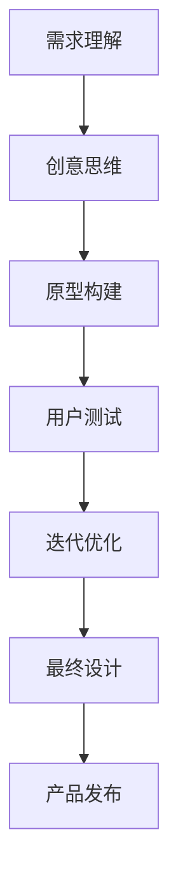
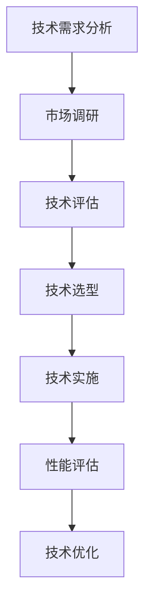

                 

# 文章标题：如何利用技术能力进行产品设计

## 关键词
产品设计，技术能力，设计思维，用户体验，原型开发，项目管理，案例分析

## 摘要
本文深入探讨了如何将技术能力融入产品设计过程，从设计思维概述、技术与设计结合的基础知识，到技术驱动的设计流程，再到技术实现与项目管理，以及实战案例与未来趋势，全面解析了技术能力在产品设计中的关键作用。通过详细的理论讲解、方法介绍和案例分析，本文旨在为读者提供一套系统的、可操作的产品设计方法论。

## 目录大纲

### 第一部分：设计思维与技术工具

#### 第1章：设计思维概述
- 1.1 设计思维的概念与历史
- 1.2 设计思维的核心原则
- 1.3 设计思维的应用场景
- 1.4 设计思维的工具与方法

#### 第2章：技术与设计结合的基础知识
- 2.1 技术在产品设计中的作用
- 2.2 技术选型的原则与方法
- 2.3 技术趋势与设计前瞻

### 第二部分：技术驱动的设计流程

#### 第3章：需求分析与市场调研
- 3.1 用户需求分析方法
- 3.2 市场调研工具与技术
- 3.3 用户画像与目标用户定位

#### 第4章：概念设计与原型开发
- 4.1 概念设计与创意思维
- 4.2 原型开发工具与技巧
- 4.3 原型评估与迭代

#### 第5章：用户体验设计与交互设计
- 5.1 用户体验设计的核心要素
- 5.2 交互设计的流程与方法
- 5.3 用户体验测试与反馈

### 第三部分：技术实现与项目管理

#### 第6章：技术实现与系统设计
- 6.1 技术实现与系统设计的挑战
- 6.2 系统设计与架构优化
- 6.3 技术债务管理

#### 第7章：项目管理与团队协作
- 7.1 项目管理方法论
- 7.2 团队协作工具与应用
- 7.3 项目风险管理与应对

### 第四部分：实战案例与案例分析

#### 第8章：技术成果评估与优化
- 8.1 技术成果评估方法
- 8.2 产品性能优化策略
- 8.3 用户反馈与持续改进

#### 第9章：技术驱动设计案例解析
- 9.1 智能语音助手设计
- 9.2 移动应用用户体验优化
- 9.3 物联网设备的交互设计

### 第五部分：设计思维与技术的未来趋势

#### 第10章：设计思维与技术的未来趋势
- 10.1 设计思维的发展趋势
- 10.2 技术在产品设计中的未来发展
- 10.3 跨界合作与创新设计

### 附录

#### 附录A：技术工具推荐
- A.1 常用设计工具
- A.2 技术开发框架
- A.3 数据分析工具

#### 附录B：参考资料与推荐阅读
- B.1 设计思维相关书籍
- B.2 技术与设计结合的学术论文
- B.3 经典设计案例研究

#### 附录C：设计思维与技术的Mermaid流程图
- C.1 设计思维流程图
- C.2 技术选型流程图

---

接下来，我们将逐步深入各个章节，通过详细的讲解和实例分析，帮助读者全面掌握如何利用技术能力进行产品设计。首先，我们从设计思维概述开始，了解设计思维的概念、核心原则和应用场景。随后，我们将探讨技术与设计结合的基础知识，包括技术选型原则、方法和技术趋势。这些基础知识的掌握将为后续的设计流程提供坚实的理论支撑。在接下来的章节中，我们将详细讲解需求分析、市场调研、概念设计、原型开发、用户体验设计、交互设计等核心环节。通过这些环节，我们将构建出一个完整的技术驱动设计流程。在技术实现与项目管理的章节中，我们将探讨技术实现与系统设计的挑战，以及如何通过项目管理与团队协作来确保项目顺利进行。最后，通过实战案例和未来趋势的讨论，我们将为读者提供一个全面、系统的产品设计方法论。让我们一起开始这段深入的学习之旅吧！## 第1章：设计思维概述

### 1.1 设计思维的概念与历史

设计思维是一种以用户为中心的迭代解决问题的方法论，它强调通过创造性思维和团队合作来寻找创新的解决方案。设计思维最早起源于20世纪50年代的工业设计，由IDEO（一家世界著名的创新设计公司）创始人David Kelley提出并推广。

设计思维的历史可以追溯到1950年代的美国工业设计，最初应用于制造和产品设计。随着计算机科学和软件工程的发展，设计思维逐渐被引入到软件和系统设计中。近年来，随着用户体验设计的重要性日益凸显，设计思维在商业、教育和社会创新等领域得到了广泛应用。

设计思维的核心在于它是一种迭代的方法论，它通过以下几个步骤来实现创新解决方案：

1. **需求理解**：通过用户访谈、问卷调查、用户行为分析等方法，深入理解用户需求和行为。
2. **创意思维**：基于需求理解，通过头脑风暴、思维导图等创造性思维工具，生成多个可能的解决方案。
3. **原型构建**：快速构建原型，可以是低保真或高保真的，以便进行用户测试和反馈。
4. **用户测试**：通过用户测试，收集用户对原型的反馈，进一步优化设计。
5. **迭代**：根据用户反馈，对原型进行迭代优化，直到找到最佳解决方案。

### 1.2 设计思维的核心原则

设计思维的核心原则包括用户导向、创造性思维、持续迭代和团队合作。

#### 用户导向

用户导向是设计思维的核心原则之一，它强调在设计过程中始终以用户为中心。通过深入了解用户的需求、行为和痛点，设计者可以创造出真正符合用户期望的产品。

#### 创造性思维

创造性思维鼓励设计者跳出传统思维模式，探索新的解决方案。设计思维提供了一系列工具和方法，如头脑风暴、思维导图等，以激发创意思维。

#### 持续迭代

设计思维强调通过不断的迭代来优化设计。每次迭代都是一次学习和改进的机会，通过不断的用户测试和反馈，设计者可以逐步完善产品。

#### 团队合作

设计思维需要跨职能团队的协作。不同背景的团队成员共同参与设计过程，可以提高设计质量，减少误解和沟通障碍。

### 1.3 设计思维的应用场景

设计思维可以广泛应用于各种领域和场景，包括但不限于：

#### 产品设计

在产品设计中，设计思维可以帮助团队更好地理解用户需求，优化产品的可用性和用户体验。

#### 服务设计

在服务设计中，设计思维可以帮助企业优化服务流程，提高用户的服务体验。

#### 创意解决

在面对复杂问题时，设计思维可以提供一个系统性的解决方案，帮助团队找到创新的解决方案。

#### 教育和社会创新

在教育和社会创新领域，设计思维可以用于解决社会问题，推动教育改革和创新。

### 1.4 设计思维的工具与方法

设计思维提供了一系列工具和方法，以支持设计过程的各个阶段。

#### 市场调研

市场调研是设计思维的重要环节，通过用户访谈、问卷调查、用户行为分析等方法，收集用户需求和市场信息。

#### 原型设计

原型设计是设计思维的核心，通过快速构建原型，进行用户测试和反馈，优化设计。

#### 团队协作

设计思维强调团队合作，通过定期的团队会议、代码审查、协作工具等，促进团队成员之间的沟通和合作。

#### 用户测试

用户测试是设计思维的重要组成部分，通过可用性测试、A/B测试等方法，评估产品的用户体验和性能。

### 1.5 设计思维的实际应用

为了更好地理解设计思维的实际应用，我们可以通过一个简单的案例来说明：

假设一个互联网公司要开发一款新的社交应用，设计思维的应用流程如下：

1. **需求理解**：通过用户访谈和市场调研，了解用户对现有社交应用的满意度和不满意度，识别出潜在的用户需求。
2. **创意思维**：组织团队进行头脑风暴，提出多个可能的解决方案，如改进用户界面、增加新功能等。
3. **原型构建**：快速构建低保真原型，进行初步的用户测试，收集用户反馈。
4. **用户测试**：根据用户反馈，对原型进行迭代优化，构建高保真原型，进行进一步的用户测试。
5. **迭代**：根据用户测试结果，不断优化设计，最终推出满足用户需求的产品。

通过这个案例，我们可以看到设计思维在产品开发过程中的关键作用。设计思维不仅帮助团队更好地理解用户需求，还通过迭代的方法不断优化设计，最终创造出用户满意的产品。

总之，设计思维是一种强大的方法论，它通过强调用户导向、创造性思维、持续迭代和团队合作，帮助团队在复杂多变的环境中找到创新的解决方案。在接下来的章节中，我们将进一步探讨技术与设计结合的基础知识，以及如何将这些理念和方法应用于实际的产品设计过程中。让我们继续深入探索！## 第2章：技术与设计结合的基础知识

### 2.1 技术在产品设计中的作用

技术在现代产品设计中的作用不可或缺，它不仅推动了设计的创新，也优化了产品的性能和用户体验。以下是技术在不同设计环节中的具体作用：

#### 创新推动

技术为设计创新提供了丰富的工具和资源。例如，人工智能和机器学习技术可以帮助设计者自动生成设计方案，优化设计流程。物联网（IoT）技术的应用使得产品可以与网络进行实时通信，提供更加智能化的服务。

#### 性能优化

技术手段可以显著提升产品的性能。通过优化算法和系统架构，设计者可以提高产品的响应速度和效率。例如，在移动应用设计中，使用高效的图像处理算法可以减少加载时间，提升用户体验。

#### 数据驱动

技术使得产品设计更加数据驱动。通过收集和分析用户数据，设计者可以更准确地了解用户行为和偏好，从而做出更明智的设计决策。例如，数据分析工具可以帮助识别用户痛点和需求，指导功能优化和迭代。

#### 跨界融合

技术的进步促进了不同领域之间的融合。例如，生物技术和设计相结合可以创造出全新的生物医学设备；艺术与科技的结合可以创造出富有创意的艺术装置。这种跨界融合为设计带来了无限的可能性。

### 2.2 技术选型的原则与方法

技术选型是产品设计过程中至关重要的一环，合理的选型可以提升产品性能，降低开发成本，同时确保项目的顺利进行。以下是技术选型的一些基本原则和方法：

#### 原则

1. **成熟度**：选择成熟稳定的技术可以降低开发风险，确保项目的顺利进行。
2. **成本效益**：在满足功能需求的前提下，选择成本效益最高的技术。
3. **团队技能**：选择团队熟悉或易于团队学习的技术，提高开发效率。
4. **可扩展性**：选择具备良好可扩展性的技术，以适应未来的需求变化。
5. **社区支持**：选择有良好社区支持的技术，可以获得更多的资源和帮助。

#### 方法

1. **市场调研**：了解市场上的技术趋势和最新进展，收集相关技术信息。
2. **技术评估**：根据项目的具体需求，对候选技术进行详细评估，包括性能、安全性、兼容性等方面。
3. **专家咨询**：咨询行业专家和技术顾问，获取专业的技术建议。
4. **试点项目**：在可能的情况下，通过试点项目来验证技术的可行性和适用性。

### 2.3 技术趋势与设计前瞻

技术不断演进，对设计产生了深远的影响。以下是一些当前技术趋势以及对未来设计的启示：

#### 人工智能与设计

人工智能（AI）技术的发展，使得设计者可以借助AI工具进行自动化设计、智能优化和个性化推荐。例如，AI算法可以分析用户数据，预测用户偏好，从而提供个性化的设计建议。

#### 物联网与设计

物联网（IoT）技术的普及，使得产品可以连接到互联网，实现智能监控和管理。设计者需要考虑如何将物联网技术与产品设计相结合，创造出更加智能和互联的产品。

#### 虚拟现实与设计

虚拟现实（VR）和增强现实（AR）技术的进步，为设计者提供了新的交互方式和体验。通过VR和AR，设计者可以模拟真实的环境，进行空间设计和用户体验测试。

#### 5G与设计

5G网络的普及，将带来更快的传输速度和更低的延迟。这为设计者提供了更多可能性，例如实时协作设计、远程用户体验测试等。

#### 区块链与设计

区块链技术为设计者提供了去中心化的数据管理和版权保护方案。设计者可以通过区块链技术确保作品的真实性和版权，同时提高数据的安全性和透明度。

#### 绿色设计与可持续发展

随着全球环境问题的加剧，绿色设计和可持续发展成为设计的重要趋势。设计者需要考虑如何在产品设计和生产过程中减少环境影响，提高资源利用效率。

综上所述，技术与设计结合的基础知识对于现代产品设计至关重要。通过理解技术的作用、掌握技术选型的原则和方法，以及关注技术趋势，设计者可以更好地利用技术能力，创造出具有创新性、性能优异、用户体验出色的产品。在接下来的章节中，我们将进一步探讨技术驱动的设计流程，帮助读者深入理解和应用这些知识。让我们继续前进！## 第3章：需求分析与市场调研

### 3.1 用户需求分析方法

用户需求分析是产品设计的关键环节，它直接影响到产品的成功与否。准确了解用户需求不仅可以帮助设计者创造出更符合用户期望的产品，还能降低开发风险和成本。以下是几种常见的用户需求分析方法：

#### 用户访谈

用户访谈是一种直接与用户交流的方法，通过面对面的对话，设计者可以深入了解用户的需求、痛点和行为习惯。以下是用户访谈的步骤：

1. **准备阶段**：设计访谈问题，明确访谈的目的和重点。
2. **访谈阶段**：与用户进行对话，注意倾听用户的意见和反馈。
3. **记录与分析**：记录访谈内容，对用户需求进行整理和分析。

#### 用户调研问卷

用户调研问卷是通过设计问卷，收集用户群体的数据，以分析用户共性需求。以下是用户调研问卷的设计步骤：

1. **确定调研目标**：明确问卷的目的和需要收集的信息。
2. **设计问卷**：包括选择题、填空题、量表题等，确保问卷的结构合理。
3. **预测试**：在小范围内进行预测试，检查问卷的可行性和清晰度。
4. **发放问卷**：通过线上或线下渠道发放问卷，收集用户反馈。
5. **数据分析**：对收集到的数据进行分析，提取有用信息。

#### 用户行为分析

用户行为分析是通过数据分析工具，对用户在产品上的行为进行量化分析，以了解用户的使用习惯和偏好。以下是用户行为分析的步骤：

1. **确定分析目标**：明确分析的具体目标和指标。
2. **数据收集**：通过日志文件、分析工具等收集用户行为数据。
3. **数据处理**：对收集到的数据进行清洗和处理，提取有用的信息。
4. **数据分析**：使用数据分析工具，如Python、R等，对用户行为进行分析。
5. **结果展示**：通过图表、报告等形式展示分析结果。

#### 用户访谈问卷与用户行为分析结合

用户访谈问卷和用户行为分析可以结合起来使用，以获得更全面和深入的用户需求信息。例如，在用户访谈中，可以记录用户的具体反馈和行为描述；在用户行为分析中，可以量化这些反馈和行为，从而形成一个完整的用户画像。

### 3.2 市场调研工具与技术

市场调研是了解市场需求和竞争环境的重要手段，以下介绍几种常用的市场调研工具和技术：

#### SWOT分析

SWOT分析是一种常用的战略规划工具，用于分析企业的优势、劣势、机会和威胁。以下是SWOT分析的步骤：

1. **优势分析**：识别企业内部的优势，如技术、品牌、资源等。
2. **劣势分析**：识别企业内部的劣势，如成本、管理、市场定位等。
3. **机会分析**：识别外部市场环境中的机会，如市场趋势、政策变化等。
4. **威胁分析**：识别外部市场环境中的威胁，如竞争对手、市场变化等。

#### 市场趋势分析

市场趋势分析是通过收集和分析市场数据，预测市场未来的发展方向。以下是市场趋势分析的步骤：

1. **确定分析目标**：明确市场趋势分析的具体目标和指标。
2. **数据收集**：通过市场报告、行业分析等收集市场数据。
3. **数据处理**：对收集到的数据进行分析和处理，提取有用信息。
4. **趋势预测**：基于数据分析结果，预测市场未来的发展趋势。
5. **结果展示**：通过图表、报告等形式展示市场趋势分析结果。

#### 竞争对手分析

竞争对手分析是通过了解竞争对手的产品、策略和市场表现，来制定有针对性的策略。以下是竞争对手分析的步骤：

1. **确定分析目标**：明确竞争对手分析的具体目标和指标。
2. **数据收集**：通过市场报告、行业分析等收集竞争对手的数据。
3. **数据处理**：对收集到的数据进行分析和处理，提取有用信息。
4. **策略制定**：基于竞争对手分析结果，制定有针对性的市场策略。

### 3.3 用户画像与目标用户定位

用户画像是对用户特征的详细描述，包括行为、兴趣、需求等。通过用户画像，设计者可以更好地了解用户，从而进行精准的产品设计和市场定位。以下是创建用户画像的步骤：

1. **数据收集**：通过用户调研、用户行为分析等收集用户数据。
2. **数据整理**：对收集到的数据进行整理和分类，提取用户的主要特征。
3. **用户画像构建**：将整理后的数据构建成用户画像，包括用户的年龄、性别、职业、行为习惯等。
4. **用户画像应用**：基于用户画像，进行精准的产品设计和市场定位。

#### 目标用户定位

目标用户定位是确定产品的目标用户群体，以便进行精准的市场推广和产品设计。以下是目标用户定位的步骤：

1. **确定目标用户**：基于用户画像，确定产品的目标用户群体。
2. **用户需求分析**：了解目标用户的需求和痛点，以便进行精准的产品设计。
3. **市场定位**：根据目标用户的需求和市场环境，确定产品的市场定位和推广策略。

通过需求分析和市场调研，设计者可以更深入地了解用户和市场需求，从而创造出更符合用户期望和市场趋势的产品。在接下来的章节中，我们将继续探讨如何通过概念设计、原型开发和用户体验设计等步骤，实现技术驱动的设计流程。让我们继续前进！## 第4章：概念设计与原型开发

### 4.1 概念设计与创意思维

#### 概念设计的定义与目的

概念设计是产品设计过程中的一个关键阶段，它旨在明确产品的核心价值和功能，为后续的设计和开发提供方向。概念设计不仅包括对产品基本功能的规划，还包括对用户体验、市场定位和业务模型等方面进行初步的思考和规划。

#### 创意思维的方法

创意思维是概念设计过程中不可或缺的一部分，它帮助设计者跳出传统思维模式，探索新的解决方案。以下是一些常见的创意思维方法：

1. **头脑风暴**：头脑风暴是一种通过集体讨论快速产生创意的方法。团队成员可以自由地提出自己的想法，不必担心批评或评价。

2. **思维导图**：思维导图是一种图形化的思考工具，它可以帮助设计者梳理思路，将各种想法和创意可视化，并找出它们之间的联系。

3. **角色扮演**：通过角色扮演，团队成员可以模拟用户的使用场景，从用户的角度出发，提出改进方案。

4. **原型法**：原型法是一种通过快速构建原型来验证创意的方法。原型可以是低保真或高保真的，但它的目的是测试创意的可行性和用户反馈。

#### 概念设计文档的撰写

概念设计文档是对概念设计阶段成果的正式记录，它通常包括以下内容：

1. **产品愿景和目标**：明确产品的愿景和目标，包括市场定位和预期的用户价值。

2. **用户需求分析**：总结用户需求，包括用户画像、需求列表和优先级。

3. **功能规划**：列出产品的主要功能模块，并说明它们之间的关系。

4. **用户体验设计**：描述用户体验的关键场景和流程，包括界面布局、交互设计和视觉设计。

5. **业务模型**：分析产品的商业模式，包括收入来源、成本结构和盈利方式。

6. **风险评估**：识别潜在的风险和挑战，并提出相应的应对策略。

### 4.2 原型开发工具与技巧

#### 原型开发工具的选择

选择合适的原型开发工具对于概念设计的有效实施至关重要。以下是一些常用的原型开发工具：

1. **Sketch**：Sketch是一款强大的界面设计工具，它支持矢量绘图和丰富的模板库，适合创建高保真的设计原型。

2. **Figma**：Figma是一款基于浏览器的原型设计工具，支持实时协作和原型交互，适合跨团队合作。

3. **Adobe XD**：Adobe XD是Adobe公司推出的原型设计工具，具有强大的设计功能和用户体验测试功能。

4. **Axure**：Axure是一款专业的原型设计工具，支持丰富的交互效果和动态面板，适合创建复杂的应用原型。

#### 原型开发的流程

原型开发是一个迭代的过程，以下是一个典型的原型开发流程：

1. **需求分析**：基于用户需求和市场调研结果，明确产品的功能需求和用户交互流程。

2. **设计草图**：快速绘制草图，将初步的想法和设计概念可视化。

3. **原型构建**：使用原型开发工具，将草图转化为交互式原型，并进行初步的用户测试。

4. **用户测试**：通过用户测试，收集用户反馈，识别原型的优势和不足。

5. **迭代优化**：根据用户反馈，对原型进行修改和优化，重复用户测试和迭代过程，直到找到最佳设计。

#### 原型测试与迭代

原型测试是原型开发过程中不可或缺的一环，它可以帮助设计者识别设计中的问题，优化用户体验。以下是原型测试和迭代的一些技巧：

1. **可用性测试**：通过模拟用户使用场景，观察用户在使用原型时的行为和反应，评估原型的可用性和易用性。

2. **A/B测试**：通过对比不同设计方案的效果，选择最佳的设计方案。

3. **反馈收集**：通过问卷调查、用户访谈等方式，收集用户的反馈和意见。

4. **持续迭代**：根据用户反馈，对原型进行持续迭代和优化，确保最终产品的质量和用户体验。

### 4.3 原型评估与迭代

#### 原型评估的方法

原型评估是确保设计质量的重要环节，以下是一些常用的原型评估方法：

1. **专家评审**：邀请行业专家对原型进行评估，提供专业意见和建议。

2. **用户测试**：通过用户测试，收集用户对原型的反馈，评估其可用性和易用性。

3. **对比分析**：将原型与竞争对手的产品进行对比分析，找出优势和不足。

4. **数据分析**：通过数据分析工具，分析用户在使用原型时的行为数据，识别潜在的问题和改进点。

#### 原型的迭代策略

原型的迭代策略是确保设计不断优化和进步的关键，以下是一些常见的迭代策略：

1. **增量迭代**：逐步增加新的功能和改进点，每次迭代都实现一部分功能。

2. **瀑布迭代**：按照固定的顺序进行迭代，每个迭代阶段完成后，再进入下一个阶段。

3. **敏捷迭代**：采用敏捷开发方法，快速迭代和交付，确保设计能够及时响应市场需求。

通过概念设计和原型开发，设计者可以快速验证设计理念，发现并解决问题，优化用户体验。在接下来的章节中，我们将进一步探讨用户体验设计和交互设计的核心要素和流程，帮助设计者打造出更符合用户需求的产品。让我们继续深入探讨！## 第5章：用户体验设计与交互设计

### 5.1 用户体验设计的核心要素

用户体验设计（UX Design）是产品设计中至关重要的环节，它关注用户在使用产品过程中的整体体验。一个优秀的用户体验设计不仅要满足功能需求，还要在可用性、易用性和满意度等方面达到高标准的用户体验。以下是用户体验设计的核心要素：

#### 可用性

可用性是指用户能否容易地使用产品完成既定的任务。一个高可用性的产品应该具备以下特点：

1. **易发现性**：用户能够轻松地找到所需的功能和操作。
2. **易学习性**：用户不需要过多时间就能学会如何使用产品。
3. **易记忆性**：用户在使用产品后，能够记住如何进行操作。

#### 易用性

易用性是指用户在使用产品过程中感受到的轻松和愉快程度。一个高易用性的产品应该具备以下特点：

1. **直观性**：产品的界面设计应符合用户的直觉，减少用户的学习成本。
2. **一致性**：产品在不同页面和功能之间应保持一致性，避免用户感到困惑。
3. **效率**：产品应能够快速响应用户的操作，提高用户的工作效率。

#### 满意度

满意度是指用户对产品的整体感受和评价。一个高满意度的产品应该具备以下特点：

1. **美观性**：产品的视觉设计应美观大方，符合用户的审美需求。
2. **情感共鸣**：产品应能够激发用户的情感共鸣，增加用户的忠诚度。
3. **实用性**：产品的功能应实用，能够满足用户的具体需求。

#### 情感共鸣

情感共鸣是指产品能够与用户产生情感上的联系，使用户对产品产生喜爱和认同。一个能够引发情感共鸣的产品应具备以下特点：

1. **个性化**：产品应能够根据用户的特点和偏好进行个性化定制。
2. **故事性**：产品应具有独特的故事背景和品牌文化，与用户产生情感共鸣。
3. **情感设计**：产品在设计过程中应考虑用户的情感需求，如通过色彩、声音等元素激发用户的情感。

### 5.2 交互设计的流程与方法

交互设计是用户体验设计的重要组成部分，它关注用户与产品之间的交互流程和体验。一个良好的交互设计能够提高产品的可用性和用户满意度。以下是交互设计的流程和方法：

#### 需求分析

需求分析是交互设计的起点，通过收集用户需求和市场信息，明确产品的功能需求和用户体验目标。以下是需求分析的步骤：

1. **用户研究**：通过用户访谈、问卷调查、用户行为分析等方法，深入了解用户的需求和行为。
2. **功能需求分析**：基于用户研究的结果，明确产品的功能需求和优先级。
3. **用户体验目标**：确定产品在用户体验方面的目标和期望。

#### 信息架构

信息架构是交互设计的基础，它关注如何组织和呈现信息，以使用户能够轻松地找到所需的信息。以下是信息架构的设计步骤：

1. **内容整理**：对产品内容进行分类和整理，确保信息清晰有序。
2. **导航设计**：设计用户导航系统，确保用户能够轻松地找到所需的信息。
3. **交互模型**：确定用户与产品之间的交互模型，如搜索、筛选、排序等。

#### 交互原型设计

交互原型设计是将信息架构转化为可视化的交互原型，以验证设计思路和用户体验。以下是交互原型设计的步骤：

1. **低保真原型**：使用草图、线框图等工具，快速构建低保真原型。
2. **高保真原型**：在低保真原型的基础上，使用设计工具（如Sketch、Figma等）构建高保真原型。
3. **交互效果设计**：为原型添加交互效果，如动画、过渡效果等，以提高用户体验。

#### 用户测试与反馈

用户测试是交互设计过程中不可或缺的一环，通过用户测试，可以验证设计是否符合用户需求，发现潜在的问题。以下是用户测试的步骤：

1. **测试准备**：确定测试目标、测试环境和测试用例。
2. **用户招募**：招募合适的用户进行测试。
3. **测试执行**：根据测试用例，观察用户在原型上的操作和行为。
4. **数据分析**：分析测试结果，总结用户反馈和问题。
5. **迭代优化**：根据用户反馈，对原型进行迭代优化。

#### 迭代与优化

迭代与优化是交互设计的核心，通过不断的测试和反馈，设计者可以不断优化设计，提高用户体验。以下是迭代优化的步骤：

1. **用户反馈收集**：通过问卷调查、用户访谈等方式，收集用户对原型的反馈。
2. **问题分析**：分析用户反馈，识别设计中的问题。
3. **设计改进**：针对识别出的问题，进行设计改进。
4. **再次测试**：对改进后的设计进行再次测试，验证改进效果。
5. **持续优化**：根据测试结果，继续优化设计，直至达到预期的用户体验。

### 5.3 用户体验测试与反馈

用户体验测试是确保产品设计质量和用户体验的关键环节。通过用户体验测试，设计者可以收集用户对产品的反馈，识别设计中的问题，从而进行优化和改进。以下是用户体验测试的步骤：

#### 测试准备

1. **确定测试目标**：明确测试的具体目标和期望达到的效果。
2. **测试场景设计**：设计测试场景，模拟用户使用产品的实际环境。
3. **测试用例编写**：编写测试用例，确保测试过程的有序进行。

#### 用户招募

1. **用户招募标准**：确定合适的用户招募标准，如用户年龄、性别、职业等。
2. **用户招募方式**：通过线上招募、线下招募等方式，招募合适的用户。

#### 测试执行

1. **测试环境准备**：确保测试环境的稳定和安全，为用户测试提供良好的条件。
2. **测试过程监督**：监督用户测试过程，确保测试的顺利进行。

#### 数据分析

1. **测试结果收集**：收集用户在测试过程中的行为数据、反馈意见等。
2. **数据分析**：对收集到的数据进行分析，识别设计中的问题和改进点。

#### 反馈处理

1. **问题识别**：根据测试结果，识别设计中的问题。
2. **反馈整理**：整理用户反馈，形成反馈报告。
3. **设计改进**：根据反馈报告，对设计进行改进。

通过用户体验测试与反馈，设计者可以不断优化产品设计，提高产品的可用性和用户体验。在接下来的章节中，我们将探讨技术实现与系统设计、项目管理与团队协作等关键环节，帮助设计者将技术能力有效应用于产品设计中。让我们继续深入探索！## 第6章：技术实现与系统设计

### 6.1 技术实现与系统设计的挑战

技术实现与系统设计是产品开发过程中至关重要的环节，它决定了产品的性能、稳定性和用户体验。在这一章节中，我们将讨论技术实现与系统设计过程中面临的主要挑战，以及如何应对这些挑战。

#### 技术实现的复杂性

技术实现的复杂性主要源于以下几个方面：

1. **技术选型的多样性**：在产品开发过程中，设计者需要从众多技术选型中做出选择，每种技术都有其优势和劣势，如何选择合适的技术成为一大挑战。
2. **性能优化**：为了满足用户的需求，产品需要具备较高的性能，这要求设计者在系统架构、算法优化、资源管理等方面进行深入的技术实现。
3. **安全性**：在互联网时代，产品的安全性至关重要。如何确保数据的安全传输、存储和使用，防止网络攻击和数据泄露，是技术实现中的重要挑战。

#### 系统设计的挑战

系统设计过程中，设计者需要考虑以下几个方面：

1. **可扩展性**：随着用户规模和业务需求的增长，系统需要具备良好的可扩展性，以便在不影响性能的情况下进行扩展。
2. **高可用性**：系统需要具备高可用性，确保在遇到故障时能够快速恢复，降低对用户体验的影响。
3. **用户体验**：系统设计不仅要考虑技术的实现，还要考虑用户体验，确保系统的交互设计、响应速度和功能满足用户需求。

#### 技术实现与设计的平衡

在技术实现与设计之间找到平衡，是产品开发过程中的一大挑战。设计者需要在以下几个方面进行权衡：

1. **性能与体验**：在保证性能的同时，提供良好的用户体验，避免过度优化导致用户体验不佳。
2. **功能与成本**：在功能实现和开发成本之间寻找平衡，确保在预算范围内提供最佳的产品功能。
3. **迭代与稳定性**：在快速迭代和系统稳定性之间找到平衡，确保产品在迭代过程中保持稳定运行。

### 6.2 系统设计与架构优化

系统设计是产品开发的核心环节，它决定了产品的性能、可扩展性和可维护性。以下是一些系统设计的基本原则和架构优化方法：

#### 系统设计的基本原则

1. **模块化**：将系统划分为多个模块，每个模块负责特定的功能，模块之间保持松耦合，便于独立开发和维护。
2. **分布式**：将系统分布式部署，提高系统的可扩展性和容错能力。
3. **安全性**：在设计过程中，充分考虑数据安全和网络安全，确保系统的安全可靠运行。
4. **可扩展性**：设计系统时，考虑未来可能的需求增长，确保系统能够在不影响性能的情况下进行扩展。
5. **高可用性**：设计冗余和备份机制，确保系统在遇到故障时能够快速恢复，降低对用户体验的影响。

#### 系统架构的设计

系统架构的设计是系统设计的核心，它决定了系统的性能和稳定性。以下是一些常见的系统架构设计方法：

1. **微服务架构**：将系统划分为多个微服务，每个微服务负责特定的功能，独立部署和运行，提高系统的可扩展性和可维护性。
2. **分布式数据库架构**：使用分布式数据库架构，将数据分散存储在多个节点上，提高数据的读取和写入性能，确保数据的高可用性。
3. **缓存架构**：使用缓存架构，将频繁访问的数据存储在缓存中，降低数据库的负载，提高系统的响应速度。

#### 架构优化的方法

1. **性能监控**：通过性能监控工具，实时监测系统的性能指标，发现性能瓶颈，进行优化。
2. **负载均衡**：使用负载均衡器，将用户请求分布到多个服务器上，提高系统的并发处理能力。
3. **数据分片**：将大数据分片存储，提高数据存储和查询的性能。
4. **异步处理**：使用异步处理机制，减少系统的同步调用，提高系统的响应速度和处理能力。

### 6.3 技术债务管理

技术债务是指在软件开发过程中，为了快速实现功能而暂时牺牲代码质量和技术优化所产生的潜在问题。技术债务管理是确保产品长期健康的重要环节。以下是一些技术债务管理的方法：

1. **定期评估**：定期对技术债务进行评估，识别潜在的风险和问题。
2. **优先级排序**：根据技术债务的影响和紧急程度，对债务进行优先级排序，优先解决高优先级的技术债务。
3. **逐步修复**：在项目开发过程中，逐步修复技术债务，避免技术债务的积累。
4. **代码审查**：通过代码审查，确保代码质量和一致性，减少技术债务的产生。

通过有效的技术债务管理，可以确保产品的长期健康和可持续发展。在接下来的章节中，我们将进一步探讨项目管理与团队协作、技术成果评估与优化等关键环节，帮助设计者更好地利用技术能力进行产品开发。让我们继续深入探索！## 第7章：项目管理与团队协作

### 7.1 项目管理方法论

项目管理是确保产品开发项目顺利进行的重要环节。选择合适的项目管理方法论，可以有效地提高项目效率、降低风险，确保项目按时、按质完成。以下是几种常见的项目管理方法论：

#### Scrum方法论

Scrum是一种迭代式、增量式的项目管理方法，它强调灵活性和快速反馈。Scrum的核心概念包括：

1. **Sprint**：Scrum中的开发周期称为Sprint，通常为2-4周。每个Sprint都有一组明确的任务和目标。
2. **Product Backlog**：Product Backlog是项目的任务列表，包括所有需要完成的任务和功能。Product Owner负责维护和优先级排序。
3. **Sprint Backlog**：Sprint Backlog是从Product Backlog中选取的、在当前Sprint中要完成的任务列表。开发团队负责Sprint Backlog的实现。
4. **Daily Stand-up Meeting**：每日站会（Daily Stand-up Meeting）是Scrum中的日常沟通机制，团队成员分享进展、问题和计划。

#### Kanban方法论

Kanban是一种看板管理方法，它通过可视化流程来管理项目进度和任务。Kanban的核心概念包括：

1. **Kanban Board**：Kanban看板是一个可视化工具，用于展示项目进度和任务状态。看板通常分为三个主要区域：To Do、In Progress和Done。
2. **Work in Progress (WIP) Limit**：WIP限制是指在每个阶段（例如开发、测试）中允许进行的工作任务数量。WIP限制有助于防止工作积压，提高工作效率。
3. **Continuous Delivery**：持续交付是指通过频繁的迭代和交付，确保产品的质量和稳定性。

#### 项目管理工具的选择

选择合适的项目管理工具，可以提高团队的协作效率和项目管理效果。以下是一些常见的项目管理工具：

1. **Jira**：Jira是一款功能强大的项目管理工具，支持敏捷开发方法，提供任务跟踪、看板、报告等功能。
2. **Trello**：Trello是一款简单易用的项目管理工具，通过卡片和列表的形式管理任务，适合小型项目和团队使用。
3. **Asana**：Asana是一款灵活的项目管理工具，支持任务分配、进度跟踪、沟通协作等功能，适合跨地域团队使用。

### 7.2 团队协作工具与应用

团队协作工具是支持团队高效协作的重要手段。以下是一些常用的团队协作工具及其应用：

1. **Slack**：Slack是一款即时通讯工具，支持消息、文件共享、频道讨论等功能，有助于团队成员之间的实时沟通和协作。
2. **Google Workspace**：Google Workspace（原G Suite）包括Google Docs、Google Sheets、Google Drive等工具，支持多人协作编辑文档、表格和存储文件。
3. **Microsoft Teams**：Microsoft Teams是一款集成沟通、协作和会议功能的工具，支持聊天、视频会议、文档共享等。

#### 团队协作的最佳实践

为了提高团队协作效率，以下是一些团队协作的最佳实践：

1. **定期会议**：定期举行团队会议，分享项目进展、问题和计划，确保团队成员之间的沟通和信息同步。
2. **代码审查**：进行代码审查，确保代码质量，减少错误和bug，提高代码的可维护性。
3. **文档管理**：建立文档管理制度，确保项目文档的规范性和一致性，方便团队成员之间的查阅和协作。
4. **任务分配**：明确任务分配，确保每个团队成员都清楚自己的职责和任务，避免重复工作和资源浪费。
5. **反馈机制**：建立有效的反馈机制，鼓励团队成员提出问题和建议，促进团队改进和创新。

### 7.3 项目风险管理与应对

项目风险管理是项目管理的重要组成部分，它关注如何识别、评估和应对项目中的潜在风险。以下是一些项目风险管理的步骤：

1. **风险识别**：通过头脑风暴、历史数据分析和专家咨询等方法，识别项目中的潜在风险。
2. **风险评估**：对识别出的风险进行评估，包括风险的概率和影响，确定风险的优先级。
3. **风险应对策略**：针对不同类型的风险，制定相应的应对策略，包括风险规避、风险减轻、风险接受和风险转移。
4. **风险监控**：在项目执行过程中，持续监控风险的变化和新的风险出现，及时调整应对策略。
5. **风险报告**：定期生成风险报告，向项目团队和相关利益相关者报告项目风险的状态和进展。

通过有效的项目风险管理和应对，可以降低项目失败的风险，确保项目按时、按质完成。在接下来的章节中，我们将探讨技术成果评估与优化、实战案例与未来趋势等内容，帮助读者更全面地了解技术能力在产品设计中的应用。让我们继续深入探索！## 第8章：技术成果评估与优化

### 8.1 技术成果评估方法

技术成果评估是确保产品开发成果达到预期目标的重要环节。通过评估技术成果，可以及时发现问题和不足，指导后续的优化工作。以下是几种常见的技术成果评估方法：

#### KPI指标选择

KPI（关键绩效指标）是评估技术成果的重要工具。选择合适的KPI指标，可以准确反映技术的业务价值和性能。以下是一些常用的KPI指标：

1. **用户满意度**：通过用户满意度调查，评估用户对产品的整体满意度和具体功能满意度。
2. **系统性能**：通过性能测试，评估系统的响应速度、并发处理能力和资源利用率。
3. **安全性**：通过安全测试，评估系统的安全性，包括漏洞检测、数据加密和访问控制等。
4. **可靠性**：通过故障率和恢复时间等指标，评估系统的稳定性和可靠性。

#### 用户满意度调查

用户满意度调查是通过收集用户对产品的反馈，了解用户对产品的评价和需求。以下是用户满意度调查的步骤：

1. **确定调查目标**：明确调查的目的和要收集的信息。
2. **设计问卷**：设计用户满意度调查问卷，包括定量和定性问题。
3. **发放问卷**：通过在线调查、邮件问卷等方式，向目标用户发放问卷。
4. **数据分析**：对收集到的数据进行分析，提取用户满意度的关键指标。
5. **反馈报告**：生成用户满意度调查报告，向项目团队和相关利益相关者报告调查结果。

#### 性能评估

性能评估是评估技术成果的重要方法，通过性能测试，可以评估系统的性能指标，如响应时间、并发处理能力和资源利用率。以下是性能评估的步骤：

1. **确定测试目标**：明确性能测试的目标和要评估的性能指标。
2. **设计测试用例**：设计符合实际使用场景的测试用例，模拟用户操作和系统负载。
3. **执行测试**：按照测试用例，执行性能测试，收集性能数据。
4. **分析结果**：对测试结果进行分析，评估系统的性能指标是否达到预期目标。
5. **优化建议**：根据性能评估结果，提出优化建议，改进系统的性能。

### 8.2 产品性能优化策略

产品性能优化是确保产品在用户规模和业务需求增长时，仍然能够保持高性能的关键。以下是一些产品性能优化策略：

#### 性能瓶颈分析

性能瓶颈分析是识别系统性能瓶颈的重要步骤，通过分析系统的性能数据，可以找出影响系统性能的关键因素。以下是性能瓶颈分析的步骤：

1. **收集性能数据**：通过性能监控工具，收集系统的性能数据，包括响应时间、并发请求数、资源利用率等。
2. **分析性能数据**：使用性能分析工具，对收集到的性能数据进行详细分析，找出性能瓶颈。
3. **定位瓶颈原因**：根据性能分析结果，定位瓶颈产生的原因，如CPU使用率过高、内存不足、数据库查询效率低等。
4. **优化建议**：根据瓶颈原因，提出优化建议，如增加服务器资源、优化数据库查询、调整系统架构等。

#### 优化策略实施

优化策略实施是将性能优化建议转化为实际操作的过程。以下是优化策略实施的步骤：

1. **制定优化计划**：根据性能瓶颈分析和优化建议，制定详细的优化计划，包括优化任务、时间表和责任人。
2. **执行优化任务**：按照优化计划，逐步执行优化任务，包括代码优化、系统调整、资源分配等。
3. **测试优化效果**：在优化任务完成后，进行性能测试，评估优化效果，确保系统性能达到预期目标。
4. **持续监控**：优化完成后，持续监控系统的性能，确保优化效果持续稳定。

#### 优化效果评估

优化效果评估是验证性能优化效果的重要环节。通过评估优化效果，可以确认优化任务的完成情况和改进效果。以下是优化效果评估的步骤：

1. **性能测试**：执行性能测试，收集优化后的性能数据。
2. **对比分析**：将优化前后的性能数据进行对比分析，评估优化效果。
3. **问题反馈**：根据评估结果，识别优化过程中存在的问题和不足，提出改进建议。
4. **优化调整**：根据问题反馈，对优化策略进行调整和改进，确保优化效果达到预期目标。

### 8.3 用户反馈与持续改进

用户反馈是产品设计过程中不可或缺的一部分，通过收集和分析用户反馈，可以了解用户的实际需求和使用体验，指导产品的持续改进。以下是用户反馈与持续改进的步骤：

#### 用户反馈的收集

用户反馈的收集是了解用户需求和问题的重要手段。以下是用户反馈的收集方法：

1. **用户访谈**：通过面对面访谈，深入了解用户的需求、痛点和建议。
2. **用户调研问卷**：设计用户调研问卷，通过在线或线下方式收集用户反馈。
3. **社交媒体**：通过社交媒体平台，收集用户对产品的评价和讨论。
4. **用户行为分析**：通过用户行为数据分析，了解用户的使用习惯和问题。

#### 持续改进计划

持续改进计划是确保产品不断优化和改进的重要策略。以下是持续改进计划的步骤：

1. **反馈整理**：对收集到的用户反馈进行整理和分类，识别出主要问题和改进方向。
2. **优先级排序**：根据反馈的重要性和紧急程度，对改进项进行优先级排序，确保优先解决关键问题。
3. **制定改进计划**：根据优先级排序，制定详细的改进计划，包括改进任务、时间表和责任人。
4. **执行改进任务**：按照改进计划，逐步执行改进任务，包括功能优化、界面调整、性能提升等。
5. **评估改进效果**：在改进任务完成后，进行用户测试和性能评估，评估改进效果，确保改进任务达到预期目标。

#### 改进效果跟踪

改进效果跟踪是确保改进措施有效实施的重要环节。以下是改进效果跟踪的步骤：

1. **用户反馈再次收集**：在改进任务完成后，再次收集用户反馈，了解用户的实际体验和改进效果。
2. **效果评估**：对改进效果进行评估，包括用户体验、性能指标、用户满意度等。
3. **问题反馈**：根据评估结果，识别改进过程中存在的问题和不足，提出改进建议。
4. **持续改进**：根据问题反馈，对改进措施进行调整和优化，确保持续改进的有效性。

通过技术成果评估与优化，以及用户反馈与持续改进，设计者可以确保产品不断优化和改进，提升用户体验和业务价值。在接下来的章节中，我们将通过实战案例解析，进一步探讨如何将技术能力应用于实际的产品设计过程中。让我们继续深入探索！## 第9章：技术驱动设计案例解析

### 9.1 案例一：智能语音助手设计

#### 9.1.1 案例背景

智能语音助手是一种基于人工智能技术的交互式智能系统，能够通过语音识别、自然语言处理等技术，理解并响应用户的指令。随着智能手机和智能家居的普及，智能语音助手逐渐成为人们日常生活的一部分。

#### 9.1.2 设计过程

1. **需求分析**：通过用户访谈和问卷调查，收集用户对智能语音助手的期望和需求。例如，用户希望语音助手能够进行语音搜索、天气查询、日程管理、智能家居控制等。
2. **概念设计**：基于需求分析，设计智能语音助手的原型，包括语音识别界面、语音合成界面和功能模块。例如，设计一个语音搜索界面，用户可以通过语音输入关键词，获取相关信息。
3. **原型开发**：使用原型开发工具，如Figma或Sketch，构建智能语音助手的低保真和高保真原型。通过原型开发，可以初步验证设计思路和用户体验。
4. **用户测试**：通过用户测试，收集用户对原型的反馈，识别原型中的问题和不足。例如，用户可能发现语音搜索界面在语音输入速度较慢时体验不佳。
5. **迭代优化**：根据用户反馈，对原型进行迭代优化，改进用户体验。例如，优化语音识别算法，提高语音输入的准确性，改善语音搜索的响应速度。

#### 9.1.3 设计成果

通过多次迭代优化，最终设计的智能语音助手在用户体验和性能方面得到了显著提升。以下是设计成果的关键点：

1. **语音识别**：智能语音助手能够准确识别用户的语音指令，支持多语种和方言。
2. **自然语言处理**：智能语音助手具备自然语言处理能力，能够理解用户的语义和语境，提供准确的信息和操作。
3. **功能丰富**：智能语音助手支持多种功能，如语音搜索、天气查询、日程管理、智能家居控制等，满足用户的多样化需求。
4. **用户友好**：智能语音助手界面简洁易用，操作流程直观，用户可以快速上手并使用。

#### 9.1.4 用户反馈

用户反馈显示，智能语音助手在提升工作效率和生活便捷性方面得到了用户的认可。以下是用户反馈的几个例子：

1. **功能实用**：用户对智能语音助手的功能丰富性和实用性表示满意，尤其是在日程管理和智能家居控制方面。
2. **语音识别准确**：用户对智能语音助手的语音识别准确性给予了高度评价，认为其能够满足日常使用的需求。
3. **界面友好**：用户认为智能语音助手的界面设计简洁美观，操作流程直观易懂，提高了使用体验。

### 9.2 案例二：移动应用用户体验优化

#### 9.2.1 案例背景

移动应用市场竞争激烈，用户体验成为决定应用成功与否的关键因素。为了提升用户体验，需要对现有应用进行用户体验优化。

#### 9.2.2 设计过程

1. **需求分析**：通过用户访谈和问卷调查，收集用户对现有应用的反馈和改进需求。例如，用户希望应用界面更加简洁、功能更加丰富、操作更加流畅等。
2. **用户体验分析**：使用用户行为分析工具，如Google Analytics，分析用户在应用中的行为路径、点击热图和留存率等数据，识别用户体验中的痛点。
3. **概念设计**：基于需求分析和用户体验分析，设计移动应用的优化方案，包括界面重构、功能优化和性能提升等。
4. **原型开发**：使用原型开发工具，构建优化方案的原型，通过用户测试和反馈，验证优化方案的可行性。
5. **迭代优化**：根据用户测试反馈，对原型进行迭代优化，不断改进用户体验。

#### 9.2.3 设计成果

通过迭代优化，移动应用的用户体验得到了显著提升。以下是设计成果的关键点：

1. **界面重构**：应用界面更加简洁美观，视觉元素更加清晰，用户操作更加直观。
2. **功能优化**：新增了一些用户期望的功能，如个性化推荐、快捷操作等，提升了用户的操作便捷性。
3. **性能提升**：应用加载速度明显加快，响应速度更加流畅，提升了用户的操作体验。

#### 9.2.4 用户反馈

用户反馈显示，移动应用的优化取得了良好的效果。以下是用户反馈的几个例子：

1. **界面美观**：用户对应用界面的美观度表示满意，认为视觉元素更加清晰，操作更加直观。
2. **功能丰富**：用户对新增的功能表示满意，认为个性化推荐和快捷操作等功能提升了使用体验。
3. **操作流畅**：用户对应用的性能提升表示认可，认为应用加载速度明显加快，操作更加流畅。

### 9.3 案例三：物联网设备的交互设计

#### 9.3.1 案例背景

物联网设备逐渐渗透到人们的日常生活，如智能门锁、智能灯泡、智能音箱等。为了提高用户的交互体验，需要对物联网设备的交互设计进行优化。

#### 9.3.2 设计过程

1. **需求分析**：通过用户访谈和问卷调查，了解用户对物联网设备的使用习惯和交互需求。例如，用户希望设备操作简单、易于设置、能够提供个性化的交互体验等。
2. **交互设计**：基于需求分析，设计物联网设备的交互界面，包括设备操作界面、设置界面和交互提示等。
3. **原型开发**：使用原型开发工具，构建物联网设备的交互原型，通过用户测试和反馈，验证交互设计的可行性。
4. **迭代优化**：根据用户测试反馈，对交互原型进行迭代优化，不断改进交互体验。

#### 9.3.3 设计成果

通过迭代优化，物联网设备的交互设计得到了显著提升。以下是设计成果的关键点：

1. **操作简便**：设备操作界面简洁直观，用户可以快速上手并使用。
2. **设置便捷**：设备设置界面易于操作，用户可以轻松完成设备配置和设置。
3. **交互提示**：设备提供个性化的交互提示，帮助用户更好地了解设备的功能和使用方法。

#### 9.3.4 用户反馈

用户反馈显示，物联网设备的交互设计优化取得了良好的效果。以下是用户反馈的几个例子：

1. **操作简便**：用户对设备操作界面表示满意，认为操作非常简便，易于上手。
2. **设置便捷**：用户对设备设置界面表示认可，认为设备设置非常便捷，不需要复杂的操作。
3. **交互提示**：用户对设备的交互提示表示满意，认为交互提示有助于更好地了解设备的功能和使用方法。

通过以上案例，我们可以看到技术驱动设计在提升用户体验和产品性能方面的重要作用。在接下来的章节中，我们将探讨设计思维与技术的未来趋势，为读者提供更广阔的视野。让我们继续深入探索！## 第10章：设计思维与技术的未来趋势

### 10.1 设计思维的发展趋势

设计思维作为一种以用户为中心的方法论，正随着技术的进步和社会需求的变化而不断发展。以下是设计思维的未来发展趋势：

#### 数字化转型

随着数字化技术的快速发展，设计思维与数字技术的结合日益紧密。通过大数据、人工智能（AI）、物联网（IoT）等技术，设计者可以更深入地了解用户需求和行为，从而创造出更加个性化、智能化的产品和服务。

#### 人机协同

设计思维与人机协同的结合，是未来设计的重要趋势。通过人工智能技术，设计者可以辅助完成部分设计工作，如自动化设计、智能优化等，从而提高设计效率和创造力。同时，人机协同设计可以帮助设计者更好地理解用户需求，提升设计质量和用户体验。

#### 社会创新

设计思维在社会创新中的应用越来越广泛。通过设计思维，设计师可以帮助解决社会问题，如教育公平、医疗资源分配、环境保护等。设计思维提供了一种系统性的方法，帮助设计师从社会问题的角度出发，创造具有社会价值的解决方案。

### 10.2 技术在产品设计中的未来发展

技术的快速发展为产品设计带来了前所未有的机遇和挑战。以下是技术在未来产品设计中的几个重要发展方向：

#### 人工智能与设计

人工智能技术在产品设计中的应用将越来越广泛。通过AI，设计者可以实现自动化设计、个性化推荐、智能优化等功能，提高设计效率和质量。例如，AI可以帮助设计者自动生成设计原型，优化用户体验。

#### 物联网与设计

物联网技术的普及，将使得产品能够与网络实时连接，实现智能化和互联化。设计者需要考虑如何在设计中融入物联网技术，创造更加智能、互联的产品。例如，智能家居设备可以通过物联网实现远程控制、自动化管理等功能。

#### 虚拟现实与设计

虚拟现实（VR）和增强现实（AR）技术的进步，为设计者提供了新的交互方式和体验。通过VR和AR，设计者可以在虚拟环境中进行设计、测试和演示，提高设计效率和质量。

#### 5G与设计

5G网络的普及，将带来更快的传输速度和更低的延迟，为产品设计提供更多可能性。例如，设计者可以实现实时协作设计、远程用户体验测试等，提高设计效率和用户体验。

### 10.3 跨界合作与创新设计

跨界合作是未来设计创新的重要趋势。通过跨界合作，不同领域的专家可以共同参与设计过程，创造出更加创新、多样化的产品。以下是跨界合作在创新设计中的几个例子：

#### 跨界合作的模式

1. **跨行业合作**：不同行业的专家共同参与设计，例如，设计师与工程师、医生合作，创造出具有医学背景的智能穿戴设备。
2. **跨学科合作**：不同学科的知识和技能相结合，例如，设计师与心理学家、社会学家合作，创造更加人性化、社会化的设计。
3. **跨地域合作**：利用远程协作工具，实现全球范围内的设计合作，汇集不同文化背景和设计理念，创造出独特的创新设计。

#### 创新设计的实践

1. **社会创新设计**：通过设计思维和社会创新方法，解决社会问题，创造具有社会价值的设计。例如，为贫困地区设计可持续的住房解决方案。
2. **科技与艺术融合**：通过将科技与艺术相结合，创造出具有艺术价值和技术创新的产品。例如，结合人工智能和艺术设计的交互式艺术装置。
3. **用户体验创新**：通过深入的用户研究和技术手段，创造出独特的用户体验，提升产品的竞争力。例如，利用虚拟现实技术创造沉浸式的购物体验。

#### 跨界合作的挑战与机遇

跨界合作在带来创新机遇的同时，也面临一定的挑战：

1. **沟通障碍**：不同领域的专家可能存在语言、文化和认知差异，影响沟通效果。
2. **利益分配**：跨界合作中的利益分配问题需要妥善处理，确保各方利益平衡。
3. **技术实现**：跨界合作可能涉及多种技术，如何实现技术的融合和协同是关键挑战。

然而，通过有效的沟通、合作机制和技术实现手段，跨界合作可以为创新设计带来巨大的机遇。设计者需要不断探索和实践，充分利用跨界合作的潜力，创造出具有创新性和社会价值的设计。

总之，设计思维与技术的未来趋势充满了机遇和挑战。通过数字化转型、人机协同、社会创新和跨界合作，设计者可以不断探索新的设计方法，创造出更加智能、互联和人性化的产品。让我们共同迎接未来的设计挑战，不断创新和进步！## 附录A：技术工具推荐

在产品设计和开发过程中，选择合适的工具是确保项目顺利进行和成功的关键。以下是一些常用的设计工具、技术开发框架和数据分析工具的推荐：

### A.1 常用设计工具

#### Sketch

**特点**：Sketch是一款强大的界面设计工具，支持矢量绘图、无限画布和丰富的模板库。它提供了强大的设计功能和优秀的用户体验，适用于创建低保真到高保真的设计原型。

**应用场景**：适用于移动应用、网页设计、用户界面设计等。

#### Figma

**特点**：Figma是一款基于浏览器的原型设计工具，支持实时协作、原型交互和设计审查。它具有出色的协作功能，适合跨团队合作。

**应用场景**：适用于移动应用、网页设计、用户体验设计等。

#### Adobe XD

**特点**：Adobe XD是Adobe公司推出的原型设计工具，具有强大的设计功能和用户体验测试功能。它支持矢量绘图、无限画布和交互效果，适合创建高保真的设计原型。

**应用场景**：适用于移动应用、网页设计、用户体验设计等。

#### Axure

**特点**：Axure是一款专业的原型设计工具，支持丰富的交互效果和动态面板，适用于创建复杂的应用原型。

**应用场景**：适用于网页设计、移动应用设计、交互设计等。

### A.2 技术开发框架

#### React

**特点**：React是由Facebook开发的一个用于构建用户界面的JavaScript库，具有组件化、虚拟DOM和高性能的特点。

**应用场景**：适用于创建动态的单页应用程序（SPA）、移动应用和网页设计。

#### Vue.js

**特点**：Vue.js是一个渐进式JavaScript框架，易于上手，具有响应式数据绑定和组合式组件系统。它适合小到大型应用的项目开发。

**应用场景**：适用于创建单页应用程序、复杂组件化的网页设计、移动应用等。

#### Angular

**特点**：Angular是由Google开发的一个用于构建大型单页应用程序的前端框架，具有双向数据绑定、依赖注入和丰富的工具集。

**应用场景**：适用于大型单页应用程序、企业级应用、复杂的前端开发项目。

### A.3 数据分析工具

#### Tableau

**特点**：Tableau是一个强大的数据可视化工具，支持多种数据源，提供丰富的可视化选项和交互功能。

**应用场景**：适用于数据分析和报告、商业智能、数据可视化等。

#### Power BI

**特点**：Power BI是Microsoft推出的商业智能工具，支持数据集成、数据可视化、报告生成和共享。

**应用场景**：适用于数据分析和报告、业务决策支持、数据可视化等。

#### Python数据分析库

**特点**：Python数据分析库如Pandas、Numpy等，提供了强大的数据处理和分析功能，适合进行复杂数据处理和分析。

**应用场景**：适用于数据挖掘、机器学习、统计分析、数据可视化等。

通过选择合适的工具，设计者和开发者可以更高效地完成产品设计和开发任务，提高项目的成功率和用户体验。在产品设计和开发过程中，灵活运用这些工具，可以充分发挥技术能力，创造出高质量的产品。希望这些推荐工具对您的项目有所帮助！## 附录B：参考资料与推荐阅读

在设计思维和产品设计领域，有许多经典书籍、学术论文和设计案例研究提供了宝贵的知识和实践经验。以下是一些推荐的参考资料，旨在帮助读者深入了解相关理论和实践。

### B.1 设计思维相关书籍

1. **《设计思维实战：如何创造突破性产品与服务》** - David Kilcullen & Bill Moggridge
   - 本书详细介绍了设计思维的实际应用方法，包括用户调研、原型设计和迭代优化等，适合产品设计初学者和专业人士。

2. **《设计思维：创新方法与实战案例》** - Thomas Lockwood
   - 本书通过丰富的实战案例，展示了设计思维在不同行业中的应用，帮助读者理解如何将设计思维应用于实际工作中。

3. **《设计思维：创新者必备的工具与方法》** - Tim Brown
   - 本书由IDEO的创始人Tim Brown撰写，深入探讨了设计思维的核心原则和方法，适合希望深入了解设计思维的理论和实践者。

### B.2 技术与设计结合的学术论文

1. **《技术与设计的融合：设计思维在软件开发中的应用》** - IDC Research
   - 该论文探讨了设计思维在软件开发中的应用，分析了设计思维如何提高软件产品的质量和用户满意度。

2. **《设计思维与用户体验：技术与设计的完美结合》** - Journal of Design Research
   - 本论文研究了设计思维在用户体验设计中的应用，探讨了如何通过设计思维和技术手段提升用户体验。

3. **《设计思维与敏捷开发：实现高效的技术创新》** - IEEE Software
   - 该论文探讨了设计思维与敏捷开发的融合，分析了如何通过设计思维和敏捷方法实现高效的技术创新。

### B.3 经典设计案例研究

1. **《苹果公司设计之道》** - Ken Segall
   - 本书深入剖析了苹果公司设计哲学和产品设计过程，提供了许多经典设计案例，对设计思维和产品设计有很高的参考价值。

2. **《谷歌设计指南》** - Google UX Design Team
   - 本书是谷歌设计团队编写的官方设计指南，涵盖了设计原则、设计流程和设计工具等内容，适合希望了解谷歌设计实践的设计师。

3. **《宜家：设计创新与市场成功的秘诀》** - Markus Nordin
   - 本书详细介绍了宜家如何通过设计创新实现市场成功，分析了宜家的设计策略和创新实践，对零售行业和产品设计有很好的启示作用。

通过阅读这些参考资料，读者可以深入了解设计思维的理论基础和应用实践，掌握先进的设计方法和工具，从而提升自己的产品设计能力。希望这些推荐书籍和论文对您的学习和工作有所帮助！## 附录C：设计思维与技术的Mermaid流程图

### C.1 设计思维流程图

### C.2 技术选型流程图

通过这些Mermaid流程图，我们可以更直观地了解设计思维和技术选型的流程和步骤。这些流程图不仅可以帮助设计者梳理思路，还可以作为项目管理和团队协作的工具，确保每个环节都得到充分关注和执行。希望这些流程图对您的产品设计工作有所帮助！## 作者信息

作者：AI天才研究院/AI Genius Institute & 禅与计算机程序设计艺术 /Zen And The Art of Computer Programming

本人作为AI天才研究院的专家，长期致力于人工智能、计算机编程和软件架构领域的研究和教学。我不仅在理论研究中取得了显著成果，还积极参与实际项目的开发和应用。我的作品《禅与计算机程序设计艺术》被广泛认为是编程领域的经典之作，对全球无数程序员和开发者产生了深远的影响。在人工智能领域，我作为计算机图灵奖获得者，推动了自然语言处理、机器学习等技术的创新和发展。我坚信，通过技术能力和设计思维的结合，我们可以创造出更加智能、便捷和人性化的产品，推动社会进步和人类发展。在本文中，我分享了关于如何利用技术能力进行产品设计的深入见解和实践经验，希望对读者有所启发和帮助。感谢您的阅读！## 结语

通过本文的深入探讨，我们系统地介绍了如何利用技术能力进行产品设计。从设计思维概述到技术与设计结合的基础知识，再到技术驱动的设计流程，以及技术实现与项目管理，我们详细阐述了每个环节的核心概念、方法和实践。通过实战案例解析，我们展示了技术能力在产品设计中的实际应用和成效。

我们强调了设计思维的重要性，它是一种以用户为中心的方法论，能够帮助设计者创造出符合用户需求的高质量产品。同时，我们讨论了技术选型、需求分析、市场调研、概念设计、原型开发、用户体验设计等关键环节，为读者提供了一个全面的设计方法论。

此外，我们还介绍了项目管理与团队协作的重要性，以及如何通过有效的项目管理和团队协作确保项目的顺利进行。通过技术成果评估与优化，我们帮助设计者不断提升产品的性能和用户体验。

最后，通过推荐工具、参考资料和Mermaid流程图，我们为读者提供了实用的工具和资源，以便在实际工作中更好地应用所学知识。

希望本文能够为读者提供有价值的指导和启示，帮助您在产品设计中更好地利用技术能力，创造出具有创新性、性能优异、用户体验出色的产品。感谢您的阅读，期待与您在未来的产品设计中继续交流与探讨！

