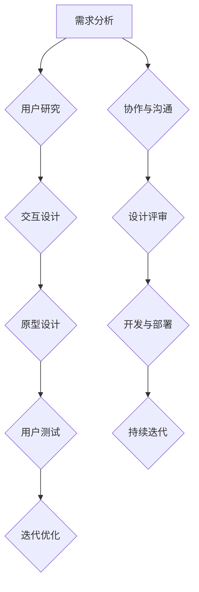

                 

## 文章标题

《如何利用技术能力进行产品设计》

> 关键词：产品设计、技术能力、用户体验、交互设计、前端技术、敏捷开发、数据分析

> 摘要：本文旨在探讨如何有效地将技术能力应用于产品设计过程中。通过对设计思维、用户体验设计、交互设计、前端技术、敏捷开发和数据分析等核心主题的深入分析，本文为读者提供了一个系统且实用的框架，以帮助他们在实际项目中更好地融合技术与设计，从而创造出用户满意且具有竞争力的产品。

### 《如何利用技术能力进行产品设计》目录大纲

## 第一部分：设计思维与技术基础

### 第1章：设计思维概述

#### 1.1 设计思维的定义与重要性

设计思维是一种以人为本的解决问题的方法，它强调通过观察、同理、定义问题、创意构思、原型制作和测试迭代来创造具有实际价值和用户满意度的解决方案。与传统的方法论相比，设计思维更加注重体验和用户需求，是现代产品设计和创新的核心驱动力。

#### 1.2 设计思维的核心流程

设计思维通常包括以下几个步骤：观察与同理、定义问题、创意构思、原型制作和测试迭代。每个步骤都至关重要，能够帮助团队深入了解用户需求，不断优化产品设计。

#### 1.3 设计思维与传统设计的区别

传统设计更侧重于美学和技术实现，而设计思维则更加关注用户需求和用户体验。它强调用户参与和持续迭代，通过快速原型和测试来快速找到问题的根本原因，并及时调整设计方向。

### 第2章：技术能力与产品设计

#### 2.1 技术能力在产品设计中的作用

技术能力在产品设计中扮演着至关重要的角色。它不仅决定了产品的可行性，还直接影响用户体验和性能。理解并利用技术能力，可以帮助设计师做出更明智的设计决策。

#### 2.2 技术趋势对产品设计的启示

随着技术的发展，新的工具和平台不断涌现，为产品设计提供了更多的可能性。了解和利用这些技术趋势，可以使得产品更具创新性和竞争力。

#### 2.3 技术限制与设计挑战

技术限制是产品设计过程中不可避免的问题。如何平衡技术需求和用户体验，如何在限制条件下做出最佳设计决策，是设计师需要深入思考的问题。

### 第3章：用户体验设计基础

#### 3.1 用户体验设计的核心原则

用户体验设计（UXD）的核心原则包括简洁性、可用性、一致性和可访问性。遵循这些原则，能够确保产品在用户心中建立良好的使用体验。

#### 3.2 用户体验设计的流程

用户体验设计的流程包括需求分析、用户研究、交互设计、视觉设计和测试与迭代。每个阶段都有其独特的作用和任务，共同推动产品的不断完善。

#### 3.3 用户体验设计工具与方法

用户体验设计涉及多种工具和方法，如用户访谈、问卷调查、原型设计和用户测试。这些工具和方法有助于设计师更深入地理解用户需求，优化产品设计。

### 第4章：交互设计原理与实践

#### 4.1 交互设计的基本原则

交互设计（XD）的基本原则包括直观性、响应性、一致性、反馈和可控性。遵循这些原则，可以确保用户在使用产品时感到舒适和自信。

#### 4.2 交互设计的方法与技巧

交互设计的方法包括用户研究、信息架构、交互流程设计和界面设计。通过这些方法，设计师可以创建出符合用户期望和使用习惯的产品界面。

#### 4.3 交互设计的实践案例

通过分析实际案例，可以更好地理解交互设计的应用和效果。本文将介绍一些成功的交互设计案例，以启发设计师的创意和实践。

### 第5章：前端技术基础

#### 5.1 前端技术概述

前端技术是产品设计的基石，它决定了产品的外观和交互体验。了解前端技术的基本原理和工具，对于设计师和开发人员都是必不可少的。

#### 5.2 常用前端框架与库

前端框架和库如React、Vue和Angular等，为前端开发提供了强大的功能和灵活性。掌握这些工具，可以显著提高开发效率和产品质量。

#### 5.3 前端性能优化

前端性能优化是确保产品流畅性和用户满意度的关键。通过优化代码、减少资源加载时间和提升渲染效率，可以大大改善用户体验。

## 第二部分：技术驱动的产品设计实战

### 第6章：产品设计实战

#### 6.1 产品设计实战流程

产品设计实战是一个系统化的过程，包括需求分析、原型设计、开发、测试和迭代。通过遵循这个流程，可以确保产品设计的有效性和可持续性。

#### 6.2 产品设计案例研究

通过分析实际的产品设计案例，可以深入了解成功的设计策略和方法。本文将探讨几个经典的产品设计案例，以供读者参考和学习。

#### 6.3 产品设计中的常见问题与解决方案

在实际的产品设计过程中，设计师会遇到各种问题。本文将讨论一些常见的问题，并提供相应的解决方案，帮助设计师更好地应对挑战。

### 第7章：数据分析与产品设计

#### 7.1 数据分析在产品设计中的应用

数据分析是产品设计的重要工具，它可以帮助设计师更好地理解用户行为和需求，从而优化产品设计。

#### 7.2 用户行为分析

用户行为分析是数据分析的核心任务之一。通过分析用户行为数据，设计师可以识别用户痛点，优化产品功能和界面设计。

#### 7.3 数据驱动设计实践

数据驱动设计是一种以数据为依据的设计方法。通过收集、分析和应用数据，设计师可以做出更明智的设计决策，提高产品的用户体验和市场竞争力。

### 第8章：敏捷开发与持续迭代

#### 8.1 敏捷开发方法

敏捷开发是一种以用户需求为导向的开发方法，它强调快速迭代、持续交付和团队协作。掌握敏捷开发方法，可以显著提高产品开发效率和质量。

#### 8.2 持续集成与持续部署

持续集成（CI）和持续部署（CD）是敏捷开发的重要组成部分。通过自动化测试和部署流程，可以确保产品持续交付，提高开发效率和质量。

#### 8.3 敏捷开发在产品设计中的应用

敏捷开发不仅适用于开发流程，也适用于产品设计。通过敏捷方法，设计师可以更快地响应市场需求，持续改进产品设计。

## 第三部分：附录

### 附录A：产品设计工具与资源

#### A.1 常用设计工具

介绍一些常用的产品设计工具，如Sketch、Adobe XD、Figma等，并说明它们的特点和适用场景。

#### A.2 设计资源网站

介绍一些有用的设计资源网站，如Dribbble、Behance、UI Movement等，为设计师提供灵感和素材。

#### A.3 设计社区与论坛

介绍一些知名的设计社区和论坛，如GitHub、Stack Overflow、DZone等，为设计师提供交流和学习的平台。

### 附录B：设计流程与工具的Mermaid流程图

使用Mermaid语言绘制设计流程和工具的流程图，帮助读者更直观地理解设计过程和工具的使用。

### 附录C：交互设计伪代码示例

通过伪代码示例，详细解释交互设计的基本原则和实现方法，帮助读者更好地理解交互设计。

### 附录D：数据分析相关数学模型和公式

#### D.1 相关数学模型介绍

介绍常用的数据分析数学模型，如线性回归、决策树和神经网络等，并解释它们的基本原理和应用场景。

#### D.2 公式详细讲解

详细讲解常用的数据分析公式，如相关系数、回归系数和置信区间等，并说明它们在数据分析中的应用。

#### D.3 举例说明

通过具体实例，说明如何使用数据分析公式进行用户行为分析和产品优化。

### 附录E：产品设计项目实战案例

#### E.1 实战项目背景

介绍一个具体的产品设计项目，包括项目背景、目标和预期成果。

#### E.2 环境搭建

详细描述项目开发环境搭建的过程，包括开发工具、框架和依赖库的安装和配置。

#### E.3 源代码实现与解读

提供项目的源代码实现，并详细解读代码的设计思想和实现细节。

#### E.4 代码解读与分析

对源代码进行深入分析，讨论其优点和不足，并提出改进建议。

## 作者信息

作者：AI天才研究院/AI Genius Institute & 禅与计算机程序设计艺术 /Zen And The Art of Computer Programming

---

### 《如何利用技术能力进行产品设计》

#### 摘要

本文旨在探讨如何将技术能力有效地应用于产品设计过程中。通过对设计思维、用户体验设计、交互设计、前端技术、敏捷开发和数据分析等主题的深入分析，本文为读者提供了一个全面且实用的框架，以帮助他们在实际项目中更好地融合技术与设计。文章从设计思维概述入手，详细介绍了设计思维的定义、核心流程和与传统设计的区别。接着，探讨了技术能力在产品设计中的作用、技术趋势对设计的启示以及技术限制与设计挑战。随后，文章深入讲解了用户体验设计、交互设计、前端技术等基础理论，并结合实际案例进行了分析。此外，文章还介绍了敏捷开发与持续迭代的方法，并探讨了数据分析在产品设计中的应用。最后，文章提供了设计工具与资源、设计流程与工具的Mermaid流程图、交互设计伪代码示例、数据分析相关数学模型和公式以及产品设计项目实战案例，为读者提供了丰富的实战经验和指导。本文适合产品设计、开发人员以及对产品设计有兴趣的读者阅读。

---

### 第1章：设计思维概述

设计思维是一种以人为本的解决问题的方法，它强调通过观察、同理、定义问题、创意构思、原型制作和测试迭代来创造具有实际价值和用户满意度的解决方案。与传统的方法论相比，设计思维更加注重体验和用户需求，是现代产品设计和创新的核心驱动力。本章将介绍设计思维的定义、核心流程以及与传统设计的区别。

#### 1.1 设计思维的定义与重要性

设计思维（Design Thinking）起源于20世纪中叶，由斯坦福大学的设计学院教授David Kelly等人提出。它是一种系统性的、迭代性的解决问题的方法，强调通过用户需求导向的设计过程来创造创新且实用的解决方案。设计思维的核心特点包括以下几个方面：

1. **用户中心**：设计思维始终围绕用户的需求和体验展开，确保解决方案真正满足用户需求。
2. **迭代性**：设计思维是一个不断迭代、修正和优化的过程，通过快速原型和测试来不断改进设计方案。
3. **综合性**：设计思维融合了不同的学科和技能，如设计、工程、心理学、社会学等，以实现全面的解决方案。
4. **以创造为驱动**：设计思维鼓励创造力和创新，通过探索多种可能性和解决方案来突破传统思维限制。

设计思维的重要性体现在以下几个方面：

1. **提升用户体验**：通过深入了解用户需求和痛点，设计思维能够创造出更符合用户期望的产品和服务，提升用户体验。
2. **增强团队协作**：设计思维强调跨学科的团队合作，有助于团队更好地理解问题和协同工作，提高工作效率。
3. **促进创新**：设计思维的迭代性和创造力驱动，能够激发团队的创新能力，推动产品和服务的持续创新。
4. **降低风险**：通过快速原型和测试，设计思维能够在早期阶段识别和解决潜在问题，降低项目失败的风险。

#### 1.2 设计思维的核心流程

设计思维通常包括以下几个步骤，每个步骤都有其独特的任务和作用，共同推动设计的不断迭代和优化。

1. **观察与同理**：设计思维的第一步是观察用户行为和环境，通过同理心深入了解用户的需求、痛点和行为习惯。这一步骤有助于设计师站在用户的角度思考问题，为后续的设计提供真实的基础。
   
2. **定义问题**：在了解用户需求和行为后，设计师需要明确问题的定义，将其转化为具体、可操作的问题陈述。这一步骤有助于确保设计的针对性，避免设计偏离用户需求。

3. **创意构思**：创意构思是设计思维的核心环节，设计师通过头脑风暴、思维导图、故事板等方法，提出多种可能的解决方案。这一步骤鼓励创新思维，发掘出不同寻常的解决方案。

4. **原型制作**：原型制作是将创意转化为可执行的设计方案的过程。设计师可以通过手工草图、数字原型、交互原型等多种方式快速制作原型，以便于测试和迭代。

5. **测试与迭代**：测试与迭代是设计思维的最后一个步骤，通过用户测试、反馈收集和数据分析，设计师可以评估原型的有效性，发现潜在的问题和改进点，并在此基础上进行优化和迭代。这一步骤确保设计在真实环境中不断改进，最终达到用户满意度和商业成功。

#### 1.3 设计思维与传统设计的区别

传统设计（Traditional Design）通常侧重于美学和技术实现，以设计规范和工程师的技术能力为核心。而设计思维（Design Thinking）则更加关注用户体验和用户需求，强调用户参与和持续迭代。以下是设计思维与传统设计的主要区别：

1. **用户中心**：传统设计更注重技术实现和视觉效果，而设计思维则始终将用户放在中心，以用户需求和体验为导向。
2. **迭代性**：传统设计往往一次性完成，而设计思维是一个持续迭代、修正和优化的过程，通过快速原型和测试来不断改进设计。
3. **综合性**：传统设计通常由单一设计师或团队完成，而设计思维则强调跨学科的团队合作，融合设计、工程、心理学、社会学等不同领域的知识和技能。
4. **创造力驱动**：传统设计注重规范和标准，而设计思维则鼓励创造力和创新，通过探索多种可能性和解决方案来突破思维限制。

总之，设计思维是一种以人为本、迭代创新的设计方法，它不仅能够提升用户体验和产品价值，还能够推动团队的协作和创新，是现代产品设计不可或缺的一部分。

---

### 第2章：技术能力与产品设计

技术能力在产品设计中发挥着至关重要的作用。它不仅决定了产品的可行性，还直接影响用户体验和性能。理解并利用技术能力，可以帮助设计师做出更明智的设计决策，提高产品的竞争力。本章将探讨技术能力在产品设计中的作用、技术趋势对设计的启示以及技术限制与设计挑战。

#### 2.1 技术能力在产品设计中的作用

技术能力在产品设计中具有以下几个重要作用：

1. **可行性分析**：技术能力可以帮助设计师评估产品功能的可行性，确定哪些功能可以实现，哪些可能存在技术障碍。这有助于在设计初期就避免不切实际的需求，确保产品开发的顺利进行。

2. **性能优化**：技术能力能够帮助设计师优化产品性能，提升用户体验。例如，通过前端技术优化加载速度、提高响应性能，可以显著改善用户的使用感受。

3. **创新驱动**：技术能力可以激发设计师的创造力，推动产品的创新。新技术和新工具的出现，为产品设计提供了更多的可能性，使得设计师能够探索新的功能和交互方式，提升产品的竞争力。

4. **用户体验**：技术能力直接影响用户体验。例如，通过合适的算法和数据分析，可以更好地理解用户行为，优化产品功能和界面设计，提升用户的满意度。

5. **协作与沟通**：技术能力有助于设计师与开发人员之间的协作和沟通。理解技术实现细节，可以使得设计师更好地与开发团队沟通需求，确保设计的可行性。

#### 2.2 技术趋势对产品设计的启示

随着技术的不断发展，新的工具和平台不断涌现，为产品设计提供了丰富的启示。以下是一些当前热门的技术趋势：

1. **人工智能与机器学习**：人工智能和机器学习技术为产品设计带来了新的机遇。通过数据分析和算法优化，可以更好地理解用户行为，提供个性化的用户体验。例如，推荐系统、智能助手和个性化内容生成等应用，正在改变人们的互动方式。

2. **区块链技术**：区块链技术以其去中心化、不可篡改的特点，为产品设计提供了新的可能性。例如，在供应链管理、数字身份验证和智能合约等领域，区块链技术可以提升系统的透明性和安全性。

3. **物联网（IoT）**：物联网技术使得设备之间的连接变得更加紧密，为产品设计带来了新的挑战和机遇。例如，智能家居、智能穿戴设备和智能城市等应用，需要设计师考虑如何设计更加互联互通、易于使用的用户体验。

4. **增强现实（AR）与虚拟现实（VR）**：增强现实和虚拟现实技术为用户提供了沉浸式的体验，为产品设计带来了新的维度。通过这些技术，设计师可以创造更加生动、互动的虚拟环境，提升用户的参与感和满意度。

5. **云计算与边缘计算**：云计算和边缘计算技术的普及，使得数据处理和存储变得更加灵活和高效。设计师可以利用这些技术，设计出更加响应迅速、资源利用更加合理的应用。

#### 2.3 技术限制与设计挑战

尽管技术为产品设计带来了许多机遇，但技术限制和挑战同样不可忽视。以下是一些常见的技术限制和设计挑战：

1. **性能瓶颈**：技术性能瓶颈可能会限制设计的实现。例如，某些复杂的功能可能需要较高的计算资源和存储空间，这可能会影响产品的性能和用户体验。

2. **安全性问题**：随着数据泄露和网络攻击的增多，安全性成为产品设计的重要考虑因素。设计师需要确保产品在数据传输、存储和处理过程中的安全性。

3. **跨平台兼容性**：不同的操作系统、浏览器和设备可能存在兼容性问题，设计师需要确保产品在多种环境下都能正常运行。

4. **技术更新**：技术更新速度非常快，设计师需要不断学习和适应新技术，以保持设计的先进性和竞争力。

5. **成本控制**：技术实现可能涉及较高的成本，设计师需要在设计初期就考虑成本因素，确保产品的可行性。

总之，技术能力在产品设计中具有重要作用，但同时也面临着各种挑战。设计师需要不断学习新技术，提高自己的技术素养，同时保持对用户体验的关注，以实现技术驱动的设计创新。

---

### 第3章：用户体验设计基础

用户体验设计（User Experience Design，简称UXD）是产品设计中至关重要的一环，它关注产品的整体体验，从用户的角度出发，确保产品在视觉、交互和功能上都能满足用户的需求。本章将介绍用户体验设计的核心原则、设计流程以及常用的工具和方法。

#### 3.1 用户体验设计的核心原则

用户体验设计的核心原则包括以下几点：

1. **简洁性**：简洁的设计能够降低用户的认知负担，使得用户能够快速理解和使用产品。简洁性不仅体现在界面布局上，还涉及内容的组织、语言的表述和操作流程的简化。

2. **可用性**：可用性是指产品能够被用户轻松、高效地使用。一个高可用性的产品应该具备直观的交互设计、明确的反馈信息和便捷的操作路径，确保用户在使用过程中能够顺利完成任务。

3. **一致性**：一致性是指产品在不同环境下保持统一的视觉和交互风格。一致的设计可以减少用户的困惑和认知负担，提升用户对产品的信任感和满意度。

4. **可访问性**：可访问性是指产品能够满足不同用户的需求，包括视力、听力、动作能力等方面的限制。设计师需要考虑如何使产品对所有人都是可用的，确保所有人都能享受到良好的用户体验。

5. **反馈**：及时的反馈是用户体验设计的重要部分。用户在操作产品时需要得到明确的反馈，以确认他们的操作是否成功，这有助于提升用户的信心和满意度。

#### 3.2 用户体验设计的流程

用户体验设计的流程通常包括以下几个阶段：

1. **需求分析**：需求分析是用户体验设计的起点，设计师需要通过访谈、问卷调查、用户调研等方式，深入了解用户的需求和痛点。这一阶段的目标是明确产品的核心功能和目标用户群体。

2. **用户研究**：用户研究是深入了解用户行为和需求的过程。通过用户画像、用户故事、用户旅程地图等方法，设计师可以更好地理解用户的需求和使用习惯，为后续的设计提供依据。

3. **交互设计**：交互设计是用户体验设计的关键阶段，设计师需要确定产品的交互模式和界面布局。通过原型设计、用户测试和迭代，设计师可以不断优化交互体验，确保产品易于使用。

4. **视觉设计**：视觉设计是用户体验设计的最后一环，设计师需要根据交互设计的结果，设计出符合品牌形象和用户需求的外观。视觉设计包括颜色、字体、图标、图像等方面的选择。

5. **测试与迭代**：测试与迭代是用户体验设计的重要环节，设计师需要通过用户测试、A/B测试等方法，验证设计的效果，并根据用户的反馈进行优化。这一过程通常需要多次迭代，以确保最终产品能够满足用户需求。

#### 3.3 用户体验设计工具与方法

用户体验设计涉及多种工具和方法，以下是一些常用的工具和方法：

1. **用户访谈**：用户访谈是一种深入了解用户需求和行为的方法。通过面对面或在线访谈，设计师可以获取第一手的用户反馈，为设计提供真实的基础。

2. **问卷调查**：问卷调查是一种广泛收集用户意见的方法。通过设计有针对性的问卷，设计师可以获取大量的用户数据，分析用户需求和偏好。

3. **用户画像**：用户画像是通过描述用户的基本特征、行为习惯和需求，来帮助设计师更好地理解目标用户群体。用户画像是设计过程中重要的参考依据。

4. **用户旅程地图**：用户旅程地图是一种可视化工具，用于描述用户在使用产品过程中的各个阶段和体验。通过用户旅程地图，设计师可以识别用户痛点，优化设计流程。

5. **原型设计**：原型设计是用户体验设计的重要阶段，设计师可以通过手工草图、数字原型或交互原型，快速构建产品的视觉和交互模型。原型设计有助于验证设计的可行性，并收集用户的反馈。

6. **用户测试**：用户测试是评估设计效果的重要方法。通过邀请用户参与测试，设计师可以观察用户的操作行为和反馈，发现设计中的问题，并进行优化。

7. **A/B测试**：A/B测试是一种通过比较两个或多个版本的设计，评估哪种设计效果更好的方法。A/B测试可以帮助设计师找到最佳的设计方案，提高用户体验。

通过遵循用户体验设计的核心原则和流程，并运用合适的工具和方法，设计师可以创造出用户满意且具有竞争力的产品。用户体验设计不仅关注产品的功能性，更注重用户的需求和体验，是现代产品设计不可或缺的一部分。

---

### 第4章：交互设计原理与实践

交互设计（Interaction Design，简称XD）是用户体验设计的重要组成部分，它关注用户与产品互动的方式和过程。一个成功的交互设计不仅需要考虑用户的需求和习惯，还需要遵循一定的设计原则和流程。本章将介绍交互设计的基本原则、方法和实践案例。

#### 4.1 交互设计的基本原则

交互设计的基本原则包括以下几点：

1. **直观性**：直观性是交互设计的核心原则，它要求用户能够通过直觉理解产品的功能和操作方式。直观的设计可以减少用户的认知负担，提升用户体验。

2. **响应性**：响应性是指产品能够快速响应用户的操作，提供即时反馈。快速的响应可以提升用户的满意度，避免用户在等待过程中感到沮丧。

3. **一致性**：一致性是指产品在不同环境下保持统一的交互风格。一致性可以减少用户的困惑，提升用户对产品的信任感和满意度。

4. **可控性**：可控性是指用户在使用产品时，能够清楚地了解当前的操作状态和下一步可以进行的操作。可控的设计可以提升用户的信心，降低用户的焦虑感。

5. **反馈**：反馈是交互设计的重要部分，它通过视觉、听觉或触觉等方式，向用户传达操作结果和系统状态。及时的反馈可以提升用户的操作体验，减少错误的概率。

#### 4.2 交互设计的方法与技巧

交互设计的方法和技巧多种多样，以下是一些常用的方法：

1. **用户研究**：用户研究是交互设计的基础，通过深入了解用户的需求、行为和习惯，设计师可以更好地理解用户，设计出更符合用户需求的产品。用户研究的方法包括访谈、问卷调查、用户观察和用户测试等。

2. **信息架构**：信息架构是交互设计的重要环节，它涉及产品的内容组织、导航设计和信息层次结构。良好的信息架构可以提升产品的易用性和用户体验。

3. **交互流程设计**：交互流程设计是确定用户在使用产品过程中需要完成的操作步骤和交互流程。通过流程图、泳道图和用户故事地图等方法，设计师可以清晰地描述用户的使用过程，优化交互体验。

4. **界面设计**：界面设计是交互设计的重要组成部分，它涉及产品的视觉元素、布局和交互元素的设计。通过合理的界面设计，设计师可以提升产品的美观性和易用性。

5. **原型设计**：原型设计是验证设计思路和获取用户反馈的重要工具。通过制作原型，设计师可以快速迭代和优化设计，确保产品能够满足用户需求。

6. **用户测试**：用户测试是评估交互设计效果的重要方法。通过邀请用户参与测试，设计师可以观察用户的操作行为和反馈，发现设计中的问题，并进行优化。

7. **A/B测试**：A/B测试是一种通过比较两个或多个版本的设计，评估哪种设计效果更好的方法。A/B测试可以帮助设计师找到最佳的设计方案，提高用户体验。

#### 4.3 交互设计的实践案例

以下是一些交互设计的实践案例，通过分析这些案例，我们可以更好地理解交互设计的应用和效果：

1. **Instagram的故事功能**：Instagram的故事功能是一个成功的交互设计案例。通过引入滑动操作，用户可以方便地浏览和分享动态内容。滑动操作的引入不仅提升了用户体验，还增加了用户的粘性。

2. **Apple Watch的翻转操作**：Apple Watch的翻转操作是一个创新的交互设计案例。通过翻转手表，用户可以快速切换不同的界面和功能。这种操作方式直观且易于掌握，提升了用户的体验。

3. **Google搜索的语音搜索功能**：Google搜索的语音搜索功能是一个实用的交互设计案例。通过语音输入，用户可以更加便捷地搜索信息。语音搜索不仅提升了用户的操作效率，还适应了移动设备的操作场景。

4. **Airbnb的动态搜索**：Airbnb的动态搜索是一个灵活的交互设计案例。通过实时调整搜索条件，用户可以快速找到符合需求的住宿信息。动态搜索的设计提升了用户的搜索效率，改善了用户体验。

通过这些案例，我们可以看到，成功的交互设计不仅需要遵循基本的设计原则，还需要结合具体的应用场景和用户需求。通过不断实践和优化，设计师可以创造出更加优秀和用户满意的产品。

---

### 第5章：前端技术基础

前端技术是现代Web产品设计的核心组成部分，它决定了产品的视觉效果、交互体验和性能。掌握前端技术基础，对于设计师和开发人员来说至关重要。本章将介绍前端技术的基本概念、常用框架与库以及前端性能优化。

#### 5.1 前端技术概述

前端技术是指构建Web应用的客户端技术，主要包括HTML、CSS和JavaScript。这些技术共同协作，决定了Web页面的结构、样式和行为。

1. **HTML（超文本标记语言）**：HTML是构建网页内容的基础，它使用标签（Tags）来定义页面中的文本、图像、链接和其他元素。HTML负责页面的结构。

2. **CSS（层叠样式表）**：CSS用于定义网页的样式，包括布局、颜色、字体等。CSS使网页更加美观，并且可以与HTML分离，提高代码的可维护性。

3. **JavaScript**：JavaScript是一种客户端脚本语言，用于增强网页的交互性和动态效果。JavaScript可以处理用户的输入，与后端进行通信，以及实现复杂的逻辑功能。

前端技术的发展经历了多个阶段，从最初的静态页面到动态交互，再到如今的单页面应用（SPA）和组件化开发。现代前端技术不仅提供了丰富的功能和灵活性，还通过框架和库极大地提高了开发效率。

#### 5.2 常用前端框架与库

前端框架和库为开发者提供了大量的功能和工具，使开发变得更加高效和一致。以下是一些常用的前端框架和库：

1. **React**：React是由Facebook开发的一个用于构建用户界面的JavaScript库。它采用虚拟DOM和组件化架构，使得开发大型单页面应用变得更加简单和高效。

2. **Vue**：Vue是一个渐进式JavaScript框架，由尤雨溪创建。它具有简洁的语法和灵活的组件系统，适合各种规模的项目。

3. **Angular**：Angular是由Google开发的综合前端框架，它提供了强大的数据绑定、依赖注入和指令系统。Angular适合构建大型、复杂的应用程序。

4. **Bootstrap**：Bootstrap是一个流行的前端框架，提供了响应式设计、CSS样式和组件，使得快速开发美观的网页变得简单。

5. **jQuery**：jQuery是一个轻量级的JavaScript库，简化了HTML文档遍历和操作，以及事件处理和动画效果。它是一个广泛使用的工具，可以帮助开发者快速实现前端功能。

#### 5.3 前端性能优化

前端性能优化是确保Web应用快速、流畅和高效运行的关键。以下是一些常见的前端性能优化方法：

1. **减少HTTP请求**：减少HTTP请求可以显著提高页面加载速度。通过合并CSS和JavaScript文件、使用CDN（内容分发网络）和懒加载等技术，可以减少请求次数。

2. **压缩资源**：对CSS、JavaScript和HTML文件进行压缩，可以减少文件体积，加快加载速度。常用的工具包括UglifyJS、CSSNano等。

3. **优化图片**：图片是网页中常见的资源，优化图片可以减少加载时间。方法包括压缩图片、使用WebP格式、懒加载大图片等。

4. **浏览器缓存**：利用浏览器缓存可以加快页面加载速度。通过设置合理的缓存策略，可以将资源缓存到本地，减少重复请求。

5. **代码分割**：通过代码分割，可以将一个大型应用程序拆分为多个小型模块，按需加载，提高页面加载速度。

6. **使用HTTP/2**：HTTP/2是一种新型的HTTP协议，它提供了多路复用、头部压缩等功能，可以显著提高资源加载速度。

7. **使用服务端渲染（SSR）**：服务端渲染（SSR）可以将页面内容在服务器端渲染完成，然后将渲染结果发送到客户端。这可以提高页面加载速度，尤其是对搜索引擎优化（SEO）有益。

前端技术不断发展和演变，设计师和开发人员需要不断学习和适应新技术，以提高产品的前端性能和用户体验。通过掌握前端技术基础和性能优化方法，可以创建出快速、高效且用户满意的前端应用。

---

### 第6章：产品设计实战

在产品设计过程中，将理论与实践相结合是至关重要的。本章将通过详细描述产品设计实战流程、案例分析以及常见问题与解决方案，帮助读者更好地理解和应用产品设计的方法和技巧。

#### 6.1 产品设计实战流程

产品设计实战是一个系统化的过程，通常包括以下几个阶段：

1. **需求分析**：需求分析是产品设计的起点。在这一阶段，设计师需要通过访谈、问卷调查、用户调研等方式，深入了解用户的需求和痛点。通过需求分析，可以明确产品的功能需求、用户目标和使用场景，为后续的设计提供依据。

2. **原型设计**：原型设计是将需求转化为可视化设计方案的过程。在这一阶段，设计师可以使用各种工具（如Sketch、Adobe XD、Figma等）制作低保真或高保真的原型。原型设计有助于验证设计的可行性，并收集用户的反馈。

3. **用户测试**：用户测试是评估设计效果的重要环节。通过邀请目标用户参与测试，设计师可以观察用户的操作行为和反馈，发现设计中的问题，并进行优化。用户测试可以帮助设计师了解用户的需求和痛点，确保产品能够满足用户的期望。

4. **迭代优化**：迭代优化是产品设计过程中的核心。通过不断地测试和反馈，设计师可以持续改进产品设计，提升用户体验。迭代优化包括功能优化、界面优化和交互优化等多个方面。

5. **开发与部署**：在完成设计验证和优化后，设计文档和原型将交给开发团队进行开发。开发团队需要按照设计要求实现产品的功能和界面。在开发过程中，设计师需要与开发团队保持紧密的沟通，确保设计的实施效果与预期一致。

6. **持续迭代与优化**：产品设计是一个持续的过程，用户需求和技术环境都在不断变化。在产品上线后，设计师需要通过数据分析、用户反馈和A/B测试等方法，持续优化产品设计和功能，提升用户体验和满意度。

#### 6.2 产品设计案例研究

以下是一个实际的产品设计案例研究，通过分析案例，可以更好地理解产品设计的实战过程。

**案例：某电商平台APP设计**

1. **需求分析**：在开始设计之前，设计师通过对市场调研、用户访谈和问卷调查，了解到用户对电商平台APP的主要需求包括商品浏览、购物车管理、订单追踪和支付功能等。

2. **原型设计**：根据需求分析，设计师使用Figma制作了APP的低保真原型。原型包括首页、商品列表页、购物车页、订单详情页和支付页等核心页面。

3. **用户测试**：在原型设计完成后，设计师邀请了一组目标用户进行用户测试。测试过程中，用户被要求完成一系列操作，如浏览商品、添加购物车、下单支付等。设计师通过观察用户的操作行为和反馈，发现了以下问题：
   - 商品列表页的排序逻辑不够直观，用户难以找到自己想要的商品。
   - 购物车页的设计过于复杂，用户难以快速找到已购商品。
   - 支付页面存在安全隐患，用户对支付流程不信任。

4. **迭代优化**：根据用户测试的反馈，设计师对原型进行了多次迭代优化。具体措施包括：
   - 调整商品列表页的排序逻辑，增加“推荐商品”和“新品上架”等功能。
   - 简化购物车页的设计，突出已购商品，并提供快速删除和修改数量的功能。
   - 改进支付页面的设计，增加支付安全提示和用户隐私保护。

5. **开发与部署**：在完成设计验证和优化后，设计文档和原型被交给了开发团队进行开发。开发团队根据设计要求实现了APP的功能和界面，并在测试环境中进行了多次测试，确保产品符合预期。

6. **持续迭代与优化**：在APP上线后，设计师通过数据分析、用户反馈和A/B测试等方法，持续优化产品设计和功能。例如，根据用户行为数据，优化了首页的推荐算法，提高了用户的购物体验。

通过这个案例，我们可以看到，产品设计实战是一个不断迭代和优化的过程。通过深入了解用户需求、不断测试和优化设计，设计师可以创造出用户满意且具有竞争力的产品。

#### 6.3 产品设计中的常见问题与解决方案

在实际的产品设计过程中，设计师可能会遇到各种问题。以下是一些常见的问题及解决方案：

1. **需求不明确**：解决方案：在需求分析阶段，设计师需要与相关利益相关者（如产品经理、市场人员等）密切合作，确保需求明确、具体，并且可操作。

2. **设计不合理**：解决方案：在原型设计和用户测试阶段，设计师需要积极收集用户反馈，根据反馈调整设计，确保设计符合用户需求和习惯。

3. **开发与设计不一致**：解决方案：在设计阶段，设计师需要与开发团队保持密切的沟通，确保设计文档和原型能够准确传达设计意图。在开发阶段，设计师需要定期跟进项目进度，及时解决设计与开发之间的不一致。

4. **用户体验差**：解决方案：在用户测试阶段，设计师需要通过观察用户行为和反馈，发现用户体验问题，并针对这些问题进行优化。此外，通过数据分析，设计师可以深入了解用户行为，发现潜在的问题和改进点。

5. **时间与资源有限**：解决方案：在产品设计过程中，设计师需要合理规划时间，优先处理关键功能和用户体验。此外，可以通过团队合作和分工，提高工作效率，确保项目按时交付。

总之，产品设计实战是一个复杂且动态的过程。通过遵循系统化的设计流程、积极应对常见问题，设计师可以创造出用户满意、具有竞争力的产品。

---

### 第7章：数据分析与产品设计

数据分析在产品设计中起着至关重要的作用。通过数据分析，设计师可以深入了解用户行为、需求和市场趋势，从而做出更加准确和有效的设计决策。本章将探讨数据分析在产品设计中的应用、用户行为分析以及数据驱动设计的实践。

#### 7.1 数据分析在产品设计中的应用

数据分析在产品设计中的应用主要体现在以下几个方面：

1. **需求分析**：通过数据分析，设计师可以了解用户的需求和痛点。例如，通过分析用户反馈、调查问卷和用户访谈，设计师可以识别用户对产品功能和用户体验的期望，从而指导需求分析。

2. **用户行为分析**：用户行为分析是产品设计的重要依据。通过分析用户在产品中的行为轨迹，如浏览路径、点击行为、转化率等，设计师可以识别用户的常见操作模式和使用习惯，从而优化产品界面和交互设计。

3. **市场趋势分析**：通过市场数据分析和竞争分析，设计师可以了解市场趋势和竞争对手的产品设计特点。这有助于设计师把握市场动态，制定具有竞争力的设计策略。

4. **效果评估**：数据分析可以帮助设计师评估产品设计的有效性。通过跟踪关键性能指标（KPI），如用户留存率、转化率和用户满意度等，设计师可以评估设计改进的效果，为后续的迭代优化提供数据支持。

5. **个性化设计**：数据分析可以为个性化设计提供依据。通过分析用户数据，如地理位置、偏好和行为模式，设计师可以创建个性化的用户界面和推荐系统，提升用户体验。

#### 7.2 用户行为分析

用户行为分析是产品设计的重要环节，通过分析用户行为数据，设计师可以深入了解用户的需求和行为模式，从而优化产品设计。以下是一些常用的用户行为分析方法：

1. **用户旅程分析**：用户旅程分析是通过分析用户在产品中的行为轨迹，识别用户在使用产品过程中的关键环节和痛点。通过用户旅程分析，设计师可以优化用户流程，提升用户体验。

2. **点击热图分析**：点击热图分析是通过可视化用户点击行为，了解用户在页面上的兴趣点和操作习惯。点击热图可以帮助设计师优化页面布局，提升关键功能的可见性和易用性。

3. **转化率分析**：转化率分析是通过跟踪用户在产品中的转化行为（如注册、购买、下载等），评估设计改进的效果。通过转化率分析，设计师可以识别哪些设计元素对用户转化有显著影响，从而优化关键页面和流程。

4. **留存率分析**：留存率分析是通过跟踪用户在产品中的活跃度，评估产品设计的吸引力和用户粘性。高留存率表明产品设计得到了用户的认可，低留存率则提示需要进一步优化设计。

5. **A/B测试**：A/B测试是通过比较两个或多个版本的设计，评估哪种设计效果更好。A/B测试可以帮助设计师验证设计假设，优化用户体验。

#### 7.3 数据驱动设计实践

数据驱动设计（Data-Driven Design）是一种基于数据分析进行设计的方法，它强调通过数据来指导设计和决策。以下是一个数据驱动设计的实践案例：

**案例：某电商网站的个性化推荐系统**

1. **需求分析**：通过用户调研和市场分析，设计师发现用户对个性化推荐有较高的需求。个性化推荐系统可以帮助提升用户的购物体验，增加销售量。

2. **数据收集**：设计师收集了用户行为数据，如浏览记录、购买历史、点击行为等。这些数据为推荐系统的开发提供了基础。

3. **数据分析**：通过分析用户行为数据，设计师确定了推荐系统的核心指标，如推荐点击率、购买转化率等。同时，设计师还分析了用户的行为模式，以识别潜在的个性化推荐策略。

4. **原型设计**：基于数据分析的结果，设计师制作了个性化推荐系统的原型。原型包括推荐商品列表、推荐理由等元素。

5. **用户测试**：设计师邀请了一组目标用户参与用户测试，通过A/B测试评估推荐系统的效果。测试结果显示，个性化推荐系统能够显著提升用户的点击率和购买转化率。

6. **迭代优化**：根据用户测试的反馈，设计师对推荐系统进行了多次迭代优化。例如，调整推荐算法，优化推荐理由的表述，提升用户体验。

7. **效果评估**：在推荐系统上线后，设计师通过数据分析跟踪关键指标，评估系统对用户和业务的影响。结果显示，个性化推荐系统有效提升了用户满意度和销售额。

通过这个案例，我们可以看到数据驱动设计如何帮助设计师优化产品设计，提升用户体验和业务效果。数据驱动设计不仅依赖数据分析，还需要设计师具备敏锐的洞察力和创新能力，将数据分析结果转化为切实可行的设计决策。

---

### 第8章：敏捷开发与持续迭代

敏捷开发（Agile Development）是一种以用户需求为导向、强调快速迭代和持续交付的软件开发方法。敏捷开发方法不仅适用于开发流程，也适用于产品设计。本章将介绍敏捷开发的基本方法、持续集成与持续部署以及敏捷开发在产品设计中的应用。

#### 8.1 敏捷开发方法

敏捷开发方法强调团队合作、灵活性和快速响应变化。以下是一些敏捷开发的核心原则和流程：

1. **用户故事**：用户故事是一种描述用户需求的方法，它以用户的语言来表达功能需求和优先级。用户故事通常采用“作为……，我想要……，以便……”的格式。

2. **迭代开发**：迭代开发是一种将开发过程划分为多个短周期（通常为2-4周）的方法。在每个迭代周期中，团队完成一系列用户故事，并不断进行反馈和调整。

3. **每日站会**：每日站会是一种简短的团队会议，通常持续15分钟。在站会上，团队成员汇报昨天的工作进展、今天的计划和遇到的问题，确保团队成员之间的沟通和协作。

4. **迭代评审**：迭代评审是在每个迭代周期结束时进行的会议，用于评估已完成的工作和用户反馈。评审结果将指导下一个迭代的工作计划。

5. **迭代回顾**：迭代回顾是在每个迭代周期结束后进行的反思会议，团队成员共同讨论哪些做得好，哪些需要改进。回顾结果将用于优化团队的工作流程和方法。

6. **持续集成与部署**：持续集成（CI）和持续部署（CD）是敏捷开发的重要组成部分。通过自动化测试和部署流程，确保代码的质量和系统的稳定性。

#### 8.2 持续集成与持续部署

持续集成（Continuous Integration）和持续部署（Continuous Deployment）是敏捷开发中的关键实践，它们通过自动化测试和部署流程，提高开发效率和产品质量。

1. **持续集成（CI）**：持续集成是一种软件开发实践，通过频繁地将代码合并到主分支，并自动运行一系列测试，确保代码库的稳定性和质量。持续集成为团队提供了一个快速识别和修复问题的机制。

2. **持续部署（CD）**：持续部署是一种自动化部署流程，通过自动化测试和部署脚本，将代码从开发环境快速部署到生产环境。持续部署可以显著减少手动部署的工作量，提高部署的频率和速度。

#### 8.3 敏捷开发在产品设计中的应用

敏捷开发方法不仅适用于开发流程，也适用于产品设计。以下是一些敏捷开发在产品设计中的应用：

1. **用户故事地图**：用户故事地图是一种可视化工具，用于描述产品的用户旅程和关键功能。通过用户故事地图，设计师可以与团队成员和利益相关者共同讨论和确认产品需求。

2. **迭代设计**：迭代设计是一种将产品设计过程划分为多个短周期的方法。在每个迭代周期中，设计师完成一系列设计任务，包括需求分析、原型设计、用户测试等。迭代设计有助于设计师快速响应用户需求和市场变化。

3. **用户测试**：用户测试是敏捷开发的重要组成部分。通过在迭代过程中频繁地进行用户测试，设计师可以及时了解用户反馈，优化设计，确保产品符合用户期望。

4. **持续优化**：敏捷开发强调持续优化和改进。设计师需要不断反思和改进设计流程和方法，提高设计质量和效率。

通过敏捷开发方法，设计师可以更好地与开发团队协作，快速响应市场需求，持续改进产品设计，提升用户体验和产品竞争力。

---

### 附录A：产品设计工具与资源

在产品设计中，使用合适的工具和资源可以大大提高工作效率和设计质量。以下是一些常用的设计工具、设计资源网站以及设计社区和论坛。

#### A.1 常用设计工具

1. **Sketch**：Sketch是一款功能强大的界面设计工具，适用于Mac操作系统。它支持矢量绘图、丰富的插件系统和强大的导出功能。

2. **Adobe XD**：Adobe XD是一款专业的用户体验设计工具，支持跨平台使用。它提供了强大的原型设计、用户测试和协作功能。

3. **Figma**：Figma是一款基于浏览器的界面设计工具，支持实时协作。它提供了丰富的绘图和原型设计功能，并且可以轻松地与开发人员共享设计文件。

4. **InVision**：InVision是一款功能强大的原型设计工具，支持移动端和Web端。它提供了丰富的交互元素和原型设计功能，并且可以与Sketch和Figma无缝集成。

5. **Axure RP**：Axure RP是一款专业的原型设计工具，支持复杂的交互设计和交互原型。它提供了丰富的组件和动态面板功能，适用于制作高保真原型。

#### A.2 设计资源网站

1. **Dribbble**：Dribbble是一个设计作品展示社区，用户可以分享和浏览各种设计作品。它是设计师获取灵感、发现同行作品和建立联系的重要平台。

2. **Behance**：Behance是Adobe推出的设计作品展示平台，设计师可以在其中展示自己的作品，获取反馈和机会。它是设计师展示个人品牌和获取工作机会的重要渠道。

3. **UI Movement**：UI Movement是一个专注于用户界面设计的博客和资源网站，提供了大量的设计资源和教程。它是设计师获取最新设计趋势和灵感的优秀来源。

4. **Awwwards**：Awwwards是一个评选优秀网站的奖项平台，它通过评选和排名，展示了全球范围内优秀的网站设计。它是设计师学习和借鉴设计作品的绝佳资源。

5. **UI Patterns**：UI Patterns是一个设计模式库，提供了各种常见的用户界面设计模式。它是设计师在设计界面时参考和灵感的宝贵资源。

#### A.3 设计社区与论坛

1. **GitHub**：GitHub是一个代码托管和协作平台，它提供了丰富的开源项目和设计资源。设计师可以在GitHub上找到各种设计工具的源代码和插件，进行学习和改进。

2. **Stack Overflow**：Stack Overflow是一个编程问答社区，设计师和开发者可以在其中提问和解答各种编程和设计问题。它是设计师解决技术难题和学习新技术的优秀平台。

3. **DZone**：DZone是一个技术社区和博客平台，涵盖了各种技术领域的文章和资源。它提供了丰富的设计教程、工具评测和设计趋势分析，是设计师获取技术灵感和知识的优秀来源。

4. **UX Stack**：UX Stack是一个用户体验设计社区，设计师可以在其中分享设计作品、讨论设计问题、获取职业机会。它是设计师建立联系和共同成长的重要平台。

通过使用这些工具和资源，设计师可以提升自己的设计能力，优化产品设计流程，创造出更加优秀和用户满意的产品。

---

### 附录B：设计流程与工具的Mermaid流程图

以下是一个设计流程和工具的Mermaid流程图示例，用于帮助读者更直观地理解设计过程和工具的使用：



这个流程图展示了设计流程的各个环节，包括需求分析、用户研究、交互设计、原型设计、用户测试、迭代优化、协作与沟通、设计评审、开发与部署以及持续迭代。每个步骤都是设计过程中不可或缺的一部分，共同推动产品的不断改进和优化。

---

### 附录C：交互设计伪代码示例

以下是一个交互设计伪代码示例，用于展示交互设计的基本流程和实现方法：

```pseudo
start()
    displayWelcomeMessage()
    if (userAuthenticated())
        navigateToHomePage()
    else
        navigateToLoginPage()

homePage()
    displayNavigationMenu()
    displayContentArea()
    displayFooter()

userAuthenticate(username, password)
    if (validateCredentials(username, password))
        authenticateUser()
    else
        displayError()

navigateToLoginPage()
    displayLoginForm()
    if (userSubmitted())
        userAuthenticate(username, password)
    else
        displayError()

navigateToHomePage()
    loadHomePageContent()
    displayHomePage()

displayWelcomeMessage()
    console.log("Welcome to the application!")

displayNavigationMenu()
    createMenuElements()
    appendMenuElementsToDOM()

displayContentArea()
    createContentAreaElements()
    appendContentAreaElementsToDOM()

displayFooter()
    createFooterElements()
    appendFooterElementsToDOM()

displayLoginForm()
    createLoginFormElements()
    appendLoginFormElementsToDOM()

displayError()
    createErrorElement()
    appendErrorElementToDOM()
```

这个伪代码示例展示了用户在系统中的基本交互流程，包括欢迎消息显示、用户认证、主页导航菜单和内容区域显示、登录表单和错误信息显示等。通过伪代码，我们可以清晰地描述交互设计的实现逻辑，为后续的开发和实现提供参考。

---

### 附录D：数据分析相关数学模型和公式

数据分析是产品设计中至关重要的一环，它为设计师提供了深入了解用户行为和优化产品设计的关键信息。本章将介绍一些常用的数据分析数学模型和公式，包括相关系数、回归系数和置信区间等，并详细讲解它们的原理和应用。

#### D.1 相关数学模型介绍

1. **线性回归模型**：线性回归是一种用于分析两个或多个变量之间线性关系的统计方法。它通过建立回归方程，预测因变量（Y）与自变量（X）之间的关系。

   线性回归公式：
   $$ Y = a + bX + \varepsilon $$
   其中，Y 是因变量，X 是自变量，a 是截距，b 是斜率，ε 是误差项。

2. **决策树模型**：决策树是一种用于分类和回归问题的预测模型。它通过一系列规则和分支，将数据集划分为不同的类别或值。

   决策树公式：
   $$ Y = f(X_1, X_2, ..., X_n) $$
   其中，Y 是预测结果，X_1, X_2, ..., X_n 是输入特征。

3. **神经网络模型**：神经网络是一种通过模拟人脑神经元连接结构进行数据分析和预测的模型。它通过多层节点（隐藏层）和激活函数，处理复杂的数据关系。

   神经网络公式：
   $$ a_{i}^{(l)} = \sigma(\sum_{j} w_{ji}^{(l)}a_{j}^{(l-1)} + b_{i}^{(l)}) $$
   其中，a_i^(l) 是第 l 层第 i 个节点的激活值，σ 是激活函数，w_{ji}^(l) 是从第 l-1 层第 j 个节点到第 l 层第 i 个节点的权重，b_{i}^(l) 是第 l 层第 i 个节点的偏置。

#### D.2 公式详细讲解

1. **相关系数**：相关系数是衡量两个变量之间线性相关程度的指标。常见的相关系数有皮尔逊相关系数（Pearson Correlation Coefficient）和斯皮尔曼等级相关系数（Spearman's Rank Correlation Coefficient）。

   皮尔逊相关系数公式：
   $$ \rho_{XY} = \frac{Cov(X, Y)}{\sqrt{Var(X) \cdot Var(Y)}} $$
   其中，Cov(X, Y) 是 X 和 Y 的协方差，Var(X) 和 Var(Y) 分别是 X 和 Y 的方差。

   斯皮尔曼等级相关系数公式：
   $$ \rho_{XY} = \frac{1}{n-1} \sum_{i=1}^{n} (X_i - \overline{X})(Y_i - \overline{Y}) $$
   其中，X_i 和 Y_i 是第 i 个样本点的值，\overline{X} 和 \overline{Y} 分别是 X 和 Y 的平均值，n 是样本数量。

2. **回归系数**：回归系数是线性回归模型中的关键参数，表示自变量对因变量的影响程度。

   回归系数公式：
   $$ b = \frac{\sum_{i=1}^{n} (X_i - \overline{X})(Y_i - \overline{Y})}{\sum_{i=1}^{n} (X_i - \overline{X})^2} $$
   其中，b 是斜率，\overline{X} 和 \overline{Y} 分别是 X 和 Y 的平均值。

3. **置信区间**：置信区间是估计值的不确定性范围，用于表示估计值的可信度。常见的置信区间有正态分布置信区间和 t 分布置信区间。

   正态分布置信区间公式：
   $$ \bar{X} \pm z_{\alpha/2} \sqrt{\frac{\sum_{i=1}^{n} (X_i - \bar{X})^2}{n-1}} $$
   其中，\bar{X} 是样本均值，z_{\alpha/2} 是正态分布的临界值，n 是样本数量。

   t 分布置信区间公式：
   $$ \bar{X} \pm t_{\alpha/2, n-1} \sqrt{\frac{\sum_{i=1}^{n} (X_i - \bar{X})^2}{n-1}} $$
   其中，\bar{X} 是样本均值，t_{\alpha/2, n-1} 是 t 分布的临界值，n 是样本数量。

#### D.3 举例说明

以下是一个线性回归模型的例子，说明如何使用回归公式进行数据分析。

**例子**：假设我们有两个变量 X（广告投放金额）和 Y（销售额），我们想要建立线性回归模型，预测销售额。

1. 收集数据：我们收集了以下数据：

   | 广告投放金额（X, 万元） | 销售额（Y, 万元） |
   |-----------------------|-------------------|
   | 10                   | 50               |
   | 20                   | 80               |
   | 30                   | 110              |
   | 40                   | 140              |
   | 50                   | 170              |

2. 计算回归系数：

   首先计算平均值：
   $$ \overline{X} = \frac{10 + 20 + 30 + 40 + 50}{5} = 30 $$
   $$ \overline{Y} = \frac{50 + 80 + 110 + 140 + 170}{5} = 120 $$

   然后计算斜率 b：
   $$ b = \frac{(10-30)(50-120) + (20-30)(80-120) + (30-30)(110-120) + (40-30)(140-120) + (50-30)(170-120)}{(10-30)^2 + (20-30)^2 + (30-30)^2 + (40-30)^2 + (50-30)^2} $$
   $$ b = \frac{(-20)(-70) + (-10)(-40) + (0)(-10) + (10)(20) + (20)(50)}{(-20)^2 + (-10)^2 + (0)^2 + (10)^2 + (20)^2} $$
   $$ b = \frac{1400 + 400 + 0 + 200 + 1000}{400 + 100 + 0 + 100 + 400} $$
   $$ b = \frac{3000}{1000} $$
   $$ b = 3 $$

   接着计算截距 a：
   $$ a = \overline{Y} - b\overline{X} $$
   $$ a = 120 - 3 \times 30 $$
   $$ a = 120 - 90 $$
   $$ a = 30 $$

3. 建立回归模型：
   $$ Y = a + bX + \varepsilon $$
   $$ Y = 30 + 3X + \varepsilon $$

4. 预测销售额：假设我们要预测广告投放金额为 35 万元时的销售额。

   将 X = 35 代入回归模型：
   $$ Y = 30 + 3 \times 35 + \varepsilon $$
   $$ Y = 30 + 105 + \varepsilon $$
   $$ Y = 135 + \varepsilon $$

   由于 \varepsilon 是误差项，我们无法精确预测销售额，但可以给出一个预测范围。假设我们使用正态分布置信区间，置信水平为 95%。

   计算标准误差：
   $$ \sigma = \sqrt{\frac{\sum_{i=1}^{n} (X_i - \overline{X})^2}{n-1}} $$
   $$ \sigma = \sqrt{\frac{(10-30)^2 + (20-30)^2 + (30-30)^2 + (40-30)^2 + (50-30)^2}{5-1}} $$
   $$ \sigma = \sqrt{\frac{400 + 100 + 0 + 100 + 400}{4}} $$
   $$ \sigma = \sqrt{200} $$
   $$ \sigma = 10\sqrt{2} $$

   计算置信区间：
   $$ \bar{X} \pm z_{\alpha/2} \sqrt{\frac{\sum_{i=1}^{n} (X_i - \bar{X})^2}{n-1}} $$
   $$ 120 \pm 1.96 \times \frac{10\sqrt{2}}{\sqrt{5}} $$
   $$ 120 \pm 1.96 \times 6.32 $$
   $$ 120 \pm 12.46 $$

   因此，销售额的预测范围在 107.54 万元到 132.46 万元之间。

通过这个例子，我们可以看到如何使用线性回归模型进行数据分析，预测销售额，并计算预测的置信区间。这种方法可以帮助设计师了解广告投放金额对销售额的影响，为产品优化提供数据支持。

---

### 附录E：产品设计项目实战案例

在本附录中，我们将通过一个具体的产品设计项目实战案例，详细描述项目的背景、环境搭建、源代码实现以及代码解读与分析。这个案例旨在为读者提供一个实际操作的产品设计过程，帮助读者理解并应用所学的知识和方法。

#### E.1 实战项目背景

**项目名称**：智能家居控制平台

**项目目标**：设计并实现一个智能家居控制平台，允许用户通过手机应用程序远程控制家中的智能设备，如灯光、温度、安全系统等。该平台需要具备良好的用户体验和高效的操作流程。

**项目需求**：
- 用户注册与登录功能。
- 设备管理功能，包括添加、删除和配置设备。
- 远程控制功能，支持设备的开关和调整设置。
- 用户反馈与支持功能。

#### E.2 环境搭建

为了实现这个项目，我们需要搭建以下开发环境：

1. **前端开发工具**：
   - HTML/CSS/JavaScript
   - React.js（前端框架）
   - Figma（原型设计工具）

2. **后端开发工具**：
   - Node.js
   - Express.js（后端框架）
   - MongoDB（数据库）

3. **开发环境**：
   - Visual Studio Code（代码编辑器）
   - Postman（API测试工具）

**环境搭建步骤**：

1. 安装Node.js和npm（Node.js的包管理器）。
2. 创建一个新的React.js项目，使用命令 `npx create-react-app smart-home-control-platform`。
3. 安装Express.js和MongoDB数据库，设置后端服务。
4. 配置Figma原型设计文件，并导出设计图。

#### E.3 源代码实现与解读

**前端部分**：

以下是一个前端部分的源代码示例，展示了用户注册功能的实现。

```jsx
// src/components/UserRegistrationForm.js

import React, { useState } from 'react';

const UserRegistrationForm = () => {
  const [username, setUsername] = useState('');
  const [password, setPassword] = useState('');
  const [confirmPassword, setConfirmPassword] = useState('');

  const handleRegistration = () => {
    if (password === confirmPassword) {
      // Send registration request to backend
    } else {
      alert('Passwords do not match');
    }
  };

  return (
    <div>
      <h2>Register</h2>
      <input
        type="text"
        placeholder="Username"
        value={username}
        onChange={(e) => setUsername(e.target.value)}
      />
      <input
        type="password"
        placeholder="Password"
        value={password}
        onChange={(e) => setPassword(e.target.value)}
      />
      <input
        type="password"
        placeholder="Confirm Password"
        value={confirmPassword}
        onChange={(e) => setConfirmPassword(e.target.value)}
      />
      <button onClick={handleRegistration}>Register</button>
    </div>
  );
};

export default UserRegistrationForm;
```

**解读**：
- 使用React的useState钩子管理表单输入状态。
- 提供三个输入框，分别用于收集用户名、密码和确认密码。
- 提交注册表单时，检查密码是否匹配，然后发送注册请求到后端。

**后端部分**：

以下是一个后端部分的源代码示例，展示了用户注册功能的实现。

```javascript
// src/server/routes/userRoutes.js

const express = require('express');
const bcrypt = require('bcrypt');
const User = require('../models/User');

const router = express.Router();

router.post('/register', async (req, res) => {
  try {
    const { username, password } = req.body;

    // Check if user already exists
    const existingUser = await User.findOne({ username });
    if (existingUser) {
      return res.status(400).json({ message: 'User already exists' });
    }

    // Hash password
    const hashedPassword = await bcrypt.hash(password, 10);

    // Create new user
    const newUser = new User({
      username,
      password: hashedPassword,
    });

    await newUser.save();

    res.status(201).json({ message: 'User registered successfully' });
  } catch (error) {
    res.status(500).json({ message: 'Internal server error' });
  }
});

module.exports = router;
```

**解读**：
- 使用Express.js创建用户注册路由。
- 接收用户名和密码，检查用户是否已存在。
- 使用bcrypt库对密码进行哈希处理。
- 创建新用户并保存到MongoDB数据库。

#### E.4 代码解读与分析

**前端代码分析**：
- 表单验证：输入密码和确认密码是否匹配，确保用户输入的一致性。
- 状态管理：使用useState管理表单输入状态，便于前端逻辑处理。
- 用户体验：提供友好的界面和清晰的错误提示，提升用户使用体验。

**后端代码分析**：
- 用户验证：检查用户是否已存在，避免重复注册。
- 密码哈希：使用bcrypt对用户密码进行哈希处理，增强安全性。
- 异常处理：捕获并处理潜在的错误，确保服务的稳定性。

通过这个实战案例，我们可以看到如何从需求分析、环境搭建、代码实现到测试和部署，完成一个实际的产品设计项目。这个案例不仅展示了技术实现，还强调了用户体验和安全性在设计中的重要性。

---

## 总结

本文系统地探讨了如何利用技术能力进行产品设计，从设计思维、用户体验设计、交互设计、前端技术、敏捷开发到数据分析，提供了全面的方法和实战案例。通过文章，读者可以了解到：

1. **设计思维的重要性**：设计思维以人为本，强调迭代和创新，是现代产品设计的核心驱动力。
2. **技术能力的作用**：技术能力在产品设计的可行性、性能优化、创新驱动和用户体验方面起着关键作用。
3. **用户体验设计的原则和方法**：简洁性、可用性、一致性和反馈是用户体验设计的关键原则，用户研究、交互设计和原型设计是核心方法。
4. **前端技术的基础**：HTML、CSS和JavaScript是前端技术的基石，React、Vue和Angular等框架和库提高了开发效率。
5. **敏捷开发和持续迭代**：敏捷开发方法、持续集成与部署和敏捷开发在产品设计中的应用，确保了快速响应和持续改进。
6. **数据分析的应用**：数据分析在需求分析、用户行为分析、效果评估和个性化设计中的应用，为设计提供了数据支持。

设计不仅仅是艺术，更是科学。通过本文的讨论，我们希望读者能够更好地理解如何将技术与设计相结合，创造出用户满意、具有竞争力的产品。

## 作者信息

作者：AI天才研究院/AI Genius Institute & 禅与计算机程序设计艺术 /Zen And The Art of Computer Programming

---

本文由AI天才研究院撰写，结合了人工智能和计算机编程的最新成果，旨在为读者提供深入、实用的产品设计指导。如果您对本文有任何疑问或建议，欢迎在评论中与我们交流。我们期待与您共同探讨设计领域的更多可能性。感谢您的阅读！

