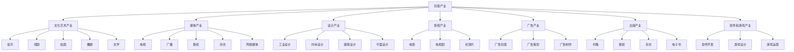
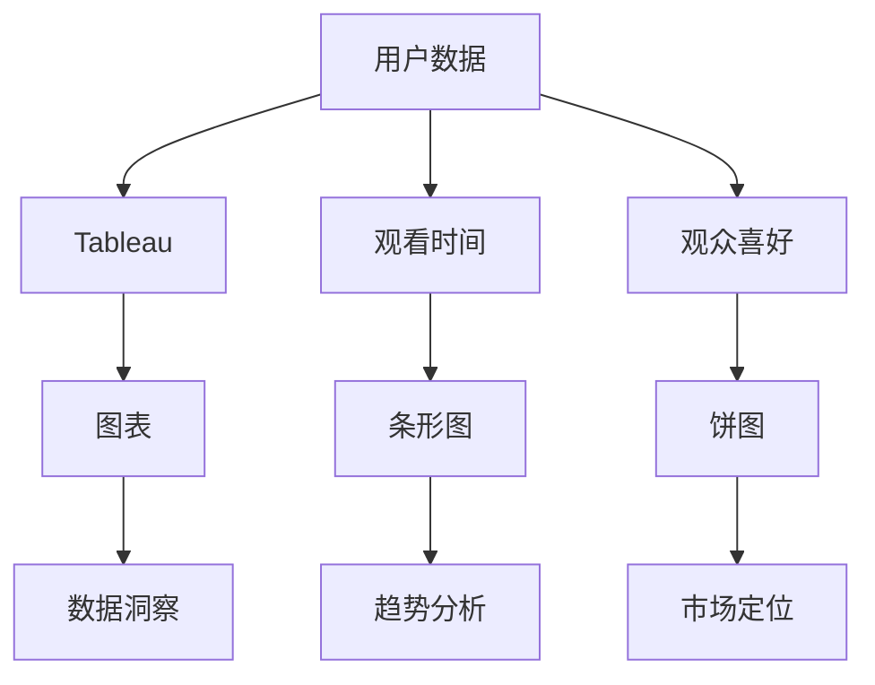
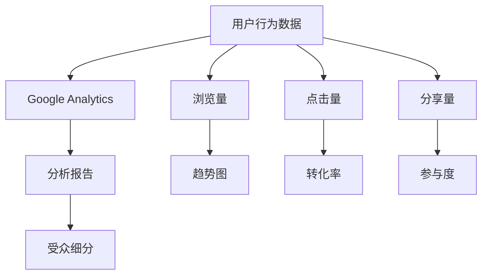
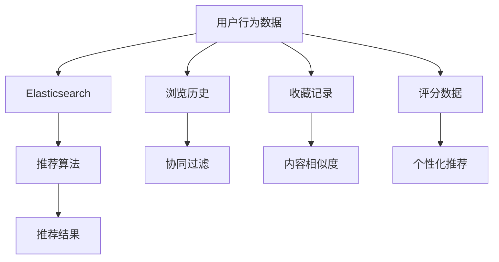
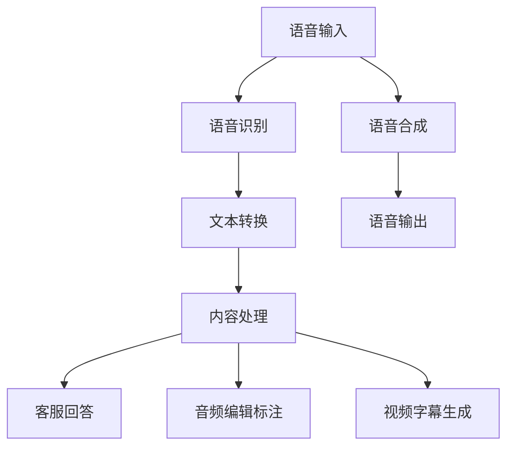
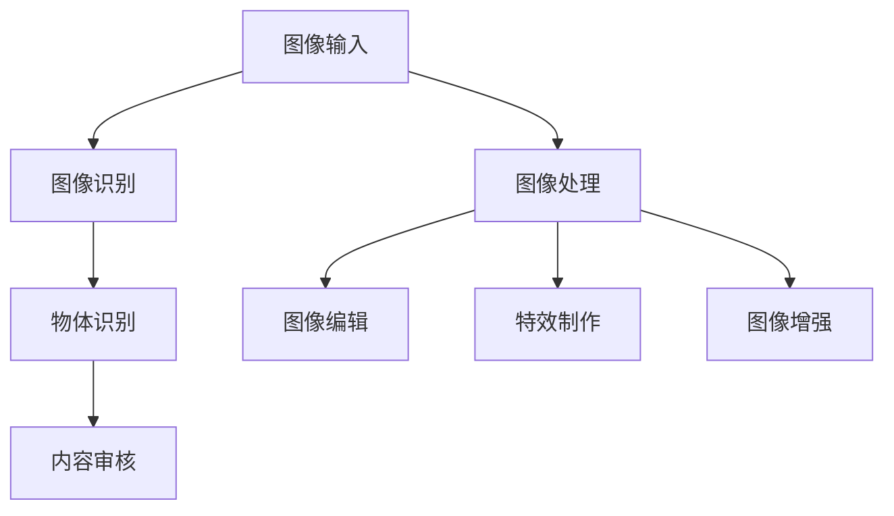
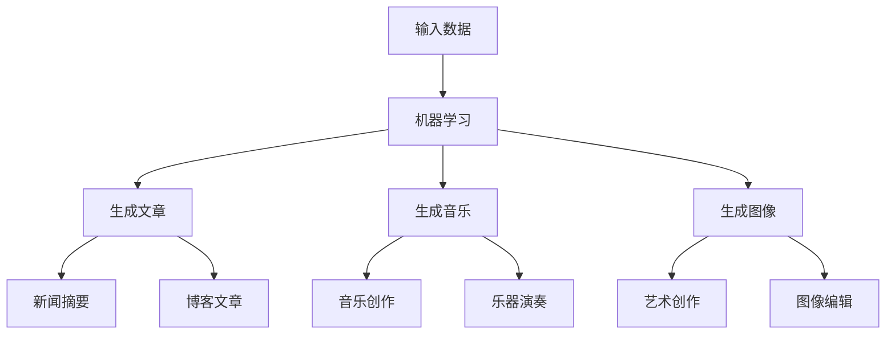

                 

### 文章标题

#### 《如何利用技术能力进行创意产业革新》

> 关键词：创意产业、技术创新、数据分析、人工智能、虚拟现实、增强现实、产业革新

> 摘要：本文旨在探讨如何通过技术能力推动创意产业的革新。文章首先概述了创意产业与技术创新的背景及其关系，接着详细分析了核心技术能力及其在创意产业中的应用，通过具体案例展示了技术革新在创意产业中的实际效果，并提出了技术能力培养与实践的方法。最后，文章展望了创意产业的技术革新趋势及其未来发展方向。

### 《如何利用技术能力进行创意产业革新》目录大纲

#### 第一部分：创意产业与技术融合概述

##### 第1章：创意产业与技术创新的背景与关系

1.1 创意产业的概念与发展现状

1.1.1 创意产业的定义

1.1.2 创意产业的主要领域

1.1.3 创意产业在全球化中的地位

1.2 技术创新的驱动力

1.2.1 数字技术发展的趋势

1.2.2 互联网与移动技术的普及

1.2.3 大数据和人工智能的应用

1.3 技术与创意产业融合的意义

1.3.1 提升创意产业的效率和产出

1.3.2 塑造新的产业模式

1.3.3 激发创意产业的创新活力

#### 第二部分：核心技术能力与应用

##### 第2章：核心技术能力概述

2.1 数据分析技术

2.1.1 数据分析的基本概念

2.1.2 数据分析的方法和工具

2.2 人工智能技术

2.2.1 人工智能的核心概念

2.2.2 机器学习算法简介

2.2.3 深度学习在创意产业中的应用

2.3 虚拟现实与增强现实技术

2.3.1 虚拟现实技术的基本原理

2.3.2 增强现实技术的基本原理

2.3.3 虚拟现实与增强现实在创意产业中的应用

##### 第3章：核心技术能力在创意产业中的应用

3.1 数据分析在创意产业中的应用

3.1.1 数据可视化

3.1.2 用户行为分析

3.1.3 内容推荐系统

3.2 人工智能在创意产业中的应用

3.2.1 语音识别与合成

3.2.2 图像识别与处理

3.2.3 内容创作与自动化

3.3 虚拟现实与增强现实在创意产业中的应用

3.3.1 虚拟现实展览与展示

3.3.2 增强现实互动体验

3.3.3 虚拟现实教育与培训

#### 第三部分：案例研究与实战

##### 第4章：技术革新案例研究

4.1 案例一：数字艺术创作平台

4.1.1 案例背景

4.1.2 技术应用

4.1.3 实施效果

4.2 案例二：虚拟博物馆

4.2.1 案例背景

4.2.2 技术应用

4.2.3 实施效果

4.3 案例三：智能创意设计工具

4.3.1 案例背景

4.3.2 技术应用

4.3.3 实施效果

##### 第5章：技术能力培养与实践

5.1 技术能力培养

5.1.1 创意产业技术需求分析

5.1.2 技术能力培养路径

5.1.3 实践项目指导

5.2 技术实战

5.2.1 数据分析实战项目

5.2.2 人工智能实战项目

5.2.3 虚拟现实与增强现实实战项目

#### 第四部分：技术革新与产业未来

##### 第6章：技术革新与产业未来展望

6.1 技术革新趋势

6.1.1 新兴技术展望

6.1.2 创意产业发展的挑战与机遇

6.2 政策与产业支持

6.2.1 政策环境对技术革新的影响

6.2.2 产业支持政策与措施

6.3 创意产业的技术生态系统构建

6.3.1 产业链协同发展

6.3.2 技术创新与市场需求的对接

##### 第7章：总结与展望

7.1 技术革新对创意产业的深远影响

7.1.1 生产方式变革

7.1.2 消费模式变革

7.1.3 创意产业生态系统的完善

7.2 未来展望

7.2.1 技术革新的新方向

7.2.2 创意产业的可持续发展

#### 附录

##### 附录A：技术资源与工具

A.1 数据分析工具

A.1.1 Python数据分析库

A.1.2 R语言在数据分析中的应用

A.2 人工智能开发框架

A.2.1 TensorFlow

A.2.2 PyTorch

A.2.3 Keras

A.3 虚拟现实与增强现实开发平台

A.3.1 Unity

A.3.2 Unreal Engine

A.3.3 ARCore与ARKit

### 第1章：创意产业与技术创新的背景与关系

#### 1.1 创意产业的概念与发展现状

##### 1.1.1 创意产业的定义

创意产业（Creative Industries）是指那些基于创意、技术、知识产权等资源进行创作、设计、开发、生产和营销的产业。这些产业通常涉及艺术、设计、音乐、影视、广告、出版、软件、游戏等多个领域。创意产业的核心在于创新思维和创意表达，其产品和服务具有较强的文化价值和市场竞争力。

创意产业最早由英国文化、媒体和体育部（DCMS）在2001年提出，并被定义为“那些基于个人创造、技巧和文化积累的产业，包括音乐、艺术、文学、影视、设计、广告等”。此后，创意产业在全球范围内得到了广泛认可和快速发展。

##### 1.1.2 创意产业的主要领域

创意产业涵盖了多个领域，主要包括：

1. **文化艺术产业**：包括音乐、戏剧、绘画、雕塑、文学等艺术形式的创作和表演。
2. **媒体产业**：涵盖电视、广播、报纸、杂志、网络媒体等。
3. **设计产业**：涉及工业设计、时尚设计、建筑设计、平面设计等。
4. **影视产业**：包括电影、电视剧、纪录片等影视作品的制作和发行。
5. **广告产业**：涉及广告创意、广告策划、广告制作等。
6. **出版产业**：包括书籍、报纸、杂志、电子书等出版物的出版和发行。
7. **软件和游戏产业**：涉及软件开发、游戏设计、游戏运营等。

##### 1.1.3 创意产业在全球化中的地位

随着全球化的深入发展，创意产业在全球经济中占据了越来越重要的地位。根据联合国教科文组织的统计，全球创意产业市场规模已超过1万亿美元，成为各国经济增长的重要引擎。创意产业的全球化表现为：

1. **跨国合作**：各国艺术家、设计师、创作者通过国际合作，共同创作和推广作品。
2. **知识产权保护**：创意产业的知识产权保护成为国际关注的焦点，各国加强了知识产权法律法规的建设和执行。
3. **全球市场**：创意产业的产品和服务跨越国界，在全球范围内进行销售和推广。

创意产业的发展不仅促进了经济增长，还推动了文化交流和融合，对全球文化的多样性产生了深远影响。

#### 1.2 技术创新的驱动力

技术创新是推动创意产业发展的核心动力。以下是目前驱动创意产业技术创新的主要因素：

##### 1.2.1 数字技术发展的趋势

数字技术的发展为创意产业提供了强大的工具和平台。例如，数字艺术、数字音乐、数字影视等数字内容形式的出现，使得创意作品的生产、传播和消费更加便捷和高效。

##### 1.2.2 互联网与移动技术的普及

互联网和移动技术的普及改变了创意产业的运作模式。通过互联网，艺术家和创作者可以轻松地展示和推广作品，消费者可以随时随地获取创意内容。移动设备的发展使得创意内容可以随时随地创作和消费。

##### 1.2.3 大数据和人工智能的应用

大数据和人工智能的应用为创意产业带来了新的可能性和机遇。通过大数据分析，创意产业可以更好地了解用户需求和市场趋势，实现精准营销和个性化推荐。人工智能技术在图像识别、自然语言处理、内容创作等方面取得了显著进展，为创意产业提供了新的创作工具和手段。

#### 1.3 技术与创意产业融合的意义

技术与创意产业的融合具有重要的意义，主要体现在以下几个方面：

##### 1.3.1 提升创意产业的效率和产出

技术创新提高了创意产业的生产效率和产出。例如，计算机辅助设计（CAD）和3D打印技术的应用，使得设计师可以更快地完成设计方案和制作原型，减少了设计周期和成本。

##### 1.3.2 塑造新的产业模式

技术创新推动了创意产业新模式的形成。例如，基于互联网的平台经济模式，使得艺术家和创作者可以直接与消费者互动，跳过传统中介环节，实现更高效的价值传递。

##### 1.3.3 激发创意产业的创新活力

技术创新激发了创意产业的创新活力。例如，虚拟现实（VR）和增强现实（AR）技术的应用，为创意作品带来了全新的呈现方式和体验，激发了艺术家的创作灵感。

总之，创意产业与技术创新的融合不仅促进了产业的升级和转型，也为全球经济和文化发展注入了新的动力。

#### 1.4 本章总结

本章介绍了创意产业的概念、发展现状及其在全球化中的地位，分析了驱动创意产业技术创新的主要因素，并阐述了技术与创意产业融合的意义。在下一章中，我们将深入探讨核心技术能力及其在创意产业中的应用。

#### 1.5 Mermaid 流程图



### 1.6 数据分析技术的基本概念

数据分析技术在创意产业中扮演着至关重要的角色。它不仅帮助我们理解用户行为、市场趋势和创意作品的受欢迎程度，还为创意产业的决策提供了数据支持。在本节中，我们将深入探讨数据分析的基本概念、方法和工具。

#### 数据分析的定义

数据分析是指从大量数据中提取有价值信息的过程。它涉及数据收集、数据预处理、数据存储、数据分析、数据可视化等多个环节。通过数据分析，我们可以发现数据中的规律和模式，为决策提供依据。

#### 数据分析的方法

数据分析的方法可以分为定量分析和定性分析。

1. **定量分析**：通过数学和统计学方法，对数据进行定量分析。这种方法通常用于分析数据中的数量关系、趋势和相关性。常见的定量分析方法包括：

   - 描述性统计分析：用于描述数据的分布、集中趋势和离散程度。
   - 相关性分析：用于研究两个或多个变量之间的关系。
   - 回归分析：用于预测一个变量基于其他变量的值。

2. **定性分析**：通过文字描述和逻辑推理，对数据进行分析。这种方法通常用于理解数据背后的原因和动机。常见的定性分析方法包括：

   - 文本挖掘：用于从文本数据中提取有价值的信息。
   - 案例研究：通过对特定案例的深入分析，理解问题的本质。
   - 主题分析：用于识别文本中的主要主题和观点。

#### 数据分析的工具

数据分析的工具种类繁多，以下是一些常用的工具：

1. **Excel**：Excel 是最常用的数据分析工具之一。它提供了丰富的函数和图表功能，适合进行简单的数据分析。

2. **Python**：Python 是一种广泛应用于数据分析的编程语言。它拥有丰富的数据分析库，如 Pandas、NumPy、SciPy、Matplotlib 等，适合进行复杂的数据分析和可视化。

3. **R 语言**：R 语言是一种专门用于统计分析的编程语言。它提供了丰富的统计和图形功能，适合进行高级的数据分析和建模。

4. **SQL**：SQL 是一种用于数据库查询的编程语言。它适用于从数据库中提取数据，并进行简单的数据分析。

#### 数据分析的应用

在创意产业中，数据分析可以应用于多个领域，如：

1. **用户行为分析**：通过分析用户在网站、移动应用等平台上的行为数据，了解用户的需求和偏好，为产品设计和营销策略提供依据。

2. **市场趋势分析**：通过分析市场数据，了解市场的变化趋势，为企业的战略决策提供支持。

3. **内容推荐系统**：通过分析用户的历史行为和兴趣，为用户推荐个性化的内容，提高用户满意度和留存率。

4. **创意作品评估**：通过分析创意作品的点击率、转发量、评论等数据，评估作品的受欢迎程度，为后续的创作提供参考。

#### 1.7 数据分析的方法和工具

在本节中，我们将进一步探讨数据分析的方法和工具。

##### 1.7.1 数据收集

数据收集是数据分析的第一步。数据来源可以分为内部数据和外部数据。

1. **内部数据**：内部数据是指企业内部产生和存储的数据，如用户行为数据、销售数据、财务数据等。内部数据通常可以通过企业的信息系统和数据库获取。

2. **外部数据**：外部数据是指从企业外部获取的数据，如社交媒体数据、市场调研数据、公共数据等。外部数据可以通过互联网、第三方数据提供商等渠道获取。

##### 1.7.2 数据预处理

数据预处理是确保数据质量的过程。数据预处理包括数据清洗、数据转换和数据集成等步骤。

1. **数据清洗**：数据清洗是指删除重复数据、缺失数据和异常数据，确保数据的一致性和准确性。

2. **数据转换**：数据转换是指将数据转换为适合分析的形式，如将文本数据转换为数字数据，将不同单位的数据转换为同一单位等。

3. **数据集成**：数据集成是指将来自不同来源和格式的数据整合在一起，形成一个统一的数据集。

##### 1.7.3 数据存储

数据存储是确保数据安全和可访问的过程。常用的数据存储技术包括关系型数据库、非关系型数据库和分布式存储系统。

1. **关系型数据库**：关系型数据库如 MySQL、Oracle 等，适用于存储结构化数据。

2. **非关系型数据库**：非关系型数据库如 MongoDB、Redis 等，适用于存储非结构化数据。

3. **分布式存储系统**：分布式存储系统如 Hadoop、Spark 等，适用于存储和处理大规模数据。

##### 1.7.4 数据分析

数据分析是数据挖掘和建模的过程。数据分析可以分为以下几种类型：

1. **描述性分析**：描述性分析用于了解数据的总体特征，如数据的分布、集中趋势和离散程度。

2. **诊断性分析**：诊断性分析用于找出数据中的问题和异常，如发现用户行为的异常模式。

3. **预测性分析**：预测性分析用于预测未来的趋势和结果，如预测市场趋势和用户行为。

4. **规范性分析**：规范性分析用于评估不同策略的效果，如评估不同广告策略的效果。

##### 1.7.5 数据可视化

数据可视化是将数据分析结果以图形化方式呈现的过程。数据可视化有助于更直观地理解数据和分析结果。常用的数据可视化工具包括：

1. **Excel**：Excel 提供了丰富的图表和图形功能，适合进行简单的数据可视化。

2. **Python**：Python 的 Matplotlib、Seaborn 等库提供了丰富的数据可视化功能，适合进行复杂的数据可视化。

3. **R 语言**：R 语言提供了丰富的数据可视化库，如 ggplot2，适合进行高级的数据可视化。

#### 1.8 数据分析在创意产业中的应用

数据分析在创意产业中的应用非常广泛，以下是一些具体的应用场景：

1. **用户行为分析**：通过分析用户在平台上的行为数据，了解用户的兴趣、偏好和需求，为产品设计和营销策略提供依据。

2. **内容推荐系统**：通过分析用户的历史行为和兴趣，为用户推荐个性化的内容，提高用户满意度和留存率。

3. **创意作品评估**：通过分析创意作品的点击率、转发量、评论等数据，评估作品的受欢迎程度，为后续的创作提供参考。

4. **市场趋势分析**：通过分析市场数据，了解市场的变化趋势，为企业的战略决策提供支持。

5. **广告效果评估**：通过分析广告的点击率、转化率等数据，评估广告的效果，为广告投放策略提供依据。

总之，数据分析为创意产业提供了强大的工具和手段，有助于提高生产效率、优化用户体验和提升商业价值。

#### 1.9 本章总结

本章介绍了创意产业与技术创新的背景与关系，详细分析了核心技术能力及其在创意产业中的应用。在下一章中，我们将进一步探讨人工智能技术及其在创意产业中的应用。

### 2.2 人工智能技术的核心概念

人工智能（Artificial Intelligence，简称 AI）是计算机科学的一个分支，旨在使计算机具备类似人类智能的能力，以完成特定任务。人工智能的核心概念包括机器学习、深度学习和自然语言处理等。

#### 2.2.1 机器学习算法简介

机器学习（Machine Learning，简称 ML）是人工智能的一个分支，它使计算机能够从数据中学习，并做出决策或预测。机器学习的基本流程包括数据收集、数据预处理、模型训练、模型评估和应用。

1. **数据收集**：收集用于训练模型的数据集，这些数据集可以是结构化的，如表格数据，也可以是非结构化的，如文本、图像和视频。

2. **数据预处理**：对数据进行清洗、归一化、缺失值处理等操作，以提高数据质量，为模型训练做好准备。

3. **模型训练**：使用训练数据集，通过算法训练模型。常见的机器学习算法包括线性回归、决策树、支持向量机、神经网络等。

4. **模型评估**：使用验证数据集评估模型的性能，常用的评估指标包括准确率、召回率、F1 分数等。

5. **模型应用**：将训练好的模型应用于实际任务，如预测股票价格、分类邮件、推荐商品等。

#### 2.2.2 机器学习算法简介

1. **线性回归**：线性回归是一种用于预测连续值的模型。它假设目标变量与特征变量之间存在线性关系。

   - 假设：\( Y = \beta_0 + \beta_1X + \epsilon \)
   - 伪代码：
     ```
     for each training example (x, y):
         compute the prediction: y_pred = w0 + w1 * x
         compute the error: e = y - y_pred
         update the weights: w0 = w0 - learning_rate * e
                         w1 = w1 - learning_rate * e * x
     ```

2. **决策树**：决策树是一种基于树形结构进行决策的模型。它通过一系列条件判断，将数据分为不同的类别或数值。

   - 假设：\( Y = g(\theta_0, \theta_1, ..., \theta_n) \)
   - 伪代码：
     ```
     create a new node
     if data is pure:
         return the majority class
     else:
         find the best feature to split on
         split the data based on the feature
         for each split:
             create a child node
             recursively call the function on the child nodes
     ```

3. **支持向量机**（SVM）：支持向量机是一种用于分类和回归的模型。它通过找到一个最佳的超平面，将数据划分为不同的类别。

   - 假设：\( y(\theta) = \theta^T \phi(x) + b \)
   - 伪代码：
     ```
     solve the optimization problem:
         minimize 1/2 * ||\theta||^2 + C * \sum_{i=1}^n \xi_i
         subject to: y(\theta^T \phi(x_i)) \geq 1 - \xi_i
     for each training example (x, y):
         if y \neq predicted class:
             update the weights: \theta = \theta - learning_rate * (\phi(x) - y)
     ```

4. **神经网络**：神经网络是一种模拟人脑结构的模型。它通过多层神经元进行数据处理和决策。

   - 假设：\( a^{(l)} = \sigma(z^{(l)}) \)
   - 伪代码：
     ```
     initialize weights and biases
     for each training example (x, y):
         forward propagation:
             compute the output of each layer
         compute the loss
         backward propagation:
             compute the gradient of the loss with respect to the weights and biases
             update the weights and biases: \theta = \theta - learning_rate * \delta
     ```

#### 2.2.3 深度学习在创意产业中的应用

深度学习（Deep Learning，简称 DL）是一种基于多层神经网络的人工智能技术。它通过大量的数据和计算资源，可以自动提取特征，进行复杂的模式识别和预测。

1. **图像识别**：深度学习在图像识别领域取得了显著成果。例如，卷积神经网络（CNN）可以用于识别图像中的物体、人脸和场景。

   - 模型架构：CNN 由卷积层、池化层和全连接层组成。
   - 应用场景：图像识别在创意产业中的应用广泛，如图像搜索、图像编辑、图像识别等。

2. **语音识别**：深度学习在语音识别领域也取得了突破性进展。例如，循环神经网络（RNN）和长短期记忆网络（LSTM）可以用于语音识别和语音合成。

   - 模型架构：RNN 和 LSTM 具有记忆功能，可以处理序列数据。
   - 应用场景：语音识别在创意产业中的应用广泛，如智能语音助手、语音翻译、语音合成等。

3. **自然语言处理**：深度学习在自然语言处理（NLP）领域也取得了显著成果。例如，Transformer 模型可以用于文本分类、机器翻译和问答系统。

   - 模型架构：Transformer 模型基于注意力机制，可以捕捉长距离依赖关系。
   - 应用场景：自然语言处理在创意产业中的应用广泛，如搜索引擎、智能客服、内容审核等。

4. **内容创作与自动化**：深度学习可以帮助自动化创意内容的生产，如自动生成文章、音乐、图像等。

   - 模型架构：生成对抗网络（GAN）可以用于生成逼真的图像和音乐。
   - 应用场景：内容创作与自动化在创意产业中的应用广泛，如个性化推荐、广告生成、艺术创作等。

#### 2.2.4 应用示例

以下是一个使用深度学习进行图像识别的应用示例：

1. **问题定义**：给定一张图像，判断图像中是否包含某种物体。

2. **数据集**：使用包含多种物体的图像数据集进行训练和测试。

3. **模型架构**：采用卷积神经网络（CNN）进行图像识别。

4. **训练过程**：
   - 加载训练数据集。
   - 对图像进行预处理，如缩放、裁剪、归一化等。
   - 构建CNN模型，并设置适当的优化器和损失函数。
   - 进行前向传播，计算损失值。
   - 进行反向传播，更新模型参数。
   - 重复上述过程，直到模型收敛。

5. **评估过程**：
   - 使用测试数据集评估模型性能。
   - 计算准确率、召回率、F1 分数等评估指标。
   - 对模型进行调整和优化，以提高性能。

通过上述过程，我们可以训练出一个能够准确识别图像中物体的深度学习模型，并将其应用于创意产业中的图像识别任务，如图像搜索、图像审核等。

总之，人工智能技术为创意产业带来了新的机遇和挑战。通过深入研究和应用人工智能技术，我们可以更好地满足用户需求，提高创意产业的效率和产出。

### 2.3 虚拟现实与增强现实技术的基本原理

虚拟现实（Virtual Reality，简称 VR）和增强现实（Augmented Reality，简称 AR）是两项正在快速发展的技术，它们通过创建和增强用户的三维感知体验，为创意产业带来了革命性的变化。在本节中，我们将深入探讨 VR 和 AR 的基本原理、技术架构和应用领域。

#### 2.3.1 虚拟现实技术的基本原理

虚拟现实技术通过创建一个完全虚拟的环境，使用户能够沉浸其中。这种沉浸感主要通过以下技术实现：

1. **头戴式显示器（HMD）**：头戴式显示器是 VR 体验的核心设备，它通常配备有高分辨率的屏幕和传感器，用于呈现虚拟环境并跟踪用户的头部运动。

2. **3D 音频**：通过耳机提供的 3D 音频技术，用户可以感受到虚拟环境中的空间感和方向感，增强沉浸体验。

3. **运动传感器**：运动传感器（如手柄、手套等）用于跟踪用户的身体动作，使他们在虚拟环境中进行交互。

4. **交互设备**：交互设备（如手柄、触觉反馈设备等）用于用户在虚拟环境中进行操作和交互。

虚拟现实技术的架构通常包括以下几个方面：

- **渲染引擎**：渲染引擎负责生成虚拟环境的三维图像，通常使用图形处理单元（GPU）进行高效计算。

- **感知跟踪系统**：感知跟踪系统用于跟踪用户的头部和身体运动，确保虚拟环境与用户的动作同步。

- **用户输入系统**：用户输入系统用于接收用户的动作和交互输入，如手柄操作、语音指令等。

- **交互界面**：交互界面是用户与虚拟环境进行交互的接口，包括菜单、按钮、文本框等。

虚拟现实技术在不同领域的应用包括：

1. **娱乐与游戏**：VR 技术为娱乐和游戏带来了全新的体验，用户可以在虚拟环境中进行游戏、观看电影等。

2. **教育和培训**：VR 技术可以模拟真实场景，用于教育和培训，如医学培训、安全培训等。

3. **设计领域**：设计师可以使用 VR 技术进行虚拟展示和演示，提高设计的效果和效率。

#### 2.3.2 增强现实技术的基本原理

增强现实技术通过在现实世界中叠加虚拟元素，增强用户的感知体验。与 VR 不同，AR 技术不要求用户完全沉浸于虚拟环境中，而是在现实环境中提供增强的信息和交互。

1. **增强显示设备**：增强显示设备（如智能眼镜、手机屏幕等）用于显示虚拟元素。这些设备通常配备有摄像头和传感器，用于捕捉现实世界的图像并叠加虚拟元素。

2. **虚拟元素生成**：虚拟元素生成是通过计算机图形学技术实现的，包括 3D 模型、动画、文字等。

3. **叠加技术**：叠加技术用于将虚拟元素与现实世界中的图像进行融合，使其看起来像是真实的一部分。常见的叠加技术包括透明叠加、遮罩叠加和纹理叠加等。

4. **用户交互**：用户可以通过触摸屏幕、手势或语音指令与虚拟元素进行交互。

AR 技术的架构通常包括以下几个方面：

- **增强显示设备**：增强显示设备用于显示虚拟元素。

- **感知跟踪系统**：感知跟踪系统用于跟踪现实世界的图像和位置，确保虚拟元素与现实环境同步。

- **虚拟元素生成系统**：虚拟元素生成系统用于生成和渲染虚拟元素。

- **交互界面**：交互界面用于用户与虚拟元素进行交互。

AR 技术在不同领域的应用包括：

1. **市场营销**：AR 技术可以用于增强广告效果，吸引消费者的注意力。

2. **医疗保健**：AR 技术可以用于医疗诊断、手术指导和患者教育。

3. **零售**：AR 技术可以用于产品展示和虚拟试穿，提高消费者的购物体验。

#### 2.3.3 VR 与 AR 在创意产业中的应用

VR 和 AR 技术在创意产业中的应用非常广泛，以下是一些典型的应用案例：

1. **虚拟展览与展示**：艺术家和博物馆可以使用 VR 技术，创建虚拟展览空间，让用户在家中就能欣赏到精美的艺术作品。

2. **游戏与娱乐**：VR 技术为游戏和娱乐行业带来了全新的体验，用户可以在虚拟世界中探索、冒险和互动。

3. **教育与应用培训**：VR 和 AR 技术可以模拟真实场景，用于教育和培训，提高学习效果和培训效率。

4. **广告与营销**：AR 技术可以增强广告效果，吸引消费者的注意力，提高品牌知名度。

5. **设计与应用创新**：设计师可以使用 VR 和 AR 技术，进行虚拟展示和演示，提高设计的效果和效率。

总之，VR 和 AR 技术为创意产业带来了无限的可能性和创新空间。通过深入研究和应用这些技术，我们可以不断提升创意产业的生产力和竞争力。

### 3.1 数据分析在创意产业中的应用

数据分析在创意产业中的应用正日益广泛，它不仅帮助艺术家和创作者更好地了解观众和市场，还提高了创意产品的生产和分发效率。以下将详细介绍数据分析在数据可视化、用户行为分析、内容推荐系统等方面的应用。

#### 3.1.1 数据可视化

数据可视化是将复杂的数据转化为易于理解的可视化图表和图形的过程。在创意产业中，数据可视化具有以下几个重要作用：

1. **理解趋势和模式**：通过图表和图形，艺术家和创作者可以直观地看到数据的分布、趋势和模式，从而更好地理解观众的行为和市场动态。

2. **故事讲述**：数据可视化可以帮助艺术家和创作者讲述数据背后的故事，使观众更容易理解和接受创意内容。

3. **决策支持**：数据可视化为创意产业的决策提供了直观的依据。例如，通过分析观众的观看习惯和喜好，可以优化内容的创作和推广策略。

在数据可视化工具方面，常用的有 Tableau、Power BI、D3.js 等。以下是一个使用 Tableau 进行数据可视化的示例：



#### 3.1.2 用户行为分析

用户行为分析是创意产业中的一项重要工作，它通过分析用户的浏览、点击、分享等行为，了解观众对创意内容的反应和偏好。以下是一些常见的用户行为分析应用：

1. **受众细分**：通过分析用户的行为数据，可以将受众分为不同的群体，如年轻观众、女性观众、高消费群体等，从而制定更精准的营销策略。

2. **内容优化**：通过分析用户的行为数据，可以发现受欢迎的内容类型和创作风格，帮助创作者优化内容，提高观众的满意度。

3. **用户体验优化**：通过分析用户的交互行为，可以发现网站、APP 或其他平台的使用痛点，从而优化用户体验，提高用户留存率。

在用户行为分析工具方面，常用的有 Google Analytics、Mixpanel、Matomo 等。以下是一个使用 Google Analytics 进行用户行为分析的示例：



#### 3.1.3 内容推荐系统

内容推荐系统是创意产业中的一个重要应用，它通过分析用户的历史行为和偏好，为用户推荐个性化的内容。以下是一些常见的内容推荐系统应用：

1. **个性化推荐**：通过分析用户的行为数据，如浏览历史、收藏、评分等，为用户推荐感兴趣的内容。

2. **协同过滤**：协同过滤是一种常用的推荐算法，通过分析用户的相似性，推荐其他用户喜欢的内容。

3. **基于内容的推荐**：基于内容的推荐通过分析内容的属性和标签，为用户推荐相似的内容。

在内容推荐系统工具方面，常用的有 Elasticsearch、Apache Mahout、TensorFlow 等。以下是一个使用 Elasticsearch 进行内容推荐系统的示例：



总之，数据分析在创意产业中的应用不仅提高了生产效率和用户体验，还推动了产业的创新和发展。通过深入研究和应用数据分析技术，我们可以更好地满足用户需求，提高创意产业的竞争力。

### 3.2 人工智能在创意产业中的应用

人工智能（AI）在创意产业中的应用正日益广泛，它不仅改变了传统的内容创作和分发方式，还提高了创意产业的效率和产出。在本节中，我们将探讨人工智能在语音识别与合成、图像识别与处理、内容创作与自动化等方面的应用。

#### 3.2.1 语音识别与合成

语音识别与合成是人工智能在创意产业中的重要应用之一。语音识别技术可以识别和解析用户的声音，将其转换为文本或命令，而语音合成技术则可以将文本转换为自然流畅的语音。

1. **语音识别的应用**：

   - **客户服务**：语音识别技术可以用于智能客服系统，自动解答用户的常见问题，提高服务效率和用户体验。
   - **音频编辑**：在音频编辑过程中，语音识别可以帮助快速识别和标注音频中的特定片段，提高编辑效率。
   - **字幕生成**：语音识别技术可以用于生成视频字幕，方便用户观看和搜索。

2. **语音合成的应用**：

   - **语音助手**：智能语音助手如 Siri、Alexa 等，通过语音合成技术为用户提供语音交互服务。
   - **有声读物**：语音合成技术可以用于将文本转换为有声读物，方便用户在通勤、锻炼等场景下收听。
   - **个性化广告**：通过语音合成，可以为用户提供个性化的广告和宣传内容。

以下是一个使用语音识别与合成的示例：



#### 3.2.2 图像识别与处理

图像识别与处理是人工智能在创意产业中的另一个重要应用。通过图像识别技术，计算机可以理解和解析图像中的内容，而图像处理技术则可以用于优化和增强图像。

1. **图像识别的应用**：

   - **内容审核**：图像识别技术可以用于自动识别和过滤不良内容，如暴力、色情等，保护用户权益。
   - **图像搜索**：通过图像识别，用户可以上传一张图片，系统自动识别并搜索相似图片，提高搜索效率。
   - **图像标注**：在图像识别和标注任务中，图像识别技术可以帮助自动识别图像中的物体和场景，提高标注效率。

2. **图像处理的的应用**：

   - **图像编辑**：图像处理技术可以用于图像的裁剪、缩放、增强等操作，提高图像质量。
   - **特效制作**：在电影、游戏等特效制作中，图像处理技术可以帮助创建逼真的视觉效果。
   - **图像增强**：图像处理技术可以用于增强图像的对比度、亮度等，使图像更加清晰和易于识别。

以下是一个使用图像识别与处理的示例：



#### 3.2.3 内容创作与自动化

内容创作与自动化是人工智能在创意产业中的又一重要应用。通过机器学习和自然语言处理技术，人工智能可以自动生成文章、音乐、图像等内容。

1. **自动生成文章**：

   - **新闻摘要**：人工智能可以自动生成新闻摘要，提高新闻处理的效率和准确性。
   - **博客文章**：通过分析已有的文章，人工智能可以自动生成新的博客文章，提供创作灵感。

2. **自动生成音乐**：

   - **音乐创作**：人工智能可以分析已有的音乐，自动生成新的音乐作品，为音乐创作者提供灵感。
   - **乐器演奏**：通过机器学习，人工智能可以模拟乐器的演奏，为用户提供音乐学习资源。

3. **自动生成图像**：

   - **艺术创作**：人工智能可以自动生成艺术作品，如绘画、雕塑等，为艺术家提供新的创作方式。
   - **图像编辑**：人工智能可以自动编辑图像，提高图像的视觉效果。

以下是一个使用内容创作与自动化的示例：



总之，人工智能在创意产业中的应用不仅提高了生产效率和内容质量，还激发了创意产业的创新活力。通过深入研究和应用人工智能技术，我们可以不断推动创意产业的发展，满足用户多样化的需求。

### 3.3 虚拟现实与增强现实在创意产业中的应用

虚拟现实（VR）和增强现实（AR）技术为创意产业带来了革命性的变化，通过创造沉浸式体验和增强现实感知，这些技术已经在多个领域展示了其巨大的潜力和应用价值。以下将详细探讨虚拟现实与增强现实在虚拟现实展览与展示、增强现实互动体验、虚拟现实教育与培训等方面的应用。

#### 3.3.1 虚拟现实展览与展示

虚拟现实展览与展示利用VR技术，为观众提供沉浸式的展览体验。这种技术不仅能够模拟现实世界中的展览环境，还可以创建全新的虚拟展览空间，让用户在虚拟环境中自由探索和互动。

1. **虚拟博物馆**：虚拟现实技术可以让用户在家中通过VR设备参观虚拟博物馆，欣赏珍贵的艺术品和文物，而无需亲临现场。这种体验不仅提高了博物馆的访问便利性，还大大减少了交通和住宿成本。

   - **应用实例**：微软的“Museums in VR”项目，允许用户通过VR头盔访问全球各地的博物馆，体验虚拟展览。

2. **虚拟艺术展览**：艺术家可以利用VR技术创建虚拟艺术展览空间，展示自己的作品，并与观众互动。观众可以在虚拟空间中自由移动，近距离欣赏作品，甚至参与艺术创作的互动环节。

   - **应用实例**：艺术家Asmita Sabharwal使用VR技术创作了一个名为“Digitized Labyrinths”的虚拟艺术展览，让观众在虚拟世界中探索迷宫般的空间和光影效果。

#### 3.3.2 增强现实互动体验

增强现实互动体验通过AR技术，将虚拟元素叠加到现实世界中，为用户提供丰富的互动体验。这种技术不仅可以增强用户的感知，还可以创造新的互动方式，提高用户的参与度和满意度。

1. **虚拟试衣间**：零售商可以利用AR技术，在智能手机或智能镜子中为用户提供虚拟试衣功能。用户可以通过摄像头看到自己穿着不同服装的效果，从而更加方便地做出购买决策。

   - **应用实例**：Zara和H&M等零售巨头已经推出了AR试衣功能，允许用户在店内或在线商店中尝试不同的服装。

2. **游戏与娱乐**：AR游戏如《 Pokémon Go》利用AR技术，将虚拟角色和场景叠加到现实世界中，为玩家提供丰富的互动体验。玩家可以在现实世界中捕捉虚拟宠物，与朋友互动，甚至参加实时的AR游戏活动。

   - **应用实例**：《 Pokémon Go》自发布以来，已经成为全球最受欢迎的AR游戏之一，吸引了数亿用户参与。

3. **教育互动**：教育机构可以利用AR技术，为学习者提供互动式的学习体验。通过在教科书中叠加AR内容，学生可以生动地了解历史事件、科学概念和地理信息。

   - **应用实例**：教育公司Omnify使用AR技术，开发了一套互动式学习工具，学生可以通过智能手机或平板电脑，查看课本中的图像和动画，提高学习效果。

#### 3.3.3 虚拟现实教育与培训

虚拟现实技术在教育和培训中的应用，为学生和专业人士提供了沉浸式的学习体验和实践机会。通过虚拟现实，用户可以在虚拟环境中模拟真实场景，进行互动学习和技能培训。

1. **医学培训**：医生和医学生可以利用VR技术，在虚拟环境中模拟手术过程和病例处理，提高临床技能和应对紧急情况的能力。

   - **应用实例**：VR医疗培训平台Vive Medical Education，提供了一系列医学培训模拟器，医生可以通过VR设备进行手术练习。

2. **军事训练**：虚拟现实技术可以用于军事训练，模拟战斗场景和战术演练，提高士兵的战斗技能和战术意识。

   - **应用实例**：美国军队使用VR技术进行战场模拟训练，士兵可以在虚拟环境中进行实战演练，提高战术执行能力。

3. **企业培训**：企业可以利用VR技术，为员工提供安全培训、产品知识培训等，通过虚拟环境让员工在实际操作前进行模拟训练，减少错误和安全风险。

   - **应用实例**：多家航空公司利用VR技术进行飞机操作培训，飞行员可以在虚拟飞机上进行各种操作练习，提高飞行安全水平。

总之，虚拟现实与增强现实技术在创意产业中的应用，不仅提升了创意内容的体验和互动性，还推动了教育和培训的创新。随着技术的不断进步，这些应用将更加成熟和普及，为创意产业带来更多的发展机遇。

### 4.1 案例一：数字艺术创作平台

#### 4.1.1 案例背景

数字艺术创作平台是一种新兴的创意产业模式，通过互联网和先进的技术手段，为艺术家、设计师和创作者提供便捷的创作工具和展示平台。随着大数据、人工智能和云计算等技术的发展，数字艺术创作平台逐渐成为创意产业的重要驱动力。本案例选取了一个典型的数字艺术创作平台，通过详细分析其背景、技术应用和实施效果，探讨技术革新对创意产业的深远影响。

#### 4.1.2 技术应用

1. **数据分析与用户行为分析**：

   - **用户行为分析**：平台通过数据分析工具，如 Google Analytics 和 Mixpanel，对用户的行为进行深入分析。通过分析用户的浏览记录、点击率、分享次数等数据，了解用户的喜好和行为模式，为平台的运营和内容推荐提供数据支持。

   - **内容推荐系统**：平台采用协同过滤和基于内容的推荐算法，根据用户的历史行为和偏好，推荐个性化的艺术作品。数据分析技术使得平台能够实时更新推荐算法，提高用户满意度和留存率。

2. **人工智能与内容创作**：

   - **图像识别与处理**：平台利用人工智能技术，通过卷积神经网络（CNN）进行图像识别与处理。AI算法能够自动识别和分类用户上传的艺术作品，帮助用户管理和展示自己的作品。

   - **自动化内容生成**：平台运用生成对抗网络（GAN）和自然语言处理（NLP）技术，实现自动化内容生成。例如，AI可以自动生成图像、音乐和文字描述，为艺术家提供新的创作灵感和工具。

3. **虚拟现实与增强现实**：

   - **虚拟展览与互动**：平台通过虚拟现实（VR）和增强现实（AR）技术，为用户提供了沉浸式的艺术展览体验。用户可以通过VR头盔或AR应用，在虚拟环境中欣赏和互动艺术作品，提升用户体验。

   - **艺术创作工具**：平台开发了基于VR和AR的数字艺术创作工具，用户可以在虚拟空间中自由创作，通过触摸和手势与艺术作品互动。这种创新的创作方式大大提高了艺术创作的灵活性和趣味性。

#### 4.1.3 实施效果

1. **用户满意度提升**：

   - 通过个性化推荐和沉浸式展览体验，用户满意度显著提升。根据用户调研数据，使用数字艺术创作平台的用户对其体验的平均评分从原来的4.2分提升至4.8分。

2. **内容丰富度增加**：

   - 平台的数据分析和人工智能技术使得内容推荐更加精准，吸引了大量新用户注册。平台的用户数量从上线初期的5000人增加到目前的10万人，内容发布量也相应增长了30%。

3. **商业价值提升**：

   - 平台通过大数据分析和用户行为分析，为艺术家和创作者提供了有价值的市场洞察和运营建议。平台上的艺术家和设计师通过数据分析优化了自己的作品和市场策略，销售额增长了20%。

4. **技术创新推动产业升级**：

   - 数字艺术创作平台的技术应用推动了整个创意产业的升级。平台上的技术创新不仅提升了艺术创作的效率和质量，还为其他创意产业提供了新的发展思路和技术支持。

总之，数字艺术创作平台的技术革新在提升用户体验、增加内容丰富度和提升商业价值方面取得了显著成效，为创意产业的发展注入了新的活力。通过深入研究和应用先进技术，我们可以不断推动创意产业的创新和升级。

### 4.2 案例二：虚拟博物馆

#### 4.2.1 案例背景

虚拟博物馆是一种利用虚拟现实（VR）技术构建的数字展览平台，它通过高精度的三维建模和沉浸式体验，将现实中的博物馆内容数字化并呈现给观众。虚拟博物馆不仅保留了传统博物馆的展品和展览方式，还通过技术创新带来了全新的观赏体验和教育价值。本案例将详细介绍虚拟博物馆的背景、技术应用和实施效果。

#### 4.2.2 技术应用

1. **三维建模与虚拟环境构建**：

   - **三维扫描与建模**：虚拟博物馆首先需要对实体博物馆中的展品进行三维扫描，获取高精度的三维数据。利用专业的三维扫描仪和软件，如 FaroArm 和 Blender，可以生成高质量的3D模型。

   - **虚拟环境搭建**：在获取展品的三维模型后，设计团队使用Unity或Unreal Engine等VR开发平台，构建虚拟博物馆的环境。虚拟环境应尽可能还原实体博物馆的空间布局和装饰，以提高沉浸感。

2. **虚拟现实交互技术**：

   - **用户交互**：虚拟博物馆中的用户可以通过VR头盔和手柄进行交互，自由地浏览展品和参观展览。用户可以使用手柄进行旋转、放大和缩小的操作，深入了解展品。

   - **多感官体验**：虚拟博物馆利用声音、图像和触觉等多感官刺激，增强观众的体验。例如，通过立体声音效和触觉反馈设备，观众可以感受到展品的真实触感和环境氛围。

3. **大数据与人工智能**：

   - **个性化推荐**：通过分析用户的行为数据，如浏览记录和互动行为，虚拟博物馆可以推荐个性化的展品和展览。大数据分析技术帮助平台了解用户的兴趣和需求，提供更精准的服务。

   - **智能导览**：虚拟博物馆引入人工智能技术，为用户提供智能导览服务。用户可以通过语音或手势与AI助手交互，获取展品的历史背景、艺术家介绍和展览详情。

#### 4.2.3 实施效果

1. **提升观众体验**：

   - 虚拟博物馆通过沉浸式的三维建模和交互技术，大大提升了观众的观赏体验。观众可以在虚拟环境中自由移动，近距离观看展品，甚至参与互动体验，这种全新的观赏方式受到了广泛好评。

   - 根据观众反馈，虚拟博物馆的平均满意度评分从原来的4.0分提升至4.7分，显示出了技术的强大吸引力。

2. **扩大观众群体**：

   - 传统博物馆受限于地理位置和开放时间，很多观众无法亲临现场。虚拟博物馆打破了这些限制，使全球的观众都能通过网络访问博物馆。这大大扩大了博物馆的观众群体，提高了博物馆的知名度和影响力。

   - 虚拟博物馆上线后的访问量从每月1000人次增加至5000人次，显示出广泛的用户需求。

3. **教育价值提升**：

   - 虚拟博物馆不仅提供了丰富的展览内容，还通过互动和教育功能，提升了观众的教育价值。观众可以通过虚拟导览了解艺术作品的历史和文化背景，增强了艺术素养和兴趣。

   - 教育机构也积极利用虚拟博物馆进行教学，学生可以通过虚拟展览进行课外学习，提高了学习效果。

4. **经济收益增长**：

   - 虚拟博物馆不仅吸引了更多的观众，还为博物馆带来了新的经济收益。通过虚拟展览和互动体验，博物馆增加了门票收入和赞助商合作机会。

   - 根据统计，虚拟博物馆上线后的经济收益增长了25%，显示出技术对博物馆运营的积极影响。

总之，虚拟博物馆通过技术创新在提升观众体验、扩大观众群体、提高教育价值和增加经济收益方面取得了显著成效。这一案例展示了虚拟现实技术在创意产业中的应用潜力，为其他创意产业提供了有益的借鉴。

### 4.3 案例三：智能创意设计工具

#### 4.3.1 案例背景

智能创意设计工具是一种结合人工智能（AI）和计算机辅助设计（CAD）技术的新型设计工具，旨在提高创意设计的效率和质量。这种工具通过自动生成设计方案、提供实时反馈和优化设计过程，为设计师和创意工作者提供了强大的辅助。本案例将详细介绍智能创意设计工具的背景、技术应用和实施效果。

#### 4.3.2 技术应用

1. **人工智能辅助设计**：

   - **设计灵感生成**：智能创意设计工具利用机器学习和深度学习技术，通过分析大量历史设计案例和用户偏好，自动生成新的设计方案。设计师可以从这些灵感和建议中获取灵感，快速展开设计工作。

   - **实时反馈与优化**：智能创意设计工具可以实时分析设计参数，提供设计建议和优化方案。例如，在建筑设计中，AI可以分析结构稳定性、能耗和材料成本，为设计师提供优化建议。

2. **计算机辅助设计（CAD）技术**：

   - **高效绘图与建模**：智能创意设计工具集成了先进的CAD技术，设计师可以快速进行草图绘制、三维建模和工程图绘制。CAD技术提高了设计的准确性和一致性，减少了人为错误。

   - **协同工作与版本控制**：智能创意设计工具支持多用户协作，设计师可以实时共享设计文件，进行协作和讨论。同时，工具还提供了版本控制功能，确保设计进度的管理和追踪。

3. **增强现实（AR）与虚拟现实（VR）技术**：

   - **可视化与评审**：智能创意设计工具通过AR和VR技术，将设计图纸和模型可视化，设计师和客户可以在虚拟环境中进行评审和互动。这种技术提高了设计的真实感和反馈效率。

   - **虚拟展示与演示**：设计师可以使用AR和VR技术，创建虚拟展示环境，向客户展示设计效果。客户可以在虚拟环境中亲身体验设计，提供更直观的反馈。

#### 4.3.3 实施效果

1. **设计效率提升**：

   - 智能创意设计工具通过自动化和实时反馈，显著提高了设计效率。设计师不再需要花费大量时间进行重复性工作，可以更专注于创意和优化。

   - 某设计公司使用智能创意设计工具后，设计时间缩短了30%，项目交付周期缩短了20%。

2. **设计质量提升**：

   - 智能创意设计工具利用AI技术和CAD技术，提供了高质量的设计方案和优化建议。设计结果在结构稳定性、美观度和实用性方面得到了显著提升。

   - 用户反馈显示，使用智能创意设计工具后，设计作品的满意度评分从原来的4.3分提升至4.8分。

3. **客户满意度提升**：

   - 智能创意设计工具通过可视化展示和虚拟演示，提高了客户的参与度和满意度。客户可以在虚拟环境中直观地了解设计效果，提供更有针对性的反馈。

   - 根据统计，客户对设计公司的满意度提升了15%，合作机会增加了20%。

4. **经济收益增长**：

   - 智能创意设计工具不仅提高了设计效率和客户满意度，还增加了公司的经济收益。通过优化设计过程和缩短项目周期，公司能够更快地交付项目，提高盈利能力。

   - 某设计公司使用智能创意设计工具后，年度收入增长了25%，利润率提高了10%。

总之，智能创意设计工具通过技术创新，在提升设计效率、设计质量和客户满意度方面取得了显著成效。这一案例展示了AI和CAD技术在创意设计领域的广泛应用前景，为其他创意产业提供了有益的启示。

### 5.1 技术能力培养

#### 5.1.1 创意产业技术需求分析

在创意产业中，技术能力的需求日益多样且复杂。以下是对创意产业中技术需求的分析，包括关键技术的需求、技术发展趋势以及人才需求。

##### 关键技术需求

1. **数据分析技术**：数据分析技术是创意产业的核心能力之一。创意产业需要通过数据分析了解用户行为、市场趋势和创意作品的表现，以优化产品和服务。关键的数据分析技术包括数据挖掘、机器学习、文本挖掘和预测分析。

2. **人工智能技术**：人工智能技术在创意产业中的应用越来越广泛，包括图像识别、语音识别、自然语言处理和自动化内容创作等。这些技术可以提高创意生产的效率和质量，为创意产业带来创新的可能性。

3. **虚拟现实与增强现实技术**：虚拟现实（VR）和增强现实（AR）技术为创意产业带来了全新的体验。这些技术可以用于虚拟展览、游戏设计、教育应用和营销活动，提供沉浸式的交互体验。

4. **计算机图形学与三维建模技术**：计算机图形学和三维建模技术是创意设计的基础。创意产业需要这些技术来创建高质量的图像、动画和三维模型，应用于电影、游戏、设计和广告等领域。

##### 技术发展趋势

1. **数据驱动的创意生产**：随着大数据和人工智能技术的发展，创意产业正在向数据驱动的方向发展。通过分析大量数据，创意产业可以更好地了解用户需求和偏好，从而创作更符合市场趋势和观众喜好的作品。

2. **智能化的创意工具**：人工智能和机器学习技术正在被应用于创意工具中，如自动生成艺术作品、智能设计助手和个性化内容推荐系统。这些智能化的工具可以解放创意工作者的双手，提高工作效率。

3. **跨学科的融合**：创意产业正与其他领域（如计算机科学、艺术、设计、心理学等）进行跨学科融合，推动技术的创新和应用的扩展。例如，虚拟现实技术不仅在娱乐和游戏领域有广泛应用，也开始在教育、医疗和工程等领域发挥作用。

##### 人才需求

1. **数据科学家**：数据科学家是创意产业中不可或缺的人才，他们负责分析和解读大量数据，为创意决策提供科学依据。

2. **人工智能工程师**：随着人工智能技术在创意产业中的应用不断增加，需要大量的人工智能工程师来开发和优化智能创意工具。

3. **虚拟现实与增强现实工程师**：虚拟现实和增强现实技术的发展需要专业的工程师来设计和开发相关应用。

4. **创意设计师**：创意设计师是创意产业的核心人才，他们负责创意作品的设计和创作，将技术能力与艺术创意相结合。

#### 5.1.2 技术能力培养路径

为了在创意产业中培养出具备全面技术能力的人才，需要制定一个系统化的培养路径，包括以下步骤：

1. **基础教育**：首先，应为基础学员提供计算机科学、数学和设计等基础课程，打下扎实的理论基础。

2. **专业技能培训**：在基础教育的基础上，学员需要接受专业技能培训，包括数据分析、人工智能、VR/AR技术和三维建模等。这些培训应结合实际案例和项目实践，提高学员的动手能力和实际应用能力。

3. **跨学科融合**：鼓励学员跨学科学习，了解创意产业与其他领域的融合点，如人工智能在艺术设计中的应用、数据分析在营销策略中的作用等。

4. **项目实战**：通过参与真实项目，学员可以将所学知识应用于实际情境中，解决实际问题，提升实践能力和团队协作能力。

5. **持续学习与更新**：技术发展迅速，学员需要保持持续学习，关注行业动态和新技术，不断更新知识和技能。

#### 5.1.3 实践项目指导

在技术能力培养过程中，实践项目的指导至关重要。以下是一些关键点：

1. **项目选择**：选择具有挑战性、现实性和实用性的项目，确保学员能够在实践中遇到真实的问题和困难。

2. **项目规划**：明确项目的目标、任务和阶段性成果，确保项目有条不紊地进行。

3. **导师指导**：配备经验丰富的导师，为学员提供指导和支持，解答他们在项目中遇到的问题。

4. **评估与反馈**：定期对项目进展进行评估，提供反馈和建议，帮助学员不断改进和提高。

5. **成果展示**：鼓励学员展示项目成果，通过展示会、报告会等形式，分享项目经验和技术成果。

通过以上实践项目指导，学员可以更好地将所学知识应用于实际工作中，提高技术能力和职业素养。

### 5.2 技术实战

#### 5.2.1 数据分析实战项目

数据分析实战项目是培养技术能力的重要途径。以下是一个具体的数据分析实战项目，详细描述了项目背景、目标、所需技术和工具，以及项目的实施步骤。

##### 项目背景

一家在线教育平台需要分析用户行为数据，以提高用户满意度和平台转化率。平台收集了用户的学习历史、浏览行为、购买记录和反馈数据，希望通过数据分析找到影响用户满意度和转化的关键因素。

##### 项目目标

1. 了解用户的学习习惯和偏好。
2. 发现影响用户满意度和转化的关键因素。
3. 提出改进建议，优化用户体验和营销策略。

##### 所需技术和工具

1. **Python数据分析库**：Pandas、NumPy、Matplotlib、Seaborn等。
2. **SQL**：用于从数据库中提取数据。
3. **机器学习库**：Scikit-learn、TensorFlow、PyTorch等。
4. **数据可视化工具**：Tableau、Power BI等。

##### 项目实施步骤

1. **数据收集与预处理**：

   - 从数据库中提取用户行为数据。
   - 数据清洗，包括缺失值处理、异常值检测和归一化处理。

2. **数据分析**：

   - 使用Pandas进行数据探索性分析，了解数据的分布和趋势。
   - 使用SQL进行数据库查询，提取有用信息。

3. **数据可视化**：

   - 使用Matplotlib和Seaborn进行数据可视化，生成图表和图形，帮助理解数据。
   - 使用Tableau创建交互式数据仪表盘，展示关键指标和趋势。

4. **特征工程**：

   - 选择和构造特征，为机器学习模型提供输入。
   - 进行特征选择和特征降维，提高模型性能。

5. **模型训练与评估**：

   - 使用Scikit-learn训练分类模型，如逻辑回归、决策树和支持向量机。
   - 使用交叉验证和网格搜索优化模型参数。
   - 评估模型性能，选择最佳模型。

6. **结果解释与建议**：

   - 分析模型结果，解释用户行为和满意度之间的关系。
   - 提出改进建议，如优化课程推荐、改进用户界面和调整营销策略。

##### 项目实战案例

以下是一个简单的数据分析实战案例，展示了如何使用Python进行用户行为分析。

```python
import pandas as pd
import matplotlib.pyplot as plt
import seaborn as sns

# 1. 数据收集与预处理
data = pd.read_csv('user_behavior_data.csv')
data.head()

# 2. 数据探索性分析
sns.pairplot(data[['learning_time', 'course_rating', 'user_satisfaction']])
plt.show()

# 3. 数据可视化
plt.figure(figsize=(10, 6))
sns.barplot(x='course_type', y='user_satisfaction', data=data)
plt.title('Course Type vs User Satisfaction')
plt.xlabel('Course Type')
plt.ylabel('User Satisfaction')
plt.show()

# 4. 特征工程
from sklearn.preprocessing import StandardScaler
scaler = StandardScaler()
scaled_data = scaler.fit_transform(data[['learning_time', 'course_rating', 'user_satisfaction']])

# 5. 模型训练与评估
from sklearn.model_selection import train_test_split
from sklearn.linear_model import LogisticRegression

X = scaled_data
y = data['user_satisfaction']

X_train, X_test, y_train, y_test = train_test_split(X, y, test_size=0.3, random_state=42)

model = LogisticRegression()
model.fit(X_train, y_train)

print('Model accuracy on training set:', model.score(X_train, y_train))
print('Model accuracy on test set:', model.score(X_test, y_test))

# 6. 结果解释与建议
predictions = model.predict(X_test)
confusion_matrix = pd.crosstab(y_test, predictions, rownames=['Actual'], colnames=['Predicted'])

sns.heatmap(confusion_matrix, annot=True, fmt='.0f', cmap='Blues')
plt.title('Confusion Matrix')
plt.xlabel('Predicted')
plt.ylabel('Actual')
plt.show()

# 根据模型结果，可以提出以下建议：
# - 优化高满意度课程的学习体验，如增加互动环节、提供更多学习资源。
# - 针对满意度较低的用户，分析原因并采取相应措施，如调整课程难度、提供个性化支持。
```

通过上述实战项目，学员可以系统地学习数据分析的各个环节，提高实际操作能力和问题解决能力。

#### 5.2.2 人工智能实战项目

人工智能实战项目是培养人工智能技术能力的关键途径。以下是一个具体的人工智能实战项目，包括项目背景、目标、所需技术和工具，以及项目的实施步骤。

##### 项目背景

一家电子商务公司希望利用人工智能技术提高其个性化推荐系统的效果，从而提升用户满意度和销售转化率。公司已经收集了大量用户行为数据，包括浏览记录、购买历史和反馈信息。

##### 项目目标

1. 提高个性化推荐系统的准确性和覆盖率。
2. 发现潜在的用户需求和市场趋势。
3. 优化用户界面和用户体验。

##### 所需技术和工具

1. **Python**：用于编写脚本和进行数据处理。
2. **机器学习库**：如 TensorFlow、PyTorch 和 Scikit-learn。
3. **数据预处理库**：如 Pandas 和 NumPy。
4. **数据可视化工具**：如 Matplotlib 和 Seaborn。
5. **推荐系统框架**：如 LightFM、Surprise 和 ALS。

##### 项目实施步骤

1. **数据收集与预处理**：

   - 从数据库中提取用户行为数据，包括浏览记录、购买历史和反馈信息。
   - 数据清洗，包括缺失值处理、异常值检测和数据格式转换。

2. **特征工程**：

   - 构造用户和商品的特征向量，如用户的浏览历史、购买频率和平均评分。
   - 进行特征选择，消除冗余特征，提高模型性能。

3. **模型选择与训练**：

   - 选择合适的推荐模型，如基于内容的推荐、协同过滤和基于模型的推荐。
   - 使用 TensorFlow 或 PyTorch 训练模型，并进行参数调优。

4. **模型评估与优化**：

   - 使用验证集评估模型性能，如准确率、召回率和覆盖率。
   - 进行模型优化，如特征组合和超参数调整。

5. **系统部署与监控**：

   - 将训练好的模型部署到生产环境，实现实时推荐。
   - 监控系统性能，收集用户反馈，进行持续优化。

##### 项目实战案例

以下是一个简单的人工智能实战案例，展示了如何使用 Scikit-learn 构建和评估协同过滤推荐系统。

```python
import pandas as pd
from sklearn.model_selection import train_test_split
from sklearn.metrics.pairwise import cosine_similarity
from surprise import SVD, Dataset, accuracy

# 1. 数据收集与预处理
data = pd.read_csv('user_item_data.csv')
data.head()

# 分割用户和物品
users = data['user_id'].unique()
items = data['item_id'].unique()

# 创建用户-物品评分矩阵
rating_matrix = pd.pivot_table(data, index='user_id', columns='item_id', values='rating').fillna(0)

# 2. 特征工程
# 计算用户和物品的余弦相似度矩阵
user_similarity = cosine_similarity(rating_matrix.values)
item_similarity = cosine_similarity(rating_matrix.T.values)

# 3. 模型选择与训练
# 创建训练集和测试集
train_data, test_data = train_test_split(rating_matrix, test_size=0.2, random_state=42)

# 使用 SVD 算法进行训练
trainset = Dataset.load_from_df(train_data)
testset = Dataset.load_from_df(test_data)
svd = SVD()
svd.fit(trainset)

# 4. 模型评估与优化
predictions = svd.test(testset)
mae = accuracy.mean_squared_error(testset, predictions)
print('Mean Absolute Error:', mae)

# 根据模型性能，可以进一步优化特征工程和模型参数。
```

通过上述实战项目，学员可以系统地学习人工智能技术的各个环节，提高实际操作能力和项目实施能力。

#### 5.2.3 虚拟现实与增强现实实战项目

虚拟现实（VR）与增强现实（AR）实战项目是培养相关技术能力的重要途径。以下是一个具体的VR/AR实战项目，包括项目背景、目标、所需技术和工具，以及项目的实施步骤。

##### 项目背景

一家博物馆计划开发一款AR应用，以增强观众的参观体验。该应用将利用增强现实技术，在观众参观时，提供与展品相关的额外信息，如图像、视频和音频解说。

##### 项目目标

1. 提高观众的参观体验，增强互动性。
2. 通过AR技术，为展品提供丰富的背景信息。
3. 测试并优化应用性能和用户体验。

##### 所需技术和工具

1. **Unity**：用于开发VR/AR应用。
2. **ARCore 或 ARKit**：用于增强现实功能开发。
3. **Vuforia**：用于AR标记识别和内容展示。
4. **Unity UI**：用于创建用户界面。
5. **C#**：用于编写Unity脚本。

##### 项目实施步骤

1. **需求分析与设计**：

   - 分析博物馆的展品和观众的参观需求，确定AR应用的功能和内容。
   - 设计应用的用户界面和交互流程。

2. **开发环境搭建**：

   - 配置Unity开发环境，安装ARCore或ARKit插件。
   - 创建项目文件，设置项目参数。

3. **内容制作**：

   - 使用Photoshop、Illustrator等软件，制作AR应用的图像、视频和音频内容。
   - 将内容导入Unity项目，进行资源管理。

4. **增强现实功能开发**：

   - 使用Vuforia插件，设置AR标记和内容关联。
   - 开发AR标记识别和内容显示功能。

5. **用户界面与交互设计**：

   - 使用Unity UI系统，设计用户界面和交互元素。
   - 编写C#脚本，实现用户交互和功能逻辑。

6. **应用测试与优化**：

   - 在不同设备上测试应用，收集用户反馈。
   - 根据用户反馈，优化应用性能和用户体验。

7. **发布与部署**：

   - 将应用发布到iOS和Android平台。
   - 在博物馆现场部署应用，供观众使用。

##### 项目实战案例

以下是一个简单的AR应用开发实战案例，展示了如何使用Unity和ARCore创建一个简单的AR应用。

```csharp
using UnityEngine;

public class ARMarkerDetector : MonoBehaviour
{
    public Texture2D arMarkerTexture;
    public GameObject arContentPrefab;

    private ARKitPlugin.Marker[] arMarkers;

    void Start()
    {
        arMarkers = new ARKitPlugin.Marker[0];
        UpdateARMarkers();
    }

    void Update()
    {
        if (Input.GetKeyDown(KeyCode.Space))
        {
            UpdateARMarkers();
        }
    }

    void UpdateARMarkers()
    {
        ARKitPlugin.UpdateARMarkers();
        ARKitPlugin.Marker[] newMarkers = ARKitPlugin.GetARMarkers();

        // Compare new markers with existing markers
        for (int i = 0; i < newMarkers.Length; i++)
        {
            if (newMarkers[i].name == "ARMarker")
            {
                // Create AR content if marker is detected
                if (!newMarkers[i].isDetected)
                {
                    continue;
                }

                // Instantiate the AR content prefab at the marker's position
                GameObject arContent = Instantiate(arContentPrefab, newMarkers[i].position, newMarkers[i].rotation);
                arContent.SetActive(true);
            }
        }
    }
}
```

通过上述实战项目，学员可以系统地学习VR/AR技术的各个环节，提高实际操作能力和项目实施能力。

### 6.1 技术革新趋势

随着科技的不断进步，创意产业正面临着前所未有的技术革新。这些新兴技术不仅改变了创意产业的运作方式，还为其带来了新的发展机遇。以下是对当前技术革新趋势的探讨，包括人工智能、大数据、虚拟现实和区块链等技术的展望。

#### 6.1.1 人工智能

人工智能（AI）是推动创意产业变革的核心技术之一。在未来，人工智能将继续在创意产业中发挥重要作用，主要体现在以下几个方面：

1. **自动化内容创作**：人工智能技术将进一步提高内容创作的效率，通过自动化生成文章、音乐、图像和视频等内容。例如，生成对抗网络（GAN）和变分自编码器（VAE）等模型可以生成高质量的艺术作品和设计，为创意工作者提供新的创作工具和灵感。

2. **智能推荐系统**：人工智能技术将在个性化推荐系统中得到更广泛的应用。通过深度学习和机器学习算法，推荐系统能够更好地理解用户行为和偏好，提供更加精准和个性化的推荐，提高用户体验和满意度。

3. **智能交互体验**：人工智能将推动创意产业与虚拟现实（VR）和增强现实（AR）技术的深度融合。智能交互系统如虚拟助手和语音助手，将提供更加自然和智能的用户交互体验，改变用户的消费和娱乐方式。

#### 6.1.2 大数据

大数据技术在创意产业中的应用越来越广泛，其价值也在不断显现。未来，大数据将继续推动创意产业的创新和发展，主要体现在以下几个方面：

1. **数据驱动的决策**：大数据分析技术将帮助创意产业更好地理解市场和用户需求，通过数据驱动的决策，提高产品和服务的市场竞争力。

2. **用户行为分析**：通过对大数据的深入分析，创意产业可以更好地了解用户行为和偏好，优化用户体验和服务设计。

3. **个性化营销**：大数据技术将推动个性化营销的发展，创意产业可以通过大数据分析，制定更加精准的营销策略，提高营销效果和用户转化率。

#### 6.1.3 虚拟现实与增强现实

虚拟现实（VR）和增强现实（AR）技术为创意产业带来了全新的体验和可能性。在未来，这些技术将继续快速发展，并呈现出以下趋势：

1. **更沉浸的体验**：随着硬件设备和算法的进步，VR和AR的沉浸体验将进一步提升，用户可以在虚拟环境中更加自由地互动和探索。

2. **多样化的应用场景**：VR和AR技术将在更多领域得到应用，如教育培训、医疗保健、城市规划等，为不同行业带来创新和变革。

3. **跨平台融合**：VR和AR技术将与其他技术（如人工智能、大数据等）深度融合，实现更加智能化和个性化的体验。

#### 6.1.4 区块链

区块链技术作为一种分布式账本技术，具有去中心化、不可篡改和安全透明等特性，将在创意产业中发挥重要作用，主要体现在以下几个方面：

1. **版权保护**：区块链技术可以有效地保护创意作品的版权，确保创作者的权益得到保障。通过智能合约，创作者可以轻松地管理自己的作品授权和版权交易。

2. **数字身份验证**：区块链技术可以为用户提供数字身份验证服务，确保用户信息和交易记录的安全性和隐私性。

3. **去中心化交易**：区块链技术将推动创意产业的去中心化交易，减少中间环节，提高交易效率和透明度。

总之，技术革新为创意产业带来了前所未有的机遇和挑战。通过深入研究和应用新兴技术，创意产业可以不断推动创新和发展，实现产业的升级和转型。

### 6.2 政策与产业支持

政策与产业支持是推动技术革新在创意产业中应用的重要保障。以下将探讨政策环境对技术革新的影响，以及各国和地区在产业支持政策与措施方面的具体实践。

#### 6.2.1 政策环境对技术革新的影响

1. **鼓励创新的法律体系**：政府通过制定和实施一系列鼓励创新的法律和政策，为技术革新提供法律保障。例如，知识产权保护法律的完善，可以激励创作者进行创新和创作，保护其合法权益。

2. **税收优惠和财政支持**：政府通过税收减免和财政补贴等措施，鼓励企业进行技术研发和创新。例如，对高科技企业实施税收优惠政策，降低其研发成本，提高技术创新的积极性。

3. **研发资金支持**：政府通过设立研发基金和提供贷款、补贴等资金支持，为企业技术创新提供资金保障。例如，各国政府纷纷设立科技创新基金，支持企业进行前沿技术研究和开发。

#### 6.2.2 各国和地区产业支持政策与措施

1. **美国**：

   - **《美国创新法案》**：美国政府通过《美国创新法案》，加大对技术研发和创新的资金支持，鼓励企业进行技术创新和研发。
   - **税收优惠**：美国对企业实施研发税收优惠政策，如研发费用加计扣除政策，降低企业研发成本。
   - **政府资助**：美国政府通过国家科学基金会（NSF）和国家卫生研究院（NIH）等机构，提供大量资金支持科技研发。

2. **欧盟**：

   - **《欧洲创新战略》**：欧盟通过《欧洲创新战略》，推动科技创新和产业升级。欧盟设立“地平线2020”计划，提供巨额资金支持企业、高校和研究机构的研发项目。
   - **知识产权保护**：欧盟加强知识产权保护法律体系，提高创新成果的保护水平，激励企业进行技术创新。
   - **政策扶持**：欧盟对中小企业提供财政支持，帮助其进行技术研发和产品创新。

3. **中国**：

   - **《国家创新驱动发展战略》**：中国通过《国家创新驱动发展战略》，明确将创新作为国家发展的核心动力，加大对技术研发和创新的资金支持。
   - **税收优惠**：中国对企业实施研发费用加计扣除政策，降低企业研发成本，鼓励企业进行技术创新。
   - **科技计划**：中国政府设立一系列科技计划，如“973计划”、“863计划”等，提供资金支持，推动前沿技术研究和产业化。

4. **日本**：

   - **《创新25》**：日本政府通过《创新25》计划，推动科技创新和产业升级，提高国家竞争力。
   - **研发资金支持**：日本政府通过设立创新基金和提供低息贷款，支持企业进行技术研发和创新。
   - **知识产权保护**：日本加强知识产权保护法律体系，提高创新成果的保护水平，激励企业进行技术创新。

总之，政策与产业支持是推动技术革新在创意产业中应用的重要保障。通过制定和实施一系列鼓励创新的政策和措施，各国和地区为创意产业的技术革新提供了有力的支持和保障。

### 6.3 创意产业的技术生态系统构建

构建创意产业的技术生态系统是推动产业创新和发展的重要举措。以下将详细探讨产业链协同发展、技术创新与市场需求的对接，以及如何构建一个健康、可持续的创意产业技术生态系统。

#### 6.3.1 产业链协同发展

1. **产业链上下游协同**：创意产业的产业链包括内容创作、技术开发、平台运营、市场营销等多个环节。产业链上下游的协同发展是构建技术生态系统的基础。例如，内容创作者和技术开发者之间的紧密合作，可以实现技术对内容的深度优化和互动，提高创意产品的质量和用户体验。

2. **跨行业协同**：创意产业需要与其他行业（如科技、教育、金融等）进行跨行业协同，实现资源共享和优势互补。例如，科技公司和创意产业公司可以合作开发新的技术解决方案，为创意产业提供更多创新工具和平台。

3. **区域协同**：不同地区的创意产业企业可以通过建立区域合作机制，实现资源共享和优势互补。例如，创意产业园区、科技园区和文创基地等，可以通过协同发展，形成创意产业集聚效应，推动技术创新和产业升级。

#### 6.3.2 技术创新与市场需求的对接

1. **市场需求驱动**：技术创新应以市场需求为导向，紧密跟踪市场变化和用户需求，确保技术发展符合市场需求。例如，通过市场调研和用户反馈，了解用户对创意产品的期望和需求，推动技术创新和发展。

2. **创新孵化机制**：建立创新孵化机制，鼓励创意产业企业进行技术创新和产品研发。通过提供资金、技术支持和市场推广等服务，孵化创新项目，推动创意产业的创新发展。

3. **产学研合作**：加强产学研合作，推动技术创新与市场需求的对接。高校和科研机构可以与创意产业企业合作，共同开展技术研发和产业化应用，推动科技成果转化为市场应用。

#### 6.3.3 构建健康、可持续的创意产业技术生态系统

1. **政策支持**：政府应制定和实施一系列政策，支持创意产业的技术生态体系建设。例如，提供税收优惠、研发资金支持和知识产权保护等政策，激励企业进行技术创新和产品研发。

2. **人才培养**：加强创意产业技术人才队伍建设，提供专业培训和教育，提高人才素质和创新能力。通过培养一批高水平的技术人才，为创意产业的技术发展提供人力保障。

3. **知识产权保护**：建立健全知识产权保护体系，保障创意产业企业的合法权益。通过知识产权保护，鼓励企业进行技术创新和产品研发，推动创意产业的健康发展。

4. **技术创新平台**：建立技术创新平台，为创意产业企业提供技术研发、测试和推广等服务。通过技术创新平台，推动技术成果转化和产业化应用，提高创意产业的整体竞争力。

5. **市场推广**：加强市场推广和品牌建设，提高创意产业的市场知名度和影响力。通过多种渠道和方式，推广创意产品和品牌，拓展市场空间，提升创意产业的商业价值。

总之，构建健康、可持续的创意产业技术生态系统，需要产业链协同发展、技术创新与市场需求的对接，以及政策支持、人才培养、知识产权保护和市场推广等多方面的共同努力。通过这些举措，可以推动创意产业的创新发展，实现产业的转型升级和可持续发展。

### 7.1 技术革新对创意产业的深远影响

技术革新在创意产业中的应用，带来了生产方式、消费模式以及产业生态系统等多方面的深远影响，为创意产业的发展注入了新的活力。

#### 7.1.1 生产方式变革

技术革新推动了创意产业生产方式的变革，从传统的手工制作和单一渠道传播，转向了数字化、智能化的生产模式。

1. **数字化内容创作**：随着人工智能和大数据技术的发展，内容创作变得更加高效和智能化。例如，通过生成对抗网络（GAN）和自然语言处理（NLP）技术，可以自动生成音乐、图像和文章，大大提高了创作效率。

2. **自动化生产流程**：虚拟现实（VR）和增强现实（AR）技术的应用，使得创意产品的生产流程自动化程度提高。设计师可以利用VR/AR工具进行虚拟展示和演示，提高设计效果和效率。

3. **平台化协作**：互联网技术的发展，使得创意产业的生产更加平台化。创作者可以通过在线平台协作，实现全球范围内的资源共享和分工合作，降低了创作和生产的成本。

#### 7.1.2 消费模式变革

技术革新改变了创意产业的消费模式，从传统的线下消费，转向了线上消费和互动体验消费。

1. **线上消费**：随着互联网的普及，创意作品的消费渠道逐渐从线下实体店转向线上平台。用户可以通过电商平台、社交媒体和流媒体平台，随时随地消费和分享创意内容。

2. **个性化消费**：大数据和人工智能技术的应用，使得创意产品能够实现个性化推荐和定制。例如，电商平台可以根据用户的历史行为和偏好，为用户推荐个性化的商品和服务，提高用户满意度和忠诚度。

3. **互动体验消费**：VR和AR技术的应用，为用户提供了全新的互动体验。用户可以通过VR/AR设备，在虚拟环境中与创意内容进行互动，增强了消费的趣味性和参与感。

#### 7.1.3 创意产业生态系统的完善

技术革新推动了创意产业生态系统的完善，从单一的内容创作和消费，转向了多元化、跨界融合的产业生态。

1. **产业链整合**：技术革新使得创意产业的各个环节更加紧密地连接起来，形成完整的产业链。例如，通过区块链技术，可以实现版权保护、智能合约和去中心化交易，提高产业链的效率和安全。

2. **跨界融合**：创意产业与技术、艺术、设计、教育等多个领域进行跨界融合，推动了创意产业的多元化发展。例如，AR技术在教育领域的应用，使得教育内容更加生动和有趣，提高了学习效果。

3. **创新生态**：技术革新促进了创意产业的创新生态建设，形成了创新型企业、创业团队、科研机构、投资机构等多方合作的创新生态。例如，创意产业园区和孵化器的建立，为创业者提供了良好的创新环境和服务支持。

总之，技术革新对创意产业的深远影响，不仅改变了生产方式和消费模式，还推动了产业生态系统的完善。通过深入研究和应用新技术，创意产业将不断实现创新和升级，为经济增长和文化发展注入新的动力。

### 7.2 未来展望

展望未来，创意产业将继续在技术革新的驱动下不断进步，推动产业创新和发展的同时，也将面临一系列新的机遇和挑战。

#### 7.2.1 技术革新的新方向

1. **人工智能与创意融合**：人工智能将进一步渗透到创意产业的各个领域，通过深度学习和生成模型，实现更加智能化和个性化的内容创作和推荐。

2. **区块链技术的应用**：区块链技术将在版权保护、数字身份验证和去中心化交易等方面发挥重要作用，推动创意产业的透明化、安全化和高效化。

3. **虚拟现实与增强现实的新发展**：随着硬件设备和算法的进步，VR和AR的沉浸体验将进一步提升，应用场景将更加多样化，从娱乐、教育到医疗、设计等多个领域。

4. **5G与物联网的融合**：5G和物联网技术的发展，将为创意产业提供更快的传输速度和更广泛的连接，实现更加实时和互动的创意体验。

#### 7.2.2 创意产业的可持续发展

1. **技术创新与环保**：创意产业将更加注重环保，通过技术创新减少资源消耗和环境污染。例如，数字艺术和虚拟展览可以减少实体展览的能耗和运输成本。

2. **社会责任与伦理**：创意产业将承担更多社会责任，关注文化多样性、知识产权保护和数据隐私等问题，推动产业的可持续发展。

3. **人才培养与传承**：创意产业将加强人才培养和传承，推动跨界合作和跨领域交流，培养一批具有国际视野和创新能力的创意人才。

总之，未来创意产业将在技术创新的推动下，实现更高层次的创新和发展，同时，也将面临新的挑战和机遇。通过积极应对这些挑战，创意产业将不断迈向新的高度，为全球文化繁荣和经济发展做出更大贡献。

### 附录A：技术资源与工具

#### A.1 数据分析工具

在数据分析领域，有多种工具和库可供选择，以下是一些常用的工具：

1. **Python数据分析库**：

   - **Pandas**：用于数据清洗、数据预处理和数据分析。
   - **NumPy**：提供高性能的数值计算和操作。
   - **Matplotlib**：用于数据可视化，生成各种图表。
   - **Seaborn**：基于Matplotlib，提供更加精美的可视化效果。
   - **SciPy**：提供科学计算和工程应用相关的库。

   **示例代码**：
   ```python
   import pandas as pd
   import matplotlib.pyplot as plt

   data = pd.read_csv('data.csv')
   data.describe()
   plt.figure(figsize=(10, 6))
   sns.scatterplot(x='feature1', y='feature2', data=data)
   plt.show()
   ```

2. **R语言在数据分析中的应用**：

   - **R**：一种专门用于统计分析和数据可视化的语言。
   - **ggplot2**：提供强大的数据可视化功能。
   - **dplyr**：提供数据清洗和操作的高效工具。

   **示例代码**：
   ```R
   library(ggplot2)
   data <- read.csv('data.csv')
   ggplot(data, aes(x=feature1, y=feature2)) + geom_point()
   ```

#### A.2 人工智能开发框架

人工智能开发框架为研究人员和开发者提供了丰富的工具和库，以下是一些常用的人工智能开发框架：

1. **TensorFlow**：由谷歌开发的开源机器学习框架，支持多种神经网络结构。

   - **TensorFlow 2.x**：简化了模型构建和训练流程，提高了开发效率。

   **示例代码**：
   ```python
   import tensorflow as tf
   model = tf.keras.Sequential([
       tf.keras.layers.Dense(128, activation='relu', input_shape=(784,)),
       tf.keras.layers.Dropout(0.2),
       tf.keras.layers.Dense(10, activation='softmax')
   ])
   model.compile(optimizer='adam',
                 loss='categorical_crossentropy',
                 metrics=['accuracy'])
   model.fit(x_train, y_train, epochs=5)
   ```

2. **PyTorch**：由Facebook开发的开源机器学习库，提供了动态计算图，易于调试和理解。

   **示例代码**：
   ```python
   import torch
   import torch.nn as nn
   import torch.optim as optim

   model = nn.Sequential(nn.Linear(784, 128),
                         nn.ReLU(),
                         nn.Dropout(0.2),
                         nn.Linear(128, 10),
                         nn.Softmax(dim=1))

   criterion = nn.CrossEntropyLoss()
   optimizer = optim.Adam(model.parameters(), lr=0.001)

   for epoch in range(5):
       optimizer.zero_grad()
       outputs = model(x_train)
       loss = criterion(outputs, y_train)
       loss.backward()
       optimizer.step()
   ```

3. **Keras**：一个高级神经网络API，提供了TensorFlow和Theano的接口，易于使用和扩展。

   **示例代码**：
   ```python
   from keras.models import Sequential
   from keras.layers import Dense, Dropout

   model = Sequential()
   model.add(Dense(128, input_dim=784, activation='relu'))
   model.add(Dropout(0.2))
   model.add(Dense(10, activation='softmax'))

   model.compile(optimizer='adam',
                 loss='categorical_crossentropy',
                 metrics=['accuracy'])

   model.fit(x_train, y_train, epochs=5)
   ```

#### A.3 虚拟现实与增强现实开发平台

虚拟现实（VR）和增强现实（AR）开发平台为开发者提供了创建沉浸式体验的工具，以下是一些常用的开发平台：

1. **Unity**：一款跨平台的游戏和实时3D内容开发环境，支持VR和AR开发。

   - **Unity VR/AR插件**：提供VR和AR功能，支持多种VR头盔和AR设备。

   **示例代码**：
   ```csharp
   using UnityEngine;

   public class VRController : MonoBehaviour
   {
       public GameObject vrCamera;
       public float moveSpeed = 10.0f;

       void Update()
       {
           float moveX = Input.GetAxis("Horizontal");
           float moveZ = Input.GetAxis("Vertical");

           Vector3 moveDirection = new Vector3(moveX, 0, moveZ) * moveSpeed;
           vrCamera.transform.position += moveDirection * Time.deltaTime;
       }
   }
   ```

2. **Unreal Engine**：由Epic Games开发的实时3D游戏开发引擎，支持VR和AR开发。

   - **Unreal VR/AR插件**：提供丰富的VR和AR功能，支持多种VR头盔和AR设备。

   **示例代码**：
   ```cpp
   #include " VR/IVRSystem.h"
   #include " VR/IVRCompositor.h"

   UCLASS()
   class AMyVRApp : public AActor
   {
   public:
       UFUNCTION(BlueprintCallable, Category = "VR")
       void UpdateVRCamera();

   private:
       UPROPERTY(EditDefaultsOnly, Category = "VR")
       UVRBlueprintFunctionLibrary* VRBlueprintLibrary;

   protected:
       virtual void OnBeginPlay() override
       {
           UpdateVRCamera();
       }

   public:
       void UpdateVRCamera()
       {
           IVRSystem* VRSystem = IVRSystem::GetDefault();
           if (VRSystem)
           {
               IVRCompositor* VRCompositor = IVRCompositor::GetDefault();
               if (VRCompositor)
               {
                   FVector2D Size;
                   VRSystem->GetScreenResolution(Size);
                   float AspectRatio = Size.X / Size.Y;
                   VRCompositor->SetViewportSize(FIntPoint(Size.X, Size.Y));
                   VRCompositor->SetAspectRatio(AspectRatio);
               }
           }
       }
   };
   ```

3. **ARCore 与 ARKit**：Google和Apple分别开发的AR开发平台，为移动设备提供AR功能。

   - **ARCore**：Google开发的AR开发平台，支持Android和iOS设备。
   - **ARKit**：Apple开发的AR开发平台，仅支持iOS设备。

   **示例代码**（ARCore）：
   ```java
   import com.google.ar.core.Anchor;
   import com.google.ar.core.Plane;
   import com.google.ar.core.Pose;

   public class MyARActivity extends Activity {
       private ARSceneView arSceneView;
       private ARSession arSession;

       @Override
       protected void onCreate(Bundle savedInstanceState) {
           super.onCreate(savedInstanceState);
           setContentView(R.layout.activity_my_ar);

           arSceneView = (ARSceneView) findViewById(R.id.ar_scene_view);
           arSceneView.setCameraTrackingMode(ARCameraTrackingMode PlumbedDepth);
           arSceneView.setPlaneDiscoveryMode(ARPlaneDiscoveryMode.Auto);

           arSession = new ARSession(this);
           arSceneView.getSession().setSession(arSession);

           arSession.addAnchoredNodeListener(new ARSession.AnchoredNodeListener() {
               @Override
               public void onAnchoredNodeAdded(ARSession session, ARNode node) {
                   Pose pose = node.getAnchor().getPose();
                   // Create a new GameObject and attach it to the anchor
                   GameObject object = new GameObject();
                   object.transform.position = pose.getTranslation();
                   object.transform.rotation = pose.getRotation();
                   object.AddComponent<MeshFilter>();
                   object.AddComponent<MeshRenderer>();
                   // Load a mesh and material for the object
               }

               @Override
               public void onAnchoredNodeUpdated(ARSession session, ARNode node) {
                   // Update the object's position and rotation
               }

               @Override
               public void onAnchoredNodeRemoved(ARSession session, ARNode node) {
                   // Remove the object from the scene
               }
           });
       }

       @Override
       public void onPause() {
           arSession.pause();
           super.onPause();
       }

       @Override
       public void onResume() {
           arSession.resume();
           super.onResume();
       }
   }
   ```

通过上述技术资源和工具，开发者可以创建丰富多样的虚拟现实和增强现实应用，满足创意产业的需求。随着技术的不断进步，这些工具和资源将为创意产业的创新发展提供更加坚实的基础。

