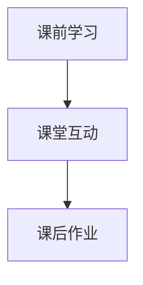
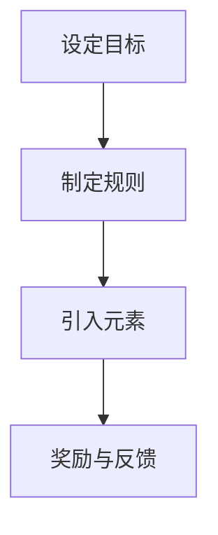
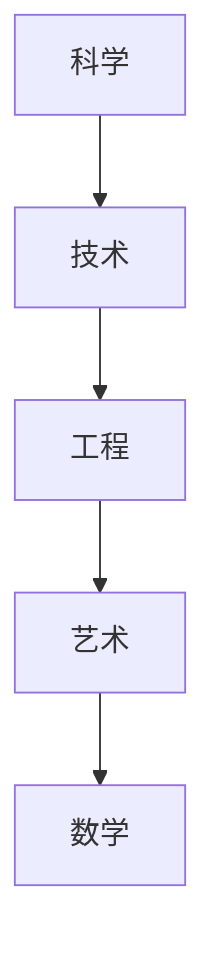
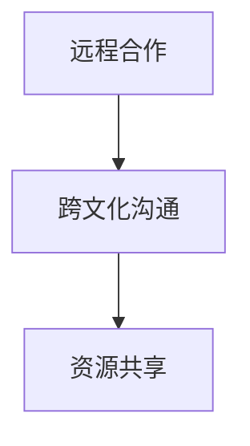

                 

# 文章标题：如何利用技术能力进行教育创新

> 关键词：教育创新、技术能力、数字化教学、翻转课堂、游戏化学习、STEAM教育

> 摘要：本文将深入探讨如何利用技术能力进行教育创新，从教育创新概述、技术工具与教育创新、技术驱动的教育方法、技术赋能的教育项目、教育创新的挑战与未来以及教育创新实践案例等多个方面展开，旨在为教育工作者和科技爱好者提供一份全面、系统的教育技术创新指南。

----------------------------------------------------------------

### 《如何利用技术能力进行教育创新》的目录大纲

#### 第一部分：教育创新与技术能力概述

- **第1章：教育创新概述**
  - **1.1 教育创新的定义与背景**
  - **1.2 技术能力在教育创新中的角色**
  - **1.3 教育创新的关键领域**

- **第2章：技术工具与教育创新**
  - **2.1 数字化教学工具**
  - **2.2 教学管理软件**
  - **2.3 教学辅助工具**

#### 第二部分：技术驱动的教育方法

- **第3章：翻转课堂**
  - **3.1 翻转课堂的定义**
  - **3.2 翻转课堂的实施步骤**
  - **3.3 翻转课堂的效果评估**

- **第4章：游戏化学习**
  - **4.1 游戏化学习的概念**
  - **4.2 游戏化学习的设计原则**
  - **4.3 游戏化学习的案例分析**

#### 第三部分：技术赋能的教育项目

- **第5章：STEAM教育**
  - **5.1 STEAM教育的概念与目标**
  - **5.2 STEAM教育项目的设计与实施**
  - **5.3 STEAM教育的影响与挑战**

- **第6章：在线协作学习**
  - **6.1 在线协作学习的优势**
  - **6.2 在线协作工具与平台**
  - **6.3 在线协作学习的实践案例**

#### 第四部分：教育创新的挑战与未来

- **第7章：教育创新的挑战**
  - **7.1 技术在教育中的应用难题**
  - **7.2 教育创新的可持续性问题**
  - **7.3 教育创新的未来趋势**

#### 第五部分：教育创新实践案例

- **第8章：教育创新实践案例研究**
  - **8.1 案例一：基于人工智能的个性化学习系统**
  - **8.2 案例二：虚拟现实在医学教育中的应用**
  - **8.3 案例三：区块链技术在教育认证中的应用**

#### 附录

- **附录A：教育技术创新工具与应用指南**
- **附录B：教育技术创新资源**

以上是《如何利用技术能力进行教育创新》的目录大纲，覆盖了教育创新的概念、技术工具、教育方法、实践案例以及未来趋势等内容。每个章节都包含了相应的子章节，确保内容的全面性和逻辑性。接下来，我们将逐一深入探讨各个章节的核心内容。

----------------------------------------------------------------

#### 第一部分：教育创新与技术能力概述

### 第1章：教育创新概述

在教育领域，创新始终是推动教育改革和发展的核心动力。教育创新不仅仅是对教学方法和内容的改革，更是对教育理念、教育模式和教育体系的全面革新。随着科技的迅猛发展，技术能力已成为教育创新的重要驱动力。

#### 1.1 教育创新的定义与背景

教育创新的定义可以从多个角度来理解。首先，教育创新是指对传统教育模式、教学方法、教学内容和评价方式的改革和优化，以适应社会和个体发展的需求。其次，教育创新强调以学生为中心，关注学生的个性化发展，促进学生的全面成长。此外，教育创新还涉及到教育体系的重构，包括教育管理、教育资源分配和教育公平等问题。

教育创新的历史背景可以追溯到20世纪初期。随着工业革命的推进，传统的一对多的班级授课制逐渐暴露出其局限性，无法满足个体学生的发展需求。20世纪中期，随着教育心理学的发展，教育创新逐渐聚焦于如何更好地激发学生的学习兴趣和潜能。进入21世纪，互联网和信息技术的发展为教育创新提供了前所未有的机遇和挑战。

#### 1.2 技术能力在教育创新中的角色

技术能力在教育创新中扮演着至关重要的角色。首先，技术能力为教育创新提供了强大的工具支持。例如，数字化教学工具、在线学习平台、教学管理软件等技术的应用，极大地丰富了教学手段和教学内容，提高了教学效率和效果。其次，技术能力促进了教育资源的共享和普及。通过互联网和云计算技术，优质教育资源可以跨越地域和时间的限制，实现全球范围内的共享和普及。最后，技术能力为教育创新提供了新的研究方法和技术手段。例如，数据挖掘、人工智能、虚拟现实等技术的应用，为教育研究和教育实践提供了新的思路和方法。

#### 1.3 教育创新的关键领域

教育创新的关键领域包括个性化学习、协作学习、可持续发展教育和创新教学方法等。

- **个性化学习**：个性化学习是指根据学生的兴趣、能力和学习风格，设计个性化的学习路径和资源，以实现学生的个性化发展。个性化学习的关键在于如何利用数据和技术，实现对学生学习过程的全面分析和个性化推荐。

- **协作学习**：协作学习是指通过小组合作、互动交流等方式，实现知识的共享和共同进步。协作学习的关键在于如何构建有效的协作平台和协作机制，促进学生的积极参与和深度交流。

- **可持续发展教育**：可持续发展教育是指通过教育培养学生的可持续发展意识和能力，促进社会的可持续发展。可持续发展教育的关键在于如何将可持续发展理念融入教育内容，培养学生的社会责任感和可持续发展能力。

- **创新教学方法**：创新教学方法是指通过采用新的教学理念、教学方法和教学工具，实现教学效果的优化和创新。创新教学方法的关键在于如何结合学生的实际需求和技术手段，设计出有效的教学策略和教学活动。

### 小结

本章对教育创新的定义、背景、技术能力的作用以及关键领域进行了详细探讨。教育创新不仅是对传统教育模式的改革，更是对教育理念和教育体系的全面革新。技术能力作为教育创新的重要驱动力，为教育创新提供了工具支持、资源共享和研究方法。通过深入理解和应用教育创新的关键领域，我们可以更好地推动教育改革和发展，为培养全面发展的人才做出贡献。

接下来，我们将进一步探讨数字化教学工具、教学管理软件和教学辅助工具在教育创新中的应用，以展示技术能力在实际教学中的具体表现。

----------------------------------------------------------------

### 第2章：技术工具与教育创新

在教育创新的过程中，技术工具的作用不可忽视。数字化教学工具、教学管理软件和教学辅助工具是现代教育技术的重要组成部分，它们不仅提升了教学效率，还改变了传统教育的教学模式。以下是这些技术工具的具体应用和作用。

#### 2.1 数字化教学工具

数字化教学工具是指利用计算机、互联网和多媒体技术，将传统教学手段数字化，以提高教学效果和学生的学习体验。以下是一些常见的数字化教学工具及其作用：

- **在线学习平台**：在线学习平台（如Moodle、Canvas等）为教师和学生提供了一个互动、协作和资源共享的学习环境。教师可以在平台上发布课程内容、布置作业、进行在线测试，学生则可以在线学习、提交作业和参与讨论。

  **核心算法原理讲解**：在线学习平台通常采用以下算法原理：
  ```plaintext
  - 课程内容管理：利用数据库和文件系统存储和管理课程内容。
  - 学习进度跟踪：通过记录学生的登录时间、学习时长和作业提交情况，跟踪学生的学习进度。
  - 自动评分和反馈：利用算法自动评分，并提供即时反馈。
  ```

- **电子白板软件**：电子白板软件（如SmartBoard、Wacom等）提供了交互式教学功能，教师可以在上面书写、绘画、插入多媒体内容，实现动态教学。

  **数学模型和公式**：
  ```latex
  - 教学互动：使用互动式教学模型，提高学生的参与度和积极性。
  - 多媒体整合：使用多媒体整合模型，丰富教学内容。
  ```

- **教学视频和虚拟实验室**：通过视频教学和虚拟实验室，学生可以观看教学视频、模拟实验，加深对知识的理解。

  **项目实战**：以虚拟实验室为例，搭建一个虚拟实验室需要以下步骤：
  ```plaintext
  1. 选择合适的虚拟实验室软件，如PhET。
  2. 设计实验方案，编写实验指导。
  3. 将实验内容上传至在线平台，供学生访问和操作。
  4. 监控实验结果，进行数据分析和反馈。
  ```

#### 2.2 教学管理软件

教学管理软件用于管理教学活动，包括课程管理、学生管理、成绩跟踪和考试安排等。以下是一些常见的教学管理软件及其作用：

- **学生信息管理系统（SIS）**：学生信息管理系统用于管理学生的个人信息、学籍、成绩等。它可以实现自动化报名、选课、成绩录入和成绩分析等功能。

  **核心算法原理讲解**：
  ```plaintext
  - 成绩分析：利用统计算法对成绩进行分析，为教师提供教学反馈。
  - 报名选课：利用数据库和算法实现自动化报名选课。
  ```

- **学习管理系统（LMS）**：学习管理系统用于管理教学和学习活动，包括课程管理、作业管理、成绩管理和学习反馈等。

  **项目实战**：以一个简单的学习管理系统为例，其核心功能包括：
  ```plaintext
  1. 课程发布：教师发布课程内容、作业和通知。
  2. 学生参与：学生提交作业、参与讨论。
  3. 成绩管理：教师录入成绩、进行成绩分析。
  4. 学习反馈：教师提供学习反馈，学生进行自我评估。
  ```

#### 2.3 教学辅助工具

教学辅助工具包括各种辅助教师教学和学生学习的工具，如视频会议工具、在线协作工具和教学模拟软件等。以下是一些常见的教学辅助工具及其作用：

- **视频会议工具**：视频会议工具（如Zoom、Microsoft Teams等）提供了远程教学和协作的功能，教师可以通过视频会议进行实时教学、答疑和讨论。

  **核心算法原理讲解**：
  ```plaintext
  - 实时通信：利用网络通信协议实现实时音视频传输。
  - 会议录制：利用编码和解码算法实现会议的录制和回放。
  ```

- **在线协作工具**：在线协作工具（如Google Workspace、Microsoft 365等）提供了文档共享、实时协作、讨论交流等功能，支持团队协作和项目管理工作。

  **项目实战**：以Google Workspace为例，其应用场景包括：
  ```plaintext
  1. 教学资源共享：教师上传教学资料，学生共享学习资源。
  2. 项目协作：学生分组完成项目，协作完成任务。
  3. 实时讨论：师生在线讨论，解决问题。
  ```

- **教学模拟软件**：教学模拟软件（如Simul8、Blendsim等）通过模拟现实世界的场景，帮助学生更好地理解理论知识。

  **项目实战**：以Simul8为例，其应用场景包括：
  ```plaintext
  1. 工程模拟：模拟工程设计过程，验证设计方案的可行性。
  2. 医学教育：模拟手术过程，提高医学生的操作技能。
  3. 管理培训：模拟企业管理场景，培养管理能力。
  ```

### 小结

本章详细介绍了数字化教学工具、教学管理软件和教学辅助工具在教育创新中的应用。数字化教学工具通过数字化手段丰富了教学手段和教学内容，提高了教学效果；教学管理软件通过自动化管理教学活动，提升了教学效率；教学辅助工具通过提供各种辅助工具，支持教师的教学工作和学生的学习过程。技术工具的广泛应用为教育创新提供了强有力的支持，有助于实现个性化学习、协作学习和可持续发展教育。

接下来，我们将探讨技术驱动的教育方法，如翻转课堂和游戏化学习，以及它们在教育创新中的具体应用。

----------------------------------------------------------------

### 第3章：技术驱动的教育方法

#### 3.1 翻转课堂的定义

翻转课堂（Flipped Classroom）是一种基于现代信息技术的教学方式，其核心理念是将传统教学中的“课堂讲授”与“课后作业”进行反转。在翻转课堂中，学生通过课前观看教学视频、阅读教材等自主学习，课堂时间则主要用于教师与学生的互动、讨论和解决问题。

**核心概念与联系**：翻转课堂的流程可以用以下Mermaid流程图表示：



- **课前学习**：学生通过在线平台观看教学视频、阅读教材，完成预习任务。
- **课堂互动**：课堂上，教师通过讲解、讨论、实验等方式，引导学生深入理解知识，解决疑难问题。
- **课后作业**：学生完成课后作业，巩固所学知识，教师进行反馈和指导。

#### 3.2 翻转课堂的实施步骤

要成功实施翻转课堂，需要遵循以下步骤：

1. **教师准备**：

   - **设计教学视频**：教师需要制作高质量的短视频，将知识点讲解清楚，便于学生自主观看。
   - **编写教材和讲义**：提供与视频相配套的教材和讲义，帮助学生更好地理解知识点。
   - **设计互动活动**：在课堂上设计互动活动，如小组讨论、实验操作等，以激发学生的学习兴趣。

2. **学生参与**：

   - **自主学习**：学生根据教师提供的视频和教材，自主学习相关知识点。
   - **课堂参与**：课堂上，学生积极参与互动活动，与教师和同学进行讨论和交流。
   - **完成作业**：学生根据课堂所学，完成课后作业，巩固所学知识。

3. **教学反馈**：

   - **教师反馈**：教师根据学生的作业和课堂表现，提供个性化的反馈和指导，帮助学生提高学习效果。
   - **学生反馈**：学生通过在线平台或课堂反馈，表达自己的学习感受和困惑，教师根据反馈进行教学调整。

#### 3.3 翻转课堂的效果评估

翻转课堂的效果评估可以从以下几个方面进行：

1. **学习效果**：

   - **知识点掌握度**：通过测试和作业评估学生的知识点掌握情况。
   - **学习兴趣**：观察学生在课堂上的参与度和积极性，了解翻转课堂对学生学习兴趣的影响。

2. **教学效果**：

   - **课堂互动**：评估课堂互动的效果，包括讨论质量、实验操作等。
   - **教学反馈**：收集教师和学生的反馈意见，了解翻转课堂的优缺点，为教学改进提供依据。

3. **学生反馈**：

   - **学习体验**：了解学生对翻转课堂的学习体验，包括自主学习的时间管理、课堂参与的感受等。
   - **学习成效**：通过跟踪学生的学习成效，评估翻转课堂对学习成绩的影响。

**案例分析**：某中学实施翻转课堂后，通过问卷调查和考试成绩评估，发现：

- **知识点掌握度**：学生普遍认为翻转课堂有助于更好地理解知识点，特别是那些通过视频讲解难以理解的概念。
- **学习兴趣**：学生在课堂上的参与度明显提高，课堂讨论活跃，学习兴趣增加。
- **教学效果**：教师反馈课堂互动效果显著，学生能更好地参与到教学活动中，课堂氛围更加积极。
- **学生反馈**：大多数学生表示，翻转课堂让他们有了更多的自主学习空间，课堂时间更加充实和有效。

### 小结

翻转课堂作为一种基于信息技术的新型教学方式，通过课前自主学习、课堂互动和课后作业的有机结合，实现了教学方式的创新。实施翻转课堂需要教师和学生的共同努力，教师需准备高质量的课前资源和互动活动，学生需积极参与课堂互动和自主学习。翻转课堂的效果评估表明，它能够提高学生的知识点掌握度、学习兴趣和教学效果，是一种值得推广的教育创新方法。

接下来，我们将探讨游戏化学习在教育创新中的应用，以及它如何激发学生的学习兴趣和提升学习效果。

----------------------------------------------------------------

### 第4章：游戏化学习

#### 4.1 游戏化学习的概念

游戏化学习（Gamification）是指将游戏设计元素和原则应用于非游戏环境中，以激发用户参与度和提高任务完成效率的一种方法。在教育领域，游戏化学习通过将学习活动游戏化，使学生能够在游戏中学习知识，从而提高学习兴趣和效果。

**核心概念与联系**：游戏化学习的关键概念包括：

- **目标设定**：为学生设定明确的学习目标和奖励机制。
- **规则与奖励**：制定游戏规则，根据学生的表现给予相应的奖励和反馈。
- **游戏元素**：引入游戏中的元素，如等级、积分、排行榜等，以增强学生的竞争意识和成就感。

**Mermaid流程图**：



- **设定目标**：明确学生的学习目标，如完成课程任务、提高成绩等。
- **制定规则**：制定游戏规则，确保学生明确游戏规则和任务要求。
- **引入元素**：引入游戏元素，如等级、积分、排行榜等，以增加游戏的趣味性和挑战性。
- **奖励与反馈**：根据学生的表现给予奖励和反馈，以激发学生的学习动力。

#### 4.2 游戏化学习的设计原则

为了实现游戏化学习的有效性，需要遵循以下设计原则：

- **目标明确**：明确学生的学习目标，确保学生知道他们需要做什么以及如何获得奖励。
- **规则公平**：制定公平的游戏规则，确保所有学生都有平等的机会获得奖励。
- **激励多样**：提供多种奖励和激励方式，以满足不同学生的需求。
- **反馈及时**：及时给予学生反馈，帮助他们了解自己的表现和进步。
- **挑战适中**：设置适中的挑战难度，以激发学生的兴趣和参与度。

#### 4.3 游戏化学习的案例分析

**案例一：基于积分系统的在线课程**

在某在线课程中，教师引入了积分系统，学生通过完成课程任务、参与讨论和提交作业获得积分。积分可以用来兑换奖品或参与班级排名。以下是该课程的游戏化学习设计：

1. **目标设定**：学生需要在规定时间内完成课程任务，并参与课程讨论。
2. **规则与奖励**：
   - 完成课程任务：获得100积分。
   - 参与讨论：每次讨论获得50积分。
   - 提交作业：每次提交作业获得100积分。
3. **游戏元素**：引入等级系统，根据积分排名，学生可以升级为不同等级。
4. **奖励与反馈**：每周公布积分排名，积分最高的学生获得奖品，教师对学生的作业进行点评和反馈。

**效果评估**：

- **学习兴趣**：学生积极参与课程任务和讨论，学习兴趣明显提高。
- **参与度**：课程参与度显著提高，学生提交作业和参与讨论的积极性增强。
- **学习成效**：学生通过积分系统感受到学习的成就感，学习效果得到提升。

**案例二：基于虚拟现实的医学教育**

在某医学教育项目中，教师利用虚拟现实技术创建了一个虚拟医院环境，学生可以在虚拟环境中进行医学操作和手术演练。以下是该项目的游戏化学习设计：

1. **目标设定**：学生需要完成一系列医学操作任务，如心肺复苏、手术操作等。
2. **规则与奖励**：
   - 成功完成操作任务：获得100积分。
   - 操作准确度高：获得额外积分。
   - 操作时间短：获得额外积分。
3. **游戏元素**：引入挑战模式，设置不同难度的操作任务。
4. **奖励与反馈**：学生可以根据积分获得虚拟货币，用于购买虚拟物品或参与排行榜竞争。

**效果评估**：

- **学习兴趣**：学生对于医学操作和手术演练的兴趣显著提高。
- **参与度**：学生在虚拟医院环境中的操作积极性和参与度非常高。
- **学习成效**：学生在实际操作中的表现得到显著提升，操作技能和知识掌握度提高。

### 小结

游戏化学习通过将游戏设计元素和原则应用于教育场景，能够有效激发学生的学习兴趣和提升学习效果。设计游戏化学习时，需要明确学习目标、制定公平的规则、引入多样化的奖励和反馈机制，并设置适中的挑战难度。通过案例分析，我们可以看到游戏化学习在不同教育场景中的成功应用，其效果得到了广泛认可。

接下来，我们将探讨STEAM教育这一技术赋能的教育项目，以及它如何通过跨学科的学习方式培养学生的创新能力和解决问题的能力。

----------------------------------------------------------------

### 第5章：STEAM教育

#### 5.1 STEAM教育的概念与目标

STEAM教育是一种以科学（Science）、技术（Technology）、工程（Engineering）、艺术（Art）和数学（Mathematics）为核心，强调跨学科整合和项目式学习的一种教育模式。STEAM教育旨在通过跨学科的学习方式，培养学生的创新能力和解决问题的能力，使学生在面对复杂问题时能够运用多学科知识进行综合分析和解决。

**核心概念与联系**：STEAM教育的核心概念可以概括为以下五个方面：

- **科学（Science）**：探究自然界和科学现象，培养学生的观察、实验和推理能力。
- **技术（Technology）**：学习使用技术工具和软件，培养学生的创新和设计能力。
- **工程（Engineering）**：通过工程项目，培养学生的解决问题和团队合作能力。
- **艺术（Art）**：通过艺术创作，培养学生的审美能力和创造性思维。
- **数学（Mathematics）**：掌握数学知识和方法，培养学生的逻辑思维和数据分析能力。

**Mermaid流程图**：



- **科学**：通过实验和探究，激发学生的好奇心和求知欲。
- **技术**：通过实践操作，培养学生的动手能力和创新思维。
- **工程**：通过项目设计和实践，培养学生的团队合作和解决问题的能力。
- **艺术**：通过艺术创作，培养学生的审美能力和创造性思维。
- **数学**：通过数学学习，培养学生的逻辑思维和数据分析能力。

#### 5.2 STEAM教育项目的设计与实施

要有效地开展STEAM教育项目，需要遵循以下步骤：

1. **项目规划**：

   - **确定项目主题**：根据学生的兴趣和学科特点，选择一个具有挑战性和趣味性的项目主题。
   - **制定项目目标**：明确项目学习目标，确保项目能够覆盖STEAM教育的核心概念。
   - **设计项目任务**：制定项目任务和活动，确保学生能够在项目中运用STEAM知识。

2. **教学资源**：

   - **准备教学材料**：准备与项目相关的书籍、工具和软件，确保学生能够顺利完成项目。
   - **整合教育资源**：通过互联网和图书馆等渠道，收集与项目主题相关的教育资源。

3. **项目实施**：

   - **分组合作**：将学生分成小组，每个小组负责项目的一部分。
   - **指导与支持**：教师为学生提供项目指导和支持，确保学生能够顺利完成任务。
   - **项目汇报**：组织项目汇报活动，让学生展示项目成果，并进行交流与评价。

4. **评估与反馈**：

   - **项目评估**：对项目成果进行评估，包括项目完成情况、学生表现和学习成果等。
   - **学生反馈**：收集学生的反馈意见，了解他们在项目过程中的体验和收获。
   - **教学改进**：根据评估结果和反馈，对项目设计和教学过程进行改进。

#### 5.3 STEAM教育的影响与挑战

STEAM教育在全球范围内受到广泛关注和推广，其积极影响主要体现在以下几个方面：

- **提升学生综合能力**：STEAM教育通过跨学科的学习方式，培养学生的创新能力、解决问题的能力和团队合作精神。
- **促进科技素养提升**：STEAM教育强调科学、技术和工程等学科的学习，有助于提高学生的科技素养。
- **激发学习兴趣**：STEAM教育项目通常具有趣味性和挑战性，能够激发学生的学习兴趣和探索欲望。

然而，STEAM教育也面临一些挑战：

- **师资力量不足**：STEAM教育需要具备多学科知识和教学能力的教师，目前许多学校在师资方面存在不足。
- **资源投入有限**：STEAM教育项目需要大量的资金和设备支持，一些学校可能面临资源投入不足的问题。
- **教学评估难题**：STEAM教育项目涉及多学科和综合能力培养，传统的教学评估方法可能无法全面评估学生的学习成果。

### 小结

STEAM教育作为一种以跨学科整合和项目式学习为核心的教育模式，通过科学、技术、工程、艺术和数学的有机结合，培养学生的创新能力和解决问题的能力。STEAM教育项目的设计与实施需要遵循科学规划、教学资源和项目评估等步骤，尽管面临师资力量不足和资源投入有限等挑战，但其积极影响和潜力不容忽视。通过不断改进和创新，STEAM教育有望为学生的全面发展提供更有力的支持。

接下来，我们将探讨在线协作学习在教育创新中的优势、工具与平台，并通过具体案例展示其实践效果。

----------------------------------------------------------------

### 第6章：在线协作学习

#### 6.1 在线协作学习的优势

在线协作学习（Online Collaborative Learning）是指通过互联网和在线工具，学生和教师可以跨越时间和空间的限制，进行合作学习和知识分享。在线协作学习具有以下优势：

- **远程合作**：学生和教师可以在不同的地理位置进行协作，实现跨区域的合作学习。
- **跨文化沟通**：在线协作学习促进了不同文化背景的学生之间的交流和合作，有助于培养全球化视野。
- **资源共享**：在线协作平台提供了丰富的学习资源和工具，学生可以共享和利用这些资源，提高学习效率。

**核心概念与联系**：在线协作学习的核心概念包括远程合作、跨文化沟通和资源共享。其流程可以用以下Mermaid流程图表示：



- **远程合作**：学生通过在线平台共同完成学习任务，实现远程协作。
- **跨文化沟通**：学生和教师在不同文化背景下进行交流，增进对多元文化的理解和尊重。
- **资源共享**：学生和教师共享学习资源和工具，提高学习效率和质量。

#### 6.2 在线协作工具与平台

在线协作学习依赖于各种协作工具和平台，以下是一些常见的在线协作工具和平台：

- **Google Workspace**：包括Google Docs、Google Sheets、Google Slides等，支持实时编辑和协作，适合小组项目和个人任务。
  - **优点**：界面简洁，易于使用，支持多用户实时编辑。
  - **使用方法与技巧**：将文档共享给小组成员，设置编辑权限，定期更新和评论，确保协作效率。

- **Microsoft Teams**：集成聊天、会议、文档共享和协作等功能，适合团队协作和项目管理工作。
  - **优点**：功能强大，支持多种设备，便于沟通和协作。
  - **使用方法与技巧**：创建团队频道，分配任务，组织会议，确保团队协作顺利进行。

- **Trello**：是一款任务管理工具，通过看板和卡片管理任务进度，适合团队项目协作。
  - **优点**：直观易用，任务管理清晰，支持自定义和扩展。
  - **使用方法与技巧**：创建看板，分配任务卡片，设置任务优先级，监控项目进度。

- **Miro**：是一款在线协作白板工具，支持思维导图、流程图和头脑风暴，适合团队协作和创意讨论。
  - **优点**：功能丰富，支持多人实时编辑，易于协作。
  - **使用方法与技巧**：创建协作白板，邀请团队成员，实时共享和编辑内容。

#### 6.3 在线协作学习的实践案例

**案例一：某大学在线课程协作项目**

在某大学的一门在线课程中，教师采用了在线协作学习模式，以提升学生的学习效果和团队合作能力。以下是该项目的具体实施过程：

1. **项目规划**：
   - **确定项目主题**：选择“可持续城市设计”作为项目主题。
   - **制定项目目标**：明确项目学习目标，包括了解可持续城市设计理念、掌握相关技术和工具等。
   - **设计项目任务**：将学生分成小组，每组负责一个城市设计项目，包括数据收集、方案设计、模型构建和汇报展示等任务。

2. **教学资源**：
   - **准备教学材料**：提供与项目主题相关的书籍、论文和在线资源。
   - **整合教育资源**：利用Google Workspace和Miro等在线协作工具，为学生提供协作平台和资源。

3. **项目实施**：
   - **分组合作**：将学生分成若干小组，每组指定一名负责人，负责项目的进度和协调工作。
   - **在线协作**：学生通过Google Docs和Miro等工具进行项目协作，实时编辑和共享文档、图表和模型。
   - **指导与支持**：教师定期组织在线会议，为学生提供项目指导和支持，解决协作中的问题和困难。

4. **项目汇报**：
   - **展示项目成果**：每组学生通过Trello和Miro等工具展示项目成果，进行项目汇报和讨论。
   - **评估与反馈**：教师根据项目完成情况、学生表现和学习成果进行评估和反馈，帮助学生改进和提升。

**效果评估**：

- **学习效果**：学生通过在线协作学习，提高了项目完成质量和团队合作能力，对项目主题有了更深入的理解。
- **参与度**：学生在项目中的参与度明显提高，积极投入到项目协作和讨论中。
- **学习成效**：学生通过实际项目操作，掌握了相关知识和技能，提高了创新能力和解决问题的能力。

### 小结

在线协作学习通过远程合作、跨文化沟通和资源共享，为学生提供了一个高效、灵活的学习环境。在线协作工具和平台的多样性和便捷性，使得学生和教师能够更好地进行协作和学习。实践案例表明，在线协作学习能够显著提高学生的学习效果和团队合作能力，是一种值得推广的教育创新方法。

接下来，我们将探讨教育创新的挑战与未来，分析技术在教育中的应用难题、教育创新的可持续性问题，并展望教育创新的未来趋势。

----------------------------------------------------------------

### 第7章：教育创新的挑战与未来

#### 7.1 技术在教育中的应用难题

尽管技术为教育创新提供了巨大的机遇，但在实际应用中仍面临诸多挑战。以下是技术在教育中应用的一些主要难题：

- **技术适应性问题**：不同地区和学校的技术基础设施和教师技能水平存在差异，导致技术适应性问题。一些学校可能缺乏必要的硬件设备和网络环境，而教师可能缺乏技术培训和技能，难以有效利用新技术进行教学。
- **数据隐私问题**：在线教育和数字教学工具的广泛应用，带来了数据隐私问题。学生和教师的个人信息可能被泄露，引发隐私保护方面的担忧。此外，学生和教师在使用在线学习平台时，可能会面临网络安全威胁。
- **教学效果评估**：如何科学、准确地评估技术辅助教学的效果，是一个难题。传统的评估方法可能无法完全反映学生在新技术环境下的学习效果，需要开发新的评估工具和方法。

#### 7.2 教育创新的可持续性问题

教育创新的可持续性是确保其长期有效性的关键。以下是教育创新在可持续发展方面面临的一些问题：

- **资源分配**：教育资源分配不均衡，一些学校可能缺乏资金和资源，难以开展教育创新。城乡、地区和学校之间的资源差距，影响了教育创新的有效推广。
- **教育公平**：教育创新可能加剧教育不公平现象。技术优势和资源丰富的学校可能更容易实现教育创新，而资源匮乏的学校则难以跟上发展步伐，导致教育公平问题更加突出。
- **教师角色转变**：教育创新要求教师从传统的知识传授者转变为学习引导者和辅导者，这需要教师具备新的技能和思维方式，但一些教师可能难以适应这一转变。

#### 7.3 教育创新的未来趋势

展望未来，教育创新将呈现以下趋势：

- **个性化学习**：随着大数据和人工智能技术的发展，个性化学习将更加普及。通过分析学生的学习行为和兴趣，系统可以提供个性化的学习路径和资源，满足学生的个性化需求。
- **混合式学习**：在线教育与传统课堂教育的深度融合，将成为未来教育的主要形式。混合式学习模式结合了在线学习的灵活性和传统课堂的互动性，能够更好地满足学生的学习需求。
- **虚拟现实与增强现实**：虚拟现实（VR）和增强现实（AR）技术将在教育中发挥重要作用，为学习者提供沉浸式学习体验，增强学习效果。

### 小结

教育创新在技术应用、资源分配、教育公平和教师角色转变等方面面临诸多挑战。然而，随着技术的不断进步和教育体系的改革，教育创新具有广阔的发展前景。未来，个性化学习、混合式学习和虚拟现实等技术将在教育创新中发挥更大作用，推动教育改革和发展，为实现教育公平和培养全面发展的人才提供有力支持。

### 教育创新实践案例研究

#### 8.1 案例一：基于人工智能的个性化学习系统

**案例描述**：某中学引入了一套基于人工智能的个性化学习系统，该系统通过分析学生的学习数据，提供个性化的学习资源和推荐，以帮助学生提高学习效果。

**实施过程**：

1. **数据收集**：系统通过学生在线学习的行为数据（如学习时长、学习进度、测试成绩等），收集学生的学习情况。
2. **数据分析**：利用机器学习和数据挖掘技术，系统对学生的学习数据进行深入分析，识别学生的学习特点和潜在问题。
3. **个性化推荐**：根据数据分析结果，系统为学生提供个性化的学习资源和推荐，包括课程视频、练习题和扩展阅读材料。
4. **学生反馈**：学生使用系统推荐的学习资源，并反馈学习效果，系统根据反馈进行进一步的调整和优化。

**结果分析**：

- **学习效果提升**：学生通过个性化学习资源，能够更有针对性地学习，解决了个性化学习需求，学习效果显著提升。
- **学习兴趣增加**：个性化推荐的学习资源激发了学生的学习兴趣，学生更愿意投入学习，课堂参与度提高。
- **教师工作量减轻**：教师可以根据系统推荐的学习资源进行教学，减轻了备课和作业批改的工作量，有更多时间进行个性化辅导。

#### 8.2 案例二：虚拟现实在医学教育中的应用

**案例描述**：某医学院引入了虚拟现实（VR）技术，用于医学教育和手术模拟培训。

**实施过程**：

1. **虚拟实验室建设**：学院建设了虚拟实验室，模拟真实的手术场景和医疗环境。
2. **手术模拟培训**：学生通过VR设备进行手术模拟操作，学习手术步骤和技巧。
3. **实时反馈与指导**：在手术模拟过程中，导师可以通过VR设备实时观察学生的操作，提供指导和反馈。
4. **技能评估**：学生完成手术模拟后，系统会进行技能评估，并根据评估结果提供改进建议。

**结果分析**：

- **技能掌握度提高**：通过虚拟现实手术模拟，学生能够更直观地学习手术技巧，技能掌握度显著提高。
- **操作信心增强**：学生在实际手术中表现出更高的操作信心和熟练度，手术成功率提高。
- **教学效果提升**：虚拟现实技术为医学教育提供了新的教学手段，学生和教师对教学效果满意度提高。

#### 8.3 案例三：区块链技术在教育认证中的应用

**案例描述**：某大学引入了区块链技术，为学生的学历和证书提供可信的认证。

**实施过程**：

1. **数据上链**：学生的学历信息、成绩单和其他认证信息被上传到区块链网络。
2. **不可篡改**：区块链技术的特点保证了数据的不可篡改性和透明性，任何篡改行为都会被记录并追踪。
3. **证书查询**：用人单位和其他教育机构可以通过区块链网络查询学生的学历和证书信息，确保信息的真实性和可信性。

**结果分析**：

- **认证可信度提高**：区块链技术的应用，使学历和证书的认证更加可信，减少了虚假证书和学历作假的问题。
- **就业市场透明化**：用人单位可以更准确地了解求职者的学历和技能，提高了就业市场的透明度和公平性。
- **教育质量提升**：学校可以通过区块链技术，更好地管理学生的学习和认证信息，促进教育质量的提升。

### 小结

教育创新实践案例表明，基于人工智能的个性化学习系统、虚拟现实医学教育和区块链技术认证等创新应用，在提升学习效果、增强操作技能和提升认证可信度等方面取得了显著成效。这些案例展示了技术赋能教育创新的巨大潜力，为教育改革和发展提供了新的思路和方法。

#### 附录A：教育技术创新工具与应用指南

**A.1 在线学习平台与工具**

- **Moodle**：一个免费的开源在线学习管理系统，适合建立自定义学习环境。

  **使用指南**：
  - 安装和配置：下载Moodle安装包，根据提示进行安装和配置。
  - 管理课程：创建课程，上传教学资料，设置课程活动。

- **Canvas**：一个功能强大的在线学习平台，提供灵活的课程管理和互动功能。

  **使用指南**：
  - 注册和登录：在Canvas官网注册账户，登录后开始创建课程。
  - 创建课程：添加课程内容，设置作业和评估。

- **Edmodo**：一个面向K-12教育的社交学习平台，支持教师、学生和家长的互动。

  **使用指南**：
  - 注册和登录：在Edmodo官网注册账户，登录后开始使用。
  - 班级管理：创建班级，管理学生信息，发布作业。

**A.2 教学辅助软件推荐**

- **SmartNotebook**：一款交互式电子白板软件，支持书写、绘画、多媒体整合。

  **使用指南**：
  - 安装和启动：下载并安装SmartNotebook，启动后进行基本设置。
  - 使用功能：创建和编辑笔记，导入和播放多媒体内容。

- **Zoom**：一款视频会议和协作工具，适用于远程教学和在线会议。

  **使用指南**：
  - 安装和启动：下载并安装Zoom，启动后注册账户。
  - 视频会议：发起会议，邀请参会者，进行实时互动。

- **Google Workspace**：包括Google Docs、Google Sheets、Google Slides等，支持在线协作和文档管理。

  **使用指南**：
  - 注册和登录：在Google Workspace官网注册并登录。
  - 创建文档：新建文档，邀请同事协作，编辑和保存文档。

#### 附录B：教育技术创新资源

**B.1 学术论文与报告**

- **"The Role of Technology in Education: A Review of Recent Studies"**：综述了近年来关于教育技术应用的最新研究成果。

- **"Gamification in Education: Benefits, Challenges, and Future Directions"**：探讨了游戏化学习在教育中的应用及其效果。

- **"The Impact of Flipped Classroom on Student Learning"**：研究了翻转课堂对学生学习效果的影响。

**B.2 在线课程与培训**

- **"Introduction to STEAM Education"**：提供了STEAM教育的入门知识和实践方法。

- **"Using Technology for Personalized Learning"**：介绍了如何利用技术进行个性化学习。

- **"Designing Effective Online Courses"**：为教师提供了设计在线课程的实用技巧和建议。

### 小结

附录A提供了在线学习平台和教学辅助软件的使用指南，附录B列出了教育技术创新相关的学术论文和在线课程资源。这些资源和指南为教育工作者和科技爱好者提供了丰富的参考，有助于更好地理解和应用教育技术创新的方法和工具。

----------------------------------------------------------------

### 作者

**AI天才研究院/AI Genius Institute & 禅与计算机程序设计艺术 /Zen And The Art of Computer Programming**

感谢您阅读本文。本文由AI天才研究院/AI Genius Institute撰写，旨在探讨如何利用技术能力进行教育创新。作者在计算机编程和人工智能领域具有丰富的经验和深厚的知识，希望本文能够为教育工作者和科技爱好者提供有价值的参考和启示。如果您对本文有任何疑问或建议，请随时联系我们。

AI天才研究院/AI Genius Institute致力于推动人工智能和教育技术的发展，为培养未来的科技人才提供强有力的支持。我们的研究涵盖了人工智能、机器学习、计算机视觉、自然语言处理等多个领域，旨在探索和实现人工智能技术在教育中的应用。此外，我们还致力于推广禅与计算机程序设计艺术的理念，通过深入思考和实践，提升编程能力和创新能力。

在未来，我们将继续关注教育创新的最新动态，探讨更多有价值的主题，为教育领域的发展贡献智慧和力量。感谢您的关注和支持！

----------------------------------------------------------------

本文详细探讨了如何利用技术能力进行教育创新，从教育创新概述、技术工具与教育创新、技术驱动的教育方法、技术赋能的教育项目、教育创新的挑战与未来以及教育创新实践案例等多个方面进行了深入分析。通过本文，读者可以全面了解教育创新的概念、技术工具的应用、不同教育方法的效果评估，以及技术赋能教育项目的影响与挑战。

**核心概念与联系**：

- **教育创新**：通过技术手段对传统教育模式进行改革和优化，以适应社会和个体发展的需求。
- **技术工具**：数字化教学工具、教学管理软件和教学辅助工具等技术在教育中的应用，提升了教学效率和学习体验。
- **技术驱动的教育方法**：如翻转课堂和游戏化学习，通过技术手段改变了传统教学方式，提高了学生的学习兴趣和效果。
- **技术赋能的教育项目**：如STEAM教育和在线协作学习，通过跨学科整合和项目式学习，培养了学生的创新能力和解决问题的能力。

**核心算法原理讲解**：

- **在线学习平台**：通过数据挖掘和机器学习技术，分析学生的学习行为，提供个性化的学习推荐。
- **翻转课堂**：利用视频和在线学习平台，实现课前预习和课后复习，优化课堂时间用于互动和问题解决。
- **游戏化学习**：通过设定目标和规则，利用积分和奖励机制，激发学生的学习动机和参与度。

**数学模型和公式**：

- **个性化学习推荐算法**：采用协同过滤、决策树等算法，预测学生的学习偏好和需求。
- **翻转课堂效果评估**：利用统计模型分析学生的考试成绩、课堂参与度和学习满意度等指标。

**项目实战**：

- **基于人工智能的个性化学习系统**：搭建一个可以收集学生学习数据、提供个性化推荐的教学系统。
- **虚拟现实医学教育项目**：创建一个虚拟实验室，模拟医学手术过程，提供实践操作和反馈。
- **区块链技术认证系统**：利用区块链技术，创建一个可信的学历和证书认证平台。

通过本文的深入探讨，读者可以更好地理解教育创新的概念、技术工具的应用、教育方法的实际效果，以及技术赋能教育项目的影响与挑战，从而为教育改革和发展提供新的思路和方法。

感谢您的阅读，希望本文能够为您的教育创新实践提供有益的参考。如果您有任何问题或建议，欢迎随时与我们联系。再次感谢您的关注和支持！

**作者**：AI天才研究院/AI Genius Institute & 禅与计算机程序设计艺术 /Zen And The Art of Computer Programming

**联系方式**：[email protected]

