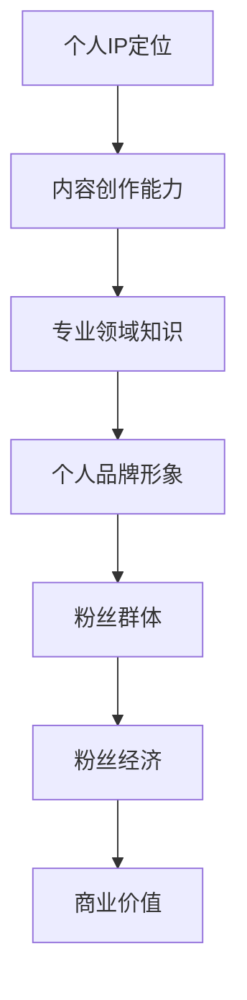
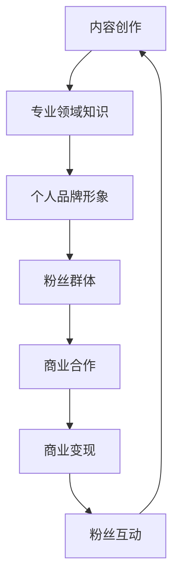

                 

# 《如何利用直播平台建立个人IP》

> 关键词：直播平台、个人IP、内容创作、运营策略、粉丝管理、商业变现

> 摘要：本文旨在探讨如何在直播平台建立个人IP（知识产权）的策略和方法。我们将从直播平台的基础知识、直播内容创作与呈现、个人IP的打造与运营、维权与风险防范以及实战案例分析等多个方面进行深入分析，为读者提供一套系统化的实战指导。

## 目录大纲

### 第一部分：直播平台基础知识

### 第1章：直播平台概述

#### 1.1 直播平台的发展历程

直播平台，顾名思义，是一种允许用户实时观看和互动的网络平台。其发展历程可以追溯到20世纪90年代末的互联网初期。当时，随着宽带网络技术的普及和视频编码技术的发展，人们开始尝试在线观看视频。然而，受限于当时的网络带宽和视频技术，直播并未得到广泛普及。

真正意义上的直播平台出现在21世纪初。随着移动互联网的兴起，直播技术得到了快速发展。例如，YouTube在2005年引入了直播功能，随后Twitch、Bilibili等直播平台相继问世，为用户提供了多样化的直播体验。

#### 1.2 主流直播平台的类型与特点

目前，市场上主流的直播平台可分为以下几类：

1. **社交型直播平台**：如Facebook Live、Instagram Live，主要强调用户之间的实时互动和社交连接。
   
2. **游戏直播平台**：如Twitch、虎牙直播，以游戏直播为主要内容，拥有庞大的游戏爱好者群体。
   
3. **泛娱乐直播平台**：如Bilibili、快手、抖音，涵盖多种娱乐形式，包括音乐、舞蹈、美食等。

不同类型的直播平台各有特点，但它们的核心目标都是为用户提供丰富、互动的直播内容。

#### 1.3 直播平台的商业模式与盈利模式

直播平台的商业模式主要包括以下几种：

1. **广告收入**：直播平台通过展示广告获得收入，包括开屏广告、横幅广告、插屏广告等。

2. **会员订阅**：平台通过推出会员服务，为用户提供独家内容、去广告等特权。

3. **虚拟礼物**：观众可以通过购买虚拟礼物来支持主播，直播平台从中抽取一定比例的分成。

4. **内容付费**：部分平台允许主播上传独家内容，观众需要付费观看。

5. **电商变现**：主播可以在直播过程中推广商品，通过带货获得收入。

#### 1.4 直播行业现状与趋势

直播行业在过去几年中呈现出快速增长的趋势。根据市场研究机构的数据，全球直播市场的规模已经达到数十亿美元，且仍在不断扩大。随着5G、VR等新技术的应用，直播行业有望迎来更广阔的发展空间。

### 第2章：直播技术基础

#### 2.1 直播技术的基本原理

直播技术的基本原理主要包括以下几个方面：

1. **编码与解码**：直播内容需要通过编码转换为数字信号，再通过解码还原为视频流，供用户观看。

2. **流媒体传输**：直播内容通过流媒体传输协议（如HTTP Live Streaming、Dynamic Adaptive Streaming over HTTP）在网络中传输，实现实时播放。

3. **实时互动**：直播平台通过实时通信技术（如WebRTC、RTMP）实现观众与主播之间的实时互动。

#### 2.2 直播设备的配置与选择

直播设备的配置和选择是确保直播质量和流畅性的关键。主要设备包括：

1. **摄像头**：摄像头负责捕捉直播画面，应选择画质清晰、分辨率高的摄像头。

2. **麦克风**：麦克风负责捕捉声音，应选择音质清晰、抗干扰能力强的麦克风。

3. **灯光设备**：合适的灯光可以提升直播画面的质感，选择适合的灯光设备至关重要。

4. **计算机与网络**：计算机负责处理直播内容，应选择性能稳定的计算机。网络环境则应保证带宽充足、延迟低。

#### 2.3 直播间的搭建与设置

直播间的搭建与设置主要包括以下几个步骤：

1. **账号注册与认证**：在直播平台上注册账号，并完成实名认证。

2. **直播间设置**：设置直播间标题、封面、简介等基本信息。

3. **直播设备调试**：确保摄像头、麦克风等设备正常工作，调整画面和声音效果。

4. **网络调试**：检查网络环境，确保直播过程中的流畅性。

5. **直播前准备**：提前发布直播预告，通知粉丝，准备直播内容。

#### 2.4 直播间的互动与运营策略

直播间的互动与运营策略是提升直播质量和粉丝黏性的关键。以下是一些常见的互动与运营策略：

1. **实时互动**：通过弹幕、送礼物、直播问答等方式与观众互动，增强观众的参与感。

2. **直播节奏控制**：合理安排直播内容，避免冗长或单调，保持观众的兴趣。

3. **内容多样化**：根据粉丝兴趣和需求，提供多样化的直播内容，如才艺展示、知识分享、互动游戏等。

4. **粉丝管理**：建立粉丝社群，定期举办线下活动，增强粉丝的归属感和忠诚度。

### 第二部分：个人IP的打造与运营

### 第3章：直播内容创作与呈现

#### 3.1 直播内容的策划与准备

直播内容的策划与准备是直播成功的关键。以下是一些建议：

1. **内容定位**：明确直播内容的主题和目标受众，确保内容具有吸引力和针对性。

2. **选题准备**：提前准备直播主题，确保选题新颖、有深度、有吸引力。

3. **内容编排**：合理编排直播内容，确保直播过程中的流畅性和节奏感。

4. **素材准备**：提前收集和整理相关素材，如图片、视频、音频等，以丰富直播内容。

#### 3.2 直播内容的形式与风格

直播内容的形式和风格多种多样，以下是一些常见的形式和风格：

1. **知识分享类**：主播分享专业知识和经验，如技术讲座、行业分析等。

2. **娱乐互动类**：主播通过才艺展示、互动游戏等方式与观众互动，增加趣味性。

3. **生活分享类**：主播分享日常生活、旅行经历等，展示真实的一面。

4. **电商直播类**：主播通过直播带货，销售商品，实现商业变现。

#### 3.3 直播内容的表现技巧

直播内容的表现技巧直接影响观众的观看体验。以下是一些建议：

1. **画面质量**：确保画面清晰、稳定，避免模糊、抖动等现象。

2. **声音质量**：确保声音清晰、无杂音，避免音量过大或过小。

3. **互动技巧**：善于与观众互动，回答观众问题，调动观众情绪。

4. **表情管理**：保持微笑、自信的表情，提升直播氛围。

#### 3.4 直播内容的优化与调整

直播内容的优化与调整是提升直播质量的重要环节。以下是一些建议：

1. **数据分析**：通过数据分析观众行为，了解观众喜好，调整直播内容。

2. **用户反馈**：倾听用户反馈，及时调整直播内容和风格。

3. **技术优化**：优化直播技术，提升直播质量和稳定性。

4. **内容更新**：保持内容更新，避免重复和单调。

### 第4章：个人IP的核心概念与联系

#### 4.1 个人IP的定义与价值

个人IP，即个人知识产权，是指个人在某个领域内所拥有的独特知识、技能、品牌、形象等。个人IP的价值主要体现在以下几个方面：

1. **品牌影响力**：个人IP的建立可以提升个人品牌知名度，增强品牌影响力。

2. **商业价值**：个人IP可以转化为商业价值，如代言、广告、课程销售等。

3. **粉丝经济**：个人IP的建立可以吸引大量粉丝，形成粉丝经济。

4. **职业发展**：个人IP的建立可以为个人职业发展提供更多机会。

#### 4.2 个人IP的构成要素

个人IP的构成要素主要包括以下几个方面：

1. **内容创作能力**：个人IP的建立需要具备优秀的创作能力，能够持续输出高质量内容。

2. **专业领域知识**：个人IP的建立需要具备丰富的专业领域知识，以便在相关领域内产生影响力。

3. **个人品牌形象**：个人IP的建立需要建立良好的个人品牌形象，包括言行举止、形象设计等。

4. **粉丝群体**：个人IP的建立需要吸引一定数量的粉丝，形成稳定的粉丝群体。

#### 4.3 个人IP与粉丝经济的关系

个人IP与粉丝经济的关系密不可分。粉丝经济是指依托粉丝群体，通过内容创作、品牌合作等方式实现商业变现。个人IP的建立可以吸引大量粉丝，形成粉丝经济，为个人带来稳定的收入。以下是一些实现粉丝经济的方式：

1. **虚拟礼物**：通过直播平台的虚拟礼物功能，粉丝可以为主播送出虚拟礼物，主播从中获得收入。

2. **代言与广告**：个人IP的建立可以吸引品牌合作，通过代言、广告等方式实现商业变现。

3. **课程销售**：个人IP的建立可以开设线上或线下课程，销售课程获得收入。

4. **品牌合作**：个人IP的建立可以与品牌进行合作，如联名产品、品牌推广等。

#### 4.4 个人IP的Mermaid流程图

为了更好地理解个人IP的构建过程，我们可以使用Mermaid流程图进行表示：

### 第5章：个人IP的打造与定位

#### 5.1 个人IP定位的重要性

个人IP定位是个人IP打造的第一步，也是最重要的一步。一个清晰的IP定位能够帮助个人在众多竞争者中脱颖而出，吸引目标受众的关注。以下是一些个人IP定位的重要性：

1. **目标明确**：明确的IP定位有助于个人明确目标受众，制定针对性强的内容策略。

2. **差异化竞争**：通过定位，个人可以找到自己在竞争中的独特优势，实现差异化竞争。

3. **品牌塑造**：明确的IP定位有助于塑造个人品牌形象，提升个人品牌价值。

4. **市场拓展**：明确的IP定位有助于个人在市场上进行拓展，寻找新的商业机会。

#### 5.2 个人IP定位的方法与技巧

以下是一些个人IP定位的方法与技巧：

1. **SWOT分析**：通过SWOT（优势、劣势、机会、威胁）分析，了解自己的优势和劣势，找到合适的定位方向。

2. **目标受众分析**：明确目标受众的需求和喜好，制定符合目标受众的内容策略。

3. **市场调研**：通过市场调研，了解行业趋势和竞争状况，找到自己的竞争优势。

4. **竞品分析**：分析竞争对手的IP定位和策略，找到自己的独特卖点。

5. **个人兴趣与特长**：结合自己的兴趣和特长，找到能够持续输出高质量内容的领域。

#### 5.3 个人IP的品牌塑造

个人IP的品牌塑造是个人IP打造过程中的关键环节。以下是一些品牌塑造的方法：

1. **形象设计**：设计独特的个人形象，包括头像、昵称、签名等，形成鲜明的个人风格。

2. **言行一致**：保持言行一致，树立良好的个人形象，提升粉丝信任度。

3. **内容品质**：确保内容质量，树立专业、权威的个人形象。

4. **活动策划**：策划有创意、有影响力的活动，提升个人品牌知名度。

5. **公关传播**：通过公关传播，扩大个人品牌影响力，吸引更多粉丝关注。

#### 5.4 个人IP的市场调研与目标受众分析

市场调研与目标受众分析是个人IP定位的重要环节。以下是一些具体的方法：

1. **问卷调查**：通过设计问卷，了解目标受众的需求、喜好和期望。

2. **数据分析**：分析目标受众的行为数据，了解他们的观看习惯、兴趣点等。

3. **访谈调研**：通过与目标受众进行面对面访谈，深入了解他们的需求和期望。

4. **竞品分析**：分析竞争对手的目标受众，了解他们在市场上的定位和策略。

5. **用户反馈**：通过用户反馈，了解他们对个人IP的满意度和建议，不断优化个人IP定位。

### 第6章：个人IP的运营与推广

#### 6.1 个人IP的运营策略

个人IP的运营策略是确保个人IP持续发展和影响力扩大的关键。以下是一些个人IP的运营策略：

1. **内容策略**：制定内容策略，确保内容具有持续吸引力和价值。

2. **互动策略**：与粉丝保持互动，提升粉丝黏性。

3. **推广策略**：利用各种渠道进行推广，扩大个人IP的影响力。

4. **商业合作策略**：寻找合适的商业合作机会，实现个人IP的商业价值。

5. **危机管理策略**：建立危机管理机制，及时应对可能出现的危机事件。

#### 6.2 个人IP的推广渠道与方法

个人IP的推广渠道与方法多种多样，以下是一些常见的推广渠道与方法：

1. **社交媒体**：利用微博、抖音、微信等社交媒体平台进行推广，增加曝光度。

2. **内容平台**：在Bilibili、知乎等内容平台上发布相关内容，吸引目标受众。

3. **合作推广**：与其他个人IP或品牌进行合作推广，实现资源共享和互相推广。

4. **线下活动**：举办线下活动，如讲座、沙龙等，扩大个人IP的影响力。

5. **广告投放**：在合适的平台进行广告投放，增加曝光度。

#### 6.3 个人IP的互动与粉丝管理

个人IP的互动与粉丝管理是提升粉丝黏性和忠诚度的重要环节。以下是一些互动与粉丝管理的方法：

1. **实时互动**：通过弹幕、评论、私信等方式与粉丝进行实时互动，提升粉丝参与感。

2. **社群运营**：建立粉丝社群，定期举办活动，增强粉丝的归属感和忠诚度。

3. **用户反馈**：及时回应用户反馈，关注用户需求和问题，提升用户满意度。

4. **个性化服务**：为粉丝提供个性化的服务和内容，提升粉丝体验。

5. **数据分析**：通过数据分析粉丝行为，了解粉丝喜好和需求，优化互动策略。

#### 6.4 个人IP的商业化运营模式

个人IP的商业化运营模式是实现个人IP价值的重要途径。以下是一些常见的商业化运营模式：

1. **代言与广告**：通过代言和广告合作，实现商业变现。

2. **内容付费**：提供付费内容，如课程、电子书等，实现收入。

3. **品牌合作**：与品牌进行合作，如联名产品、品牌推广等。

4. **电商带货**：通过直播带货，销售商品，实现商业变现。

5. **线下活动**：举办线下活动，如讲座、沙龙等，实现商业变现。

### 第7章：个人IP的维权与风险防范

#### 7.1 个人IP的知识产权保护

个人IP的知识产权保护是确保个人IP不被侵权、盗用的重要手段。以下是一些知识产权保护的方法：

1. **版权登记**：将个人创作的内容进行版权登记，确保版权归属。

2. **商标注册**：对个人品牌名称、标识等进行商标注册，保护品牌权益。

3. **专利申请**：对个人拥有的创新技术进行专利申请，保护技术权益。

4. **合同签订**：与合作伙伴签订明确合同，约定权益和责任。

5. **法律咨询**：在遇到知识产权纠纷时，及时寻求法律咨询和帮助。

#### 7.2 个人IP的风险评估与防范措施

个人IP在运营过程中可能会面临各种风险，以下是一些风险评估和防范措施：

1. **内容风险**：确保内容不违反法律法规，不侵犯他人权益，防范版权纠纷。

2. **网络安全**：加强网络安全防护，防范黑客攻击、数据泄露等风险。

3. **商业风险**：对商业合作进行风险评估，避免合作风险。

4. **声誉风险**：注意个人言行，避免负面新闻和事件，保护个人声誉。

5. **法律风险**：了解相关法律法规，确保个人IP的运营符合法律规定。

#### 7.3 个人IP的法律问题与解决方案

个人IP在运营过程中可能会遇到各种法律问题，以下是一些常见法律问题的解决方案：

1. **版权侵权**：若发现他人侵犯个人版权，可采取法律手段维护权益，如发送侵权警告、提起诉讼等。

2. **商标纠纷**：若发现他人侵犯个人商标权益，可采取法律手段维护权益，如提起商标侵权诉讼、申请商标撤销等。

3. **专利侵权**：若发现他人侵犯个人专利权益，可采取法律手段维护权益，如提起专利侵权诉讼、申请专利无效等。

4. **隐私权纠纷**：若侵犯他人隐私权，应及时采取措施纠正，如删除相关内容、道歉等。

5. **合同纠纷**：若与合作方发生合同纠纷，可采取法律手段解决，如调解、仲裁、诉讼等。

#### 7.4 个人IP的可持续发展与规划

个人IP的可持续发展与规划是确保个人IP长期稳定发展的重要环节。以下是一些可持续发展与规划的方法：

1. **内容持续创新**：保持内容创新，不断推出高质量、有价值的内容，保持粉丝关注。

2. **品牌持续建设**：持续提升个人品牌价值，建立良好的品牌形象。

3. **粉丝群体持续扩大**：通过互动、活动等方式，不断扩大粉丝群体，提升粉丝黏性。

4. **商业模式持续优化**：根据市场变化和粉丝需求，持续优化商业模式，实现商业变现。

5. **团队持续建设**：组建专业的团队，提升运营效率，确保个人IP的可持续发展。

### 第三部分：实战案例分析

### 第8章：直播平台上的成功案例解析

#### 8.1 案例选择与概述

在本章节中，我们将选取几个在直播平台上取得成功的个人IP案例进行解析。这些案例涵盖了不同的领域和风格，为读者提供多样化的启示和借鉴。

#### 8.2 案例分析与解读

1. **案例一：李佳琦**

李佳琦是一位知名的直播带货主播，以其独特的销售技巧和专业的化妆知识在直播平台上迅速走红。他的成功原因主要有以下几点：

- **专业能力**：李佳琦在化妆领域具有深厚的专业知识，能够为观众提供专业的化妆建议和技巧。
- **亲和力**：李佳琦在直播中展现出的亲和力，使得观众对他产生好感，愿意跟随他的推荐进行购买。
- **营销策略**：李佳琦擅长利用直播互动环节，与观众建立紧密的联系，提高观众的参与度。

2. **案例二：PDD（张慧雯）**

PDD是一位知名的游戏直播主播，以其丰富的游戏经验和幽默风趣的直播风格吸引了大量粉丝。他的成功原因主要有以下几点：

- **专业实力**：PDD在游戏领域拥有丰富的经验，能够为观众带来精彩的直播内容。
- **互动能力**：PDD善于与观众互动，通过弹幕、送礼物等方式，提高观众的参与感。
- **品牌建设**：PDD注重个人品牌建设，通过参与公益活动、赞助赛事等方式，提升个人品牌价值。

3. **案例三：papi酱**

papi酱是一位知名的短视频和直播主播，以其幽默的表演风格和独特的视角赢得了大量粉丝。她的成功原因主要有以下几点：

- **内容创意**：papi酱的短视频和直播内容具有强烈的创意，能够吸引观众的注意力。
- **人格魅力**：papi酱在直播中展现出的幽默、真诚和坦率，赢得了观众的喜爱。
- **多元化发展**：papi酱不仅活跃在直播平台，还涉足影视、综艺等领域，实现多元化发展。

#### 8.3 案例启示与借鉴意义

通过以上案例，我们可以得出以下启示和借鉴意义：

1. **专业能力是基础**：无论是在直播带货、游戏直播还是短视频直播领域，专业能力都是吸引粉丝和实现商业变现的基础。

2. **互动能力是关键**：与粉丝的互动能够提升粉丝黏性，增加粉丝参与感。

3. **品牌建设是重点**：通过塑造独特的个人形象和品牌，提升个人品牌价值。

4. **内容创意是核心**：具有创意的内容能够吸引观众的注意力，实现持续的关注和传播。

5. **多元化发展是趋势**：在直播平台竞争激烈的环境下，多元化发展能够帮助个人IP实现更广泛的影响力。

#### 8.4 案例中存在的问题与改进建议

虽然以上案例取得了显著的成就，但在实际运营过程中也暴露出一些问题，以下是一些建议：

1. **内容同质化**：部分主播在内容创作方面存在同质化现象，缺乏独特的风格和特点。

建议：主播应挖掘自身的优势和特长，打造独特的个人风格，避免内容同质化。

2. **粉丝管理不足**：部分主播在粉丝管理方面存在不足，导致粉丝流失。

建议：主播应注重粉丝互动，了解粉丝需求和反馈，优化粉丝体验。

3. **商业化过度**：部分主播在商业化过程中存在过度营销现象，影响用户体验。

建议：主播应平衡商业化与用户体验，确保内容质量，提升粉丝满意度。

4. **风险防范不足**：部分主播在运营过程中忽视风险防范，可能导致法律纠纷。

建议：主播应加强法律意识，了解相关法律法规，制定合理的风险防范措施。

### 第9章：个人IP构建的实战指导

#### 9.1 实战准备与目标设定

构建个人IP是一个系统工程，需要明确的实战准备和目标设定。以下是一些建议：

1. **明确目标**：首先，个人需要明确自己的目标，包括个人IP的定位、发展目标、商业目标等。

2. **评估自身条件**：评估自己的专业能力、资源条件、时间投入等，确保具备构建个人IP的基础。

3. **制定计划**：根据目标和自身条件，制定详细的计划，包括内容创作、运营推广、商业化等。

#### 9.2 内容规划与呈现技巧

内容规划与呈现技巧是个人IP构建的核心。以下是一些建议：

1. **内容定位**：根据自身专业和兴趣，明确内容定位，确保内容具有吸引力和针对性。

2. **内容规划**：制定内容规划，包括选题、内容形式、发布频率等，确保内容的持续性和连贯性。

3. **呈现技巧**：运用多种呈现技巧，如视频、图文、直播等，提升内容的表现力和吸引力。

#### 9.3 运营策略与推广方法

运营策略与推广方法对于个人IP的构建至关重要。以下是一些建议：

1. **社交媒体推广**：利用微博、抖音、微信等社交媒体平台进行推广，增加曝光度。

2. **合作推广**：与其他个人IP或品牌进行合作推广，实现资源共享和互相推广。

3. **内容平台发布**：在Bilibili、知乎等内容平台上发布相关内容，吸引目标受众。

4. **线下活动**：举办线下活动，如讲座、沙龙等，扩大个人IP的影响力。

5. **广告投放**：在合适的平台进行广告投放，增加曝光度。

#### 9.4 风险防范与持续发展

风险防范与持续发展是个人IP构建过程中的重要环节。以下是一些建议：

1. **知识产权保护**：对个人创作的内容进行版权登记，保护自身权益。

2. **法律意识**：了解相关法律法规，确保个人IP的运营符合法律规定。

3. **风险识别与防范**：定期进行风险识别与评估，制定合理的防范措施。

4. **持续学习与进步**：保持学习的态度，不断提升自身的专业能力和创新能力。

5. **粉丝互动**：与粉丝保持互动，了解粉丝需求和反馈，优化个人IP的运营策略。

### 附录

#### 附录A：直播平台资源汇总

1. **直播平台工具与软件**

- **OBS Studio**：一款开源的直播录制和视频编辑软件，适用于直播设备调试和直播内容录制。

- **XSplit**：一款专业的直播软件，提供丰富的直播设置和编辑功能。

- **Wirecast**：一款功能强大的直播软件，适用于专业级的直播制作和直播流传输。

2. **直播内容创作资源**

- **Adobe Premiere Pro**：一款专业的视频编辑软件，适用于直播内容的后期制作。

- **Final Cut Pro**：一款苹果电脑专用的视频编辑软件，适用于直播内容的后期制作。

- **Canva**：一款图形设计软件，适用于直播内容的海报、图片设计。

3. **直播运营与推广资源**

- **小鹤读途**：一款基于拼音输入法的文字处理软件，适用于直播间的弹幕和评论管理。

- **抖音短视频**：一款短视频制作和推广平台，适用于个人IP的短视频内容创作和推广。

- **微博**：一款社交媒体平台，适用于个人IP的社交媒体推广和互动。

4. **个人IP构建与维护资源**

- **个人品牌建设指南**：一本关于个人品牌建设的电子书，适用于个人IP的品牌形象设计和管理。

- **直播运营手册**：一本关于直播运营的电子书，适用于个人IP的直播内容创作和运营策略。

- **粉丝经济实战指南**：一本关于粉丝经济的电子书，适用于个人IP的商业化运营和粉丝管理。

#### 附录B：直播平台开发工具与框架

1. **直播平台开发框架**

- **React**：一款用于构建用户界面的JavaScript库，适用于直播平台的前端开发。

- **Node.js**：一款基于Chrome V8引擎的JavaScript运行环境，适用于直播平台的后端开发。

- **MongoDB**：一款NoSQL数据库，适用于直播平台的用户数据存储和管理。

2. **直播平台API使用指南**

- **Twitch API**：Twitch提供的官方API，适用于游戏直播平台的内容获取和互动功能。

- **Bilibili API**：Bilibili提供的官方API，适用于Bilibili直播平台的内容获取和互动功能。

- **斗鱼API**：斗鱼直播平台提供的官方API，适用于斗鱼直播平台的内容获取和互动功能。

3. **直播平台开发实战案例**

- **Twitch平台开发实战**：介绍如何使用Twitch API开发一个简单的Twitch直播平台客户端。

- **Bilibili平台开发实战**：介绍如何使用Bilibili API开发一个简单的Bilibili直播平台客户端。

- **斗鱼平台开发实战**：介绍如何使用斗鱼API开发一个简单的斗鱼直播平台客户端。

4. **直播平台开发中的常见问题与解决方案**

- **常见问题**：介绍直播平台开发过程中可能遇到的一些常见问题，如网络延迟、数据同步等。

- **解决方案**：针对常见问题，提供相应的解决方案，如优化网络传输、使用缓存等。

## 作者信息

作者：AI天才研究院/AI Genius Institute & 禅与计算机程序设计艺术 /Zen And The Art of Computer Programming

## 结语

在数字化时代，直播平台已成为个人IP构建的重要渠道。通过本文的深入探讨，我们了解到直播平台的发展历程、技术基础、内容创作与呈现、个人IP的打造与运营、维权与风险防范以及实战案例分析。希望本文能为读者提供一套系统化的实战指导，助力个人在直播平台上建立具有影响力的个人IP。让我们共同探索直播平台的新机遇，共创美好未来！## 第一部分：直播平台基础知识

### 第1章：直播平台概述

直播平台作为互联网时代的一种新兴媒介形式，正在迅速改变人们的信息获取和社交方式。本章将介绍直播平台的发展历程、主流直播平台的类型与特点、直播平台的商业模式与盈利模式，以及直播行业的现状与趋势。

#### 1.1 直播平台的发展历程

直播平台的历史可以追溯到20世纪90年代末，当时互联网刚刚开始普及，网络带宽和视频编码技术有限，直播尚未成为主流。然而，随着宽带网络技术的普及和视频编码技术的进步，直播逐渐成为一种新兴的媒体形式。

2005年，YouTube引入了直播功能，标志着直播平台正式进入大众视野。随后，Twitch、Bilibili、快手、抖音等直播平台相继问世，为用户提供了多样化的直播体验。特别是在移动互联网的推动下，直播行业呈现出爆发式增长。

近年来，随着5G、人工智能、虚拟现实等新技术的应用，直播行业进一步向高清、互动、沉浸式方向发展。例如，TikTok和Instagram等平台推出了直播功能，使得直播变得更加便捷和普及。

#### 1.2 主流直播平台的类型与特点

目前，市场上的直播平台种类繁多，根据不同的内容和用户群体，可以将其分为以下几类：

1. **社交型直播平台**：这类平台以用户互动和社交为主要特点，如Facebook Live、Instagram Live等。这些平台主要面向普通用户，允许用户实时分享生活点滴，与朋友互动。

2. **游戏直播平台**：如Twitch、虎牙直播等，这些平台主要面向游戏爱好者，提供游戏直播、电子竞技比赛等内容。游戏直播平台通常具有高度互动性，观众可以通过弹幕、礼物等方式与主播互动。

3. **泛娱乐直播平台**：如Bilibili、快手、抖音等，这些平台涵盖音乐、舞蹈、美食、生活等多个领域，提供多样化的直播内容。泛娱乐直播平台通常具有广泛的用户基础和丰富的内容生态。

#### 1.3 直播平台的商业模式与盈利模式

直播平台的商业模式多样，主要包括以下几种：

1. **广告收入**：直播平台通过展示广告获得收入，包括开屏广告、横幅广告、插屏广告等。广告收入通常是直播平台的主要盈利来源之一。

2. **会员订阅**：平台通过推出会员服务，为用户提供独家内容、去广告等特权。会员订阅通常是直播平台的另一个重要收入来源。

3. **虚拟礼物**：观众可以通过购买虚拟礼物来支持主播，直播平台从中抽取一定比例的分成。虚拟礼物是直播平台独特的盈利模式，也是许多主播的主要收入来源。

4. **内容付费**：部分平台允许主播上传独家内容，观众需要付费观看。内容付费为平台和主播提供了新的收入来源。

5. **电商变现**：主播可以在直播过程中推广商品，通过带货获得收入。电商变现是直播平台近年来兴起的一种盈利模式，也是主播实现商业变现的重要途径。

#### 1.4 直播行业现状与趋势

直播行业在过去几年中呈现出快速增长的趋势。根据市场研究机构的数据，全球直播市场的规模已经达到数十亿美元，且仍在不断扩大。以下是直播行业的一些现状与趋势：

1. **市场规模扩大**：随着用户基数的增加和技术的进步，直播市场的规模不断扩大。预计未来几年，直播市场的增长将持续。

2. **技术进步**：5G、人工智能、虚拟现实等新技术的应用，使得直播变得更加高清、互动和沉浸式。这些技术的进步将进一步推动直播行业的发展。

3. **行业细分**：直播行业逐渐呈现出细分化的趋势，如教育直播、医疗直播、购物直播等。不同类型的直播平台和内容将满足不同用户的需求。

4. **商业化成熟**：直播平台的商业化模式逐渐成熟，从广告收入、会员订阅到电商变现，直播平台已经找到了多种盈利途径。

5. **竞争加剧**：随着直播行业的快速发展，市场竞争也日益激烈。各大直播平台不断推出新的功能和内容，争夺用户和市场份额。

总之，直播平台已经成为互联网时代的重要媒介形式，其发展潜力巨大。通过了解直播平台的发展历程、类型、商业模式以及行业现状与趋势，我们可以更好地把握直播行业的发展机遇，为个人IP的建立提供有力支持。

### 第2章：直播技术基础

直播技术是直播平台的核心，其稳定性和流畅性直接影响观众的观看体验。本章将详细介绍直播技术的基本原理、直播设备的配置与选择、直播间的搭建与设置，以及直播间的互动与运营策略。

#### 2.1 直播技术的基本原理

直播技术的基本原理主要包括以下几个关键步骤：

1. **内容采集**：直播内容通常由摄像头、麦克风等设备采集，生成原始的视频和音频数据。

2. **编码与传输**：原始数据通过编码转换为流媒体格式，如HLS、DASH等，然后通过流媒体传输协议（如RTMP、HTTP Live Streaming、Dynamic Adaptive Streaming over HTTP）在网络中传输。

3. **解码与播放**：用户端的播放器接收到直播流后，对其进行解码，并将视频和音频数据播放给用户。

4. **实时互动**：直播平台通过实时通信技术（如WebRTC、RTMP）实现观众与主播之间的实时互动，如弹幕、送礼物、实时评论等。

#### 2.2 直播设备的配置与选择

直播设备的配置与选择是确保直播质量和流畅性的关键。以下是一些主要设备的配置建议：

1. **摄像头**：摄像头负责捕捉直播画面，应选择画质清晰、分辨率高的摄像头。例如，4K摄像头可以提供更高质量的直播画面。

2. **麦克风**：麦克风负责捕捉声音，应选择音质清晰、抗干扰能力强的麦克风。对于专业主播，建议选择电容式麦克风。

3. **灯光设备**：合适的灯光可以提升直播画面的质感，应选择适合的灯光设备。例如，LED灯、柔光箱等可以提供均匀、柔和的光线。

4. **计算机与网络**：计算机负责处理直播内容，应选择性能稳定的计算机。网络环境则应保证带宽充足、延迟低。对于直播平台，建议使用专线网络。

#### 2.3 直播间的搭建与设置

直播间的搭建与设置主要包括以下几个步骤：

1. **账号注册与认证**：在直播平台上注册账号，并完成实名认证。实名认证有助于提升直播间的可信度。

2. **直播间设置**：设置直播间标题、封面、简介等基本信息。标题应简洁明了，封面应具有吸引力。

3. **直播设备调试**：确保摄像头、麦克风等设备正常工作，调整画面和声音效果。例如，使用OBS Studio等软件进行直播设备的调试。

4. **网络调试**：检查网络环境，确保直播过程中的流畅性。可以使用网络测速工具检测网络带宽和延迟。

5. **直播前准备**：提前发布直播预告，通知粉丝，准备直播内容。确保直播内容的连贯性和吸引力。

#### 2.4 直播间的互动与运营策略

直播间的互动与运营策略是提升直播质量和粉丝黏性的关键。以下是一些常见的互动与运营策略：

1. **实时互动**：通过弹幕、送礼物、实时评论等方式与观众互动，增强观众的参与感。例如，主播可以定期举行送礼物活动，鼓励观众积极参与。

2. **直播节奏控制**：合理安排直播内容，避免冗长或单调，保持观众的兴趣。例如，主播可以在直播过程中穿插互动环节，如问答、抽奖等。

3. **内容多样化**：提供多样化的直播内容，如才艺展示、知识分享、互动游戏等。根据观众需求和反馈，及时调整直播内容。

4. **粉丝管理**：建立粉丝社群，定期举办线下活动，增强粉丝的归属感和忠诚度。例如，主播可以定期举办粉丝见面会、线下聚会等活动。

5. **数据分析**：通过数据分析观众行为，了解观众喜好和需求，优化直播内容和互动策略。例如，分析观众的观看时长、互动频率等数据，调整直播节奏和内容。

总之，直播技术基础和运营策略的掌握对于个人IP的建立至关重要。通过了解直播技术的基本原理、设备配置与选择、直播间搭建与设置，以及互动与运营策略，个人可以更好地利用直播平台，建立具有影响力的个人IP。

### 第3章：直播内容创作与呈现

直播内容创作与呈现是直播平台的核心，是吸引观众并保持他们兴趣的关键。本章将详细探讨直播内容策划与准备、直播内容的形式与风格、直播内容的表现技巧，以及直播内容的优化与调整。

#### 3.1 直播内容的策划与准备

直播内容的策划与准备是直播成功的基础。以下是一些建议：

1. **内容定位**：明确直播内容的主题和目标受众，确保内容具有吸引力和针对性。例如，如果是游戏直播，可以专注于某个热门游戏；如果是知识分享，可以专注于某个特定领域。

2. **选题准备**：提前准备直播主题，确保选题新颖、有深度、有吸引力。可以选择当前热点话题、行业趋势或个人专业领域内的内容。

3. **内容编排**：合理编排直播内容，确保直播过程中的流畅性和节奏感。例如，可以设置开场、互动环节、高潮和结尾，使直播内容有条不紊。

4. **素材准备**：提前收集和整理相关素材，如图片、视频、音频等，以丰富直播内容。素材可以包括演示视频、相关文章、数据图表等，以增强内容的可信度和吸引力。

5. **时间安排**：制定直播时间表，确保直播内容有充足的时间进行展示和讨论。同时，预留时间进行观众互动和问答环节。

6. **预演准备**：进行直播预演，检查设备状态、网络连接、直播软件设置等，确保一切准备就绪。

#### 3.2 直播内容的形式与风格

直播内容的形式与风格多种多样，应根据目标受众和内容主题进行选择。以下是一些常见的形式与风格：

1. **知识分享类**：这类直播内容以传授知识、技能或经验为主，适合专业人士或教育类主播。表现形式可以包括讲座、研讨会、问答环节等。

2. **娱乐互动类**：这类直播内容以娱乐性和互动性为主，适合娱乐类主播或游戏主播。表现形式可以包括才艺表演、互动游戏、现场互动等。

3. **生活分享类**：这类直播内容以分享日常生活、旅行经历、美食制作等为主，适合生活方式类主播。表现形式可以包括Vlog、日记形式、教程等。

4. **电商直播类**：这类直播内容以销售商品为主，适合电商主播。表现形式可以包括商品展示、试穿试用、互动购买等。

5. **评论与分析类**：这类直播内容以对某个事件、产品或行业进行评论、分析为主，适合评论家、分析师等。表现形式可以包括专题讨论、深度报道等。

6. **音乐表演类**：这类直播内容以音乐表演为主，适合音乐人、乐队等。表现形式可以包括现场表演、音乐会、音乐教学等。

#### 3.3 直播内容的表现技巧

直播内容的表现技巧直接影响观众的观看体验。以下是一些直播内容的表现技巧：

1. **画面质量**：确保画面清晰、稳定，避免模糊、抖动等现象。可以使用稳定的摄像头、合理的光线设置和画面构图技巧。

2. **声音质量**：确保声音清晰、无杂音，避免音量过大或过小。可以使用专业的麦克风、耳机和声音处理软件。

3. **互动技巧**：善于与观众互动，回答观众问题，调动观众情绪。可以使用弹幕、实时评论、互动游戏等方式。

4. **表情管理**：保持微笑、自信的表情，提升直播氛围。适当的肢体语言和表情可以增强直播的趣味性和吸引力。

5. **内容结构**：合理编排内容结构，确保直播过程中的流畅性和节奏感。可以使用开场白、互动环节、高潮和结尾等结构化元素。

6. **实时反馈**：及时回应观众的反馈和需求，调整直播内容和节奏。可以使用数据分析工具了解观众行为，优化直播效果。

#### 3.4 直播内容的优化与调整

直播内容的优化与调整是提升直播质量和观众满意度的关键。以下是一些建议：

1. **数据分析**：通过数据分析观众行为，了解观众喜好和观看习惯。可以使用直播平台提供的分析工具，如观看时长、互动率、观众地域分布等。

2. **用户反馈**：倾听用户反馈，了解他们对直播内容和互动体验的看法。可以定期进行用户调查、互动评论和私信等，收集用户意见。

3. **内容创新**：持续创新内容形式和风格，避免内容单一和重复。可以尝试新的直播形式，如短视频、直播答题等，以吸引观众。

4. **技术优化**：优化直播技术，提升直播质量和稳定性。可以升级摄像头、麦克风等设备，使用更稳定的网络连接。

5. **互动优化**：优化互动环节，增强观众参与感。可以增加互动游戏的种类，设置更有吸引力的奖品，提高观众的互动积极性。

6. **内容调整**：根据用户反馈和数据分析结果，及时调整直播内容和策略。例如，如果观众更喜欢知识分享类内容，可以增加这类内容的比例。

总之，直播内容创作与呈现是直播平台的核心竞争力。通过明确内容定位、选题准备、内容编排、素材准备，以及运用各种表现技巧，个人可以创作出高质量、有吸引力的直播内容。同时，通过数据分析、用户反馈、内容创新、技术优化和互动优化，不断提升直播质量和观众满意度。这样，个人才能在竞争激烈的直播行业中脱颖而出，建立具有影响力的个人IP。

### 第二部分：个人IP的打造与运营

#### 第4章：个人IP的核心概念与联系

个人IP（Intellectual Property，知识产权）在数字化时代具有举足轻重的地位。它不仅是个人品牌价值的重要体现，也是实现商业变现的基石。本章将详细探讨个人IP的定义与价值、构成要素、与粉丝经济的关系，并使用Mermaid流程图展示个人IP的构建过程。

#### 4.1 个人IP的定义与价值

个人IP，即个人知识产权，是指个人在某个领域内所拥有的独特知识、技能、品牌、形象等。它是一个综合性的概念，涵盖了内容创作、品牌塑造、粉丝管理等多个方面。

个人IP的价值主要体现在以下几个方面：

1. **品牌影响力**：个人IP的建立可以提升个人品牌知名度，增强品牌影响力。一个成功的个人IP能够在目标受众中产生强烈的认同感和信任感。

2. **商业价值**：个人IP可以转化为商业价值，如代言、广告、课程销售等。一个具有高影响力的个人IP可以吸引品牌和企业的合作机会，从而实现商业变现。

3. **粉丝经济**：个人IP的建立可以吸引大量粉丝，形成粉丝经济。粉丝的忠诚度可以转化为消费行为，为主人带来持续的收益。

4. **职业发展**：个人IP的建立可以为个人职业发展提供更多机会。通过个人IP的影响力，个人可以在多个领域实现跨界合作和发展。

#### 4.2 个人IP的构成要素

个人IP的构成要素是建立和维护个人IP的基础。以下是个人IP的主要构成要素：

1. **内容创作能力**：内容创作能力是个人IP的核心。一个成功的个人IP需要持续输出高质量、有价值的内容，吸引并保持粉丝的关注。

2. **专业领域知识**：专业领域知识是个人IP的支撑。在某个领域拥有深厚的知识储备和独特的见解，可以提升个人IP的专业形象和权威性。

3. **个人品牌形象**：个人品牌形象是个人IP的外在表现。包括头像、昵称、签名、个性设计等，这些元素共同构成了个人独特的品牌形象。

4. **粉丝群体**：粉丝群体是个人IP的支持基础。一个成功的个人IP需要拥有一定数量的忠诚粉丝，他们是个人IP成长的重要力量。

5. **商业合作能力**：商业合作能力是个人IP的商业变现途径。通过寻找合适的商业合作伙伴，可以实现个人IP的商业化运作。

#### 4.3 个人IP与粉丝经济的关系

个人IP与粉丝经济的关系密不可分。粉丝经济是指依托粉丝群体，通过内容创作、品牌合作等方式实现商业变现的经济模式。以下是个人IP与粉丝经济的关系：

1. **粉丝群体的建立**：个人IP的建立首先需要建立稳定的粉丝群体。粉丝的忠诚度越高，个人IP的商业价值越大。

2. **内容创作与传播**：通过高质量的内容创作和传播，吸引更多粉丝关注。内容的质量和频率直接影响粉丝的增长速度。

3. **商业变现**：通过粉丝经济实现商业变现，如虚拟礼物、代言、广告、课程销售等。一个成功的个人IP通常有多种商业变现途径。

4. **品牌合作**：与品牌进行合作，通过联名产品、品牌推广等方式，提升个人IP的品牌价值和商业变现能力。

5. **粉丝互动**：与粉丝保持互动，提升粉丝黏性。粉丝互动不仅能够增强粉丝对个人IP的认同感，还可以为个人IP带来新的商业机会。

#### 4.4 个人IP的Mermaid流程图

为了更好地理解个人IP的构建过程，我们可以使用Mermaid流程图进行表示：

在这个流程图中，内容创作是个人IP的起点，通过不断输出高质量的内容，个人IP得以建立和发展。专业领域知识、个人品牌形象、粉丝群体和商业合作能力则是支撑个人IP的关键要素。商业变现和粉丝互动则将个人IP的价值最大化，形成良性循环。

通过上述内容，我们了解了个人IP的定义、价值、构成要素以及与粉丝经济的关系。建立和维护个人IP需要系统性的策略和执行，通过内容创作、专业领域知识的积累、个人品牌形象的塑造、粉丝群体的建立和商业合作，个人IP可以逐步成长为一个具有高影响力的个人品牌。

#### 4.1 个人IP定位的重要性

个人IP定位是构建个人IP的第一步，也是最重要的一步。一个清晰的IP定位能够帮助个人在众多竞争者中脱颖而出，吸引目标受众的关注。以下是个人IP定位的重要性：

1. **目标明确**：明确的IP定位有助于个人明确目标受众，制定针对性强的内容策略。例如，如果个人IP定位为教育类，那么可以专注于提供专业的教育内容，吸引对教育有需求的观众。

2. **差异化竞争**：通过定位，个人可以找到自己在竞争中的独特优势，实现差异化竞争。例如，如果个人在编程领域有独特见解，那么可以定位为技术专家，提供技术深度解析和解决方案。

3. **品牌塑造**：明确的IP定位有助于塑造个人品牌形象，提升个人品牌价值。一个清晰的定位可以让人记住个人，并在目标受众中形成独特的品牌印象。

4. **市场拓展**：明确的IP定位有助于个人在市场上进行拓展，寻找新的商业机会。例如，如果个人IP定位为健康生活，那么可以通过合作推出相关健康产品或服务，实现商业变现。

#### 4.2 个人IP定位的方法与技巧

以下是一些个人IP定位的方法与技巧：

1. **SWOT分析**：通过SWOT（优势、劣势、机会、威胁）分析，了解自己的优势和劣势，找到合适的定位方向。例如，如果个人的优势在于编程能力，但劣势在于缺少市场经验，那么可以考虑定位为技术专家，同时通过市场调研寻找机会。

2. **目标受众分析**：明确目标受众的需求和喜好，制定符合目标受众的内容策略。可以通过问卷调查、用户访谈、数据分析等方式了解目标受众的特征。

3. **市场调研**：通过市场调研，了解行业趋势和竞争状况，找到自己的竞争优势。可以通过研究竞争对手的定位和策略，发现市场缺口和机会。

4. **竞品分析**：分析竞争对手的IP定位和策略，找到自己的独特卖点。竞品分析可以帮助个人避免与竞争对手在同质化的领域竞争，找到差异化定位。

5. **个人兴趣与特长**：结合自己的兴趣和特长，找到能够持续输出高质量内容的领域。例如，如果个人对健康生活有浓厚兴趣，并且有相关专业知识，那么可以考虑定位为健康生活专家。

6. **品牌价值观**：明确个人IP的品牌价值观，确保内容传达一致的品牌形象。品牌价值观可以是专业、创新、友善等，这些价值观将在个人IP的内容创作和互动中得以体现。

7. **持续优化**：个人IP定位不是一成不变的，需要根据市场变化和自身发展进行持续优化。例如，如果发现目标受众对某个领域的内容需求较高，可以考虑调整IP定位，增加相关内容。

#### 4.3 个人IP的品牌塑造

个人IP的品牌塑造是个人IP成功的关键之一。以下是品牌塑造的方法：

1. **形象设计**：设计独特的个人形象，包括头像、昵称、签名等，形成鲜明的个人风格。个人形象应与IP定位相一致，能够吸引目标受众的注意。

2. **内容品质**：确保内容质量，树立专业、权威的个人形象。高质量的内容可以提升个人IP的信任度和专业度。

3. **言行一致**：保持言行一致，树立良好的个人形象。个人在直播、社交媒体等平台上的言行应一致，避免出现矛盾和误解。

4. **社交媒体运营**：利用社交媒体平台进行推广，提升个人IP的知名度。可以通过发布高质量的内容、互动、参与相关话题等方式，增加个人IP的曝光度。

5. **公关活动**：参与公益活动、行业会议、论坛等活动，提升个人IP的知名度和影响力。这些活动可以展示个人的专业能力和社交能力。

6. **粉丝互动**：与粉丝保持互动，建立紧密的社群关系。通过回答粉丝问题、举办线下活动、开设社群等方式，增强粉丝的归属感和忠诚度。

7. **品牌合作**：寻找合适的品牌合作机会，通过联名产品、品牌推广等方式，提升个人IP的品牌价值。品牌合作可以为主人带来新的商业机会，同时提升个人IP的知名度。

8. **持续创新**：保持内容创新，不断推出新形式、新风格的内容，保持个人IP的活力和吸引力。持续创新可以帮助个人IP在竞争激烈的市场中保持竞争力。

#### 4.4 个人IP的市场调研与目标受众分析

市场调研与目标受众分析是个人IP定位和品牌塑造的重要环节。以下是市场调研与目标受众分析的方法：

1. **问卷调查**：通过设计问卷，了解目标受众的需求、喜好和期望。问卷调查可以采用线上和线下两种方式进行，获取更全面的数据。

2. **数据分析**：分析目标受众的行为数据，了解他们的观看习惯、兴趣点等。可以通过直播平台提供的分析工具、社交媒体分析工具等，获取用户数据。

3. **用户访谈**：通过与目标受众进行面对面访谈，深入了解他们的需求和期望。用户访谈可以获取更深入的用户反馈，为个人IP的定位和内容创作提供参考。

4. **竞品分析**：分析竞争对手的目标受众和内容策略，了解他们在市场上的定位和策略。竞品分析可以帮助个人发现市场缺口和机会。

5. **社交媒体分析**：分析目标受众在社交媒体上的行为和互动，了解他们的兴趣点和社会化媒体使用习惯。社交媒体分析可以提供有价值的用户洞察。

6. **用户反馈**：收集用户反馈，了解他们对个人IP的满意度和建议。用户反馈可以帮助个人了解自身的优势和不足，优化个人IP的内容和互动策略。

7. **市场趋势分析**：了解行业趋势和市场动态，预测未来发展方向。市场趋势分析可以帮助个人把握市场机遇，调整IP定位和内容策略。

通过市场调研与目标受众分析，个人可以更准确地定位个人IP，制定符合市场需求的品牌策略，提升个人IP的竞争力和商业价值。

### 第5章：个人IP的打造与定位

#### 5.1 个人IP定位的重要性

个人IP定位是构建个人IP的第一步，也是最重要的一步。一个清晰的IP定位能够帮助个人在众多竞争者中脱颖而出，吸引目标受众的关注。以下是个人IP定位的重要性：

1. **目标明确**：明确的IP定位有助于个人明确目标受众，制定针对性强的内容策略。例如，如果个人IP定位为教育类，那么可以专注于提供专业的教育内容，吸引对教育有需求的观众。

2. **差异化竞争**：通过定位，个人可以找到自己在竞争中的独特优势，实现差异化竞争。例如，如果个人在编程领域有独特见解，那么可以定位为技术专家，提供技术深度解析和解决方案。

3. **品牌塑造**：明确的IP定位有助于塑造个人品牌形象，提升个人品牌价值。一个清晰的定位可以让人记住个人，并在目标受众中形成独特的品牌印象。

4. **市场拓展**：明确的IP定位有助于个人在市场上进行拓展，寻找新的商业机会。例如，如果个人IP定位为健康生活，那么可以通过合作推出相关健康产品或服务，实现商业变现。

#### 5.2 个人IP定位的方法与技巧

以下是一些个人IP定位的方法与技巧：

1. **SWOT分析**：通过SWOT（优势、劣势、机会、威胁）分析，了解自己的优势和劣势，找到合适的定位方向。例如，如果个人的优势在于编程能力，但劣势在于缺少市场经验，那么可以考虑定位为技术专家，同时通过市场调研寻找机会。

2. **目标受众分析**：明确目标受众的需求和喜好，制定符合目标受众的内容策略。可以通过问卷调查、用户访谈、数据分析等方式了解目标受众的特征。

3. **市场调研**：通过市场调研，了解行业趋势和竞争状况，找到自己的竞争优势。可以通过研究竞争对手的定位和策略，发现市场缺口和机会。

4. **竞品分析**：分析竞争对手的IP定位和策略，找到自己的独特卖点。竞品分析可以帮助个人避免与竞争对手在同质化的领域竞争，找到差异化定位。

5. **个人兴趣与特长**：结合自己的兴趣和特长，找到能够持续输出高质量内容的领域。例如，如果个人对健康生活有浓厚兴趣，并且有相关专业知识，那么可以考虑定位为健康生活专家。

6. **品牌价值观**：明确个人IP的品牌价值观，确保内容传达一致的品牌形象。品牌价值观可以是专业、创新、友善等，这些价值观将在个人IP的内容创作和互动中得以体现。

7. **持续优化**：个人IP定位不是一成不变的，需要根据市场变化和自身发展进行持续优化。例如，如果发现目标受众对某个领域的内容需求较高，可以考虑调整IP定位，增加相关内容。

#### 5.3 个人IP的品牌塑造

个人IP的品牌塑造是个人IP成功的关键之一。以下是品牌塑造的方法：

1. **形象设计**：设计独特的个人形象，包括头像、昵称、签名等，形成鲜明的个人风格。个人形象应与IP定位相一致，能够吸引目标受众的注意。

2. **内容品质**：确保内容质量，树立专业、权威的个人形象。高质量的内容可以提升个人IP的信任度和专业度。

3. **言行一致**：保持言行一致，树立良好的个人形象。个人在直播、社交媒体等平台上的言行应一致，避免出现矛盾和误解。

4. **社交媒体运营**：利用社交媒体平台进行推广，提升个人IP的知名度。可以通过发布高质量的内容、互动、参与相关话题等方式，增加个人IP的曝光度。

5. **公关活动**：参与公益活动、行业会议、论坛等活动，提升个人IP的知名度和影响力。这些活动可以展示个人的专业能力和社交能力。

6. **粉丝互动**：与粉丝保持互动，建立紧密的社群关系。通过回答粉丝问题、举办线下活动、开设社群等方式，增强粉丝的归属感和忠诚度。

7. **品牌合作**：寻找合适的品牌合作机会，通过联名产品、品牌推广等方式，提升个人IP的品牌价值。品牌合作可以为主人带来新的商业机会，同时提升个人IP的知名度。

8. **持续创新**：保持内容创新，不断推出新形式、新风格的内容，保持个人IP的活力和吸引力。持续创新可以帮助个人IP在竞争激烈的市场中保持竞争力。

#### 5.4 个人IP的市场调研与目标受众分析

市场调研与目标受众分析是个人IP定位和品牌塑造的重要环节。以下是市场调研与目标受众分析的方法：

1. **问卷调查**：通过设计问卷，了解目标受众的需求、喜好和期望。问卷调查可以采用线上和线下两种方式进行，获取更全面的数据。

2. **数据分析**：分析目标受众的行为数据，了解他们的观看习惯、兴趣点等。可以通过直播平台提供的分析工具、社交媒体分析工具等，获取用户数据。

3. **用户访谈**：通过与目标受众进行面对面访谈，深入了解他们的需求和期望。用户访谈可以获取更深入的用户反馈，为个人IP的定位和内容创作提供参考。

4. **竞品分析**：分析竞争对手的目标受众和内容策略，了解他们在市场上的定位和策略。竞品分析可以帮助个人发现市场缺口和机会。

5. **社交媒体分析**：分析目标受众在社交媒体上的行为和互动，了解他们的兴趣点和社会化媒体使用习惯。社交媒体分析可以提供有价值的用户洞察。

6. **用户反馈**：收集用户反馈，了解他们对个人IP的满意度和建议。用户反馈可以帮助个人了解自身的优势和不足，优化个人IP的内容和互动策略。

7. **市场趋势分析**：了解行业趋势和市场动态，预测未来发展方向。市场趋势分析可以帮助个人把握市场机遇，调整IP定位和内容策略。

通过市场调研与目标受众分析，个人可以更准确地定位个人IP，制定符合市场需求的品牌策略，提升个人IP的竞争力和商业价值。

### 第6章：个人IP的运营与推广

个人IP的运营与推广是确保个人IP持续发展和影响力扩大的关键环节。本章将详细探讨个人IP的运营策略、推广渠道与方法、互动与粉丝管理，以及商业化运营模式。

#### 6.1 个人IP的运营策略

个人IP的运营策略是确保个人IP持续发展和影响力扩大的关键。以下是一些个人IP的运营策略：

1. **内容策略**：制定内容策略，确保内容具有持续吸引力和价值。内容策略应包括内容类型、发布频率、内容风格等。例如，如果个人IP定位为技术专家，可以定期发布技术讲座、案例分析等内容。

2. **互动策略**：与粉丝保持互动，提升粉丝黏性。互动策略可以包括实时互动（如直播问答、弹幕互动）和定期互动（如社群活动、线下聚会）。通过互动，个人可以了解粉丝需求，优化内容创作。

3. **品牌建设**：通过品牌建设，提升个人IP的品牌价值。品牌建设可以包括形象设计、品牌故事、品牌传播等。例如，设计独特的个人形象和标志，讲述个人成长和故事，通过社交媒体和直播平台进行传播。

4. **渠道策略**：利用多种渠道进行内容推广和粉丝运营。渠道策略可以包括社交媒体（如微博、微信、抖音等）、直播平台（如Twitch、Bilibili等）、内容平台（如知乎、简书等）。通过多渠道运营，扩大个人IP的曝光度。

5. **合作策略**：与其他个人IP或品牌进行合作，实现资源共享和互相推广。合作策略可以包括内容合作（如联合制作节目）、品牌合作（如联名产品）、活动合作（如联合举办线下活动）。

6. **数据分析**：通过数据分析，了解粉丝行为和内容效果。数据分析可以帮助个人优化内容策略和推广策略，提高运营效果。例如，通过分析粉丝观看时长、互动率、转化率等数据，调整内容发布时间和形式。

7. **持续创新**：保持内容创新，不断推出新形式、新风格的内容，保持个人IP的活力和吸引力。持续创新可以帮助个人IP在竞争激烈的市场中保持竞争力。

#### 6.2 个人IP的推广渠道与方法

个人IP的推广渠道与方法多种多样，以下是一些常见的推广渠道与方法：

1. **社交媒体推广**：利用微博、微信、抖音等社交媒体平台进行推广。可以通过发布高质量的内容、互动、参与相关话题等方式，吸引更多粉丝关注。

2. **内容平台推广**：在Bilibili、知乎、简书等内容平台上发布相关内容。可以通过撰写专业文章、发布视频教程等方式，吸引目标受众。

3. **合作推广**：与其他个人IP或品牌进行合作推广。可以通过内容合作、品牌合作、活动合作等方式，实现资源共享和互相推广。

4. **广告投放**：在合适的平台进行广告投放，增加曝光度。例如，在社交媒体、内容平台、直播平台等进行广告投放。

5. **线上活动**：举办线上活动，如直播活动、互动游戏、抽奖活动等。通过活动吸引粉丝参与，增加粉丝黏性。

6. **线下活动**：举办线下活动，如讲座、沙龙、展会等。通过线下活动扩大个人IP的影响力，吸引更多粉丝。

7. **内容合作**：与媒体、KOL、品牌等进行内容合作，通过合作方的影响力扩大个人IP的曝光度。

8. **公关传播**：通过新闻发布、媒体报道、公关活动等方式，提升个人IP的知名度。

#### 6.3 个人IP的互动与粉丝管理

个人IP的互动与粉丝管理是提升粉丝黏性和忠诚度的重要环节。以下是一些互动与粉丝管理的方法：

1. **实时互动**：通过直播、弹幕、评论等方式与粉丝进行实时互动。实时互动可以提升粉丝的参与感和忠诚度。

2. **社群运营**：建立粉丝社群，如微信群、QQ群、Discord服务器等。在社群中与粉丝互动，分享内容、解答问题、组织活动等。

3. **用户反馈**：及时回应用户反馈，关注用户需求和问题。通过用户反馈，了解粉丝的满意度和需求，优化内容和服务。

4. **个性化服务**：为粉丝提供个性化的服务和内容。例如，根据粉丝的兴趣和需求，定制专属的内容和活动。

5. **用户调研**：定期进行用户调研，了解粉丝的行为习惯、兴趣点等。通过用户调研，优化个人IP的运营策略。

6. **忠诚度计划**：制定忠诚度计划，如会员制度、积分奖励等。通过忠诚度计划，激励粉丝持续关注和参与。

7. **情感沟通**：与粉丝进行情感沟通，建立亲密的互动关系。通过情感沟通，增强粉丝的归属感和忠诚度。

8. **社区建设**：建设个人IP的社区，如论坛、社交媒体群组等。在社区中，粉丝可以分享经验、交流想法，形成紧密的社群关系。

#### 6.4 个人IP的商业化运营模式

个人IP的商业化运营模式是实现个人IP价值的重要途径。以下是一些常见的商业化运营模式：

1. **广告收入**：通过直播、社交媒体、内容平台等渠道，吸引广告投放。广告收入可以是直接收入，也可以是分成收入。

2. **虚拟礼物**：在直播平台上，粉丝可以通过购买虚拟礼物支持主播。虚拟礼物是直播平台独特的盈利模式，也是主播的主要收入来源之一。

3. **内容付费**：提供付费内容，如课程、电子书、会员服务等。通过内容付费，个人IP可以吸引更多忠实粉丝，实现收入增长。

4. **代言与广告**：与品牌合作，成为品牌的代言人或推广者。代言与广告是个人IP商业变现的重要方式，可以带来丰厚的收入。

5. **电商带货**：在直播过程中，主播可以推广商品，通过带货实现商业变现。电商带货是直播平台近年来兴起的一种盈利模式。

6. **品牌合作**：与品牌进行联名合作，推出联名产品。品牌合作可以提升个人IP的品牌价值，同时带来商业收入。

7. **线下活动**：举办线下活动，如讲座、沙龙、展览等。通过线下活动，个人IP可以扩大影响力，同时实现商业变现。

8. **版权授权**：将个人创作的内容授权给其他平台或品牌使用，获得授权收入。版权授权是个人IP商业化运营的一种重要方式。

通过以上运营策略、推广渠道、互动与粉丝管理方法以及商业化运营模式，个人IP可以持续发展和扩大影响力，实现商业价值。

### 第7章：个人IP的维权与风险防范

#### 7.1 个人IP的知识产权保护

个人IP的知识产权保护是确保个人IP不被侵权、盗用的重要手段。以下是个人IP知识产权保护的方法：

1. **版权登记**：将个人创作的内容进行版权登记，确保版权归属。版权登记可以通过国家版权局等官方机构进行。例如，在中国，可以通过中国版权保护中心进行作品登记。

2. **商标注册**：对个人品牌名称、标识等进行商标注册，保护品牌权益。商标注册可以通过国家知识产权局等官方机构进行。例如，在中国，可以通过国家知识产权局进行商标申请。

3. **专利申请**：对个人拥有的创新技术进行专利申请，保护技术权益。专利申请可以通过国家知识产权局等官方机构进行。例如，在中国，可以通过国家知识产权局进行专利申请。

4. **合同签订**：与合作伙伴签订明确合同，约定权益和责任。合同应明确各方权益、责任和义务，防止合作过程中出现纠纷。

5. **法律咨询**：在遇到知识产权纠纷时，及时寻求法律咨询和帮助。可以聘请专业律师团队，提供法律建议和解决方案。

#### 7.2 个人IP的风险评估与防范措施

个人IP在运营过程中可能会面临各种风险，以下是一些风险评估和防范措施：

1. **内容风险**：确保内容不违反法律法规，不侵犯他人权益，防范版权纠纷。内容创作过程中，应遵守相关法律法规，避免侵犯他人的版权、商标权等。

2. **网络安全**：加强网络安全防护，防范黑客攻击、数据泄露等风险。可以使用防火墙、加密技术、定期备份数据等措施，提高网络安全防护能力。

3. **商业风险**：对商业合作进行风险评估，避免合作风险。在合作前，应对合作伙伴进行尽职调查，了解其信誉和实力。

4. **声誉风险**：注意个人言行，避免负面新闻和事件，保护个人声誉。在直播和社交媒体上，应保持良好的言行，避免发表不当言论。

5. **法律风险**：了解相关法律法规，确保个人IP的运营符合法律规定。在运营过程中，应关注法律法规的变化，及时调整运营策略。

#### 7.3 个人IP的法律问题与解决方案

个人IP在运营过程中可能会遇到各种法律问题，以下是一些常见法律问题的解决方案：

1. **版权侵权**：若发现他人侵犯个人版权，可采取法律手段维护权益，如发送侵权警告、提起诉讼等。可以通过律师函、诉讼等方式，要求侵权方停止侵权行为，并赔偿损失。

2. **商标纠纷**：若发现他人侵犯个人商标权益，可采取法律手段维护权益，如提起商标侵权诉讼、申请商标撤销等。可以通过诉讼、行政途径等方式，要求侵权方停止侵权行为，并赔偿损失。

3. **专利侵权**：若发现他人侵犯个人专利权益，可采取法律手段维护权益，如提起专利侵权诉讼、申请专利无效等。可以通过诉讼、行政途径等方式，要求侵权方停止侵权行为，并赔偿损失。

4. **隐私权纠纷**：若侵犯他人隐私权，应及时采取措施纠正，如删除相关内容、道歉等。可以通过和解、调解等方式，解决纠纷，避免法律诉讼。

5. **合同纠纷**：若与合作方发生合同纠纷，可采取法律手段解决，如调解、仲裁、诉讼等。可以通过律师介入、申请仲裁、提起诉讼等方式，解决合同纠纷。

#### 7.4 个人IP的可持续发展与规划

个人IP的可持续发展与规划是确保个人IP长期稳定发展的重要环节。以下是个人IP可持续发展与规划的方法：

1. **内容持续创新**：保持内容创新，不断推出高质量、有价值的内容，保持粉丝关注。可以通过持续学习和研究，提升内容质量。

2. **品牌持续建设**：持续提升个人品牌价值，建立良好的品牌形象。可以通过品牌宣传、活动策划等方式，提升品牌知名度。

3. **粉丝群体持续扩大**：通过互动、活动等方式，不断扩大粉丝群体，提升粉丝黏性。可以通过社群运营、粉丝互动等方式，增强粉丝的归属感。

4. **商业模式持续优化**：根据市场变化和粉丝需求，持续优化商业模式，实现商业变现。可以通过多样化收入来源、商业合作等方式，提升商业收益。

5. **团队持续建设**：组建专业的团队，提升运营效率，确保个人IP的可持续发展。可以通过团队培训、人才引进等方式，提升团队实力。

总之，个人IP的维权与风险防范是确保个人IP长期稳定发展的重要保障。通过知识产权保护、风险评估与防范、法律问题解决以及可持续发展与规划，个人IP可以更好地应对市场变化，实现长期成功。

### 第三部分：实战案例分析

#### 第8章：直播平台上的成功案例解析

在直播平台上，许多个人和机构通过巧妙的内容创作和运营策略，成功地建立了个人IP，并取得了显著的商业成功。本章将分析几个具有代表性的成功案例，从中提取经验教训，为读者提供借鉴和启示。

#### 8.1 案例选择与概述

为了更好地理解个人IP在直播平台上的构建过程，我们选择了以下三个具有代表性的成功案例：

1. **案例一：李佳琦**

李佳琦是一位在直播平台上走红的美妆博主和带货主播。他在2019年因直播带货而走红，短短几年内积累了数百万粉丝，成为直播带货领域的佼佼者。

2. **案例二：PDD**

PDD，原名刘谋，是一位知名的游戏主播和企业家。他在直播平台上拥有庞大的粉丝群体，以其幽默风趣的直播风格和深厚的游戏技术赢得了观众的喜爱。

3. **案例三：Papi酱**

Papi酱是一位知名的视频博主和演员，以其独特的幽默风格和多才多艺的形象在直播平台上迅速走红。她的内容涵盖了生活趣事、才艺表演、社会现象评论等多个领域。

#### 8.2 案例分析与解读

1. **李佳琦**

李佳琦的成功在于他精准的IP定位和强大的内容创作能力。他的个人IP定位为美妆带货，专注于为观众提供专业的化妆技巧和产品推荐。

- **内容创作能力**：李佳琦具有深厚的化妆知识和技巧，能够为观众提供实用的化妆建议和教程。他还在直播中展示了多种产品的实际效果，增强了观众的信任感。

- **互动策略**：李佳琦善于与观众互动，通过实时评论、问答和抽奖等方式，提高了观众的参与度和忠诚度。

- **品牌建设**：李佳琦注重个人品牌形象的塑造，通过专业、亲切的形象赢得了观众的喜爱。

- **商业化运作**：李佳琦通过直播带货实现了商业变现，他的推荐产品经常出现销售热潮，为品牌带来了巨大的商业价值。

2. **PDD**

PDD的成功在于他独特的直播风格和强大的游戏技术。他在直播平台上以幽默风趣、技术过硬的直播风格吸引了大量粉丝。

- **内容创作能力**：PDD在直播中不仅展示了高超的游戏技术，还通过搞笑的段子、互动游戏等方式，增加了直播的趣味性和观赏性。

- **粉丝互动**：PDD与粉丝的互动非常紧密，他经常在直播中回答观众的问题，举办粉丝互动活动，增强了粉丝的参与感和忠诚度。

- **品牌建设**：PDD通过参与公益活动、品牌代言等方式，提升了个人品牌形象，增加了品牌的信任度。

- **商业化运作**：PDD通过与品牌合作、电商带货等方式，实现了商业变现，他的直播成为了许多品牌推广的重要渠道。

3. **Papi酱**

Papi酱的成功在于她独特的幽默风格和多才多艺的内容创作能力。她的内容涵盖了生活趣事、才艺表演、社会现象评论等多个领域，吸引了不同类型的观众。

- **内容创作能力**：Papi酱通过幽默的表演风格和真实的生活经历，创造出了独特的个人风格。她的视频内容不仅有趣，还具有一定的社会价值。

- **粉丝互动**：Papi酱通过与粉丝的互动，建立了紧密的社群关系。她在直播中经常与观众互动，回答问题，分享生活点滴。

- **品牌建设**：Papi酱通过参与电影、电视剧和综艺节目的拍摄，提升了个人品牌形象，增加了品牌的信任度。

- **商业化运作**：Papi酱通过广告代言、品牌合作、电商带货等方式，实现了商业变现。

#### 8.3 案例启示与借鉴意义

通过以上案例，我们可以得出以下启示和借鉴意义：

1. **专业能力是基础**：无论是带货主播、游戏主播还是内容创作者，专业的知识和技能是构建个人IP的基础。

2. **互动能力是关键**：与粉丝的互动能够提升粉丝黏性，增加粉丝参与感。主播应善于通过互动增加观众的参与度。

3. **品牌建设是重点**：通过塑造独特的个人形象和品牌，提升个人品牌价值。品牌建设应贯穿于个人IP的整个运营过程中。

4. **内容创意是核心**：具有创意的内容能够吸引观众的注意力，实现持续的关注和传播。主播应不断探索新的内容形式和风格。

5. **多元化发展是趋势**：在直播平台上，多元化发展能够帮助个人IP实现更广泛的影响力。主播可以尝试涉足多个领域，增加内容的多样性。

#### 8.4 案例中存在的问题与改进建议

虽然以上案例取得了显著的成功，但在实际运营过程中也存在一些问题，以下是一些建议：

1. **内容同质化**：部分主播在内容创作方面存在同质化现象，缺乏独特的风格和特点。建议主播应挖掘自身的优势和特长，打造独特的个人风格。

2. **粉丝管理不足**：部分主播在粉丝管理方面存在不足，导致粉丝流失。建议主播应注重粉丝互动，了解粉丝需求和反馈，优化粉丝体验。

3. **商业化过度**：部分主播在商业化过程中存在过度营销现象，影响用户体验。建议主播应平衡商业化与用户体验，确保内容质量。

4. **风险防范不足**：部分主播在运营过程中忽视风险防范，可能导致法律纠纷。建议主播应加强法律意识，了解相关法律法规，制定合理的风险防范措施。

通过以上案例分析和启示，我们可以更好地理解如何构建和运营个人IP。成功的关键在于专业能力的提升、互动能力的增强、品牌建设的重视、内容创意的持续创新以及多元化发展的探索。同时，我们也应认识到，在运营过程中需要不断优化和改进，以应对市场变化和竞争挑战。

### 第9章：个人IP构建的实战指导

#### 9.1 实战准备与目标设定

构建个人IP是一个系统性的工程，需要明确的实战准备和目标设定。以下是构建个人IP的实战准备与目标设定的步骤：

1. **明确目标**：首先，个人需要明确自己的目标。这些目标可以包括短期目标（如粉丝数量、内容发布频率）和长期目标（如品牌影响力、商业变现）。明确目标有助于制定具体的实施计划。

2. **评估自身条件**：评估自身的条件，包括专业能力、资源条件（如设备、资金等）和时间投入等。了解自己的优势和劣势，有助于制定符合自身条件的IP构建计划。

3. **制定计划**：根据目标和自身条件，制定详细的计划。计划应包括内容创作、互动策略、品牌建设、商业化路径等。例如，可以制定每日的内容发布计划、每周的互动活动计划、每月的品牌推广计划等。

4. **设置里程碑**：设置可量化的里程碑，以便跟踪进展和调整策略。例如，每月增加1000名新粉丝、每季度发布一部高质量的视频内容等。

#### 9.2 内容规划与呈现技巧

内容规划与呈现技巧是构建个人IP的核心。以下是内容规划与呈现技巧的步骤：

1. **内容定位**：明确内容定位，确定内容主题和风格。内容定位应与个人兴趣和专业领域相结合。例如，如果个人在健康领域有专业知识，可以定位为健康生活专家。

2. **内容创作**：根据内容定位，制定内容创作计划。内容应具有价值、实用性和吸引力。可以通过撰写文章、制作视频、直播等方式进行内容创作。

3. **内容呈现**：运用多种呈现技巧，提升内容的表现力和吸引力。例如，使用图表、动画、音效等元素，使内容更具生动性和互动性。

4. **内容优化**：持续优化内容，根据用户反馈和数据分析结果调整内容策略。可以通过用户调研、数据分析工具了解用户需求和偏好，优化内容形式和风格。

5. **内容发布**：制定内容发布计划，合理安排发布时间和频率。定期发布高质量的内容，保持与粉丝的互动和关注。

#### 9.3 运营策略与推广方法

运营策略与推广方法是确保个人IP获得广泛关注和认可的关键。以下是运营策略与推广方法的步骤：

1. **社交媒体推广**：利用社交媒体平台（如微博、微信、抖音等）进行内容推广。通过发布高质量的内容、互动、参与相关话题等方式，增加个人IP的曝光度。

2. **内容平台推广**：在专业的内容平台（如Bilibili、知乎等）发布相关内容。通过撰写高质量的文章、发布视频教程等方式，吸引目标受众。

3. **合作推广**：与其他个人IP或品牌进行合作推广。通过内容合作、品牌合作、活动合作等方式，实现资源共享和互相推广。

4. **广告投放**：在合适的平台进行广告投放，增加曝光度。可以根据用户行为和兴趣，精准投放广告，提高广告效果。

5. **社群运营**：建立粉丝社群，如微信群、QQ群、Discord服务器等。通过社群运营，增强粉丝的归属感和忠诚度。

6. **互动活动**：举办线上或线下互动活动，如直播问答、粉丝见面会等。通过活动与粉丝互动，增加粉丝黏性。

7. **数据分析**：通过数据分析工具，了解用户行为和内容效果。根据数据分析结果，优化内容创作和推广策略。

#### 9.4 风险防范与持续发展

风险防范与持续发展是确保个人IP长期稳定发展的关键。以下是风险防范与持续发展的步骤：

1. **知识产权保护**：对个人创作的内容进行版权登记，保护自身权益。了解相关法律法规，防止侵权行为。

2. **网络安全防护**：加强网络安全防护，防范黑客攻击、数据泄露等风险。使用防火墙、加密技术、定期备份数据等措施。

3. **法律意识提升**：了解相关法律法规，确保个人IP的运营符合法律规定。在合作过程中，签订明确的合同，明确各方的权益和义务。

4. **风险识别与评估**：定期进行风险识别与评估，识别潜在风险，制定相应的防范措施。例如，对商业合作进行风险评估，防范合作风险。

5. **持续学习与进步**：保持学习的态度，不断提升自身的专业能力和创新能力。关注行业动态，了解新技术和新趋势。

6. **品牌形象维护**：维护良好的个人品牌形象，避免负面新闻和事件。通过公关活动、品牌宣传等方式，提升品牌知名度。

通过以上实战指导，个人可以系统地构建和运营个人IP。从实战准备与目标设定，到内容规划与呈现技巧，再到运营策略与推广方法，以及风险防范与持续发展，每个环节都需要精心策划和执行。只有持续不断地优化和提升，个人IP才能在竞争激烈的市场中脱颖而出，实现长期成功。

### 附录

#### 附录A：直播平台资源汇总

为了更好地帮助读者了解和利用直播平台资源，本章将汇总一些常用的直播平台工具与软件、直播内容创作资源、直播运营与推广资源以及个人IP构建与维护资源。

**直播平台工具与软件**

1. **OBS Studio**：一款开源的直播录制和视频编辑软件，适用于直播设备调试和直播内容录制。

2. **XSplit**：一款专业的直播软件，提供丰富的直播设置和编辑功能。

3. **Wirecast**：一款功能强大的直播软件，适用于专业级的直播制作和直播流传输。

4. **Camtasia**：一款视频编辑软件，适用于直播内容的后期制作和视频教程的制作。

5. **Adobe Premiere Pro**：一款专业的视频编辑软件，适用于直播内容的后期制作。

6. **Final Cut Pro**：一款苹果电脑专用的视频编辑软件，适用于直播内容的后期制作。

**直播内容创作资源**

1. **Canva**：一款图形设计软件，适用于直播内容的海报、图片设计。

2. **Audacity**：一款音频编辑软件，适用于直播内容的音频剪辑和后期处理。

3. **Shutterstock**：一个版权图片和视频素材库，提供高质量的图片、视频和音乐素材。

4. **Getty Images**：一个版权图片和视频素材库，提供丰富的图片、视频和音乐素材。

**直播运营与推广资源**

1. **小鹤读途**：一款基于拼音输入法的文字处理软件，适用于直播间的弹幕和评论管理。

2. **微信小程序**：微信小程序可以用于直播推广、互动投票、抽奖等功能，提升直播活动的互动性和参与度。

3. **抖音短视频**：一款短视频制作和推广平台，适用于个人IP的短视频内容创作和推广。

4. **微博**：一款社交媒体平台，适用于个人IP的社交媒体推广和互动。

**个人IP构建与维护资源**

1. **个人品牌建设指南**：一本关于个人品牌建设的电子书，适用于个人IP的品牌形象设计和管理。

2. **直播运营手册**：一本关于直播运营的电子书，适用于个人IP的直播内容创作和运营策略。

3. **粉丝经济实战指南**：一本关于粉丝经济的电子书，适用于个人IP的商业化运营和粉丝管理。

4. **SEO指南**：搜索引擎优化（SEO）指南，适用于个人IP的网络推广和内容优化。

通过以上资源的汇总，读者可以更全面地了解和利用直播平台的各种工具和资源，为自己的个人IP构建提供有力支持。

### 附录B：直播平台开发工具与框架

直播平台的开发不仅需要丰富的技术知识，还需要使用一系列开发工具和框架来提高开发效率。以下是一些常用的直播平台开发工具与框架：

**直播平台开发框架**

1. **React**：一个用于构建用户界面的JavaScript库，适用于直播平台的前端开发。

2. **Vue.js**：一个渐进式JavaScript框架，适用于直播平台的前端开发。

3. **Angular**：一个由Google维护的开源Web应用框架，适用于直播平台的前端开发。

**直播平台后端开发框架**

1. **Node.js**：一个基于Chrome V8引擎的JavaScript运行环境，适用于直播平台的后端开发。

2. **Express.js**：一个minimalistic Web应用框架，适用于直播平台的后端开发。

3. **Django**：一个Python Web开发框架，适用于直播平台的后端开发。

**直播平台API开发**

1. **RESTful API**：一种基于HTTP协议的API设计风格，适用于直播平台的数据接口开发。

2. **GraphQL**：一个查询语言，适用于直播平台的数据查询和API开发。

**直播平台数据库选择**

1. **MongoDB**：一个NoSQL数据库，适用于直播平台的用户数据存储和管理。

2. **MySQL**：一个关系型数据库，适用于直播平台的数据存储和管理。

**直播平台开发工具**

1. **Postman**：一个API调试工具，适用于直播平台的API接口调试。

2. **Visual Studio Code**：一个强大的代码编辑器，适用于直播平台的前端和后端开发。

3. **Git**：一个版本控制系统，适用于直播平台代码的版本管理和协作开发。

**直播平台开发实战案例**

1. **Twitch平台开发实战**：介绍如何使用Twitch API开发一个简单的Twitch直播平台客户端。

2. **Bilibili平台开发实战**：介绍如何使用Bilibili API开发一个简单的Bilibili直播平台客户端。

3. **斗鱼平台开发实战**：介绍如何使用斗鱼API开发一个简单的斗鱼直播平台客户端。

通过上述工具和框架，开发者可以更高效地构建和管理直播平台，实现功能丰富的直播体验。同时，通过实战案例的学习，开发者可以更好地理解直播平台开发的具体实现和常见问题。

## 作者信息

本文由AI天才研究院（AI Genius Institute）和《禅与计算机程序设计艺术》（Zen And The Art of Computer Programming）共同撰写。AI天才研究院专注于人工智能技术的研发与应用，致力于推动人工智能技术的普及与发展。《禅与计算机程序设计艺术》是一本经典的技术书籍，以深刻的哲学思考和精湛的技术分析，探讨了计算机程序设计的本质和艺术性。希望本文能够为读者提供有价值的指导和启示，助力个人在直播平台上建立成功的个人IP。

