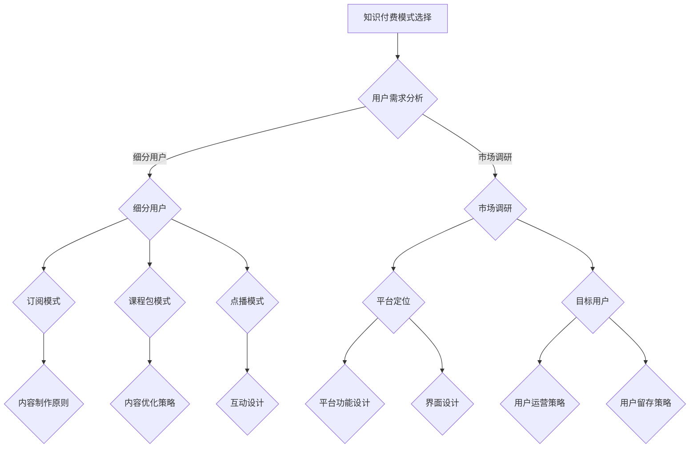

                 

# 如何利用知识付费实现在线学习与在线学习指导？

> 关键词：知识付费，在线学习，在线学习指导，平台构建，内容制作，用户增长，案例分析，未来展望

> 摘要：本文从知识付费的基本概念和在线学习概述出发，深入探讨了知识付费在在线学习中的应用，包括知识付费模式与在线学习平台的构建、知识付费内容制作与优化、在线学习指导策略与实践，以及知识付费与在线学习平台的运营与管理。通过成功与失败案例分析，展望了知识付费与在线学习指导的未来发展趋势。

**第一部分：知识付费与在线学习概述**

## 第1章：知识付费的基本概念与市场分析

### 1.1 知识付费的定义与特点

知识付费是指用户为获取特定知识或技能，自愿支付一定费用的行为。与传统免费获取知识的方式相比，知识付费具有以下特点：

1. **自愿性**：用户自愿为知识付费，反映了用户对知识的真正需求和价值认同。
2. **专业性**：知识付费平台上的内容通常由专业人士或权威机构提供，具有较高的专业性和实用性。
3. **个性化**：知识付费平台可以根据用户的需求和兴趣，提供个性化的知识服务。
4. **高互动性**：知识付费平台通常提供丰富的互动功能，如答疑、讨论、实战演练等，增强用户的学习体验。

### 1.2 知识付费市场的发展历程

知识付费市场的发展历程可以分为以下几个阶段：

1. **萌芽期（2010-2014年）**：以博客、论坛等形式的知识分享为主，用户开始意识到知识的价值。
2. **发展期（2015-2018年）**：移动互联网普及，知识付费平台如雨后春笋般涌现，市场快速扩张。
3. **成熟期（2019年至今）**：知识付费市场逐渐成熟，用户对知识付费的认可度提高，平台开始向垂直领域和专业化方向发展。

### 1.3 知识付费的主要平台与模式

目前，知识付费市场的主要平台包括：

1. **得到**：以订阅制为主，提供音频、图文、视频等多种形式的内容。
2. **知乎Live**：以实时直播、问答等形式为主，用户可以根据自己的需求购买课程。
3. **喜马拉雅**：以音频课程为主，用户可以通过付费购买课程来学习。
4. **微课堂**：以视频课程为主，提供丰富的课程种类，满足不同用户的需求。

知识付费模式主要包括以下几种：

1. **订阅制**：用户支付一定费用，可以无限次观看平台上的所有内容。
2. **课程包**：用户一次性购买多个课程，享受一定期限的学习权益。
3. **点播制**：用户根据需求选择购买单个课程。

### 1.4 知识付费对在线学习的影响

知识付费对在线学习产生了深远的影响：

1. **提高了学习效率**：用户可以根据自己的需求和兴趣选择知识内容，避免了无效学习。
2. **增加了学习动力**：付费学习让用户更加珍惜学习机会，提高了学习积极性。
3. **推动了教育产业的发展**：知识付费平台为教育产业提供了新的商业模式，促进了教育产业的创新与发展。

## 第2章：在线学习与在线学习指导概述

### 2.1 在线学习的定义与特点

在线学习是指通过互联网和数字技术，以在线课程、视频、文档等形式进行学习的一种方式。其特点如下：

1. **灵活性**：用户可以根据自己的时间安排，随时随地进行学习。
2. **个性化**：在线学习可以根据用户的需求和兴趣，提供个性化的学习内容。
3. **互动性**：在线学习平台通常提供互动功能，如讨论区、答疑等，方便用户交流和学习。
4. **多样性**：在线学习形式丰富，包括视频、音频、图文、文档等多种形式，满足不同用户的需求。

### 2.2 在线学习的发展历程

在线学习的发展历程可以分为以下几个阶段：

1. **萌芽期（1990年代）**：互联网的兴起，使得在线学习开始出现。
2. **发展期（2000年代）**：以Coursera、Udemy等为代表的在线学习平台涌现，市场迅速扩张。
3. **成熟期（2010年代）**：在线学习逐渐成为主流学习方式，市场成熟，平台竞争激烈。
4. **多元化期（2020年代）**：在线学习平台向垂直领域和专业化方向发展，内容丰富多样。

### 2.3 在线学习指导的重要性

在线学习指导在在线学习中扮演着重要角色：

1. **明确学习目标**：通过在线学习指导，用户可以明确自己的学习目标，提高学习效率。
2. **规划学习路径**：在线学习指导可以帮助用户规划合适的学习路径，避免无效学习。
3. **评估学习效果**：在线学习指导可以实时评估用户的学习效果，提供针对性的指导和建议。
4. **增强学习动力**：通过在线学习指导，用户可以感受到自己的进步，增强学习动力。

### 2.4 在线学习指导的方法与工具

在线学习指导的方法和工具主要包括：

1. **教学视频**：通过教学视频，向用户传授知识。
2. **文档资料**：提供相关的文档资料，方便用户学习。
3. **在线答疑**：建立讨论区或答疑系统，方便用户提问和交流。
4. **学习路径规划**：根据用户的需求和兴趣，为用户规划合适的学习路径。
5. **学习效果评估**：通过在线测试、作业等形式，评估用户的学习效果。

**第一部分：知识付费与在线学习概述**

## 第1章：知识付费的基本概念与市场分析

### 1.1 知识付费的定义与特点

知识付费是指用户为获取特定知识或技能，自愿支付一定费用的行为。与传统免费获取知识的方式相比，知识付费具有以下特点：

1. **自愿性**：用户自愿为知识付费，反映了用户对知识的真正需求和价值认同。
2. **专业性**：知识付费平台上的内容通常由专业人士或权威机构提供，具有较高的专业性和实用性。
3. **个性化**：知识付费平台可以根据用户的需求和兴趣，提供个性化的知识服务。
4. **高互动性**：知识付费平台通常提供丰富的互动功能，如答疑、讨论、实战演练等，增强用户的学习体验。

### 1.2 知识付费市场的发展历程

知识付费市场的发展历程可以分为以下几个阶段：

1. **萌芽期（2010-2014年）**：以博客、论坛等形式的知识分享为主，用户开始意识到知识的价值。
2. **发展期（2015-2018年）**：移动互联网普及，知识付费平台如雨后春笋般涌现，市场快速扩张。
3. **成熟期（2019年至今）**：知识付费市场逐渐成熟，用户对知识付费的认可度提高，平台开始向垂直领域和专业化方向发展。

### 1.3 知识付费的主要平台与模式

目前，知识付费市场的主要平台包括：

1. **得到**：以订阅制为主，提供音频、图文、视频等多种形式的内容。
2. **知乎Live**：以实时直播、问答等形式为主，用户可以根据自己的需求购买课程。
3. **喜马拉雅**：以音频课程为主，用户可以通过付费购买课程来学习。
4. **微课堂**：以视频课程为主，提供丰富的课程种类，满足不同用户的需求。

知识付费模式主要包括以下几种：

1. **订阅制**：用户支付一定费用，可以无限次观看平台上的所有内容。
2. **课程包**：用户一次性购买多个课程，享受一定期限的学习权益。
3. **点播制**：用户根据需求选择购买单个课程。

### 1.4 知识付费对在线学习的影响

知识付费对在线学习产生了深远的影响：

1. **提高了学习效率**：用户可以根据自己的需求和兴趣选择知识内容，避免了无效学习。
2. **增加了学习动力**：付费学习让用户更加珍惜学习机会，提高了学习积极性。
3. **推动了教育产业的发展**：知识付费平台为教育产业提供了新的商业模式，促进了教育产业的创新与发展。

## 第2章：在线学习与在线学习指导概述

### 2.1 在线学习的定义与特点

在线学习是指通过互联网和数字技术，以在线课程、视频、文档等形式进行学习的一种方式。其特点如下：

1. **灵活性**：用户可以根据自己的时间安排，随时随地进行学习。
2. **个性化**：在线学习可以根据用户的需求和兴趣，提供个性化的学习内容。
3. **互动性**：在线学习平台通常提供互动功能，如讨论区、答疑等，方便用户交流和学习。
4. **多样性**：在线学习形式丰富，包括视频、音频、图文、文档等多种形式，满足不同用户的需求。

### 2.2 在线学习的发展历程

在线学习的发展历程可以分为以下几个阶段：

1. **萌芽期（1990年代）**：互联网的兴起，使得在线学习开始出现。
2. **发展期（2000年代）**：以Coursera、Udemy等为代表的在线学习平台涌现，市场迅速扩张。
3. **成熟期（2010年代）**：在线学习逐渐成为主流学习方式，市场成熟，平台竞争激烈。
4. **多元化期（2020年代）**：在线学习平台向垂直领域和专业化方向发展，内容丰富多样。

### 2.3 在线学习指导的重要性

在线学习指导在在线学习中扮演着重要角色：

1. **明确学习目标**：通过在线学习指导，用户可以明确自己的学习目标，提高学习效率。
2. **规划学习路径**：在线学习指导可以帮助用户规划合适的学习路径，避免无效学习。
3. **评估学习效果**：在线学习指导可以实时评估用户的学习效果，提供针对性的指导和建议。
4. **增强学习动力**：通过在线学习指导，用户可以感受到自己的进步，增强学习动力。

### 2.4 在线学习指导的方法与工具

在线学习指导的方法和工具主要包括：

1. **教学视频**：通过教学视频，向用户传授知识。
2. **文档资料**：提供相关的文档资料，方便用户学习。
3. **在线答疑**：建立讨论区或答疑系统，方便用户提问和交流。
4. **学习路径规划**：根据用户的需求和兴趣，为用户规划合适的学习路径。
5. **学习效果评估**：通过在线测试、作业等形式，评估用户的学习效果。

### 2.5 在线学习指导与知识付费的关系

在线学习指导与知识付费密切相关：

1. **促进学习转化**：通过在线学习指导，用户可以更好地理解和应用所学知识，提高学习效果，从而促进知识付费的成功转化。
2. **提升用户粘性**：优秀的在线学习指导可以增强用户对平台的依赖性和忠诚度，提高用户留存率。
3. **优化课程内容**：在线学习指导可以帮助平台了解用户需求，优化课程内容和结构，提高课程质量。

**第二部分：知识付费在在线学习中的应用**

## 第3章：知识付费模式与在线学习平台的构建

### 3.1 知识付费模式的选择

知识付费模式的选择需要考虑用户需求、市场环境、平台资源等多个因素。以下是几种常见的知识付费模式：

1. **订阅制**：用户支付一定费用，可以无限次观看平台上的所有内容。适用于用户对内容有较高需求的场景，如专业课程、电子书等。

2. **课程包**：用户一次性购买多个课程，享受一定期限的学习权益。适用于用户希望系统学习某一领域的知识，如在线大学课程、专业培训等。

3. **点播制**：用户根据需求选择购买单个课程。适用于用户对特定知识有需求的场景，如职场技能、兴趣爱好等。

### 3.2 在线学习平台的构建流程

在线学习平台的构建需要遵循以下流程：

1. **确定平台定位与目标用户**：明确平台提供的内容方向和目标用户群体，为后续功能设计和内容制作提供依据。

2. **设计平台功能与界面**：根据用户需求，设计平台的功能模块和用户界面，提高用户体验。

3. **选择合适的支付方式**：为用户支付提供便捷的支付方式，如支付宝、微信支付、银行卡支付等。

4. **平台安全与隐私保护**：确保用户数据和支付信息的安全性，遵守相关法律法规，保护用户隐私。

### 3.3 在线学习平台的功能设计

在线学习平台的功能设计包括：

1. **课程库**：提供丰富的课程内容，满足不同用户的需求。

2. **学习路径规划**：根据用户的学习目标，为用户规划合适的学习路径。

3. **互动区**：提供讨论区、答疑系统、社交互动等功能，方便用户交流和学习。

4. **学习效果评估**：通过在线测试、作业等形式，评估用户的学习效果。

5. **个性化推荐**：根据用户的学习行为和兴趣，为用户推荐合适的课程和学习资源。

### 3.4 在线学习平台的运营策略

在线学习平台的运营策略包括：

1. **用户增长策略**：通过内容营销、活动推广、合作渠道等方式，吸引更多用户注册和使用平台。

2. **用户留存策略**：通过个性化推荐、学习奖励、社群互动等方式，增强用户对平台的依赖性和忠诚度。

3. **内容运营策略**：不断优化课程内容，提高课程质量，满足用户需求。

4. **财务管理策略**：合理控制成本，提高收入，实现可持续发展。

### 3.5 在线学习平台的安全与隐私保护

在线学习平台的安全与隐私保护包括：

1. **数据加密**：采用SSL加密技术，保护用户数据和支付信息的安全性。

2. **隐私保护**：遵守相关法律法规，对用户隐私信息进行严格管理。

3. **安全审计**：定期进行安全审计，发现并修复潜在的安全漏洞。

**第二部分：知识付费在在线学习中的应用**

## 第4章：知识付费内容制作与优化

### 4.1 知识付费内容的制作原则

知识付费内容制作应遵循以下原则：

1. **实用性**：内容应紧密围绕用户需求，提供实际可操作的知识和技能。

2. **专业性**：内容应具有专业性和权威性，由专业人士或权威机构提供。

3. **个性化**：内容应针对不同用户的需求和兴趣，提供个性化的学习资源。

4. **完整性**：内容应系统、完整，帮助用户构建知识体系。

5. **更新性**：内容应保持更新，反映最新的行业动态和技术发展。

### 4.2 知识付费内容的优化策略

知识付费内容的优化策略包括：

1. **标题优化**：使用吸引人的标题，提高内容的点击率和转化率。

2. **描述优化**：详细描述内容的核心价值和学习目标，帮助用户更好地了解内容。

3. **互动设计**：增加互动环节，如问答、讨论区等，提高用户的参与度和学习效果。

4. **内容结构优化**：合理组织内容结构，使内容层次清晰，便于用户阅读和理解。

5. **图片和视频优化**：使用高质量的图片和视频，提高内容的视觉效果。

### 4.3 知识付费内容的推广策略

知识付费内容的推广策略包括：

1. **平台内推广**：利用平台自身的推广工具，如推荐位、推送等，提高内容的曝光度。

2. **社交媒体推广**：通过微博、微信、知乎等社交媒体平台，进行内容推广和用户互动。

3. **合作伙伴推广**：与行业内的合作伙伴合作，共同推广内容。

4. **内容营销**：通过撰写相关文章、发布案例等，进行内容营销，吸引更多用户。

### 4.4 知识付费内容的评估与反馈

知识付费内容的评估与反馈包括：

1. **用户评分和评论**：通过用户评分和评论，了解内容的受欢迎程度和质量。

2. **学习效果评估**：通过学习效果评估，了解内容对用户的影响。

3. **数据分析**：通过数据分析，了解内容的点击率、转化率、留存率等指标。

4. **持续优化**：根据评估和反馈结果，对内容进行持续优化和改进。

**第二部分：知识付费在在线学习中的应用**

## 第5章：在线学习指导的策略与实践

### 5.1 在线学习指导的核心要素

在线学习指导的核心要素包括：

1. **教学目标的确立**：明确学习目标，为用户提供清晰的学习方向。

2. **学习路径的设计**：根据用户需求和学习目标，设计合理的课程和学习路径。

3. **学习效果的评估**：通过在线测试、作业等形式，评估用户的学习效果。

4. **学习资源的提供**：提供丰富的学习资源，满足用户多样化的学习需求。

5. **互动与反馈**：建立互动渠道，如讨论区、答疑系统等，方便用户交流和学习。

### 5.2 在线学习指导的策略

在线学习指导的策略包括：

1. **基于个性化推荐的指导策略**：根据用户的学习行为和兴趣，为用户推荐合适的课程和学习资源。

2. **基于社群互动的指导策略**：建立学习社群，鼓励用户互动和分享，提高学习效果。

3. **基于数据分析的指导策略**：通过数据分析，了解用户的学习习惯和效果，提供针对性的指导和建议。

### 5.3 在线学习指导的实践案例

以下是三个在线学习指导的实践案例：

1. **案例一：课程设计**

   - 确立教学目标：帮助用户掌握Python编程技能。

   - 设计学习路径：从基础知识到高级应用，逐步提升用户的能力。

   - 提供学习资源：包括视频教程、文档资料、代码示例等。

   - 互动与反馈：建立讨论区，方便用户提问和交流，定期发布学习报告。

2. **案例二：社群运营**

   - 建立学习社群：通过微信群、QQ群等，将用户组织起来。

   - 鼓励互动和分享：定期组织线上活动，鼓励用户分享学习心得和经验。

   - 提供学习支持：邀请专业人士进行答疑和指导，帮助用户解决学习难题。

3. **案例三：数据分析应用**

   - 收集用户数据：记录用户的学习行为和效果。

   - 数据分析：分析用户的学习习惯和效果，发现潜在问题。

   - 提供个性化指导：根据数据分析结果，为用户制定个性化的学习计划。

### 5.4 在线学习指导的效果评估

在线学习指导的效果评估可以从以下几个方面进行：

1. **用户满意度**：通过用户调查和反馈，了解用户对学习指导的满意度。

2. **学习成果**：通过学习测试、作业等，评估用户的学习成果。

3. **用户留存率**：通过用户留存率，评估学习指导的效果。

4. **课程转化率**：通过课程转化率，评估学习指导对课程销售的影响。

### 5.5 在线学习指导的挑战与应对策略

在线学习指导面临的挑战包括：

1. **用户需求多样化**：如何满足不同用户的需求，提供个性化的学习指导。

2. **内容质量保障**：如何保证学习内容的质量，提高用户满意度。

3. **互动与反馈**：如何建立有效的互动机制，提高用户参与度。

应对策略：

1. **精细化运营**：通过数据分析，了解用户需求，提供个性化的学习指导。

2. **内容质量控制**：建立严格的内容审核机制，确保学习内容的质量。

3. **互动与反馈机制**：设计多样化的互动形式，提高用户参与度，及时收集用户反馈。

**第三部分：知识付费与在线学习指导的运营与管理**

## 第6章：知识付费与在线学习平台的运营策略

### 6.1 用户增长与留存策略

用户增长与留存是知识付费与在线学习平台运营的重要目标。以下是一些有效的策略：

1. **精准定位目标用户**：了解目标用户群体的特征和需求，为其提供有针对性的内容和服务。

2. **优质内容生产**：确保平台上的课程和内容质量，满足用户的学习需求。

3. **活动推广**：定期举办线上或线下活动，吸引用户参与，提高用户活跃度。

4. **口碑营销**：通过用户口碑传播，吸引新用户注册和使用平台。

5. **用户社群建设**：建立用户社群，鼓励用户互动和分享，提高用户粘性。

### 6.2 内容运营策略

内容运营是知识付费与在线学习平台的核心，以下是一些关键策略：

1. **内容策划与发布**：根据用户需求和市场趋势，策划和发布有吸引力的内容。

2. **内容推广与营销**：利用社交媒体、广告等渠道，推广平台内容和课程。

3. **内容评估与优化**：定期评估内容的表现，优化内容结构，提高用户满意度。

4. **互动设计**：增加互动环节，如讨论区、问答等，增强用户参与感。

### 6.3 财务管理策略

财务管理是知识付费与在线学习平台运营的重要环节，以下是一些关键策略：

1. **成本控制**：合理控制运营成本，提高利润率。

2. **收入来源多样化**：除了课程销售，还可以通过广告、会员制、合作伙伴等多种方式获取收入。

3. **利润模式优化**：根据市场情况和用户需求，不断优化利润模式，提高盈利能力。

4. **风险管理与应对策略**：建立风险管理体系，应对市场变化和风险挑战。

### 6.4 用户运营策略

用户运营是知识付费与在线学习平台运营的关键，以下是一些关键策略：

1. **用户定位与细分**：了解不同用户群体的特征和需求，为其提供定制化的服务和内容。

2. **用户运营策略**：通过用户互动、活动推广、社群建设等方式，提高用户参与度和粘性。

3. **用户留存与激活策略**：通过学习激励、个性化推荐、用户反馈等方式，提高用户留存率和活跃度。

4. **用户服务与支持**：提供优质的用户服务，解决用户问题和疑虑，提高用户满意度。

### 6.5 数据分析与应用

数据分析是知识付费与在线学习平台运营的重要工具，以下是一些关键应用：

1. **用户行为分析**：通过分析用户行为数据，了解用户的学习习惯、偏好和需求。

2. **内容表现分析**：通过分析内容的表现数据，了解内容的受欢迎程度和用户满意度。

3. **营销效果分析**：通过分析营销活动的效果数据，优化营销策略，提高营销效果。

4. **运营优化**：根据数据分析结果，不断优化平台运营策略，提高运营效率。

## 第7章：知识付费与在线学习指导的案例分析

### 7.1 成功案例分析

以下是一些知识付费与在线学习指导的成功案例分析：

1. **案例一：得到**

   - 平台定位：以提供高质量的知识内容为主，覆盖职场技能、人文历史、科技发展等多个领域。

   - 运营策略：通过邀请知名专家、权威人士进行授课，确保内容的专业性和实用性。同时，利用订阅模式，吸引用户长期关注和学习。

   - 效果：得到在短时间内积累了大量用户，实现了从零到千万用户的突破。其课程销售和订阅收入持续增长，成为知识付费领域的佼佼者。

2. **案例二：知乎Live**

   - 平台定位：以提供实时直播、问答等形式的知识分享为主，满足用户对实时互动和深度交流的需求。

   - 运营策略：通过知乎社区的用户基础，吸引知名人士和行业专家进行授课。同时，利用社群互动，提高用户的参与度和粘性。

   - 效果：知乎Live在短时间内积累了大量用户，课程销售和互动人数持续增长，成为知识付费领域的重要参与者。

3. **案例三：Coursera**

   - 平台定位：以提供全球知名大学和机构的在线课程为主，覆盖计算机科学、商业管理、人工智能等多个领域。

   - 运营策略：通过与世界顶级大学和机构的合作，确保课程的质量和权威性。同时，利用个性化推荐和学习路径规划，提高用户的学习效果。

   - 效果：Coursera在全球范围内吸引了大量用户，课程销售和订阅收入持续增长，成为在线学习领域的领军者。

### 7.2 失败案例分析

以下是一些知识付费与在线学习指导的失败案例分析：

1. **案例一：某知名知识付费平台**

   - 平台定位：以提供高质量的知识内容为主，覆盖职场技能、人文历史、科技发展等多个领域。

   - 运营策略：大量投入广告和营销，快速扩张用户规模。然而，内容质量无法保证，用户满意度下降。

   - 效果：由于内容质量问题，平台用户流失严重，收入增长停滞，最终导致运营失败。

2. **案例二：某在线学习平台**

   - 平台定位：以提供实时直播、问答等形式的知识分享为主，满足用户对实时互动和深度交流的需求。

   - 运营策略：缺乏有效的用户互动和反馈机制，用户参与度低。同时，课程质量参差不齐，用户满意度下降。

   - 效果：平台用户流失严重，收入增长停滞，最终导致运营失败。

3. **案例三：某在线教育平台**

   - 平台定位：以提供在线课程为主，覆盖职业培训、学历教育等多个领域。

   - 运营策略：缺乏有效的市场调研和用户分析，课程内容与市场需求不符。同时，平台运营效率低，成本高。

   - 效果：平台用户流失严重，收入增长停滞，最终导致运营失败。

### 7.3 案例分析总结

成功案例和失败案例的共同点和区别：

- **共同点**：成功案例和失败案例都强调了内容质量、用户互动和运营策略的重要性。内容质量是知识付费与在线学习指导的核心，用户互动和运营策略则决定了用户满意度和留存率。

- **区别**：成功案例在内容质量、用户互动和运营策略方面做得更好，而失败案例则在这些问题上存在明显不足。此外，成功案例注重市场调研和用户分析，了解市场需求和用户需求，而失败案例则缺乏这些关键因素。

通过成功案例和失败案例的分析，可以为知识付费与在线学习指导提供有益的借鉴和启示：

1. **注重内容质量**：确保课程内容的专业性和实用性，满足用户需求。

2. **加强用户互动**：建立有效的用户互动和反馈机制，提高用户满意度。

3. **优化运营策略**：根据市场调研和用户分析，制定有针对性的运营策略。

4. **持续改进**：不断优化平台和课程，提高用户留存率和活跃度。

**第四部分：未来展望与趋势分析**

## 第8章：知识付费与在线学习指导的未来发展趋势

### 8.1 技术进步对知识付费与在线学习的影响

随着技术的不断进步，知识付费与在线学习将迎来新的发展趋势：

1. **人工智能与大数据分析的应用**：人工智能和大数据分析将帮助平台更好地了解用户需求，提供个性化的知识服务。通过分析用户行为数据，平台可以推荐合适的课程和内容，提高用户满意度。

2. **区块链技术在知识付费领域的应用**：区块链技术可以确保知识付费平台的交易安全，提高用户信任度。同时，区块链技术可以为知识付费平台提供去中心化的解决方案，降低运营成本。

3. **虚拟现实与增强现实技术的应用**：虚拟现实（VR）和增强现实（AR）技术将为在线学习带来更加丰富的学习体验。通过VR/AR技术，用户可以沉浸式地学习，提高学习效果。

### 8.2 行业趋势与机遇

知识付费与在线学习领域将迎来以下趋势和机遇：

1. **知识付费市场的细分与多元化**：随着用户需求的多样化，知识付费市场将不断细分，满足不同用户群体的需求。同时，知识付费平台将向多元化方向发展，提供更多样化的知识服务。

2. **在线学习与职业教育的融合**：在线学习平台将加强与职业教育的合作，提供职业培训课程，帮助用户提升职业技能。这将为知识付费与在线学习带来新的增长点。

3. **新型在线学习模式的探索**：随着技术的进步，新型在线学习模式将不断涌现，如在线直播教学、互动式学习等。这些新模式将为用户带来更加灵活、高效的学习体验。

### 8.3 挑战与应对策略

知识付费与在线学习指导在未来发展过程中将面临以下挑战：

1. **政策法规与监管挑战**：随着知识付费与在线学习的发展，相关政策法规和监管要求也将不断加强。平台需要遵守相关法规，确保合规运营。

2. **内容质量与知识产权保护**：确保内容质量是知识付费与在线学习的关键。同时，平台需要加强对知识产权的保护，防止侵权行为的发生。

3. **用户隐私保护与数据安全**：随着大数据和人工智能技术的发展，用户隐私保护和数据安全成为重要议题。平台需要建立完善的安全机制，确保用户数据和隐私的安全。

应对策略：

1. **加强政策法规研究**：及时关注政策法规变化，确保平台合规运营。

2. **提高内容质量**：加强内容审核，确保内容的专业性和权威性。

3. **完善安全机制**：建立完善的数据安全防护体系，确保用户数据和隐私的安全。

4. **用户教育与培训**：加强对用户的宣传教育，提高用户的隐私保护意识。

### 8.4 未来展望

知识付费与在线学习指导在未来将呈现以下发展趋势：

1. **个性化与智能化**：随着人工智能和大数据分析技术的发展，知识付费与在线学习将更加个性化与智能化，为用户提供量身定制的学习体验。

2. **跨界融合**：知识付费与在线学习将与其他领域如职业教育、娱乐产业等深度融合，创造新的商业模式。

3. **全球化发展**：随着互联网的普及，知识付费与在线学习将走向全球化，为全球用户提供优质的知识服务。

4. **可持续发展**：知识付费与在线学习将注重可持续发展，关注用户需求和社会责任，推动教育公平和知识普及。

## 附录A：知识付费与在线学习指导的相关资源与工具

### A.1 知识付费平台推荐

1. **得到**：提供各类音频、图文、视频等知识内容，以订阅制为主。

2. **知乎Live**：提供实时直播、问答等互动式知识分享，满足用户深度交流需求。

3. **喜马拉雅**：提供丰富的音频课程，涵盖各个领域，适合用户碎片化学习。

4. **微课堂**：提供各类视频课程，内容覆盖广泛，适合用户系统学习。

### A.2 在线学习工具推荐

1. **Coursera**：提供全球知名大学和机构的在线课程，涵盖多个领域。

2. **Udemy**：提供丰富多样的在线课程，适合用户自我提升和职业发展。

3. **Khan Academy**：提供免费的教育资源，涵盖数学、科学、计算机科学等多个领域。

4. **网易云课堂**：提供各类在线课程，包括编程、设计、语言等，适合用户多样化学习需求。

### A.3 开发者工具与资源

1. **Scikit-learn**：Python机器学习库，用于构建推荐系统和数据分析模型。

2. **TensorFlow**：谷歌开发的深度学习框架，适用于构建复杂的机器学习模型。

3. **PyTorch**：Facebook开发的深度学习框架，具有灵活性和易用性。

4. **Jupyter Notebook**：交互式计算环境，适合编写和分享代码、文档和笔记。

### A.4 学术论文与研究报告

1. **《知识付费：定义、模式与市场分析》**：详细探讨知识付费的定义、模式和市场规模。

2. **《在线学习指导策略与实践》**：介绍在线学习指导的策略和方法，包括学习路径规划、效果评估等。

3. **《人工智能在知识付费领域的应用研究》**：探讨人工智能在知识付费领域的应用，包括推荐系统、内容分析等。

4. **《知识付费与在线学习：挑战与机遇》**：分析知识付费与在线学习的挑战和机遇，包括政策法规、内容质量、用户隐私等。

## Mermaid 流程图



## 核心算法原理讲解（伪代码）

```python
# 伪代码：用户推荐系统算法

# 输入：用户行为数据，课程内容数据
# 输出：个性化推荐结果

function user_recommendation(user_actions, course_data):
    # 步骤1：计算用户行为与课程内容的相似度
    similarity_matrix = calculate_similarity(user_actions, course_data)

    # 步骤2：根据相似度矩阵生成推荐列表
    recommendation_list = generate_recommendation_list(similarity_matrix)

    # 步骤3：对推荐列表进行排序
    sorted_recommendations = sort_recommendations(recommendation_list)

    # 步骤4：返回推荐结果
    return sorted_recommendations

# 步骤1：计算用户行为与课程内容的相似度
def calculate_similarity(user_actions, course_data):
    # 使用余弦相似度计算相似度矩阵
    similarity_matrix = cosine_similarity(user_actions, course_data)
    return similarity_matrix

# 步骤2：根据相似度矩阵生成推荐列表
def generate_recommendation_list(similarity_matrix):
    # 根据相似度矩阵生成推荐列表
    recommendation_list = []
    for user_id in user_actions['user_id'].unique():
        user_row = user_actions[user_actions['user_id'] == user_id].values.reshape(1, -1)
        course_similarity = similarity_matrix[user_row, :]
        sorted_courses = np.argsort(course_similarity[0])[::-1]
        recommendation_list.append(sorted_courses)
    return recommendation_list

# 步骤3：对推荐列表进行排序
def sort_recommendations(recommendation_list):
    # 对推荐列表进行排序
    sorted_recommendations = [recommendation[:10] for recommendation in recommendation_list]
    return sorted_recommendations
```

## 数学模型和数学公式讲解

段落一：
$$
相似度 = \frac{相似项数量}{总项数量}
$$
相似度公式用于衡量用户行为与课程内容之间的相似程度。

段落二：
$$
推荐得分 = \sum_{i=1}^{n} (similarity_{ui} \times weight_{i})
$$
推荐得分公式用于计算个性化推荐结果中的每个课程的得分，其中$similarity_{ui}$表示用户$u$与课程$i$的相似度，$weight_{i}$表示课程$i$的权重。

## 项目实战案例

### 案例一：用户推荐系统的实现

#### 开发环境搭建
- 使用Python编程语言进行开发
- 使用Scikit-learn库进行用户行为与课程内容的相似度计算
- 使用 Pandas 库进行数据处理

#### 代码实现
```python
import numpy as np
from sklearn.metrics.pairwise import cosine_similarity
import pandas as pd

# 加载用户行为数据
user_actions = pd.read_csv('user_actions.csv')

# 加载课程内容数据
course_data = pd.read_csv('course_data.csv')

# 步骤1：计算用户行为与课程内容的相似度
similarity_matrix = cosine_similarity(user_actions, course_data)

# 步骤2：生成推荐列表
recommendation_list = []

for user_id in user_actions['user_id'].unique():
    user_row = user_actions[user_actions['user_id'] == user_id].values.reshape(1, -1)
    course_similarity = similarity_matrix[user_row, :]
    sorted_courses = np.argsort(course_similarity[0])[::-1]
    recommendation_list.append(sorted_courses)

# 步骤3：对推荐列表进行排序
sorted_recommendations = [recommendation[:10] for recommendation in recommendation_list]

# 输出推荐结果
print(sorted_recommendations)
```

#### 代码解读与分析
- 加载用户行为数据和课程内容数据
- 使用余弦相似度计算用户行为与课程内容的相似度
- 根据相似度矩阵生成推荐列表，并对推荐列表进行排序
- 输出推荐结果

## 附录A：知识付费与在线学习指导的相关资源与工具

### A.1 知识付费平台推荐
- 知识星球
- 得到
- 微课堂

### A.2 在线学习工具推荐
- Coursera
- Udemy
- Khan Academy

### A.3 开发者工具与资源
- Scikit-learn
- TensorFlow
- PyTorch

### A.4 学术论文与研究报告
- 《知识付费：定义、模式与市场分析》
- 《在线学习指导策略与实践》
- 《人工智能在知识付费领域的应用研究》

**作者：AI天才研究院/AI Genius Institute & 禅与计算机程序设计艺术 /Zen And The Art of Computer Programming**

