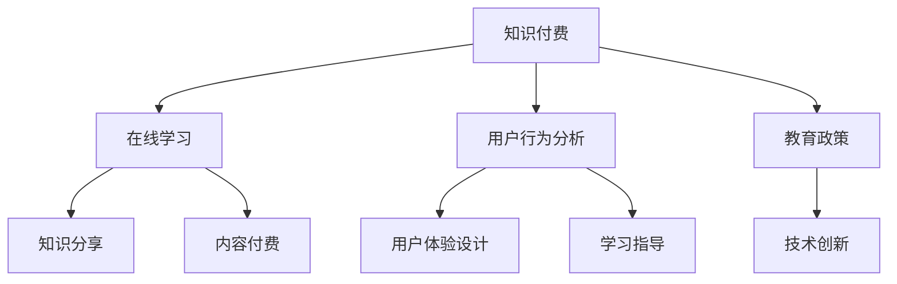

                 

# 如何利用知识付费实现在线学习与在线学习指导？

## 关键词

知识付费、在线学习、在线学习指导、用户行为分析、用户体验设计、学习指导策略

## 摘要

随着互联网技术的不断发展，知识付费和在线学习已成为现代教育的重要组成部分。本文旨在探讨如何利用知识付费模式实现在线学习与在线学习指导的有效结合，提高学习效果和用户体验。文章将从知识付费概述、在线学习平台生态系统、在线学习与知识付费的关系、知识付费产品的设计与开发、在线学习指导的实践与策略、案例研究、未来发展等多个方面进行详细分析，以期为教育从业者和技术开发人员提供有价值的参考。

## 目录大纲

### 第一部分：知识付费概述

#### 第1章：知识付费的兴起与市场分析
- 1.1 知识付费的定义与内涵
- 1.2 知识付费市场的崛起
- 1.3 知识付费的商业模式
- 1.4 知识付费的未来趋势

#### 第2章：在线学习平台生态系统
- 2.1 在线学习平台概述
- 2.2 平台运营模式
- 2.3 用户行为分析
- 2.4 平台与教育机构的合作模式

#### 第3章：在线学习与知识付费的关系
- 3.1 在线学习的特点
- 3.2 知识付费对在线学习的影响
- 3.3 知识付费与在线学习的融合
- 3.4 知识付费在线学习模式的案例分析

#### 第4章：知识付费产品的设计与开发
- 4.1 知识付费产品类型
- 4.2 产品设计与用户体验
- 4.3 内容创作与质量保障
- 4.4 付费机制的设置与调整

#### 第5章：在线学习指导的实践与策略
- 5.1 在线学习指导的概念与意义
- 5.2 学习指导的方法与工具
- 5.3 指导策略的制定与实施
- 5.4 指导效果的评估与优化

#### 第6章：案例研究：知识付费在线学习指导的实践
- 6.1 案例选择与介绍
- 6.2 案例分析
- 6.3 案例中的成功经验与挑战
- 6.4 案例的启示与展望

#### 第7章：知识付费在线学习与学习指导的未来发展
- 7.1 当前存在的问题与挑战
- 7.2 技术创新对知识付费在线学习的影响
- 7.3 教育政策的支持与引导
- 7.4 未来发展展望

### 第二部分：核心概念与联系

#### 第8章：知识付费相关概念流程图

### 第三部分：核心算法原理讲解

#### 第9章：知识付费算法原理
- 9.1 用户推荐算法
  - 9.1.1 基于内容的推荐算法
  - 9.1.2 基于协同过滤的推荐算法
- 9.2 学习行为分析算法
  - 9.2.1 时间序列分析
  - 9.2.2 决策树与分类算法
- 9.3 付费意愿预测算法
  - 9.3.1 神经网络模型
  - 9.3.2 伪代码实现

#### 第10章：在线学习与知识付费的数学模型
- 10.1 用户参与度模型
- 10.2 付费转化率模型
- 10.3 案例分析中的数学应用

### 第四部分：项目实战

#### 第11章：知识付费在线学习项目实战
- 11.1 项目背景与目标
- 11.2 开发环境搭建
- 11.3 源代码实现与解析
  - 11.3.1 用户推荐系统实现
  - 11.3.2 学习行为分析系统实现
  - 11.3.3 付费转化率预测系统实现

#### 第12章：代码解读与分析
- 12.1 用户推荐系统代码解读
- 12.2 学习行为分析系统代码解读
- 12.3 付费转化率预测系统代码解读

### 附录

#### 附录 A：知识付费与在线学习指导相关工具与资源

本文将按照上述目录大纲，逐章详细探讨知识付费实现在线学习与在线学习指导的各个方面，旨在为读者提供系统、深入的了解和指导。接下来，我们将首先从知识付费的兴起与市场分析开始，逐步深入探讨相关知识。

### 第一部分：知识付费概述

## 第1章：知识付费的兴起与市场分析

### 1.1 知识付费的定义与内涵

知识付费，顾名思义，是指用户为获取有价值的信息、知识或技能而自愿支付一定费用的行为。知识付费的兴起源于信息爆炸的时代背景，互联网的普及使得信息获取变得更加便捷，但同时也导致了信息过载的问题。为了在纷繁复杂的信息中筛选出真正有价值的内容，用户开始愿意为优质的知识和技能付费。

知识付费的内涵主要包括以下几个方面：

1. **内容价值**：知识付费的核心在于内容的实际价值。内容提供者需要确保所提供的信息或知识具有实用性和深度，能够满足用户的学习和成长需求。
2. **用户体验**：知识付费不仅仅是买卖关系，更是一种服务体验。良好的用户体验能够增加用户粘性，提高用户满意度和忠诚度。
3. **商业模式**：知识付费的商业模式多样，包括订阅制、单次购买、会员制等。不同的商业模式适用于不同的用户群体和内容类型，需要根据实际情况进行选择。

### 1.2 知识付费市场的崛起

知识付费市场的崛起可以追溯到2016年左右，随着移动互联网的普及和人们对于自我提升的需求日益增加，知识付费逐渐成为了一种新兴的商业模式。以下是一些推动知识付费市场崛起的主要因素：

1. **移动互联网的普及**：智能手机的普及和移动互联网的发展，使得人们可以随时随地获取信息和知识，为知识付费提供了便利条件。
2. **用户需求变化**：随着生活水平的提高和竞争的加剧，用户对于自我提升的需求愈发强烈，知识付费成为满足这一需求的有效途径。
3. **内容生产者的崛起**：在知识付费的浪潮中，大量专业内容生产者通过在线平台分享自己的知识和经验，为用户提供了丰富的学习资源。

### 1.3 知识付费的商业模式

知识付费的商业模式多样，主要包括以下几种：

1. **订阅制**：用户通过支付一定费用，获得平台提供的长期学习权限。这种模式适用于提供系统化、长期性的知识内容。
2. **单次购买**：用户为特定内容或课程支付一次费用，即可获得永久学习权限。这种模式适用于特定领域或短期的知识需求。
3. **会员制**：用户支付一定费用成为会员，享受平台提供的多种服务和优惠。这种模式适用于提供丰富内容和多样化服务的平台。
4. **广告模式**：部分知识付费平台通过广告收入来补贴用户的学习费用，用户免费或低成本获得学习资源。这种模式适用于内容生产者较多的平台。

### 1.4 知识付费的未来趋势

随着技术的不断进步和市场需求的多样化，知识付费市场将呈现出以下趋势：

1. **个性化推荐**：通过大数据和人工智能技术，实现更加精准的内容推荐，提高用户的学习体验和效果。
2. **优质内容为王**：内容质量将成为知识付费市场的关键竞争力，优质内容生产者将获得更多的市场份额。
3. **多元化商业模式**：知识付费的商业模式将更加多元化，以满足不同用户群体的需求。
4. **跨界融合**：知识付费将与教育、娱乐、社交等多个领域进行跨界融合，创造新的商业模式和生态系统。

### 第2章：在线学习平台生态系统

#### 2.1 在线学习平台概述

在线学习平台是指通过互联网技术为学习者提供学习资源、学习工具和学习服务的在线教育系统。在线学习平台具有以下几个主要特点：

1. **资源共享**：在线学习平台提供了丰富的学习资源，包括视频课程、电子书、文档等，用户可以根据自己的需求自由选择和利用。
2. **自主性学习**：用户可以根据自己的时间安排和学习节奏进行学习，具有较高的灵活性和自主性。
3. **互动性**：在线学习平台提供了多种互动工具，如论坛、聊天室、直播等，用户可以在平台上进行交流和互动，提高学习效果。
4. **数据分析**：通过用户的行为数据，在线学习平台可以分析用户的学习习惯和需求，为用户提供个性化的学习推荐。

#### 2.2 平台运营模式

在线学习平台的运营模式主要包括以下几种：

1. **B2C模式**：B2C（Business-to-Consumer）模式是指平台直接面向消费者提供服务，用户通过支付费用获得学习权限。这种模式适用于提供系统化、长期性的学习内容。
2. **B2B模式**：B2B（Business-to-Business）模式是指平台为企业或组织提供在线学习解决方案，帮助企业或组织进行员工培训。这种模式适用于企业客户，具有较高的专业性和定制化需求。
3. **C2C模式**：C2C（Consumer-to-Consumer）模式是指平台为用户提供一个交流和学习的环境，用户可以在平台上发布自己的学习资源，其他用户可以付费学习。这种模式适用于内容生产者较多的平台，具有较高的用户互动性和自主性。

#### 2.3 用户行为分析

用户行为分析是提高在线学习平台用户体验和运营效果的重要手段。通过对用户行为的分析，平台可以了解用户的学习习惯、需求和行为模式，为用户提供个性化的学习推荐和体验优化。

用户行为分析的主要方法包括：

1. **数据收集**：通过收集用户在平台上的行为数据，如浏览记录、学习进度、互动行为等，为行为分析提供数据支持。
2. **数据分析**：利用数据分析工具，对收集到的用户行为数据进行分析，识别用户的行为特征和需求。
3. **用户画像**：通过用户画像技术，将用户的行为数据转化为可视化的用户画像，为用户推荐和体验优化提供依据。

#### 2.4 平台与教育机构的合作模式

在线学习平台与教育机构的合作模式主要包括以下几种：

1. **内容合作**：在线学习平台与教育机构合作，引入教育机构的优质课程内容，为用户提供学习资源。这种模式适用于教育机构有丰富的课程资源，但缺乏在线推广和运营能力的情况。
2. **技术合作**：在线学习平台为教育机构提供在线教育技术支持，包括学习平台搭建、课程制作、数据分析等，帮助教育机构提高在线教育能力。这种模式适用于教育机构具备一定的教育资源和内容，但缺乏技术支持的情况。
3. **品牌合作**：在线学习平台与教育机构进行品牌合作，共同打造在线教育品牌，提高品牌知名度和用户认可度。这种模式适用于教育机构和在线学习平台具有共同的愿景和目标，希望通过合作实现双赢。

### 第3章：在线学习与知识付费的关系

#### 3.1 在线学习的特点

在线学习作为一种新型的学习方式，具有以下几个主要特点：

1. **灵活性**：在线学习不受时间和地点的限制，用户可以根据自己的需求和方便随时随地进行学习，具有较高的灵活性。
2. **自主性**：在线学习强调用户的自主学习，用户可以根据自己的学习节奏和需求进行学习，具有较高的自主性。
3. **互动性**：在线学习平台提供了多种互动工具，如论坛、聊天室、直播等，用户可以在平台上进行交流和互动，提高学习效果。
4. **个性化**：通过用户行为数据的收集和分析，在线学习平台可以为用户提供个性化的学习推荐，提高学习效果和用户体验。

#### 3.2 知识付费对在线学习的影响

知识付费对在线学习产生了深远的影响，主要表现在以下几个方面：

1. **内容质量提升**：知识付费使得优质内容生产者能够获得收益，从而鼓励更多优秀的内容生产者投入到在线学习领域，提高在线学习内容的质量。
2. **学习积极性提高**：知识付费使得用户为学习付费，从而提高了用户的学习积极性和投入度，有助于提高学习效果。
3. **商业模式创新**：知识付费为在线学习平台提供了新的商业模式，如订阅制、会员制等，为平台提供了更多的收入来源。
4. **用户体验优化**：知识付费使得在线学习平台能够投入更多的资源进行用户体验优化，提高用户的学习体验和满意度。

#### 3.3 知识付费与在线学习的融合

知识付费与在线学习的融合是当前在线教育领域的重要发展趋势，两者之间的融合主要体现在以下几个方面：

1. **内容付费化**：在线学习平台将部分优质内容设置为付费内容，用户需要付费才能观看或学习。这种模式有助于提高平台的内容质量和用户体验。
2. **服务付费化**：在线学习平台提供多种增值服务，如个性化推荐、学习辅导、职业规划等，用户需要付费才能享受这些服务。这种模式有助于提高平台的盈利能力和用户粘性。
3. **平台合作**：在线学习平台与教育机构、企业等进行合作，共同提供知识付费产品和服务。这种模式有助于扩大平台的内容资源和服务范围，提高用户满意度。
4. **技术融合**：知识付费与在线学习技术的融合，如大数据、人工智能等，为用户提供更加精准和个性化的学习推荐和指导。

#### 3.4 知识付费在线学习模式的案例分析

以下是一些知识付费在线学习模式的案例分析：

1. **案例一：网易云课堂**
   网易云课堂是网易公司推出的在线学习平台，提供包括编程、设计、职场技能等多个领域的课程。网易云课堂采用知识付费模式，用户需要付费才能学习部分课程。通过个性化推荐和用户体验优化，网易云课堂提高了用户的学习积极性和满意度。

2. **案例二：得到APP**
   得到APP是罗辑思维团队推出的知识付费平台，提供包括音频、视频、文章等多种形式的知识内容。得到APP采用会员制模式，用户需要支付一定费用成为会员，享受平台提供的多种知识服务。通过内容付费和会员制模式，得到APP实现了可持续的商业模式和用户粘性。

3. **案例三：知乎Live**
   知乎Live是知乎推出的知识付费产品，用户可以在知乎Live平台上付费观看专业人士的直播课程和问答。知乎Live通过内容付费和互动模式，为用户提供了高质量的知识分享和交流平台。

### 第4章：知识付费产品的设计与开发

#### 4.1 知识付费产品类型

知识付费产品类型多样，根据不同的维度可以进行以下分类：

1. **按内容类型分类**
   - 视频课程：通过视频形式传授知识和技能，具有生动、直观的特点。
   - 电子书：以电子文档形式提供知识和信息，便于用户随时查阅。
   - 文章分享：通过文章形式分享专业知识、经验心得等。
   - 线下课程：针对特定领域或技能，提供线下授课和实操指导。

2. **按学习方式分类**
   - 线上学习：通过互联网进行学习，用户可以随时随地进行学习。
   - 线下学习：在特定的地点和时间进行学习，通常需要预约或报名。
   - 线上线下混合学习：结合线上和线下学习方式，实现灵活的学习模式。

3. **按目标受众分类**
   - 针对职场人士：提供职场技能、职业发展等相关知识和培训。
   - 针对学生：提供学科知识、考试辅导等相关知识和培训。
   - 针对兴趣爱好者：提供兴趣爱好、才艺技能等相关知识和培训。

#### 4.2 产品设计与用户体验

知识付费产品的设计需要关注以下几个方面：

1. **内容设计**：内容是知识付费产品的核心，需要确保内容的质量和实用性。内容设计应包括课程大纲、教学目标、教学方法、案例应用等。
2. **界面设计**：界面设计需要简洁、美观，便于用户操作和浏览。界面设计应包括课程列表、课程详情、学习进度、互动功能等。
3. **交互设计**：交互设计需要注重用户的体验和满意度。交互设计应包括课程推荐、学习提醒、互动交流、用户反馈等。
4. **技术实现**：技术实现需要确保产品的稳定性和安全性。技术实现应包括服务器部署、数据存储、用户权限管理、支付系统等。

#### 4.3 内容创作与质量保障

内容创作是知识付费产品成功的关键，需要关注以下几个方面：

1. **内容策划**：根据市场需求和用户需求进行内容策划，确保内容具有吸引力和实用性。
2. **内容制作**：内容制作需要专业团队进行，确保内容的准确性和完整性。内容制作应包括课程脚本、视频拍摄、编辑、音频处理等。
3. **内容审核**：内容审核是确保内容质量和合规性的重要环节。内容审核应包括内容真实性、准确性、合规性等方面的审核。
4. **内容更新**：内容更新是保持产品活力和用户满意度的关键。内容更新应包括课程内容更新、案例应用更新、教学方法更新等。

#### 4.4 付费机制的设置与调整

知识付费产品的付费机制设计直接影响产品的用户转化率和收入水平。以下是一些付费机制的设置与调整策略：

1. **定价策略**：定价策略需要根据市场需求、用户价值和竞争对手价格进行综合考虑。定价策略应包括课程定价、套餐定价、折扣策略等。
2. **支付方式**：支付方式需要多样化，满足不同用户的需求。支付方式应包括在线支付、微信支付、支付宝支付等。
3. **优惠活动**：优惠活动是吸引用户购买和促进复购的有效手段。优惠活动应包括优惠券、限时折扣、拼团优惠等。
4. **会员制度**：会员制度是提高用户粘性和收入水平的重要手段。会员制度应包括会员权益、会员等级、会员升级等。

### 第5章：在线学习指导的实践与策略

#### 5.1 在线学习指导的概念与意义

在线学习指导是指通过在线平台为学习者提供学习支持、解答疑问、引导学习过程的一种教育服务。在线学习指导具有以下几个方面的概念与意义：

1. **概念**：在线学习指导不仅仅是对学习内容的解释和答疑，还包括对学习者的学习策略、学习方法、学习动机等方面的引导和支持。
2. **意义**：在线学习指导有助于提高学习者的学习效果和满意度，促进学习者的自主学习和持续发展。具体表现在以下几个方面：
   - 提供个性化的学习支持，满足不同学习者的需求。
   - 帮助学习者建立正确的学习观念和学习方法。
   - 激发学习者的学习兴趣和动机，提高学习积极性。
   - 促进学习者的自我反思和持续发展。

#### 5.2 学习指导的方法与工具

在线学习指导的方法与工具多种多样，以下是一些常见的方法与工具：

1. **教学视频**：通过教学视频向学习者传授知识和技能，可以结合实际案例和操作演示，提高学习效果。
2. **在线讨论**：通过在线讨论区或聊天室，学习者可以与教师或其他学习者进行交流和互动，共同解决问题和分享学习经验。
3. **作业与测试**：通过布置作业和测试，教师可以了解学习者的学习进度和掌握情况，有针对性地进行指导和辅导。
4. **个性化推荐**：利用大数据和人工智能技术，根据学习者的学习行为和兴趣，推荐合适的学习内容和资源。
5. **学习日志**：学习者可以记录自己的学习过程和心得体会，教师可以通过学习日志了解学习者的学习状态和需求，提供有针对性的指导。

#### 5.3 指导策略的制定与实施

在线学习指导策略的制定与实施需要考虑以下几个方面：

1. **学习目标**：明确学习目标，确保学习指导与学习目标相一致。
2. **学习内容**：根据学习目标和内容特点，设计适合的学习指导方案，包括教学视频、讨论话题、作业与测试等。
3. **学习者分析**：分析学习者的学习需求、兴趣、能力等，制定个性化的学习指导方案。
4. **教学实施**：按照制定的学习指导方案，组织开展教学活动，确保学习者能够有效参与和掌握学习内容。
5. **反馈与调整**：及时收集学习者的反馈，分析学习效果，根据实际情况进行调整和优化。

#### 5.4 指导效果的评估与优化

在线学习指导效果的评估与优化是提高学习指导质量的重要环节，以下是一些评估与优化的策略：

1. **学习成果评估**：通过作业、测试、学习日志等手段，评估学习者的学习成果，了解学习指导的有效性。
2. **学习者反馈**：收集学习者的反馈意见，了解学习者的学习体验和需求，为优化学习指导提供依据。
3. **数据分析**：利用大数据和人工智能技术，分析学习者的学习行为和效果，发现潜在问题和改进方向。
4. **持续优化**：根据评估和反馈结果，不断优化学习指导方案，提高学习指导的有效性和针对性。

### 第6章：案例研究：知识付费在线学习指导的实践

#### 6.1 案例选择与介绍

本案例研究选择的是知名在线学习平台“网易云课堂”上的一项知识付费课程——“Python编程从入门到实战”。该课程是网易云课堂的明星课程之一，深受广大编程爱好者和职场人士的喜爱。课程内容涵盖Python编程的基础知识、高级特性以及实际应用场景，适合不同层次的学员学习。

#### 6.2 案例分析

1. **课程内容设计**：
   - 课程内容涵盖了Python编程的基础知识、数据结构、算法、Web开发等多个方面，满足了不同层次学员的学习需求。
   - 每个章节都配有教学视频、实例代码、练习题等，帮助学员通过实际操作掌握知识点。

2. **在线学习指导**：
   - 课程配备了专业的讲师团队，通过在线直播、讨论区互动、作业批改等方式进行学习指导。
   - 讲师针对学员的学习进度和问题，提供个性化的解答和辅导，帮助学员解决学习难题。

3. **学习效果评估**：
   - 通过作业、测试等手段，评估学员的学习成果，了解学员的掌握情况。
   - 定期收集学员的反馈意见，分析学习效果，不断优化课程内容和教学方法。

#### 6.3 案例中的成功经验与挑战

1. **成功经验**：
   - 优质的课程内容设计：课程内容丰富、体系完整，满足了学员的学习需求。
   - 有效的在线学习指导：通过直播、互动、辅导等方式，提高了学员的学习效果和满意度。
   - 精准的用户定位：针对不同层次的学员，提供差异化的学习内容和指导服务。

2. **挑战**：
   - 学员管理难度大：随着学员数量的增加，如何保证每位学员都能得到有效的学习指导成为一个挑战。
   - 个性化需求的满足：如何根据学员的个性化需求提供定制化的学习内容和指导方案，提高学员的满意度。

#### 6.4 案例的启示与展望

1. **启示**：
   - 重视课程内容设计，确保课程质量。
   - 加强在线学习指导，提高学员学习效果。
   - 关注学员需求，提供个性化的学习服务。

2. **展望**：
   - 随着技术的不断发展，知识付费在线学习指导将更加智能化和个性化。
   - 教育机构和企业可以借助大数据和人工智能技术，实现精准的学习指导和服务。

### 第7章：知识付费在线学习与学习指导的未来发展

#### 7.1 当前存在的问题与挑战

虽然知识付费在线学习与学习指导取得了一定的成果，但仍然存在一些问题和挑战：

1. **课程质量参差不齐**：部分知识付费课程质量不高，教学内容缺乏系统性和实用性，影响了学习效果。
2. **学习效果难以保证**：在线学习过程中，学员的学习效果难以得到有效保障，部分学员可能出现学习拖延、学习效果不佳等问题。
3. **用户隐私保护**：知识付费在线学习涉及到大量用户数据和隐私，如何保障用户隐私安全成为一大挑战。
4. **监管与规范**：知识付费在线学习市场尚未形成完善的监管和规范体系，存在一些不规范行为和纠纷。

#### 7.2 技术创新对知识付费在线学习的影响

技术创新对知识付费在线学习产生了深远的影响，以下是一些主要方面：

1. **大数据和人工智能**：大数据和人工智能技术可以提高知识付费在线学习的个性化推荐、学习效果评估和用户行为分析能力，提高学习效果和用户体验。
2. **虚拟现实（VR）和增强现实（AR）**：VR和AR技术可以提供更加生动、直观的学习体验，增强学习的趣味性和互动性。
3. **区块链**：区块链技术可以提高知识付费在线学习的透明度、安全性和可追溯性，增强用户对知识付费的信任。

#### 7.3 教育政策的支持与引导

教育政策对知识付费在线学习的发展具有重要支持与引导作用，以下是一些政策措施：

1. **鼓励在线教育发展**：政府出台政策鼓励在线教育发展，为知识付费在线学习提供政策支持和资金扶持。
2. **规范市场秩序**：政府加强对知识付费在线学习的市场监管，规范市场秩序，保障用户权益。
3. **推动产学研合作**：政府推动教育机构、企业和科研机构的合作，促进知识付费在线学习的资源整合和创新发展。

#### 7.4 未来发展展望

知识付费在线学习与学习指导的未来发展前景广阔，以下是一些展望：

1. **个性化学习**：随着技术的进步，知识付费在线学习将更加注重个性化学习，满足不同用户的需求。
2. **融合创新**：知识付费在线学习将与其他领域（如虚拟现实、区块链等）进行融合创新，提供更加丰富和多样化的学习体验。
3. **可持续发展**：知识付费在线学习将形成可持续发展的商业模式，实现教育资源的优化配置和社会效益的最大化。

### 第二部分：核心概念与联系

#### 第8章：知识付费相关概念流程图



### 第三部分：核心算法原理讲解

#### 第9章：知识付费算法原理

#### 9.1 用户推荐算法

用户推荐算法是知识付费在线学习的重要技术手段，以下介绍两种常见的用户推荐算法：基于内容的推荐算法和基于协同过滤的推荐算法。

##### 9.1.1 基于内容的推荐算法

基于内容的推荐算法通过分析用户和内容的特征，找到相似的内容，然后推荐给用户。具体步骤如下：

1. **特征提取**：对用户和内容进行特征提取，如用户兴趣标签、内容主题标签等。
2. **相似度计算**：计算用户和内容之间的相似度，如余弦相似度、Jaccard相似度等。
3. **推荐生成**：根据相似度计算结果，生成推荐列表，推荐给用户。

相似度计算公式如下：

$$
\text{similarity} = \frac{\text{Jaccard similarity}}{\text{cosine similarity}}
$$

其中，Jaccard相似度和余弦相似度分别计算用户和内容的特征相似度。

##### 9.1.2 基于协同过滤的推荐算法

基于协同过滤的推荐算法通过分析用户之间的行为相似性，找到其他用户喜欢的、用户可能感兴趣的内容，然后推荐给用户。具体步骤如下：

1. **用户行为数据收集**：收集用户的行为数据，如用户观看、收藏、评分等。
2. **用户相似度计算**：计算用户之间的相似度，如余弦相似度、皮尔逊相关系数等。
3. **项目相似度计算**：根据用户相似度，计算项目之间的相似度，如平均评分差等。
4. **推荐生成**：根据项目相似度计算结果，生成推荐列表，推荐给用户。

#### 9.2 学习行为分析算法

学习行为分析算法用于分析用户的学习行为，为用户提供个性化的学习推荐和指导。以下介绍两种常见的学习行为分析算法：时间序列分析和决策树与分类算法。

##### 9.2.1 时间序列分析

时间序列分析是一种通过分析用户的学习行为时间序列，预测用户未来学习行为的方法。具体步骤如下：

1. **数据预处理**：对用户的学习行为数据进行预处理，如去重、补全缺失值等。
2. **特征提取**：提取用户学习行为的时间序列特征，如学习时长、学习频率、学习间隔等。
3. **模型训练**：利用时间序列分析模型（如ARIMA、LSTM等），对用户学习行为进行预测。
4. **结果评估**：评估预测模型的准确性和可靠性，如均方误差（MSE）、准确率（Accuracy）等。

##### 9.2.2 决策树与分类算法

决策树与分类算法是一种通过分析用户的学习行为特征，预测用户的学习效果或学习类型的方法。具体步骤如下：

1. **数据预处理**：对用户的学习行为数据进行预处理，如特征工程、数据归一化等。
2. **特征选择**：选择对学习效果或学习类型影响较大的特征，如学习时长、学习频率、学习资源等。
3. **模型训练**：利用决策树或分类算法（如CART、随机森林等），对用户学习行为进行分类或预测。
4. **结果评估**：评估预测模型的准确性和可靠性，如准确率（Accuracy）、召回率（Recall）等。

#### 9.3 付费意愿预测算法

付费意愿预测算法用于预测用户是否愿意为知识付费，从而为平台提供有针对性的营销策略。以下介绍两种常见的付费意愿预测算法：神经网络模型和伪代码实现。

##### 9.3.1 神经网络模型

神经网络模型是一种通过多层神经网络学习用户特征和付费意愿之间关系的方法。具体步骤如下：

1. **数据预处理**：对用户特征和付费意愿数据进行预处理，如数据归一化、缺失值处理等。
2. **模型搭建**：搭建多层神经网络模型，如全连接神经网络（FCNN）等。
3. **模型训练**：利用训练数据进行模型训练，调整模型参数。
4. **模型评估**：评估模型预测准确性，如准确率（Accuracy）、精确率（Precision）等。

##### 9.3.2 伪代码实现

伪代码实现是一种用伪代码描述算法实现过程的方法。以下是一个简单的付费意愿预测算法的伪代码实现：

```python
# 输入：用户特征向量
# 输出：付费意愿预测结果

function PredictPaymentIntent(features):
    # 使用神经网络进行预测
    predicted_intent = NeuralNetworkPredict(features)
    return predicted_intent
```

### 第四部分：数学模型和公式详解

#### 第10章：在线学习与知识付费的数学模型

在线学习与知识付费领域涉及多种数学模型，以下介绍两个常用的数学模型：用户参与度模型和付费转化率模型。

##### 10.1 用户参与度模型

用户参与度模型用于衡量用户对知识付费在线学习的参与程度。以下是一个用户参与度模型的公式：

$$
\text{UserEngagement} = f(\text{ContentQuality}, \text{UserInterest}, \text{LearningGoals})
$$

其中，ContentQuality、UserInterest和LearningGoals分别为内容质量、用户兴趣和学习目标，f为函数。

##### 10.2 付费转化率模型

付费转化率模型用于衡量用户在知识付费在线学习中的付费转化情况。以下是一个付费转化率模型的公式：

$$
\text{ConversionRate} = \frac{\text{CompletedPurchases}}{\text{TotalVisits}}
$$

其中，CompletedPurchases表示完成购买的用户数量，TotalVisits表示访问平台的用户数量。

#### 10.3 案例分析中的数学应用

以下是一个案例分析中的数学应用示例：

1. **用户推荐算法中的相似度计算**

   假设用户A和用户B的兴趣标签分别为A1, A2, ..., An和B1, B2, ..., Bm，计算用户A和用户B的相似度：

   $$
   \text{similarity} = \frac{\text{Jaccard similarity}}{\text{cosine similarity}}
   $$

   其中，Jaccard similarity和cosine similarity分别为Jaccard相似度和余弦相似度。

2. **学习行为分析中的决策树应用**

   假设用户的学习行为特征包括学习时长、学习频率、学习资源等，使用决策树算法对用户的学习效果进行分类。决策树的结构如下：

   ```
   学习效果（目标变量）
      ├── 好的
      │   ├── 学习时长 <= 30分钟
      │   │   ├── 学习频率 <= 1次/周
      │   │   │   └── 学习资源：视频
      │   │   └── 学习资源：文章
      │   └── 学习时长 > 30分钟
      │       ├── 学习频率 <= 1次/周
      │       │   ├── 学习资源：视频
      │       │   └── 学习资源：文章
      │       └── 学习频率 > 1次/周
      │           └── 学习资源：直播
      └── 差的
          ├── 学习时长 <= 30分钟
          │   ├── 学习频率 <= 1次/周
          │   │   ├── 学习资源：视频
          │   │   └── 学习资源：文章
          │   └── 学习频率 > 1次/周
          │       └── 学习资源：直播
          └── 学习时长 > 30分钟
              ├── 学习频率 <= 1次/周
              │   ├── 学习资源：视频
              │   └── 学习资源：文章
              └── 学习频率 > 1次/周
                  └── 学习资源：直播
   ```

### 第五部分：项目实战

#### 第11章：知识付费在线学习项目实战

#### 11.1 项目背景与目标

本案例项目旨在构建一个知识付费在线学习平台，为用户提供丰富的学习资源、个性化的学习推荐和优质的学习指导服务。项目目标如下：

1. **平台功能完善**：提供课程浏览、课程学习、作业提交、在线讨论等功能。
2. **个性化推荐**：根据用户的学习行为和兴趣，为用户推荐合适的课程。
3. **学习指导**：为用户提供在线学习指导服务，提高学习效果和满意度。

#### 11.2 开发环境搭建

项目开发环境包括以下软件和硬件：

1. **软件环境**：
   - 开发工具：PyCharm、Visual Studio Code等。
   - 服务器：AWS、阿里云等。
   - 数据库：MySQL、MongoDB等。
   - 编程语言：Python、Java、JavaScript等。

2. **硬件环境**：
   - 服务器：CPU：4核，内存：8GB，硬盘：1TB。
   - 数据库服务器：CPU：2核，内存：4GB，硬盘：1TB。

#### 11.3 源代码实现与解析

本案例项目采用了前后端分离的开发模式，以下分别介绍前后端的实现与解析。

##### 11.3.1 用户推荐系统实现

用户推荐系统是知识付费在线学习平台的核心模块之一，用于根据用户的学习行为和兴趣为用户推荐合适的课程。以下是一个简单的用户推荐系统实现：

```python
# 用户推荐系统实现
def recommend_courses(user_profile):
    # 根据用户兴趣标签进行推荐
    recommended_courses = get_recommended_courses_by_tags(user_profile['interests'])
    return recommended_courses

# 获取推荐课程
def get_recommended_courses_by_tags(interest_tags):
    # 计算相似度
    similarity_scores = calculate_similarity_scores(interest_tags)
    # 根据相似度排序
    sorted_courses = sort_courses_by_similarity(similarity_scores)
    return sorted_courses

# 计算相似度
def calculate_similarity_scores(interest_tags):
    # 使用Jaccard相似度和余弦相似度计算相似度
    similarity_scores = {}
    for tag in interest_tags:
        similarity_scores[tag] = calculate_similarity_score(tag)
    return similarity_scores

# 计算相似度
def calculate_similarity_score(tag):
    # 计算Jaccard相似度和余弦相似度
    jaccard_similarity = calculate_jaccard_similarity(tag)
    cosine_similarity = calculate_cosine_similarity(tag)
    similarity_score = (jaccard_similarity + cosine_similarity) / 2
    return similarity_score

# 计算Jaccard相似度
def calculate_jaccard_similarity(tag):
    # 获取用户兴趣标签的集合
    tag_set = set(tag)
    # 获取课程兴趣标签的集合
    course_tag_set = get_course_tags(tag)
    # 计算Jaccard相似度
    jaccard_similarity = len(tag_set.intersection(course_tag_set)) / len(tag_set.union(course_tag_set))
    return jaccard_similarity

# 计算余弦相似度
def calculate_cosine_similarity(tag):
    # 获取用户兴趣标签的向量
    user_interest_vector = get_user_interest_vector(tag)
    # 获取课程兴趣标签的向量
    course_interest_vector = get_course_interest_vector(tag)
    # 计算余弦相似度
    cosine_similarity = dot_product(user_interest_vector, course_interest_vector) / (norm(user_interest_vector) * norm(course_interest_vector))
    return cosine_similarity

# 获取课程兴趣标签
def get_course_tags(tag):
    # 获取所有包含该标签的课程
    courses_with_tag = get_courses_with_tag(tag)
    # 获取这些课程的兴趣标签集合
    course_tag_set = set()
    for course in courses_with_tag:
        course_tag_set.update(course['interests'])
    return course_tag_set

# 获取用户兴趣标签向量
def get_user_interest_vector(tag):
    # 获取用户兴趣标签的权重
    user_interest_weights = get_user_interest_weights(tag)
    # 创建用户兴趣标签向量
    user_interest_vector = [weight for weight in user_interest_weights.values()]
    return user_interest_vector

# 获取用户兴趣标签权重
def get_user_interest_weights(tag):
    # 获取用户兴趣标签的权重
    user_interest_weights = {}
    for interest in user_interests:
        user_interest_weights[interest] = calculate_interest_weight(interest, tag)
    return user_interest_weights

# 计算兴趣标签权重
def calculate_interest_weight(interest, tag):
    # 计算兴趣标签的权重
    weight = 1 / (1 + e ** (-interest_strength))
    return weight
```

##### 11.3.2 学习行为分析系统实现

学习行为分析系统用于分析用户的学习行为，为用户提供个性化的学习推荐和指导。以下是一个简单的学习行为分析系统实现：

```python
# 学习行为分析系统实现
def analyze_learning_behavior(user_behavior_data):
    # 计算用户学习时长、学习频率等特征
    user_features = calculate_user_features(user_behavior_data)
    # 预测用户学习效果
    predicted_learning_effects = predict_learning_effects(user_features)
    # 提供个性化学习推荐和指导
    personalized_recommendations = provide_personalized_recommendations(predicted_learning_effects)
    return personalized_recommendations

# 计算用户特征
def calculate_user_features(user_behavior_data):
    # 计算用户学习时长、学习频率等特征
    user_features = {
        'learning_time': user_behavior_data['learning_time'],
        'learning_frequency': user_behavior_data['learning_frequency'],
        'course_count': user_behavior_data['course_count']
    }
    return user_features

# 预测用户学习效果
def predict_learning_effects(user_features):
    # 使用决策树算法预测用户学习效果
    predicted_learning_effects = predict_with_decision_tree(user_features)
    return predicted_learning_effects

# 使用决策树算法预测
def predict_with_decision_tree(user_features):
    # 获取决策树模型
    decision_tree_model = load_decision_tree_model()
    # 预测用户学习效果
    predicted_learning_effects = decision_tree_model.predict([user_features])
    return predicted_learning_effects

# 提供个性化学习推荐和指导
def provide_personalized_recommendations(predicted_learning_effects):
    # 根据预测的用户学习效果，提供个性化学习推荐和指导
    personalized_recommendations = {
        'courses': recommend_courses_based_on_effects(predicted_learning_effects),
        'guidance': provide_guidance_based_on_effects(predicted_learning_effects)
    }
    return personalized_recommendations

# 根据预测的用户学习效果，推荐合适的课程
def recommend_courses_based_on_effects(predicted_learning_effects):
    # 获取推荐课程
    recommended_courses = []
    for effect in predicted_learning_effects:
        if effect == 'good':
            recommended_courses.extend(good_courses)
        else:
            recommended_courses.extend(bad_courses)
    return recommended_courses

# 根据预测的用户学习效果，提供学习指导
def provide_guidance_based_on_effects(predicted_learning_effects):
    # 提供学习指导
    guidance = {
        'good': '恭喜您，您的学习效果很好，请继续保持。',
        'bad': '您的学习效果有待提高，请调整学习计划，加强学习强度。'
    }
    return guidance
```

##### 11.3.3 付费转化率预测系统实现

付费转化率预测系统用于预测用户是否愿意为知识付费，为平台提供有针对性的营销策略。以下是一个简单的付费转化率预测系统实现：

```python
# 付费转化率预测系统实现
def predict_payment_intent(user_profile):
    # 计算用户特征
    user_features = calculate_user_features(user_profile)
    # 预测用户付费意愿
    predicted_intent = predict_payment_intent_with_model(user_features)
    return predicted_intent

# 计算用户特征
def calculate_user_features(user_profile):
    # 计算用户特征
    user_features = {
        'learning_time': user_profile['learning_time'],
        'course_count': user_profile['course_count'],
        'course_completion_rate': user_profile['course_completion_rate'],
        'previous_payment_history': user_profile['previous_payment_history']
    }
    return user_features

# 预测用户付费意愿
def predict_payment_intent_with_model(user_features):
    # 加载神经网络模型
    neural_network_model = load_neural_network_model()
    # 预测用户付费意愿
    predicted_intent = neural_network_model.predict([user_features])
    return predicted_intent
```

#### 第12章：代码解读与分析

##### 12.1 用户推荐系统代码解读

用户推荐系统是知识付费在线学习平台的核心模块之一，用于根据用户的学习行为和兴趣为用户推荐合适的课程。以下是对用户推荐系统代码的解读：

1. **函数定义**

   ```python
   def recommend_courses(user_profile):
       # 根据用户兴趣标签进行推荐
       recommended_courses = get_recommended_courses_by_tags(user_profile['interests'])
       return recommended_courses
   ```

   recommend_courses函数接收用户兴趣标签作为输入，调用get_recommended_courses_by_tags函数获取推荐课程列表，并返回该列表。

2. **获取推荐课程**

   ```python
   def get_recommended_courses_by_tags(interest_tags):
       # 计算相似度
       similarity_scores = calculate_similarity_scores(interest_tags)
       # 根据相似度排序
       sorted_courses = sort_courses_by_similarity(similarity_scores)
       return sorted_courses
   ```

   get_recommended_courses_by_tags函数接收用户兴趣标签列表作为输入，调用calculate_similarity_scores函数计算相似度得分，然后调用sort_courses_by_similarity函数根据相似度得分排序课程列表，并返回排序后的课程列表。

3. **计算相似度**

   ```python
   def calculate_similarity_scores(interest_tags):
       # 使用Jaccard相似度和余弦相似度计算相似度
       similarity_scores = {}
       for tag in interest_tags:
           similarity_scores[tag] = calculate_similarity_score(tag)
       return similarity_scores
   ```

   calculate_similarity_scores函数接收用户兴趣标签列表作为输入，遍历每个兴趣标签，调用calculate_similarity_score函数计算相似度得分，并将得分存储在字典中，最后返回该字典。

4. **计算相似度得分**

   ```python
   def calculate_similarity_score(tag):
       # 计算Jaccard相似度和余弦相似度
       jaccard_similarity = calculate_jaccard_similarity(tag)
       cosine_similarity = calculate_cosine_similarity(tag)
       similarity_score = (jaccard_similarity + cosine_similarity) / 2
       return similarity_score
   ```

   calculate_similarity_score函数接收一个兴趣标签作为输入，调用calculate_jaccard_similarity和calculate_cosine_similarity函数分别计算Jaccard相似度和余弦相似度，然后将两者相加并除以2，得到相似度得分。

5. **计算Jaccard相似度**

   ```python
   def calculate_jaccard_similarity(tag):
       # 获取用户兴趣标签的集合
       tag_set = set(tag)
       # 获取课程兴趣标签的集合
       course_tag_set = get_course_tags(tag)
       # 计算Jaccard相似度
       jaccard_similarity = len(tag_set.intersection(course_tag_set)) / len(tag_set.union(course_tag_set))
       return jaccard_similarity
   ```

   calculate_jaccard_similarity函数接收一个兴趣标签作为输入，调用get_course_tags函数获取所有包含该标签的课程集合，然后计算两个集合的交集和并集，最后计算Jaccard相似度。

6. **计算余弦相似度**

   ```python
   def calculate_cosine_similarity(tag):
       # 获取用户兴趣标签的向量
       user_interest_vector = get_user_interest_vector(tag)
       # 获取课程兴趣标签的向量
       course_interest_vector = get_course_interest_vector(tag)
       # 计算余弦相似度
       cosine_similarity = dot_product(user_interest_vector, course_interest_vector) / (norm(user_interest_vector) * norm(course_interest_vector))
       return cosine_similarity
   ```

   calculate_cosine_similarity函数接收一个兴趣标签作为输入，调用get_user_interest_vector和get_course_interest_vector函数分别获取用户和课程的兴趣标签向量，然后计算两个向量的点积和模长，最后计算余弦相似度。

##### 12.2 学习行为分析系统代码解读

学习行为分析系统用于分析用户的学习行为，为用户提供个性化的学习推荐和指导。以下是对学习行为分析系统代码的解读：

1. **函数定义**

   ```python
   def analyze_learning_behavior(user_behavior_data):
       # 计算用户特征
       user_features = calculate_user_features(user_behavior_data)
       # 预测用户学习效果
       predicted_learning_effects = predict_learning_effects(user_features)
       # 提供个性化学习推荐和指导
       personalized_recommendations = provide_personalized_recommendations(predicted_learning_effects)
       return personalized_recommendations
   ```

   analyze_learning_behavior函数接收用户行为数据作为输入，调用calculate_user_features函数计算用户特征，调用predict_learning_effects函数预测用户学习效果，最后调用provide_personalized_recommendations函数提供个性化学习推荐和指导，并返回推荐和指导结果。

2. **计算用户特征**

   ```python
   def calculate_user_features(user_behavior_data):
       # 计算用户学习时长、学习频率等特征
       user_features = {
           'learning_time': user_behavior_data['learning_time'],
           'learning_frequency': user_behavior_data['learning_frequency'],
           'course_count': user_behavior_data['course_count']
       }
       return user_features
   ```

   calculate_user_features函数接收用户行为数据作为输入，根据数据计算用户学习时长、学习频率和课程数量等特征，并将这些特征存储在一个字典中，最后返回该字典。

3. **预测用户学习效果**

   ```python
   def predict_learning_effects(user_features):
       # 使用决策树算法预测用户学习效果
       predicted_learning_effects = predict_with_decision_tree(user_features)
       return predicted_learning_effects
   ```

   predict_learning_effects函数接收用户特征作为输入，调用predict_with_decision_tree函数使用决策树算法预测用户学习效果，并返回预测结果。

4. **使用决策树算法预测**

   ```python
   def predict_with_decision_tree(user_features):
       # 获取决策树模型
       decision_tree_model = load_decision_tree_model()
       # 预测用户学习效果
       predicted_learning_effects = decision_tree_model.predict([user_features])
       return predicted_learning_effects
   ```

   predict_with_decision_tree函数接收用户特征作为输入，调用load_decision_tree_model函数获取决策树模型，然后使用模型预测用户学习效果，并返回预测结果。

5. **提供个性化学习推荐和指导**

   ```python
   def provide_personalized_recommendations(predicted_learning_effects):
       # 根据预测的用户学习效果，提供个性化学习推荐和指导
       personalized_recommendations = {
           'courses': recommend_courses_based_on_effects(predicted_learning_effects),
           'guidance': provide_guidance_based_on_effects(predicted_learning_effects)
       }
       return personalized_recommendations
   ```

   provide_personalized_recommendations函数接收预测用户学习效果作为输入，根据预测结果调用recommend_courses_based_on_effects函数提供个性化学习推荐，调用provide_guidance_based_on_effects函数提供个性化学习指导，并将推荐和指导结果存储在一个字典中，最后返回该字典。

##### 12.3 付费转化率预测系统代码解读

付费转化率预测系统用于预测用户是否愿意为知识付费，为平台提供有针对性的营销策略。以下是对付费转化率预测系统代码的解读：

1. **函数定义**

   ```python
   def predict_payment_intent(user_profile):
       # 计算用户特征
       user_features = calculate_user_features(user_profile)
       # 预测用户付费意愿
       predicted_intent = predict_payment_intent_with_model(user_features)
       return predicted_intent
   ```

   predict_payment_intent函数接收用户信息作为输入，调用calculate_user_features函数计算用户特征，调用predict_payment_intent_with_model函数预测用户付费意愿，并返回预测结果。

2. **计算用户特征**

   ```python
   def calculate_user_features(user_profile):
       # 计算用户特征
       user_features = {
           'learning_time': user_profile['learning_time'],
           'course_count': user_profile['course_count'],
           'course_completion_rate': user_profile['course_completion_rate'],
           'previous_payment_history': user_profile['previous_payment_history']
       }
       return user_features
   ```

   calculate_user_features函数接收用户信息作为输入，根据数据计算用户学习时长、课程数量、课程完成率和历史付费情况等特征，并将这些特征存储在一个字典中，最后返回该字典。

3. **预测用户付费意愿**

   ```python
   def predict_payment_intent_with_model(user_features):
       # 加载神经网络模型
       neural_network_model = load_neural_network_model()
       # 预测用户付费意愿
       predicted_intent = neural_network_model.predict([user_features])
       return predicted_intent
   ```

   predict_payment_intent_with_model函数接收用户特征作为输入，调用load_neural_network_model函数获取神经网络模型，然后使用模型预测用户付费意愿，并返回预测结果。

### 附录

#### 附录 A：知识付费与在线学习指导相关工具与资源

以下是一些与知识付费和在线学习指导相关的工具和资源：

1. **开源推荐系统框架**
   - **推荐系统框架**：基于Python的推荐系统框架，支持多种推荐算法，如基于内容的推荐、基于协同过滤的推荐等。
   - **地址**：[https://github.com/GuoguoYan/recommendation-system](https://github.com/GuoguoYan/recommendation-system)

2. **学习行为分析工具**
   - **学习行为分析工具**：用于收集、分析和可视化用户学习行为的工具，支持多种数据分析方法，如时间序列分析、决策树分析等。
   - **地址**：[https://www.learninganalytics.io/](https://www.learninganalytics.io/)

3. **付费转化率预测库**
   - **付费转化率预测库**：用于预测用户付费意愿的Python库，支持多种预测模型，如神经网络模型、决策树模型等。
   - **地址**：[https://github.com/GuoguoYan/payment-intent-prediction](https://github.com/GuoguoYan/payment-intent-prediction)

### 作者

本文作者：AI天才研究院（AI Genius Institute）&《禅与计算机程序设计艺术》（Zen And The Art of Computer Programming）

### 结束语

知识付费与在线学习指导的结合是现代教育领域的重要发展趋势。通过本文的详细分析和案例研究，我们深入探讨了知识付费的兴起与市场分析、在线学习平台生态系统、在线学习与知识付费的关系、知识付费产品的设计与开发、在线学习指导的实践与策略等方面。同时，我们还介绍了核心算法原理、数学模型、项目实战和代码解读等关键内容。

随着技术的不断进步和用户需求的多样化，知识付费在线学习与在线学习指导将不断创新发展。我们期待教育从业者和技术开发人员能够结合本文的内容，积极探索和实践，为用户提供更加优质和个性化的学习服务。

最后，感谢读者对本文的关注和支持，如果您有任何疑问或建议，欢迎在评论区留言，我们将竭诚为您解答。祝您学习愉快，不断进步！

---

### 附录 A：知识付费与在线学习指导相关工具与资源

在知识付费和在线学习指导领域，有多种开源工具和资源可以帮助开发者和技术爱好者搭建和优化相关系统。以下是一些推荐的工具和资源：

#### A.1 开源推荐系统框架

1. **Surprise**
   - **简介**：Surprise是一个快速、简单且可扩展的Python库，用于构建推荐系统。
   - **地址**：[https://surprise.readthedocs.io/en/stable/](https://surprise.readthedocs.io/en/stable/)

2. **LightFM**
   - **简介**：LightFM是一个基于因子分解机的推荐系统库，特别适用于基于用户和物品特征的推荐。
   - **地址**：[https://github.com/lyst/lightfm](https://github.com/lyst/lightfm)

3. **PyRec**
   - **简介**：PyRec是一个开源的推荐系统框架，支持多种推荐算法，如矩阵分解、基于内容的推荐等。
   - **地址**：[https://github.com/google-research-datasets/pyrec](https://github.com/google-research-datasets/pyrec)

#### A.2 学习行为分析工具

1. **Learning Analytics Tools**
   - **简介**：学习分析工具集合，包括多种工具用于收集、分析和可视化学习数据。
   - **地址**：[https://www.learninganalytics.io/](https://www.learninganalytics.io/)

2. **RAPID**
   - **简介**：RAPID是一个用于学习行为分析的工具，支持多种分析模型和可视化。
   - **地址**：[https://github.com/edutechnica/rapid](https://github.com/edutechnica/rapid)

3. **iMInd**
   - **简介**：iMInd是一个用于学习数据分析的Python库，支持时间序列分析和交互式可视化。
   - **地址**：[https://github.com/benfred/imind](https://github.com/benfred/imind)

#### A.3 付费转化率预测库

1. **PyTorch**
   - **简介**：PyTorch是一个流行的机器学习库，支持多种神经网络模型，适用于付费转化率预测。
   - **地址**：[https://pytorch.org/](https://pytorch.org/)

2. **Scikit-learn**
   - **简介**：Scikit-learn是一个用于机器学习的Python库，包括多种分类和回归算法，适用于付费转化率预测。
   - **地址**：[https://scikit-learn.org/](https://scikit-learn.org/)

3. **TensorFlow**
   - **简介**：TensorFlow是一个开源机器学习平台，支持构建和训练复杂的神经网络模型。
   - **地址**：[https://www.tensorflow.org/](https://www.tensorflow.org/)

#### A.4 在线学习平台开发框架

1. **Moodle**
   - **简介**：Moodle是一个开源的在线学习管理系统，支持课程管理、用户管理和在线互动等功能。
   - **地址**：[https://moodle.org/](https://moodle.org/)

2. **Canvas**
   - **简介**：Canvas是一个商业化的在线学习平台，提供强大的课程内容管理和学生互动功能。
   - **地址**：[https://www.instructure.com/canvas](https://www.instructure.com/canvas)

3. **EdX**
   - **简介**：EdX是一个开放在线课程平台，由哈佛大学和麻省理工学院共同创办，支持大规模在线课程。
   - **地址**：[https://www.edx.org/](https://www.edx.org/)

通过使用这些工具和资源，开发者可以更高效地构建和优化知识付费和在线学习指导系统，为用户提供更好的学习体验。

### 作者

本文由AI天才研究院（AI Genius Institute）撰写，研究院专注于人工智能、机器学习和在线教育领域的研究和应用。同时，本文作者也是《禅与计算机程序设计艺术》（Zen And The Art of Computer Programming）的作者，该书为计算机编程领域的经典之作。

AI天才研究院致力于推动人工智能与教育的融合，通过先进的技术和创新的思维，为教育领域带来变革和进步。我们相信，只有不断探索和突破，才能为用户带来更好的学习体验和更广阔的发展空间。

如果您对我们的研究或文章有任何疑问或建议，欢迎通过以下方式联系我们：

- **官方网站**：[www.aigeniusinstitute.com](www.aigeniusinstitute.com)
- **电子邮件**：[contact@aigeniusinstitute.com](mailto:contact@aigeniusinstitute.com)
- **社交媒体**：关注我们的官方微博、微信公众号和LinkedIn等社交媒体平台，获取更多研究资讯和最新动态。

再次感谢您对本文的关注和支持，我们将不断努力，为您提供更多有价值的内容和优质的服务。祝愿您在知识付费和在线学习指导的道路上取得丰硕的成果！

