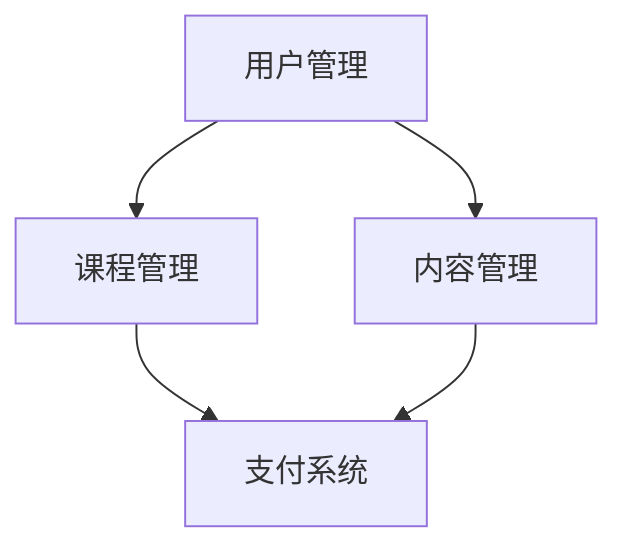

                 

# 《如何利用知识付费实现在线教育与家庭教育指导？》

## 关键词
知识付费，在线教育，家庭教育，教育平台，教育指导，课程设计

## 摘要
本文探讨了知识付费在在线教育和家庭教育指导中的应用。通过分析知识付费市场的现状与趋势，本文提出了在线教育平台和家庭教育指导课程的设计与实施方法。同时，通过案例分析与应用实践，本文展示了知识付费在实际教育场景中的成功应用，并讨论了未来发展的趋势和挑战。

---

### 《如何利用知识付费实现在线教育与家庭教育指导？》目录大纲

## 第一部分：知识付费与在线教育概述

### 第1章：知识付费市场现状与趋势

#### 1.1 知识付费的定义与特点

#### 1.2 知识付费市场的规模与增长

#### 1.3 在线教育的发展与知识付费的关系

### 第2章：家庭教育指导的重要性

#### 2.1 家庭教育的核心要素

#### 2.2 家庭教育中的挑战与问题

#### 2.3 知识付费在家庭教育指导中的应用

## 第二部分：在线教育与知识付费平台构建

### 第3章：在线教育平台的建设与运营

#### 3.1 在线教育平台的架构设计

##### 3.1.1 技术架构

##### 3.1.2 运营模式

#### 3.2 知识付费产品的开发与推广

##### 3.2.1 知识付费产品的设计

##### 3.2.2 知识付费产品的推广策略

### 第4章：家庭教育指导课程的设计与实施

#### 4.1 课程设计的基本原则

##### 4.1.1 教育心理学原理

##### 4.1.2 教学方法选择

#### 4.2 课程内容的制定与实施

##### 4.2.1 课程内容的设计

##### 4.2.2 课程实施流程

## 第三部分：案例分析与应用实践

### 第5章：知名在线教育与知识付费平台案例分析

#### 5.1 知名平台案例分析

##### 5.1.1 平台商业模式分析

##### 5.1.2 成功经验与挑战

#### 5.2 家庭教育指导案例分享

##### 5.2.1 案例背景与目标

##### 5.2.2 案例实施与效果评估

### 第6章：家庭教育指导与知识付费的结合实践

#### 6.1 实践步骤与方法

##### 6.1.1 市场调研与需求分析

##### 6.1.2 教育内容研发与优化

#### 6.2 源代码案例与解读

##### 6.2.1 开发环境搭建

##### 6.2.2 知识付费系统实现

##### 6.2.3 家庭教育指导系统实现

### 第7章：未来趋势与挑战

#### 7.1 知识付费与在线教育的未来发展

##### 7.1.1 技术发展趋势

##### 7.1.2 市场前景预测

#### 7.2 潜在挑战与应对策略

##### 7.2.1 监管政策变化

##### 7.2.2 知识内容质量保障

## 附录

### 附录A：知识付费与在线教育相关资源

#### 8.1 在线教育资源平台

#### 8.2 知识付费平台案例集

#### 8.3 学术论文与报告

### 附录B：课程设计与实施工具

#### 9.1 教学设计工具

#### 9.2 互动教学工具

#### 9.3 数据分析工具

### 附录C：家庭教育指导参考书籍与资料

#### 10.1 家庭教育经典书籍

#### 10.2 教育心理学研究论文

#### 10.3 家庭教育指导政策文件

#### 10.4 家庭教育实践案例分享

---

### 第一部分：知识付费与在线教育概述

### 第1章：知识付费市场现状与趋势

#### 1.1 知识付费的定义与特点

知识付费是指用户为获取特定知识或服务而支付的费用。与传统免费内容相比，知识付费更注重提供专业、系统、有深度的知识或服务，满足用户在特定领域的需求。知识付费的特点包括：

- **专业性**：知识付费提供的内容通常是专业领域的知识，具有权威性和准确性。
- **付费模式多样**：知识付费可以采用订阅、单次购买、免费试用等多种模式。
- **个性化服务**：知识付费平台通常提供个性化推荐，满足用户多样化的学习需求。

#### 1.2 知识付费市场的规模与增长

知识付费市场在过去几年中呈现出快速增长的趋势。根据相关报告，全球知识付费市场规模预计将在未来几年继续扩大。以下是一些关键指标：

- **用户增长**：知识付费用户数量逐年增加，尤其是在中国、印度等新兴市场。
- **收入增长**：知识付费平台收入呈现出稳定增长的态势，主要来源于订阅费用、课程销售、广告收入等。

#### 1.3 在线教育的发展与知识付费的关系

在线教育的发展为知识付费提供了广阔的市场空间。以下是在线教育对知识付费的影响：

- **平台扩展**：在线教育平台为知识付费提供了展示和推广的渠道，扩大了知识付费的受众范围。
- **内容丰富**：在线教育平台提供了丰富的课程内容，满足不同层次用户的需求，为知识付费提供了更多选择。
- **互动性增强**：在线教育平台通常提供互动教学工具，如直播、讨论区等，提高了用户参与度和学习效果。

### 第2章：家庭教育指导的重要性

#### 2.1 家庭教育的核心要素

家庭教育是指家长在日常生活中对孩子进行的教育和引导。家庭教育的核心要素包括：

- **价值观教育**：培养孩子的道德观念、社会责任感和良好的行为习惯。
- **生活技能教育**：教授孩子基本的生活技能，如理财、烹饪、家务等。
- **学习习惯教育**：培养孩子的学习兴趣和良好的学习习惯，提高学习效果。
- **心理健康教育**：关注孩子的心理健康，培养自信、自尊、积极向上的人生态度。

#### 2.2 家庭教育中的挑战与问题

在家庭教育过程中，家长可能会面临以下挑战和问题：

- **教育资源不足**：部分家长缺乏正确的教育观念和技巧，导致教育资源利用不足。
- **家庭压力**：现代社会竞争激烈，家长可能过度关注孩子的学习成绩，给孩子带来压力。
- **家庭教育不平衡**：不同家庭的教育资源和条件存在差异，可能导致家庭教育不平衡。
- **教育观念滞后**：部分家长的教育观念滞后，不能适应时代的发展需求。

#### 2.3 知识付费在家庭教育指导中的应用

知识付费平台为家庭教育指导提供了有效的解决方案：

- **专业课程**：知识付费平台提供了丰富的家庭教育指导课程，家长可以根据自己的需求和兴趣选择。
- **个性化服务**：知识付费平台通过数据分析，为家长提供个性化的教育建议和方案。
- **互动学习**：知识付费平台提供互动教学工具，家长可以与其他家长交流学习经验，共同成长。

---

### 第二部分：在线教育与知识付费平台构建

### 第3章：在线教育平台的建设与运营

#### 3.1 在线教育平台的架构设计

在线教育平台的架构设计需要考虑以下方面：

- **技术架构**：在线教育平台通常采用分布式架构，以提高系统的稳定性和可扩展性。
- **用户管理**：平台需要提供用户注册、登录、个人信息管理等功能。
- **课程管理**：平台需要提供课程创建、发布、更新、课程分类等功能。
- **内容管理**：平台需要提供内容上传、编辑、发布、版权保护等功能。
- **支付系统**：平台需要集成支付系统，支持多种支付方式，确保交易的安全性和便捷性。

#### 3.1.1 技术架构

以下是一个简化的在线教育平台的技术架构：



#### 3.1.2 运营模式

在线教育平台的运营模式通常包括以下几种：

- **课程销售**：平台通过销售课程获得收入，可以采用订阅制、单次购买制等模式。
- **广告收入**：平台可以通过广告获得收入，如课程推广广告、品牌广告等。
- **增值服务**：平台可以提供增值服务，如直播、一对一辅导等，以增加收入。
- **合作伙伴关系**：平台可以与其他教育机构、内容提供商建立合作关系，共同推广课程。

#### 3.2 知识付费产品的开发与推广

知识付费产品的开发与推广是平台成功的关键。以下是一些关键点：

- **产品定位**：明确知识付费产品的目标用户群体，满足他们的需求。
- **课程设计**：设计具有吸引力的课程内容，注重实用性和专业性。
- **营销策略**：制定有效的营销策略，如社交媒体推广、KOL合作、线上活动等。
- **用户互动**：通过互动工具，如问答、讨论区等，增强用户参与度和粘性。

#### 3.2.1 知识付费产品的设计

知识付费产品的设计需要考虑以下因素：

- **课程内容**：课程内容要具有实用性和专业性，能够满足用户的学习需求。
- **教学方式**：选择合适的教学方式，如视频教学、图文教程、直播授课等。
- **互动性**：增加课程的互动性，如课程讨论、问答环节等，提高用户参与度。
- **售后服务**：提供优质的售后服务，如课程答疑、用户反馈等，提高用户满意度。

#### 3.2.2 知识付费产品的推广策略

以下是一些有效的知识付费产品推广策略：

- **内容营销**：通过撰写高质量的内容，如博客、教程、案例分析等，吸引潜在用户。
- **社交媒体推广**：利用社交媒体平台，如微博、微信、抖音等，进行产品推广。
- **KOL合作**：与有影响力的知识达人或教育专家合作，共同推广产品。
- **线上线下活动**：举办线上线下活动，如讲座、沙龙、展览等，吸引潜在用户。

---

### 第三部分：案例分析与应用实践

### 第5章：知名在线教育与知识付费平台案例分析

#### 5.1 知名平台案例分析

在本节中，我们将分析一些知名在线教育与知识付费平台，探讨其商业模式、成功经验和面临的挑战。

#### 5.1.1 平台商业模式分析

以网易云课堂为例，其商业模式主要包括以下几个方面：

- **课程销售**：网易云课堂通过销售各类在线课程获得收入，包括专业课程、兴趣课程等。
- **广告收入**：平台通过展示广告获得收入，如课程推广广告、品牌广告等。
- **增值服务**：平台提供增值服务，如直播、一对一辅导等，以增加收入。
- **合作伙伴关系**：网易云课堂与多家教育机构和内容提供商建立合作关系，共同推广课程。

#### 5.1.2 成功经验与挑战

成功经验：

- **丰富课程内容**：网易云课堂拥有丰富的课程内容，满足不同层次用户的需求。
- **优质用户服务**：平台提供优质的售后服务，如课程答疑、用户反馈等，提高用户满意度。
- **线上线下结合**：网易云课堂通过线上线下活动，吸引潜在用户，扩大品牌影响力。

挑战：

- **内容质量保障**：随着用户数量的增加，平台需要保证课程内容的质量，避免出现滥竽充数的情况。
- **市场竞争**：在线教育市场竞争激烈，平台需要不断创新，提高用户体验，以保持竞争力。
- **政策监管**：知识付费行业受到政策监管，平台需要密切关注政策变化，确保合规运营。

#### 5.2 家庭教育指导案例分享

在本节中，我们将分享一个家庭教育指导的案例，探讨其实施过程和效果评估。

#### 5.2.1 案例背景与目标

案例背景：某知名知识付费平台推出了一款家庭教育指导课程，旨在帮助家长解决孩子在成长过程中遇到的问题，提高家庭教育质量。

目标：通过家庭教育指导课程，提高家长的教育意识和教育能力，改善家庭教育环境，促进孩子健康成长。

#### 5.2.2 案例实施与效果评估

实施过程：

- **市场调研**：平台通过对家长进行问卷调查、访谈等方式，了解他们的需求和痛点，为课程设计提供依据。
- **课程设计**：平台根据市场调研结果，设计了符合家长需求的家庭教育指导课程，包括亲子沟通、学习习惯培养、心理健康教育等。
- **课程推广**：平台通过线上线下活动，如讲座、沙龙、微信公众号等，推广家庭教育指导课程，吸引潜在用户。
- **课程实施**：家长报名参加课程后，平台通过直播、录播等方式，提供课程内容，同时提供互动教学工具，如讨论区、问答环节等，增强用户参与度。

效果评估：

- **用户满意度**：通过问卷调查和用户反馈，平台了解到用户对课程的整体满意度较高，认为课程内容实用，有助于提高家庭教育质量。
- **学习效果**：用户反馈表明，参与课程后，家长的教育意识和教育能力有所提高，亲子关系得到改善，孩子的学习效果也有所提升。
- **社会效益**：家庭教育指导课程的推广，提高了社会的家庭教育意识，促进了家庭教育的健康发展。

---

### 第四部分：家庭教育指导与知识付费的结合实践

### 第6章：家庭教育指导与知识付费的结合实践

#### 6.1 实践步骤与方法

在本节中，我们将探讨家庭教育指导与知识付费的结合实践，并提供一套具体的实施步骤和方法。

#### 6.1.1 市场调研与需求分析

市场调研与需求分析是家庭教育指导与知识付费结合实践的基础。以下是一些关键步骤：

- **确定目标用户**：明确家庭教育指导课程的目标用户群体，如新手父母、有经验的家长等。
- **收集用户需求**：通过问卷调查、访谈、在线调查等方式，收集用户对家庭教育指导的需求，包括课程内容、教学方法、互动方式等。
- **分析市场竞争**：了解市场上已有的家庭教育指导课程，分析其优势和不足，为课程设计提供参考。

#### 6.1.2 教育内容研发与优化

教育内容研发与优化是家庭教育指导与知识付费结合实践的核心。以下是一些关键步骤：

- **课程设计**：根据市场调研结果，设计符合用户需求的家庭教育指导课程，包括课程主题、教学目标、教学内容等。
- **内容创作**：邀请专业教育专家和心理咨询师，创作高质量的教育内容，包括图文教程、视频课程、音频讲座等。
- **内容优化**：根据用户反馈和市场需求，不断优化教育内容，提高课程质量和用户满意度。

#### 6.2 源代码案例与解读

在本节中，我们将提供一套知识付费系统实现的源代码案例，并对其进行详细解读。

#### 6.2.1 开发环境搭建

开发环境搭建是知识付费系统实现的第一步。以下是一个简单的开发环境搭建步骤：

- **选择开发框架**：选择一个适合知识付费系统开发的框架，如Spring Boot、Django等。
- **搭建开发工具**：配置开发工具，如IDE（如Visual Studio Code、IntelliJ IDEA等）、数据库（如MySQL、PostgreSQL等）等。
- **搭建开发环境**：安装开发框架和工具，配置开发环境，确保可以正常运行。

#### 6.2.2 知识付费系统实现

知识付费系统实现主要包括以下模块：

- **用户管理**：实现用户注册、登录、个人信息管理等功能。
- **课程管理**：实现课程创建、发布、更新、课程分类等功能。
- **内容管理**：实现内容上传、编辑、发布、版权保护等功能。
- **支付系统**：实现支付功能，支持多种支付方式，如支付宝、微信支付等。

以下是一个简单的用户管理模块的伪代码：

```java
// 用户注册
public User register(String username, String password) {
    // 验证用户名和密码的合法性
    if (isValidUsername(username) && isValidPassword(password)) {
        // 创建用户并保存到数据库
        User user = new User();
        user.setUsername(username);
        user.setPassword(password);
        userRepository.save(user);
        return user;
    } else {
        // 返回错误信息
        return null;
    }
}

// 用户登录
public User login(String username, String password) {
    // 查询用户
    User user = userRepository.findByUsername(username);
    if (user != null && isValidPassword(password)) {
        // 登录成功
        return user;
    } else {
        // 返回错误信息
        return null;
    }
}

// 验证用户名
private boolean isValidUsername(String username) {
    // 验证用户名的合法性
    // ...
}

// 验证密码
private boolean isValidPassword(String password) {
    // 验证密码的合法性
    // ...
}
```

#### 6.2.3 家庭教育指导系统实现

家庭教育指导系统实现主要包括以下模块：

- **课程管理**：实现课程创建、发布、更新、课程分类等功能。
- **内容管理**：实现内容上传、编辑、发布、版权保护等功能。
- **互动教学**：实现讨论区、问答环节等互动教学功能。
- **用户反馈**：实现用户反馈、课程评价等功能。

以下是一个简单的课程管理模块的伪代码：

```java
// 创建课程
public Course createCourse(String title, String description, String category) {
    // 验证课程信息的合法性
    if (isValidCourseInfo(title, description, category)) {
        // 创建课程并保存到数据库
        Course course = new Course();
        course.setTitle(title);
        course.setDescription(description);
        course.setCategory(category);
        courseRepository.save(course);
        return course;
    } else {
        // 返回错误信息
        return null;
    }
}

// 更新课程
public Course updateCourse(Course course) {
    // 验证课程信息的合法性
    if (isValidCourseInfo(course.getTitle(), course.getDescription(), course.getCategory())) {
        // 更新课程并保存到数据库
        courseRepository.save(course);
        return course;
    } else {
        // 返回错误信息
        return null;
    }
}

// 验证课程信息
private boolean isValidCourseInfo(String title, String description, String category) {
    // 验证课程信息的合法性
    // ...
}
```

---

### 第7章：未来趋势与挑战

#### 7.1 知识付费与在线教育的未来发展

随着技术的进步和用户需求的变化，知识付费与在线教育的未来发展呈现出以下趋势：

- **个性化教育**：人工智能和大数据技术的应用，将使教育更加个性化，满足不同用户的需求。
- **互动性增强**：在线教育平台将提供更多互动性强的教学工具，如虚拟课堂、直播互动等，提高用户参与度。
- **多元化收入模式**：知识付费平台将探索多元化收入模式，如广告收入、会员制、增值服务等，提高平台盈利能力。

#### 7.1.1 技术发展趋势

技术发展趋势对知识付费与在线教育的影响主要体现在以下几个方面：

- **人工智能**：人工智能技术将应用于教学内容推荐、学习效果评估等方面，提高教育质量和效率。
- **大数据**：大数据技术将用于用户行为分析、市场预测等方面，为教育决策提供数据支持。
- **云计算**：云计算技术将提供强大的计算和存储能力，支持大规模在线教育的开展。

#### 7.1.2 市场前景预测

市场前景预测显示，知识付费与在线教育将继续保持快速增长，预计未来几年市场规模将持续扩大。以下是一些市场前景预测：

- **用户增长**：随着在线教育的普及，知识付费用户数量将继续增长。
- **收入增长**：知识付费平台收入将继续增长，主要来源于课程销售、广告收入、增值服务等。

#### 7.2 潜在挑战与应对策略

知识付费与在线教育在发展过程中也面临着一些挑战，以下是一些潜在挑战与应对策略：

- **内容质量保障**：平台需要建立严格的内容审核机制，确保课程内容的质量。
- **政策监管**：平台需要密切关注政策变化，确保合规运营。
- **市场竞争**：平台需要不断创新，提高用户体验，以保持竞争力。

---

## 附录

### 附录A：知识付费与在线教育相关资源

#### 8.1 在线教育资源平台

以下是一些知名在线教育资源平台：

- 网易云课堂
- 慕课网
- 腾讯课堂
- 阿里云课堂

#### 8.2 知识付费平台案例集

以下是一些知识付费平台案例集：

- 知乎
- 得到
- 微信公众号
- 网易云阅读

#### 8.3 学术论文与报告

以下是一些关于知识付费与在线教育的学术论文与报告：

- 《知识付费行业研究报告》
- 《在线教育行业白皮书》
- 《人工智能与在线教育》
- 《大数据在教育中的应用》

### 附录B：课程设计与实施工具

以下是一些课程设计与实施工具：

- Canva：设计课程海报、PPT等
- Google 表格：课程内容整理
- Zoom：在线直播授课
- Padlet：互动教学工具

### 附录C：家庭教育指导参考书籍与资料

以下是一些家庭教育指导参考书籍与资料：

- 《好妈妈胜过好老师》
- 《如何培养孩子的社会能力》
- 《正面管教》
- 《家庭教育的艺术》

---

## 作者

**作者：AI天才研究院/AI Genius Institute & 禅与计算机程序设计艺术 /Zen And The Art of Computer Programming**

