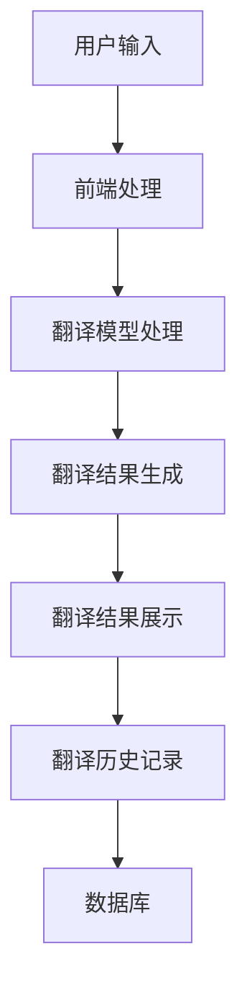
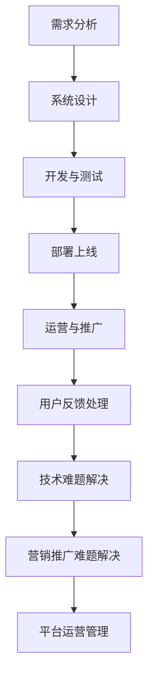

                 

# 如何利用知识付费实现在线语言学习与翻译服务？

关键词：在线语言学习、翻译服务、知识付费、平台搭建、营销策略、技术实现

摘要：随着互联网技术的发展和人们对于全球化交流的需求增长，在线语言学习与翻译服务成为了一个快速发展的市场。本文旨在探讨如何利用知识付费模式实现在线语言学习与翻译服务的有效运营，包括服务设计、核心技术原理、知识付费模式应用、平台搭建、用户管理、营销推广以及成功案例分析等方面。

## 目录大纲

### 第一部分：在线语言学习与翻译服务概述

#### 第1章：在线语言学习与翻译服务的背景与市场分析

1.1 在线语言学习的发展历程

1.2 翻译服务的市场现状与趋势

1.3 知识付费的兴起与在线语言学习、翻译服务的结合

#### 第2章：在线语言学习服务的设计与实现

2.1 在线语言学习平台的核心功能

2.2 用户需求分析与课程设置

2.3 学习路径规划与个性化推荐

2.4 在线互动与学习社区建设

#### 第3章：翻译服务的核心技术原理

3.1 翻译服务的需求分析

3.2 翻译服务的技术架构

3.3 翻译模型的选择与训练

3.4 翻译服务的优化与评价

#### 第4章：知识付费模式在在线语言学习与翻译服务中的应用

4.1 知识付费模式概述

4.2 在线语言学习与翻译服务的收费策略

4.3 知识付费对在线语言学习与翻译服务的影响

4.4 知识付费案例分析与经验总结

### 第二部分：在线语言学习与翻译服务的实施与运营

#### 第5章：在线语言学习与翻译服务的平台搭建

5.1 技术选型与系统架构设计

5.2 数据库设计与存储方案

5.3 前后端开发与接口设计

5.4 测试与部署流程

#### 第6章：在线语言学习与翻译服务的用户管理与互动机制

6.1 用户注册与身份验证

6.2 用户行为分析

6.3 用户反馈与互动机制

6.4 社区管理与运营策略

#### 第7章：在线语言学习与翻译服务的营销推广与运营策略

7.1 营销推广渠道选择

7.2 知识付费推广策略

7.3 用户增长与留存策略

7.4 营销效果分析与优化

### 第三部分：案例分析与实践指导

#### 第8章：成功案例分析与启示

8.1 成功案例介绍

8.2 案例分析与启示

8.3 经验总结与反思

#### 第9章：在线语言学习与翻译服务的实践指南

9.1 项目启动与团队搭建

9.2 风险管理与应对策略

9.3 实施步骤与关键节点

9.4 成功案例分析与应用

### 附录

#### 附录 A：相关资源与工具推荐

A.1 语言学习与翻译服务平台推荐

A.2 开源工具与库推荐

A.3 学习资源推荐

#### 附录 B：常见问题与解决方案

B.1 用户反馈处理

B.2 技术难题解决

B.3 营销推广难题解决

## 第一部分：在线语言学习与翻译服务概述

### 第1章：在线语言学习与翻译服务的背景与市场分析

#### 1.1 在线语言学习的发展历程

在线语言学习作为互联网教育的一部分，起源于20世纪90年代。当时，随着互联网的普及，远程教育逐渐成为可能。最早的在线语言学习平台主要以文字和图片为基础，提供简单的单词记忆和语法练习。

进入21世纪，随着Web2.0技术的发展，在线语言学习平台开始引入互动性和多媒体元素。例如，通过视频课程、互动游戏等方式，使得学习过程更加生动和有趣。

近年来，随着人工智能和大数据技术的快速发展，在线语言学习平台开始利用人工智能技术实现个性化学习推荐、实时翻译等功能。这些技术的应用大大提升了在线语言学习的质量和效率。

#### 1.2 翻译服务的市场现状与趋势

翻译服务市场是一个快速发展的市场。根据市场调研机构的数据，全球翻译市场规模在过去几年中持续增长，预计未来几年将继续保持增长态势。

在线翻译服务作为翻译服务市场的一个重要分支，受益于互联网和移动设备的普及。随着跨国交流和商务活动的增加，人们对在线翻译服务的需求也在不断上升。

技术进步，尤其是机器翻译技术的发展，使得在线翻译服务的成本降低，效率提高。这使得在线翻译服务更加贴近普通用户，进一步推动了市场需求的增长。

#### 1.3 知识付费的兴起与在线语言学习、翻译服务的结合

知识付费是指用户为获取有价值的信息或服务而支付的费用。随着互联网的发展，知识付费市场逐渐兴起。特别是在线教育、在线课程等领域，用户愿意为优质的学习资源和专业的课程内容支付费用。

在线语言学习和翻译服务与知识付费的结合，为平台提供了新的盈利模式。通过知识付费，平台可以提供高质量的课程和翻译服务，同时实现商业化的运营。

知识付费模式对在线语言学习和翻译服务的影响主要体现在以下几个方面：

1. 提高服务质量和用户体验：知识付费使得平台可以投入更多的资源来开发高质量的课程内容和翻译服务，从而提高用户的学习体验。

2. 增加平台收入：知识付费模式为平台提供了新的收入来源，有助于平台实现商业化运营，提高盈利能力。

3. 培养用户付费习惯：通过知识付费模式，平台可以培养用户的付费习惯，为未来的持续盈利打下基础。

## 第二部分：在线语言学习与翻译服务的实施与运营

### 第2章：在线语言学习服务的设计与实现

#### 2.1 在线语言学习平台的核心功能

在线语言学习平台的核心功能主要包括以下几个方面：

1. 用户注册与登录：用户可以通过注册账号登录平台，进行学习和管理个人信息。

2. 课程浏览与选择：平台提供丰富的课程资源，用户可以根据自己的需求选择合适的课程。

3. 学习进度跟踪：平台记录用户的学习进度，帮助用户跟踪学习效果，及时调整学习计划。

4. 互动与社区建设：平台提供互动功能，如提问、讨论、分享等，促进用户之间的交流和互动。

5. 知识付费模块：平台通过知识付费模块，提供高质量的课程和翻译服务，实现商业化的运营。

#### 2.2 用户需求分析与课程设置

用户需求分析是设计在线语言学习平台的重要环节。通过分析用户的需求，平台可以提供更符合用户期望的课程和服务。

用户需求分析主要包括以下几个方面：

1. 学习目的：用户学习外语的目的是什么，如商务交流、旅游出行、学术研究等。

2. 学习水平：用户的语言水平，如初级、中级、高级等。

3. 学习时间：用户的学习时间安排，如全职学习、兼职学习等。

4. 学习偏好：用户的学习偏好，如喜欢视频课程、音频课程、文字课程等。

根据用户需求分析，平台可以设置相应的课程，满足不同用户的需求。例如，针对商务交流需求，可以提供商务英语课程；针对旅游出行需求，可以提供旅游英语课程；针对学术研究需求，可以提供专业英语课程等。

#### 2.3 学习路径规划与个性化推荐

学习路径规划是指根据用户的需求和学习情况，为用户设计一个合理的、分阶段的学习计划。通过学习路径规划，平台可以帮助用户更高效地学习，提高学习效果。

个性化推荐是指根据用户的学习历史、偏好和需求，为用户推荐合适的课程和学习资源。通过个性化推荐，平台可以更好地满足用户的需求，提高用户的满意度和留存率。

实现个性化推荐的关键技术包括：

1. 数据采集与处理：通过用户行为数据、学习数据等，对用户进行画像，为个性化推荐提供数据支持。

2. 推荐算法：采用基于内容的推荐、协同过滤推荐、混合推荐等算法，为用户推荐合适的课程和学习资源。

3. 推荐系统实现：通过推荐引擎，将推荐结果实时呈现给用户，提高推荐系统的实用性。

#### 2.4 在线互动与学习社区建设

在线互动是提高在线语言学习效果的重要手段。通过在线互动，用户可以与他人交流学习心得，分享学习资源，提高学习兴趣和动力。

学习社区建设是指通过论坛、讨论区、问答平台等，构建一个用户互动的社区环境。在学习社区中，用户可以发布问题、解答问题、分享学习经验，形成一个互助、互动、共同进步的学习氛围。

在线互动与学习社区建设的关键技术包括：

1. 互动功能设计：设计合适的互动功能，如提问、回答、评论、分享等，鼓励用户积极参与互动。

2. 社区运营与管理：建立社区运营团队，制定社区运营策略，维护社区秩序，促进用户互动。

3. 社区数据分析：通过数据分析，了解用户互动情况，优化社区功能，提高用户活跃度和满意度。

### 第3章：翻译服务的核心技术原理

#### 3.1 翻译服务的需求分析

翻译服务需求分析是指从用户角度出发，分析用户在翻译过程中遇到的问题和需求。通过需求分析，可以为翻译服务提供解决方案，提高用户体验。

翻译服务需求分析主要包括以下几个方面：

1. 翻译准确性：用户期望翻译结果准确无误，能够准确表达原文的意思。

2. 翻译速度：用户希望在较短的时间内获得翻译结果，提高工作效率。

3. 翻译多样性：用户希望翻译服务支持多种语言，满足不同语言需求的用户。

4. 翻译个性化：用户希望翻译服务能够根据个人的需求和习惯，提供个性化的翻译结果。

#### 3.2 翻译服务的技术架构

翻译服务的技术架构主要包括前端、后端和数据库三个部分。

1. 前端：前端负责用户界面展示，包括翻译输入、翻译结果展示、翻译历史记录等。

2. 后端：后端负责翻译服务的核心功能，包括翻译模型处理、翻译结果生成、翻译结果存储等。

3. 数据库：数据库用于存储用户信息、翻译历史记录、翻译模型参数等。

翻译服务的技术架构图如下：



#### 3.3 翻译模型的选择与训练

翻译模型是翻译服务的核心技术。选择合适的翻译模型，并对其进行训练，是提高翻译质量的关键。

常见的翻译模型包括：

1. 序列到序列模型（Seq2Seq）：Seq2Seq模型是一种基于循环神经网络（RNN）的翻译模型，通过对输入序列和输出序列进行编码和解码，实现翻译。

2. Transformer模型：Transformer模型是一种基于自注意力机制的翻译模型，通过多头自注意力机制和前馈神经网络，实现高效的翻译。

3. BERT模型：BERT模型是一种基于双向编码器表示的翻译模型，通过对输入序列进行双向编码，生成翻译结果。

4. 其他深度学习模型：如长短期记忆网络（LSTM）、门控循环单元（GRU）等。

翻译模型的训练过程主要包括以下几个步骤：

1. 数据预处理：对翻译数据集进行清洗、分词、编码等预处理操作，为训练模型提供高质量的输入数据。

2. 模型训练：采用优化算法（如Adam、SGD）对翻译模型进行训练，通过调整模型参数，提高翻译质量。

3. 模型评估：采用交叉验证、BLEU评分等方法对翻译模型进行评估，选择性能最佳的模型。

4. 模型部署：将训练好的翻译模型部署到线上环境，为用户提供翻译服务。

#### 3.4 翻译服务的优化与评价

翻译服务的优化与评价是确保翻译质量的重要环节。通过优化与评价，可以不断提升翻译服务的质量和用户体验。

翻译服务的优化主要包括以下几个方面：

1. 模型优化：通过调整模型结构、参数设置等，提高翻译模型的性能。

2. 数据优化：通过扩充翻译数据集、改进数据预处理方法等，提高翻译数据的质量。

3. 算法优化：采用更先进的翻译算法，如基于知识的翻译、基于语义的翻译等，提高翻译结果的准确性。

翻译服务的评价主要包括以下几个方面：

1. 翻译准确性：通过BLEU评分、词误差率（WER）等指标，评价翻译结果的准确性。

2. 翻译速度：通过翻译时间、响应速度等指标，评价翻译服务的速度。

3. 用户满意度：通过用户反馈、评价等，评价翻译服务的用户满意度。

通过优化与评价，可以不断提升翻译服务的质量和用户体验，满足用户的需求。

### 第4章：知识付费模式在在线语言学习与翻译服务中的应用

#### 4.1 知识付费模式概述

知识付费模式是指用户为获取有价值的信息或服务而支付费用的一种商业模式。在在线语言学习与翻译服务中，知识付费模式为平台提供了新的盈利模式，有助于平台实现商业化运营。

知识付费模式的主要特点包括：

1. 价值化：将知识转化为商品或服务，实现知识的价值化。

2. 个性化：根据用户的需求和偏好，提供个性化的知识服务。

3. 可持续性：通过知识付费模式，平台可以实现持续的盈利，为平台的长期发展提供支持。

4. 透明化：知识付费模式使得知识服务的价格和内容更加透明，用户可以清晰地了解所支付的费用和所获得的服务。

#### 4.2 在线语言学习与翻译服务的收费策略

在线语言学习与翻译服务的收费策略是平台实现知识付费的重要手段。合理的收费策略可以提高用户满意度，促进平台的发展。

在线语言学习与翻译服务的收费策略主要包括以下几个方面：

1. 课程收费：根据课程内容、难度、时长等因素，设置不同的课程价格。例如，初级课程价格较低，高级课程价格较高。

2. 会员收费：推出会员制度，用户支付一定费用成为会员，享受会员专属优惠和特权。例如，会员可以免费学习某些课程，获得优先课程推荐等。

3. 活动收费：举办线上活动，如讲座、研讨会等，用户参加活动需要支付费用。这种模式不仅可以提高用户参与度，还可以为平台带来额外收入。

4. 翻译服务收费：根据翻译服务的类型、语言、字数等因素，设置不同的收费标准。例如，专业翻译、实时翻译等服务价格较高。

5. 按需收费：根据用户的需求和使用情况，按需收费。例如，用户可以按需购买课程、翻译服务，享受灵活的学习和翻译体验。

#### 4.3 知识付费对在线语言学习与翻译服务的影响

知识付费模式对在线语言学习与翻译服务的影响主要体现在以下几个方面：

1. 提高服务质量和用户体验：知识付费模式使得平台可以投入更多资源来开发高质量的课程内容和翻译服务，提高用户体验。

2. 增加平台收入：知识付费模式为平台提供了新的收入来源，有助于平台实现商业化运营，提高盈利能力。

3. 培养用户付费习惯：通过知识付费模式，平台可以培养用户的付费习惯，为未来的持续盈利打下基础。

4. 促进市场竞争：知识付费模式的兴起，吸引了更多的企业进入在线语言学习与翻译服务市场，促进了市场竞争，提高了整体服务水平和质量。

#### 4.4 知识付费案例分析与经验总结

以下是一个知识付费案例的分析与经验总结：

**案例名称**：某知名在线英语学习平台

**背景**：该平台是一家提供在线英语学习的平台，通过知识付费模式，提供高质量的课程和翻译服务。

**成功经验**：

1. 明确用户需求：平台通过市场调研和用户反馈，明确了用户对英语学习的需求，提供了针对性强的课程内容。

2. 优质课程内容：平台投入大量资源，邀请知名英语教师和行业专家，开发高质量的英语课程。

3. 个性化推荐：平台利用大数据和人工智能技术，为用户推荐合适的课程，提高学习效果。

4. 知识付费推广：平台通过优惠活动、会员制度等方式，鼓励用户购买课程，培养用户的付费习惯。

**经验总结**：

1. 精准定位用户需求：了解用户需求，提供针对性的课程和服务，是知识付费成功的关键。

2. 优质课程内容：高质量的课程内容是知识付费的基础，平台需要投入资源，打造优质课程。

3. 个性化推荐：通过个性化推荐，提高用户的学习效果，增加用户的满意度和留存率。

4. 知识付费推广策略：合理的知识付费推广策略，可以促进用户购买课程，提高平台收入。

### 第二部分：在线语言学习与翻译服务的实施与运营

#### 第5章：在线语言学习与翻译服务的平台搭建

在线语言学习与翻译服务的平台搭建是确保服务顺利运行的关键环节。该部分将介绍平台搭建中的技术选型、系统架构设计、数据库设计与存储方案、前后端开发与接口设计以及测试与部署流程。

#### 5.1 技术选型与系统架构设计

技术选型是平台搭建的第一步，它决定了平台的性能、可扩展性和维护成本。以下是几种常用的技术选型方案：

1. **前端技术**：
   - **HTML/CSS/JavaScript**：用于构建用户界面，实现基本的交互功能。
   - **React**：一个用于构建用户界面的JavaScript库，具有良好的组件化和状态管理能力。
   - **Vue.js**：一个用于构建用户界面的JavaScript框架，易于学习和使用。

2. **后端技术**：
   - **Node.js/Express**：一个基于JavaScript的Web应用程序框架，适合构建高性能的后端服务。
   - **Python/Django**：一个高性能的Python Web框架，具有强大的功能和安全性能。
   - **Java/Spring Boot**：一个基于Java的企业级开发框架，适用于构建大型、复杂的应用程序。

3. **数据库技术**：
   - **关系型数据库**：如MySQL、PostgreSQL，适合存储结构化数据。
   - **NoSQL数据库**：如MongoDB、Redis，适合存储非结构化数据和进行快速读取操作。

系统架构设计是平台搭建的核心，决定了系统的稳定性、扩展性和性能。以下是典型的系统架构设计：

1. **分层架构**：
   - **表示层（Presentation Layer）**：负责处理用户请求，展示前端界面。
   - **业务逻辑层（Business Logic Layer）**：处理业务逻辑，如课程管理、用户管理、翻译服务等。
   - **数据访问层（Data Access Layer）**：处理与数据库的交互，如数据查询、更新等。

2. **微服务架构**：
   - **服务拆分**：将系统拆分为多个独立的服务，如用户服务、课程服务、翻译服务等。
   - **服务通信**：通过API网关和RESTful API进行服务间通信。
   - **服务容器化**：使用Docker等容器技术，提高服务的可移植性和可扩展性。

#### 5.2 数据库设计与存储方案

数据库设计与存储方案是平台搭建的重要部分，它决定了数据的存储结构、访问效率和数据安全性。以下是数据库设计与存储方案的关键点：

1. **数据建模**：
   - **关系型数据库**：设计合理的E-R模型，创建表结构，定义字段和关系。
   - **NoSQL数据库**：根据数据特点，选择合适的存储模式，如文档存储、键值存储、宽列存储等。

2. **索引策略**：
   - **主键索引**：确保数据唯一性，提高查询效率。
   - **非主键索引**：根据查询需求，创建合适的索引，提高查询性能。

3. **存储方案**：
   - **主从复制**：实现数据的高可用性和数据备份。
   - **分库分表**：根据数据规模和访问量，合理分配数据库和表，提高查询效率。

4. **缓存策略**：
   - **内存缓存**：如Redis，用于缓存热点数据，提高数据读取速度。
   - **数据库缓存**：如MySQL的缓存机制，用于缓存查询结果，减少数据库负载。

#### 5.3 前后端开发与接口设计

前后端开发与接口设计是平台搭建的核心环节，它决定了系统的功能实现和用户体验。以下是前后端开发与接口设计的关键点：

1. **前后端分离**：
   - **前端开发**：使用React或Vue.js等框架，实现动态、响应式的用户界面。
   - **后端开发**：使用Node.js、Python、Java等后端框架，实现业务逻辑处理和数据处理。

2. **接口设计**：
   - **RESTful API**：设计RESTful风格的API，提供数据交互接口。
   - **数据格式**：使用JSON或XML等数据格式，确保数据交换的兼容性和易读性。

3. **安全性**：
   - **身份验证**：实现用户身份验证，如OAuth2、JWT等，确保用户数据安全。
   - **数据加密**：对传输数据进行加密，如HTTPS、SSL/TLS等，防止数据泄露。

4. **性能优化**：
   - **负载均衡**：使用Nginx等负载均衡器，确保系统在高并发下的稳定运行。
   - **缓存策略**：使用Redis等缓存技术，减少数据库负载，提高系统响应速度。

#### 5.4 测试与部署流程

测试与部署流程是平台搭建的保障，它确保系统的功能完整、性能稳定和安全性。以下是测试与部署流程的关键点：

1. **单元测试**：
   - **前端单元测试**：使用Jest、Mocha等工具，编写和执行前端单元测试，确保前端功能的正确性。
   - **后端单元测试**：使用JUnit、pytest等工具，编写和执行后端单元测试，确保后端逻辑的正确性。

2. **集成测试**：
   - **前后端集成测试**：通过API接口进行前后端集成测试，确保系统功能的正确性和数据一致性。
   - **性能测试**：使用JMeter、LoadRunner等工具，模拟高并发场景，测试系统的性能和稳定性。

3. **部署流程**：
   - **自动化部署**：使用Docker、Kubernetes等容器技术，实现自动化部署，确保系统的高可用性和可扩展性。
   - **持续集成与持续部署（CI/CD）**：使用Jenkins、GitLab CI等工具，实现代码的自动化测试和部署，提高开发效率和系统稳定性。

4. **监控与运维**：
   - **日志管理**：使用ELK（Elasticsearch、Logstash、Kibana）等工具，实时监控和分析系统日志，确保系统运行状态的可视化和可追溯性。
   - **故障处理**：建立故障处理流程，快速定位和处理系统故障，确保系统的稳定运行。

### 第6章：在线语言学习与翻译服务的用户管理与互动机制

在线语言学习与翻译服务的用户管理与互动机制是提高用户满意度和活跃度的重要手段。该部分将介绍用户注册与身份验证、用户行为分析、用户反馈与互动机制以及社区管理与运营策略。

#### 6.1 用户注册与身份验证

用户注册与身份验证是保障用户信息安全和服务质量的基础。以下是用户注册与身份验证的关键点：

1. **注册流程**：
   - **用户基本信息**：用户需填写姓名、邮箱、密码等基本信息，确保用户身份的准确性。
   - **注册验证**：通过发送验证邮件或短信，验证用户邮箱或手机号的有效性，确保注册过程的真实性。

2. **身份验证**：
   - **单点登录（SSO）**：支持第三方身份验证，如Google、Facebook等，简化用户注册和登录流程。
   - **双因素认证（2FA）**：增加额外的安全层，通过短信验证码或身份验证应用，确保用户身份的安全性。

3. **用户权限管理**：
   - **角色分配**：根据用户角色（如普通用户、管理员等），分配不同的权限，确保系统安全和数据隐私。

#### 6.2 用户行为分析

用户行为分析是了解用户需求、优化服务策略的重要手段。以下是用户行为分析的关键点：

1. **行为数据收集**：
   - **日志记录**：记录用户登录、浏览、购买等行为数据，为后续分析提供基础。
   - **数据存储**：使用大数据技术，如Hadoop、HBase等，存储和管理海量行为数据。

2. **行为数据分析**：
   - **用户画像**：通过数据挖掘和机器学习技术，构建用户画像，了解用户需求和偏好。
   - **行为预测**：使用预测模型，预测用户的行为，为个性化推荐和营销策略提供支持。

3. **行为优化**：
   - **用户体验优化**：根据用户行为数据，优化网站界面、课程推荐等，提高用户体验。
   - **服务策略调整**：根据用户行为数据，调整服务策略，如优惠活动、课程推广等，提高用户满意度。

#### 6.3 用户反馈与互动机制

用户反馈与互动机制是建立用户信任、提升服务质量的途径。以下是用户反馈与互动机制的关键点：

1. **反馈渠道**：
   - **在线反馈**：提供在线反馈表单、聊天工具等，方便用户随时提交反馈。
   - **电话支持**：设立客服热线，提供电话支持，解决用户疑难问题。

2. **反馈处理**：
   - **快速响应**：建立反馈处理机制，确保及时响应用户反馈，解决用户问题。
   - **分类处理**：对用户反馈进行分类，针对性地解决问题，如技术问题、服务问题等。

3. **互动机制**：
   - **互动社区**：建立互动社区，鼓励用户分享学习心得、交流经验。
   - **用户评价**：引入用户评价机制，用户可以对课程、翻译服务进行评价，促进服务质量的提升。

#### 6.4 社区管理与运营策略

社区管理与运营策略是提高用户活跃度和社区质量的关键。以下是社区管理与运营策略的关键点：

1. **社区运营**：
   - **内容管理**：制定内容管理策略，确保社区内容的丰富性和多样性。
   - **活动策划**：定期举办线上活动，如讲座、比赛等，激发用户参与热情。

2. **用户激励**：
   - **积分制度**：引入积分制度，鼓励用户参与社区互动，提高活跃度。
   - **荣誉制度**：设立荣誉制度，表彰积极参与社区的优秀用户，提高用户荣誉感。

3. **数据分析**：
   - **用户活跃度分析**：通过数据分析，了解用户活跃度，优化社区运营策略。
   - **用户满意度分析**：通过用户满意度调查，评估社区服务质量，持续改进。

4. **风险管理**：
   - **内容审核**：建立内容审核机制，确保社区内容符合法律法规和社区规范。
   - **风险预警**：通过数据分析，发现潜在风险，提前采取措施，保障社区安全。

### 第7章：在线语言学习与翻译服务的营销推广与运营策略

在线语言学习与翻译服务的营销推广与运营策略是吸引新用户、提高用户满意度和留存率的关键。该部分将介绍营销推广渠道选择、知识付费推广策略、用户增长与留存策略以及营销效果分析与优化。

#### 7.1 营销推广渠道选择

选择合适的营销推广渠道是提高在线语言学习与翻译服务知名度和用户量的重要手段。以下是营销推广渠道选择的关键点：

1. **搜索引擎营销（SEM）**：
   - **关键词广告**：在搜索引擎平台上投放关键词广告，吸引潜在用户点击。
   - **搜索引擎优化（SEO）**：通过优化网站内容和结构，提高在搜索引擎中的排名，吸引自然流量。

2. **社交媒体营销**：
   - **社交媒体广告**：在Facebook、Instagram、Twitter等社交媒体平台上投放广告，针对特定受众进行精准推广。
   - **内容营销**：发布有价值的内容，如博客文章、教程视频等，吸引潜在用户关注。

3. **电子邮件营销**：
   - **订阅邮件**：通过邮件订阅功能，定期向用户发送课程更新、优惠信息等，提高用户粘性。
   - **个性化邮件**：根据用户行为和偏好，发送个性化的邮件，提高邮件的打开率和点击率。

4. **合作伙伴营销**：
   - **联盟营销**：与相关领域的网站、博客等建立合作，通过联盟推广提高服务知名度。
   - **内容合作**：与其他平台或机构合作，发布联合内容，扩大服务影响力。

#### 7.2 知识付费推广策略

知识付费推广策略是提高课程和翻译服务销量和用户满意度的关键。以下是知识付费推广策略的关键点：

1. **优惠活动**：
   - **限时折扣**：在特定时间段内提供课程折扣，吸引用户购买。
   - **优惠券**：发放优惠券，鼓励用户购买课程。
   - **拼团优惠**：鼓励用户邀请好友一起购买课程，享受优惠。

2. **营销活动**：
   - **讲座和研讨会**：举办在线讲座和研讨会，吸引潜在用户参与，提高服务知名度。
   - **试用活动**：提供免费试用课程，让用户亲身体验服务，增加购买意愿。

3. **口碑营销**：
   - **用户推荐**：鼓励满意用户推荐新用户，提供推荐奖励。
   - **案例分享**：分享成功案例，展示服务效果，增加潜在用户的信任。

4. **合作伙伴关系**：
   - **教育机构合作**：与学校、培训机构等建立合作，提供课程资源，扩大用户群体。
   - **企业合作**：与跨国企业合作，为其员工提供专业翻译服务，提高品牌知名度。

#### 7.3 用户增长与留存策略

用户增长与留存策略是确保在线语言学习与翻译服务持续发展的关键。以下是用户增长与留存策略的关键点：

1. **用户体验优化**：
   - **课程质量提升**：提供高质量的课程内容，确保用户满意。
   - **界面优化**：优化网站界面，提高用户体验，增加用户留存率。

2. **个性化推荐**：
   - **课程推荐**：根据用户行为和偏好，为用户推荐合适的课程，提高用户参与度。
   - **学习路径规划**：为用户设计个性化的学习路径，提高学习效果。

3. **用户互动**：
   - **社区互动**：建立互动社区，鼓励用户参与讨论和分享，提高用户活跃度。
   - **用户反馈**：及时收集用户反馈，优化服务和产品，提高用户满意度。

4. **持续营销**：
   - **定期促销**：定期推出促销活动，吸引新用户，提高用户粘性。
   - **用户关怀**：通过邮件、短信等方式，定期与用户互动，提高用户留存率。

#### 7.4 营销效果分析与优化

营销效果分析与优化是确保营销策略有效性和持续改进的重要环节。以下是营销效果分析与优化的关键点：

1. **数据监测**：
   - **转化率分析**：监测用户从点击到购买的转化过程，分析转化率，找出优化点。
   - **流量分析**：监测网站流量来源、页面停留时间等，分析用户行为，优化营销策略。

2. **效果评估**：
   - **ROI分析**：计算营销活动的投入产出比（ROI），评估营销活动的经济效益。
   - **用户满意度调查**：定期进行用户满意度调查，了解用户对服务的评价，优化产品和服务。

3. **优化调整**：
   - **策略调整**：根据数据分析和用户反馈，调整营销策略，提高营销效果。
   - **持续改进**：不断优化网站界面、课程内容、用户体验等，提高用户满意度和留存率。

4. **团队协作**：
   - **跨部门协作**：市场营销、产品开发、用户服务等部门紧密协作，确保营销策略的有效实施。
   - **数据共享**：各部门共享数据，共同分析问题，制定和优化营销策略。

### 第三部分：案例分析与实践指导

#### 第8章：成功案例分析与启示

在本章中，我们将分析几个成功的在线语言学习与翻译服务案例，探讨其成功的原因、实施策略以及可以为我们带来的启示。

#### 8.1 成功案例介绍

**案例1：Duolingo**

Duolingo是一个广受欢迎的免费语言学习应用，其成功的关键在于其游戏化的学习方式、社交功能和互动性。Duolingo通过将学习过程游戏化，激励用户持续学习，同时通过社交功能，让用户能够与其他用户互动，分享学习进度和经验。

**案例2：Rosetta Stone**

Rosetta Stone是一家历史悠久的语言学习公司，其成功得益于其独特的语言学习方法——沉浸式学习法。该方法通过模拟真实语言环境，帮助用户快速掌握语言技能。Rosetta Stone的成功还在于其高质量的课程内容和强大的品牌影响力。

**案例3：Google Translate**

Google Translate是谷歌提供的免费在线翻译服务，其成功在于其强大的翻译技术和广泛的应用场景。Google Translate通过利用深度学习和神经网络翻译技术，提供了高准确度的翻译服务，满足了全球用户的需求。

#### 8.2 案例分析与启示

**Duolingo的成功经验**

- **游戏化学习**：Duolingo通过将学习过程游戏化，提高了用户的参与度和学习动力。这种模式可以激发用户的内在动机，使学习变得更加有趣和有吸引力。
- **社交功能**：Duolingo的社交功能让用户能够与他人互动，分享学习进度，这种社交元素可以增强用户的归属感和学习动力。
- **持续优化**：Duolingo不断收集用户反馈，优化产品功能，提高用户体验。这种持续优化的策略可以帮助平台保持竞争力，满足用户不断变化的需求。

**Rosetta Stone的成功经验**

- **沉浸式学习方法**：Rosetta Stone的沉浸式学习方法可以帮助用户快速掌握语言技能，这种方法强调在真实语言环境中学习，可以提高学习效率。
- **高质量内容**：Rosetta Stone的课程内容质量高，包括音频、视频、文字等多种形式，这种多样化的内容可以满足不同用户的需求。
- **品牌影响力**：Rosetta Stone拥有强大的品牌影响力，这为其在市场上赢得了大量用户，也为其提供了更多的市场机会。

**Google Translate的成功经验**

- **强大的翻译技术**：Google Translate利用深度学习和神经网络翻译技术，提供了高准确度的翻译服务，这为其赢得了广泛的用户基础。
- **广泛应用场景**：Google Translate可以在多个场景下使用，如网页翻译、实时语音翻译等，这种广泛的应用场景帮助其吸引了大量用户。
- **用户参与**：Google Translate鼓励用户参与翻译过程的改进，通过用户反馈和参与，不断提高翻译服务的质量和用户体验。

#### 8.3 经验总结与反思

**成功因素总结**

- **技术创新**：利用先进的技术，如人工智能、大数据等，提供高质量的服务。
- **用户体验**：关注用户体验，提供多样化的学习资源，满足用户需求。
- **持续优化**：不断收集用户反馈，持续优化产品功能，提高用户满意度。
- **品牌建设**：建立强大的品牌影响力，提高市场竞争力。
- **市场定位**：明确市场定位，提供针对性强的服务，满足特定用户群体的需求。

**反思与改进**

- **技术创新**：虽然技术是成功的关键，但过度依赖技术可能导致用户体验不佳。因此，在技术创新的同时，要注重用户体验。
- **市场定位**：市场定位不准确可能导致用户流失。因此，要明确市场定位，提供符合市场需求的服务。
- **持续优化**：虽然持续优化有助于提高用户满意度，但过度优化可能导致产品复杂度增加。因此，要在优化和简化之间找到平衡。
- **品牌建设**：品牌建设是一个长期过程，需要持续投入。因此，要在品牌建设上保持持续投入，提高品牌知名度和美誉度。

#### 第9章：在线语言学习与翻译服务的实践指南

在本章中，我们将提供在线语言学习与翻译服务的实践指南，包括项目启动与团队搭建、风险管理与应对策略、实施步骤与关键节点以及成功案例分析与应用。

#### 9.1 项目启动与团队搭建

**项目启动**

- **需求分析**：明确项目目标、需求、预算和时间表，为项目启动做好准备。
- **团队组建**：组建项目团队，包括项目经理、产品经理、技术团队、市场团队等。
- **资源整合**：整合内部和外部资源，如资金、技术、市场渠道等，确保项目顺利推进。

**团队搭建**

- **技术团队**：根据项目需求，组建合适的技术团队，包括前端开发、后端开发、数据库管理、测试工程师等。
- **市场团队**：根据项目需求，组建市场团队，包括营销人员、运营人员、渠道拓展人员等。
- **项目管理**：制定项目管理计划，明确项目目标、进度、质量、风险等，确保项目按计划推进。

#### 9.2 风险管理与应对策略

**风险识别**

- **技术风险**：如技术选型不当、系统稳定性不足等。
- **市场风险**：如市场需求变化、竞争对手威胁等。
- **运营风险**：如用户流失、服务质量问题等。

**应对策略**

- **技术风险**：进行技术评审，选择合适的技术方案，加强系统测试，确保系统稳定性和性能。
- **市场风险**：进行市场调研，了解市场需求和竞争状况，制定相应的市场策略。
- **运营风险**：建立完善的用户服务体系，提高服务质量，加强用户反馈处理，确保用户满意度。

#### 9.3 实施步骤与关键节点

**实施步骤**

1. **需求分析**：明确项目需求和目标，制定项目计划。
2. **系统设计**：进行系统架构设计、数据库设计和接口设计。
3. **开发与测试**：进行前后端开发、数据库开发和测试，确保系统功能完整、稳定、安全。
4. **部署上线**：将系统部署到线上环境，进行上线测试，确保系统正常运行。
5. **运营与推广**：启动运营与推广计划，吸引用户，提高用户满意度。

**关键节点**

- **需求分析**：明确项目需求，确保项目目标的实现。
- **系统设计**：合理设计系统架构，确保系统的可扩展性和性能。
- **开发与测试**：确保系统功能完整、稳定、安全，提高用户体验。
- **部署上线**：确保系统顺利上线，提供高质量的翻译服务。
- **运营与推广**：制定有效的运营与推广策略，提高用户满意度和市场占有率。

#### 9.4 成功案例分析与应用

**案例名称**：某在线语言学习平台

**背景**：该平台是一家提供在线英语学习的平台，通过知识付费模式，提供高质量的课程和翻译服务。

**成功经验**

1. **明确用户需求**：通过市场调研和用户反馈，明确用户对英语学习的需求，提供针对性的课程内容。
2. **优质课程内容**：邀请知名英语教师和行业专家，开发高质量的英语课程，确保课程内容的实用性和有效性。
3. **个性化推荐**：利用大数据和人工智能技术，为用户推荐合适的课程，提高用户的学习效果。
4. **知识付费推广**：通过优惠活动、会员制度等方式，鼓励用户购买课程，培养用户的付费习惯。

**应用启示**

1. **用户需求分析**：明确用户需求，提供针对性的课程和服务，提高用户满意度。
2. **课程质量**：确保课程质量，提供实用、有效的课程内容，提高用户的学习效果。
3. **个性化推荐**：利用大数据和人工智能技术，为用户推荐合适的课程，提高用户的学习体验。
4. **知识付费推广**：通过优惠活动和会员制度，鼓励用户购买课程，提高平台的盈利能力。

### 附录

#### 附录 A：相关资源与工具推荐

**A.1 语言学习与翻译服务平台推荐**

- Duolingo
- Memrise
- HelloTalk
- Google Translate

**A.2 开源工具与库推荐**

- TensorFlow
- PyTorch
- Hugging Face Transformers
- NLTK

**A.3 学习资源推荐**

- 《深度学习》（Goodfellow、Bengio、Courville 著）
- 《自然语言处理综论》（Jurafsky、Martin 著）
- 《机器学习实战》（ Harrington 著）
- 《数据科学入门》（Cheng 著）

#### 附录 B：常见问题与解决方案

**B.1 用户反馈处理**

- **问题**：用户反馈处理不及时，影响用户体验。
- **解决方案**：建立完善的用户反馈处理机制，包括及时响应、分类处理和沟通解释。

**B.2 技术难题解决**

- **问题**：翻译服务出现技术难题，影响服务质量。
- **解决方案**：进行技术评审，选择合适的技术方案，加强系统测试，确保系统稳定性和性能。

**B.3 营销推广难题解决**

- **问题**：营销推广效果不佳，影响用户增长。
- **解决方案**：进行市场调研，了解市场需求和竞争状况，制定相应的营销策略。

## Mermaid 流程图



## 核心算法原理讲解

### 2.3.1 翻译模型的选择

在构建在线翻译服务时，选择合适的翻译模型是至关重要的。常见的翻译模型包括序列到序列模型（Seq2Seq）、Transformer模型、BERT模型等。每种模型都有其独特的优点和适用场景。

**序列到序列模型（Seq2Seq）**

Seq2Seq模型是一种基于循环神经网络（RNN）的翻译模型，通过对输入序列和输出序列进行编码和解码，实现翻译。Seq2Seq模型的主要优点是能够处理长短时依赖关系，但存在训练时间较长、长序列处理能力较差等问题。

**Transformer模型**

Transformer模型是一种基于自注意力机制的翻译模型，通过多头自注意力机制和前馈神经网络，实现高效的翻译。Transformer模型的主要优点是训练速度快、长序列处理能力强，但计算复杂度较高。

**BERT模型**

BERT模型是一种基于双向编码器表示的翻译模型，通过对输入序列进行双向编码，生成翻译结果。BERT模型的主要优点是能够捕捉输入序列的全局信息，提高翻译准确性，但训练和推理时间较长。

**选择建议**

- 对于资源有限的小型项目，可以选择Seq2Seq模型，其训练和推理时间相对较短。
- 对于需要高准确性和长序列处理能力的项目，可以选择Transformer模型。
- 对于需要捕捉全局信息的项目，可以选择BERT模型。

### 2.3.2 Transformer模型原理

Transformer模型是一种基于自注意力机制的翻译模型，其核心思想是利用自注意力机制来捕捉输入序列中的依赖关系。以下是对Transformer模型的基本原理进行详细讲解。

**自注意力机制（Self-Attention）**

自注意力机制是Transformer模型的核心组件，用于计算输入序列中每个词与其他词之间的关联强度。自注意力机制的公式如下：

$$
Attention(Q, K, V) = \text{softmax}\left(\frac{QK^T}{\sqrt{d_k}}\right) V
$$

其中，$Q$、$K$ 和 $V$ 分别是查询向量、键向量和值向量，$d_k$ 是键向量的维度，$\text{softmax}$ 函数用于计算每个键的权重。

**编码器（Encoder）与解码器（Decoder）**

Transformer模型由编码器（Encoder）和解码器（Decoder）两部分组成。编码器负责将输入序列编码为固定长度的向量表示，解码器则负责将编码后的向量解码为输出序列。

编码器由多个自注意力层和前馈神经网络层堆叠而成，每个自注意力层通过自注意力机制计算输入序列中每个词的关联强度，然后将这些关联强度与词的嵌入向量相乘，生成编码后的向量表示。

解码器也由多个自注意力层和前馈神经网络层组成，但与编码器不同，解码器还包括一个多头注意力层，用于计算编码器的输出序列和当前解码器的输入序列之间的关联强度。

**位置嵌入（Positional Encoding）**

由于Transformer模型没有循环神经网络中的位置信息，因此需要通过位置嵌入（Positional Encoding）来为每个词提供位置信息。位置嵌入是一种可学习的向量，用于表示词的位置信息。

位置嵌入通常使用正弦和余弦函数生成，其公式如下：

$$
PE_{(pos, dim)} = \sin\left(\frac{pos}{10000^{\frac{2i}{dim}}}\right) \quad \text{if } dim_i \leq \frac{d_k}{10000} \\
PE_{(pos, dim)} = \cos\left(\frac{pos}{10000^{\frac{2i}{dim}}}\right) \quad \text{if } dim_i > \frac{d_k}{10000}
$$

其中，$pos$ 是词的位置，$dim$ 是位置嵌入向量的维度，$d_k$ 是键向量的维度。

**多层叠加与残差连接**

Transformer模型通过多层叠加（Stacking）和残差连接（Residual Connection）来提高模型的性能。

多层叠加是指将多个自注意力层和前馈神经网络层堆叠在一起，形成一个深度网络。这样可以增加模型的容量，使其能够学习更复杂的依赖关系。

残差连接是指在每个层之前和之后添加一个残差连接，即将输入直接传递到下一层。这样可以防止梯度消失问题，提高模型的训练效果。

### 2.3.3 Transformer模型训练

训练Transformer模型需要大量的数据、计算资源和优化技巧。以下是对Transformer模型训练过程的详细讲解。

**训练数据预处理**

训练数据预处理是训练Transformer模型的重要步骤。预处理步骤包括：

1. **数据清洗**：去除数据中的噪声和错误，确保数据质量。
2. **分词**：将文本数据分割成单词或子词，为模型提供输入。
3. **编码**：将分词后的文本数据编码为整数序列，用于模型训练。

**优化算法选择**

优化算法是训练Transformer模型的关键。常见的优化算法包括：

1. **Adam**：一种自适应的优化算法，适用于大规模训练任务。
2. **SGD**：一种基于梯度下降的优化算法，适用于小规模训练任务。

**损失函数**

损失函数是评估模型预测结果和真实标签之间差异的函数。在翻译任务中，常用的损失函数是交叉熵损失（Cross-Entropy Loss），其公式如下：

$$
Loss = -\sum_{i=1}^{N} y_i \log(p_i)
$$

其中，$y_i$ 是真实标签，$p_i$ 是模型预测的概率。

**模型评估与调整**

模型评估与调整是训练Transformer模型的重要环节。评估指标包括：

1. **BLEU评分**：一种常用的自动评估翻译质量的指标，基于N-gram重叠率。
2. **词误差率（WER）**：一种用于评估机器翻译错误率的指标。

通过评估指标，可以了解模型的性能，并根据评估结果调整模型参数，优化模型性能。

### 2.3.4 数学模型和数学公式

在翻译模型中，数学模型和数学公式起着至关重要的作用。以下是对几个关键数学模型和数学公式的详细讲解。

**2.4.1 BLEU评分**

BLEU（Bilingual Evaluation Understudy）评分是一种自动评估机器翻译质量的指标。BLEU评分基于N-gram重叠率，其公式如下：

$$
BLEU = 1 - \frac{1}{N} \sum_{n=1}^{N} (1 - \text{precision}_n)
$$

其中，$N$ 是最大n-gram长度，$\text{precision}_n$ 是n-gram的精确度。

**2.4.2 词误差率（WER）**

词误差率（Word Error Rate，WER）是一种用于评估机器翻译错误率的指标。WER的公式如下：

$$
WER = \frac{\text{错误单词数}}{\text{总单词数}} \times 100\%
$$

**2.4.3 ROUGE评分**

ROUGE（Recall-Oriented Understudy for Gisting Evaluation）评分是一种用于评估文本生成质量的指标，常用于自动摘要和机器翻译领域。ROUGE评分的公式如下：

$$
ROUGE = \frac{\text{匹配词数}}{\text{参考词数}} \times 100\%
$$

### 2.3.5 项目实战

**项目实战**：基于Transformer模型的在线翻译服务

在本项目实战中，我们将基于Transformer模型构建一个在线翻译服务，实现中英文互译功能。以下是项目实施步骤：

**1. 项目启动与团队搭建**

- **需求分析**：明确项目目标和需求，制定项目计划。
- **团队组建**：组建项目团队，包括项目经理、开发人员、测试人员等。

**2. 技术选型与系统架构设计**

- **技术选型**：选择合适的编程语言（如Python）、深度学习框架（如PyTorch）和自然语言处理库（如Hugging Face Transformers）。
- **系统架构设计**：设计在线翻译服务的系统架构，包括前端、后端和数据库。

**3. 数据集准备与预处理**

- **数据集收集**：收集中英文翻译数据集，用于模型训练。
- **数据预处理**：对数据集进行清洗、分词、编码等预处理操作。

**4. 模型训练与优化**

- **模型训练**：基于Transformer模型，使用数据集进行训练。
- **模型优化**：通过调整模型参数，优化模型性能。

**5. 系统开发与测试**

- **前端开发**：使用HTML/CSS/JavaScript等前端技术，实现用户界面。
- **后端开发**：使用Python等后端技术，实现翻译服务功能。
- **测试与部署**：进行系统测试，确保系统功能完整、稳定、安全。

**6. 上线运营与优化**

- **上线运营**：将翻译服务部署到线上环境，提供用户使用。
- **用户反馈处理**：收集用户反馈，优化翻译服务。

**代码实现**

以下是基于PyTorch和Hugging Face Transformers实现的Transformer模型训练的伪代码：

```python
# 导入必要的库
import torch
from transformers import TransformerModel
from torch.optim import Adam

# 定义模型结构
model = TransformerModel(vocab_size, d_model, num_heads, dff, input_seq_length, target_seq_length)

# 定义损失函数和优化器
loss_function = torch.nn.CrossEntropyLoss()
optimizer = Adam(model.parameters(), lr=learning_rate)

# 训练循环
for epoch in range(num_epochs):
    for batch in dataloader:
        inputs, targets = batch
        model.zero_grad()
        
        # 前向传播
        outputs = model(inputs, targets)
        
        # 计算损失
        loss = loss_function(outputs.logits, targets)
        
        # 反向传播和优化
        loss.backward()
        optimizer.step()
        
        # 打印训练信息
        print(f"Epoch [{epoch+1}/{num_epochs}], Loss: {loss.item()}")
```

通过以上实战，我们可以了解如何基于Transformer模型构建在线翻译服务，实现中英文互译功能。

### 总结

本文详细介绍了如何利用知识付费模式实现在线语言学习与翻译服务的有效运营。从在线语言学习与翻译服务的概述，到服务设计、核心技术原理、知识付费模式应用、平台搭建、用户管理与互动机制、营销推广与运营策略，再到案例分析与实践指导，全面探讨了在线语言学习与翻译服务的发展现状和未来趋势。

通过本文的讲解，我们可以了解到：

1. **在线语言学习与翻译服务的发展历程**：从早期的文字和图片学习，到现在的多媒体和人工智能技术，在线语言学习与翻译服务经历了巨大的变革。

2. **核心技术的原理**：包括翻译模型的选择、Transformer模型的原理和训练过程，以及常用的数学模型和数学公式，如BLEU评分、词误差率（WER）和ROUGE评分。

3. **知识付费模式的应用**：通过知识付费模式，平台可以实现商业化运营，提高盈利能力，同时培养用户的付费习惯。

4. **平台搭建与运营策略**：从技术选型、系统架构设计、数据库设计、前后端开发到测试与部署流程，再到用户管理与互动机制、营销推广与运营策略，提供了全面的实践指南。

5. **案例分析与实践指导**：通过成功案例分析，我们可以了解到在线语言学习与翻译服务的成功经验，为我们的项目实施提供启示和参考。

总之，在线语言学习与翻译服务是一个充满机遇和挑战的市场。通过本文的讲解，我们相信读者可以更好地理解和应用相关知识，为实现在线语言学习与翻译服务的成功运营提供有力支持。在未来的发展中，我们将继续关注这一领域的最新动态，为读者带来更多有价值的信息和经验。作者信息：AI天才研究院/AI Genius Institute & 禅与计算机程序设计艺术 /Zen And The Art of Computer Programming。

