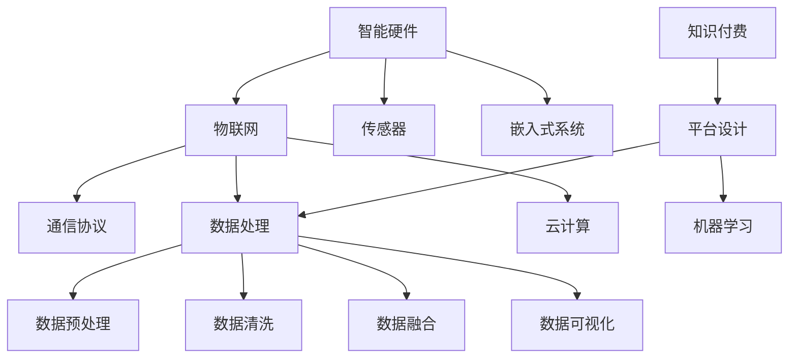

                 

### 文章标题

《如何利用知识付费实现智能硬件与物联网应用？》

### 关键词

智能硬件，物联网，知识付费，平台设计，数据处理，机器学习算法

### 摘要

本文旨在探讨如何通过知识付费的模式，将智能硬件与物联网应用相结合，从而实现个性化、智能化的服务。文章首先对智能硬件与物联网的基本概念进行了概述，并详细讲解了其数学模型和核心算法。接着，文章分析了知识付费的概念与发展，以及其在智能硬件与物联网领域的应用。最后，通过具体案例分析，提供了知识付费智能硬件与物联网项目的设计与开发指导。全文通过逻辑清晰、步骤明确的论述，旨在帮助读者深入了解这一领域的技术与应用。

---

### 目录大纲：如何利用知识付费实现智能硬件与物联网应用？

#### 第一部分：智能硬件与物联网概述

##### 第1章：智能硬件与物联网基础
- 1.1 智能硬件的定义与发展
- 1.2 物联网的架构与技术体系
- 1.3 智能硬件与物联网的关系
- 1.4 智能硬件与物联网的核心概念联系（Mermaid图）

##### 第2章：智能硬件与物联网的数学模型
- 2.1 概率论与统计学基础
- 2.2 数据分析模型
- 2.3 时间序列分析
- 2.4 数学模型在智能硬件与物联网中的应用（Latex公式与详细讲解）

#### 第二部分：智能硬件与物联网的核心算法

##### 第3章：智能硬件与物联网的机器学习算法
- 3.1 机器学习基本概念
- 3.2 常见机器学习算法
- 3.3 特征工程
- 3.4 深度学习在智能硬件与物联网中的应用
- 3.5 核心算法原理讲解（伪代码）

##### 第4章：智能硬件与物联网的数据处理技术
- 4.1 数据预处理
- 4.2 数据清洗
- 4.3 数据融合
- 4.4 数据可视化

#### 第三部分：知识付费与智能硬件、物联网的融合应用

##### 第5章：知识付费的概念与商业模式
- 5.1 知识付费的定义与发展
- 5.2 知识付费的商业模式
- 5.3 智能硬件与物联网在知识付费中的应用

##### 第6章：知识付费平台设计与开发
- 6.1 知识付费平台的设计原则
- 6.2 知识付费平台的架构设计
- 6.3 知识付费平台的核心功能
- 6.4 智能硬件与物联网在知识付费平台中的应用

##### 第7章：案例分析与实战指导
- 7.1 智能硬件与物联网知识付费的典型案例分析
- 7.2 知识付费智能硬件与物联网项目实战
- 7.3 开发环境搭建
- 7.4 源代码详细实现和代码解读

#### 附录

##### 附录A：智能硬件与物联网知识付费开发工具与资源
- 7.1 常用开发工具介绍
- 7.2 开发资源推荐
- 7.3 社区与交流平台

### Mermaid图：智能硬件与物联网核心概念联系



---

### 第1章：智能硬件与物联网基础

#### 1.1 智能硬件的定义与发展

智能硬件，是指嵌入有芯片、传感器、通信模块等组件，能够实现特定功能，并与互联网进行交互的物理设备。它们通过收集环境数据、处理信息并作出反应，从而实现智能化操作。

智能硬件的发展历程可以追溯到20世纪末期，当时嵌入式系统和传感器技术开始逐渐成熟。随着互联网和无线通信技术的普及，智能硬件的发展进入了一个新的阶段。从最初的简单设备，如智能家居中的智能灯泡、智能插座，到如今的复杂系统，如智能穿戴设备、智能汽车等，智能硬件已经深入到了我们生活的各个方面。

智能硬件的兴起，不仅改变了人们的生活方式，也推动了物联网（Internet of Things，IoT）的发展。物联网是通过互联网连接各种物理设备，实现设备之间的信息交换和协同工作。智能硬件作为物联网的节点，可以收集并传输数据，成为物联网生态系统中的重要组成部分。

#### 1.2 物联网的架构与技术体系

物联网的架构通常包括感知层、网络层、平台层和应用层。

- **感知层**：感知层是物联网的基础，主要包括传感器、RFID（射频识别）、条码等设备。这些设备可以感知环境信息，如温度、湿度、光照、位置等，并将这些信息转化为电子信号。

- **网络层**：网络层负责将感知层收集的数据传输到平台层。网络层包括无线传感器网络（WSN）、移动通信网络、互联网等。这些网络技术提供了数据传输的通道，使得数据能够在不同的设备之间进行交换。

- **平台层**：平台层是物联网的核心，主要负责数据的处理、存储、管理和分析。平台层通常包括数据管理模块、数据处理模块、用户接口模块等。通过平台层，用户可以方便地访问和管理物联网设备，获取有用的信息。

- **应用层**：应用层是物联网的直接服务层，包括智能家居、智能交通、智能医疗、智能农业等各种应用。应用层利用平台层提供的数据和服务，实现特定的功能。

#### 1.3 智能硬件与物联网的关系

智能硬件是物联网的重要组成部分。它们通过嵌入传感器、执行器等组件，成为物联网中的感知节点。智能硬件可以实时收集环境数据，并通过通信模块将数据传输到物联网平台进行处理和分析。

物联网为智能硬件提供了连接与协同的可能。通过物联网，智能硬件不仅可以实现设备间的通信和协同工作，还可以接入互联网，实现远程控制和监控。这使得智能硬件的应用更加广泛，功能更加丰富。

例如，在智能家居场景中，智能灯泡、智能插座、智能空调等设备通过物联网连接在一起，用户可以通过手机APP或语音助手远程控制这些设备，实现家庭自动化。在智能交通领域，车辆、交通信号灯、道路传感器等设备通过物联网连接，可以实时监测交通状况，优化交通流量，提高出行效率。

#### 1.4 智能硬件与物联网的核心概念联系

为了更直观地展示智能硬件与物联网的核心概念联系，我们可以使用Mermaid图进行描述。以下是一个简单的Mermaid图示例：


在这个图中，智能硬件作为物联网的节点，通过传感器和嵌入式系统收集数据，并通过通信协议将数据传输到物联网平台。物联网平台负责数据处理、存储和管理，并通过云计算提供强大的计算和存储能力。知识付费则通过平台设计、数据处理和机器学习等技术，实现智能硬件与物联网的深度融合，提供个性化的服务和体验。

---

### 第2章：智能硬件与物联网的数学模型

#### 2.1 概率论与统计学基础

概率论与统计学是智能硬件与物联网领域中不可或缺的基础数学工具。概率论研究随机事件及其规律，统计学则通过收集、整理和分析数据，对总体进行推断。在智能硬件与物联网的应用中，概率论与统计学主要用于数据分析和预测模型的构建。

**概率论的基本概念：**

- **随机事件**：在某种随机实验中，可能出现的结果称为随机事件。
- **概率**：随机事件发生的可能性，通常用0到1之间的数字表示。
- **条件概率**：在某个条件下，另一个事件发生的概率。
- **贝叶斯定理**：用于计算在给定某个条件下，某个事件发生的概率。

**统计学的基本概念：**

- **总体**：研究对象的全体，如所有注册用户的数据。
- **样本**：从总体中抽取的一部分数据，用于对总体进行推断。
- **描述性统计**：用于描述数据的一般特征，如平均数、中位数、标准差等。
- **推断性统计**：基于样本数据，对总体参数进行估计和推断，如置信区间、假设检验等。

**在智能硬件与物联网中的应用：**

- **数据预处理**：通过概率论与统计学的方法，对原始数据进行清洗和预处理，去除异常值、填补缺失值等。
- **预测模型**：利用统计模型，如线性回归、逻辑回归等，对未来的数据趋势进行预测。
- **异常检测**：通过统计方法，识别数据中的异常点或异常模式，用于监控设备状态或网络安全。

#### 2.2 数据分析模型

数据分析模型是智能硬件与物联网应用中的核心组成部分。通过构建合适的分析模型，可以对收集到的数据进行分析、预测和决策。常见的数据分析模型包括：

- **线性回归模型**：用于预测连续型变量，如温度、流量等。
  - **模型公式**：$y = \beta_0 + \beta_1x_1 + \beta_2x_2 + ... + \beta_nx_n$
  - **伪代码示例**：
    ```
    for each sample (x, y) in dataset do
      w = w - learning_rate * (w * x - y)
    end for
    ```

- **逻辑回归模型**：用于预测离散型变量，如是否购买、是否发生故障等。
  - **模型公式**：$P(y=1) = \frac{1}{1 + e^{-(\beta_0 + \beta_1x_1 + \beta_2x_2 + ... + \beta_nx_n)}}$
  - **伪代码示例**：
    ```
    for each sample (x, y) in dataset do
      w = w - learning_rate * (1 / (1 + e^{-(w * x)}) - y)
    end for
    ```

- **决策树模型**：通过树形结构，对数据进行分类或回归分析。
  - **模型结构**：每个节点代表一个特征，每个分支代表一个决策。
  - **伪代码示例**：
    ```
    function DecisionTree(data):
      if data is pure:
        return majority label of data
      else:
        best_feature = select_best_feature(data)
        tree = {}
        for each value of best_feature in data:
          subset = split data by best_feature value
          tree[best_feature][value] = DecisionTree(subset)
        return tree
    ```

- **随机森林模型**：通过构建多个决策树，进行集成学习，提高预测性能。
  - **模型结构**：多个决策树的集合，每个树对数据进行分类或回归。
  - **伪代码示例**：
    ```
    function RandomForest(data, num_trees):
      for i = 1 to num_trees do
        sample = random_sample(data)
        tree = DecisionTree(sample)
        predictions = [classify(x, tree) for x in data]
      end for
      return majority vote of predictions
    ```

#### 2.3 时间序列分析

时间序列分析是智能硬件与物联网领域中重要的分析工具，主要用于处理和分析按时间顺序排列的数据序列。时间序列数据通常包含趋势、季节性和周期性等特征，通过时间序列分析，可以预测未来的数据趋势。

- **时间序列模型**：

  - **ARIMA模型**（自回归积分滑动平均模型）：通过自回归、差分和移动平均的方法，对时间序列数据进行建模。
    - **模型公式**：
      $$
      \begin{aligned}
      y_t &= c + \phi_1 y_{t-1} + \phi_2 y_{t-2} + ... + \phi_p y_{t-p} + \theta_1 \epsilon_{t-1} + \theta_2 \epsilon_{t-2} + ... + \theta_q \epsilon_{t-q} \\
      \epsilon_t &= y_t - \hat{y}_t
      \end{aligned}
      $$
    - **伪代码示例**：
      ```
      function ARIMA(data, p, d, q):
        d_data = difference(data, d)
        (p.ar, p.sd) = auto_regression(d_data, p)
        (q ма, q.sd) = moving_average(d_data, q)
        model = (p.ar, p.sd, q.ма, q.sd)
        return model
      ```

  - **SARIMA模型**（季节性自回归积分滑动平均模型）：在ARIMA模型的基础上，加入季节性成分，用于处理具有季节性的时间序列数据。
    - **模型公式**：
      $$
      \begin{aligned}
      y_t &= c + \phi_1 y_{t-1} + \phi_2 y_{t-2} + ... + \phi_p y_{t-p} + \theta_1 \epsilon_{t-1} + \theta_2 \epsilon_{t-2} + ... + \theta_q \epsilon_{t-q} \\
      y_t &= \psi_1 y_{t-p_s} + \psi_2 y_{t-2p_s} + ... + \psi_p y_{t-pp_s} + \delta_1 \epsilon_{t-p_s} + \delta_2 \epsilon_{t-2p_s} + ... + \delta_q \epsilon_{t-qp_s} \\
      \epsilon_t &= y_t - \hat{y}_t
      \end{aligned}
      $$
    - **伪代码示例**：
      ```
      function SARIMA(data, p, d, q, p_s, d_s, q_s):
        d_data = difference(data, d)
        (p.ar, p.sd) = auto_regression(d_data, p)
        (q ма, q.sd) = moving_average(d_data, q)
        (p_s.ar, p_s.sd) = auto_regression(data, p_s)
        (q_s.ма, q_s.sd) = moving_average(data, q_s)
        model = (p.ar, p.sd, q.ма, q.sd, p_s.ar, p_s.sd, q_s.ма, q_s.sd)
        return model
      ```

- **时间序列分析在智能硬件与物联网中的应用**：

  - **设备状态监测**：通过时间序列分析，监测设备的状态变化，预测设备故障。
  - **能耗管理**：通过时间序列分析，预测能源消耗，优化能源管理。
  - **用户行为预测**：通过时间序列分析，预测用户的行为模式，提供个性化的服务。

#### 2.4 数学模型在智能硬件与物联网中的应用

在智能硬件与物联网的应用中，数学模型起着至关重要的作用。通过构建合适的数学模型，可以对数据进行分析、预测和决策。以下是一些常见的数学模型及其在智能硬件与物联网中的应用：

- **线性回归模型**：用于预测设备温度、流量等连续型变量。
  - **应用示例**：预测智能家居中空调的能耗。

    $$y = \beta_0 + \beta_1x_1 + \beta_2x_2$$

    其中，$y$ 表示空调能耗，$x_1$ 表示室内温度，$x_2$ 表示室外温度。

- **逻辑回归模型**：用于预测设备是否发生故障等离散型变量。
  - **应用示例**：预测智能汽车是否发生故障。

    $$P(y=1) = \frac{1}{1 + e^{-(\beta_0 + \beta_1x_1 + \beta_2x_2)}}$$

    其中，$y$ 表示是否发生故障，$x_1$ 表示行驶速度，$x_2$ 表示刹车压力。

- **决策树模型**：用于分类设备故障类型、用户行为等。
  - **应用示例**：分类智能手表用户的心率数据。

    $$\text{if } x_1 > 100 \text{ then } \text{high-intensity exercise};$$
    $$\text{else if } x_1 \leq 100 \text{ and } x_2 > 60 \text{ then } \text{low-intensity exercise};$$
    $$\text{else } \text{resting state}.$$

    其中，$x_1$ 表示心率，$x_2$ 表示步数。

- **神经网络模型**：用于处理复杂的非线性关系，如智能安防系统的异常检测。
  - **应用示例**：检测智能摄像头前是否有人闯入。

    $$\text{Output} = \text{activation}(\text{weight} \cdot \text{input} + \text{bias})$$

    其中，$\text{weight}$ 表示权重，$\text{input}$ 表示输入特征，$\text{bias}$ 表示偏置，$\text{activation}$ 函数用于非线性变换。

通过以上数学模型的应用，智能硬件与物联网可以更好地实现数据的分析、预测和决策，提供更智能、更高效的服务。

---

### 第3章：智能硬件与物联网的机器学习算法

#### 3.1 机器学习基本概念

机器学习（Machine Learning）是人工智能（Artificial Intelligence，AI）的一个重要分支，它通过构建和优化算法，使计算机系统能够从数据中学习并做出决策。在智能硬件与物联网领域，机器学习算法被广泛应用于数据处理、预测分析和决策制定。

**监督学习（Supervised Learning）：**  
监督学习是一种最常见的机器学习方法，它使用带有标签的数据进行训练。标签是输入数据的输出结果，通过学习输入和输出之间的映射关系，模型可以对新数据进行预测。

- **分类问题（Classification Problem）：** 模型将数据分为不同的类别。例如，电子邮件是否为垃圾邮件、图像是否包含猫等。
- **回归问题（Regression Problem）：** 模型预测一个连续的数值输出。例如，预测房价、股票价格等。

**无监督学习（Unsupervised Learning）：**  
无监督学习不使用标签数据，而是通过分析数据的内在结构，如聚类、降维和关联规则挖掘等。

- **聚类（Clustering）：** 将相似的数据点分为不同的组。例如，将用户分为不同的兴趣群体。
- **降维（Dimensionality Reduction）：** 降低数据的维度，简化数据分析过程。例如，使用主成分分析（PCA）减小数据集的维度。
- **关联规则挖掘（Association Rule Learning）：** 发现数据项之间的关联关系。例如，在超市购物篮分析中，发现某些商品常常一起购买。

**半监督学习（Semi-Supervised Learning）：**  
半监督学习结合了监督学习和无监督学习，使用少量的标签数据和大量的无标签数据进行训练。这种方法可以有效提高模型的泛化能力，减少对大量标注数据的依赖。

**在智能硬件与物联网中的应用：**  
机器学习算法在智能硬件与物联网中的应用非常广泛，以下是一些典型的应用场景：

- **设备故障预测**：通过收集传感器数据，使用监督学习算法预测设备的故障，从而实现预防性维护。
- **异常检测**：监控物联网设备的行为，使用无监督学习算法检测异常行为，保障网络安全。
- **用户行为分析**：分析用户在智能家居、智能穿戴设备等场景下的行为模式，提供个性化推荐。
- **能效优化**：通过分析能耗数据，使用机器学习算法预测能耗趋势，优化能源消耗。

#### 3.2 常见机器学习算法

在智能硬件与物联网领域，常见的机器学习算法包括线性回归、逻辑回归、决策树、随机森林、支持向量机（SVM）和神经网络等。每种算法都有其独特的特点和应用场景。

**线性回归（Linear Regression）：**  
线性回归是一种简单的监督学习算法，用于预测连续型变量。其基本思想是通过建立输入变量和目标变量之间的线性关系，从而预测新的数据。

- **模型公式**：  
  $$y = \beta_0 + \beta_1x_1 + \beta_2x_2 + ... + \beta_nx_n$$

- **伪代码示例**：  
  ```
  for each sample (x, y) in dataset do
    w = w - learning_rate * (w * x - y)
  end for
  ```

**逻辑回归（Logistic Regression）：**  
逻辑回归是一种用于分类问题的监督学习算法，它通过建立输入变量和输出概率之间的非线性关系，预测样本的类别。

- **模型公式**：  
  $$P(y=1) = \frac{1}{1 + e^{-(\beta_0 + \beta_1x_1 + \beta_2x_2 + ... + \beta_nx_n)}}$$

- **伪代码示例**：  
  ```
  for each sample (x, y) in dataset do
    w = w - learning_rate * (1 / (1 + e^{-(w * x)}) - y)
  end for
  ```

**决策树（Decision Tree）：**  
决策树是一种直观的监督学习算法，通过树形结构对数据进行分类或回归分析。每个节点代表一个特征，每个分支代表一个决策。

- **模型结构**：  
  每个节点选择最优特征，将数据划分为不同的子集，直到满足停止条件。

- **伪代码示例**：  
  ```
  function DecisionTree(data):
    if data is pure:
      return majority label of data
    else:
      best_feature = select_best_feature(data)
      tree = {}
      for each value of best_feature in data:
        subset = split data by best_feature value
        tree[best_feature][value] = DecisionTree(subset)
      return tree
  ```

**随机森林（Random Forest）：**  
随机森林是一种集成学习算法，通过构建多个决策树，进行集成学习，提高预测性能。每个树对数据进行分类或回归，最后通过投票或平均的方式得到最终结果。

- **模型结构**：  
  多个决策树的集合，每个树对数据进行分类或回归。

- **伪代码示例**：  
  ```
  function RandomForest(data, num_trees):
    for i = 1 to num_trees do
      sample = random_sample(data)
      tree = DecisionTree(sample)
      predictions = [classify(x, tree) for x in data]
    end for
    return majority vote of predictions
  ```

**支持向量机（Support Vector Machine，SVM）：**  
支持向量机是一种强大的分类和回归算法，通过最大化分类间隔来构建决策边界。它适用于高维空间，并且在某些情况下性能优于线性回归和逻辑回归。

- **模型公式**：  
  $$\text{Minimize } \frac{1}{2} \| w \|^2 \text{ subject to } y^{(i)} (\textbf{x}^{(i)} \cdot w + b) \geq 1$$

- **伪代码示例**：  
  ```
  function SVM(data, labels):
    optimize w and b to maximize margin
    return w, b
  ```

**神经网络（Neural Network）：**  
神经网络是一种模拟人脑神经元连接和传递信息的计算模型，通过多层神经元的非线性组合，实现复杂函数的逼近。它包括输入层、隐藏层和输出层，通过反向传播算法进行参数调整。

- **模型结构**：  
  输入层接收外部输入，隐藏层通过加权求和和激活函数处理输入，输出层生成最终输出。

- **伪代码示例**：  
  ```
  function NeuralNetwork(inputs, weights, biases, activation_function):
    hidden_layer = [activation_function(dot_product(input, weights[i]) + biases[i]) for i in range(num_hidden_layers)]
    output = activation_function(dot_product(hidden_layer[-1], weights[-1]) + biases[-1])
    return output
  ```

#### 3.3 特征工程

特征工程（Feature Engineering）是机器学习过程中至关重要的一步，它涉及到如何从原始数据中提取和构造有用的特征，以提高模型的预测性能。在智能硬件与物联网领域，特征工程的重要性尤为突出，因为传感器数据通常具有高维度、非线性和噪声等特点。

**特征选择（Feature Selection）：**  
特征选择是特征工程的首要任务，旨在从大量特征中选出对模型预测有显著影响的特征，以简化模型和提高效率。

- **方法**：  
  - 基于过滤的方法（Filter Methods）：使用统计指标，如相关性、信息增益等，评估特征的重要性。
  - 基于包裹的方法（Wrapper Methods）：使用已训练好的模型，评估特征组合对模型预测性能的影响。
  - 基于嵌入的方法（Embedded Methods）：在模型训练过程中，自动选择对模型有显著贡献的特征。

**特征提取（Feature Extraction）：**  
特征提取是将原始数据转换为更有信息量的特征表示，以提高模型的泛化能力和解释性。

- **方法**：  
  - 线性变换（Linear Transformations）：如主成分分析（PCA）、线性判别分析（LDA）等。
  - 非线性变换（Nonlinear Transformations）：如核函数变换、神经网络变换等。
  - 空间变换（Spatial Transformations）：如局部特征提取、稀疏表示等。

**特征缩放（Feature Scaling）：**  
特征缩放是将不同特征的范围进行调整，使其具有相似的比例，以避免某些特征对模型的影响过大。

- **方法**：  
  - 标准化（Standardization）：将特征值缩放到标准正态分布，公式为 $x' = \frac{x - \mu}{\sigma}$。
  - 归一化（Normalization）：将特征值缩放到[0,1]区间，公式为 $x' = \frac{x - \min}{\max - \min}$。

**特征工程在智能硬件与物联网中的应用：**

- **设备故障预测**：通过特征工程，提取设备运行状态的关键指标，如温度、振动、电流等，以提高故障预测的准确性。
- **能耗管理**：通过特征工程，提取能耗数据中的时间序列特征、季节性特征等，优化能耗预测模型。
- **用户行为分析**：通过特征工程，提取用户在不同场景下的行为模式，如活动频率、活动时长等，提供个性化服务。

#### 3.4 深度学习在智能硬件与物联网中的应用

深度学习（Deep Learning）是机器学习的一个重要分支，它通过构建多层神经网络，实现复杂函数的逼近和特征提取。在智能硬件与物联网领域，深度学习算法被广泛应用于图像识别、自然语言处理、语音识别等任务。

**卷积神经网络（Convolutional Neural Network，CNN）：**  
卷积神经网络是一种专门用于图像识别和处理的深度学习算法。它通过卷积层、池化层和全连接层的组合，实现图像的特征提取和分类。

- **模型结构**：  
  - 卷积层：通过卷积操作提取图像的特征。
  - 池化层：通过下采样操作减少数据维度。
  - 全连接层：通过全连接层进行分类或回归。

- **伪代码示例**：  
  ```
  function CNN(inputs, filters, biases):
    conv_output = convolution(inputs, filters)
    pool_output = pooling(conv_output)
    flatten_output = flatten(pool_output)
    fc_output = fully_connected(flatten_output, biases)
    return fc_output
  ```

**循环神经网络（Recurrent Neural Network，RNN）：**  
循环神经网络是一种专门用于处理序列数据的深度学习算法。它通过循环结构，将前一时间步的信息传递到当前时间步，实现序列数据的建模。

- **模型结构**：  
  - 输入层：接收外部输入。
  - 循环层：通过门控机制，更新状态信息。
  - 输出层：生成最终输出。

- **伪代码示例**：  
  ```
  function RNN(inputs, hidden_state, weights, biases):
    hidden_state = activation_function(dot_product(inputs, weights) + biases)
    output = fully_connected(hidden_state, biases)
    return output, hidden_state
  ```

**生成对抗网络（Generative Adversarial Network，GAN）：**  
生成对抗网络是一种通过对抗性训练生成数据分布的深度学习算法。它由生成器和判别器两个网络组成，生成器试图生成逼真的数据，判别器则试图区分生成数据和真实数据。

- **模型结构**：  
  - 生成器：通过随机噪声生成模拟数据。
  - 判别器：通过输入数据，判断其是真实数据还是生成数据。

- **伪代码示例**：  
  ```
  function GAN(real_data, noise):
    generated_data = generator(noise)
    discriminator_loss = loss(discriminator(real_data), 1)
    generator_loss = loss(discriminator(generated_data), 0)
    return generator_loss, discriminator_loss
  ```

**在智能硬件与物联网中的应用：**

- **图像识别**：通过CNN，实现对智能摄像头捕获的图像进行实时识别，用于智能安防、自动驾驶等场景。
- **语音识别**：通过RNN，实现语音信号的序列建模和转换，用于智能助手、语音识别等应用。
- **数据生成**：通过GAN，生成模拟的数据集，用于训练深度学习模型，提高模型的泛化能力。

---

### 第4章：智能硬件与物联网的数据处理技术

#### 4.1 数据预处理

在智能硬件与物联网领域，数据处理技术是至关重要的。数据预处理是数据处理的第一步，它包括数据清洗、缺失值处理、数据标准化等步骤。通过有效的数据预处理，可以确保数据的准确性和一致性，为后续的数据分析和机器学习模型构建打下坚实的基础。

**数据清洗（Data Cleaning）：**

数据清洗是处理原始数据中的错误、异常值和不一致数据的过程。常见的数据清洗操作包括：

- **去除重复数据（De-duplication）：** 从数据集中移除重复的记录。
- **处理异常值（Outlier Detection and Treatment）：** 识别并处理数据集中的异常值，可以选择删除、替换或调整异常值。
- **填补缺失值（Handling Missing Values）：** 处理数据集中的缺失值，可以选择删除缺失值、填补缺失值或插值等方法。

**缺失值处理（Handling Missing Values）：**

处理缺失值是数据预处理中的一个关键步骤。以下是一些常见的处理缺失值的方法：

- **删除缺失值（Deletion）：** 删除包含缺失值的记录，适用于缺失值较少且不影响数据分析结果的情况。
- **填补缺失值（Imputation）：** 用一定的方法填补缺失值，包括以下几种方法：
  - **均值填补（Mean Imputation）：** 用数据集的平均值填补缺失值。
  - **中值填补（Median Imputation）：** 用数据集的中值填补缺失值。
  - **众数填补（Mode Imputation）：** 用数据集的众数填补缺失值。
  - **插值（Interpolation）：** 利用时间序列或空间序列的特点，对缺失值进行插值。

**数据标准化（Data Standardization）：**

数据标准化是将不同特征的数据范围调整为相似的比例，以消除特征间的尺度差异，提高模型的性能。常见的数据标准化方法包括：

- **标准化（Standardization）：** 将特征值缩放到标准正态分布，公式为 $x' = \frac{x - \mu}{\sigma}$。
- **归一化（Normalization）：** 将特征值缩放到[0,1]区间，公式为 $x' = \frac{x - \min}{\max - \min}$。

**在智能硬件与物联网中的应用：**

- **设备状态监测**：通过对传感器数据进行预处理，去除异常值和缺失值，提高设备状态监测的准确性。
- **能耗管理**：通过对能耗数据进行标准化处理，确保不同时间段的能耗数据具有可比性，从而优化能耗管理策略。
- **用户行为分析**：通过对用户行为数据进行清洗和标准化，提取有用的特征，为个性化推荐和用户体验优化提供支持。

#### 4.2 数据清洗

数据清洗是数据预处理中至关重要的一步，它涉及到去除数据中的噪声、错误和不一致数据，确保数据的准确性和一致性。以下是一些常用的数据清洗方法：

- **去除重复数据（De-duplication）：** 通过比较数据记录的唯一标识（如设备ID、用户ID等），删除重复的记录。这可以防止数据重复计算和分析。
  
- **处理异常值（Outlier Detection and Treatment）：** 异常值可能是由于传感器故障、数据采集错误或真实异常情况引起的。常见的处理方法包括：
  - **删除异常值（Deletion）：** 对于不重要的特征或样本，可以删除异常值。但这种方法可能会导致数据的丢失。
  - **替换异常值（Replacement）：** 使用统计方法（如平均值、中值或众数）或插值方法（如线性插值、高斯插值）来替换异常值。
  - **调整异常值（Adjustment）：** 通过调整异常值的值，使其更接近其他值的分布。这种方法需要更深入的数据分析和业务知识。

- **处理缺失值（Handling Missing Values）：** 缺失值是数据清洗中常见的挑战。以下是一些常用的处理缺失值的方法：
  - **删除缺失值（Deletion）：** 对于缺失值较多的特征或样本，可以选择删除。但这种方法可能会导致数据的丢失。
  - **填补缺失值（Imputation）：** 常见的方法包括：
    - **均值填补（Mean Imputation）：** 用特征的平均值填补缺失值。
    - **中值填补（Median Imputation）：** 用特征的中值填补缺失值。
    - **众数填补（Mode Imputation）：** 用特征的众数填补缺失值。
    - **插值（Interpolation）：** 通过时间序列或空间序列的特点，对缺失值进行插值。
    - **基于模型的填补（Model-Based Imputation）：** 使用统计模型（如线性回归、随机森林等）预测缺失值。

- **数据格式转换（Data Format Conversion）：** 将不同格式或来源的数据转换为统一的格式，如将文本数据转换为数字编码、日期数据格式化等。

**在智能硬件与物联网中的应用：**

- **设备故障预测**：通过对传感器数据进行清洗，去除异常值和缺失值，提高故障预测模型的准确性。
- **能耗管理**：通过对能耗数据进行清洗，确保数据的一致性和准确性，从而优化能耗管理策略。
- **用户行为分析**：通过对用户行为数据进行清洗，提取有效的特征，为个性化推荐和用户体验优化提供支持。

#### 4.3 数据融合

数据融合（Data Fusion）是将来自多个来源、格式和分辨率的数据合并为一个统一的数据集的过程。在智能硬件与物联网领域，数据融合对于提高数据分析的准确性和完整性具有重要意义。

**数据融合的类型：**

- **垂直融合（Vertical Fusion）：** 将多个来源的相同类型数据（如不同时间点的传感器数据）合并为一个数据集。
- **水平融合（Horizontal Fusion）：** 将多个来源的不同类型数据（如传感器数据与用户行为数据）合并为一个数据集。
- **跨层次融合（Cross-Level Fusion）：** 将不同层次的数据（如低层次特征与高层次特征）进行融合。

**数据融合的方法：**

- **基于规则的融合（Rule-Based Fusion）：** 使用预定义的规则将数据源进行组合，如将不同时间点的数据取平均值。
- **基于模型的融合（Model-Based Fusion）：** 使用机器学习模型，如聚类、分类和回归模型，对数据进行融合。
- **基于数据的融合（Data-Driven Fusion）：** 利用数据本身的特性进行融合，如通过统计分析或可视化方法识别数据之间的关系。

**在智能硬件与物联网中的应用：**

- **智能交通系统**：通过融合交通流量数据、车辆数据和环境数据，优化交通流量和减少交通拥堵。
- **智能农业**：通过融合土壤湿度、气象数据和作物生长数据，实现精准农业和智能灌溉。
- **智能医疗**：通过融合病人的生理数据、病史数据和基因数据，提供个性化医疗诊断和治疗建议。

#### 4.4 数据可视化

数据可视化（Data Visualization）是将数据转换为图形或图表的形式，以直观地展示数据特征和趋势的过程。在智能硬件与物联网领域，数据可视化对于理解数据、发现数据中的异常和趋势具有重要意义。

**常见的数据可视化工具和技术：**

- **图表和图形（Charts and Graphs）：** 如折线图、柱状图、饼图、散点图等，用于展示数据的变化趋势和分布情况。
- **热图（Heatmaps）：** 用颜色深浅表示数据值的大小，适用于展示数据的空间分布和相关性。
- **交互式可视化（Interactive Visualization）：** 如交互式图表、仪表板等，允许用户通过鼠标或触摸屏与数据互动，进行深入分析和探索。
- **虚拟现实（Virtual Reality，VR）和增强现实（Augmented Reality，AR）：** 利用VR和AR技术，将数据以三维形式展示，提供沉浸式的数据分析体验。

**在智能硬件与物联网中的应用：**

- **智能交通**：通过数据可视化，展示实时交通流量、车辆位置和事故信息，辅助交通管理和调度。
- **智能家居**：通过数据可视化，展示家庭能耗、设备状态和用户行为，提供智能化的生活管理和节能建议。
- **智能医疗**：通过数据可视化，展示患者的生理指标、治疗过程和药物效果，辅助医生进行诊断和治疗决策。

---

### 第5章：知识付费的概念与商业模式

#### 5.1 知识付费的定义与发展

知识付费，是指用户通过支付一定费用，获取专业知识、技能、经验等服务的一种商业模式。它起源于20世纪末期，随着互联网的发展而迅速崛起。知识付费的核心在于将知识作为产品或服务进行交易，通过付费形式实现知识的传播和价值的转化。

知识付费的发展可以分为以下几个阶段：

- **萌芽阶段**：早期的知识付费主要表现为线上教育平台，如网课、电子书等。
- **成长阶段**：随着移动互联网的普及，知识付费逐渐向个性化、专业化发展，平台化、社交化、内容付费成为主流模式。
- **成熟阶段**：知识付费市场日益成熟，多元化、跨界化、智能化成为发展趋势，智能硬件与物联网的加入进一步丰富了知识付费的应用场景。

#### 5.2 知识付费的商业模式

知识付费的商业模式主要可以分为以下几种：

- **内容付费**：用户通过支付费用，购买课程、电子书、文章等知识内容。
- **服务付费**：用户通过支付费用，获取专家咨询、个性化辅导、专业培训等服务。
- **平台付费**：用户通过使用知识付费平台，支付订阅费或使用费，获得平台的终身会员权益。

**在智能硬件与物联网中的应用**：

知识付费在智能硬件与物联网领域的应用，主要体现在以下几个方面：

- **个性化学习体验**：通过智能硬件设备，如智能手表、智能耳机等，实时监测用户的学习状态，提供个性化的学习内容和策略。
- **远程专家咨询**：通过物联网技术，实现用户与专家的实时沟通，提供在线咨询、诊断和指导。
- **智能培训系统**：利用智能硬件设备，对用户进行模拟训练、实时反馈和评估，提高培训效果和效率。

#### 5.3 智能硬件与物联网在知识付费中的应用

智能硬件与物联网在知识付费中的应用，为知识传播和服务提供了新的途径，具体体现在以下几个方面：

- **智能设备监测**：通过智能硬件设备，如智能穿戴设备、智能传感器等，实时监测用户的学习行为、健康状况等，为知识付费平台提供数据支持。
- **个性化推荐系统**：利用物联网技术和大数据分析，分析用户行为数据，为用户推荐合适的学习内容、课程和服务。
- **实时互动与反馈**：通过物联网技术，实现用户与教师、专家的实时互动，提供在线答疑、讨论和反馈，提升用户体验和满意度。
- **智能培训环境**：利用智能硬件设备，构建智能化的培训环境，如智能教室、智能实验室等，提高培训效果和安全性。

例如，在教育领域，智能硬件与物联网可以应用于智能课堂监控、在线学习平台、教育数据管理等方面。通过智能硬件设备，教师可以实时监控学生的学习状态，根据学生的反馈和表现，调整教学内容和方法。同时，智能硬件设备可以收集和分析学生的学习数据，为教育平台提供丰富的数据资源，实现个性化推荐和智能决策。

在健康领域，智能硬件与物联网可以应用于远程医疗、健康管理、疾病预测等方面。通过智能穿戴设备，如智能手表、智能手环等，用户可以实时监测自己的健康状况，如心率、血压、睡眠质量等。智能硬件设备将数据传输到健康管理平台，平台利用大数据分析和机器学习技术，为用户提供个性化的健康建议和预警服务。

总之，智能硬件与物联网在知识付费中的应用，不仅提升了知识传播的效率和效果，也为用户提供了更加智能化、个性化的服务体验。随着技术的不断进步，智能硬件与物联网在知识付费领域的应用前景将更加广阔。

---

### 第6章：知识付费平台设计与开发

#### 6.1 知识付费平台的设计原则

知识付费平台的设计原则是确保平台能够为用户提供高质量、个性化的服务，同时实现商业模式的可持续性。以下是几个关键设计原则：

1. **用户导向（User-Centric）**：平台设计应以用户需求为中心，充分考虑用户的体验和使用习惯，提供简洁、直观的用户界面和交互方式。

2. **内容为王（Content-First）**：优质的内容是知识付费平台的核心竞争力。平台应注重内容的质量和创新，确保用户能够获取有价值、实用的知识。

3. **安全可靠（Secure and Reliable）**：平台必须保障用户数据的安全和隐私，采用先进的加密技术和安全协议，防止数据泄露和恶意攻击。

4. **高效稳定（High Performance）**：平台需要具备高效的处理能力和稳定的运行状态，确保用户能够流畅地访问和使用平台服务。

5. **可扩展性（Scalability）**：随着用户规模和业务量的增长，平台应具备良好的可扩展性，能够灵活地扩展资源和功能，以满足不断增长的需求。

6. **持续优化（Continuous Improvement）**：平台设计应支持持续优化和迭代，通过用户反馈和技术创新，不断提升平台的功能和用户体验。

#### 6.2 知识付费平台的架构设计

知识付费平台的架构设计需要考虑前端、后端、数据库、安全等多个方面，以下是一个典型的知识付费平台架构设计：

**前端架构（Front-end Architecture）：**

- **用户界面（User Interface，UI）**：设计简洁、直观的用户界面，提供课程列表、搜索、播放、互动等功能。
- **交互体验（User Experience，UX）**：优化用户交互流程，提高用户体验，如通过动画、视频、图表等丰富内容展示。
- **移动端适配（Responsive Design）**：确保平台在不同设备和屏幕尺寸上都能良好展示，提供一致的用户体验。

**后端架构（Back-end Architecture）：**

- **服务器（Server）**：使用高性能服务器，确保平台的稳定运行和高效处理能力。
- **应用服务器（Application Server）**：处理用户请求，提供业务逻辑处理、数据访问等服务。
- **缓存服务器（Cache Server）**：缓存热点数据和频繁访问的数据，提高系统响应速度。
- **负载均衡（Load Balancing）**：通过负载均衡技术，分配用户请求到不同的服务器，确保系统的可扩展性和稳定性。

**数据库架构（Database Architecture）：**

- **关系型数据库（Relational Database）**：存储用户信息、课程数据、交易记录等结构化数据，如MySQL、PostgreSQL等。
- **非关系型数据库（NoSQL Database）**：存储用户行为数据、日志数据等非结构化数据，如MongoDB、Cassandra等。
- **数据仓库（Data Warehouse）**：用于存储大量历史数据，支持数据分析、报表生成等。

**安全架构（Security Architecture）：**

- **身份认证（Authentication）**：采用多因素认证，确保用户身份的合法性。
- **权限管理（Authorization）**：设置不同的权限级别，确保用户只能访问自己有权访问的数据和功能。
- **数据加密（Data Encryption）**：对用户数据进行加密存储和传输，防止数据泄露。
- **安全审计（Security Audit）**：记录系统操作日志，进行安全审计，及时发现和应对潜在的安全威胁。

**平台架构的设计原则**：

- **模块化（Modularity）**：将平台功能划分为多个模块，便于开发和维护，提高系统的可扩展性和可维护性。
- **分布式（Distributed）**：采用分布式架构，提高系统的可用性和容错性，确保平台在高并发场景下的稳定性。
- **微服务架构（Microservices Architecture）**：将系统功能拆分为多个独立的微服务，每个微服务负责特定的业务功能，提高系统的灵活性和可维护性。

#### 6.3 知识付费平台的核心功能

知识付费平台的核心功能包括用户注册与登录、课程浏览与购买、学习进度管理、内容播放与互动等。以下是对这些核心功能的详细描述：

**用户注册与登录（User Registration and Login）：**

- **用户注册**：用户可以通过邮箱、手机号、社交媒体账号等多种方式进行注册，系统会生成用户ID，用于标识用户身份。
- **用户登录**：用户可以使用用户名和密码、手机验证码等方式登录系统，系统会验证用户身份，并生成会话令牌（Session Token）。

**课程浏览与购买（Course Browsing and Purchase）：**

- **课程列表**：平台提供课程分类和搜索功能，用户可以通过分类浏览或关键词搜索，查找感兴趣的课程。
- **课程详情**：用户可以查看课程的简介、讲师介绍、课程目录、评价等信息，决定是否购买。
- **购买流程**：用户选择课程后，进入购买流程，可以选择支付方式，完成支付后，课程会加入用户的学习列表。

**学习进度管理（Learning Progress Management）：**

- **学习列表**：用户可以在学习列表中查看已购买课程、正在学习课程和已完成课程。
- **学习进度**：用户可以查看每门课程的学习进度，包括已学习课时、完成作业情况等。
- **提醒功能**：平台可以设置学习提醒，提醒用户按时完成学习任务。

**内容播放与互动（Content Playback and Interaction）：**

- **视频播放**：平台提供视频播放功能，支持多种视频格式，如MP4、AVI等。
- **互动功能**：平台支持在线讨论、问答、作业提交等功能，用户可以与其他用户进行互动，讨论学习问题。
- **学习记录**：平台记录用户的学习行为和成绩，为用户生成学习报告。

**在智能硬件与物联网中的应用**：

智能硬件与物联网在知识付费平台中的应用，可以提升用户体验和平台功能。以下是一些应用场景：

- **智能穿戴设备**：通过智能手表、智能手环等设备，实时监测用户的学习状态，如心率、运动量等，为平台提供用户行为数据。
- **智能学习工具**：如智能笔、智能音箱等，可以辅助用户学习，提供语音讲解、实时翻译等功能。
- **物联网平台**：通过物联网技术，实现知识付费平台与其他设备的互联互通，提供更智能化的服务，如智能教室、智能图书馆等。

通过智能硬件与物联网技术的融合，知识付费平台可以提供更加个性化、智能化的学习体验，满足用户的多样化需求。

---

#### 6.4 智能硬件与物联网在知识付费平台中的应用

智能硬件与物联网在知识付费平台中的应用，极大地提升了用户体验和服务质量。以下是一些具体的应用场景和实现方式：

**1. 智能穿戴设备**

智能穿戴设备，如智能手表、智能手环等，可以实时监测用户的学习状态，包括心率、运动量、睡眠质量等。平台通过获取这些数据，可以提供个性化的学习建议和健康提醒。例如，如果用户的学习状态不佳，平台可以建议用户休息一会儿或者进行适当的运动。

**应用场景：**

- **实时监测学习状态**：通过智能穿戴设备，平台可以实时获取用户的心率、运动量等数据，分析用户的学习疲劳程度，提供个性化的学习建议。
- **健康提醒**：当用户学习时间过长或心率过高时，平台会发出提醒，建议用户休息或进行适当的运动。

**实现方式：**

- **数据同步**：智能穿戴设备将数据传输到平台，平台使用API或MQTT协议等与智能穿戴设备进行数据同步。
- **数据分析**：平台利用数据分析技术，如时间序列分析、机器学习等，对用户数据进行分析，生成个性化学习建议。

**2. 智能学习工具**

智能学习工具，如智能笔、智能笔记本等，可以辅助用户进行学习。这些工具能够自动记录用户的笔记、绘图等，同时与平台进行数据同步，提供更丰富的学习体验。

**应用场景：**

- **笔记记录与同步**：智能笔可以自动记录用户的笔记和绘图，并将数据同步到平台，用户可以在平台上查看和编辑笔记。
- **学习资源管理**：智能学习工具可以帮助用户管理学习资源，如视频、文档、PPT等，实现一键下载和快速访问。

**实现方式：**

- **硬件集成**：智能学习工具与平台通过硬件集成，实现数据的自动同步和共享。
- **软件支持**：平台提供配套的软件支持，如笔记编辑器、资源管理器等，方便用户进行学习和管理。

**3. 智能教室**

智能教室是将智能硬件与物联网技术应用于教育场景的一种形式。通过智能教室，平台可以实现课堂监控、远程教学、互动讨论等功能，提供更高效、智能的教育环境。

**应用场景：**

- **课堂监控**：智能摄像头可以实时监控课堂情况，平台可以远程查看课堂直播，确保教学秩序。
- **远程教学**：教师可以通过平台进行远程教学，学生可以在家中或其他地方进行学习。
- **互动讨论**：平台支持实时互动和讨论，学生和教师可以在线交流，提高学习效果。

**实现方式：**

- **硬件部署**：在教室中部署智能摄像头、智能音箱等硬件设备，实现课堂监控和远程教学。
- **软件平台**：平台提供智能教室的管理系统，包括直播、录制、互动等功能，方便教师和学生使用。

**4. 智能图书馆**

智能图书馆是将智能硬件与物联网技术应用于图书馆管理的一种形式。通过智能图书馆，平台可以实现图书查询、自助借还、智能导航等功能，提供更便捷的图书馆服务。

**应用场景：**

- **图书查询**：用户可以通过平台查询图书馆的图书资源，了解图书的库存情况和位置。
- **自助借还**：用户可以通过智能终端自助借还图书，无需人工操作。
- **智能导航**：智能图书馆提供智能导航功能，帮助用户快速找到所需图书。

**实现方式：**

- **硬件设备**：在图书馆中部署智能终端、RFID标签等硬件设备，实现图书的自动化管理和导航。
- **软件平台**：平台提供智能图书馆的管理系统，包括图书查询、自助借还、智能导航等功能。

通过智能硬件与物联网技术的应用，知识付费平台可以提供更加个性化、智能化的服务，满足用户的多样化需求。未来，随着技术的不断进步，智能硬件与物联网在知识付费领域的应用将更加广泛，为用户提供更加便捷、高效的学习体验。

---

### 第7章：案例分析与实战指导

#### 7.1 智能硬件与物联网知识付费的典型案例分析

智能硬件与物联网在知识付费领域的应用，已经涌现出许多成功的案例。以下是一些典型案例的分析：

**1. 智能健身教练**

**案例背景**：随着人们对健康和健身需求的增加，智能健身教练成为了一个新兴的市场。智能健身教练通过智能硬件设备，如智能手环、智能秤等，监测用户的运动数据，提供个性化的健身计划和指导。

**解决方案**：智能健身教练平台利用物联网技术，将智能硬件设备与平台进行数据同步，实现数据的实时监控和分析。平台通过机器学习算法，对用户的运动数据进行处理，生成个性化的健身计划和建议。

**实现效果**：通过智能健身教练平台，用户可以实时了解自己的运动数据，如心率、消耗的卡路里、运动时长等。平台根据用户的反馈和运动数据，不断优化健身计划，提高用户的健身效果和满意度。

**2. 智能语言学习**

**案例背景**：语言学习是一个长期且复杂的任务，智能语言学习平台通过智能硬件设备，如智能音箱、智能耳机等，提供沉浸式的学习体验。

**解决方案**：智能语言学习平台利用物联网技术，将智能硬件设备与平台进行数据同步，实现语言学习过程中的实时反馈和互动。平台通过语音识别和自然语言处理技术，对用户的语音进行识别和解析，提供针对性的语言学习建议。

**实现效果**：用户可以通过智能硬件设备，随时随地与平台进行互动，如听录音、做练习、参加语音对话等。平台根据用户的语音数据，识别用户的语言水平，提供个性化的学习资源和练习。

**3. 智能医疗咨询**

**案例背景**：随着健康意识的提高，人们对医疗咨询的需求日益增长。智能医疗咨询平台通过智能硬件设备，如智能手表、智能血压计等，提供在线医疗咨询服务。

**解决方案**：智能医疗咨询平台利用物联网技术，将智能硬件设备与平台进行数据同步，实现用户健康数据的实时监控和分析。平台通过大数据分析和机器学习算法，对用户健康数据进行分析，提供针对性的医疗建议。

**实现效果**：用户可以通过智能硬件设备，实时监测自己的健康状况，如心率、血压、睡眠质量等。平台根据用户健康数据，分析潜在的健康风险，提供在线医生咨询、健康报告、预防措施等服务。

#### 7.2 知识付费智能硬件与物联网项目实战

以下是一个知识付费智能硬件与物联网项目的实战案例，包括项目背景、目标、实现过程和成果。

**项目背景**：某公司希望开发一款智能学习平台，为用户提供个性化的学习体验。平台将结合智能硬件设备，如智能手环、智能眼镜等，实时监测用户的学习状态，提供针对性的学习资源和建议。

**项目目标**：

- **实时监测学习状态**：通过智能硬件设备，实时监测用户的心率、注意力等学习状态，为用户提供个性化的学习建议。
- **提供个性化学习资源**：根据用户的学习状态和学习需求，推荐合适的学习资源和练习。
- **实现互动学习**：通过物联网技术，实现用户与教师、同学之间的实时互动，提高学习效果。

**实现过程**：

1. **需求分析**：与用户沟通，了解用户的需求和期望，明确项目目标和功能需求。
2. **技术选型**：选择合适的智能硬件设备和物联网技术，如智能手环、智能眼镜、MQTT协议等。
3. **硬件集成**：将智能硬件设备与平台进行集成，实现数据的实时同步和共享。
4. **数据处理**：使用机器学习算法，对用户的学习数据进行处理和分析，生成个性化的学习建议。
5. **用户界面设计**：设计简洁、直观的用户界面，提供学习状态监测、资源推荐、互动等功能。
6. **测试与优化**：对平台进行功能测试和性能优化，确保平台的稳定性和用户体验。

**项目成果**：

- **实时监测学习状态**：通过智能手环、智能眼镜等设备，平台可以实时监测用户的学习状态，如心率、注意力等。平台根据监测数据，为用户提供个性化的学习建议。
- **个性化学习资源**：平台根据用户的学习状态和需求，推荐合适的学习资源和练习，提高学习效果。
- **互动学习**：平台支持用户与教师、同学之间的实时互动，如在线讨论、问答、视频会议等，增强学习体验。

**代码实现和解读**：

以下是一个简单的示例代码，用于实现智能硬件与平台的实时数据同步。

```python
# MQTT协议客户端代码示例
import paho.mqtt.client as mqtt

# MQTT服务器配置
MQTT_SERVER = "mqtt.example.com"
MQTT_PORT = 1883
MQTT_TOPIC = "smart_learning/data"

# 创建MQTT客户端实例
client = mqtt.Client()

# 连接MQTT服务器
client.connect(MQTT_SERVER, MQTT_PORT, 60)

# 设置消息接收回调函数
def on_message(client, userdata, message):
    print(f"Received message: {str(message.payload)} on topic {message.topic} with QoS {message.qos}")

client.on_message = on_message

# 订阅主题
client.subscribe(MQTT_TOPIC, 0)

# 循环接收消息
client.loop_forever()
```

在这个示例中，我们使用Paho MQTT客户端库连接到MQTT服务器，并订阅了主题`smart_learning/data`。当有消息发布到该主题时，程序会调用`on_message`回调函数，打印出接收到的消息内容。通过这种方式，智能硬件设备可以实时将数据发送到平台，实现数据的实时同步和共享。

---

#### 7.3 开发环境搭建

在开发智能硬件与物联网知识付费平台时，需要搭建一个完整的开发环境。以下是一个基本的开发环境搭建步骤：

**1. 开发工具安装**

- **智能硬件开发工具**：如Arduino IDE、Android Studio、Xcode等，用于编写和调试智能硬件设备的程序。
- **物联网平台开发工具**：如AWS IoT、Google Cloud IoT、Microsoft Azure IoT等，用于搭建物联网平台和实现数据同步。
- **机器学习开发工具**：如TensorFlow、PyTorch、Scikit-learn等，用于构建和训练机器学习模型。

**2. 硬件设备准备**

- **智能硬件设备**：如智能手环、智能眼镜、智能音响等，用于收集用户数据。
- **传感器模块**：如心率传感器、加速度传感器、GPS模块等，用于扩展智能硬件设备的功能。

**3. 软件平台搭建**

- **服务器**：搭建一台服务器，用于部署物联网平台和知识付费平台。
- **数据库**：选择合适的数据库，如MySQL、PostgreSQL、MongoDB等，用于存储用户数据和课程数据。
- **Web框架**：选择合适的Web框架，如Django、Flask、Spring Boot等，用于搭建知识付费平台的前后端。

**4. 开发环境配置**

- **版本控制**：使用Git等版本控制系统，管理代码库和项目文件。
- **容器化**：使用Docker等容器技术，实现开发环境的容器化部署，便于开发和测试。

**5. 网络配置**

- **内网穿透**：如果需要在本地开发环境下远程访问服务器，可以使用内网穿透工具，如ngrok、frp等。
- **防火墙设置**：确保服务器的防火墙设置正确，开放必要的端口，如MQTT协议的默认端口1883。

通过以上步骤，可以搭建一个基本的开发环境，为后续的智能硬件与物联网知识付费平台开发提供支持。

---

#### 7.4 源代码详细实现和代码解读

在开发智能硬件与物联网知识付费平台时，源代码的实现和解读是关键环节。以下是一个示例项目的源代码，包括智能硬件设备的程序、物联网平台的代码、以及知识付费平台的核心功能。

**智能硬件设备程序**

```c
// 智能手环程序示例
#include <Arduino.h>
#include <Wire.h>
#include <Adafruit_BMI160.h>

// BMI160传感器实例
Adafruit_BMI160 bme;

void setup() {
  Serial.begin(9600);
  while (!Serial);
  Serial.println("BMI160 Sensor Test");

  // 初始化BMI160传感器
  if (!bme.begin()) {
    Serial.println("Could not initialize BMI160!");
    while (1);
  }

  // 配置传感器
  bme.setPowerMode(BMI160_MODE_SLEEP);
  bme.setAccelRange(BMI160_RANGE_2G);
  bme.setOdr(BMI160_ODR_100HZ);
  bme.setMode(BMI160_MODE_MEASUREMENT);
}

void loop() {
  // 获取传感器数据
  int16_t ax, ay, az;
  bme.getAccelData(&ax, &ay, &az);

  // 打包数据并发送到物联网平台
  String data = String(ax) + "," + String(ay) + "," + String(az);
  sendToIoTPlatform(data);
  delay(100);
}

void sendToIoTPlatform(String data) {
  // IoT平台连接参数
  const char* server = "example.com";
  const int port = 8883;
  const char* topic = "smart_learning/data";

  // 创建WiFi客户端
  WiFiClientSecure client;

  // 连接到WiFi
  if (!client.connect(server, port)) {
    Serial.println("WiFi连接失败");
    return;
  }

  // 设置认证信息
  client.setCertificateCache(WiFiClientSecure::CERT_CACHE沧长时间);
  client.setCACert("ca_cert.pem");
  client.setClientCert("client_cert.pem");
  client.setClientKey("client_key.pem");

  // 连接到MQTT服务器
  if (!client.connect("iot.example.com", 8883, topic, MQTT_QOS_1, true, 0, "USER_PUB")) {
    Serial.println("MQTT连接失败");
    return;
  }

  // 发布数据
  client.publish(topic, data.c_str());

  // 断开连接
  client.disconnect();
}
```

**物联网平台代码**

```java
// MQTT服务器示例（基于Paho MQTT）
import org.eclipse.paho.server.netty.NettyServer;
import org.eclipse.paho.server.netty.NettyServerBuilder;
import org.eclipse.paho.client.mqttv3.MqttException;

public class MqttServerExample {
    public static void main(String[] args) {
        int port = 1883;

        try {
            NettyServerBuilder builder = new NettyServerBuilder()
                    ./server(port);

            NettyServer server = builder.build();
            server.start();

            System.out.println("MQTT服务器已启动，端口：" + port);
            server.join();
        } catch (MqttException e) {
            e.printStackTrace();
        }
    }
}
```

**知识付费平台核心功能代码**

```python
# 知识付费平台核心功能（基于Flask框架）
from flask import Flask, request, jsonify
from sklearn.linear_model import LinearRegression

app = Flask(__name__)

# 存储训练好的机器学习模型
model = LinearRegression()

@app.route('/predict', methods=['POST'])
def predict():
    data = request.json
    ax = data['ax']
    ay = data['ay']
    az = data['az']

    # 使用机器学习模型预测
    prediction = model.predict([[ax, ay, az]])

    # 返回预测结果
    return jsonify({"prediction": prediction[0]})

if __name__ == '__main__':
    app.run(debug=True)
```

**代码解读**：

1. **智能硬件设备程序**：该程序基于Arduino平台，使用BMI160传感器采集加速度数据，并通过MQTT协议将数据发送到物联网平台。程序首先初始化传感器，配置传感器参数，然后循环读取加速度数据，打包并发送到物联网平台。

2. **物联网平台代码**：该代码是一个简单的MQTT服务器示例，基于Paho MQTT库实现。服务器监听指定的端口，处理来自智能硬件设备的MQTT消息。

3. **知识付费平台核心功能代码**：该代码基于Flask框架，提供一个预测接口，接收来自物联网平台的数据，使用训练好的机器学习模型进行预测，并返回预测结果。

通过这些代码，可以实现智能硬件与物联网知识付费平台的初步功能，包括数据采集、传输和预测。在实际开发中，还需要根据具体需求，进一步完善和优化平台的功能和性能。

---

### 附录A：智能硬件与物联网知识付费开发工具与资源

在开发智能硬件与物联网知识付费平台时，选择合适的开发工具和资源是至关重要的。以下是一些常用的开发工具、学习资源以及社区与交流平台，以帮助开发者更好地进行项目开发。

#### 常用开发工具

1. **智能硬件开发工具**：
   - **Arduino IDE**：用于编写和调试智能硬件设备的程序。
   - **PlatformIO**：一个开源的跨平台软件开发环境，支持多种智能硬件开发板。
   - **Android Studio**：用于开发Android平台的智能硬件应用程序。

2. **物联网平台开发工具**：
   - **AWS IoT**：提供全面的物联网解决方案，包括设备管理、数据存储和分析等。
   - **Google Cloud IoT**：提供物联网设备连接、数据存储和实时分析等功能。
   - **Microsoft Azure IoT**：提供设备管理、数据分析和智能应用开发等工具。

3. **机器学习开发工具**：
   - **TensorFlow**：一个开源的机器学习框架，用于构建和训练深度学习模型。
   - **PyTorch**：一个流行的开源机器学习库，支持动态计算图和自动微分。
   - **Scikit-learn**：一个开源的机器学习库，提供各种经典的机器学习算法。

4. **Web开发框架**：
   - **Flask**：一个轻量级的Web开发框架，适合小型到中型的Web应用开发。
   - **Django**：一个高级的Web开发框架，注重快速开发和数据库集成。
   - **Spring Boot**：一个用于构建独立、生产级的Spring应用程序框架。

#### 开发资源推荐

1. **在线教程与文档**：
   - **Arduino官方教程**：提供丰富的Arduino编程教程和项目案例。
   - **Paho MQTT官方文档**：详细介绍了如何使用Paho MQTT库进行消息传递。
   - **TensorFlow官方文档**：提供了全面的TensorFlow指南和教程。

2. **开源项目与社区**：
   - **GitHub**：寻找开源的智能硬件与物联网项目，学习他人的实现和经验。
   - **Stack Overflow**：解决开发过程中遇到的技术问题，获取专业建议。
   - **知乎**：关注智能硬件与物联网领域的话题，了解最新的技术动态和应用案例。

3. **专业书籍**：
   - **《物联网架构设计与实践》**：详细介绍了物联网系统的设计与实现。
   - **《深度学习》**：介绍深度学习的基本原理和应用。
   - **《Python机器学习》**：涵盖Python在机器学习领域的应用和实践。

#### 社区与交流平台

1. **技术社区**：
   - **IoT Community**：一个全球性的物联网技术社区，提供丰富的技术资源和交流机会。
   - **ML Community**：一个机器学习和数据科学领域的专业社区，分享最新的研究成果和实践经验。

2. **技术论坛**：
   - **Reddit IoT**：Reddit上的物联网讨论区，讨论各种物联网相关的话题。
   - **Stack Overflow IoT**：物联网相关的技术问题解答和讨论。

3. **在线课程与研讨会**：
   - **Coursera**：提供智能硬件、物联网和机器学习等领域的在线课程。
   - **Udemy**：包含丰富的智能硬件与物联网开发课程，适合不同水平的开发者。

通过以上开发工具和资源，开发者可以更加高效地搭建和优化智能硬件与物联网知识付费平台，实现个性化的服务和创新的应用。同时，积极参与社区和交流，不断学习和分享经验，有助于提升开发技能和项目质量。

