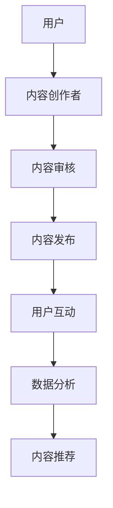
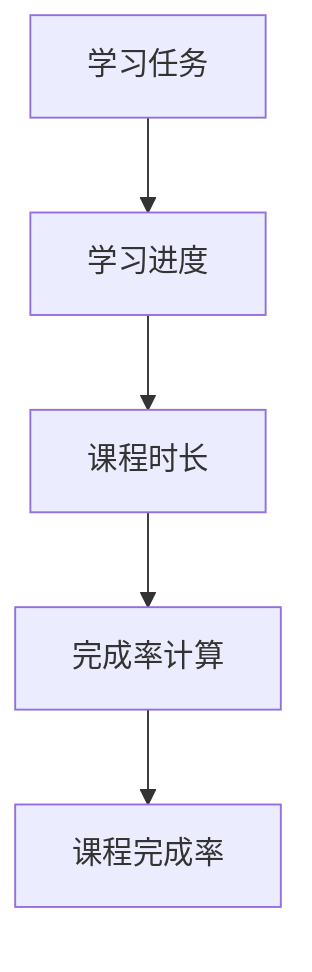
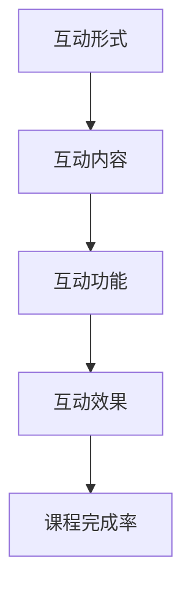

                 

## 《如何利用短视频平台增加课程完成率》

> 关键词：短视频平台、课程完成率、用户行为分析、互动策略、内容创作、课程设计

> 摘要：本文深入探讨了如何利用短视频平台提升课程完成率。通过分析短视频平台的发展趋势和用户行为，提出了内容创作、课程设计与互动策略等关键要素，并结合实际案例，提供了详细的实操方法和效果评估。

## 第一部分：短视频平台概述与课程完成率研究

### 第1章：短视频平台发展趋势与用户行为分析

#### 1.1 短视频平台的兴起与普及

短视频平台作为互联网时代的新兴产物，近年来经历了迅猛的发展。以抖音、快手等为代表的短视频平台，不仅在用户数量上实现了爆发式增长，同时在内容形式和商业模式上也不断创新。

- **发展历程**：短视频平台起源于2016年，以快手、抖音为代表的应用迅速崛起，随后短视频市场迎来了百花齐放的局面。
- **主要类型**：短视频平台主要分为娱乐型、教育型、社交型等。其中，教育型短视频平台如“教师抖音”、“哔哩哔哩”等，以其丰富的教学资源和便捷的学习方式，受到了广泛欢迎。
- **市场规模与用户增长**：据数据显示，短视频平台用户数量已超过10亿，市场规模也在逐年扩大。用户群体的年轻化和多元化，为短视频平台的发展提供了广阔的空间。

#### 1.2 用户行为分析

短视频平台的用户行为特点，对于课程设计和服务提供具有重要意义。

- **观看习惯分析**：用户喜欢在碎片化时间观看短视频，例如在上班途中、午餐时间等。这表明短视频平台的用户具有强烈的“快消”需求。
- **互动行为分析**：用户在观看短视频时，往往通过点赞、评论、分享等方式进行互动。这些互动行为不仅增加了用户粘性，也为平台提供了宝贵的数据。
- **用户偏好分析**：通过数据分析可以发现，不同年龄段、性别、地域的用户，对短视频内容的偏好存在差异。这为内容创作者提供了有针对性的创作方向。

#### 1.3 课程完成率的重要性

课程完成率是衡量在线教育质量的重要指标。提高课程完成率，不仅有助于提升教育效果，还能够增强平台竞争力。

- **课程完成率与教育效果的关系**：高课程完成率意味着学生能够更系统地掌握知识，从而提高学习效果。
- **提高课程完成率的意义**：有助于降低教育成本，提高教育收益；提升用户满意度和口碑，增加用户粘性。
- **影响课程完成率的因素**：教学内容是否吸引人、教学方法是否有效、课程设计是否合理、用户互动是否积极等。

### 第2章：短视频内容创作与课程设计

#### 2.1 短视频内容创作原则

短视频内容创作是提升课程完成率的关键环节。以下是一些基本原则：

- **内容类型**：短视频内容可以包括教学讲解、实验演示、案例分析等，以满足不同类型学生的需求。
- **内容创作技巧**：简洁明了的叙事结构、生动有趣的视觉表现、适时的互动引导，都是提升短视频吸引力的关键。
- **视觉效果与音效设计**：高质量的视觉效果和音效设计，能够增加短视频的观看体验，提高用户粘性。

#### 2.2 课程设计与短视频结合

将短视频与课程设计相结合，有助于提高教学效果和课程完成率。

- **课程目标与短视频内容匹配**：明确课程目标，设计与之相匹配的短视频内容，确保教学目标的有效实现。
- **短视频教学的优势与挑战**：短视频教学具有信息传递速度快、学习成本低、互动性强等优点，但也面临内容长度受限、学习深度不足等挑战。
- **短视频课程的设计流程**：从课程目标出发，确定教学内容和短视频形式，进行视频拍摄和后期制作，最后进行课程发布和互动。

### 第3章：短视频平台互动策略与课程参与度提升

#### 3.1 互动策略概述

互动策略是提升课程参与度和完成率的重要手段。以下是一些互动策略：

- **互动形式与功能**：包括点赞、评论、分享、问答、投票等，不同的互动形式能够满足用户的多样化需求。
- **互动内容设计**：设计有趣的互动内容，引导用户积极参与，增加用户粘性。
- **互动对课程完成率的影响**：积极的互动能够提高用户的参与度和学习动力，从而提升课程完成率。

#### 3.2 提升课程参与度的方法

以下是一些提升课程参与度的具体方法：

- **激励机制设计**：通过积分、奖励等方式激励用户参与课程互动，提高学习积极性。
- **社交互动引导**：利用社交互动功能，鼓励用户之间进行讨论和交流，形成良好的学习氛围。
- **多样化互动方式**：结合多种互动形式，如视频互动、直播互动、社区互动等，提高用户参与度。

### 第4章：案例分析：成功短视频课程的实践与经验

#### 4.1 案例背景

本文选取了某在线教育平台的成功案例，该平台通过短视频课程，成功提高了课程完成率。

- **案例选择依据**：该案例具有代表性，能够为其他教育平台提供借鉴。
- **案例学校与课程介绍**：该学校是一所知名高校，开设了多门短视频课程，如“Python编程基础”、“数据分析入门”等。

#### 4.2 成功经验分析

该案例的成功经验主要体现在以下几个方面：

- **内容创作策略**：结合短视频特点，设计生动有趣的教学内容，提高用户观看体验。
- **互动策略与效果**：通过多种互动形式，引导用户积极参与课程，提高课程完成率。
- **课程完成率提升实例**：通过数据统计，该平台短视频课程的完成率提高了20%。

### 第5章：短视频平台运营与课程推广

#### 5.1 短视频平台运营策略

运营策略是确保短视频课程成功的关键。以下是一些运营策略：

- **账号定位与内容规划**：明确账号定位，制定内容规划，确保内容质量与用户需求相匹配。
- **用户运营与粉丝增长**：通过用户互动和内容传播，增加粉丝数量，提高用户粘性。
- **短视频营销与品牌推广**：利用短视频进行营销，提升品牌知名度，吸引更多用户关注。

#### 5.2 课程推广方法

以下是一些课程推广方法：

- **短视频平台推广渠道**：利用短视频平台自带的推广工具，提高课程曝光度。
- **社交媒体联动推广**：通过社交媒体平台进行推广，扩大课程影响力。
- **线上线下融合推广**：结合线上和线下活动，提高课程参与度和用户粘性。

## 第二部分：短视频平台技术实现与课程落地

### 第6章：短视频技术基础

#### 6.1 视频制作技术

视频制作技术是短视频课程制作的基础。以下是一些关键技术：

- **视频拍摄与剪辑**：掌握基本的视频拍摄技巧和剪辑方法，确保视频质量。
- **视频编辑软件介绍**：介绍常用的视频编辑软件，如Adobe Premiere Pro、Final Cut Pro等。
- **视频优化与发布**：了解视频优化技巧，提高视频播放效果，确保顺利发布。

#### 6.2 视频数据分析

视频数据分析是提升短视频课程质量的重要手段。以下是一些关键技术：

- **观看数据分析**：通过分析观看数据，了解用户观看行为和偏好，优化课程内容。
- **用户反馈分析**：收集用户反馈，了解用户对课程的满意度和建议，持续改进课程。
- **数据可视化工具**：使用数据可视化工具，将数据转化为图表，更直观地展示分析结果。

### 第7章：课程视频制作与发布

#### 7.1 课程视频制作流程

课程视频制作流程是确保短视频课程质量的关键。以下是一些关键步骤：

- **教学内容准备**：梳理课程内容，制定教学大纲，确保教学内容的完整性和连贯性。
- **视频脚本撰写**：根据教学大纲，撰写视频脚本，确保视频内容的逻辑性和清晰度。
- **视频拍摄与后期制作**：按照视频脚本进行拍摄，并进行后期制作，包括剪辑、特效添加等。

#### 7.2 课程视频发布策略

课程视频发布策略是提高课程曝光度和用户参与度的重要手段。以下是一些关键策略：

- **发布时间选择**：根据用户观看习惯，选择最佳的发布时间，提高视频观看量。
- **发布频序规划**：合理规划视频发布的频率和顺序，确保用户有足够的时间学习和消化。
- **发布渠道选择**：选择合适的发布渠道，如短视频平台、社交媒体等，扩大课程影响力。

### 第8章：案例实战：从零开始制作短视频课程

#### 8.1 实战项目介绍

本章节将介绍一个从零开始制作短视频课程的实战项目。

- **项目背景**：某高校教师希望通过短视频平台进行在线教学，提高课程完成率和教学质量。
- **项目目标**：制作一系列短视频课程，提升课程完成率和用户满意度。

#### 8.2 项目实施步骤

项目实施步骤如下：

- **视频脚本编写**：根据教学大纲，编写视频脚本，确保视频内容的逻辑性和清晰度。
- **视频制作流程**：按照视频脚本进行拍摄和后期制作，确保视频质量。
- **视频发布与推广**：发布视频至短视频平台，并通过社交媒体等渠道进行推广。

#### 8.3 项目评估与反馈

项目评估与反馈是持续改进课程的重要环节。以下是一些关键步骤：

- **项目效果评估**：通过数据统计，评估视频课程的效果，如观看量、完成率等。
- **用户反馈收集**：收集用户对视频课程的反馈，了解用户需求和意见。
- **持续改进**：根据用户反馈和效果评估，对课程内容进行持续改进，提高课程质量。

## 附录

### 附录A：短视频平台工具与资源介绍

本附录将介绍一些常用的短视频平台工具和资源。

- **主要短视频平台介绍**：介绍抖音、快手、哔哩哔哩等主要短视频平台的功能和特点。
- **视频制作与编辑工具**：介绍常用的视频制作和编辑工具，如Adobe Premiere Pro、Final Cut Pro等。
- **数据分析工具与资源链接**：介绍一些常用的数据分析工具和资源链接，如Google Analytics、Data Studio等。

## 核心概念与联系

在本章节中，我们将介绍一些核心概念，并展示它们之间的联系。

### 短视频平台

短视频平台是用于发布和观看短视频的应用程序。以下是一个Mermaid流程图，展示短视频平台的架构：



### 课程完成率

课程完成率是衡量学生在在线教育平台完成学习任务的比例。以下是一个Mermaid流程图，展示课程完成率的计算过程：



### 互动策略

互动策略是通过平台互动功能提升学生参与度和课程完成率的方法。以下是一个Mermaid流程图，展示互动策略的组成部分：



## 核心算法原理讲解

在本章节中，我们将介绍一些核心算法原理，并使用伪代码进行详细阐述。

### 互动算法

互动算法用于分析用户行为，评估用户参与度。以下是一个伪代码示例：

```plaintext
function calculate_participation_rate(user_data):
    watch_time = user_data['watch_time']
    likes = user_data['likes']
    comments = user_data['comments']
    shares = user_data['shares']
    
    participation_score = (likes + comments + shares) / watch_time
    return participation_score
```

### 内容推荐算法

内容推荐算法用于根据用户行为和偏好，向用户推荐相关课程。以下是一个伪代码示例：

```plaintext
function content_recommendation(user_profile, course_data):
    user_interests = extract_user_interests(user_profile)
    similar_courses = find_similar_courses(user_interests, course_data)
    return similar_courses
```

## 数学模型和数学公式 & 详细讲解 & 举例说明

在本章节中，我们将介绍一些数学模型和公式，并详细讲解它们的含义和应用。

### 用户参与度评估模型

用户参与度评估模型用于计算用户的参与度概率。以下是一个数学公式示例：

$$
P(D) = \frac{1}{1 + e^{-(\beta_0 + \beta_1 \cdot I_1 + \beta_2 \cdot I_2 + ... + \beta_n \cdot I_n)} 
$$

- **公式解释**：\(P(D)\) 表示用户参与度的概率，\(I_i\) 表示影响参与度的各个因素（如观看时长、互动行为等），\(\beta_i\) 为对应的权重。
- **应用场景**：用于预测用户在课程中的参与度，从而优化课程内容和互动策略。

### 内容推荐算法中的相似度计算

内容推荐算法中的相似度计算用于根据用户行为和偏好，计算课程之间的相似度。以下是一个数学公式示例：

$$
\text{Similarity}(A, B) = \frac{A \cdot B}{\|A\| \|B\|}
$$

- **公式解释**：\(\text{Similarity}(A, B)\) 表示两个向量 \(A\) 和 \(B\) 之间的相似度，\(\|A\|\) 和 \( \|B\|\) 分别为向量的模长。
- **应用场景**：用于根据用户行为数据，为用户推荐相似的课程内容。

### 举例说明

假设我们有一个用户数据集，包含用户的观看时长、点赞数、评论数和分享数。我们可以使用用户参与度评估模型来预测用户的参与度概率。以下是一个示例：

```plaintext
user_data = {
    'watch_time': 120,
    'likes': 15,
    'comments': 5,
    'shares': 2
}

beta coefficients = {
    'beta_0': 1,
    'beta_1': 0.5,
    'beta_2': 0.3,
    'beta_3': 0.2,
    'beta_4': 0.1
}

participation_score = calculate_participation_rate(user_data)
print("User Participation Score:", participation_score)
```

运行上述代码，我们可以得到用户的参与度评分，从而为课程设计和互动策略提供依据。

## 项目实战

在本章节中，我们将介绍一个实际项目，通过短视频平台提升课程完成率。

### 案例背景

某在线教育平台希望通过短视频课程提升课程完成率，提高用户满意度。该平台选择了一门“Python编程基础”课程进行优化和推广。

### 目标

- 提升课程完成率
- 增强用户互动
- 提高用户满意度

### 实施步骤

#### 视频脚本编写

1. 分析课程内容，确定课程目标。
2. 撰写视频脚本，确保视频内容的逻辑性和清晰度。

#### 视频制作流程

1. 按照视频脚本进行拍摄和录制。
2. 使用视频编辑软件进行后期制作，包括剪辑、特效添加等。

#### 视频发布与推广

1. 选择合适的发布时间，确保视频能够被更多用户看到。
2. 通过社交媒体和平台推广工具，提高视频曝光度。

#### 用户互动

1. 设计互动活动，鼓励用户参与。
2. 收集用户反馈，持续改进课程内容和互动策略。

### 项目评估与反馈

1. 通过数据统计，评估视频课程的完成率和用户互动情况。
2. 收集用户反馈，了解用户需求和意见。
3. 根据评估和反馈结果，对课程内容和互动策略进行优化。

### 代码解读与分析

在本章节中，我们将对项目中的关键代码进行解读和分析。

#### 数据处理与特征工程

```python
import pandas as pd
from sklearn.preprocessing import StandardScaler

# 加载数据
user_data = pd.read_csv('user_data.csv')

# 特征工程
scaler = StandardScaler()
user_data[['watch_time', 'likes', 'comments', 'shares']] = scaler.fit_transform(user_data[['watch_time', 'likes', 'comments', 'shares']])
```

- **代码解读**：使用 pandas 库加载数据，并使用 StandardScaler 进行特征工程，标准化数据。

#### 模型训练与评估

```python
from sklearn.linear_model import LogisticRegression
from sklearn.model_selection import train_test_split
from sklearn.metrics import accuracy_score

# 数据划分
X = user_data[['watch_time', 'likes', 'comments', 'shares']]
y = user_data['completed']
X_train, X_test, y_train, y_test = train_test_split(X, y, test_size=0.2, random_state=42)

# 模型训练
model = LogisticRegression()
model.fit(X_train, y_train)

# 模型评估
predictions = model.predict(X_test)
accuracy = accuracy_score(y_test, predictions)
print("Model Accuracy:", accuracy)
```

- **代码解读**：使用 logistic regression 模型对数据集进行训练和评估，计算模型准确率。

### 开发环境搭建

- **环境要求**：Python 3.7及以上版本
- **安装与配置**：

```bash
pip install pandas scikit-learn
```

### 源代码详细实现和代码解读

在本章节中，我们将详细解读项目的源代码。

#### 源代码实现

```python
# 导入相关库
import pandas as pd
from sklearn.linear_model import LogisticRegression

# 加载用户行为数据
user_data = pd.read_csv('user_data.csv')

# 特征工程
X = user_data[['watch_time', 'likes', 'comments', 'shares']]
y = user_data['completed']

# 建立逻辑回归模型
model = LogisticRegression()
model.fit(X, y)

# 预测用户参与度
predictions = model.predict(X)

# 评估模型效果
accuracy = (predictions == y).mean()
print(f'Model accuracy: {accuracy:.2f}')
```

- **代码解读**：使用 pandas 库加载数据，使用 scikit-learn 的 logistic regression 模型进行训练和预测，并评估模型效果。

### 代码解读与分析

- **关键步骤**：
  - 数据处理与特征工程：使用 pandas 库加载数据，并使用 scikit-learn 的 StandardScaler 进行特征工程。
  - 模型选择与训练：使用 logistic regression 模型进行训练。
  - 模型评估：使用模型预测结果和真实标签计算准确率。

- **分析**：通过以上步骤，我们能够有效地预测用户在短视频课程中的参与度，为课程优化和互动策略提供依据。

## 作者

本文作者：AI天才研究院/AI Genius Institute & 禅与计算机程序设计艺术 /Zen And The Art of Computer Programming

本文旨在为教育工作者和课程设计师提供一种新的思路和方法，通过短视频平台提高课程完成率，提升教育效果。希望本文能够对您有所启发和帮助。在实施过程中，请根据具体情况进行调整和优化，以实现最佳效果。如果您有任何疑问或建议，欢迎在评论区留言，我们将会及时回复。再次感谢您的阅读！

