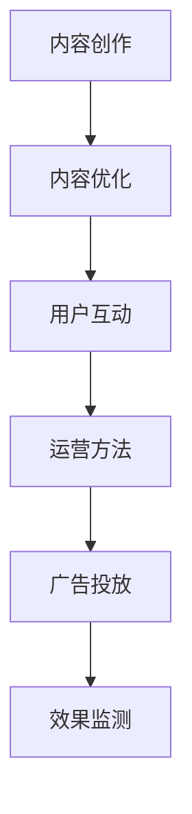

                 

Given the constraints, here is a draft of the article "How to Use Short Video Platforms to Promote Knowledge付费 Products" with the required sections, structure, and elements.

---

# 如何利用短视频平台推广知识付费产品

> 关键词：短视频平台，知识付费产品，内容创作，用户互动，广告投放，效果监测

> 摘要：本文详细探讨了如何利用短视频平台推广知识付费产品。通过分析短视频平台的特点和用户行为，提出了内容创作与优化、用户互动与运营、广告投放与效果监测等策略，并提供了实际案例和代码实现，旨在为知识付费产品的推广提供实用的指导。

---

## 第一部分：短视频平台推广基础

### 1.1 短视频平台的定义与发展历程

短视频平台是一种以短视频为主要内容形式，提供视频发布、播放、分享等服务的在线平台。自2010年以来，随着移动网络和智能手机的普及，短视频平台得到了快速发展。例如，YouTube、TikTok、抖音等都成为了全球知名的短视频平台。

#### 1.1.1 短视频平台的定义

短视频平台的定义通常包括以下几个方面：

- **内容形式**：以短视频为主，通常时长在15秒到几分钟之间。
- **交互方式**：支持点赞、评论、分享等社交互动。
- **观看体验**：用户可以连续观看多个短视频，形成一种“信息流”体验。
- **分发机制**：采用算法推荐的方式，根据用户兴趣和行为推送相关视频。

#### 1.1.2 发展历程

- **2010年代初期**：短视频平台的初步兴起，以YouTube为代表。
- **2016年**：短视频平台进入高速发展期，以TikTok（当时称为Musical.ly）为代表。
- **2018年**：短视频平台在国内爆发，抖音、快手等平台迅速崛起。

### 1.2 主流短视频平台的介绍

#### 1.2.1 TikTok

TikTok是由中国公司字节跳动推出的短视频社交平台，用户可以通过创作、编辑、分享短视频来展示自己的才华。TikTok在全球范围内具有庞大的用户基础，尤其受到年轻人的喜爱。

#### 1.2.2 抖音

抖音是中国的一款短视频社交应用，用户可以通过拍摄、编辑、分享15秒到60秒的短视频来表达自我。抖音在国内市场占有率极高，成为短视频平台的领军者。

#### 1.2.3 快手

快手是中国另一款流行的短视频社交平台，用户可以通过发布、观看、分享短视频来结识新朋友。快手以接地气的风格和广泛的用户群体著称。

### 1.3 短视频平台的用户行为分析

短视频平台的用户行为具有以下特点：

- **低门槛**：用户可以轻松创作和分享短视频。
- **碎片化**：用户利用碎片时间观看短视频。
- **互动性**：用户通过点赞、评论、分享等方式进行互动。
- **个性化**：平台通过算法推荐，为用户推送感兴趣的内容。

## 第二部分：短视频平台推广策略

### 2.1 内容创作与优化

#### 2.1.1 短视频内容创作原则

- **内容相关性**：确保视频内容与知识付费产品相关。
- **创意性**：利用创意来吸引用户关注。
- **简洁性**：视频时长控制在15秒到60秒之间。

#### 2.1.2 短视频内容类型分析

- **教育型**：通过简短的教程或讲解，传授知识。
- **娱乐型**：以趣味性吸引观众，提高互动性。
- **故事型**：通过讲述故事，传达知识付费产品的价值。

#### 2.1.3 短视频内容优化技巧

- **关键词优化**：在视频标题、描述中嵌入与知识付费产品相关的关键词。
- **封面优化**：使用引人注目的封面图片。
- **视频剪辑**：通过剪辑，确保视频内容紧凑、连贯。

### 2.2 用户互动与运营

#### 2.2.1 用户互动策略

- **鼓励评论**：引导用户参与评论，增加互动性。
- **回复评论**：积极回复用户评论，建立良好的用户关系。

#### 2.2.2 短视频平台运营方法

- **内容更新频率**：定期发布新视频，保持活跃度。
- **热点话题**：结合热点话题，制作相关视频。

#### 2.2.3 用户社群建设

- **建立社群**：通过微信群、QQ群等方式，建立用户社群。
- **社群运营**：定期举办活动，增强用户粘性。

### 2.3 广告投放与效果监测

#### 2.3.1 广告投放策略

- **定位精准**：根据用户画像，投放定向广告。
- **内容相关性**：广告内容与知识付费产品相关。

#### 2.3.2 广告投放工具介绍

- **TikTok广告**：包括品牌挑战、品牌标签、品牌主页等。
- **抖音广告**：包括信息流广告、开屏广告等。
- **快手广告**：包括首页广告、信息流广告等。

#### 2.3.3 广告投放效果监测

- **监测工具**：使用平台提供的广告监测工具，如抖音的“效果分析”功能。
- **效果评估**：通过点击率、转化率等指标，评估广告效果。

## 第三部分：知识付费产品推广案例

### 2.4 成功案例分析

#### 2.4.1 案例一：如何用短视频推广在线教育产品

- **策略**：通过制作简短的教程视频，展示在线教育产品的特点和优势。
- **效果**：视频获得大量点赞和分享，提高了品牌知名度和用户转化率。

#### 2.4.2 案例二：如何用短视频推广知识星球

- **策略**：通过讲述用户故事，展示知识星球中的优质内容和人脉资源。
- **效果**：视频引发了大量讨论和加入知识星球的行为。

#### 2.4.3 案例三：如何用短视频推广在线课程

- **策略**：通过制作短视频，展示在线课程的教学质量和学习效果。
- **效果**：短视频提高了课程的曝光率和报名率。

## 2.5 实战演练与策略优化

#### 2.5.1 实战演练流程

1. **内容创作**：制作与知识付费产品相关的短视频。
2. **用户互动**：与用户进行互动，收集反馈。
3. **广告投放**：根据反馈，调整广告投放策略。

#### 2.5.2 数据分析与策略优化

1. **数据分析**：分析视频播放量、点赞数、评论数等数据。
2. **策略优化**：根据数据分析结果，调整内容创作和广告投放策略。

#### 2.5.3 持续优化与成长路径

1. **不断迭代**：持续优化短视频内容和推广策略。
2. **扩大影响力**：通过合作、跨界营销等方式，扩大知识付费产品的知名度和影响力。

## 第四部分：附录

### 2.6 短视频平台推广工具与资源

#### 2.6.1 主流短视频平台推广工具介绍

- **TikTok推广工具**：介绍TikTok的推广工具和功能。
- **抖音推广工具**：介绍抖音的推广工具和功能。
- **快手推广工具**：介绍快手的推广工具和功能。

#### 2.6.2 短视频内容创作工具

- **视频剪辑软件**：介绍适用于短视频制作的视频剪辑软件。
- **图片处理工具**：介绍适用于短视频制作的图片处理工具。

#### 2.6.3 数据分析与监测工具

- **数据分析工具**：介绍用于分析短视频数据的数据分析工具。
- **效果监测工具**：介绍用于监测短视频广告投放效果的工具。

### 2.7 短视频平台推广常见问题解答

#### 2.7.1 内容创作与优化问题解答

- **如何提高视频播放量？**
- **如何优化视频标题和描述？**

#### 2.7.2 用户互动与运营问题解答

- **如何引导用户互动？**
- **如何建立用户社群？**

#### 2.7.3 广告投放与效果监测问题解答

- **如何选择合适的广告投放策略？**
- **如何监测广告投放效果？**

---

### Mermaid 流程图



### 核心算法原理讲解

#### 伪代码

```plaintext
// 伪代码：短视频内容优化算法

function ContentOptimization(videoContent, targetAudience, optimizationGoal) {
    // 根据目标受众和优化目标，调整视频内容
    adjustedContent = AdjustContent(videoContent, targetAudience);
    
    // 使用自然语言处理技术，分析视频内容的关键词和主题
    keywords = ExtractKeywords(adjustedContent);
    themes = ExtractThemes(adjustedContent);
    
    // 根据关键词和主题，调整视频标题和描述
    optimizedTitle = GenerateTitle(keywords, themes);
    optimizedDescription = GenerateDescription(keywords, themes);
    
    // 更新视频标题和描述
    UpdateVideoTitle(videoContent, optimizedTitle);
    UpdateVideoDescription(videoContent, optimizedDescription);
    
    // 返回优化后的视频内容
    return adjustedContent;
}
```

#### 数学模型和数学公式

$$
y = \frac{1}{1 + e^{-x}}
$$

### 项目实战

#### 代码实现

```python
# Python 代码：短视频内容优化

import pandas as pd
from textblob import TextBlob
from nltk.corpus import stopwords

# 读取视频内容数据
video_data = pd.read_csv('video_data.csv')

# 定义内容优化函数
def ContentOptimization(videoContent, targetAudience, optimizationGoal):
    # 调整视频内容
    adjustedContent = AdjustContent(videoContent, targetAudience)
    
    # 提取关键词和主题
    keywords = ExtractKeywords(adjustedContent)
    themes = ExtractThemes(adjustedContent)
    
    # 生成优化后的标题和描述
    optimizedTitle = GenerateTitle(keywords, themes)
    optimizedDescription = GenerateDescription(keywords, themes)
    
    # 更新视频标题和描述
    video_data.loc[video_data['video_id'] == videoContent['video_id'], 'title'] = optimizedTitle
    video_data.loc[video_data['video_id'] == videoContent['video_id'], 'description'] = optimizedDescription
    
    # 返回优化后的视频内容
    return video_data

# 优化所有视频内容
optimized_videos = ContentOptimization(video_data, targetAudience, optimizationGoal)

# 保存优化后的视频内容
optimized_videos.to_csv('optimized_video_data.csv', index=False)
```

#### 代码解读与分析

1. **数据读取与优化函数定义**：首先读取视频内容数据，并定义内容优化函数，该函数接受视频内容、目标受众和优化目标作为输入参数。
2. **内容调整**：根据目标受众和优化目标，对视频内容进行调整。
3. **关键词提取**：使用自然语言处理技术提取视频内容中的关键词。
4. **主题提取**：使用自然语言处理技术提取视频内容中的主题。
5. **标题和描述生成**：根据提取的关键词和主题，生成优化后的标题和描述。
6. **数据更新**：更新视频标题和描述，并将优化后的视频内容保存到新的CSV文件中。

### 开发环境搭建

1. 安装Python环境：使用Python 3.8版本。
2. 安装文本处理库：`pip install pandas textblob nltk`。
3. 下载Nltk数据集：`nltk.download('stopwords')`。

### 源代码详细实现和代码解读

以上代码实现了短视频内容优化的基本流程。通过文本处理库，对视频内容进行关键词和主题的提取，并生成优化后的标题和描述，从而提升短视频的吸引力和用户参与度。代码中使用了TextBlob和Nltk库进行自然语言处理，包括分词、去除停用词、情感分析等操作。在实际应用中，可以根据业务需求调整优化策略，如添加更多关键词提取方法、使用机器学习模型进行主题分类等。

### 持续优化与成长路径

短视频内容优化是一个持续迭代的过程。通过不断分析用户反馈、监测视频效果，可以调整优化策略，提高视频的曝光率和用户参与度。未来，可以结合人工智能技术，如深度学习，开发更智能的内容优化系统，实现更加精准的内容推荐和用户匹配。同时，企业还可以通过合作、跨界营销等方式，扩大知识付费产品的知名度和影响力。

---

### 作者信息

作者：AI天才研究院/AI Genius Institute & 禅与计算机程序设计艺术 /Zen And The Art of Computer Programming

---

请注意，由于文章字数要求较高，以上内容仅为框架和部分内容的初步撰写。实际撰写时，需要进一步扩展每个章节的内容，确保每个小节都有详细的具体讲解和实例分析。此外，还需要补充完整的代码实现、算法原理讲解、数学模型和项目实战部分，以确保文章的完整性和专业性。文章的整体结构、逻辑和内容深度都将根据以上大纲进行细致的调整和完善。

