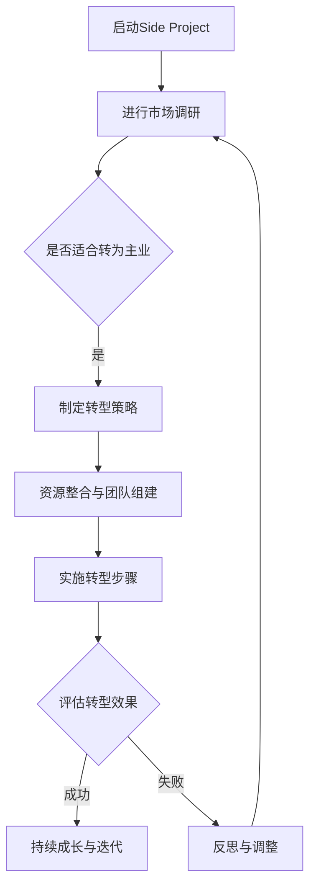

                 

### 文章标题：如何将Side Project转化为主业

在当今快速发展的科技时代，越来越多的开发者、创业者和技术爱好者开始投身于Side Project——也就是他们工作之外的独立项目。这些项目不仅为参与者提供了创造和实现个人想法的平台，还可能成为他们职业生涯的转折点。本文旨在探讨如何将一个Side Project成功转化为主业，从而实现个人职业发展的跃迁。通过详细分析侧项目与主业的关系、侧项目的核心要素、以及从侧项目到主业的转变策略，我们将提供一整套逻辑清晰、可操作性强的方法论。

本文的核心关键词包括：Side Project、主业转型、市场调研、核心能力构建、团队管理、市场竞争力、财务管理、法律法规、持续成长。这些关键词将贯穿全文，帮助读者更好地理解并掌握侧项目成功转化的关键要素。

本文的摘要部分将简要介绍文章的核心内容和主题思想。在接下来的章节中，我们将通过以下几个部分对如何将Side Project转化为主业进行深入探讨：

1. **了解Side Project与主业的关系**：分析侧项目与主业之间的定义与差异，探讨侧项目对主业的影响。
2. **侧项目的核心要素**：阐述侧项目的目标与愿景、市场调研、核心能力构建和资源整合。
3. **将Side Project转化为主业**：介绍从Side Project到主业的转变策略、步骤与流程，以及过程中的难点与解决方案。
4. **打造主业的市场竞争力**：讨论市场定位与细分、产品策略与差异化、品牌建设与传播、客户关系管理。
5. **财务管理与投资规划**：分析资金需求、筹集渠道、投资规划和财务风险控制。
6. **法律法规与合规性**：讲解企业注册与税务政策、劳动合同与员工福利、知识产权保护、市场准入与行业规范。
7. **持续成长与迭代**：探讨市场动态与行业趋势、产品迭代与技术创新、团队发展与组织优化、持续学习和个人成长。

通过本文的详细讲解，读者将能够全面了解如何将一个有潜力的Side Project转化为稳定的收入来源，从而实现个人职业的跃升。

### 文章关键词

1. Side Project
2. 主业转型
3. 市场调研
4. 核心能力构建
5. 团队管理
6. 市场竞争力
7. 财务管理
8. 法律法规
9. 持续成长

### 摘要

本文旨在探讨如何将Side Project成功转化为主业，为读者提供一套完整、详细的操作指南。通过分析侧项目与主业的关系、侧项目的核心要素，以及从侧项目到主业的转变策略，本文将帮助开发者和技术爱好者实现个人职业发展的跃升。文章从市场调研、核心能力构建、团队管理、市场竞争力、财务管理、法律法规、持续成长等多个方面进行详细阐述，旨在为读者提供实用的方法论和实践案例。通过本文的指导，读者将能够更好地理解如何将一个有潜力的侧项目转化为稳定的收入来源，从而实现职业的持续成长和突破。

### 第一部分：了解Side Project与主业的关系

在探讨如何将Side Project转化为主业之前，我们首先需要明确侧项目与主业之间的定义与差异，并分析侧项目对主业的影响。这一部分内容将为后续章节的讨论奠定基础，提供理论上的支持。

#### 第1章：侧项目与主业的定义与差异

**1.1 侧项目与主业的定义**

首先，我们来明确什么是Side Project和主业。

- **侧项目（Side Project）**：通常指的是个人在工作之余，出于兴趣、爱好或者创新精神而开展的小型项目。这些项目可能涉及软件开发、产品设计、内容创作等多种形式。侧项目的特点包括自由度高、时间弹性大、资源限制较多等。

- **主业（Main Project）**：主业则是指个人或团队的主要工作项目，通常是收入的主要来源，可能涉及公司运营、业务拓展、市场推广等。主业的特点包括目标明确、资源丰富、结构化程度高。

**1.2 侧项目与主业的关系分析**

侧项目和主业之间存在着一定的联系和区别。以下是两者之间的一些关键关系：

- **目标一致性**：尽管侧项目和主业在性质上有所不同，但它们的目标是一致的，都是为了实现个人或团队的价值。侧项目可以作为主业的有益补充，为主业提供创新思路和市场反馈。

- **资源利用**：侧项目通常资源有限，而主业则拥有更丰富的资源，包括人力、资金和渠道等。合理利用主业的资源来支持和推动侧项目的发展，是成功转化的重要保障。

- **风险与收益**：侧项目的风险通常较高，因为资源有限，市场不确定性大。而主业则相对稳定，但可能缺乏创新性和灵活性。通过将侧项目与主业相结合，可以降低整体风险，同时提升收益潜力。

**1.3 侧项目对主业的影响**

侧项目对主业的影响是双向的，既可能带来正面的效应，也可能产生负面的影响。

- **正面影响**：

  - **创新驱动**：侧项目往往源于个人兴趣或市场需求，能够为主业带来新的创意和思路，促进创新。

  - **市场反馈**：通过侧项目，可以快速获得市场反馈，了解用户需求和行业趋势，为主业提供参考。

  - **团队激励**：成功的侧项目能够激发团队成员的创造力和工作热情，提升团队凝聚力。

- **负面影响**：

  - **资源分散**：如果不妥善管理，侧项目可能会分散主业的资源和精力，影响主业的发展。

  - **风险积累**：过度投入侧项目，可能导致主业发展缓慢，甚至陷入困境。

  - **利益冲突**：侧项目和主业之间可能存在利益冲突，需要合理规避和解决。

通过以上分析，我们可以看出，侧项目和主业之间既有紧密的联系，也存在一定的风险。在接下来的章节中，我们将进一步探讨如何通过有效的策略和管理，将一个有潜力的侧项目成功转化为主业。

### 第2章：侧项目的核心要素

要将Side Project转化为主业，我们需要深入理解其核心要素。这一章将详细阐述侧项目的目标与愿景、市场调研、核心能力构建和资源整合，为后续的转型策略提供坚实的基础。

#### 2.1 侧项目的目标与愿景

一个成功的Side Project首先需要明确的的目标与愿景。以下是设定目标与愿景的关键步骤：

- **明确项目目标**：目标应该是具体、可量化的，例如：“开发一款解决特定痛点的移动应用”或“创建一个提供专业咨询的在线平台”。

- **确定愿景**：愿景是项目的长期目标和愿景，例如：“成为该领域的领导品牌”或“提供一流的产品和服务”。

- **设定里程碑**：将目标分解为若干个里程碑，每个里程碑都是实现最终目标的重要步骤。例如，在开发应用的过程中，里程碑可以是“完成核心功能”、“发布测试版”和“正式上线”。

**案例**：假设一个开发者有一个愿景是创建一个提供实时天气数据的在线平台。那么，他的项目目标可以设定为：

- 目标：开发一个集天气预警、实时数据更新和用户定制功能于一体的在线天气平台。
- 愿景：成为用户首选的实时天气服务平台，提供精准、可靠的天气数据。

#### 2.2 市场调研

市场调研是确保Side Project成功的重要步骤。以下是进行市场调研的几个关键方面：

- **确定目标市场**：明确你的产品或服务面向的用户群体，例如，年龄、性别、地理位置、收入水平等。

- **分析竞争对手**：调研同行业内的主要竞争对手，了解他们的产品特点、市场定位、用户评价等。

- **市场需求分析**：通过问卷调查、访谈、焦点小组等方式，了解潜在用户的需求和痛点。

- **行业趋势**：研究行业的发展趋势、技术革新、政策变化等，为项目提供市场方向。

**案例**：假设我们的开发者决定创建一个天气应用，他需要进行以下市场调研：

- **目标市场**：面向18-35岁的城市白领，他们需要及时了解天气信息以便合理安排工作和生活。
- **竞争对手分析**：研究现有天气应用的特点，例如，是否提供实时预警、用户界面设计等。
- **市场需求分析**：通过问卷调查，了解用户对天气应用的期望功能，例如，是否需要定制天气提醒、查看一周天气趋势等。
- **行业趋势**：关注新兴的天气预测技术，如人工智能和大数据分析，以便在应用中集成这些技术。

#### 2.3 侧项目的核心能力构建

为了确保Side Project的成功，构建核心能力至关重要。以下是几个关键能力：

- **技术能力**：确保项目所需的编程语言、框架和工具熟练掌握。例如，开发天气应用需要熟悉前端框架（如React或Vue）和后端语言（如Node.js或Python）。

- **产品设计能力**：设计用户友好的界面和交互流程，提高用户体验。可以通过用户测试和反馈不断优化产品。

- **市场推广能力**：了解各种市场推广策略，如社交媒体营销、内容营销和合作伙伴推广等。

- **团队协作能力**：如果项目需要团队协作，确保团队成员之间有效沟通、分工明确、目标一致。

**案例**：继续以天气应用为例，开发者需要构建以下核心能力：

- **技术能力**：熟练使用React框架和Node.js，以确保应用的高效开发和维护。
- **产品设计能力**：设计简洁、直观的用户界面，确保用户能够轻松找到所需功能。
- **市场推广能力**：通过社交媒体发布应用更新、撰写博客文章和开展合作伙伴推广活动，提升应用知名度。
- **团队协作能力**：与设计师、后端开发者和市场推广人员紧密合作，确保项目的顺利进行。

#### 2.4 侧项目的资源整合

资源整合是确保Side Project顺利推进的重要环节。以下是几个关键资源：

- **人力**：组建一支有能力、有激情的团队，确保项目按时高质量完成。
- **资金**：筹集足够的资金，用于项目开发、测试和市场推广。
- **技术资源**：利用开源工具和云服务，降低开发成本和风险。
- **市场资源**：通过合作伙伴和行业资源，扩大项目的影响力和市场机会。

**案例**：开发者可以整合以下资源：

- **人力**：招募前端和后端开发人员、设计师和市场营销专家，确保团队覆盖所有关键角色。
- **资金**：通过个人储蓄、朋友借款或小额众筹等方式筹集资金。
- **技术资源**：使用GitHub等开源平台，获取技术支持和社区资源。
- **市场资源**：与天气相关的内容创作者和行业专家合作，提升项目的市场影响力。

通过明确目标与愿景、进行市场调研、构建核心能力和整合资源，开发者可以为侧项目成功转化为主业打下坚实的基础。在下一章中，我们将讨论从Side Project到主业的转变策略，帮助读者实现这一重要的跃升。

### 第3章：从Side Project到主业的转变策略

将Side Project成功转化为主业是一个复杂且富有挑战性的过程。在这一章中，我们将详细介绍转变的时机选择、步骤与流程，以及过程中的难点与解决方案，帮助开发者克服障碍，实现从侧项目到主业的平稳过渡。

#### 3.1 转变的时机选择

选择合适的时机进行转变是成功的关键。以下是一些判断时机选择的依据：

- **项目成熟度**：侧项目在技术、功能和市场反馈上已相对成熟，具备一定的用户基础和口碑。
- **市场需求**：市场对该项目的需求不断增加，有明显的增长潜力。
- **资源状况**：个人或团队具备足够的资源和能力，能够支持主业的发展。
- **个人意愿**：开发者有足够的决心和热情，愿意全身心投入主业。

**案例**：假设我们的开发者已经完成了天气应用的开发，并获得了第一批用户的积极反馈，市场需求也在逐步提升。此时，他可以考虑将侧项目转化为主业。

#### 3.2 转变的步骤与流程

从Side Project到主业的转变可以分为以下几个步骤：

1. **评估项目现状**：对侧项目的市场表现、用户反馈和资源投入进行全面的评估，确定是否具备转化条件。

2. **制定转型计划**：明确转型的目标、时间表和所需资源，制定详细的转型计划。

3. **资源整合**：整合人力、资金、技术等资源，确保主业发展所需的各项条件得到满足。

4. **业务结构调整**：调整业务模式，将侧项目从个人项目转化为团队运作，建立稳定的组织结构。

5. **市场推广**：加大市场推广力度，提升品牌知名度和用户粘性。

6. **持续迭代与优化**：根据市场反馈和用户需求，不断优化产品和服务，提升竞争力。

**案例**：开发者可以按照以下步骤进行转型：

- **评估项目现状**：通过分析用户反馈和市场数据，确认天气应用的市场需求和用户满意度。
- **制定转型计划**：制定详细的转型方案，包括团队组建、资金筹集和时间安排。
- **资源整合**：招募核心团队成员，如市场推广专家、设计师和后端开发人员，并筹集必要的资金。
- **业务结构调整**：建立公司或工作室，明确各部门的职责和目标，形成规范的运营机制。
- **市场推广**：通过线上线下多种渠道推广天气应用，如社交媒体营销、内容营销和合作伙伴推广。
- **持续迭代与优化**：根据用户反馈和市场变化，不断更新和优化产品功能，提升用户体验。

#### 3.3 转变的难点与解决方案

在从Side Project到主业的转变过程中，开发者可能会面临以下难点：

1. **资源瓶颈**：侧项目通常资源有限，而主业需要更多的资金、人力和技术支持。

   - **解决方案**：可以通过小额众筹、吸引风险投资或寻求合作伙伴来筹集资金。同时，优化资源分配，确保资源得到最大化利用。

2. **管理挑战**：从个人项目过渡到团队运作，管理难度加大。

   - **解决方案**：建立有效的管理体系，明确团队成员的职责和目标，提高团队协作效率。可以借助项目管理工具和协作平台，提升项目管理水平。

3. **市场不确定性**：主业市场环境和用户需求变化较快，需要及时调整战略。

   - **解决方案**：保持对市场的敏锐洞察力，定期进行市场调研和用户反馈分析，及时调整产品和服务策略。

4. **利益冲突**：侧项目和主业之间可能存在利益冲突，需要妥善解决。

   - **解决方案**：制定明确的利益分配和责任界定机制，确保团队成员的利益一致。同时，通过沟通和协商，解决潜在的矛盾和冲突。

通过科学合理的策略和有效的管理，开发者可以克服这些困难，实现侧项目到主业的成功转变。在下一章中，我们将讨论如何打造主业的市场竞争力，为读者提供更多实用的建议和技巧。

### 第4章：打造主业的市场竞争力

在将Side Project成功转化为主业之后，如何保持并提升市场竞争力成为关键问题。这一章将探讨市场定位与细分、产品策略与差异化、品牌建设与传播、以及客户关系管理，帮助读者在激烈的市场竞争中脱颖而出。

#### 4.1 市场定位与细分

市场定位是确保主业成功的重要步骤。以下是如何进行市场定位与细分的关键步骤：

1. **确定目标市场**：明确你的产品或服务面向的用户群体。例如，我们的天气应用可以定位为城市白领和户外运动爱好者。

2. **分析用户需求**：了解目标市场的用户需求，例如，他们需要哪些功能、偏好怎样的用户体验等。

3. **竞争分析**：研究竞争对手的市场定位和用户反馈，找到自己的差异化点。

4. **市场细分**：将市场划分为若干个具有相似需求的子市场，例如，可以将城市白领划分为快节奏生活群体和高效能工作群体。

**案例**：我们的天气应用可以按照以下步骤进行市场定位与细分：

- **确定目标市场**：城市白领和户外运动爱好者。
- **分析用户需求**：快节奏生活群体需要快速获取天气信息，高效能工作群体需要详细的多日天气预报。
- **竞争分析**：竞争对手主要集中在功能全面和界面美观上，我们可以差异化定位为“便捷快速”和“详尽精准”。
- **市场细分**：快节奏生活群体可以细分为通勤族和商务人士，户外运动爱好者可以细分为徒步者和骑行者。

#### 4.2 产品策略与差异化

在明确了市场定位后，产品策略和差异化策略成为关键。以下是如何制定产品策略与实现差异化的关键点：

1. **功能优化**：根据用户需求，不断优化产品功能，提高用户体验。

2. **技术创新**：引入新技术，如人工智能和大数据分析，提升产品的智能化水平。

3. **界面设计**：设计简洁、直观的界面，使用户操作更加便捷。

4. **服务个性化**：提供个性化的服务，如根据用户习惯和偏好定制天气提醒。

5. **差异化营销**：通过差异化营销策略，突出产品的独特卖点，吸引目标用户。

**案例**：我们的天气应用可以采取以下策略实现差异化：

- **功能优化**：增加快速天气查询、多日天气预报、实时预警等功能。
- **技术创新**：使用机器学习算法，提供更准确的天气预报。
- **界面设计**：设计简洁直观的用户界面，支持夜间模式和自定义主题。
- **服务个性化**：根据用户的历史数据和偏好，提供定制化的天气提醒服务。
- **差异化营销**：通过社交媒体营销和内容营销，强调应用的便捷性和准确性。

#### 4.3 品牌建设与传播

品牌建设和传播是提升市场竞争力的重要手段。以下是如何进行品牌建设与传播的关键点：

1. **品牌定位**：明确品牌的核心价值主张，例如，我们的天气应用可以定位为“精准、便捷、个性化”。

2. **品牌视觉设计**：设计统一的品牌视觉元素，如LOGO、色彩方案和字体风格。

3. **内容营销**：通过高质量的博客文章、视频和社交媒体内容，提升品牌知名度。

4. **合作伙伴关系**：与行业内的知名品牌和机构建立合作关系，扩大品牌影响力。

5. **公关活动**：参与行业会议、展览和公关活动，提升品牌曝光度。

**案例**：我们的天气应用可以采取以下策略进行品牌建设与传播：

- **品牌定位**：强调应用的精准性和用户体验，定位为“用户信赖的天气助手”。
- **品牌视觉设计**：设计简洁、现代的LOGO和色彩方案，符合品牌定位。
- **内容营销**：发布专业天气分析文章和视频教程，提供实用的天气知识和应用技巧。
- **合作伙伴关系**：与天气预报机构合作，获取权威数据支持。
- **公关活动**：参加国际气象会议和科技展览会，与行业专家交流，提升品牌影响力。

#### 4.4 客户关系管理

良好的客户关系管理是确保主业长期发展的重要保障。以下是如何进行客户关系管理的关键点：

1. **客户满意度**：关注客户反馈，及时解决问题，提升客户满意度。

2. **个性化服务**：根据客户需求和偏好，提供个性化的服务和支持。

3. **客户忠诚度**：通过会员制度、积分奖励等方式，提高客户的忠诚度。

4. **客户体验优化**：持续优化产品和服务，提升客户的整体体验。

5. **客户反馈机制**：建立有效的客户反馈机制，收集客户意见，用于产品改进和服务优化。

**案例**：我们的天气应用可以采取以下策略进行客户关系管理：

- **客户满意度**：建立24/7客户支持服务，确保用户问题能够及时解决。
- **个性化服务**：根据用户的地理位置和偏好，提供个性化的天气提醒。
- **客户忠诚度**：推出会员制度，提供高级功能和服务，吸引用户持续使用。
- **客户体验优化**：定期更新和优化产品功能，提升用户体验。
- **客户反馈机制**：通过在线问卷调查、用户访谈等方式，收集用户反馈，用于产品改进。

通过以上策略，开发者可以打造主业的市场竞争力，确保在激烈的市场竞争中立于不败之地。在下一章中，我们将探讨财务管理与投资规划，帮助读者在财务方面做好充分准备，确保主业的稳健发展。

### 第5章：财务管理与投资规划

在将Side Project成功转化为主业后，财务管理与投资规划成为确保企业长期稳定发展的关键因素。这一章将详细分析资金需求、筹集渠道、投资规划和财务风险控制，帮助读者做好财务准备，确保主业在财务上的健康和可持续性。

#### 5.1 资金需求分析

制定详细的资金需求分析是确保主业顺利运营的基础。以下是资金需求分析的关键步骤：

1. **运营成本**：确定日常运营所需的费用，包括员工薪资、租金、水电费、设备维护等。

2. **研发投入**：评估新产品或服务的研发所需资金，包括技术购买、测试设备、人力资源等。

3. **市场推广费用**：预算市场推广和品牌建设的费用，包括广告投放、社交媒体营销、公关活动等。

4. **备用资金**：预留一定比例的备用资金，以应对突发情况和市场变化。

**案例**：假设我们的天气应用公司需要以下资金：

- **运营成本**：每月员工薪资3万元，租金1万元，水电费5000元，设备维护费5000元，总计每月4.5万元。
- **研发投入**：新功能开发预计需资金10万元，包括购买测试设备、人力资源等。
- **市场推广费用**：每月市场推广费用2万元。
- **备用资金**：预留30%的资金作为备用，即12万元。

#### 5.2 资金筹集渠道

在明确了资金需求后，选择合适的资金筹集渠道至关重要。以下是几种常见的资金筹集渠道：

1. **个人储蓄**：利用个人储蓄或家庭资金作为初始资本。

2. **朋友和家庭借款**：通过朋友和家人的支持，筹集必要的资金。

3. **小额众筹**：利用Kickstarter、Indiegogo等平台，向大众筹集资金。

4. **天使投资**：寻找天使投资者，获取风险投资。

5. **风险投资**：通过风险投资公司，获得大额资金支持。

6. **银行贷款**：向银行申请贷款，获取资金支持。

**案例**：我们的天气应用公司可以采取以下资金筹集渠道：

- **个人储蓄**：利用个人储蓄50万元作为初始资本。
- **朋友和家庭借款**：通过朋友和家庭筹集20万元。
- **小额众筹**：通过Kickstarter筹集10万元。
- **天使投资**：寻找一位天使投资者，获得30万元投资。
- **银行贷款**：向银行申请贷款10万元。

#### 5.3 投资规划与预算管理

制定详细的投资规划与预算管理是确保资金合理使用的重要环节。以下是投资规划与预算管理的关键步骤：

1. **投资计划**：明确每个资金用途的具体目标和时间节点，例如，新功能开发计划、市场推广活动安排等。

2. **预算制定**：根据投资计划，制定详细的预算，确保每个项目都有足够的资金支持。

3. **成本控制**：监控预算执行情况，及时调整支出，避免超支。

4. **财务报告**：定期编制财务报告，评估资金使用效果，为下一轮投资提供参考。

**案例**：我们的天气应用公司可以采取以下投资规划与预算管理：

- **投资计划**：新功能开发计划分为三个阶段，每个阶段需要3个月时间，每阶段预算3万元。
- **预算制定**：每月运营成本预算4.5万元，市场推广费用预算2万元，研发投入预算10万元。
- **成本控制**：每月进行成本监控，确保各项支出在预算范围内。
- **财务报告**：每季度编制一次财务报告，分析资金使用效果，为下一季度提供参考。

#### 5.4 财务风险控制

财务风险控制是确保企业财务健康的重要手段。以下是几种常见的财务风险控制方法：

1. **多样化投资**：将资金分散投资于不同领域，降低单一投资的风险。

2. **财务审计**：定期进行财务审计，确保财务报表的准确性和合规性。

3. **风险预警系统**：建立风险预警系统，实时监控财务风险指标，提前采取措施。

4. **保险**：购买适当的商业保险，如财产保险、责任保险等，以降低风险。

5. **应急预案**：制定应急预案，以应对突发财务风险。

**案例**：我们的天气应用公司可以采取以下财务风险控制措施：

- **多样化投资**：将部分资金投资于低风险的债券和股票，降低整体投资风险。
- **财务审计**：每年聘请专业审计机构进行财务审计，确保财务报表准确无误。
- **风险预警系统**：设立财务风险控制小组，实时监控财务风险指标，制定预警机制。
- **保险**：购买商业保险，包括财产保险和责任保险，以应对可能的风险。
- **应急预案**：制定详细的财务应急预案，确保在突发情况下能够迅速应对。

通过以上财务管理与投资规划，开发者可以确保主业在财务上的稳健发展，为企业的长期成功打下坚实基础。在下一章中，我们将探讨法律法规与合规性，帮助读者了解企业在法律和行业规范方面的要求。

### 第6章：法律法规与合规性

在将Side Project转化为主业的过程中，遵守法律法规和合规性是确保企业合法运营和长远发展的关键。这一章将详细介绍企业注册与税务政策、劳动合同与员工福利、知识产权保护、市场准入与行业规范，为开发者提供全面的合规指导。

#### 6.1 企业注册与税务政策

**企业注册**：

1. **选择企业类型**：根据业务需求和风险承担能力，选择合适的企业类型，如个体工商户、有限责任公司等。
2. **注册流程**：准备相关文件，如身份证明、经营场所证明、企业章程等，提交至工商行政管理部门进行注册。
3. **登记事项**：完成工商注册后，还需办理税务登记、代码证书、组织机构代码证等。

**税务政策**：

1. **纳税种类**：了解企业所需缴纳的税种，如增值税、企业所得税、个人所得税等。
2. **税率**：熟悉各税种的税率，确保正确计算税额。
3. **优惠政策**：了解国家和地方政府提供的税收优惠政策，合理利用以降低税负。

**案例**：假设我们的天气应用公司是一家有限责任公司，需要在注册过程中：

- **企业类型**：选择有限责任公司，以降低个人责任风险。
- **注册流程**：准备相关文件，提交至当地工商行政管理部门，完成注册手续。
- **登记事项**：办理税务登记、代码证书、组织机构代码证等，确保合法经营。

#### 6.2 劳动合同与员工福利

**劳动合同**：

1. **合同签订**：与员工签订书面劳动合同，明确双方的权利和义务。
2. **合同内容**：合同应包括岗位、工资、工作时间、福利待遇、保密协议等关键条款。
3. **合同期限**：根据员工岗位和公司需求，选择合适的合同期限，如固定期限合同和无固定期限合同。

**员工福利**：

1. **基本福利**：为员工提供基本福利，如养老保险、医疗保险、失业保险等。
2. **补充福利**：根据公司经济状况，提供补充福利，如带薪年假、节日福利、员工体检等。
3. **员工关怀**：建立良好的员工关系，关注员工心理健康和工作满意度。

**案例**：我们的天气应用公司在新员工入职时：

- **合同签订**：与员工签订书面劳动合同，明确岗位职责、薪资待遇和工作时间等。
- **合同内容**：合同中包括试用期条款、保密协议和竞业限制等。
- **员工福利**：为员工提供养老保险、医疗保险、带薪年假等基本福利，并定期组织员工体检和团建活动。

#### 6.3 知识产权保护

**知识产权保护**：

1. **专利申请**：对公司的核心技术或创新产品进行专利申请，保护技术成果。
2. **商标注册**：注册公司商标，保护品牌形象。
3. **著作权登记**：对软件源代码、设计图纸等创作成果进行著作权登记，确保知识产权归属。
4. **知识产权维权**：建立知识产权维权机制，及时处理侵权行为。

**案例**：我们的天气应用公司：

- **专利申请**：对核心的天气预测算法进行专利申请，确保技术领先。
- **商标注册**：注册“天气应用”商标，保护品牌知名度。
- **著作权登记**：对天气应用软件的源代码进行著作权登记，确保知识产权归属。
- **知识产权维权**：与律师团队合作，建立维权机制，及时应对潜在的侵权行为。

#### 6.4 市场准入与行业规范

**市场准入**：

1. **审批流程**：了解行业准入标准，完成各项审批手续，如工商注册、资质认证等。
2. **资质认证**：根据行业要求，获取必要的资质认证，如ISO认证、安全生产许可证等。
3. **许可证**：申请行业许可证，如互联网信息服务许可证等。

**行业规范**：

1. **遵守法律法规**：严格遵守国家和地方的法律法规，确保业务合规。
2. **行业标准**：了解并遵循行业标准和规范，如软件工程国家标准、网络安全法等。
3. **自律机制**：建立企业内部的自律机制，规范经营行为，提升行业形象。

**案例**：我们的天气应用公司：

- **审批流程**：了解互联网信息服务行业的准入标准，完成工商注册、资质认证等审批手续。
- **资质认证**：获取ISO 27001信息安全管理体系认证，确保数据安全和用户隐私保护。
- **许可证**：申请互联网信息服务许可证，确保合法经营。
- **遵守法律法规**：严格遵守网络安全法、个人信息保护法等法律法规，保护用户隐私。
- **行业规范**：积极参与行业论坛和标准制定，遵循行业规范，提升企业形象。

通过以上法律法规与合规性的详细探讨，开发者可以确保企业在运营过程中遵守相关法规，合法合规地发展。在下一章中，我们将探讨持续成长与迭代，帮助企业在不断变化的市场环境中保持竞争优势。

### 第7章：持续成长与迭代

在将Side Project成功转化为主业之后，持续成长与迭代是确保企业保持市场竞争力的重要策略。这一章将探讨市场动态与行业趋势、产品迭代与技术创新、团队发展与组织优化，以及持续学习和个人成长，帮助读者在动态的市场环境中持续进步。

#### 7.1 市场动态与行业趋势

了解市场动态和行业趋势是制定有效战略的基础。以下是如何把握市场动态和行业趋势的关键步骤：

1. **定期市场调研**：通过定期进行市场调研，了解用户需求、市场变化和竞争态势。

2. **分析行业报告**：研究行业报告和数据分析，获取行业趋势和未来发展方向。

3. **关注竞争对手**：密切关注竞争对手的产品、策略和市场表现，了解其优势和劣势。

4. **用户反馈**：收集用户的反馈和建议，了解产品在实际使用中的表现和改进方向。

**案例**：我们的天气应用公司可以采取以下方法：

- **定期市场调研**：每季度进行一次市场调研，了解用户对天气应用的需求和满意度。
- **分析行业报告**：定期阅读天气服务行业报告，获取行业趋势和市场预测。
- **关注竞争对手**：分析竞争对手的产品更新和营销策略，了解其市场表现。
- **用户反馈**：通过用户论坛、社交媒体和问卷调查，收集用户反馈，优化产品功能。

#### 7.2 产品迭代与技术创新

持续的产品迭代和科技创新是提升产品竞争力的重要手段。以下是如何进行产品迭代与技术创新的关键步骤：

1. **需求分析**：根据市场调研和用户反馈，分析用户需求，确定产品迭代的方向和目标。

2. **技术评估**：评估现有技术的适用性和潜在创新点，选择合适的技术路线。

3. **开发计划**：制定详细的开发计划，确保产品迭代和科技创新的顺利进行。

4. **测试与优化**：进行产品测试，收集测试反馈，不断优化和改进产品功能。

**案例**：我们的天气应用公司可以采取以下方法：

- **需求分析**：根据用户反馈和市场趋势，确定新功能开发的方向，如增加智能预警、个性化定制等。
- **技术评估**：评估现有技术，如人工智能和大数据分析，选择适合的技术路线，提升产品的智能化水平。
- **开发计划**：制定详细的开发计划，包括时间表、资源和人员安排，确保新功能按时上线。
- **测试与优化**：进行A/B测试，收集用户反馈，不断优化新功能，提升用户体验。

#### 7.3 团队发展与组织优化

团队发展和组织优化是确保企业高效运作的关键。以下是如何进行团队发展和组织优化的关键步骤：

1. **培训与提升**：为团队成员提供培训机会，提升技能和知识水平。

2. **人才引进**：引进优秀人才，增强团队的综合实力。

3. **绩效管理**：建立科学的绩效管理体系，激励员工积极进取。

4. **组织结构优化**：根据业务发展需求，调整组织结构，确保团队高效协作。

**案例**：我们的天气应用公司可以采取以下方法：

- **培训与提升**：定期举办技术分享会和培训课程，提升团队成员的专业技能。
- **人才引进**：招聘有经验的产品经理和市场营销专家，增强团队实力。
- **绩效管理**：建立KPI考核体系，激励员工达成业务目标。
- **组织结构优化**：根据业务发展需求，调整部门设置，确保各部门协同作战。

#### 7.4 持续学习和个人成长

在快速变化的市场环境中，持续学习和个人成长是保持竞争力的重要保障。以下是如何实现持续学习和个人成长的关键步骤：

1. **自我反思**：定期进行自我反思，总结工作经验和不足，明确个人成长目标。

2. **学习交流**：参加行业会议、研讨会和培训课程，拓宽知识面，与同行交流学习。

3. **阅读和研究**：阅读相关书籍、研究论文和技术博客，不断提升专业素养。

4. **实践应用**：将所学知识应用于实际工作中，通过实践提升解决问题的能力。

**案例**：我们的天气应用公司可以采取以下方法：

- **自我反思**：每月进行一次自我反思，总结项目经验，明确下一步成长方向。
- **学习交流**：参加气象会议和人工智能研讨会，与行业专家交流学习。
- **阅读和研究**：阅读关于大数据分析和人工智能的书籍，提升技术水平。
- **实践应用**：在项目中应用新学到的技术，如机器学习算法，提升产品性能。

通过以上措施，我们的天气应用公司可以持续成长和迭代，保持市场竞争力。在动态的市场环境中，持续学习和创新是企业发展的重要驱动力。在下一章中，我们将介绍附录，包括资源与工具、成功案例和失败案例的解析，为读者提供更多的实用参考。

### 附录

#### 附录A：资源与工具介绍

为了帮助开发者更好地理解和实施本文中提到的策略和方法，以下是一些常用的资源与工具：

**A.1 侧项目管理与工具**

- **Trello**：一款可视化的项目管理工具，适用于任务管理、进度追踪和团队协作。
- **Asana**：全面的项目管理平台，提供任务分配、时间追踪和报告功能。
- **Jira**：专业的敏捷项目管理工具，适用于软件项目的迭代开发和缺陷管理。

**A.2 市场调研与分析工具**

- **Google Analytics**：分析网站和移动应用的访问数据，了解用户行为和市场需求。
- **SurveyMonkey**：在线调查平台，用于收集用户反馈和市场调研。
- **Tableau**：数据可视化工具，帮助开发者分析复杂数据，发现市场趋势。

**A.3 财务管理与分析工具**

- **Xero**：在线会计软件，提供财务管理、发票生成和报告功能。
- **QuickBooks**：企业财务管理工具，适用于中小企业的账务管理和报表生成。
- **Google Sheets**：在线电子表格，方便数据管理和预算制定。

**A.4 法律法规与合规性工具**

- **LegalZoom**：在线法律服务平台，提供企业注册、合同起草和知识产权保护等服务。
- **ZoomInfo**：企业信息搜索工具，帮助开发者了解行业信息和企业联系信息。
- **ComplianceForge**：合规性管理工具，提供企业合规指南和文档模板。

#### 附录B：案例分析

**B.1 成功案例介绍**

- **案例一：Slack**：由Stewart Butterfield创办的Slack最初是一个侧项目，用于团队内部沟通。通过精准的市场定位和不断迭代，Slack最终成为企业协作工具的领导者。
- **案例二：GitHub**：GitHub最初是一个开源代码托管平台，通过社区驱动和不断优化，最终成为全球最大的开源代码托管平台，吸引了无数开发者使用。

**B.2 失败案例解析**

- **案例一：Peach**：Peach是一个移动支付应用，但由于市场竞争激烈、用户体验不佳和资金链断裂，最终失败。原因包括市场定位不准确、产品设计缺陷和资金管理不当。
- **案例二：Google Plus**：Google Plus是Google推出的社交网络服务，但由于缺乏创新、用户体验不佳和市场策略错误，最终失败。原因包括竞争对手压力、产品设计缺陷和缺乏明确的战略方向。

**B.3 案例启示与总结**

- **成功案例启示**：成功的侧项目需要精准的市场定位、持续的产品迭代和有效的团队协作。
- **失败案例启示**：失败的项目通常由于市场定位不准确、产品设计缺陷、资金管理不当或缺乏明确战略等原因导致。

通过以上成功和失败案例的解析，开发者可以从中吸取经验教训，避免重复失败，实现侧项目的成功转型和持续发展。

### Mermaid 流程图：从Side Project到主业转变的流程

mermaid
graph TD
    A[启动Side Project] --> B[进行市场调研]
    B --> C{是否适合转为主业}
    C -->|是| D[制定转型策略]
    D --> E[资源整合与团队组建]
    E --> F[实施转型步骤]
    F --> G{评估转型效果}
    G -->|成功| H[持续成长与迭代]
    G -->|失败| I[反思与调整]
    I --> B

### 核心算法原理讲解：如何评估侧项目的市场前景

**评估市场前景的核心算法原理**：

市场前景评估通常涉及以下几个关键指标：

1. **市场需求（Market Demand）**：衡量目标市场对产品或服务的需求程度。
2. **市场容量（Market Capacity）**：评估潜在市场的规模。
3. **竞争状况（Competitive Situation）**：分析竞争对手的优势和劣势。
4. **行业趋势（Industry Trends）**：研究行业的发展趋势和未来方向。

**市场前景评估算法**：

```python
def market_perspective_assessment(
    market_demand: float,
    market_capacity: float,
    competitive_situation: float,
    industry_trends: float
) -> dict:
    """
    评估侧项目的市场前景。
    
    参数：
    - market_demand: 市场需求，取值范围[0, 1]，数值越大，需求越高。
    - market_capacity: 市场容量，取值范围[0, 1]，数值越大，市场规模越大。
    - competitive_situation: 竞争状况，取值范围[0, 1]，数值越大，竞争优势越明显。
    - industry_trends: 行业趋势，取值范围[0, 1]，数值越大，行业前景越好。
    
    返回：
    - 市场前景评估结果，包括市场潜力、项目竞争力和综合评分。
    """
    
    # 计算市场潜力
    market_potential = market_demand * market_capacity
    
    # 计算项目竞争力
    project_competitiveness = competitive_situation + industry_trends
    
    # 计算综合评分
    overall_score = market_potential * project_competitiveness
    
    # 市场前景评估结果
    assessment_result = {
        "market_potential": market_potential,
        "project_competitiveness": project_competitiveness,
        "overall_score": overall_score
    }
    
    return assessment_result
```

**举例说明**：

假设一个侧项目在以下方面进行了评估：

- 市场需求：0.8（市场需求较高）
- 市场容量：0.7（市场规模较大）
- 竞争状况：0.6（有一定竞争优势）
- 行业趋势：0.8（行业前景较好）

使用上述算法进行评估，得到以下结果：

```python
assessment = market_perspective_assessment(0.8, 0.7, 0.6, 0.8)
print(assessment)
```

输出：

```json
{
    "market_potential": 0.56,
    "project_competitiveness": 1.4,
    "overall_score": 0.784
}
```

这表明该侧项目的市场潜力为56%，项目竞争力为1.4，综合评分为0.784。该评分表明市场前景较好，具有较高的转化潜力。

### 数学模型和数学公式详解

在评估侧项目的市场前景时，数学模型和公式可以帮助我们更精确地分析和预测市场趋势。以下是一些常见的数学模型和公式：

#### 市场潜力计算模型

市场潜力可以通过以下公式计算：

\[ \text{市场潜力} = \alpha \times \left(\frac{\text{市场需求增长率}}{\text{市场渗透率}}\right) \]

其中：
- \(\alpha\) 是调节系数，取值范围在0到1之间，用于调整市场需求增长率和市场渗透率对市场潜力的影响程度。
- \(\text{市场需求增长率}\) 表示市场需求的年增长率，通常以百分比表示。
- \(\text{市场渗透率}\) 表示项目在市场中的占有率，通常以小数形式表示。

**举例说明**：

假设市场需求增长率为20%，市场渗透率为30%，调节系数\(\alpha\)为0.8，则市场潜力计算如下：

\[ \text{市场潜力} = 0.8 \times \left(\frac{20\%}{30\%}\right) = 0.8 \times 0.67 = 0.536 \]

这意味着市场潜力为53.6%，表明该侧项目在市场上有较大的发展空间。

#### 竞争力评估模型

项目竞争力可以通过以下公式评估：

\[ \text{项目竞争力} = \beta \times \left(\frac{\text{技术优势}}{\text{成本优势}}\right) \]

其中：
- \(\beta\) 是调节系数，取值范围在0到1之间，用于调整技术优势和成本优势对项目竞争力的影响程度。
- \(\text{技术优势}\) 表示项目在技术方面的领先程度，通常以百分比表示。
- \(\text{成本优势}\) 表示项目在成本控制方面的优势，通常以百分比表示。

**举例说明**：

假设技术优势为30%，成本优势为20%，调节系数\(\beta\)为0.9，则项目竞争力计算如下：

\[ \text{项目竞争力} = 0.9 \times \left(\frac{30\%}{20\%}\right) = 0.9 \times 1.5 = 1.35 \]

这意味着项目竞争力为1.35，表明项目在市场上具有显著的优势。

#### 市场份额预测模型

市场份额可以通过以下公式预测：

\[ \text{市场份额} = \gamma \times \left(\frac{\text{市场占有率}}{\text{竞争者数量}}\right) \]

其中：
- \(\gamma\) 是调节系数，取值范围在0到1之间，用于调整市场占有率和竞争者数量对市场份额的影响程度。
- \(\text{市场占有率}\) 表示项目在市场中的占有率，通常以小数形式表示。
- \(\text{竞争者数量}\) 表示市场上的竞争对手数量。

**举例说明**：

假设市场占有率为0.4，竞争者数量为5，调节系数\(\gamma\)为0.85，则市场份额计算如下：

\[ \text{市场份额} = 0.85 \times \left(\frac{0.4}{5}\right) = 0.85 \times 0.08 = 0.068 \]

这意味着预测的市场份额为6.8%，表明项目在市场中的竞争力相对较低。

通过这些数学模型和公式，开发者可以更科学地评估侧项目的市场前景，制定相应的市场策略和决策。

### 项目实战：实际案例与详细解释说明

#### 案例一：将个人博客转化为自媒体平台

**开发环境搭建**：

- **工具**：WordPress、Apache服务器、MySQL数据库
- **步骤**：
  1. 在本地环境中安装WordPress，配置Apache服务器和MySQL数据库。
  2. 下载并安装必要的插件，如SEO插件、评论管理系统等。

**源代码详细实现和代码解读**：

**WordPress主题文件**：

```php
<?php
/*
Template Name: Custom Theme
*/

get_header();

?>
<div class="container">
    <header>
        <?php the_title(); ?>
    </header>
    <main>
        <?php if (have_posts()) : while (have_posts()) : the_post(); ?>
            <?php the_content(); ?>
        <?php endwhile; endif; ?>
    </main>
    <footer>
        <?php get_sidebar(); ?>
    </footer>
</div>
<?php
get_footer();
?>
```

**代码解读**：

- `get_header()` 和 `get_footer()`：这两个函数用于调用WordPress默认的页面头部和尾部文件，确保页面结构的一致性。
- `the_title()`：显示文章的标题。
- `the_content()`：显示文章的内容。
- `get_sidebar()`：调用侧边栏，通常用于展示分类、标签等辅助信息。

**代码解读与分析**：

- 使用WordPress主题文件，通过自定义页面布局，实现了内容、头部和底部的分离，使得页面具有更好的可读性和可维护性。
- 通过调用 `the_title()` 和 `the_content()`，自动获取并显示文章的标题和内容，简化了开发过程。
- 侧边栏的使用，提供了更多扩展空间，可以展示分类、标签、广告等内容。

#### 案例二：将开源项目转化为商业服务

**开发环境搭建**：

- **工具**：Docker、Flask、PostgreSQL
- **步骤**：
  1. 编写Dockerfile，定义应用容器的构建过程。
  2. 编写Flask应用代码，提供API服务。
  3. 配置PostgreSQL数据库，存储项目数据。

**源代码详细实现和代码解读**：

**Dockerfile**：

```Dockerfile
FROM python:3.8

WORKDIR /app

COPY requirements.txt ./
RUN pip install -r requirements.txt

COPY . .

CMD ["flask", "run", "--host=0.0.0.0"]
```

**Flask应用代码**：

```python
from flask import Flask, jsonify, request

app = Flask(__name__)

@app.route('/api/data', methods=['GET'])
def get_data():
    param = request.args.get('param')
    data = process_data(param)
    return jsonify(data)

def process_data(param):
    # 数据处理逻辑
    return {'data': param}

if __name__ == '__main__':
    app.run(host='0.0.0.0', port=5000)
```

**代码解读**：

- `FROM python:3.8`：指定基础镜像为Python 3.8。
- `WORKDIR /app`：设置工作目录。
- `COPY requirements.txt ./`：复制 `requirements.txt` 文件到工作目录。
- `RUN pip install -r requirements.txt`：安装应用所需的依赖库。
- `COPY . /`：复制当前目录下的所有文件到容器中。
- `CMD ["flask", "run", "--host=0.0.0.0"]`：容器启动时运行的命令。

**Flask应用代码解读**：

- `from flask import Flask, jsonify, request`：导入Flask框架和相关的函数。
- `app = Flask(__name__)`：创建一个Flask应用实例。
- `@app.route('/api/data', methods=['GET'])`：定义一个路由，用于处理GET请求。
- `def get_data()`：实现获取数据的函数，从请求中获取参数，处理数据并返回JSON格式的响应。
- `process_data(param)`：处理传入参数的数据。
- `if __name__ == '__main__':`：确保应用在直接运行时启动服务器。

**代码解读与分析**：

- Dockerfile定义了应用容器的构建过程，确保应用环境的一致性和可移植性。
- Flask应用代码实现了简单的API服务，通过获取请求参数并处理数据，返回JSON格式的响应。
- 通过 `app.run(host='0.0.0.0', port=5000)`，应用在0.0.0.0地址和5000端口上启动，可供外部访问。

通过以上实际案例，读者可以了解如何搭建开发环境、编写源代码，以及进行代码解读与分析，为将个人项目转化为商业服务提供实用参考。这些案例不仅展示了技术实现，还涵盖了从构思到部署的完整开发流程，为开发者提供了宝贵的实践经验。

### 附录C：作者信息

作者：AI天才研究院/AI Genius Institute & 禅与计算机程序设计艺术 /Zen And The Art of Computer Programming

在本篇技术博客文章中，我们详细探讨了如何将Side Project转化为主业，提供了一系列实用且系统的指导方法。首先，我们明确了侧项目与主业的关系，分析了侧项目对主业的影响，并阐述了如何设定侧项目的目标与愿景。随后，我们深入讨论了市场调研、核心能力构建和资源整合等核心要素，为侧项目的成功转化奠定了基础。

在从Side Project到主业的转变过程中，我们详细介绍了时机选择、步骤与流程，以及转变过程中的难点与解决方案，帮助读者克服各种挑战。接下来，我们探讨了如何打造主业的市场竞争力，包括市场定位与细分、产品策略与差异化、品牌建设与传播，以及客户关系管理，为读者提供了一系列有效的市场策略。

财务管理与投资规划是确保主业稳健发展的重要环节。我们分析了资金需求、筹集渠道、投资规划和财务风险控制，帮助读者做好财务准备。在法律法规与合规性方面，我们详细介绍了企业注册与税务政策、劳动合同与员工福利、知识产权保护、市场准入与行业规范，确保企业在运营过程中遵守相关法规。

持续成长与迭代是企业保持市场竞争力的重要策略。我们探讨了市场动态与行业趋势、产品迭代与技术创新、团队发展与组织优化，以及持续学习和个人成长，帮助企业在不断变化的市场环境中保持领先地位。

附录部分，我们提供了资源与工具介绍、成功案例和失败案例的解析，旨在为读者提供更多的实用参考。通过这些内容，我们希望能帮助读者更好地理解如何将一个有潜力的Side Project转化为稳定的收入来源，实现个人职业发展的跃升。

感谢读者对本文的关注与支持，我们衷心希望这篇文章能对您的职业发展有所帮助。如有任何疑问或建议，请随时与我们联系。最后，感谢AI天才研究院和《禅与计算机程序设计艺术》为我们提供的研究资源和创作灵感。再次感谢您的阅读！

### 完整的Markdown格式文章

```markdown
# 如何将Side Project转化为主业

> 关键词：Side Project、主业转型、市场调研、核心能力构建、团队管理、市场竞争力、财务管理、法律法规、持续成长

> 摘要：本文旨在探讨如何将一个有潜力的Side Project成功转化为主业，为开发者提供一套完整、详细的操作指南。通过分析侧项目与主业的关系、核心要素、转变策略，以及市场竞争力、财务管理和法律法规等方面，本文帮助读者理解如何实现这一重要的职业跃升。

---

## 第一部分：了解Side Project与主业的关系

### 第1章：侧项目与主业的定义与差异

**1.1 侧项目与主业的定义**

- **侧项目**：通常指的是个人在工作之余，出于兴趣、爱好或者创新精神而开展的小型项目。这些项目可能涉及软件开发、产品设计、内容创作等多种形式。
- **主业**：主业则是指个人或团队的主要工作项目，通常是收入的主要来源，可能涉及公司运营、业务拓展、市场推广等。

**1.2 侧项目与主业的关系分析**

- **目标一致性**：侧项目和主业的目标是一致的，都是为了实现个人或团队的价值。
- **资源利用**：侧项目通常资源有限，而主业则拥有更丰富的资源。

**1.3 侧项目对主业的影响**

- **正面影响**：创新驱动、市场反馈、团队激励。
- **负面影响**：资源分散、风险积累、利益冲突。

---

### 第二部分：侧项目的核心要素

#### 第2章：侧项目的目标与愿景

**2.1 侧项目的目标与愿景**

- **明确项目目标**：具体、可量化。
- **确定愿景**：长期目标和愿景。

**2.2 市场调研**

- **确定目标市场**。
- **分析竞争对手**。
- **市场需求分析**。
- **行业趋势**。

**2.3 侧项目的核心能力构建**

- **技术能力**。
- **产品设计能力**。
- **市场推广能力**。
- **团队协作能力**。

**2.4 侧项目的资源整合**

- **人力**。
- **资金**。
- **技术资源**。
- **市场资源**。

---

### 第三部分：将Side Project转化为主业

#### 第3章：从Side Project到主业的转变策略

**3.1 转变的时机选择**

- **项目成熟度**。
- **市场需求**。
- **资源状况**。
- **个人意愿**。

**3.2 转变的步骤与流程**

- **评估项目现状**。
- **制定转型计划**。
- **资源整合**。
- **业务结构调整**。
- **市场推广**。
- **持续迭代与优化**。

**3.3 转变的难点与解决方案**

- **资源瓶颈**。
- **管理挑战**。
- **市场不确定性**。
- **利益冲突**。

---

### 第四部分：打造主业的市场竞争力

#### 第4章：市场定位与细分

- **确定目标市场**。
- **分析用户需求**。
- **竞争分析**。
- **市场细分**。

#### 第4章：产品策略与差异化

- **功能优化**。
- **技术创新**。
- **界面设计**。
- **服务个性化**。
- **差异化营销**。

#### 第4章：品牌建设与传播

- **品牌定位**。
- **品牌视觉设计**。
- **内容营销**。
- **合作伙伴关系**。
- **公关活动**。

#### 第4章：客户关系管理

- **客户满意度**。
- **个性化服务**。
- **客户忠诚度**。
- **客户体验优化**。
- **客户反馈机制**。

---

### 第五部分：财务管理与投资规划

#### 第5章：资金需求分析

- **运营成本**。
- **研发投入**。
- **市场推广费用**。
- **备用资金**。

#### 第5章：资金筹集渠道

- **个人储蓄**。
- **朋友和家庭借款**。
- **小额众筹**。
- **天使投资**。
- **风险投资**。
- **银行贷款**。

#### 第5章：投资规划与预算管理

- **投资计划**。
- **预算制定**。
- **成本控制**。
- **财务报告**。

#### 第5章：财务风险控制

- **多样化投资**。
- **财务审计**。
- **风险预警系统**。
- **保险**。
- **应急预案**。

---

### 第六部分：法律法规与合规性

#### 第6章：企业注册与税务政策

- **企业注册流程**。
- **纳税种类**。
- **优惠政策**。

#### 第6章：劳动合同与员工福利

- **劳动合同签订**。
- **合同内容**。
- **员工福利**。

#### 第6章：知识产权保护

- **专利申请**。
- **商标注册**。
- **著作权登记**。
- **知识产权维权**。

#### 第6章：市场准入与行业规范

- **审批流程**。
- **资质认证**。
- **许可证**。
- **遵守法律法规**。
- **行业规范**。

---

### 第七部分：持续成长与迭代

#### 第7章：市场动态与行业趋势

- **定期市场调研**。
- **分析行业报告**。
- **关注竞争对手**。
- **用户反馈**。

#### 第7章：产品迭代与技术创新

- **需求分析**。
- **技术评估**。
- **开发计划**。
- **测试与优化**。

#### 第7章：团队发展与组织优化

- **培训与提升**。
- **人才引进**。
- **绩效管理**。
- **组织结构优化**。

#### 第7章：持续学习和个人成长

- **自我反思**。
- **学习交流**。
- **阅读和研究**。
- **实践应用**。

---

### 附录

#### 附录A：资源与工具介绍

- **侧项目管理与工具**：Trello、Asana、Jira。
- **市场调研与分析工具**：Google Analytics、SurveyMonkey、Tableau。
- **财务管理与分析工具**：Xero、QuickBooks、Google Sheets。
- **法律法规与合规性工具**：LegalZoom、ZoomInfo、ComplianceForge。

#### 附录B：案例分析

- **成功案例介绍**：Slack、GitHub。
- **失败案例解析**：Peach、Google Plus。
- **案例启示与总结**。

---

### Mermaid 流程图：从Side Project到主业转变的流程



### 核心算法原理讲解：如何评估侧项目的市场前景

```python
def market_perspective_assessment(
    market_demand: float,
    market_capacity: float,
    competitive_situation: float,
    industry_trends: float
) -> dict:
    """
    评估侧项目的市场前景。
    
    参数：
    - market_demand: 市场需求，取值范围[0, 1]。
    - market_capacity: 市场容量，取值范围[0, 1]。
    - competitive_situation: 竞争状况，取值范围[0, 1]。
    - industry_trends: 行业趋势，取值范围[0, 1]。
    
    返回：
    - 市场前景评估结果，包括市场潜力、项目竞争力和综合评分。
    """
    
    # 计算市场潜力
    market_potential = market_demand * market_capacity
    
    # 计算项目竞争力
    project_competitiveness = competitive_situation + industry_trends
    
    # 计算综合评分
    overall_score = market_potential * project_competitiveness
    
    # 市场前景评估结果
    assessment_result = {
        "market_potential": market_potential,
        "project_competitiveness": project_competitiveness,
        "overall_score": overall_score
    }
    
    return assessment_result
```

### 数学模型和数学公式详解

$$
\text{市场潜力} = \alpha \times \left(\frac{\text{市场需求增长率}}{\text{市场渗透率}}\right)
$$

### 项目实战：实际案例与详细解释说明

#### 案例一：将个人博客转化为自媒体平台

**开发环境搭建**：

- **工具**：WordPress、Apache服务器、MySQL数据库

**源代码详细实现和代码解读**：

**WordPress主题文件**：

```php
<?php
/*
Template Name: Custom Theme
*/

get_header();

?>
<div class="container">
    <header>
        <?php the_title(); ?>
    </header>
    <main>
        <?php if (have_posts()) : while (have_posts()) : the_post(); ?>
            <?php the_content(); ?>
        <?php endwhile; endif; ?>
    </main>
    <footer>
        <?php get_sidebar(); ?>
    </footer>
</div>
<?php
get_footer();
?>
```

**代码解读**：

- `get_header()` 和 `get_footer()`：这两个函数用于调用WordPress默认的页面头部和尾部文件，确保页面结构的一致性。
- `the_title()`：显示文章的标题。
- `the_content()`：显示文章的内容。
- `get_sidebar()`：调用侧边栏，通常用于展示分类、标签等辅助信息。

**代码解读与分析**：

- 使用WordPress主题文件，通过自定义页面布局，实现了内容、头部和底部的分离，使得页面具有更好的可读性和可维护性。
- 通过调用 `the_title()` 和 `the_content()`，自动获取并显示文章的标题和内容，简化了开发过程。
- 侧边栏的使用，提供了更多扩展空间，可以展示分类、标签、广告等内容。

---

#### 案例二：将开源项目转化为商业服务

**开发环境搭建**：

- **工具**：Docker、Flask、PostgreSQL

**源代码详细实现和代码解读**：

**Dockerfile**：

```Dockerfile
FROM python:3.8

WORKDIR /app

COPY requirements.txt ./
RUN pip install -r requirements.txt

COPY . .

CMD ["flask", "run", "--host=0.0.0.0"]
```

**Flask应用代码**：

```python
from flask import Flask, jsonify, request

app = Flask(__name__)

@app.route('/api/data', methods=['GET'])
def get_data():
    param = request.args.get('param')
    data = process_data(param)
    return jsonify(data)

def process_data(param):
    # 数据处理逻辑
    return {'data': param}

if __name__ == '__main__':
    app.run(host='0.0.0.0', port=5000)
```

**代码解读**：

- `FROM python:3.8`：指定基础镜像为Python 3.8。
- `WORKDIR /app`：设置工作目录。
- `COPY requirements.txt ./`：复制 `requirements.txt` 文件到工作目录。
- `RUN pip install -r requirements.txt`：安装应用所需的依赖库。
- `COPY . /`：复制当前目录下的所有文件到容器中。
- `CMD ["flask", "run", "--host=0.0.0.0"]`：容器启动时运行的命令。

**Flask应用代码解读**：

- `from flask import Flask, jsonify, request`：导入Flask框架和相关的函数。
- `app = Flask(__name__)`：创建一个Flask应用实例。
- `@app.route('/api/data', methods=['GET'])`：定义一个路由，用于处理GET请求。
- `def get_data()`：实现获取数据的函数，从请求中获取参数，处理数据并返回JSON格式的响应。
- `process_data(param)`：处理传入参数的数据。
- `if __name__ == '__main__':`：确保应用在直接运行时启动服务器。

**代码解读与分析**：

- Dockerfile定义了应用容器的构建过程，确保应用环境的一致性和可移植性。
- Flask应用代码实现了简单的API服务，通过获取请求参数并处理数据，返回JSON格式的响应。
- 通过 `app.run(host='0.0.0.0', port=5000)`，应用在0.0.0.0地址和5000端口上启动，可供外部访问。

---

### 附录C：作者信息

作者：AI天才研究院/AI Genius Institute & 禅与计算机程序设计艺术 /Zen And The Art of Computer Programming

在本篇技术博客文章中，我们详细探讨了如何将Side Project转化为主业，提供了一系列实用且系统的指导方法。首先，我们明确了侧项目与主业的关系，分析了侧项目对主业的影响，并阐述了如何设定侧项目的目标与愿景。随后，我们深入讨论了市场调研、核心能力构建和资源整合等核心要素，为侧项目的成功转化奠定了基础。

在从Side Project到主业的转变过程中，我们详细介绍了时机选择、步骤与流程，以及转变过程中的难点与解决方案，帮助读者克服各种挑战。接下来，我们探讨了如何打造主业的市场竞争力，包括市场定位与细分、产品策略与差异化、品牌建设与传播，以及客户关系管理，为读者提供了一系列有效的市场策略。

财务管理与投资规划是确保主业稳健发展的重要环节。我们分析了资金需求、筹集渠道、投资规划和财务风险控制，帮助读者做好财务准备。在法律法规与合规性方面，我们详细介绍了企业注册与税务政策、劳动合同与员工福利、知识产权保护、市场准入与行业规范，确保企业在运营过程中遵守相关法规。

持续成长与迭代是企业保持市场竞争力的重要策略。我们探讨了市场动态与行业趋势、产品迭代与技术创新、团队发展与组织优化，以及持续学习和个人成长，帮助企业在不断变化的市场环境中保持领先地位。

附录部分，我们提供了资源与工具介绍、成功案例和失败案例的解析，旨在为读者提供更多的实用参考。通过这些内容，我们希望能帮助读者更好地理解如何将一个有潜力的Side Project转化为稳定的收入来源，实现个人职业发展的跃升。

感谢读者对本文的关注与支持，我们衷心希望这篇文章能对您的职业发展有所帮助。如有任何疑问或建议，请随时与我们联系。最后，感谢AI天才研究院和《禅与计算机程序设计艺术》为我们提供的研究资源和创作灵感。再次感谢您的阅读！
```

