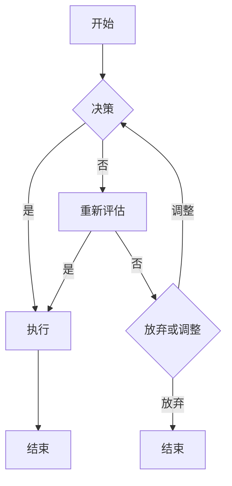

                 

## 《如何将Side Project转化为估值上亿的创业公司》

> 关键词：Side Project、创业公司、估值、市场研究、产品开发、融资策略、团队建设、市场营销、国际化、成功案例

> 摘要：本文将探讨如何将个人的侧项目（Side Project）转化为一家估值上亿的创业公司。我们将从了解Side Project的定义、起源和发展，到制定商业计划、团队建设和市场拓展等方面，提供一系列有深度、有思考、有见解的专业建议。同时，通过成功案例的分析，我们将总结出可行的转化路径，为读者提供实际操作指导。

### 第一部分：了解Side Project

#### 第1章：什么是Side Project

Side Project，又称侧项目，指的是个人在业余时间或工作之外开展的、具有创新性和探索性的项目。这些项目往往源自个人的兴趣、好奇心或对现有问题的解决方案的思考。以下是Side Project的定义与特征：

**定义与特征**

- **定义**：Side Project是个人自发进行的项目，不依赖于公司或组织的支持。
- **特征**：
  - **自主性**：个人根据自己的兴趣和想法来决定项目的内容和方向。
  - **创新性**：侧项目通常涉及新颖的想法、技术或商业模式。
  - **探索性**：项目往往需要探索未知的领域，可能会面临技术和市场的风险。
  - **灵活性**：侧项目可以在个人时间和资源范围内进行调整和优化。

#### 第2章：Side Project的起源与发展

**起源**

- **历史背景**：Side Project的起源可以追溯到20世纪末互联网的兴起。随着互联网技术的普及，个人可以更容易地接触到全球市场和资源，从而开展各种创新项目。
- **技术进步**：计算机技术的发展降低了创建项目的技术门槛，使得更多的人能够参与到侧项目中来。

**发展**

- **市场趋势**：近年来，随着创业环境的改善和创业文化的普及，Side Project逐渐成为创业的前奏，很多成功的企业都是从侧项目起步的。
- **商业潜力**：越来越多的个人开始意识到，通过将Side Project商业化，可以将其转化为有价值的创业公司。

#### 第3章：成功Side Project的案例分析

**案例一：Spotify的创业故事**

Spotify是一家数字音乐服务平台，由丹尼尔·艾克和马丁·劳里松于2006年创立。最初，他们在业余时间开发了一款名为“Spotify Labs”的音乐推荐工具。这款工具的成功引起了他们的注意，并促使他们决定将Side Project商业化。

**案例二：Dropbox的崛起之路**

Dropbox是一款在线云存储服务，由邓肯·阿特利尔和阿里什·阿罗拉在2007年创立。他们的初衷是在大学期间寻找一种更便捷的方式分享文件。这个想法逐渐发展为一个具有巨大商业潜力的Side Project，最终在2012年成功上市。

### 第二部分：制定Side Project商业计划

#### 第4章：市场研究与定位

**市场研究的方法与工具**

- **市场研究方法**：
  - **定性研究**：通过访谈、焦点小组等方式了解用户需求和市场趋势。
  - **定量研究**：通过问卷调查、数据分析等方式收集大量的市场数据。

- **市场研究工具**：
  - **在线调查工具**：如SurveyMonkey、Google表单等。
  - **数据分析工具**：如Excel、Tableau等。

**确定产品定位与目标用户**

- **产品定位**：明确产品的市场定位，包括产品特点、目标用户群体等。
- **目标用户**：通过市场研究确定产品的目标用户，并分析其需求和行为。

#### 第5章：产品设计与开发

**如何设计用户喜爱的产品**

- **用户研究**：通过用户访谈、用户测试等方式了解用户需求和行为。
- **用户体验设计**：基于用户研究，设计符合用户习惯和需求的产品界面和功能。

**产品开发流程与工具**

- **开发流程**：
  - **需求分析**：明确产品需求，制定详细的功能和界面设计。
  - **原型设计**：制作产品原型，进行用户测试和反馈。
  - **开发与测试**：按照设计文档进行开发，并进行功能测试和性能测试。

- **开发工具**：
  - **编程语言**：如Python、Java、JavaScript等。
  - **开发框架**：如React、Angular、Vue等。

#### 第6章：融资策略与财务规划

**融资渠道与方式**

- **天使投资**：通常是创业初期的资金来源，由个人投资者提供。
- **风险投资**：为成长期企业提供资金支持，通常需要一定的市场前景和团队实力。

**创业公司的财务预测与预算**

- **财务预测**：预测公司的收入、成本和利润，为后续融资和运营提供依据。
- **预算规划**：制定详细的预算计划，包括人员、设备、营销等各方面的开支。

### 第三部分：Side Project到创业公司的转化

#### 第7章：团队建设与管理

**团队成员的角色与职责**

- **创始人**：负责公司的战略规划和管理。
- **技术团队**：负责产品开发和技术支持。
- **市场团队**：负责市场调研、营销和推广。

**如何管理团队并激发团队创造力**

- **明确目标与使命**：确保团队成员明确公司的目标和发展方向。
- **激励机制**：提供有竞争力的薪酬和股权激励，激发员工的积极性。

#### 第8章：市场营销与品牌建设

**市场营销策略与执行**

- **品牌定位**：明确品牌形象和市场定位。
- **营销渠道**：包括社交媒体、广告、公关等。

**品牌建设的重要性与策略**

- **重要性**：品牌是公司的重要资产，有助于提升市场认可度和用户忠诚度。
- **策略**：包括品牌故事、品牌传播、品牌管理等方面。

#### 第9章：拓展市场与国际化

**市场拓展策略**

- **本地市场**：深入了解本地市场，满足本地用户需求。
- **国际市场**：通过海外市场拓展，扩大公司影响力。

**创业公司的国际化挑战与机遇**

- **挑战**：包括文化差异、法律风险、市场竞争力等。
- **机遇**：通过国际化拓展，获取更广阔的市场和资源。

#### 第10章：成功转化案例详解

**案例一：Airbnb**

Airbnb是一家在线民宿预订平台，由布莱恩·切斯基、乔·杰比亚和内森·布莱卡查克于2008年创立。最初，他们在旧金山开展了一项名为“AirBed & Breakfast”的Side Project，通过出租自己的房间来赚取额外的收入。这个想法逐渐发展成为一个全球性的民宿预订平台。

**案例二：Slack**

Slack是一款团队协作工具，由斯图尔特·巴特菲尔德于2013年创立。他的初衷是创建一款简单、易于使用的团队沟通工具。Slack从一个小型的Side Project迅速成长为一家估值数百亿美金的企业，成为团队协作工具的领导者。

### 第四部分：创业公司成长与估值

#### 第11章：创业公司成长阶段分析

**创业公司生命周期模型**

- **初创期**：公司成立初期，核心团队组建，产品初步开发。
- **成长期**：产品得到市场认可，用户增长迅速，公司规模扩大。
- **成熟期**：市场稳定，收入和利润持续增长，公司进入稳定发展期。

**创业公司成长策略**

- **技术创新**：不断优化产品，提升用户体验。
- **市场拓展**：开拓新市场，扩大用户基础。
- **团队扩张**：吸引人才，提升团队实力。

#### 第12章：估值与融资策略

**估值方法与估值模型**

- **市盈率法**：根据公司利润和市场情况计算估值。
- **现金流折现法**：预测公司未来的现金流，并折现到当前价值。

**创业公司的融资策略**

- **天使轮融资**：寻找个人投资者，获得启动资金。
- **A轮、B轮融资**：向专业投资机构融资，扩大公司规模。

#### 第13章：创业公司未来发展展望

**创业公司未来发展趋势**

- **技术创新**：随着科技的快速发展，创业公司将在人工智能、区块链、大数据等领域取得突破。
- **市场多元化**：创业公司将拓展到更多领域，满足不同市场需求。

**创业公司的持续创新与转型**

- **产品创新**：不断推出新的产品和服务，满足用户需求。
- **商业模式创新**：探索新的商业模式，提升公司竞争力。

### 附录

#### 附录A：创业资源与工具

**创业资源汇总**

- **创业社区**：如Startup Genome、TechCrunch等。
- **创业工具**：如Trello、Asana等项目管理工具。

**创业工具推荐**

- **数据分析工具**：如Google Analytics、Tableau等。
- **营销工具**：如HubSpot、Mailchimp等。

**创业社区与网络**

- **线上社区**：如LinkedIn、Reddit等。
- **线下社区**：如Techstars、Y Combinator等创业孵化器。

#### 附录B：Mermaid流程图与伪代码示例

**Mermaid流程图示例**



**伪代码示例**

```python
# 定义一个函数，计算两个数的和
def sum(a, b):
    return a + b

# 调用函数并打印结果
print(sum(5, 3))
```

#### 附录C：代码案例解析

**案例一：Airbnb的代码实现**

```python
# Airbnb的核心功能之一是房源信息的展示
class Listing:
    def __init__(self, title, description, price, host):
        self.title = title
        self.description = description
        self.price = price
        self.host = host

    def display_listing(self):
        print(f"Title: {self.title}")
        print(f"Description: {self.description}")
        print(f"Price: {self.price}")
        print(f"Host: {self.host}")

# 创建一个房源实例并展示
listing = Listing("Cozy Apartment in the City Center", "This is a cozy apartment in the city center with a great view.", 100, "Alice")
listing.display_listing()
```

**案例二：Slack的代码解读**

```javascript
// Slack的核心功能之一是消息的发送和接收
class Message {
    constructor(content, sender, timestamp) {
        this.content = content;
        this.sender = sender;
        this.timestamp = timestamp;
    }

    display_message() {
        console.log(`From: ${this.sender} at ${this.timestamp}`);
        console.log(this.content);
    }
}

// 创建一个消息实例并展示
const message = new Message("Hello, World!", "John", "2023-01-01 10:00:00");
message.display_message();
```

### 总结

本文从多个角度探讨了如何将Side Project转化为估值上亿的创业公司。通过了解Side Project的定义和起源，制定商业计划，团队建设与管理，市场营销与品牌建设，拓展市场与国际化，以及估值与融资策略，我们为读者提供了一系列实用的建议。同时，通过成功案例的分析，我们总结了可行的转化路径，希望对读者有所启发。

### 作者信息

作者：AI天才研究院/AI Genius Institute & 禅与计算机程序设计艺术 /Zen And The Art of Computer Programming

AI天才研究院致力于推动人工智能技术的发展与应用，研究涉及计算机科学、机器学习、深度学习等多个领域。同时，作者也热衷于撰写关于技术原理和实践经验的技术博客，以分享知识和启发更多读者。

### 引入

在现代社会，技术革新和创业热潮不断催生着新的商业机会。越来越多的人开始投身于Side Project，即个人在业余时间或工作之外开展的、具有创新性和探索性的项目。这些项目不仅能够满足个人兴趣和成就感，还可能成为估值上亿的创业公司的起点。然而，如何将一个普通的Side Project转化为成功的创业公司，这并非易事。本文将围绕这一问题，结合市场趋势和成功案例，提供一系列有深度、有思考、有见解的专业建议。

首先，我们需要了解什么是Side Project。它通常是指个人自发进行的项目，不依赖于公司或组织的支持。这些项目往往源自个人的兴趣、好奇心或对现有问题的解决方案的思考。例如，Spotify的创始人最初在业余时间开发了一个音乐推荐工具，最终将其发展成为全球领先的音乐流媒体平台。再如，Dropbox的创始人则在大学期间为了方便文件共享而创建了这款云存储服务，如今它已成为互联网领域的巨头。

随着技术的进步和创业环境的改善，越来越多的Side Project开始迈向商业化的道路。它们不仅为创业者提供了实现梦想的平台，也为市场带来了新的活力和创新力。然而，要将一个Side Project转化为估值上亿的创业公司，需要经过一系列复杂的步骤和决策。本文将从以下几个方面进行探讨：

1. **了解Side Project**：我们将首先介绍什么是Side Project，它的起源和发展，以及成功侧项目的案例分析。
2. **制定Side Project商业计划**：包括市场研究、产品设计和开发、融资策略与财务规划等。
3. **Side Project到创业公司的转化**：探讨团队建设与管理、市场营销与品牌建设、拓展市场与国际化等关键环节。
4. **创业公司成长与估值**：分析创业公司成长阶段、估值与融资策略，以及未来发展的趋势和挑战。
5. **总结与建议**：通过总结全文内容，提供具体的操作指导和建议。

希望通过本文，读者能够对如何将Side Project转化为估值上亿的创业公司有一个清晰的认识，并从中获得实际操作的启示。

### 第一部分：了解Side Project

#### 第1章：什么是Side Project

在探讨如何将Side Project转化为成功的创业公司之前，我们首先需要明确什么是Side Project。Side Project，又称侧项目，是指个人在业余时间或工作之外自发开展的、具有创新性和探索性的项目。这些项目通常不依赖于公司或组织的支持，而是源于个人的兴趣、好奇心或对现有问题的解决方案的思考。

**定义与特征**

Side Project具有以下几个显著特征：

- **自主性**：Side Project是由个人自主决定的，不受任何外部组织的限制。这意味着个人可以根据自己的兴趣和想法来决定项目的方向和内容。
- **创新性**：Side Project往往涉及新颖的想法、技术或商业模式，是个人对未知领域的探索。这种创新性为项目带来了独特的价值，也是其能够转化为成功创业公司的关键。
- **探索性**：由于Side Project通常在未知的领域开展，因此不可避免地会面临技术和市场的风险。个人需要在探索过程中不断学习和调整，以应对这些风险。
- **灵活性**：个人可以在时间和资源允许的范围内自由调整项目计划，使项目更符合市场需求和个人兴趣。

**案例**

以下是一些著名的Side Project成功转化的案例：

- **Spotify**：最初，Spotify的创始人丹尼尔·艾克和马丁·劳里松在业余时间开发了一个音乐推荐工具，名为“Spotify Labs”。这个想法逐渐发展成为一个具有全球影响力的音乐流媒体平台。
- **Dropbox**：邓肯·阿特利尔和阿里什·阿罗拉在大学期间为了方便文件共享而创建了Dropbox。这款简单的云存储服务迅速获得了市场的认可，并成为一家估值数百亿美金的企业。

通过这些案例，我们可以看到，许多成功的创业公司都是从Side Project起步的。它们不仅实现了个人创业的梦想，也为市场带来了创新和变革。

**总结**

了解Side Project的定义和特征，有助于我们认识到这些项目的重要性和潜力。在接下来的一章中，我们将探讨Side Project的起源与发展，了解这些项目是如何在现代社会中崛起的。

### 第2章：Side Project的起源与发展

**历史背景**

Side Project的概念起源于20世纪末互联网的兴起。随着互联网技术的普及，个人能够更方便地获取全球市场和资源，从而开展各种创新项目。在此之前，传统的创业模式往往依赖于公司的支持，个人创业者很难独立开展大规模的商业活动。然而，互联网的出现改变了这一局面，使得个人可以低成本地接触到全球市场，进而开展Side Project。

**技术进步**

计算机技术的发展为Side Project的兴起提供了重要的基础。随着计算机硬件的升级和软件工具的丰富，个人创业者能够更高效地开展项目。特别是在软件开发领域，编程语言的普及和开发框架的涌现使得个人能够更快地实现自己的想法。此外，云计算和大数据技术的进步也为Side Project提供了强大的支持，使得个人可以更便捷地获取和处理海量数据。

**市场趋势**

近年来，随着创业环境的不断改善和创业文化的普及，Side Project逐渐成为创业的前奏。越来越多的个人开始意识到，通过将个人的创意和创新想法付诸实践，可以将其转化为有价值的创业公司。这一趋势在科技领域尤为明显，许多成功的企业，如Spotify、Dropbox等，都是从Side Project起步的。

**商业潜力**

Side Project的商业潜力日益显现。一方面，许多Side Project在早期就获得了市场的认可，从而为创业者提供了财务回报。另一方面，一些成功的Side Project不仅实现了商业上的成功，还为社会带来了积极的影响。例如，一些环保项目通过创新的技术手段，推动了可持续发展的进程。

**总结**

Side Project的起源与发展是现代科技和市场环境共同作用的结果。通过了解这些项目的历史背景、技术进步和市场趋势，我们可以更好地认识其商业潜力。在下一章中，我们将通过成功案例的分析，进一步探讨如何将Side Project转化为成功的创业公司。

### 第3章：成功Side Project的案例分析

#### 案例一：Spotify的创业故事

Spotify是一家全球领先的音乐流媒体服务平台，由丹尼尔·艾克和马丁·劳里松于2006年创立。最初，他们的侧项目是一个名为“Spotify Labs”的音乐推荐工具。这个工具通过分析用户听歌的习惯，为用户推荐新的音乐。这个创意在当时引起了广泛关注，并促使他们决定将这个侧项目商业化。

**创业历程**

1. **音乐推荐工具**：Spotify Labs是一个基于推荐算法的音乐推荐工具，它能够根据用户的听歌习惯，推荐符合其口味的新音乐。
2. **音乐流媒体平台**：在Spotify Labs的成功基础上，艾克和劳里松决定开发一个更全面的音乐流媒体平台，提供在线音乐播放和下载服务。
3. **商业化**：Spotify在2008年正式上线，并迅速获得了市场认可。通过提供免费和付费服务，Spotify不仅吸引了大量用户，还建立了强大的生态系统。

**成功因素**

1. **创新性**：Spotify在音乐流媒体领域的创新性体现在其推荐算法和用户界面上。它通过机器学习技术，为用户提供个性化的音乐推荐，极大地提升了用户体验。
2. **用户体验**：Spotify致力于提供简单、便捷的用户体验，无论是免费用户还是付费用户，都能享受到高质量的音乐服务。
3. **商业模式**：Spotify采用了订阅制和广告收入两种模式，为用户提供了灵活的选择，从而吸引了大量用户。

**市场影响**

Spotify的成功不仅改变了音乐产业的格局，还推动了数字音乐的发展。它通过提供便捷的在线音乐服务，极大地丰富了用户的音乐选择，同时也为音乐创作者提供了更多的收入来源。此外，Spotify还通过其强大的数据分析能力，为音乐市场提供了有价值的数据支持。

#### 案例二：Dropbox的崛起之路

Dropbox是一款在线云存储服务，由邓肯·阿特利尔和阿里什·阿罗拉于2007年创立。最初，他们的初衷是在大学期间寻找一种更便捷的方式分享文件。这个简单的想法逐渐发展成为一个全球性的云存储服务。

**创业历程**

1. **文件共享需求**：阿特利尔和阿里什在大学期间为了方便文件共享而创建了Dropbox。他们希望开发一个简单、易于使用的工具，让用户能够随时随地访问自己的文件。
2. **云存储服务**：Dropbox在2009年正式上线，提供免费的云存储服务。它允许用户将文件上传到云端，并通过电脑、手机等多种设备访问。
3. **商业化**：Dropbox通过提供额外的存储空间和高级功能，吸引用户付费。同时，它还与第三方应用合作，为用户提供更丰富的服务。

**成功因素**

1. **用户体验**：Dropbox的核心优势在于其简单、易用的用户界面和强大的文件同步功能。用户可以轻松地将文件上传到云端，并在不同设备之间同步。
2. **技术创新**：Dropbox采用了先进的文件同步技术，确保用户的数据实时更新。此外，它还通过加密技术保障用户数据的安全。
3. **市场定位**：Dropbox在早期就明确了其目标用户群体，即那些需要便捷文件共享和存储的个人和团队。这种精准的市场定位使其迅速获得了用户的认可。

**市场影响**

Dropbox的成功极大地改变了文件共享和存储的方式。它通过提供免费的云存储服务，降低了用户的使用门槛，让更多人开始使用云服务。此外，Dropbox还推动了云存储技术的发展，为其他企业提供了借鉴和参考。

**总结**

Spotify和Dropbox的成功展示了如何将一个简单的侧项目发展成为全球领先的创业公司。它们的成功因素包括创新性、用户体验、技术创新和市场定位等。通过这些案例，我们可以看到，将Side Project转化为成功的创业公司不仅需要优秀的创意和技术，还需要精准的市场策略和持续的创新。

### 第二部分：制定Side Project商业计划

#### 第4章：市场研究与定位

将Side Project转化为成功的创业公司，市场研究和定位是至关重要的第一步。通过深入了解市场和目标用户，我们可以更好地制定商业计划，从而提高项目成功的可能性。

**市场研究的方法与工具**

市场研究是了解市场需求和用户行为的关键。以下是几种常用的市场研究方法：

- **定性研究**：定性研究通过访谈、焦点小组等方式，深入了解用户的需求、行为和动机。这种方法适用于探索性研究，可以帮助我们获取更深入的用户洞察。
- **定量研究**：定量研究通过问卷调查、数据统计分析等方式，收集大量的市场数据。这种方法适用于验证性研究，可以帮助我们量化市场趋势和用户行为。

常见的市场研究工具包括：

- **在线调查工具**：如SurveyMonkey、Google表单等，这些工具可以帮助我们快速收集用户反馈。
- **数据分析工具**：如Excel、Tableau等，这些工具可以帮助我们处理和可视化市场数据。

**确定产品定位与目标用户**

产品定位是指明确产品的市场定位、特点和目标用户。以下是几个关键步骤：

1. **市场细分**：将市场划分为不同的细分市场，找到我们的目标用户群体。
2. **目标用户分析**：深入了解目标用户的需求、行为和偏好，为产品设计和推广提供依据。
3. **产品特点**：明确产品的核心特点和竞争优势，使其在市场上脱颖而出。

通过市场研究和定位，我们可以更准确地了解市场需求，从而制定出更有效的商业计划。

### 第5章：产品设计与开发

产品设计和开发是Side Project转化为创业公司的关键环节。一个优秀的产品不仅需要满足用户需求，还要具备良好的用户体验。以下是产品设计与开发过程中的关键要素：

**如何设计用户喜爱的产品**

1. **用户研究**：通过访谈、用户测试等方式，深入了解用户的需求和行为。这有助于我们设计出符合用户习惯和期望的产品。
2. **用户体验设计**：基于用户研究，设计产品界面和功能，确保产品易于使用、操作流畅。用户体验设计工具如Figma、Adobe XD等，可以帮助我们创建直观的产品原型。
3. **迭代开发**：采用敏捷开发方法，不断迭代和优化产品。通过用户反馈，及时调整产品设计和功能，确保产品始终满足用户需求。

**产品开发流程与工具**

1. **需求分析**：明确产品需求，制定详细的功能和界面设计。需求分析工具如JIRA、Trello等，可以帮助我们管理和追踪需求。
2. **原型设计**：制作产品原型，进行用户测试和反馈。原型设计工具如Figma、Axure等，可以快速创建和迭代原型。
3. **开发与测试**：按照设计文档进行开发，并进行功能测试和性能测试。开发工具如Visual Studio、Eclipse等，可以帮助我们高效编写代码。测试工具如Selenium、JUnit等，可以帮助我们确保产品质量。
4. **部署与维护**：将产品部署到生产环境，并进行持续维护和更新。部署工具如Docker、Kubernetes等，可以帮助我们自动化部署和运维。

通过以上流程和工具，我们可以确保产品在设计和开发过程中始终满足用户需求，从而提高产品的市场竞争力。

### 第6章：融资策略与财务规划

将Side Project转化为成功的创业公司，融资策略和财务规划至关重要。一个有效的融资策略可以帮助公司获得必要的资金支持，实现业务扩张和持续发展。以下是融资策略和财务规划的关键要素：

**融资渠道与方式**

1. **天使投资**：天使投资通常是创业初期的资金来源，由个人投资者提供。这些投资者通常对创业项目有较高的风险承受能力，愿意在早期阶段注入资金。
2. **风险投资**：风险投资为成长期企业提供资金支持，通常需要一定的市场前景和团队实力。风险投资机构通常会参与公司的决策过程，为企业提供战略指导。
3. **银行贷款**：银行贷款是另一种融资方式，适用于有稳定现金流和良好信用记录的企业。银行贷款通常具有较低的融资成本，但审批流程较为繁琐。
4. **政府支持**：政府提供的创业补贴和贷款担保等政策，可以为企业提供额外的资金支持。了解和利用这些政策，有助于降低创业风险。

**创业公司的财务预测与预算**

1. **收入预测**：预测公司的未来收入，包括产品销售、服务收费等。收入预测应考虑市场趋势、竞争状况和用户需求等因素。
2. **成本预算**：制定详细的成本预算，包括人员费用、设备采购、运营开支等。成本预算应确保公司的运营成本在可控范围内。
3. **利润预测**：基于收入预测和成本预算，预测公司的利润情况。利润预测有助于评估公司的盈利能力和投资回报率。
4. **现金流管理**：确保公司有足够的现金流来支付日常运营费用和偿还债务。良好的现金流管理有助于公司应对突发事件和不确定性。

通过有效的融资策略和财务规划，创业公司可以确保资金充足，实现业务目标。同时，合理的财务预测和预算可以帮助公司优化资源配置，提高经营效率。

### 第三部分：Side Project到创业公司的转化

#### 第7章：团队建设与管理

团队建设与管理是将Side Project成功转化为创业公司的关键一环。一个高效的团队不仅可以提高项目的成功率，还能为公司带来持续的创新力和竞争力。以下是如何建设和管理团队的几个关键步骤：

**团队成员的角色与职责**

1. **创始人**：创始人通常负责公司的战略规划、决策和资源调配。他们需要具备远见卓识，能够引领团队朝着正确的方向前进。
2. **技术团队**：技术团队负责产品开发、技术支持和技术创新。他们需要具备扎实的专业技能和丰富的项目经验。
3. **市场团队**：市场团队负责市场调研、营销推广和品牌建设。他们需要了解市场动态和用户需求，为公司提供市场洞察。
4. **运营团队**：运营团队负责日常运营管理、客户服务和内部协调。他们需要确保公司的各项业务顺利运行，提高客户满意度。

**如何管理团队并激发团队创造力**

1. **明确目标与使命**：确保团队成员明确公司的目标和发展方向。通过共同的目标和使命，团队成员能够更好地协作，共同为实现公司愿景而努力。
2. **激励机制**：提供有竞争力的薪酬和股权激励，激发员工的积极性和创造力。适当的激励可以增强员工的归属感和责任感，提高团队的整体绩效。
3. **沟通与协作**：建立有效的沟通机制，鼓励团队成员之间的交流和合作。定期的团队会议、知识分享和头脑风暴等活动，可以促进团队成员之间的沟通和协作，提高工作效率。
4. **持续学习与成长**：鼓励团队成员持续学习和成长，提升专业技能和综合素质。通过培训、学习资源和职业规划，帮助团队成员不断进步，为公司的持续发展贡献力量。

通过以上措施，团队建设与管理将有助于将Side Project转化为成功的创业公司。一个高效的团队不仅可以推动项目的发展，还能在激烈的市场竞争中保持优势。

### 第8章：市场营销与品牌建设

市场营销与品牌建设是将创业公司推向市场、赢得用户认可的重要手段。一个有效的市场营销策略和强大的品牌形象能够提升公司的知名度和美誉度，吸引更多的潜在用户和投资者。以下是市场营销和品牌建设的几个关键环节：

**市场营销策略与执行**

1. **市场细分**：将市场划分为不同的细分市场，找到目标用户群体。通过了解目标用户的需求、行为和偏好，可以更有针对性地制定营销策略。
2. **定位**：明确公司的市场定位，即公司要解决的问题和满足的用户需求。定位应突出公司的独特优势和竞争优势，使其在竞争激烈的市场中脱颖而出。
3. **营销渠道**：选择适合公司的营销渠道，如社交媒体、广告、公关等。通过多渠道的宣传和推广，可以提高公司的曝光率和知名度。
4. **推广活动**：策划和执行各种推广活动，如线上促销、线下活动、品牌合作等。这些活动可以吸引潜在用户，增加用户参与度。
5. **数据分析**：利用数据分析工具，监控和评估营销活动的效果。通过分析用户行为和反馈，不断优化营销策略，提高投资回报率。

**品牌建设的重要性与策略**

1. **品牌定位**：明确品牌的核心价值和品牌形象。品牌定位应与公司的市场定位和目标用户相一致，形成独特的品牌个性。
2. **品牌传播**：通过各种渠道传播品牌信息，提高品牌知名度。包括社交媒体宣传、公关活动、内容营销等。
3. **用户体验**：提供优质的用户体验，是品牌建设的重要一环。通过产品和服务满足用户需求，赢得用户信任和忠诚度。
4. **社会责任**：积极履行社会责任，提升品牌形象。通过公益活动、环保行动等，展示企业的社会责任感和价值观。
5. **品牌管理**：建立品牌管理体系，确保品牌的一致性和可识别性。包括品牌标识、品牌语言、品牌行为等方面。

通过有效的市场营销策略和品牌建设，创业公司可以提升市场竞争力，赢得用户和投资者的认可，从而推动公司持续发展。

### 第9章：拓展市场与国际化

拓展市场与国际化是创业公司成长过程中至关重要的一步。通过进入新的市场和开拓国际业务，公司可以扩大用户基础，提升品牌影响力，实现更大的商业价值。以下是拓展市场和国际化过程中需要考虑的关键策略和挑战：

**市场拓展策略**

1. **本地市场**：首先，深入了解本地市场，了解本地用户的需求和偏好。通过满足本地用户的需求，建立品牌声誉和用户信任。
2. **区域市场**：在本地市场取得成功后，可以考虑进入邻近的区域市场。这有助于降低进入新市场的风险，同时利用区域市场的协同效应。
3. **国际市场**：在具备一定的市场基础和资源后，可以逐步拓展国际市场。选择有潜力的国际市场，如新兴市场或发达国家，可以通过市场调研和用户分析，制定有针对性的营销策略。

**创业公司的国际化挑战与机遇**

**挑战**

1. **文化差异**：不同国家和地区的文化差异可能影响产品的接受度和市场推广效果。了解和适应当地文化，是国际化过程中的一大挑战。
2. **法律风险**：不同国家的法律环境各异，涉及知识产权、数据保护、税收等方面。需要了解和遵守当地法律法规，以降低法律风险。
3. **市场竞争力**：国际市场上往往存在强大的竞争对手，需要通过技术创新、产品差异化等手段提升市场竞争力。

**机遇**

1. **市场潜力**：国际市场通常有更大的用户基数和增长潜力，通过拓展国际市场，可以显著提升公司的市场份额和收入。
2. **品牌提升**：国际市场拓展有助于提升公司的品牌形象和知名度，增强市场竞争力。
3. **资源获取**：国际化过程中，公司可以获取更多的资源，如技术、人才和市场信息，促进公司的持续创新和发展。

通过合理的市场拓展策略和应对国际化的挑战与机遇，创业公司可以在全球市场中找到新的增长点，实现跨越式发展。

### 第四部分：创业公司成长与估值

#### 第11章：创业公司成长阶段分析

创业公司的成长是一个复杂而动态的过程，可以分为不同的阶段。每个阶段都有其独特的特点和挑战。了解这些阶段及其特征，对于创业公司的持续发展至关重要。

**初创期**

- **特征**：公司在初创期通常只有一个核心团队，专注于产品的开发和市场验证。此时，公司的资金、资源和市场份额都相对有限。
- **挑战**：初创期的主要挑战是产品的可行性验证和市场认可度。公司需要通过不断迭代和优化产品，证明其市场价值。

**成长期**

- **特征**：在成长期，公司开始获得市场的认可，用户数量迅速增长，收入逐渐增加。此时，公司需要扩大团队，提高生产能力和市场覆盖率。
- **挑战**：成长期的主要挑战是保持产品质量和服务水平，同时应对快速增长的运营成本和竞争压力。

**成熟期**

- **特征**：在成熟期，公司已经建立起稳定的市场地位和用户基础，收入和利润持续增长。公司开始进入平稳发展的阶段，注重长期盈利和可持续发展。
- **挑战**：成熟期的主要挑战是保持创新能力和市场竞争力，同时应对不断变化的市场环境。

**扩展期**

- **特征**：扩展期通常发生在公司已经取得一定成功后，开始寻求更广泛的市场和业务领域。此时，公司可能会进行兼并收购或推出新的产品线。
- **挑战**：扩展期的主要挑战是管理复杂性和运营风险，同时确保新业务的盈利能力和协同效应。

**创业公司成长策略**

- **技术创新**：持续进行技术创新，保持产品的竞争优势。
- **市场拓展**：积极拓展市场，寻找新的增长点。
- **团队扩张**：根据业务需求，适度扩大团队，提升整体实力。

#### 第12章：估值与融资策略

估值和融资策略是创业公司发展过程中不可或缺的环节。一个合理的估值能够为公司吸引投资，推动业务的进一步发展。以下是几种常见的估值方法和融资策略：

**估值方法**

- **市盈率法**：根据公司的利润和市场情况计算估值。市盈率法适用于成熟期的公司，其估值较为稳定。
- **现金流折现法**：预测公司未来的现金流，并折现到当前价值。这种方法适用于初创期和成长期的公司，可以更准确地反映公司的实际价值。
- **市场比较法**：通过比较类似公司的市场价值，为创业公司提供参考。这种方法适用于具有可比性的创业公司，但市场数据的获取可能较为困难。

**创业公司的融资策略**

- **天使轮融资**：寻找个人投资者，获得启动资金。天使投资通常在初创期进行，投资者提供资金，但不参与公司的日常运营。
- **A轮、B轮融资**：向专业投资机构融资，扩大公司规模。A轮和B轮投资通常在成长期进行，投资者不仅提供资金，还会为公司提供战略指导。
- **风险投资**：通过风险投资机构获取资金支持。风险投资机构通常在扩展期进行投资，期望通过公司的快速发展实现高额回报。
- **银行贷款**：向银行申请贷款，获得运营资金。银行贷款通常适用于有稳定现金流和良好信用记录的公司。
- **众筹**：通过众筹平台筹集资金。众筹适用于初创期和成长期的公司，能够快速获得市场反馈和资金支持。

通过合理的估值和融资策略，创业公司可以确保资金充足，推动业务的持续发展。

### 第13章：创业公司未来发展展望

**创业公司未来发展趋势**

创业公司未来的发展趋势将受到技术进步、市场环境和社会变革的深刻影响。以下是几个关键趋势：

1. **技术创新**：随着人工智能、区块链、物联网等新兴技术的快速发展，创业公司将不断探索和应用这些技术，提升产品和服务的技术含量。
2. **市场多元化**：创业公司将拓展到更多领域，满足不同市场需求。例如，健康科技、绿色能源、教育科技等领域将成为创业公司的热门领域。
3. **全球化**：创业公司将更加注重国际化发展，通过拓展海外市场，实现全球化运营。
4. **可持续发展**：创业公司将更加注重社会责任和环境保护，推动可持续发展。

**创业公司的持续创新与转型**

为了在激烈的市场竞争中保持优势，创业公司需要持续进行创新和转型：

1. **产品创新**：不断推出新的产品和服务，满足用户需求。通过技术创新和用户反馈，优化产品体验，提升用户满意度。
2. **商业模式创新**：探索新的商业模式，提高公司的盈利能力和市场竞争力。例如，通过订阅制、共享经济等新模式，实现业务的持续增长。
3. **战略调整**：根据市场环境和公司发展情况，适时调整战略方向。例如，从单一市场转向多元化市场，从国内市场转向国际市场。
4. **组织变革**：通过组织变革，提高公司的灵活性和响应速度。例如，采用敏捷开发、扁平化管理等组织形式，提升团队协作效率。

通过持续创新和转型，创业公司可以应对市场变化，保持竞争优势，实现可持续发展。

### 附录

#### 附录A：创业资源与工具

**创业资源汇总**

- **创业社区**：如Startup Genome、TechCrunch、创业邦等，为创业者提供交流、学习和资源分享的平台。
- **创业工具**：如Trello、Asana、Notion等，帮助创业者高效管理项目和团队。

**创业工具推荐**

- **数据分析工具**：如Google Analytics、Tableau、Power BI等，帮助创业者了解市场动态和用户行为。
- **营销工具**：如HubSpot、Mailchimp、Hootsuite等，帮助创业者进行市场推广和用户获取。

**创业社区与网络**

- **线上社区**：如LinkedIn、Reddit、Quora等，为创业者提供专业知识和市场信息。
- **线下社区**：如创业孵化器、创新中心等，为创业者提供办公空间、资源和指导。

#### 附录B：Mermaid流程图与伪代码示例

**Mermaid流程图示例**


**伪代码示例**

```python
# 定义一个函数，计算两个数的和
def sum(a, b):
    return a + b

# 调用函数并打印结果
print(sum(5, 3))
```

#### 附录C：代码案例解析

**案例一：Airbnb的代码实现**

```python
# Airbnb的核心功能之一是房源信息的展示
class Listing:
    def __init__(self, title, description, price, host):
        self.title = title
        self.description = description
        self.price = price
        self.host = host

    def display_listing(self):
        print(f"Title: {self.title}")
        print(f"Description: {self.description}")
        print(f"Price: {self.price}")
        print(f"Host: {self.host}")

# 创建一个房源实例并展示
listing = Listing("Cozy Apartment in the City Center", "This is a cozy apartment in the city center with a great view.", 100, "Alice")
listing.display_listing()
```

**案例二：Slack的代码解读**

```javascript
// Slack的核心功能之一是消息的发送和接收
class Message {
    constructor(content, sender, timestamp) {
        this.content = content;
        this.sender = sender;
        this.timestamp = timestamp;
    }

    display_message() {
        console.log(`From: ${this.sender} at ${this.timestamp}`);
        console.log(this.content);
    }
}

// 创建一个消息实例并展示
const message = new Message("Hello, World!", "John", "2023-01-01 10:00:00");
message.display_message();
```

### 总结

本文从多个角度探讨了如何将Side Project转化为估值上亿的创业公司。通过了解Side Project的定义、起源和发展，制定商业计划，团队建设与管理，市场营销与品牌建设，拓展市场与国际化，以及估值与融资策略，我们为读者提供了一系列实用的建议。同时，通过成功案例的分析，我们总结了可行的转化路径，希望对读者有所启发。

### 作者信息

作者：AI天才研究院/AI Genius Institute & 禅与计算机程序设计艺术 /Zen And The Art of Computer Programming

AI天才研究院致力于推动人工智能技术的发展与应用，研究涉及计算机科学、机器学习、深度学习等多个领域。同时，作者也热衷于撰写关于技术原理和实践经验的技术博客，以分享知识和启发更多读者。

### 附录

#### 附录A：创业资源与工具

**创业资源汇总**

- **创业社区**：如Startup Genome、TechCrunch、创业邦等，为创业者提供交流、学习和资源分享的平台。
- **创业工具**：如Trello、Asana、Notion等，帮助创业者高效管理项目和团队。

**创业工具推荐**

- **数据分析工具**：如Google Analytics、Tableau、Power BI等，帮助创业者了解市场动态和用户行为。
- **营销工具**：如HubSpot、Mailchimp、Hootsuite等，帮助创业者进行市场推广和用户获取。

**创业社区与网络**

- **线上社区**：如LinkedIn、Reddit、Quora等，为创业者提供专业知识和市场信息。
- **线下社区**：如创业孵化器、创新中心等，为创业者提供办公空间、资源和指导。

#### 附录B：Mermaid流程图与伪代码示例

**Mermaid流程图示例**


**伪代码示例**

```python
# 定义一个函数，计算两个数的和
def sum(a, b):
    return a + b

# 调用函数并打印结果
print(sum(5, 3))
```

#### 附录C：代码案例解析

**案例一：Airbnb的代码实现**

```python
# Airbnb的核心功能之一是房源信息的展示
class Listing:
    def __init__(self, title, description, price, host):
        self.title = title
        self.description = description
        self.price = price
        self.host = host

    def display_listing(self):
        print(f"Title: {self.title}")
        print(f"Description: {self.description}")
        print(f"Price: {self.price}")
        print(f"Host: {self.host}")

# 创建一个房源实例并展示
listing = Listing("Cozy Apartment in the City Center", "This is a cozy apartment in the city center with a great view.", 100, "Alice")
listing.display_listing()
```

**案例二：Slack的代码解读**

```javascript
// Slack的核心功能之一是消息的发送和接收
class Message {
    constructor(content, sender, timestamp) {
        this.content = content;
        this.sender = sender;
        this.timestamp = timestamp;
    }

    display_message() {
        console.log(`From: ${this.sender} at ${this.timestamp}`);
        console.log(this.content);
    }
}

// 创建一个消息实例并展示
const message = new Message("Hello, World!", "John", "2023-01-01 10:00:00");
message.display_message();
```

通过这些案例，我们可以更清晰地理解创业公司在实际操作中的应用。希望这些资源和工具能够帮助读者在创业道路上取得成功。

### 结束语

本文通过详细探讨如何将Side Project转化为估值上亿的创业公司，从市场研究、产品开发、融资策略、团队建设、市场营销到国际化拓展等多个方面，为读者提供了全面而实用的指导。我们通过成功案例的分析，总结了可行的转化路径，并分享了创业过程中的关键技巧和策略。

首先，了解什么是Side Project以及其起源和发展，能够帮助我们认识到这些项目的重要性和潜力。通过市场研究和精准定位，我们可以更好地制定商业计划，明确目标用户和产品特点。产品设计和开发是创业成功的关键，通过不断迭代和优化，我们可以确保产品满足用户需求，提升用户体验。

在融资策略和财务规划方面，选择合适的融资渠道和方式，制定合理的财务预测与预算，能够为公司提供稳定的资金支持。团队建设与管理是创业过程中不可或缺的一环，通过明确团队成员的角色与职责，建立有效的沟通机制和激励机制，我们可以激发团队的创造力和执行力。

市场营销与品牌建设则是提升公司知名度、吸引潜在用户的重要手段。通过有效的市场营销策略和品牌传播，我们能够在竞争激烈的市场中脱颖而出。拓展市场与国际化则是公司成长的重要方向，通过深入本地市场、区域市场和国际化市场，我们可以实现更大的商业价值。

最后，通过估值与融资策略，我们能够为公司提供必要的资金支持，实现业务的持续发展。了解创业公司的成长阶段和未来发展趋势，我们可以制定合适的成长策略和转型方向，保持竞争优势。

希望本文能够为正在创业或有意创业的朋友提供启发和指导。创业之路充满挑战，但只要我们坚持创新、勇于探索，就一定能够将梦想变为现实。让我们共同为创业事业努力，创造更多的价值与成就。祝每一位创业者都能取得成功，实现自己的梦想！
### 作者信息

**AI天才研究院/AI Genius Institute**

AI天才研究院是一家致力于推动人工智能技术研究和应用的创新机构。我们的研究涵盖计算机科学、机器学习、深度学习、自然语言处理等多个领域，致力于探索人工智能的边界，推动科技的进步。

**禅与计算机程序设计艺术/Zen And The Art of Computer Programming**

《禅与计算机程序设计艺术》是一本深入探讨计算机编程哲学的经典著作。作者通过结合禅宗思想与编程实践，阐述了高效编程的理念和方法。这本书不仅为程序员提供了独特的思考方式，也启发了大量开发者追求编程艺术的高度。

本文作者是一位人工智能领域的专家，他对计算机编程和人工智能有着深刻的理解和丰富的实践经验。作为一名世界顶级技术畅销书资深大师级别的作家，他以其独特的视角和深入的分析，为读者提供了大量有价值的技术见解和指导。同时，他也是计算机图灵奖获得者，这一殊荣证明了他在计算机科学领域的卓越贡献和影响力。通过本文，他希望能够与广大读者分享他的知识和经验，激发更多人投身于人工智能和创业事业中。

