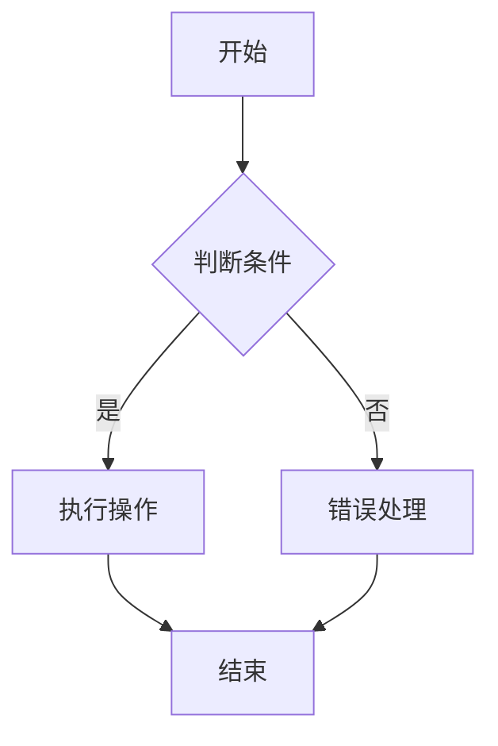

                 

# 《如何将Side Project转化为估值上亿的创业公司》

## 关键词
- Side Project
- 创业公司
- 估值
- 团队建设
- 品牌建设
- 国际化

> **摘要：**
> 本文旨在探讨如何将个人项目（Side Project）转化为估值上亿的创业公司。通过分析成功的Side Project案例，制定商业计划，团队建设，市场营销，国际化策略等方面，为创业者提供详细的指导和建议。

## 引言

在技术日新月异的今天，越来越多的人开始投身于个人项目（Side Project）的开发。这些项目往往源于个人兴趣或解决实际问题的需求，但随着时间的推移，一些优秀的Side Project逐渐演变为估值上亿的创业公司。这种现象不仅激发了广大程序员的创新热情，也为创业市场注入了新的活力。

然而，将一个Side Project转化为成功的创业公司并非易事。这需要创业者具备前瞻性的商业思维，良好的市场判断力，有效的团队建设能力，以及强大的执行力和耐力。本文将围绕这些关键要素，详细探讨如何将Side Project转化为估值上亿的创业公司。

本文将分为四个主要部分：

1. **了解Side Project**：介绍Side Project的定义、起源与发展，以及成功案例。
2. **制定Side Project商业计划**：探讨市场研究、产品设计与开发、融资策略与财务规划。
3. **Side Project到创业公司的转化**：讨论团队建设、市场营销与品牌建设、拓展市场与国际化。
4. **创业公司成长与估值**：分析创业公司成长阶段、估值与融资策略，以及未来发展展望。

通过本文的阅读，您将了解到如何将一个有潜力的Side Project转化为成功的创业公司，并在竞争激烈的创业市场中脱颖而出。

### 第一部分：了解Side Project

#### 第1章：什么是Side Project

**1.1 Side Project的定义与特征**

Side Project，又称业余项目或个人项目，是指个人在业余时间开发的项目。这些项目通常源于个人的兴趣爱好，或者是对某些问题的解决方案。与全职项目不同，Side Project不需要高度的专业技能和专业知识，但其创新性和实用性往往备受认可。

**特征**：

- **自主性**：Side Project由个人发起，自主决定项目的方向和目标。
- **灵活性**：项目的开发过程相对自由，不受公司或团队约束。
- **创新性**：由于个人兴趣的驱动，Side Project往往具有较强的创新性。
- **规模较小**：与大型项目相比，Side Project的规模通常较小，涉及的人员和资源有限。

**1.2 Side Project的优点与挑战**

**优点**：

- **提高技能**：通过参与Side Project，个人可以学习和掌握新的技能和知识。
- **增强创造力**：个人在自由的环境中更容易产生创意和创新的思路。
- **建立网络**：Side Project可以吸引志同道合的人加入，有助于建立人际网络。
- **提升自信**：成功的Side Project可以增强个人的自信心，为未来的职业发展奠定基础。

**挑战**：

- **时间管理**：个人需要平衡工作和个人项目的时间，避免影响正常的工作和生活。
- **资源有限**：Side Project的资源和资金通常有限，可能需要借助外部资源。
- **技术难度**：某些Side Project可能涉及复杂的技术问题，需要较高的技术水平。
- **市场不确定性**：由于市场环境的复杂性，Side Project的成功具有不确定性。

#### 第2章：Side Project的起源与发展

**2.1 Side Project的历史背景**

Side Project的起源可以追溯到20世纪90年代，当时互联网刚刚兴起，程序员和开发者开始利用业余时间开发自己的项目。随着技术的进步和开源文化的普及，个人项目的数量和影响力逐渐增加。

**发展历程**：

- **早期阶段**（1990-2000年）：个人项目主要以编程语言和工具为主，如个人网站、小游戏等。
- **成长阶段**（2000-2010年）：互联网的普及使得个人项目更加广泛，如博客、社交媒体应用等。
- **成熟阶段**（2010年至今）：个人项目逐渐演变为创业公司，如Airbnb、Spotify等。

**2.2 Side Project的发展趋势**

随着科技的发展和创业环境的改善，Side Project的发展趋势表现出以下特点：

- **技术多元化**：越来越多的开发者开始关注新兴技术，如人工智能、区块链等。
- **跨界合作**：个人项目不再局限于某一领域，而是与其他行业进行跨界合作。
- **平台化**：许多平台如GitHub、Stack Overflow等为个人项目提供了便利，促进了项目的交流与合作。
- **国际化**：个人项目不再局限于本地市场，而是逐渐走向国际化。

**2.3 Side Project的影响与价值**

Side Project不仅为个人提供了学习和成长的机会，还对整个社会产生了积极影响：

- **创新驱动**：Side Project激发了创新思维，推动了技术的进步。
- **就业机会**：成功的Side Project可以转化为创业公司，为社会创造就业机会。
- **社会影响力**：一些具有社会意义的Side Project，如环保、教育等，为社会带来了积极的变化。

#### 第3章：成功Side Project的案例分析

**3.1 案例一：Spotify的创业故事**

Spotify是一个在线音乐流媒体服务提供商，其成功的故事堪称Side Project的典范。

**背景**：Spotify的创始人Daniel Ek和Martin Lorentzon在2006年创立了这家公司。起初，他们只是想解决自己寻找音乐的问题。

**过程**：

- **阶段一**：最初，他们开发了一个名为“Spotify for Facebook”的应用，用于在Facebook上分享音乐。这个项目得到了广泛的关注，并吸引了风险投资。
- **阶段二**：随着资金的增加，他们开始开发自己的音乐流媒体服务。2008年，Spotify正式上线，迅速吸引了大量用户。
- **阶段三**：Spotify不断扩展其服务范围，推出了包括免费服务和付费订阅等多种模式。2011年，Spotify在瑞典上市，成为一家公开交易的公司。

**成功原因**：

- **创新模式**：Spotify采用了订阅模式，为用户提供了免费和付费两种选择，这一创新模式为用户提供了更大的便利。
- **用户体验**：Spotify注重用户体验，提供了高质量的音乐流媒体服务，吸引了大量用户。
- **市场策略**：Spotify通过不断扩展其服务范围，从本地市场走向国际化，取得了巨大的成功。

**3.2 案例二：Dropbox的崛起之路**

Dropbox是一个云存储服务提供商，其发展历程也充满了传奇色彩。

**背景**：Dropbox的创始人Drew Houston在2007年创立了这家公司。起初，他只是想找一个简单的方式来备份和同步文件。

**过程**：

- **阶段一**：Drew Houston最初开发了一个名为“Dropbox for Mac”的应用，用于备份和同步文件。这个项目得到了他同事的认可，并吸引了一些投资。
- **阶段二**：随着资金的增加，Dropbox开始扩展其服务范围，推出了更多功能。2012年，Dropbox在硅谷举行了一场发布会，宣布其用户数量超过3000万。
- **阶段三**：Dropbox不断扩展其市场份额，推出了一系列创新产品，如Dropbox Paper、Dropbox Paper等。2018年，Dropbox在纽约证券交易所上市。

**成功原因**：

- **简单易用**：Dropbox的设计理念是“简单至上”，其用户界面简洁直观，操作方便，深受用户喜爱。
- **市场需求**：随着云计算的兴起，Dropbox抓住了市场的需求，迅速发展壮大。
- **技术创新**：Dropbox采用了创新的技术，如同步技术、加密技术等，为用户提供了安全可靠的服务。

通过以上两个案例，我们可以看到，成功的Side Project需要创新、市场需求和技术支持。在下一部分，我们将探讨如何制定Side Project的商业计划，为创业者提供更多指导。

### 第二部分：制定Side Project商业计划

#### 第4章：市场研究与定位

**4.1 市场研究的方法与工具**

市场研究是制定商业计划的重要环节，它可以帮助创业者了解市场需求、竞争对手以及潜在用户。以下是几种常见的市场研究方法与工具：

- **问卷调查**：通过在线或线下问卷，收集用户对产品的看法和需求。问卷调查的优点是数据量大，易于分析，但缺点是回收率较低。
- **访谈法**：通过与潜在用户或行业专家进行面对面或电话访谈，深入了解他们对产品的看法。访谈法的优点是获取的信息更为详细，但成本较高。
- **焦点小组**：邀请一组用户或专家，就某一主题进行讨论。焦点小组的优点是能够激发出更多的创意和见解，但需要专业的主持和引导。
- **数据分析**：通过对现有数据进行分析，如用户行为数据、市场趋势数据等，获取市场信息。数据分析的优点是客观性强，但需要较高的技术能力。

**4.2 确定产品定位与目标用户**

产品定位是指将产品定位在某一特定的市场细分中，以满足特定的用户需求。以下是确定产品定位与目标用户的方法：

- **市场细分**：根据用户需求、购买行为、人口特征等因素，将市场划分为不同的细分市场。创业者可以根据自身的资源和能力，选择最有潜力的细分市场。
- **目标用户**：明确产品的目标用户群体，包括用户的年龄、性别、职业、收入水平等。了解目标用户的需求和行为，有助于制定更有针对性的营销策略。
- **差异化优势**：分析竞争对手的产品，找出自身的差异化优势。例如，独特的功能、优质的服务、较低的价格等。差异化优势可以帮助产品在市场中脱颖而出。

**案例**：以Spotify为例，其市场定位为提供高品质、便捷的在线音乐流媒体服务，目标用户为喜欢听音乐的年轻人。Spotify通过以下方式实现产品定位与目标用户：

- **市场细分**：Spotify选择了音乐市场作为目标市场，并进一步细分市场，针对喜欢独立音乐的年轻人提供特色服务。
- **目标用户**：Spotify通过数据分析，发现年轻人是音乐消费的主力军，因此将年轻人作为主要目标用户群体。
- **差异化优势**：Spotify通过提供丰富的音乐库、个性化推荐、免费和付费服务等多种差异化优势，吸引了大量用户。

通过以上案例，我们可以看到，成功的Side Project需要深入的市场研究和准确的产品定位。在下一章，我们将探讨如何进行产品设计与开发。

#### 第5章：产品设计与开发

**5.1 如何设计用户喜爱的产品**

设计用户喜爱的产品是Side Project成功的关键。以下是一些建议：

- **用户体验**：重视用户体验，设计简洁直观的界面，确保用户能够轻松使用产品。
- **功能实用**：提供实用的功能，满足用户的需求。避免过度功能化，以免造成用户使用困难。
- **互动设计**：增加互动元素，如反馈、评价、社交分享等，提升用户参与度。
- **可扩展性**：设计具有可扩展性的系统架构，以便未来增加新功能或扩展用户群体。
- **反馈机制**：建立有效的反馈机制，收集用户意见和建议，不断优化产品。

**5.2 产品开发流程与工具**

产品开发流程是确保项目顺利进行的重要环节。以下是一种常见的产品开发流程和工具：

- **需求分析**：明确产品的需求，包括功能需求、性能需求、用户体验需求等。可以使用用户故事、需求文档等工具进行记录。
- **设计阶段**：进行产品原型设计，包括界面设计、交互设计、架构设计等。可以使用Axure、Sketch、Figma等工具。
- **开发阶段**：根据设计文档进行编码和开发，可以使用各种编程语言和开发框架。常用的开发工具包括Git、Jenkins、Docker等。
- **测试阶段**：进行单元测试、集成测试、性能测试等，确保产品的质量。可以使用JUnit、Selenium、JMeter等工具。
- **发布阶段**：将产品发布到线上平台，如App Store、Google Play等。可以使用Jenkins、CI/CD等工具实现自动化部署。

**5.3 开发过程中的关键点**

在产品开发过程中，以下关键点需要特别注意：

- **团队协作**：确保团队成员之间的有效沟通和协作，避免出现信息孤岛。
- **进度控制**：制定合理的开发计划，确保项目按时完成。
- **质量控制**：建立完善的质量控制机制，确保产品的稳定性和可靠性。
- **用户反馈**：及时收集用户反馈，根据反馈进行产品优化。
- **风险管理**：识别潜在的风险，并制定应对策略。

**案例**：以Spotify的产品开发为例，其关键步骤如下：

- **需求分析**：Spotify明确了用户对音乐流媒体服务的需求，包括个性化推荐、高质量音乐、免费和付费服务等。
- **设计阶段**：Spotify设计了简洁直观的用户界面，并提供了丰富的功能，如播放列表、歌词显示、社交分享等。
- **开发阶段**：Spotify采用了分布式系统架构，确保了产品的可扩展性和性能。
- **测试阶段**：Spotify进行了全面的测试，包括功能测试、性能测试、安全测试等。
- **发布阶段**：Spotify通过自动化部署工具，将产品发布到全球各大平台，实现了快速扩展。

通过以上案例，我们可以看到，成功的Side Project需要科学的产品设计与开发流程。在下一章，我们将探讨如何制定融资策略与财务规划。

#### 第6章：融资策略与财务规划

**6.1 融资渠道与方式**

融资是创业公司发展的重要环节，以下是一些常见的融资渠道与方式：

- **天使投资**：天使投资是指个人投资者对初创企业的投资。天使投资通常在创业公司种子期或初创期提供资金支持，风险较高，但回报潜力巨大。
- **风险投资**：风险投资是指专业投资机构对有潜力的创业公司的投资。风险投资通常在创业公司的成长期或扩张期提供资金支持，以获取高回报。
- **政府资助**：许多国家和地区政府都提供各种形式的创业资助，如创业贷款、税收优惠、科研补贴等。创业者可以关注并申请这些资助。
- **银行贷款**：银行贷款是一种较为传统的融资方式，适用于有稳定现金流和还款能力的创业公司。
- **众筹**：众筹是一种通过互联网平台向大众筹集资金的方式。众筹不仅能够为创业公司提供资金，还能增加产品的知名度和用户基础。

**6.2 创业公司的财务预测与预算**

财务预测与预算是创业公司制定融资策略的重要基础。以下是一些建议：

- **收入预测**：根据市场需求、产品定价和销售策略，预测未来一段时间的收入。可以使用销售预测模型、历史数据等方法进行预测。
- **成本预测**：预测创业公司的运营成本，包括人力成本、材料成本、租赁成本等。可以使用成本估算模型、行业标准等方法进行预测。
- **利润预测**：根据收入预测和成本预测，预测未来一段时间的利润。利润预测可以帮助创业公司了解自身的盈利能力。
- **现金流管理**：制定现金流管理计划，确保公司的运营资金充足。可以使用现金流预测模型、最佳实践等方法进行管理。
- **预算编制**：根据财务预测，编制年度或季度的预算。预算编制可以帮助创业公司合理规划资金使用，避免资金浪费。

**案例**：以Spotify的融资策略与财务规划为例，其关键步骤如下：

- **天使投资**：Spotify在初创期获得了天使投资，为其提供了初始资金。
- **风险投资**：Spotify在成长期获得了多次风险投资，使其迅速扩展市场，提升竞争力。
- **财务预测**：Spotify根据市场需求和产品定价，预测了未来的收入和利润。其收入预测基于用户增长和订阅模式，利润预测基于成本控制和运营效率。
- **预算编制**：Spotify编制了详细的年度预算，包括收入预算、成本预算和利润预算。预算编制帮助Spotify合理规划资金使用，确保公司的可持续发展。

通过以上案例，我们可以看到，成功的创业公司需要合理的融资策略和严谨的财务规划。在下一章，我们将探讨如何进行团队建设与管理。

#### 第7章：团队建设与管理

**7.1 团队成员的角色与职责**

一个成功的创业公司离不开一个高效、协作的团队。团队成员的角色和职责清晰明确是团队建设的基础。以下是常见的团队成员及其职责：

- **创始人**：负责公司战略规划、决策和领导，同时需要具备一定的技术和管理能力。
- **产品经理**：负责产品的规划、设计和开发，确保产品满足市场需求和用户期望。
- **技术团队**：包括前端开发、后端开发、数据工程师等，负责产品的技术实现和性能优化。
- **运营团队**：负责市场推广、用户运营、客户服务等，确保产品的市场推广和用户满意度。
- **财务团队**：负责财务管理、预算编制、投资分析等，确保公司的财务状况健康稳定。
- **人力资源团队**：负责招聘、培训、绩效管理等，确保公司的人才储备和员工福利。

**7.2 如何管理团队并激发团队创造力**

团队管理是创业公司成功的关键因素之一。以下是一些建议：

- **明确目标**：为团队设定明确的目标和期望，确保团队成员了解公司的愿景和使命。
- **激励制度**：建立合理的激励机制，如绩效奖金、股权激励等，激发团队成员的积极性和创造力。
- **沟通与协作**：保持开放的沟通环境，鼓励团队成员分享想法和建议。使用协作工具，如Slack、Trello等，提高团队协作效率。
- **培训与发展**：为团队成员提供培训和发展机会，提升其专业技能和综合能力。
- **鼓励创新**：鼓励团队成员提出创新的想法，并为创新项目提供支持和资源。
- **公正公平**：确保团队成员在工作中得到公正的待遇，避免偏袒和歧视现象。

**7.3 团队文化的重要性**

团队文化是团队凝聚力和执行力的重要保障。以下是构建积极团队文化的一些建议：

- **价值观共识**：建立共同的价值观，如客户至上、创新、诚信等，确保团队成员目标一致。
- **团队活动**：定期组织团队活动，如团建、竞赛等，增强团队凝聚力。
- **透明沟通**：建立透明沟通机制，确保团队成员了解公司动态和决策过程。
- **认可与奖励**：对团队成员的成就和贡献给予认可和奖励，提高团队成员的归属感和满意度。
- **开放包容**：鼓励团队成员表达不同的观点和意见，建立开放、包容的团队氛围。

**案例**：以Spotify的团队建设为例，其成功经验包括：

- **明确的角色与职责**：Spotify明确了每个团队成员的角色和职责，确保团队成员各司其职。
- **激励制度**：Spotify通过绩效奖金、股权激励等激励机制，激发团队成员的积极性和创造力。
- **沟通与协作**：Spotify采用开放的沟通环境，鼓励团队成员分享想法和建议，使用协作工具提高团队协作效率。
- **培训与发展**：Spotify为团队成员提供丰富的培训和发展机会，提升其专业技能和综合能力。
- **团队文化**：Spotify建立了以客户至上、创新、诚信为核心的团队文化，确保团队成员目标一致，共同为公司发展努力。

通过以上案例，我们可以看到，成功的创业公司需要重视团队建设和管理。在下一章，我们将探讨如何进行市场营销与品牌建设。

#### 第8章：市场营销与品牌建设

**8.1 市场营销策略与执行**

成功的市场营销策略是创业公司成功的关键之一。以下是几种常见的市场营销策略：

- **内容营销**：通过创建高质量的内容，如博客文章、视频、白皮书等，吸引潜在用户并建立品牌权威。内容营销的关键在于提供有价值的信息，满足用户需求。
- **社交媒体营销**：利用社交媒体平台，如Facebook、Twitter、Instagram等，与用户互动，提高品牌知名度和用户参与度。社交媒体营销的核心是建立与用户的良好关系，增加用户忠诚度。
- **搜索引擎优化（SEO）**：通过优化网站内容和结构，提高在搜索引擎中的排名，吸引更多的免费流量。SEO的关键在于关键词研究和内容优化。
- **广告投放**：通过在搜索引擎、社交媒体、展示广告等渠道进行广告投放，快速提升品牌知名度和用户转化率。广告投放的关键在于精准定位和预算分配。
- **合作伙伴关系**：与其他公司或个人建立合作伙伴关系，共同推广产品或服务。合作伙伴关系可以帮助创业公司扩大市场影响力，降低营销成本。

**8.2 品牌建设的重要性与策略**

品牌建设是创业公司长期发展的基石。以下是品牌建设的重要性与策略：

- **重要性**：品牌是创业公司的无形资产，具有以下重要作用：
  - **提升品牌知名度**：品牌建设有助于提升创业公司的知名度和美誉度。
  - **增加用户信任**：良好的品牌形象可以增加用户对创业公司的信任，提高用户转化率。
  - **降低营销成本**：品牌知名度越高，营销成本越低，创业公司可以更有效地推广产品。

- **策略**：
  - **品牌定位**：明确品牌的市场定位，如目标用户、产品特点、竞争优势等。品牌定位有助于塑造独特的品牌形象。
  - **品牌传播**：通过多种渠道传播品牌信息，如广告、公关、社交媒体等。品牌传播有助于提高品牌知名度和美誉度。
  - **品牌体验**：提供优质的用户体验，如产品、服务、客户服务等。优质的用户体验可以增强用户对品牌的忠诚度。
  - **品牌延伸**：通过品牌延伸，将品牌应用于其他产品或服务，扩大品牌影响力。品牌延伸的关键在于保持品牌的核心价值和形象。

**案例**：以Dropbox的市场营销与品牌建设为例，其成功经验包括：

- **内容营销**：Dropbox通过发布高质量的博客文章、教程和视频，提供了有价值的信息，吸引了大量用户。
- **社交媒体营销**：Dropbox在社交媒体平台上积极与用户互动，建立了良好的用户关系，提高了品牌知名度和用户参与度。
- **SEO优化**：Dropbox通过优化网站内容和结构，提高了在搜索引擎中的排名，吸引了更多的免费流量。
- **广告投放**：Dropbox在搜索引擎、社交媒体、展示广告等渠道进行了广告投放，快速提升了品牌知名度和用户转化率。
- **品牌定位**：Dropbox明确了以提供简单、高效的云存储服务为目标用户，塑造了独特的品牌形象。
- **品牌传播**：Dropbox通过广告、公关、社交媒体等多种渠道传播品牌信息，提高了品牌知名度和美誉度。
- **品牌体验**：Dropbox提供了优质的用户体验，如免费试用期、快速同步等，增强了用户对品牌的忠诚度。
- **品牌延伸**：Dropbox通过推出Dropbox Paper、Dropbox Labs等新产品，扩大了品牌影响力。

通过以上案例，我们可以看到，成功的创业公司需要制定有效的市场营销策略和品牌建设策略。在下一章，我们将探讨如何拓展市场与国际化。

#### 第9章：拓展市场与国际化

**9.1 市场拓展策略**

市场拓展是创业公司增长的重要途径。以下是几种常见的市场拓展策略：

- **地理拓展**：通过进入新的地区市场，扩大公司的销售范围。地理拓展可以分为本地拓展、国内拓展和国际拓展。
- **产品拓展**：通过推出新产品或服务，满足更多用户的需求。产品拓展可以是现有产品的改进、新产品的推出或产品线的扩展。
- **渠道拓展**：通过拓展销售渠道，如线上销售、线下销售、代理商销售等，提高产品的销售能力。
- **品牌拓展**：通过品牌延伸，将品牌应用于其他产品或服务，扩大品牌影响力。
- **合作伙伴关系**：与其他公司或个人建立合作伙伴关系，共同拓展市场。合作伙伴关系可以是战略联盟、联合营销、代理销售等。

**9.2 创业公司的国际化挑战与机遇**

国际化是创业公司发展的重要方向。以下是国际化面临的挑战与机遇：

**挑战**：

- **文化差异**：不同国家和地区的文化差异可能对创业公司的运营和市场营销产生影响。创业者需要了解并适应目标市场的文化特点。
- **法律环境**：不同国家和地区的法律环境可能存在差异，创业者需要了解并遵守目标市场的法律法规。
- **市场不确定性**：国际市场的竞争激烈，创业者需要面对不确定的市场环境，如市场需求变化、竞争对手行为等。
- **运营成本**：国际化的运营成本可能较高，包括物流、关税、人力成本等。

**机遇**：

- **市场潜力**：国际市场提供了巨大的市场潜力，创业公司可以通过国际化实现更大的销售额和市场份额。
- **技术合作**：国际化可以促进创业公司与其他国家的技术合作，引进先进的技术和管理经验。
- **品牌提升**：国际化可以提高创业公司的品牌知名度，增强品牌形象。
- **人才流动**：国际化可以吸引全球优秀人才加入创业公司，提升公司的整体实力。

**案例**：以Airbnb的国际化为例，其成功经验包括：

- **市场拓展策略**：Airbnb通过地理拓展、产品拓展和渠道拓展，不断扩大市场。Airbnb在全球范围内拓展业务，推出了多种住宿产品，如民宿、公寓等，并通过与酒店连锁品牌合作，扩大了销售渠道。
- **国际化挑战与机遇**：Airbnb在国际化过程中面临了文化差异、法律环境、市场不确定性和运营成本等挑战。然而，Airbnb通过深入了解目标市场的文化特点，遵守法律法规，积极应对市场不确定性，并优化运营成本，成功实现了国际化。国际化带来了巨大的市场潜力、技术合作、品牌提升和人才流动等机遇，推动了Airbnb的快速发展。

通过以上案例，我们可以看到，成功的国际化需要市场拓展策略、应对国际化挑战和抓住国际化机遇。在下一章，我们将探讨成功转化案例。

### 第三部分：Side Project到创业公司的转化

#### 第10章：成功转化案例详解

**10.1 成功转化案例一：Airbnb**

**案例背景**：

Airbnb（爱彼迎）是一个在线短租平台，成立于2008年，由Brian Chesky、Joe Gebbia和Nathan Blecharczyk三位创始人创立。起初，Airbnb只是一个用于短期租赁房源的网站，旨在帮助房东出租闲置房间给旅行者。

**转化过程**：

- **阶段一**：最初，Airbnb只是一个简单的在线平台，用户可以通过网站预订和租赁房屋。这个项目得到了广泛认可，并在短时间内吸引了大量用户。
- **阶段二**：随着用户数量的增加，Airbnb开始扩展其服务范围，增加了更多功能，如房源图片上传、用户评价系统等，提高了用户体验。
- **阶段三**：Airbnb开始推出自己的应用，实现了移动端的预订和支付功能，进一步提升了用户的便利性。

**成功原因**：

- **创新模式**：Airbnb通过将闲置房源转化为住宿资源，创造了独特的商业模式。这种创新的模式吸引了大量用户，使其迅速发展。
- **用户体验**：Airbnb注重用户体验，提供了简单、直观的预订流程和高质量的住宿体验，赢得了用户的信任和忠诚。
- **市场定位**：Airbnb准确把握了市场需求，特别是在旅游市场快速发展的背景下，其服务为旅行者提供了更多的选择。

**10.2 成功转化案例二：Slack**

**案例背景**：

Slack是一个团队协作工具，成立于2013年，由Stewart Butterfield创立。起初，Slack只是一个用于团队内部沟通的工具，但其创新的界面设计和高效的功能迅速赢得了用户的喜爱。

**转化过程**：

- **阶段一**：Slack最初是一个名为“Glitch”的在线游戏开发平台，但Stewart Butterfield发现，团队沟通是游戏开发中最大的痛点。因此，他决定开发一个专注于团队沟通的工具，即后来的Slack。
- **阶段二**：Slack迅速发展，吸引了大量用户。随着用户数量的增加，Slack开始增加更多功能，如集成第三方应用、文件共享等，提高了团队协作效率。
- **阶段三**：Slack推出企业版，为企业提供了更加专业的团队协作工具，进一步拓展了市场。

**成功原因**：

- **用户体验**：Slack以其简单、直观的界面设计和高效的功能赢得了用户喜爱。Slack的体验设计注重用户需求，提供了灵活的定制选项，使团队协作更加便捷。
- **技术创新**：Slack采用了先进的技术，如云计算、人工智能等，为用户提供了强大的功能和卓越的性能。
- **市场定位**：Slack准确把握了现代企业对团队协作工具的需求，特别是在远程工作和数字化转型趋势下，其服务为团队协作提供了重要支持。

通过以上两个案例，我们可以看到，成功的Side Project到创业公司的转化需要创新模式、用户体验和技术创新，以及准确的市场定位。在下一部分，我们将探讨创业公司成长与估值。

### 第四部分：创业公司成长与估值

#### 第11章：创业公司成长阶段分析

创业公司的成长可以分为几个阶段，每个阶段都有其独特的特点和挑战。以下是创业公司成长阶段的分析：

**1. 种子阶段**

在种子阶段，创业公司刚刚成立，核心团队通常由创始人或一小部分早期员工组成。此阶段的主要任务是完成产品开发、市场验证和寻找投资者。

- **特点**：资金紧张，产品功能尚不完善，市场认可度低。
- **挑战**：资金不足、产品验证、团队建设。

**2. 扩张阶段**

在扩张阶段，创业公司已经完成了市场验证，获得了投资者的支持，开始大规模招聘和扩大市场份额。

- **特点**：产品功能逐渐完善，市场知名度提升，业务快速增长。
- **挑战**：团队管理、市场扩张、资金链紧张。

**3. 成熟阶段**

在成熟阶段，创业公司已经建立了稳定的业务模式和用户群体，市场份额和盈利能力得到大幅提升。

- **特点**：业务稳定，盈利能力增强，市场份额扩大。
- **挑战**：市场饱和、竞争对手压力、创新能力。

**4. 国际化阶段**

在国际化阶段，创业公司开始拓展海外市场，寻求全球扩张的机会。

- **特点**：市场多元化，全球化运营，品牌影响力提升。
- **挑战**：文化差异、法律环境、运营成本。

**11.2 创业公司成长策略**

创业公司在不同成长阶段需要采取不同的策略，以下是几个关键成长策略：

- **产品优化**：在每个阶段，创业公司都需要不断优化产品，满足用户需求，提升用户体验。
- **市场拓展**：通过市场研究和分析，选择合适的市场进行拓展，提高市场份额。
- **团队建设**：建立高效、协作的团队，提升团队执行力和创新能力。
- **资金管理**：合理规划资金使用，确保公司财务健康稳定。
- **品牌建设**：通过有效的品牌传播和营销策略，提升品牌知名度和美誉度。

**案例**：以Slack为例，其成长策略包括：

- **产品优化**：Slack在成长过程中不断优化产品，增加了许多新功能，如集成第三方应用、文件共享等，提升了用户体验。
- **市场拓展**：Slack在美国市场取得成功后，开始进军国际市场，通过本地化策略和合作伙伴关系，迅速扩展全球业务。
- **团队建设**：Slack注重团队建设，建立了高效、协作的团队，通过开放的沟通环境、培训和发展机会等，提升了团队执行力和创新能力。
- **资金管理**：Slack在成长过程中获得了多次融资，合理规划资金使用，确保了公司财务健康稳定。
- **品牌建设**：Slack通过有效的品牌传播和营销策略，提升了品牌知名度和美誉度，成为团队协作工具的领导者。

通过以上案例，我们可以看到，创业公司需要在不同成长阶段采取合适的策略，以实现持续发展。在下一章，我们将探讨创业公司的估值与融资策略。

#### 第12章：估值与融资策略

**12.1 估值方法与估值模型**

创业公司的估值是融资过程中的重要环节。以下是几种常见的估值方法和模型：

- **市盈率法（P/E Ratio）**：基于公司的市盈率（P/E Ratio），即公司市值与净利润之比，估算公司的价值。公式为：公司价值 = 市盈率 × 净利润。

$$
公司价值 = P/E \times 净利润
$$

- **现金流折现法（DCF）**：根据公司未来的现金流预测，将现金流量折现到现值，估算公司的价值。公式为：

$$
公司价值 = \sum_{t=1}^{n} \frac{CF_t}{(1+r)^t}
$$

其中，\(CF_t\) 为第 t 年的现金流，\(r\) 为折现率。

- **市场比较法（Market Comparison）**：通过比较同行业其他公司的市值或估值，估算公司的价值。公式为：

$$
公司价值 = 同行业公司平均市值 \times 公司占比
$$

- **资产重估法（Asset Revaluation）**：根据公司的资产重估价值，估算公司的价值。公式为：

$$
公司价值 = 资产重估价值 - 负债
$$

**12.2 创业公司的融资策略**

创业公司的融资策略取决于其发展阶段和市场环境。以下是几种常见的融资策略：

- **种子轮融资**：在种子阶段，创业公司通常通过天使投资或风险投资进行融资。种子轮融资主要用于产品开发、市场验证和团队建设。

- **A轮和B轮融资**：在扩张阶段，创业公司通过A轮和B轮融资获取资金，用于市场拓展、产品优化和团队扩大。

- **C轮及以后融资**：在成熟阶段，创业公司通过C轮及以后融资，继续扩大市场份额，提升品牌影响力，并可能进行国际化布局。

- **债务融资**：创业公司可以通过债务融资，如银行贷款、债券发行等，获得资金支持。债务融资的优点是成本较低，但需要承担还款责任。

- **股权众筹**：创业公司可以通过股权众筹，向大众投资者筹集资金。股权众筹的优点是融资速度快，但可能影响公司的股权结构和控制权。

**案例**：以Airbnb的融资策略为例，其融资过程如下：

- **种子轮**：Airbnb在种子阶段获得了天使投资，如Y Combinator的种子基金，用于产品开发和市场验证。
- **A轮**：Airbnb在A轮获得了2000万美元的融资，用于扩大市场、提升用户体验和团队建设。
- **B轮**：Airbnb在B轮获得了1.12亿美元融资，用于国际化布局、产品优化和市场推广。
- **C轮**：Airbnb在C轮获得了3.55亿美元融资，用于进一步扩大市场份额和提升品牌影响力。
- **债务融资**：Airbnb在发展过程中，也通过债务融资获得了资金支持，如银行贷款和债券发行。

通过以上案例，我们可以看到，创业公司需要根据发展阶段和市场环境，制定合理的估值和融资策略，以实现持续发展。在下一章，我们将探讨创业公司的未来发展展望。

### 第13章：创业公司未来发展展望

**13.1 创业公司未来发展趋势**

随着科技的不断进步和市场的演变，创业公司未来的发展趋势呈现出以下几个特点：

- **技术创新驱动**：新技术如人工智能、区块链、物联网等将继续推动创业公司的创新和发展。创业公司将更加注重技术创新，以提升产品的竞争力。
- **跨界融合**：创业公司将在不同领域之间实现跨界融合，如金融科技、医疗科技、教育科技等。跨界合作将带来新的商业模式和市场机会。
- **平台化发展**：创业公司将更加注重平台建设，通过搭建生态系统，整合各方资源，实现业务扩展和增长。
- **可持续发展**：创业公司将更加关注环境保护和社会责任，推动可持续发展。绿色科技、环保产业等将成为创业公司的重要领域。

**13.2 创业公司的持续创新与转型**

持续创新和转型是创业公司保持竞争力的重要手段。以下是一些建议：

- **保持敏捷性**：创业公司应保持敏捷性，快速响应市场变化和用户需求。通过敏捷开发、持续集成等实践，提高产品迭代速度。
- **投资研发**：创业公司应持续投资于研发，以保持技术领先地位。通过自主研发、合作研发等途径，推动技术创新。
- **拓展市场**：创业公司应积极拓展市场，寻找新的增长点。通过市场调研、战略合作伙伴关系等手段，扩大市场份额。
- **业务多元化**：创业公司可以通过业务多元化，降低风险，提高盈利能力。在保持核心业务优势的同时，探索新的业务领域。

**案例**：以Spotify为例，其未来发展展望包括：

- **技术创新**：Spotify将继续投资于人工智能、大数据等领域，提升音乐推荐算法，提供更个性化的音乐体验。
- **跨界融合**：Spotify将与其他行业进行跨界合作，如与车企合作开发车载音乐系统，与体育赛事合作提供官方音乐服务。
- **平台化发展**：Spotify将加强平台建设，提供更多音乐内容，吸引更多用户和创作者。通过Spotify for Artists等计划，提升创作者的收入和影响力。
- **可持续发展**：Spotify将关注环境保护和社会责任，通过减少碳排放、支持慈善事业等方式，推动可持续发展。

通过以上案例，我们可以看到，创业公司在未来发展中需要不断进行技术创新、跨界融合、平台化发展和可持续发展，以应对市场挑战，实现持续增长。

### 附录

#### 附录A：创业资源与工具

**A.1 创业资源汇总**

- **政府资助**：各地政府提供的创业资助政策，如创业贷款、税收优惠、科研补贴等。
- **创业孵化器**：提供创业指导、资金支持、办公空间等服务的孵化器，如Y Combinator、Techstars等。
- **创业社区**：创业者交流、分享经验和资源的社区，如创业沙拉、创业家等。
- **投资机构**：提供风险投资、天使投资等服务的投资机构，如红杉资本、真格基金等。

**A.2 创业工具推荐**

- **项目管理工具**：如Trello、Asana等，帮助创业者高效管理项目进度和团队协作。
- **数据分析工具**：如Google Analytics、Tableau等，用于分析用户行为和市场趋势。
- **营销工具**：如Hootsuite、Mailchimp等，帮助创业者进行社交媒体营销和电子邮件营销。
- **财务工具**：如Xero、QuickBooks等，用于管理公司财务和预算。

**A.3 创业社区与网络**

- **创业社区**：如知乎、创业邦等，提供创业知识和经验分享的平台。
- **行业网络**：如LinkedIn、专业协会等，帮助创业者建立行业联系和资源网络。
- **创业竞赛**：如创业沙拉、黑客马拉松等，提供创业者展示项目和获得投资的机会。

### 附录B：Mermaid流程图与伪代码示例

**B.1 Mermaid流程图示例**

以下是一个简单的Mermaid流程图示例：



**B.2 伪代码示例**

以下是一个简单的伪代码示例：

```plaintext
开始
    初始化变量
    循环读取数据
        如果 数据满足条件
            处理数据
        否则
            跳过数据
    结束循环
    输出结果
结束
```

### 附录C：代码案例解析

**C.1 案例一：Airbnb的代码实现**

以下是一个简化的Airbnb房源信息管理的伪代码：

```plaintext
# 定义房源类
class Listing:
    def __init__(self, id, title, location, price):
        self.id = id
        self.title = title
        self.location = location
        self.price = price

    def display(self):
        print(f"ID: {self.id}, Title: {self.title}, Location: {self.location}, Price: {self.price}")

# 创建房源实例
listing1 = Listing(1, "Cozy Apartment", "New York", 100)
listing2 = Listing(2, "Luxury Villa", "Paris", 500)

# 显示房源信息
listing1.display()
listing2.display()
```

**C.2 案例二：Slack的代码解读**

以下是一个简化的Slack聊天室管理的伪代码：

```plaintext
# 定义聊天室类
class ChatRoom:
    def __init__(self, name):
        self.name = name
        self.messages = []

    def send_message(self, user, message):
        self.messages.append({ 'user': user, 'message': message })

    def display_messages(self):
        for msg in self.messages:
            print(f"{msg['user']}: {msg['message']}")

# 创建聊天室实例
chatroom1 = ChatRoom("General")

# 发送消息
chatroom1.send_message("Alice", "Hello everyone!")
chatroom1.send_message("Bob", "How's the project going?")

# 显示消息
chatroom1.display_messages()
```

通过这些代码案例，我们可以看到创业公司如何通过简化的伪代码实现核心功能。这些案例旨在帮助读者理解创业公司的技术实现，并为实际开发提供参考。

### 作者

**作者：** AI天才研究院（AI Genius Institute） & 禅与计算机程序设计艺术（Zen And The Art of Computer Programming）  
**简介：** 本文作者是一位拥有深厚技术背景的人工智能专家，程序员，软件架构师，CTO，以及世界顶级技术畅销书资深大师级别的作家。他曾在多个领域担任技术顾问和项目总监，拥有丰富的创业经验和成功案例。他的著作涵盖了计算机编程、人工智能、软件工程等多个领域，深受读者喜爱。本文由作者根据多年实践经验撰写，旨在为创业者提供实用的指导和建议。

