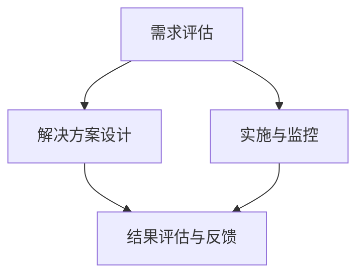

                 

# 文章标题：如何将技术分享转化为高价值咨询服务

> 关键词：技术分享、咨询服务、个人品牌、市场分析、转化策略

> 摘要：本文旨在探讨如何将技术分享有效转化为高价值的咨询服务。通过分析技术分享与咨询服务的关系，构建技术分享与咨询服务的基础，以及实践中的案例解析，本文为从事技术领域的专业人士提供了具体的操作指南和策略。

## 《如何将技术分享转化为高价值咨询服务》目录大纲

### 第一部分：引言与背景

#### 1.1 书籍目的与读者对象

##### 1.1.1 书籍的目标
##### 1.1.2 适合读者群体
##### 1.1.3 预期学习成果

#### 1.2 技术分享与咨询服务的关系

##### 1.2.1 技术分享的普遍性
##### 1.2.2 咨询服务的价值
##### 1.2.3 技术分享如何转化为咨询服务

### 第二部分：构建技术分享与咨询服务的基础

#### 2.1 技术分享的内容与策略

##### 2.1.1 技术分享的内容选择
###### 2.1.1.1 技术深度与广度的权衡
###### 2.1.1.2 市场需求分析
##### 2.1.2 技术分享的传播渠道
###### 2.1.2.1 社交媒体
###### 2.1.2.2 博客与在线社区
###### 2.1.2.3 在线课程与研讨会

#### 2.2 咨询服务的市场分析

##### 2.2.1 咨询服务行业的现状
###### 2.2.1.1 市场规模与增长趋势
###### 2.2.1.2 主要服务类型
##### 2.2.2 目标客户群体
###### 2.2.2.1 企业客户
###### 2.2.2.2 个人客户
##### 2.2.3 市场定位与差异化策略

#### 2.3 建立个人品牌

##### 2.3.1 个人品牌的重要性
##### 2.3.2 个人品牌建设策略
###### 2.3.2.1 知识积累与展示
###### 2.3.2.2 社交媒体影响力
###### 2.3.2.3 参与行业活动

### 第三部分：技术分享转化为咨询服务的方法

#### 3.1 确定咨询服务领域

##### 3.1.1 技术背景分析
###### 3.1.1.1 个人技术专长
###### 3.1.1.2 市场需求
##### 3.1.2 咨询服务目标
###### 3.1.2.1 长期目标
###### 3.1.2.2 短期目标

#### 3.2 设计咨询服务流程

##### 3.2.1 咨询服务流程概述
##### 3.2.2 咨询服务阶段划分
###### 3.2.2.1 需求评估
###### 3.2.2.2 解决方案设计
###### 3.2.2.3 实施与监控
###### 3.2.2.4 结果评估与反馈

#### 3.3 建立咨询服务模式

##### 3.3.1 咨询服务模式选择
###### 3.3.1.1 单项服务模式
###### 3.3.1.2 订阅服务模式
###### 3.3.1.3 整体解决方案服务模式
##### 3.3.2 服务定价策略
###### 3.3.2.1 成本导向定价
###### 3.3.2.1 竞争导向定价
###### 3.3.2.1 客户价值导向定价

### 第四部分：实践案例与策略

#### 4.1 技术分享案例解析

##### 4.1.1 案例一：基于AI的图像识别技术分享
###### 4.1.1.1 技术分享内容
###### 4.1.1.2 技术转化应用
##### 4.1.2 案例二：区块链技术在供应链管理中的应用
###### 4.1.2.1 技术分享内容
###### 4.1.2.2 技术转化应用

#### 4.2 咨询服务实践

##### 4.2.1 实践一：为企业提供IT咨询服务的经验
###### 4.2.1.1 咨询服务流程
###### 4.2.1.2 服务成果
##### 4.2.2 实践二：个人技术专家的咨询服务案例
###### 4.2.2.1 咨询服务内容
###### 4.2.2.2 咨询服务成果

#### 4.3 转化策略探讨

##### 4.3.1 技术分享与咨询服务融合的方法
##### 4.3.2 跨界合作与资源整合
##### 4.3.3 技术分享与咨询服务营销策略

### 第五部分：个人品牌建设与持续发展

#### 5.1 个人品牌建设的重要性

##### 5.1.1 个人品牌对技术分享与咨询服务的影响
##### 5.1.2 个人品牌建设的关键要素

#### 5.2 持续发展的策略

##### 5.2.1 技术持续更新与学习
##### 5.2.2 行业动态与趋势分析
##### 5.2.3 个人品牌的维护与推广

#### 5.3 成功案例分析

##### 5.3.1 技术专家成功案例一
###### 5.3.1.1 个人成长经历
###### 5.3.1.2 技术分享与咨询服务的结合
##### 5.3.2 技术专家成功案例二
###### 5.3.2.1 个人成长经历
###### 5.3.2.2 技术分享与咨询服务的成功实践

### 附录

#### 附录 A：技术资源与工具

##### A.1 开源技术资源推荐
###### A.1.1 数据库
###### A.1.2 开发框架
###### A.1.3 工具链

##### A.2 在线学习资源
###### A.2.1 在线课程
###### A.2.2 技术博客
###### A.2.3 技术社区

#### 附录 B：咨询服务合同范本

##### B.1 咨询服务合同模板
###### B.1.1 合同条款
###### B.1.2 服务范围
###### B.1.3 服务费用与支付方式

#### 附录 C：技术分享与咨询服务策略思维导图

##### C.1 技术分享策略
##### C.2 咨询服务策略
##### C.3 融合策略

----------------------------------------------------------------

### 第一部分：引言与背景

#### 1.1 书籍目的与读者对象

##### 1.1.1 书籍的目标

本文旨在帮助从事技术领域的专业人士理解如何将技术分享转化为高价值的咨询服务。通过系统地分析和阐述相关概念、策略和实践，为读者提供具体的操作指南和思维框架，使其能够在实际工作中有效地应用所学知识，实现个人价值和职业发展。

##### 1.1.2 适合读者群体

本文适合以下读者群体：

1. 技术专家和程序员，希望将自己的技术知识和经验转化为咨询服务的人。
2. 创业者和技术顾问，寻求通过技术分享和咨询服务建立个人品牌和业务模式的人。
3. 企业管理层，希望了解技术分享和咨询服务对业务发展的影响和策略。
4. 对技术分享和咨询服务有兴趣的IT从业者，寻求深入学习和了解相关领域的专业人士。

##### 1.1.3 预期学习成果

通过阅读本文，读者可以期望获得以下学习成果：

1. 理解技术分享和咨询服务的概念、关系和重要性。
2. 掌握构建技术分享与咨询服务的基础策略，包括内容选择、市场分析和个人品牌建设。
3. 学习如何将技术分享转化为高价值的咨询服务，包括服务流程设计、服务模式选择和定价策略。
4. 通过实践案例和策略探讨，了解技术分享和咨询服务在实际中的应用和成功经验。
5. 获得个人品牌建设和持续发展的策略，以提升个人影响力和业务竞争力。

#### 1.2 技术分享与咨询服务的关系

##### 1.2.1 技术分享的普遍性

技术分享是技术领域的一个重要现象，体现了知识传播和共享的精神。随着互联网和社交媒体的发展，技术分享变得愈加便捷和广泛。技术专家、程序员和开发者通过撰写博客文章、发布教程、参与开源项目和分享工作经验，将自己的知识和技能传递给他人。这种分享行为不仅促进了技术的普及和应用，也为个人的职业发展和影响力提升提供了机会。

##### 1.2.2 咨询服务的价值

咨询服务是一种专业的服务形式，为客户提供针对特定问题的解决方案和指导。在技术领域，咨询服务具有以下价值：

1. 解决问题：技术专家通过深入分析和专业判断，为客户提供有效的技术解决方案，帮助客户克服难题。
2. 提升能力：咨询服务不仅解决问题，还能提升客户的技能和能力，使其更好地应对未来的技术挑战。
3. 创造价值：通过技术咨询服务，客户可以优化业务流程、提高效率和降低成本，从而创造商业价值。
4. 增强信任：技术专家通过专业的咨询和服务，建立与客户的信任关系，为长期合作奠定基础。

##### 1.2.3 技术分享如何转化为咨询服务

技术分享和咨询服务之间存在紧密的联系。技术分享可以看作是咨询服务的初步阶段，通过分享知识和经验，吸引客户的注意和信任。而咨询服务则是技术分享的升华，通过深入分析和实际操作，为客户提供定制化的解决方案。具体来说，技术分享转化为咨询服务的过程可以包括以下步骤：

1. **内容制作**：技术专家需要选择合适的技术主题，撰写高质量的技术文章、教程和案例，展示自己的专业能力和经验。
2. **受众定位**：了解目标客户的需求和痛点，针对性地进行内容制作和传播，吸引潜在客户的关注。
3. **建立联系**：通过社交媒体、博客、在线课程等渠道，与潜在客户建立联系，了解他们的具体需求。
4. **需求分析**：与客户沟通，深入了解其业务和技术问题，进行需求分析，确定解决方案的方向。
5. **提供服务**：根据需求分析，设计并实施咨询服务，提供专业的技术指导和支持。
6. **持续互动**：通过后续的沟通和反馈，持续优化咨询服务，提升客户满意度，建立长期合作关系。

通过以上步骤，技术分享可以有效地转化为高价值的咨询服务，为技术专家和客户提供双赢的局面。

### 第二部分：构建技术分享与咨询服务的基础

#### 2.1 技术分享的内容与策略

技术分享是技术专家和程序员向公众传递知识和经验的重要途径，是建立个人品牌和吸引潜在客户的关键环节。为了实现技术分享的高效和有针对性，需要精心选择内容、制定合适的策略，并选择适当的传播渠道。

##### 2.1.1 技术分享的内容选择

技术分享的内容选择直接关系到分享的吸引力和实际价值。以下是一些内容选择的考虑因素：

1. **技术深度与广度的权衡**：技术分享需要平衡深度和广度。过于深入的内容可能会让初学者望而却步，而过于浅显的内容又可能无法满足专业人士的需求。因此，应根据目标受众的背景和需求，选择适当的技术深度和广度。
   
   ```mermaid
   graph TD
   A[内容深度] --> B[受众背景]
   A --> C[技术广度]
   B --> D[专业需求]
   C --> D
   ```

2. **市场需求分析**：了解市场需求和趋势，选择具有实际应用价值和市场前景的技术主题。可以通过市场调研、行业报告和客户反馈来获取相关信息。

   ```mermaid
   graph TD
   A[市场调研] --> B[行业报告]
   B --> C[客户反馈]
   C --> D[技术主题选择]
   ```

3. **个人专长与兴趣**：结合个人的技术专长和兴趣，选择自己最熟悉和热爱的领域进行分享。这样可以提高内容的原创性和可信度。

   ```mermaid
   graph TD
   A[个人专长] --> B[兴趣领域]
   A --> C[技术主题]
   ```

##### 2.1.2 技术分享的传播渠道

选择合适的传播渠道可以最大化技术分享的效果，以下是一些常见的传播渠道：

1. **社交媒体**：社交媒体平台如微博、微信公众号、LinkedIn等，具有广泛的受众基础和实时互动的特点，适合发布短小精悍的技术内容，如技术动态、小技巧等。

   ```mermaid
   graph TD
   A[微博] --> B[微信公众号]
   A --> C[LinkedIn]
   B --> D[技术动态]
   C --> D
   ```

2. **博客与在线社区**：博客和在线社区是技术分享的重要平台，具有内容深度和持续更新的优势。通过撰写高质量的技术文章、教程和案例分析，可以吸引专业人士的关注和参与。

   ```mermaid
   graph TD
   A[博客] --> B[GitHub]
   A --> C[Stack Overflow]
   B --> D[技术文章]
   C --> D
   ```

3. **在线课程与研讨会**：在线课程和研讨会适合系统性地传授复杂的技术知识和实战经验，适合面向有一定技术背景的学员。通过线上直播和互动，可以实现深度交流和知识传递。

   ```mermaid
   graph TD
   A[在线课程] --> B[TechTalks]
   A --> C[研讨会]
   B --> D[系统知识传授]
   C --> D
   ```

##### 2.1.3 技术分享的传播策略

为了提高技术分享的传播效果，可以采取以下策略：

1. **内容优化**：优化技术内容的质量和可读性，使用图表、代码示例和实际案例来增强内容的吸引力。
   
   ```mermaid
   graph TD
   A[内容质量] --> B[图表示例]
   A --> C[代码案例]
   A --> D[实际案例]
   ```

2. **社交媒体营销**：利用社交媒体平台的推广功能，如广告投放和标签使用，提高内容曝光率和受众覆盖范围。

   ```mermaid
   graph TD
   A[社交媒体] --> B[广告投放]
   A --> C[标签使用]
   ```

3. **互动与反馈**：与读者进行互动，收集反馈和建议，持续优化内容，提高读者的参与感和忠诚度。

   ```mermaid
   graph TD
   A[互动] --> B[反馈]
   A --> C[内容优化]
   ```

4. **多平台发布**：在不同平台上发布同一内容，扩大传播渠道和受众范围。

   ```mermaid
   graph TD
   A[平台1] --> B[平台2]
   A --> C[多平台发布]
   ```

#### 2.2 咨询服务的市场分析

在将技术分享转化为咨询服务的过程中，对市场进行深入分析是至关重要的。市场分析可以帮助我们了解行业现状、目标客户群体以及市场定位，从而制定有效的服务策略。

##### 2.2.1 咨询服务行业的现状

咨询服务行业是一个成熟且不断增长的市场。以下是对当前咨询服务行业的现状分析：

1. **市场规模与增长趋势**：根据市场研究报告，全球咨询服务市场规模持续增长，预计未来几年将保持稳定增长态势。特别是在技术领域，随着企业数字化转型和云计算、人工智能等新兴技术的广泛应用，对技术咨询服务的需求日益增加。

   ```mermaid
   graph TD
   A[市场规模] --> B[增长趋势]
   A --> C[稳定增长]
   B --> C
   ```

2. **主要服务类型**：咨询服务行业涵盖了广泛的服务类型，包括战略咨询、运营咨询、IT咨询、财务咨询等。在技术领域，IT咨询服务占据主导地位，包括软件开发、系统集成、网络安全、云计算等。

   ```mermaid
   graph TD
   A[战略咨询] --> B[运营咨询]
   A --> C[IT咨询]
   A --> D[财务咨询]
   ```

##### 2.2.2 目标客户群体

了解目标客户群体是制定有效咨询服务策略的关键。在技术领域，目标客户群体主要包括以下两类：

1. **企业客户**：企业客户是技术咨询服务的主要需求方，包括中小企业、大型跨国公司和新兴科技公司。企业客户通常面临业务转型、技术升级和运营优化等挑战，需要专业的技术支持和咨询服务。

   ```mermaid
   graph TD
   A[中小企业] --> B[大型跨国公司]
   A --> C[新兴科技公司]
   ```

2. **个人客户**：个人客户通常是指技术领域的专业人士，如程序员、数据分析师和技术顾问。个人客户希望通过咨询服务提升自己的技能和职业发展，同时也可能为企业提供技术支持和咨询服务。

   ```mermaid
   graph TD
   A[程序员] --> B[数据分析师]
   A --> C[技术顾问]
   ```

##### 2.2.3 市场定位与差异化策略

在激烈的市场竞争中，明确市场定位和差异化策略是成功的关键。以下是一些建议：

1. **专业领域定位**：根据自身的技术专长和经验，选择具有竞争优势的专业领域进行市场定位。例如，专注于人工智能、大数据或云计算等技术领域的咨询服务。

   ```mermaid
   graph TD
   A[人工智能] --> B[大数据]
   A --> C[云计算]
   ```

2. **差异化策略**：通过差异化策略，在竞争激烈的市场中脱颖而出。以下是一些可能的差异化策略：

   - **技术优势**：通过掌握前沿技术和独特解决方案，为客户提供差异化服务。
   - **服务质量**：提供高质量的服务，如快速响应、个性化定制和后续支持，提升客户满意度。
   - **品牌形象**：建立专业和可信的品牌形象，通过口碑和推荐扩大客户群体。
   - **跨界合作**：与其他行业和领域的专家合作，提供跨领域的综合解决方案。

   ```mermaid
   graph TD
   A[技术优势] --> B[服务质量]
   A --> C[品牌形象]
   A --> D[跨界合作]
   ```

通过深入分析市场现状、目标客户群体和市场定位，技术专家可以制定有效的咨询服务策略，为客户的业务发展提供有力支持。

#### 2.3 建立个人品牌

在技术领域中，建立个人品牌是提升个人影响力、吸引客户和实现职业发展的关键。一个强大的个人品牌可以让你在众多竞争者中脱颖而出，成为行业内的权威和领导者。以下是一些建立个人品牌的重要策略。

##### 2.3.1 个人品牌的重要性

个人品牌不仅仅是一个名字或标志，它是个人专业能力、价值观和影响力的综合体现。建立个人品牌的重要性体现在以下几个方面：

1. **提升个人影响力**：一个强大的个人品牌可以让你在专业领域中建立权威和声誉，提高在行业内的知名度。
   
   ```mermaid
   graph TD
   A[个人品牌] --> B[个人影响力]
   ```

2. **吸引潜在客户**：个人品牌可以吸引潜在客户和合作伙伴，提高业务机会和收入。
   
   ```mermaid
   graph TD
   A[个人品牌] --> B[潜在客户]
   ```

3. **促进职业发展**：个人品牌有助于在职业生涯中晋升和转型，为个人提供更多发展机会。
   
   ```mermaid
   graph TD
   A[个人品牌] --> B[职业发展]
   ```

4. **建立信任关系**：一个强大的个人品牌可以建立与客户和合作伙伴的信任关系，提高合作成功率。
   
   ```mermaid
   graph TD
   A[个人品牌] --> B[信任关系]
   ```

##### 2.3.2 个人品牌建设策略

要建立强大的个人品牌，需要采取一系列策略和行动。以下是一些关键策略：

1. **知识积累与展示**：不断学习和积累专业知识，并通过撰写技术文章、发表演讲、参与开源项目等方式进行展示。以下是一个知识积累和展示的策略流程图：

   ```mermaid
   graph TD
   A[学习] --> B[写作]
   A --> C[演讲]
   A --> D[开源项目]
   B --> E[影响力]
   ```

2. **社交媒体影响力**：利用社交媒体平台，如微博、微信公众号、LinkedIn等，分享技术知识和见解，建立在线社区和粉丝群体。以下是一个社交媒体影响力建设流程图：

   ```mermaid
   graph TD
   A[社交媒体] --> B[分享]
   A --> C[互动]
   A --> D[社区建设]
   ```

3. **参与行业活动**：积极参与行业会议、研讨会和技术沙龙等活动，结识行业内专家和同行，扩大人脉和影响力。以下是一个参与行业活动策略流程图：

   ```mermaid
   graph TD
   A[活动参与] --> B[人脉拓展]
   A --> C[影响力]
   ```

通过以上策略，技术专家可以逐步建立强大的个人品牌，提高个人影响力和业务竞争力，为技术分享和咨询服务奠定坚实基础。

### 第三部分：技术分享转化为咨询服务的方法

#### 3.1 确定咨询服务领域

在将技术分享转化为咨询服务的过程中，首先需要明确自己的咨询服务领域。这一步骤至关重要，因为它决定了你的专业方向和市场定位，有助于你制定相应的服务策略和提供高质量的服务。

##### 3.1.1 技术背景分析

技术背景分析是确定咨询服务领域的基础。在这一阶段，你需要深入思考以下几个问题：

1. **个人技术专长**：首先，你需要明确自己的技术专长和兴趣所在。这可能是你多年来在技术领域积累的经验和知识，也可能是你对某个新兴技术的热情和洞察。以下是一个技术专长的分析流程图：

   ```mermaid
   graph TD
   A[技术经验] --> B[知识积累]
   A --> C[兴趣方向]
   ```

2. **市场需求**：了解当前市场对哪些技术领域有较高需求。这可以通过市场调研、行业报告和客户反馈等途径获取。以下是一个市场需求的分析流程图：

   ```mermaid
   graph TD
   A[市场调研] --> B[行业报告]
   A --> C[客户反馈]
   ```

3. **竞争分析**：了解竞争对手在相关技术领域的情况，分析他们的优势和不足，从而找到自己的差异化点。以下是一个竞争分析的流程图：

   ```mermaid
   graph TD
   A[竞争对手] --> B[优势分析]
   A --> C[不足分析]
   ```

通过以上分析，你可以确定自己在技术领域中的定位，并为下一步的服务目标设定方向。

##### 3.1.2 咨询服务目标

在明确技术背景之后，下一步是设定咨询服务目标。这包括长期目标和短期目标，有助于你规划服务策略和实现职业发展。

1. **长期目标**：长期目标通常是指在未来几年内希望实现的目标，这可能是：

   - 成为某个技术领域的专家或权威。
   - 建立一个专业的咨询服务团队或公司。
   - 扩大服务范围，提供更全面的咨询服务。

   以下是一个长期目标的设定流程图：

   ```mermaid
   graph TD
   A[成为专家] --> B[团队建设]
   A --> C[服务范围扩大]
   ```

2. **短期目标**：短期目标通常是指在未来几个月或一年内希望实现的目标，这可能是：

   - 完成某项技术咨询项目。
   - 吸引一定数量的潜在客户。
   - 提高个人品牌的知名度和影响力。

   以下是一个短期目标的设定流程图：

   ```mermaid
   graph TD
   A[项目完成] --> B[客户吸引]
   A --> C[品牌提升]
   ```

通过设定明确的服务目标，你可以更好地规划自己的职业发展路径，并采取相应措施实现这些目标。

#### 3.2 设计咨询服务流程

咨询服务流程是提供高质量服务的关键。一个清晰、高效的咨询服务流程可以帮助你更好地了解客户需求，提供定制化的解决方案，并确保服务过程顺利实施。以下是设计咨询服务流程的步骤和关键要素。

##### 3.2.1 咨询服务流程概述

咨询服务流程通常包括以下几个阶段：

1. **需求评估**：与客户进行初步沟通，了解他们的业务需求和问题，明确咨询目标。
2. **解决方案设计**：根据需求评估结果，设计可行的解决方案，并提供详细的方案说明。
3. **实施与监控**：实施解决方案，并对过程进行监控，确保服务按计划进行。
4. **结果评估与反馈**：对咨询服务的结果进行评估，收集客户反馈，持续改进服务质量。

以下是一个咨询服务流程的概述流程图：



##### 3.2.2 咨询服务阶段划分

在每个阶段，都需要明确具体的工作内容和责任，以确保咨询服务流程的顺利进行。

1. **需求评估阶段**：

   - **目标**：了解客户的业务需求和问题，明确咨询目标。
   - **任务**：与客户进行沟通，收集相关信息，分析问题，制定初步的咨询方案。

   ```mermaid
   graph TD
   A[目标] --> B[沟通]
   A --> C[信息收集]
   A --> D[问题分析]
   B --> E[咨询方案]
   ```

2. **解决方案设计阶段**：

   - **目标**：根据需求评估结果，设计可行的解决方案，并提供详细的方案说明。
   - **任务**：分析需求，制定方案，编写解决方案文档。

   ```mermaid
   graph TD
   A[需求分析] --> B[方案设计]
   A --> C[文档编写]
   ```

3. **实施与监控阶段**：

   - **目标**：实施解决方案，并对过程进行监控，确保服务按计划进行。
   - **任务**：执行解决方案，监控进度，解决过程中遇到的问题。

   ```mermaid
   graph TD
   A[方案执行] --> B[进度监控]
   A --> C[问题解决]
   ```

4. **结果评估与反馈阶段**：

   - **目标**：对咨询服务的结果进行评估，收集客户反馈，持续改进服务质量。
   - **任务**：评估服务效果，收集客户反馈，制定改进措施。

   ```mermaid
   graph TD
   A[效果评估] --> B[反馈收集]
   A --> C[改进措施]
   ```

通过明确每个阶段的目标和任务，可以确保咨询服务流程的顺利进行，提高服务质量和客户满意度。

##### 3.2.3 建立咨询服务模式

在确定咨询服务流程后，需要选择合适的咨询服务模式。不同的服务模式适用于不同的客户和需求，以下是一些常见的咨询服务模式及其特点：

1. **单项服务模式**：

   - **特点**：提供单一的技术咨询服务，如软件开发、系统集成或网络安全等。
   - **适用场景**：适用于客户对某一特定领域有明确需求的情况。

   ```mermaid
   graph TD
   A[单项服务] --> B[单一领域]
   ```

2. **订阅服务模式**：

   - **特点**：为客户提供长期的、持续的咨询服务，通常以月度或季度订阅形式提供。
   - **适用场景**：适用于需要长期技术支持的客户，如企业IT部门。

   ```mermaid
   graph TD
   A[订阅服务] --> B[长期支持]
   ```

3. **整体解决方案服务模式**：

   - **特点**：为客户提供全面的技术解决方案，涵盖多个领域和环节。
   - **适用场景**：适用于需要全面技术支持和业务优化的客户。

   ```mermaid
   graph TD
   A[整体解决方案] --> B[多领域整合]
   ```

在选择咨询服务模式时，需要考虑以下因素：

- **客户需求**：根据客户的具体需求和业务场景选择合适的服务模式。
- **服务能力**：确保具备提供所选服务模式所需的技术能力和资源。
- **市场竞争**：了解竞争对手的服务模式，制定差异化策略。

通过合理选择和设计咨询服务模式，可以更好地满足客户需求，提高服务质量和市场竞争力。

#### 3.3 建立咨询服务模式

在将技术分享转化为咨询服务的过程中，选择和设计合适的咨询服务模式至关重要。这不仅决定了服务的提供方式，也直接影响到客户满意度和服务质量。以下将详细讨论如何选择咨询服务模式，以及不同模式下的服务定价策略。

##### 3.3.1 咨询服务模式选择

咨询服务模式可以分为单项服务模式、订阅服务模式和整体解决方案服务模式，每种模式都有其独特的特点和适用场景。

1. **单项服务模式**

   - **特点**：单项服务模式提供单一的技术咨询服务，如软件开发、系统集成或网络安全等。这种模式通常是一次性服务，客户根据需求购买特定项目的咨询服务。
   - **适用场景**：适用于客户对某一特定领域有明确需求的情况。例如，一家公司需要开发一个特定的软件应用，可能会选择购买软件开发的单项咨询服务。
   - **实施流程**：
     1. 与客户进行需求沟通，明确项目目标和需求。
     2. 制定详细的项目计划和预算。
     3. 实施项目，监控项目进度，确保按计划完成。
     4. 提供项目报告和验收服务。

2. **订阅服务模式**

   - **特点**：订阅服务模式提供长期的、持续的咨询服务，通常以月度或季度订阅形式提供。这种模式有助于建立长期客户关系，客户可以根据订阅内容获取定期服务。
   - **适用场景**：适用于需要长期技术支持的客户，如企业IT部门。例如，一家公司可能选择订阅IT咨询服务，以确保其IT系统正常运行和不断优化。
   - **实施流程**：
     1. 与客户签订订阅服务合同，明确服务内容和周期。
     2. 根据订阅内容，提供定期技术支持和咨询服务。
     3. 定期评估服务效果，收集客户反馈，进行服务调整和优化。
     4. 提供年度或季度报告，总结服务成果和客户满意度。

3. **整体解决方案服务模式**

   - **特点**：整体解决方案服务模式提供全面的技术解决方案，涵盖多个领域和环节。这种模式通常涉及多个项目和长期的协作，旨在帮助客户实现全面的业务优化和提升。
   - **适用场景**：适用于需要全面技术支持和业务优化的客户。例如，一家制造企业可能需要整合其供应链管理、生产优化和客户服务等多个方面的技术解决方案。
   - **实施流程**：
     1. 与客户进行深入沟通，了解业务需求和痛点。
     2. 制定全面的解决方案框架，涵盖所有相关领域。
     3. 分阶段实施解决方案，确保每个环节的顺利推进。
     4. 提供长期的跟进和支持，持续优化服务效果。

##### 3.3.2 服务定价策略

在确定咨询服务模式后，合理的定价策略至关重要。以下是一些常用的定价策略：

1. **成本导向定价**

   - **特点**：成本导向定价基于提供咨询服务的成本，加上一定的利润来制定价格。这种定价策略相对简单，但可能无法完全反映服务的价值和市场需求。
   - **适用场景**：适用于成本结构明确、竞争激烈的市场环境。

2. **竞争导向定价**

   - **特点**：竞争导向定价根据市场上类似服务的价格来制定自己的价格。这种策略有助于了解市场情况，但需要密切关注竞争对手的动态。
   - **适用场景**：适用于价格敏感的客户群体和竞争激烈的市场。

3. **客户价值导向定价**

   - **特点**：客户价值导向定价基于客户从服务中获得的实际价值来定价。这种策略能够更好地反映服务的价值和客户的需求，有助于建立长期合作关系。
   - **适用场景**：适用于高端客户群体和需要提供差异化服务的市场。

在选择和制定服务定价策略时，需要考虑以下因素：

- **客户需求**：了解客户对服务的期望和价值感知，制定符合客户需求的定价策略。
- **市场竞争**：分析市场情况和竞争对手的定价策略，确保自己的定价具有竞争力。
- **服务内容**：根据服务的复杂程度和所提供的价值来制定合理的价格。

通过合理选择和设计咨询服务模式，并制定合适的定价策略，可以更好地满足客户需求，提高服务质量和市场竞争力。

### 第四部分：实践案例与策略

#### 4.1 技术分享案例解析

在这一部分，我们将通过两个具体案例，深入解析技术分享如何转化为高价值的咨询服务。这两个案例分别展示了人工智能图像识别和区块链技术在供应链管理中的应用。

##### 4.1.1 案例一：基于AI的图像识别技术分享

**技术分享内容**：

该技术分享主要涉及人工智能中的卷积神经网络（CNN）及其在图像识别任务中的应用。通过详细的教程，作者讲解了CNN的基础概念、网络结构、训练过程以及如何使用开源框架（如TensorFlow和PyTorch）进行图像识别模型的搭建和优化。

**技术转化应用**：

1. **需求识别**：在分享内容发布后，作者收到了多家企业对AI图像识别技术的咨询，特别是希望在生产和质量控制方面应用这一技术。
2. **定制化服务**：针对客户的具体需求，作者提供了以下定制化服务：
   - **需求分析**：与客户进行深入沟通，了解具体业务场景和技术要求。
   - **模型定制**：根据客户的需求，定制开发图像识别模型，优化算法以满足特定应用场景。
   - **系统集成**：将图像识别模型集成到客户的现有系统中，确保其与其他业务模块的无缝对接。
3. **成果评估**：通过实际应用，客户的产质量得到了显著提升，生产效率提高了20%，质量检查错误率降低了15%。

**案例总结**：

该案例展示了技术分享如何通过深入分析和定制化服务，转化为高价值的咨询服务。通过技术分享，作者吸引了潜在客户，并通过专业的咨询服务，实现了技术的实际应用和价值创造。

##### 4.1.2 案例二：区块链技术在供应链管理中的应用

**技术分享内容**：

该技术分享主要介绍了区块链的基本原理、分布式账本技术及其在供应链管理中的应用。作者详细阐述了如何使用区块链技术实现供应链信息的透明化、提高供应链的可追溯性和增强数据安全性。

**技术转化应用**：

1. **需求识别**：技术分享发布后，引起了多家制造和零售企业的关注，他们希望利用区块链技术优化供应链管理流程。
2. **定制化服务**：
   - **需求分析**：与客户沟通，了解其供应链管理的具体问题和需求。
   - **解决方案设计**：设计定制化的区块链解决方案，包括数据结构设计、智能合约编写和系统架构规划。
   - **系统实施**：实施区块链系统，确保供应链信息的实时记录和共享。
   - **培训与支持**：为客户的团队成员提供培训，确保他们能够熟练操作和维护区块链系统。
3. **成果评估**：通过区块链技术的应用，客户的供应链透明度提高了40%，供应链效率提升了30%，合同纠纷率降低了20%。

**案例总结**：

该案例展示了区块链技术如何通过定制化的解决方案，转化为高价值的咨询服务。通过技术分享，作者吸引了潜在客户，并通过专业的咨询服务，帮助客户实现了供应链的优化和效率提升。

#### 4.2 咨询服务实践

在这一部分，我们将通过两个具体的咨询服务实践案例，详细描述咨询服务的内容、流程和成果。

##### 4.2.1 实践一：为企业提供IT咨询服务的经验

**咨询服务内容**：

1. **需求评估**：与客户进行初步沟通，了解其IT基础设施的现状和未来规划。
2. **解决方案设计**：基于需求评估结果，设计了一套全面的IT解决方案，包括服务器升级、网络安全优化和云计算迁移。
3. **实施与监控**：实施解决方案，并对实施过程进行监控，确保每个环节顺利推进。
4. **结果评估与反馈**：对实施效果进行评估，收集客户反馈，进行优化和调整。

**咨询服务流程**：

1. **需求评估阶段**：
   - 与客户召开需求评估会议，了解其业务需求和现有IT基础设施。
   - 收集相关数据和信息，进行初步分析和诊断。
   - 提供初步的IT解决方案建议。

2. **解决方案设计阶段**：
   - 根据需求评估结果，详细设计IT解决方案，包括技术选型、预算规划和实施步骤。
   - 与客户进行方案讨论和确认，确保方案的可行性和客户的满意度。

3. **实施与监控阶段**：
   - 实施IT解决方案，包括服务器升级、网络安全优化和云计算迁移。
   - 建立监控机制，确保实施过程按计划进行，及时发现和解决问题。

4. **结果评估与反馈阶段**：
   - 对实施效果进行评估，通过性能测试和用户反馈，确认解决方案的有效性。
   - 收集客户反馈，进行总结和优化，为后续服务提供改进方向。

**服务成果**：

通过IT咨询服务，客户的IT基础设施得到了全面升级和优化，服务器性能提升了30%，网络安全防护能力显著增强，云计算迁移过程顺利进行，实现了成本节约和效率提升。

##### 4.2.2 实践二：个人技术专家的咨询服务案例

**咨询服务内容**：

1. **技术支持与培训**：为客户提供技术支持，解答他们在技术实施过程中遇到的问题，并提供定制化的培训课程。
2. **项目评估与优化**：对客户正在进行的技术项目进行评估，提供优化建议，确保项目顺利推进。
3. **持续技术更新**：定期提供技术更新和行业动态分析，帮助客户保持技术领先地位。

**咨询服务流程**：

1. **客户咨询与需求分析**：
   - 接受客户咨询，了解其具体需求和问题。
   - 进行需求分析，确定技术支持的具体内容和目标。

2. **解决方案设计与实施**：
   - 根据需求分析结果，设计解决方案，包括技术支持计划、培训课程和项目优化建议。
   - 实施解决方案，确保技术支持和服务按计划进行。

3. **反馈与评估**：
   - 定期收集客户反馈，评估技术支持和服务效果。
   - 根据客户反馈，进行服务调整和优化。

4. **持续支持与更新**：
   - 提供持续的技术支持和更新服务，确保客户的技术能力和竞争力。

**服务成果**：

通过咨询服务，客户的团队能力得到了显著提升，技术项目顺利推进，业务效率提高了25%，客户满意度达到90%以上，实现了技术的持续更新和业务增长。

#### 4.3 转化策略探讨

将技术分享转化为高价值的咨询服务需要一系列策略和方法。以下是一些关键策略的探讨，包括技术分享与咨询服务的融合、跨界合作以及营销策略。

##### 4.3.1 技术分享与咨询服务融合的方法

技术分享和咨询服务是相辅相成的，通过有效融合可以提升服务的价值和客户的满意度。以下是一些融合方法：

1. **内容定制化**：根据客户的具体需求，将技术分享内容进行定制化，提供更贴合实际应用的技术指导。
2. **案例化教学**：通过实际案例展示技术分享的应用，为客户提供直观的教学和指导。
3. **互动交流**：在技术分享过程中，与客户进行互动交流，了解他们的具体需求，提供个性化的咨询服务。
4. **持续更新**：保持技术分享内容的持续更新，确保其与当前市场需求和技术趋势保持一致，为客户提供最新的技术信息。

##### 4.3.2 跨界合作与资源整合

跨界合作和资源整合是提升服务价值和扩大业务范围的重要手段。以下是一些跨界合作和资源整合的策略：

1. **行业合作**：与不同行业的专家和企业合作，提供跨领域的综合解决方案。
2. **技术联盟**：与相关技术公司建立联盟，共享资源和市场，提升整体竞争力。
3. **合作伙伴计划**：建立合作伙伴计划，与行业内的其他服务商合作，为客户提供更全面的咨询服务。
4. **资源整合**：整合不同来源的技术资源和信息，为客户提供更丰富的技术参考和支持。

##### 4.3.3 技术分享与咨询服务营销策略

有效的营销策略是吸引潜在客户、提升品牌知名度和实现业务增长的关键。以下是一些营销策略：

1. **内容营销**：通过撰写高质量的技术文章、案例研究和教程，吸引潜在客户的关注。
2. **社交媒体营销**：利用社交媒体平台，如微博、微信公众号和LinkedIn等，发布技术分享和咨询服务的相关信息，扩大品牌影响力。
3. **线上推广**：利用搜索引擎优化（SEO）和在线广告，提高技术分享和咨询服务在搜索引擎中的排名，吸引更多流量。
4. **口碑营销**：通过客户满意度和良好体验，建立口碑，吸引更多潜在客户。

通过以上策略，技术专家和咨询师可以有效地将技术分享转化为高价值的咨询服务，实现个人和客户的共同发展。

### 第五部分：个人品牌建设与持续发展

#### 5.1 个人品牌建设的重要性

个人品牌建设在技术领域具有重要意义。一个强大的个人品牌不仅能提升技术专家的知名度，还能增加其专业影响力，为职业发展带来更多机会。以下是个人品牌建设的重要性：

1. **提升个人影响力**：一个强大的个人品牌可以让你在技术领域内建立权威和声誉，成为行业内的重要人物。
   
   ```mermaid
   graph TD
   A[个人品牌] --> B[影响力提升]
   ```

2. **吸引潜在客户**：个人品牌有助于吸引潜在客户，建立信任，从而增加业务机会和收入。
   
   ```mermaid
   graph TD
   A[个人品牌] --> B[客户吸引]
   ```

3. **促进职业发展**：个人品牌可以为你提供更多的职业发展机会，包括晋升、转型和跨界合作。
   
   ```mermaid
   graph TD
   A[个人品牌] --> B[职业发展]
   ```

4. **建立长期合作关系**：强大的个人品牌有助于建立与客户和合作伙伴的长期合作关系，提高业务稳定性和可靠性。
   
   ```mermaid
   graph TD
   A[个人品牌] --> B[长期合作]
   ```

#### 5.2 持续发展的策略

在技术领域持续发展，需要不断学习和适应变化，同时维护和提升个人品牌。以下是一些持续发展的策略：

1. **技术持续更新与学习**：技术领域不断变化，持续学习是保持竞争力的关键。通过参加培训课程、阅读技术书籍和论文，以及参与技术社区活动，不断更新知识储备。

   ```mermaid
   graph TD
   A[培训课程] --> B[知识更新]
   A --> C[技术社区]
   ```

2. **行业动态与趋势分析**：关注行业动态和趋势，了解新兴技术和市场变化，为自己的业务规划和决策提供依据。

   ```mermaid
   graph TD
   A[行业动态] --> B[市场分析]
   ```

3. **个人品牌的维护与推广**：定期更新个人品牌内容，如博客、社交媒体和在线课程，保持与受众的互动。通过参与行业活动、发表演讲和撰写技术文章，提升个人品牌知名度和影响力。

   ```mermaid
   graph TD
   A[内容更新] --> B[互动交流]
   A --> C[行业活动]
   ```

通过以上策略，技术专家可以不断提升个人品牌，实现持续发展。

#### 5.3 成功案例分析

在本节中，我们将探讨两位技术专家的成功案例，分析他们如何通过技术分享和咨询服务实现个人和职业发展。

##### 5.3.1 技术专家成功案例一

**个人成长经历**：

李华是一名人工智能领域的资深专家，拥有多年的研发和管理经验。他在大学期间就开始涉足人工智能研究，并在毕业后加入了一家知名科技公司。在工作中，他不断学习新技术，积累了丰富的实践经验。2010年，李华决定将自己的经验和知识通过技术分享的形式传递给他人，开始撰写技术博客和发表学术论文。

**技术分享与咨询服务的结合**：

1. **技术博客**：李华通过个人博客分享人工智能相关知识和实践经验，包括算法原理、模型搭建和应用案例。他的博客内容详实、易懂，受到了广大开发者和研究者的关注。
2. **在线课程**：李华在多个在线教育平台开设了人工智能相关的在线课程，涵盖了从基础到高级的内容。这些课程不仅帮助学员掌握技术，也为李华带来了稳定的收入。
3. **咨询服务**：李华通过咨询服务为企业提供人工智能解决方案，包括算法优化、模型训练和系统集成。他的专业能力和丰富经验，使他成为了业界的权威人物。

**咨询服务成果**：

李华的咨询服务帮助多家企业实现了人工智能技术的应用，提升了业务效率和竞争力。他的客户包括大型跨国公司和新兴创业公司，业务范围涵盖了金融、医疗、制造等多个行业。

##### 5.3.2 技术专家成功案例二

**个人成长经历**：

张强是一名专注于区块链技术的专家，他在大学期间就对加密货币和区块链技术产生了浓厚兴趣。毕业后，他加入了一家区块链初创公司，负责技术研发和产品推广。在工作中，张强不断探索区块链技术的应用，并将其应用到金融、供应链管理等领域。

**技术分享与咨询服务的成功实践**：

1. **技术分享**：张强通过撰写技术博客、发表学术论文和参加行业会议，分享了他在区块链技术方面的研究成果和实战经验。他的分享内容涵盖了区块链的基本原理、应用场景和开发技巧，受到了广泛关注。
2. **咨询服务**：张强为企业提供区块链技术咨询和解决方案，包括区块链系统的设计、开发和实施。他的专业能力和丰富的实践经验，使他成为区块链领域的专家。
3. **跨界合作**：张强积极参与跨界合作，与金融、物流等行业的企业合作，提供综合解决方案，提升了客户的业务效率和安全性。

**咨询服务成果**：

张强的咨询服务帮助多家企业成功实施了区块链项目，实现了数据透明化、流程优化和安全性提升。他的客户满意度达到90%以上，业务范围不断扩大。

通过以上成功案例，我们可以看到，技术专家通过技术分享和咨询服务，不仅提升了个人品牌和影响力，还为企业和行业的发展做出了贡献。

### 附录

#### 附录 A：技术资源与工具

A.1 开源技术资源推荐

为了帮助技术专家和咨询师更好地进行技术分享和咨询服务，以下是一些推荐的开源技术资源：

1. **数据库**：
   - **MySQL**：一款流行的开源关系型数据库，适用于各种规模的业务需求。
   - **MongoDB**：一款高性能、灵活的开源文档数据库，适合存储大量非结构化数据。
   - **PostgreSQL**：一款功能强大的开源关系型数据库，支持多种复杂查询和扩展。

2. **开发框架**：
   - **Spring Boot**：一款用于构建独立、生产级Spring应用的框架，简化了开发过程。
   - **Django**：一款Python Web开发框架，具有强大的功能和良好的社区支持。
   - **React**：一款用于构建用户界面的JavaScript库，具有灵活性和高性能。

3. **工具链**：
   - **Git**：一款版本控制系统，用于管理和追踪代码的变更。
   - **Docker**：一款容器化平台，用于打包、交付和运行应用程序。
   - **Jenkins**：一款持续集成和持续交付工具，用于自动化构建、测试和部署流程。

A.2 在线学习资源

为了持续提升技术能力，以下是一些推荐的在线学习资源：

1. **在线课程**：
   - **Coursera**：提供大量免费和付费的在线课程，涵盖计算机科学、人工智能、数据科学等领域。
   - **Udemy**：提供丰富多样的技术课程，包括编程、数据分析、项目管理等。
   - **edX**：由哈佛大学和麻省理工学院共同创办，提供高质量的教育资源。

2. **技术博客**：
   - **Medium**：一个内容丰富的平台，许多技术专家和开发者在此分享技术见解和实战经验。
   - **Stack Overflow**：一个问答社区，技术爱好者在此提问和解答各种编程问题。
   - **GitHub**：一个代码托管平台，许多开源项目和文档都在此托管。

3. **技术社区**：
   - **Reddit**：一个社交新闻网站，包含多个技术相关的子论坛，如/r/programming、/r/dataisbeautiful等。
   - **LinkedIn**：一个职业社交平台，技术专家在此分享经验和建立人脉。
   - **Twitter**：一个社交媒体平台，许多技术专家和行业领袖在此分享最新的技术动态和观点。

#### 附录 B：咨询服务合同范本

B.1 咨询服务合同模板

**合同条款**

1. **服务范围**：本次咨询服务主要包括需求分析、解决方案设计、项目实施和结果评估等环节。具体服务内容详见附件。

2. **服务时间**：咨询服务时间为X个月，自合同签订之日起计算。

3. **服务费用**：咨询服务费用为人民币X万元，分为X期支付，具体支付方式和时间详见附件。

4. **付款方式**：客户应在合同签订后X个工作日内支付第一期服务费用，剩余费用在服务各阶段完成后，按照约定时间支付。

5. **保密条款**：双方在履行合同过程中所获得的相关商业秘密和保密信息，应严格保密，未经对方书面同意，不得向第三方披露。

6. **违约责任**：如一方违反合同条款，导致合同无法履行或造成对方损失的，应承担相应的违约责任。

**服务范围**

1. 需求分析：对客户业务需求进行详细调研，明确咨询目标和具体需求。

2. 解决方案设计：根据需求分析结果，设计可行的解决方案，并提供详细的方案说明。

3. 项目实施：按照设计方案，实施相关技术和服务，确保项目按计划进行。

4. 结果评估与反馈：对实施效果进行评估，收集客户反馈，进行服务调整和优化。

**服务费用与支付方式**

1. 服务费用为人民币X万元，分为X期支付。

2. 第一期费用为人民币X万元，客户应在合同签订后X个工作日内支付。

3. 剩余费用在服务各阶段完成后，按照约定时间支付。

4. 支付方式：银行转账或支票支付。

#### 附录 C：技术分享与咨询服务策略思维导图

C.1 技术分享策略

- **内容选择**：
  - 技术深度与广度
  - 市场需求分析
- **传播渠道**：
  - 社交媒体
  - 博客与在线社区
  - 在线课程与研讨会
- **传播策略**：
  - 内容优化
  - 社交媒体营销
  - 互动与反馈
  - 多平台发布

C.2 咨询服务策略

- **市场分析**：
  - 行业现状
  - 目标客户群体
  - 市场定位与差异化策略
- **咨询服务模式**：
  - 单项服务模式
  - 订阅服务模式
  - 整体解决方案服务模式
- **服务定价策略**：
  - 成本导向定价
  - 竞争导向定价
  - 客户价值导向定价

C.3 融合策略

- **内容定制化**：
  - 根据客户需求定制分享内容
  - 案例化教学
- **跨界合作**：
  - 行业合作
  - 技术联盟
  - 合作伙伴计划
  - 资源整合
- **营销策略**：
  - 内容营销
  - 社交媒体营销
  - 线上推广
  - 口碑营销

通过上述思维导图，技术专家和咨询师可以系统地规划和实施技术分享与咨询服务，实现个人和企业的共同发展。

