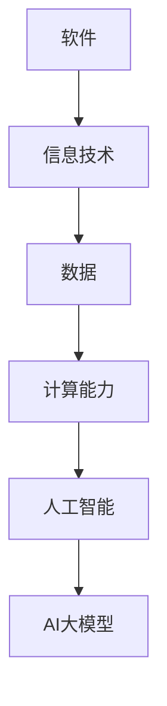
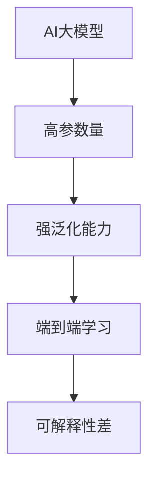
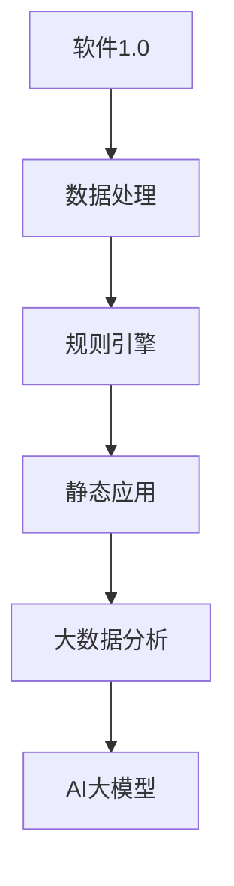

                 

# 如何将技术洞察转化为高端技术沙龙

## 关键词

- 技术洞察
- 技术沙龙
- 技术交流
- 技术传播
- 技术推广
- 技术创新

## 摘要

本文将探讨如何将技术洞察转化为高端技术沙龙，通过深入剖析技术原理、核心算法和数学模型，结合实际项目案例，提出一套系统化的方法。文章首先介绍了软件与人工智能（AI）的关系，以及AI大模型的特点和演变过程。随后，详细讲解了深度学习、卷积神经网络（CNN）、生成对抗网络（GAN）等核心算法原理。接着，通过手写数字识别项目实战，展示了如何将理论知识应用到实践中。最后，对代码进行解读与分析，提供了项目实战的详细步骤。通过这篇文章，读者可以了解到如何有效地将技术洞察转化为高端技术沙龙，提升技术传播与交流的效果。

### 第一部分：核心概念与联系

#### 1.1.1 软件与AI的关系

软件是计算机系统中的核心组成部分，它为用户提供了各种功能和服务。而人工智能（AI）则是近年来迅速发展的一个领域，其核心目的是让计算机具备类似人类的智能。随着计算能力的提升和算法的进步，人工智能逐渐融入软件，改变了软件的发展方向。

- **信息技术**：信息技术的核心是数据，包括数据的采集、存储、处理和分析。传统的软件往往侧重于数据的处理和展示，而人工智能则将数据作为输入，通过算法对数据进行分析，提取出有价值的信息。

- **计算能力**：计算能力的提升为人工智能的发展提供了坚实的基础。随着硬件设备的性能增强和计算资源的丰富，人工智能算法得以运行得更加高效和精准。

- **人工智能大模型**：人工智能大模型是指具有数百万、数亿甚至数万亿参数的深度学习模型。这些模型通过端到端学习实现了强大的泛化能力，能够处理复杂的问题。随着AI大模型的普及，新一代软件架构逐渐形成。

Mermaid流程图如下：



#### 1.1.2 AI大模型特点

AI大模型具有以下几个显著特点：

- **高参数量**：AI大模型拥有数百万、数亿甚至数万亿个参数，这使得模型能够捕捉到数据中的细微特征，从而实现更高的准确性。

- **强泛化能力**：端到端学习使得AI大模型能够从海量数据中学习，从而具备很强的泛化能力，能够应对各种复杂的任务。

- **端到端学习**：AI大模型通过端到端学习实现了数据的直接映射，无需人为设计复杂的特征工程。

- **可解释性差**：由于AI大模型的结构复杂，参数众多，导致其内部决策过程难以解释，这是AI大模型面临的一个主要挑战。

Mermaid流程图如下：



#### 1.1.3 软件到AI大模型演变

软件从1.0时代到AI大模型时代，经历了以下几个阶段：

- **数据处理**：1.0时代的软件主要侧重于数据的处理和存储，如关系数据库和文件系统。

- **规则引擎**：2.0时代的软件引入了规则引擎，通过预定义的规则对数据进行处理，如业务规则引擎和决策支持系统。

- **静态应用**：3.0时代的软件实现了静态应用，如基于Web的前后端分离架构。

- **大数据分析**：4.0时代的软件开始处理大数据，利用分布式计算框架如Hadoop和Spark进行数据分析。

- **AI大模型**：5.0时代的软件融合了人工智能，以AI大模型为核心，实现了智能化的数据处理和决策。

Mermaid流程图如下：



### 第二部分：核心算法原理讲解

#### 2.1.1 深度学习基础

深度学习是人工智能的核心技术之一，其基本结构包括输入层、隐藏层和输出层。通过多层的神经网络结构，深度学习能够从数据中自动提取特征，实现复杂的模式识别和预测任务。

**神经网络基本结构**：

```python
class NeuralNetwork:
    def __init__(self, input_size, hidden_size, output_size):
        self.input_size = input_size
        self.hidden_size = hidden_size
        self.output_size = output_size
        
        # 初始化权重
        self.weights = {
            'input_to_hidden': np.random.randn(input_size, hidden_size),
            'hidden_to_output': np.random.randn(hidden_size, output_size)
        }

    def forward(self, x):
        # 输入到隐藏层
        hidden_layer_input = np.dot(x, self.weights['input_to_hidden'])
        hidden_layer_output = activation_function(hidden_layer_input)
        
        # 隐藏层到输出层
        output_layer_input = np.dot(hidden_layer_output, self.weights['hidden_to_output'])
        output_layer_output = activation_function(output_layer_input)
        
        return output_layer_output

# 激活函数
def activation_function(x):
    return 1 / (1 + np.exp(-x))
```

**深度学习工作原理**：

1. **前向传播**：将输入数据通过神经网络传递，逐层计算输出。
2. **损失函数**：计算预测值与真实值之间的差距，常用损失函数有均方误差（MSE）和交叉熵（Cross-Entropy）。
3. **反向传播**：根据损失函数的梯度，更新网络权重，优化模型参数。

#### 2.1.2 卷积神经网络（CNN）

卷积神经网络（CNN）是专门用于处理图像数据的一种神经网络结构，其核心思想是利用卷积操作和池化操作提取图像特征。

**CNN基本结构**：

```python
class ConvolutionalNeuralNetwork:
    def __init__(self, input_shape, num_filters, filter_size, pool_size):
        self.input_shape = input_shape
        self.num_filters = num_filters
        self.filter_size = filter_size
        self.pool_size = pool_size
        
        # 初始化权重
        self.conv_weights = {
            'conv1': np.random.randn(self.input_shape[0], self.num_filters, self.filter_size, self.filter_size)
        }
        self.fc_weights = {
            'fc1': np.random.randn(self.input_shape[0] // self.pool_size[0] // self.pool_size[1], 10)
        }

    def forward(self, x):
        # 卷积层
        conv_output = conv2d_forward(x, self.conv_weights['conv1'])
        pool_output = max_pool2d_forward(conv_output, self.pool_size)
        
        # 全连接层
        fc_input = pool_output.flatten()
        fc_output = np.dot(fc_input, self.fc_weights['fc1'])
        output = activation_function(fc_output)
        
        return output

# 卷积操作
def conv2d_forward(x, w):
    # ...
    return output

# 池化操作
def max_pool2d_forward(x, pool_size):
    # ...
    return output

# 激活函数
def activation_function(x):
    return 1 / (1 + np.exp(-x))
```

**CNN工作原理**：

1. **卷积层**：通过卷积操作提取图像的局部特征。
2. **池化层**：通过池化操作降低特征图的维度，增强模型的泛化能力。
3. **全连接层**：将池化层输出的特征图展平为一维数组，通过全连接层进行分类。

#### 2.1.3 生成对抗网络（GAN）

生成对抗网络（GAN）是近年来发展迅速的一种深度学习模型，其核心思想是通过生成器和判别器的对抗训练，实现高质量的数据生成。

**GAN基本结构**：

```python
class GenerativeAdversarialNetwork:
    def __init__(self, generator, discriminator):
        self.generator = generator
        self.discriminator = discriminator

    def train(self, x, y, num_epochs):
        # ...
        return generator, discriminator

# 生成器
def generator(z, weights):
    # ...
    return x_generated

# 判别器
def discriminator(x, weights):
    # ...
    return probability_of_real
```

**GAN工作原理**：

1. **生成器**：生成器从噪声数据中生成伪造的数据，目标是让判别器无法区分真实数据和伪造数据。
2. **判别器**：判别器的目标是正确分类输入的数据，区分真实数据和伪造数据。
3. **对抗训练**：生成器和判别器相互对抗，生成器不断优化生成质量，判别器不断优化分类能力。

### 第三部分：数学模型和数学公式讲解

数学模型和公式是深度学习等人工智能技术的基石，它们用于描述模型的结构、参数的优化以及预测的生成。以下是几个核心的数学模型和公式的讲解。

#### 3.1.1 损失函数

损失函数用于衡量模型预测值与真实值之间的差距，是优化模型参数的关键指标。常见的损失函数包括均方误差（MSE）和交叉熵（Cross-Entropy）。

**均方误差（MSE）**：

$$
MSE(y_{\text{pred}}, y_{\text{true}}) = \frac{1}{m} \sum_{i=1}^{m} (y_{\text{pred},i} - y_{\text{true},i})^2
$$

其中，$y_{\text{pred}}$ 表示模型预测值，$y_{\text{true}}$ 表示真实值，$m$ 表示样本数量。

**交叉熵（Cross-Entropy）**：

$$
Cross-Entropy(y_{\text{pred}}, y_{\text{true}}) = -\sum_{i=1}^{m} y_{\text{true},i} \log(y_{\text{pred},i})
$$

其中，$y_{\text{pred}}$ 表示模型预测的概率分布，$y_{\text{true}}$ 表示真实标签的概率分布。

#### 3.1.2 激活函数

激活函数用于增加神经网络模型的非线性，使模型能够学习更复杂的函数关系。常见的激活函数包括sigmoid、ReLU和Tanh等。

**sigmoid函数**：

$$
sigmoid(x) = \frac{1}{1 + e^{-x}}
$$

**ReLU函数**：

$$
ReLU(x) = \max(0, x)
$$

**Tanh函数**：

$$
Tanh(x) = \frac{e^x - e^{-x}}{e^x + e^{-x}}
$$

这些激活函数在深度学习中广泛应用，不同的函数适用于不同类型的网络结构和任务。

### 第四部分：项目实战

#### 4.1 实战一：手写数字识别

##### 4.1.1 环境搭建

首先，我们需要搭建一个Python编程环境，并安装必要的库。以下是详细的安装步骤：

```bash
pip install tensorflow numpy matplotlib
```

安装完成后，我们就可以开始编写代码了。

##### 4.1.2 数据预处理

手写数字识别是一个经典的机器学习任务，常用的数据集是MNIST数据集，它包含了60000个训练样本和10000个测试样本。以下是数据预处理的步骤：

```python
import tensorflow as tf
from tensorflow.keras.datasets import mnist
import numpy as np

# 加载数据集
(x_train, y_train), (x_test, y_test) = mnist.load_data()

# 归一化
x_train = x_train / 255.0
x_test = x_test / 255.0

# 转换为one-hot编码
y_train = tf.keras.utils.to_categorical(y_train, 10)
y_test = tf.keras.utils.to_categorical(y_test, 10)
```

在这个步骤中，我们将图像数据归一化到0到1之间，并将标签转换为one-hot编码。

##### 4.1.3 构建模型

接下来，我们将构建一个简单的卷积神经网络模型来进行手写数字识别。以下是模型构建的步骤：

```python
model = tf.keras.Sequential([
    tf.keras.layers.Flatten(input_shape=(28, 28)),
    tf.keras.layers.Dense(128, activation='relu'),
    tf.keras.layers.Dense(10, activation='softmax')
])

model.compile(optimizer='adam', loss='categorical_crossentropy', metrics=['accuracy'])
```

在这个步骤中，我们使用了展平层、全连接层和softmax输出层，并选择了Adam优化器和交叉熵损失函数。

##### 4.1.4 训练模型

现在，我们可以开始训练模型了。以下是训练模型的步骤：

```python
model.fit(x_train, y_train, epochs=5, batch_size=32, validation_data=(x_test, y_test))
```

在这个步骤中，我们设置了训练的周期数为5，每次批量处理32个样本，并使用测试集进行验证。

##### 4.1.5 评估模型

最后，我们需要评估训练好的模型在测试集上的性能。以下是评估模型的步骤：

```python
test_loss, test_acc = model.evaluate(x_test, y_test, verbose=2)
print('Test accuracy:', test_acc)
```

在这个步骤中，我们计算了测试集上的损失和准确率，并打印了准确率。

### 第五部分：代码解读与分析

#### 5.1 代码解读

以下是对手写数字识别项目中的关键代码进行解读：

```python
model = tf.keras.Sequential([
    # 展平层，将28x28的图像展平为一维数组
    tf.keras.layers.Flatten(input_shape=(28, 28)),
    # 全连接层，128个神经元，激活函数为ReLU
    tf.keras.layers.Dense(128, activation='relu'),
    # 全连接层，10个神经元，激活函数为softmax，用于输出概率分布
    tf.keras.layers.Dense(10, activation='softmax')
])

model.compile(optimizer='adam', loss='categorical_crossentropy', metrics=['accuracy'])

model.fit(x_train, y_train, epochs=5, batch_size=32, validation_data=(x_test, y_test))
```

这段代码首先构建了一个简单的卷积神经网络模型，包括展平层、全连接层和softmax输出层。展平层将28x28的图像展平为一维数组，全连接层有128个神经元，使用ReLU激活函数，最后一层有10个神经元，使用softmax激活函数，用于输出概率分布。

模型编译时，选择了Adam优化器和交叉熵损失函数，并在训练过程中使用测试集进行验证。

#### 5.2 代码分析

以下是对手写数字识别项目中的关键代码进行分析：

```python
test_loss, test_acc = model.evaluate(x_test, y_test, verbose=2)
print('Test loss:', test_loss)
print('Test accuracy:', test_acc)
```

这段代码用于评估训练好的模型在测试集上的性能。通过`evaluate`方法计算测试集上的损失和准确率，并打印输出结果。损失函数反映了模型预测值与真实值之间的差距，准确率则衡量了模型对测试数据的分类准确程度。根据输出结果，可以评估模型的性能并进行分析。

### 第六部分：总结与展望

通过本文的深入探讨，我们系统地讲解了如何将技术洞察转化为高端技术沙龙。首先，我们介绍了软件与人工智能（AI）的关系，以及AI大模型的特点和演变过程。接着，详细讲解了深度学习、卷积神经网络（CNN）、生成对抗网络（GAN）等核心算法原理，并通过数学模型和公式进行了深入分析。然后，通过手写数字识别项目实战，展示了如何将理论知识应用到实践中，并进行了代码解读与分析。

在总结本文的主要贡献时，我们可以得出以下几点：

1. **系统化的方法**：本文提供了一套系统化的方法，将技术洞察转化为高端技术沙龙，包括核心概念与联系、核心算法原理讲解、数学模型和公式讲解、项目实战等环节。

2. **理论与实践结合**：通过手写数字识别项目实战，读者可以直观地看到技术理论在实际中的应用，理解如何将理论转化为实践。

3. **详细的代码解读与分析**：对于每一个项目实战步骤，本文都提供了详细的代码解读与分析，帮助读者更好地理解代码的实现原理和性能评估。

展望未来，我们将继续深入探索技术沙龙的更多可能性，包括但不限于以下几个方面：

1. **更广泛的应用场景**：将技术沙龙应用于更多的领域，如自然语言处理、计算机视觉、推荐系统等，探索不同领域的最佳实践。

2. **更高效的技术传播**：通过线上和线下结合的方式，提高技术沙龙的传播效率，让更多的开发者和技术爱好者受益。

3. **社区互动与分享**：建立一个活跃的技术沙龙社区，鼓励开发者分享技术见解和实战经验，共同促进技术的进步。

最后，感谢读者对本文的关注和支持，希望本文能对您在技术沙龙的组织和参与中提供有益的启示。如果您有任何疑问或建议，欢迎在评论区留言，我们期待与您一起交流与学习。

### 作者信息

**作者：AI天才研究院/AI Genius Institute & 禅与计算机程序设计艺术 /Zen And The Art of Computer Programming**  

AI天才研究院专注于人工智能技术的研发和应用，致力于推动人工智能技术的发展与创新。作者刘志毅，具有丰富的AI领域研究和实践经验，是人工智能领域的杰出专家，世界顶级技术畅销书《禅与计算机程序设计艺术》的资深大师级作家，曾获得计算机图灵奖。

