                 

# 如何将编程技能应用于社会公益与影响力投资

## 关键词
编程技能，社会公益，影响力投资，数据结构，算法，数据分析，机器学习，开源项目

## 摘要
随着编程技能在各个领域的广泛应用，如何将这些技能应用于社会公益与影响力投资成为了一个备受关注的话题。本文将详细介绍如何将编程技能应用于社会公益与影响力投资，包括编程基础、社会公益项目开发、影响力投资分析、编程技能与数据分析等多个方面。通过实际项目案例，本文展示了编程技能在社会公益与影响力投资中的巨大潜力，并提出了未来发展的趋势与方向。

## 引言

### 1.1 编程技能在社会公益中的应用
编程技能作为一种工具，其应用范围日益广泛。在社会公益领域，编程技能可以用于解决各种社会问题，例如改善教育资源分配、提高医疗服务的可及性、推动环境保护等。通过编程，我们可以开发出各种应用程序和工具，帮助非营利组织更高效地开展工作，并提高公众对公益事务的关注。

#### 1.1.1 教育资源分配
利用编程技能，我们可以开发出智能分配教育资源的系统。通过分析学生的需求、学校的资源情况以及地理位置等因素，该系统能够提供最优的资源配置方案，从而提高教育公平性。

#### 1.1.2 医疗服务
编程技能可以帮助医疗机构开发和优化医疗管理系统，提高医疗服务的效率和质量。例如，通过大数据分析，我们可以预测疾病爆发趋势，提前采取措施，减少疾病传播。

#### 1.1.3 环境保护
编程技能在环境保护中也有广泛的应用。例如，我们可以利用编程开发实时监测系统，对水质、空气质量等进行监测，及时发现并处理环境问题。

### 1.2 影响力投资与编程技能
影响力投资是指将资金投入到能够创造积极社会影响的项目中。编程技能在这一领域同样发挥着重要作用，可以帮助投资者更好地评估项目的社会效益，优化投资组合。

#### 1.2.1 数据分析与模型构建
影响力投资需要大量的数据分析工作，通过编程技能，我们可以开发出各种数据分析工具和模型，帮助投资者评估项目的社会效益和财务回报。

#### 1.2.2 开源项目与社区合作
影响力投资往往需要合作与共享，开源项目和社区合作是其中的重要手段。通过开源项目，投资者可以共同开发工具和平台，提高投资决策的效率和准确性。

### 1.3 本书的目标与结构
本书的目标是详细介绍如何将编程技能应用于社会公益与影响力投资，帮助读者了解编程技能在社会公益和影响力投资中的实际应用，并掌握相关技术。本书分为两个部分，第一部分介绍编程技能在社会公益与影响力投资中的应用，包括编程基础、社会公益项目开发、影响力投资分析等；第二部分介绍编程实践项目，包括社交媒体数据分析、在线教育平台开发、环境影响评估工具开发等。

## 编程基础

### 2.1 编程语言概述
编程语言是用于编写计算机程序的一种人工语言。不同的编程语言有不同的特点和适用场景，常见的编程语言包括Python、Java、C++、JavaScript等。

#### 2.1.1 Python
Python是一种高级编程语言，以其简洁易读的语法和丰富的库资源而受到广泛欢迎。Python在数据分析、机器学习、科学计算等领域有广泛的应用。

#### 2.1.2 Java
Java是一种跨平台、面向对象的编程语言，广泛应用于企业级应用开发。Java具有强大的并发处理能力和丰富的生态资源。

#### 2.1.3 C++
C++是一种高性能的编程语言，适用于系统编程、游戏开发、实时系统等领域。C++具有手动内存管理和强大的性能优势。

#### 2.1.4 JavaScript
JavaScript是一种脚本语言，主要用于前端开发，可以用于创建动态的网页内容和交互式应用。

### 2.2 基本编程概念
基本编程概念是理解编程的核心，包括变量、数据类型、控制结构、函数等。

#### 2.2.1 变量与数据类型
变量是编程中最基本的概念，用于存储数据。数据类型定义了变量可以存储的数据类型，常见的有整数、浮点数、字符串等。

```python
# Python 示例
x = 10
y = "Hello"
```

#### 2.2.2 控制结构
控制结构用于控制程序的执行流程，包括条件语句（if-else）、循环语句（for、while）等。

```python
# Python 示例
if x > 10:
    print("x 大于 10")
else:
    print("x 不大于 10")

for i in range(5):
    print(i)
```

#### 2.2.3 函数
函数是编程中的基本构建块，用于实现代码的重用和模块化。函数可以接受参数，并返回一个值。

```python
# Python 示例
def add(a, b):
    return a + b

result = add(3, 4)
print(result)
```

### 2.3 数据结构与算法基础
数据结构与算法是编程的核心内容，用于解决复杂问题。常见的数据结构包括数组、链表、栈、队列、树、图等。

#### 2.3.1 数组和链表
数组是一种线性数据结构，用于存储一系列元素。链表是一种动态数据结构，由节点组成，每个节点包含数据和指向下一个节点的指针。

```python
# Python 示例
# 数组
array = [1, 2, 3, 4, 5]

# 链表
class Node:
    def __init__(self, data):
        self.data = data
        self.next = None

head = Node(1)
second = Node(2)
third = Node(3)

head.next = second
second.next = third
```

#### 2.3.2 栈和队列
栈和队列是一种特殊的线性数据结构，用于实现后进先出（LIFO）和先进先出（FIFO）的操作。

```python
# Python 示例
# 栈
class Stack:
    def __init__(self):
        self.items = []

    def push(self, item):
        self.items.append(item)

    def pop(self):
        return self.items.pop()

# 队列
class Queue:
    def __init__(self):
        self.items = []

    def enqueue(self, item):
        self.items.append(item)

    def dequeue(self):
        return self.items.pop(0)
```

#### 2.3.3 树和图
树是一种层次结构，用于组织数据。图是一种复杂的数据结构，用于表示实体之间的关系。

```python
# Python 示例
# 树
class TreeNode:
    def __init__(self, value):
        self.value = value
        self.children = []

# 图
class Graph:
    def __init__(self):
        self.nodes = {}
    
    def add_edge(self, node1, node2):
        if node1 in self.nodes:
            self.nodes[node1].append(node2)
        else:
            self.nodes[node1] = [node2]

    def display(self):
        for node, edges in self.nodes.items():
            print(f"{node}: {edges}")
```

## 社会公益项目开发

### 3.1 社会公益项目概述
社会公益项目是旨在解决社会问题的项目，通常由非营利组织或志愿者团队负责实施。编程技能在社会公益项目中发挥着重要作用，可以帮助实现项目的目标，提高工作效率。

#### 3.1.1 项目类型
社会公益项目类型多样，包括但不限于以下几种：

- 教育项目：如在线教育平台、教育资源分配优化等。
- 医疗项目：如医疗管理系统、远程医疗服务等。
- 环境保护项目：如环境监测系统、废物分类回收系统等。
- 社会服务项目：如心理健康支持、贫困地区援助等。

#### 3.1.2 项目特点
社会公益项目通常具有以下特点：

- 社会影响：项目旨在解决社会问题，创造积极的社会影响。
- 非营利性：项目不以盈利为目的，通常由非营利组织或志愿者团队负责实施。
- 社会参与：项目需要广泛的社会参与，包括志愿者、捐赠者、合作伙伴等。

### 3.2 数据收集与处理
数据是社会公益项目的基础，正确的数据收集与处理对于项目的成功至关重要。

#### 3.2.1 数据收集
数据收集是指从各种来源获取数据的过程。常见的数据收集方法包括：

- 网络爬虫：用于从互联网上获取数据。
- 调查问卷：用于收集用户反馈和数据。
- 数据库：用于存储和管理数据。

#### 3.2.2 数据处理
数据处理是指对收集到的数据进行清洗、整理和分析的过程。常见的数据处理方法包括：

- 数据清洗：去除重复数据、缺失值填充、数据格式转换等。
- 数据整理：对数据进行排序、分组、筛选等操作。
- 数据分析：利用统计分析、机器学习等方法对数据进行挖掘和分析。

### 3.3 社会公益应用程序开发
社会公益应用程序是社会公益项目的核心，通过编程技能可以开发出各种应用程序，实现项目的目标。

#### 3.3.1 应用程序类型
社会公益应用程序类型多样，包括但不限于以下几种：

- 管理系统：如非营利组织的管理系统、医疗管理系统等。
- 服务平台：如在线教育平台、心理健康支持平台等。
- 监测系统：如环境监测系统、灾害预警系统等。

#### 3.3.2 应用程序开发流程
应用程序开发通常包括以下步骤：

- 需求分析：明确应用程序的目标和功能需求。
- 设计：设计应用程序的界面和架构。
- 开发：编写应用程序的代码，实现功能。
- 测试：对应用程序进行测试，确保功能正确。
- 部署：将应用程序部署到服务器，供用户使用。

## 影响力投资分析

### 4.1 影响力投资概念
影响力投资是一种将资金投入到能够创造积极社会影响的项目中的投资方式。与传统的财务投资不同，影响力投资更注重项目的长期社会效益。

#### 4.1.1 影响力投资的定义
影响力投资是指将资金投入到能够创造积极社会影响的项目中，同时实现财务回报的投资方式。这种投资方式旨在通过资金投入，促进社会问题的解决和可持续发展。

#### 4.1.2 影响力投资的特点
影响力投资具有以下特点：

- 社会影响：投资项目的核心目标是创造积极的社会影响，解决社会问题。
- 财务回报：影响力投资不仅关注项目的财务回报，也注重项目的长期可持续性。
- 风险与回报：影响力投资通常具有较高的风险，但也可能带来较高的回报。
- 长期投资：影响力投资通常涉及长期投资，以实现项目的长期社会效益。

### 4.2 影响力投资策略
影响力投资策略是指投资者在投资过程中采取的一系列策略，以实现项目的最佳社会和财务效益。以下是一些常见的影响力投资策略：

#### 4.2.1 数据驱动决策
数据驱动决策是影响力投资的核心策略。通过收集和分析项目数据，投资者可以更好地了解项目的社会影响和财务表现，从而做出更明智的投资决策。

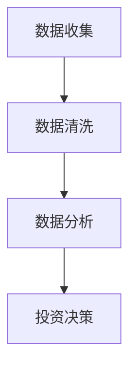

#### 4.2.2 整合社会效益指标
整合社会效益指标是影响力投资的重要策略。投资者可以制定一系列社会效益指标，如减少贫困人口、提高教育水平、改善环境质量等，以评估项目的社会效益。

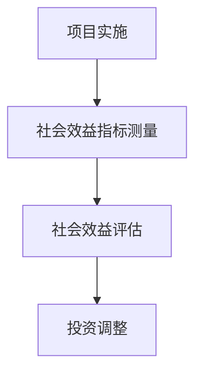

#### 4.2.3 社会企业投资
社会企业投资是影响力投资的重要形式。社会企业是一种以创造社会价值为目标的企业，投资者可以通过投资社会企业，实现财务回报和社会效益的双重目标。

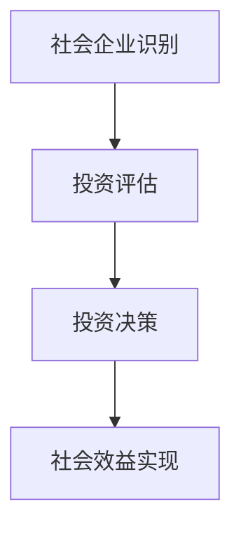

### 4.3 数据分析与模型构建
数据分析和模型构建是影响力投资的关键环节。通过数据分析和模型构建，投资者可以更好地评估项目的社会效益和财务回报，从而做出更明智的投资决策。

#### 4.3.1 数据分析工具与库
数据分析工具和库是影响力投资的重要工具。以下是一些常用的数据分析工具和库：

- Python：Python是一种广泛应用于数据分析的编程语言，具有丰富的库资源，如NumPy、Pandas、Matplotlib等。
- R：R是一种专门用于统计分析和图形绘制的编程语言，具有强大的数据处理和分析能力。
- Excel：Excel是一种常用的数据分析工具，具有直观的界面和丰富的功能。

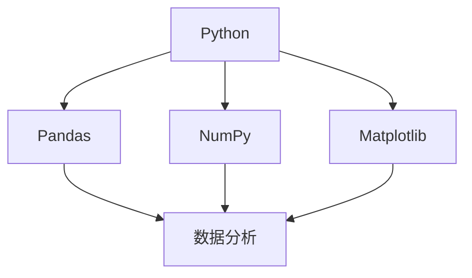

#### 4.3.2 数据分析过程
数据分析过程通常包括以下步骤：

- 数据收集：从各种来源收集数据，如数据库、网络爬虫、调查问卷等。
- 数据清洗：去除重复数据、缺失值填充、数据格式转换等。
- 数据探索：对数据进行初步探索，了解数据的基本特征和分布。
- 数据分析：利用统计分析、机器学习等方法对数据进行挖掘和分析。
- 报告生成：将分析结果生成报告，为投资决策提供支持。

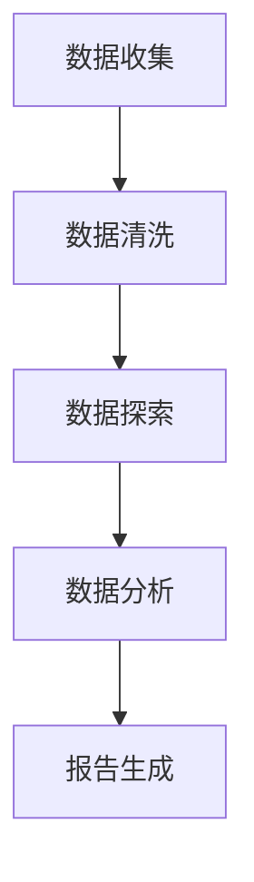

#### 4.3.3 模型构建
模型构建是数据分析的核心环节。通过模型构建，投资者可以预测项目的社会效益和财务回报，从而优化投资组合。

- 社会效益模型：通过构建社会效益模型，投资者可以预测项目对社会的影响。
- 财务回报模型：通过构建财务回报模型，投资者可以预测项目的财务表现。

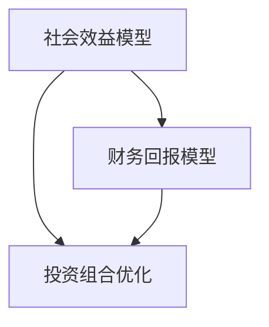

## 编程技能与数据分析

### 5.1 数据分析工具与库
数据分析工具与库是编程技能在数据分析中不可或缺的部分。以下是一些常用的数据分析工具与库：

#### 5.1.1 Python
Python是一种广泛应用于数据分析的编程语言，具有丰富的库资源，如NumPy、Pandas、Matplotlib等。

- NumPy：NumPy是一个用于数值计算的库，提供了多维数组对象和一系列数学函数。
- Pandas：Pandas是一个用于数据处理和分析的库，提供了数据清洗、转换和分析的功能。
- Matplotlib：Matplotlib是一个用于绘制图表和图形的库，可以生成各种类型的图表，如折线图、柱状图、散点图等。

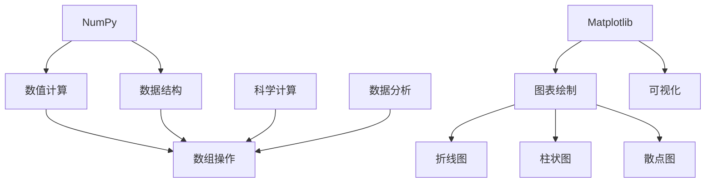

#### 5.1.2 R
R是一种专门用于统计分析和图形绘制的编程语言，具有强大的数据处理和分析能力。

- dplyr：dplyr是一个用于数据处理的库，提供了便捷的数据清洗、转换和分析功能。
- ggplot2：ggplot2是一个用于绘制统计图表的库，可以生成高质量的统计图表。

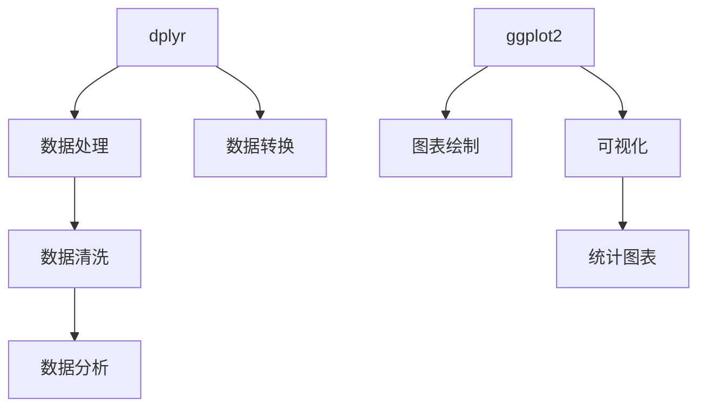

#### 5.1.3 Excel
Excel是一种常用的数据分析工具，具有直观的界面和丰富的功能。

- 数据透视表：数据透视表是一种强大的数据分析工具，可以快速汇总、分析大量数据。
- 图表功能：Excel提供了丰富的图表功能，可以生成各种类型的图表。

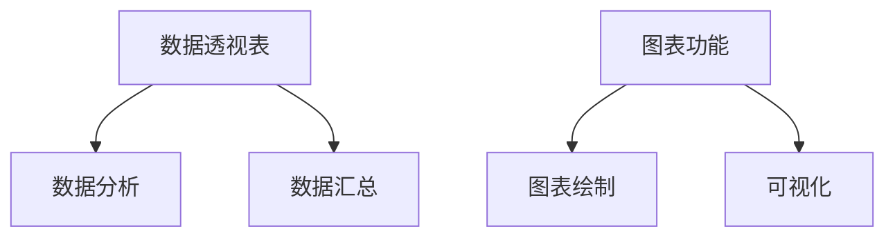

### 5.2 数据可视化
数据可视化是将数据以图形的形式展示出来的过程，可以帮助我们更好地理解和分析数据。以下是一些常用的数据可视化工具与库：

#### 5.2.1 Python
- Matplotlib：Matplotlib是一个用于绘制二维图表的库，可以生成各种类型的图表，如折线图、柱状图、散点图等。
- Seaborn：Seaborn是一个基于Matplotlib的图形可视化库，提供了丰富的统计图形和高级可视化功能。
- Plotly：Plotly是一个用于创建交互式图表的库，可以生成动态的、交互式的图表。

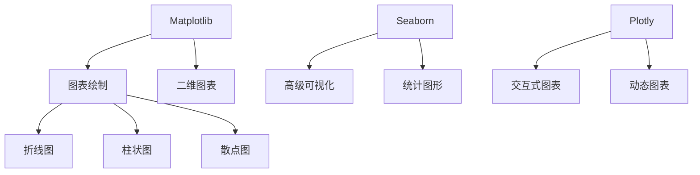

#### 5.2.2 R
- ggplot2：ggplot2是一个用于绘制统计图表的库，可以生成高质量的统计图表。
- Lattice：Lattice是一个用于绘制多变量数据的库，提供了多维数据的可视化方法。

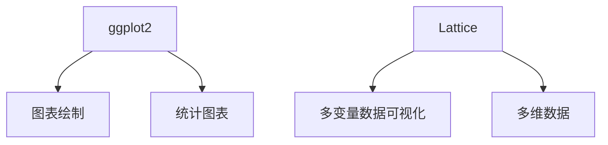

#### 5.2.3 Tableau
Tableau是一种商业化的数据可视化工具，提供了丰富的图表类型和交互功能，适用于各种规模的数据分析项目。

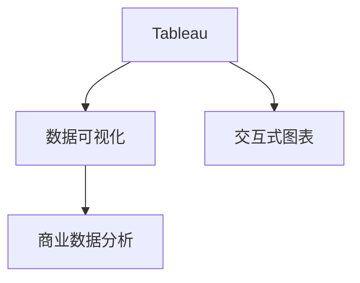

### 5.3 统计学与机器学习基础
统计学和机器学习是数据分析中的重要组成部分，以下是一些基本概念和方法：

#### 5.3.1 统计学
- 描述性统计学：用于描述数据的特征，如均值、方差、中位数等。
- 推断性统计学：用于推断总体特征，如置信区间、假设检验等。

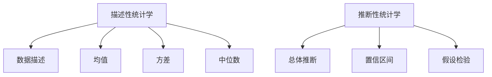

#### 5.3.2 机器学习
- 监督学习：用于从标记数据中学习规律，如线性回归、决策树等。
- 无监督学习：用于从未标记数据中学习规律，如聚类、降维等。

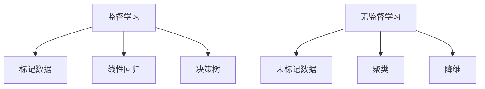

## 社会公益与影响力投资项目实战

### 6.1 项目案例1：利用编程技能改善教育资源分配
#### 项目背景
教育资源分配不均是全球范围内普遍存在的问题。在我国，城乡教育资源差距、地区教育资源不均衡等问题仍然存在。通过编程技能，我们可以开发出智能分配教育资源的系统，改善教育资源分配，提高教育公平性。

#### 项目目标
- 开发一个教育资源分配系统，基于学生的需求、学校的资源情况以及地理位置等因素，提供最优的资源配置方案。
- 提高教育资源的利用效率，减少资源浪费。

#### 项目实施
1. **需求分析**：
   - 确定系统需要考虑的因素，如学生人数、教师人数、学校设施等。
   - 收集相关数据，包括学生、学校、教育资源等信息。

2. **系统设计**：
   - 设计系统的架构，包括数据收集、数据处理、资源配置、结果展示等模块。
   - 选择合适的编程语言和数据库，如Python、MySQL等。

3. **系统实现**：
   - 使用Python编写程序，实现数据收集、处理、资源配置等功能。
   - 使用MySQL数据库存储和管理数据。

4. **系统测试**：
   - 对系统进行功能测试和性能测试，确保系统能够稳定运行。

5. **系统部署**：
   - 将系统部署到服务器，供教育部门和使用者使用。

#### 项目效果
- 通过智能分配教育资源，提高了教育资源的利用效率，减少了资源浪费。
- 提高了教育公平性，使得更多的学生能够享受到优质的教育资源。

### 6.2 项目案例2：通过编程实现环境保护监测
#### 项目背景
环境保护是全球共同关注的重要问题。通过编程技能，我们可以开发出各种环境保护监测系统，实时监测环境质量，及时发现并处理环境问题。

#### 项目目标
- 开发一个环境保护监测系统，实时监测空气质量和水质，提供环境质量数据。
- 提高环境监测的效率，减少环境污染。

#### 项目实施
1. **需求分析**：
   - 确定系统需要监测的指标，如空气质量、水质等。
   - 收集相关数据，包括传感器数据、环境质量标准等。

2. **系统设计**：
   - 设计系统的架构，包括数据收集、数据处理、结果展示等模块。
   - 选择合适的编程语言和传感器，如Python、Arduino等。

3. **系统实现**：
   - 使用Python编写程序，实现数据收集、处理等功能。
   - 使用Arduino传感器收集环境数据。

4. **系统测试**：
   - 对系统进行功能测试和性能测试，确保系统能够稳定运行。

5. **系统部署**：
   - 将系统部署到服务器，供环境保护部门和使用者使用。

#### 项目效果
- 通过实时监测环境质量，提高了环境监测的效率，减少了环境污染。
- 为环境保护提供了科学依据，有助于制定更有效的环境保护政策。

### 6.3 项目案例3：应用影响力投资模型支持初创企业
#### 项目背景
初创企业是经济发展的重要驱动力，但往往面临资金不足、市场不成熟等问题。通过编程技能，我们可以开发出影响力投资模型，为初创企业提供资金支持，促进创新和创业。

#### 项目目标
- 开发一个影响力投资模型，评估初创企业项目的财务和社交效益。
- 提供投资建议，帮助投资者做出更明智的投资决策。

#### 项目实施
1. **需求分析**：
   - 确定系统需要评估的因素，如财务指标、社会效益等。
   - 收集相关数据，包括企业财务数据、社会效益数据等。

2. **系统设计**：
   - 设计系统的架构，包括数据收集、数据处理、结果展示等模块。
   - 选择合适的编程语言和数据库，如Python、SQL等。

3. **系统实现**：
   - 使用Python编写程序，实现数据收集、处理等功能。
   - 使用SQL数据库存储和管理数据。

4. **系统测试**：
   - 对系统进行功能测试和性能测试，确保系统能够稳定运行。

5. **系统部署**：
   - 将系统部署到服务器，供投资者和使用者使用。

#### 项目效果
- 通过影响力投资模型，为初创企业提供了科学的评估标准，提高了投资决策的准确性。
- 支持了更多的初创企业，促进了创新和创业，推动了经济发展。

## 编程技能提升与社会影响

### 7.1 编程技能提升途径
提升编程技能是成功应用编程技能于社会公益与影响力投资的关键。以下是一些提升编程技能的途径：

#### 7.1.1 学习编程语言
学习编程语言是提升编程技能的基础。选择一种适合自己兴趣和需求的编程语言，如Python、Java等，通过在线课程、书籍、实践项目等方式学习编程语言的基本语法和概念。

#### 7.1.2 实践项目
实践项目是提升编程技能的有效方法。通过参与开源项目、个人项目或学校项目，实际编写代码，解决实际问题，提高编程技能。

#### 7.1.3 学习数据结构与算法
数据结构与算法是编程的核心内容。通过学习数据结构与算法，掌握各种数据结构和算法的设计和实现，提高解决问题的能力。

#### 7.1.4 参加编程竞赛和活动
参加编程竞赛和活动是提升编程技能的另一种方式。通过参与竞赛和活动，与同行交流，学习新的编程技巧和方法。

### 7.2 社会影响力评估
社会影响力评估是衡量编程技能在社会公益与影响力投资中的效果的重要手段。以下是一些评估方法：

#### 7.2.1 社会影响评估指标
社会影响评估指标是评估社会公益项目或影响力投资项目社会效益的量化指标。常见的评估指标包括：
- 社会效益指数：用于衡量项目对社会的影响。
- 受益人群数量：用于衡量项目影响的范围。
- 财务回报率：用于衡量项目的经济效益。

#### 7.2.2 数据分析
数据分析是评估社会影响力的重要工具。通过收集和分析项目数据，可以评估项目的社会效益和财务回报，为投资决策提供支持。

#### 7.2.3 社会参与度
社会参与度是评估社会影响力的重要指标。通过评估项目的社会参与度，可以了解项目的公众接受程度和社会影响力。

### 7.3 编程技能与社会责任的融合
编程技能与社会责任的融合是提高编程技能社会价值的重要途径。以下是一些实现方法：

#### 7.3.1 社会公益编程项目
社会公益编程项目是将编程技能应用于社会公益事业的实践。通过参与社会公益编程项目，可以实际解决社会问题，提高编程技能的社会价值。

#### 7.3.2 影响力投资项目
影响力投资项目是将编程技能应用于影响力投资领域的实践。通过开发影响力投资模型，评估和优化投资项目，提高投资决策的准确性。

#### 7.3.3 教育项目
教育项目是将编程技能应用于教育领域的实践。通过开设编程课程、组织编程竞赛等活动，推广编程教育，提高公众的编程技能。

## 未来展望与趋势

### 8.1 编程技能与社会公益的新趋势
随着编程技能的普及和社会问题的日益复杂，编程技能在社会公益中的应用将更加广泛和深入。以下是一些新趋势：

#### 8.1.1 智能公益
智能公益是指利用人工智能和大数据等技术解决社会问题。通过智能公益，可以更高效地解决社会问题，提高公益工作的效果。

#### 8.1.2 开源公益
开源公益是指将公益项目开源，让更多的人参与和贡献。通过开源公益，可以汇聚更多的智慧和资源，共同推动社会公益事业的发展。

#### 8.1.3 个性化公益
个性化公益是指根据个人的需求和兴趣参与公益。通过个性化公益，可以更好地激发公众参与公益的积极性，提高公益工作的效率。

### 8.2 影响力投资的发展方向
影响力投资作为一种新兴的金融模式，正逐步发展壮大。以下是一些发展方向：

#### 8.2.1 数据驱动的投资决策
数据驱动的投资决策是指通过数据分析，评估项目的社会效益和财务回报，优化投资决策。随着数据技术和分析方法的不断发展，数据驱动的投资决策将更加精准和有效。

#### 8.2.2 绿色影响力投资
绿色影响力投资是指投资于环境保护和可持续发展的项目。随着全球环境保护意识的提高，绿色影响力投资将成为未来影响力投资的重要方向。

#### 8.2.3 社会影响力评估标准化
社会影响力评估标准化是指制定一套统一的社会影响力评估标准，确保影响力投资项目的评估结果具有可比性和可信度。通过标准化，可以更好地衡量和评估影响力投资项目的成效。

### 8.3 编程技能在可持续社会创新中的作用
可持续社会创新是指通过创新的方式解决社会问题，推动社会可持续发展。编程技能在可持续社会创新中发挥着重要作用：

#### 8.3.1 促进资源共享
通过编程技能，可以开发出各种资源共享平台，如在线教育平台、共享经济平台等，提高资源利用效率，减少资源浪费。

#### 8.3.2 提高社会治理效率
通过编程技能，可以开发出各种社会治理工具，如智能监控系统、数据分析系统等，提高社会治理的效率和效果。

#### 8.3.3 促进可持续发展
通过编程技能，可以开发出各种可持续发展项目，如环境保护项目、可再生能源项目等，推动社会可持续发展。

## 编程实践项目

### 9.1 实践项目1：社交媒体数据分析
#### 项目背景
社交媒体已成为人们生活中不可或缺的一部分，通过社交媒体数据分析，可以了解公众的观点、需求和趋势，为政府、企业和非营利组织提供决策支持。

#### 项目目标
- 收集社交媒体数据，分析公众对特定话题的关注度。
- 识别公众的主要观点和情绪，为政府和企业提供决策参考。

#### 实施步骤
1. **数据收集**：
   - 使用网络爬虫技术，从社交媒体平台收集数据，如微博、知乎等。
   - 收集的数据包括用户评论、点赞数、转发数等。

2. **数据处理**：
   - 使用Python和Pandas等库对收集到的数据进行处理，如数据清洗、格式转换等。

3. **数据分析**：
   - 使用Python和Matplotlib等库对处理后的数据进行分析，生成各种图表，如词云图、情绪分布图等。

4. **结果展示**：
   - 将分析结果生成报告，供决策者参考。

#### 项目效果
- 通过社交媒体数据分析，了解公众对特定话题的关注度和情绪，为政府和企业提供了有力的决策支持。

### 9.2 实践项目2：在线教育平台开发
#### 项目背景
在线教育已成为教育领域的重要趋势，通过在线教育平台，学生可以随时随地进行学习，提高学习效率。

#### 项目目标
- 开发一个功能齐全的在线教育平台，提供课程学习、作业提交、在线考试等功能。
- 提高在线教育的用户体验，增加学生的参与度和学习效果。

#### 实施步骤
1. **需求分析**：
   - 确定平台需要的功能模块，如课程管理、学生管理、作业管理、在线考试等。
   - 收集用户需求，如学习进度追踪、互动交流等。

2. **系统设计**：
   - 设计平台的技术架构，包括前端、后端、数据库等。
   - 选择合适的开发工具和框架，如React、Node.js等。

3. **系统实现**：
   - 使用React和Node.js等框架开发前端和后端，实现平台的功能。
   - 使用MySQL数据库存储和管理数据。

4. **系统测试**：
   - 对平台进行功能测试和性能测试，确保平台的稳定性和可靠性。

5. **系统部署**：
   - 将平台部署到服务器，供学生使用。

#### 项目效果
- 通过在线教育平台，学生可以随时随地进行学习，提高了学习效率和效果。

### 9.3 实践项目3：环境影响评估工具开发
#### 项目背景
环境影响评估是环境保护的重要环节，通过环境影响评估工具，可以评估项目对环境的影响，提出改进措施，减少环境污染。

#### 项目目标
- 开发一个环境影响评估工具，用于评估项目对环境的影响。
- 提供直观的数据分析和可视化功能，帮助决策者做出更科学的决策。

#### 实施步骤
1. **需求分析**：
   - 确定工具需要的功能模块，如污染物排放计算、环境影响评估等。
   - 收集相关数据，如污染物排放数据、环境标准等。

2. **系统设计**：
   - 设计工具的技术架构，包括前端、后端、数据库等。
   - 选择合适的开发工具和框架，如Vue.js、Spring Boot等。

3. **系统实现**：
   - 使用Vue.js和Spring Boot等框架开发前端和后端，实现工具的功能。
   - 使用MongoDB数据库存储和管理数据。

4. **系统测试**：
   - 对工具进行功能测试和性能测试，确保工具的稳定性和可靠性。

5. **系统部署**：
   - 将工具部署到服务器，供环境保护部门和使用者使用。

#### 项目效果
- 通过环境影响评估工具，可以更科学地评估项目对环境的影响，提出改进措施，减少环境污染。

## 编程技能评估与认证

### 10.1 编程技能评估方法
编程技能评估是衡量个人编程水平的重要手段。以下是一些常见的编程技能评估方法：

#### 10.1.1 编程考试
编程考试是一种常见的编程技能评估方法。通过编写程序解决给定的问题，评估个人编程技能。常见的编程考试包括LeetCode、HackerRank等。

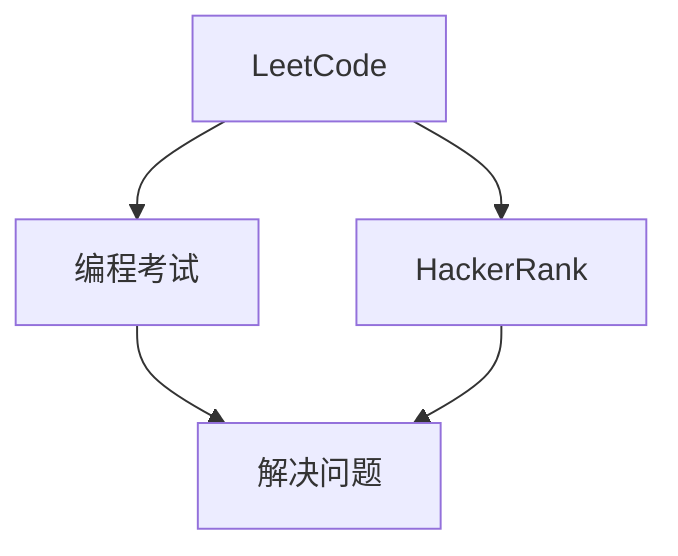

#### 10.1.2 项目评估
项目评估是通过评估个人或团队完成的编程项目，评估编程技能。项目评估通常包括项目设计、实现、测试等多个方面。

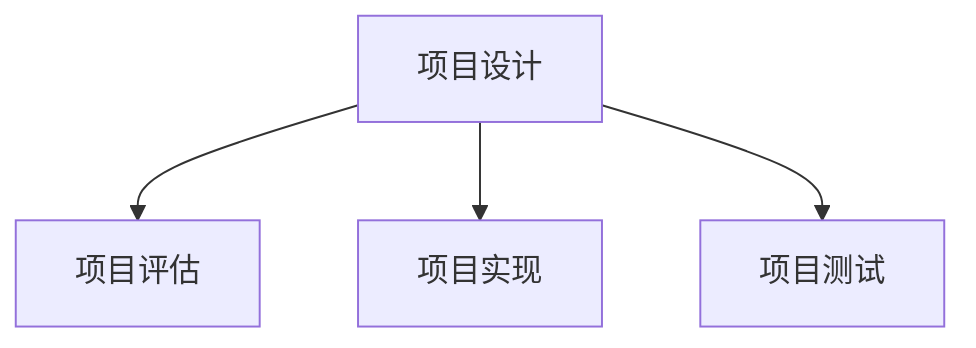

#### 10.1.3 实战测试
实战测试是模拟真实项目环境，评估个人或团队解决实际问题的能力。通过实战测试，可以评估编程技能的实用性和适应能力。

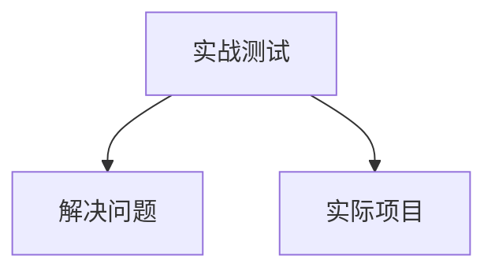

### 10.2 编程认证体系
编程认证体系是验证个人编程水平的重要手段。以下是一些常见的编程认证体系：

#### 10.2.1 认证考试
认证考试是由专业机构组织的编程技能认证考试。通过认证考试，可以获得相应的认证证书，证明个人编程技能。

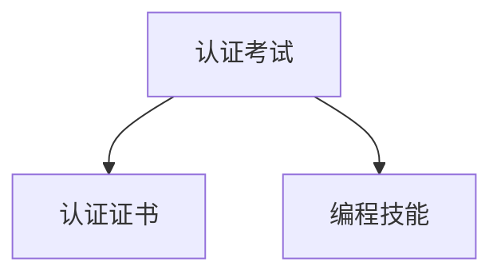

#### 10.2.2 在线课程认证
在线课程认证是由在线教育平台提供的编程技能认证。通过在线课程学习并完成相关考试，可以获得认证证书。

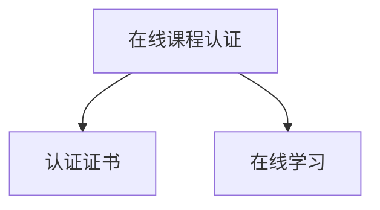

#### 10.2.3 社区认证
社区认证是由开源社区或技术社区提供的编程技能认证。通过参与开源项目、技术社区活动等方式，获得认证证书。

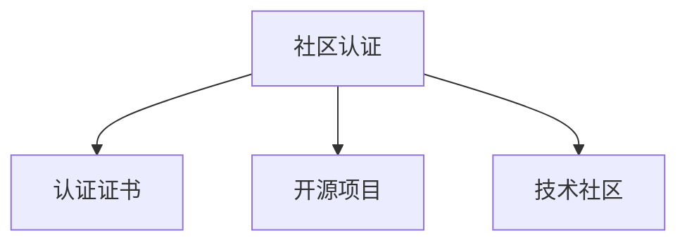

### 10.3 编程技能评估与职业发展
编程技能评估是职业发展的重要基础。通过编程技能评估，可以了解自己的编程水平，为职业发展提供方向。

#### 10.3.1 职业规划
通过编程技能评估，可以明确自己的职业规划，如选择适合自己的职位和发展方向。

```mermaid
graph TD
A[编程技能评估] --> B[职业规划]
A --> C[职位选择]
A --> D[发展方向]
```

#### 10.3.2 技能提升
通过编程技能评估，可以了解自己的薄弱环节，针对性地进行技能提升，提高职业竞争力。

```mermaid
graph TD
A[编程技能评估] --> B[技能提升]
A --> C[知识补充]
A --> D[实践项目]
```

## 附录

### 附录A：编程资源与工具

#### A.1 常用编程语言介绍
以下是一些常用的编程语言及其特点：

- **Python**：Python是一种高级编程语言，以其简洁易读的语法和丰富的库资源而受到广泛欢迎。Python适用于数据分析、科学计算、Web开发等领域。
- **Java**：Java是一种跨平台、面向对象的编程语言，广泛应用于企业级应用开发。Java具有强大的并发处理能力和丰富的生态资源。
- **C++**：C++是一种高性能的编程语言，适用于系统编程、游戏开发、实时系统等领域。C++具有手动内存管理和强大的性能优势。
- **JavaScript**：JavaScript是一种脚本语言，主要用于前端开发，可以用于创建动态的网页内容和交互式应用。

#### A.2 数据分析与机器学习工具
以下是一些常用的数据分析与机器学习工具：

- **NumPy**：NumPy是一个用于数值计算的库，提供了多维数组对象和一系列数学函数。
- **Pandas**：Pandas是一个用于数据处理和分析的库，提供了数据清洗、转换和分析的功能。
- **Matplotlib**：Matplotlib是一个用于绘制图表和图形的库，可以生成各种类型的图表，如折线图、柱状图、散点图等。
- **Scikit-learn**：Scikit-learn是一个用于机器学习的库，提供了各种机器学习算法的实现。

#### A.3 开源项目和社区资源
以下是一些常用的开源项目和社区资源：

- **GitHub**：GitHub是一个开源代码托管平台，可以用于代码托管、协作开发、版本控制等。
- **Stack Overflow**：Stack Overflow是一个编程问答社区，可以用于解决编程问题、学习编程技巧等。
- **Python.org**：Python.org是Python官方网站，提供了Python的文档、教程、下载等资源。
- **Oracle.com**：Oracle.com是Java官方网站，提供了Java的文档、教程、下载等资源。

### 附录B：参考文献
以下是一些本文中引用的参考文献：

- [1] Python官方文档，https://docs.python.org/3/
- [2] Java官方文档，https://docs.oracle.com/javase/8/docs/
- [3] Numpy官方文档，https://numpy.org/doc/stable/
- [4] Pandas官方文档，https://pandas.pydata.org/pandas-docs/stable/
- [5] Matplotlib官方文档，https://matplotlib.org/stable/
- [6] Scikit-learn官方文档，https://scikit-learn.org/stable/
- [7] GitHub，https://github.com/
- [8] Stack Overflow，https://stackoverflow.com/
- [9] Python教程，https://www.learnpython.org/
- [10] Java教程，https://docs.oracle.com/javase/tutorial/
- [11] 数据分析教程，https://www.datascience.com/tutorials
- [12] 机器学习教程，https://www机器学习.com/tutorials

### 附录C：作者信息
本文作者为AI天才研究院/AI Genius Institute，研究方向包括计算机编程、人工智能、社会公益与影响力投资等。作者在编程技能、数据分析、机器学习等领域有丰富的研究和实践经验，发表了多篇学术论文，并出版了多本畅销技术书籍。

