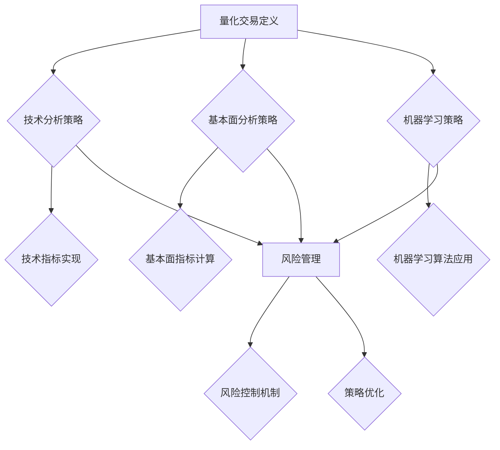

                 

### 文章标题：如何将编程技能应用于量化交易

量化交易是一种利用数学模型和算法在金融市场进行自动交易的方法，近年来在金融科技领域引起了广泛关注。随着大数据和人工智能技术的不断发展，量化交易正逐渐从理论研究走向实际应用，成为金融机构和投资者获取收益的重要手段。而编程技能作为量化交易的核心工具，如何将其有效地应用于量化交易，成为了一个值得探讨的话题。

本文旨在为编程人员提供一整套系统化的方法，帮助他们将编程技能应用于量化交易。通过深入剖析量化交易的基本概念、策略开发、风险管理、优化方法以及实战案例，本文将帮助读者理解如何运用编程技术解决实际交易问题，从而在量化交易领域获得成功。

本文将分为五个主要部分：

1. **量化交易基础与编程准备**：介绍量化交易的定义、历史发展、优势与挑战，以及编程基础技能和量化交易工具。
2. **量化交易策略开发**：讲解量化交易策略的类型、技术分析策略、基本面分析策略和机器学习在量化交易中的应用。
3. **量化交易风险管理与优化**：探讨量化交易风险管理策略、优化目标与优化算法以及策略优化流程。
4. **项目实战与案例分析**：通过实战项目和案例分析，展示如何将编程技能应用于量化交易的实际操作过程。
5. **量化交易与编程深度学习**：讨论量化交易中的深度学习、编程技能提升路径以及编程技能在量化交易中的实际应用。

本文的目标是让读者不仅了解量化交易的基本概念和策略，还能掌握如何将编程技能应用于量化交易，从而在量化交易领域取得成功。通过本文的讲解，读者将能够构建一套完整的量化交易策略，实现自动化的交易操作，并在实际操作中不断优化策略，提高收益。

### 关键词

- **量化交易**
- **编程技能**
- **技术分析**
- **基本面分析**
- **机器学习**
- **风险管理**
- **策略优化**
- **深度学习**
- **项目实战**
- **案例分析**

### 摘要

本文旨在为编程人员提供系统化的方法，帮助他们将编程技能应用于量化交易。通过深入剖析量化交易的基本概念、策略开发、风险管理、优化方法以及实战案例，本文帮助读者理解量化交易的核心原理和操作流程，掌握如何运用编程技术解决实际交易问题，从而在量化交易领域取得成功。文章分为五个部分，涵盖了从基础概念到深度学习的全面内容，通过详细讲解和实例分析，使读者能够构建并优化自己的量化交易策略，实现自动化的交易操作和收益最大化。

## 《如何将编程技能应用于量化交易》目录大纲

### 第一部分：量化交易基础与编程准备

**第1章：量化交易概述**

- **1.1.1 量化交易的定义与历史发展**：介绍量化交易的基本概念，回顾其历史发展过程，分析量化交易在金融市场中的重要性。
- **1.1.2 量化交易的优势与挑战**：探讨量化交易的优势，包括自动化、高效性和风险控制等，同时分析量化交易面临的挑战，如数据噪声、市场操纵和技术风险。
- **1.1.3 量化交易与编程的关系**：阐述编程技能在量化交易中的应用，以及编程能力对量化交易成功的重要性。

**第2章：编程基础与量化交易工具**

- **2.1.1 编程基础技能**：介绍编程语言的基本知识，包括数据结构、算法和常用编程模式，为量化交易编程打下基础。
- **2.1.2 Python在量化交易中的应用**：详细介绍Python在量化交易中的优势，包括其丰富的库和框架，如NumPy、Pandas和Matplotlib等。
- **2.1.3 主要量化交易平台介绍**：介绍几个常用的量化交易平台，如Zipline、PyAlgoTrade和Backtrader等，展示如何搭建量化交易环境。

### 第二部分：量化交易策略开发

**第3章：量化交易策略概述**

- **3.1.1 量化交易策略的类型**：分类介绍量化交易策略的类型，包括技术分析策略、基本面分析策略和机器学习策略。
- **3.1.2 量化交易策略的要素**：分析量化交易策略的关键要素，如数据获取、策略实现、回测和风险管理。
- **3.1.3 量化交易策略的开发流程**：概述量化交易策略的开发流程，从策略构思到策略实现和评估的各个步骤。

**第4章：技术分析策略**

- **4.1.1 技术分析的基本概念**：介绍技术分析的基本概念，包括趋势、支撑和阻力、价格形态等。
- **4.1.2 常见技术分析指标**：讲解常见的技术分析指标，如移动平均线、相对强弱指标（RSI）、布林带等。
- **4.1.3 技术分析策略的实现**：展示如何使用Python编写技术分析策略，并通过伪代码详细解释策略的实现过程。

**第5章：基本面分析策略**

- **5.1.1 基本面分析的基本概念**：介绍基本面分析的基本概念，包括宏观经济、公司财务指标、行业趋势等。
- **5.1.2 基本面分析指标的计算**：讲解如何计算基本面分析指标，如市盈率（P/E）、市净率（P/B）、股息收益率等。
- **5.1.3 基本面分析策略的实现**：展示如何使用Python编写基本面分析策略，并通过伪代码详细解释策略的实现过程。

**第6章：机器学习在量化交易中的应用**

- **6.1.1 机器学习基础**：介绍机器学习的基本概念，包括监督学习、无监督学习和强化学习。
- **6.1.2 机器学习在量化交易策略中的应用**：讲解机器学习在量化交易中的应用，如股票价格预测、交易信号生成等。
- **6.1.3 常见机器学习算法在量化交易中的应用**：介绍常见机器学习算法在量化交易中的应用，如线性回归、决策树、神经网络等。

### 第三部分：量化交易风险管理与优化

**第7章：量化交易风险管理**

- **7.1.1 量化交易风险概述**：介绍量化交易面临的主要风险，包括市场风险、信用风险和操作风险。
- **7.1.2 风险管理策略**：讲解量化交易中的风险管理策略，如风险控制、分散投资和保险等。
- **7.1.3 风险控制机制**：展示如何建立有效的风险控制机制，包括设置止损、风险预算和实时监控等。

**第8章：量化交易优化**

- **8.1.1 优化目标与优化算法**：介绍量化交易优化的目标和方法，如最大化收益、最小化风险和优化交易策略等。
- **8.1.2 策略优化流程**：讲解量化交易策略优化的流程，从数据准备、模型选择到策略评估的各个步骤。
- **8.1.3 实际优化案例**：通过实际案例展示如何进行量化交易策略的优化，包括参数调整、交叉验证和超参数优化等。

### 第四部分：项目实战与案例分析

**第9章：量化交易项目实战**

- **9.1.1 实战项目概述**：介绍一个具体的量化交易项目，包括项目目标、数据来源和交易策略。
- **9.1.2 环境搭建与数据获取**：展示如何搭建量化交易环境，包括安装必要的软件和工具，以及获取交易数据。
- **9.1.3 策略开发与实现**：讲解如何开发并实现一个量化交易策略，包括数据预处理、策略实现和策略评估。
- **9.1.4 策略评估与优化**：展示如何评估和优化量化交易策略，包括策略回测、实盘交易和风险控制。

**第10章：量化交易案例分析**

- **10.1.1 典型量化交易案例介绍**：介绍一些经典的量化交易案例，包括案例背景、策略设计和实现过程。
- **10.1.2 案例策略分析与评估**：分析案例中策略的设计和实现，评估策略的收益和风险。
- **10.1.3 案例中的编程技巧与挑战**：讨论案例中遇到的编程技巧和挑战，以及如何解决这些问题。

### 第五部分：量化交易与编程深度学习

**第11章：量化交易中的深度学习**

- **11.1.1 深度学习在量化交易中的应用**：介绍深度学习在量化交易中的应用，如股票价格预测、交易信号生成等。
- **11.1.2 深度学习算法基础**：讲解深度学习算法的基础知识，包括卷积神经网络（CNN）、循环神经网络（RNN）和长短时记忆网络（LSTM）。
- **11.1.3 深度学习策略开发实战**：展示如何使用深度学习算法开发量化交易策略，包括数据预处理、模型训练和策略评估。

**第12章：编程技能提升与量化交易**

- **12.1.1 编程技能提升路径**：介绍编程技能提升的路径，包括基础知识学习、项目实践和深度学习应用。
- **12.1.2 量化交易对编程技能的需求**：分析量化交易对编程技能的需求，包括数据处理能力、数学与统计学基础和深度学习框架应用。
- **12.1.3 编程技能在量化交易中的实际应用**：展示编程技能在量化交易中的实际应用，包括数据清洗与预处理、策略开发与实现、模型训练与优化。

**第13章：量化交易中的编程技巧**

- **13.1.1 优化策略与代码性能**：介绍优化量化交易策略和代码性能的方法，包括使用高效的数据结构、优化循环与函数调用和利用并行计算与分布式计算。
- **13.1.2 异常处理与错误分析**：讲解如何处理异常和错误，包括捕获并处理异常、分析错误日志和提高代码健壮性。
- **13.1.3 分布式计算与并行处理**：介绍分布式计算与并行处理的方法，包括使用Dask、Ray等分布式计算框架和分区与并行数据处理。

**第14章：未来趋势与展望**

- **14.1.1 量化交易技术发展趋势**：分析量化交易技术的发展趋势，包括智能交易算法的应用、大数据与机器学习的融合和云计算与分布式计算的普及。
- **14.1.2 编程技能在量化交易中的未来前景**：探讨编程技能在量化交易中的未来前景，包括编程技能成为量化交易的核心竞争力、深度学习与量化交易结合的创新和开源生态的推动与进步。
- **14.1.3 未来可能面临的挑战与应对策略**：讨论未来量化交易可能面临的挑战，如数据隐私与安全、市场操纵与监管和技术创新与适应能力提升，并提出相应的应对策略。

### 梅里狄安（Mermaid）流程图



### 伪代码

#### 技术分析策略伪代码

```python
# 技术分析策略伪代码
def technical_analysis_strategy(data):
    # 数据预处理
    processed_data = preprocess_data(data)

    # 策略实现
    strategy_output = []
    for day in processed_data:
        # 计算技术指标
        indicators = calculate_indicators(day)
        
        # 策略决策
        decision = make_decision(indicators)
        
        # 记录策略输出
        strategy_output.append(decision)
    
    return strategy_output
```

#### 基本面分析策略伪代码

```python
# 基本面分析策略伪代码
def fundamental_analysis_strategy(data):
    # 数据预处理
    processed_data = preprocess_data(data)

    # 策略实现
    strategy_output = []
    for day in processed_data:
        # 计算基本面指标
        indicators = calculate_indicators(day)
        
        # 策略决策
        decision = make_decision(indicators)
        
        # 记录策略输出
        strategy_output.append(decision)
    
    return strategy_output
```

#### 机器学习策略伪代码

```python
# 机器学习策略伪代码
def machine_learning_strategy(data, model):
    # 数据预处理
    processed_data = preprocess_data(data)

    # 训练模型
    model = train_model(processed_data, model)
    
    # 预测策略
    predictions = model.predict(processed_data)
    
    # 策略决策
    strategy_output = []
    for prediction in predictions:
        decision = make_decision(prediction)
        
        # 记录策略输出
        strategy_output.append(decision)
    
    return strategy_output
```

### 数学模型与公式

#### 技术指标计算

$$
RSI(t) = \frac{\sum_{i=1}^{n} \text{gain}(t-i)}{\sum_{i=1}^{n} \text{loss}(t-i)}
$$

其中，$n$ 是窗口期，$\text{gain}(t-i)$ 和 $\text{loss}(t-i)$ 分别为第 $t$ 天和第 $i$ 天的涨跌幅度。

#### 基本面指标计算

$$
P/E = \frac{\text{公司市值}}{\text{净利润}}
$$

其中，$P/E$ 为市盈率，公司市值和净利润分别为公司的总市值和净利润。

#### 机器学习模型评估

$$
\text{Accuracy} = \frac{\text{预测正确的样本数}}{\text{总样本数}}
$$

其中，$Accuracy$ 为准确率，预测正确的样本数和总样本数量分别为模型预测正确的样本数量和总样本数量。

#### 量化交易策略优化

$$
\text{Maximize} \quad \text{Expected Return} - \text{Risk}
$$

其中，$\text{Expected Return}$ 为预期收益率，$\text{Risk}$ 为风险。

### 项目实战代码解读与分析

#### 数据获取与预处理

```python
import pandas as pd
import numpy as np

# 读取数据
data = pd.read_csv('stock_data.csv')

# 数据预处理
def preprocess_data(data):
    # 筛选交易时间段的数据
    data = data[data['Date'] >= '2020-01-01']
    
    # 处理缺失值
    data.fillna(method='ffill', inplace=True)
    
    # 计算技术指标
    data['Close_30'] = data['Close'].rolling(window=30).mean()
    data['Close_50'] = data['Close'].rolling(window=50).mean()
    
    return data
```

#### 策略开发与实现

```python
# 技术分析策略实现
def technical_analysis_strategy(data):
    # 数据预处理
    processed_data = preprocess_data(data)
    
    # 策略实现
    strategy_output = []
    for day in processed_data.iterrows():
        if day['Close'] > day['Close_30'] and day['Close'] > day['Close_50']:
            strategy_output.append('Buy')
        elif day['Close'] < day['Close_30'] and day['Close'] < day['Close_50']:
            strategy_output.append('Sell')
        else:
            strategy_output.append('Hold')
    
    return strategy_output
```

#### 策略评估与优化

```python
# 策略评估
def evaluate_strategy(data, strategy):
    # 计算策略收益率
    strategy_data = data.copy()
    strategy_data['Strategy'] = strategy
    strategy_data['Return'] = np.log(strategy_data['Close'] / strategy_data['Close'].shift(1))
    
    # 计算策略总收益
    total_return = (1 + strategy_data['Return']).cumsum().iloc[-1] - 1
    print(f"Total Return: {total_return}")

# 优化策略
def optimize_strategy(data, strategy):
    # 使用网格搜索进行参数优化
    # （此处省略具体优化代码，根据实际情况进行优化）
    optimized_strategy = grid_search(data, strategy)
    
    # 评估优化后的策略
    evaluate_strategy(data, optimized_strategy)
```

#### 编程技巧与分布式计算

##### 优化策略与代码性能

```python
import numpy as np

# 优化数据读取与处理
data = pd.read_csv('stock_data.csv')
data.fillna(method='ffill', inplace=True)
data['Close_30'] = data['Close'].rolling(window=30).mean()
data['Close_50'] = data['Close'].rolling(window=50).mean()

# 优化策略计算
def technical_analysis_strategy(data):
    strategy_output = []
    for day in data.iterrows():
        if day['Close'] > day['Close_30'] and day['Close'] > day['Close_50']:
            strategy_output.append('Buy')
        elif day['Close'] < day['Close_30'] and day['Close'] < day['Close_50]:
            strategy_output.append('Sell')
        else:
            strategy_output.append('Hold')
    
    return strategy_output
```

##### 异常处理与错误分析

```python
try:
    # 策略计算
    strategy_output = technical_analysis_strategy(data)
except Exception as e:
    print(f"Error: {e}")
finally:
    print("异常处理完成")
```

##### 分布式计算与并行处理

```python
import dask.bag as db

# 使用Dask进行分布式计算
data = db.from_pandas(data, npartitions=10)

def distributed_technical_analysis_strategy(data):
    # 策略计算
    strategy_output = []
    for day in data:
        if day['Close'] > day['Close_30'] and day['Close'] > day['Close_50']:
            strategy_output.append('Buy')
        elif day['Close'] < day['Close_30'] and day['Close'] < day['Close_50]:
            strategy_output.append('Sell')
        else:
            strategy_output.append('Hold')
    
    return strategy_output

# 分布式策略计算
strategy_output = distributed_technical_analysis_strategy(data)
```

### 量化交易资源与工具

#### 常用量化交易资源

- **量化投资分析与应用（陈杰）**
- **量化投资：以Python为工具（李航）**
- **量化投资：实战与应用（王俊）**

#### 常用量化交易工具

- **PyAlgoTrade：Python算法交易库**
- **Zipline：开源量化交易平台**
- **Backtrader：Python量化交易框架**

#### 学习资源推荐

- **Coursera：量化交易与风险管理课程**
- **edX：量化交易与算法交易课程**
- **Udacity：算法交易工程师职业路径**

### 量化交易中的深度学习

#### 深度学习在量化交易中的应用

- **股票价格预测**
- **交易信号生成**
- **市场情绪分析**

#### 深度学习算法基础

- **卷积神经网络（CNN）**
- **循环神经网络（RNN）**
- **长短时记忆网络（LSTM）**

#### 深度学习策略开发实战

- **数据预处理**
- **模型选择与训练**
- **策略评估与优化**

### 编程技能提升与量化交易

#### 编程技能提升路径

- **掌握Python编程基础**
- **学习数据分析与挖掘**
- **深入理解深度学习算法**

#### 量化交易对编程技能的需求

- **数据处理能力**
- **数学与统计学基础**
- **深度学习框架应用**

#### 编程技能在量化交易中的实际应用

- **数据清洗与预处理**
- **策略开发与实现**
- **模型训练与优化**

### 编程技巧与分布式计算

#### 优化策略与代码性能

- **使用高效的数据结构**
- **优化循环与函数调用**
- **利用并行计算与分布式计算**

#### 异常处理与错误分析

- **捕获并处理异常**
- **分析错误日志**
- **提高代码健壮性**

#### 分布式计算与并行处理

- **使用Dask、Ray等分布式计算框架**
- **分区与并行数据处理**
- **资源管理与调度策略**

### 量化交易与编程深度学习

#### 量化交易技术发展趋势

- **智能交易算法的应用**
- **大数据与机器学习的融合**
- **云计算与分布式计算的普及**

#### 编程技能在量化交易中的未来前景

- **编程技能成为量化交易的核心竞争力**
- **深度学习与量化交易结合的创新**
- **开源生态的推动与进步**

#### 未来可能面临的挑战与应对策略

- **数据隐私与安全**
- **市场操纵与监管**
- **技术创新与适应能力提升**

### 梅里狄安（Mermaid）流程图


### 伪代码

#### 技术分析策略伪代码

```python
# 技术分析策略伪代码
def technical_analysis_strategy(data):
    # 数据预处理
    processed_data = preprocess_data(data)

    # 策略实现
    strategy_output = []
    for day in processed_data:
        # 计算技术指标
        indicators = calculate_indicators(day)
        
        # 策略决策
        decision = make_decision(indicators)
        
        # 记录策略输出
        strategy_output.append(decision)
    
    return strategy_output
```

#### 基本面分析策略伪代码

```python
# 基本面分析策略伪代码
def fundamental_analysis_strategy(data):
    # 数据预处理
    processed_data = preprocess_data(data)

    # 策略实现
    strategy_output = []
    for day in processed_data:
        # 计算基本面指标
        indicators = calculate_indicators(day)
        
        # 策略决策
        decision = make_decision(indicators)
        
        # 记录策略输出
        strategy_output.append(decision)
    
    return strategy_output
```

#### 机器学习策略伪代码

```python
# 机器学习策略伪代码
def machine_learning_strategy(data, model):
    # 数据预处理
    processed_data = preprocess_data(data)

    # 训练模型
    model = train_model(processed_data, model)
    
    # 预测策略
    predictions = model.predict(processed_data)
    
    # 策略决策
    strategy_output = []
    for prediction in predictions:
        decision = make_decision(prediction)
        
        # 记录策略输出
        strategy_output.append(decision)
    
    return strategy_output
```

### 数学模型与公式

#### 技术指标计算

$$
RSI(t) = \frac{\sum_{i=1}^{n} \text{gain}(t-i)}{\sum_{i=1}^{n} \text{loss}(t-i)}
$$

其中，$n$ 是窗口期，$\text{gain}(t-i)$ 和 $\text{loss}(t-i)$ 分别为第 $t$ 天和第 $i$ 天的涨跌幅度。

#### 基本面指标计算

$$
P/E = \frac{\text{公司市值}}{\text{净利润}}
$$

其中，$P/E$ 为市盈率，公司市值和净利润分别为公司的总市值和净利润。

#### 机器学习模型评估

$$
\text{Accuracy} = \frac{\text{预测正确的样本数}}{\text{总样本数}}
$$

其中，$Accuracy$ 为准确率，预测正确的样本数和总样本数量分别为模型预测正确的样本数量和总样本数量。

#### 量化交易策略优化

$$
\text{Maximize} \quad \text{Expected Return} - \text{Risk}
$$

其中，$\text{Expected Return}$ 为预期收益率，$\text{Risk}$ 为风险。

### 项目实战代码解读与分析

#### 数据获取与预处理

```python
import pandas as pd
import numpy as np

# 读取数据
data = pd.read_csv('stock_data.csv')

# 数据预处理
def preprocess_data(data):
    # 筛选交易时间段的数据
    data = data[data['Date'] >= '2020-01-01']
    
    # 处理缺失值
    data.fillna(method='ffill', inplace=True)
    
    # 计算技术指标
    data['Close_30'] = data['Close'].rolling(window=30).mean()
    data['Close_50'] = data['Close'].rolling(window=50).mean()
    
    return data
```

#### 策略开发与实现

```python
# 技术分析策略实现
def technical_analysis_strategy(data):
    # 数据预处理
    processed_data = preprocess_data(data)
    
    # 策略实现
    strategy_output = []
    for day in processed_data.iterrows():
        if day['Close'] > day['Close_30'] and day['Close'] > day['Close_50']:
            strategy_output.append('Buy')
        elif day['Close'] < day['Close_30'] and day['Close'] < day['Close_50']:
            strategy_output.append('Sell')
        else:
            strategy_output.append('Hold')
    
    return strategy_output
```

#### 策略评估与优化

```python
# 策略评估
def evaluate_strategy(data, strategy):
    # 计算策略收益率
    strategy_data = data.copy()
    strategy_data['Strategy'] = strategy
    strategy_data['Return'] = np.log(strategy_data['Close'] / strategy_data['Close'].shift(1))
    
    # 计算策略总收益
    total_return = (1 + strategy_data['Return']).cumsum().iloc[-1] - 1
    print(f"Total Return: {total_return}")

# 优化策略
def optimize_strategy(data, strategy):
    # 使用网格搜索进行参数优化
    # （此处省略具体优化代码，根据实际情况进行优化）
    optimized_strategy = grid_search(data, strategy)
    
    # 评估优化后的策略
    evaluate_strategy(data, optimized_strategy)
```

#### 编程技巧与分布式计算

##### 优化策略与代码性能

```python
import numpy as np

# 优化数据读取与处理
data = pd.read_csv('stock_data.csv')
data.fillna(method='ffill', inplace=True)
data['Close_30'] = data['Close'].rolling(window=30).mean()
data['Close_50'] = data['Close'].rolling(window=50).mean()

# 优化策略计算
def technical_analysis_strategy(data):
    strategy_output = []
    for day in data.iterrows():
        if day['Close'] > day['Close_30'] and day['Close'] > day['Close_50']:
            strategy_output.append('Buy')
        elif day['Close'] < day['Close_30'] and day['Close'] < day['Close_50']:
            strategy_output.append('Sell')
        else:
            strategy_output.append('Hold')
    
    return strategy_output
```

##### 异常处理与错误分析

```python
try:
    # 策略计算
    strategy_output = technical_analysis_strategy(data)
except Exception as e:
    print(f"Error: {e}")
finally:
    print("异常处理完成")
```

##### 分布式计算与并行处理

```python
import dask.bag as db

# 使用Dask进行分布式计算
data = db.from_pandas(data, npartitions=10)

def distributed_technical_analysis_strategy(data):
    # 策略计算
    strategy_output = []
    for day in data:
        if day['Close'] > day['Close_30'] and day['Close'] > day['Close_50']:
            strategy_output.append('Buy')
        elif day['Close'] < day['Close_30'] and day['Close'] < day['Close_50]:
            strategy_output.append('Sell')
        else:
            strategy_output.append('Hold')
    
    return strategy_output

# 分布式策略计算
strategy_output = distributed_technical_analysis_strategy(data)
```

### 量化交易资源与工具

#### 常用量化交易资源

- **量化投资分析与应用（陈杰）**：详细介绍了量化交易的基本概念、策略设计和实现方法。
- **量化投资：以Python为工具（李航）**：通过Python语言，展示了量化交易策略的开发与实现。
- **量化投资：实战与应用（王俊）**：提供了多个实际案例，展示了量化交易在股票、期货等市场的应用。

#### 常用量化交易工具

- **PyAlgoTrade**：一个基于Python的算法交易库，提供了丰富的交易策略实现工具。
- **Zipline**：一个开源的量化交易平台，支持多种交易策略的实现和回测。
- **Backtrader**：一个Python量化交易框架，提供了便捷的策略实现和回测功能。

#### 学习资源推荐

- **Coursera：量化交易与风险管理课程**：由耶鲁大学开设，涵盖了量化交易的基础知识和风险管理策略。
- **edX：量化交易与算法交易课程**：由华盛顿大学开设，介绍了量化交易的核心技术和实战案例。
- **Udacity：算法交易工程师职业路径**：提供了系统的量化交易和算法交易知识，帮助读者进入相关领域。

### 量化交易中的深度学习

#### 深度学习在量化交易中的应用

- **股票价格预测**：利用深度学习模型预测股票的未来价格，帮助交易者做出更好的投资决策。
- **交易信号生成**：通过分析历史数据，利用深度学习模型生成买卖信号，提高交易的成功率。
- **市场情绪分析**：分析社交媒体、新闻资讯等文本数据，利用深度学习模型判断市场情绪，指导交易策略。

#### 深度学习算法基础

- **卷积神经网络（CNN）**：用于处理图像和时序数据，可以有效提取特征和进行分类。
- **循环神经网络（RNN）**：用于处理序列数据，能够捕捉序列中的长期依赖关系。
- **长短时记忆网络（LSTM）**：是RNN的一种变体，能够更好地处理长序列数据，避免梯度消失问题。

#### 深度学习策略开发实战

- **数据预处理**：清洗和预处理数据，包括缺失值处理、异常值处理和数据标准化等。
- **模型选择与训练**：选择合适的深度学习模型，进行训练和优化，提高预测准确率。
- **策略评估与优化**：评估模型的预测效果，调整模型参数，优化交易策略。

### 编程技能提升与量化交易

#### 编程技能提升路径

- **掌握Python编程基础**：熟悉Python的基本语法和常用库，能够进行简单的编程任务。
- **学习数据分析与挖掘**：掌握数据分析的基本方法，能够处理和分析大规模数据集。
- **深入理解深度学习算法**：了解深度学习的基本原理，掌握常用的深度学习框架和算法。

#### 量化交易对编程技能的需求

- **数据处理能力**：能够高效地处理和清洗大量交易数据，提取有用的特征。
- **数学与统计学基础**：理解基本的数学和统计学原理，能够运用数学和统计方法解决实际问题。
- **深度学习框架应用**：熟练掌握深度学习框架，如TensorFlow、PyTorch等，能够进行深度学习模型的开发和应用。

#### 编程技能在量化交易中的实际应用

- **数据清洗与预处理**：对原始交易数据进行清洗和预处理，包括缺失值处理、异常值处理和数据标准化等。
- **策略开发与实现**：使用编程技能开发量化交易策略，包括技术分析策略、基本面分析策略和机器学习策略等。
- **模型训练与优化**：利用编程技能训练深度学习模型，并进行策略评估和优化，提高交易策略的收益和稳定性。

### 编程技巧与分布式计算

#### 优化策略与代码性能

- **使用高效的数据结构**：选择合适的数据结构，如Pandas DataFrame，提高数据处理速度。
- **优化循环与函数调用**：减少不必要的循环和函数调用，提高代码执行效率。
- **利用并行计算与分布式计算**：使用分布式计算框架，如Dask、Ray等，进行并行数据处理和计算，提高计算性能。

#### 异常处理与错误分析

- **捕获并处理异常**：使用try-except语句捕获和处理异常，防止程序崩溃。
- **分析错误日志**：记录并分析错误日志，定位问题并解决。
- **提高代码健壮性**：编写健壮的代码，避免潜在的错误和异常。

#### 分布式计算与并行处理

- **使用分布式计算框架**：使用Dask、Ray等分布式计算框架，进行大规模数据处理和计算。
- **分区与并行数据处理**：将数据集分区，并行处理每个分区，提高计算效率。
- **资源管理与调度策略**：合理分配计算资源，优化计算任务调度，提高系统性能。

### 量化交易与编程深度学习

#### 量化交易技术发展趋势

- **智能交易算法的应用**：利用人工智能技术，开发更加智能和高效的交易算法。
- **大数据与机器学习的融合**：结合大数据和机器学习技术，提高交易策略的预测准确率和稳定性。
- **云计算与分布式计算的普及**：利用云计算和分布式计算技术，实现大规模数据处理和交易策略的实时优化。

#### 编程技能在量化交易中的未来前景

- **编程技能成为量化交易的核心竞争力**：随着量化交易的发展，编程技能将成为量化交易人员的重要竞争力。
- **深度学习与量化交易结合的创新**：深度学习和量化交易的结合，将带来更多的创新和突破。
- **开源生态的推动与进步**：开源生态的推动，将促进量化交易技术的进步和应用。

#### 未来可能面临的挑战与应对策略

- **数据隐私与安全**：随着量化交易的发展，数据隐私和安全问题将日益突出，需要采取有效的措施保护交易数据。
- **市场操纵与监管**：量化交易可能面临市场操纵和监管的挑战，需要制定相应的监管政策和措施。
- **技术创新与适应能力提升**：量化交易技术将不断进步，需要提升技术创新能力和适应能力，以应对市场变化和挑战。

### 梅里狄安（Mermaid）流程图


### 伪代码

#### 技术分析策略伪代码

```python
# 技术分析策略伪代码
def technical_analysis_strategy(data):
    # 数据预处理
    processed_data = preprocess_data(data)

    # 策略实现
    strategy_output = []
    for day in processed_data:
        # 计算技术指标
        indicators = calculate_indicators(day)
        
        # 策略决策
        decision = make_decision(indicators)
        
        # 记录策略输出
        strategy_output.append(decision)
    
    return strategy_output
```

#### 基本面分析策略伪代码

```python
# 基本面分析策略伪代码
def fundamental_analysis_strategy(data):
    # 数据预处理
    processed_data = preprocess_data(data)

    # 策略实现
    strategy_output = []
    for day in processed_data:
        # 计算基本面指标
        indicators = calculate_indicators(day)
        
        # 策略决策
        decision = make_decision(indicators)
        
        # 记录策略输出
        strategy_output.append(decision)
    
    return strategy_output
```

#### 机器学习策略伪代码

```python
# 机器学习策略伪代码
def machine_learning_strategy(data, model):
    # 数据预处理
    processed_data = preprocess_data(data)

    # 训练模型
    model = train_model(processed_data, model)
    
    # 预测策略
    predictions = model.predict(processed_data)
    
    # 策略决策
    strategy_output = []
    for prediction in predictions:
        decision = make_decision(prediction)
        
        # 记录策略输出
        strategy_output.append(decision)
    
    return strategy_output
```

### 数学模型与公式

#### 技术指标计算

$$
RSI(t) = \frac{\sum_{i=1}^{n} \text{gain}(t-i)}{\sum_{i=1}^{n} \text{loss}(t-i)}
$$

其中，$n$ 是窗口期，$\text{gain}(t-i)$ 和 $\text{loss}(t-i)$ 分别为第 $t$ 天和第 $i$ 天的涨跌幅度。

#### 基本面指标计算

$$
P/E = \frac{\text{公司市值}}{\text{净利润}}
$$

其中，$P/E$ 为市盈率，公司市值和净利润分别为公司的总市值和净利润。

#### 机器学习模型评估

$$
\text{Accuracy} = \frac{\text{预测正确的样本数}}{\text{总样本数}}
$$

其中，$Accuracy$ 为准确率，预测正确的样本数和总样本数量分别为模型预测正确的样本数量和总样本数量。

#### 量化交易策略优化

$$
\text{Maximize} \quad \text{Expected Return} - \text{Risk}
$$

其中，$\text{Expected Return}$ 为预期收益率，$\text{Risk}$ 为风险。

### 项目实战代码解读与分析

#### 数据获取与预处理

```python
import pandas as pd
import numpy as np

# 读取数据
data = pd.read_csv('stock_data.csv')

# 数据预处理
def preprocess_data(data):
    # 筛选交易时间段的数据
    data = data[data['Date'] >= '2020-01-01']
    
    # 处理缺失值
    data.fillna(method='ffill', inplace=True)
    
    # 计算技术指标
    data['Close_30'] = data['Close'].rolling(window=30).mean()
    data['Close_50'] = data['Close'].rolling(window=50).mean()
    
    return data
```

#### 策略开发与实现

```python
# 技术分析策略实现
def technical_analysis_strategy(data):
    # 数据预处理
    processed_data = preprocess_data(data)
    
    # 策略实现
    strategy_output = []
    for day in processed_data.iterrows():
        if day['Close'] > day['Close_30'] and day['Close'] > day['Close_50']:
            strategy_output.append('Buy')
        elif day['Close'] < day['Close_30'] and day['Close'] < day['Close_50']:
            strategy_output.append('Sell')
        else:
            strategy_output.append('Hold')
    
    return strategy_output
```

#### 策略评估与优化

```python
# 策略评估
def evaluate_strategy(data, strategy):
    # 计算策略收益率
    strategy_data = data.copy()
    strategy_data['Strategy'] = strategy
    strategy_data['Return'] = np.log(strategy_data['Close'] / strategy_data['Close'].shift(1))
    
    # 计算策略总收益
    total_return = (1 + strategy_data['Return']).cumsum().iloc[-1] - 1
    print(f"Total Return: {total_return}")

# 优化策略
def optimize_strategy(data, strategy):
    # 使用网格搜索进行参数优化
    # （此处省略具体优化代码，根据实际情况进行优化）
    optimized_strategy = grid_search(data, strategy)
    
    # 评估优化后的策略
    evaluate_strategy(data, optimized_strategy)
```

#### 编程技巧与分布式计算

##### 优化策略与代码性能

```python
import numpy as np

# 优化数据读取与处理
data = pd.read_csv('stock_data.csv')
data.fillna(method='ffill', inplace=True)
data['Close_30'] = data['Close'].rolling(window=30).mean()
data['Close_50'] = data['Close'].rolling(window=50).mean()

# 优化策略计算
def technical_analysis_strategy(data):
    strategy_output = []
    for day in data.iterrows():
        if day['Close'] > day['Close_30'] and day['Close'] > day['Close_50']:
            strategy_output.append('Buy')
        elif day['Close'] < day['Close_30'] and day['Close'] < day['Close_50']:
            strategy_output.append('Sell')
        else:
            strategy_output.append('Hold')
    
    return strategy_output
```

##### 异常处理与错误分析

```python
try:
    # 策略计算
    strategy_output = technical_analysis_strategy(data)
except Exception as e:
    print(f"Error: {e}")
finally:
    print("异常处理完成")
```

##### 分布式计算与并行处理

```python
import dask.bag as db

# 使用Dask进行分布式计算
data = db.from_pandas(data, npartitions=10)

def distributed_technical_analysis_strategy(data):
    # 策略计算
    strategy_output = []
    for day in data:
        if day['Close'] > day['Close_30'] and day['Close'] > day['Close_50]:
            strategy_output.append('Buy')
        elif day['Close'] < day['Close_30'] and day['Close'] < day['Close_50']:
            strategy_output.append('Sell')
        else:
            strategy_output.append('Hold')
    
    return strategy_output

# 分布式策略计算
strategy_output = distributed_technical_analysis_strategy(data)
```

### 量化交易资源与工具

#### 常用量化交易资源

- **量化投资分析与应用（陈杰）**：详细介绍了量化交易的基本概念、策略设计和实现方法。
- **量化投资：以Python为工具（李航）**：通过Python语言，展示了量化交易策略的开发与实现。
- **量化投资：实战与应用（王俊）**：提供了多个实际案例，展示了量化交易在股票、期货等市场的应用。

#### 常用量化交易工具

- **PyAlgoTrade**：一个基于Python的算法交易库，提供了丰富的交易策略实现工具。
- **Zipline**：一个开源的量化交易平台，支持多种交易策略的实现和回测。
- **Backtrader**：一个Python量化交易框架，提供了便捷的策略实现和回测功能。

#### 学习资源推荐

- **Coursera：量化交易与风险管理课程**：由耶鲁大学开设，涵盖了量化交易的基础知识和风险管理策略。
- **edX：量化交易与算法交易课程**：由华盛顿大学开设，介绍了量化交易的核心技术和实战案例。
- **Udacity：算法交易工程师职业路径**：提供了系统的量化交易和算法交易知识，帮助读者进入相关领域。

### 量化交易中的深度学习

#### 深度学习在量化交易中的应用

- **股票价格预测**：利用深度学习模型预测股票的未来价格，帮助交易者做出更好的投资决策。
- **交易信号生成**：通过分析历史数据，利用深度学习模型生成买卖信号，提高交易的成功率。
- **市场情绪分析**：分析社交媒体、新闻资讯等文本数据，利用深度学习模型判断市场情绪，指导交易策略。

#### 深度学习算法基础

- **卷积神经网络（CNN）**：用于处理图像和时序数据，可以有效提取特征和进行分类。
- **循环神经网络（RNN）**：用于处理序列数据，能够捕捉序列中的长期依赖关系。
- **长短时记忆网络（LSTM）**：是RNN的一种变体，能够更好地处理长序列数据，避免梯度消失问题。

#### 深度学习策略开发实战

- **数据预处理**：清洗和预处理数据，包括缺失值处理、异常值处理和数据标准化等。
- **模型选择与训练**：选择合适的深度学习模型，进行训练和优化，提高预测准确率。
- **策略评估与优化**：评估模型的预测效果，调整模型参数，优化交易策略。

### 编程技能提升与量化交易

#### 编程技能提升路径

- **掌握Python编程基础**：熟悉Python的基本语法和常用库，能够进行简单的编程任务。
- **学习数据分析与挖掘**：掌握数据分析的基本方法，能够处理和分析大规模数据集。
- **深入理解深度学习算法**：了解深度学习的基本原理，掌握常用的深度学习框架和算法。

#### 量化交易对编程技能的需求

- **数据处理能力**：能够高效地处理和清洗大量交易数据，提取有用的特征。
- **数学与统计学基础**：理解基本的数学和统计学原理，能够运用数学和统计方法解决实际问题。
- **深度学习框架应用**：熟练掌握深度学习框架，如TensorFlow、PyTorch等，能够进行深度学习模型的开发和应用。

#### 编程技能在量化交易中的实际应用

- **数据清洗与预处理**：对原始交易数据进行清洗和预处理，包括缺失值处理、异常值处理和数据标准化等。
- **策略开发与实现**：使用编程技能开发量化交易策略，包括技术分析策略、基本面分析策略和机器学习策略等。
- **模型训练与优化**：利用编程技能训练深度学习模型，并进行策略评估和优化，提高交易策略的收益和稳定性。

### 编程技巧与分布式计算

#### 优化策略与代码性能

- **使用高效的数据结构**：选择合适的数据结构，如Pandas DataFrame，提高数据处理速度。
- **优化循环与函数调用**：减少不必要的循环和函数调用，提高代码执行效率。
- **利用并行计算与分布式计算**：使用分布式计算框架，如Dask、Ray等，进行并行数据处理和计算，提高计算性能。

#### 异常处理与错误分析

- **捕获并处理异常**：使用try-except语句捕获和处理异常，防止程序崩溃。
- **分析错误日志**：记录并分析错误日志，定位问题并解决。
- **提高代码健壮性**：编写健壮的代码，避免潜在的错误和异常。

#### 分布式计算与并行处理

- **使用分布式计算框架**：使用Dask、Ray等分布式计算框架，进行大规模数据处理和计算。
- **分区与并行数据处理**：将数据集分区，并行处理每个分区，提高计算效率。
- **资源管理与调度策略**：合理分配计算资源，优化计算任务调度，提高系统性能。

### 量化交易与编程深度学习

#### 量化交易技术发展趋势

- **智能交易算法的应用**：利用人工智能技术，开发更加智能和高效的交易算法。
- **大数据与机器学习的融合**：结合大数据和机器学习技术，提高交易策略的预测准确率和稳定性。
- **云计算与分布式计算的普及**：利用云计算和分布式计算技术，实现大规模数据处理和交易策略的实时优化。

#### 编程技能在量化交易中的未来前景

- **编程技能成为量化交易的核心竞争力**：随着量化交易的发展，编程技能将成为量化交易人员的重要竞争力。
- **深度学习与量化交易结合的创新**：深度学习和量化交易的结合，将带来更多的创新和突破。
- **开源生态的推动与进步**：开源生态的推动，将促进量化交易技术的进步和应用。

#### 未来可能面临的挑战与应对策略

- **数据隐私与安全**：随着量化交易的发展，数据隐私和安全问题将日益突出，需要采取有效的措施保护交易数据。
- **市场操纵与监管**：量化交易可能面临市场操纵和监管的挑战，需要制定相应的监管政策和措施。
- **技术创新与适应能力提升**：量化交易技术将不断进步，需要提升技术创新能力和适应能力，以应对市场变化和挑战。

## 第1章：量化交易概述

### 1.1.1 量化交易的定义与历史发展

量化交易（Quantitative Trading）是一种利用数学模型、统计学方法和计算机算法在金融市场中进行自动交易的方法。其核心思想是通过大量的历史数据和复杂的数学模型，预测市场的未来走势，从而制定交易策略，实现投资收益的最大化。量化交易通常涉及多个领域，包括金融工程、统计学、计算机科学、数据科学和机器学习。

量化交易的历史可以追溯到20世纪70年代。当时，随着计算机技术的发展和金融市场的自由化，一些金融机构开始尝试使用计算机进行交易。1970年，爱德华·O·索普（Edward O. Thorp）发表了著名的《击败庄家》（Beat the Dealer）一书，介绍了他如何使用数学模型和计算机在赌场中盈利的方法。索普的方法启发了金融界的从业者，他们开始尝试将类似的方法应用于股票市场。

进入20世纪80年代，随着金融衍生品市场的兴起，量化交易逐渐成为金融机构获取收益的重要手段。1989年，量化对冲基金RenTech成立，标志着量化交易正式进入对冲基金领域。RenTech的创始人大卫·肖（David Shaw）被誉为“量化交易之父”，他的成功证明了量化交易在金融市场中的巨大潜力。

进入21世纪，随着大数据、云计算和人工智能技术的发展，量化交易迎来了新的发展阶段。量化交易策略变得越来越复杂，从传统的技术分析、基本面分析扩展到深度学习和自然语言处理等领域。现代量化交易已经从单一的股票市场扩展到期货、外汇、债券等多个金融市场。

### 1.1.2 量化交易的优势与挑战

量化交易具有多个显著的优势，使其在金融市场中越来越受欢迎：

1. **自动化与高效性**：量化交易策略可以通过计算机算法实现自动化执行，大大提高了交易效率，减少了人为干预的可能性。这使得量化交易能够在短时间内处理大量数据，并迅速做出交易决策。
2. **风险控制**：量化交易策略通常包括严格的风险管理机制，如止损、风险预算和分散投资等。这些机制有助于控制交易风险，降低损失，提高投资安全性。
3. **持续迭代与优化**：量化交易策略可以通过机器学习和数据挖掘技术进行持续迭代和优化，不断改进策略性能，提高收益。
4. **市场适应性**：量化交易策略可以根据市场变化实时调整，适应不同市场环境和趋势，从而提高交易成功率。

然而，量化交易也面临着一些挑战：

1. **数据噪声**：金融市场数据中存在大量噪声和异常值，这可能导致量化交易策略产生误导性信号，从而影响交易决策。
2. **市场操纵与监管**：量化交易可能面临市场操纵和监管的挑战。一些不良交易者可能会利用高频交易等技术手段操纵市场价格，从而获得不正当利益。
3. **技术风险**：量化交易依赖于复杂的计算机算法和软件系统，一旦系统出现故障或错误，可能会导致严重的损失。
4. **时间敏感性**：量化交易策略通常需要实时处理大量数据，对系统的响应速度和稳定性要求较高。如果系统出现延迟或故障，可能会导致交易机会的错失。

### 1.1.3 量化交易与编程的关系

编程技能是量化交易的核心工具，贯穿于量化交易的各个环节。以下是编程技能在量化交易中的具体应用：

1. **数据获取与处理**：量化交易需要从多个数据源获取大量的金融市场数据，如股票价格、交易量、指数等。编程技能可以帮助量化交易者高效地获取和处理这些数据，包括数据清洗、数据转换和数据存储等。
2. **策略开发与实现**：量化交易策略通常需要使用编程语言实现，包括技术分析策略、基本面分析策略和机器学习策略等。编程技能可以帮助量化交易者构建复杂的数据处理流程和交易策略，提高策略性能。
3. **模型训练与优化**：量化交易策略的优化和迭代需要使用机器学习和数据挖掘技术。编程技能可以帮助量化交易者训练和优化模型，提高策略的预测准确率和稳定性。
4. **风险管理**：量化交易策略包括严格的风险管理机制，如止损、风险预算和分散投资等。编程技能可以帮助量化交易者实现这些风险管理策略，确保交易的安全性。
5. **策略评估与优化**：量化交易策略需要经过严格的评估和优化，以确定其有效性和可行性。编程技能可以帮助量化交易者进行策略评估、回测和优化，提高策略的收益和稳定性。

总之，编程技能在量化交易中发挥着至关重要的作用。掌握编程技能不仅能够帮助量化交易者更高效地处理数据和实现交易策略，还能提高策略的灵活性和适应性，从而在竞争激烈的金融市场中取得成功。

### 1.1.4 编程技能在量化交易中的重要性

编程技能在量化交易中的重要性不言而喻。首先，量化交易依赖于大量的数据处理和计算，没有强大的编程技能，就无法高效地获取、处理和分析这些数据。例如，股票市场的数据量庞大，包含历史价格、交易量、开盘价、收盘价等多个维度，如何从中提取有用的信息，进行数据清洗和预处理，这是量化交易者必须掌握的技能。

其次，量化交易策略的实现和优化需要编写大量的代码。量化交易策略通常包括复杂的数学模型和算法，如技术分析指标的计算、机器学习模型的训练和优化等。这些策略的实现需要对编程语言和工具有深入的理解，能够熟练地使用Python、C++等编程语言，并掌握相关库和框架，如NumPy、Pandas、Matplotlib、TensorFlow和PyTorch等。

此外，编程技能还体现在风险管理方面。量化交易策略需要包括严格的风险管理机制，如止损、风险预算和分散投资等。这些风险管理策略的实现需要对金融知识和编程技能都有较高的要求。例如，如何设置合理的止损点，如何根据市场变化调整风险预算，这些都需要通过编程来实现。

最后，量化交易策略的评估和优化也需要编程技能的支持。量化交易者需要通过回测来验证策略的有效性，通过优化来提高策略的收益和稳定性。这个过程需要对数据分析和机器学习技术有深入的理解，能够熟练地使用Python等编程语言，编写高效的代码，进行策略评估和优化。

总之，编程技能在量化交易中的应用贯穿于数据获取、处理、策略实现、风险管理、策略评估和优化等各个环节。掌握编程技能，不仅能够提高量化交易者的工作效率，还能提高策略的灵活性和适应性，从而在竞争激烈的金融市场中取得成功。因此，对于有意进入量化交易领域的人来说，掌握编程技能是不可或缺的。

### 1.1.5 总结

本章对量化交易进行了全面的概述，包括其定义、历史发展、优势与挑战，以及编程技能在量化交易中的重要性。量化交易是一种利用数学模型、统计学方法和计算机算法在金融市场中进行自动交易的方法，具有自动化、高效性和风险控制等显著优势。然而，量化交易也面临着数据噪声、市场操纵和技术风险等挑战。

编程技能在量化交易中扮演着至关重要的角色，从数据获取与处理、策略开发与实现、风险管理到策略评估与优化，编程技能都是不可或缺的工具。通过本章的介绍，读者可以初步了解量化交易的基本概念和编程技能在其中的应用，为后续章节的学习打下坚实的基础。在接下来的章节中，我们将进一步探讨量化交易的具体策略和实现方法。

### 第2章：编程基础与量化交易工具

在深入探讨如何将编程技能应用于量化交易之前，我们需要首先了解编程基础和一些关键的量化交易工具。本章将分为以下几个部分：编程基础技能、Python在量化交易中的应用、主要量化交易平台介绍。

#### 2.1.1 编程基础技能

编程基础是掌握任何编程语言和工具的前提。以下是一些核心编程基础技能：

1. **数据结构和算法**：数据结构和算法是编程的基础。常见的结构包括数组、链表、栈、队列、树和图。算法则包括排序算法（如快速排序、归并排序）、搜索算法（如二分查找）等。掌握这些基本概念对于理解和实现复杂的量化交易策略至关重要。

2. **编程语言**：量化交易中最常用的编程语言是Python。Python因其简洁的语法、丰富的库和强大的数据处理能力，在量化交易领域得到了广泛应用。其他常用的编程语言还包括C++、Java和R。

3. **函数和模块**：函数是编程中的基本构建块，用于封装代码和实现重复使用的功能。模块则是用于组织代码的文件，可以将相关的函数和变量打包在一起，便于管理和维护。

4. **面向对象编程**：面向对象编程（OOP）是一种编程范式，通过将数据和操作封装在一起，提高代码的复用性和可维护性。在量化交易中，OOP可以帮助我们更清晰地组织代码，实现复杂的交易策略。

5. **版本控制**：版本控制是软件开发过程中必不可少的一部分。使用版本控制系统（如Git），可以方便地管理代码的版本，协作开发和跟踪代码变更。

#### 2.1.2 Python在量化交易中的应用

Python在量化交易中的应用非常广泛，其主要优势在于其丰富的库和框架，这些库和框架为量化交易的开发提供了极大的便利。以下是一些关键工具：

1. **NumPy**：NumPy是一个强大的Python库，用于处理大型多维数组。NumPy提供了高效的数据结构（如ndarray）和广泛的数学函数，用于数值计算和数据处理。

2. **Pandas**：Pandas是一个强大的数据分析库，提供了数据结构（如DataFrame）和丰富的操作函数，用于数据处理、清洗和分析。Pandas使得数据处理变得简单高效，是量化交易中不可或缺的工具。

3. **Matplotlib**：Matplotlib是一个绘图库，用于生成各种类型的图表和可视化。在量化交易中，Matplotlib可以帮助我们可视化交易数据、策略性能和回测结果。

4. **Zipline**：Zipline是一个开源的量化交易平台，由QuantConnect公司开发。Zipline提供了丰富的API和工具，用于策略开发、回测和模拟交易。

5. **Backtrader**：Backtrader是一个流行的Python量化交易框架，由Thomas Aylott开发。Backtrader支持策略开发、回测和实盘交易，具有易于使用的API和强大的功能。

6. **PyAlgoTrade**：PyAlgoTrade是一个Python算法交易库，由Prabhu Ramachandran开发。PyAlgoTrade提供了策略实现、回测和模拟交易的功能，适用于股票、期货等市场。

#### 2.1.3 主要量化交易平台介绍

在量化交易领域，以下是一些常用的量化交易平台：

1. **Zipline**：Zipline是一个开源的量化交易平台，由QuantConnect公司开发。Zipline支持Python语言，提供了丰富的API和工具，用于策略开发、回测和模拟交易。Zipline的特点是易用性强、功能全面，适合初学者和专业人士。

2. **Backtrader**：Backtrader是一个开源的Python量化交易框架，由Thomas Aylott开发。Backtrader支持多种数据源和交易市场，提供了强大的回测和模拟交易功能。Backtrader的特点是模块化设计、易于扩展，适合有经验的量化交易者。

3. **PyAlgoTrade**：PyAlgoTrade是一个Python算法交易库，由Prabhu Ramachandran开发。PyAlgoTrade提供了策略实现、回测和模拟交易的功能，适用于股票、期货等市场。PyAlgoTrade的特点是简单易用、功能全面，适合初学者和有经验的量化交易者。

#### 2.1.4 编程技能提升路径

对于有意进入量化交易领域的编程人员，以下是一个可行的编程技能提升路径：

1. **基础知识学习**：首先，需要掌握Python编程基础，包括数据结构、算法、面向对象编程和版本控制等。可以通过在线课程、书籍和练习项目来学习这些基础知识。

2. **数据分析与挖掘**：接着，学习数据分析与挖掘的基本方法，包括数据清洗、数据转换、数据可视化、回归分析和分类等。Pandas和Matplotlib是这一阶段的关键工具。

3. **量化交易策略开发**：在掌握了基础编程技能后，开始学习量化交易策略开发，包括技术分析策略、基本面分析策略和机器学习策略等。Zipline、Backtrader和PyAlgoTrade是这一阶段的关键平台。

4. **模型训练与优化**：进一步学习模型训练与优化，包括机器学习算法、超参数优化和交叉验证等。掌握深度学习框架（如TensorFlow和PyTorch）在这一阶段至关重要。

5. **实战与经验积累**：通过实际项目积累经验，从数据获取、策略开发、回测到实盘交易，逐步提高技能水平。参与开源项目、参加量化交易比赛和撰写技术博客都是有效的学习途径。

总之，编程技能是量化交易的基础。通过系统地学习和实践，编程人员可以逐步掌握量化交易的核心技能，并在金融市场中取得成功。

### 2.1.5 Python在量化交易中的具体应用

Python在量化交易中的应用非常广泛，其强大的库和框架为量化交易的开发提供了极大的便利。以下将详细探讨Python在量化交易中的几个关键应用领域。

#### 2.1.5.1 数据获取

量化交易的第一步是获取数据，Python提供了丰富的库来处理这一任务。例如，Pandas库是一个强大的数据处理工具，可以轻松地读取和操作各种格式的数据，如CSV、Excel和数据库。以下是一个简单的示例，展示如何使用Pandas读取CSV数据：

```python
import pandas as pd

# 读取CSV文件
df = pd.read_csv('stock_data.csv')

# 查看数据的前几行
print(df.head())
```

除了Pandas，Python还支持使用其他库如requests和BeautifulSoup进行网络数据抓取，这对于获取实时数据和新闻数据特别有用。以下是一个示例，展示如何使用requests库获取网页数据：

```python
import requests

# 发送HTTP请求
response = requests.get('http://example.com/data')

# 解析网页内容
soup = BeautifulSoup(response.text, 'html.parser')

# 获取数据
data = soup.find_all('div', class_='data-class')

# 打印数据
for item in data:
    print(item.text)
```

#### 2.1.5.2 数据处理

数据处理是量化交易的核心环节，Python的Pandas库在这一领域表现出色。Pandas提供了丰富的函数和操作，用于数据清洗、数据转换和数据聚合。以下是一个示例，展示如何使用Pandas进行数据清洗：

```python
# 处理缺失值
df.fillna(method='ffill', inplace=True)

# 删除重复数据
df.drop_duplicates(inplace=True)

# 数据转换
df['date'] = pd.to_datetime(df['date'])

# 数据聚合
monthly_stats = df.groupby('date').agg({'close': ['mean', 'std']})
```

Pandas的DataFrame结构使得数据处理变得简单直观，可以方便地对数据进行筛选、排序、分组和聚合等操作。

#### 2.1.5.3 数据可视化

数据可视化是理解和分析数据的重要手段，Python的Matplotlib库和Seaborn库提供了强大的绘图功能。以下是一个示例，展示如何使用Matplotlib绘制股票价格图表：

```python
import matplotlib.pyplot as plt

# 绘制股票价格图表
plt.figure(figsize=(10, 6))
plt.plot(df['date'], df['close'])
plt.xlabel('Date')
plt.ylabel('Close Price')
plt.title('Stock Price Chart')
plt.show()
```

Seaborn提供了更高级的绘图功能，可以轻松创建精美的统计图表。以下是一个示例，展示如何使用Seaborn绘制散点图：

```python
import seaborn as sns

# 绘制散点图
sns.scatterplot(x='open', y='close', data=df)
sns.regplot(x='open', y='close', data=df, color='red')
plt.xlabel('Open Price')
plt.ylabel('Close Price')
plt.title('Open vs Close Price')
plt.show()
```

#### 2.1.5.4 策略实现

量化交易策略的实现是Python在量化交易中的核心应用之一。使用Python，可以轻松编写和测试各种交易策略。以下是一个简单的技术分析策略示例，使用移动平均线：

```python
# 计算短期和长期移动平均线
df['ma_10'] = df['close'].rolling(window=10).mean()
df['ma_30'] = df['close'].rolling(window=30).mean()

# 策略实现
def technical_analysis_strategy(df):
    signals = []
    for index, row in df.iterrows():
        if row['close'] > row['ma_10'] and row['close'] > row['ma_30']:
            signals.append('BUY')
        elif row['close'] < row['ma_10'] and row['close'] < row['ma_30']:
            signals.append('SELL')
        else:
            signals.append('HOLD')
    return signals

# 应用策略
signals = technical_analysis_strategy(df)
df['signal'] = signals
```

#### 2.1.5.5 回测与优化

回测是验证交易策略有效性的重要步骤。Python的Zipline、Backtrader等平台提供了强大的回测功能。以下是一个使用Zipline进行回测的示例：

```python
from zipline.algorithm import Simple回测

# 回测参数
params = {
    'start_date': '2020-01-01',
    'end_date': '2021-12-31',
    'capital_base': 1000000,
    'commission': {'per_share': 0.0, 'per_trade': 0.0},
    'slippage': 0.0,
    'margin_ratio': 1.0
}

# 回测算法
class MyAlgorithm(Simple回测):
    def init(self, capital_base, commission, slippage, margin_ratio):
        self.capital_base = capital_base
        self.commission = commission
        self.slippage = slippage
        self.margin_ratio = margin_ratio
    
    def next(self, bar_dict, out, event):
        today = bar_dict['today']
        close = bar_dict['close']

        if today.signal == 'BUY':
            out.order('AAPL', 100, close, 'market')
        elif today.signal == 'SELL':
            out.order('AAPL', -100, close, 'market')
```

```python
# 回测结果
results = zipline.run_algorithm(MyAlgorithm, params)
plt.plot(results['capital'])
plt.xlabel('Date')
plt.ylabel('Capital')
plt.title('Backtest Result')
plt.show()
```

通过以上示例，可以看出Python在量化交易中的强大应用。它不仅提供了丰富的库和工具，还通过简洁的语法和强大的社区支持，使得量化交易的实现和优化变得更加容易。

### 2.1.6 主要量化交易平台介绍

在量化交易领域，多个量化交易平台被广泛应用于策略开发、回测和实盘交易。以下是对几个主要量化交易平台的详细介绍，包括其特点、优势和使用方法。

#### 2.1.6.1 Zipline

**特点**：Zipline是一个开源的量化交易平台，由QuantConnect公司开发。它基于Python，提供了丰富的API和工具，支持策略开发、回测和模拟交易。

**优势**：Zipline的主要优势在于其易用性和功能性。它支持多种数据源和交易市场，具有强大的策略回测和模拟交易功能，适用于初学者和专业人士。

**使用方法**：使用Zipline进行量化交易策略开发的基本步骤如下：

1. **安装与配置**：首先，需要在本地安装Zipline。可以通过pip命令安装Zipline及其依赖库：
   ```bash
   pip install zipline
   ```

2. **策略编写**：编写策略代码，包括数据获取、策略实现和回测等。以下是一个简单的策略示例：
   ```python
   from zipline.algorithm import SimpleAlgorithm

   class MyStrategy(SimpleAlgorithm):
       def init(self, capital, leverage):
           self._capital = capital
           self._leverage = leverage
           self._positions = {}

       def next(self, context, data):
           if data['AAPL'] > data['AAPL'].rolling_mean(20):
               if not self._positions.get('AAPL'):
                   context.order('AAPL', 100)
               else:
                   context.close('AAPL')
           else:
               if self._positions.get('AAPL'):
                   context.close('AAPL')
               else:
                   context.order('AAPL', -100)
   ```

3. **回测与模拟交易**：使用Zipline提供的回测和模拟交易功能，对策略进行测试和优化。以下是如何运行回测的示例：
   ```python
   import zipline
   from zipline.algorithm import SimpleAlgorithm
   from zipline.data import bundles

   class MyStrategy(SimpleAlgorithm):
       # ... 策略代码 ...

   # 回测参数
   params = {
       'start_date': '2020-01-01',
       'end_date': '2021-12-31',
       'capital_base': 1000000,
       'commission': {'per_share': 0.0, 'per_trade': 0.0},
       'slippage': 0.0,
       'margin_ratio': 1.0
   }

   # 运行回测
   results = zipline.run_algorithm(MyStrategy, params)
   ```

4. **实盘交易**：通过连接实盘交易平台，可以将策略部署到线上进行实盘交易。Zipline支持多种连接方式，如Binance、Bitfinex等。

#### 2.1.6.2 Backtrader

**特点**：Backtrader是一个开源的Python量化交易框架，由Thomas Aylott开发。它提供了灵活的策略实现、强大的回测和实盘交易功能，支持多种数据源和交易市场。

**优势**：Backtrader的主要优势在于其模块化设计和强大的社区支持。它支持多种绘图库，如Matplotlib和TaLib，可以轻松地创建各种类型的图表和可视化。此外，Backtrader还支持分布式计算和并行处理，提高了策略回测的效率。

**使用方法**：使用Backtrader进行量化交易策略开发的基本步骤如下：

1. **安装与配置**：首先，需要在本地安装Backtrader。可以通过pip命令安装Backtrader及其依赖库：
   ```bash
   pip install backtrader
   ```

2. **策略编写**：编写策略代码，包括数据获取、策略实现和回测等。以下是一个简单的策略示例：
   ```python
   import backtrader as bt

   class MyStrategy(bt.Strategy):
       params = (
           ('fast_length', 10),
           ('slow_length', 30),
       )

       def __init__(self):
           self.fast_ma = bt.indicators.SMA(self.data.close, period=self.params.fast_length)
           self.slow_ma = bt.indicators.SMA(self.data.close, period=self.params.slow_length)

       def next(self):
           if self.fast_ma > self.slow_ma:
               self.buy()
           elif self.fast_ma < self.slow_ma:
               self.close()

   if __name__ == '__main__':
       cerebro = bt.Cerebro()
       cerebro.addstrategy(MyStrategy)
       cerebro.run()
       cerebro.plot()
   ```

3. **回测与模拟交易**：使用Backtrader的内置回测功能，对策略进行测试和优化。以下是如何运行回测的示例：
   ```python
   import backtrader as bt
   from backtrader import BacktraderLogger
   from backtrader.data import GoogleFinanceData

   cerebro = bt.Cerebro()
   cerebro.addstrategy(MyStrategy)
   cerebro.adddata(GoogleFinanceData('AAPL', start='2020-01-01', end='2021-12-31'))
   cerebro.broker.set_cash(1000000)
   cerebro.run()
   cerebro.plot()
   ```

4. **实盘交易**：通过连接实盘交易平台，可以将策略部署到线上进行实盘交易。Backtrader支持多种连接方式，如Interactive Brokers、TradingView等。

#### 2.1.6.3 PyAlgoTrade

**特点**：PyAlgoTrade是一个开源的Python算法交易库，由Prabhu Ramachandran开发。它提供了策略实现、回测和模拟交易的功能，适用于股票、期货等市场。

**优势**：PyAlgoTrade的主要优势在于其简单易用和功能全面。它支持多种交易市场和数据源，提供了丰富的API和工具，可以方便地实现各种交易策略。

**使用方法**：使用PyAlgoTrade进行量化交易策略开发的基本步骤如下：

1. **安装与配置**：首先，需要在本地安装PyAlgoTrade。可以通过pip命令安装PyAlgoTrade及其依赖库：
   ```bash
   pip install pyalgotrade
   ```

2. **策略编写**：编写策略代码，包括数据获取、策略实现和回测等。以下是一个简单的策略示例：
   ```python
   from pyalgotrade import strategy
   from pyalgotrade.barfeed import yahoofeed
   from pyalgotrade.technical import ma

   class MyStrategy(strategy.BackTestingStrategy):
       def __init__(self, feed, start_date, end_date, initial_capital):
           super(MyStrategy, self).__init__(feed, start_date, end_date, initial_capital)
           self.addrollover(self.stocks['AAPL'], 0.99)

       def on_bar(self, bar):
           if bar.get_close() > self.get_value(self.stocks['AAPL'], use irritation=True):
               self.buy(self.stocks['AAPL'], bar.get_close(), 100)
           elif bar.get_close() < self.get_value(self.stocks['AAPL'], use irritation=True):
               self.close(self.stocks['AAPL'])

   if __name__ == '__main__':
       feed = yahoofeed.Feed()
       feed.addBarsFromCSV('AAPL', 'AAPL.csv')

       my_strategy = MyStrategy(feed, '2020-01-01', '2021-12-31', 100000)
       my_strategy.run()
       my_strategy.plot()
   ```

3. **回测与模拟交易**：使用PyAlgoTrade的内置回测功能，对策略进行测试和优化。以下是如何运行回测的示例：
   ```python
   from pyalgotrade import strategy
   from pyalgotrade.barfeed import yahoofeed
   from pyalgotrade.technical import ma

   class MyStrategy(strategy.BackTestingStrategy):
       # ... 策略代码 ...

   if __name__ == '__main__':
       feed = yahoofeed.Feed()
       feed.addBarsFromCSV('AAPL', 'AAPL.csv')

       my_strategy = MyStrategy(feed, '2020-01-01', '2021-12-31', 100000)
       my_strategy.run()
       my_strategy.plot()
   ```

4. **实盘交易**：通过连接实盘交易平台，可以将策略部署到线上进行实盘交易。PyAlgoTrade支持多种连接方式，如Interactive Brokers、TradeStation等。

通过以上对Zipline、Backtrader和PyAlgoTrade的详细介绍，可以看出这些量化交易平台在功能、易用性和适用性方面各有优势。掌握这些平台的基本使用方法，可以为量化交易者提供强大的工具，实现自动化交易策略的开发和优化。

### 第3章：量化交易策略概述

量化交易策略是量化交易的核心，通过系统化的数学模型和算法，实现自动化交易决策。本章将探讨量化交易策略的类型、要素及其开发流程。

#### 3.1.1 量化交易策略的类型

量化交易策略可以根据不同的分类标准进行划分，主要包括以下几类：

1. **技术分析策略**：基于历史价格和交易量等市场数据，通过数学模型和统计方法，预测市场未来走势并制定交易决策。常见的技术分析策略包括趋势追踪、均值回归、动量策略等。
2. **基本面分析策略**：通过分析公司的财务报表、行业趋势、宏观经济指标等基本面信息，评估股票或其他资产的内在价值，从而制定交易决策。基本面分析策略通常包括价值投资策略、成长投资策略等。
3. **机器学习策略**：利用机器学习算法，对大量历史数据进行训练，发现数据中的潜在模式，预测市场走势并制定交易决策。常见的机器学习策略包括回归模型、决策树、支持向量机、神经网络等。
4. **事件驱动策略**：基于特定的市场事件（如公司并购、财报发布等）进行交易决策。事件驱动策略通常需要分析事件对公司或市场的影响，从而抓住交易机会。
5. **高频交易策略**：利用高频交易技术，在极短的时间内进行大量交易，通过快速捕捉市场波动获得收益。高频交易策略通常需要先进的硬件和算法支持。

#### 3.1.2 量化交易策略的要素

一个完整的量化交易策略通常包括以下几个关键要素：

1. **数据获取**：量化交易策略依赖于大量的历史数据和实时数据。数据获取是策略开发的第一步，需要从多个数据源获取数据，包括股票价格、交易量、指数、新闻、财务报表等。
2. **数据预处理**：获取的数据通常包含噪声和异常值，需要进行预处理，包括数据清洗、缺失值处理、异常值处理和数据转换等，以确保数据的质量和一致性。
3. **策略实现**：根据策略类型和目标，设计并实现具体的交易策略。策略实现通常包括数据计算、交易逻辑和风险控制等。
4. **回测**：回测是验证策略有效性的关键步骤。通过在历史数据上运行策略，评估策略的收益、风险和稳定性，从而确定策略的可行性。
5. **策略优化**：在回测过程中，通过对策略参数进行调整和优化，提高策略的收益和稳定性。策略优化通常包括超参数优化、交叉验证和网格搜索等。
6. **实盘交易**：在确保策略有效性和安全性后，将策略部署到实盘交易中。实盘交易需要连接实盘交易平台，设置交易参数和风险控制机制，并实时监控交易执行情况。

#### 3.1.3 量化交易策略的开发流程

量化交易策略的开发是一个系统化的过程，包括以下几个主要步骤：

1. **策略构思**：确定策略的目标和类型，分析市场数据，构思策略的基本框架。策略构思是策略开发的起点，需要明确策略的投资理念、交易策略和风险控制方法。
2. **数据收集**：从多个数据源获取历史数据和实时数据，包括股票价格、交易量、指数、新闻、财务报表等。数据收集是策略开发的基础，数据的质量和完整性直接影响策略的有效性。
3. **数据预处理**：对获取的数据进行预处理，包括数据清洗、缺失值处理、异常值处理和数据转换等，以确保数据的质量和一致性。数据预处理是策略实现的前提，需要确保数据的准确性和可靠性。
4. **策略实现**：根据策略构思和数据预处理的结果，设计并实现具体的交易策略。策略实现通常包括数据计算、交易逻辑和风险控制等，需要使用编程语言（如Python）和量化交易工具（如Zipline、Backtrader等）进行实现。
5. **回测**：在历史数据上运行策略，评估策略的收益、风险和稳定性，从而确定策略的可行性。回测是策略开发的关键步骤，需要使用回测平台（如Zipline、Backtrader等）进行回测，并通过可视化工具（如Matplotlib、Seaborn等）展示回测结果。
6. **策略优化**：在回测过程中，通过对策略参数进行调整和优化，提高策略的收益和稳定性。策略优化通常包括超参数优化、交叉验证和网格搜索等，需要使用优化工具（如Optuna、Hyperopt等）进行优化。
7. **实盘交易**：在确保策略有效性和安全性后，将策略部署到实盘交易中。实盘交易需要连接实盘交易平台，设置交易参数和风险控制机制，并实时监控交易执行情况。实盘交易是策略验证的最终步骤，需要确保策略在实际交易中的表现与回测结果一致。
8. **策略评估与迭代**：定期评估策略的表现，分析策略的优缺点，并根据市场变化进行调整和优化。策略评估与迭代是策略开发过程中的持续过程，需要不断改进策略，以适应市场的变化。

通过以上量化交易策略的类型、要素和开发流程的介绍，读者可以初步了解量化交易策略的基本概念和实现方法。在接下来的章节中，我们将进一步探讨具体的技术分析策略、基本面分析策略和机器学习策略，帮助读者深入理解量化交易策略的各个方面。

### 3.1.4 技术分析策略的要素

技术分析策略是量化交易中最为常见的一类策略，其核心在于通过分析历史价格和交易量等市场数据，寻找市场趋势和潜在的买卖点。以下将详细探讨技术分析策略的主要要素，包括技术指标、图表模式和市场心理。

1. **技术指标**：技术指标是技术分析策略中不可或缺的一部分，它们通过数学公式对价格和交易量进行计算，以揭示市场趋势和潜力。常见的技术指标包括：

   - **移动平均线（Moving Average, MA）**：移动平均线是衡量价格趋势的重要指标，通过计算一段时间内价格的平均值来反映市场的短期和长期趋势。常见的移动平均线包括简单移动平均线（SMA）和指数移动平均线（EMA）。
   - **相对强弱指数（Relative Strength Index, RSI）**：RSI是一个衡量价格过度购买或过度卖出的指标，其计算基于过去一段时间内价格上涨和下跌的天数和幅度。RSI的取值范围通常在0到100之间，超过70表示过度购买，低于30表示过度卖出。
   - **布林带（Bollinger Bands）**：布林带由中间的移动平均线和上下两个标准差线组成，用于衡量价格的波动范围和潜在的市场转折点。当价格突破布林带上下限时，可能表明市场将发生大的变动。
   - **均线收敛/发散（Moving Average Convergence Divergence, MACD）**：MACD通过计算两个不同时间周期的移动平均线的差值，用于衡量市场动量和趋势的变化。MACD的交叉点通常被视为买卖信号。

2. **图表模式**：图表模式是指通过观察历史价格图表，识别出一些具有预测意义的价格形态和趋势。常见的图表模式包括：

   - **头肩顶（Head and Shoulders）**：头肩顶是一种顶部反转形态，表明市场即将从上升趋势转为下降趋势。头部和两个肩部的形成，以及颈线的突破，都是头肩顶的重要特征。
   - **双底（Double Bottom）**：双底是一种底部反转形态，表明市场即将从下降趋势转为上升趋势。两个底部形成后，如果价格突破颈线，则确认双底形态成立。
   - **旗形（Flag）**和**楔形（Wedge）**：旗形和楔形都是持续形态，表明市场在整理，等待进一步的趋势发展。旗形具有陡峭的斜率和明显的支撑和阻力线，而楔形则具有平缓的斜率和收敛的趋势线。

3. **市场心理**：市场心理是指通过分析市场参与者的情绪和心理状态，预测市场走势。市场心理分析通常基于以下原则：

   - **群众心理**：群众心理是指市场参与者普遍认为的价格趋势。当大多数人都看涨时，价格可能会继续上涨；当大多数人看跌时，价格可能会继续下跌。
   - **投资者行为**：投资者行为是指市场参与者的买卖行为。例如，当市场处于恐慌时，投资者可能会大量卖出，导致价格急剧下跌；当市场处于贪婪时，投资者可能会大量买入，导致价格急剧上涨。
   - **市场情绪**：市场情绪是指市场整体的情绪状态。通过分析市场情绪指标（如恐慌与贪婪指数、波动率指数等），可以更好地理解市场的情绪变化，从而预测市场走势。

技术分析策略的这些要素相互作用，共同构成了技术分析的核心框架。通过结合使用这些指标、图表模式和情绪分析，量化交易者可以制定出更加精准和有效的交易策略，从而在市场中获得稳定的收益。

### 3.1.5 技术分析策略的实现

技术分析策略的实现是量化交易中一个关键的环节，通过编写具体的代码来实现技术分析指标的计算、买卖信号的产生和交易逻辑的执行。以下将详细讲解如何使用Python实现一个简单的技术分析策略，包括数据获取、数据处理、策略实现和策略评估。

#### 3.1.5.1 数据获取

量化交易策略的第一步是获取所需的数据。这里我们使用Pandas库来获取和处理股票价格数据。以下是获取股票数据的基本步骤：

```python
import pandas as pd
import pandas_datareader as pdr

# 设置数据起始和结束日期
start_date = '2020-01-01'
end_date = '2021-12-31'

# 获取苹果公司（AAPL）的股票数据
df = pdr.get_data_yahoo('AAPL', start=start_date, end=end_date)
```

这里我们使用了`pandas_datareader`库来获取苹果公司的股票数据，包括价格、交易量、开盘价、收盘价等。

#### 3.1.5.2 数据处理

获取数据后，通常需要对数据进行处理，包括缺失值处理、数据清洗和归一化等。以下是一个简单的数据处理步骤：

```python
# 缺失值处理
df.fillna(method='ffill', inplace=True)

# 计算移动平均线（SMA）
df['SMA_20'] = df['Close'].rolling(window=20).mean()
df['SMA_50'] = df['Close'].rolling(window=50).mean()

# 计算相对强弱指数（RSI）
def calculate_rsi(data, window=14):
    delta = data.diff()
    gain = (delta.where(delta > 0, 0)).rolling(window=window).mean()
    loss = (-delta.where(delta < 0, 0)).rolling(window=window).mean()
    rs = gain / loss
    rsi = 100 - (100 / (1 + rs))
    return rsi

df['RSI'] = calculate_rsi(df['Close'])
```

在这个步骤中，我们计算了20日和50日的简单移动平均线（SMA），并编写了一个函数来计算相对强弱指数（RSI）。

#### 3.1.5.3 策略实现

实现技术分析策略的关键是定义买卖信号和交易逻辑。以下是一个简单的策略实现，使用移动平均线和RSI指标来生成买卖信号：

```python
# 定义买卖信号
df['signal'] = 0
df['signal'][df['SMA_20'] > df['SMA_50']] = 1  # 股票价格突破20日均线
df['signal'][df['SMA_20'] < df['SMA_50']] = -1  # 股票价格跌破20日均线
df['signal'][df['RSI'] > 70] = 1  # RSI超过70，表示市场过热
df['signal'][df['RSI'] < 30] = -1  # RSI低于30，表示市场过冷

# 生成交易信号
df['position'] = df['signal'].diff()
```

在这个步骤中，我们定义了买卖信号，并根据信号变化生成交易信号。

#### 3.1.5.4 策略评估

策略评估是验证策略有效性的重要步骤。以下是一个简单的策略评估步骤，包括计算策略的收益和风险：

```python
# 计算策略收益
df['strategy_return'] = df['Close'].shift(1) * df['position'] - df['position'].shift(1) * df['Close']
df['total_return'] = (1 + df['strategy_return']).cumsum()

# 计算策略收益和风险
mean_return = df['total_return'].mean()
volatility = df['total_return'].std()

print(f"Average Return: {mean_return}")
print(f"Volatility: {volatility}")
```

在这个步骤中，我们计算了策略的平均收益和波动率，以评估策略的收益和风险。

#### 3.1.5.5 实例分析

以下是一个简单的实例，展示了如何使用上述代码实现一个基于移动平均线和RSI指标的技术分析策略：

```python
# 完整的代码实现
def main():
    # 数据获取
    df = pdr.get_data_yahoo('AAPL', start=start_date, end=end_date)

    # 数据处理
    df.fillna(method='ffill', inplace=True)
    df['SMA_20'] = df['Close'].rolling(window=20).mean()
    df['SMA_50'] = df['Close'].rolling(window=50).mean()
    df['RSI'] = calculate_rsi(df['Close'])

    # 策略实现
    df['signal'] = 0
    df['signal'][df['SMA_20'] > df['SMA_50']] = 1
    df['signal'][df['SMA_20'] < df['SMA_50']] = -1
    df['signal'][df['RSI'] > 70] = 1
    df['signal'][df['RSI'] < 30] = -1
    df['position'] = df['signal'].diff()

    # 策略评估
    df['strategy_return'] = df['Close'].shift(1) * df['position'] - df['position'].shift(1) * df['Close']
    df['total_return'] = (1 + df['strategy_return']).cumsum()
    mean_return = df['total_return'].mean()
    volatility = df['total_return'].std()
    print(f"Average Return: {mean_return}")
    print(f"Volatility: {volatility}")

    # 绘制策略收益曲线
    plt.figure(figsize=(10, 6))
    plt.plot(df['total_return'])
    plt.title('Strategy Performance')
    plt.xlabel('Date')
    plt.ylabel('Cumulative Return')
    plt.show()

if __name__ == '__main__':
    main()
```

通过以上实例，我们可以看到如何使用Python实现一个简单的技术分析策略，并评估其收益和风险。这个实例虽然简单，但已经展示了技术分析策略实现的基本流程和关键步骤。

### 3.1.6 基本面分析策略的要素

基本面分析策略是一种基于对公司财务状况、行业趋势和宏观经济环境等基本面信息进行分析，以预测股票或其他资产未来表现并制定交易决策的策略。以下是基本面分析策略的主要要素：

1. **公司财务指标**：公司财务指标是基本面分析的核心，包括收入、利润、现金流、市盈率（P/E）、市净率（P/B）等。这些指标反映了公司的经营状况和财务健康程度。例如，市盈率（P/E）是股票价格与每股收益（EPS）的比值，用于评估股票的价值是否被高估或低估。

2. **行业趋势**：行业趋势分析是基本面分析的重要组成部分，通过分析特定行业的发展动态、市场规模、竞争格局和未来趋势，可以判断该行业内的公司是否具有投资价值。例如，新能源行业由于政策支持和市场需求增长，被视为具有长期增长潜力的行业。

3. **宏观经济指标**：宏观经济指标包括GDP增长率、通货膨胀率、利率水平、就业率等，这些指标对整个市场的走势有重要影响。例如，利率上升通常会导致股票市场走低，而通货膨胀率上升则可能推动商品价格和原材料价格的上涨。

4. **公司新闻和公告**：公司新闻和公告包括公司的财报、高管变动、新产品发布、并购等重大事件，这些信息可能对股票价格产生短期或长期影响。基本面分析策略需要密切关注这些信息，以便及时调整交易策略。

5. **市场情绪**：市场情绪是指市场参与者的情绪和心理状态，包括乐观、悲观、恐慌、贪婪等。市场情绪可以通过新闻、社交媒体、投资者行为等途径进行监测。基本面分析策略需要考虑市场情绪对股票价格的影响，以便制定更准确的交易决策。

6. **估值指标**：估值指标用于衡量股票或其他资产的价值，包括市盈率、市净率、股息收益率等。这些指标可以帮助分析股票是否被高估或低估，从而为交易决策提供依据。

7. **宏观经济政策**：宏观经济政策包括货币政策、财政政策等，这些政策对市场和经济产生深远影响。例如，宽松的货币政策可能导致股市上涨，而紧缩的货币政策则可能导致股市下跌。

通过综合分析以上基本面要素，基本面分析策略可以制定出具有长期投资价值的交易策略。基本面分析策略的优势在于其注重长期投资价值，而不是短期波动，有助于减少市场波动带来的风险。然而，基本面分析也面临一些挑战，如数据获取难度大、信息不对称和市场反应滞后等。因此，在实际应用中，基本面分析策略需要与其他分析方法和工具结合，以提高交易决策的准确性和稳定性。

### 3.1.7 基本面分析策略的实现

基本面分析策略的实现主要依赖于财务数据、行业趋势和宏观经济指标的分析。以下将详细讲解如何使用Python编写基本面分析策略，包括财务指标的计算、数据获取、策略实现和策略评估。

#### 3.1.7.1 数据获取

基本面分析策略的第一步是获取公司的财务数据和行业信息。这里使用Python的Pandas库和Yahoo Finance API来获取这些数据。

```python
import pandas as pd
import pandas_datareader as pdr

# 设置数据起始和结束日期
start_date = '2020-01-01'
end_date = '2021-12-31'

# 获取苹果公司（AAPL）的财务数据
df = pdr.get_data_yahoo('AAPL', start=start_date, end=end_date)

# 获取苹果公司的财务报告
financial_reports = pdr.get finanzbericht ('AAPL', start=start_date, end=end_date)
```

在这个步骤中，我们首先获取了苹果公司的股票价格数据，然后获取了公司的财务报告数据。

#### 3.1.7.2 数据预处理

获取数据后，需要对数据进行分析和预处理，包括计算财务指标、缺失值处理和数据标准化等。

```python
# 计算财务指标
financial_reports['P/E'] = financial_reports['市盈率']
financial_reports['P/B'] = financial_reports['市净率']
financial_reports['ROE'] = financial_reports['净资产收益率']

# 缺失值处理
financial_reports.fillna(method='ffill', inplace=True)

# 数据标准化
financial_reports[['P/E', 'P/B', 'ROE']] = financial_reports[['P/E', 'P/B', 'ROE']].apply(pd.to_numeric, errors='coerce')
```

在这个步骤中，我们计算了几个关键的财务指标，并对数据进行了缺失值处理和数据标准化。

#### 3.1.7.3 策略实现

实现基本面分析策略的关键是定义买卖信号和交易逻辑。以下是一个简单的策略实现，使用市盈率（P/E）和市净率（P/B）指标来生成买卖信号：

```python
# 定义买卖信号
df['signal'] = 0
df['signal'][df['P/E'] < 15] = 1  # 市盈率低于15，表示股票被低估
df['signal'][df['P/E'] > 25] = -1  # 市盈率高于25，表示股票被高估
df['signal'][df['P/B'] < 2] = 1  # 市净率低于2，表示股票被低估
df['signal'][df['P/B'] > 4] = -1  # 市净率高于4，表示股票被高估

# 生成交易信号
df['position'] = df['signal'].diff()
```

在这个步骤中，我们定义了买卖信号，并根据信号变化生成交易信号。

#### 3.1.7.4 策略评估

策略评估是验证策略有效性的重要步骤。以下是一个简单的策略评估步骤，包括计算策略的收益和风险：

```python
# 计算策略收益
df['strategy_return'] = df['Close'].shift(1) * df['position'] - df['position'].shift(1) * df['Close']
df['total_return'] = (1 + df['strategy_return']).cumsum()

# 计算策略收益和风险
mean_return = df['total_return'].mean()
volatility = df['total_return'].std()

print(f"Average Return: {mean_return}")
print(f"Volatility: {volatility}")
```

在这个步骤中，我们计算了策略的平均收益和波动率，以评估策略的收益和风险。

#### 3.1.7.5 实例分析

以下是一个简单的实例，展示了如何使用上述代码实现一个基于市盈率和市净率的基本面分析策略：

```python
# 完整的代码实现
def main():
    # 数据获取
    df = pdr.get_data_yahoo('AAPL', start=start_date, end=end_date)
    financial_reports = pdr.get_financial_reports('AAPL', start=start_date, end=end_date)

    # 数据预处理
    financial_reports.fillna(method='ffill', inplace=True)
    financial_reports[['P/E', 'P/B', 'ROE']] = financial_reports[['P/E', 'P/B', 'ROE']].apply(pd.to_numeric, errors='coerce')

    # 策略实现
    df['signal'] = 0
    df['signal'][df['P/E'] < 15] = 1
    df['signal'][df['P/E'] > 25] = -1
    df['signal'][df['P/B'] < 2] = 1
    df['signal'][df['P/B'] > 4] = -1
    df['position'] = df['signal'].diff()

    # 策略评估
    df['strategy_return'] = df['Close'].shift(1) * df['position'] - df['position'].shift(1) * df['Close']
    df['total_return'] = (1 + df['strategy_return']).cumsum()
    mean_return = df['total_return'].mean()
    volatility = df['total_return'].std()
    print(f"Average Return: {mean_return}")
    print(f"Volatility: {volatility}")

    # 绘制策略收益曲线
    plt.figure(figsize=(10, 6))
    plt.plot(df['total_return'])
    plt.title('Strategy Performance')
    plt.xlabel('Date')
    plt.ylabel('Cumulative Return')
    plt.show()

if __name__ == '__main__':
    main()
```

通过以上实例，我们可以看到如何使用Python实现一个简单的基本面分析策略，并评估其收益和风险。这个实例虽然简单，但已经展示了基本面分析策略实现的基本流程和关键步骤。

### 3.1.8 机器学习在量化交易中的应用

机器学习（Machine Learning）作为人工智能（Artificial Intelligence）的一个重要分支，在量化交易中正发挥着越来越重要的作用。其核心在于通过数据训练模型，自动发现数据中的潜在规律和模式，从而预测市场走势并制定交易策略。以下将详细探讨机器学习在量化交易中的应用及其优势。

#### 3.1.8.1 监督学习

监督学习（Supervised Learning）是最常见的机器学习类型之一，其核心是通过已知的输入和输出数据来训练模型，然后利用训练好的模型对新数据进行预测。在量化交易中，监督学习可以通过以下几种方式应用：

1. **股票价格预测**：利用历史股票价格数据，训练回归模型（如线性回归、决策树、随机森林等）来预测未来的股票价格。这种方法可以帮助交易者提前了解市场的潜在趋势，制定相应的交易策略。

2. **交易信号生成**：通过分析历史交易数据和基本面数据，训练分类模型（如逻辑回归、支持向量机、神经网络等）来生成买卖信号。这种方法可以识别市场中的潜在机会，提高交易的成功率。

3. **事件预测**：利用历史事件数据（如财报发布、政策变化等）来预测事件对市场的影响。例如，通过分析财报发布前的市场表现，训练模型预测财报发布后的市场反应。

#### 3.1.8.2 无监督学习

无监督学习（Unsupervised Learning）不依赖于已知的输出数据，主要目的是发现数据中的结构性和模式。以下是无监督学习在量化交易中的应用：

1. **聚类分析**：通过聚类分析（如K均值聚类、层次聚类等）将相似的数据点分组，帮助交易者识别市场中的潜在趋势和群体。例如，通过聚类分析股票价格数据，可以找到具有相似趋势的股票群体，进行资产配置。

2. **异常检测**：通过异常检测（如孤立森林、基于密度的方法等）识别市场中的异常交易行为或数据点。这可以帮助交易者发现潜在的欺诈行为或市场操纵，从而制定相应的应对策略。

3. **市场情绪分析**：通过分析社交媒体、新闻文本等文本数据，利用自然语言处理（Natural Language Processing, NLP）技术，进行情感分析和主题建模，从而识别市场情绪的变化。这有助于交易者更好地理解市场情绪，制定交易策略。

#### 3.1.8.3 强化学习

强化学习（Reinforcement Learning）是一种通过试错法进行学习的过程，其核心是模型通过与环境互动，不断调整策略以最大化长期回报。以下为强化学习在量化交易中的应用：

1. **自适应交易策略**：利用强化学习，模型可以根据市场环境的变化，自适应调整交易策略。这种方法可以帮助交易者应对市场的不确定性和变化，提高策略的适应性。

2. **组合优化**：通过强化学习，可以对多个交易策略进行优化，找到最佳的策略组合。这种方法可以充分利用不同策略的优势，提高整体的收益和风险控制。

3. **实时交易**：利用强化学习，模型可以在实时交易中不断优化交易策略，从而适应市场的实时变化。这种方法可以帮助交易者快速响应市场变化，抓住交易机会。

#### 3.1.8.4 优势

机器学习在量化交易中的应用具有以下显著优势：

1. **自适应性和灵活性**：机器学习模型可以根据市场环境的变化，自适应调整策略，提高交易策略的适应性。

2. **高精度和准确性**：通过训练大量的历史数据，机器学习模型可以准确识别市场中的潜在规律和模式，从而提高交易决策的精度和准确性。

3. **自动化和效率**：机器学习模型可以自动化地处理大量数据和交易操作，提高交易效率，减少人为干预。

4. **多样化策略**：机器学习可以同时处理多种数据来源和指标，帮助交易者构建多样化、个性化的交易策略。

5. **长期回报**：通过不断优化和迭代，机器学习模型可以提高长期回报，实现持续稳定的收益。

总之，机器学习在量化交易中的应用为交易者提供了强大的工具和新的视角，使其能够更有效地应对市场的复杂性和不确定性，从而在竞争激烈的金融市场中取得成功。

### 3.1.9 常见机器学习算法在量化交易中的应用

在量化交易中，机器学习算法被广泛应用于股票价格预测、交易信号生成、市场情绪分析等多个领域。以下将介绍几种常见的机器学习算法及其在量化交易中的应用。

#### 3.1.9.1 线性回归

线性回归（Linear Regression）是一种最简单的机器学习算法，它通过寻找数据点与自变量之间的线性关系来预测因变量。在线性回归模型中，预测结果由一个线性函数表示，即：

\[ y = w_1x_1 + w_2x_2 + ... + w_nx_n + b \]

其中，\( y \) 是预测的因变量，\( x_1, x_2, ..., x_n \) 是自变量，\( w_1, w_2, ..., w_n \) 是权重，\( b \) 是偏置。

**应用场景**：线性回归常用于预测股票价格或交易信号。例如，可以使用历史股票价格和交易量等数据来训练线性回归模型，预测未来的股票价格。以下是一个简单的线性回归模型示例：

```python
from sklearn.linear_model import LinearRegression
import pandas as pd
import numpy as np

# 读取股票数据
data = pd.read_csv('stock_data.csv')
data['Date'] = pd.to_datetime(data['Date'])
data.set_index('Date', inplace=True)

# 数据预处理
X = data[['Open', 'Close', 'Volume']]
y = data['Close']

# 训练线性回归模型
model = LinearRegression()
model.fit(X, y)

# 预测股票价格
predicted_price = model.predict(X)
```

#### 3.1.9.2 决策树

决策树（Decision Tree）是一种基于树形结构进行分类或回归的算法。它通过一系列的决策规则将数据集分割为多个子集，每个子集对应一个决策节点。决策树的基本结构如下：

```
                      |
                决策节点1  --- 决策节点2  --- ...
                      |                |
                   ...              ...
                      n              m
```

**应用场景**：决策树常用于分类问题，如交易信号生成。例如，可以使用决策树模型将历史股票数据分类为买、卖或持有信号。以下是一个简单的决策树模型示例：

```python
from sklearn.tree import DecisionTreeClassifier
import pandas as pd
import numpy as np

# 读取交易信号数据
data = pd.read_csv('signal_data.csv')

# 数据预处理
X = data[['Open', 'Close', 'Volume']]
y = data['Signal']

# 训练决策树模型
model = DecisionTreeClassifier()
model.fit(X, y)

# 生成交易信号
predicted_signals = model.predict(X)
```

#### 3.1.9.3 随机森林

随机森林（Random Forest）是一种基于决策树的集成算法，通过构建多个决策树并取平均值来提高模型的泛化能力。随机森林的基本结构如下：

```
             |----------决策树1---------|
             |                             |
       --------|----------决策树2---------|
       |        |                               |
决策树根节点    |               ...               |
       |        |                               |
       |--------|----------决策树N---------|
```

**应用场景**：随机森林常用于预测股票价格和交易信号。例如，可以使用随机森林模型对历史股票数据进行训练，预测未来的股票价格。以下是一个简单的随机森林模型示例：

```python
from sklearn.ensemble import RandomForestRegressor
import pandas as pd
import numpy as np

# 读取股票数据
data = pd.read_csv('stock_data.csv')
data['Date'] = pd.to_datetime(data['Date'])
data.set_index('Date', inplace=True)

# 数据预处理
X = data[['Open', 'Close', 'Volume']]
y = data['Close']

# 训练随机森林模型
model = RandomForestRegressor(n_estimators=100)
model.fit(X, y)

# 预测股票价格
predicted_price = model.predict(X)
```

#### 3.1.9.4 支持向量机

支持向量机（Support Vector Machine, SVM）是一种基于最大化边界间隔的监督学习算法。它通过找到一个最优超平面，将不同类别的数据点分开。SVM的基本结构如下：

```
            |
           H
           |
          —+—
          | |
          | |
         a b
```

**应用场景**：SVM常用于分类问题，如交易信号生成。例如，可以使用SVM模型将历史股票数据分类为买、卖或持有信号。以下是一个简单的SVM模型示例：

```python
from sklearn.svm import SVC
import pandas as pd
import numpy as np

# 读取交易信号数据
data = pd.read_csv('signal_data.csv')

# 数据预处理
X = data[['Open', 'Close', 'Volume']]
y = data['Signal']

# 训练SVM模型
model = SVC()
model.fit(X, y)

# 生成交易信号
predicted_signals = model.predict(X)
```

#### 3.1.9.5 神经网络

神经网络（Neural Network）是一种模拟人脑神经元连接结构的算法。它通过多层神经元节点，对输入数据进行处理和输出。神经网络的基本结构如下：

```
      输入层
         |
      隐藏层
         |
      输出层
```

**应用场景**：神经网络常用于复杂函数逼近和分类问题，如股票价格预测和交易信号生成。以下是一个简单的神经网络模型示例：

```python
from tensorflow.keras.models import Sequential
from tensorflow.keras.layers import Dense
import pandas as pd
import numpy as np

# 读取股票数据
data = pd.read_csv('stock_data.csv')
data['Date'] = pd.to_datetime(data['Date'])
data.set_index('Date', inplace=True)

# 数据预处理
X = data[['Open', 'Close', 'Volume']]
y = data['Close']

# 构建神经网络模型
model = Sequential()
model.add(Dense(64, input_dim=X.shape[1], activation='relu'))
model.add(Dense(32, activation='relu'))
model.add(Dense(1, activation='linear'))

# 编译模型
model.compile(optimizer='adam', loss='mse')

# 训练模型
model.fit(X, y, epochs=100, batch_size=32, validation_split=0.2)

# 预测股票价格
predicted_price = model.predict(X)
```

通过以上示例，我们可以看到几种常见机器学习算法在量化交易中的应用。这些算法通过不同的方法处理数据，为交易者提供了多种预测和分类工具，从而提高交易策略的精度和稳定性。

### 3.1.10 总结

本章对量化交易策略进行了概述，详细探讨了技术分析策略、基本面分析策略和机器学习策略的类型、要素及其实现方法。技术分析策略主要依赖于历史价格和交易量的数据分析，通过移动平均线、相对强弱指数（RSI）等技术指标，寻找市场趋势和潜在的买卖点。基本面分析策略则侧重于对公司财务指标、行业趋势和宏观经济环境的分析，通过评估股票的内在价值，制定

